# 4.181 — gRPC Server Implementation

## PART 0 — Navigation & Context

```text
ASP.NET Core Domain Hierarchy
├── RPC & Messaging
│   ├── 4.180 gRPC Fundamentals & Protobuf
│   ├── 4.181 gRPC Server Implementation ◄ YOU ARE HERE
│   └── 4.182 gRPC Client Factory & Load Balancing
└── Middleware Pipeline
```

**What you need before this:**
- [[4.180 — gRPC Fundamentals & Protobuf]] — You must know how to define a `.proto` file and understand how the MSBuild tooling generates C# boilerplate.
- Understanding of Dependency Injection in ASP.NET Core.

**What this unlocks after:**
- Exposing high-performance backend APIs.
- Handling real-time streaming data via gRPC channels.
- Converting gRPC endpoints into REST endpoints natively using `gRPC-JSON Transcoding` (.NET 7+).

**Why this matters to a production engineer at scale:**
Once the `.proto` contract is defined, you must actually build the engine that powers it. Implementing a gRPC server in ASP.NET Core is elegantly simple because it runs directly on top of Kestrel, sharing the exact same Dependency Injection, Routing, and Authentication middleware as your standard MVC or Minimal APIs. However, because gRPC uses HTTP/2 streams and strict binary protocols, standard REST exception handling (returning HTTP 400 or 500) will catastrophically break gRPC clients. You must learn the `RpcException` system, context cancellation, and streaming primitives to build a server that is both blazingly fast and robust against network failures.

---

## PART 1 — The Core Mental Model

> **The Fundamental Rule**
> **A gRPC Server in ASP.NET Core is simply a class that inherits from a strongly-typed abstract base class (generated automatically by MSBuild from your `.proto` file) and overrides its virtual methods, seamlessly hooking into Kestrel's routing endpoint pipeline just like a standard Web API controller.**

**The Plain-Language Analogy**
Imagine building a custom car.
**The Blueprint (The `.proto` file):** Outlines exactly what the car must do: It needs a steering wheel, an engine, and brakes.
**The Factory (MSBuild Grpc.Tools):** Reads the blueprint and manufactures an empty, hollow car chassis (The abstract `Base` class). It has the slots for the engine and the steering column, but it doesn't move.
**You (The Server Implementation):** You inherit the hollow chassis. You write the code that drops the engine in and wires up the brakes. When you're done, you park it in the Kestrel Garage (`app.MapGrpcService()`), where clients can drive it.

**The Taxonomy Diagram**

```mermaid
graph TD
    A[greet.proto definition] -->|MSBuild Tooling| B(Abstract Class: Greeter.GreeterBase)
    
    B -->|You Inherit| C[Your Class: GreeterService]
    
    C -->|Override Method| D[public override Task SayHello()]
    D -->|Inject Services| E[ApplicationDbContext / ILogger]
    
    F[Program.cs] -->|Register via Endpoints| G[app.MapGrpcService<GreeterService>]
    
    G -->|Client calls /greet.Greeter/SayHello| D
    
    style A fill:#2d3436,stroke:#b2bec3,stroke-width:2px,color:#fff
    style B fill:#0984e3,stroke:#74b9ff,stroke-width:2px,color:#fff
    style C fill:#00b894,stroke:#55efc4,stroke-width:2px,color:#fff
    style G fill:#d63031,stroke:#ff7675,stroke-width:2px,color:#fff
```

---

## PART 2 — Deep Mechanics

### 1. The ServerCallContext
In an MVC Controller, you use `HttpContext` to access headers, cancellation tokens, and connection state.
In gRPC, you use `ServerCallContext`. It is passed into every gRPC method. It provides access to:
- `context.CancellationToken`: Critical for aborting heavy DB queries if the client disconnects over HTTP/2.
- `context.RequestHeaders`: Incoming gRPC metadata (similar to HTTP headers).
- `context.GetHttpContext()`: An extension method to access the underlying ASP.NET Core HTTP context if absolutely necessary.

### 2. Error Handling (RpcExceptions)
In REST, you return `BadRequest()` (400) or `NotFound()` (404).
gRPC does not use HTTP status codes for business logic. An HTTP 200 OK simply means "The gRPC protocol communication was successful". The actual success or failure of the business logic is transmitted in the **gRPC Status Trailers**.
If you want to tell a client that a record wasn't found, you MUST throw an `RpcException` with a specific `StatusCode` (e.g., `StatusCode.NotFound`).

### 3. Server Streaming
In Unary gRPC (Request/Response), you return a Task with the response object.
In Server Streaming, the method signature changes. The framework provides an `IServerStreamWriter<TResponse>`. You use an `await foreach` (or a `while` loop) and repeatedly call `responseStream.WriteAsync(item)`. The client receives these items sequentially over the open TCP connection.

---

## PART 3 — Production Code Patterns

### Pattern 1: Unary Server Implementation
The standard Request/Response implementation.

```protobuf
// Protos/inventory.proto
service Inventory {
  rpc GetStock (StockRequest) returns (StockReply);
}
```

```csharp
// Services/InventoryService.cs
using Grpc.Core; // Critical namespace for gRPC contexts

// ✅ CORRECT: Inherit from the auto-generated Base class
public class InventoryService : Inventory.InventoryBase
{
    private readonly AppDbContext _db;

    // You can inject standard ASP.NET Core DI services!
    public InventoryService(AppDbContext db) => _db = db;

    // Override the auto-generated virtual method
    public override async Task<StockReply> GetStock(
        StockRequest request, 
        ServerCallContext context)
    {
        // 1. Validate Input (Throw RpcException, NOT ArgumentException)
        if (string.IsNullOrEmpty(request.ProductId))
        {
            throw new RpcException(new Status(StatusCode.InvalidArgument, "Product ID required"));
        }

        // 2. Do Work (Pass the CancellationToken from the context!)
        var product = await _db.Products
            .FirstOrDefaultAsync(p => p.Id == request.ProductId, context.CancellationToken);

        if (product == null)
        {
            throw new RpcException(new Status(StatusCode.NotFound, "Product not found"));
        }

        // 3. Return the Protobuf Reply object
        return new StockReply
        {
            ProductId = product.Id,
            Quantity = product.StockCount
        };
    }
}
```

### Pattern 2: Bootstrapping Program.cs
You must explicitly enable the gRPC middleware and map your service.

```csharp
// Program.cs
var builder = WebApplication.CreateBuilder(args);

// 1. Add gRPC Services to DI
builder.Services.AddGrpc(options =>
{
    // Optional: Configure global settings like max message size
    options.EnableDetailedErrors = true; 
    options.MaxReceiveMessageSize = 5 * 1024 * 1024; // 5 MB
});

var app = builder.Build();

app.UseRouting();

// 2. Map the gRPC Service to the routing pipeline
app.MapGrpcService<InventoryService>();

// 3. Fallback for clients making standard HTTP GET requests (like browsers)
app.MapGet("/", () => "Communication with gRPC endpoints must be made through a gRPC client.");

app.Run();
```

### Pattern 3: Server Streaming Implementation
Returning a continuous stream of data to the client (e.g., a live price ticker).

```protobuf
rpc SubscribePrices (PriceRequest) returns (stream PriceReply);
```

```csharp
public override async Task SubscribePrices(
    PriceRequest request, 
    IServerStreamWriter<PriceReply> responseStream, 
    ServerCallContext context)
{
    // The context.CancellationToken fires when the CLIENT disconnects or hangs up
    while (!context.CancellationToken.IsCancellationRequested)
    {
        var currentPrice = await _pricingEngine.GetPriceAsync(request.Ticker);

        // Stream the item down the active HTTP/2 connection
        await responseStream.WriteAsync(new PriceReply { Price = currentPrice });

        // Wait before sending the next update
        await Task.Delay(1000, context.CancellationToken); 
    }
}
```

### Pattern 4: Global Exception Handling (Interceptors)
If your `InventoryService` throws a standard `NullReferenceException`, the gRPC framework catches it and returns a generic `StatusCode.Unknown` to the client, masking the error for security reasons.
To map custom domain exceptions (like `ProductOutOfStockException`) to specific gRPC Status Codes, you implement a gRPC **Interceptor** (similar to ASP.NET Core Middleware, but specific to gRPC).

```csharp
public class ExceptionInterceptor : Interceptor
{
    private readonly ILogger<ExceptionInterceptor> _logger;
    public ExceptionInterceptor(ILogger<ExceptionInterceptor> logger) => _logger = logger;

    public override async Task<TResponse> UnaryServerHandler<TRequest, TResponse>(
        TRequest request, 
        ServerCallContext context, 
        UnaryServerMethod<TRequest, TResponse> continuation)
    {
        try
        {
            // Proceed to the actual service method
            return await continuation(request, context);
        }
        catch (RpcException)
        {
            throw; // Let explicitly thrown RpcExceptions pass through
        }
        catch (DomainValidationException ex)
        {
            // Map custom business exceptions to gRPC status codes
            throw new RpcException(new Status(StatusCode.InvalidArgument, ex.Message));
        }
        catch (Exception ex)
        {
            _logger.LogError(ex, "Unhandled gRPC Exception");
            // Map unhandled exceptions to Internal
            throw new RpcException(new Status(StatusCode.Internal, "A critical error occurred"));
        }
    }
}

// Program.cs
builder.Services.AddGrpc(options =>
{
    // Register the global interceptor
    options.Interceptors.Add<ExceptionInterceptor>();
});
```

### Pattern 5: gRPC-JSON Transcoding (.NET 7+)
What if you build a lightning-fast gRPC microservice, but a third-party partner says "We only know how to consume REST/JSON"? 
Instead of building two separate APIs, .NET 7 introduced **Transcoding**. It automatically generates a REST JSON endpoint mapped to your gRPC service.

```bash
dotnet add package Microsoft.AspNetCore.Grpc.JsonTranscoding
```

```protobuf
// You must import the google API annotations
import "google/api/annotations.proto";

service Inventory {
  rpc GetStock (StockRequest) returns (StockReply) {
    // ✅ CORRECT: Maps this gRPC method to a REST GET endpoint!
    option (google.api.http) = {
      get: "/v1/inventory/{product_id}"
    };
  }
}
```

```csharp
// Program.cs
builder.Services.AddGrpc().AddJsonTranscoding(); // Enable transcoding!
```
Now, the client can use a binary gRPC client, OR they can open Postman and `GET /v1/inventory/123` and receive `{ "productId": "123", "quantity": 50 }` in pure JSON.

---

## PART 4 — Gotchas & Anti-Patterns

### Gotcha 1: Throwing Standard Exceptions
Developers accustomed to ASP.NET Core MVC often throw standard HTTP exceptions.

// ⚠️ WRONG CODE
```csharp
if (product == null) {
    // Causes a catastrophic HTTP 500 failure, violating the gRPC protocol
    throw new HttpRequestException("Not Found", null, HttpStatusCode.NotFound); 
}
```

// HTTP consequence (wrong path):
// The gRPC client receives a broken HTTP/2 stream with an HTTP 500 status code, and no gRPC trailing headers. The client library throws an obscure protocol error (`RST_STREAM`) because it expected a gRPC Status code.

// ✅ CORRECT CODE
```csharp
throw new RpcException(new Status(StatusCode.NotFound, "Not Found"));
```

### Gotcha 2: Ignoring the CancellationToken
Because gRPC connections are persistent (especially in streaming), ignoring the cancellation token causes severe resource leaks.

// ⚠️ WRONG CODE
```csharp
public override async Task Subscribe(Request req, IServerStreamWriter<Reply> stream, ServerCallContext ctx)
{
    while (true) // Infinite loop!
    {
        await stream.WriteAsync(new Reply());
        await Task.Delay(1000); 
    }
}
```

// HTTP consequence (wrong path):
// The client connects, listens for 5 seconds, and then closes their laptop (TCP disconnect). The server doesn't know. The `while (true)` loop runs forever, allocating memory and burning CPU for a client that no longer exists.

// ✅ CORRECT CODE
```csharp
// Always check context.CancellationToken.IsCancellationRequested in loops, 
// and pass context.CancellationToken to EF Core async queries.
```

### Gotcha 3: Accessing `HttpContext` Directly
While you *can* access the underlying HTTP request via `context.GetHttpContext()`, doing so couples your gRPC service tightly to Kestrel and defeats the protocol-agnostic nature of gRPC.

// ⚠️ WRONG CODE
```csharp
var ip = context.GetHttpContext().Connection.RemoteIpAddress;
```

// ✅ CORRECT CODE
```csharp
// Use gRPC Metadata (Trailers/Headers) instead.
var myHeader = context.RequestHeaders.GetValue("x-my-custom-header");
```

### Gotcha 4: MacOS and HTTP/2
If you develop on an older Mac (macOS Catalina or earlier), Kestrel cannot negotiate TLS over HTTP/2 (ALPN) due to Apple's restrictive OS networking stack at the time.

// HTTP consequence (wrong path):
// The gRPC server fails to bind to the HTTPS port on startup.

// ✅ CORRECT CODE
// For local development on older Macs, you must configure Kestrel to run gRPC over unencrypted HTTP (insecure) explicitly. (Note: Modern macOS Monterey+ and .NET 7/8 fully support HTTP/2 with TLS out of the box).

---

## PART 5 — Performance Implications

### Request Pipeline Characteristics

| Scenario | Network Hop | Allocations | Approx Latency Impact | Recommendation |
|---|---|---|---|---|
| Unary gRPC Call | Multiplexed HTTP/2 | Tiny (Protobuf) | Sub-millisecond | Standard for microservice comms. |
| Server Streaming | Persistent TCP | Very Low | Zero-latency pushes | Excellent for real-time updates. |
| JSON Transcoding | HTTP/1.1 | High (JSON parsing) | ~2ms | Slower than pure gRPC, but offers REST compatibility. |

### BenchmarkDotNet Code

*(Benchmarking the conceptual difference in serialization overhead on the Server)*

When Kestrel receives a gRPC request, the `Grpc.AspNetCore` middleware parses the binary payload directly into the generated C# classes using highly optimized, allocation-free `Span<T>` reading. 
In MVC, Kestrel receives JSON, passes it to `System.Text.Json`, which allocates strings for property names, reflects over the C# model, and populates it. gRPC completely bypasses the string/reflection overhead.

---

## PART 6 — Interview Arsenal

### A. The Question Bank

**Question 1:** "How do you return a '404 Not Found' response from an ASP.NET Core gRPC server?"
- **Average Answer:** "Return a NotFound() result like in MVC."
- **Why That's Insufficient:** Fundamentally misunderstands the gRPC protocol vs REST.
- **Great Answer:** "gRPC does not use HTTP Status Codes for business logic. A successful gRPC connection always returns HTTP 200 OK. To signal that a resource wasn't found, you must throw an `RpcException` and pass it a `Status` object with the specific gRPC `StatusCode.NotFound`. The gRPC middleware catches this exception and encodes it into the HTTP/2 trailing headers, which the client reads to understand the business failure."

**Question 2:** "If a client abruptly disconnects their network cable while waiting for a heavy database query to finish in your gRPC service, how do you ensure the database query is aborted?"
- **Average Answer:** "The server knows the connection dropped and stops."
- **Why That's Insufficient:** The server doesn't magically stop async state machines unless explicitly wired to do so.
- **Great Answer:** "Every gRPC method receives a `ServerCallContext`. This context exposes a `CancellationToken` that is intrinsically linked to the lifecycle of the underlying HTTP/2 connection. We must pass `context.CancellationToken` down into our Entity Framework Core query (e.g., `FirstOrDefaultAsync(ct)`). When the client's TCP connection drops, Kestrel trips the token, and EF Core gracefully aborts the SQL execution, saving server resources."

**Question 3:** "What is a gRPC Interceptor, and why would you use one instead of standard ASP.NET Core Middleware?"
- **Average Answer:** "It's like middleware but for gRPC."
- **Why That's Insufficient:** Doesn't explain the typing differences.
- **Great Answer:** "While standard ASP.NET Core middleware operates on raw `HttpContext` and streams of bytes, gRPC Interceptors operate at the RPC level. An interceptor allows you to execute cross-cutting concerns (like Logging, Metrics, or Global Exception Handling) while having strongly-typed access to the parsed `TRequest` and `TResponse` objects. For example, an Exception Interceptor can catch custom Domain exceptions and cleanly map them to `RpcException` status codes before they hit the wire."

### B. The Trick Questions

**Trick Question:** "If I configure gRPC-JSON Transcoding, do I need to maintain two separate controllers (an MVC controller and a gRPC service)?"
- **The Trap:** Misunderstanding how transcoding works.
- **The Correct Answer:** "No, that is the beauty of Transcoding. You only write the gRPC Service class once. By adding the `google.api.http` annotations to the `.proto` file and enabling `AddJsonTranscoding()`, the ASP.NET Core routing engine dynamically creates REST/JSON endpoints that map directly to your underlying gRPC methods. You maintain a single codebase."

**Trick Question:** "Can I use standard JWT Bearer Authentication (`[Authorize]`) on a gRPC Service?"
- **The Trap:** Thinking gRPC requires custom auth.
- **The Correct Answer:** "Yes! gRPC in ASP.NET Core is deeply integrated into the standard routing and auth pipeline. You can place the exact same `[Authorize]` attribute on your gRPC Service class or methods as you would on an MVC controller. The gRPC client just needs to send the JWT in the `Authorization` metadata header, and standard `JwtBearer` middleware will validate it seamlessly."

### C. Red Flags to Avoid
- 🚩 **"I return success/failure flags inside my Protobuf reply instead of throwing exceptions."** (While possible, this is an anti-pattern. You should use the native `RpcException` and Status codes for protocol-level or validation failures, just like you use HTTP 4xx/5xx in REST).
- 🚩 **"I use `Task.Run` inside my gRPC methods."** (gRPC methods are already executing asynchronously on Kestrel's worker threads. Adding `Task.Run` causes unnecessary ThreadPool switching and overhead).

---

## PART 7 — Decision Framework

```mermaid
graph TD
    A[Implement gRPC Server] --> B{What type of communication?}
    
    B -->|Request / Response| C[Unary Method]
    B -->|Live Data Feed e.g. Ticker| D[Server Streaming Method]
    B -->|Large File Upload| E[Client Streaming Method]
    B -->|Chat Application| F[Bi-directional Streaming]
    
    C --> G[Override Method returning Task<TResponse>]
    D --> H[Override Method taking IServerStreamWriter]
    
    G --> I{Do external teams need REST access?}
    I -->|Yes| J[Add gRPC-JSON Transcoding]
    I -->|No| K[Standard binary gRPC]
    
    style A fill:#2d3436,stroke:#fff
    style C fill:#0984e3,stroke:#fff
    style D fill:#0984e3,stroke:#fff
    style G fill:#00b894,stroke:#fff
    style H fill:#00b894,stroke:#fff
    style J fill:#00b894,stroke:#fff
```



---

## PART 8 — Self-Check

### A. Conceptual Questions
1. Why must a gRPC service inherit from a generated Base class?
2. How does error handling in gRPC fundamentally differ from REST HTTP Status codes?
3. What is the equivalent of `HttpContext` in a gRPC method, and what critical property does it contain?
4. How do you implement global exception handling in a gRPC server?
5. What is the purpose of gRPC-JSON Transcoding?
6. How does a Server Streaming method signature differ from a Unary method signature?
7. How does standard JWT Authentication work with gRPC services?
8. Why is throwing `HttpRequestException` inside a gRPC method a critical failure?

### B. Code Puzzles

**Puzzle 1: The Missing Override**
```csharp
public class MyService : Greeter.GreeterBase {
    public async Task<HelloReply> SayHello(HelloRequest req, ServerCallContext ctx) {
        return new HelloReply();
    }
}
```
*Scenario:* The code compiles, but when the client calls `SayHello`, they get "Unimplemented".
<details>
<summary>Answer</summary>
The developer forgot the `override` keyword. The gRPC routing engine is looking for the overridden virtual method from the Base class. Because `override` is missing, this is just a custom method, and the Base class's default implementation (which throws an "Unimplemented" RpcException) is executed instead.
*Fix:* `public override async Task<HelloReply> SayHello(...)`.
</details>

**Puzzle 2: The Silent Leak**
```csharp
public override async Task StreamData(Req req, IServerStreamWriter<Rep> stream, ServerCallContext ctx) {
    var data = await _db.GetDataAsync();
    foreach(var item in data) {
        await stream.WriteAsync(new Rep { Id = item.Id });
    }
}
```
*Scenario:* The client disconnects halfway through the stream. What happens to the server?
<details>
<summary>Answer</summary>
When the client disconnects, the HTTP/2 stream is aborted. The next time `stream.WriteAsync` is called, it will throw an `InvalidOperationException` (or `IOException` depending on the state). If unhandled, this throws a noisy exception in the logs.
*Fix:* Wrap the stream writing in a try/catch, or check `ctx.CancellationToken.IsCancellationRequested` before writing.
</details>

**Puzzle 3: The Route Collision**
```csharp
app.MapGrpcService<InventoryService>();
app.MapGet("/inventory.Inventory/GetStock", () => "Hello!");
```
*Scenario:* A developer maps a minimal API to the exact route path that gRPC generates.
<details>
<summary>Answer</summary>
gRPC natively uses URL routing under the hood (the URL is exactly `/{package}.{service}/{method}`). If you map a Minimal API or MVC controller to the exact same route, ASP.NET Core routing will throw an `AmbiguousMatchException` at runtime or misroute the request depending on HTTP verb constraints.
*Fix:* Never manually map routes that match the gRPC package/service namespace structure.
</details>

---

## PART 9 — Connections & Resources

### A. Related Topics Table

| Topic | Why It Connects |
|---|---|
| [[4.180 — gRPC Fundamentals & Protobuf]] | The foundational knowledge of the `.proto` contract used to generate the base classes. |
| [[4.182 — gRPC Client Factory & Load Balancing]] | How to securely and efficiently call the Server you just built. |
| [[4.060 — Exception Handling Middleware]] | Contrasts REST exception handling with gRPC Interceptor exception handling. |

### B. Books

| Book | Chapters | Why These Chapters |
|---|---|---|
| gRPC for WCF Developers | Chapter 4: Implementing gRPC Services | Microsoft's official guide to ServerCallContext and Exceptions. |
| ASP.NET Core in Action, 3rd Ed | Chapter 23: RPC with gRPC | Creating servers and using Transcoding. |

### C. Essential Articles & Docs
- [Microsoft Docs: Create a gRPC client and server in ASP.NET Core](https://learn.microsoft.com/en-us/aspnet/core/tutorials/grpc/grpc-start)
- [Microsoft Docs: gRPC-JSON transcoding in ASP.NET Core](https://learn.microsoft.com/en-us/aspnet/core/grpc/json-transcoding)
- [Steve Gordon: gRPC Interceptors](https://www.stevejgordon.co.uk/)

> [!NOTE]
> **Template Meta-Note**
> Part 0: Context & Prerequisites. Part 1: Core Mental Model. Part 2: Deep Mechanics & Pipeline. Part 3: Production Code. Part 4: Gotchas. Part 5: Performance. Part 6: Interview Arsenal. Part 7: Decision Framework. Part 8: Puzzles. Part 9: Resources.
