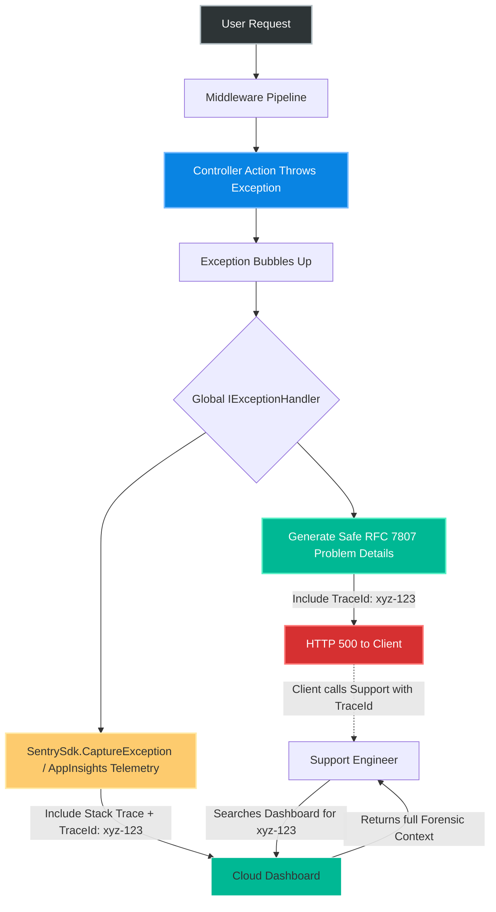

# 4.184 — Error Monitoring Integration: Sentry, Raygun, and Application Insights

## PART 0 — Navigation & Context

```text
ASP.NET Core Domain Hierarchy
├── Cross-Cutting Concerns
│   ├── Error Handling Pipeline
│   │   ├── 4.177 UseExceptionHandler
│   │   └── 4.182 IExceptionHandler
│   └── Observability & Telemetry
│       ├── 4.183 Correlation IDs
│       ├── 4.184 Error Monitoring (Sentry/App Insights) ◄ YOU ARE HERE
│       └── 4.297 OpenTelemetry
```

**What you need before this:**
- A rock-solid understanding of global exception handling using `UseExceptionHandler` or `.NET 8 IExceptionHandler` [[4.182 — Global Exception Handler (.NET 8): IExceptionHandler Interface]].
- Understanding of Correlation IDs (`TraceId`) to link HTTP requests to logs [[4.183 — Correlation IDs: Request Tracing Across Service Boundaries]].
- Familiarity with the `ILogger` framework and structured logging concepts [[4.025 — Structured Logging: Log Templates and Semantic Values]].

**What this unlocks after:**
- Transitioning from writing applications that crash silently to writing self-reporting systems that automatically page on-call engineers with rich diagnostic context when a specific subset of users experiences catastrophic failures.
- Implementing Distributed Tracing and OpenTelemetry.

**Why this matters to a production engineer at scale:**
When you build an API, you must adhere to the fundamental rule of production error handling: **Never expose stack traces to the client.** You return an HTTP 500 Problem Details response with a generic message.
However, if the client receives a generic "Internal Server Error," how do *you*, the developer, actually fix the bug? You cannot reproduce the bug locally because it only happens in production under heavy load for a specific user.
This is where Application Performance Monitoring (APM) and Error Tracking tools like Sentry, Raygun, and Azure Application Insights come in. They sit on the server, intercepting the exception *before* it is suppressed and converted to JSON. They capture the stack trace, the HTTP headers, the user's ID, the exact route matched, and even the SQL queries executed right before the crash. They bundle this into a massive forensic payload and send it to a cloud dashboard. 
A senior engineer understands how to integrate these tools into the ASP.NET Core pipeline without causing "Double Reporting" (logging the same error 3 times), without violating GDPR/HIPAA by logging Personally Identifiable Information (PII), and without introducing crippling performance bottlenecks on the exception path.

---

## PART 1 — The Core Mental Model

> **The Fundamental Rule**
> **Error monitoring tools (Sentry, Raygun, App Insights) capture unhandled exceptions server-side alongside rich request context. They must be integrated at the highest level of the pipeline—typically via a dedicated middleware or directly inside the `IExceptionHandler` implementation. They log the comprehensive forensic details to an external dashboard, while the framework simultaneously writes a sanitized RFC 7807 Problem Details JSON response to the HTTP client. The bridge between the two is the `TraceId`: the client sees the `TraceId` in their JSON, and the developer searches the monitoring dashboard for that exact `TraceId` to find the stack trace.**

**The Plain-Language Analogy**
Imagine a high-end restaurant.
A chef accidentally burns a steak (an Exception occurs in the Controller).
If the waiter carries the burned steak to the customer and says, "Look at this ruined steak, it was cooked at 400 degrees by Chef John using pan #4" — that is a security leak (`UseDeveloperExceptionPage`).
Instead, the waiter apologizes to the customer, hands them a coupon for a free meal, and says, "I'm sorry, we experienced an issue. Your complaint ticket is #889" (HTTP 500 Problem Details with `traceId: 889`).
Simultaneously, the Kitchen Manager takes a photo of the burned steak, writes down the exact pan temperature, logs Chef John's name, and files it in the **Restaurant Management Database** under ticket #889.
Sentry / Application Insights is the Kitchen Manager. It gathers the forensics internally so the business can fix the process, while keeping the customer's experience clean and generic.

**The Taxonomy Diagram**



---

## PART 2 — Deep Mechanics

### 2.1 — Pipeline Integration Points
There are three ways an exception gets tracked by APM tools in ASP.NET Core:
1. **Automatic SDK Middleware:** You call `app.UseSentryTracing()` at the top of the pipeline. It catches unhandled exceptions, logs them, and rethrows them to the Exception Handler.
2. **`ILogger` Provider Integration:** Sentry and App Insights often plug directly into the `Microsoft.Extensions.Logging` framework. If you call `_logger.LogError(ex, "Failed")`, the logging provider automatically forwards it to the cloud.
3. **Manual Capture in `IExceptionHandler`:** You explicitly invoke the SDK (e.g., `SentrySdk.CaptureException(ex)`) inside your centralized error handler. This is the most deterministic and flexible approach.

### 2.2 — Azure Application Insights
Microsoft's native APM tool. It is tightly integrated with the `.NET` runtime and automatically captures SQL queries, HTTP calls, and unhandled exceptions.

```csharp
// Program.cs Registration
builder.Services.AddApplicationInsightsTelemetry();

// Adding custom properties (like the Correlation ID) to every tracked event
public sealed class CorrelationTelemetryInitializer : ITelemetryInitializer
{
    public void Initialize(ITelemetry telemetry)
    {
        // Enrich the telemetry payload with the standard W3C TraceId
        if (telemetry is ISupportProperties props &&
            Activity.Current?.TraceId.ToString() is { } traceId)
        {
            props.Properties["traceId"] = traceId;
        }
    }
}

// Register the initializer
builder.Services.AddSingleton<ITelemetryInitializer, CorrelationTelemetryInitializer>();
```
*Note: If you use the standard `UseExceptionHandler`, App Insights automatically captures the unhandled exception before the handler suppresses it.*

### 2.3 — Sentry
A highly popular cross-platform error tracking tool known for its exceptional UI and breadcrumb tracking.

```csharp
// Program.cs Registration
builder.WebHost.UseSentry(options =>
{
    options.Dsn = builder.Configuration["Sentry:Dsn"];
    
    // Performance monitoring (Tracing)
    options.TracesSampleRate = 0.1; // Capture 10% of standard requests
    
    // SECURITY: Do not send default PII (like server names or username strings)
    options.SendDefaultPii = false; 
});

var app = builder.Build();

// Must be the first middleware to capture routing timing
app.UseSentryTracing(); 
```

Manual capture inside an `.NET 8 IExceptionHandler`:
```csharp
public async ValueTask<bool> TryHandleAsync(HttpContext ctx, Exception ex, CancellationToken ct)
{
    // Manually push to Sentry, explicitly linking it to the current TraceId
    SentrySdk.CaptureException(ex, scope => 
    {
        scope.SetTag("trace_id", ctx.TraceIdentifier);
        scope.SetExtra("request_path", ctx.Request.Path);
    });

    // Write safe Problem Details to client
    await WriteProblemDetailsAsync(ctx, ex);
    
    return true; // Stop bubbling
}
```

### 2.4 — Raygun
Raygun operates similarly to Sentry but focuses heavily on Crash Reporting.
```csharp
builder.Services.AddRaygun(builder.Configuration, options =>
{
    options.ApiKey = "YOUR_API_KEY";
    options.CatchUnhandledExceptions = false; // We will handle it manually in IExceptionHandler
});
```

### 2.5 — The Avoidance of Duplicate Capture
The most common mistake when integrating APMs is generating 3 tickets for a single error.
- The `ILogger` logs an error (Ticket 1).
- The `SentryMiddleware` catches the thrown exception (Ticket 2).
- The `IExceptionHandler` manually calls `SentrySdk.CaptureException` (Ticket 3).

To fix this, you must choose ONE unified capture strategy. If you rely on `ILogger` forwarding, do not manually capture. If you rely on manual capture inside your Handler, configure Sentry/App Insights to ignore automatically tracked exceptions, or filter out specific `ILogger` categories.

### 2.6 — PII and Compliance (GDPR / HIPAA)
If your application handles healthcare or financial data, sending an exception to Sentry might inadvertently send a `PatientName` or a `CreditCardNumber` if that data was part of the HTTP Request Body or the Exception Message.
All APMs provide a hook (e.g., `BeforeSend`) to scrub data before it leaves your server.

---

## PART 3 — Production Code Patterns

### Pattern 1: The Unified `.NET 8` Handler (Fintech Grade)
This pattern assumes you have disabled Sentry's automatic unhandled exception tracking, relying entirely on your global handler to ensure exactly ONE event is sent, perfectly correlated.

```csharp
public sealed class GlobalMonitoringExceptionHandler : IExceptionHandler
{
    private readonly ILogger<GlobalMonitoringExceptionHandler> _logger;
    private readonly IProblemDetailsService _problemDetails;

    public GlobalMonitoringExceptionHandler(ILogger<GlobalMonitoringExceptionHandler> logger, IProblemDetailsService problemDetails)
    {
        _logger = logger;
        _problemDetails = problemDetails;
    }

    public async ValueTask<bool> TryHandleAsync(HttpContext ctx, Exception ex, CancellationToken ct)
    {
        var traceId = ctx.TraceIdentifier;

        // 1. Structured Logging (Local/Seq/Splunk)
        using (_logger.BeginScope(new Dictionary<string, object>
        {
            ["traceId"] = traceId,
            ["path"] = ctx.Request.Path.Value
        }))
        {
            _logger.LogError(ex, "An unhandled exception occurred during request processing.");
        }

        // 2. APM Capture (Sentry)
        SentrySdk.CaptureException(ex, scope =>
        {
            scope.SetTag("trace_id", traceId);
            // DO NOT attach ctx.Request.Body here, it may contain PII passwords.
        });

        // 3. Client Response (RFC 7807)
        var problem = new ProblemDetails
        {
            Status = StatusCodes.Status500InternalServerError,
            Title = "An internal error occurred.",
            Extensions = { ["traceId"] = traceId }
        };

        ctx.Response.StatusCode = 500;
        await ctx.Response.WriteAsJsonAsync(problem, ct);

        return true;
    }
}
```

### Pattern 2: E-Commerce Release Tagging
When an exception occurs, how do you know if it was caused by the deployment that happened 5 minutes ago? You must tag every captured exception with the Assembly Version or Git Commit Hash.

```csharp
// Sentry Configuration
options.Release = Assembly.GetExecutingAssembly()
    .GetCustomAttribute<AssemblyInformationalVersionAttribute>()?.InformationalVersion;

// Now, in the Sentry dashboard, you can filter errors by "Release = v1.4.2"
// and Sentry will automatically calculate "New Issues introduced in this release".
```

### Pattern 3: Filtering Domain Exceptions
If a user tries to withdraw more money than they have, your domain throws an `InsufficientFundsException`. You map this to an HTTP 409 Conflict.
Is this an "Error"? No. It's a business rule violation. You DO NOT want this showing up in Sentry as a critical application crash.

```csharp
public async ValueTask<bool> TryHandleAsync(HttpContext ctx, Exception ex, CancellationToken ct)
{
    if (ex is DomainConflictException conflictEx)
    {
        // 1. Log as WARNING (Not Error)
        _logger.LogWarning("Business rule violation: {Message}", conflictEx.Message);
        
        // 2. DO NOT call SentrySdk.CaptureException!
        
        // 3. Return 409 to client
        return await WriteProblemDetailsAsync(ctx, 409, conflictEx.Message);
    }
    
    // Fall through to 500 handling...
}
```

### Pattern 4: Scrubbing PII in Sentry (`BeforeSend`)
```csharp
builder.WebHost.UseSentry(options =>
{
    options.BeforeSend = @event =>
    {
        // Strip out any accidental Credit Card formats from Exception Messages
        if (@event.Exception?.Message.Contains("Card:") == true)
        {
            var cleanMessage = Regex.Replace(@event.Exception.Message, @"\d{4}-\d{4}-\d{4}-\d{4}", "****-****-****-****");
            // Mutate the event before it leaves the server
        }
        return @event; 
    };
});
```

---

## PART 4 — Gotchas & Anti-Patterns

### Gotcha 1: Double / Triple Reporting
You install the Sentry SDK. You also write `_logger.LogError(ex, "Failed")` in your controller. You also have an Exception Filter.
Because Sentry hooks into the `ILogger` provider AND injects a middleware, that single exception generates 3 identical tickets in Sentry, consuming your quota and confusing operators.
**Fix:** Understand exactly which integration hooks you are using. Usually, relying on the automatic middleware OR the `ILogger` provider is enough. Disable the others.

### Gotcha 2: Swallowing Exceptions Before APM Catches Them
If you write a `try/catch` block in your controller, return a `StatusCode(500, "Oops")`, and do NOT log the exception, the APM middleware will never see the exception. The application failed, the user got a 500, but your Sentry dashboard is completely empty and green.
**Fix:** Never swallow exceptions. If you catch an exception to return a custom response, you MUST manually log it or capture it via the APM SDK before returning.

### Gotcha 3: Leaving `SendDefaultPii = true` in Production
By default, some APMs might attach the server's Environment Variables, the user's IP address, or the currently authenticated User's Claims (including email addresses) to the error payload. If your application falls under GDPR (Europe) or HIPAA (US Healthcare), sending this data to a third-party SaaS provider without a strict Data Processing Agreement is a massive legal violation. Always start with `SendDefaultPii = false` and explicitly opt-in to the specific contextual tags you need (like `UserId` if it's an opaque GUID).

### Gotcha 4: Alert Fatigue
You configure App Insights to send a PagerDuty alert to your phone every time an Exception occurs. A bot scans your API looking for vulnerabilities, generating 500 `ArgumentException`s per minute. Your phone rings all night.
**Fix:** Tune your alerts. Do not alert on absolute exception counts. Alert on *Exception Rate* (e.g., > 5% of requests failing in a 5-minute window) or on specific critical exception types (`SqlException`).

---

## PART 5 — Performance Implications

### Request Pipeline Characteristics

| APM Operation | Execution Speed | I/O Bound? | Impact |
|---|---|---|---|
| Happy Path Tracing (Sampled) | ~0.5ms | No (Batched in background) | Negligible. |
| Capturing an Exception | ~2ms - 10ms | Yes (Network HTTP POST to SaaS) | High overhead on the specific request. |

**Performance Verdict:**
APM tools execute their heavy network calls (sending the payload to the cloud) in background threads asynchronously (`ValueTask` or detached tasks). They will not block the HTTP response from returning to the client. The overhead of gathering the stack trace and serializing the payload takes a few milliseconds, which is perfectly acceptable on an exception path (since the request has already failed).

---

## PART 6 — Interview Arsenal

### A. The Question Bank

**Question 1:** "A user calls support saying they got an 'Internal Server Error' when trying to check out. Our global exception handler returned a generic Problem Details JSON. How do we configure our system so the support engineer can find out exactly what went wrong for that specific user?"
- **Average Answer:** "We look through the server logs to find the error at that timestamp."
- **Why That's Insufficient:** Searching by timestamp in a distributed system with 10,000 requests per second is impossible.
- **Great Answer:** "We must implement Correlation IDs and an APM integration like Application Insights or Sentry. The global exception handler must extract the `HttpContext.TraceIdentifier` and include it in the generic JSON response sent to the client. Simultaneously, the handler captures the full Exception stack trace and pushes it to Sentry, explicitly tagging the event with that exact same `TraceIdentifier`. The user reads the TraceId from their screen to support, and support searches Sentry for that ID, instantly pulling up the exact stack trace, route data, and SQL query that failed."

**Question 2:** "Our API throws `ValidationException` when a user inputs a bad email address, and `InsufficientFundsException` when they overdraw their account. Our Sentry dashboard is completely flooded with these errors, making it hard to find real bugs. What is the architectural flaw here?"
- **Average Answer:** "You need to filter them out in Sentry."
- **Why That's Insufficient:** Treats the symptom, not the cause. Domain rule violations shouldn't be thrown as 500-level crashes.
- **Great Answer:** "The flaw is treating expected business logic violations as critical application crashes. A `ValidationException` is an HTTP 400. An `InsufficientFundsException` is an HTTP 409. These are expected control-flow outcomes. Our global `IExceptionHandler` should intercept these specific domain exceptions, map them to 4xx status codes, and return them WITHOUT calling `SentrySdk.CaptureException`. Sentry should be reserved strictly for unexpected 5xx errors (like NullReferenceExceptions or Database Timeouts) that indicate actual bugs in the code."

**Question 3:** "If you configure an APM to capture exceptions, why might it be a severe security risk to allow it to automatically capture the HTTP Request Body?"
- **Average Answer:** "Because the request body is too large and costs money."
- **Why That's Insufficient:** Misses the critical legal/compliance angle.
- **Great Answer:** "Capturing the raw HTTP Request Body is a massive security and compliance risk because bodies frequently contain Personally Identifiable Information (PII) such as passwords, credit card numbers, or social security numbers. If the APM captures this and sends it to a third-party dashboard, you have leaked secure data into plaintext logs, violating PCI-DSS, HIPAA, or GDPR. You should always disable body capture or use strict `BeforeSend` scrubbing filters."

### B. The Trick Questions

**Trick Question:** "I have `app.UseDeveloperExceptionPage()` enabled on my local machine. I also configured Sentry. When an exception occurs locally, Sentry doesn't log anything. Why?"
- **The Trap:** Misunderstanding how the Developer Exception Page interacts with exceptions.
- **The Correct Answer:** "The `UseDeveloperExceptionPage` is a terminal middleware. When it catches an exception, it generates the HTML response and marks the exception as 'handled', preventing it from bubbling further up the pipeline. If the Sentry automatic middleware is registered *above* the Dev Page, it never sees the exception because the Dev Page swallowed it. To fix this, you either test Sentry by disabling the Dev Page, or you explicitly capture the exception via the `ILogger` which Sentry integrates with."

### C. Red Flags to Avoid
- 🚩 **"I use `try/catch` everywhere so my app never crashes, and I just return 200 OK with `success: false`."** (This defeats the entire purpose of APMs. The APM will never know an error occurred, and your metrics will show a 100% success rate while your users are entirely broken).

---

## PART 7 — Decision Framework

```mermaid
graph TD
    A[Designing Observability] --> B{What kind of Exception occurred?}
    
    B -->|Domain Rule Violation| C[Mapped to HTTP 400/409/422]
    C --> D[Log as Warning]
    D --> E[Do NOT send to APM]
    
    B -->|Unexpected Code Bug / DB Timeout| F[Mapped to HTTP 500]
    F --> G[Extract TraceId]
    
    G --> H[Log as Critical/Error]
    G --> I[Capture to Sentry/AppInsights with TraceId]
    
    I --> J[Return generic JSON Problem Details with TraceId]
    
    style A fill:#2d3436,stroke:#fff
    style C fill:#0984e3,stroke:#fff
    style E fill:#00b894,stroke:#fff
    style F fill:#d63031,stroke:#fff
    style I fill:#d63031,stroke:#fff
    style J fill:#00b894,stroke:#fff
```



---

## PART 8 — Self-Check

### A. Conceptual Questions
1. What is the primary purpose of an APM tool like Sentry or Application Insights?
2. How do you link a generic HTTP 500 response seen by a client to a specific stack trace in your APM dashboard?
3. Why is it an anti-pattern to send Domain Exceptions (like `RuleViolationException`) to your error monitoring tool?
4. Explain the concept of "Double Reporting" in the context of `ILogger` and APM SDKs.
5. What does the `SendDefaultPii` configuration option do, and why should it default to false?
6. How does tagging an error with a "Release Version" help operations teams?
7. Where in the middleware pipeline should automatic APM tracing middleware (like `UseSentryTracing()`) be placed?
8. Why shouldn't you log the raw HTTP Request Body when an exception occurs on a login endpoint?

### B. Code Puzzles

**Puzzle 1: The Missing Context**
```csharp
public async ValueTask<bool> TryHandleAsync(HttpContext ctx, Exception ex, CancellationToken ct) {
    SentrySdk.CaptureException(ex);
    await ctx.Response.WriteAsJsonAsync(new { Error = "Crash", Trace = ctx.TraceIdentifier });
    return true;
}
```
*Scenario:* A client reports a crash with TraceId `88x`. You open Sentry. You see 500 crashes from today. None of them have `88x` attached to them. Why?
<details>
<summary>Answer</summary>
You captured the exception, but you did not explicitly attach the `TraceIdentifier` to the Sentry scope. You must use the overloaded `CaptureException` method that accepts a `scope` configuration action, and call `scope.SetTag("traceId", ctx.TraceIdentifier)`. Without this, Sentry generates its own internal Event ID, breaking correlation.
</details>

**Puzzle 2: The Swallowed Nightmare**
```csharp
[HttpGet]
public IActionResult GetData() {
    try {
        throw new Exception("Database Corrupt");
    } catch {
        return StatusCode(500, "Oops");
    }
}
```
*Scenario:* Your app crashes 100 times a day, but Application Insights reports 0 exceptions. Why?
<details>
<summary>Answer</summary>
The `catch` block swallowed the exception. Application Insights automatic collection relies on exceptions bubbling up to the top of the middleware pipeline. Because you caught the exception and returned a normal `StatusCodeResult`, the framework thinks the request was successful (even though the status code is 500). APMs do not magically know when a `catch` block executes unless you explicitly log it.
</details>

**Puzzle 3: The HIPAA Violation**
```csharp
SentrySdk.ConfigureScope(scope => {
    scope.User = new User { Email = currentUser.Email, Id = currentUser.Id };
});
```
*Scenario:* You deploy this to a medical records API. The compliance officer runs an audit and threatens to shut down the project. Why?
<details>
<summary>Answer</summary>
You attached the user's `Email` to every Sentry error payload. An email address is Personally Identifiable Information (PII). Sending PII to a third-party logging provider without explicit encryption and data processing agreements violates compliance frameworks. You should only send opaque identifiers (like a Guid `Id`), never emails or names.
</details>

---

## PART 9 — Connections & Resources

### A. Related Topics Table

| Topic | Why It Connects |
|---|---|
| [[4.182 — Global Exception Handler (.NET 8): IExceptionHandler Interface]] | The modern architectural location where manual APM capture logic should physically reside. |
| [[4.183 — Correlation IDs: Request Tracing Across Service Boundaries]] | Explains where `TraceId` comes from and how it propagates. |
| [[4.025 — Structured Logging: Log Templates and Semantic Values]] | Explains how `ILogger` acts as a middleman between your code and the APM SDK. |

### B. Books

| Book | Chapters | Why These Chapters |
|---|---|---|
| Pro ASP.NET Core 6 | Chapter 14: Error Handling | Discusses integrating external logging providers. |
| Microservices in .NET, 2nd Ed | Chapter 10: Observability | Excellent breakdown of distributed tracing vs error monitoring in microservices. |

### C. Essential Articles & Docs
- [Sentry Docs: ASP.NET Core Integration](https://docs.sentry.io/platforms/dotnet/guides/aspnetcore/)
- [Microsoft Docs: Application Insights for ASP.NET Core](https://learn.microsoft.com/en-us/azure/azure-monitor/app/asp-net-core)
- [RFC 7807: Problem Details for HTTP APIs](https://datatracker.ietf.org/doc/html/rfc7807)

> [!NOTE]
> **Template Meta-Note**
> Part 0: Context & Prerequisites. Part 1: Core Mental Model. Part 2: Deep Mechanics & Pipeline. Part 3: Production Code. Part 4: Gotchas. Part 5: Performance. Part 6: Interview Arsenal. Part 7: Decision Framework. Part 8: Puzzles. Part 9: Resources.
