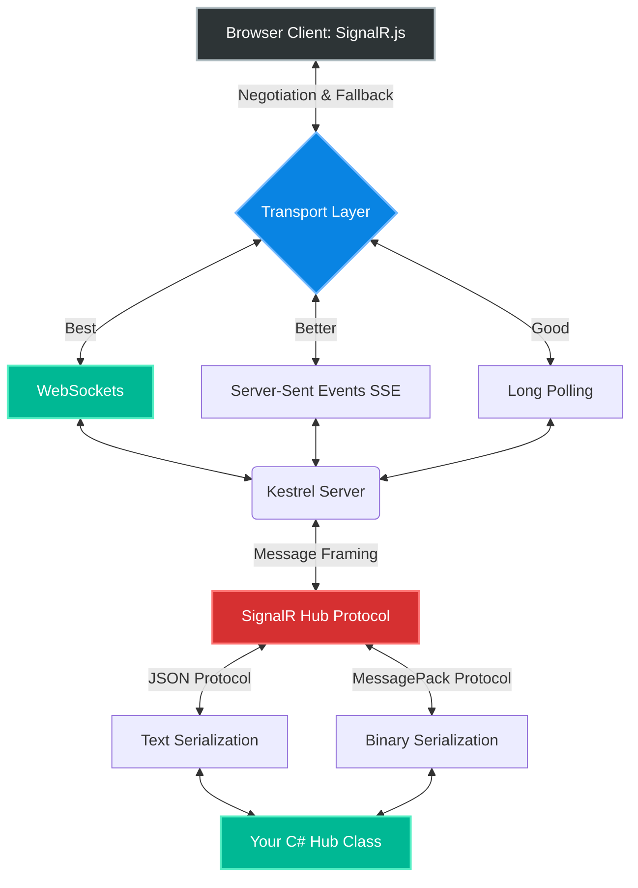

# 4.184 — SignalR Architecture & Transports

## PART 0 — Navigation & Context

```text
ASP.NET Core Domain Hierarchy
├── RPC & Messaging
│   ├── 4.180 gRPC Fundamentals & Protobuf
│   └── 4.181 gRPC Server Implementation
├── Real-Time Communications
│   ├── 4.184 SignalR Architecture & Transports ◄ YOU ARE HERE
│   ├── 4.185 SignalR Hubs & Group Management
│   └── 4.186 SignalR Scaling with Redis Backplane
└── Core Architecture
```

**What you need before this:**
- Understanding of the HTTP/1.1 request/response lifecycle.
- Basic knowledge of what a WebSocket is.

**What this unlocks after:**
- Building live-updating dashboards and multiplayer games using [[4.185 — SignalR Hubs & Group Management]].
- Scaling real-time web applications to millions of users using [[4.186 — SignalR Scaling with Redis Backplane]].

**Why this matters to a production engineer at scale:**
Traditional HTTP is stateless and unidirectional: the client asks for data, the server responds, and the connection closes. If a server wants to tell a browser "Your Uber driver has arrived", it can't—because the server cannot initiate a connection to a browser. For years, developers "faked" this using Long Polling (the browser asking "Are they here yet?" every 2 seconds), which crushed server CPUs. 
Then **WebSockets** were invented, allowing true, bi-directional, persistent TCP connections between browsers and servers. However, raw WebSockets are incredibly difficult to manage at scale: they drop constantly, corporate firewalls block them, and they don't have a concept of "calling a method"—they just pass raw bytes.
**SignalR** is Microsoft's abstraction over WebSockets. It handles connection negotiation, automatic fallbacks (if WebSockets are blocked), reconnection logic, and serialization. It allows a C# server to literally execute a JavaScript function inside a user's browser as if it were local code.

---

## PART 1 — The Core Mental Model

> **The Fundamental Rule**
> **SignalR is not a protocol; it is an abstraction layer that negotiates the best available underlying transport protocol (WebSockets, Server-Sent Events, or Long Polling) to establish a persistent connection, and then wraps that connection in an RPC (Remote Procedure Call) framework so the Server and Client can invoke methods on each other seamlessly.**

**The Plain-Language Analogy**
Imagine you want to have a real-time conversation with a friend in another country.
**Raw WebSockets:** You build a custom radio tower, tune to a specific frequency, and learn Morse Code. It works perfectly, but if the wind blows the antenna down, you have to rebuild it yourself. If your friend's country bans radio waves, you can't communicate.
**SignalR:** You hire an assistant (SignalR). You tell the assistant: "Tell my friend I said Hello." The assistant tries to FaceTime them (WebSockets). If their internet is too slow, the assistant falls back to a phone call (Server-Sent Events). If they don't have a phone, the assistant writes letters really fast (Long Polling). You don't care *how* the assistant delivers the message, you just care that your friend receives the exact phrase "Hello".

**The Taxonomy Diagram**



---

## PART 2 — Deep Mechanics

### 1. The Three Transports
When a SignalR client connects, it sends an HTTP POST request to `/hub/negotiate`. The server responds with the transports it supports.
1. **WebSockets (The Gold Standard):** A persistent, bi-directional, full-duplex TCP connection. The HTTP connection is "upgraded" to a WebSocket. Zero HTTP overhead per message.
2. **Server-Sent Events (SSE):** If a corporate proxy blocks WebSockets, SignalR falls back to SSE. SSE is an open HTTP connection where the server streams data down to the client. It is *unidirectional* (Server -> Client). If the client needs to send data up, it makes standard HTTP POST requests in the background.
3. **Long Polling (The Last Resort):** If SSE is blocked, it falls back to Long Polling. The client sends an HTTP GET. The server holds the request open (doesn't respond) until it has data to send. Once it sends data, the connection closes, and the client instantly sends another GET request to wait again. 

### 2. The Hub Protocol
Raw WebSockets just send arrays of bytes. To allow C# to call a JavaScript function `receiveMessage("John")`, SignalR uses a **Hub Protocol**.
A Hub Protocol structures the raw bytes into a defined envelope.
- `Type 1`: Invocation (Call a method).
- `Type 2`: StreamItem (Part of a data stream).
- `Type 3`: Completion (Method finished).

### 3. Serialization Formats
SignalR supports two serializers for the Hub Protocol:
1. **JSON:** The default. Human-readable, easy to debug in browser DevTools. Slower parsing, larger payload.
2. **MessagePack:** A binary serialization format. It is significantly faster and creates much smaller payloads than JSON. Requires a specific NuGet package and Javascript library to decode. Highly recommended for games or high-frequency trading dashboards.

---

## PART 3 — Production Code Patterns

### Pattern 1: Bootstrapping SignalR in Program.cs
Unlike older .NET Framework versions, SignalR in ASP.NET Core is built natively into Kestrel.

```csharp
// Program.cs
var builder = WebApplication.CreateBuilder(args);

// 1. Add SignalR Services to DI
builder.Services.AddSignalR(options =>
{
    // Global Hub Options
    options.EnableDetailedErrors = builder.Environment.IsDevelopment();
    options.KeepAliveInterval = TimeSpan.FromSeconds(15); // Server pings client to keep TCP open
    options.ClientTimeoutInterval = TimeSpan.FromSeconds(30); // If client doesn't respond in 30s, drop them
});

var app = builder.Build();

app.UseRouting();

// 2. Map the Hub to a specific URL route
app.MapHub<ChatHub>("/chatHub", options =>
{
    // ✅ CORRECT: You can explicitly restrict transports if needed 
    // (e.g., forcing WebSockets only to save server CPU)
    options.Transports = HttpTransportType.WebSockets | HttpTransportType.LongPolling;
});

app.Run();
```

### Pattern 2: The JavaScript Client (Negotiation)
The client-side code that initiates the transport negotiation.

```javascript
// index.js (Using @microsoft/signalr npm package)
const connection = new signalR.HubConnectionBuilder()
    .withUrl("/chatHub", {
        // Optional: Force a specific transport
        // skipNegotiation: true,
        // transport: signalR.HttpTransportType.WebSockets
    })
    .withAutomaticReconnect([0, 2000, 10000, 30000]) // Native reconnection logic!
    .configureLogging(signalR.LogLevel.Information)
    .build();

async function start() {
    try {
        await connection.start();
        console.log("SignalR Connected. Transport:", connection.connection.transport.name);
    } catch (err) {
        console.log("Connection Failed", err);
    }
}
```

### Pattern 3: Adding MessagePack Binary Protocol
To optimize bandwidth, you should switch from JSON to MessagePack.

```bash
# Server-side NuGet
dotnet add package Microsoft.AspNetCore.SignalR.Protocols.MessagePack

# Client-side npm
npm install @microsoft/signalr-protocol-msgpack
```

```csharp
// Program.cs (Server)
builder.Services.AddSignalR()
    .AddMessagePackProtocol(); // Enabled!
```

```javascript
// index.js (Client)
const connection = new signalR.HubConnectionBuilder()
    .withUrl("/chatHub")
    // ✅ CORRECT: Client requests MessagePack during negotiation
    .withHubProtocol(new signalR.protocols.msgpack.MessagePackHubProtocol()) 
    .build();
```

### Pattern 4: Handling WebSocket Disconnects
A WebSocket connection is fragile. Users close their laptops, switch from Wi-Fi to Cellular, or enter a tunnel. You must handle connection lifecycle events.

```csharp
public class ChatHub : Hub
{
    private readonly ILogger<ChatHub> _logger;
    public ChatHub(ILogger<ChatHub> logger) => _logger = logger;

    // Triggered instantly when the transport connects
    public override async Task OnConnectedAsync()
    {
        // Context.ConnectionId is a unique GUID generated for this specific TCP connection
        _logger.LogInformation("Client Connected: {ConnectionId}", Context.ConnectionId);
        await base.OnConnectedAsync();
    }

    // Triggered when the transport disconnects, OR when the ClientTimeoutInterval is breached
    public override async Task OnDisconnectedAsync(Exception? exception)
    {
        if (exception != null) {
            _logger.LogWarning(exception, "Client {ConnectionId} dropped abruptly.", Context.ConnectionId);
        } else {
            _logger.LogInformation("Client {ConnectionId} disconnected cleanly.", Context.ConnectionId);
        }
        
        await base.OnDisconnectedAsync(exception);
    }
}
```

---

## PART 4 — Gotchas & Anti-Patterns

### Gotcha 1: Reverse Proxy Configuration (NGINX/IIS)
WebSockets require specific HTTP headers (`Upgrade: websocket` and `Connection: Upgrade`) to tell the server to switch from HTTP to a persistent TCP stream.
If your ASP.NET Core app sits behind an NGINX reverse proxy, NGINX will drop these headers by default.

// HTTP consequence (wrong path):
// The SignalR client tries to connect via WebSockets. NGINX strips the Upgrade header. Kestrel receives a standard HTTP GET, refuses to upgrade, and drops the connection. SignalR falls back to Long Polling. Your server CPU spikes 10x higher because you are now serving thousands of Long Polling HTTP requests instead of persistent WebSockets.

// ✅ CORRECT CODE
```nginx
# NGINX Configuration REQUIRED for WebSockets
location /chatHub {
    proxy_pass http://localhost:5000;
    proxy_http_version 1.1;
    proxy_set_header Upgrade $http_upgrade; # Critical
    proxy_set_header Connection "upgrade";  # Critical
    proxy_set_header Host $host;
}
```

### Gotcha 2: The `skipNegotiation` Trap
Developers often read that skipping the `/negotiate` HTTP request speeds up the initial connection.

// ⚠️ WRONG CODE
```javascript
const connection = new signalR.HubConnectionBuilder()
    .withUrl("/chatHub", { skipNegotiation: true }) // Skips the initial HTTP POST
    .build();
```

// HTTP consequence (wrong path):
// 1. `skipNegotiation: true` ONLY works if the transport is strictly forced to WebSockets.
// 2. If a corporate firewall blocks WebSockets, the connection will completely fail, because the client skipped the negotiation phase where the server tells it how to fall back to Long Polling.
// 3. Furthermore, Azure SignalR Service relies heavily on the `/negotiate` endpoint to redirect the client to the Azure cloud. Skipping it breaks cloud scaling entirely.

// ✅ CORRECT CODE
// Leave `skipNegotiation` false unless you have absolute, total control over the client's network environment (e.g., an internal desktop app talking to a local server).

### Gotcha 3: The Sticky Sessions Requirement
If you scale out to 3 instances of your API behind an AWS Application Load Balancer, and you rely on Long Polling or Server-Sent Events.

// Scenario: 
// 1. Client connects via Long Polling. The initial request hits Server A.
// 2. The client's connection state is stored in Server A's RAM.
// 3. The client drops the connection and instantly makes the next Long Polling HTTP request.
// 4. The AWS Load Balancer routes the next request to Server B.
// 5. Server B says "I have no idea who you are" and returns a 404.

// ✅ CORRECT CODE
// If you use SignalR with multiple servers, and you allow Long Polling or SSE, your Load Balancer MUST be configured to use Sticky Sessions (Session Affinity). This ensures all HTTP requests from User X always go to Server A. 
// (Note: Raw WebSockets do not strictly require Sticky Sessions because they maintain a single continuous TCP connection, but the initial `/negotiate` HTTP request does).

---

## PART 5 — Performance Implications

### Request Pipeline Characteristics

| Transport | Connection Overhead | Latency | Server CPU Impact | Recommendation |
|---|---|---|---|---|
| WebSockets | 1 TCP Connection | Minimal (< 10ms) | Negligible | Always primary choice. |
| Server-Sent Events | 1 open HTTP request | Low | Low | Good fallback. |
| Long Polling | Continuous HTTP GETs | High (Wait times) | High (Request parsing) | Last resort for strict firewalls. |

### Memory Overhead of Connections
Every active SignalR connection (WebSocket) consumes RAM on the Kestrel server just to keep the TCP socket open and track the Hub Context. 
In .NET 8, a single idle WebSocket connection consumes roughly **2KB to 5KB** of memory.
- 10,000 concurrent users = ~50MB of RAM (Extremely efficient).
- 1,000,000 concurrent users = ~5GB of RAM.

**When to Care:** A single ASP.NET Core server can comfortably handle 100,000+ concurrent WebSocket connections. The bottleneck is rarely RAM; it is usually **Socket Exhaustion** (running out of ephemeral TCP ports on the OS) or the business logic executed *inside* the Hub methods.

---

## PART 6 — Interview Arsenal

### A. The Question Bank

**Question 1:** "What happens when a SignalR client attempts to connect, but the user is on a corporate network that explicitly blocks WebSocket traffic over port 443?"
- **Average Answer:** "The connection fails."
- **Why That's Insufficient:** Ignores the fundamental purpose of the SignalR abstraction.
- **Great Answer:** "The connection will succeed because of Transport Negotiation. When the client initiates the connection, it first sends an HTTP POST to `/hub/negotiate`. The server responds with all supported transports. The client attempts WebSockets first. When the firewall blocks the WebSocket upgrade, the SignalR client library automatically detects the failure and gracefully falls back to Server-Sent Events (SSE). If SSE is also blocked, it falls back to Long Polling. The application code doesn't change; SignalR handles the protocol downgrade transparently."

**Question 2:** "Why is it highly recommended to use MessagePack instead of JSON for a high-frequency SignalR application, like a live stock ticker?"
- **Average Answer:** "Because binary is faster."
- **Why That's Insufficient:** Needs to address payload size and serialization CPU cost.
- **Great Answer:** "JSON is a text-based format. It requires sending redundant string property names (like `\"StockPrice\": 150.00`) on every single message. If we stream 1,000 prices a second to 10,000 users, the network bandwidth becomes massive, and the server CPU spends immense cycles parsing and concatenating strings. MessagePack is a binary serialization format. It strips away the property names and encodes the data into a highly compressed byte array. By switching the SignalR Hub Protocol to MessagePack, we drastically reduce network bandwidth, eliminate string allocation overhead, and significantly reduce Latency."

**Question 3:** "If we deploy 3 instances of our SignalR application behind a standard Round-Robin load balancer, users complain that their connections keep dropping randomly. Why?"
- **Average Answer:** "Because they are hitting different servers."
- **Why That's Insufficient:** Doesn't explain *why* hitting different servers breaks SignalR's specific negotiation and fallback transports.
- **Great Answer:** "This is caused by the lack of Sticky Sessions (Session Affinity) on the Load Balancer. The SignalR connection begins with an HTTP POST to `/negotiate`. If Server A processes this, Server A stores the connection token in its local RAM. If the client then attempts to upgrade to WebSockets (or uses Long Polling), the load balancer might route that second HTTP request to Server B. Server B doesn't recognize the token and rejects the connection. To fix this, we must either enable Sticky Sessions on the load balancer (so all requests from one client hit the same server), or move to Azure SignalR Service."

### B. The Trick Questions

**Trick Question:** "If I use `skipNegotiation: true` to force WebSockets, do I still need Sticky Sessions on my load balancer?"
- **The Trap:** Understanding the difference between HTTP requests and TCP streams.
- **The Correct Answer:** "Surprisingly, no. If you force WebSockets and skip the `/negotiate` HTTP request, the client makes exactly one HTTP request (the Upgrade request). Once upgraded, it becomes a persistent TCP stream that stays locked to whatever server it initially hit. Because there are no subsequent HTTP requests to be misrouted by the load balancer, Sticky Sessions are no longer strictly required. However, this entirely breaks fallback mechanisms and cloud scaling, so it is rarely recommended."

### C. Red Flags to Avoid
- 🚩 **"I write my own JavaScript to manage the WebSocket connection."** (Reinventing SignalR's automatic reconnects, keep-alives, and protocol framing is a massive waste of time and usually results in brittle code).
- 🚩 **"I use SignalR for everything, even standard CRUD data fetches."** (WebSockets are expensive to keep open compared to transient HTTP requests. Use REST/gRPC for transactional fetches, and SignalR exclusively for server-pushed, real-time events).

---

## PART 7 — Decision Framework

```mermaid
graph TD
    A[Client to Server Communication] --> B{Does the Server need to push data to the Client?}
    
    B -->|No| C[Use REST or gRPC]
    B -->|Yes| D[Use SignalR]
    
    D --> E{Is the payload large or high-frequency?}
    E -->|No e.g. Chat App| F[Default JSON Protocol]
    E -->|Yes e.g. Stock Ticker| G[Switch to MessagePack Protocol]
    
    D --> H{Is the network highly controlled e.g. Internal Desktop App?}
    H -->|Yes| I[Force WebSockets, Skip Negotiation]
    H -->|No e.g. Public Mobile/Web| J[Allow Negotiation & Fallbacks]
    
    J --> K{Multiple API Servers?}
    K -->|Yes| L[Must Enable Sticky Sessions on Load Balancer]
    K -->|No| M[Standard Setup]
    
    style A fill:#2d3436,stroke:#fff
    style C fill:#0984e3,stroke:#fff
    style D fill:#00b894,stroke:#fff
    style G fill:#00b894,stroke:#fff
    style I fill:#0984e3,stroke:#fff
    style L fill:#d63031,stroke:#fff
```



---

## PART 8 — Self-Check

### A. Conceptual Questions
1. Why were WebSockets invented if HTTP/1.1 already existed?
2. What are the three transports SignalR uses, and in what order does it attempt them?
3. How does Server-Sent Events (SSE) differ from Long Polling?
4. What is the purpose of the `/hub/negotiate` endpoint?
5. Why is JSON considered slower than MessagePack for SignalR?
6. Why does NGINX default configuration break SignalR WebSockets?
7. What is `Context.ConnectionId` used for?
8. Why does SignalR require Sticky Sessions when deployed across multiple servers?

### B. Code Puzzles

**Puzzle 1: The Broken Reconnect**
```javascript
const connection = new signalR.HubConnectionBuilder()
    .withUrl("/chat")
    .build();
```
*Scenario:* If the user's Wi-Fi drops for 2 seconds, the app permanently stops receiving data until the user refreshes the page.
<details>
<summary>Answer</summary>
The JavaScript client requires explicit configuration to attempt reconnections.
*Fix:* Add `.withAutomaticReconnect()` to the builder chain.
</details>

**Puzzle 2: The Silent Drop**
```csharp
public override async Task OnDisconnectedAsync(Exception? exception) {
    if (exception == null) {
        Console.WriteLine("Clean disconnect");
    }
}
```
*Scenario:* A user closes their laptop lid. The server doesn't log anything for 30 seconds, and then `exception` is NOT null. Why?
<details>
<summary>Answer</summary>
When a laptop lid closes, the OS sleeps without sending a TCP FIN packet (it doesn't cleanly close the connection). The server thinks the client is still there. The server's `KeepAliveInterval` pings the client. After 30 seconds (`ClientTimeoutInterval`), the server realizes the client is gone and forcibly aborts the connection, passing a timeout Exception to the `OnDisconnectedAsync` method.
</details>

**Puzzle 3: The Unmapped Protocol**
```csharp
// Program.cs
builder.Services.AddSignalR().AddMessagePackProtocol();

// JavaScript
const connection = new signalR.HubConnectionBuilder()
    .withUrl("/chat")
    .build(); // Using default JSON protocol
```
*Scenario:* Does this crash?
<details>
<summary>Answer</summary>
No. The server supports BOTH JSON and MessagePack simultaneously. The client dictates which protocol it wants to use during the negotiation phase. Since the JS client didn't explicitly request MessagePack, it defaults to JSON, and the server gracefully responds in JSON.
</details>

---

## PART 9 — Connections & Resources

### A. Related Topics Table

| Topic | Why It Connects |
|---|---|
| [[4.185 — SignalR Hubs & Group Management]] | Explains what to actually write *inside* the Hub class you just mapped. |
| [[4.186 — SignalR Scaling with Redis Backplane]] | How to solve the Sticky Session and multi-server broadcasting problem. |
| [[4.033 — Kestrel Web Server]] | Understanding Kestrel's raw WebSocket handling capabilities. |

### B. Books

| Book | Chapters | Why These Chapters |
|---|---|---|
| SignalR on .NET Core | Chapter 2: The Transports | Deep dive into WebSocket vs SSE mechanics. |
| ASP.NET Core in Action, 3rd Ed | Chapter 24: Real-time communication | Excellent overview of Hub negotiation. |

### C. Essential Articles & Docs
- [Microsoft Docs: Introduction to SignalR](https://learn.microsoft.com/en-us/aspnet/core/signalr/introduction)
- [Microsoft Docs: SignalR MessagePack Hub Protocol](https://learn.microsoft.com/en-us/aspnet/core/signalr/messagepackhubprotocol)
- [David Fowler (Creator of SignalR): Deep dive into SignalR Architecture](https://github.com/davidfowl)

> [!NOTE]
> **Template Meta-Note**
> Part 0: Context & Prerequisites. Part 1: Core Mental Model. Part 2: Deep Mechanics & Pipeline. Part 3: Production Code. Part 4: Gotchas. Part 5: Performance. Part 6: Interview Arsenal. Part 7: Decision Framework. Part 8: Puzzles. Part 9: Resources.
