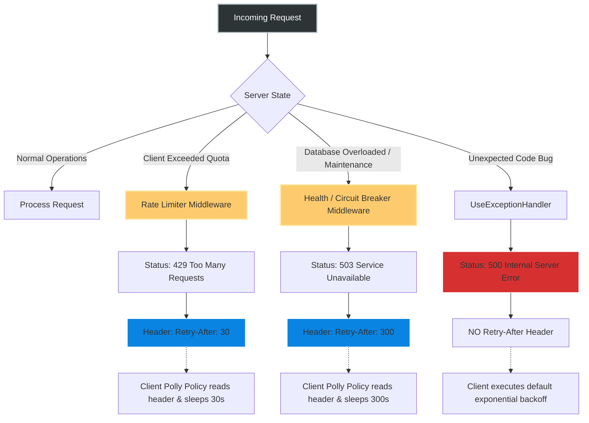

# 4.185 — Retry-After and Transient Error Signaling in HTTP Responses

## PART 0 — Navigation & Context

```text
ASP.NET Core Domain Hierarchy
├── Cross-Cutting Concerns
│   ├── Error Handling Pipeline
│   │   ├── 4.177 UseExceptionHandler
│   │   ├── 4.185 Transient Error Signaling (Retry-After) ◄ YOU ARE HERE
│   │   └── 4.199 Request Timeouts
└── Performance & Reliability
    └── 4.202 Rate Limiting
```

**What you need before this:**
- A solid understanding of global error handling and generating standard HTTP responses [[4.177 — Exception Handling Middleware: UseExceptionHandler and Error Pipelines]].
- Familiarity with the RFC 7807 standard for formatting errors [[4.179 — Problem Details RFC 7807: IProblemDetailsService]].
- Basic knowledge of Rate Limiting concepts [[4.202 — Rate Limiting (.NET 7+): Fixed Window, Sliding Window, Token Bucket]].

**What this unlocks after:**
- Building "Polite APIs" that tell consuming clients exactly how to behave during an outage, preventing localized database timeouts from cascading into a full-scale Denial of Service attack on your own infrastructure.
- Seamlessly integrating with resilience libraries like Polly on the client side.

**Why this matters to a production engineer at scale:**
When an API goes down or starts struggling under load, the natural reaction of modern client applications (React SPAs, mobile apps, other microservices) is to retry the request. If you have 100,000 clients attempting to check out an e-commerce cart, and your database gets locked for 10 seconds, all 100,000 clients will receive an HTTP 500 or timeout. They will immediately retry. That's 100,000 new requests hitting a database that is *already* struggling. This creates a "Retry Storm" (or Thundering Herd), which amplifies a 10-second blip into a 4-hour catastrophic outage requiring manual server restarts.
A senior backend engineer prevents this by utilizing HTTP Transient Error Signaling. Instead of just failing, the server detects that it is overloaded and starts returning HTTP 503 (Service Unavailable) or 429 (Too Many Requests), accompanied by the `Retry-After` header. This explicitly commands automated clients and API gateways: *"Back off for exactly 60 seconds."* If the clients respect this header, the traffic instantly drops to zero, allowing your database to recover gracefully.

---

## PART 1 — The Core Mental Model

> **The Fundamental Rule**
> **The `Retry-After` header is an HTTP standard mechanism used to advise clients when to attempt a retry after a transient failure. It is typically paired with HTTP 429 (Too Many Requests) when a specific client hits their quota, or HTTP 503 (Service Unavailable) when the entire server is undergoing maintenance or overload. ASP.NET Core's built-in Rate Limiter populates this automatically on 429s. For 503s, you must populate it manually in your middleware or endpoints to explicitly control the backoff period of your consumers.**

**The Plain-Language Analogy**
Imagine a highly popular nightclub.
When the club hits maximum capacity, the bouncer stands at the door.
**Without `Retry-After`:** The bouncer just yells "FULL!" at the crowd. The people waiting outside immediately push forward again and yell "How about now?". The bouncer yells "FULL!" again. The bouncer spends 100% of their energy fighting the crowd, preventing the actual club manager from fixing the broken AC unit inside.
**With `Retry-After`:** The bouncer puts up an electronic sign that says: "FULL. DO NOT RETURN FOR 15 MINUTES." The crowd disperses to a nearby bar and sets a timer. The front door is completely silent for 15 minutes. The club manager easily fixes the AC, and when the crowd returns, the club is ready.

**The Taxonomy Diagram**



---

## PART 2 — Deep Mechanics

### 2.1 — The RFC 7231 Standard
The `Retry-After` header accepts two specific formats. Do not deviate from these.

**Format 1: Delta-Seconds (Preferred)**
```http
Retry-After: 120
```
This tells the client to wait exactly 120 seconds. It is robust against clock skew between the client and the server.

**Format 2: HTTP-Date**
```http
Retry-After: Wed, 21 Oct 2026 07:28:00 GMT
```
This tells the client to wait until a specific absolute time. It is vulnerable to client clocks being out of sync, and requires strict formatting. Avoid it unless scheduling a long, known maintenance window.

### 2.2 — Status Code Pairings
`Retry-After` is technically valid on any response, but semantically, clients only look for it on specific status codes:
- **HTTP 503 (Service Unavailable):** The server is down, but the condition is temporary. Retry later.
- **HTTP 429 (Too Many Requests):** The user's specific rate limit bucket is empty. Wait until it refills.
- **HTTP 301 (Moved Permanently) / 302 (Found):** Sometimes used by browsers to delay following a redirect, though extremely rare in API design.

### 2.3 — Generating `Retry-After` via ASP.NET Core Rate Limiter
In .NET 7+, the `Microsoft.AspNetCore.RateLimiting` middleware handles 429 generation natively. However, you must explicitly configure the `OnRejected` callback to extract the retry window from the lease metadata and format it into the HTTP Header.

```csharp
builder.Services.AddRateLimiter(options =>
{
    // ... define rate limiter policies ...

    options.OnRejected = async (context, cancellationToken) =>
    {
        context.HttpContext.Response.StatusCode = 429;

        // 1. Check if the Limiter Lease provided a known retry window
        if (context.Lease.TryGetMetadata(MetadataName.RetryAfter, out var retryAfter))
        {
            // 2. Format as a string of total seconds
            var secondsString = ((int)retryAfter.TotalSeconds).ToString(CultureInfo.InvariantCulture);
            context.HttpContext.Response.Headers.RetryAfter = secondsString;
        }

        // 3. Always write a friendly Problem Details body too
        await context.HttpContext.Response.WriteAsJsonAsync(new ProblemDetails
        {
            Status = 429,
            Title = "Too Many Requests",
            Detail = "Rate limit exceeded. Please wait before retrying."
        }, cancellationToken);
    };
});
```

### 2.4 — Generating 503 for Maintenance Mode
If you are deploying a database migration and need to pause traffic for 5 minutes, you can write a tiny custom middleware to intercept all traffic at the very edge of the application and return a 503.

```csharp
app.Use(async (context, next) =>
{
    var maintenanceSettings = context.RequestServices.GetRequiredService<MaintenanceOptions>();
    
    if (maintenanceSettings.IsActive)
    {
        context.Response.StatusCode = 503;
        context.Response.Headers.RetryAfter = "300"; // 5 minutes
        
        await context.Response.WriteAsJsonAsync(new ProblemDetails
        {
            Status = 503,
            Title = "Service Maintenance",
            Detail = "We are currently performing scheduled maintenance."
        });
        return; // Short-circuit pipeline
    }
    
    await next();
});
```

---

## PART 3 — Production Code Patterns

### Pattern 1: Downstream Dependency Failure (503 Propagation)
If your API relies on a 3rd-party service (e.g., a Payment Gateway), and that gateway is returning 503s, you should not return a 500 to your mobile app. You should propagate the 503 and advise your mobile app to back off.

```csharp
[HttpPost("checkout")]
public async Task<IActionResult> Checkout(OrderDto dto)
{
    try
    {
        await _paymentGateway.ChargeAsync(dto);
        return Ok();
    }
    catch (GatewayUnavailableException) // Custom exception from your HTTP Client
    {
        // Tell our frontend to wait 30 seconds before letting the user click "Pay" again
        Response.Headers.RetryAfter = "30";
        return StatusCode(503, new ProblemDetails 
        { 
            Title = "Payment Gateway Offline", 
            Detail = "The payment processor is currently unavailable. Please try again in 30 seconds." 
        });
    }
}
```

### Pattern 2: Reading the Header (The Client Side)
Signaling only works if the client actually reads the header. If you are building an ASP.NET Core worker service that consumes another API, you must configure `Polly` to look for the `Retry-After` header.

```csharp
// Using Polly v8 Resilience Pipelines
builder.Services.AddHttpClient("InventoryClient")
    .AddResilienceHandler("custom-retry", builder =>
    {
        builder.AddRetry(new RetryStrategyOptions<HttpResponseMessage>
        {
            ShouldHandle = new PredicateBuilder<HttpResponseMessage>()
                .HandleResult(response => response.StatusCode == HttpStatusCode.TooManyRequests || 
                                          response.StatusCode == HttpStatusCode.ServiceUnavailable),
                                          
            // Dynamically calculate the delay based on the HTTP Response header!
            DelayGenerator = args =>
            {
                var response = args.Outcome.Result;
                if (response?.Headers.RetryAfter?.Delta.HasValue == true)
                {
                    // The server explicitly told us how long to wait
                    return new ValueTask<TimeSpan?>(response.Headers.RetryAfter.Delta.Value);
                }
                
                // Fallback to exponential backoff if the header is missing
                return new ValueTask<TimeSpan?>(TimeSpan.FromSeconds(Math.Pow(2, args.AttemptNumber)));
            }
        });
    });
```

### Pattern 3: Asynchronous Queuing (202 Accepted)
Sometimes, an operation takes so long that you don't want the client to wait on an open HTTP connection. You return a `202 Accepted` and provide a location to check the status. You can use `Retry-After` here to tell the client *when* to poll for the result.

```csharp
[HttpPost("generate-report")]
public IActionResult GenerateReport()
{
    var jobId = _backgroundJobClient.Enqueue(() => ...);
    
    // Check back in 10 seconds
    Response.Headers.RetryAfter = "10";
    
    return AcceptedAtAction("GetReportStatus", new { id = jobId }, new { Status = "Processing" });
}
```

---

## PART 4 — Gotchas & Anti-Patterns

### Gotcha 1: `Retry-After` on a 500 Internal Server Error
A developer puts a global Exception Filter in place that catches all `NullReferenceException` and `SqlException`s, returns 500, and blindly slaps a `Retry-After: 5` header on the response.
**Why this is dangerous:** A 500 error represents an unexpected code bug. If a user hits a URL that throws a `NullReferenceException`, waiting 5 seconds and hitting it again will *still* throw a `NullReferenceException`. You have just programmed your clients to repeatedly bash against a hard-broken endpoint forever.
**Fix:** Reserve `Retry-After` strictly for 503 (Overload/Maintenance) and 429 (Rate Limit). If an endpoint is fundamentally broken (500), clients should fail fast and give up.

### Gotcha 2: Integer Parsing and Culture Issues
```csharp
// ⚠️ WRONG CODE
context.Response.Headers["Retry-After"] = retryAfter.TotalSeconds.ToString();
```
If the server is running in a culture where commas are used for decimals (e.g., German `1,5`), and `TotalSeconds` is a `double`, the string will format incorrectly. `Retry-After` MUST be an integer according to RFC 7231.
**Fix:** Always cast to `int` and explicitly use `CultureInfo.InvariantCulture`.
```csharp
context.Response.Headers.RetryAfter = ((int)retryAfter.TotalSeconds).ToString(CultureInfo.InvariantCulture);
```

### Gotcha 3: The Header Casing Trap
HTTP headers are technically case-insensitive, but sometimes dictionaries require exact matches. In modern ASP.NET Core, avoid manually accessing the dictionary `Response.Headers["Retry-After"]`. Use the strongly typed property provided by the framework to ensure correctness:
`context.Response.Headers.RetryAfter = "60";`

### Gotcha 4: Webhook Integration Mismatches
You build a Webhook Receiver API. You return 429 with `Retry-After`. The 3rd party vendor sending the webhooks (e.g., Stripe or GitHub) completely ignores the header and aggressively retries using their own internal hardcoded 1-second backoff.
**Reality:** You cannot force external vendors to obey HTTP specs. You must design your system to handle aggressive retries even if you send the correct headers.

---

## PART 5 — Performance Implications

### Request Pipeline Characteristics

| Scenario | Network Impact | Infrastructure Impact |
|---|---|---|
| Returning 503 without Header | Extremely High | Clients retry instantly (0ms delay), saturating network connections and Kestrel threads. |
| Returning 503 + `Retry-After: 60` | Very Low | Client sleeps for 60s. Network connections drop. Load balancer completely unblocks. |

**Performance Verdict:**
Implementing `Retry-After` is one of the highest ROI (Return on Investment) performance optimizations you can make for system resilience. Appending a tiny string to an HTTP header costs exactly 0 CPU cycles, but it can drop inbound traffic volume by 99% during an incident, saving the entire database cluster from a cascading failure.

---

## PART 6 — Interview Arsenal

### A. The Question Bank

**Question 1:** "Our database cluster is struggling and queries are timing out. To protect the database, we wrote a middleware that returns HTTP 500 when CPU usage is over 90%. However, this didn't help; traffic actually increased. What did we do wrong?"
- **Average Answer:** "You shouldn't return 500, you should cache the data instead."
- **Why That's Insufficient:** Ignores HTTP semantics and the behavior of automated clients.
- **Great Answer:** "By returning a raw HTTP 500, modern clients (especially microservices using libraries like Polly) assume a transient network glitch and execute an immediate exponential backoff retry. You inadvertently created a retry storm. To protect the database, you must return an HTTP 503 Service Unavailable, and critically, you must include a `Retry-After` header (e.g., 30 seconds). This commands well-behaved clients to sleep, instantly shedding load and giving the database time to recover."

**Question 2:** "When using the ASP.NET Core 7+ Rate Limiter, does the framework automatically add the `Retry-After` header when a user gets rate-limited?"
- **Average Answer:** "Yes, it handles everything automatically."
- **Why That's Insufficient:** Assumes magic. The framework requires explicit mapping for this.
- **Great Answer:** "No, it does not do it completely automatically. The rate limiter rejects the request, but by default, it just returns a 503 or 429 status code. You must explicitly configure the `OnRejected` callback in the rate limiter options. Inside that callback, you extract the `RetryAfter` value from the `Lease` metadata and manually append it to `HttpContext.Response.Headers.RetryAfter`."

**Question 3:** "If we return `Retry-After: Wed, 21 Oct 2026 07:28:00 GMT`, what is a potential failure point on mobile clients?"
- **Average Answer:** "The timezone might be wrong."
- **Why That's Insufficient:** Doesn't grasp the fundamental issue with mobile device clocks.
- **Great Answer:** "Mobile clients are notorious for having wildly inaccurate local clocks because users change them to cheat in mobile games or they fail to sync with NTP. If the client clock is off by a few hours, evaluating an absolute HTTP-date will cause the client to either retry immediately (DDoS) or wait weeks before retrying (broken UX). It is universally safer to use the 'Delta-Seconds' format (e.g., `Retry-After: 120`), which is completely immune to client-side clock skew."

### B. The Trick Questions

**Trick Question:** "I have a login endpoint. When a user gets their password wrong 3 times, I return a 401 Unauthorized with a `Retry-After: 300` header to lock them out for 5 minutes. Is this the correct use of the header?"
- **The Trap:** Conflating application-level business lockout with HTTP-level transient state.
- **The Correct Answer:** "While creative, this violates HTTP semantics. `Retry-After` is designed for transient server state (503) or generic rate limiting (429). A 401 Unauthorized means the credentials are bad. If the user is locked out, you should return an HTTP 403 Forbidden (or 429 if treating it as brute-force protection), but business-level lockouts are usually better communicated via JSON in the response body rather than relying on HTTP headers that proxy servers might strip or misinterpret."

### C. Red Flags to Avoid
- 🚩 **"I use `Thread.Sleep(5000)` inside my controller to slow down bad clients."** (This is known as Tarpitting. While it annoys attackers, it consumes a Kestrel worker thread. If you tarpit 1000 requests, your server will exhaust its thread pool and crash. Always return 429 instantly with `Retry-After`).

---

## PART 7 — Decision Framework

```mermaid
graph TD
    A[Request Processing Fails] --> B{What caused the failure?}
    
    B -->|User exceeded API Quota| C[HTTP 429 Too Many Requests]
    C --> D[Calculate seconds until Bucket Refills]
    D --> E[Set Retry-After Header]
    
    B -->|Database/Downstream Offline| F[HTTP 503 Service Unavailable]
    F --> G[Set Retry-After Header to conservative guess e.g. 60s]
    
    B -->|Null Reference Bug| H[HTTP 500 Internal Server Error]
    H --> I[Do NOT set Retry-After]
    
    B -->|Missing Parameter| J[HTTP 400 Bad Request]
    J --> I
    
    style A fill:#2d3436,stroke:#fff
    style C fill:#0984e3,stroke:#fff
    style E fill:#00b894,stroke:#fff
    style F fill:#0984e3,stroke:#fff
    style G fill:#00b894,stroke:#fff
    style H fill:#d63031,stroke:#fff
```



---

## PART 8 — Self-Check

### A. Conceptual Questions
1. What are the two valid string formats for the `Retry-After` header according to the RFC?
2. Why is the Delta-Seconds format preferred over the HTTP-Date format?
3. Which two HTTP Status Codes are most commonly associated with the `Retry-After` header?
4. If a client receives a 500 Internal Server Error without a `Retry-After` header, how should it behave?
5. How do you extract the optimal retry time from the ASP.NET Core `.NET 7+` Rate Limiter lease?
6. Explain the concept of a "Retry Storm" and how this header prevents it.
7. Why shouldn't you append `Retry-After` to an HTTP 400 Bad Request response?
8. How do you configure a `Polly` HttpClient policy to read and obey the `Retry-After` header?

### B. Code Puzzles

**Puzzle 1: The Broken Format**
```csharp
var waitTimeSpan = TimeSpan.FromMinutes(2);
context.Response.Headers.RetryAfter = waitTimeSpan.ToString();
```
*Scenario:* Clients are crashing or ignoring the header. What is wrong with the string format?
<details>
<summary>Answer</summary>
`TimeSpan.ToString()` outputs formats like `00:02:00`. The RFC requires a simple integer string of seconds (e.g., `"120"`). 
*Fix:* `((int)waitTimeSpan.TotalSeconds).ToString()`
</details>

**Puzzle 2: The Eager Client**
```csharp
[HttpGet]
public IActionResult GetData() {
    Response.Headers.RetryAfter = "10";
    return StatusCode(200, "Success");
}
```
*Scenario:* You return a 200 OK, but with a `Retry-After` header to tell the client not to poll again for 10 seconds. Will browsers or standard HTTP clients respect this?
<details>
<summary>Answer</summary>
No. While it doesn't break the application, standard HTTP libraries (like `fetch` or `HttpClient`) only process `Retry-After` when they encounter a failure status code (429, 503) or a redirect (301). Returning it on a 200 OK is ignored. To control polling on a 200 OK, you should use standard JSON payloads (e.g., `{ "nextPollSeconds": 10 }`).
</details>

**Puzzle 3: The Rate Limiting Oversight**
```csharp
options.OnRejected = async (ctx, ct) => {
    ctx.HttpContext.Response.StatusCode = 429;
    await ctx.HttpContext.Response.WriteAsync("Rate limited");
};
```
*Scenario:* You configured the rate limiter, but clients are slamming the server constantly. Why aren't they backing off?
<details>
<summary>Answer</summary>
You overwrote the default rejection behavior but failed to explicitly extract `ctx.Lease` metadata and set the `Retry-After` header. Because the header is missing, automated clients assume they can retry immediately, creating massive load.
</details>

---

## PART 9 — Connections & Resources

### A. Related Topics Table

| Topic | Why It Connects |
|---|---|
| [[4.202 — Rate Limiting (.NET 7+): Fixed Window, Sliding Window, Token Bucket]] | The primary framework mechanism that generates the conditions where 429 and `Retry-After` are required. |
| [[4.177 — Exception Handling Middleware: UseExceptionHandler and Error Pipelines]] | Differentiates 500 errors (bugs) from 503 errors (transient overload), dictating when the header is appropriate. |
| [[4.179 — Problem Details RFC 7807: IProblemDetailsService]] | Explains how to format the JSON body that should accompany the 429/503 HTTP status code and header. |

### B. Books

| Book | Chapters | Why These Chapters |
|---|---|---|
| Release It! (Michael Nygard) | Chapter 5: Transient Failures | The definitive text on Retry Storms, Thundering Herds, and why explicit backoff signaling is mandatory in distributed systems. |
| ASP.NET Core in Action, 3rd Ed | Chapter 18: Security and Resilience | Discusses Polly and Rate Limiting interactions. |

### C. Essential Articles & Docs
- [RFC 9110: Retry-After Header](https://www.rfc-editor.org/rfc/rfc9110#section-10.2.3)
- [Microsoft Docs: Rate limiting middleware in ASP.NET Core](https://learn.microsoft.com/en-us/aspnet/core/performance/rate-limit)
- [Microsoft Docs: Implement HTTP call retries with exponential backoff with IHttpClientFactory and Polly policies](https://learn.microsoft.com/en-us/dotnet/architecture/microservices/implement-resilient-applications/implement-http-call-retries-exponential-backoff-polly)

> [!NOTE]
> **Template Meta-Note**
> Part 0: Context & Prerequisites. Part 1: Core Mental Model. Part 2: Deep Mechanics & Pipeline. Part 3: Production Code. Part 4: Gotchas. Part 5: Performance. Part 6: Interview Arsenal. Part 7: Decision Framework. Part 8: Puzzles. Part 9: Resources.
