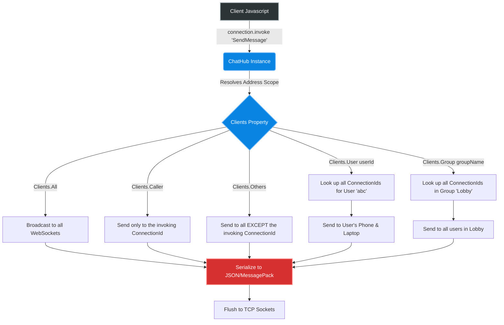

# 4.185 — SignalR Hubs & Group Management

## PART 0 — Navigation & Context

```text
ASP.NET Core Domain Hierarchy
├── RPC & Messaging
│   ├── 4.184 SignalR Architecture & Transports
│   ├── 4.185 SignalR Hubs & Group Management ◄ YOU ARE HERE
│   └── 4.186 SignalR Scaling with Redis Backplane
└── Advanced Middleware
```

**What you need before this:**
- Understanding of what a WebSocket is and how SignalR negotiates connections [[4.184 — SignalR Architecture & Transports]].
- Basic understanding of JWT Authentication in ASP.NET Core.

**What this unlocks after:**
- Building fully interactive, multi-room chat applications.
- Pushing real-time notifications from background worker services to specific users.
- Scaling this logic to multi-server clusters using a Redis Backplane [[4.186 — SignalR Scaling with Redis Backplane]].

**Why this matters to a production engineer at scale:**
Once you have an open WebSocket, you need to route messages. If you have 100,000 concurrent users connected to your stock trading platform, and Apple's stock price changes, you cannot broadcast that price change to all 100,000 users. That would destroy your server's CPU and flood the network. You only want to send the update to the 500 users who are actively looking at the Apple stock page.
SignalR solves this through **Hubs** and **Group Management**. It provides an incredibly elegant C# API to say: `Clients.Group("AAPL").SendAsync("PriceUpdated", newPrice)`. Furthermore, it maps anonymous WebSocket connections to authenticated User IDs, allowing you to seamlessly push messages to a specific authenticated user, regardless of whether they are logged in on their phone, their laptop, or both simultaneously.

---

## PART 1 — The Core Mental Model

> **The Fundamental Rule**
> **A SignalR Hub is a transient class (instantiated per-invocation, not per-connection) that acts as the high-level RPC pipeline between the server and connected clients. It manages addressing via four primary scopes: `All`, `Caller`, `User`, and `Group`.**

**The Plain-Language Analogy**
Imagine a gigantic Hotel (The Server) with thousands of Guests (Connected Clients).
- **The Hub:** The Intercom System.
- **Clients.All:** The General Manager presses the red button and announces to the entire hotel: *"The fire alarm is going off!"*
- **Clients.Caller:** The receptionist replies directly to the person on the phone: *"Yes, your room service is ordered."*
- **Clients.User("John"):** The concierge pages John: *"Mr. John, your taxi is here."* (Note: It rings the phone in John's room, John's cell phone, and John's smartwatch simultaneously, because John is logged into multiple devices).
- **Clients.Group("ConferenceRoom_A"):** The presenter announces: *"Lunch is served"* only to the people currently sitting inside Conference Room A.

**The Taxonomy Diagram**



---

## PART 2 — Deep Mechanics

### 1. The Hub Lifecycle (Transient!)
A massive misconception is that a `Hub` class instance lives for the duration of the WebSocket connection. **It does not.**
Just like an MVC Controller, Kestrel instantiates a *brand new* instance of your `Hub` class every single time the client invokes a method. You cannot store state (like `private int messageCount`) inside the Hub class itself.

### 2. Connection IDs vs User IDs
- **ConnectionId:** A temporary GUID assigned to a single, physical WebSocket connection. If a user refreshes the browser page, the ConnectionId is destroyed and a completely new one is generated.
- **UserId:** The authenticated identity (e.g., from a JWT). SignalR automatically maps multiple `ConnectionId`s to a single `UserId`. If User 123 has three browser tabs open, they have 3 ConnectionIds mapped to 1 UserId.

### 3. IHubContext (Sending from outside the Hub)
Often, you don't want to send a message because the user clicked a button (which hits the Hub). You want to send a message because a background task finished processing a video, or an HTTP POST webhook arrived from Stripe.
To push messages from a standard MVC Controller or a Background Service, you inject `IHubContext<T>`.

---

## PART 3 — Production Code Patterns

### Pattern 1: Strongly Typed Hubs
By default, sending a message relies on "Magic Strings" (`Clients.All.SendAsync("ReceiveMessage", data)`). If the front-end team renames `ReceiveMessage` to `onMessageReceived`, the backend compiles perfectly but the app silently breaks. Strongly typed hubs fix this.

```csharp
// 1. Define the interface representing the Client's Javascript methods
public interface IChatClient
{
    // The Javascript must define connection.on("ReceiveMessage", (user, message) => { ... })
    Task ReceiveMessage(string user, string message);
    Task UserJoined(string user);
}

// 2. Inherit from Hub<T>
public class ChatHub : Hub<IChatClient>
{
    public async Task SendMessage(string user, string message)
    {
        // ✅ CORRECT: Strongly typed! No magic strings. Intellisense works.
        await Clients.All.ReceiveMessage(user, message);
    }
}
```

### Pattern 2: Group Management (Rooms)
Groups are purely in-memory logical constructs. You do not need to "create" a group. You just add a connection to a string name. If the string name didn't exist, it now does.

```csharp
public class ChatHub : Hub<IChatClient>
{
    // Client invokes: connection.invoke("JoinRoom", "TechTalk");
    public async Task JoinRoom(string roomName)
    {
        // Add the physical connection to the logical group
        await Groups.AddToGroupAsync(Context.ConnectionId, roomName);

        // Notify others IN THAT SPECIFIC ROOM
        await Clients.Group(roomName).UserJoined(Context.UserIdentifier ?? "Anonymous");
    }

    public async Task LeaveRoom(string roomName)
    {
        await Groups.RemoveFromGroupAsync(Context.ConnectionId, roomName);
    }

    public async Task SendMessageToRoom(string roomName, string message)
    {
        var user = Context.UserIdentifier ?? "Anonymous";
        // Broadcasts ONLY to WebSockets currently assigned to this room name
        await Clients.Group(roomName).ReceiveMessage(user, message);
    }
}
```

### Pattern 3: Authentication and the UserId Provider
To use `Clients.User(userId)`, SignalR needs to know *who* the connection belongs to. By default, SignalR looks at `ClaimTypes.NameIdentifier` in the JWT/Cookie.

```csharp
// Program.cs
// Standard JWT Auth
builder.Services.AddAuthentication(JwtBearerDefaults.AuthenticationScheme)
    .AddJwtBearer(options =>
    {
        // IMPORTANT: Because WebSockets don't use standard HTTP Authorization headers easily 
        // in Javascript (especially for SSE/Long Polling fallbacks), you often have to pass 
        // the JWT in the query string and intercept it.
        options.Events = new JwtBearerEvents
        {
            OnMessageReceived = context =>
            {
                var accessToken = context.Request.Query["access_token"];
                var path = context.HttpContext.Request.Path;
                
                // If it's a request to the Hub, extract token from QueryString
                if (!string.IsNullOrEmpty(accessToken) && path.StartsWithSegments("/chatHub"))
                {
                    context.Token = accessToken;
                }
                return Task.CompletedTask;
            }
        };
    });

// JavaScript Client
const connection = new signalR.HubConnectionBuilder()
    .withUrl("/chatHub", { accessTokenFactory: () => "your_jwt_token_here" })
    .build();
```

### Pattern 4: Sending Messages from Outside the Hub
How to notify a user from a standard HTTP REST Controller (e.g., responding to a Webhook).

```csharp
[ApiController]
[Route("api/[controller]")]
public class OrdersController : ControllerBase
{
    // Inject the Hub Context!
    private readonly IHubContext<ChatHub, IChatClient> _hubContext;

    public OrdersController(IHubContext<ChatHub, IChatClient> hubContext)
    {
        _hubContext = hubContext;
    }

    [HttpPost("webhook/shipped")]
    public async Task<IActionResult> OrderShipped([FromBody] OrderEvent payload)
    {
        // 1. Update Database...
        
        // 2. Push real-time notification directly to the specific user's browser/phone
        // (Assuming the payload has the UserId)
        await _hubContext.Clients.User(payload.UserId)
            .ReceiveMessage("System", $"Your order {payload.OrderId} has shipped!");

        return Ok();
    }
}
```

### Pattern 5: Tracking Online Users (The Hard Way)
Because Hubs are transient, tracking "Who is currently online" is notoriously difficult. You must use `OnConnectedAsync` and `OnDisconnectedAsync`, and store the state in a Singleton dictionary (or Redis for multi-server).

```csharp
// VERY basic in-memory tracker (Breaks in multi-server environments!)
public static class UserTracker 
{
    // Thread-safe dictionary
    public static ConcurrentDictionary<string, string> OnlineUsers = new();
}

public class TrackingHub : Hub
{
    public override async Task OnConnectedAsync()
    {
        var user = Context.UserIdentifier;
        if (user != null) 
        {
            UserTracker.OnlineUsers.TryAdd(Context.ConnectionId, user);
        }
        await base.OnConnectedAsync();
    }

    public override async Task OnDisconnectedAsync(Exception? exception)
    {
        UserTracker.OnlineUsers.TryRemove(Context.ConnectionId, out _);
        await base.OnDisconnectedAsync(exception);
    }
}
```

---

## PART 4 — Gotchas & Anti-Patterns

### Gotcha 1: Assuming Hubs Maintain State
A developer tries to create a chat room application and stores the chat history in the Hub.

// ⚠️ WRONG CODE
```csharp
public class ChatHub : Hub 
{
    private List<string> _history = new(); // ❌ DANGEROUS!

    public async Task SendMsg(string msg) {
        _history.Add(msg); // ❌ _history will only ever have 1 item.
        await Clients.All.SendAsync("Update", _history);
    }
}
```

// HTTP consequence (wrong path):
// The `ChatHub` is instantiated new every time `SendMsg` is called. `_history` is initialized to empty. The message is added. The method finishes. The `ChatHub` instance is garbage collected. The history is lost forever.

// ✅ CORRECT CODE
// Store state in a Singleton injected via DI, in an external database, or in Redis.

### Gotcha 2: Awaiting Clients.All
If you `await` a broadcast to a massive group, the Hub method execution pauses while Kestrel flushes the network buffers to the clients.

// ⚠️ WRONG CODE
```csharp
public async Task AnnounceWinner(string winner) {
    // If there are 10,000 users, this might take 500ms to fully flush
    await Clients.All.SendAsync("Winner", winner); 
    
    // This logic is delayed!
    await _db.SaveWinnerAsync(winner); 
}
```

// ✅ CORRECT CODE
// If the business logic does not depend on the network transmission finishing, do not await it (or do it last).
```csharp
public async Task AnnounceWinner(string winner) {
    await _db.SaveWinnerAsync(winner); 
    
    // Fire and forget (safely) or return Task
    _ = Clients.All.SendAsync("Winner", winner); 
}
```

### Gotcha 3: The Group Disconnect Leak
Developers often try to manually remove users from Groups during `OnDisconnectedAsync`.

// ⚠️ WRONG CODE
```csharp
public override async Task OnDisconnectedAsync(Exception? exception) {
    // ❌ UNNECESSARY AND DANGEROUS
    await Groups.RemoveFromGroupAsync(Context.ConnectionId, "Lobby");
    await base.OnDisconnectedAsync(exception);
}
```

// ✅ CORRECT CODE
// SignalR automatically removes `ConnectionId`s from all groups the millisecond the connection drops. Trying to manually remove them in `OnDisconnectedAsync` is not only redundant, it can sometimes throw exceptions because the connection context is already disposed.

### Gotcha 4: Blocking the Hub Pipeline
SignalR Hub methods execute on the same Kestrel worker threads processing the WebSockets.

// ⚠️ WRONG CODE
```csharp
public async Task SendMessage(string msg) {
    Thread.Sleep(5000); // ❌ Catastrophic!
    await Clients.All.SendAsync("Receive", msg);
}
```

// HTTP consequence (wrong path):
// You just blocked a Kestrel worker thread. If 10 users do this simultaneously, you exhaust the ThreadPool. SignalR relies heavily on async I/O. NEVER perform blocking synchronous operations inside a Hub.

---

## PART 5 — Performance Implications

### Request Pipeline Characteristics

| Operation | Memory Allocation | Speed | Notes |
|---|---|---|---|
| Instantiating Hub | Minimal | Microseconds | Happens per-invocation. |
| `Clients.Caller` | Low | Instant | Direct mapping to 1 socket. |
| `Clients.Group` | Medium | Fast | Requires dictionary lookup of ConnectionIds. |
| `Clients.All` | High | Moderate | Must serialize and iterate over every open socket. |

### The "Chatty" Anti-Pattern
Because WebSockets feel "free", developers often send hundreds of tiny messages a second (e.g., sending X/Y mouse coordinates for every pixel moved).
Even though TCP overhead is low, the **Serialization** and **Routing** overhead inside the .NET runtime still exists. 
If 1,000 users send 60 mouse-move events per second, the server has to process 60,000 method invocations per second, allocating JSON strings for each one. This will absolutely crush the Garbage Collector.
**Optimization:** Debounce/throttle on the client (send 1 update every 100ms), or batch updates into an array before sending.

---

## PART 6 — Interview Arsenal

### A. The Question Bank

**Question 1:** "You need to send a real-time 'Payment Processed' notification to a user, but the payment is processed by an HTTP Webhook controller, not a SignalR Hub. How do you push the message?"
- **Average Answer:** "You can't, the user has to call the Hub first."
- **Why That's Insufficient:** Doesn't understand the `IHubContext` abstraction.
- **Great Answer:** "We inject `IHubContext<MyHub>` into the REST Controller. The `IHubContext` allows us to access the `Clients` property from outside the SignalR pipeline. Assuming the Webhook payload contains the User ID, we can simply call `_hubContext.Clients.User(userId).SendAsync(...)` to push the notification directly to their active WebSocket connection."

**Question 2:** "Why is it unsafe to use a generic `List<string>` inside a Hub class to keep track of the names of users currently in a chat room?"
- **Average Answer:** "Because `List<T>` isn't thread-safe."
- **Why That's Insufficient:** While true, it misses the far more critical architectural flaw: Hub transient lifecycles.
- **Great Answer:** "The primary reason is that Hub classes are Transient. They are completely destroyed and garbage collected after every single method invocation. If User A joins and adds their name to the list, the list is immediately destroyed. When User B joins, they get a brand new list. The thread-safety is irrelevant because the state doesn't persist. To track online users, you must store the state outside the Hub, such as in a Singleton injected via DI, or in a distributed cache like Redis."

**Question 3:** "If User A logs into your application on their Laptop (Chrome), their Laptop (Safari), and their Mobile Phone simultaneously, how many `ConnectionId`s do they have, and what happens when you call `Clients.User(UserA_Id).SendAsync(...)`?"
- **Average Answer:** "They have 1 connection ID."
- **Why That's Insufficient:** Misunderstands the 1-to-Many relationship of UserIds to Connections.
- **Great Answer:** "They will have 3 distinct `ConnectionId`s, because a `ConnectionId` represents a unique, physical WebSocket/TCP connection. However, because they are authenticated with the same JWT, SignalR maps all 3 `ConnectionId`s to a single `UserId`. When the server calls `Clients.User(...)`, SignalR automatically iterates over its internal dictionary, finds all 3 associated `ConnectionId`s, and pushes the message to all 3 devices simultaneously."

### B. The Trick Questions

**Trick Question:** "If I use `Groups.AddToGroupAsync`, do I need to explicitly query the database to make sure the group string exists before adding the user to it?"
- **The Trap:** Thinking of SignalR groups like Database Tables or Entity Framework entities.
- **The Correct Answer:** "No. SignalR Groups are purely ephemeral, logical constructs in memory. They do not need to be created or destroyed. If you add a user to the group 'AdminRoom', and that group didn't exist, SignalR creates the dictionary key instantly. When the last user leaves the group, the group ceases to exist. There is no backing store."

**Trick Question:** "When scaling out to 5 servers, my `Groups.AddToGroupAsync` logic stopped working. Users in Server A's 'Lobby' can't see messages sent by users in Server B's 'Lobby'. Why?"
- **The Trap:** Expanding beyond single-server boundaries.
- **The Correct Answer:** "SignalR groups are stored in local server memory. Server A's Kestrel process has no idea that Server B exists. To make Groups work across multiple instances, you must implement a Backplane (typically Redis). When you add the Redis Backplane to `Program.cs`, SignalR intercepts the `Clients.Group` call, publishes the message to Redis via Pub/Sub, and Redis broadcasts it to all 5 servers, which then push it to their local WebSocket connections."

### C. Red Flags to Avoid
- 🚩 **"I use `Clients.All` for everything and let the Javascript filter out messages not meant for the user."** (A severe security and performance violation. You are broadcasting sensitive data to thousands of unauthorized WebSockets and wasting massive bandwidth. Always use `Clients.User` or `Clients.Group`).
- 🚩 **"I store my database `DbContext` in a private field in the Hub without DI."** (Hubs participate in standard DI. Inject your scoped DbContext through the constructor).

---

## PART 7 — Decision Framework

```mermaid
graph TD
    A[Message Destination Strategy] --> B{Who needs to see this message?}
    
    B -->|Everyone| C[Clients.All]
    B -->|Only the person asking| D[Clients.Caller]
    B -->|Everyone EXCEPT the person asking| E[Clients.Others]
    B -->|A specific subset of people| F{Are they a specific logical group?}
    
    F -->|Yes e.g. Chat Room| G[Clients.Group]
    F -->|No, it's a specific individual| H[Clients.User]
    
    G --> I[Requires prior Groups.AddToGroupAsync]
    H --> J[Requires JWT Auth mapping to UserId]
    
    style A fill:#2d3436,stroke:#fff
    style C fill:#0984e3,stroke:#fff
    style D fill:#00b894,stroke:#fff
    style G fill:#d63031,stroke:#fff
    style H fill:#d63031,stroke:#fff
```



---

## PART 8 — Self-Check

### A. Conceptual Questions
1. How long does a Hub instance live in server memory?
2. What is the difference between a `ConnectionId` and a `UserId`?
3. How do you push a SignalR message from an MVC Controller?
4. Why is it dangerous to store a `List<string>` as a private field in a Hub?
5. How does SignalR know what `UserId` to assign to a connection?
6. Do you need to delete a SignalR Group when it's empty?
7. What is the advantage of using `Hub<T>` over the standard `Hub` base class?
8. Why must JWT tokens be extracted from the Query String for WebSockets?

### B. Code Puzzles

**Puzzle 1: The Infinite Echo**
```javascript
// Javascript Client
connection.on("Receive", msg => {
    connection.invoke("Acknowledge", "Got it!");
});
```
```csharp
// C# Hub
public async Task Acknowledge(string msg) {
    await Clients.All.SendAsync("Receive", "Server says thanks");
}
```
*Scenario:* The server crashes 5 seconds after a user connects.
<details>
<summary>Answer</summary>
Infinite loop. Client receives message -> Client invokes Ack -> Server receives Ack -> Server broadcasts Receive -> Client receives message. It loops millions of times until Kestrel runs out of memory or the ThreadPool is exhausted.
*Fix:* Never trigger a broadcast in response to an automated acknowledgment without strict terminal conditions.
</details>

**Puzzle 2: The Missing Intercom**
```csharp
public class Worker : BackgroundService {
    private readonly ChatHub _hub; // Injected via DI
    public Worker(ChatHub hub) => _hub = hub;
    
    protected override async Task ExecuteAsync(CancellationToken ct) {
        await _hub.Clients.All.SendAsync("Tick"); // CRASH!
    }
}
```
*Scenario:* The application crashes on startup with an ObjectDisposed or NullReference exception.
<details>
<summary>Answer</summary>
You cannot inject a `Hub` class directly into a background service. The `Hub` class relies on Kestrel's transient request context (it needs physical WebSockets attached to it). 
*Fix:* You must inject `IHubContext<ChatHub>`, which is the singleton abstraction designed specifically for sending messages from outside the Hub pipeline.
</details>

**Puzzle 3: The Ghost Disconnect**
```csharp
public async Task LeaveRoom(string room) {
    await Groups.RemoveFromGroupAsync(Context.ConnectionId, room);
    await Clients.Group(room).SendAsync("Left", "Someone left");
}
```
*Scenario:* The user leaves the room, but the other people in the room never get the "Someone left" message.
<details>
<summary>Answer</summary>
The logic is perfectly fine... assuming the user *invoked* `LeaveRoom`. If the user simply closes their browser tab, `LeaveRoom` is never called. The TCP connection just drops.
*Fix:* If you need to notify groups on abrupt disconnects, you must handle it inside `OnDisconnectedAsync()`. (Though tracking which groups the user *was* in requires external state storage).
</details>

---

## PART 9 — Connections & Resources

### A. Related Topics Table

| Topic | Why It Connects |
|---|---|
| [[4.186 — SignalR Scaling with Redis Backplane]] | What happens to `Clients.Group` when you have 5 Kestrel servers instead of 1. |
| [[4.030 — Dependency Injection Deep Dive]] | Understanding the Transient nature of Hubs vs Singleton Background Services. |

### B. Books

| Book | Chapters | Why These Chapters |
|---|---|---|
| SignalR on .NET Core | Chapter 4: Hubs and Group Management | Deep dive into addressing topologies. |
| ASP.NET Core in Action, 3rd Ed | Chapter 24: Real-time communication | Excellent examples of Strongly Typed Hubs. |

### C. Essential Articles & Docs
- [Microsoft Docs: Use hubs in SignalR for ASP.NET Core](https://learn.microsoft.com/en-us/aspnet/core/signalr/hubs)
- [Microsoft Docs: Send messages from outside a hub](https://learn.microsoft.com/en-us/aspnet/core/signalr/hubcontext)
- [Microsoft Docs: Authentication and authorization in SignalR](https://learn.microsoft.com/en-us/aspnet/core/signalr/authn-and-authz)

> [!NOTE]
> **Template Meta-Note**
> Part 0: Context & Prerequisites. Part 1: Core Mental Model. Part 2: Deep Mechanics & Pipeline. Part 3: Production Code. Part 4: Gotchas. Part 5: Performance. Part 6: Interview Arsenal. Part 7: Decision Framework. Part 8: Puzzles. Part 9: Resources.
