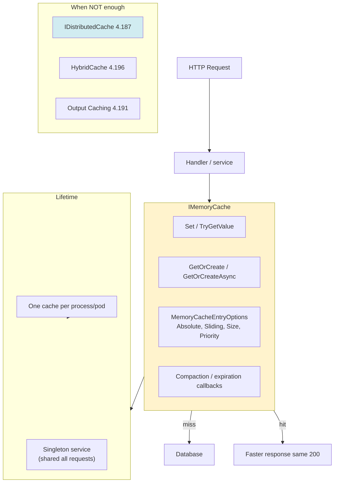
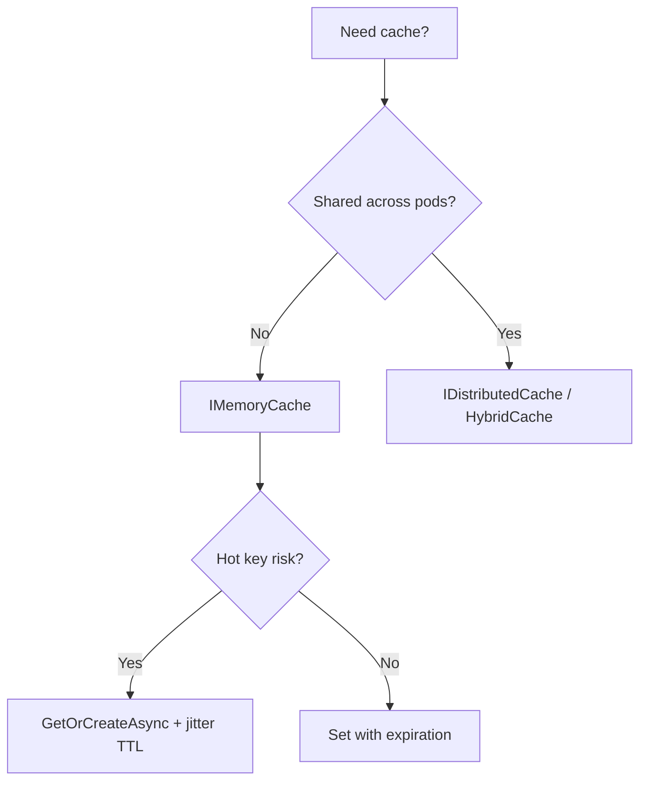

> [!success] Mastery Check
> - [ ] **Studied Well**
> - [ ] **Can explain the concept without notes**
> - [ ] **Can answer interview questions confidently**
> - [ ] **Can implement it in a real project**

# 4.186 — IMemoryCache: In-Process Caching with Expiry, Size, and Priority

---

## PART 0 — Navigation & Context

### Domain Hierarchy

```
ASP.NET Core Mastery
└── Caching & Output (4.186–4.201)
    ├── ► 4.186 — IMemoryCache ◄ YOU ARE HERE (L1, in-process)
    ├── 4.187 — IDistributedCache (L2, shared)
    ├── 4.188 — Redis implementation
    ├── 4.189 — Cache-aside pattern
    ├── 4.191 — Output caching middleware
    ├── 4.193 — Cache stampede prevention
    └── 4.196 — HybridCache (.NET 9)
```

### Prerequisites

[[4.035 — Service Lifetimes]], [[4.034 — DI Container]], basic async/await

### What This Unlocks

[[4.187 — IDistributedCache]], [[4.189 — Cache-Aside]], [[4.193 — Stampede]], authorization permission caching (4.164)

### Why This Matters at Scale

> **`IMemoryCache` is the fastest cache layer (~microseconds) but lives only inside one Kestrel process — without `SizeLimit`, expiration, and stampede-safe `GetOrCreateAsync`, a hot product catalog key can evict everything into OOM or expire synchronously so 10k concurrent requests hammer SQL while clients still expect HTTP 200 in under 50ms.**

---

## PART 1 — The Core Mental Model

### The Fundamental Rule

> **`IMemoryCache` is a singleton-registered, process-local dictionary of objects with configurable absolute/sliding expiration, size-based eviction, and priority — it is not middleware; application code reads and writes it during request handling to avoid repeated database or computation work, but it does not change HTTP semantics unless your handler skips I/O on a cache hit.**

### Analogy

`IMemoryCache` is the **notepad on one cashier's counter** — lightning-fast to read, but the other 19 checkout lanes in your Kubernetes deployment each have their own notepad. When the notepad is full, low-priority notes get thrown away first (`CacheItemPriority`). When a popular note expires at noon, every customer at that lane asks the warehouse at once unless you use **`GetOrCreateAsync`** (one clerk calls the warehouse, others wait).

### Taxonomy



---

## PART 2 — Deep Mechanics

### 2.1 — Pipeline Position (Not Middleware)

```
──► Kestrel ──► Middleware chain ──► Endpoint
                                        │
                                        ▼
                              Scoped/Singleton service
                                        │
                                        ▼
                              IMemoryCache.GetOrCreateAsync
                                        │
                          ┌─────────────┴─────────────┐
                          ▼                           ▼
                       CACHE HIT                   CACHE MISS
                    (no DB call)                  (DB / compute)
                          │                           │
                          └─────────────┬─────────────┘
                                        ▼
                              HTTP 200 JSON (same shape)
```

**HTTP consequence:** Cache hit vs miss — **same status and body contract**, lower latency on hit (no `Cache-Control` unless you add response caching separately — 4.190).

---

### 2.2 — Registration and Size Limit

```csharp
builder.Services.AddMemoryCache(options =>
{
    options.SizeLimit = 10_000; // arbitrary units — you assign Size per entry
    options.CompactionPercentage = 0.25; // evict 25% when full
    options.TrackStatistics = true; // hit/miss metrics
});
```

**ASP.NET Core internally:** `MemoryCache` implements `IMemoryCache`; registered as **singleton**.

**Cost:** Hit ~**50–200ns**; miss = factory cost (often **1–20ms DB**).

---

### 2.3 — MemoryCacheEntryOptions

```csharp
var options = new MemoryCacheEntryOptions
{
  AbsoluteExpirationRelativeToNow = TimeSpan.FromMinutes(10),
  SlidingExpiration = TimeSpan.FromMinutes(2),
  Size = 1,
  Priority = CacheItemPriority.High,
  RegisteredPostEvictionCallbacks = { /* log evictions */ }
};
_cache.Set("catalog:categories", categories, options);
```

**Edge case:** Both absolute and sliding — **whichever expires first wins**.

---

### 2.4 — GetOrCreateAsync (Stampede-Safe)

```csharp
// ASP.NET Core internally: per-key async lock — one factory runs, others await
public async Task<ProductDto?> GetProductAsync(int id, CancellationToken ct)
{
    return await _cache.GetOrCreateAsync($"product:{id}", async entry =>
    {
        entry.AbsoluteExpirationRelativeToNow = TimeSpan.FromMinutes(10);
        entry.Size = 1;
        entry.Priority = CacheItemPriority.Normal;

        var product = await _db.Products.AsNoTracking()
            .FirstOrDefaultAsync(p => p.Id == id, ct);
        return product is null ? null : Map(product);
    });
}
```

```
// HTTP (approximate):
// GET /api/products/42
// Cache hit:  HTTP/1.1 200 OK — ~2ms total (was ~45ms on miss)
// Cache miss: HTTP/1.1 200 OK — ~45ms, then cached for 10 min
```

---

### 2.5 — Multi-Instance Deployment Failure Mode

```
Pod A caches product:42 = $9.99
Admin updates price to $12.99 in DB
Pod B still serves $9.99 from its IMemoryCache
Client GET → load balancer → inconsistent JSON body (not different HTTP code)
```

**Mitigation:** Short TTL, explicit invalidation broadcast, or `IDistributedCache` (4.187).

---

### 2.6 — Post-Eviction Callbacks

```csharp
entry.RegisterPostEvictionCallback((key, value, reason, state) =>
{
    _logger.LogDebug("Evicted {Key} reason {Reason}", key, reason);
});
```

**Reasons:** `Expired`, `Capacity`, `Replaced`, `TokenExpired` (cancellation token linked to entry).

---

## PART 3 — Production Code Patterns

### Pattern 1: E-Commerce — Product Catalog Hot Path

```csharp
public sealed class ProductCatalogService
{
    private readonly IMemoryCache _cache;
    private readonly CatalogDbContext _db;

    public async Task<IReadOnlyList<CategoryDto>> GetTopCategoriesAsync(CancellationToken ct)
    {
        return await _cache.GetOrCreateAsync("catalog:top-categories", async entry =>
        {
            entry.AbsoluteExpirationRelativeToNow = TimeSpan.FromMinutes(15);
            entry.Size = 10;
            return await _db.Categories
                .AsNoTracking()
                .OrderBy(c => c.SortOrder)
                .Take(20)
                .Select(c => new CategoryDto(c.Id, c.Name))
                .ToListAsync(ct);
        }) ?? [];
    }
}
```

### Pattern 2: Fintech — FX Rate with Short TTL

```csharp
return await _cache.GetOrCreateAsync($"fx:USD-EUR", async entry =>
{
    entry.AbsoluteExpirationRelativeToNow = TimeSpan.FromSeconds(30);
    entry.Size = 1;
    return await _ratesClient.GetRateAsync("USD", "EUR", ct);
});
```

### Pattern 3: ⚠️ WRONG — TryGetValue + Set Race (Stampede)

```csharp
// ⚠️ WRONG:
if (!_cache.TryGetValue($"product:{id}", out Product p))
{
    p = await _db.Products.FindAsync(id); // 10k parallel on expiry
    _cache.Set($"product:{id}", p, TimeSpan.FromMinutes(5));
}
```

```
// HTTP: still 200 but P99 latency spikes to seconds — DB connection pool exhausted
```

```csharp
// ✅ CORRECT:
return await _cache.GetOrCreateAsync($"product:{id}", async entry => { ... });
```

### Pattern 4: Healthcare — Cache Immutable DTOs

```csharp
// ✅ CORRECT: cache record/DTO, not EF tracked entity
return await _cache.GetOrCreateAsync(key, async entry =>
{
    var entity = await _db.Facilities.AsNoTracking().FirstAsync(...);
    return new FacilityDto(entity.Id, entity.Name); // immutable
});
```

```csharp
// ⚠️ WRONG: cache tracked entity — caller mutates cached instance
```

### Pattern 5: Logistics — CancellationToken for Config Reload

```csharp
var cts = _configChangeToken;
_cache.Set("routing-rules", rules, new MemoryCacheEntryOptions
{
    AbsoluteExpirationRelativeToNow = TimeSpan.FromHours(1),
    ExpirationTokens = { new CancellationChangeToken(cts) }
});
// Config reload cancels token → all entries with that token evicted
```

### Pattern 6: Authorization — Permission List (4.164)

```csharp
await _cache.GetOrCreateAsync($"perms:{userId}", async entry =>
{
    entry.SlidingExpiration = TimeSpan.FromMinutes(5);
    return await _permStore.GetPermissionsAsync(userId);
});
```

### Pattern 7: Don't Cache Exceptions as Null Forever

```csharp
// Factory returns null for not-found — consider short TTL or don't cache null
if (product is null)
{
    entry.AbsoluteExpirationRelativeToNow = TimeSpan.FromSeconds(30);
    return null;
}
```

---

## PART 4 — Gotchas & Anti-Patterns

### Gotcha 1: No SizeLimit → Memory Pressure / OOM

```csharp
// ⚠️ WRONG: AddMemoryCache() with no SizeLimit, unbounded keys
```

**WHY:** Each pod hoards objects until GC pressure; Kubernetes OOMKill.

### Gotcha 2: Singleton Cache Holding Scoped Service State

```csharp
// ⚠️ WRONG: capture scoped DbContext in cache factory stored beyond request
```

**WHY:** Captive dependency — disposed context in singleton cache.

### Gotcha 3: Synchronized Expiry Without Jitter

All keys set at deploy with 10m TTL → expire together → stampede (4.193).

### Gotcha 4: Caching Personalized Per-User Data Under Global Key

```csharp
_cache.Set("dashboard", userDashboard); // missing userId in key — data leak across users
```

```
// HTTP: User A receives User B's dashboard JSON — 200 with wrong body (critical security bug)
```

### Gotcha 5: Expecting IMemoryCache Across Pods

Invalidate on one pod doesn't clear others — stale reads until TTL.

---

## PART 5 — Performance Implications

| Scenario | Allocations | Latency | Recommendation |
|---|---|---|---|
| Cache hit (reference type) | 0 | ~0.05µs | Ideal hot path |
| GetOrCreateAsync miss | factory alloc | DB RTT | Set Size + TTL |
| 10k stampede without GOC | N× DB | collapse | GetOrCreateAsync |
| Large object graphs | heap | GC pressure | Cache DTO projection |
| TrackStatistics | atomic inc | ~0 | Enable in prod metrics |
| SizeLimit eviction | compaction | spike | Monitor eviction rate |

### BenchmarkDotNet

```csharp
[MemoryDiagnoser]
public class MemoryCacheBenchmark
{
    private IMemoryCache _cache = new MemoryCache(new MemoryCacheOptions { SizeLimit = 1000 });

    [Benchmark]
    public bool TryGetHit() => _cache.TryGetValue("key", out _);

    [GlobalSetup]
    public void Setup() => _cache.Set("key", 42, new MemoryCacheEntryOptions { Size = 1 });
}
// Expected: TryGetHit ~50-100ns; GetOrCreateAsync miss dominated by factory
```

### When to Care: Hot keys, multi-tenant key naming, pod memory limits.

### When to Ignore: Single-instance dev machine, cold admin endpoints.

---

## PART 6 — Interview Arsenal

**Q: IMemoryCache vs IDistributedCache?**

> **Great Answer:** IMemoryCache is in-process and nanoseconds fast but not shared across pods. I use it for L1 per-instance caching with SizeLimit and GetOrCreateAsync. IDistributedCache is byte[] over Redis for shared invalidation across nodes. HTTP responses look the same — cache only affects latency and staleness, not status codes unless I explicitly return 503 on cache failure.

**Trick:** "IMemoryCache syncs across servers" — false.

**Red flags:** No expiration; caching EF tracked entities; global key for user data.

---

## PART 7 — Decision Framework



---

## PART 8 — Self-Check

1. What DI lifetime is IMemoryCache?
2. Does cache hit change HTTP status code?
3. Why GetOrCreateAsync over TryGetValue+Set?
4. **What happens** when pod A updates DB but pod B has cached value?

**Puzzle:** `_cache.Set("user:1", dto)` without Size when SizeLimit configured?

<details><summary>Answer</summary>Entry may not be stored or throws depending on version — **always set Size** when SizeLimit enabled.</details>

---

## PART 9 — Connections & Resources

| Topic | Why |
|---|---|
| [[4.187]] | Multi-pod shared cache |
| [[4.193]] | Stampede on expiry |
| [[4.189]] | Cache-aside pattern |

- [Cache in-memory in ASP.NET Core](https://learn.microsoft.com/en-us/aspnet/core/performance/caching/memory)

> [!NOTE] Parts 0–9: in-process L1 cache, GetOrCreateAsync, size/TTL, multi-pod staleness.
