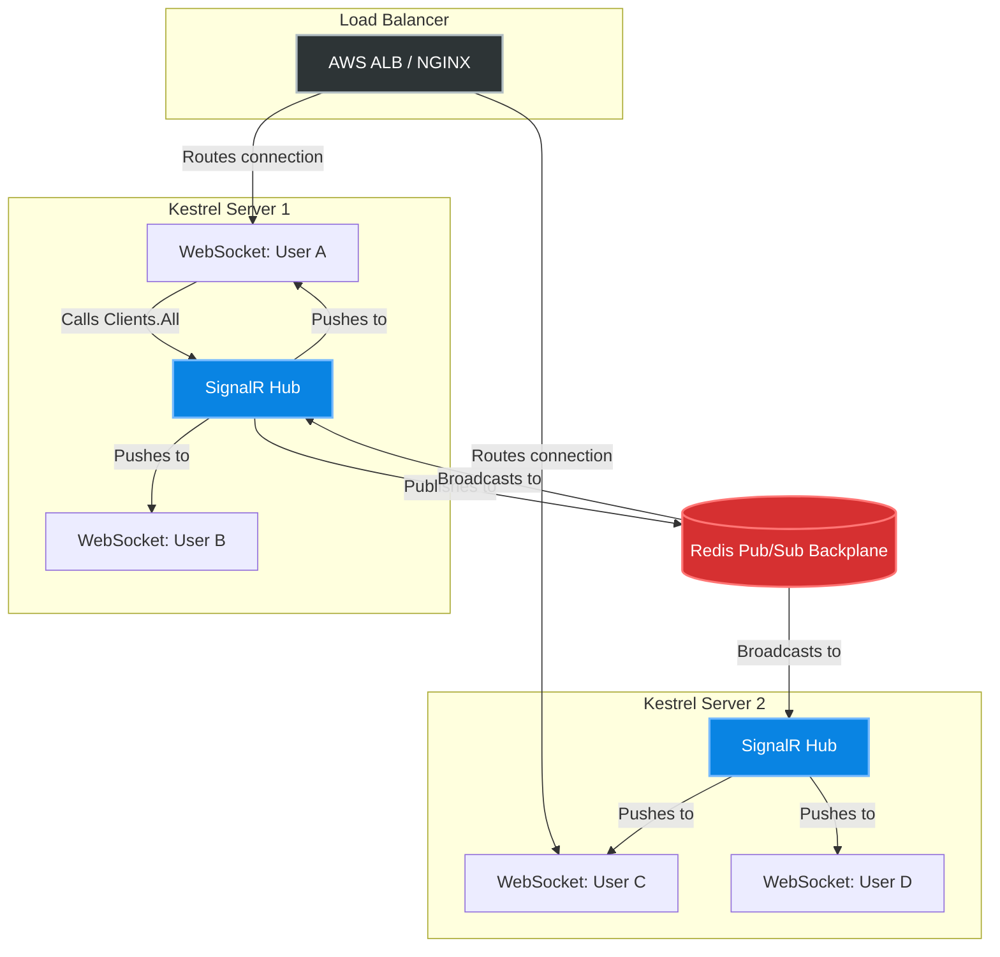

# 4.186 — SignalR Scaling with Redis Backplane

## PART 0 — Navigation & Context

```text
ASP.NET Core Domain Hierarchy
├── RPC & Messaging
│   ├── 4.184 SignalR Architecture & Transports
│   ├── 4.185 SignalR Hubs & Group Management
│   ├── 4.186 SignalR Scaling with Redis Backplane ◄ YOU ARE HERE
└── Performance & Reliability
```

**What you need before this:**
- Understanding of how `Clients.All` and `Clients.Group` work in a single-server environment [[4.185 — SignalR Hubs & Group Management]].
- Basic knowledge of what Redis is (an in-memory data store).

**What this unlocks after:**
- Deploying real-time applications to Kubernetes or AWS with auto-scaling enabled.
- Understanding Pub/Sub (Publish/Subscribe) architectural patterns.
- Transitioning to Azure SignalR Service for serverless scaling.

**Why this matters to a production engineer at scale:**
When you build a chat app on your laptop, everything works perfectly. You connect two browser tabs, type a message, and it appears instantly. Then, you deploy to production. You put 3 ASP.NET Core servers behind an NGINX Load Balancer. Suddenly, your chat app breaks completely. User A types a message, but User B never sees it. 
**Why?** Because User A's WebSocket is physically connected to Server 1, and User B's WebSocket is connected to Server 2. When User A calls `Clients.All.SendAsync()`, Server 1 *only* knows about its own local connections. It has no idea Server 2 even exists, let alone who is connected to it. 
To scale WebSockets horizontally, the servers must communicate with each other. The industry-standard mechanism for this in .NET is the **Redis Backplane** (utilizing Redis Pub/Sub), which acts as a central nervous system, distributing messages instantly across all nodes in the cluster.

---

## PART 1 — The Core Mental Model

> **The Fundamental Rule**
> **In a multi-node environment, SignalR state (WebSocket connections and Groups) is strictly local to each server process. A Backplane (Redis) intercepts outbound messages, publishes them to a central message bus, and broadcasts them to all other server nodes so they can push the message down to their respective local clients.**

**The Plain-Language Analogy**
Imagine a gigantic tech conference held across 3 separate Auditoriums (Servers).
**No Backplane:** The speaker in Auditorium 1 says, "Can everyone hear me?" Only the people in Auditorium 1 can hear him. Auditorium 2 and 3 are completely silent.
**With a Redis Backplane:** The speaker talks into a Microphone (SignalR Hub). The microphone wire goes to a central Audio Mixer (Redis). The Audio Mixer instantly duplicates the audio and blasts it out of the speakers in Auditorium 1, Auditorium 2, and Auditorium 3 simultaneously. It doesn't matter which auditorium you are sitting in; everyone hears the exact same message at the exact same time.

**The Taxonomy Diagram**



---

## PART 2 — Deep Mechanics

### 1. Redis Pub/Sub (Not Caching!)
Many developers use Redis as an `IDistributedCache` for fast key-value lookups. The SignalR Backplane does **not** use the caching features of Redis. 
It uses **Redis Pub/Sub (Publish/Subscribe)**. This is a fire-and-forget message broadcasting system. When Server 1 publishes a message to the `SignalR_Channel`, Redis does not save it to disk or memory. It instantly streams it to any other Server currently subscribed to that channel. If a server is offline, it misses the message forever.

### 2. Group Management across the Backplane
If Server 1 adds User A to the group "Lobby", Server 2 does *not* know about it. 
When Server 2 calls `Clients.Group("Lobby").Send(...)`:
1. Server 2 intercepts the call.
2. It wraps the message in an envelope saying: "Target: Group 'Lobby'".
3. It pushes it to the Redis Backplane.
4. Server 1 receives it from Redis. Server 1 checks its local memory, sees that User A is in "Lobby", and pushes it down User A's WebSocket.

### 3. Azure SignalR Service (The Cloud Native Alternative)
Running a Redis cluster solely for SignalR is expensive and requires DevOps maintenance. Microsoft offers **Azure SignalR Service**, a fully managed PaaS. 
Instead of the browser connecting to your Kestrel server, the browser connects directly to the massive Microsoft Azure gateway. Your Kestrel servers maintain a few persistent gRPC connections to the gateway. When you call `Clients.All`, Kestrel sends one message to the gateway, and the gateway blasts it out to 1,000,000 browsers.

---

## PART 3 — Production Code Patterns

### Pattern 1: Configuring the Redis Backplane
The setup in ASP.NET Core is incredibly simple. Microsoft provides a native NuGet package that injects the backplane into the SignalR pipeline automatically.

```bash
dotnet add package Microsoft.AspNetCore.SignalR.StackExchangeRedis
```

```csharp
// Program.cs
var builder = WebApplication.CreateBuilder(args);

// Ensure you have a valid Redis connection string in appsettings.json
var redisConnectionString = builder.Configuration.GetConnectionString("Redis");

builder.Services.AddSignalR()
    // ✅ CORRECT: This single line completely transforms how SignalR routes messages!
    .AddStackExchangeRedis(redisConnectionString, options => 
    {
        // Optional Configuration
        options.Configuration.ChannelPrefix = "MyApp"; // Useful if multiple apps share one Redis instance
    });

var app = builder.Build();
app.MapHub<ChatHub>("/chatHub");
app.Run();
```
*Note: With this single line, `Clients.All` and `Clients.Group` instantly become cluster-aware.*

### Pattern 2: Configuring Azure SignalR Service
If you choose the managed PaaS route instead of self-hosting Redis.

```bash
dotnet add package Microsoft.Azure.SignalR
```

```csharp
// Program.cs
builder.Services.AddSignalR()
    // ✅ CORRECT: Intercepts SignalR and routes it through Azure's hyperscale infrastructure
    .AddAzureSignalR(builder.Configuration.GetConnectionString("AzureSignalR"));

// Nothing else changes! Your Hub code remains 100% identical.
```

### Pattern 3: Handling Sticky Sessions (Load Balancer)
Even with a Backplane, if you allow Long Polling or Server-Sent Events (SSE), you **must** configure Sticky Sessions on your Load Balancer (e.g., NGINX).

```nginx
# NGINX Configuration with IP Hash (Sticky Sessions)
upstream signalr_backend {
    # ✅ CORRECT: IP Hash ensures User X always hits the same Server
    ip_hash; 
    
    server 10.0.0.1:5000;
    server 10.0.0.2:5000;
    server 10.0.0.3:5000;
}

server {
    listen 80;
    location /chatHub {
        proxy_pass http://signalr_backend;
        proxy_http_version 1.1;
        proxy_set_header Upgrade $http_upgrade;
        proxy_set_header Connection "upgrade";
    }
}
```

### Pattern 4: Granular Targeting (Bypassing the Backplane)
Sometimes, you *know* a message only needs to go to a specific, local connection, and sending it to Redis is a waste of network bandwidth.
You can bypass the backplane by injecting `IHubContext` and targeting specific connections. However, you must know exactly which server owns the `ConnectionId` (which requires custom architectural routing, usually avoided unless performance is critical).

---

## PART 4 — Gotchas & Anti-Patterns

### Gotcha 1: The "Self-Echo" CPU Spike
A common misunderstanding of how the Backplane works regarding the server that originated the message.

// Scenario:
// Server 1 executes `Clients.All.SendAsync("Hello")`.
// Developers think Server 1 pushes the message directly to its local clients, AND pushes it to Redis for Server 2.

// THE REALITY (The Gotcha):
// When Server 1 calls `Clients.All`, it does NOT immediately send the message to its local clients. It pushes it to Redis. Redis broadcasts it back to Server 2 AND Server 1. Server 1 receives its own message from Redis, and *then* pushes it to its local clients. 

// HTTP consequence (wrong path):
// If Redis goes offline, `Clients.All` stops working entirely—even for users connected to the exact same server! The server relies entirely on the Backplane echo to trigger the local send.

### Gotcha 2: Redis Bandwidth Saturation
Because the Backplane broadcasts *everything* to *every server*, a high-frequency app can saturate the network cards between your API servers and Redis.

// ⚠️ WRONG ARCHITECTURE
// A multiplayer game where 10,000 players broadcast their X/Y coordinates 60 times a second. Server 1 pushes 600,000 messages/sec to Redis. Redis broadcasts 600,000 messages to Server 2, 3, 4, and 5. Redis processes 3,000,000 messages a second. The Redis CPU maxes out at 100%, and the network pipes choke.

// ✅ CORRECT ARCHITECTURE
// The Redis Backplane is designed for "Chat" level frequency (Notifications, Price Tickers, Chat Rooms). For ultra-high frequency (Multiplayer Games), you must implement custom Sharding algorithms (ensuring all players in "Match A" connect to the exact same physical server) so the Backplane isn't needed.

### Gotcha 3: Forgetting the `ConnectionId` Lifecycle
Developers think `ConnectionId` is preserved in Redis.

// ⚠️ WRONG CODE
```csharp
// Server 1
await Clients.Client("abcd-1234").SendAsync("Hello");
```

// HTTP consequence (wrong path):
// Server 1 pushes this request to Redis. Server 2 receives it. Server 2 looks in its local memory for "abcd-1234". It doesn't have it (because Server 1 owns it). Server 2 silently drops the message.
// The Backplane works perfectly here, but developers often mistakenly believe they can query Redis to find out *which* server holds "abcd-1234". You cannot. The Redis Backplane is a dumb pipe; it does not store connection state.

### Gotcha 4: Deserialization Overhead
When using a Backplane, serialization happens **twice**.
1. Kestrel serializes the C# object into the Redis Pub/Sub binary format.
2. Kestrel receives the message from Redis, and serializes it AGAIN into the SignalR Hub Protocol (JSON/MessagePack) to send to the WebSocket.
If you are sending massive 5MB payloads over SignalR (which is an anti-pattern anyway), the Redis Backplane will double your server CPU load.

---

## PART 5 — Performance Implications

### Request Pipeline Characteristics

| Architecture | Concurrent Users | Network Hops | Bottleneck | Recommendation |
|---|---|---|---|---|
| Single Server | < 100,000 | 1 (Client -> Server) | Ephemeral Ports / RAM | Best for simple apps. |
| Redis Backplane | 100,000 - 500k | 3 (Client -> Server -> Redis -> Server) | Redis Network Bandwidth | Best for standard enterprise scaling. |
| Azure SignalR | > 1,000,000 | 2 (Client -> Azure -> Server) | Cost ($$) | Best for hyperscale/global reach. |

### Redis Specs Needed
Because the backplane uses Pub/Sub, it uses almost no RAM. A 256MB Redis instance is usually enough. What matters is **Network Bandwidth** and **CPU**. You need a Redis instance with high network throughput.

---

## PART 6 — Interview Arsenal

### A. The Question Bank

**Question 1:** "We deployed our SignalR chat application to three load-balanced servers. Users are complaining that they can't see messages from people in the same chat room. What is the architectural flaw?"
- **Average Answer:** "The servers aren't connected."
- **Why That's Insufficient:** Doesn't explain the underlying memory isolation of WebSockets.
- **Great Answer:** "The flaw is the lack of a Backplane. SignalR WebSockets maintain persistent, stateful TCP connections locked to specific server memory. When User A (on Server 1) sends a message to the group 'Lobby', Server 1 only broadcasts it to the WebSockets it physically holds in its own RAM. User B (on Server 2) never receives it. To fix this, we must configure a Redis Backplane. Server 1 will intercept the 'Send to Lobby' command, publish it to Redis Pub/Sub, and Redis will instantly broadcast it to Server 2 and 3, which will then push it down to their respective clients."

**Question 2:** "If you configure the Redis Backplane, does Redis store the names of all the online users so you can query it?"
- **Average Answer:** "Yes, Redis is a database so it stores the connections."
- **Why That's Insufficient:** Fundamentally misunderstands Redis Pub/Sub vs Redis Cache.
- **Great Answer:** "No, absolutely not. The SignalR Redis Backplane does not use Redis for storage or caching; it strictly uses the Pub/Sub feature. Pub/Sub is a fire-and-forget message bus. Redis does not store `ConnectionId`s, `UserId`s, or Group lists. State remains entirely local to each Kestrel server's RAM. If you need to query 'Who is online globally', you must write custom logic to store that state separately in a Redis Cache or a SQL database."

**Question 3:** "What is the difference between scaling SignalR with a Redis Backplane versus Azure SignalR Service?"
- **Average Answer:** "Azure is in the cloud."
- **Why That's Insufficient:** Misses the massive architectural difference in where the WebSockets terminate.
- **Great Answer:** "With a Redis Backplane, the client's WebSockets terminate directly on your ASP.NET Core servers. Your servers do the heavy lifting of maintaining thousands of open TCP ports, and Redis just synchronizes messages between them. With Azure SignalR Service, the architecture flips. The client WebSockets terminate on Microsoft's Azure Gateway. Your ASP.NET Core servers only maintain a handful of multiplexed gRPC connections to the gateway. Azure handles all the persistent TCP overhead, making it drastically easier to scale your API servers up and down without breaking client connections."

### B. The Trick Questions

**Trick Question:** "If Server 1 goes down, will Redis reconnect the lost clients to Server 2?"
- **The Trap:** Believing Redis manages connections.
- **The Correct Answer:** "No. Redis only routes internal server messages. If Server 1 dies, all physical TCP/WebSocket connections attached to it are severed. The Javascript clients in the browsers will catch the disconnect event and execute their `.withAutomaticReconnect()` logic. They will send a new HTTP request to the Load Balancer, which will route them to Server 2, establishing a brand new connection with a new `ConnectionId`."

### C. Red Flags to Avoid
- 🚩 **"I use RabbitMQ as my SignalR Backplane."** (While theoretically possible via custom code, Microsoft provides official support ONLY for Redis and Azure SignalR Service. Building a custom RabbitMQ backplane is a massive, complex undertaking that will likely suffer from latency issues).
- 🚩 **"I put Redis on the same virtual machine as my API."** (This defeats the purpose of horizontal scaling. Redis must be hosted on a dedicated VM or managed service like AWS ElastiCache).

---

## PART 7 — Decision Framework

```mermaid
graph TD
    A[Scale SignalR Application] --> B{How many concurrent connections?}
    
    B -->|< 10,000| C[Single Kestrel Server]
    B -->|> 10,000| D{Are you hosting on-premise or AWS/GCP?}
    B -->|Massive Scale Cloud| E[Azure SignalR Service]
    
    C --> F[No Backplane needed]
    
    D -->|Yes| G[Deploy multiple Kestrel Servers]
    G --> H[Add Redis Backplane via NuGet]
    H --> I[Configure NGINX with Sticky Sessions]
    
    style A fill:#2d3436,stroke:#fff
    style C fill:#0984e3,stroke:#fff
    style E fill:#0984e3,stroke:#fff
    style H fill:#00b894,stroke:#fff
    style I fill:#d63031,stroke:#fff
```



---

## PART 8 — Self-Check

### A. Conceptual Questions
1. Why does `Clients.All` fail to reach everyone in a multi-server environment without a backplane?
2. What specific Redis feature does the SignalR backplane use?
3. Does the SignalR Redis Backplane store the chat history in Redis?
4. If a client is connected to Server A, and Server A publishes a message to Redis, does Server A receive its own message back?
5. Why are Sticky Sessions required on the Load Balancer even if you have a Redis Backplane?
6. How does Azure SignalR Service differ fundamentally from the Redis Backplane architecture?
7. What happens to messages in Redis Pub/Sub if a Kestrel server is temporarily offline?
8. Why is using a Backplane for a 60-FPS multiplayer game state synchronization a bad idea?

### B. Code Puzzles

**Puzzle 1: The Missing Config**
```csharp
var builder = WebApplication.CreateBuilder(args);
builder.Services.AddSignalR().AddStackExchangeRedis("localhost:6379");
```
*Scenario:* You deploy to Production. Your Web App and your Mobile App APIs share the same Redis cluster. Suddenly, Chat messages from the Web App are appearing in the Mobile App!
<details>
<summary>Answer</summary>
By default, the Redis Backplane broadcasts to a default channel name. If multiple distinct SignalR applications share the same Redis instance, they will intercept each other's messages.
*Fix:* You must configure a unique `ChannelPrefix` for each application in the options.
</details>

**Puzzle 2: The Double Broadcast**
```csharp
// Hub Code
public async Task Broadcast(string msg) {
    await Clients.All.SendAsync("Receive", msg);
    await _redisDatabase.PublishAsync("CustomChannel", msg);
}
```
*Scenario:* A developer read that they need Redis to scale, so they manually publish to Redis using StackExchange.Redis alongside the standard SignalR call.
<details>
<summary>Answer</summary>
Redundant and broken architecture. The `.AddStackExchangeRedis()` extension in `Program.cs` already intercepts `Clients.All` and handles the Pub/Sub automatically under the hood using a highly optimized binary protocol. Manually publishing does nothing but waste bandwidth.
</details>

**Puzzle 3: The Ghost Connection**
```csharp
// REST API Controller on Server 1
await _hubContext.Clients.Client("some-connection-id").SendAsync("Alert");
```
*Scenario:* `some-connection-id` is physically connected to Server 2. Does this work with a Redis Backplane?
<details>
<summary>Answer</summary>
Yes! Server 1 wraps the message with instructions to target "some-connection-id" and publishes it to Redis. Server 2 receives it, sees that it owns that connection ID, and routes it to the correct socket. (Note: Server 3 also receives it, checks its local memory, realizes it doesn't own the ID, and discards it).
</details>

---

## PART 9 — Connections & Resources

### A. Related Topics Table

| Topic | Why It Connects |
|---|---|
| [[4.185 — SignalR Hubs & Group Management]] | Explains the addressing topologies that the Backplane intercepts. |
| [[4.174 — IDistributedCache Redis Integration]] | Explains how to use Redis for Caching (which is NOT what the Backplane does). |
| [[4.184 — SignalR Architecture & Transports]] | Explains why Sticky Sessions are required for negotiation fallbacks. |

### B. Books

| Book | Chapters | Why These Chapters |
|---|---|---|
| SignalR on .NET Core | Chapter 7: Scaling SignalR | Detailed breakdown of Pub/Sub routing mechanics. |
| ASP.NET Core in Action, 3rd Ed | Chapter 24: Real-time communication | Brief overview of scaling out. |

### C. Essential Articles & Docs
- [Microsoft Docs: Set up a Redis backplane for ASP.NET Core SignalR scale-out](https://learn.microsoft.com/en-us/aspnet/core/signalr/redis-backplane)
- [Microsoft Docs: What is Azure SignalR Service?](https://learn.microsoft.com/en-us/azure/azure-signalr/signalr-overview)
- [StackExchange.Redis Official Documentation](https://stackexchange.github.io/StackExchange.Redis/)

> [!NOTE]
> **Template Meta-Note**
> Part 0: Context & Prerequisites. Part 1: Core Mental Model. Part 2: Deep Mechanics & Pipeline. Part 3: Production Code. Part 4: Gotchas. Part 5: Performance. Part 6: Interview Arsenal. Part 7: Decision Framework. Part 8: Puzzles. Part 9: Resources.
