# 4.188 — Minimal APIs Architecture (NET 6+)

## PART 0 — Navigation & Context

```text
ASP.NET Core Domain Hierarchy
├── Web APIs & Routing
│   ├── 4.015 Minimal APIs vs MVC Controllers
│   ├── 4.188 Minimal APIs Architecture (NET 6+) ◄ YOU ARE HERE
│   ├── 4.189 Endpoint Routing & MapGroup
│   └── 4.190 Filters in Minimal APIs (NET 7+)
└── Core Architecture
```

**What you need before this:**
- Understanding of basic HTTP Verbs (GET, POST, PUT, DELETE).
- Familiarity with Dependency Injection in ASP.NET Core (`IServiceCollection`).
- Basic C# 10 features (Top-level statements, Lambda expressions).

**What this unlocks after:**
- Grouping Minimal API endpoints seamlessly using `MapGroup` [[4.189 — Endpoint Routing & MapGroup]].
- Implementing AOP (Aspect-Oriented Programming) in Minimal APIs using Endpoint Filters [[4.190 — Filters in Minimal APIs (NET 7+)]].
- Building hyper-performant Microservices that compile to Native AOT.

**Why this matters to a production engineer at scale:**
For over a decade, building an API in ASP.NET meant creating a "Controller." Controllers are powerful, but they carry massive overhead: reflection, base classes, implicit model binding rules, and heavy lifecycle management. 
In .NET 6, Microsoft introduced **Minimal APIs**. Minimal APIs bypass the entire MVC framework. They map an HTTP route directly to a C# lambda function or method delegate using Kestrel's raw endpoint routing. The result is an API that requires less boilerplate, uses significantly less memory, and starts up drastically faster. In .NET 8, Minimal APIs are the officially recommended architecture for building cloud-native microservices, especially because they perfectly support Native AOT (Ahead-of-Time) compilation, whereas MVC Controllers do not.

---

## PART 1 — The Core Mental Model

> **The Fundamental Rule**
> **A Minimal API maps an HTTP Route and Verb directly to a C# Delegate (Lambda function or Method Reference). It automatically infers dependency injection, route parameters, and JSON serialization from the delegate's signature without requiring attributes or base classes.**

**The Plain-Language Analogy**
Imagine routing phone calls in a massive corporate office.
**MVC Controllers:** You call the receptionist. The receptionist looks up your name in a massive directory (Reflection). They see you belong to the "Sales" department (Controller). They physically walk over to the Sales department, instantiate a new Sales Manager (Dependency Injection), and tell the Manager to talk to you.
**Minimal APIs:** You have a direct extension number on your desk. When someone dials it, your phone rings immediately. No receptionist, no directories, no managers. The caller is connected directly to your specific function.

**The Taxonomy Diagram**

```mermaid
graph TD
    A[HTTP Request: GET /users/5] -->|Kestrel| B(Endpoint Routing Middleware)
    
    B -->|Matches Route Pattern| C{MapGet "/users/{id}"}
    
    C -->|Executes Delegate| D["(int id, AppDbContext db) => { ... }"]
    
    D -->|Parameter 1: int id| E[Inferred from Route Pattern {id}]
    D -->|Parameter 2: AppDbContext| F[Inferred from DI Services]
    
    D -->|Returns Object| G[User Object]
    
    G -->|Result Execution| H[Serialize to JSON & Return HTTP 200]
    H --> I[HTTP Response]
    
    style A fill:#2d3436,stroke:#b2bec3,stroke-width:2px,color:#fff
    style B fill:#0984e3,stroke:#74b9ff,stroke-width:2px,color:#fff
    style D fill:#00b894,stroke:#55efc4,stroke-width:2px,color:#fff
    style H fill:#0984e3,stroke:#74b9ff,stroke-width:2px,color:#fff
```

---

## PART 2 — Deep Mechanics

### 1. The `WebApplication` Builder
Minimal APIs rely entirely on the `WebApplication` host, introduced in .NET 6 alongside C# top-level statements. You no longer need `Program.cs` and `Startup.cs`. The `app` object is an implementation of `IEndpointRouteBuilder`, meaning you can map endpoints directly on it.

### 2. Parameter Binding (The Magic)
When you write an MVC Controller, you often use `[FromQuery]`, `[FromRoute]`, or `[FromBody]` to tell the framework where data comes from. Minimal APIs attempt to be "smart" by inferring the source:
- If the parameter name matches a token in the route template (`/users/{id}` -> `int id`), it binds from the **Route**.
- If the parameter is a complex type (e.g., `UserDto`), it binds from the **JSON Body**.
- If the parameter exists in the DI container (e.g., `ILogger`), it binds from **Services**.
- If it's a primitive type not in the route (e.g., `int page`), it binds from the **Query String**.

### 3. IResult and TypedResults (.NET 7+)
A lambda function can return a simple string, an object (which becomes JSON), or an `IResult`. 
`IResult` is the Minimal API equivalent of MVC's `IActionResult`. It dictates the HTTP status code and content type.
In .NET 7, Microsoft introduced `TypedResults`. Instead of returning `Results.Ok(user)`, you return `TypedResults.Ok(user)`. `TypedResults` returns concrete types (e.g., `Ok<User>`), which makes unit testing vastly easier and allows OpenAPI/Swagger to automatically generate accurate schemas without needing extra attributes.

---

## PART 3 — Production Code Patterns

### Pattern 1: The Basics (CRUD)
A complete CRUD API in a single file.

```csharp
// Program.cs
using Microsoft.EntityFrameworkCore;

var builder = WebApplication.CreateBuilder(args);
builder.Services.AddDbContext<AppDbContext>(opt => opt.UseInMemoryDatabase("Db"));
var app = builder.Build();

// 1. GET - Returns a list of JSON objects
app.MapGet("/todos", async (AppDbContext db) => 
    await db.Todos.ToListAsync());

// 2. GET by ID - Demonstrates Route Parameter {id} binding
app.MapGet("/todos/{id}", async (int id, AppDbContext db) =>
{
    var todo = await db.Todos.FindAsync(id);
    return todo is not null ? Results.Ok(todo) : Results.NotFound();
});

// 3. POST - Demonstrates Body binding (Todo object)
app.MapPost("/todos", async (Todo todo, AppDbContext db) =>
{
    db.Todos.Add(todo);
    await db.SaveChangesAsync();
    // Returns 201 Created with a Location header
    return Results.Created($"/todos/{todo.Id}", todo);
});

app.Run();

class Todo { public int Id { get; set; } public string Title { get; set; } }
class AppDbContext : DbContext { ... }
```

### Pattern 2: Explicit Binding Attributes
Sometimes the "magic" inference gets it wrong. For example, you want a string from a specific header, not the query string. You can explicitly decorate parameters.

```csharp
app.MapPost("/process", (
    [FromBody] ProcessRequest request,       // Explicitly Body
    [FromQuery(Name = "api-version")] string version, // Explicitly Query String
    [FromHeader(Name = "X-Tenant-Id")] string tenantId, // Explicitly Header
    [FromServices] IEmailService emailService // Explicitly DI (usually optional)
) => 
{
    return Results.Ok($"Processing for tenant {tenantId}");
});
```

### Pattern 3: Using TypedResults (.NET 7+)
If you return `Results.NotFound()` or `Results.Ok(user)`, Swagger does not know what type of JSON will be returned on a 200 OK. `TypedResults` solves this at compile time.

```csharp
// The return type is explicitly defined as a union of possible results
app.MapGet("/users/{id}", async Task<Results<Ok<User>, NotFound>> (int id, AppDbContext db) =>
{
    var user = await db.Users.FindAsync(id);
    
    if (user is null)
    {
        return TypedResults.NotFound(); // Strongly typed to NotFound
    }

    return TypedResults.Ok(user); // Strongly typed to Ok<User>
});
```
*Because of this explicit return type, Swagger immediately knows this endpoint returns either a 404, or a 200 containing a `User` JSON schema. No `[ProducesResponseType]` attributes needed!*

### Pattern 4: Method Group Delegates
Putting 50 massive lambda functions in `Program.cs` makes the file unreadable. Best practice is to extract the logic into separate classes and pass the method reference (Method Group Delegate).

```csharp
// Program.cs
var app = builder.Build();

// Reference the methods dynamically!
app.MapGet("/products", ProductHandlers.GetAllProducts);
app.MapGet("/products/{id}", ProductHandlers.GetProductById);
app.MapPost("/products", ProductHandlers.CreateProduct);

app.Run();

// Handlers/ProductHandlers.cs
public static class ProductHandlers
{
    // These methods match the expected delegate signature perfectly
    public static async Task<IResult> GetAllProducts(AppDbContext db)
    {
        return TypedResults.Ok(await db.Products.ToListAsync());
    }

    public static async Task<IResult> GetProductById(int id, AppDbContext db)
    {
        var product = await db.Products.FindAsync(id);
        return product != null ? TypedResults.Ok(product) : TypedResults.NotFound();
    }
    
    // ...
}
```

### Pattern 5: Extensibility via Extension Methods (The "Carter" Pattern)
To completely organize a large application, use Extension Methods on `IEndpointRouteBuilder`. This is how professional Minimal API apps organize modules.

```csharp
// Modules/OrderModule.cs
public static class OrderModule
{
    // Extension method on the routing builder
    public static void MapOrderEndpoints(this IEndpointRouteBuilder app)
    {
        var group = app.MapGroup("/api/orders").WithTags("Orders");

        group.MapGet("/", GetOrders);
        group.MapGet("/{id}", GetOrder);
    }

    private static IResult GetOrders() => TypedResults.Ok(new[] { "Order1" });
    private static IResult GetOrder(int id) => TypedResults.Ok($"Order {id}");
}

// Program.cs
var app = builder.Build();

// Clean, modular Program.cs!
app.MapOrderEndpoints();
app.MapCustomerEndpoints();

app.Run();
```

---

## PART 4 — Gotchas & Anti-Patterns

### Gotcha 1: The "Fat" Program.cs
Developers new to Minimal APIs often literally write their entire application—including database access and business logic—inside `Program.cs`.

// ⚠️ WRONG CODE
```csharp
// Program.cs
app.MapPost("/register", async (UserDto dto, AppDbContext db, IEmailSender email) => {
    // 50 lines of validation logic
    // 20 lines of database insertion
    // 10 lines of email sending
    // All sitting in the root Program.cs!
});
```

// HTTP consequence (wrong path):
// The application works, but `Program.cs` becomes a 5,000-line monolith that is impossible to read, navigate, or unit test.

// ✅ CORRECT CODE
// Use Pattern 4 (Method Groups) or Pattern 5 (Extension Modules) to separate endpoint routing from `Program.cs`. Put business logic in Domain Services.

### Gotcha 2: Missing `[FromQuery]` for Arrays
Minimal APIs are smart, but they have limits. Binding an array of strings from the query string (`?tags=csharp&tags=dotnet`) requires explicit help.

// ⚠️ WRONG CODE
```csharp
// Minimal API assumes 'string[] tags' means you want a JSON array from the Body!
app.MapGet("/search", (string[] tags) => { ... });
```

// HTTP consequence (wrong path):
// If the client makes a GET request (which has no body) with query string `?tags=csharp`, the server throws an HTTP 415 Unsupported Media Type or 400 Bad Request because it expects a JSON body.

// ✅ CORRECT CODE
```csharp
app.MapGet("/search", ([FromQuery] string[] tags) => { ... });
```

### Gotcha 3: Dependency Injection Lifetime Mismatches
When using Method Groups (Pattern 4), developers sometimes accidentally make the Handler class a standard instantiated class instead of `static`, and try to inject dependencies into its constructor.

// ⚠️ WRONG CODE
```csharp
public class UserHandlers {
    private readonly AppDbContext _db;
    public UserHandlers(AppDbContext db) => _db = db; // ❌ BAD IN MINIMAL APIS
    
    public IResult GetUser(int id) { ... }
}

// Program.cs
var handlers = new UserHandlers(???); // How do you pass the scoped DB context here?
app.MapGet("/user/{id}", handlers.GetUser);
```

// HTTP consequence (wrong path):
// `AppDbContext` is a Scoped service (one per HTTP request). If you resolve it manually in `Program.cs` and pass it to an instance of `UserHandlers`, that DbContext becomes a Singleton. Concurrent requests will try to use the same DbContext, causing massive threading exceptions and data corruption.

// ✅ CORRECT CODE
// Handler classes in Minimal APIs should almost always be `static`. You inject dependencies directly into the *method signature*, not the constructor. Kestrel resolves them per-request automatically.
```csharp
public static class UserHandlers {
    public static IResult GetUser(int id, AppDbContext db) { ... }
}
```

### Gotcha 4: Unit Testing `IResult`
If you return `Results.Ok(user)`, the return type of the method is the interface `IResult`.

// ⚠️ WRONG CODE
```csharp
// Unit Test
IResult result = UserHandlers.GetUser(1, mockDb);
// How do you assert that 'result' is a 200 OK containing a User?
// You have to use messy reflection or cast it to internal framework types.
```

// ✅ CORRECT CODE
// Always use `TypedResults` (Pattern 3).
```csharp
// Unit Test
var result = UserHandlers.GetUser(1, mockDb);
Assert.IsType<Ok<User>>(result.Result);
```

---

## PART 5 — Performance Implications

### Request Pipeline Characteristics

| Metric | MVC Controllers | Minimal APIs | Why Minimal APIs Win |
|---|---|---|---|
| Startup Time | Slow | Extremely Fast | Minimal APIs don't scan the assembly for `[Controller]` classes via Reflection. |
| Memory Per Request | High | Low | No `ControllerContext` or base class instantiations. |
| Native AOT Support | No | Yes | Controllers rely on dynamic runtime reflection. Minimal APIs use source generators. |

### BenchmarkDotNet Concept
If you benchmark a "Hello World" endpoint:
- MVC Controller: ~25,000 requests per second.
- Minimal API: ~100,000+ requests per second.

**When to Care:** Minimal APIs remove the framework overhead. For a massive Monolith where the database takes 500ms to query, you won't notice the difference between MVC and Minimal APIs. However, for a microservice running in Kubernetes where you want to minimize container memory limits (e.g., running on 50MB of RAM) and maximize raw throughput, Minimal APIs are strictly superior.

---

## PART 6 — Interview Arsenal

### A. The Question Bank

**Question 1:** "What is the primary architectural difference between MVC Controllers and Minimal APIs?"
- **Average Answer:** "Minimal APIs don't have controllers and let you put code in Program.cs."
- **Why That's Insufficient:** Doesn't explain the underlying mechanics of reflection vs delegates.
- **Great Answer:** "MVC Controllers are a heavy abstraction layer. At startup, the framework uses reflection to find all classes ending in 'Controller', builds a routing table, and during a request, dynamically instantiates the controller class and its dependencies. Minimal APIs bypass this entirely. They map an HTTP route directly to a C# delegate (a lambda or method reference). This eliminates reflection, base class overhead, and complex lifecycle management, resulting in significantly lower memory usage, faster startup times, and full compatibility with Native AOT compilation."

**Question 2:** "In a Minimal API, if I write `app.MapPost(\"/users\", (User dto) => ...)`, how does the framework know that `User dto` should come from the HTTP JSON Body, and not the Query String?"
- **Average Answer:** "It just guesses based on the type."
- **Why That's Insufficient:** Needs to explain the specific binding inference rules.
- **Great Answer:** "Minimal APIs use strict inference rules. Because `User` is a complex type (a class/record), and it is not registered in the Dependency Injection container, the framework automatically infers that it must be deserialized from the HTTP Request Body as JSON. If the parameter were a primitive type like an `int`, it would look at the Route template first, and if not found there, it would default to the Query String. If the inference is wrong, we can override it explicitly using attributes like `[FromQuery]` or `[FromBody]`."

**Question 3:** "Why did Microsoft introduce `TypedResults` in .NET 7 when `Results` already existed in .NET 6?"
- **Average Answer:** "To make it strictly typed."
- **Why That's Insufficient:** Fails to mention the two primary beneficiaries: Unit Tests and Swagger/OpenAPI.
- **Great Answer:** "The original `Results.Ok()` returns an interface, `IResult`. This causes two problems. First, Unit Testing is difficult because you cannot easily cast `IResult` to inspect the payload or status code without reflection. Second, Swagger/OpenAPI relies on return types to generate schema documentation. If a method returns `IResult`, Swagger doesn't know what JSON object it represents, forcing you to add messy `[ProducesResponseType]` attributes. `TypedResults.Ok<User>()` returns a concrete type. This makes unit testing a simple `Assert.IsType`, and allows Swagger to instantly infer the exact JSON schema being returned."

### B. The Trick Questions

**Trick Question:** "If I want to inject a Scoped service (like `AppDbContext`) into a Minimal API method group, should I inject it into the static class constructor?"
- **The Trap:** Static classes cannot have injected constructors, and injecting scoped services into singletons is a catastrophic error.
- **The Correct Answer:** "No, you cannot and should not use constructors for injection in Minimal API handler classes. Instead, you inject the service directly into the method signature of the delegate (e.g., `public static IResult GetUser(int id, AppDbContext db)`). Kestrel will automatically resolve `AppDbContext` from the DI container on a per-request basis and pass it to your method when the endpoint is hit."

**Trick Question:** "Do Minimal APIs support Model Validation (e.g., `[Required]`, `[MaxLength]`) out of the box like MVC Controllers do?"
- **The Trap:** Assuming feature parity.
- **The Correct Answer:** "No. MVC Controllers automatically execute DataAnnotations validation and return an HTTP 400 if `ModelState.IsValid` is false. Minimal APIs do NOT run DataAnnotations automatically. If you want validation in Minimal APIs, you must implement it yourself, typically by using a library like `FluentValidation` combined with an Endpoint Filter to intercept the request and validate the model before it hits your delegate."

### C. Red Flags to Avoid
- 🚩 **"I use Minimal APIs for microservices, and MVC for monolithic web APIs."** (There is no rule saying Minimal APIs can't build massive monoliths. With `MapGroup` and extension methods, Minimal APIs scale architecturally just as well as MVC).
- 🚩 **"I put all my business logic inside the lambda functions in `Program.cs`."** (A severe violation of Separation of Concerns. Keep `Program.cs` clean; delegate to Handlers or Domain Services).

---

## PART 7 — Decision Framework

```mermaid
graph TD
    A[New API Project] --> B{Does the API render HTML Views e.g. Razor/MVC?}
    
    B -->|Yes| C[Use MVC Controllers]
    B -->|No, it's a pure JSON/gRPC API| D{Do you require OData or complex legacy MVC ActionFilters?}
    
    D -->|Yes| C
    D -->|No| E[Use Minimal APIs]
    
    E --> F{Is the API extremely small 1-5 endpoints?}
    
    F -->|Yes| G[Use inline Lambdas in Program.cs]
    F -->|No| H[Use Method Groups & Extension Methods for structure]
    
    H --> I[Use TypedResults for Swagger & Testing]
    H --> J[Use MapGroup for routing prefixes]
    
    style A fill:#2d3436,stroke:#fff
    style C fill:#d63031,stroke:#fff
    style E fill:#00b894,stroke:#fff
    style G fill:#0984e3,stroke:#fff
    style H fill:#0984e3,stroke:#fff
```



---

## PART 8 — Self-Check

### A. Conceptual Questions
1. How does Kestrel know which method to execute in a Minimal API?
2. What are the 4 places a parameter can be bound from in Minimal APIs?
3. How does the Minimal API framework know a parameter should be resolved via Dependency Injection?
4. What is the difference between `Results.Ok()` and `TypedResults.Ok()`?
5. Why are Minimal APIs faster at startup than MVC Controllers?
6. How do you prevent `Program.cs` from becoming a 5,000-line file when using Minimal APIs?
7. Why doesn't `ModelState.IsValid` work in Minimal APIs?
8. How does Native AOT compilation relate to Minimal APIs vs MVC Controllers?

### B. Code Puzzles

**Puzzle 1: The Ambiguous Route**
```csharp
app.MapGet("/users/{id}", (int id) => $"User {id}");
app.MapGet("/users/admin", () => "Admin Dashboard");
```
*Scenario:* If a client requests `GET /users/admin`, which endpoint executes? Or does it throw an error?
<details>
<summary>Answer</summary>
It executes `/users/admin` and returns "Admin Dashboard". Minimal APIs (and ASP.NET Core endpoint routing in general) score routes based on specificity. Literal string matches (`admin`) have a higher precedence than parameter matches (`{id}`).
</details>

**Puzzle 2: The Binding Mystery**
```csharp
app.MapPost("/process", (string configId) => { ... });
```
*Scenario:* A client sends a POST request with JSON body `{ "configId": "123" }`. The server returns HTTP 415 Unsupported Media Type. Why?
<details>
<summary>Answer</summary>
Because `string` is a primitive type, the Minimal API framework assumes it comes from the Query String (e.g., `?configId=123`). It does NOT look inside the JSON body for primitive types.
*Fix:* You must wrap it in a class/record `record ConfigRequest(string ConfigId)`, or explicitly use `([FromBody] string configId)`.
</details>

**Puzzle 3: The Broken Delegate**
```csharp
// Inside a class
public void HandleRequest() { }

// In Program.cs
var handler = new MyHandler();
app.MapGet("/", handler.HandleRequest);
```
*Scenario:* This compiles and works, but it's a memory leak waiting to happen. Why?
<details>
<summary>Answer</summary>
`handler` is instantiated once during application startup. If `HandleRequest` modifies any state on the `MyHandler` instance, it acts as a global Singleton across all concurrent HTTP requests. This is not thread-safe.
*Fix:* Handlers should be `static` methods to enforce statelessness, or if they must be instances, they should be resolved via DI per-request.
</details>

---

## PART 9 — Connections & Resources

### A. Related Topics Table

| Topic | Why It Connects |
|---|---|
| [[4.015 — Minimal APIs vs MVC Controllers]] | A higher-level architectural comparison of when to use which paradigm. |
| [[4.189 — Endpoint Routing & MapGroup]] | The immediate next step for organizing Minimal APIs. |
| [[4.190 — Filters in Minimal APIs (NET 7+)]] | How to replace MVC ActionFilters in the Minimal API ecosystem. |

### B. Books

| Book | Chapters | Why These Chapters |
|---|---|---|
| ASP.NET Core in Action, 3rd Ed | Chapter 5: Mapping URLs to Minimal APIs | Deep dive into binding rules. |
| Pro ASP.NET Core 6 | Chapter 13: Using Minimal APIs | Great examples of extracting method groups. |

### C. Essential Articles & Docs
- [Microsoft Docs: Minimal APIs overview](https://learn.microsoft.com/en-us/aspnet/core/fundamentals/minimal-apis)
- [Microsoft Docs: Parameter binding in Minimal APIs](https://learn.microsoft.com/en-us/aspnet/core/fundamentals/minimal-apis/parameter-binding)
- [Nick Chapsas: "Stop using Results in .NET 7"](https://www.youtube.com/watch?v=1) (Video explaining TypedResults).

> [!NOTE]
> **Template Meta-Note**
> Part 0: Context & Prerequisites. Part 1: Core Mental Model. Part 2: Deep Mechanics & Pipeline. Part 3: Production Code. Part 4: Gotchas. Part 5: Performance. Part 6: Interview Arsenal. Part 7: Decision Framework. Part 8: Puzzles. Part 9: Resources.
