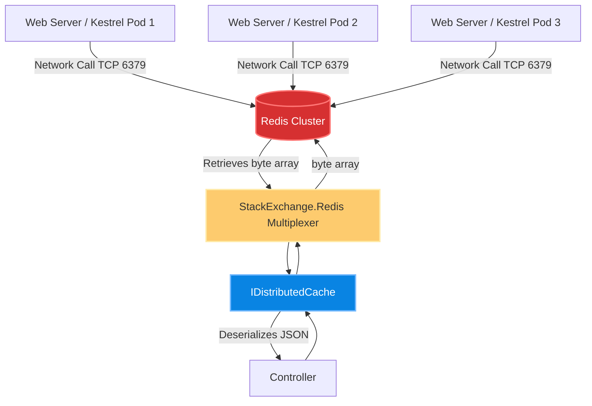

# 4.188 — Redis as IDistributedCache: StackExchange.Redis Integration

## PART 0 — Navigation & Context

```text
ASP.NET Core Domain Hierarchy
├── Performance & Scalability
│   ├── Caching Abstractions
│   │   ├── 4.186 IMemoryCache
│   │   ├── 4.187 IDistributedCache
│   │   ├── 4.188 Redis Integration ◄ YOU ARE HERE
│   │   └── 4.196 HybridCache (.NET 9)
└── Architecture & Design Patterns
    └── Distributed Systems Coherency
```

**What you need before this:**
- A deep understanding of the generic `IDistributedCache` abstraction interface [[4.187 — IDistributedCache: The Abstraction for Out-of-Process Caching]].
- Knowledge of JSON/Binary serialization because Redis only accepts raw bytes or strings [[4.194 — Distributed Cache Serialization: System.Text.Json and MessagePack]].

**What this unlocks after:**
- Implementing the Cache-Aside pattern safely [[4.189 — Cache-Aside Pattern: Load-on-Miss with Async Fallback]].
- Deploying horizontally scaled Kubernetes clusters where 50 web pods all share perfectly synchronized Session State and API caching data.
- Upgrading to the ultra-performant `.NET 9 HybridCache` system which relies entirely on Redis as its L2 backplane.

**Why this matters to a production engineer at scale:**
If you run a single web server, `IMemoryCache` is perfect. But in modern cloud environments, you deploy your API across 10 different containers behind a load balancer. If a user authenticates on Pod A (storing their session in Pod A's RAM) and their next request hits Pod B, Pod B doesn't know who they are. They are logged out.
If an admin updates a product price, and Pod A clears its `IMemoryCache`, Pods B through J still serve the old price for the next hour.
You must move shared state *out-of-process*. Redis is the absolute undisputed king of distributed caching in the .NET ecosystem. The `AddStackExchangeRedisCache` package seamlessly connects the generic `IDistributedCache` interface to a blazing-fast Redis cluster. However, improper configuration—such as forgetting `InstanceName` prefixes, or creating a new `ConnectionMultiplexer` on every request—will bring down your entire production network with socket exhaustion and key collision data leaks.

---

## PART 1 — The Core Mental Model

> **The Fundamental Rule**
> **`AddStackExchangeRedisCache` is Microsoft's official package that binds the `IDistributedCache` interface to a Redis server using the `StackExchange.Redis` library. Once configured, anytime your application calls `_cache.SetAsync()`, the payload is serialized into a `byte[]` and fired over the network (TCP) to Redis. Because Redis is an external process, operations are slightly slower (1-5ms network latency) than RAM, but the data is universally consistent across every single node in your web farm.**

**The Plain-Language Analogy**
`IMemoryCache` is the **notebook in your pocket**. It is incredibly fast to write in, but if you have 10 coworkers (Web Pods), they can't see what you wrote. If the boss changes a rule, they have to run around and erase the rule from 10 different notebooks.
`Redis` is a **giant whiteboard in the center of the office**. Walking to the whiteboard takes 3 seconds (Network Latency). You have to write everything down in standard shorthand (Serialization). But once it's written, every single coworker in the building instantly sees the exact same data.

**The Taxonomy Diagram**



---

## PART 2 — Deep Mechanics

### 2.1 — Registration and `ConnectionMultiplexer`
To use Redis, you register it in your DI container. Behind the scenes, this library creates a singleton `ConnectionMultiplexer`—a highly optimized, thread-safe TCP socket manager that handles thousands of concurrent requests over a single connection.

```csharp
// Program.cs
builder.Services.AddStackExchangeRedisCache(options =>
{
    // The connection string to your Redis server (e.g., Azure Cache for Redis, AWS ElastiCache)
    options.Configuration = builder.Configuration.GetConnectionString("RedisConnection");
    
    // CRITICAL: The string prepended to EVERY key your application writes
    options.InstanceName = "ECommerce_API_Prod:"; 
});
```

### 2.2 — The `InstanceName` Prefix Mechanic
Redis is a giant flat dictionary of Key-Value pairs. It does not have "folders" or "tables".
If you have an Identity API and an Inventory API sharing the same Redis cluster to save money, and both execute `_cache.SetAsync("User:123")`, the Inventory API will overwrite the Identity API's data, causing catastrophic data corruption.
When you set `options.InstanceName = "Identity:"`, you write `_cache.SetAsync("User:123")` in C#, but the library actually sends `"Identity:User:123"` over the wire. This guarantees namespace isolation.

### 2.3 — The Serialization Requirement
`IMemoryCache` stores raw C# objects (`object`). It holds references to memory.
`IDistributedCache` strictly stores `byte[]` or `string`. Redis does not know what a C# `OrderDto` is.
You must manually serialize data to JSON or MessagePack before saving, and deserialize it upon retrieval.

```csharp
// Setting
var jsonBytes = JsonSerializer.SerializeToUtf8Bytes(myObject);
await _cache.SetAsync("myKey", jsonBytes, new DistributedCacheEntryOptions
{
    AbsoluteExpirationRelativeToNow = TimeSpan.FromHours(1)
});

// Getting
var bytes = await _cache.GetAsync("myKey");
var myObject = bytes == null ? null : JsonSerializer.Deserialize<MyObject>(bytes);
```

### 2.4 — Handling Redis Failures Gracefully
Because Redis is an external network resource, it CAN and WILL go down. Your application must not crash if Redis reboots. You must catch `RedisConnectionException` and gracefully fall back to the slow path (the database).

```csharp
public async Task<string?> GetCatalogSafeAsync()
{
    try
    {
        return await _cache.GetStringAsync("catalog");
    }
    catch (RedisConnectionException ex)
    {
        // Redis is down! Log it, but do not fail the HTTP request.
        _logger.LogWarning(ex, "Redis connection failed. Falling back to DB.");
        return await FetchCatalogFromDatabaseAsync();
    }
}
```

---

## PART 3 — Production Code Patterns

### Pattern 1: The Robust Redis Cache-Aside Wrapper
Because manual serialization, deserialization, and exception handling are tedious, production teams build a robust extension method wrapper around `IDistributedCache`.

```csharp
public static class DistributedCacheExtensions
{
    public static async Task<T?> GetOrSetAsync<T>(
        this IDistributedCache cache,
        string key,
        Func<Task<T>> factory,
        TimeSpan expiry,
        ILogger logger)
    {
        try
        {
            var bytes = await cache.GetAsync(key);
            if (bytes != null)
            {
                return JsonSerializer.Deserialize<T>(bytes);
            }
        }
        catch (RedisConnectionException ex)
        {
            logger.LogWarning("Redis Get failed: {Message}", ex.Message);
        }

        // Cache miss (or Redis offline) -> Call the Database
        var data = await factory();

        if (data != null)
        {
            try
            {
                var bytes = JsonSerializer.SerializeToUtf8Bytes(data);
                await cache.SetAsync(key, bytes, new DistributedCacheEntryOptions { AbsoluteExpirationRelativeToNow = expiry });
            }
            catch (RedisConnectionException ex)
            {
                logger.LogWarning("Redis Set failed: {Message}", ex.Message);
            }
        }

        return data;
    }
}
```
*Usage in Controller:*
```csharp
var product = await _cache.GetOrSetAsync(
    "product:" + id,
    async () => await _db.Products.FindAsync(id),
    TimeSpan.FromMinutes(10),
    _logger);
```

### Pattern 2: Protecting Sensitive Data in Redis
Unlike `IMemoryCache` (which lives in protected server RAM), Redis data goes over the wire and lives in a separate machine. If you use Redis to store OAuth tokens, Session State, or PII, it is theoretically vulnerable to network sniffing or unauthorized database dumps.
**Solution:** Always use TLS (`ssl=true` in connection string) and encrypt sensitive payloads. ASP.NET Core Session State automatically encrypts data using the Data Protection API before putting it in Redis.

### Pattern 3: Versioning Cache Keys
If you deploy v1.0 of your app, it caches an `OrderDto` with 5 fields.
You deploy v2.0, changing `OrderDto` to have 6 fields, renaming one.
If v2.0 pulls the v1.0 JSON from Redis, `JsonSerializer.Deserialize` might throw an exception, bringing down your API.
**Solution:** Always append a schema version to complex cache keys.
`var key = $"v2:orders:{userId}";`
When v2 deploys, it misses the cache, loads fresh data, and writes the new JSON shape to `v2`, ignoring the old `v1` keys until they expire.

### Pattern 4: Advanced Configuration via `ConfigurationOptions`
For high-availability scenarios, you configure retries, abort-on-connect-fail policies, and read-replicas.

```csharp
builder.Services.AddStackExchangeRedisCache(options =>
{
    options.InstanceName = "App:";
    options.ConfigurationOptions = new ConfigurationOptions
    {
        EndPoints = { "primary.redis.cache.windows.net:6380" },
        Password = "xyz",
        Ssl = true,
        AbortOnConnectFail = false, // CRITICAL: Allow app to boot even if Redis is down
        ConnectRetry = 3,
        AsyncTimeout = 5000 // Do not block HTTP threads for more than 5s
    };
});
```

---

## PART 4 — Gotchas & Anti-Patterns

### Gotcha 1: Sharing Redis between Staging and Production without `InstanceName`
The most infamous Redis disaster. A company pays for a large Redis cluster and points both the `Staging` API and the `Production` API to it to save money.
They forget to set `options.InstanceName`.
An engineer tests a feature in Staging, editing Product 42. The Staging API writes the test JSON to `"product:42"`.
A real customer visits the Production website. The Production API reads `"product:42"` and serves the fake staging data to the customer.
**Fix:** ALWAYS set `InstanceName = $"{Environment.EnvironmentName}:App:"`.

### Gotcha 2: The `AbortOnConnectFail` Startup Crash
By default in some versions of StackExchange.Redis, if Redis is down when the application boots, the connection multiplexer throws an exception, and Kestrel crashes. Your entire API cluster refuses to boot because the cache is offline.
**Fix:** Set `AbortOnConnectFail = false` in the connection string or configuration options. The app will boot, bypass the cache with warnings, and connect to Redis in the background when it comes back online.

### Gotcha 3: The Cache Stampede (Dogpiling)
`IDistributedCache` has NO built-in locking mechanism like `IMemoryCache.GetOrCreateAsync`.
If a highly requested cache key (e.g., the Homepage Catalog) expires, and 500 requests hit your API in the next second, all 500 requests will experience a Cache Miss simultaneously. All 500 requests will query the database, bringing down your SQL server.
**Fix:** You must implement a distributed lock (RedLock), use `.NET 9 HybridCache`, or use a combination of `IMemoryCache` (for locking) wrapped around `IDistributedCache`.

### Gotcha 4: Instantiating `ConnectionMultiplexer` Manually per Request
// ⚠️ FATAL ANTI-PATTERN
```csharp
public async Task<string> GetSlowData() {
    using var redis = ConnectionMultiplexer.Connect("localhost");
    var db = redis.GetDatabase();
    return await db.StringGetAsync("key");
}
```
If you do this, you will instantly exhaust all TCP sockets on your web server and crash. Multiplexers are designed to be application-wide singletons. `AddStackExchangeRedisCache` handles this safely for you.

---

## PART 5 — Performance Implications

### Request Pipeline Characteristics

| Operation | Latency | Bandwidth Cost |
|---|---|---|
| Read `IMemoryCache` | < 0.01ms | Zero |
| Read `IDistributedCache` (Redis in same AZ) | ~1ms - 3ms | Minor |
| Read `IDistributedCache` (Redis Cross-Region) | ~20ms - 50ms | High |
| Deserializing JSON from `byte[]` | ~0.1ms | CPU Bound |

**Performance Verdict:**
Redis is exceptionally fast, but it is bound by the laws of physics (network latency). You should not use Redis to cache a database query that takes 2ms to run; the network trip to Redis takes 3ms, making the app slower! Use Redis to cache heavy computations, complex joins taking >50ms, or to store required shared state (like Auth Sessions) that must be synchronized across pods.

---

## PART 6 — Interview Arsenal

### A. The Question Bank

**Question 1:** "If we have 10 instances of our API running in Kubernetes, why must we use Redis for Session State instead of the default In-Memory session provider?"
- **Average Answer:** "Because memory is limited and Redis holds more data."
- **Why That's Insufficient:** Misses the critical concept of load balancer routing and state consistency.
- **Great Answer:** "Because standard HTTP load balancers distribute requests across all 10 pods round-robin. If a user logs in and their session is stored in the RAM of Pod A, their very next HTTP request might be routed to Pod B. Pod B's memory is empty, so the user appears logged out. By using Redis via `AddStackExchangeRedisCache`, all 10 pods point to a single external source of truth. Regardless of which pod receives the request, it queries Redis and perfectly reconstructs the user's session."

**Question 2:** "What is the purpose of the `InstanceName` property when configuring Redis in ASP.NET Core?"
- **Average Answer:** "It names the server connection."
- **Why That's Insufficient:** Vague. It is a specific data-partitioning mechanic.
- **Great Answer:** "Redis is a flat key-value store; it doesn't have isolated databases by default. If multiple applications—or different environments like Staging and Production—share the same Redis cluster, their cache keys will collide. `InstanceName` is a string prefix that the `IDistributedCache` implementation automatically prepends to every single key before sending it to Redis. By setting it to 'MyApp_Prod:', you logically isolate your application's data, preventing catastrophic overwrites."

**Question 3:** "If our Redis server goes offline for 5 minutes, what happens to our ASP.NET Core API if we are using `IDistributedCache` for data caching?"
- **Average Answer:** "The API will crash and return 500s."
- **Why That's Insufficient:** Assumes bad architecture. A cache is not a primary data store.
- **Great Answer:** "If architected correctly, the API will not crash. Operations on `IDistributedCache` will throw a `RedisConnectionException`. Our repository code should wrap the cache read/write in a `try/catch` block. When the exception is caught, we log a warning and gracefully degrade by falling back to querying the primary SQL database directly. The client still receives an HTTP 200 OK. The only noticeable difference is slightly higher latency and increased load on the SQL database during the outage."

### B. The Trick Questions

**Trick Question:** "We are migrating from `IMemoryCache` to `IDistributedCache` (Redis). I changed the interface injection, but my code `await _cache.SetAsync("User", myUserModel)` won't compile anymore. Why?"
- **The Trap:** Forgetting the type constraints of distributed caching.
- **The Correct Answer:** "`IMemoryCache` allows you to store raw C# objects by reference. `IDistributedCache` only accepts `byte[]` or `string` because it must transmit the data over a TCP socket. You cannot pass a C# object directly. You must explicitly serialize your `myUserModel` to a byte array (usually via `System.Text.Json`) before calling `SetAsync`, and deserialize it when calling `GetAsync`."

### C. Red Flags to Avoid
- 🚩 **"I created a Transient service that opens a new `ConnectionMultiplexer` to Redis every time I need to read a cache key."** (This is the fastest way to accidentally execute a Denial of Service attack on your own infrastructure due to TCP socket exhaustion).

---

## PART 7 — Decision Framework

```mermaid
graph TD
    A[Choosing a Caching Strategy] --> B{Does the data need to be consistent across multiple Web Servers?}
    
    B -->|No - Single Server| C[Use IMemoryCache]
    C --> D[Store raw C# objects, lightning fast]
    
    B -->|Yes - Web Farm / Kubernetes| E[Use IDistributedCache with Redis]
    E --> F[Configure AddStackExchangeRedisCache]
    
    F --> G[Set InstanceName Prefix]
    G --> H[Serialize Data to JSON/byte array]
    
    H --> I{Is the Redis connection fragile?}
    I -->|Yes| J[Wrap with Try/Catch and Fallback to DB]
    
    style A fill:#2d3436,stroke:#fff
    style C fill:#0984e3,stroke:#fff
    style E fill:#00b894,stroke:#fff
    style G fill:#00b894,stroke:#fff
    style H fill:#00b894,stroke:#fff
    style J fill:#fdcb6e,stroke:#333
```



---

## PART 8 — Self-Check

### A. Conceptual Questions
1. Why does `IDistributedCache` require data to be stored as `byte[]` or `string` instead of object references?
2. What catastrophic issue occurs if you share a Redis instance between staging and production without setting an `InstanceName`?
3. What is the role of the `ConnectionMultiplexer` in the StackExchange.Redis library?
4. How do you ensure your application continues to function if the Redis cluster suddenly reboots?
5. Why must you serialize data to UTF-8 bytes rather than relying on C# default object memory layouts?
6. Explain why `IDistributedCache` does NOT have a built-in `GetOrCreateAsync` method like `IMemoryCache`.
7. What is the performance impact of caching a 1ms database query in Redis?
8. How does versioning your cache keys prevent deployment-related serialization crashes?

### B. Code Puzzles

**Puzzle 1: The Infinite Hang**
```csharp
builder.Services.AddStackExchangeRedisCache(options => {
    options.Configuration = "redis.internal.net,abortConnect=true";
});
```
*Scenario:* Your app deploys. Redis happens to be restarting at that exact moment. The ASP.NET Core API completely fails to start up and Kestrel crashes. Why?
<details>
<summary>Answer</summary>
Because `abortConnect=true` (or `AbortOnConnectFail` default behavior in some older versions) is set, the multiplexer throws an exception during startup if it cannot reach Redis. This kills the application builder. You should set `abortConnect=false` so the app starts up, bypasses the cache, and reconnects in the background.
</details>

**Puzzle 2: The Serialization Trap**
```csharp
var name = "John Doe";
await _cache.SetStringAsync("user", name);

// Later...
var bytes = await _cache.GetAsync("user");
var nameObj = JsonSerializer.Deserialize<string>(bytes);
```
*Scenario:* The code throws a JSON exception when trying to deserialize. Why?
<details>
<summary>Answer</summary>
`SetStringAsync` does NOT encode the string as JSON (e.g., with quotes `"John Doe"`). It simply encodes the raw string into UTF-8 bytes. When you later try to use `JsonSerializer.Deserialize` on raw UTF-8 text that lacks JSON quotes, it throws a syntax error. If you write with `SetStringAsync`, you must read with `GetStringAsync`. If you write with `JsonSerializer`, read with `JsonSerializer`.
</details>

**Puzzle 3: The Forgotten Await**
```csharp
public void UpdateCacheFireAndForget() {
    var bytes = JsonSerializer.SerializeToUtf8Bytes(data);
    _cache.SetAsync("key", bytes); // Missing await
}
```
*Scenario:* Under heavy load, memory usage explodes and exceptions occur saying the DbContext is disposed. Why?
<details>
<summary>Answer</summary>
You fired a network Task without awaiting it. If the HTTP request finishes and disposes the request scope, any injected dependencies (like `ILogger` or services used in serialization) are disposed. The background Task attempts to run, hits disposed objects, throws unhandled exceptions, and potentially crashes the process. ALWAYS await cache operations.
</details>

---

## PART 9 — Connections & Resources

### A. Related Topics Table

| Topic | Why It Connects |
|---|---|
| [[4.187 — IDistributedCache: The Abstraction for Out-of-Process Caching]] | Defines the core interface that the Redis package implements. |
| [[4.189 — Cache-Aside Pattern: Load-on-Miss with Async Fallback]] | The primary architectural pattern used when interacting with the Redis cache. |
| [[4.196 — HybridCache (.NET 9): Unified In-Process and Distributed Cache]] | The next-generation .NET 9 API that sits *on top* of Redis to provide L1/L2 caching and stampede protection. |

### B. Books

| Book | Chapters | Why These Chapters |
|---|---|---|
| ASP.NET Core in Action, 3rd Ed | Chapter 17: Caching | Discusses the necessity of distributed caching in multi-node deployments. |
| Designing Data-Intensive Applications | Chapter 2: Data Models | Explains the concepts of key-value stores and network serialization. |

### C. Essential Articles & Docs
- [Microsoft Docs: Distributed caching in ASP.NET Core](https://learn.microsoft.com/en-us/aspnet/core/performance/caching/distributed)
- [StackExchange.Redis Official Documentation](https://stackexchange.github.io/StackExchange.Redis/)

> [!NOTE]
> **Template Meta-Note**
> Part 0: Context & Prerequisites. Part 1: Core Mental Model. Part 2: Deep Mechanics & Pipeline. Part 3: Production Code. Part 4: Gotchas. Part 5: Performance. Part 6: Interview Arsenal. Part 7: Decision Framework. Part 8: Puzzles. Part 9: Resources.
