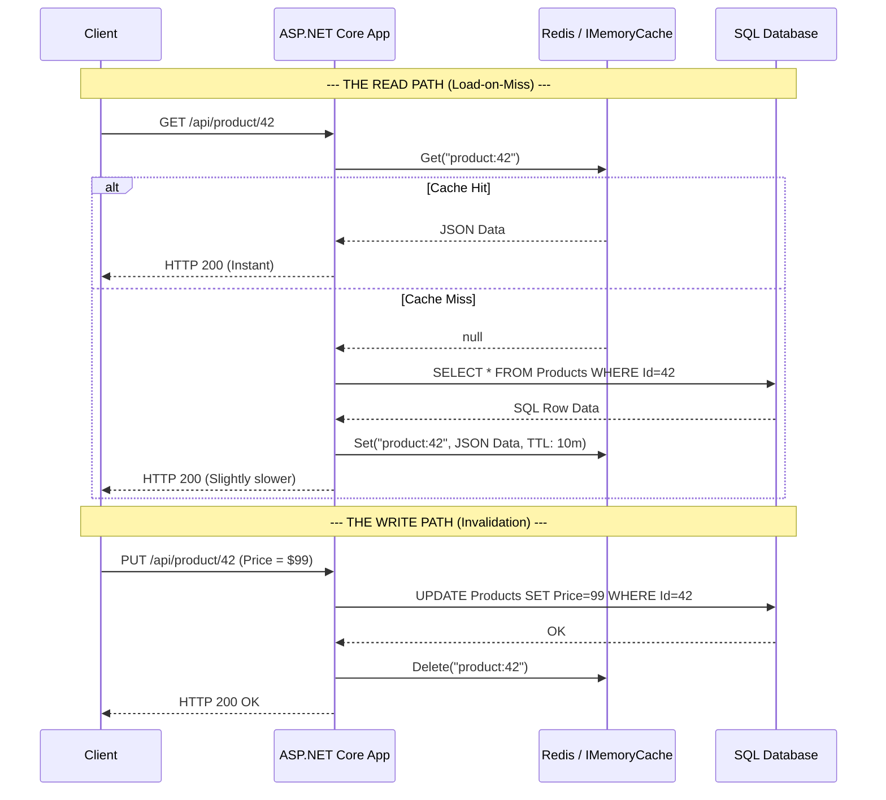

# 4.189 — Cache-Aside Pattern: Load-on-Miss with Async Fallback

## PART 0 — Navigation & Context

```text
ASP.NET Core Domain Hierarchy
├── Performance & Scalability
│   ├── Caching Abstractions
│   │   ├── 4.186 IMemoryCache
│   │   ├── 4.187 IDistributedCache
│   │   └── 4.196 HybridCache
│   └── Caching Patterns
│       ├── 4.189 Cache-Aside ◄ YOU ARE HERE
│       └── 4.193 Cache Stampede Prevention
```

**What you need before this:**
- Understanding of the caching mechanisms provided by ASP.NET Core (`IMemoryCache` or `IDistributedCache`) [[4.186 — IMemoryCache: In-Process Caching with Expiry, Size, and Priority]].
- Familiarity with standard repository patterns and querying databases via Entity Framework Core.

**What this unlocks after:**
- Implementing Cache Stampede protection (locking mechanisms) to prevent database meltdowns during a cache miss [[4.193 — Cache Stampede Prevention: GetOrCreateAsync Locking Patterns]].
- Utilizing the new `.NET 9 HybridCache`, which completely abstracts away the boilerplate of the Cache-Aside pattern.

**Why this matters to a production engineer at scale:**
Caching is not a magical technology that sits transparently in front of your database and makes everything fast. In the ASP.NET Core ecosystem, the application code itself is responsible for orchestrating the flow of data between the cache and the primary data store.
The Cache-Aside (Lazy Loading) pattern is the foundational architectural pattern for 95% of all web application caching. If you implement this incorrectly, you will experience **Stale Data anomalies** (users seeing prices that were changed 3 days ago), **Race Conditions** (overwriting new data with old data), and **Database Meltdowns** (crashing the SQL server when Redis goes offline). Mastering the exact sequence of "Read Cache -> Miss -> Load DB -> Write Cache" and "Write DB -> Delete Cache" separates junior developers from senior systems engineers.

---

## PART 1 — The Core Mental Model

> **The Fundamental Rule**
> **In the Cache-Aside pattern, the Cache does not interact with the Database. The Application (ASP.NET Core) sits in the middle and orchestrates everything. 
> On a READ: The application queries the Cache. If it's a hit, return immediately. If it's a miss, query the Database, save the result to the Cache with a Time-To-Live (TTL), and return it.
> On a WRITE: The application updates the Database FIRST. Then, it explicitly INVALIDATES (deletes) the relevant key in the Cache. The next Read will trigger a miss and reload the fresh data.**

**The Plain-Language Analogy**
Imagine you (the Application) are a student studying for an exam. 
You need the definition of a specific word. 
First, you look at your personal **Notepad** (The Cache). If the definition is there (Cache Hit), great! You answer instantly.
If it is not in your notepad (Cache Miss), you walk to the **Library** to find the massive Encyclopedia (The Database). You find the definition, write it down in your notepad so you have it for next time (Load-on-Miss), and then return to your desk.
If the dictionary publisher changes the definition of the word (A Write/Update), they don't erase your notepad. You must explicitly tear that page out of your notepad (Invalidation) so that the next time you need it, you are forced to go back to the library to get the new definition.

**The Taxonomy Diagram**



---

## PART 2 — Deep Mechanics

### 2.1 — The Read Path (Lazy Loading)
The defining characteristic of Cache-Aside is that data is only loaded into the cache if someone asks for it. It is "Lazy". If a product is never requested, it consumes zero cache memory.
When using `IMemoryCache`, ASP.NET Core provides a brilliant convenience method called `GetOrCreateAsync` that encapsulates the entire read path safely.
When using `IDistributedCache` (Redis), there is no built-in wrapper, so you must write the boilerplate manually.

### 2.2 — The Write Path (Invalidation)
When data changes, you must ensure the cache does not serve stale data indefinitely.
**The Golden Rule of Invalidation:** Always Update the Database FIRST, then DELETE the cache key.
Do NOT try to manually update the cache key with the new value. Why? 
1. If you update the cache, but the Database transaction fails/rolls back, your cache is now lying. It holds a phantom value.
2. If two threads update the database simultaneously, race conditions can cause the cache to hold the older value while the DB holds the newer value.
Deleting the key (Invalidation) forces the next reader to safely pull the definitive truth from the database.

### 2.3 — TTL (Time-To-Live) as the Ultimate Safety Net
Even if you write perfect invalidation code, distributed systems fail. A network partition might prevent your app from sending the `Delete` command to Redis.
If you cache a key *forever* (no TTL), and the delete command fails, that stale data will persist until the end of time.
**Mechanic:** EVERY piece of data placed in a cache MUST have an `AbsoluteExpirationRelativeToNow`. This guarantees that if invalidation fails, the system will eventually heal itself when the TTL expires.

### 2.4 — Async Fallback (Degradation)
Because the application orchestrates the flow, it can handle cache failures gracefully. If Redis crashes and throws a `RedisConnectionException`, the application catches it, logs a warning, and falls back to querying the database directly. The client receives an HTTP 200, completely unaware that the cache is offline.

---

## PART 3 — Production Code Patterns

### Pattern 1: `IMemoryCache` Clean Cache-Aside
Because `IMemoryCache` runs in-process, it provides a thread-safe `GetOrCreateAsync` method.

```csharp
public async Task<ProductDto?> GetProductAsync(int id, CancellationToken ct)
{
    var cacheKey = $"product:{id}";

    // GetOrCreateAsync encapsulates the Read, the Miss, the DB Call, and the Set.
    return await _memoryCache.GetOrCreateAsync(cacheKey, async entry =>
    {
        // 1. Configure the TTL for this specific entry
        entry.AbsoluteExpirationRelativeToNow = TimeSpan.FromMinutes(10);
        entry.Size = 1;

        // 2. The Fallback (executed ONLY on a cache miss)
        var product = await _db.Products
                               .AsNoTracking() // Optimization: No EF tracking needed for read-only caches
                               .FirstOrDefaultAsync(p => p.Id == id, ct);

        // 3. Return the data to be cached (nulls are also cached!)
        return MapToDto(product);
    });
}
```

### Pattern 2: `IDistributedCache` Manual Cache-Aside with Fallback
Because Redis involves network calls, you must write the `try/catch` and boilerplate manually to ensure resilience.

```csharp
public async Task<ProductDto?> GetProductDistributedAsync(int id, CancellationToken ct)
{
    var key = $"product:{id}";

    // 1. Attempt Cache Read
    try
    {
        var cachedBytes = await _distributedCache.GetAsync(key, ct);
        if (cachedBytes != null)
        {
            return JsonSerializer.Deserialize<ProductDto>(cachedBytes);
        }
    }
    catch (Exception ex) // Redis offline!
    {
        _logger.LogWarning(ex, "Failed to read from Distributed Cache. Falling back to DB.");
    }

    // 2. Cache Miss or Cache Failure -> Load from DB
    var entity = await _db.Products.AsNoTracking().FirstOrDefaultAsync(p => p.Id == id, ct);
    if (entity == null) return null;
    var dto = MapToDto(entity);

    // 3. Attempt Cache Write
    try
    {
        var serialized = JsonSerializer.SerializeToUtf8Bytes(dto);
        await _distributedCache.SetAsync(key, serialized, new DistributedCacheEntryOptions
        {
            AbsoluteExpirationRelativeToNow = TimeSpan.FromMinutes(15)
        }, ct);
    }
    catch (Exception ex)
    {
        _logger.LogWarning(ex, "Failed to write to Distributed Cache.");
    }

    return dto;
}
```

### Pattern 3: The Write/Invalidate Pattern
Whenever you update an entity, you MUST wipe the cache.

```csharp
[HttpPut("{id}")]
public async Task<IActionResult> UpdatePrice(int id, [FromBody] decimal newPrice)
{
    // 1. Update the authoritative source FIRST
    var product = await _db.Products.FindAsync(id);
    product.Price = newPrice;
    await _db.SaveChangesAsync(); // Transaction committed!

    // 2. Invalidate the Cache SECOND
    var key = $"product:{id}";
    await _distributedCache.RemoveAsync(key);
    
    return Ok();
}
```

### Pattern 4: Handling "Null" (Negative Caching)
What happens if a user requests `/api/products/9999` and it doesn't exist in the database?
If you just return `null` and don't cache anything, the next request for `9999` will hit the database again. An attacker can DDoS your database by requesting random non-existent IDs.
**Fix:** Cache the `null` result (or an empty DTO) with a short TTL (e.g., 1 minute) to block repeated database hammering.

---

## PART 4 — Gotchas & Anti-Patterns

### Gotcha 1: Updating the Cache instead of Deleting
// ⚠️ FATAL ANTI-PATTERN
```csharp
// Update DB
await _db.SaveChangesAsync();

// Try to be "efficient" by updating the cache without a DB roundtrip
await _cache.SetAsync($"product:{id}", newProductDto); 
```
**Why it fails:** If Thread A and Thread B update the DB at the exact same millisecond, Thread A might write to the DB last (winning the DB race), but Thread B might write to the Cache last (winning the Cache race). Now your Database says the price is $50, but your Cache says the price is $100.
**Fix:** Always DELETE the cache key (`RemoveAsync`). Let the next read request pull the definitive final state from the database.

### Gotcha 2: The Cache Stampede
On a highly trafficked site (e.g., Black Friday homepage), a cache key expires.
Suddenly, 10,000 concurrent requests hit the API.
They all check the cache. They all see a Miss.
All 10,000 requests query the SQL database at the exact same millisecond. The database instantly melts down.
**Fix:** `IMemoryCache.GetOrCreateAsync` locks the key internally, preventing stampedes. `IDistributedCache` does NOT. You must implement distributed locks or use `.NET 9 HybridCache` to serialize database access on a miss.

### Gotcha 3: Infinite TTLs
Never assume your invalidation logic is perfect. Network glitches drop packets. Code deployments introduce bugs. If you set a cache key without an `AbsoluteExpirationRelativeToNow`, and the `RemoveAsync` call fails, that data is permanently stuck. Always apply a TTL, even if it's 24 hours.

### Gotcha 4: Forgetting the L1 Cache in a Two-Tier system
If you use both `IMemoryCache` (L1) and `IDistributedCache/Redis` (L2), updating the Database and clearing Redis is not enough. The local RAM of Pod A still has the old data! You must use pub/sub mechanisms (or `HybridCache`) to tell all pods to drop their local L1 cache keys.

---

## PART 5 — Performance Implications

### Request Pipeline Characteristics

| Scenario | Cache Action | Database Action | Latency |
|---|---|---|---|
| Read (Hit) | Check Cache (Found) | None | < 1ms |
| Read (Miss) | Check Cache (Miss) | Query DB + Save to Cache | ~50ms (DB + Cache Write overhead) |
| Write/Update | Delete Cache Key | Update DB | ~30ms (DB Write) |

**Performance Verdict:**
Cache-Aside dramatically shifts the workload off the database for read-heavy applications. The penalty of a Cache Miss is slightly higher than a raw database call (because you must also serialize and save the data to the cache), but this penalty is paid exactly once per TTL window.

---

## PART 6 — Interview Arsenal

### A. The Question Bank

**Question 1:** "What is the correct order of operations when updating an entity in a system that uses the Cache-Aside pattern? Do you update the cache first, or the database first?"
- **Average Answer:** "You update the database and then update the cache with the new value."
- **Why That's Insufficient:** Advocates updating the cache directly, which leads to race conditions.
- **Great Answer:** "You must update the Database first, because it is the authoritative source of truth. After the database transaction commits successfully, you do NOT update the cache; instead, you invalidate (Delete) the cache key. By deleting the key, you guarantee that the very next read request will trigger a cache miss and cleanly pull the most recent, authoritative state from the database, completely avoiding race conditions."

**Question 2:** "If your Redis cache server goes offline completely, what happens to an API implementing the Cache-Aside pattern?"
- **Average Answer:** "The API throws an exception and returns 500."
- **Why That's Insufficient:** Misses the primary resilience benefit of Application-orchestrated caching.
- **Great Answer:** "If implemented correctly with async fallbacks, the API survives. The Cache-Aside pattern orchestrates the flow in application code. We wrap the Redis `GetAsync` call in a try/catch block. If a `RedisConnectionException` occurs, we log it and gracefully fall back to querying the database directly. The client still receives an HTTP 200 OK. The system degrades in performance, but maintains full availability."

**Question 3:** "What is 'Negative Caching' and why is it important in Cache-Aside?"
- **Average Answer:** "It's when you cache errors."
- **Why That's Insufficient:** Lacks security and performance context regarding 404s.
- **Great Answer:** "Negative Caching is the practice of caching a 'Miss' or a `null` result. If a client requests User ID 9999, and the DB returns null, if we don't cache that null result, a malicious actor or a broken script could request ID 9999 ten thousand times, forcing 10,000 useless queries to the database. By caching the `null` result with a short TTL, we protect the database from being hammered by requests for non-existent resources."

### B. The Trick Questions

**Trick Question:** "I have a background worker that syncs data into the database bypassing the API. I noticed the API is still returning old data. If the API uses Cache-Aside, shouldn't it notice the database changed?"
- **The Trap:** Believing Cache-Aside actively monitors the database.
- **The Correct Answer:** "No, Cache-Aside does not actively monitor the database. The cache only holds data until its TTL expires or the application explicitly calls `RemoveAsync()`. Because the background worker updated the database directly without telling the API's cache to invalidate the key, the API will blindly serve the stale cache data until the TTL naturally expires. You must either have the background worker clear the cache, or use a pub/sub mechanism to notify the API."

### C. Red Flags to Avoid
- 🚩 **"I use Entity Framework Interceptors to automatically update the cache every time I save."** (While theoretically possible, this couples caching to data-access deeply and leads to massive transaction headaches and race conditions. Explicit invalidation at the service/controller boundary is far safer).

---

## PART 7 — Decision Framework

```mermaid
graph TD
    A[Cache-Aside Implementation] --> B{What Operation is happening?}
    
    B -->|READ| C[Query Cache Key]
    C -->|Found| D[Return Data instantly]
    C -->|Not Found / Cache Offline| E[Query Database]
    E --> F[Serialize and Save to Cache with TTL]
    F --> G[Return Data]
    
    B -->|WRITE / UPDATE| H[Execute Database Update]
    H --> I[Commit Database Transaction]
    I --> J[Call cache.RemoveAsync on the specific Key]
    J --> K[Return HTTP 200]
    
    style A fill:#2d3436,stroke:#fff
    style D fill:#00b894,stroke:#fff
    style G fill:#00b894,stroke:#fff
    style H fill:#0984e3,stroke:#fff
    style J fill:#d63031,stroke:#fff
```



---

## PART 8 — Self-Check

### A. Conceptual Questions
1. Who is responsible for fetching data from the database in a Cache-Aside pattern: The Cache Server or the Application?
2. What are the sequence of steps required to safely execute a Write/Update operation?
3. Why is it dangerous to `Set` the cache with a new value during an Update, rather than `Remove`ing the key?
4. How does `IMemoryCache.GetOrCreateAsync` simplify the Cache-Aside pattern compared to `IDistributedCache`?
5. Why must every cached item have a Time-To-Live (TTL)?
6. How does Cache-Aside protect availability if the cache goes offline?
7. What is Negative Caching?
8. Explain what a Cache Stampede is and why a basic Cache-Aside implementation on `IDistributedCache` is vulnerable to it.

### B. Code Puzzles

**Puzzle 1: The Lying Cache**
```csharp
public async Task UpdateStatus(int id, string status) {
    await _cache.SetStringAsync($"item:{id}", status); // 1. Update Cache
    var item = await _db.Items.FindAsync(id);
    item.Status = status;
    await _db.SaveChangesAsync(); // 2. Update DB
}
```
*Scenario:* During high load, the database throws a concurrency exception on `SaveChangesAsync()`. What is the state of the system?
<details>
<summary>Answer</summary>
The system is corrupted. The cache was updated first, but the database transaction failed. Subsequent read requests will hit the cache and return the new status, but the database still holds the old status. The cache is lying.
*Fix:* Always update the DB *first*, ensure `SaveChanges` succeeds, and then `Remove` the cache key.
</details>

**Puzzle 2: The DDoS Vulnerability**
```csharp
var cached = await _cache.GetStringAsync("config");
if (cached != null) return cached;

var dbConfig = await _db.Configs.FirstOrDefaultAsync();
if (dbConfig != null) {
    await _cache.SetStringAsync("config", dbConfig.Value);
}
return dbConfig?.Value;
```
*Scenario:* A malicious user repeatedly calls this endpoint when `dbConfig` does not exist in the database. What happens?
<details>
<summary>Answer</summary>
Because `dbConfig` is null, the code skips the `SetStringAsync` block. Every single request results in a cache miss, forcing a database query. 
*Fix:* Cache the null result! If `dbConfig == null`, cache an empty string or specific token with a short TTL so subsequent requests don't hit the database.
</details>

**Puzzle 3: The Immortal Data**
```csharp
await _cache.SetAsync("catalog", data, new DistributedCacheEntryOptions());
```
*Scenario:* The admin updates the catalog and the code calls `_cache.RemoveAsync("catalog")`. However, due to a network blip, the `RemoveAsync` command times out and fails. How long will clients see the old catalog?
<details>
<summary>Answer</summary>
Forever (or until the Redis server restarts or runs out of memory). By passing an empty `DistributedCacheEntryOptions`, no TTL was set. Because the manual invalidation failed, there is no natural expiry to heal the system.
*Fix:* Always set `AbsoluteExpirationRelativeToNow`.
</details>

---

## PART 9 — Connections & Resources

### A. Related Topics Table

| Topic | Why It Connects |
|---|---|
| [[4.187 — IDistributedCache: The Abstraction for Out-of-Process Caching]] | The core ASP.NET Core interface used to interact with external caches. |
| [[4.193 — Cache Stampede Prevention: GetOrCreateAsync Locking Patterns]] | The critical safety mechanic missing from basic distributed Cache-Aside patterns. |
| [[4.196 — HybridCache (.NET 9): Unified In-Process and Distributed Cache]] | The ultimate evolution of Cache-Aside, which wraps L1/L2 and stampede protection into a single API. |

### B. Books

| Book | Chapters | Why These Chapters |
|---|---|---|
| Data-Intensive Applications (Kleppmann) | Chapter 3: Storage and Retrieval | Discusses the fundamental physics of cache invalidation and consistency. |
| ASP.NET Core in Action, 3rd Ed | Chapter 17: Caching | Walks through `IMemoryCache` lazy-loading examples. |

### C. Essential Articles & Docs
- [Microsoft Architecture: Cache-Aside pattern](https://learn.microsoft.com/en-us/azure/architecture/patterns/cache-aside)
- [Microsoft Docs: Cache in-memory in ASP.NET Core](https://learn.microsoft.com/en-us/aspnet/core/performance/caching/memory)

> [!NOTE]
> **Template Meta-Note**
> Part 0: Context & Prerequisites. Part 1: Core Mental Model. Part 2: Deep Mechanics & Pipeline. Part 3: Production Code. Part 4: Gotchas. Part 5: Performance. Part 6: Interview Arsenal. Part 7: Decision Framework. Part 8: Puzzles. Part 9: Resources.
