# 4.189 — Endpoint Routing & MapGroup

## PART 0 — Navigation & Context

```text
ASP.NET Core Domain Hierarchy
├── Web APIs & Routing
│   ├── 4.188 Minimal APIs Architecture (NET 6+)
│   ├── 4.189 Endpoint Routing & MapGroup ◄ YOU ARE HERE
│   └── 4.190 Filters in Minimal APIs (NET 7+)
└── Middleware Pipeline
```

**What you need before this:**
- Understanding of Minimal APIs syntax (`app.MapGet()`, `app.MapPost()`) [[4.188 — Minimal APIs Architecture (NET 6+)]].
- Familiarity with basic ASP.NET Core Middleware execution order.

**What this unlocks after:**
- Building highly organized, modular monoliths without using MVC Controllers.
- Applying Authorization, CORS, and Rate Limiting to specific groups of endpoints simultaneously.
- Applying Endpoint Filters [[4.190 — Filters in Minimal APIs (NET 7+)]].

**Why this matters to a production engineer at scale:**
When developers first transition from MVC Controllers to Minimal APIs, their biggest complaint is organization. In MVC, you have a `[Route("api/users")]` attribute on a Controller, and all 5 methods inside that class automatically inherit that route prefix, require the same `[Authorize]` attributes, and share the same Swagger tags. 
In .NET 6 Minimal APIs, you had to manually type `app.MapGet("/api/users/{id}").RequireAuthorization().WithTags("Users")` for every single endpoint. It was repetitive and brittle.
In .NET 7, Microsoft introduced **`MapGroup`**. This powerful feature allows you to group multiple endpoints under a single route prefix and apply policies (Auth, Validation, Tags) to the entire group at once. It essentially provides the structural benefits of an MVC Controller without the reflection and memory overhead, allowing Minimal APIs to scale gracefully into massive enterprise applications.

---

## PART 1 — The Core Mental Model

> **The Fundamental Rule**
> **`MapGroup` creates a nested routing scope. Any endpoint defined inside a Group automatically inherits the Route Prefix, Authentication Policies, Rate Limiting Rules, OpenAPI Tags, and Endpoint Filters applied to the parent Group.**

**The Plain-Language Analogy**
Imagine configuring security for a corporate building.
**Without MapGroup:** You walk up to every single door on the 5th floor (501, 502, 503...). On every single door, you tape a sign that says "Marketing Department", and you install an ID badge scanner. If you add a new door, you have to remember to do it again.
**With MapGroup:** You install an ID badge scanner and a "Marketing Department" sign at the *entrance to the elevator lobby on the 5th floor*. Every room inside that floor automatically falls under the lobby's rules. You only configure it once.

**The Taxonomy Diagram**

```mermaid
graph TD
    A[app = WebApplication] -->|app.MapGroup| B[Group: "/api/orders"]
    
    B -->|RequiresAuthorization| C[Auth Policy Applied to Group]
    C -->|WithTags "Orders"| D[Swagger Tag Applied to Group]
    
    D --> E{Define Endpoints on Group}
    
    E -->|group.MapGet "/"| F[GET /api/orders - Auth Required - Tag: Orders]
    E -->|group.MapGet "/{id}"| G[GET /api/orders/5 - Auth Required - Tag: Orders]
    E -->|group.MapPost "/"| H[POST /api/orders - Auth Required - Tag: Orders]
    
    E -->|group.MapGroup "/{id}/items"| I[Nested Group: "/api/orders/{id}/items"]
    I -->|group.MapGet "/"| J[GET /api/orders/5/items - Auth Inherited]
    
    style A fill:#2d3436,stroke:#b2bec3,stroke-width:2px,color:#fff
    style B fill:#0984e3,stroke:#74b9ff,stroke-width:2px,color:#fff
    style D fill:#00b894,stroke:#55efc4,stroke-width:2px,color:#fff
    style I fill:#0984e3,stroke:#74b9ff,stroke-width:2px,color:#fff
```

---

## PART 2 — Deep Mechanics

### 1. The RouteBuilder Hierarchy
The root `WebApplication` object (`app`) implements `IEndpointRouteBuilder`. 
When you call `app.MapGroup("/prefix")`, it returns a `RouteGroupBuilder`. 
Fascinatingly, `RouteGroupBuilder` *also* implements `IEndpointRouteBuilder`. This means any method that can be mapped to `app` can also be mapped to a group, allowing infinite nesting of route hierarchies.

### 2. Prefix Concatenation
Route parameters behave exactly as expected when concatenated.
If the parent group is `/users/{userId}`, and the child endpoint is `/invoices/{invoiceId}`, the resulting full route is `/users/{userId}/invoices/{invoiceId}`. The delegate function bound to that endpoint can simply request `(int userId, int invoiceId)` and Minimal APIs will extract both parameters flawlessly.

### 3. Policy Propagation (Metadata)
When you call `.RequireAuthorization()` or `.WithTags()` on a Group, it adds **Metadata** to the Group builder. When Kestrel compiles the routing tree at startup, it pushes this metadata down to every child endpoint. The actual execution of the policy (like checking the JWT token) happens within the standard ASP.NET Core Middleware pipeline *after* the endpoint route is matched.

---

## PART 3 — Production Code Patterns

### Pattern 1: Basic MapGroup (Replacing the Controller)
Converting what used to be an MVC `ProductsController` into a clean Minimal API group.

```csharp
// Program.cs
var app = builder.Build();

// 1. Define the Group
var productsApi = app.MapGroup("/api/products")
    .RequireAuthorization("AdminPolicy") // Applies to ALL endpoints below
    .WithTags("Products Catalog");       // Swagger Grouping

// 2. Map endpoints ON THE GROUP (not on 'app')
// Resolves to: GET /api/products
productsApi.MapGet("/", async (AppDbContext db) => 
    await db.Products.ToListAsync());

// Resolves to: GET /api/products/5
productsApi.MapGet("/{id}", async (int id, AppDbContext db) => 
    await db.Products.FindAsync(id));

// Resolves to: POST /api/products
productsApi.MapPost("/", async (Product dto, AppDbContext db) => {
    db.Products.Add(dto);
    await db.SaveChangesAsync();
    return TypedResults.Created($"/api/products/{dto.Id}", dto);
});

app.Run();
```

### Pattern 2: Extension Method Modules (The Carter Pattern)
If you define 20 groups in `Program.cs`, the file becomes messy. The industry standard is to extract the group mapping into static extension methods.

```csharp
// Modules/UsersModule.cs
public static class UsersModule
{
    // Extend IEndpointRouteBuilder so it can be called from 'app'
    public static RouteGroupBuilder MapUsersApi(this IEndpointRouteBuilder routes)
    {
        var group = routes.MapGroup("/api/users")
            .WithTags("Users");

        group.MapGet("/", GetAllUsers);
        group.MapGet("/{id}", GetUserById).AllowAnonymous(); // Overrides group auth if needed!
        group.MapPost("/", CreateUser);

        return group;
    }

    // Method Group Delegates (Keep them static!)
    private static IResult GetAllUsers() { ... }
    private static IResult GetUserById(int id) { ... }
    private static IResult CreateUser(UserDto dto) { ... }
}

// Program.cs
var app = builder.Build();

// Elegant, 2-line Program.cs routing
app.MapUsersApi().RequireAuthorization(); // You can even chain policies on the returned group!
app.MapOrdersApi().RequireAuthorization();

app.Run();
```

### Pattern 3: Nested Groups
Building hierarchical REST paths like `/api/tenants/{tenantId}/users/{userId}`.

```csharp
public static RouteGroupBuilder MapTenantApi(this IEndpointRouteBuilder routes)
{
    // Level 1: Tenant
    var tenantGroup = routes.MapGroup("/api/tenants/{tenantId}")
        .AddEndpointFilter<TenantValidationFilter>(); // Validates tenantId exists

    tenantGroup.MapGet("/", (string tenantId) => $"Tenant {tenantId} Details");

    // Level 2: Users within a Tenant
    var usersGroup = tenantGroup.MapGroup("/users");
    
    // Resolves to: GET /api/tenants/{tenantId}/users/{userId}
    usersGroup.MapGet("/{userId}", (string tenantId, int userId) => 
        $"User {userId} in Tenant {tenantId}");

    return tenantGroup;
}
```

### Pattern 4: Global API Versioning
Using `MapGroup` is the easiest way to prefix versions without third-party libraries (though `Asp.Versioning.Http` is recommended for complex scenarios).

```csharp
var v1 = app.MapGroup("/api/v1");
v1.MapUsersApiV1();
v1.MapOrdersApiV1();

var v2 = app.MapGroup("/api/v2");
v2.MapUsersApiV2();
// Orders API hasn't changed, reuse the V1 logic on the V2 route!
v2.MapOrdersApiV1(); 
```

---

## PART 4 — Gotchas & Anti-Patterns

### Gotcha 1: Mapping to `app` instead of `group`
The most common copy-paste error when refactoring to `MapGroup`.

// ⚠️ WRONG CODE
```csharp
var myGroup = app.MapGroup("/api/payments").RequireAuthorization();

// Developer copy-pasted old code and forgot to change 'app' to 'myGroup'
app.MapPost("/charge", ProcessPayment); 
```

// HTTP consequence (wrong path):
// The endpoint is mapped to the root `/charge`, NOT `/api/payments/charge`. 
// Worse, it completely bypasses the `.RequireAuthorization()` policy applied to the group, leaving the payment endpoint publicly accessible and exposing the company to financial ruin.

// ✅ CORRECT CODE
```csharp
myGroup.MapPost("/charge", ProcessPayment);
```

### Gotcha 2: Conflicting Route Parameters
If a parent group defines a parameter `{id}`, and a child endpoint also defines `{id}`.

// ⚠️ WRONG CODE
```csharp
var usersGroup = app.MapGroup("/api/users/{id}");

// Redefines {id}!
usersGroup.MapGet("/invoices/{id}", (int id) => { ... }); 
```

// HTTP consequence (wrong path):
// Kestrel's routing engine will crash at startup with a `RoutePatternException`: "The route parameter name 'id' appears more than one time in the route template."

// ✅ CORRECT CODE
```csharp
var usersGroup = app.MapGroup("/api/users/{userId}");
usersGroup.MapGet("/invoices/{invoiceId}", (int userId, int invoiceId) => { ... });
```

### Gotcha 3: Applying Middleware instead of Filters
Developers try to use `.UseMiddleware()` on a group.

// ⚠️ WRONG CODE
```csharp
var group = app.MapGroup("/api/secure");
// Compile Error! UseMiddleware does not exist on RouteGroupBuilder
group.UseMiddleware<MyCustomSecurityMiddleware>(); 
```

// HTTP consequence (wrong path):
// Standard ASP.NET Core Middleware (`.Use...`) operates on the *entire* HTTP pipeline, BEFORE endpoint routing occurs. You cannot apply traditional middleware to a specific `MapGroup`.

// ✅ CORRECT CODE
// To execute logic for a specific group of Minimal API endpoints, you MUST use Endpoint Filters (.NET 7+).
```csharp
group.AddEndpointFilter<MyCustomSecurityFilter>();
```

---

## PART 5 — Performance Implications

### Request Pipeline Characteristics

| Routing Strategy | Memory Allocation | Startup Speed | Route Matching Speed |
|---|---|---|---|
| MVC Controllers | High | Slow | Fast |
| Flat Minimal APIs (app.Map) | Low | Fast | Fast |
| Grouped Minimal APIs | Low | Fast | **Fastest** |

### The Kestrel Routing Tree (Trie)
Under the hood, ASP.NET Core Endpoint Routing builds a sophisticated Radix Tree (Trie) to match incoming URLs to endpoints. 
When you use `MapGroup`, you actually help the routing engine optimize the tree. If Kestrel receives `GET /api/users/5`, and it sees that `/api/orders` doesn't match the first segment, it instantly prunes the entire branch of Order endpoints from the search space. 
Grouping your endpoints logically by URL prefix technically improves route-matching performance by microseconds compared to registering 500 completely random URL strings at the root level.

---

## PART 6 — Interview Arsenal

### A. The Question Bank

**Question 1:** "How do you apply a CORS policy or a Rate Limiting policy to 10 Minimal API endpoints without duplicating code on every single endpoint?"
- **Average Answer:** "You put a middleware in Program.cs."
- **Why That's Insufficient:** That applies it globally to the whole app. The question asked for 10 specific endpoints.
- **Great Answer:** "We use `MapGroup`. We group the 10 endpoints under a single `RouteGroupBuilder` by calling `app.MapGroup(\"/prefix\")`. We then chain the policy to the group using `.RequireCors(\"PolicyName\")` and `.RequireRateLimiting(\"PolicyName\")`. The routing framework automatically propagates these metadata policies down to all 10 child endpoints."

**Question 2:** "Can an endpoint inside a `MapGroup` override an authorization policy applied to the parent group?"
- **Average Answer:** "No, groups are strict."
- **Why That's Insufficient:** Ignores the additive nature of endpoint metadata.
- **Great Answer:** "Yes. Endpoint metadata is hierarchical and evaluated from the specific endpoint up to the group. If the parent group calls `.RequireAuthorization()`, but a specific child endpoint calls `.AllowAnonymous()`, the `AllowAnonymous` metadata wins for that specific route, allowing it to bypass the group's security requirements. This is highly useful for grouping an entire controller but exposing a specific `/status` or `/webhook` endpoint."

**Question 3:** "Why can't you call `.UseMiddleware<T>()` on a `RouteGroupBuilder`?"
- **Average Answer:** "Because middleware is for the whole app."
- **Why That's Insufficient:** Fails to explain the lifecycle difference between Middleware and Endpoint Routing.
- **Great Answer:** "Standard Middleware executes as part of the primary HTTP request pipeline *before* the Endpoint Routing middleware (`UseRouting`) has even determined which endpoint will be executed. Because `RouteGroupBuilder` defines endpoints, not pipeline middleware, you cannot attach middleware to it. If you need middleware-like behavior (such as intercepting the request, inspecting headers, or short-circuiting the response) scoped specifically to a group, you must use Endpoint Filters (`AddEndpointFilter`), which execute *after* the route is matched but *before* the endpoint delegate runs."

### B. The Trick Questions

**Trick Question:** "If I create `var group1 = app.MapGroup(\"/api\");` and `var group2 = app.MapGroup(\"/api\");`, will ASP.NET Core crash at startup because of duplicate groups?"
- **The Trap:** Thinking groups must have unique URLs.
- **The Correct Answer:** "No, it will not crash. Groups are just logical metadata containers that prefix strings. You can create multiple groups with the exact same prefix. As long as the actual *child endpoints* inside those groups don't resolve to the exact same HTTP Verb and URL combination, the routing engine merges them perfectly fine."

### C. Red Flags to Avoid
- 🚩 **"I use Minimal APIs but I don't use MapGroup, I just type `/api/v1/users/...` manually 50 times."** (This results in highly fragile code. If the V1 changes to V2, you have to do a massive Find/Replace).
- 🚩 **"I put all my `MapGroup` definitions in a massive region block inside `Program.cs`."** (Use Extension Methods. Regions are an anti-pattern for hiding bad file organization).

---

## PART 7 — Decision Framework

```mermaid
graph TD
    A[Organize Minimal APIs] --> B{Does the app have more than 5 endpoints?}
    
    B -->|No| C[Keep flat in Program.cs]
    B -->|Yes| D[Create Extension Methods for Modules]
    
    D --> E{Do endpoints share a URL prefix e.g. /api/users?}
    
    E -->|Yes| F[Use MapGroup]
    E -->|No| G[Map directly to IEndpointRouteBuilder]
    
    F --> H{Do they share Auth / Tags / Rate Limits?}
    H -->|Yes| I[Apply policies to the Group Builder]
    H -->|No| J[Apply policies to individual endpoints]
    
    I --> K[Child endpoints inherit all policies]
    
    style A fill:#2d3436,stroke:#fff
    style C fill:#0984e3,stroke:#fff
    style F fill:#00b894,stroke:#fff
    style I fill:#00b894,stroke:#fff
    style K fill:#d63031,stroke:#fff
```



---

## PART 8 — Self-Check

### A. Conceptual Questions
1. What is the primary problem that `MapGroup` solves in Minimal APIs?
2. What interface does `RouteGroupBuilder` implement that allows groups to be nested infinitely?
3. How does Swagger/OpenAPI interpret a `.WithTags("Users")` call on a group?
4. How do you bypass a group's `RequireAuthorization` requirement for a single endpoint?
5. What happens if a parent group and a child endpoint use the exact same route parameter name `{id}`?
6. Why does grouping endpoints theoretically improve Kestrel's route-matching speed?
7. What is the "Carter" pattern regarding Extension Methods?
8. Why can't you use `.UseMiddleware()` on a MapGroup?

### B. Code Puzzles

**Puzzle 1: The Invisible Prefix**
```csharp
var api = app.MapGroup("api"); // Missing the leading slash!
api.MapGet("/users", () => "Users");
```
*Scenario:* Does this crash or silently fail?
<details>
<summary>Answer</summary>
It works perfectly. ASP.NET Core routing is highly forgiving with slashes. `MapGroup("api")` combined with `MapGet("/users")` safely resolves to `/api/users`. However, it is best practice to consistently use leading slashes `/api`.
</details>

**Puzzle 2: The Lost Metadata**
```csharp
var group = app.MapGroup("/admin");
group.MapGet("/dashboard", () => "Secret").RequireAuthorization();
group.RequireAuthorization(); // Applied AFTER the endpoints are mapped!
group.MapGet("/settings", () => "Settings");
```
*Scenario:* Is `/dashboard` protected by the group's `RequireAuthorization()` call?
<details>
<summary>Answer</summary>
Yes. Unlike standard Pipeline Middleware (where order of registration is critical), `MapGroup` metadata is evaluated after the entire tree is built. Calling `RequireAuthorization` on the group applies it to ALL endpoints attached to that group, regardless of whether the endpoints were mapped before or after the policy was attached.
</details>

**Puzzle 3: The Empty Group**
```csharp
var v1 = app.MapGroup("/v1").WithTags("V1 API");
// No endpoints are mapped to v1
```
*Scenario:* Will Swagger show an empty "V1 API" category?
<details>
<summary>Answer</summary>
No. A RouteGroup without any actual endpoints resolves to nothing. The routing engine ignores it, and Swagger ignores the tags because there are no HTTP methods associated with them.
</details>

---

## PART 9 — Connections & Resources

### A. Related Topics Table

| Topic | Why It Connects |
|---|---|
| [[4.188 — Minimal APIs Architecture (NET 6+)]] | The foundation of mapping HTTP verbs to delegates. |
| [[4.190 — Filters in Minimal APIs (NET 7+)]] | The mechanism used to execute logic on MapGroups (since Middleware isn't allowed). |
| [[4.050 — Writing Middleware]] | Understanding the pipeline order to see why Middleware can't be applied to groups. |

### B. Books

| Book | Chapters | Why These Chapters |
|---|---|---|
| ASP.NET Core in Action, 3rd Ed | Chapter 5: Mapping URLs | Covers RouteGroups and organizing Minimal APIs. |
| Pro ASP.NET Core 6 | Chapter 13: Using Minimal APIs | Discusses routing trees and parameter propagation. |

### C. Essential Articles & Docs
- [Microsoft Docs: Route groups in Minimal APIs](https://learn.microsoft.com/en-us/aspnet/core/fundamentals/minimal-apis/route-handlers?view=aspnetcore-8.0#route-groups)
- [Andrew Lock: Grouping Minimal API endpoints with MapGroup](https://andrewlock.net/grouping-minimal-api-endpoints-with-mapgroup-in-dotnet-7/)

> [!NOTE]
> **Template Meta-Note**
> Part 0: Context & Prerequisites. Part 1: Core Mental Model. Part 2: Deep Mechanics & Pipeline. Part 3: Production Code. Part 4: Gotchas. Part 5: Performance. Part 6: Interview Arsenal. Part 7: Decision Framework. Part 8: Puzzles. Part 9: Resources.
