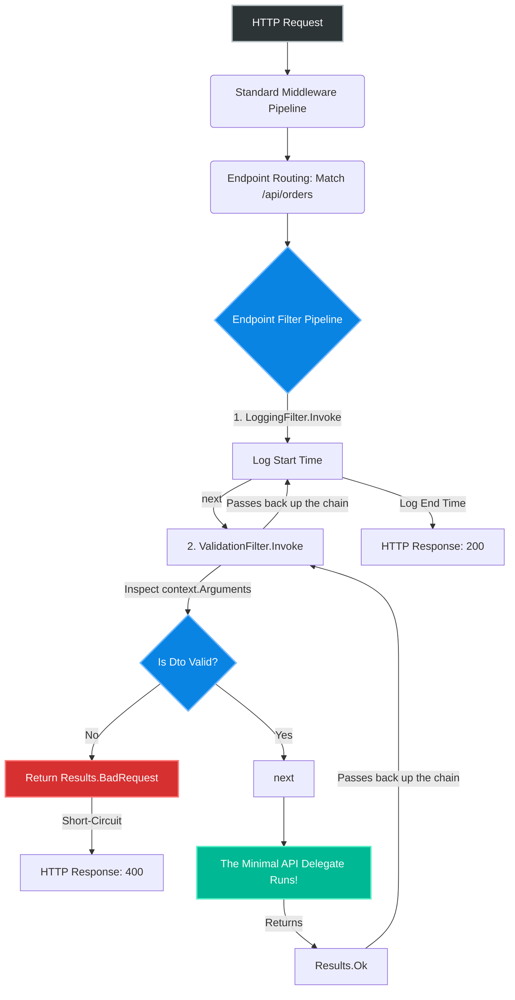

# 4.190 — Filters in Minimal APIs (NET 7+)

## PART 0 — Navigation & Context

```text
ASP.NET Core Domain Hierarchy
├── Web APIs & Routing
│   ├── 4.188 Minimal APIs Architecture (NET 6+)
│   ├── 4.189 Endpoint Routing & MapGroup
│   ├── 4.190 Filters in Minimal APIs (NET 7+) ◄ YOU ARE HERE
└── Middleware Pipeline
    └── 4.050 Writing Middleware
```

**What you need before this:**
- Strong understanding of Minimal APIs [[4.188 — Minimal APIs Architecture (NET 6+)]].
- Understanding of the pipeline paradigm (Middleware: `next()`).

**What this unlocks after:**
- Implementing FluentValidation cleanly in Minimal APIs.
- Replacing MVC Action Filters with high-performance Minimal API Filters.
- Modifying request arguments or responses globally for `MapGroup` routes.

**Why this matters to a production engineer at scale:**
When Minimal APIs were released in .NET 6, they had a massive missing feature: Aspect-Oriented Programming (AOP). In MVC, if you wanted to validate a model, log the request duration, or catch exceptions for a specific controller, you wrote an `ActionFilterAttribute` and placed it on the Controller. 
Minimal APIs don't have Controllers. Developers were forced to either duplicate validation logic inside every single lambda function, or write global ASP.NET Core Middleware. But global Middleware executes for *every* request (including static files and health checks), which is inefficient, and Middleware cannot easily see the strongly-typed C# arguments bound to the endpoint.
In .NET 7, Microsoft introduced **Endpoint Filters**. Filters run exactly like MVC Action Filters: they wrap the execution of the Minimal API endpoint, allowing you to intercept, modify, validate, or short-circuit the request *after* routing and binding have occurred, but *before* your business logic executes.

---

## PART 1 — The Core Mental Model

> **The Fundamental Rule**
> **An Endpoint Filter is a localized piece of middleware that wraps a Minimal API delegate. It intercepts the request right before the delegate runs, giving you full access to the strongly-typed bound arguments (e.g., the parsed JSON object), allowing you to validate data or short-circuit the response without executing the actual endpoint.**

**The Plain-Language Analogy**
Imagine a VIP Nightclub (The Minimal API Endpoint).
**Global Middleware:** The bouncer at the street block. He stops *everyone* walking down the street, checks their ID, and lets them pass. He doesn't know who is going to the club and who is just going to the grocery store. It's inefficient.
**Endpoint Filter:** The bouncer standing directly in front of the VIP Room door. He only checks people who are explicitly trying to enter the VIP room. Furthermore, he knows exactly what the person ordered at the bar (The Bound Arguments) and can reject them if they brought a glass bottle (Validation), turning them away (Short-circuiting) before they ever step foot in the VIP room.

**The Taxonomy Diagram**



---

## PART 2 — Deep Mechanics

### 1. `IEndpointFilter` and the `next` Delegate
Filters implement `IEndpointFilter` or are provided as an inline lambda. 
The core execution revolves around `EndpointFilterInvocationContext` and the `next` delegate. 
- `context.Arguments`: A zero-indexed list of the strongly-typed parameters extracted from the request. (e.g., `context.Arguments[0]` might be the `OrderDto`).
- `await next(context)`: Calls the next filter in the chain. If it's the last filter, it executes your actual Minimal API logic.
- **Short-circuiting:** If you return `Results.BadRequest()` *instead* of calling `await next(context)`, the endpoint logic never executes.

### 2. Filters vs Middleware
| Feature | Middleware | Endpoint Filters |
|---|---|---|
| **Scope** | Executes for *all* HTTP requests. | Executes only for the *mapped endpoint/group*. |
| **Data Access** | Reads raw HTTP Streams (Bytes/JSON). | Reads fully parsed, bound C# Objects. |
| **State** | Blind to endpoint parameters. | Full access to `context.Arguments`. |
| **Best For** | CORS, Global Auth, Request Logging. | Model Validation, Endpoint-specific rules. |

### 3. Application via MapGroup
Filters truly shine when combined with `MapGroup`. You apply the filter once to the group, and it intercepts every single endpoint within that module.

---

## PART 3 — Production Code Patterns

### Pattern 1: The Inline Filter (Simple Logging)
You can attach a simple filter directly to an endpoint using `.AddEndpointFilter()`.

```csharp
app.MapGet("/products/{id}", (int id) => $"Product {id}")
    .AddEndpointFilter(async (context, next) =>
    {
        // 1. BEFORE execution
        Console.WriteLine($"Starting execution for route: {context.HttpContext.Request.Path}");
        
        // You can read the parsed arguments!
        var productId = (int)context.Arguments[0]!;
        Console.WriteLine($"Requested Product ID: {productId}");

        // 2. EXECUTE the endpoint
        var result = await next(context);

        // 3. AFTER execution
        Console.WriteLine($"Finished execution. Result Type: {result.GetType().Name}");
        
        return result;
    });
```

### Pattern 2: Class-Based Filters (IEndpointFilter)
For complex, reusable logic, create a class implementing `IEndpointFilter`.

```csharp
// 1. Define the Filter Class
public class ApiKeyValidationFilter : IEndpointFilter
{
    private readonly string _validApiKey = "secret_123";

    public async ValueTask<object?> InvokeAsync(
        EndpointFilterInvocationContext context, 
        EndpointFilterDelegate next)
    {
        var apiKey = context.HttpContext.Request.Headers["X-API-KEY"].FirstOrDefault();

        if (apiKey != _validApiKey)
        {
            // ✅ CORRECT: Short-circuit the request. 'next' is never called.
            return Results.Unauthorized(); 
        }

        // Authentication passed. Proceed to the endpoint.
        return await next(context);
    }
}

// 2. Apply to a MapGroup
var adminApi = app.MapGroup("/admin")
    .AddEndpointFilter<ApiKeyValidationFilter>(); // Requires API Key for all admin routes

adminApi.MapDelete("/users/{id}", (int id) => "Deleted");
```

### Pattern 3: FluentValidation Integration (The Ultimate Use Case)
Because Minimal APIs do not automatically validate `DataAnnotations` like MVC Controllers do, you must implement validation yourself. Using an Endpoint Filter with FluentValidation is the industry standard.

```bash
dotnet add package FluentValidation.DependencyInjectionExtensions
```

```csharp
// 1. Define DTO and Validator
public record CreateUserRequest(string Email, int Age);

public class UserValidator : AbstractValidator<CreateUserRequest>
{
    public UserValidator()
    {
        RuleFor(x => x.Email).NotEmpty().EmailAddress();
        RuleFor(x => x.Age).GreaterThan(18);
    }
}

// 2. The Generic Validation Filter
public class ValidationFilter<T> : IEndpointFilter where T : class
{
    private readonly IValidator<T> _validator;

    // Kestrel injects the Validator from DI
    public ValidationFilter(IValidator<T> validator) => _validator = validator;

    public async ValueTask<object?> InvokeAsync(EndpointFilterInvocationContext context, EndpointFilterDelegate next)
    {
        // Find the argument of type T in the delegate's signature
        var targetArgument = context.Arguments.FirstOrDefault(a => a is T) as T;

        if (targetArgument is not null)
        {
            var validationResult = await _validator.ValidateAsync(targetArgument);

            if (!validationResult.IsValid)
            {
                // Short-circuit with RFC 7807 ValidationProblem details
                return Results.ValidationProblem(validationResult.ToDictionary());
            }
        }

        return await next(context);
    }
}

// 3. Wire it up
builder.Services.AddValidatorsFromAssemblyContaining<UserValidator>();
var app = builder.Build();

app.MapPost("/users", (CreateUserRequest req) => Results.Ok("Valid!"))
    // Attach the filter explicitly for the DTO type
    .AddEndpointFilter<ValidationFilter<CreateUserRequest>>(); 
```

### Pattern 4: Mutating the Response
Filters can inspect and alter the result returned by the Minimal API.

```csharp
public class ResponseWrapperFilter : IEndpointFilter
{
    public async ValueTask<object?> InvokeAsync(EndpointFilterInvocationContext context, EndpointFilterDelegate next)
    {
        // Execute the endpoint logic
        var result = await next(context);

        // If the endpoint returned a plain string, wrap it in a standard JSON format
        if (result is string message)
        {
            return Results.Ok(new { 
                Success = true, 
                Data = message, 
                Timestamp = DateTime.UtcNow 
            });
        }

        return result; // Leave IResult/TypedResults alone
    }
}
```

---

## PART 4 — Gotchas & Anti-Patterns

### Gotcha 1: Hardcoding Argument Indices
Relying on `context.Arguments[0]` assuming it is always the specific parameter you need.

// ⚠️ WRONG CODE
```csharp
app.MapPost("/users", (int tenantId, UserDto dto) => ...)
    .AddEndpointFilter(async (context, next) => {
        // Developer assumes the DTO is always parameter 0
        var dto = (UserDto)context.Arguments[0]; // ❌ InvalidCastException! It's an int.
    });
```

// HTTP consequence (wrong path):
// If another developer refactors the endpoint signature to `(UserDto dto, int tenantId)`, the parameter order changes, and the filter crashes at runtime with a casting exception.

// ✅ CORRECT CODE
// Search for the argument by Type.
```csharp
var dto = context.Arguments.OfType<UserDto>().FirstOrDefault();
```

### Gotcha 2: Using Filters for Global Cross-Cutting Concerns
Developers discover filters and decide to use them for global Error Handling or global Request Logging.

// ⚠️ WRONG CODE
```csharp
// Applying a filter to the root app to catch exceptions
app.AddEndpointFilter<GlobalExceptionFilter>(); // ❌ Doesn't exist on 'app'
```

// ✅ CORRECT CODE
// Endpoint Filters ONLY execute for endpoints. If a client requests `GET /favicon.ico` (a static file) or triggers an HTTP 404 (Route not found), Endpoint Filters are completely bypassed because no endpoint matched. 
// Global Exception Handling and Global Logging MUST remain as traditional ASP.NET Core Middleware (`UseExceptionHandler`, `UseSerilogRequestLogging`). Use Filters strictly for business-logic validation or endpoint-specific rules.

### Gotcha 3: Forgetting to await `next`
If you do an asynchronous operation before calling `next`, but forget the `await` keyword.

// ⚠️ WRONG CODE
```csharp
public async ValueTask<object?> InvokeAsync(EndpointFilterInvocationContext context, EndpointFilterDelegate next)
{
    // Do something sync
    return next(context); // ❌ Returning an un-awaited ValueTask
}
```

// HTTP consequence (wrong path):
// The request pipeline detaches. The Kestrel thread returns to the pool before the endpoint finishes executing. DbContexts get disposed prematurely. Massive runtime crashes.

// ✅ CORRECT CODE
```csharp
return await next(context);
```

### Gotcha 4: Returning raw objects instead of IResult
If a filter intercepts a failure, developers sometimes return raw objects.

// ⚠️ WRONG CODE
```csharp
if (!isValid) return "Invalid Request"; 
```

// HTTP consequence (wrong path):
// Minimal APIs will serialize the string "Invalid Request" and return an HTTP 200 OK!

// ✅ CORRECT CODE
// Always use the `Results` factory when short-circuiting in a filter.
```csharp
if (!isValid) return Results.BadRequest("Invalid Request");
```

---

## PART 5 — Performance Implications

### Request Pipeline Characteristics

| Interception Method | Instantiation Cost | Execution Speed | AOT Compatible |
|---|---|---|---|
| MVC ActionFilter | High (Reflection) | Fast | No |
| Global Middleware | Low | Fastest | Yes |
| Endpoint Filter | Low (DI Cached) | Very Fast | Yes |

### Filter Factory Pattern
In high-performance scenarios, reading `context.Arguments.OfType<T>()` on *every single request* incurs minor LINQ overhead. Microsoft provides `IEndpointFilterFactory`. A Filter Factory runs exactly ONCE during application startup. It inspects the MethodInfo of the delegate, figures out exactly which index the parameter is at, and caches an optimized filter lambda. 

**When to Care:** Unless your Minimal API is receiving 50,000+ requests per second, the standard `IEndpointFilter` using LINQ `OfType<T>()` is perfectly fine. The real performance gain of Endpoint Filters is that they completely eliminate the need for Reflection-based MVC Action Filters.

---

## PART 6 — Interview Arsenal

### A. The Question Bank

**Question 1:** "What is the architectural difference between ASP.NET Core Middleware and a Minimal API Endpoint Filter?"
- **Average Answer:** "Filters are for Minimal APIs, Middleware is for the whole app."
- **Why That's Insufficient:** Ignores the difference in data parsing and state access.
- **Great Answer:** "Middleware operates at the very bottom of the HTTP pipeline. It only has access to the raw `HttpContext`, meaning it deals with streams of bytes and unparsed JSON. An Endpoint Filter executes at the very top of the pipeline, right before the Minimal API delegate runs. Because routing and Model Binding have already occurred, the Endpoint Filter has full access to `context.Arguments`, which contains the fully parsed, strongly-typed C# objects (like DTOs). This makes Filters perfect for Model Validation, whereas Middleware is perfect for global tasks like CORS or Logging."

**Question 2:** "Minimal APIs do not execute `[Required]` DataAnnotation attributes automatically. How do you implement global DTO validation in a Minimal API architecture?"
- **Average Answer:** "You validate it inside the endpoint."
- **Why That's Insufficient:** Validating inside 50 endpoints violates DRY (Don't Repeat Yourself).
- **Great Answer:** "The standard approach is to use FluentValidation combined with a generic Endpoint Filter. We create a `ValidationFilter<T>` that intercepts the request, extracts the argument of type `T` from `context.Arguments`, and runs the injected FluentValidator against it. If validation fails, the Filter short-circuits the request by returning `Results.ValidationProblem()`. We then attach this filter to our endpoints or `MapGroup`s. This gives us global, automated validation without polluting the actual business logic."

**Question 3:** "If an Endpoint Filter determines a request is unauthorized, how does it prevent the Minimal API delegate from executing?"
- **Average Answer:** "It throws an exception."
- **Why That's Insufficient:** Throwing exceptions for flow control is a massive anti-pattern and performance killer in .NET.
- **Great Answer:** "It short-circuits the pipeline. The Filter's `InvokeAsync` method receives a `next` delegate. If the request is valid, the filter calls `await next(context)` to pass control down the chain. If the request is unauthorized, the filter simply returns `Results.Unauthorized()` directly, completely ignoring the `next` delegate. Because `next` is never invoked, the Minimal API delegate is never executed, and the response bounces straight back up the pipeline to the client."

### B. The Trick Questions

**Trick Question:** "I added an Endpoint Filter to `app.MapGroup(\"/api\")` that catches exceptions and returns `Results.Problem()`. If a user goes to a route that doesn't exist (`/api/fake`), will my filter catch the 404 error?"
- **The Trap:** Conflating endpoint filters with routing middleware.
- **The Correct Answer:** "No, the filter will never execute. Endpoint Filters are tightly coupled to *matched endpoints*. If the routing engine cannot find a matching endpoint for `/api/fake`, it returns a 404 immediately. The request never reaches the Endpoint Filter pipeline. To catch 404s or global exceptions, you must use standard global Middleware."

**Trick Question:** "Can I apply an Endpoint Filter to an MVC Controller?"
- **The Trap:** Endpoint Filters were built for Minimal APIs.
- **The Correct Answer:** "Surprisingly, yes! In .NET 7+, because MVC Controllers are now routed using Endpoint Routing, you *can* technically apply an Endpoint Filter to a Controller or Razor Page. However, it is strongly discouraged, as MVC already has a mature `ActionFilter` ecosystem that interacts better with the MVC `ControllerContext`."

### C. Red Flags to Avoid
- 🚩 **"I use `context.Arguments[1]` assuming the object I need is always the second parameter."** (Highly brittle. A simple refactoring of the endpoint signature will crash the application in production).
- 🚩 **"I put all my database logic inside my Endpoint Filter."** (Filters are for cross-cutting concerns: Validation, Auth, Formatting. Do not put domain business logic inside them).

---

## PART 7 — Decision Framework

```mermaid
graph TD
    A[Need to intercept a Request/Response] --> B{Does it apply to EVERY HTTP request e.g. 404s, Static Files?}
    
    B -->|Yes| C[Write Global Middleware]
    B -->|No, it applies to specific APIs| D{Are you using MVC Controllers or Minimal APIs?}
    
    D -->|MVC Controllers| E[Write ActionFilterAttribute]
    D -->|Minimal APIs| F[Write Endpoint Filter]
    
    F --> G{What is the logic?}
    
    G -->|Validate DTO| H[Generic ValidationFilter with FluentValidation]
    G -->|Custom Auth / Header Check| I[Filter returning Results.Unauthorized]
    G -->|Format output| J[Filter wrapping await next result]
    
    H --> K[Apply via .AddEndpointFilter to MapGroup]
    I --> K
    J --> K
    
    style A fill:#2d3436,stroke:#fff
    style C fill:#0984e3,stroke:#fff
    style E fill:#0984e3,stroke:#fff
    style H fill:#00b894,stroke:#fff
    style I fill:#00b894,stroke:#fff
    style K fill:#d63031,stroke:#fff
```



---

## PART 8 — Self-Check

### A. Conceptual Questions
1. Why were Endpoint Filters introduced when Middleware already existed?
2. At what exact point in the HTTP pipeline does an Endpoint Filter execute?
3. How do you short-circuit an Endpoint Filter to prevent the API logic from running?
4. What does `context.Arguments` contain?
5. Why is it a bad idea to use `context.Arguments[0]`?
6. Can an Endpoint Filter modify the value returned by the Minimal API delegate?
7. What is the standard library used to perform DTO validation inside an Endpoint Filter?
8. Will an Endpoint Filter execute if the user hits an invalid URL?

### B. Code Puzzles

**Puzzle 1: The Cast Crash**
```csharp
app.MapPost("/users", (string name, int age) => { ... })
    .AddEndpointFilter(async (ctx, next) => {
        var dto = ctx.Arguments.OfType<UserDto>().FirstOrDefault();
        if (dto.Age < 18) return Results.BadRequest(); // CRASH!
        return await next(ctx);
    });
```
*Scenario:* The API throws a NullReferenceException before your business logic even runs.
<details>
<summary>Answer</summary>
The endpoint expects `(string name, int age)`. There is no `UserDto` in the signature. `OfType<UserDto>()` returns an empty collection, so `FirstOrDefault()` returns `null`. Calling `.Age` on `null` throws a NullReferenceException.
*Fix:* Always check `if (dto is not null)` before validating.
</details>

**Puzzle 2: The Double Execution**
```csharp
public async ValueTask<object?> InvokeAsync(EndpointFilterInvocationContext context, EndpointFilterDelegate next)
{
    var result1 = await next(context);
    var result2 = await next(context);
    return result2;
}
```
*Scenario:* What happens to the database if the endpoint is a POST request that creates a User?
<details>
<summary>Answer</summary>
The Minimal API delegate is literally executed twice. The user is inserted into the database twice. 
*Fix:* Never call `next(context)` more than once in a filter.
</details>

**Puzzle 3: The Forgotten Return**
```csharp
public async ValueTask<object?> InvokeAsync(EndpointFilterInvocationContext ctx, EndpointFilterDelegate next)
{
    if (ctx.HttpContext.Request.Headers.ContainsKey("X-Blocked"))
    {
        Results.BadRequest("Blocked");
    }
    return await next(ctx);
}
```
*Scenario:* The client sends the "X-Blocked" header, but the request still succeeds!
<details>
<summary>Answer</summary>
The filter creates the `Results.BadRequest` object, but forgets to `return` it. The code continues execution and calls `return await next(ctx)`, executing the endpoint normally.
*Fix:* `return Results.BadRequest("Blocked");`
</details>

---

## PART 9 — Connections & Resources

### A. Related Topics Table

| Topic | Why It Connects |
|---|---|
| [[4.050 — Writing Middleware]] | To understand exactly what happens before the Endpoint Filter takes over. |
| [[4.189 — Endpoint Routing & MapGroup]] | The primary mechanism for applying filters to dozens of endpoints at once. |
| [[4.101 — FluentValidation Setup]] | The actual validation framework executed inside the generic `ValidationFilter`. |

### B. Books

| Book | Chapters | Why These Chapters |
|---|---|---|
| ASP.NET Core in Action, 3rd Ed | Chapter 5: Minimal APIs | Section on Endpoint Filters and validation. |
| Pro ASP.NET Core 6 | N/A | (Filters were introduced in .NET 7, older books lack this). |

### C. Essential Articles & Docs
- [Microsoft Docs: Endpoint filters in Minimal APIs](https://learn.microsoft.com/en-us/aspnet/core/fundamentals/minimal-apis/min-api-filters)
- [Andrew Lock: Adding validation to Minimal APIs with Endpoint Filters](https://andrewlock.net/adding-validation-to-minimal-apis-with-endpoint-filters-in-dotnet-7/)

> [!NOTE]
> **Template Meta-Note**
> Part 0: Context & Prerequisites. Part 1: Core Mental Model. Part 2: Deep Mechanics & Pipeline. Part 3: Production Code. Part 4: Gotchas. Part 5: Performance. Part 6: Interview Arsenal. Part 7: Decision Framework. Part 8: Puzzles. Part 9: Resources.
