# 4.190 — Response Caching: Cache-Control Headers and [ResponseCache]

## PART 0 — Navigation & Context

```text
ASP.NET Core Domain Hierarchy
├── Performance & Scalability
│   ├── Application Data Caching
│   │   └── 4.186 IMemoryCache
│   └── HTTP Protocol Caching
│       ├── 4.190 [ResponseCache] & Cache-Control ◄ YOU ARE HERE
│       ├── 4.191 Output Caching (.NET 7+)
│       └── 4.195 ETags & Conditional Requests
```

**What you need before this:**
- Understanding of the HTTP protocol, specifically the concept of Headers and standard GET requests.
- Familiarity with the MVC Middleware Pipeline and Controller execution [[4.052 — Middleware Ordering: Canonical Pipeline Order]].

**What this unlocks after:**
- Implementing `.NET 7 Output Caching` (which is the modern, server-side evolution of Response Caching) [[4.191 — Output Caching (.NET 7+): Server-Side Response Cache]].
- Designing ultra-scalable public APIs where 99% of requests are intercepted and served by Cloudflare or AWS CloudFront before they ever reach your servers.

**Why this matters to a production engineer at scale:**
If you build a public API for an E-Commerce catalog, millions of mobile apps might request `GET /api/catalog` at the same time. If your code executes database queries (even fast ones) for every single request, your servers will melt. 
You can use `IMemoryCache`, but why even let the request hit your server at all? 
The internet is built on proxies (CDNs like Cloudflare) and browser caches. By leveraging the `[ResponseCache]` attribute, ASP.NET Core outputs standard HTTP `Cache-Control` headers. These headers instruct the browser or the CDN to memorize the JSON response. The next million requests are served directly from Cloudflare's edge servers at the speed of light. Your ASP.NET Core server experiences zero load.
However, if you misuse this—for example, putting `[ResponseCache(Duration=3600)]` on an authenticated `GET /api/user/bank-balance` endpoint—the CDN will cache User A's bank balance and serve it to User B. Understanding how to correctly emit `public`, `private`, and `no-store` headers is a critical security and performance requirement.

---

## PART 1 — The Core Mental Model

> **The Fundamental Rule**
> **The `[ResponseCache]` attribute does NOT automatically cache data in your server's memory (unless paired with `UseResponseCaching` middleware, which is legacy). Its primary job is to generate HTTP `Cache-Control` headers. These headers are instructions sent to DOWNSTREAM clients (Web Browsers, Proxy Servers, CDNs) telling them how long they are legally allowed to store and reuse the HTTP Response without asking the server again. `public` means anyone (like CDNs) can cache it. `private` means only the end-user's browser can cache it. `no-store` forbids caching entirely.**

**The Plain-Language Analogy**
Imagine you run a Bakery (The Server) and customers ask for recipes (HTTP GET Requests).
If a customer asks for the "Chocolate Chip Cookie" recipe, you write it on a piece of paper, but at the top you stamp: **"Valid for 1 Month. Share with anyone." (`Cache-Control: public, max-age=2592000`)**. The customer pins it to the town bulletin board (The CDN). For the next month, anyone who wants the recipe reads the board. You never get asked again.
If a customer asks for their "Personal Bank Statement", you stamp it: **"Valid for 5 minutes. For your eyes only." (`Cache-Control: private, max-age=300`)**. They put it in their pocket (Browser Cache). They don't have to ask you again for 5 minutes, but they CANNOT put it on the public bulletin board.
If a customer asks for the "Current Cash Register Balance", you stamp it: **"DO NOT SAVE THIS." (`Cache-Control: no-store`)**. They read it and immediately throw it away.

**The Taxonomy Diagram**

```mermaid
graph TD
    A[Client Browser] -->|GET /api/public-data| B(Cloudflare / CDN)
    B -->|Cache Miss| C[ASP.NET Core Kestrel]
    
    C --> D{Controller Action}
    D -->|[ResponseCache Location=Any]| E[Set Header: Cache-Control: public]
    D -->|[ResponseCache Location=Client]| F[Set Header: Cache-Control: private]
    D -->|[ResponseCache NoStore=true]| G[Set Header: Cache-Control: no-store]
    
    E --> H[HTTP 200 OK]
    F --> H
    G --> H
    
    H -->|Response hits CDN| I{CDN Inspection}
    
    I -->|sees public| J[CDN Caches Payload, Sends to Browser]
    I -->|sees private| K[CDN Bypasses, Sends to Browser]
    I -->|sees no-store| K
    
    J --> L[Next request from ANY user is intercepted by CDN. Origin Server safe.]
    K --> M[Browser Caches it locally (if private) or destroys it (if no-store).]
    
    style B fill:#fdcb6e,stroke:#ffeaa7,stroke-width:2px,color:#333
    style C fill:#2d3436,stroke:#b2bec3,stroke-width:2px,color:#fff
    style D fill:#0984e3,stroke:#fff
    style J fill:#00b894,stroke:#fff
    style M fill:#d63031,stroke:#fff
```

---

## PART 2 — Deep Mechanics

### 2.1 — The `[ResponseCache]` Attribute
This attribute is placed on Controllers or Actions. It configures the `ResponseCacheFilter` which manipulates the outgoing HTTP headers.

```csharp
// 1. PUBLIC: Any proxy or browser can cache this for 60 seconds
[HttpGet("catalog")]
[ResponseCache(Duration = 60, Location = ResponseCacheLocation.Any)]
public IActionResult GetCatalog() => Ok("Data");
// Emits: Cache-Control: public, max-age=60

// 2. PRIVATE: Only the exact user's browser can cache this
[HttpGet("my-profile")]
[ResponseCache(Duration = 60, Location = ResponseCacheLocation.Client)]
public IActionResult GetProfile() => Ok("Private Data");
// Emits: Cache-Control: private, max-age=60

// 3. NO-STORE: Absolutely no caching allowed
[HttpGet("live-stock-price")]
[ResponseCache(NoStore = true, Location = ResponseCacheLocation.None)]
public IActionResult GetPrice() => Ok("100.00");
// Emits: Cache-Control: no-store, no-cache
```

### 2.2 — The `Vary` Header (`VaryByHeader`)
If a CDN caches a response, it normally caches it based on the URL (e.g., `/api/data`).
What if your endpoint returns JSON for Mobile clients but XML for Desktop clients? If the CDN caches the Mobile JSON first, it will serve JSON to the next Desktop client.
To fix this, you must instruct the CDN to **Vary** the cache by a specific HTTP Header.

```csharp
// Tells the CDN to maintain separate cached copies based on the User-Agent header
[ResponseCache(Duration = 60, VaryByHeader = "User-Agent")]
```
*Emits:* `Vary: User-Agent`

### 2.3 — `VaryByQueryKeys`
If a user requests `/api/search?q=apple` and another requests `/api/search?q=banana`, these must be cached separately.
Browsers and CDNs automatically vary by full URL (including query strings).
However, `VaryByQueryKeys` is specifically designed for **Server-Side** Response Caching middleware.

```csharp
[ResponseCache(Duration = 60, VaryByQueryKeys = new[] { "q" })]
```

### 2.4 — The `UseResponseCaching` Middleware (Legacy)
By default, `[ResponseCache]` ONLY sets headers for downstream clients. It does NOT cache data in Kestrel's memory.
Prior to .NET 7, if you wanted Kestrel to act like its own internal CDN, you had to register `AddResponseCaching()` and `UseResponseCaching()`.
```csharp
app.UseRouting();
app.UseResponseCaching(); // Intercepts requests and serves from Kestrel's memory
app.UseAuthentication();
```
**Important:** This middleware is heavily restricted. It only caches `GET` or `HEAD` requests. It completely disables itself if it detects an `Authorization` header.
**Modern Context:** In .NET 7+, Microsoft released `Output Caching` (4.191). The old `UseResponseCaching` middleware is largely considered obsolete for server-side caching, though the `[ResponseCache]` attribute remains vital for setting headers for Cloudflare/CDNs.

---

## PART 3 — Production Code Patterns

### Pattern 1: Cache Profiles (Centralized Configuration)
Sprinkling `[ResponseCache(Duration = 86400)]` across 50 controllers is a maintenance nightmare. If you want to change the TTL to 1 hour, you have to edit 50 files.
Instead, define Profiles in `Program.cs`.

```csharp
builder.Services.AddControllers(options =>
{
    // Define a profile named "DefaultPublic"
    options.CacheProfiles.Add("DefaultPublic", new CacheProfile
    {
        Duration = 3600, // 1 hour
        Location = ResponseCacheLocation.Any
    });
    
    options.CacheProfiles.Add("NeverCache", new CacheProfile
    {
        Location = ResponseCacheLocation.None,
        NoStore = true
    });
});
```

```csharp
// Apply the profile to the controller
[HttpGet("public-data")]
[ResponseCache(CacheProfileName = "DefaultPublic")]
public IActionResult GetData() => Ok("Data");
```

### Pattern 2: Global "Secure by Default" Policy
Many security audits require that API responses be marked `no-store` by default to prevent accidental data leakage via shared browser caches or proxies.

```csharp
builder.Services.AddControllers(options =>
{
    // Apply NoStore to EVERY controller globally
    options.Filters.Add(new ResponseCacheAttribute 
    { 
        NoStore = true, 
        Location = ResponseCacheLocation.None 
    });
});
```
You can then selectively override this on specific public endpoints.

### Pattern 3: Explicit Header Manipulation in Minimal APIs
Minimal APIs do not natively support the MVC `[ResponseCache]` attribute for header generation. You either use Output Caching, or you manually set the headers.

```csharp
app.MapGet("/api/status", (HttpContext ctx) => 
{
    ctx.Response.GetTypedHeaders().CacheControl = new CacheControlHeaderValue
    {
        Public = true,
        MaxAge = TimeSpan.FromMinutes(5)
    };
    return Results.Ok("All Systems Operational");
});
```

### Pattern 4: Handling Authenticated Static Files
If you serve PDF invoices, you do not want Cloudflare to cache them, but it is acceptable for the user's personal browser to cache them to save bandwidth on re-downloads.

```csharp
[Authorize]
[HttpGet("invoice/{id}")]
[ResponseCache(Duration = 31536000, Location = ResponseCacheLocation.Client)] // 1 year, browser only
public IActionResult GetInvoice(int id)
{
    var pdfBytes = GenerateInvoice(id);
    return File(pdfBytes, "application/pdf");
}
```

---

## PART 4 — Gotchas & Anti-Patterns

### Gotcha 1: Caching Authenticated Endpoints globally
// ⚠️ FATAL ANTI-PATTERN
```csharp
[Authorize]
[HttpGet("api/wallet/balance")]
[ResponseCache(Duration = 60, Location = ResponseCacheLocation.Any)] // Any = Public!
public IActionResult GetBalance() { ... }
```
**Why this is a disaster:** You set `public`. User A requests their balance. The request goes through Cloudflare. Cloudflare sees `public` and caches the JSON `{"balance": $10,000}`.
User B logs in and requests their balance. Cloudflare intercepts the request, ignores the Auth token, and serves User A's `$10,000` balance to User B.
**Fix:** NEVER use `Location = Any` on endpoints requiring Authentication. Always use `Location = Client` (private) or `NoStore = true`.

### Gotcha 2: The Middleware Ordering Trap
If you are using the legacy `UseResponseCaching` middleware, the order is critical.
```csharp
// ⚠️ WRONG
app.UseResponseCaching(); // Will cache before auth is checked!
app.UseAuthentication();
app.UseAuthorization();
```
**Fix:** Actually, the old middleware explicitly ignores requests with `Authorization` headers to prevent the disaster mentioned above. However, best practice states caching should typically sit between Routing and Auth. For modern .NET, simply use Output Caching instead.

### Gotcha 3: Caching POST Requests
Developers sometimes put `[ResponseCache]` on a `[HttpPost]` endpoint that generates complex reports.
**Reality:** The HTTP specification explicitly defines `POST` as a non-idempotent operation. Browsers and standard CDNs completely ignore `Cache-Control` headers on POST requests. The caching attribute is dead code here. You must use Server-Side Application caching (`IMemoryCache`) for POST computations.

### Gotcha 4: Ignoring the Request's `Cache-Control`
The HTTP spec allows the *Client* to send a header saying `Cache-Control: no-cache`. If a client sends this, standard CDNs and the ASP.NET Core `UseResponseCaching` middleware will bypass the cache and hit your origin server. An attacker can use this to bypass your CDN and DDoS your database.
**Fix:** CDNs (like Cloudflare) can be configured to ignore client cache directives. In modern ASP.NET Core Output Caching, the framework intentionally ignores client directives by default to protect the server.

---

## PART 5 — Performance Implications

### Request Pipeline Characteristics

| Cache Layer | Latency to Client | Server CPU Load | Scale Capacity |
|---|---|---|---|
| No Cache (DB Query) | ~50ms+ | High | Limited by DB |
| `[ResponseCache]` (Browser Cache) | **0ms** | **Zero** | Infinite |
| `[ResponseCache]` (CDN Proxy) | ~10ms - 20ms | **Zero** | Millions of Req/sec |
| Server-Side Memory Cache | ~1ms - 5ms | Low (Kestrel handles it) | Limited by Web Farm size |

**Performance Verdict:**
Emitting correct HTTP Caching Headers is the ultimate performance optimization. A request that is intercepted by a browser or a CDN consumes exactly 0.00% CPU on your ASP.NET Core server. 

---

## PART 6 — Interview Arsenal

### A. The Question Bank

**Question 1:** "What is the difference between setting `[ResponseCache(Location = ResponseCacheLocation.Any)]` and `[ResponseCache(Location = ResponseCacheLocation.Client)]`?"
- **Average Answer:** "Any caches it everywhere, Client caches it on the client."
- **Why That's Insufficient:** Needs to explain the underlying HTTP headers and the security implications.
- **Great Answer:** "`Location.Any` maps to the HTTP header `Cache-Control: public`. This instructs any intermediary node—like Cloudflare, AWS CloudFront, or corporate proxy servers—that they are allowed to store the response and serve it to completely different users. `Location.Client` maps to `Cache-Control: private`. This explicitly forbids intermediary proxies from caching the payload, ensuring that only the end-user's personal browser cache stores the data. `Client` is mandatory for any endpoint returning user-specific or authenticated data."

**Question 2:** "We added the `[ResponseCache]` attribute to our API controller, but when we test it locally in Postman, the breakpoints in the controller are still being hit every single time. Why isn't it caching?"
- **Average Answer:** "Because Postman ignores caches."
- **Why That's Insufficient:** Misses the critical distinction between header-generation and server-side storage.
- **Great Answer:** "The `[ResponseCache]` attribute by itself does not implement a cache on the ASP.NET Core server. It solely generates `Cache-Control` HTTP headers intended for downstream clients (like browsers or CDNs). Because Postman is a testing tool that intentionally executes fresh requests, it doesn't cache responses locally like a Chrome browser would. If you want the ASP.NET Core server to actually memorize and serve the response internally, skipping the controller logic, you need to use the `.NET 7 Output Caching` middleware or the legacy `UseResponseCaching` middleware."

**Question 3:** "If an endpoint returns JSON in English or Spanish depending on the `Accept-Language` HTTP header sent by the client, how do we ensure a CDN doesn't cache the Spanish version and accidentally serve it to English users?"
- **Average Answer:** "You can't cache dynamic language endpoints on a CDN."
- **Why That's Insufficient:** Ignores the `Vary` header.
- **Great Answer:** "We must configure the endpoint with `VaryByHeader = "Accept-Language"`. This causes ASP.NET Core to emit the `Vary: Accept-Language` HTTP header. When the CDN or browser proxy sees this, it uses both the URL *and* the value of the `Accept-Language` header to form a composite cache key. It will store the English JSON and the Spanish JSON separately, serving the correct one based on incoming request headers."

### B. The Trick Questions

**Trick Question:** "I want to prevent browsers from caching my highly sensitive financial API. Is `[ResponseCache(Duration = 0)]` the best way to do this?"
- **The Trap:** Assuming zero duration equals secure cache prevention.
- **The Correct Answer:** "No, setting Duration to 0 simply means the cache is instantly stale, but proxy servers might still store it and attempt to revalidate it, or serve it if disconnected. To guarantee sensitive data is never written to disk by a browser or proxy, you must use `NoStore = true`, which emits `Cache-Control: no-store`. This is the strongest directive available in the HTTP spec to forbid data retention."

### C. Red Flags to Avoid
- 🚩 **"I put `[ResponseCache]` on my `POST /api/checkout` endpoint to prevent users from double-charging their credit cards."** (HTTP POST requests are inherently uncacheable by proxies. To prevent double submission, you must use server-side idempotency keys and distributed locking, not HTTP cache headers).

---

## PART 7 — Decision Framework

```mermaid
graph TD
    A[Determining HTTP Cache Headers] --> B{Does the endpoint modify state?}
    
    B -->|Yes POST/PUT/DELETE| C[Do Not Use ResponseCache]
    
    B -->|No GET/HEAD| D{Is the data public and identical for all users?}
    
    D -->|Yes| E[ResponseCache Location.Any]
    E --> F[Emits: Cache-Control: public]
    
    D -->|No, it requires Authentication / is User Specific| G{Is the data highly sensitive or real-time?}
    
    G -->|Yes e.g., Bank Balance| H[ResponseCache NoStore=true]
    H --> I[Emits: Cache-Control: no-store]
    
    G -->|No, safe for the user's own device e.g., Invoice PDF| J[ResponseCache Location.Client]
    J --> K[Emits: Cache-Control: private]
    
    style A fill:#2d3436,stroke:#fff
    style C fill:#d63031,stroke:#fff
    style E fill:#00b894,stroke:#fff
    style H fill:#d63031,stroke:#fff
    style J fill:#0984e3,stroke:#fff
```



---

## PART 8 — Self-Check

### A. Conceptual Questions
1. Does the `[ResponseCache]` attribute store data in Kestrel's memory by default?
2. What HTTP header does `ResponseCacheLocation.Any` generate?
3. What HTTP header does `ResponseCacheLocation.Client` generate?
4. Why is it a severe security vulnerability to use `Location.Any` on an endpoint returning a user's private messages?
5. How does the `Vary` header prevent a CDN from serving mobile HTML to desktop users?
6. Why are Cache Profiles preferred over hardcoding attribute values?
7. What is the difference between `no-cache` and `no-store` in HTTP semantics?
8. Why are `[ResponseCache]` attributes effectively ignored on `[HttpPost]` endpoints by browsers?

### B. Code Puzzles

**Puzzle 1: The Accidental Leak**
```csharp
[Authorize]
[HttpGet("api/documents/{id}")]
[ResponseCache(Duration = 3600)]
public IActionResult GetSecureDocument(int id) { ... }
```
*Scenario:* A penetration tester flags this endpoint as a critical vulnerability. What did the developer miss?
<details>
<summary>Answer</summary>
The default `Location` for `[ResponseCache]` is `Any` (Public). Even though the endpoint has `[Authorize]`, the framework will emit `Cache-Control: public`. A downstream CDN will cache the first authorized user's document and serve it to anyone requesting that URL, completely bypassing ASP.NET Core's authorization check.
*Fix:* Add `Location = ResponseCacheLocation.Client`.
</details>

**Puzzle 2: The Unchanging API**
```csharp
[HttpGet("api/news")]
[ResponseCache(Duration = 86400, VaryByHeader = "Accept")]
public IActionResult GetNews() { ... }
```
*Scenario:* You publish a breaking news article, but mobile users complain they can't see it. The cache duration is 24 hours. You don't have access to clear the CDN cache. How can you force clients to get the new data?
<details>
<summary>Answer</summary>
When you rely entirely on HTTP headers and CDNs, you surrender control of invalidation. The only way to bypass a hard CDN cache from the client side is "Cache Busting"—changing the URL. The client app must append a random query string or timestamp (e.g., `/api/news?cb=12345`). Because the URL changed, the CDN treats it as a new resource and fetches it from your server.
</details>

**Puzzle 3: Profile Mismatch**
```csharp
// Program.cs
options.CacheProfiles.Add("FastCache", new CacheProfile { Duration = 10 });

// Controller
[ResponseCache(CacheProfileName = "FastCache", Duration = 60)]
public IActionResult GetData() { ... }
```
*Scenario:* What duration will be emitted?
<details>
<summary>Answer</summary>
The explicit property on the attribute overrides the profile. It will emit `max-age=60`. However, mixing profiles and explicit properties is extremely confusing and should be avoided in code reviews.
</details>

---

## PART 9 — Connections & Resources

### A. Related Topics Table

| Topic | Why It Connects |
|---|---|
| [[4.191 — Output Caching (.NET 7+): Server-Side Response Cache]] | The modern, server-side equivalent that actually stores responses in ASP.NET Core memory or Redis, bypassing the need for CDNs. |
| [[4.195 — HTTP Caching Headers: ETags, Last-Modified, and Conditional Requests]] | The complementary mechanism for HTTP caching. Instead of absolute Time-To-Live, it uses validation tokens to check if data changed. |
| [[4.052 — Middleware Ordering: Canonical Pipeline Order]] | Dictates where caching mechanisms must sit relative to Authentication and Routing. |

### B. Books

| Book | Chapters | Why These Chapters |
|---|---|---|
| High Performance Browser Networking (Ilya Grigorik) | Chapter 2: Building Blocks of TCP/HTTP | The absolute best explanation of how browser caches and CDNs interpret `Cache-Control` headers. |
| ASP.NET Core in Action, 3rd Ed | Chapter 17: Caching | Contrasts Response Caching headers with in-memory caching. |

### C. Essential Articles & Docs
- [Mozilla MDN: Cache-Control](https://developer.mozilla.org/en-US/docs/Web/HTTP/Headers/Cache-Control) (Required reading for web developers).
- [Microsoft Docs: Response caching in ASP.NET Core](https://learn.microsoft.com/en-us/aspnet/core/performance/caching/response)

> [!NOTE]
> **Template Meta-Note**
> Part 0: Context & Prerequisites. Part 1: Core Mental Model. Part 2: Deep Mechanics & Pipeline. Part 3: Production Code. Part 4: Gotchas. Part 5: Performance. Part 6: Interview Arsenal. Part 7: Decision Framework. Part 8: Puzzles. Part 9: Resources.
