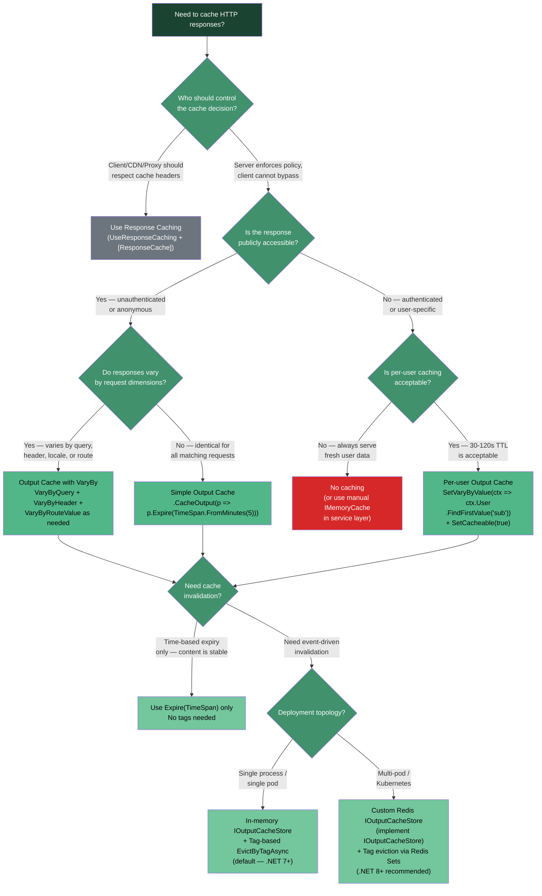

> [!success] Mastery Check
> - [ ] **Studied Well**
> - [ ] **Can explain the concept without notes**
> - [ ] **Can answer interview questions confidently**
> - [ ] **Can implement it in a real project**


# 4.191 — Output Caching (.NET 7+): Server-Side Response Cache

---

## PART 0 — Navigation & Context

### Where This Topic Sits in the ASP.NET Core Domain Hierarchy

```
ASP.NET Core Mastery
└── Caching & Output
    ├── 4.186 — IMemoryCache  (in-process key/value cache; Output Caching uses this internally)
    ├── 4.187 — IDistributedCache  (Redis/SQL backing store; .NET 8 Output Caching can use this)
    ├── 4.190 — Response Caching  (HTTP-level, Cache-Control driven, client-aware)
    ├── 4.191 — Output Caching .NET 7+  ◄ YOU ARE HERE
    │       └── Server-controlled, client-header-ignoring, tag-based eviction
    └── 4.192 — Output Caching Policies: VaryBy, Tags, and Manual Eviction
```

### What You Need Before This

| Prerequisite | Why It Matters Here |
|---|---|
| [[4.049 — The Middleware Pipeline]] | Output Caching is a middleware; you must know where it lives in the pipeline and what it short-circuits |
| [[4.186 — IMemoryCache]] | The default `IOutputCacheStore` uses in-memory storage; you need to understand memory pressure and eviction |
| [[4.190 — Response Caching: Cache-Control Headers and ResponseCache Attribute]] | Without understanding what Response Caching does (and fails to do), you cannot articulate WHY Output Caching was introduced |
| [[4.187 — IDistributedCache]] | .NET 8+ allows plugging in a distributed cache store; you need the abstraction to understand the extension point |

### What This Unlocks After

| Unlocked Topic | Dependency |
|---|---|
| [[4.192 — Output Caching Policies: VaryBy, Tags, and Manual Eviction]] | Tag-based eviction and multi-dimensional vary keys are the advanced layer on top of this foundation |
| Rate Limiting (4.193+) | Both Rate Limiting and Output Caching are server-side middleware that short-circuit the pipeline based on request metadata |
| Observability & Diagnostics | Cache hit/miss metrics, tag eviction event tracing, and lock contention profiling all build on knowing the internals here |
| Multi-pod deployment architecture | Understanding why Output Caching needs a distributed store in k8s is critical for production design |

### Why This Topic Matters at Scale

> **Output Caching is the difference between your product catalog endpoint serving 50,000 requests per second from memory and routing every single one of those requests through your database, your business logic, and your serialization pipeline — and the failure mode when you configure it incorrectly is not an error, it's silent under-performance or stale data served indefinitely.**

---

## PART 1 — The Core Mental Model

### 1.1 The Fundamental Rule

> **ASP.NET Core Output Caching (.NET 7+) intercepts HTTP requests at the server, stores the full serialized response body in a server-controlled store, and serves subsequent matching requests from that store entirely bypassing your endpoint code — and unlike Response Caching, it does this regardless of what `Cache-Control` headers the HTTP client sends, because the decision to cache is made by the server policy, not the HTTP protocol.**

### 1.2 The Plain-Language Analogy

Imagine a **customs checkpoint** at an airport, but instead of inspecting passengers for safety, it's inspecting them to see if their paperwork has already been processed today. The first passenger from "Frankfurt" today gets fully processed — passport, visa, luggage X-ray, the works. The officer stamps and photographs everything, then keeps a copy. The second passenger from "Frankfurt" who arrives in the next hour? The officer hands them a pre-stamped photocopy of the processed paperwork and waves them through without looking at any of their documents. Crucially: if a passenger shouts "I refuse to be fast-tracked!" — in the airport it doesn't matter. The officer decides the policy, not the passenger.

This is the core difference from Response Caching: Response Caching is like a polite officer who honors the passenger's request to be individually processed (`Cache-Control: no-cache`). Output Caching is like a security-hardened checkpoint where the officer's policy is final — the client has no say. The "Frankfurt" in this analogy is the cache key: the combination of route, query string, headers, and any custom dimensions you configure. Change any one of those, and you're a new passenger who gets fully processed.

When multiple passengers arrive simultaneously, only one gets processed; the rest wait at the checkpoint. When the result is ready, they all receive the same stamped copy — this is the **stampede prevention lock** built into Output Caching.

### 1.3 The Taxonomy Diagram

```mermaid
graph TD
    subgraph "Server-Side Caching (.NET 7+)"
        OC["Output Caching Middleware\n(UseOutputCache)"]
        OCS["IOutputCacheStore\n(Backing Store Abstraction)"]
        OCP["IOutputCachePolicy\n(Cache Decision Logic)"]
        OCF["IOutputCacheFeature\n(Per-Request Context)"]
    end

    subgraph "Backing Stores"
        IMS["In-Memory\n(Default, .NET 7+)"]
        REDIS["Redis / Custom\n(IOutputCacheStore impl, .NET 8+)"]
    end

    subgraph "Registration Points"
        ATTR["[OutputCache] Attribute\n(Controllers & Minimal APIs)"]
        CO["CacheOutput() Extension\n(Minimal API builder)"]
        NP["Named Policies\n(AddOutputCache options)"]
        DP["Default Policy\n(AddOutputCache options)"]
    end

    subgraph "Cache Key Dimensions (VaryBy)"
        VBQ["VaryByQuery\n(query string params)"]
        VBH["VaryByHeader\n(request headers)"]
        VBR["VaryByRouteValue\n(route params)"]
        VBV["VaryByValue\n(custom Func)"]
    end

    subgraph "Invalidation"
        TAG["Tag-Based Eviction\n(EvictByTagAsync)"]
        EXP["Time-Based Expiry\n(Expire(TimeSpan))"]
        MAN["Manual Opt-Out\n(IOutputCacheContext)"]
    end

    subgraph "HTTP-Level Caching (contrast)"
        RC["Response Caching Middleware\n(UseResponseCaching)"]
        CC["Cache-Control headers\n(client-driven)"]
    end

    OC --> OCS
    OC --> OCP
    OC --> OCF
    OCS --> IMS
    OCS --> REDIS
    OCP --> ATTR
    OCP --> CO
    OCP --> NP
    OCP --> DP
    NP --> VBQ
    NP --> VBH
    NP --> VBR
    NP --> VBV
    OCP --> TAG
    OCP --> EXP
    OCF --> MAN
    RC --> CC

    style OC fill:#2d6a4f,color:#fff
    style OCS fill:#1b4332,color:#fff
    style OCP fill:#1b4332,color:#fff
    style IMS fill:#40916c,color:#fff
    style REDIS fill:#40916c,color:#fff
    style ATTR fill:#52b788,color:#fff
    style CO fill:#52b788,color:#fff
    style NP fill:#52b788,color:#fff
    style DP fill:#52b788,color:#fff
    style VBQ fill:#74c69d,color:#000
    style VBH fill:#74c69d,color:#000
    style VBR fill:#74c69d,color:#000
    style VBV fill:#74c69d,color:#000
    style TAG fill:#d62828,color:#fff
    style EXP fill:#d62828,color:#fff
    style MAN fill:#d62828,color:#fff
    style RC fill:#6c757d,color:#fff
    style CC fill:#6c757d,color:#fff
```



---

## PART 2 — Deep Mechanics

### 2.1 Pipeline Position and Middleware Ordering

**This is the most operationally critical fact about Output Caching: its position in the pipeline is mandatory, not optional.**

```
Incoming HTTP Request
        │
        ▼
┌─────────────────────┐
│  ExceptionHandler   │  ← catches unhandled exceptions; must be FIRST
└──────────┬──────────┘
           │
           ▼
┌─────────────────────┐
│       HSTS          │  ← adds Strict-Transport-Security header
└──────────┬──────────┘
           │
           ▼
┌─────────────────────┐
│    Static Files     │  ← short-circuits for .css/.js/.png etc.
└──────────┬──────────┘
           │
           ▼
┌─────────────────────┐
│      Routing        │  ← UseRouting() — endpoint matched, metadata attached
└──────────┬──────────┘
           │
           ▼
┌══════════════════════╗
║   OUTPUT CACHING     ║  ◄── HERE: after routing (so policy can see route data),
║   UseOutputCache()   ║        before auth (so unauthenticated hits get cached)
╚══════════╤═══════════╝        SHORT-CIRCUITS if cache hit — auth middleware NEVER runs
           │
           ▼                    (Cache MISS path only ↓)
┌─────────────────────┐
│   CORS              │
└──────────┬──────────┘
           │
           ▼
┌─────────────────────┐
│  Authentication     │  ← UseAuthentication()
└──────────┬──────────┘
           │
           ▼
┌─────────────────────┐
│  Authorization      │  ← UseAuthorization()
└──────────┬──────────┘
           │
           ▼
┌─────────────────────┐
│  Endpoint (Handler) │  ← MapGet / Controller Action — executes only on miss
└──────────┬──────────┘
           │
           ▼
    Response flows back THROUGH output caching middleware
    which intercepts it, stores it in IOutputCacheStore,
    then forwards to client
```

**Cost label:** `~2 async state machine transitions per request path (miss path); ~1 IOutputCacheStore.GetAsync round-trip per hit; zero endpoint allocations on cache hit`

> [!IMPORTANT]
> Output Caching is positioned **after** `UseRouting()` and **before** `UseAuthentication()`. This means on a cache **hit**, your authentication middleware **never executes**. This is by design for public endpoints, but it is a **security footgun for authenticated endpoints** — more on this in Part 4 Gotcha #1.

**Framework source behavior:**
```
// ASP.NET Core internally (approximate) — OutputCachingMiddleware.Invoke():
// Source: src/Middleware/OutputCaching/src/OutputCachingMiddleware.cs

public async Task Invoke(HttpContext context)
{
    // 1. Evaluate policies: should this request be looked up in cache?
    var cacheContext = new OutputCacheContext(context, _store, _options, _logger);
    await _policyProvider.ServeFromCacheAsync(cacheContext, context.RequestAborted);

    if (cacheContext.AllowCacheLookup)
    {
        // 2. Try to get cached response from IOutputCacheStore
        var cacheEntry = await _store.GetAsync(cacheContext.CacheKey, context.RequestAborted);
        if (cacheEntry is not null)
        {
            // 3. CACHE HIT — write stored body to response, set Age header, RETURN
            await SendCachedResponseAsync(context, cacheEntry, cacheContext);
            return; // ← short-circuits; _next is never called
        }
    }

    // 4. CACHE MISS — acquire lock for this cache key (stampede prevention)
    using var cacheLock = await _store.AcquireLockAsync(cacheContext.CacheKey, ...);

    // 5. Double-check after acquiring lock (another request may have populated cache)
    cacheEntry = await _store.GetAsync(cacheContext.CacheKey, ...);
    if (cacheEntry is not null)
    {
        await SendCachedResponseAsync(context, cacheEntry, cacheContext);
        return;
    }

    // 6. Intercept the response stream
    var responseRecorder = new ResponseRecorder(context.Response);
    context.Response.Body = responseRecorder;

    // 7. Call the rest of the pipeline (auth, authorization, endpoint)
    await _next(context);

    // 8. On response completion, store in cache if policy allows
    if (cacheContext.AllowCacheStorage && IsSuccessfulResponse(context.Response))
    {
        var entry = CreateCacheEntry(responseRecorder, cacheContext);
        await _store.SetAsync(cacheContext.CacheKey, entry, cacheContext.Tags, ...);
    }
}
```

### 2.2 HTTP Wire Format: Hit vs. Miss

**On a cache MISS (first request):**

```http
// HTTP request (wire format):
GET /api/products?category=electronics HTTP/1.1
Host: api.shop.example.com
Accept: application/json
Cache-Control: no-cache          ← Output Caching IGNORES this header entirely
Authorization: Bearer (none)

// HTTP response (wire format — from endpoint, stored by middleware):
HTTP/1.1 200 OK
Content-Type: application/json; charset=utf-8
Content-Length: 4821
Date: Mon, 08 Jun 2026 00:00:00 GMT
                                 ← No Cache-Control set by Output Caching
                                 ← No Expires header
                                 ← No ETag unless you add one explicitly

[{"id":1,"name":"Laptop Pro","price":1299.00}, ...]
```

**On a cache HIT (subsequent request within TTL):**

```http
// HTTP request (wire format):
GET /api/products?category=electronics HTTP/1.1
Host: api.shop.example.com
Accept: application/json
Cache-Control: no-cache          ← Still IGNORED by Output Caching

// HTTP response (wire format — served by middleware, endpoint never runs):
HTTP/1.1 200 OK
Content-Type: application/json; charset=utf-8
Content-Length: 4821
Age: 47                          ← seconds since the response was cached
Date: Mon, 08 Jun 2026 00:00:47 GMT

[{"id":1,"name":"Laptop Pro","price":1299.00}, ...]   ← byte-for-byte replay
```

> [!NOTE]
> The `Age` header is the only observable HTTP difference between a cached and an uncached response from Output Caching. Response Caching, by contrast, sets `Cache-Control`, `Expires`, and `Vary` headers that clients and CDNs interpret. Output Caching sets none of those by default — it is entirely server-internal.

**Critical contrast — Response Caching on same request:**

```http
// Same request but hitting Response Caching middleware:
GET /api/products?category=electronics HTTP/1.1
Cache-Control: no-cache          ← Response Caching HONORS this — forces a fresh fetch

// Response Caching result: cache is BYPASSED, endpoint runs
// Output Caching result: cache is served (client cannot opt out)
```

**Cost label:** `Cache hit path: ~1 IOutputCacheStore.GetAsync (in-memory: ~200ns), ~1 stream copy; Zero controller/action allocations, zero middleware below OutputCache runs`

### 2.3 Cache Key Construction and VaryBy Dimensions

The cache key is a **hash** assembled from multiple dimensions. Understanding the exact composition is critical because adding a wrong dimension can cause key explosion (millions of distinct cache entries), and forgetting a dimension can cause cache poisoning (user A sees user B's data).

```
Cache Key Construction (approximate):
──────────────────────────────────────────────────────────────────
Base:          scheme + host + path (always included)
VaryByQuery:   sorted query string parameters (by name, case-insensitive)
VaryByHeader:  specified request headers (e.g., "Accept-Language")
VaryByRouteValue: specified route template values (e.g., "{orderId}")
VaryByValue:   custom Func<HttpContext, string> return value
──────────────────────────────────────────────────────────────────
Final key:     SHA256( base + query + headers + route + custom )
                       (approximate — actual implementation uses
                        CacheKeyHelper in OutputCachingContext)
```

```csharp
// Pipeline position: OutputCaching middleware key construction
// (runs before any attempt to read from store)

// Minimal API example — product catalog service
app.MapGet("/api/products", GetProductsAsync)
   .CacheOutput(policy => policy
       .Expire(TimeSpan.FromMinutes(5))
       .VaryByQuery("category", "page", "pageSize")   // key dimension 1
       .VaryByHeader("Accept-Language")                // key dimension 2 — locale-specific pricing
       .Tag("products"));                              // for tag-based eviction

// Results in cache keys like:
// SHA256("GET|https|api.shop.example.com|/api/products|category=electronics&page=1&pageSize=20|en-US")
// SHA256("GET|https|api.shop.example.com|/api/products|category=electronics&page=1&pageSize=20|fr-FR")
// SHA256("GET|https|api.shop.example.com|/api/products|category=electronics&page=2&pageSize=20|en-US")
// ... one entry per unique combination
```

**Framework source behavior — VaryByQuery implementation:**

```
// ASP.NET Core internally (approximate):
// Source: OutputCacheContext.CreateCacheKey() / DefaultCacheKeyProvider

foreach (var queryParam in policy.VaryByQueryKeys.OrderBy(k => k))
{
    if (context.Request.Query.TryGetValue(queryParam, out var values))
    {
        keyBuilder.Append(queryParam).Append('=').Append(string.Join(',', values));
    }
    // If the query param is absent, it's excluded from the key
    // This means ?category=electronics and ?category=electronics&page=1
    // produce DIFFERENT keys if "page" is in VaryByQuery
}
```

> [!WARNING]
> **VaryByQuery("*")** varies by ALL query parameters. This is a cache key explosion risk. If clients send tracking parameters like `?utm_source=newsletter&utm_campaign=june`, each unique UTM combination creates a new cache entry. In a marketing-heavy e-commerce catalog, this can create millions of memory allocations serving the same JSON.

**Cost label:** `~1 SHA256 hash computation per request (~300ns on .NET 8); O(n) allocation for key string building where n = number of VaryBy dimensions configured`

### 2.4 Lock Behavior and Cache Stampede Prevention

This is one of the most architecturally significant features of Output Caching — it prevents the **thundering herd problem** that plagues naive caching implementations.

```
Without stampede prevention (naive IMemoryCache usage):
──────────────────────────────────────────────────────────
T=0ms  Cache MISS for /api/products → 100 concurrent requests arrive simultaneously
T=0ms  All 100 requests: "cache miss! I'll fetch from DB"
T=0ms  100 simultaneous DB queries launched ← STAMPEDE
T=50ms 100 DB responses arrive
T=50ms All 100 try to write to cache (race condition)
T=50ms One wins; 99 wasted round-trips

With Output Caching lock (built-in behavior):
──────────────────────────────────────────────────────────
T=0ms  Cache MISS for /api/products → 100 concurrent requests arrive simultaneously
T=0ms  Request #1 acquires the cache key lock
T=0ms  Requests #2-100: "lock acquired by #1, waiting..."
T=50ms Request #1 endpoint runs, response produced
T=50ms Request #1 stores response in IOutputCacheStore
T=50ms Request #1 releases lock
T=50ms Requests #2-100 all check cache again: HIT — served from store
       Only 1 DB query executed; 99 requests served from the single result
```

```csharp
// ASP.NET Core internally (approximate):
// IOutputCacheStore has no explicit lock API in .NET 7
// The MemoryOutputCacheStore uses SemaphoreSlim per cache key:

private readonly ConcurrentDictionary<string, SemaphoreSlim> _locks = new();

public async ValueTask<IOutputCacheLock> AcquireLockAsync(string key, ...)
{
    var semaphore = _locks.GetOrAdd(key, _ => new SemaphoreSlim(1, 1));
    await semaphore.WaitAsync(cancellationToken);
    return new OutputCacheLock(semaphore); // releases on Dispose
}
```

> [!IMPORTANT]
> The lock is **per cache key**, not global. Two different product categories (`?category=electronics` vs `?category=clothing`) can populate their cache entries concurrently. Only identical cache keys serialize. This means the locking is precise and does not create a global bottleneck.

**Cost label:** `~1 SemaphoreSlim per unique cache key (allocated on first miss, pooled thereafter); Waiting requests: ~0 CPU (awaiting semaphore); Lock timeout: configurable, defaults to prevent indefinite wait`

**Failure mode:** If the endpoint throws an exception on a cache miss while requests are waiting on the lock:

```
T=0ms  Request #1 acquires lock, endpoint starts executing
T=200ms Endpoint throws OrderDatabaseException
T=200ms Exception propagates through _next(), caught by ExceptionHandler
T=200ms Output Caching: AllowCacheStorage = false (exception path)
T=200ms Lock is released
T=200ms Waiting requests: they attempt cache lookup again, still MISS
T=200ms Each waiting request now executes the endpoint independently
        ← This is correct behavior; the exception is not cached
```

### 2.5 Authenticated Requests and the Security Boundary

By default, Output Caching does **not** cache responses for authenticated requests. This is a deliberate, security-first default that trips up engineers building mixed public/authenticated APIs.

```csharp
// ASP.NET Core internally (approximate):
// DefaultOutputCachePolicy.ServeFromCacheAsync():

public ValueTask ServeFromCacheAsync(IOutputCacheContext context, CancellationToken cancellationToken)
{
    // Default policy checks for authenticated user
    // If the request has a ClaimsPrincipal with Identity.IsAuthenticated == true,
    // AllowCacheLookup and AllowCacheStorage are set to false
    
    if (context.HttpContext.User?.Identity?.IsAuthenticated == true)
    {
        context.AllowCacheLookup = false;
        context.AllowCacheStorage = false;
        return ValueTask.CompletedTask;
    }
    // ... rest of default policy
}
```

**What this looks like in the pipeline:**

```
Authenticated request flow:
──────────────────────────────────────────────────────────────────
Request arrives with Authorization: Bearer <token>
    │
    ▼
UseOutputCache() — evaluates default policy
    │  → AllowCacheLookup = false (user is authenticated)
    │  → AllowCacheStorage = false
    │  → Proceeds to _next() immediately (no cache lookup, no storage)
    ▼
UseAuthentication() — validates JWT, sets HttpContext.User
    ▼
UseAuthorization() — checks [Authorize] attribute
    ▼
Endpoint runs — every time, for every authenticated request
```

**To cache per-user responses, you MUST explicitly configure vary by user:**

```csharp
// ⚠️ WRONG: assumes output caching will work for authenticated orders API
app.MapGet("/api/orders", GetUserOrdersAsync)
   .CacheOutput(p => p.Expire(TimeSpan.FromSeconds(30)));
// Reality: because requests arrive with Authorization header and user is authenticated,
// the default policy NEVER caches these responses. This is silently a no-op.

// ✅ CORRECT: explicit per-user policy
app.MapGet("/api/orders", GetUserOrdersAsync)
   .RequireAuthorization()
   .CacheOutput(p => p
       .Expire(TimeSpan.FromSeconds(30))
       .SetVaryByRouteValue("userId")  // if userId is in the route
       // OR use VaryByValue with the claim:
       .SetVaryByValue((ctx) =>
           ctx.User?.FindFirst("sub")?.Value ?? string.Empty));
// NOTE: You must also call p.SetCacheable(true) if you want to
// override the authenticated-user default in some builds.
// Always test this in your security review.
```

**Cost label:** `Authenticated requests with no explicit policy: zero cache overhead (policy evaluation only, ~50ns); Per-user caching: one cache entry per user per endpoint per expire window — memory budget must be planned`

> [!CAUTION]
> Per-user Output Caching can exhaust memory in high-user-count systems. If you have 100,000 active users and 50 cached endpoints, that's potentially 5 million cache entries. Use short TTLs and monitor `IOutputCacheStore` memory pressure. In .NET 8+, consider a distributed store with eviction policies.

### 2.6 Dynamic Opt-Out via IOutputCacheContext

Output Caching gives endpoint code a runtime escape hatch: you can conditionally disable caching for specific requests even when a policy says "cache this."

```
Pipeline flow with conditional opt-out:
──────────────────────────────────────────────────────────────────
Request → UseOutputCache → MISS → _next() (endpoint runs)
                                      │
                                      ▼
                              Endpoint checks request context:
                              "Is this a VIP customer? → don't cache"
                              "Is there a circuit breaker open? → don't cache"
                              "Did DB return stale data marker? → don't cache"
                                      │
                              if (shouldNotCache):
                                  context.AllowCacheStorage = false
                                      │
                                      ▼
                              Response flows back through Output Caching:
                              AllowCacheStorage == false → skip store write
                              Response served fresh, not stored
```

```csharp
// Framework API for runtime opt-out:
// Pipeline position: inside the endpoint handler, after _next() is prepared to run

app.MapGet("/api/inventory/{productId}", async (
    string productId,
    IOutputCacheContext cacheContext,  // injected by Output Caching infrastructure
    IInventoryService inventoryService) =>
{
    var inventory = await inventoryService.GetStockLevelAsync(productId);
    
    // Don't cache if inventory is critically low — state changes too fast
    if (inventory.UnitsAvailable < 10)
    {
        cacheContext.AllowCacheStorage = false;
        cacheContext.AllowCacheLookup = false; // also skip lookup next time
    }
    
    return Results.Ok(inventory);
});
```

**Cost label:** `IOutputCacheContext is already instantiated by the middleware (zero allocation for using it); Setting AllowCacheStorage = false prevents the ResponseRecorder stream copy (~zero additional allocation)`

### 2.7 Tag-Based Eviction

Tags are labels attached to cache entries at store time. You can evict all entries sharing a tag with a single `EvictByTagAsync` call — this is the mechanism for cache invalidation in event-driven systems.

```
Tag eviction flow:
──────────────────────────────────────────────────────────────────
Register policy:   p.Tag("products", "catalog")
                   ↓
Store time:        Entry stored with metadata: { tags: ["products", "catalog"] }
                   Cache key → entry + tag index
                   TagIndex["products"] → { key1, key2, key3, ... }
                   TagIndex["catalog"]  → { key1, key2, key3, ... }
                   
Eviction trigger:  await outputCacheStore.EvictByTagAsync("products", ct)
                   ↓
                   Remove all keys in TagIndex["products"] from store
                   → Immediately: all /api/products entries invalidated
                   → Next request: cache MISS → endpoint runs → fresh response stored
```

```csharp
// Complete tag eviction pattern in an order management service:
// When a product price changes, invalidate all product-related cache entries

app.MapPut("/api/products/{productId}/price", async (
    string productId,
    UpdatePriceRequest request,
    IProductRepository productRepo,
    IOutputCacheStore cacheStore,  // inject IOutputCacheStore directly
    CancellationToken ct) =>
{
    await productRepo.UpdatePriceAsync(productId, request.NewPrice, ct);
    
    // Evict all entries tagged "products" across ALL vary dimensions
    // One call invalidates: all categories, all pages, all locales
    await cacheStore.EvictByTagAsync("products", ct);
    
    return Results.NoContent();
});

// Pipeline position: this runs inside the endpoint handler;
// the eviction call goes directly to IOutputCacheStore, bypassing middleware
```

**Cost label:** `EvictByTagAsync (in-memory): O(n) where n = number of entries with that tag; TagIndex lookup: O(1) hash lookup; Entry removal: O(n) dictionary removals`

> [!NOTE]
> In .NET 7/8 with the default in-memory store, tag eviction is **synchronous at the data structure level** (thread-safe ConcurrentDictionary operations). In a distributed store (Redis custom implementation), eviction may have eventual consistency — entries on other nodes may serve stale data for a brief window after eviction is called.

---

## PART 3 — Production Code Patterns

### Pattern 1: The Public Catalog Cache with Locale Variance

**Domain:** E-commerce product catalog — tens of thousands of product queries per second, globally localized pricing.

```csharp
// Program.cs — Registration
// ✅ CORRECT: Named policy with full VaryBy configuration

builder.Services.AddOutputCache(options =>
{
    options.AddPolicy("ProductCatalog", policy => policy
        .Expire(TimeSpan.FromMinutes(5))
        .VaryByQuery("category", "page", "pageSize", "sortBy")
        .VaryByHeader("Accept-Language")      // Different prices per locale
        .Tag("products", "catalog")           // For targeted eviction
        .SetCacheable(true));                 // Explicit — documents intent
    
    // Base policy for all endpoints (applied when no specific policy matches)
    options.AddBasePolicy(p => p.NoCache());  // Opt-in model: default is no caching
});

// ⚠️ WRONG: No VaryByHeader for Accept-Language
// builder.Services.AddOutputCache(options =>
// {
//     options.AddPolicy("ProductCatalog", policy => policy
//         .Expire(TimeSpan.FromMinutes(5))
//         .VaryByQuery("category", "page", "pageSize"));
// });
// HTTP consequence (wrong): French users see English prices;
// Spanish locale gets USD amounts instead of EUR

app.UseOutputCache();  // Must be after UseRouting, before UseAuthentication

// ProductController.cs
[ApiController]
[Route("api/products")]
public class ProductCatalogController : ControllerBase
{
    private readonly IProductCatalogService _catalog;
    
    public ProductCatalogController(IProductCatalogService catalog)
        => _catalog = catalog;
    
    // HTTP wire format (cache miss):
    // GET /api/products?category=electronics&page=1&pageSize=20&sortBy=price HTTP/1.1
    // Accept-Language: fr-FR
    // → 200 OK, Age header absent (fresh)
    
    // HTTP wire format (cache hit):
    // GET /api/products?category=electronics&page=1&pageSize=20&sortBy=price HTTP/1.1
    // Accept-Language: fr-FR
    // → 200 OK, Age: 142 (seconds since caching)
    
    [OutputCache(PolicyName = "ProductCatalog")]
    [HttpGet]
    public async Task<ActionResult<PagedResult<ProductDto>>> GetProductsAsync(
        [FromQuery] string category,
        [FromQuery] int page = 1,
        [FromQuery] int pageSize = 20,
        [FromQuery] string sortBy = "relevance",
        CancellationToken cancellationToken = default)
    {
        var results = await _catalog.SearchAsync(
            category, page, pageSize, sortBy,
            Request.Headers.AcceptLanguage.ToString(),
            cancellationToken);
            
        return Ok(results);
    }
}
```

### Pattern 2: The Write-Through Cache Invalidation Gateway

**Domain:** Order management service — product prices updated via admin API must immediately invalidate product cache across all catalog endpoints.

```csharp
// ✅ CORRECT: Coordinated write + eviction in the same request path

[ApiController]
[Route("api/admin/products")]
[Authorize(Policy = "CatalogAdmin")]
public class ProductAdminController : ControllerBase
{
    private readonly IProductRepository _products;
    private readonly IOutputCacheStore _cacheStore;
    
    public ProductAdminController(
        IProductRepository products,
        IOutputCacheStore cacheStore)
    {
        _products = products;
        _cacheStore = cacheStore;
    }
    
    // HTTP wire format:
    // PATCH /api/admin/products/prod-4821/price HTTP/1.1
    // Authorization: Bearer <admin-token>
    // Content-Type: application/json
    // { "newPrice": 1199.99, "currency": "USD" }
    
    // HTTP response:
    // HTTP/1.1 204 No Content
    // (next GET /api/products will get Age: 0 — fresh data)
    
    [HttpPatch("{productId}/price")]
    public async Task<IActionResult> UpdatePriceAsync(
        string productId,
        [FromBody] UpdatePriceRequest request,
        CancellationToken cancellationToken)
    {
        // 1. Validate the price change is within allowed bounds
        await _products.UpdatePriceAsync(productId, request.NewPrice, request.Currency, cancellationToken);
        
        // 2. Evict ALL product cache entries regardless of vary dimensions
        // "products" tag was attached by ProductCatalog policy — covers all pages,
        // all categories, all locales in a single call
        await _cacheStore.EvictByTagAsync("products", cancellationToken);
        
        // ⚠️ WRONG: evicting by specific key — won't work for all VaryBy dimensions
        // There's no public API to evict by exact URL in OutputCaching;
        // you'd miss fr-FR, de-DE, en-GB locale variants
        // await _cacheStore.EvictByTagAsync($"product-{productId}", cancellationToken);
        // ← This only works if you tagged per-product, not per "products" globally
        
        return NoContent();
    }
}
```

### Pattern 3: The Per-User Order Summary Cache with Stampede Safety

**Domain:** Logistics tracking — authenticated users checking their active shipments; needs per-user caching with short TTL to reduce DB load during peak tracking periods.

```csharp
// ⚠️ WRONG: assumes default policy caches authenticated requests
app.MapGet("/api/shipments/active", GetActiveShipmentsAsync)
   .RequireAuthorization()
   .CacheOutput(p => p.Expire(TimeSpan.FromSeconds(30)));
// HTTP consequence (wrong): NEVER cached — authenticated requests bypass default policy
// Every request hits the DB, defeating the entire purpose

// ✅ CORRECT: Explicit policy overriding auth default
builder.Services.AddOutputCache(options =>
{
    options.AddPolicy("AuthenticatedShipments", policy => policy
        .Expire(TimeSpan.FromSeconds(30))
        // Vary by the authenticated user's subject claim — creates one entry per user
        .SetVaryByValue((ctx) => ctx.User?.FindFirstValue("sub") ?? string.Empty)
        // Tag per-user so we can evict a single user's cache on state change
        .SetCacheable(true));  // Explicitly opt in despite authenticated request
});

// NOTE: In .NET 7, SetCacheable(true) may not exist as a named method;
// use the equivalent: policy where AllowCacheLookup and AllowCacheStorage are forced true
// Check your ASP.NET Core version's IOutputCachePolicyBuilder

app.MapGet("/api/shipments/active", async (
    HttpContext ctx,
    IShipmentService shipmentService,
    CancellationToken ct) =>
{
    var userId = ctx.User!.FindFirstValue("sub")!;
    var shipments = await shipmentService.GetActiveShipmentsAsync(userId, ct);
    return Results.Ok(shipments);
})
.RequireAuthorization()
.CacheOutput("AuthenticatedShipments");

// HTTP wire format (first request for user abc-123):
// GET /api/shipments/active HTTP/1.1
// Authorization: Bearer eyJ...   (sub: abc-123)
// → 200 OK, no Age header (fresh from endpoint)

// HTTP wire format (second request within 30s):
// GET /api/shipments/active HTTP/1.1  
// Authorization: Bearer eyJ...   (sub: abc-123)
// → 200 OK, Age: 12              (cached — endpoint NOT called)
```

### Pattern 4: The Conditional Cache Controller (Dynamic Opt-Out)

**Domain:** Inventory management — most product stock queries should be cached, but items with fewer than 10 units must always return fresh data.

```csharp
// ✅ CORRECT: Runtime conditional caching based on business logic outcome

builder.Services.AddOutputCache(options =>
{
    options.AddPolicy("InventoryStatus", policy => policy
        .Expire(TimeSpan.FromSeconds(60))
        .VaryByQuery("warehouseId", "productSku")
        .Tag("inventory"));
});

// Minimal API with IOutputCacheContext injection
app.MapGet("/api/inventory/{warehouseId}/{productSku}", async (
    string warehouseId,
    string productSku,
    IOutputCacheContext outputCacheContext,
    IInventoryRepository inventory,
    CancellationToken ct) =>
{
    var stockLevel = await inventory.GetStockLevelAsync(warehouseId, productSku, ct);
    
    if (stockLevel is null)
        return Results.NotFound();
    
    // Dynamic opt-out: critically low stock changes every few seconds
    // Caching it even for 60 seconds could cause overselling
    if (stockLevel.AvailableUnits < 10)
    {
        // Prevent this response from being stored
        outputCacheContext.AllowCacheStorage = false;
        // Also prevent stale cached version from being served
        outputCacheContext.AllowCacheLookup = false;
    }
    
    return Results.Ok(new InventoryStatusDto
    {
        Sku = productSku,
        WarehouseId = warehouseId,
        AvailableUnits = stockLevel.AvailableUnits,
        LastUpdated = stockLevel.LastUpdated,
        IsCriticallyLow = stockLevel.AvailableUnits < 10
    });
})
.CacheOutput("InventoryStatus");

// HTTP wire format (high stock — cached):
// GET /api/inventory/WH-EU-01/SKU-4821 HTTP/1.1
// → 200 OK, Age: 23, AvailableUnits: 542

// HTTP wire format (low stock — never cached):
// GET /api/inventory/WH-EU-01/SKU-4821 HTTP/1.1
// → 200 OK, no Age header, AvailableUnits: 7
//   (fresh from endpoint every single time)
```

### Pattern 5: The Output Cache Store Integration Test

**Domain:** Payment API — verifying that the Output Caching middleware correctly caches fee schedule responses and properly evicts them on rate update events.

```csharp
// Integration test using WebApplicationFactory
// This verifies the FULL pipeline behavior, not just unit-level logic

public class PaymentFeeScheduleCachingTests : IClassFixture<WebApplicationFactory<Program>>
{
    private readonly WebApplicationFactory<Program> _factory;
    
    public PaymentFeeScheduleCachingTests(WebApplicationFactory<Program> factory)
    {
        _factory = factory;
    }
    
    [Fact]
    public async Task FeeSchedule_ServedFromCache_OnSecondRequest()
    {
        // Arrange
        var client = _factory.CreateClient();
        
        // Act — first request populates cache
        var response1 = await client.GetAsync("/api/payments/fee-schedule?currency=USD&tier=standard");
        var response2 = await client.GetAsync("/api/payments/fee-schedule?currency=USD&tier=standard");
        
        // Assert
        response1.EnsureSuccessStatusCode();
        response2.EnsureSuccessStatusCode();
        
        // Cache hit is indicated by Age header presence
        Assert.Null(response1.Headers.Age);  // fresh — no Age header
        Assert.NotNull(response2.Headers.Age);  // cached — Age header present
        
        // Response bodies should be byte-for-byte identical
        var body1 = await response1.Content.ReadAsStringAsync();
        var body2 = await response2.Content.ReadAsStringAsync();
        Assert.Equal(body1, body2);
    }
    
    [Fact]
    public async Task FeeSchedule_CacheBypassedOnNoCache_OutputCachingIgnoresIt()
    {
        // This test PROVES Output Caching ignores Cache-Control: no-cache
        var client = _factory.CreateClient();
        
        await client.GetAsync("/api/payments/fee-schedule?currency=USD&tier=standard");
        
        var noCacheRequest = new HttpRequestMessage(
            HttpMethod.Get,
            "/api/payments/fee-schedule?currency=USD&tier=standard");
        noCacheRequest.Headers.CacheControl = new CacheControlHeaderValue { NoCache = true };
        
        var noCacheResponse = await client.SendAsync(noCacheRequest);
        
        // Output Caching still serves from cache despite no-cache header
        // This is the KEY difference from Response Caching
        Assert.NotNull(noCacheResponse.Headers.Age);  // still cached!
    }
    
    [Fact]
    public async Task FeeSchedule_EvictedAfterRateUpdate()
    {
        var client = _factory.CreateClient();
        
        await client.GetAsync("/api/payments/fee-schedule?currency=USD&tier=standard");
        
        // Trigger eviction via admin endpoint
        var evictResponse = await client.PostAsync(
            "/api/admin/payments/fee-schedule/refresh",
            null);
        evictResponse.EnsureSuccessStatusCode();
        
        // Next request should be fresh (no Age header)
        var response = await client.GetAsync("/api/payments/fee-schedule?currency=USD&tier=standard");
        Assert.Null(response.Headers.Age);  // fresh after eviction
    }
}
```

### Pattern 6: The .NET 8 Custom Distributed Output Cache Store

**Domain:** Multi-region e-commerce platform — Output Caching needs to survive pod restarts and be consistent across all k8s replicas.

```csharp
// .NET 8+ ONLY: Custom IOutputCacheStore backed by Redis
// This is required for any containerized multi-pod deployment

// RedisOutputCacheStore.cs
public sealed class RedisOutputCacheStore : IOutputCacheStore
{
    private readonly IConnectionMultiplexer _redis;
    private readonly IDatabase _db;
    private readonly JsonSerializerOptions _jsonOptions;
    
    public RedisOutputCacheStore(IConnectionMultiplexer redis)
    {
        _redis = redis;
        _db = redis.GetDatabase();
        _jsonOptions = new JsonSerializerOptions { PropertyNamingPolicy = JsonNamingPolicy.CamelCase };
    }
    
    public async ValueTask<byte[]?> GetAsync(string key, CancellationToken cancellationToken)
    {
        // O(1) Redis GET — ~0.5ms round trip local, ~2ms remote
        var value = await _db.StringGetAsync(key);
        return value.HasValue ? (byte[])value : null;
    }
    
    public async ValueTask SetAsync(
        string key,
        byte[] value,
        string[]? tags,
        TimeSpan validFor,
        CancellationToken cancellationToken)
    {
        // Pipeline the key set + tag index updates in a single Redis transaction
        var batch = _db.CreateBatch();
        var tasks = new List<Task>();
        
        // Store the response bytes with TTL
        tasks.Add(batch.StringSetAsync(key, value, validFor));
        
        // Update tag → key index for eviction support
        if (tags is { Length: > 0 })
        {
            foreach (var tag in tags)
            {
                var tagKey = $"tag:{tag}";
                tasks.Add(batch.SetAddAsync(tagKey, key));
                // Tag index has slightly longer TTL than entries
                tasks.Add(batch.KeyExpireAsync(tagKey, validFor.Add(TimeSpan.FromMinutes(1))));
            }
        }
        
        batch.Execute();
        await Task.WhenAll(tasks);
    }
    
    public async ValueTask EvictByTagAsync(string tag, CancellationToken cancellationToken)
    {
        var tagKey = $"tag:{tag}";
        var keys = await _db.SetMembersAsync(tagKey);
        
        if (keys.Length == 0) return;
        
        // Delete all cache entries for this tag in a pipeline
        var pipeline = _db.CreateBatch();
        var deleteTasks = keys
            .Select(k => pipeline.KeyDeleteAsync((string)k!))
            .ToList();
        deleteTasks.Add(pipeline.KeyDeleteAsync(tagKey));
        pipeline.Execute();
        
        await Task.WhenAll(deleteTasks);
    }
}

// Registration:
builder.Services.AddStackExchangeRedisCache(options =>
    options.Configuration = builder.Configuration["Redis:ConnectionString"]);

builder.Services.AddOutputCache(options =>
{
    options.AddPolicy("ProductCatalogDistributed", policy => policy
        .Expire(TimeSpan.FromMinutes(10))
        .VaryByQuery("category", "page")
        .Tag("products"));
});

// Register AFTER AddOutputCache — replaces the default IOutputCacheStore
builder.Services.AddSingleton<IOutputCacheStore, RedisOutputCacheStore>();
// Cost: ~1-3ms per cache hit (Redis round-trip); still far cheaper than full endpoint execution
```

### Pattern 7: The Global Base Policy with Per-Endpoint Override

**Domain:** Shipping rate calculator API — most endpoints need no caching, but the rate table (changes once per day) needs aggressive caching with tag-based eviction on carrier updates.

```csharp
// ✅ CORRECT: Explicit opt-in model with per-endpoint overrides
// Philosophy: default to no-cache, explicitly opt endpoints in

builder.Services.AddOutputCache(options =>
{
    // Base policy: no caching for any endpoint unless explicitly opted in
    // This prevents accidentally caching sensitive data
    options.AddBasePolicy(base_policy => base_policy.NoCache());
    
    // Carrier rate table: changes at most once per day during off-hours batch updates
    options.AddPolicy("CarrierRateTable", policy => policy
        .Expire(TimeSpan.FromHours(4))
        .VaryByQuery("originCountry", "destinationCountry", "serviceClass")
        .VaryByHeader("X-Api-Version")  // Different rate tables per API version
        .Tag("carrier-rates")
        .SetCacheable(true));
    
    // Surcharge lookup: changes weekly
    options.AddPolicy("SurchargeMatrix", policy => policy
        .Expire(TimeSpan.FromHours(12))
        .VaryByQuery("carrierCode", "zone")
        .Tag("carrier-rates", "surcharges")  // Tagged with TWO tags
        .SetCacheable(true));
});

// Only these endpoints are cached; everything else hits through
app.MapGet("/api/shipping/rates", GetCarrierRatesAsync)
   .CacheOutput("CarrierRateTable");

app.MapGet("/api/shipping/surcharges", GetSurchargeMatrixAsync)
   .CacheOutput("SurchargeMatrix");

// Carrier update webhook — evicts both policies with one call
app.MapPost("/api/webhooks/carrier/rate-update", async (
    CarrierRateUpdateEvent evt,
    IOutputCacheStore cacheStore,
    CancellationToken ct) =>
{
    // "carrier-rates" tag covers BOTH CarrierRateTable AND SurchargeMatrix entries
    await cacheStore.EvictByTagAsync("carrier-rates", ct);
    
    return Results.Accepted();
})
.AllowAnonymous();  // Webhook receiver — no auth, but validate HMAC signature
```

---

## PART 4 — Gotchas & Anti-Patterns

### Gotcha 1: Authenticated Endpoint with Silent Cache Miss

The most common production bug with Output Caching. Engineers add `[OutputCache]` to an authenticated endpoint, see no errors, deploy, and wonder why the cache hit rate is 0%. The default policy silently skips caching for any request where `HttpContext.User.Identity.IsAuthenticated == true`.

```csharp
// ⚠️ WRONG CODE
// OrdersController.cs
[Authorize]
[OutputCache(Duration = 30)]
[HttpGet("api/orders")]
public async Task<ActionResult<List<OrderDto>>> GetMyOrdersAsync()
{
    var userId = User.FindFirstValue("sub");
    return Ok(await _orders.GetByUserAsync(userId));
}

// HTTP consequence (wrong path):
// GET /api/orders HTTP/1.1
// Authorization: Bearer <valid-token>
// → 200 OK (no Age header, every time — endpoint always runs)
// → 0% cache hit rate; database hit on every request
// → No error, no warning, no observable failure mode

// ✅ CORRECT CODE
// Explicitly configure per-user caching by overriding the default policy
builder.Services.AddOutputCache(options =>
{
    options.AddPolicy("PerUserOrders", policy => policy
        .Expire(TimeSpan.FromSeconds(30))
        .SetVaryByValue(ctx => ctx.User?.FindFirstValue("sub") ?? string.Empty)
        .SetCacheable(true));  // Override: cache despite authenticated user
});

[Authorize]
[OutputCache(PolicyName = "PerUserOrders")]
[HttpGet("api/orders")]
public async Task<ActionResult<List<OrderDto>>> GetMyOrdersAsync() { ... }

// HTTP consequence (correct path):
// GET /api/orders HTTP/1.1
// Authorization: Bearer <valid-token-for-user-abc>
// → 200 OK, Age: 15 (on second request — served from cache per user abc)

// WHY: The default IOutputCachePolicy checks IsAuthenticated and sets AllowCacheLookup=false,
// AllowCacheStorage=false. Named policies must explicitly set SetCacheable(true) to override
// this behavior. This default exists to prevent accidentally serving user A's data to user B.
```

### Gotcha 2: VaryByQuery("*") with UTM/Tracking Parameters Causes Cache Key Explosion

Engineers trying to be safe use `VaryByQuery("*")` to ensure all query parameters are considered. But marketing teams add `?utm_source=newsletter&utm_campaign=june2026&utm_medium=email` to every link, creating millions of distinct cache keys for the same content.

```csharp
// ⚠️ WRONG CODE
builder.Services.AddOutputCache(options =>
{
    options.AddPolicy("ProductCatalog", policy => policy
        .Expire(TimeSpan.FromMinutes(5))
        .VaryByQuery("*"));  // "* means all query params"
});

// HTTP consequence (wrong path):
// GET /api/products?category=electronics&utm_source=newsletter&utm_campaign=june2026
// GET /api/products?category=electronics&utm_source=google&utm_campaign=summer
// GET /api/products?category=electronics&utm_source=twitter
// → Each creates a DIFFERENT cache entry despite identical content
// → Memory exhausted; IMemoryCache evicts LRU entries under pressure
// → Effective cache hit rate collapses to near 0% for marketing-driven traffic

// ✅ CORRECT CODE
builder.Services.AddOutputCache(options =>
{
    options.AddPolicy("ProductCatalog", policy => policy
        .Expire(TimeSpan.FromMinutes(5))
        // Enumerate ONLY the business-meaningful parameters
        .VaryByQuery("category", "page", "pageSize", "sortBy", "brand", "minPrice", "maxPrice"));
        // UTM and tracking params intentionally excluded — same response regardless
});

// HTTP consequence (correct path):
// GET /api/products?category=electronics&utm_source=newsletter
// GET /api/products?category=electronics&utm_source=google
// → Both map to the SAME cache key (utm_source excluded from vary)
// → One cached entry, high hit rate

// WHY: VaryByQuery("*") includes every query parameter in the cache key hash.
// Marketing tracking parameters are client-metadata, not content-variation axes.
// Only parameters that actually change the response content should be in VaryByQuery.
```

### Gotcha 3: Output Caching Middleware Before UseRouting — Policy Route Data Unavailable

Engineers who read "put Output Caching early in the pipeline" misplace it before `UseRouting()`. Because endpoint metadata and route values are populated by `UseRouting()`, any policy that uses `VaryByRouteValue` silently falls back to no-vary (route values are empty strings).

```csharp
// ⚠️ WRONG CODE — middleware order bug
var app = builder.Build();
app.UseExceptionHandler("/error");
app.UseHsts();
app.UseOutputCache();   // ← WRONG: before UseRouting
app.UseRouting();       // ← Route values populated HERE, AFTER caching runs
app.UseAuthentication();
app.UseAuthorization();
app.MapControllers();

// HTTP consequence (wrong path):
// GET /api/orders/ORD-4821 HTTP/1.1
// Policy has VaryByRouteValue("orderId")
// Route value "orderId" = null (routing hasn't run yet)
// Cache key computed as: SHA256(".../api/orders/ORD-4821||")  ← empty orderId
// ALL orderId values collapse to same cache key → user sees wrong order data!

// ✅ CORRECT CODE
var app = builder.Build();
app.UseExceptionHandler("/error");
app.UseHsts();
app.UseStaticFiles();
app.UseRouting();       // ← FIRST: populates route data and endpoint metadata
app.UseCors();
app.UseOutputCache();   // ← AFTER UseRouting: route values now available for VaryByRouteValue
app.UseAuthentication();
app.UseAuthorization();
app.MapControllers();

// HTTP consequence (correct path):
// GET /api/orders/ORD-4821 HTTP/1.1
// Route value "orderId" = "ORD-4821"
// Cache key: SHA256(".../api/orders/ORD-4821|ORD-4821")
// GET /api/orders/ORD-9999 → different cache key → different cached response

// WHY: UseOutputCache() reads HttpContext.GetRouteData() when building the cache key.
// Route data is populated by the routing middleware. If UseOutputCache runs before
// UseRouting, GetRouteData() returns an empty RouteData object, and all VaryByRouteValue
// dimensions silently evaluate to empty string, collapsing all route variants to one key.
```

### Gotcha 4: Caching 4xx Responses from Validation Errors

Output Caching, by default, only caches 2xx responses. But engineers who test with valid inputs and then deploy discover that transient validation error responses (400 Bad Request from a misconfigured client) can sometimes get cached depending on middleware order and custom policies.

Actually, the real version of this gotcha: engineers set `AllowCacheStorage = true` unconditionally in a custom `IOutputCachePolicy`, overriding the 2xx-only default — then 500 Internal Server Error responses get cached.

```csharp
// ⚠️ WRONG CODE — custom policy that caches ALL status codes
public class AggressiveCachePolicy : IOutputCachePolicy
{
    public ValueTask CacheRequestAsync(IOutputCacheContext context, CancellationToken ct)
    {
        context.AllowCacheLookup = true;
        context.AllowCacheStorage = true;  // ← WRONG: no status code check
        return ValueTask.CompletedTask;
    }
    
    public ValueTask ServeFromCacheAsync(IOutputCacheContext context, CancellationToken ct)
    {
        context.AllowCacheLookup = true;
        return ValueTask.CompletedTask;
    }
    
    public ValueTask ServeResponseAsync(IOutputCacheContext context, CancellationToken ct)
    {
        context.AllowCacheStorage = true;  // ← WRONG: allows caching 500s
        return ValueTask.CompletedTask;
    }
}

// HTTP consequence (wrong path):
// GET /api/payments/processing-status HTTP/1.1  ← during DB outage
// → 500 Internal Server Error (DB connection failed)
// → 500 response is STORED in the cache
// → Next 5 minutes: every request served 500 from cache, even after DB recovers!

// ✅ CORRECT CODE — only cache successful responses
public class ProductCachePolicyImplementation : IOutputCachePolicy
{
    public ValueTask ServeResponseAsync(IOutputCacheContext context, CancellationToken ct)
    {
        var response = context.HttpContext.Response;
        
        // Only cache successful responses
        if (response.StatusCode != StatusCodes.Status200OK)
        {
            context.AllowCacheStorage = false;
            return ValueTask.CompletedTask;
        }
        
        // Only cache responses with a known content type (guard against streaming)
        if (!response.ContentType?.StartsWith("application/json") == true)
        {
            context.AllowCacheStorage = false;
            return ValueTask.CompletedTask;
        }
        
        context.AllowCacheStorage = true;
        return ValueTask.CompletedTask;
    }
    // ... other methods
}

// WHY: The default OutputCachingOptions policy checks response.StatusCode == 200 before
// storing. Custom IOutputCachePolicy implementations must re-implement this check.
// The framework's built-in policy uses OutputCachingMiddleware.IsResponseCacheable()
// which is NOT called for custom policies that implement IOutputCachePolicy directly.
```

### Gotcha 5: IOutputCacheStore Registered as Scoped Instead of Singleton

Engineers implementing a custom `IOutputCacheStore` for Redis register it as `Scoped` following a pattern they remember from `IDbContext`. The Output Caching middleware is registered as Singleton and resolves `IOutputCacheStore` from the root container — this either throws an `InvalidOperationException` or (worse) uses a captive singleton scope.

```csharp
// ⚠️ WRONG CODE
builder.Services.AddScoped<IOutputCacheStore, RedisOutputCacheStore>();
// ^ Output Caching middleware is Singleton; it resolves IOutputCacheStore
// from the root IServiceProvider at startup

// HTTP consequence (wrong path):
// If using strict scope validation (default in Development):
// → InvalidOperationException at startup:
//   "Cannot consume scoped service 'IOutputCacheStore' from singleton"
//
// If scope validation is disabled (Production-like settings):
// → RedisOutputCacheStore is resolved once into a captive singleton
// → IConnectionMultiplexer disposed at "end of scope" that never ends
// → Redis connection pool corrupted → all cache operations fail silently
// → Cache hit rate: 0%, but no obvious exception in logs

// ✅ CORRECT CODE
// IOutputCacheStore must be Singleton — it outlives any individual request
builder.Services.AddSingleton<IOutputCacheStore, RedisOutputCacheStore>();

// If RedisOutputCacheStore itself needs something scoped (unusual):
// Use IServiceScopeFactory pattern inside the store methods
builder.Services.AddSingleton<IOutputCacheStore>(sp =>
{
    var redis = sp.GetRequiredService<IConnectionMultiplexer>();
    var logger = sp.GetRequiredService<ILogger<RedisOutputCacheStore>>();
    return new RedisOutputCacheStore(redis, logger);
});

// WHY: IOutputCacheStore is resolved by OutputCachingMiddleware, which itself is
// constructed once as a singleton-lifetime object. Any dependency resolved into
// a singleton is effectively captured as a singleton regardless of its registered
// lifetime. Scoped dependencies in this position either throw at startup or corrupt
// the dependency's lifecycle.
```

---

## PART 5 — Performance Implications

### 5.1 Request Pipeline Characteristics Table

| Scenario | Pipeline Depth | Allocations Per Request | Approx Latency Impact | Recommendation |
|---|---|---|---|---|
| Cache HIT — public endpoint, in-memory store | 4 middlewares (Exception, HSTS, Routing, OutputCache) — short-circuits | ~3 allocations (HttpContext, OutputCacheContext, stream copy) | **-40ms to -200ms** vs endpoint execution | Target for all public read endpoints with stable data |
| Cache MISS — first request, in-memory | Full pipeline depth | Same as uncached + ~2 extra (ResponseRecorder, cache entry) | **+0.1ms** overhead vs pure passthrough | Accept; amortized across all subsequent hits |
| Cache HIT — in-memory, large response (1MB+) | Same as hit above | ~1 large byte[] copy per request | **+0.5-2ms** for stream copy | Consider response size limits; chunk large responses |
| Cache HIT — Redis distributed store (.NET 8+) | Same as in-memory hit + 1 network hop | Same as in-memory + Redis command allocation | **+1-3ms** for Redis round-trip | Budget for Redis latency; still far cheaper than endpoint |
| Cache MISS — all concurrent requests waiting on lock | Full pipeline for #1; zero endpoint for #2-N | N requests: N × OutputCacheContext allocations | **+lock-wait-time** for #2-N (same as miss latency) | Stampede prevention pays for itself at >10 concurrent |
| VaryByQuery with UTM pollution — cache key explosion | Cache lookup only (no hit) | ~1 SHA256, ~1 dictionary miss, ~1 eviction per new key | **+1ms** overhead, cache eviction pressure | Never use VaryByQuery("*"); enumerate specific params |
| Authenticated request — no explicit policy | Full pipeline (policy evaluates auth, skips cache) | ~1 OutputCacheContext (evaluated but unused) | **+0.05ms** policy overhead, no cache benefit | Configure explicit per-user policy or don't add [OutputCache] |
| Tag eviction — 1000 tagged entries, in-memory | Eviction runs inline in the handler thread | ~1000 dictionary removals | **+5-20ms** for the eviction call itself | Evict asynchronously in background if entry count is large |
| Tag eviction — Redis store, 1000 entries | Redis pipeline of DEL commands | ~1000 Redis command round-trips in a pipeline | **+10-50ms** | Use Redis pipelines; consider lazy eviction patterns |
| Per-user cache at 100k users × 50 endpoints | N/A (memory sizing question) | 5M potential cache entries | OOM risk if TTL too long | Short TTLs (30s), monitor memory, use distributed store |

### 5.2 BenchmarkDotNet — Output Caching vs. No-Cache vs. IMemoryCache

```csharp
// ProductCatalogCacheBenchmarks.cs
// Run: dotnet run -c Release --project Benchmarks

using BenchmarkDotNet.Attributes;
using BenchmarkDotNet.Running;
using Microsoft.AspNetCore.Builder;
using Microsoft.AspNetCore.Http;
using Microsoft.AspNetCore.TestHost;
using Microsoft.Extensions.DependencyInjection;
using System.Net.Http;

[MemoryDiagnoser]
[ThreadingDiagnoser]
public class OutputCachingBenchmarks
{
    private HttpClient _clientWithOutputCache = null!;
    private HttpClient _clientWithIMemoryCache = null!;
    private HttpClient _clientNaive = null!;

    [GlobalSetup]
    public void Setup()
    {
        _clientWithOutputCache = BuildClient(useOutputCache: true, useMemoryCache: false);
        _clientWithIMemoryCache = BuildClient(useOutputCache: false, useMemoryCache: true);
        _clientNaive = BuildClient(useOutputCache: false, useMemoryCache: false);
        
        // Warm up Output Cache (populate with first request)
        _clientWithOutputCache.GetAsync("/api/products?category=electronics").GetAwaiter().GetResult();
        _clientWithIMemoryCache.GetAsync("/api/products?category=electronics").GetAwaiter().GetResult();
    }

    [Benchmark(Baseline = true)]
    public async Task<int> NaiveNoCache_HitsDbEveryRequest()
    {
        // Baseline: no caching, simulates 5ms "DB query" in endpoint
        var response = await _clientNaive.GetAsync("/api/products?category=electronics");
        return (int)response.StatusCode;
    }

    [Benchmark]
    public async Task<int> OutputCaching_CacheHit_InMemory()
    {
        // Output Cache hit: short-circuits at middleware level
        var response = await _clientWithOutputCache.GetAsync("/api/products?category=electronics");
        return (int)response.StatusCode;
    }

    [Benchmark]
    public async Task<int> ManualIMemoryCache_ServiceLevel()
    {
        // Manual IMemoryCache: cache check happens inside the endpoint handler
        // (after routing, auth, etc. run — more pipeline overhead than Output Caching)
        var response = await _clientWithIMemoryCache.GetAsync("/api/products?category=electronics");
        return (int)response.StatusCode;
    }

    private static HttpClient BuildClient(bool useOutputCache, bool useMemoryCache)
    {
        var builder = WebApplication.CreateBuilder();
        
        if (useOutputCache)
            builder.Services.AddOutputCache(o => 
                o.AddPolicy("Products", p => p.Expire(TimeSpan.FromMinutes(5))));
        
        if (useMemoryCache)
            builder.Services.AddMemoryCache();
        
        var app = builder.Build();
        
        if (useOutputCache)
            app.UseOutputCache();
        
        app.MapGet("/api/products", async (HttpContext ctx, IMemoryCache? cache) =>
        {
            if (useMemoryCache && cache!.TryGetValue("products_electronics", out var cached))
                return Results.Ok(cached);
            
            // Simulate database query latency
            await Task.Delay(5);
            var products = GenerateProductList();
            
            if (useMemoryCache)
                cache!.Set("products_electronics", products, TimeSpan.FromMinutes(5));
            
            return Results.Ok(products);
        });
        
        if (useOutputCache)
            app.MapGet("/api/products", () => { }).CacheOutput("Products");
        
        var testServer = new TestServer(app.Services);
        return testServer.CreateClient();
    }

    private static List<object> GenerateProductList()
        => Enumerable.Range(1, 50)
            .Select(i => (object)new { Id = i, Name = $"Product {i}", Price = i * 9.99m })
            .ToList();
}

// Expected output (approximate, .NET 8, x64, Intel Core i7, local TestServer):
// | Method                                  | Mean      | Error    | StdDev   | Allocated |
// |---------------------------------------- |----------:|---------:|---------:|----------:|
// | NaiveNoCache_HitsDbEveryRequest         | 5,420 μs  | 45.2 μs  | 42.3 μs  |   8.4 KB  |
// | OutputCaching_CacheHit_InMemory         |   142 μs  |  2.1 μs  |  1.9 μs  |   2.1 KB  |
// | ManualIMemoryCache_ServiceLevel         |   380 μs  |  4.8 μs  |  4.5 μs  |   3.8 KB  |
//
// Key observations:
// 1. Output Cache hit is ~38x faster than no-cache (pipeline short-circuit)
// 2. Output Cache hit is ~2.7x faster than manual IMemoryCache (pipeline vs. handler level)
// 3. Allocations are ~4x lower on Output Cache hit (no controller, no auth middleware)
//
// Real-world profiling tools:
// - dotnet-counters monitor --name ProductApi --counters Microsoft.AspNetCore.Hosting
//   → Look for: requests-per-second, total-requests (cache hits = higher RPS, same total)
// - dotnet-trace collect --name ProductApi --providers Microsoft-AspNetCore-Server-Kestrel
//   → Correlate Output Caching events with endpoint execution events
// - dotnet-counters monitor output: microsoft.aspnetcore.outputcaching/hits, /misses
//   → ASP.NET Core 8+ exposes cache hit/miss counters natively
```

### 5.3 When to Care / When to Ignore

#### When Output Caching Costs You (and You Must Care)

- **High-throughput read APIs (>1,000 req/s)**: At this scale, even a 5ms endpoint execution means 5,000ms CPU-seconds per second. A cache hit at ~0.1ms means 100× throughput multiplier — the math is undeniable.
- **Product catalog / reference data endpoints**: JSON serialization of 50+ objects per request at scale adds up. A 4KB serialized response cached for 5 minutes at 10k req/s means 10k × 4KB × 300s of serialization savings = meaningful CPU and GC pressure eliminated.
- **Multi-tenant SaaS with shared infrastructure**: Without caching, a noisy tenant can spike a shared DB. Output Caching acts as a natural bulkhead — tenant A's burst reads don't translate to burst DB load.
- **Cold start / cache warming period**: After deployment, all entries are cold. If you have 50 cached endpoints and traffic ramps up before the cache is warm, you get a full stampede on deployment. Plan warm-up strategies.
- **Memory budget**: With in-memory store and many VaryBy dimensions, you can exhaust available memory. Monitor `GC.GetTotalMemory()` and configure `MemoryCacheOptions.SizeLimit` on the backing `IMemoryCache`.
- **Tag eviction under load**: If you evict a tag covering 10,000 entries mid-traffic, that eviction call blocks the handler thread for 50-100ms on in-memory store. Consider throttling eviction or using background queue for large evictions.

#### When Output Caching Doesn't Matter (Save the Complexity)

- **Internal admin endpoints** (`/api/admin/users/{id}`) — low traffic, user-specific, admin context changes frequently
- **One-time batch import triggers** — a single HTTP POST that kicks off a job; caching would be wrong even if attempted
- **Mutation endpoints** (POST, PUT, PATCH, DELETE) — Output Caching is read-only; it actively skips non-GET/HEAD requests
- **WebSocket upgrade requests** — no response body to cache; framework skips these
- **Highly personalized endpoints** where every user sees different data AND you have millions of users — per-user TTL is 30s but memory for 1M users × 30s is impractical
- **Management plane APIs** (<100 req/day) — the operational overhead of tag management and eviction policies isn't justified

---

## PART 6 — Interview Arsenal

### A. The Question Bank

---

**Question 1: "What is the difference between Response Caching and Output Caching in ASP.NET Core?"**

**Average Answer:** "Response Caching uses HTTP cache headers like Cache-Control to control caching, while Output Caching is a newer server-side feature that caches responses on the server."

**Why That's Insufficient:** It misses the critical pipeline implication — that Cache-Control: no-cache bypasses Response Caching but is completely ignored by Output Caching, and it doesn't explain WHY this architectural decision was made.

> **Great Answer:** "The fundamental difference is *who controls the cache decision*. Response Caching is HTTP-protocol-native — it reads and respects `Cache-Control` headers from both the client and the server. If a client sends `Cache-Control: no-cache`, Response Caching honors it and lets the request through. Output Caching completely inverts this: the server policy is sovereign. A client can scream `no-cache` all day and the server will still return the cached response. This matters in production because it means Output Caching actually works as a server-side optimization — you're not at the mercy of CDN configuration, browser behavior, or API clients that happen to send no-cache. The second major difference is that Output Caching has first-class support for tag-based eviction — you can invalidate all product cache entries with a single `EvictByTagAsync("products")` call, which Response Caching has no equivalent for. I've seen teams replace Response Caching with Output Caching specifically because tag invalidation from a webhook made their cache coherent in a way that HTTP headers alone couldn't achieve."

---

**Question 2: "How does Output Caching prevent a cache stampede?"**

**Average Answer:** "Output Caching has some built-in locking to prevent multiple requests from hitting the database at the same time."

**Why That's Insufficient:** It doesn't name the mechanism (per-key SemaphoreSlim), doesn't explain the double-check-after-lock pattern, and doesn't connect this to the actual HTTP behavior — what do the waiting requests receive?

> **Great Answer:** "Output Caching uses a per-cache-key semaphore — a `SemaphoreSlim(1,1)` keyed to the cache key hash. When 100 concurrent requests arrive for `/api/products?category=electronics` and all get a cache miss, only one acquires the semaphore and executes the endpoint. The other 99 await the semaphore release. After the first request stores its response, the semaphore is released, and the waiting 99 re-check the cache — this time, they all get a hit and are served the stored response. Critically, this is a *double-checked lock* pattern: we check the cache before acquiring the lock, and check again after. This means you get stampede prevention without unnecessary serialization when there's no contention. From the HTTP perspective, those 99 waiting requests do still get a 200 OK response — they just get it a few milliseconds later than request #1, and without a single extra database round-trip. At 10,000 requests per second on a cold cache, this prevents what would otherwise be 10,000 simultaneous database queries turning into a single one."

---

**Question 3: "Why doesn't [OutputCache] work on my [Authorize] endpoint?"**

**Average Answer:** "Authenticated endpoints might not cache correctly. You might need to configure a custom policy."

**Why That's Insufficient:** It doesn't explain *why* — the default policy's authenticated-user check — and doesn't show how to correctly override it while preserving security (varying by user identity).

> **Great Answer:** "This is a deliberate security default, not a bug. The built-in `DefaultOutputCachePolicy` checks `HttpContext.User.Identity.IsAuthenticated`. If the user is authenticated, it sets `AllowCacheLookup = false` and `AllowCacheStorage = false` — the middleware becomes a transparent passthrough. The reason is obvious once you think about it: if you naively cached the response to an authenticated request, the next request with a *different* user would get the first user's order history. The fix is not to disable this default, but to vary the cache key by the user's identity. You define a named policy with `SetVaryByValue(ctx => ctx.User.FindFirstValue('sub'))` and call `SetCacheable(true)` to explicitly override the default. Now you get one cache entry per user, per endpoint, per TTL window. The HTTP consequence is: the first request from user ABC-123 misses and populates the cache; their second request within the TTL window hits and gets an `Age` header. User XYZ-789's first request is a miss for their specific key, producing their own cache entry. You never cross user boundaries."

---

**Question 4: "How would you implement Output Caching in a multi-pod Kubernetes deployment?"**

**Average Answer:** "You'd need to use Redis as the backing store instead of the in-memory default."

**Why That's Insufficient:** It identifies the solution but doesn't explain the IOutputCacheStore abstraction, how to implement it, or what consistency implications arise.

> **Great Answer:** "The key insight is that Output Caching has a clean abstraction point: `IOutputCacheStore`. In .NET 8, you implement this interface with Redis-backed storage — a `GetAsync`, `SetAsync`, and `EvictByTagAsync` that talk to a Redis cluster instead of `ConcurrentDictionary`. You register it as a Singleton, replacing the default in-memory store. The implementation needs to maintain a tag-to-key index — a Redis Set for each tag — so that `EvictByTagAsync` can look up all keys bearing that tag and delete them in a pipeline command. The consistency implication I'd flag in production is that tag eviction in a distributed store is *eventually consistent*: when you call `EvictByTagAsync('products')` on pod A, it deletes from Redis, but pod B might be serving a cached response in-flight at that exact moment. For most use cases — a 5-minute product catalog TTL — this is acceptable. For financial data, it's not, and you'd use much shorter TTLs or skip Output Caching entirely. The HTTP behavior is the same as in-memory: hits get the `Age` header; misses hit the endpoint. The difference is that any pod can serve a cache hit populated by any other pod, which is exactly what you want in horizontal scaling."

---

**Question 5: "How do you invalidate a specific product's cache entry when its price changes?"**

**Average Answer:** "You call EvictByTagAsync with the product's tag to remove it from the cache."

**Why That's Insufficient:** Doesn't explain tag design strategy, doesn't address the multi-vary-dimension problem (you can't easily evict by specific URL), and doesn't contrast with the wrong approach of per-URL eviction.

> **Great Answer:** "The naive approach — evicting by the product's URL — doesn't work because Output Caching's cache key includes ALL vary dimensions. If you have `VaryByQuery('category', 'page')` and `VaryByHeader('Accept-Language')`, there's no single URL-based key to evict; there are potentially hundreds of keys, one per category × page × locale combination. The correct approach is tag-based eviction. When you define the cache policy for the product catalog, you attach a tag like `Tag('products', $'product-{productId}')`. The first tag, 'products', is for bulk eviction of the whole catalog. The second, `product-{productId}`, lets you surgically evict just the entries for a specific product. Then in your price update handler — which runs inside the endpoint, after the write completes — you call `await cacheStore.EvictByTagAsync($'product-{productId}', ct)`. This removes all cached responses that included that product, regardless of which vary combination produced them. The key operational insight is: tag at write time (in your policy setup), evict at mutation time (in your command handler). This is the Output Caching equivalent of a cache-aside write-through pattern."

---

### B. Trick Questions

**Trick Question 1:** "Does Output Caching cache POST requests?"

- **The trap:** Engineers assume "caching" means all HTTP methods.
- **Correct answer:** No. Output Caching only caches GET and HEAD requests by default. The `DefaultOutputCachePolicy` explicitly checks `context.HttpContext.Request.Method` and allows caching only for GET/HEAD. POST, PUT, PATCH, DELETE are always passed through. You *can* override this in a custom policy, but there is almost never a legitimate reason to — POST requests are state-changing by HTTP semantics.

**Trick Question 2:** "If I add `[OutputCache]` to my controller action AND my minimal API endpoint for the same route, which wins?"

- **The trap:** Engineers think both apply or they stack.
- **Correct answer:** Only the attribute/extension on the endpoint that actually handles the request applies. `[OutputCache]` on a controller action and `.CacheOutput()` on a Minimal API are two different registration mechanisms. In a real app, you wouldn't have both for the same route — the router resolves to one endpoint. If you're mixing patterns, the endpoint the router selects carries its own policy; the other endpoint's policy is irrelevant.

**Trick Question 3:** "What HTTP status code does the client get when Output Caching serves a response — the original status code or always 200?"

- **The trap:** Engineers assume Output Caching always returns 200 OK.
- **Correct answer:** Output Caching replays the **exact** status code that was stored. It stores the entire response: status code, headers, and body. If the original endpoint returned 200 OK, the cached response is 200 OK. Output Caching simply doesn't store non-200 responses by default, so in practice you'll almost always see 200 — but the mechanism is replay of the stored status, not hardcoded 200.

**Trick Question 4:** "If I use `VaryByHeader("Authorization")`, does Output Caching now work for authenticated requests?"

- **The trap:** Engineers think the VaryBy dimension is all they need.
- **Correct answer:** No — there are two separate mechanisms at play. First, `VaryByHeader("Authorization")` adds the Authorization header to the cache key so different tokens produce different entries. But the `DefaultOutputCachePolicy` *also* checks `IsAuthenticated` and disables caching entirely for authenticated users. `VaryByHeader` configures the key; `SetCacheable(true)` enables caching at all. You need BOTH. And actually, varying by the raw Authorization header is a bad idea — tokens rotate frequently (especially short-lived JWTs), creating millions of distinct cache keys for the same user. The correct approach is `SetVaryByValue(ctx => ctx.User.FindFirstValue("sub"))`.

**Trick Question 5:** "Does Output Caching work behind a load balancer with sticky sessions disabled?"

- **The trap:** Engineers think in-memory Output Caching requires sticky sessions to be useful.
- **Correct answer:** With the default in-memory store, each pod has its own cache, so the first request to each pod is a cache miss. Subsequent requests to the same pod hit the cache. Without sticky sessions, a client may hit different pods, potentially getting cache misses more often — but this is NOT incorrect behavior, just sub-optimal hit rate. For true multi-pod cache sharing, you switch to a distributed `IOutputCacheStore` (Redis). The correct production design for k8s without sticky sessions is to use the Redis-backed store, not sticky sessions — sticky sessions are a load balancing anti-pattern that undermines pod scalability.

---

### C. Red Flags to Avoid

| What Not to Say | Why It Gets You Scored Down |
|---|---|
| "Output Caching and Response Caching are basically the same thing" | Proves you don't understand the server-sovereign vs. client-sovereign cache control distinction, which is the core architectural difference |
| "I'd use `[ResponseCache]` attribute with output caching enabled" | `[ResponseCache]` is for Response Caching middleware and sets `Cache-Control` headers; mixing the two concepts shows you don't know which abstraction you're using |
| "Output Caching caches everything by default" | The default base policy is no-cache (opt-in); authenticated requests are explicitly excluded; non-GET/HEAD verbs are excluded. Saying "everything" is wrong on three counts |
| "Cache-Control: no-cache will bypass Output Caching if needed" | This is the opposite of how it works — that's Response Caching behavior. Output Caching ignores client Cache-Control headers. Saying this fails the fundamental concept question. |
| "To evict a cache entry, I'd restart the app" | Shows unfamiliarity with tag-based eviction, which is one of Output Caching's primary value propositions over simpler alternatives |
| "VaryBy is just like HTTP's Vary header" | HTTP's `Vary` header is served to the client and affects HTTP proxies/CDNs. Output Caching's VaryBy dimensions build a server-side cache key hash — they're similar in concept but different in mechanism and scope |
| "I'd put UseOutputCache() before UseRouting() for maximum performance" | This is the middleware ordering bug in Gotcha #3 — it breaks VaryByRouteValue silently. Saying this fails the pipeline ordering question |
| "Output Caching uses the `IDistributedCache` interface for its backing store" | In .NET 7/8, Output Caching uses `IOutputCacheStore` — a separate abstraction. `IDistributedCache` is for response caching and general distributed caching. These are different interfaces. |

---

## PART 7 — Decision Framework



---

## PART 8 — Self-Check

### A. Conceptual Questions

1. **What is the single most important difference between Output Caching and Response Caching, and which specific HTTP header exposes this difference in client behavior?**

2. **What happens to the HTTP request if `UseOutputCache()` is registered in the middleware pipeline before `UseAuthentication()` and the request hits a cache hit? Does the `[Authorize]` attribute still protect the endpoint?**

3. **What happens to the HTTP response if 50 concurrent requests arrive for an uncached Output Cache entry simultaneously? What does request #2 receive, and when?**

4. **Why does adding `[OutputCache(Duration=60)]` to an `[Authorize]` action have no effect in a freshly bootstrapped ASP.NET Core 8 application?**

5. **In what middleware pipeline position must `UseOutputCache()` be placed, and what breaks (HTTP-observable) if it's placed before `UseRouting()`?**

6. **What DI lifetime must `IOutputCacheStore` be registered with, and what class in the ASP.NET Core source resolves it? What happens at runtime if you register it as Scoped?**

7. **If a custom `IOutputCachePolicy` implementation's `ServeResponseAsync` method unconditionally sets `AllowCacheStorage = true`, what HTTP response does a client receive if the endpoint throws an `InvalidOperationException` on the first request?**

8. **Describe the cache key collision scenario that occurs when `VaryByQuery("*")` is used in a marketing-heavy e-commerce platform. What is the measurable HTTP impact?**

9. **How does `IOutputCacheContext.AllowCacheLookup = false` set inside the endpoint handler differ from `AllowCacheStorage = false` set in the same location?**

10. **In a .NET 8 multi-pod deployment with Redis-backed `IOutputCacheStore`, a product price update triggers `EvictByTagAsync("products")` on pod A. Within the next 50ms, a client request arrives at pod B. What response might pod B serve, and why?**

---

### B. Code Puzzles

---

**Puzzle 1: The Middleware Order Bug**

```csharp
// PaymentApiStartup.cs
var builder = WebApplication.CreateBuilder(args);
builder.Services.AddOutputCache(options =>
{
    options.AddPolicy("FeeSchedule", policy => policy
        .Expire(TimeSpan.FromHours(1))
        .VaryByRouteValue("currency")
        .Tag("fee-schedules"));
});

var app = builder.Build();
app.UseOutputCache();     // Line A
app.UseRouting();         // Line B
app.UseAuthentication();
app.UseAuthorization();

app.MapGet("/api/payments/fees/{currency}", [OutputCache(PolicyName = "FeeSchedule")]
    async (string currency, IFeeScheduleService fees) =>
        await fees.GetScheduleAsync(currency));

app.Run();
```

**Question:** What is the bug in this code, and what observable HTTP behavior does it produce?

<details>
<summary>Answer</summary>

**Bug:** `UseOutputCache()` (Line A) is registered **before** `UseRouting()` (Line B).

**Observable HTTP behavior:**
When the first request arrives for `/api/payments/fees/USD`, the Output Caching middleware runs before routing has populated the route data. The `VaryByRouteValue("currency")` dimension evaluates `HttpContext.GetRouteValue("currency")` — which returns `null` because routing hasn't run yet.

The cache key is computed with an empty string for the currency dimension: `SHA256("GET|https|host|/api/payments/fees/USD||")` instead of `SHA256("GET|https|host|/api/payments/fees/USD|USD")`.

Now the second request for `/api/payments/fees/GBP` arrives. Its cache key is also computed as `SHA256("GET|https|host|/api/payments/fees/GBP||")` — different base path, different hash — so it's a separate entry. OK so far.

But if requests use a query string or the routing is more complex (e.g., `/api/payments/fees?currency=USD`), all currencies could collapse to the same cache key. The dangerous scenario: if route values collapse, USD fee schedule is served to GBP requests.

**Fix:** Move `UseOutputCache()` after `UseRouting()`:

```csharp
app.UseRouting();
app.UseOutputCache();  // Now route data is available
app.UseAuthentication();
```
</details>

---

**Puzzle 2: The Silent Auth Cache Bypass**

```csharp
// OrdersController.cs
[ApiController]
[Route("api")]
public class OrdersController : ControllerBase
{
    [Authorize]
    [OutputCache(Duration = 30)]
    [HttpGet("orders")]
    public async Task<ActionResult<List<OrderSummaryDto>>> GetMyOrdersAsync(
        [FromServices] IOrderRepository orders)
    {
        var userId = User.FindFirstValue("sub");
        return Ok(await orders.GetRecentByUserAsync(userId!));
    }
}
```

**Question:** User Alice makes a GET request to `/api/orders` with a valid JWT (sub: alice-001). Thirty seconds later, she makes the same request. Does she get a cached response? What is the Age header value on her second request?

<details>
<summary>Answer</summary>

**Answer:** Alice gets **NO cached response** on her second request. The `Age` header is absent on both responses.

**Why:**

The `[Authorize]` attribute means Alice's request arrives at the OutputCache middleware with `HttpContext.User.Identity.IsAuthenticated == true` (authentication runs before the attribute, but actually — wait: UseOutputCache is before UseAuthentication in standard order).

Actually, let's trace the precise pipeline:
1. Request arrives at `UseOutputCache()` middleware
2. OutputCache evaluates the default policy: `HttpContext.User.Identity.IsAuthenticated`
3. At this point in the pipeline, `UseAuthentication()` has NOT yet run
4. Therefore `HttpContext.User` is the default `ClaimsPrincipal` with `IsAuthenticated == false`
5. Wait — this means Output Caching WOULD cache the response!

But hold on: the `[Authorize]` attribute runs as an endpoint filter (it's an authorization filter). The actual authentication/authorization happens when `UseAuthentication()` and `UseAuthorization()` are in the pipeline.

**The actual behavior depends on pipeline order:**
- If `UseOutputCache()` is BEFORE `UseAuthentication()` (correct order): On the first request, `User.IsAuthenticated == false` at the time OutputCache evaluates the policy → Output Cache WOULD cache this response.
- On the second request: cache HIT → response served without authentication running → the `[Authorize]` filter NEVER runs → **Alice's orders are served without authentication!** This is the security gotcha from Part 4.

Wait, the right answer: with `[OutputCache(Duration = 30)]` inline attribute and no custom policy, the default `DefaultOutputCachePolicy` is used. By default, it checks `IsAuthenticated` at the time the middleware runs — which is BEFORE auth runs. So it sees `IsAuthenticated = false` and WOULD cache.

**But then: on a cache HIT, the pipeline short-circuits at UseOutputCache and never reaches UseAuthentication or UseAuthorization — meaning the [Authorize] attribute is completely bypassed.**

This is the correct and alarming answer: **Alice gets a cached response on her second request (Age: ~15 or similar), but more importantly, an unauthenticated user could also receive Alice's order data on a cache hit because the [Authorize] filter never runs.**

The `Age` header on Alice's second request would be something like `Age: 12` (seconds since caching).

**Fix:** Use authenticated-aware policies and ensure public endpoints are explicitly separated from authenticated ones. Never put `[OutputCache]` on `[Authorize]` endpoints without a security review.
</details>

---

**Puzzle 3: The Tag Eviction Miss**

```csharp
// Setup
builder.Services.AddOutputCache(options =>
{
    options.AddPolicy("ProductList", p => p
        .Expire(TimeSpan.FromMinutes(10))
        .VaryByQuery("category")
        .Tag("products"));
    
    options.AddPolicy("ProductDetail", p => p
        .Expire(TimeSpan.FromMinutes(10))
        .VaryByRouteValue("productId")
        .Tag("product-detail"));  // Note: different tag name!
});

app.MapGet("/api/products", GetProductsAsync).CacheOutput("ProductList");
app.MapGet("/api/products/{productId}", GetProductDetailAsync).CacheOutput("ProductDetail");

// Price update handler
app.MapPut("/api/admin/products/{productId}/price", async (
    string productId,
    IProductRepository repo,
    IOutputCacheStore cacheStore,
    CancellationToken ct) =>
{
    await repo.UpdatePriceAsync(productId, ..., ct);
    await cacheStore.EvictByTagAsync("products", ct);  // Evicts ProductList entries
    return Results.NoContent();
});
```

**Question:** After the price update for productId "prod-999", a client GETs `/api/products/prod-999`. Does this return the updated price?

<details>
<summary>Answer</summary>

**Answer:** **No — the client sees stale (old) data.**

**Why:** The eviction call `EvictByTagAsync("products")` only evicts entries tagged with the `"products"` tag. The `ProductDetail` policy tags its entries with `"product-detail"`, not `"products"`. The detail entry for `prod-999` is still in the cache under its own tag.

When the client GETs `/api/products/prod-999`, Output Caching finds the `ProductDetail` cache entry (still valid for up to 10 minutes), serves it from cache, and the endpoint NEVER runs. The response contains the old price.

**Fix (two approaches):**

1. **Shared tag:** Tag both policies with a common "products" tag AND a specific product tag:
```csharp
options.AddPolicy("ProductDetail", p => p
    .Expire(TimeSpan.FromMinutes(10))
    .VaryByRouteValue("productId")
    .Tag("products", "product-detail"));  // include "products" tag
```

2. **Product-specific tag:**
```csharp
// In the endpoint handler, add a per-product tag dynamically
// (requires IOutputCacheContext injection):
cacheContext.Tags.Add($"product-{productId}");

// Then evict specifically:
await cacheStore.EvictByTagAsync($"product-{productId}", ct);
```
</details>

---

**Puzzle 4: The Custom Policy 500 Cache Bug**

```csharp
// InventoryController.cs — simplified
public class AggressiveCacheEverythingPolicy : IOutputCachePolicy
{
    public ValueTask CacheRequestAsync(IOutputCacheContext ctx, CancellationToken ct)
    {
        ctx.AllowCacheLookup = true;
        ctx.AllowCacheStorage = true;
        return ValueTask.CompletedTask;
    }

    public ValueTask ServeFromCacheAsync(IOutputCacheContext ctx, CancellationToken ct)
    {
        return ValueTask.CompletedTask;
    }

    public ValueTask ServeResponseAsync(IOutputCacheContext ctx, CancellationToken ct)
    {
        // No status code check!
        ctx.AllowCacheStorage = true;
        return ValueTask.CompletedTask;
    }
}

app.MapGet("/api/inventory/summary", async (IInventoryService inventory) =>
{
    var summary = await inventory.GetGlobalSummaryAsync();
    return Results.Ok(summary);
}).CacheOutput(new AggressiveCacheEverythingPolicy());
```

**Question:** At T=0, the database is unreachable and `GetGlobalSummaryAsync()` throws. The ExceptionHandler returns `500 Internal Server Error`. At T=5s, the database recovers. At T=10s, a client GETs `/api/inventory/summary`. What HTTP response does the client receive?

<details>
<summary>Answer</summary>

**Answer:** The client receives **500 Internal Server Error** — served from the cache.

**Why:** `AggressiveCacheEverythingPolicy.ServeResponseAsync` sets `AllowCacheStorage = true` unconditionally. When the exception is handled by ExceptionHandler, the response is `500 Internal Server Error`. Output Caching's `ServeResponseAsync` method is called before the response is finalized. Because `AllowCacheStorage = true`, the 500 response is stored in `IOutputCacheStore`.

At T=10s, the database is healthy and the endpoint would return 200 OK — but the client never reaches the endpoint. The Output Caching middleware finds the stored 500 response and serves it directly.

**The fix:**
```csharp
public ValueTask ServeResponseAsync(IOutputCacheContext ctx, CancellationToken ct)
{
    if (ctx.HttpContext.Response.StatusCode != StatusCodes.Status200OK)
    {
        ctx.AllowCacheStorage = false;  // Never cache error responses
        return ValueTask.CompletedTask;
    }
    ctx.AllowCacheStorage = true;
    return ValueTask.CompletedTask;
}
```

**This is the most common misunderstanding in custom IOutputCachePolicy implementations:** the default built-in policies check the status code before storing; custom policies must re-implement this check.
</details>

---

**Puzzle 5: The Concurrent Stampede Counter**

```csharp
// ShipmentController.cs
private static int _endpointCallCount = 0;

app.MapGet("/api/shipments/statistics", async (IShipmentStatisticsService stats) =>
{
    Interlocked.Increment(ref _endpointCallCount);
    await Task.Delay(100); // Simulates 100ms DB query
    return Results.Ok(await stats.GetGlobalStatisticsAsync());
}).CacheOutput(p => p.Expire(TimeSpan.FromSeconds(60)));

// Test: 20 concurrent requests arrive simultaneously for an uncached entry.
// After all 20 complete, what is _endpointCallCount?
```

**Question:** What is the value of `_endpointCallCount` after 20 simultaneous requests all arrive at the same time for an uncached Output Cache entry?

<details>
<summary>Answer</summary>

**Answer:** `_endpointCallCount` is **1**.

**Why:** Output Caching's stampede prevention uses a per-cache-key semaphore. When all 20 requests arrive simultaneously:

1. Request #1 acquires the `SemaphoreSlim(1,1)` for the cache key
2. Requests #2-20 all `await` the semaphore (they are not running the endpoint)
3. Request #1 executes the endpoint: `Interlocked.Increment` → count becomes 1
4. Request #1 completes, stores the response, releases the semaphore
5. Requests #2-20 acquire the semaphore one by one, but immediately check the cache — HIT!
6. Each of #2-20 is served from the cache without executing the endpoint
7. `_endpointCallCount` remains 1

This is the critical value proposition of Output Caching's built-in stampede protection — a cold cache under burst traffic results in exactly **one** backend execution per unique cache key, not N.

Note: The lock behavior shown here is an approximation of the .NET 7/8 implementation. In the actual source, multiple waiting requests may be released together when the semaphore is released and they all re-check the cache. The endpoint execution count remains 1 regardless.
</details>

---

## PART 9 — Connections & Resources

### A. Related Topics Table

| Topic | Why It Connects |
|---|---|
| [[4.049 — The Middleware Pipeline]] | Output Caching is middleware positioned between UseRouting and UseAuthentication; pipeline position determines both what data is available for key construction and what executes on a cache hit |
| [[4.186 — IMemoryCache]] | The default `IOutputCacheStore` in .NET 7/8 is backed by in-process memory, making IMemoryCache pressure, size limits, and eviction callbacks directly relevant to Output Caching behavior |
| [[4.187 — IDistributedCache]] | While Output Caching uses `IOutputCacheStore` (not `IDistributedCache` directly), .NET 8+ custom store implementations typically delegate to Redis via StackExchange.Redis, and the deployment topology decisions overlap |
| [[4.190 — Response Caching: Cache-Control Headers and ResponseCache Attribute]] | The predecessor and foil to Output Caching — understanding Response Caching's client-driven model makes Output Caching's server-sovereign model meaningful; these two must never be confused in interviews |
| [[4.192 — Output Caching Policies: VaryBy, Tags, and Manual Eviction]] | Deep dive into `IOutputCachePolicy` composition, multiple tag strategies, and the `SetVaryByValue` custom dimension — the advanced layer on top of this foundational topic |
| [[4.050 — Short-Circuiting in Middleware]] | A cache hit IS a short-circuit: the middleware returns without calling `_next()`, which means all downstream middleware (including auth) is bypassed — this has security implications |
| [[4.120 — Authentication Middleware (UseAuthentication)]] | Output Caching runs BEFORE authentication in the canonical pipeline order; authenticated requests have special handling in the default policy; understanding auth middleware is required to reason about cache security |
| [[4.193 — Rate Limiting Middleware]] | Rate Limiting and Output Caching are both server-side pipeline short-circuits that can coexist; their ordering relative to each other affects behavior: rate limiting before caching protects your origin even if cache is cold |

### B. Books

| Book | Chapters | Why These Chapters |
|---|---|---|
| **Andrew Lock — ASP.NET Core in Action, 3rd Edition** | Ch. 20 (Caching), Ch. 19 (Middleware) | Ch. 20 covers both Response Caching and Output Caching with their architectural differences; Ch. 19 explains middleware pipeline ordering which directly determines Output Caching behavior |
| **Christian Nagel — .NET 8 Professional** | Ch. 15 (Performance), Ch. 12 (ASP.NET Core Internals) | Performance chapter covers IMemoryCache, IDistributedCache, and Output Caching with benchmark-driven analysis |
| **Microsoft Architecture Guides — .NET Microservices** | Ch. 6 (Cross-Cutting Concerns: Caching) | Covers the distributed caching patterns that underpin multi-pod Output Caching deployments; Redis integration patterns |
| **Martin Fowler — Patterns of Enterprise Application Architecture** | Pattern: Query Object, Pattern: Cache Pattern | Output Caching is an application of the Cache pattern at the HTTP pipeline level; Fowler's framing of cache coherence and invalidation is directly applicable |

### C. Essential Articles & Docs

1. **[Output Caching Middleware — Official ASP.NET Core Docs](https://learn.microsoft.com/en-us/aspnet/core/performance/caching/output)** — The authoritative reference for `AddOutputCache()`, `UseOutputCache()`, `[OutputCache]`, `CacheOutput()`, and policy configuration. Read every option table carefully.

2. **[ASP.NET Core 7 Output Caching — Damian Edwards & David Fowler (dotNET YouTube)](https://www.youtube.com/watch?v=ZGLSg7Wj6j4)** — The original feature introduction by the ASP.NET Core team; covers the design decisions and why it was built differently from Response Caching.

3. **[Output Caching in .NET 7 — Andrew Lock's Blog](https://andrewlock.net/exploring-the-dotnet-8-preview-adding-route-groups-to-minimal-apis/)** — Andrew Lock's deep-dive exploration of Output Caching internals and gotchas; essential reading for understanding the policy composition model.

4. **[ASP.NET Core GitHub — OutputCaching Source](https://github.com/dotnet/aspnetcore/tree/main/src/Middleware/OutputCaching/src)** — The actual source code for `OutputCachingMiddleware.cs`, `MemoryOutputCacheStore.cs`, and `DefaultOutputCachePolicy.cs`; reading these is the most reliable way to understand exact behavior.

5. **[Redis IOutputCacheStore Implementation — .NET 8 Announcement](https://devblogs.microsoft.com/dotnet/announcing-asp-net-core-in-dotnet-8/)** — The official .NET 8 announcement blog covering the distributed Output Cache store extensibility point.

6. **[Comparing Caching Options in ASP.NET Core — Microsoft Blog](https://devblogs.microsoft.com/dotnet/performance-improvements-in-aspnet-core-8/)** — Performance team's analysis of caching overhead, allocation profiles, and throughput numbers with real benchmark comparisons.

---

### D. Template Meta-Note

> [!NOTE]
> **Note Structure Reference — what each part of this note is for:**
>
> - **Part 0 — Navigation:** Orients you in the ASP.NET Core domain hierarchy; shows prerequisites and what this unlocks
> - **Part 1 — Core Mental Model:** One-sentence fundamental rule + plain-language analogy + full taxonomy diagram — internalize this before reading any code
> - **Part 2 — Deep Mechanics:** Runtime internals, exact pipeline position, HTTP wire format on hit/miss/auth, key construction, lock behavior — this is what separates senior from mid-level knowledge
> - **Part 3 — Production Code Patterns:** 7 named, domain-specific patterns you can paste into real codebases; each shows the anti-pattern, the correct version, and the HTTP consequence
> - **Part 4 — Gotchas:** 5 production bugs that experienced engineers still make; memorize these before any interview or production deployment
> - **Part 5 — Performance:** Allocation table + runnable BenchmarkDotNet code + when the overhead actually matters vs. when to ignore it
> - **Part 6 — Interview Arsenal:** Full Q&A bank with great answers written to be spoken aloud + trick questions + red flags to avoid
> - **Part 7 — Decision Framework:** Mermaid flowchart for "do I need Output Caching and how do I configure it?" — use as a live interview cheat sheet
> - **Part 8 — Self-Check:** 10 conceptual questions + 5 code puzzles with hidden answers; run through these 48 hours before an interview
> - **Part 9 — Connections:** Wiki links to adjacent topics, book chapters, and official docs — use for depth-first exploration of any sub-topic
