# 4.192 — Output Caching Policies: VaryBy, Tags, and Manual Eviction

## PART 0 — Navigation & Context

```text
ASP.NET Core Domain Hierarchy
├── Performance & Scalability
│   ├── Application Data Caching
│   │   ├── 4.186 IMemoryCache
│   │   └── 4.193 Cache Stampede Prevention
│   └── HTTP Protocol & Response Caching
│       ├── 4.190 [ResponseCache] & Cache-Control
│       ├── 4.191 Output Caching Basics
│       └── 4.192 Output Caching Policies ◄ YOU ARE HERE
```

**What you need before this:**
- Understanding of the fundamental difference between Response Caching (Headers) and Output Caching (Server-Side Storage) [[4.191 — Output Caching (.NET 7+): Server-Side Response Cache]].
- Familiarity with the HTTP protocol, specifically Query Strings, Headers, and Content Negotiation.

**What this unlocks after:**
- Building hyper-scale Read-Heavy architectures where 99% of requests never execute a Controller Action or Database Query, but remain completely controllable and invalidatable from the application layer.

**Why this matters to a production engineer at scale:**
Output Caching is dangerous if not tuned correctly. If you cache `GET /api/inventory`, that's easy. But what happens if the user requests `GET /api/inventory?region=EU` versus `?region=US`? If you don't explicitly configure the cache policy to **VaryByQuery**, the server caches the EU inventory and serves it to the US customer.
Furthermore, if your inventory caches for 60 minutes, what happens when an administrator updates the stock of a product? You cannot wait 60 minutes for the TTL to expire. You need **Tags** to instantly evict specific subsets of your cached HTTP responses. Mastering Policies, VaryBy directives, and Eviction is the difference between a high-performance API and a fundamentally broken data layer.

---

## PART 1 — The Core Mental Model

> **The Fundamental Rule**
> **Output Caching (.NET 7+) relies on Policies to dictate exactly how an HTTP Response is cached. A Policy defines the Time-To-Live (TTL), the Cache Key segments (`VaryByQuery`, `VaryByHeader`, `VaryByRouteValue`), and the semantic `Tags` attached to the entry. When a request matches a Policy, the middleware intercepts it, checks the highly specific Cache Key, and returns the raw bytes if found. If an admin modifies the underlying data, the application calls `EvictByTagAsync("my-tag")`, instantly deleting all cached HTTP responses associated with that tag, forcing the next request to re-execute the Endpoint.**

**The Plain-Language Analogy**
Imagine a custom T-Shirt printing shop (The API).
Printing a T-Shirt is expensive and slow (Executing the Controller & Database).
When the first customer orders a "Size Large, Red" shirt, the shop prints it, gives it to the customer, but also prints a second copy and puts it on a shelf (The Output Cache).
**VaryBy:** If the shop didn't label the shelf, the next customer who orders a "Size Small, Blue" shirt might be handed the Large Red shirt. The shop MUST label the shelf space by exact attributes: `VaryBy(Size, Color)`.
**Tags & Eviction:** The shop uses a specific brand of red dye. The dye supplier calls and says, "Recall all red dye, it washes out!" The shop manager doesn't throw away every shirt on the shelf. They look for the tag `Tag("Red-Dye")` and throw exactly those shirts in the trash (Eviction), leaving the Blue and Green shirts perfectly intact on the shelf.

**The Taxonomy Diagram**

```mermaid
graph TD
    A[Incoming Request: GET /products/42?currency=EUR] --> B[Output Cache Middleware]
    
    B --> C{Evaluates Policy 'ProductPolicy'}
    
    C --> D[Extracts Route '42']
    C --> E[Extracts Query 'currency=EUR']
    
    D --> F[Generates Cache Key: 'ProductPolicy|42|EUR']
    E --> F
    
    F --> G{Cache Store Lookup}
    
    G -->|Miss| H[Execute Controller Action]
    H --> I[Generate HTTP 200 JSON]
    I --> J[Store JSON under Key 'ProductPolicy|42|EUR']
    J --> K[Attach Tag 'product-42' and 'all-products']
    
    G -->|Hit| L[Bypass Controller]
    L --> M[Return raw JSON bytes instantly]
    
    style B fill:#2d3436,stroke:#fff
    style C fill:#0984e3,stroke:#fff
    style F fill:#fdcb6e,stroke:#333
    style H fill:#d63031,stroke:#fff
    style J fill:#00b894,stroke:#fff
    style L fill:#00b894,stroke:#fff
```

---

## PART 2 — Deep Mechanics

### 2.1 — Defining Policies
Instead of hardcoding rules on every endpoint, you define named Policies in `Program.cs`. This centralizes caching behavior.

```csharp
builder.Services.AddOutputCache(options =>
{
    // A base policy applied if no specific policy is named
    options.AddBasePolicy(builder => 
        builder.Expire(TimeSpan.FromSeconds(10)));

    // A highly specific policy for the Catalog
    options.AddPolicy("CatalogPolicy", builder =>
    {
        builder.Expire(TimeSpan.FromMinutes(60))
               .SetVaryByQuery("category", "sort") // Only vary by these specific query strings
               .SetVaryByHeader("Accept-Language") // Support multi-lingual caching
               .Tag("catalog-full");               // Semantic tag for bulk eviction
    });
});
```

### 2.2 — The `VaryBy` Mechanics
The `VaryBy` directives are the most critical part of Output Caching. They determine the uniqueness of the Cache Key.

- **`SetVaryByQuery(string[] keys)`:** If you specify `"region"`, then `?region=US` and `?region=EU` get separate cache entries. If you pass `?region=US&utm_source=google`, the cache IGNORES `utm_source` because it wasn't specified. This is a massive security/performance feature preventing attackers from busting your cache with random query strings.
- **`SetVaryByRouteValue(string[] keys)`:** Vital for REST APIs. If the route is `/api/products/{id}`, you must `SetVaryByRouteValue("id")`.
- **`SetVaryByHeader(string[] keys)`:** Use carefully. `Accept-Language` is fine. `User-Agent` is dangerous because there are millions of unique user agents, leading to Cache Storage exhaustion.

### 2.3 — Attaching Tags
Tags group cache entries together regardless of their `VaryBy` keys.
If `/api/products/1` and `/api/products/2` are both cached, they have different Cache Keys. But you can tag BOTH of them with `"all-products"`.

```csharp
app.MapGet("/api/products/{id}", (int id) => ...)
   .CacheOutput(policy => policy
       .Expire(TimeSpan.FromHours(1))
       .SetVaryByRouteValue("id")
       .Tag("all-products", $"product-{id}")); // Multiple tags supported
```

### 2.4 — Manual Eviction (`IOutputCacheStore`)
When data changes via a `POST`, `PUT`, or `DELETE`, you must clear the stale HTTP responses from the Output Cache. You do this by injecting `IOutputCacheStore`.

```csharp
[HttpPut("/api/products/{id}")]
public async Task<IActionResult> UpdateProduct(int id, ProductDto dto, IOutputCacheStore cacheStore)
{
    await _db.UpdateProductAsync(id, dto);
    
    // Instantly wipe the specific product from the output cache
    await cacheStore.EvictByTagAsync($"product-{id}", HttpContext.RequestAborted);
    
    // Alternatively, wipe the entire catalog if the change affects aggregate views
    await cacheStore.EvictByTagAsync("all-products", HttpContext.RequestAborted);
    
    return Ok();
}
```

---

## PART 3 — Production Code Patterns

### Pattern 1: Safe Multi-Tenant Caching (`VaryByValue`)
If you run a multi-tenant SaaS application where Tenant A and Tenant B hit the exact same URL (`/api/dashboard`), but have different data based on their JWT token, standard `VaryByQuery` isn't enough. You must vary by a custom calculated value.

```csharp
options.AddPolicy("TenantDashboard", builder =>
{
    builder.Expire(TimeSpan.FromMinutes(10))
           .VaryByValue(context => 
           {
               // Extract TenantId from the User Claims
               var tenantId = context.User.FindFirst("TenantId")?.Value ?? "anonymous";
               return new KeyValuePair<string, string>("TenantId", tenantId);
           });
});
```
This guarantees Tenant A will NEVER see Tenant B's cached HTTP response.

### Pattern 2: The "POST-to-Evict" Webhook
In modern decoupled architectures (like Headless CMS systems), the ASP.NET Core API might serve data, but the CMS is managed on a different server (e.g., Contentful or Strapi).
You expose a secure Webhook endpoint on your API that the CMS calls whenever an article is published.

```csharp
[HttpPost("/api/webhooks/cms-update")]
public async Task<IActionResult> HandleCmsUpdate([FromHeader] string webhookSecret, IOutputCacheStore cache)
{
    if (webhookSecret != _config["CmsSecret"]) return Unauthorized();
    
    // The CMS updated, wipe the entire articles cache
    await cache.EvictByTagAsync("articles", default);
    return Ok();
}
```

### Pattern 3: Overriding Policies on Specific Endpoints
You can define a Base Policy, but override specific rules directly on the endpoint using the fluent builder.

```csharp
app.MapGet("/api/weather/{city}", (string city) => GetWeather(city))
   .CacheOutput(builder => builder
       .Expire(TimeSpan.FromMinutes(30))
       .SetVaryByRouteValue("city")
       .Tag("weather")); // Anonymous inline policy! No need to define in Program.cs
```

### Pattern 4: Minimal APIs vs MVC Attributes
Output Caching works seamlessly across both paradigms.
**MVC:** `[OutputCache(PolicyName = "CatalogPolicy")]`
**Minimal API:** `.CacheOutput("CatalogPolicy")`

---

## PART 4 — Gotchas & Anti-Patterns

### Gotcha 1: The Missing `VaryBy` Route Value
// ⚠️ FATAL ANTI-PATTERN
```csharp
app.MapGet("/api/users/{id}", GetUser).CacheOutput(); 
```
If you omit `SetVaryByRouteValue("id")`, the Output Cache middleware ignores the route parameter.
Request 1: `/api/users/42` -> Caches User 42's JSON.
Request 2: `/api/users/99` -> Output Cache intercepts the request, assumes the URL matches the base policy, and serves User 42's JSON to the client asking for User 99.
**Fix:** Always explicitly specify `SetVaryByRouteValue` for parameterized routes.

### Gotcha 2: Caching Authenticated Endpoints Blindly
By default, the `.NET 7+` Output Cache middleware is extremely safe. If it detects an `Authorization` header on the incoming HTTP request, it completely disables caching for that request to prevent the accidental leakage of private data to other authenticated users.
If you explicitly force it to cache authenticated data without using `VaryByValue` (to vary by User ID or Tenant ID), you introduce a critical security vulnerability.

### Gotcha 3: The Query String Attack (Cache Exhaustion)
Prior to `.NET 7`, if a cache varied by the full URL, an attacker could request `/api/data?rand=1`, `?rand=2`, `?rand=3`... creating millions of cache entries and crashing your server's RAM (OOM Exception).
The modern Output Cache fixes this by forcing you to explicitly declare `SetVaryByQuery("exactKey")`. If the attacker adds `?rand=1`, the middleware ignores the `rand` query parameter entirely, collapsing all malicious requests into a single Cache Hit. Never use wildcard query varying unless strictly necessary.

### Gotcha 4: Evicting Too Broadly
If you tag every single endpoint with `"global-api"` and call `EvictByTagAsync("global-api")` every time a user updates their profile picture, you wipe the entire cache. The subsequent "Cache Stampede" of rebuilding the entire application state will bring down your database. Use highly granular tags (e.g., `"user-42"`, `"user-profile"`).

---

## PART 5 — Performance Implications

### Request Pipeline Characteristics

| Scenario | Execution Depth | Server CPU | Latency |
|---|---|---|---|
| Cache Miss | Full Middleware -> Controller -> DB | High | 50ms - 200ms |
| Output Cache Hit | Middlewares -> OutputCache (Short Circuit) | Extremely Low | < 0.5ms |
| `IMemoryCache` Hit | Full Middleware -> Controller -> Memory | Low | ~2ms - 5ms |

**Performance Verdict:**
Output Caching is orders of magnitude faster than `IMemoryCache` because it intercepts the request at the very beginning of the Kestrel HTTP pipeline. It never instantiates the Controller, it never executes Model Binding, and it never runs Action Filters. It simply streams the pre-serialized HTTP response bytes directly to the socket.

---

## PART 6 — Interview Arsenal

### A. The Question Bank

**Question 1:** "We implemented Output Caching on our product search endpoint (`/api/search?keyword=shoes`). However, no matter what keyword I search for, I always get the results for 'shoes'. Why?"
- **Average Answer:** "The cache isn't updating."
- **Why That's Insufficient:** Ignores the configuration of Cache Keys.
- **Great Answer:** "You failed to configure the Policy to vary by the 'keyword' query string. By default, Output Caching does not vary by query parameters. It treats `/api/search?keyword=shoes` and `/api/search?keyword=hats` as the exact same cache key. You must update your policy builder with `SetVaryByQuery("keyword")` to instruct the middleware to create distinct cache entries for different search terms."

**Question 2:** "What is the primary advantage of using `Tags` in an Output Caching Policy?"
- **Average Answer:** "It lets you find items in the cache."
- **Why That's Insufficient:** Vague. The specific use case is granular invalidation.
- **Great Answer:** "Tags solve the problem of Cache Invalidation without relying on Time-To-Live (TTL). If you cache 1,000 different products, they have 1,000 distinct Cache Keys. If the business rule changes, you don't want to wait an hour for the TTL to expire. By attaching the Tag `product-catalog` to all 1,000 policies, you can execute a single method call: `EvictByTagAsync("product-catalog")`. This instantly drops all 1,000 entries, forcing a fresh data pull on the next request, while leaving unrelated caches (like user settings) completely intact."

**Question 3:** "If I use `OutputCache`, do I still need to use `IMemoryCache` for my database queries?"
- **Average Answer:** "No, Output Cache replaces it."
- **Why That's Insufficient:** Conflates HTTP-level caching with Data-level caching.
- **Great Answer:** "It depends on the architecture. Output Caching is a macro-level cache; it stores the entire HTTP response. If an endpoint is 100% cacheable, Output Caching is superior. However, if an endpoint returns highly personalized user data (which shouldn't be Output Cached), but relies on a shared database table (like a list of US States), you still need `IMemoryCache` inside your application layer to optimize that specific DB query while allowing the HTTP response to remain dynamic."

### B. The Trick Questions

**Trick Question:** "I attached `[OutputCache(Duration=60)]` to my `[HttpPost]` endpoint where users submit their orders. Is the Duration too long? Should I lower it?"
- **The Trap:** Focusing on the duration instead of the HTTP Verb.
- **The Correct Answer:** "The duration doesn't matter because the Output Cache middleware strictly ignores HTTP POST, PUT, and DELETE requests by default. Caching a POST request violates the HTTP specification regarding idempotent operations. The attribute is effectively dead code on that endpoint."

### C. Red Flags to Avoid
- 🚩 **"I use `VaryByHeader("User-Agent")` so mobile users get a different cache than desktop users."** (This is a catastrophic mistake. There are tens of thousands of unique `User-Agent` strings in the wild, including version numbers. You will exhaust your server's memory caching 10,000 identical copies of the JSON payload. Always vary by explicit, bounded headers, or calculate a custom boolean `IsMobile` using `VaryByValue`).

---

## PART 7 — Decision Framework

```mermaid
graph TD
    A[Designing Output Cache Policy] --> B{Does the URL contain Route Parameters?}
    
    B -->|Yes| C[Add SetVaryByRouteValue]
    B -->|No| D{Does the URL rely on Query Strings?}
    C --> D
    
    D -->|Yes| E[Explicitly add SetVaryByQuery]
    D -->|No| F{Does the data change frequently via Admin actions?}
    E --> F
    
    F -->|Yes| G[Add Tag e.g. 'inventory']
    G --> H[Create Admin PUT Endpoint]
    H --> I[Call EvictByTagAsync in Admin Endpoint]
    
    F -->|No| J[Rely on Absolute Expiration TTL]
    I --> J
    
    style A fill:#2d3436,stroke:#fff
    style C fill:#0984e3,stroke:#fff
    style E fill:#0984e3,stroke:#fff
    style I fill:#d63031,stroke:#fff
    style J fill:#00b894,stroke:#fff
```



---

## PART 8 — Self-Check

### A. Conceptual Questions
1. How does Output Caching differ from Response Caching headers in terms of where the data is stored?
2. If you omit `SetVaryByQuery`, how does the middleware handle differing query strings?
3. Why is `EvictByTagAsync` crucial for modern dynamic APIs?
4. What happens if you attach `[OutputCache]` to an endpoint that requires an `[Authorize]` JWT token, without further configuration?
5. How do you override a base cache policy directly on a Minimal API endpoint?
6. Explain why varying by `User-Agent` is generally an anti-pattern.
7. How does Output Caching prevent Cache Exhaustion attacks from random query strings?
8. At what point in the ASP.NET Core pipeline does the Output Cache middleware execute?

### B. Code Puzzles

**Puzzle 1: The Shared Identity Leak**
```csharp
app.MapGet("/api/profile", (ClaimsPrincipal user) => GetProfile(user.Identity.Name))
   .CacheOutput(policy => policy.Expire(TimeSpan.FromMinutes(10)));
```
*Scenario:* Assuming standard ASP.NET Core Output Cache configuration, what happens when User A and User B request this endpoint?
<details>
<summary>Answer</summary>
By default, the Output Cache middleware checks if the request is authenticated. If it is, it completely Bypasses the cache and executes the endpoint, preventing User B from seeing User A's data. If you bypassed this safety check intentionally, User B would see User A's profile.
</details>

**Puzzle 2: The Typo that Broke the Cache**
```csharp
app.MapGet("/api/items/{categoryId}", (int categoryId) => ...)
   .CacheOutput(p => p.SetVaryByRouteValue("category"));
```
*Scenario:* All categories are returning the same items. Why?
<details>
<summary>Answer</summary>
The route parameter is named `categoryId`, but the policy specified `SetVaryByRouteValue("category")`. Because it doesn't match, the middleware ignores the route parameter, treating all category requests as the same cache key.
</details>

**Puzzle 3: The Un-Evictable Data**
```csharp
options.AddPolicy("Catalog", b => b.Expire(TimeSpan.FromHours(24)));
// ...
await cacheStore.EvictByTagAsync("Catalog", default);
```
*Scenario:* You try to evict the catalog, but the cache continues serving stale data. Why?
<details>
<summary>Answer</summary>
You tried to evict by the *Policy Name* ("Catalog"). `EvictByTagAsync` only evicts entries that were explicitly tagged using the `.Tag("some-tag")` method inside the policy builder. Policy Names and Tags are completely separate concepts. You must add `.Tag("Catalog")` to the policy definition.
</details>

---

## PART 9 — Connections & Resources

### A. Related Topics Table

| Topic | Why It Connects |
|---|---|
| [[4.191 — Output Caching (.NET 7+): Server-Side Response Cache]] | The foundational topic that introduces the Output Caching middleware. |
| [[4.190 — Response Caching: Cache-Control Headers and [ResponseCache]]] | The alternative (and complementary) HTTP header-based caching strategy. |
| [[4.193 — Cache Stampede Prevention: GetOrCreateAsync Locking Patterns]] | Explains how Output Caching naturally protects the database from Stampedes via request coalescing. |

### B. Books

| Book | Chapters | Why These Chapters |
|---|---|---|
| ASP.NET Core in Action, 3rd Ed | Chapter 17: Caching | Provides extensive examples of modern Output Caching policies. |
| Pro ASP.NET Core 6 | Chapter 21: Advanced Caching | (Note: Output caching was introduced in .NET 7, so consult newer editions or documentation for this specific feature). |

### C. Essential Articles & Docs
- [Microsoft Docs: Output caching middleware in ASP.NET Core](https://learn.microsoft.com/en-us/aspnet/core/performance/caching/output)
- [Microsoft DevBlogs: Announcing Output Caching in .NET 7](https://devblogs.microsoft.com/dotnet/announcing-builtin-output-caching-in-aspnet-core/)

> [!NOTE]
> **Template Meta-Note**
> Part 0: Context & Prerequisites. Part 1: Core Mental Model. Part 2: Deep Mechanics & Pipeline. Part 3: Production Code. Part 4: Gotchas. Part 5: Performance. Part 6: Interview Arsenal. Part 7: Decision Framework. Part 8: Puzzles. Part 9: Resources.
