# 4.192 — Rate Limiting Middleware (NET 7+)

## PART 0 — Navigation & Context

```text
ASP.NET Core Domain Hierarchy
├── Performance & Reliability
│   ├── 4.172 Response Caching vs Output Caching
│   ├── 4.192 Rate Limiting Middleware (NET 7+) ◄ YOU ARE HERE
│   ├── 4.193 Fixed Window vs Sliding Window Algorithms
│   └── 4.194 Concurrency Limiter & Concurrency Leaks
└── Security
```

**What you need before this:**
- Understanding of the ASP.NET Core Middleware Pipeline.
- Familiarity with HTTP Status Codes (specifically `429 Too Many Requests`).
- Basic understanding of what a DDoS (Distributed Denial of Service) attack is.

**What this unlocks after:**
- Implementing advanced throttling algorithms [[4.193 — Fixed Window vs Sliding Window Algorithms]].
- Protecting heavy CPU/Database endpoints using [[4.194 — Concurrency Limiter & Concurrency Leaks]].
- Building multi-tenant APIs with tiered subscription limits (e.g., Free vs Pro users).

**Why this matters to a production engineer at scale:**
Before .NET 7, ASP.NET Core had no native way to limit how many requests a user could make. If a malicious script (or a poorly written mobile app) hammered your `/login` endpoint 50,000 times a second, Kestrel would happily try to process every single request, eventually exhausting the ThreadPool, crashing the database, and taking the entire application offline. To fix this, developers had to rely on 3rd-party libraries (like `AspNetCoreRateLimit`) or offload the logic to an API Gateway (like NGINX or AWS API Gateway).
In .NET 7, Microsoft introduced a highly optimized, native **Rate Limiting Middleware**. It is lock-free, allocation-free in the hot path, and deeply integrated with Endpoint Routing. It allows you to protect your system from abuse, enforce API monetization tiers, and smooth out traffic spikes, ensuring your application remains responsive even under extreme, unexpected load.

---

## PART 1 — The Core Mental Model

> **The Fundamental Rule**
> **Rate Limiting is a protective middleware layer that acts as a bouncer for your API. It identifies requests by a specific key (like IP Address or User ID), checks that key against a configured mathematical algorithm (the Limiter), and either allows the request to proceed to the controller or short-circuits the pipeline, returning an HTTP 429 Too Many Requests.**

**The Plain-Language Analogy**
Imagine a popular roller coaster at a theme park.
**No Rate Limiting:** A mob of 5,000 people rushes the boarding platform at once. People are crushed, the roller coaster mechanisms break under the weight, and the ride is shut down for the entire day.
**With Rate Limiting:** The park installs a turnstile (The Middleware). 
- **The Partition Key:** The turnstile reads the barcode on your ticket.
- **The Algorithm:** The system says, "This ticket type is allowed 5 rides per hour."
- **The Execution:** If you swipe your ticket for the 6th time within an hour, the turnstile turns red, refuses to open, and a screen says "Too Many Rides, try again in 12 minutes." The roller coaster continues operating smoothly for everyone else.

**The Taxonomy Diagram**

```mermaid
graph TD
    A[HTTP Request] --> B(RateLimiting Middleware)
    
    B --> C{Which Policy applies?}
    
    C -->|Global Policy| D[Applies to every request]
    C -->|Endpoint Policy| E[Applies only to [EnableRateLimiting] endpoints]
    
    E --> F[Extract Partition Key e.g., User ID or IP]
    
    F --> G{Evaluate Algorithm}
    
    G -->|Fixed Window| H[Max 100 requests per minute]
    G -->|Token Bucket| I[Max 100, bursts up to 150]
    G -->|Concurrency| J[Max 10 active connections]
    
    H --> K{Is Limit Exceeded?}
    
    K -->|Yes| L[Generate HTTP 429 Response]
    L --> M[Short-circuit Pipeline]
    
    K -->|No| N[Invoke Next Middleware]
    N --> O[Execute Minimal API / Controller]
    
    style A fill:#2d3436,stroke:#b2bec3,stroke-width:2px,color:#fff
    style B fill:#0984e3,stroke:#74b9ff,stroke-width:2px,color:#fff
    style K fill:#0984e3,stroke:#74b9ff,stroke-width:2px,color:#fff
    style L fill:#d63031,stroke:#ff7675,stroke-width:2px,color:#fff
    style O fill:#00b894,stroke:#55efc4,stroke-width:2px,color:#fff
```

---

## PART 2 — Deep Mechanics

### 1. Partition Keys (The "Who")
A Rate Limiter must know *who* it is limiting. If you set a limit of 10 requests per minute, is that 10 requests for the entire server? Or 10 requests per user?
The **Partition Key** is a string that uniquely identifies the bucket.
- `context.Connection.RemoteIpAddress?.ToString()` (Limits by IP)
- `context.User.Identity?.Name` (Limits by Authenticated User)
- `context.Request.Headers["X-API-Key"]` (Limits by B2B Client)

If you use a constant string (e.g., `"global"`), all users share the same limit.

### 2. The Four Built-in Algorithms (The "How")
The `System.Threading.RateLimiting` namespace provides four core algorithms:
1. **Fixed Window:** "100 requests every 60 seconds. Resets exactly at the 60-second mark."
2. **Sliding Window:** "100 requests in the last 60 seconds. Smooths out traffic by dividing the window into smaller segments."
3. **Token Bucket:** "You get 1 token every second, up to a maximum of 100. Allows for brief bursts of traffic."
4. **Concurrency:** "Only 10 requests can execute *simultaneously*. Does not care about time."

*(Note: The exact math of these algorithms is covered extensively in [[4.193]] and [[4.194]]. This topic focuses on the middleware implementation).*

### 3. Global vs Endpoint Policies
- **Global Limiter:** Executes on *every single request* before routing occurs. Useful as a last-resort safety net against DDoS attacks.
- **Endpoint Policies:** Named configurations (e.g., "StrictLogin", "ApiTierFree"). Applied to specific endpoints via attributes (`[EnableRateLimiting("StrictLogin")]`) or Minimal API extensions (`.RequireRateLimiting("StrictLogin")`).

---

## PART 3 — Production Code Patterns

### Pattern 1: Global IP-Based Throttling
A simple safety net to prevent a single IP address from completely overwhelming your server. This applies to every route automatically.

```csharp
// Program.cs
using System.Threading.RateLimiting;

var builder = WebApplication.CreateBuilder(args);

// 1. Add Rate Limiting Services
builder.Services.AddRateLimiter(options =>
{
    // Configure the default response (Optional but recommended)
    options.RejectionStatusCode = StatusCodes.Status429TooManyRequests;
    options.OnRejected = async (context, token) =>
    {
        await context.HttpContext.Response.WriteAsync("Calm down, you're being rate limited.", token);
    };

    // 2. Define the Global Limiter
    options.GlobalLimiter = PartitionedRateLimiter.Create<HttpContext, string>(context =>
    {
        // Use IP Address as the Partition Key. Fallback to "unknown" if null.
        var ip = context.Connection.RemoteIpAddress?.ToString() ?? "unknown";

        return RateLimitPartition.GetFixedWindowLimiter(
            partitionKey: ip,
            factory: partition => new FixedWindowRateLimiterOptions
            {
                AutoReplenishment = true,
                PermitLimit = 100,             // Max 100 requests...
                Window = TimeSpan.FromMinutes(1), // ...per 1 minute.
                QueueProcessingOrder = QueueProcessingOrder.OldestFirst,
                QueueLimit = 0                 // Don't queue excess requests, reject immediately
            });
    });
});

var app = builder.Build();

// 3. IMPORTANT: Add the Middleware!
app.UseRateLimiter(); 

app.MapGet("/", () => "Hello World!");

app.Run();
```

### Pattern 2: Named Endpoint Policies (Free vs Pro Users)
A real-world B2B SaaS architecture where Free users get 10 requests/minute, and Pro users get 1,000 requests/minute.

```csharp
builder.Services.AddRateLimiter(options =>
{
    // Define a Named Policy: "ApiTierPolicy"
    options.AddPolicy("ApiTierPolicy", context =>
    {
        // 1. Extract the user's Tier from the JWT claims
        var userTier = context.User.Claims.FirstOrDefault(c => c.Type == "SubscriptionTier")?.Value;
        var userId = context.User.Identity?.Name ?? "anonymous";

        // 2. Determine limits based on business rules
        int permitLimit = userTier switch
        {
            "Pro" => 1000,
            "Free" => 10,
            _ => 1 // Anonymous users get heavily restricted
        };

        // 3. Return the dynamic partition!
        return RateLimitPartition.GetFixedWindowLimiter(
            partitionKey: userId, // Keep buckets separated by User ID
            factory: _ => new FixedWindowRateLimiterOptions
            {
                PermitLimit = permitLimit,
                Window = TimeSpan.FromMinutes(1)
            });
    });
});

var app = builder.Build();
app.UseAuthentication();
app.UseAuthorization();
app.UseRateLimiter(); // Must be AFTER Auth so context.User is populated!

// Apply to Minimal API
app.MapGet("/api/data", () => "Data")
   .RequireRateLimiting("ApiTierPolicy");

// Apply to MVC Controller
[ApiController]
[Route("[controller]")]
[EnableRateLimiting("ApiTierPolicy")]
public class DataController : ControllerBase { ... }
```

### Pattern 3: Protecting Expensive Endpoints (Concurrency)
You have a `/generate-pdf` endpoint. It uses 100% of a CPU core for 5 seconds. If 20 people hit it at once, the server crashes. You must limit *concurrent* executions.

```csharp
builder.Services.AddRateLimiter(options =>
{
    options.AddPolicy("PdfGeneratorPolicy", context =>
    {
        // The Partition Key is a constant string! 
        // This means ALL users share the SAME bucket.
        return RateLimitPartition.GetConcurrencyLimiter(
            partitionKey: "global_pdf_limit", 
            factory: _ => new ConcurrencyLimiterOptions
            {
                PermitLimit = 2, // Only 2 PDFs can be generated at the EXACT SAME TIME across the whole server
                QueueLimit = 10, // Let 10 people wait in line
                QueueProcessingOrder = QueueProcessingOrder.OldestFirst
            });
    });
});

app.MapPost("/generate-pdf", async () => {
    await Task.Delay(5000); // Simulate heavy CPU work
    return "PDF Generated";
}).RequireRateLimiting("PdfGeneratorPolicy");
```
*If 3 people hit this endpoint simultaneously, Person 1 and 2 start generating. Person 3's HTTP request hangs (waiting in the queue). When Person 1 finishes, Person 3's generation begins.*

### Pattern 4: Disabling Limits for Internal Traffic
Sometimes your health checks or internal microservices should never be throttled.

```csharp
// Use the DisableRateLimiting attribute
[ApiController]
[Route("[controller]")]
[EnableRateLimiting("GlobalApiLimits")]
public class WebhookController : ControllerBase
{
    [HttpPost("external")]
    public IActionResult ExternalWebhook() => Ok(); // Throttled

    [HttpPost("internal")]
    [DisableRateLimiting]
    public IActionResult InternalWebhook() => Ok(); // Never throttled
}

// Minimal API Equivalent
app.MapGet("/health", () => "Healthy").DisableRateLimiting();
```

---

## PART 4 — Gotchas & Anti-Patterns

### Gotcha 1: The Middleware Order (Auth before Limiting)
A critical mistake that causes Rate Limiting to fail or act on anonymous connections.

// ⚠️ WRONG CODE
```csharp
var app = builder.Build();
app.UseRateLimiter(); // Executed first!
app.UseAuthentication(); // Executed second!
```

// HTTP consequence (wrong path):
// Your Rate Limiter policy looks at `context.User.Identity.Name`. But because `UseRateLimiter` executes *before* `UseAuthentication`, the `User` object is completely empty (Anonymous). Every single user is dumped into the "anonymous" partition bucket, meaning all users share the same limit and block each other.

// ✅ CORRECT CODE
```csharp
app.UseAuthentication();
app.UseAuthorization();
app.UseRateLimiter(); // Executed AFTER the user's identity is established
```

### Gotcha 2: Using IP Addresses behind a Load Balancer
If your API sits behind AWS ALB, NGINX, or Cloudflare.

// ⚠️ WRONG CODE
```csharp
var ip = context.Connection.RemoteIpAddress?.ToString();
```

// HTTP consequence (wrong path):
// The `RemoteIpAddress` will be the IP of the NGINX Load Balancer. All traffic appears to come from a single IP. The rate limiter will instantly block all traffic to your API after the first 100 requests.

// ✅ CORRECT CODE
// You must configure Forwarded Headers middleware BEFORE the Rate Limiter.
```csharp
app.UseForwardedHeaders(new ForwardedHeadersOptions
{
    ForwardedHeaders = ForwardedHeaders.XForwardedFor | ForwardedHeaders.XForwardedProto
});
// Now context.Connection.RemoteIpAddress correctly reflects the actual client IP.
```

### Gotcha 3: Single-Server vs Multi-Server State
This is the absolute most important architectural limitation to understand.

// Scenario:
// You set a limit of `100 requests / minute` per IP address.
// You deploy 5 instances of your API behind a Round-Robin load balancer.

// THE REALITY (The Gotcha):
// The `.NET 7 RateLimiter` is **strictly in-memory**. It does not synchronize state across servers via Redis (unlike SignalR).
// Therefore, the limit is actually `100 requests / minute PER SERVER`. Because you have 5 servers, an attacker can theoretically execute 500 requests per minute if the load balancer routes them evenly.

// ✅ CORRECT CODE
// If you need distributed, exact rate limiting across a cluster, you cannot use the native in-memory provider alone. You must write a custom `RateLimiter` implementation backed by Redis (using Lua scripts for atomic token bucketing), or use an API Gateway (like YARP, Kong, or Azure API Management) to handle rate limiting at the network edge before traffic hits your microservices.

### Gotcha 4: High Queue Limits
The `QueueLimit` property allows requests that exceed the limit to wait instead of being rejected immediately.

// ⚠️ WRONG CODE
```csharp
new ConcurrencyLimiterOptions { PermitLimit = 5, QueueLimit = 1000 }
```

// HTTP consequence (wrong path):
// If 1,000 requests are queued, 1,000 HTTP connections are held open by Kestrel. This consumes ThreadPool threads, Socket handles, and RAM. If the database is down, the queue quickly fills up, exhausting server resources and causing a total catastrophic outage (Cascading Failure). 
// **Rule of thumb:** Keep queues short (e.g., 10-50). If the queue is full, fail fast with a 429.

---

## PART 5 — Performance Implications

### Request Pipeline Characteristics

| Limiter Type | Memory Allocation | CPU Overhead | Thread Safety |
|---|---|---|---|
| Native .NET 7 Limiter | Zero (Hot Path) | < 1 microsecond | Highly optimized, lock-free |
| Legacy (AspNetCoreRateLimit) | High (Strings/Dictionaries) | Moderate | Uses locking mechanisms |
| Redis-backed Limiter | Low | High (Network Hop ~2ms) | Atomically consistent |

### BenchmarkDotNet Concept
Microsoft heavily optimized `System.Threading.RateLimiting`. It uses struct-based partitioning and lock-free atomic counters (Interlocked). In benchmarks, evaluating a request against a Fixed Window limiter takes a fraction of a microsecond. 
**When to Care:** The native .NET 7 rate limiter is so fast it is essentially "free". The only performance implication is the `QueueLimit`. Queuing requests consumes memory and connections. Rejecting requests (429) frees Kestrel immediately. Prefer rejection over long queues.

---

## PART 6 — Interview Arsenal

### A. The Question Bank

**Question 1:** "We want to limit users to 100 API calls per minute. We configure the .NET 7 Rate Limiter, and it works perfectly on our local machine. We deploy 4 instances to production behind AWS ALB, but users are suddenly able to make up to 400 calls a minute. What went wrong?"
- **Average Answer:** "The load balancer is messing up the IP addresses."
- **Why That's Insufficient:** While X-Forwarded-For is an issue, it doesn't explain the 4x multiplication of the limit.
- **Great Answer:** "The .NET 7 Rate Limiting middleware stores its bucket state entirely in-memory for that specific Kestrel process. It is not distributed. Because there are 4 instances, each instance maintains its own independent counter of 100 permits. If the load balancer routes traffic evenly, a user can exhaust 100 permits on Server A, then 100 on Server B, totaling 400. To fix this, you must either accept the inexact limit (and divide your per-server limit by the number of nodes), or move the rate limiting logic to a centralized API Gateway or a Redis-backed distributed algorithm."

**Question 2:** "What is a Partition Key in the context of Rate Limiting?"
- **Average Answer:** "It's the IP address."
- **Why That's Insufficient:** IP address is just one implementation. Misses the conceptual purpose.
- **Great Answer:** "A Partition Key is a dynamic string or object that the Rate Limiter uses to isolate state. If you want every user to have their own individual quota of 100 requests, you must use a unique Partition Key per user (like their `UserId` from a JWT). The middleware creates a separate tracking bucket for each unique key. If you instead use a constant string (like `'global'`), all users will be thrown into the exact same partition, meaning the entire system shares a single bucket of 100 requests."

**Question 3:** "Why is it critical that `app.UseRateLimiter()` is placed *after* `app.UseAuthorization()` in the middleware pipeline if you are limiting by user ID?"
- **Average Answer:** "Because auth has to run first."
- **Why That's Insufficient:** Doesn't explain *how* the middleware interacts with the HttpContext.
- **Great Answer:** "The Rate Limiting middleware evaluates the request immediately when `UseRateLimiter` is hit. If you partition by User ID, the middleware attempts to read `context.User.Identity.Name`. If this executes before the Authorization middleware has had a chance to parse the JWT and populate the `ClaimsPrincipal` on the HttpContext, the `User` object will be null/anonymous. The limiter will throw everyone into an 'anonymous' bucket, effectively applying a global throttle to all authenticated users by mistake."

### B. The Trick Questions

**Trick Question:** "If I set a `QueueLimit = 0`, what HTTP status code is returned when a client exceeds the limit?"
- **The Trap:** Thinking Kestrel drops the connection entirely (TCP RST).
- **The Correct Answer:** "By default, the middleware returns an HTTP 503 Service Unavailable. However, standard API practice dictates it should be HTTP 429 Too Many Requests. You must explicitly configure `options.RejectionStatusCode = 429` during setup. The connection is not abruptly closed; a valid HTTP response is generated."

**Trick Question:** "I have a heavy database query. I set `PermitLimit = 5` and `QueueLimit = 50`. During a spike, the database locks up, and suddenly Kestrel stops accepting new connections entirely for all other endpoints. Why?"
- **The Trap:** Conflating CPU concurrency with Kestrel socket exhaustion.
- **The Correct Answer:** "When requests are queued by the Rate Limiter, they are not dropped. Kestrel holds the underlying TCP/HTTP connection open while the request waits in line. If the database locks up, the 5 active requests hang indefinitely. The queue quickly fills up with 50 more requests. That means 55 ThreadPool threads/connections are held hostage. If this happens across multiple endpoints, you will suffer Socket Exhaustion or ThreadPool Starvation, bringing down the whole server. Queues should be small, and timeouts must be enforced."

### C. Red Flags to Avoid
- 🚩 **"I write my own rate limiting using an `ActionFilter` and a `ConcurrentDictionary`."** (Never write custom rate limiters. Race conditions, memory leaks from unbounded dictionaries, and lock contention will destroy your API's performance. Use the native `System.Threading.RateLimiting` namespace).

---

## PART 7 — Decision Framework

```mermaid
graph TD
    A[Implement Rate Limiting] --> B{Where to enforce it?}
    
    B -->|Network Edge| C[Cloudflare / AWS WAF / API Gateway]
    B -->|Application Layer| D[ASP.NET Core Middleware]
    
    C --> E[Best for global DDoS protection by IP]
    
    D --> F{Do you have a Multi-Server Cluster?}
    
    F -->|Yes| G{Must the limit be perfectly exact?}
    G -->|Yes| H[Use Distributed Redis Rate Limiter]
    G -->|No e.g. approx 100/min| I[Use Native In-Memory, divide limit by node count]
    
    F -->|No Single Server| J[Use Native In-Memory Rate Limiter]
    
    J --> K{What are you protecting?}
    K -->|Heavy CPU/DB per request| L[Concurrency Limiter]
    K -->|Monetization API calls/min| M[Fixed / Sliding Window Limiter]
    
    style A fill:#2d3436,stroke:#fff
    style C fill:#0984e3,stroke:#fff
    style H fill:#d63031,stroke:#fff
    style L fill:#00b894,stroke:#fff
    style M fill:#00b894,stroke:#fff
```



---

## PART 8 — Self-Check

### A. Conceptual Questions
1. Why is Rate Limiting critical for application stability?
2. What HTTP status code should indicate a rate limit rejection?
3. What is a Partition Key, and how does it separate traffic?
4. Why must `UseRateLimiter` come after `UseAuthentication` if partitioning by User ID?
5. How does a Load Balancer completely break IP-based rate limiting if not configured correctly?
6. Why is the native .NET 7 Rate Limiter inaccurate in a multi-server Kubernetes deployment?
7. What is the danger of setting `QueueLimit = 10000`?
8. When should you use a Concurrency Limiter instead of a Fixed Window Limiter?

### B. Code Puzzles

**Puzzle 1: The Global Blackout**
```csharp
options.GlobalLimiter = PartitionedRateLimiter.Create<HttpContext, string>(ctx =>
{
    var tenant = ctx.Request.Headers["X-Tenant-Id"].ToString();
    return RateLimitPartition.GetFixedWindowLimiter(tenant, _ => new() { PermitLimit = 100 });
});
```
*Scenario:* Tenant A sends 100 requests. Tenant B sends 1 request and gets a 429. Why?
<details>
<summary>Answer</summary>
If the HTTP header `X-Tenant-Id` is missing from the request, `.ToString()` evaluates to an empty string `""`. If neither Tenant A nor Tenant B sends the header, they both get assigned to the empty string partition. They share the same bucket.
*Fix:* Always provide a fallback. `tenant ?? "anonymous_bucket"`.
</details>

**Puzzle 2: The Useless Attribute**
```csharp
// Program.cs
app.MapGet("/secure", () => "Data").RequireRateLimiting("StrictPolicy");
app.Run();
```
*Scenario:* You hit the endpoint 10,000 times. It never rate limits.
<details>
<summary>Answer</summary>
The developer configured the Policy (`AddRateLimiter`) and applied it to the endpoint (`RequireRateLimiting`), but forgot to actually inject the middleware into the HTTP pipeline.
*Fix:* You must add `app.UseRateLimiter();` before `app.MapGet`.
</details>

**Puzzle 3: The Identity Theft**
```csharp
options.AddPolicy("UserPolicy", context => {
    var user = context.User.Identity.Name; // Assume this is "John"
    return RateLimitPartition.GetFixedWindowLimiter("UserPolicy", _ => new() { PermitLimit = 10 });
});
```
*Scenario:* John makes 5 requests. Sarah logs in and makes 6 requests. Sarah gets a 429.
<details>
<summary>Answer</summary>
The Partition Key dictates the bucket. The developer extracted "John", but hardcoded the string `"UserPolicy"` as the partition key. Because the key is a hardcoded string, every user shares the exact same bucket.
*Fix:* `GetFixedWindowLimiter(user, ...)`
</details>

---

## PART 9 — Connections & Resources

### A. Related Topics Table

| Topic | Why It Connects |
|---|---|
| [[4.193 — Fixed Window vs Sliding Window Algorithms]] | Deep dive into the mathematical differences of the algorithms implemented here. |
| [[4.194 — Concurrency Limiter & Concurrency Leaks]] | Deep dive into the Concurrency algorithm and ThreadPool starvation. |
| [[4.050 — Writing Middleware]] | Explains why pipeline order (Auth -> Rate Limiter -> Endpoints) is critical. |

### B. Books

| Book | Chapters | Why These Chapters |
|---|---|---|
| ASP.NET Core in Action, 3rd Ed | Chapter 16: Securing your application | Discusses applying limits to prevent DoS. |
| Pro ASP.NET Core 6 | N/A | Rate Limiting was introduced in .NET 7. |

### C. Essential Articles & Docs
- [Microsoft Docs: Rate limiting middleware in ASP.NET Core](https://learn.microsoft.com/en-us/aspnet/core/performance/rate-limit)
- [Maarten Balliauw: Rate Limiting in .NET 7](https://blog.maartenballiauw.be/post/2022/09/26/aspnet-core-rate-limiting-middleware.html)

> [!NOTE]
> **Template Meta-Note**
> Part 0: Context & Prerequisites. Part 1: Core Mental Model. Part 2: Deep Mechanics & Pipeline. Part 3: Production Code. Part 4: Gotchas. Part 5: Performance. Part 6: Interview Arsenal. Part 7: Decision Framework. Part 8: Puzzles. Part 9: Resources.
