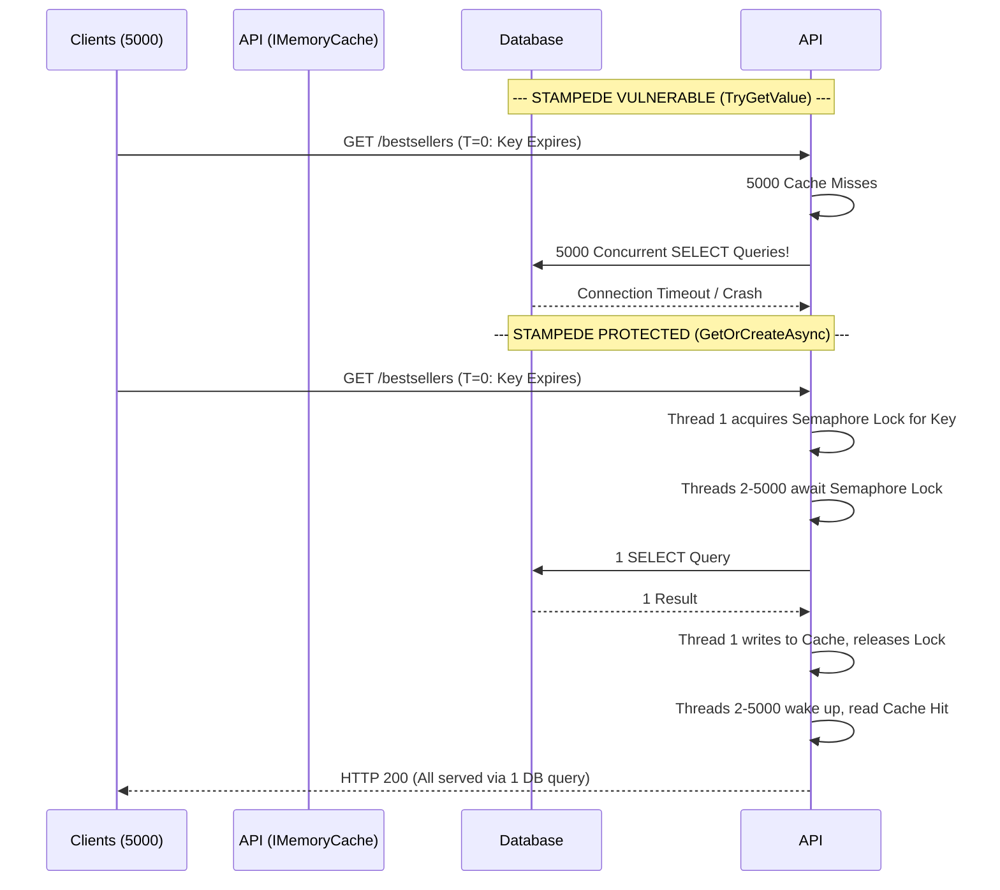

# 4.193 — Cache Stampede Prevention: GetOrCreateAsync Locking Patterns

## PART 0 — Navigation & Context

```text
ASP.NET Core Domain Hierarchy
├── Performance & Scalability
│   ├── Caching Abstractions
│   │   ├── 4.186 IMemoryCache
│   │   └── 4.187 IDistributedCache
│   └── Caching Architecture & Patterns
│       ├── 4.189 Cache-Aside Pattern
│       ├── 4.193 Cache Stampede Prevention ◄ YOU ARE HERE
│       └── 4.196 HybridCache (.NET 9)
```

**What you need before this:**
- Thorough understanding of how to implement the standard Cache-Aside pattern [[4.189 — Cache-Aside Pattern: Load-on-Miss with Async Fallback]].
- Knowledge of `IMemoryCache` and `IDistributedCache` interfaces [[4.186 — IMemoryCache: In-Process Caching with Expiry, Size, and Priority]].

**What this unlocks after:**
- Architecting `.NET 9 HybridCache` solutions, which solve this exact problem natively [[4.196 — HybridCache (.NET 9): Unified In-Process and Distributed Cache]].
- Designing ultra-resilient microservices that survive massive traffic spikes (e.g., Ticketmaster ticket drops, Black Friday sales) without bringing down the underlying SQL server.

**Why this matters to a production engineer at scale:**
You build an E-Commerce homepage. It queries the database for the Top 10 Bestselling Products. This query is complex and takes 500ms. You are smart, so you cache the result for 5 minutes.
Traffic is huge: 5,000 requests per second. For 4 minutes and 59 seconds, the cache handles 100% of the load. The database is resting.
At exactly 5 minutes, the cache key expires. 
In that exact second, 5,000 requests hit your API. The cache is empty (a Miss). All 5,000 threads simultaneously execute the database query.
Your SQL server suddenly receives 5,000 complex queries requiring 500ms each. The SQL connection pool exhausts instantly. The database CPU hits 100% and locks up. All 5,000 API requests timeout, returning HTTP 500 or 504 to the users. This is a **Cache Stampede** (or Thundering Herd). A senior engineer must understand locking patterns to ensure that when a key expires, only ONE thread goes to the database, while the other 4,999 threads politely wait for the first thread to finish.

---

## PART 1 — The Core Mental Model

> **The Fundamental Rule**
> **A Cache Stampede occurs when a highly requested cache key expires, causing a massive influx of concurrent requests to experience a cache miss simultaneously, thereby overwhelming the underlying data store. 
> To prevent this in `IMemoryCache`, you must use `GetOrCreateAsync`, which implements an internal per-key lock (SemaphoreSlim). This guarantees that only one factory delegate (DB query) executes per key per process; all other concurrent requests await that single execution. 
> For `IDistributedCache` (Redis), you must implement distributed locks (RedLock), TTL Jitter, Background Refreshing, or use the `.NET 9 HybridCache` single-flight mechanism to achieve the same protection across multiple servers.**

**The Plain-Language Analogy**
Imagine a busy train station with a single **Information Desk** (The Database).
The station displays the train schedule on a giant **Chalkboard** (The Cache).
Every 60 minutes, a station worker wipes the chalkboard clean to update it (Cache Expiry).
**Without Stampede Prevention:** At the exact moment the board is wiped, 500 passengers look up, see a blank board, panic, and ALL 500 rush the Information Desk simultaneously, yelling questions. The worker at the desk is overwhelmed and shuts the window (Database Crash).
**With Stampede Prevention (`GetOrCreateAsync`):** When the board is wiped, 500 passengers look up. The Station Manager points to ONE passenger and says, "You, go ask the desk. The rest of you 499 people, wait here in line. When he gets the answer, I will write it on the board for everyone." Only one person bothers the Information Desk.

**The Taxonomy Diagram**



---

## PART 2 — Deep Mechanics

### 2.1 — The `IMemoryCache.GetOrCreateAsync` Mechanism
ASP.NET Core's `IMemoryCache` is designed to solve this natively using an asynchronous locking mechanism per cache key.

```csharp
public async Task<List<Product>> GetBestsellersAsync()
{
    // If 10,000 threads hit this line simultaneously upon expiry,
    // only ONE thread will enter the async factory lambda.
    return await _memoryCache.GetOrCreateAsync("bestsellers", async entry =>
    {
        entry.AbsoluteExpirationRelativeToNow = TimeSpan.FromMinutes(5);
        
        // This expensive query is guaranteed to run exactly ONCE per process
        return await _db.Products.OrderByDescending(p => p.Sales).Take(10).ToListAsync();
    });
}
```
**How it works internally:** The framework maintains a `ConcurrentDictionary` of locks (`SemaphoreSlim`). When a thread misses the cache, it requests the lock for that specific string key. If it gets the lock, it checks the cache ONE MORE TIME (double-check locking), then executes the factory. The other threads `await` the lock, and upon waking, instantly find the fresh data in the cache.

### 2.2 — The `TryGetValue` Trap (Why manual cache-aside fails)
If you write the Cache-Aside pattern manually, you intentionally bypass the built-in locking.
// ⚠️ FATAL ANTI-PATTERN
```csharp
if (!_memoryCache.TryGetValue("bestsellers", out List<Product> data))
{
    // Race Condition! 10,000 threads evaluate TryGetValue as false simultaneously.
    // 10,000 threads execute the database query.
    data = await _db.Products.ToListAsync(); 
    _memoryCache.Set("bestsellers", data);
}
```

### 2.3 — The Distributed Cache Problem
`IDistributedCache` does NOT have a `GetOrCreateAsync` method. Why? Because locking across distributed nodes (Pod A, Pod B, Pod C) requires network-based consensus locking (like Redis `SET NX`). 
If a key expires in Redis, Pod A, Pod B, and Pod C will ALL experience a cache miss and execute the database query simultaneously.
If you have 50 Web Pods, you will get **50 parallel queries** hitting the database. This is a "Mini-Stampede". It's better than 5,000, but still dangerous.

### 2.4 — `.NET 9 HybridCache` (The Ultimate Solution)
Microsoft recognized the Distributed Cache Stampede problem. In .NET 9, they introduced `HybridCache`. It acts as an L1 (Memory) and L2 (Redis) cache combined, and crucially, it implements **Distributed Stampede Protection (Request Coalescing / Single-Flight)**.

```csharp
// In .NET 9, this guarantees only ONE database query across the ENTIRE CLUSTER of web pods!
return await _hybridCache.GetOrCreateAsync("bestsellers", async cancelToken => 
{
    return await LoadFromDbAsync();
});
```

---

## PART 3 — Production Code Patterns

### Pattern 1: TTL Jittering (Probabilistic Dispersal)
If your app boots up and caches 100 different reference data tables (Countries, States, Currencies) with an exact TTL of `TimeSpan.FromHours(1)`, then exactly one hour later, all 100 tables will expire at the exact same millisecond. This causes a massive DB spike.
You must introduce "Jitter" (randomness) to the TTL.

```csharp
var baseTtl = TimeSpan.FromHours(1);
// Add a random variation between 0 and 5 minutes
var jitter = TimeSpan.FromSeconds(Random.Shared.Next(0, 300));

entry.AbsoluteExpirationRelativeToNow = baseTtl.Add(jitter);
```
Now, "Countries" might expire at 60m 10s, and "States" might expire at 64m 20s, spreading the database load cleanly over time.

### Pattern 2: Background Refreshing (Early Recomputation)
For absolutely critical data (like the Homepage of Amazon), you cannot afford for ANY user to experience the 500ms database penalty during a cache miss. You want 100% cache hits.
Instead of letting the cache expire and waiting for a user request to trigger the rebuild, you use a Background Service (`IHostedService`) to rebuild the cache *before* it expires.

```csharp
public class CacheWarmupService : BackgroundService
{
    protected override async Task ExecuteAsync(CancellationToken stoppingToken)
    {
        while (!stoppingToken.IsCancellationRequested)
        {
            // Rebuild the data in the background
            var data = await _repository.GetHeavyDataAsync();
            
            // Overwrite the cache silently. Users never experience a cache miss.
            _memoryCache.Set("heavy-data", data, TimeSpan.FromMinutes(10));
            
            // Sleep until 1 minute BEFORE the cache expires
            await Task.Delay(TimeSpan.FromMinutes(9), stoppingToken);
        }
    }
}
```

### Pattern 3: Manual Redis Locking (Pre-.NET 9)
If you are on .NET 8, using Redis, and need distributed stampede protection, you must implement a primitive lock.

```csharp
public async Task<string> GetWithDistributedLockAsync(string key)
{
    var cached = await _redis.GetStringAsync(key);
    if (cached != null) return cached;

    var lockKey = $"lock:{key}";
    // Attempt to acquire a Redis lock for 10 seconds. Only one pod succeeds.
    var acquiredLock = await _redisDb.StringSetAsync(lockKey, "locked", TimeSpan.FromSeconds(10), When.NotExists);

    if (acquiredLock)
    {
        try
        {
            // I got the lock! I will query the DB.
            var data = await _db.GetSlowDataAsync();
            await _redis.SetStringAsync(key, data);
            return data;
        }
        finally
        {
            await _redisDb.KeyDeleteAsync(lockKey); // Release lock
        }
    }
    else
    {
        // Another pod got the lock. Wait a moment and check the cache again.
        await Task.Delay(200);
        return await _redis.GetStringAsync(key); 
    }
}
```

---

## PART 4 — Gotchas & Anti-Patterns

### Gotcha 1: Locking on Faulty Factories
```csharp
await _cache.GetOrCreateAsync("key", async entry => {
    return await _flakyService.GetDataAsync(); // Throws Exception!
});
```
If the factory delegate throws an exception, the `GetOrCreateAsync` lock is released, and the cache remains empty. The very next request will acquire the lock, call the factory, and likely throw the exception again. Under high load, your app will rapidly cycle through acquiring locks and throwing exceptions, burning CPU. 
**Fix:** Implement Polly Circuit Breakers inside the factory, or use Negative Caching to cache the failure state for a short time to give the downstream service room to breathe.

### Gotcha 2: The Multi-Pod Illusion
A developer uses `IMemoryCache.GetOrCreateAsync` and assumes their database is completely safe from stampedes. They deploy 50 pods to Kubernetes.
When the key expires, `GetOrCreateAsync` ensures only 1 thread *per pod* hits the database. But there are 50 pods! The database still receives 50 concurrent heavy queries.
**Fix:** Understand the boundary of in-memory locks. For multi-pod safety, you must use Distributed Locks or `.NET 9 HybridCache`.

### Gotcha 3: Stale Data during Lock Wait
If executing the database query takes 10 seconds, and 500 users are waiting on the `GetOrCreateAsync` lock, those 500 users will experience a 10-second API response time.
In extreme high-availability systems, it is often better to serve slightly stale data than to make users wait. This requires advanced patterns like "Refresh-Ahead" or returning the stale cache entry while firing a background `Task.Run` to update the cache for future users.

### Gotcha 4: Synchronous Blocking inside Async Locks
Never use `.Result` or `.Wait()` inside the factory delegate of `GetOrCreateAsync`. You are holding a semaphore lock designed for asynchronous concurrency. Blocking synchronously will rapidly exhaust the application thread pool and cause complete server deadlock.

---

## PART 5 — Performance Implications

### Request Pipeline Characteristics (Under Stampede Conditions)

| Cache Strategy | Parallel DB Queries (1 Pod) | Parallel DB Queries (10 Pods) | DB CPU Load |
|---|---|---|---|
| `TryGetValue` (No Lock) | 5,000 | 50,000 | **Catastrophic (100%)** |
| `GetOrCreateAsync` (Memory) | **1** | 10 | Low |
| `HybridCache` (.NET 9) | **1** | **1** | Negligible |

**Performance Verdict:**
Cache Stampede Prevention is not about making the *fast path* faster; it is about preventing the *slow path* from causing a cascading failure that brings down your entire infrastructure. Using `GetOrCreateAsync` trades memory and minor lock contention overhead for immense, system-saving database protection.

---

## PART 6 — Interview Arsenal

### A. The Question Bank

**Question 1:** "We implemented `IMemoryCache` on our homepage. It works great 99% of the time, but exactly every 10 minutes, our API latency spikes from 10ms to 5,000ms, and the database CPU hits 100% for a brief second. What is happening?"
- **Average Answer:** "The cache is expiring and the database has to run the query again."
- **Why That's Insufficient:** Explains the normal cache miss, but fails to explain the severe latency spike and CPU explosion.
- **Great Answer:** "You are experiencing a Cache Stampede. Every 10 minutes, your cache key expires. Because your homepage is highly trafficked, hundreds of concurrent requests experience that cache miss at the exact same millisecond. If you used `TryGetValue`, all hundreds of threads bypassed the cache and hit the database simultaneously, causing a massive CPU spike and thread starvation. To fix this, you must switch to `IMemoryCache.GetOrCreateAsync`, which uses a semaphore lock to ensure only one thread queries the database while the others wait."

**Question 2:** "What is Cache Jitter, and why is it important?"
- **Average Answer:** "It adds random time to the cache."
- **Why That's Insufficient:** Doesn't explain the systemic problem it solves.
- **Great Answer:** "Cache Jitter is the process of adding a random element of time to a cache entry's Time-To-Live (TTL). If you bulk-load 50 different reference tables into the cache at application startup with a 60-minute TTL, all 50 tables will expire exactly 60 minutes later, creating a massive simultaneous database load. By adding a random jitter (e.g., +/- 5 minutes) to each table's TTL, you spread out the expirations, smoothing out the database load and preventing aggregated stampedes."

**Question 3:** "If we use `IDistributedCache` backed by Redis, do we still need to worry about Cache Stampedes?"
- **Average Answer:** "No, Redis handles high traffic easily."
- **Why That's Insufficient:** Confuses Redis performance with Backend Database protection.
- **Great Answer:** "Yes, absolutely. The stampede doesn't hurt Redis; it hurts the underlying SQL Database. `IDistributedCache` does not have built-in request coalescing like `GetOrCreateAsync`. If a key expires in Redis, all instances of your web API will experience a miss and query the SQL database in parallel. You must manually implement distributed locking, background refreshing, or upgrade to `.NET 9 HybridCache` to achieve distributed single-flight guarantees."

### B. The Trick Questions

**Trick Question:** "To prevent stampedes, I wrote a `lock (myObject)` block around my cache read/write logic inside my async Controller. It works perfectly on my machine. Is this production-ready?"
- **The Trap:** Mixing synchronous thread locking with asynchronous async/await code.
- **The Correct Answer:** "No, that is highly dangerous and will not compile in modern C# if you `await` inside the lock. The `lock` keyword is thread-bound. An `await` can resume on a completely different thread, leading to deadlocks or `SynchronizationLockException`. For async cache locking, you MUST use `SemaphoreSlim` (which `GetOrCreateAsync` uses internally) because it supports `WaitAsync()`."

### C. Red Flags to Avoid
- 🚩 **"I just set the TTL to 10 years so the cache never expires and I don't have to worry about stampedes."** (Data staleness will ruin the application, and if the server ever restarts, you will suffer a massive 'Cold Start' stampede anyway. You must engineer for expiration).

---

## PART 7 — Decision Framework

```mermaid
graph TD
    A[Preventing Cache Stampedes] --> B{What caching layer are you using?}
    
    B -->|In-Process IMemoryCache| C[Use GetOrCreateAsync]
    C --> D[Guarantees 1 DB call per Process]
    
    B -->|Out-of-Process IDistributedCache| E{What version of .NET?}
    
    E -->|.NET 8 or older| F[Manually implement Redis SET NX Locks]
    F --> G[Or use Background Service Warmup]
    
    E -->|.NET 9+| H[Use HybridCache]
    H --> I[Provides built-in Distributed Stampede Protection]
    
    C --> J{Do multiple keys expire at the same time?}
    J -->|Yes| K[Apply TTL Jitter]
    J -->|No| L[Standard TTL]
    
    style A fill:#2d3436,stroke:#fff
    style C fill:#00b894,stroke:#fff
    style F fill:#fdcb6e,stroke:#333
    style H fill:#0984e3,stroke:#fff
    style K fill:#00b894,stroke:#fff
```



---

## PART 8 — Self-Check

### A. Conceptual Questions
1. Define a "Cache Stampede" in the context of database load.
2. Why does `TryGetValue` fail to protect against cache stampedes?
3. What underlying concurrency primitive does `IMemoryCache.GetOrCreateAsync` use to manage locks?
4. Why does an API hosted on 10 Kubernetes pods still experience a minor stampede even if `GetOrCreateAsync` is used?
5. How does TTL Jittering prevent synchronized expiration events?
6. What is the primary benefit of Background Cache Refreshing over Lazy Loading?
7. Why is `lock (obj)` dangerous to use when building manual cache locking?
8. How does `.NET 9 HybridCache` improve upon `IDistributedCache` in terms of stampede protection?

### B. Code Puzzles

**Puzzle 1: The Invisible Wait**
```csharp
var data = await _cache.GetOrCreateAsync("heavy", async entry => {
    return await _db.ExecuteVerySlowQueryAsync(); // Takes 15 seconds
});
```
*Scenario:* 100 users hit this endpoint when the cache expires. What is the user experience for the 99 users who did NOT win the lock?
<details>
<summary>Answer</summary>
They all wait 15 seconds. While the database is protected (only 1 query runs), the HTTP request threads for the other 99 users are suspended awaiting the semaphore. To the users, the API simply hangs for 15 seconds and then suddenly returns successfully.
</details>

**Puzzle 2: The Double Execution Illusion**
```csharp
public async Task<Data> GetData() {
    var cached = _cache.Get<Data>("key");
    if (cached != null) return cached;
    
    return await _cache.GetOrCreateAsync("key", async e => {
        return await _db.QueryAsync();
    });
}
```
*Scenario:* A developer adds a manual `Get` check before calling `GetOrCreateAsync` to "optimize" performance. Does this help or hurt?
<details>
<summary>Answer</summary>
It hurts readability and provides zero benefit. `GetOrCreateAsync` internally performs this exact same double-check (it checks the cache, acquires the lock, then checks the cache *again*). Adding it externally just clutters the code and creates an unnecessary race condition check.
</details>

**Puzzle 3: The Cold Start Stampede**
*Scenario:* You deploy a new version of your application. The cache is entirely empty. 5,000 users hit the site instantly. Even with `GetOrCreateAsync`, your app crashes. Why?
<details>
<summary>Answer</summary>
While `GetOrCreateAsync` protects *individual* keys, if 100 *different* keys are requested simultaneously on a cold boot (e.g., BestSellers, Featured, Categories, UserProfile), 100 separate locks are acquired and 100 concurrent DB queries execute. If your DB can only handle 50, it melts. You must use Background Services to warm up the cache before opening the API to public traffic.
</details>

---

## PART 9 — Connections & Resources

### A. Related Topics Table

| Topic | Why It Connects |
|---|---|
| [[4.186 — IMemoryCache: In-Process Caching with Expiry, Size, and Priority]] | The underlying mechanism that provides `GetOrCreateAsync`. |
| [[4.189 — Cache-Aside Pattern: Load-on-Miss with Async Fallback]] | The architectural pattern that is vulnerable to stampedes if not properly protected. |
| [[4.196 — HybridCache (.NET 9): Unified In-Process and Distributed Cache]] | The modern API designed specifically to solve the distributed stampede problem. |

### B. Books

| Book | Chapters | Why These Chapters |
|---|---|---|
| Designing Data-Intensive Applications | Chapter 8: The Trouble with Distributed Systems | Explains the physics of concurrent state and network latency. |
| Site Reliability Engineering (Google) | Chapter 22: Addressing Cascading Failures | Detailed analysis of Thundering Herds, Jitter, and Backoff strategies. |

### C. Essential Articles & Docs
- [Microsoft Docs: Cache in-memory in ASP.NET Core](https://learn.microsoft.com/en-us/aspnet/core/performance/caching/memory)
- [Marc Gravell: The 'Cache Stampede' problem](https://blog.marcgravell.com/2020/02/the-cache-stampede-problem.html) (Essential reading from the creator of StackExchange.Redis).

> [!NOTE]
> **Template Meta-Note**
> Part 0: Context & Prerequisites. Part 1: Core Mental Model. Part 2: Deep Mechanics & Pipeline. Part 3: Production Code. Part 4: Gotchas. Part 5: Performance. Part 6: Interview Arsenal. Part 7: Decision Framework. Part 8: Puzzles. Part 9: Resources.
