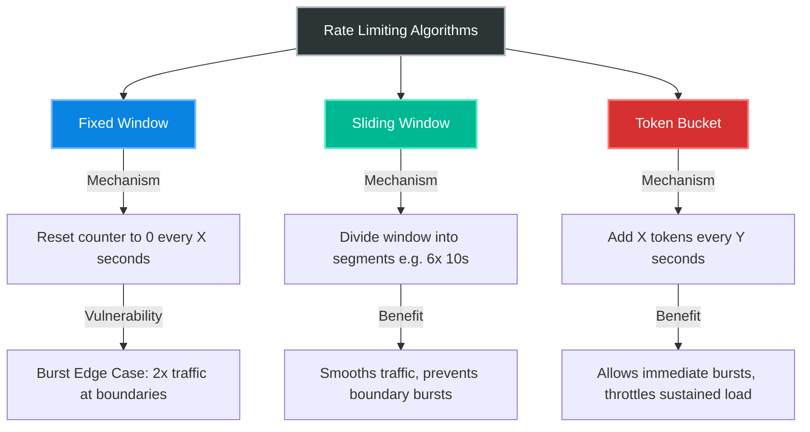

# 4.193 — Fixed Window vs Sliding Window Algorithms

## PART 0 — Navigation & Context

```text
ASP.NET Core Domain Hierarchy
├── Performance & Reliability
│   ├── 4.192 Rate Limiting Middleware (NET 7+)
│   ├── 4.193 Fixed Window vs Sliding Window Algorithms ◄ YOU ARE HERE
│   └── 4.194 Concurrency Limiter & Concurrency Leaks
└── System Architecture
```

**What you need before this:**
- How to configure the basic `.NET 7` Rate Limiting middleware [[4.192 — Rate Limiting Middleware (NET 7+)]].

**What this unlocks after:**
- Designing strict SaaS API pricing tiers.
- Preventing the "Midnight Spike" architectural failure pattern.
- Understanding the math behind Token Buckets.

**Why this matters to a production engineer at scale:**
When you configure an API limit of "100 requests per minute", the English language makes it sound simple. The underlying mathematics, however, drastically change how your server behaves under load. 
If you use a **Fixed Window**, an attacker can send 100 requests at 12:00:59, and another 100 requests at 12:01:01. They just bypassed your limit, forcing your server to process 200 requests in 2 seconds instead of 100 per minute. This is called the "Burst Edge Case".
If you use a **Sliding Window**, the algorithm tracks segments smoothly, preventing the burst edge case, but at the cost of slightly higher memory usage.
If you use a **Token Bucket**, you explicitly *allow* bursts, but throttle sustained abuse.
Choosing the wrong algorithm will either frustrate legitimate paying users (who get 429 errors when they shouldn't) or leave your server vulnerable to targeted micro-burst DDoS attacks.

---

## PART 1 — The Core Mental Model

> **The Fundamental Rule**
> **Rate limiting algorithms define how time is segmented. Fixed Windows are rigid blocks that reset entirely, allowing double-bursts at the boundary. Sliding Windows segment time into overlapping chunks to smooth out traffic. Token Buckets drip permits continuously, rewarding idle periods with burst capacity.**

**The Plain-Language Analogy**
Imagine a bar that limits you to 2 drinks per hour to keep you sober.
**Fixed Window:** The clock resets every hour on the dot (8:00, 9:00, 10:00). You order 2 drinks at 8:59. At 9:00, the clock resets. You immediately order 2 more drinks at 9:01. You just consumed 4 drinks in 2 minutes. The bartender allowed it, but the goal (keeping you sober) failed.
**Sliding Window:** The bartender looks at the *past 60 minutes* from exactly right now. At 9:01, they look back to 8:01. They see you had 2 drinks at 8:59. They refuse to serve you until 9:59. The goal is achieved.
**Token Bucket:** The bartender gives you a token every 30 minutes. You can hold a maximum of 2 tokens. You sit idle for an hour, saving up 2 tokens. You use both instantly at 9:00 (A Burst). You try to order a third at 9:01. You are denied. You must wait until 9:30 for your next token.

**The Taxonomy Diagram**



---

## PART 2 — Deep Mechanics

### 1. Fixed Window Mechanics
- **State:** A simple `int counter`.
- **Logic:** Request arrives -> If `counter < limit`, `counter++`. 
- **Timer:** A background timer fires every `Window` duration (e.g., 60s). It resets `counter = 0`.
- **Pros:** Extremely low memory. Fastest algorithm.
- **Cons:** The "Midnight Spike". If limit is 100/min. At `00:59`, user sends 100. At `01:00`, window resets. At `01:01`, user sends 100. The server just processed 200 requests in 2 seconds.

### 2. Sliding Window Mechanics
- **State:** Time is divided into `Segments` (e.g., a 1-minute window divided into 6 segments of 10 seconds each).
- **Logic:** Request arrives -> The current segment counter increments. The algorithm sums the counters of the current segment and the previous 5 segments. If sum < limit, allow.
- **Timer:** Every 10 seconds, the oldest segment is discarded, and a new segment begins.
- **Pros:** Completely eliminates the boundary burst problem. Traffic is smoothly evaluated over a rolling horizon.
- **Cons:** Slightly higher memory/CPU because it must manage arrays of segments rather than a single integer.

### 3. Token Bucket Mechanics
- **State:** A `TokenCount` and a timestamp of the last replenishment.
- **Logic:** Request arrives -> Are there tokens? If yes, `Tokens--`, allow. If no, block.
- **Timer:** Every `ReplenishmentPeriod` (e.g., 10 seconds), add `TokensPerPeriod` (e.g., 5 tokens) up to the `TokenLimit` (e.g., 100).
- **Pros:** Built specifically for APIs that allow bursts. A user who is idle for 5 minutes accumulates a full bucket, allowing them to make 100 rapid-fire requests, but then strictly throttles them to a trickle of 5 requests per 10 seconds afterward.

---

## PART 4 — Production Code Patterns

### Pattern 1: Fixed Window Implementation
Best for simple B2B APIs where you just need a hard ceiling for billing purposes (e.g., "Basic Tier gets 1,000 requests per day").

```csharp
options.AddPolicy("FixedBillingPolicy", context =>
{
    var clientId = context.Request.Headers["X-Client-Id"].ToString();
    
    return RateLimitPartition.GetFixedWindowLimiter(clientId, _ => new FixedWindowRateLimiterOptions
    {
        PermitLimit = 1000,
        Window = TimeSpan.FromHours(24),
        QueueProcessingOrder = QueueProcessingOrder.OldestFirst,
        QueueLimit = 0 // Do not queue, fail fast with 429
    });
});
```

### Pattern 2: Sliding Window Implementation
Best for protecting your application against abuse, web scrapers, and micro-bursts. This is the **default recommendation** for public-facing endpoints.

```csharp
options.AddPolicy("StrictSlidingPolicy", context =>
{
    var ip = context.Connection.RemoteIpAddress?.ToString() ?? "unknown";

    return RateLimitPartition.GetSlidingWindowLimiter(ip, _ => new SlidingWindowRateLimiterOptions
    {
        PermitLimit = 100,
        Window = TimeSpan.FromMinutes(1),
        SegmentsPerWindow = 6, // Splits 60s into six 10s segments.
        QueueProcessingOrder = QueueProcessingOrder.OldestFirst,
        QueueLimit = 0
    });
});
```
*How it works: If limit is 100. Segment 1 (0-10s) = 50 requests. Segment 2 (10-20s) = 50 requests. If the user tries to request at 25s (Segment 3), the sum of all segments is 100. They are blocked until Segment 1 expires at the 60s mark.*

### Pattern 3: Token Bucket Implementation
Best for Webhooks or Background Processors that operate in bursts (e.g., syncing 50 records at once, then going idle).

```csharp
options.AddPolicy("TokenBurstPolicy", context =>
{
    var userId = context.User.Identity?.Name ?? "anonymous";

    return RateLimitPartition.GetTokenBucketLimiter(userId, _ => new TokenBucketRateLimiterOptions
    {
        TokenLimit = 50, // Maximum burst capacity
        TokensPerPeriod = 5, // Drip rate: Add 5 tokens...
        ReplenishmentPeriod = TimeSpan.FromSeconds(10), // ...every 10 seconds
        AutoReplenishment = true,
        QueueLimit = 0
    });
});
```
*How it works: A new user starts with 50 tokens. They send 50 requests in 1 second. They hit 0 tokens. If they try a 51st request, it fails. 10 seconds later, the bucket gets 5 tokens. They can make 5 requests. If they go to lunch for an hour, the bucket fills back up, but caps at 50.*

---

## PART 4 — Gotchas & Anti-Patterns

### Gotcha 1: Too Many Segments in Sliding Window
Developers think more segments = smoother math.

// ⚠️ WRONG CODE
```csharp
new SlidingWindowRateLimiterOptions
{
    PermitLimit = 100,
    Window = TimeSpan.FromMinutes(1),
    SegmentsPerWindow = 60 // A segment every 1 second!
}
```

// HTTP consequence (wrong path):
// The rate limiter has to maintain an array of 60 integers for *every single connected user IP address*. If you have 10,000 active users, that is 600,000 tracking integers constantly rotating and summing. Memory usage spikes, and the CPU spends noticeable cycles executing array shifts.

// ✅ CORRECT CODE
// Microsoft recommends `SegmentsPerWindow` between `3` and `10`. A value of `6` (10-second blocks for a 1-minute window) provides excellent smoothing with essentially zero overhead.

### Gotcha 2: Token Bucket Queue Deadlocks
Combining Token Bucket with large queues is a recipe for disaster.

// ⚠️ WRONG CODE
```csharp
new TokenBucketRateLimiterOptions
{
    TokenLimit = 10,
    TokensPerPeriod = 1,
    ReplenishmentPeriod = TimeSpan.FromSeconds(10), // 1 token every 10s
    QueueLimit = 100
}
```

// HTTP consequence (wrong path):
// A user bursts 110 requests. 10 succeed. 100 requests go into the queue. 
// Request #11 in the queue has to wait 10 seconds for the next token.
// Request #100 in the queue has to wait 100 * 10 = 1,000 seconds (16 minutes)!
// Kestrel will hold that HTTP connection open for 16 minutes. If 10 users do this, Kestrel runs out of connections and the server crashes.

// ✅ CORRECT CODE
// Never use large queues with slow replenishment rates. Usually, `QueueLimit` should be 0 or very small (1-5). Let the client retry via standard HTTP 429 semantics.

### Gotcha 3: The Clock Drift Problem (Distributed Fixed Windows)
If you build a custom Fixed Window limiter using Redis because you have multiple servers.

// THE GOTCHA:
// If Server A and Server B have system clocks that are out of sync by just 2 seconds, Server A might reset its window for a user, while Server B still thinks the user is in the old window. 

// ✅ CORRECT CODE
// When building distributed rate limiters in Redis, the evaluation script (Lua) must rely exclusively on the Redis server's clock, NOT the ASP.NET Core server clocks. (Note: The native .NET 7 memory limiter avoids this by running locally, but suffers from the multi-node bucket isolation problem as discussed in [[4.192]]).

---

## PART 5 — Performance Implications

### Request Pipeline Characteristics

| Algorithm | Memory Cost (Per Key) | CPU Cost | Primary Vulnerability |
|---|---|---|---|
| Fixed Window | 1 Integer | `O(1)` (Instant) | Boundary Bursts |
| Token Bucket | 2 Integers | `O(1)` (Instant) | Slow Replenishment Queues |
| Sliding Window| Array of N Integers | `O(N)` (Sum Array) | High Segment Counts |

**When to Care:** All three native `.NET 7` algorithms are obscenely fast (processing in nanoseconds). You do not choose between them for *compute performance*. You choose between them based entirely on your **Business Rules** (Billing vs Abuse Prevention) and how you want to shape traffic.

---

## PART 6 — Interview Arsenal

### A. The Question Bank

**Question 1:** "A client complains that their API key gets blocked even though they swear they only send 100 requests per minute. You look at the logs and see they sent 100 requests at 10:05:59, and 10 requests at 10:06:01. The limit is 100/min. Why were the 10 requests blocked?"
- **Average Answer:** "Because they exceeded 100."
- **Why That's Insufficient:** Doesn't explain the time boundary logic.
- **Great Answer:** "This is the classic behavior of a Sliding Window algorithm. If the limit was a Fixed Window, the clock would have reset at 10:06:00, and the 10 requests would have been allowed. However, a Sliding Window evaluates the *rolling* 60 seconds prior to the current moment. At 10:06:01, the 100 requests sent at 10:05:59 are still inside the 60-second lookback window. Because the sum is 100, the bucket is full, and any additional requests are blocked until 10:06:59 when the old requests finally slide out of the window."

**Question 2:** "What is the primary architectural flaw of the Fixed Window algorithm, and how can hackers exploit it?"
- **Average Answer:** "It resets at a specific time."
- **Why That's Insufficient:** Doesn't explain the resulting mathematical multiplier.
- **Great Answer:** "The primary flaw is the Boundary Burst. Because a Fixed Window completely resets its counter at a specific time (e.g., the top of the minute), an attacker can align their traffic to hit exactly at the boundary. If the limit is 500 requests per minute, they can send 500 requests at 12:00:59, the counter resets, and they instantly send 500 more requests at 12:01:00. The server was forced to process 1,000 requests in a 2-second window, completely bypassing the intended limit and potentially causing a localized Denial of Service."

**Question 3:** "If you are building an API that processes heavy Webhooks from Stripe or GitHub, which algorithm should you use to protect your server, and why?"
- **Average Answer:** "Sliding window to be safe."
- **Why That's Insufficient:** Misses the bursty nature of Webhooks.
- **Great Answer:** "I would use a Token Bucket. Webhooks do not arrive in a smooth, predictable stream. They arrive in sudden bursts when events happen (e.g., 50 invoices paid simultaneously), followed by long periods of idle time. A Token Bucket allows us to define a maximum burst capacity (TokenLimit) so the system can instantly absorb the 50 webhooks if it has been idle. However, the slow Replenishment Rate ensures that if Stripe has a glitch and sends 10,000 webhooks in a row, the burst bucket empties, and the server restricts the incoming traffic to a safe, steady trickle."

### B. The Trick Questions

**Trick Question:** "If I set `SegmentsPerWindow = 1` on a Sliding Window, what happens?"
- **The Trap:** Thinking it crashes or becomes a 1-second window.
- **The Correct Answer:** "If you set `SegmentsPerWindow = 1`, a Sliding Window mathematically degrades into a Fixed Window. The entire window is one giant block that resets all at once, completely defeating the purpose of the sliding smoothing algorithm."

### C. Red Flags to Avoid
- 🚩 **"I use Token Bucket to make my API faster."** (No algorithm makes the API faster. They just restrict traffic. The choice of algorithm dictates *when* traffic is rejected).
- 🚩 **"I use Fixed Windows because Sliding Windows are too memory intensive."** (In .NET 7, a Sliding Window with 6 segments consumes maybe 32 bytes of RAM per IP address. It is practically non-existent. You should default to Sliding Windows for public APIs).

---

## PART 7 — Decision Framework

```mermaid
graph TD
    A[Choose Rate Limit Algorithm] --> B{What is the primary goal?}
    
    B -->|Strict Billing/Quotas| C[Fixed Window]
    B -->|Protect against Scraping/DDoS| D[Sliding Window]
    B -->|Absorb sporadic bursts| E[Token Bucket]
    
    C --> F[User gets exactly 1,000 calls per day. Resets at midnight.]
    
    D --> G[Prevents double-traffic bursts at minute boundaries.]
    
    E --> H[Requires tuning: Burst Limit vs Drip Rate]
    
    style A fill:#2d3436,stroke:#fff
    style C fill:#0984e3,stroke:#fff
    style D fill:#00b894,stroke:#fff
    style E fill:#d63031,stroke:#fff
```



---

## PART 8 — Self-Check

### A. Conceptual Questions
1. Why is a Fixed Window vulnerable to boundary bursts?
2. How does a Sliding Window divide time to prevent boundary bursts?
3. In a Token Bucket, what dictates how many requests a user can make instantly after being idle for an hour?
4. In a Token Bucket, what dictates how many requests a user can make during sustained, continuous heavy load?
5. Why is a high `QueueLimit` incredibly dangerous when paired with a slow Token Bucket?
6. Why is `SegmentsPerWindow` usually set between 3 and 10?
7. If you want to sell an API plan that grants "10,000 requests per calendar month", which algorithm is the only logical choice?
8. If an attacker sends 100 requests at 1:00:59, and 100 requests at 1:01:01 on an API limited to 100/min using a Sliding Window, what happens to the second batch of requests?

### B. Code Puzzles

**Puzzle 1: The Infinite Drip**
```csharp
new TokenBucketRateLimiterOptions {
    TokenLimit = 10,
    TokensPerPeriod = 10,
    ReplenishmentPeriod = TimeSpan.FromSeconds(1)
}
```
*Scenario:* What is the functional behavior of this Token Bucket?
<details>
<summary>Answer</summary>
The burst limit is 10, but it adds 10 tokens every 1 second. This effectively degrades into a Fixed Window of 10 requests per second. The Token Bucket loses its unique burst-absorption property because the replenishment rate is equal to the max capacity.
</details>

**Puzzle 2: The Too-Smooth Slide**
```csharp
new SlidingWindowRateLimiterOptions {
    PermitLimit = 100,
    Window = TimeSpan.FromMinutes(1),
    SegmentsPerWindow = 600 // 10 segments a second!
}
```
*Scenario:* What happens to the server?
<details>
<summary>Answer</summary>
Extreme memory and CPU overhead. The server must maintain an array of 600 integers for every single active IP address and sum them constantly. Kestrel performance will degrade.
</details>

**Puzzle 3: The Generous Queue**
```csharp
new FixedWindowRateLimiterOptions {
    PermitLimit = 5,
    Window = TimeSpan.FromMinutes(1),
    QueueProcessingOrder = QueueProcessingOrder.OldestFirst,
    QueueLimit = int.MaxValue // Never drop a request!
}
```
*Scenario:* A bug in a client app sends 50,000 requests.
<details>
<summary>Answer</summary>
5 requests are processed. 49,995 requests are placed in the queue. Kestrel holds 49,995 TCP sockets open. 49,995 requests wait. Because the limit is 5 per minute, the last request in the queue will wait 10,000 minutes (6.9 days) before executing. Long before that, the server will crash from memory/socket exhaustion. Never use unbounded queues.
</details>

---

## PART 9 — Connections & Resources

### A. Related Topics Table

| Topic | Why It Connects |
|---|---|
| [[4.192 — Rate Limiting Middleware (NET 7+)]] | The foundation for actually applying these options to ASP.NET Core. |
| [[4.194 — Concurrency Limiter & Concurrency Leaks]] | The 4th algorithm, which doesn't care about time at all, only active executions. |

### B. Books

| Book | Chapters | Why These Chapters |
|---|---|---|
| System Design Interview (Alex Xu) | Chapter 4: Design a Rate Limiter | The definitive language-agnostic explanation of these algorithms. |
| ASP.NET Core in Action, 3rd Ed | Chapter 16: Securing your application | Covers the configuration syntax for these limiters. |

### C. Essential Articles & Docs
- [Microsoft Docs: Rate limiting algorithms in .NET](https://learn.microsoft.com/en-us/aspnet/core/performance/rate-limit)
- [Cloudflare: What is Rate Limiting?](https://www.cloudflare.com/learning/bots/what-is-rate-limiting/)

> [!NOTE]
> **Template Meta-Note**
> Part 0: Context & Prerequisites. Part 1: Core Mental Model. Part 2: Deep Mechanics & Pipeline. Part 3: Production Code. Part 4: Gotchas. Part 5: Performance. Part 6: Interview Arsenal. Part 7: Decision Framework. Part 8: Puzzles. Part 9: Resources.
