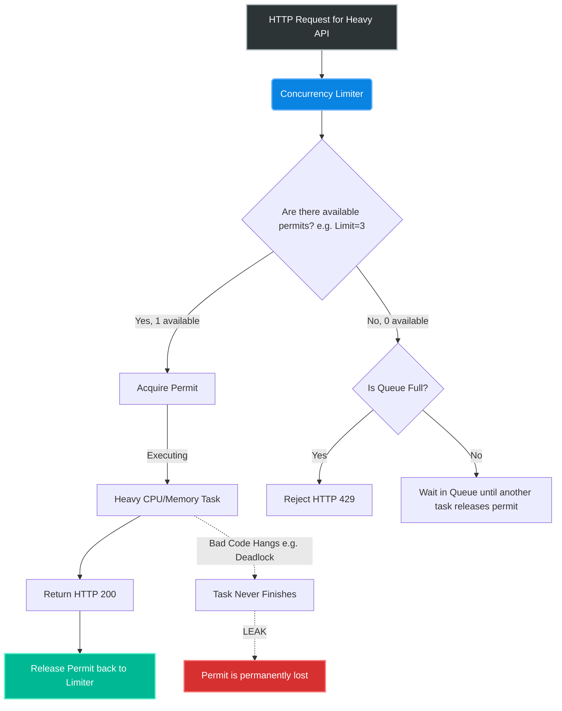

# 4.194 — Concurrency Limiter & Concurrency Leaks

## PART 0 — Navigation & Context

```text
ASP.NET Core Domain Hierarchy
├── Performance & Reliability
│   ├── 4.192 Rate Limiting Middleware (NET 7+)
│   ├── 4.193 Fixed Window vs Sliding Window Algorithms
│   ├── 4.194 Concurrency Limiter & Concurrency Leaks ◄ YOU ARE HERE
└── Infrastructure
```

**What you need before this:**
- Understanding the basic `System.Threading.RateLimiting` setup [[4.192 — Rate Limiting Middleware (NET 7+)]].
- Familiarity with the concepts of ThreadPool starvation and Async/Await.

**What this unlocks after:**
- Protecting expensive endpoints (e.g., PDF generation, complex report building) from crashing your server.
- Identifying and debugging mysterious `TimeoutException` or `DbContext` connection pool exhaustion errors.

**Why this matters to a production engineer at scale:**
Fixed Windows and Token Buckets (Time-based limiters) are great for Billing and API abuse. But they are completely useless for protecting your actual CPU and Memory. 
If an endpoint reads a 100MB file and converts it to a PDF, it takes 10 seconds and uses 10% of the CPU. If you set a Fixed Window limit of "100 requests per minute", and 20 users hit that endpoint at the *exact same second*, your server will try to allocate 2GB of RAM and 200% CPU instantly. The server will crash with an `OutOfMemoryException`, even though the users were perfectly within their "100 per minute" quota.
The **Concurrency Limiter** ignores time. It only cares about *simultaneous active executions*. By limiting the PDF endpoint to `PermitLimit = 3`, you guarantee the server never exceeds 30% CPU, no matter how many users hit it. However, if you write bad async code inside the endpoint, a Concurrency Limiter will permanently leak permits, causing an invisible, irreversible server freeze.

---

## PART 1 — The Core Mental Model

> **The Fundamental Rule**
> **A Concurrency Limiter does not track rates over time; it tracks active threads. When a request enters, a permit is taken. When the request finishes (or fails), the permit is returned. If no permits are available, the request queues or fails. If an unhandled thread hang occurs, the permit is never returned—causing a Concurrency Leak.**

**The Plain-Language Analogy**
Imagine a Bowling Alley.
**Time-Based Limiter:** The manager says, "You can bowl a maximum of 5 games per hour."
**Concurrency Limiter:** The physical reality of the building. There are exactly 10 bowling lanes. It does not matter if 50 people walk in. Only 10 people can bowl at the *exact same time*. The 11th person must wait in line. When someone finishes a game and steps off the lane, the lane becomes available for the next person in line.
**A Concurrency Leak:** A bowler walks onto Lane 3, drops their ball, falls asleep on the floor, and refuses to leave. The manager never kicks them out. Now the bowling alley only has 9 usable lanes. If 10 people fall asleep, the entire business halts forever, even though there are 100 people waiting in line with money.

**The Taxonomy Diagram**



---

## PART 2 — Deep Mechanics

### 1. The Concurrency Mathematics
Unlike sliding windows that require background timers to reset counters, the Concurrency Limiter is driven entirely by the `Dispose` pattern.
When the middleware allows a request, it essentially calls `Interlocked.Decrement(ref _availablePermits)`. 
When the HTTP request finishes, ASP.NET Core disposes the context, which triggers `Interlocked.Increment(ref _availablePermits)`.
It is completely decoupled from the system clock.

### 2. Global vs Scoped Concurrency
- **Global Concurrency:** A partition key of `"global"` means the limit applies to the *entire server*. If Limit = 10, only 10 PDF generations can happen server-wide simultaneously.
- **User Concurrency:** A partition key of `UserId` means *User A* can generate 2 PDFs simultaneously, and *User B* can generate 2 PDFs simultaneously.

### 3. The Concurrency Leak
A Concurrency Leak is the most dangerous bug associated with this algorithm. 
If an HTTP request begins executing, takes a permit, but then *deadlocks* (e.g., using `.Result` on a Task, or an infinite `while(true)` loop), the HTTP request never terminates. ASP.NET Core never disposes the context. The permit is permanently held.
If the limit is 5, and 5 requests deadlock, the endpoint is permanently bricked for all users until the physical server is rebooted.

---

## PART 3 — Production Code Patterns

### Pattern 1: Protecting a CPU-Heavy Endpoint
A report generation endpoint that takes 5 seconds and massive RAM. We must protect the server by enforcing a global limit.

```csharp
// Program.cs
builder.Services.AddRateLimiter(options =>
{
    options.AddPolicy("HeavyReportPolicy", context =>
    {
        // Use a constant string so ALL users share this identical bucket
        return RateLimitPartition.GetConcurrencyLimiter("global_report_limit", _ =>
            new ConcurrencyLimiterOptions
            {
                PermitLimit = 3, // Max 3 simultaneous report generations server-wide
                QueueProcessingOrder = QueueProcessingOrder.OldestFirst,
                QueueLimit = 10  // Let 10 users wait in line before failing with 429
            });
    });
});

var app = builder.Build();
app.UseRateLimiter();

app.MapGet("/api/reports/heavy", async () =>
{
    // If 4 users hit this, 3 will execute immediately.
    // The 4th user will await here until one of the first 3 finishes.
    await GenerateMassivePdfAsync(); 
    return Results.Ok("Report Generated");
})
.RequireRateLimiting("HeavyReportPolicy");
```

### Pattern 2: Preventing API Abuse per User
Preventing a single user from scraping your database by opening 50 concurrent connections from a script.

```csharp
options.AddPolicy("UserConcurrencyPolicy", context =>
{
    var userId = context.User.Identity?.Name ?? "anon";

    // Partition by User ID
    return RateLimitPartition.GetConcurrencyLimiter(userId, _ =>
        new ConcurrencyLimiterOptions
        {
            PermitLimit = 5, // User John can make 5 simultaneous requests. 
                             // User Sarah can also make 5 simultaneous requests.
            QueueLimit = 0   // Scraping scripts fail instantly
        });
});
```

### Pattern 3: Bulletproofing Against Leaks (CancellationToken)
To ensure a permit is *always* returned, you must guarantee that the HTTP request will eventually terminate, even if the backend process hangs.

```csharp
app.MapGet("/api/reports/safe", async (HttpContext context) =>
{
    // ✅ CORRECT: We pass the HTTP Context's Cancellation Token!
    // If the user gets bored waiting and closes their browser tab,
    // the TCP connection drops, the token cancels, the Task aborts, 
    // an exception is thrown, the HTTP pipeline completes, and the 
    // Concurrency Permit is safely returned to the bucket!
    await GenerateMassivePdfAsync(context.RequestAborted); 
    
    return Results.Ok("Report Generated");
})
.RequireRateLimiting("HeavyReportPolicy");
```

---

## PART 4 — Gotchas & Anti-Patterns

### Gotcha 1: The Infinite Hang (The Silent Leak)
A developer uses a synchronous, blocking library that doesn't accept a Cancellation Token.

// ⚠️ WRONG CODE
```csharp
app.MapPost("/process", () => {
    // A legacy library that gets stuck in an infinite loop due to a bad regex
    LegacyDataProcessor.Process(hugeData); 
    return Results.Ok();
}).RequireRateLimiting("ConcurrencyLimit3");
```

// HTTP consequence (wrong path):
// A malicious payload triggers the bad regex. The thread hangs at 100% CPU. The client closes their browser. Because the method is synchronous and blocked, ASP.NET Core cannot abort the thread. The request never finishes. One permit is permanently destroyed. After 3 bad payloads, the endpoint returns HTTP 429 to everyone forever.

// ✅ CORRECT CODE
// Always use `async` libraries that accept a `CancellationToken`. If forced to use a dangerous legacy library, wrap it in a timeout:
```csharp
var cts = CancellationTokenSource.CreateLinkedTokenSource(context.RequestAborted);
cts.CancelAfter(TimeSpan.FromSeconds(30)); // Force kill after 30s
// Execute legacy code on a background thread with timeout handling...
```

### Gotcha 2: High Queue Limits on Long Tasks
Developers hate seeing 429 errors in their logs, so they increase the queue.

// ⚠️ WRONG CODE
```csharp
new ConcurrencyLimiterOptions {
    PermitLimit = 2,
    QueueLimit = 1000 // Let them wait!
}
```

// HTTP consequence (wrong path):
// The task takes 10 seconds. PermitLimit is 2. The throughput is 12 requests per minute.
// 1,000 users hit the endpoint. 2 are executing. 998 are in the Queue.
// The 998th user must wait `(998 / 2) * 10 = 4,990 seconds` (83 minutes) in the queue.
// Kestrel holds 1,000 TCP sockets open for 83 minutes. Browsers will timeout after 60s anyway. The server exhausts its connection pool processing requests for users who already left.

// ✅ CORRECT CODE
// Concurrency queues should be tiny (e.g., `QueueLimit = 5`). If the server is at capacity, fail fast. 

### Gotcha 3: The DbContext Connection Pool Collision
A subtle interaction between Concurrency Limiters and Entity Framework Core.
EF Core has a default max connection pool size of 100.

// Scenario:
// You set a Global Concurrency limit of 200 on an endpoint that hits the database.

// THE GOTCHA:
// 200 users hit the endpoint. The rate limiter allows all 200 to execute simultaneously.
// All 200 threads ask EF Core for a database connection.
// EF Core only has 100 connections. 100 threads get connections. 100 threads hang, waiting for a connection to open.
// After 30 seconds, EF Core throws an `InvalidOperationException: Timeout expired. The timeout period elapsed prior to obtaining a connection from the pool.`

// ✅ CORRECT CODE
// Your Concurrency Limit must NEVER exceed the downstream limits of your dependencies (like the DB Connection Pool or 3rd party API limits). If EF Core pool is 100, your global concurrency limit that hits the DB must be strictly less than 100.

---

## PART 5 — Performance Implications

### Request Pipeline Characteristics

| Scenario | Server CPU/Memory | Client Experience | Best Practice |
|---|---|---|---|
| Limit = 5, Queue = 0 | Stable (Capped) | Instant 429 if busy | Best for public APIs. |
| Limit = 5, Queue = 10 | Stable (Capped) | Wait time (Latency) | Best for internal B2B APIs. |
| Limit = No Limit | CPU Spikes to 100% | 503 Crashes/Timeouts | Dangerous for heavy routes. |

### The "Shedding Load" Philosophy
Concurrency limiting is the purest implementation of **Load Shedding**. The goal is not to punish the user; the goal is to protect the server so it doesn't crash. It is mathematically better to serve 5 users perfectly and reject 95 users instantly (who can retry later), than to try to serve 100 users simultaneously, run out of memory, and fail all 100 users while taking down the application.

---

## PART 6 — Interview Arsenal

### A. The Question Bank

**Question 1:** "We have an endpoint that resizes uploaded images. It uses massive amounts of RAM. We put a `FixedWindowRateLimiter` of 60 requests per minute on it. Yesterday, the server crashed with an `OutOfMemoryException`. Why did the rate limiter fail to protect the server?"
- **Average Answer:** "60 per minute is too high."
- **Why That's Insufficient:** 60/min is only 1 per second on average. The issue is concurrency, not rate.
- **Great Answer:** "Time-based rate limiters (Fixed/Sliding Window) do not protect against simultaneous bursts. A limit of 60 per minute allows 60 users to upload an image at the exact same millisecond. If 60 image resizes happen concurrently, the server exhausts its RAM instantly. To protect CPU and RAM, you must use a `ConcurrencyLimiter`. A Concurrency Limiter ignores time entirely. If you set `PermitLimit = 2`, the server will only ever process 2 images simultaneously. The 3rd user will be queued or rejected, guaranteeing the server never exceeds the RAM required for 2 operations."

**Question 2:** "What is a Concurrency Leak, and how do you prevent it?"
- **Average Answer:** "It's when the limit breaks and lets too many people in."
- **Why That's Insufficient:** A leak is the exact opposite: it lets *nobody* in.
- **Great Answer:** "A Concurrency Leak occurs when a request acquires a permit from the Concurrency Limiter, begins executing, but then hangs indefinitely—perhaps due to a thread deadlock, an infinite loop, or a blocked synchronous network call. Because the HTTP request never terminates, ASP.NET Core never returns the permit to the bucket. If the limit is 5, and 5 threads hang, the endpoint is permanently locked out for all users, always returning 429s. To prevent this, all I/O operations inside the endpoint must be asynchronous and strictly pass the `HttpContext.RequestAborted` cancellation token down the chain, ensuring that if the client drops or a timeout occurs, the task aborts and the permit is released."

**Question 3:** "If you configure a Concurrency Limiter with a Partition Key of `context.User.Identity.Name`, what are you protecting against?"
- **Average Answer:** "You are protecting the server from crashing."
- **Why That's Insufficient:** If it's partitioned by user, 1,000 different users can still crash the server.
- **Great Answer:** "You are protecting against a single user monopolizing the system (like a script opening 50 concurrent connections). However, you are NOT protecting the server from overall exhaustion. If the limit is 2 per user, and 500 different users connect simultaneously, the server will still attempt to execute 1,000 concurrent requests and likely crash. To protect the physical server, you must use a static, global partition key so all users draw from the same limited pool of permits."

### B. The Trick Questions

**Trick Question:** "If an endpoint throws a `NullReferenceException` halfway through its execution, does the Concurrency Limiter leak the permit because the request failed?"
- **The Trap:** Thinking the developer must manually `try/catch/release` the permit.
- **The Correct Answer:** "No, it does not leak. The Concurrency Limiter is integrated into the ASP.NET Core Middleware pipeline. When the `NullReferenceException` is thrown, it bubbles up the pipeline. The Rate Limiting middleware catches the pipeline completion (or context disposal) and safely increments the permit counter back up. Permits only leak if the thread *never* completes (hanging)."

### C. Red Flags to Avoid
- 🚩 **"I set the Concurrency Limit to match my Max ThreadPool size."** (This is far too high. If the ThreadPool is 1000, and you allow 1000 concurrent heavy CPU tasks, the CPU will choke on context switching. Concurrency limits for heavy tasks should usually be very low, e.g., 2 to 10).
- 🚩 **"I use Concurrency Limiters to limit API billing."** (Concurrency limiters don't limit *usage over time*. A user could sequentially generate 10,000 PDFs in an hour without ever triggering a Concurrency Limit of 2. Billing requires Sliding/Fixed Windows).

---

## PART 7 — Decision Framework

```mermaid
graph TD
    A[Protecting an API Endpoint] --> B{What is the threat model?}
    
    B -->|User consuming too much quota| C[Sliding Window Limiter]
    B -->|Endpoint consumes heavy Server CPU/RAM| D[Concurrency Limiter]
    
    D --> E{How should it be partitioned?}
    
    E -->|Protect the physical Server| F[Global Partition e.g. 'pdf_limit']
    E -->|Prevent single-user script scraping| G[User Partition e.g. User.Id]
    
    F --> H{What happens if Limit is reached?}
    
    H -->|Queue = 0| I[Fail fast with 429. Best for UX.]
    H -->|Queue > 0| J[Hold connection open. Dangerous if > 10.]
    
    style A fill:#2d3436,stroke:#fff
    style C fill:#0984e3,stroke:#fff
    style D fill:#00b894,stroke:#fff
    style F fill:#00b894,stroke:#fff
    style G fill:#0984e3,stroke:#fff
    style I fill:#00b894,stroke:#fff
    style J fill:#d63031,stroke:#fff
```



---

## PART 8 — Self-Check

### A. Conceptual Questions
1. How does a Concurrency Limiter fundamentally differ from a Fixed Window limiter?
2. Why does a Fixed Window limiter fail to protect against `OutOfMemoryExceptions` on a heavy endpoint?
3. What happens mathematically to the permit counter when a request enters, and when it exits?
4. What is a Concurrency Leak?
5. How does passing `CancellationToken` prevent Concurrency Leaks?
6. Why is a high `QueueLimit` dangerous for Kestrel's connection pool?
7. What happens if your Global Concurrency limit is higher than your Entity Framework Core connection pool size?
8. How do you configure a Concurrency Limiter to apply a single server-wide limit instead of a per-user limit?

### B. Code Puzzles

**Puzzle 1: The Missing Await**
```csharp
app.MapPost("/heavy", () => {
    Task.Run(() => HeavyCpuWork()); // Fire and forget
    return Results.Ok();
}).RequireRateLimiting("ConcurrencyOf2");
```
*Scenario:* 50 users hit the endpoint at once. Does the Concurrency Limiter protect the CPU?
<details>
<summary>Answer</summary>
No. The endpoint immediately returns `Results.Ok()`, finishing the HTTP request. The Concurrency Limiter instantly returns the permit. Meanwhile, 50 `HeavyCpuWork` tasks are now running simultaneously in the background ThreadPool, bypassing the limiter entirely and crashing the server.
*Fix:* Do not use Fire-and-Forget inside a Concurrency Limited endpoint. `await` the task.
</details>

**Puzzle 2: The Double Limit**
```csharp
options.AddPolicy("PdfPolicy", context => {
    var ip = context.Connection.RemoteIpAddress.ToString();
    return RateLimitPartition.GetConcurrencyLimiter(ip, _ => new() { PermitLimit = 2 });
});
```
*Scenario:* The developer wants to ensure the server never processes more than 2 PDFs simultaneously. Will this work?
<details>
<summary>Answer</summary>
No. The Partition Key is the user's IP. If 10 different users request a PDF from 10 different IPs, the middleware creates 10 different buckets. Each user gets 2 permits. The server will process 20 PDFs simultaneously and crash.
*Fix:* The partition key must be a static string (e.g., `"global"`) to enforce a server-wide limit.
</details>

**Puzzle 3: The Async Deadlock**
```csharp
app.MapGet("/data", () => {
    var data = _db.GetDataAsync().Result; // Sync over Async
    return data;
}).RequireRateLimiting("GlobalLimitOf5");
```
*Scenario:* The database query takes 1 second. What is the risk?
<details>
<summary>Answer</summary>
Calling `.Result` on an async method causes ThreadPool starvation and potential deadlocks. If the thread deadlocks, the HTTP request never completes. The permit is never released. This is a textbook Concurrency Leak. After 5 deadlocks, the endpoint is permanently offline.
*Fix:* Use `await _db.GetDataAsync()`.
</details>

---

## PART 9 — Connections & Resources

### A. Related Topics Table

| Topic | Why It Connects |
|---|---|
| [[4.193 — Fixed Window vs Sliding Window Algorithms]] | Compares the time-based alternatives to the concurrency algorithm. |
| [[4.192 — Rate Limiting Middleware (NET 7+)]] | The foundational setup required to use Concurrency Limiters. |

### B. Books

| Book | Chapters | Why These Chapters |
|---|---|---|
| C# in Depth (Jon Skeet) | Chapter 15: Asynchrony | Understanding why tasks hang (causing leaks). |
| ASP.NET Core in Action, 3rd Ed | Chapter 16: Securing your app | Brief mention of concurrency limiting. |

### C. Essential Articles & Docs
- [Microsoft Docs: Concurrency Limiter](https://learn.microsoft.com/en-us/aspnet/core/performance/rate-limit#concurrencylimiter)
- [Stephen Cleary: Don't Block on Async Code](https://blog.stephencleary.com/2012/07/dont-block-on-async-code.html) (Critical for preventing leaks).

> [!NOTE]
> **Template Meta-Note**
> Part 0: Context & Prerequisites. Part 1: Core Mental Model. Part 2: Deep Mechanics & Pipeline. Part 3: Production Code. Part 4: Gotchas. Part 5: Performance. Part 6: Interview Arsenal. Part 7: Decision Framework. Part 8: Puzzles. Part 9: Resources.
