# 4.194 — Distributed Cache Serialization: System.Text.Json and MessagePack

## PART 0 — Navigation & Context

```text
ASP.NET Core Domain Hierarchy
├── Performance & Scalability
│   ├── Caching Abstractions
│   │   ├── 4.186 IMemoryCache
│   │   ├── 4.187 IDistributedCache
│   │   └── 4.188 Redis Integration
│   └── Data Transformation
│       ├── 4.268 System.Text.Json
│       └── 4.194 Cache Serialization ◄ YOU ARE HERE
```

**What you need before this:**
- A deep understanding of `IDistributedCache` and how it fundamentally differs from `IMemoryCache` [[4.187 — IDistributedCache: The Abstraction for Out-of-Process Caching]].
- Basic knowledge of Redis integration [[4.188 — Redis as IDistributedCache: StackExchange.Redis Integration]].

**What this unlocks after:**
- Transitioning your distributed systems from CPU-heavy, unoptimized text caching to ultra-fast, binary-packed caching for high-frequency trading or massive real-time game servers.
- Understanding the implications of caching on Zero-Downtime deployments (schema evolution).

**Why this matters to a production engineer at scale:**
When you use `IMemoryCache`, you are passing a C# reference pointer to RAM. It takes 0 milliseconds and consumes exactly the size of the object in memory. 
When you use `IDistributedCache` (Redis), the cache is located on a physical server 10 miles away. You cannot send a C# reference pointer over a TCP/IP network cable. You must break your `UserDto` object down into an array of bytes, send it over the wire, and have the receiving server stitch it back together. This is Serialization.
If you choose the wrong serialization format, your 1MB User Profile might expand to 5MB in JSON, instantly maxing out your Redis server's RAM and saturating your network bandwidth. If you choose the wrong deserializer, you might trigger massive CPU spikes due to Garbage Collection (allocating strings for every property). A senior engineer knows when to use human-readable JSON (System.Text.Json) for debugging, and when to drop down to bare-metal binary packing (MessagePack) to save millions of dollars in AWS networking costs.

---

## PART 1 — The Core Mental Model

> **The Fundamental Rule**
> **`IDistributedCache` stores and retrieves exactly one data type: `byte[]`. It is completely agnostic to what those bytes represent. The Application is responsible for serializing C# objects to bytes on `SetAsync` and deserializing bytes back to C# objects on `GetAsync`. 
> `System.Text.Json` (UTF-8 JSON) is the default, highly-optimized standard for general-purpose apps. 
> `MessagePack` is a binary serialization format that sacrifices human-readability for vastly smaller byte arrays and faster CPU processing, used in extreme high-throughput scenarios.**

**The Plain-Language Analogy**
Imagine `IMemoryCache` is a **bookshelf in your house**. You just put the entire physical book on the shelf.
`IDistributedCache` (Redis) is a **warehouse in another city**. You cannot just hand them a book over the phone. 
To store the book, you must translate it into Morse Code (`byte[]`), transmit it over the radio (TCP), and the warehouse writes down the dots and dashes.
When you want the book back, they read the dots and dashes back to you, and you reconstruct the book on your desk.
**JSON** is like sending the book via standard English text. It's easy for the warehouse worker to read if something goes wrong, but it takes a long time to transmit.
**MessagePack** is like sending the book using an ultra-dense, highly compressed shorthand. The warehouse worker can't read it, but it transmits 5x faster and takes up far less space on their shelves.

**The Taxonomy Diagram**

```mermaid
graph TD
    A[C# Application Object: ProductDto]
    
    A -->|JSON Serialization| B(System.Text.Json)
    A -->|Binary Serialization| C(MessagePack)
    
    B -->|{"Id":42, "Name":"Hat"}| D[Byte Array]
    C -->|0x82 0xA2 0x49 0x64...| D
    
    D -->|TCP/IP Network| E[(Redis / IDistributedCache)]
    
    E -->|TCP/IP Network| F[Byte Array]
    
    F -->|JSON Deserialization| G(System.Text.Json)
    F -->|Binary Deserialization| H(MessagePack)
    
    G --> I[C# Application Object: ProductDto]
    H --> I
    
    style E fill:#d63031,stroke:#ff7675,stroke-width:2px,color:#fff
    style B fill:#0984e3,stroke:#fff
    style C fill:#00b894,stroke:#fff
    style G fill:#0984e3,stroke:#fff
    style H fill:#00b894,stroke:#fff
```

---

## PART 2 — Deep Mechanics

### 2.1 — System.Text.Json (The Modern Default)
In modern .NET (Core 3.1+), Newtonsoft.Json is obsolete for high-performance caching. `System.Text.Json` is designed to read and write directly to UTF-8 byte streams, bypassing the need to ever allocate a C# `string` in memory.

**The Right Way:**
```csharp
// Serialize directly to UTF-8 bytes (Extremely fast, low allocation)
byte[] jsonBytes = JsonSerializer.SerializeToUtf8Bytes(myObject);
await _cache.SetAsync("key", jsonBytes);

// Deserialize directly from UTF-8 bytes
byte[]? cachedBytes = await _cache.GetAsync("key");
var myObject = JsonSerializer.Deserialize<MyObject>(cachedBytes);
```

**The Wrong Way:**
```csharp
// ⚠️ ANTI-PATTERN: Double allocation
string jsonString = JsonSerializer.Serialize(myObject); // Allocates a massive string
byte[] jsonBytes = Encoding.UTF8.GetBytes(jsonString);  // Allocates a massive byte array
```

### 2.2 — MessagePack (The Performance King)
MessagePack is an efficient binary serialization format. It lets you exchange data in multiple languages like JSON, but it is fast and small.

**Setup:**
You must install the `MessagePack` NuGet package (usually maintained by Cysharp/neuecc).

**Implementation:**
```csharp
// 1. Mark your DTOs for MessagePack serialization
[MessagePackObject]
public class ProductDto
{
    [Key(0)] // Binary format relies on exact index positions for speed
    public int Id { get; set; }
    
    [Key(1)]
    public string Name { get; set; } = string.Empty;
}

// 2. Serialize and Deserialize
byte[] mpBytes = MessagePackSerializer.Serialize(myProduct);
await _cache.SetAsync("key", mpBytes);

var cachedProduct = MessagePackSerializer.Deserialize<ProductDto>(cachedBytes);
```

### 2.3 — The Poison Message Problem (Schema Evolution)
When you use `IMemoryCache`, schema evolution isn't a problem because memory dies when the app restarts.
Redis lives forever.
Imagine you deploy **v1** of your app. It caches `{"Id": 42, "Price": 10.99}` to Redis.
You deploy **v2** of your app. You changed the `Price` property from a `decimal` to a custom `Money` object: `{"Id": 42, "Price": {"Amount": 10.99, "Currency": "USD"}}`.
When **v2** pulls the **v1** bytes from Redis and tries to deserialize them, `System.Text.Json` throws a `JsonException`.
If you don't catch this exception, your cache read brings down your entire API. The old cached entry has become a "Poison Message".

---

## PART 3 — Production Code Patterns

### Pattern 1: The Generic Cache Wrapper (System.Text.Json)
Because you do this constantly, abstract it into an extension method that safely handles serialization and poison messages.

```csharp
public static class DistributedCacheExtensions
{
    public static async Task<T?> GetJsonAsync<T>(this IDistributedCache cache, string key)
    {
        var bytes = await cache.GetAsync(key);
        if (bytes == null) return default;

        try
        {
            return JsonSerializer.Deserialize<T>(bytes);
        }
        catch (JsonException ex)
        {
            // CRITICAL: A deserialization failure means the cache schema is incompatible.
            // Treat this EXACTLY like a Cache Miss. Do not crash the app.
            // Optionally, delete the poison key so it doesn't happen again.
            await cache.RemoveAsync(key);
            return default; 
        }
    }

    public static async Task SetJsonAsync<T>(this IDistributedCache cache, string key, T value, DistributedCacheEntryOptions options)
    {
        var bytes = JsonSerializer.SerializeToUtf8Bytes(value);
        await cache.SetAsync(key, bytes, options);
    }
}
```

### Pattern 2: Cache Key Versioning
To completely avoid the Poison Message problem without relying on `catch (JsonException)`, include a schema version directly in your cache keys.

```csharp
public class CacheKeys
{
    // When the schema of UserProfile changes, increment this to "v2"
    private const string ProfileVersion = "v1";
    
    public static string UserProfile(int userId) => $"profile:{ProfileVersion}:{userId}";
}

// Usage
await _cache.SetJsonAsync(CacheKeys.UserProfile(42), profileData, options);
```
When you deploy `v2`, the app looks for `profile:v2:42`. It misses the cache, loads from the DB, and writes the new schema. The old `v1` keys simply sit in Redis until their TTL expires and the garbage collector cleans them up.

### Pattern 3: Hybrid Approach (JSON for small, MessagePack for massive)
You don't have to choose just one. You can use JSON for your simple `UserDto` (to keep it readable in the Redis CLI), and MessagePack for your massive 10MB `CatalogGraph` payload.

```csharp
// Extension for binary payloads
public static async Task<T?> GetMessagePackAsync<T>(this IDistributedCache cache, string key)
{
    var bytes = await cache.GetAsync(key);
    if (bytes == null) return default;
    
    try {
        return MessagePackSerializer.Deserialize<T>(bytes);
    } catch (MessagePackSerializationException) {
        return default; // Treat as miss
    }
}
```

---

## PART 4 — Gotchas & Anti-Patterns

### Gotcha 1: The String Allocation Trap
As mentioned in Part 2, using `GetStringAsync` and `SetStringAsync` on `IDistributedCache` when working with JSON is an anti-pattern.
Why? Because `IDistributedCache` natively stores `byte[]`. If you call `SetStringAsync`, the framework just calls `Encoding.UTF8.GetBytes()` under the hood. 
If you serialize your object to a `string`, and then the framework serializes that `string` to a `byte[]`, you have forced the .NET Garbage Collector to allocate a massive string in memory for exactly 1 millisecond just to throw it away. Always use `SerializeToUtf8Bytes`.

### Gotcha 2: DateTime Timezones
If you serialize a `DateTime` with `Kind = Local` to Redis, and another server in a different timezone reads it, they will deserialize it incorrectly.
**Fix:** Always ensure `DateTime` objects are UTC before serializing, or better yet, use `DateTimeOffset` in all DTOs intended for distributed caching.

### Gotcha 3: Polymorphic Deserialization
If you cache a `List<Animal>` where the actual objects are `Dog` and `Cat`, `System.Text.Json` (by default) will serialize them as base `Animal`s, losing all the `Dog` properties. When you deserialize, you get a list of generic `Animal` objects.
**Fix:** In .NET 7+, you must use the `[JsonDerivedType]` attribute on the base class, or configure the serializer options to include type discriminators.

### Gotcha 4: MessagePack Key Reordering
If you use MessagePack and you use `[Key(0)]`, `[Key(1)]` to map properties, and in v2 you accidentally swap them or reuse an integer key for a different property type, the binary deserializer will crash or silently map data to the wrong property. Binary serialization requires strict schema discipline.

---

## PART 5 — Performance Implications

### Benchmarking Serialization Formats

| Format | Payload Size | Serialization CPU Cost | Human Readable? |
|---|---|---|---|
| `System.Text.Json` (UTF-8 Bytes) | 100 KB | Medium | Yes |
| `Newtonsoft.Json` (String to Bytes) | 100 KB | High | Yes |
| `MessagePack` | **40 KB** | **Low** | No |

**Performance Verdict:**
If you have a high-traffic API (e.g., 10,000 req/sec) querying Redis for massive objects, switching from JSON to MessagePack can literally cut your Redis RAM requirements in half and significantly reduce the CPU overhead on your web servers. However, you lose the ability to easily `GET mykey` in the Redis CLI and read the output.

---

## PART 6 — Interview Arsenal

### A. The Question Bank

**Question 1:** "We are currently using `IMemoryCache` but we are migrating to Redis using `IDistributedCache`. A junior developer copied the code `_cache.Set("key", myObject)` over, but it won't compile. Explain why and how to fix it."
- **Average Answer:** "Redis only takes strings, so you have to serialize it to JSON first."
- **Why That's Insufficient:** Technically inaccurate; Redis and the interface take bytes, strings are just an abstraction.
- **Great Answer:** "`IMemoryCache` stores raw C# object references in RAM, so it accepts any `object`. `IDistributedCache` must send data over a TCP network to an external server like Redis. You cannot send a C# object reference over a network. The interface requires a `byte[]`. To fix it, you must serialize the object to bytes using `JsonSerializer.SerializeToUtf8Bytes(myObject)` and pass the resulting byte array to `SetAsync`."

**Question 2:** "What is a 'Poison Message' in distributed caching, and how do you handle it?"
- **Average Answer:** "It's when the cache is broken. You just clear Redis."
- **Why That's Insufficient:** Fails to explain the cause (schema evolution) and the programmatic solution.
- **Great Answer:** "A Poison Message occurs when the cached data schema no longer matches the application code schema. For example, if v1 of the app caches a JSON object, and v2 of the app changes a property from an `int` to a `string`, v2 will throw a Deserialization Exception when it reads v1's data from Redis. To handle this, you should wrap your deserialization logic in a `try/catch`. If a serialization exception occurs, you suppress it, log it, delete the corrupted key, and treat it as a Cache Miss. Alternatively, you can proactively prevent this by including a version number in the cache key itself (e.g., `product:v2:123`)."

**Question 3:** "If performance is our absolute top priority, and we are moving massive payloads back and forth to Redis, should we use `System.Text.Json`?"
- **Average Answer:** "Yes, System.Text.Json is Microsoft's fastest serializer."
- **Why That's Insufficient:** Misses the existence of binary serialization protocols entirely.
- **Great Answer:** "No. While `System.Text.Json` is highly optimized for text, it still carries the overhead of JSON syntax (brackets, property name strings repeated for every object in an array). For absolute maximum throughput and minimal payload size, we should use a binary serializer like `MessagePack` or `Protobuf`. MessagePack packs data tightly into binary, which reduces network transit time, drastically lowers Redis RAM usage, and deserializes faster than JSON."

### B. The Trick Questions

**Trick Question:** "I serialized my object using `JsonSerializer.Serialize`, which gave me a string. Then I saved it to Redis using `_cache.SetStringAsync`. Is there a performance problem here?"
- **The Trap:** Thinking that strings are the native format for Redis caching.
- **The Correct Answer:** "Yes, you caused a double allocation. `JsonSerializer.Serialize` allocates a large string in memory. `SetStringAsync` then takes that string and internally calls `Encoding.UTF8.GetBytes()`, allocating a second large byte array. This thrashes the Garbage Collector. You should skip the string entirely and use `JsonSerializer.SerializeToUtf8Bytes` directly, passing the result to `SetAsync`."

### C. Red Flags to Avoid
- 🚩 **"I use `BinaryFormatter` to serialize my objects into Redis."** (`BinaryFormatter` is completely deprecated, highly insecure, and vulnerable to Remote Code Execution attacks. Never use it in modern .NET applications).

---

## PART 7 — Decision Framework

```mermaid
graph TD
    A[Choosing Serialization Format] --> B{Does the payload need to be human-readable in Redis CLI?}
    
    B -->|Yes| C[Use System.Text.Json]
    C --> D[SerializeToUtf8Bytes]
    
    B -->|No| E{Are payloads massive or traffic extremely high?}
    
    E -->|Yes| F[Use MessagePack or Protobuf]
    F --> G[Mark DTOs with Keys]
    
    E -->|No| C
    
    D --> H[Implement Cache Key Versioning e.g. 'v1']
    G --> H
    
    H --> I[Wrap deserialization in Try/Catch to handle Cache Misses gracefully]
    
    style A fill:#2d3436,stroke:#fff
    style C fill:#0984e3,stroke:#fff
    style F fill:#00b894,stroke:#fff
    style H fill:#fdcb6e,stroke:#333
```



---

## PART 8 — Self-Check

### A. Conceptual Questions
1. Why does `IDistributedCache` refuse to accept C# objects directly?
2. What is the fundamental difference in output between `System.Text.Json` and `MessagePack`?
3. How does `SerializeToUtf8Bytes` improve performance over traditional JSON string serialization?
4. Explain how a deploy can trigger a "Poison Message" exception in a distributed cache.
5. What is the safest way to handle a `JsonException` thrown during a cache read?
6. How does Cache Key Versioning solve the schema evolution problem?
7. What happens if you serialize a polymorphic list of objects (base classes) without configuring type discriminators in JSON?
8. Why is `BinaryFormatter` no longer an acceptable option for cache serialization?

### B. Code Puzzles

**Puzzle 1: The Invisible Properties**
```csharp
public class UserDto {
    public string Name { get; set; }
    private string SSN { get; set; }
}
var bytes = JsonSerializer.SerializeToUtf8Bytes(new UserDto { Name = "John" }); // SSN assigned internally
```
*Scenario:* You retrieve this from Redis, but the SSN is missing. Why?
<details>
<summary>Answer</summary>
By default, `System.Text.Json` only serializes public properties. Private fields and properties are ignored. To include them, you must use specific attributes like `[JsonInclude]` or configure the serializer options.
</details>

**Puzzle 2: The Silent Miss**
```csharp
var data = await _cache.GetJsonAsync<Product>("prod:1"); // Wraps Try/Catch
if (data == null) {
    data = await _db.Products.FindAsync(1);
    await _cache.SetJsonAsync("prod:1", data);
}
```
*Scenario:* The schema changed. Every request results in a database query. You check Redis, and the key `prod:1` IS there, holding the old JSON format. Why is the database being hammered?
<details>
<summary>Answer</summary>
The `GetJsonAsync` extension caught the `JsonException` (because the schema changed) and correctly returned `null`, treating it as a miss. The code then queried the database and wrote the NEW JSON to `prod:1`. However, if the Set method doesn't overwrite properly, or if another legacy pod keeps overwriting it with the old format, the new pods will constantly fail to parse it. 
*Fix:* In the catch block of `GetJsonAsync`, you MUST explicitly `RemoveAsync` the bad key, or better yet, use versioned keys so old and new pods don't fight over `prod:1`.
</details>

**Puzzle 3: MessagePack Crash**
```csharp
[MessagePackObject]
public class Item {
    [Key(0)] public int Id { get; set; }
    // [Key(1)] public string OldName { get; set; } // Deleted in v2
    [Key(1)] public double Price { get; set; } // Added in v2
}
```
*Scenario:* You deploy v2. The app crashes when reading v1 data. Why?
<details>
<summary>Answer</summary>
You reused `Key(1)` for a completely different data type. MessagePack relies strictly on these indexes. It pulls the string "OldName" from the binary payload and attempts to cast it to a `double` (Price), causing a fatal serialization exception.
*Fix:* Never reuse keys in binary serialization. If you delete property 1, leave `Key(1)` abandoned. Add new properties as `Key(2)`.
</details>

---

## PART 9 — Connections & Resources

### A. Related Topics Table

| Topic | Why It Connects |
|---|---|
| [[4.187 — IDistributedCache: The Abstraction for Out-of-Process Caching]] | Defines the `byte[]` boundary that requires serialization in the first place. |
| [[4.188 — Redis as IDistributedCache: StackExchange.Redis Integration]] | The most common physical destination for the serialized bytes. |
| [[4.268 — System.Text.Json in ASP.NET Core]] | Deep dive into the configuration, source generators, and attributes of the default JSON serializer. |

### B. Books

| Book | Chapters | Why These Chapters |
|---|---|---|
| C# 12 in a Nutshell | Chapter 11: Serialization | Extensive details on `System.Text.Json` UTF-8 optimization. |
| Designing Data-Intensive Applications | Chapter 4: Encoding and Evolution | The best theoretical explanation of why JSON and Binary formats behave differently during schema evolution. |

### C. Essential Articles & Docs
- [Microsoft Docs: How to serialize and deserialize JSON in .NET](https://learn.microsoft.com/en-us/dotnet/standard/serialization/system-text-json/how-to)
- [MessagePack-CSharp GitHub Repository](https://github.com/MessagePack-CSharp/MessagePack-CSharp) (Official docs and performance benchmarks).

> [!NOTE]
> **Template Meta-Note**
> Part 0: Context & Prerequisites. Part 1: Core Mental Model. Part 2: Deep Mechanics & Pipeline. Part 3: Production Code. Part 4: Gotchas. Part 5: Performance. Part 6: Interview Arsenal. Part 7: Decision Framework. Part 8: Puzzles. Part 9: Resources.
