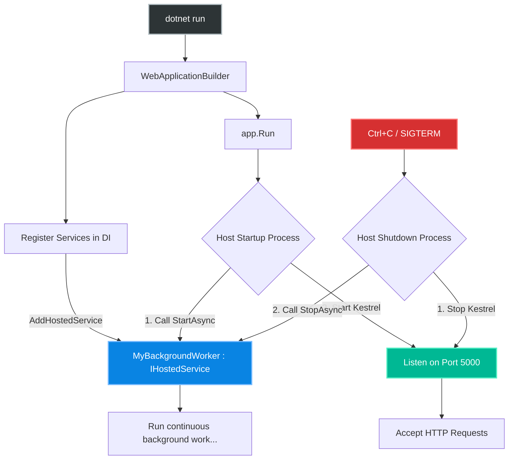

# 4.195 — Background Tasks & IHostedService

## PART 0 — Navigation & Context

```text
ASP.NET Core Domain Hierarchy
├── Infrastructure
│   ├── 4.195 Background Tasks & IHostedService ◄ YOU ARE HERE
│   ├── 4.196 BackgroundService Base Class & Cancellation
│   └── 4.197 Hangfire vs Quartz.NET vs BackgroundService
└── Deployment & Hosting
```

**What you need before this:**
- Understanding of the Generic Host (`WebApplicationBuilder` / `IHost`).
- Solid understanding of Dependency Injection Lifetimes (Singleton vs Scoped) [[4.030 — Dependency Injection Deep Dive]].

**What this unlocks after:**
- Implementing robust, long-running processes using the `BackgroundService` base class [[4.196 — BackgroundService Base Class & Cancellation]].
- Choosing between built-in background tasks and 3rd-party distributed job schedulers [[4.197 — Hangfire vs Quartz.NET vs BackgroundService]].

**Why this matters to a production engineer at scale:**
An HTTP Request has a distinct lifecycle: Request arrives, Controller executes, Response returns, connection closes. But modern applications rarely exist strictly within HTTP boundaries. 
You need to poll an external API every 5 minutes. You need to consume messages from an AWS SQS queue continuously. You need to clear out expired cache entries from the database every hour. 
Before ASP.NET Core 2.1, developers hacked this together by spinning up `Thread.Start()` or `Task.Run()` inside the `Startup.cs` file, which led to massive memory leaks, unhandled exceptions crashing the entire web server, and orphaned threads running in the background because they were disconnected from the Application Lifecycle.
ASP.NET Core solved this with the `IHostedService` interface. It formally integrates background workloads into the lifecycle of the Generic Host. Hosted Services start when the web server starts, run concurrently with your web traffic, and shut down gracefully when the server is told to exit. They are the backbone of .NET Worker Services and Cloud-Native background processing.

---

## PART 1 — The Core Mental Model

> **The Fundamental Rule**
> **An `IHostedService` is a Singleton class that runs in the background of the ASP.NET Core Host. The Host calls its `StartAsync` method just before the server starts accepting HTTP requests, and calls its `StopAsync` method when the server shuts down. It lives outside the context of any individual HTTP request.**

**The Plain-Language Analogy**
Imagine a busy Restaurant (The ASP.NET Core Host).
- **The Waiters (Controllers/Endpoints):** They only act when a customer walks in (HTTP Request). They take an order, serve food, and the interaction ends.
- **The Dishwasher (IHostedService):** The dishwasher does not interact with customers. They arrive when the restaurant opens (`StartAsync`), and they continuously wash dishes in the back room for the entire 12-hour shift. When the restaurant closes at night, the manager taps them on the shoulder, they finish washing the current plate, and they go home (`StopAsync`). The dishwasher works independently of the waiters, but they both exist within the same restaurant building and share the same plumbing (Dependency Injection).

**The Taxonomy Diagram**



---

## PART 2 — Deep Mechanics

### 1. The `IHostedService` Interface
The interface is brutally simple. It has exactly two methods:

```csharp
public interface IHostedService
{
    // Called when the application starts
    Task StartAsync(CancellationToken cancellationToken);
    
    // Called when the application shuts down
    Task StopAsync(CancellationToken cancellationToken);
}
```

### 2. The Blocking Startup Gotcha
When `app.Run()` executes, the Host iterates through all registered `IHostedService` implementations and `await`s their `StartAsync` methods sequentially. 
**Crucial Mechanic:** Kestrel (the web server) *does not start accepting HTTP requests* until ALL `StartAsync` methods have finished executing! 
If your `StartAsync` method has an infinite `while(true)` loop inside it, your web server will never boot up. `StartAsync` is meant to kick off a background thread and then return `Task.CompletedTask` immediately.

### 3. Graceful Shutdown
When you press Ctrl+C or Kubernetes sends a SIGTERM, the Host has 5 seconds (by default) to shut down gracefully. It iterates through all `IHostedService` implementations and calls their `StopAsync` method. This gives your background job a chance to close database connections, finish writing the current file, and exit cleanly without data corruption.

### 4. Dependency Injection Reality (The Singleton Trap)
Because an `IHostedService` lives for the entire lifespan of the application, the DI container registers it as a **Singleton**. 
You **cannot** inject Scoped services (like `AppDbContext`) directly into the constructor of an `IHostedService`. If you try, the application will crash on startup with a DI Scope validation exception. To use a database in a background service, you must manually create a DI Scope.

---

## PART 3 — Production Code Patterns

### Pattern 1: The Raw IHostedService (Startup Logic)
If you just want to run some code *once* when the application starts (e.g., migrating a database, seeding cache, verifying config), you use the raw `IHostedService`.

```csharp
public class CachePreWarmerService : IHostedService
{
    private readonly ILogger<CachePreWarmerService> _logger;

    public CachePreWarmerService(ILogger<CachePreWarmerService> logger)
    {
        _logger = logger;
    }

    public async Task StartAsync(CancellationToken cancellationToken)
    {
        _logger.LogInformation("Warming up the cache before accepting HTTP traffic...");
        
        // Simulating a 2-second API call to fetch config data
        await Task.Delay(2000, cancellationToken); 
        
        _logger.LogInformation("Cache warmed up. Web Server can now start.");
        
        // Note: We return here. We do NOT loop forever.
    }

    public Task StopAsync(CancellationToken cancellationToken)
    {
        // Cleanup logic if needed. Often empty for startup-only tasks.
        _logger.LogInformation("Cleaning up cache pre-warmer...");
        return Task.CompletedTask;
    }
}

// Program.cs
builder.Services.AddHostedService<CachePreWarmerService>();
```
*Note: Because we `await` Task.Delay in `StartAsync`, Kestrel will delay binding to Port 5000 for 2 seconds.*

### Pattern 2: The Fire-and-Forget Background Loop
If you want to run a continuous loop (like polling a queue), you must NOT block `StartAsync`. You must spin the work onto a background Task.

```csharp
public class MessageQueuePoller : IHostedService, IDisposable
{
    private readonly ILogger<MessageQueuePoller> _logger;
    private Task? _executingTask;
    private readonly CancellationTokenSource _cts = new();

    public MessageQueuePoller(ILogger<MessageQueuePoller> logger)
    {
        _logger = logger;
    }

    public Task StartAsync(CancellationToken cancellationToken)
    {
        _logger.LogInformation("Queue Poller is starting.");

        // ✅ CORRECT: We assign the Task to a variable and DO NOT AWAIT IT.
        // This allows StartAsync to return immediately so Kestrel can boot.
        _executingTask = ExecuteAsync(_cts.Token);

        return Task.CompletedTask;
    }

    private async Task ExecuteAsync(CancellationToken stoppingToken)
    {
        // Infinite loop that runs concurrently with the web server
        while (!stoppingToken.IsCancellationRequested)
        {
            _logger.LogInformation("Checking AWS SQS for new messages...");
            
            // Do heavy work...
            await Task.Delay(5000, stoppingToken); 
        }
    }

    public async Task StopAsync(CancellationToken cancellationToken)
    {
        _logger.LogInformation("Queue Poller is stopping.");

        // 1. Signal the CancellationToken to break the while loop
        _cts.Cancel();

        // 2. Wait for the background task to finish its current loop gracefully
        if (_executingTask != null)
        {
            await Task.WhenAny(_executingTask, Task.Delay(Timeout.Infinite, cancellationToken));
        }
    }

    public void Dispose() => _cts.Dispose();
}
```
*(Note: Because writing this exact boilerplate is tedious and error-prone, Microsoft introduced the abstract `BackgroundService` class, covered deeply in [[4.196]], which handles this exact Task storage and cancellation pattern for you).*

### Pattern 3: Using Scoped Services (DbContext) in a Background Task
This is the single most common stumbling block for mid-level developers. You cannot inject `AppDbContext` into a Singleton. You must inject `IServiceScopeFactory`.

```csharp
public class DatabaseCleanupWorker : IHostedService
{
    private readonly IServiceScopeFactory _scopeFactory;

    // ✅ CORRECT: Inject the Scope Factory, NOT the DbContext directly
    public DatabaseCleanupWorker(IServiceScopeFactory scopeFactory)
    {
        _scopeFactory = scopeFactory;
    }

    public Task StartAsync(CancellationToken cancellationToken)
    {
        _ = RunCleanupLoopAsync(cancellationToken);
        return Task.CompletedTask;
    }

    private async Task RunCleanupLoopAsync(CancellationToken token)
    {
        while (!token.IsCancellationRequested)
        {
            // ✅ CORRECT: Create a manual scope for this specific iteration
            using (var scope = _scopeFactory.CreateScope())
            {
                // Resolve the Scoped DbContext from our new manual scope
                var dbContext = scope.ServiceProvider.GetRequiredService<AppDbContext>();

                // Delete old records
                var expired = await dbContext.Logs
                    .Where(x => x.CreatedAt < DateTime.UtcNow.AddDays(-7))
                    .ExecuteDeleteAsync(token);
            } // Scope is disposed here. DbContext connection is safely released.

            // Wait 1 hour before running again
            await Task.Delay(TimeSpan.FromHours(1), token);
        }
    }

    public Task StopAsync(CancellationToken cancellationToken) => Task.CompletedTask;
}
```

---

## PART 4 — Gotchas & Anti-Patterns

### Gotcha 1: Blocking the Startup Pipeline
Developers forget that `StartAsync` executes before the web server boots.

// ⚠️ WRONG CODE
```csharp
public async Task StartAsync(CancellationToken token)
{
    while (!token.IsCancellationRequested) // ❌ INFINITE LOOP IN STARTASYNC!
    {
        await PollDatabaseAsync();
    }
}
```

// HTTP consequence (wrong path):
// The console prints "Application starting...". The web server never says "Now listening on port 5000". If you try to make an HTTP request to the API, it hangs forever. The infinite loop in `StartAsync` has permanently blocked Kestrel from starting.

### Gotcha 2: The Exception Crash (Pre-.NET 6 behavior)
If an unhandled exception is thrown inside a background `Task.Run()` or an un-awaited Task, it behaves dangerously.

// THE GOTCHA:
// In .NET 5 and earlier, if a background thread threw an unhandled exception, it would just silently die. The web server kept running, but the background job was dead, and no one knew until a customer complained.
// In .NET 6+, Microsoft changed this. An unhandled exception inside a background task will now **crash the entire host process** by default.

// ✅ CORRECT CODE
// You MUST wrap your infinite loop logic in a global `try/catch`.
```csharp
private async Task ExecuteAsync(CancellationToken token)
{
    while (!token.IsCancellationRequested)
    {
        try
        {
            await DoWorkAsync();
        }
        catch (Exception ex)
        {
            // Log it, but DO NOT let the exception bubble up to the Host
            // otherwise your entire web application will crash.
            _logger.LogError(ex, "Background task failed, but recovering...");
        }
    }
}
```

### Gotcha 3: DbContext Memory Leaks
If you create a scope outside the `while` loop, you create a memory leak.

// ⚠️ WRONG CODE
```csharp
private async Task ExecuteAsync(CancellationToken token)
{
    // Scope created OUTSIDE the loop
    using var scope = _scopeFactory.CreateScope();
    var db = scope.ServiceProvider.GetRequiredService<AppDbContext>();

    while (!token.IsCancellationRequested)
    {
        var item = await db.Items.FirstAsync(); // Entity is tracked in memory
        await Task.Delay(1000);
    }
}
```

// HTTP consequence (wrong path):
// The `AppDbContext` is designed to live for milliseconds (an HTTP request). If you keep it alive for hours inside a `while` loop, its internal Change Tracker will accumulate every single entity it queries. Memory usage will grow linearly until the server crashes with `OutOfMemoryException`.
// Always create the `using var scope` INSIDE the `while` loop (Pattern 3).

### Gotcha 4: Adding Hosted Services late in the pipeline
In `Program.cs`, you must register your services correctly. 

```csharp
// ⚠️ WRONG
// If you register it as a singleton, the Host doesn't know it's a hosted service!
builder.Services.AddSingleton<MyWorker>(); 

// ✅ CORRECT
builder.Services.AddHostedService<MyWorker>();
```

---

## PART 5 — Performance Implications

### Request Pipeline Characteristics

| Metric | Impact | Explanation |
|---|---|---|
| Startup Latency | Variable | If `StartAsync` takes 10s, Kestrel startup is delayed 10s. |
| Web Request Latency| Minimal | Hosted Services run on background ThreadPool threads. They do not block Kestrel I/O threads. |
| Memory Overhead | Very Low | Negligible, unless you leak Scoped services. |

### The "Same Process" Problem
While `IHostedService` is fantastic, it runs inside the exact same CPU process as your web API. 
If your web API is under heavy DDoS attack, the CPU spikes to 100%, and your background worker will starve for CPU cycles and fail to process the SQS queue. 
Conversely, if your background worker parses a massive 5GB CSV file and maxes out the CPU, your HTTP API will become extremely slow for incoming web requests.
**Architectural Rule:** Use `IHostedService` for lightweight tasks. For heavy CPU/Memory background processing, extract the worker into a separate microservice (a .NET Worker Service) and deploy it to a separate server or container.

---

## PART 6 — Interview Arsenal

### A. The Question Bank

**Question 1:** "You need to run a background task that deletes expired temporary files every hour. You decide to use `IHostedService`. When you inject `AppDbContext` into the constructor to query the file paths, the application crashes on startup. Why?"
- **Average Answer:** "Because you can't inject a database into a background task."
- **Why That's Insufficient:** Needs to explain the DI Lifetime mismatch.
- **Great Answer:** "It crashes due to a Dependency Injection scope mismatch. `IHostedService` implementations are registered as Singletons because they live for the entire lifespan of the application. However, `AppDbContext` is registered as a Scoped service (one per HTTP request). The DI container correctly refuses to inject a Scoped dependency into a Singleton, as it would cause the DbContext to live forever and cause massive memory leaks and threading errors. To fix this, you must inject `IServiceScopeFactory` into the hosted service, and manually call `CreateScope()` inside your background execution loop to resolve the DbContext."

**Question 2:** "What is the consequence of placing a `while(true)` loop directly inside the `StartAsync` method of an `IHostedService`?"
- **Average Answer:** "It runs forever and uses up the CPU."
- **Why That's Insufficient:** Completely misses the catastrophic effect on the Web Host.
- **Great Answer:** "It will completely brick the application startup. During the application boot phase, the Host calls the `StartAsync` methods of all registered hosted services sequentially, and `await`s them. Crucially, the Host will NOT start the Kestrel web server to accept HTTP requests until all `StartAsync` methods have returned. If you place an infinite loop in `StartAsync`, the method never returns, Kestrel never boots, and your web API will be completely unresponsive to HTTP traffic."

**Question 3:** "If an unhandled exception occurs inside your background task loop, what happens to the ASP.NET Core application?"
- **Average Answer:** "The background task stops, but the website keeps working."
- **Why That's Insufficient:** That was true in .NET 5, but false in modern .NET.
- **Great Answer:** "Prior to .NET 6, the task would silently die while the web host continued running, causing silent failures. However, in .NET 6 and later, the default behavior changed. An unhandled exception in an `IHostedService` background execution will bubble up to the Host and trigger a catastrophic failure, crashing the entire ASP.NET Core process, taking your web API offline. You must explicitly wrap your background logic in a `try/catch` block to handle exceptions and prevent them from killing the host."

### B. The Trick Questions

**Trick Question:** "If I register 5 different `IHostedService` classes in `Program.cs`, do their `StartAsync` methods execute concurrently at startup?"
- **The Trap:** Thinking "Background" means "Parallel".
- **The Correct Answer:** "No. By default, the Host iterates through the registered hosted services and `await`s their `StartAsync` methods sequentially, in the exact order they were registered in the DI container. Service B's `StartAsync` will not begin until Service A's `StartAsync` has returned `Task.CompletedTask`. If you need them to start concurrently, you must manage that threading manually inside the methods."

### C. Red Flags to Avoid
- 🚩 **"I use `Task.Run` in my Controller to fire off background emails."** (A massive red flag. `Task.Run` in a controller is "Fire and Forget". If IIS recycles the app pool or Kubernetes kills the pod, that thread is instantly terminated mid-execution, losing the email forever. `IHostedService` provides graceful shutdown signals so tasks can finish cleanly).

---

## PART 7 — Decision Framework

```mermaid
graph TD
    A[Need to run code in ASP.NET Core] --> B{When does it run?}
    
    B -->|In response to a User| C[Controller / Minimal API]
    B -->|Independent of Users| D{Is it a one-time startup task?}
    
    D -->|Yes e.g. EF Migrations| E[Use raw IHostedService StartAsync]
    D -->|No, it runs continuously| F{Does it use high CPU/Memory?}
    
    F -->|Yes| G[Extract to separate .NET Worker Service]
    F -->|No, it's lightweight| H{Do you need retry logic/dashboards?}
    
    H -->|Yes| I[Use Hangfire or Quartz.NET]
    H -->|No| J[Use BackgroundService abstract class]
    
    style A fill:#2d3436,stroke:#fff
    style C fill:#0984e3,stroke:#fff
    style E fill:#00b894,stroke:#fff
    style G fill:#d63031,stroke:#fff
    style I fill:#0984e3,stroke:#fff
    style J fill:#00b894,stroke:#fff
```



---

## PART 8 — Self-Check

### A. Conceptual Questions
1. What are the two methods defined in `IHostedService`?
2. When exactly does the Host call `StartAsync` in relation to the web server accepting connections?
3. What is the lifetime of an `IHostedService` in the Dependency Injection container?
4. How do you safely use a Scoped service inside a Singleton hosted service?
5. Why must you wrap an infinite background loop in a `try/catch` block in .NET 6+?
6. How does the `StopAsync` method facilitate graceful shutdowns?
7. If your hosted service logic consumes 100% of the CPU, what happens to incoming web requests?
8. Why is it unsafe to use `Thread.Start()` or `Task.Run()` directly in `Program.cs` without `IHostedService`?

### B. Code Puzzles

**Puzzle 1: The Startup Hang**
```csharp
public async Task StartAsync(CancellationToken cancellationToken)
{
    var data = await DownloadMassiveFileAsync();
    await ProcessDataAsync(data);
}
```
*Scenario:* Downloading and processing the file takes 45 seconds. You deploy to Azure App Service. The app fails to deploy.
<details>
<summary>Answer</summary>
Because `StartAsync` is `await`ed by the Host, Kestrel is blocked from starting for 45 seconds. Azure (and Kubernetes) have health probes that ping the web server on startup. If the web server doesn't respond within 30 seconds, the orchestrator assumes the app crashed and kills the process.
*Fix:* Do not do heavy work in `StartAsync`. Assign it to a fire-and-forget `_executingTask = Task.Run(...)` so `StartAsync` returns immediately.
</details>

**Puzzle 2: The Scope Leak**
```csharp
private async Task LoopAsync() {
    using var scope = _scopeFactory.CreateScope();
    var db = scope.ServiceProvider.GetRequiredService<AppDbContext>();
    
    while(true) {
        db.Logs.Add(new Log { Msg = "Ping" });
        await db.SaveChangesAsync();
        await Task.Delay(1000);
    }
}
```
*Scenario:* What happens to server memory over a week?
<details>
<summary>Answer</summary>
The memory will explode linearly. The `DbContext` was created outside the loop. Every time you call `SaveChangesAsync()`, the DbContext keeps a reference to the tracked Entity in its internal ChangeTracker. After a week, it is holding 600,000 tracked entities in memory. 
*Fix:* Move `using var scope...` INSIDE the `while(true)` loop so the DbContext is instantiated and disposed every single second.
</details>

**Puzzle 3: The Missing Token**
```csharp
public Task StopAsync(CancellationToken cancellationToken)
{
    // Do nothing
    return Task.CompletedTask;
}
```
*Scenario:* The background `while` loop checks `!stoppingToken.IsCancellationRequested`. When the server is shut down, does the loop break?
<details>
<summary>Answer</summary>
If you don't explicitly wire up a `CancellationTokenSource` and call `.Cancel()` inside `StopAsync` (as shown in Pattern 2), your background loop has no idea the server is shutting down. It will keep running until the operating system forcefully kills the process 5 seconds later, potentially causing data corruption mid-write.
</details>

---

## PART 9 — Connections & Resources

### A. Related Topics Table

| Topic | Why It Connects |
|---|---|
| [[4.196 — BackgroundService Base Class & Cancellation]] | Writing the raw `IHostedService` boilerplate is annoying. `BackgroundService` is the modern abstraction that handles it for you. |
| [[4.030 — Dependency Injection Deep Dive]] | Crucial for understanding why `CreateScope()` is required. |
| [[4.197 — Hangfire vs Quartz.NET vs BackgroundService]] | When your background tasks outgrow simple `IHostedService` loops. |

### B. Books

| Book | Chapters | Why These Chapters |
|---|---|---|
| ASP.NET Core in Action, 3rd Ed | Chapter 23: Running background tasks | Excellent diagrams of the Host lifecycle. |
| Pro ASP.NET Core 6 | Chapter 16: Using Hosted Services | Deep dive into `IServiceScopeFactory`. |

### C. Essential Articles & Docs
- [Microsoft Docs: Background tasks with hosted services](https://learn.microsoft.com/en-us/aspnet/core/fundamentals/host/hosted-services)
- [Steve Gordon: IHostedService in ASP.NET Core](https://www.stevejgordon.co.uk/asp-net-core-2-ihostedservice)

> [!NOTE]
> **Template Meta-Note**
> Part 0: Context & Prerequisites. Part 1: Core Mental Model. Part 2: Deep Mechanics & Pipeline. Part 3: Production Code. Part 4: Gotchas. Part 5: Performance. Part 6: Interview Arsenal. Part 7: Decision Framework. Part 8: Puzzles. Part 9: Resources.
