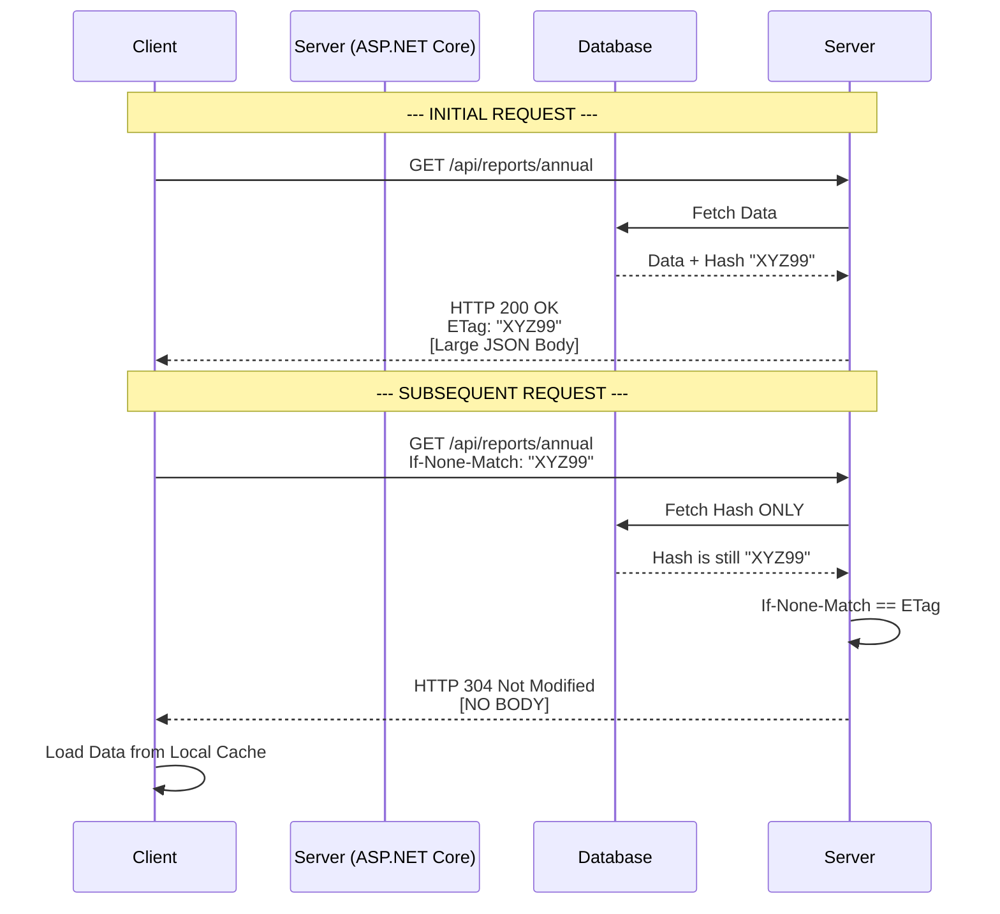

# 4.195 — HTTP Caching Headers: ETags, Last-Modified, and Conditional Requests

## PART 0 — Navigation & Context

```text
ASP.NET Core Domain Hierarchy
├── Performance & Scalability
│   ├── Application Data Caching
│   └── HTTP Protocol & Response Caching
│       ├── 4.190 [ResponseCache] & Cache-Control
│       ├── 4.191 Output Caching Basics
│       └── 4.195 Conditional Requests (ETags) ◄ YOU ARE HERE
```

**What you need before this:**
- Understanding of standard HTTP caching headers, specifically `Cache-Control` [[4.190 — Response Caching: Cache-Control Headers and [ResponseCache]]].
- Familiarity with reading and writing HTTP Headers in ASP.NET Core Middleware or Controllers.

**What this unlocks after:**
- Building ultra-efficient mobile APIs that never download the same JSON payload twice unless it has specifically changed, slashing bandwidth costs by 90%.
- Implementing Optimistic Concurrency control for `PUT` and `PATCH` operations to prevent "lost updates".

**Why this matters to a production engineer at scale:**
Standard Time-To-Live caching (`Cache-Control: max-age=3600`) is a blunt instrument. You are telling the client: "Do not ask me again for exactly one hour." But what if the data changes after 5 minutes? The client has stale data. What if the data doesn't change for a week? The client's cache expires in an hour, and they ask for it again, wasting bandwidth downloading the exact same 5MB JSON payload they already had.
Conditional Requests solve this. You tell the client: "Here is the data, and here is its unique fingerprint (`ETag`)." The next time the client wants the data, they send the fingerprint back to the server: "I have version XYZ, has it changed?" The server runs a cheap query, verifies the fingerprint hasn't changed, and replies with **HTTP 304 Not Modified** and an *empty body*.
This is the ultimate evolution of HTTP API efficiency. It guarantees the client always has perfectly fresh data, while eliminating the massive network bandwidth and JSON serialization costs of repeatedly sending identical payloads.

---

## PART 1 — The Core Mental Model

> **The Fundamental Rule**
> **ETags (Entity Tags) and `Last-Modified` dates are validation tokens. The server sends them in the initial HTTP Response. On subsequent requests, the client sends them back using conditional headers (`If-None-Match` or `If-Modified-Since`). 
> The ASP.NET Core server evaluates these headers. If the data has NOT changed, the server instantly short-circuits and returns HTTP 304 Not Modified with NO body. If the data HAS changed, the server processes the request normally, returning HTTP 200 OK with the new body and a new ETag.**

**The Plain-Language Analogy**
Imagine you request a printed catalog from a supplier.
**Without ETags:** Every week, you call and say, "Send me the catalog." They mail you a massive 500-page book. You throw the old one away, even if nothing changed.
**With ETags:** The first time, they mail you the 500-page book, and on the cover, it says **"Edition: A1B2" (The ETag)**. 
Next week, you call and say, "Send me the catalog, but only if it's newer than Edition A1B2." (`If-None-Match: "A1B2"`).
The supplier checks their system. If the current edition is still A1B2, they just send you a tiny postcard saying: **"Still the same, keep your book." (HTTP 304 Not Modified)**. You saved shipping costs. If they updated it to "C3D4", they mail you the new 500-page book.

**The Taxonomy Diagram**



---

## PART 2 — Deep Mechanics

### 2.1 — Strong vs. Weak ETags
The HTTP specification defines two types of ETags:

- **Strong ETags:** `ETag: "a1b2c3d4"`
  Implies the resource is byte-for-byte identical. If even one comma changes in the JSON response, the strong ETag MUST change.
- **Weak ETags:** `ETag: W/"a1b2c3d4"` (Prefixed with `W/`)
  Implies the resource is *semantically* equivalent. For example, if a background process re-formatted the JSON with different whitespace, the byte array changed, but the actual meaning did not. A weak ETag allows the server to signal that the content is effectively the same.

### 2.2 — Last-Modified & If-Modified-Since
This is the older, date-based alternative to ETags.
- Server sends: `Last-Modified: Wed, 21 Oct 2026 07:28:00 GMT`
- Client requests: `If-Modified-Since: Wed, 21 Oct 2026 07:28:00 GMT`
- Server evaluates: `if (resource.LastUpdated <= clientDate) return 304;`

**The Flaw:** Dates only resolve to the second. If a resource updates twice in the same second, `Last-Modified` fails. ETags are hash-based and therefore perfectly accurate. Always prefer ETags for APIs.

### 2.3 — The HTTP 304 Not Modified Response
When you return a 304, you MUST NOT include a response body. The framework will strip it if you try. You MUST include the `ETag` (so the client knows it's still valid) and any `Cache-Control` headers.

---

## PART 3 — Production Code Patterns

### Pattern 1: Manual ETag Evaluation in Minimal APIs
If your database rows have a `RowVersion` or `UpdatedAt` timestamp, you can calculate the ETag without loading the massive payload.

```csharp
app.MapGet("/api/documents/{id}", async (int id, HttpContext ctx, AppDbContext db) =>
{
    // 1. Fetch ONLY the lightweight metadata (the Hash or Timestamp)
    var metadata = await db.Documents
        .Where(d => d.Id == id)
        .Select(d => new { d.ContentHash })
        .FirstOrDefaultAsync();

    if (metadata == null) return Results.NotFound();

    // 2. Format the ETag string (Must be enclosed in double quotes per HTTP spec)
    var currentETag = $"\"{metadata.ContentHash}\"";

    // 3. Check the Client's Conditional Header
    if (ctx.Request.Headers.IfNoneMatch.ToString() == currentETag)
    {
        // 4. Match! Short-circuit. Skip loading the large Payload.
        return Results.StatusCode(StatusCodes.Status304NotModified);
    }

    // 5. Cache Miss. Load the full payload.
    var fullDocument = await db.Documents.FindAsync(id);
    
    // 6. Set the ETag header for the client to use NEXT time
    ctx.Response.Headers.ETag = currentETag;
    
    return Results.Ok(fullDocument.Payload);
});
```

### Pattern 2: Middleware-based ETags (Hashing the Body)
If you don't have a database hash, you can generate an ETag by hashing the outgoing HTTP response body. 
*Note: This does not save Database CPU (the query still runs), but it saves Network Bandwidth (the large JSON isn't transmitted).*

```csharp
// There are various NuGet packages or custom middlewares to do this.
// Conceptually, it intercepts the Response Stream:
var hash = ComputeSha256(responseStream);
var etag = $"\"{hash}\"";

if (context.Request.Headers.IfNoneMatch == etag)
{
    context.Response.Clear(); // Drop the body
    context.Response.StatusCode = 304;
}
context.Response.Headers.ETag = etag;
```
*(Modern ASP.NET Core Output Caching handles this automatically!)*

### Pattern 3: ETags for Concurrency Control (If-Match)
ETags aren't just for GET caching; they prevent data corruption on PUT/PATCH.
If two admins open the same product page, Admin A changes the price to $10, Admin B changes it to $20. Admin A saves. Admin B saves. Admin B overwrote Admin A without knowing. This is the "Lost Update" problem.

```csharp
[HttpPut("/api/products/{id}")]
public async Task<IActionResult> UpdateProduct(int id, ProductDto dto, [FromHeader(Name = "If-Match")] string clientETag)
{
    var product = await _db.Products.FindAsync(id);
    var currentETag = $"\"{product.VersionHash}\"";
    
    // Check if the client's ETag matches the server's current state
    if (clientETag != currentETag)
    {
        // The record was changed by someone else since the client last fetched it!
        return StatusCode(StatusCodes.Status412PreconditionFailed, 
            new { error = "Resource was modified by another user. Please refresh." });
    }
    
    product.Price = dto.Price;
    product.VersionHash = GenerateNewHash();
    await _db.SaveChangesAsync();
    
    // Return the new ETag to the client
    Response.Headers.ETag = $"\"{product.VersionHash}\"";
    return Ok();
}
```

---

## PART 4 — Gotchas & Anti-Patterns

### Gotcha 1: Forgetting the Double Quotes
// ⚠️ FATAL ANTI-PATTERN
```csharp
ctx.Response.Headers.ETag = "a1b2c3"; // Missing quotes!
```
The HTTP specification mandates that ETag values MUST be enclosed in double ASCII quotes. 
Correct: `ctx.Response.Headers.ETag = "\"a1b2c3\"";`
If you forget the quotes, strictly compliant HTTP clients (like browsers and CDNs) will completely ignore the header and never send `If-None-Match`.

### Gotcha 2: Using `Guid.NewGuid()` as an ETag
An inexperienced developer wants to add ETags, so they write:
```csharp
ctx.Response.Headers.ETag = $"\"{Guid.NewGuid()}\"";
```
This entirely defeats the purpose. The ETag changes on every single request, meaning `If-None-Match` will NEVER match. The server will always return 200 OK. The ETag must be derived deterministically from the data's state.

### Gotcha 3: Skipping Authorization on 304
// ⚠️ SECURITY FATAL
```csharp
// Executed BEFORE authorization middleware
if (ctx.Request.Headers.IfNoneMatch == "\"secret-hash\"") return 304;
```
If you evaluate the ETag and return 304 *before* executing the Authorization middleware, an attacker who steals or guesses an ETag can verify that a resource exists and hasn't changed, even if their token was revoked. Always authorize the request before evaluating ETags.

### Gotcha 4: Combining ETags with `Cache-Control: no-store`
If you set `Cache-Control: no-store` on an endpoint, you are commanding the browser: "Destroy this JSON the millisecond you receive it."
Because the browser destroys it, it will never store the ETag. Therefore, the browser will never send an `If-None-Match` header on the next request. ETags are useless if `no-store` is applied. (Use `Cache-Control: no-cache` if you want to force validation via ETag every time without forbidding storage).

---

## PART 5 — Performance Implications

### Request Pipeline Characteristics

| Scenario | Server CPU Cost | Database Cost | Network Bandwidth Cost |
|---|---|---|---|
| No ETag (Standard GET) | High (JSON Serialize) | High (Data Fetch) | High (Full Body Transmit) |
| ETag Match (Body Hash) | High (Query + Serialize) | High (Data Fetch) | **Zero (304 No Body)** |
| ETag Match (Metadata) | **Low (Query Hash Only)** | **Low (Index Scan)** | **Zero (304 No Body)** |

**Performance Verdict:**
ETags provide immense bandwidth optimization, which is critical for mobile networks and massive JSON payloads. If implemented perfectly (querying only the `VersionHash` from the database), they provide incredible CPU and Database optimizations as well. 

---

## PART 6 — Interview Arsenal

### A. The Question Bank

**Question 1:** "What is the difference between `Cache-Control: max-age=3600` and an `ETag`?"
- **Average Answer:** "Cache-Control is time-based, ETags are hash-based."
- **Why That's Insufficient:** Doesn't explain the behavioral difference in HTTP traffic.
- **Great Answer:** "`Cache-Control: max-age` is an absolute expiration. It tells the client not to contact the server at all until the time expires. This is fast, but risks serving stale data. `ETags` are validation tokens for Conditional Requests. The client MUST contact the server every time (unless combined with max-age), sending the `If-None-Match` header. The server guarantees perfect freshness by returning 304 Not Modified if the data is identical, saving bandwidth while ensuring data accuracy."

**Question 2:** "If a client sends `If-None-Match`, and the server determines the data HAS changed, what HTTP status code and body should the server return?"
- **Average Answer:** "200 OK."
- **Why That's Insufficient:** Needs to clarify the payload and the updated headers.
- **Great Answer:** "The server returns HTTP 200 OK. It must include the full, newly generated response body (e.g., the JSON payload), and critically, it must include a new `ETag` header representing the new state of the data, so the client can use the new ETag for future conditional requests."

**Question 3:** "How do ETags help prevent 'Lost Updates' in REST APIs?"
- **Average Answer:** "They track the version."
- **Why That's Insufficient:** Doesn't map it to the HTTP verbs and headers used for concurrency.
- **Great Answer:** "By using the `If-Match` header on `PUT` or `PATCH` requests. When a client fetches a record, they receive an ETag. When they attempt to update that record, they pass the ETag back in the `If-Match` header. The server compares it to the current database ETag. If they don't match, it means another user modified the record in the meantime. The server rejects the update with HTTP 412 Precondition Failed, preventing the client from blindly overwriting the other user's changes."

### B. The Trick Questions

**Trick Question:** "Our database automatically tracks a `LastUpdated` timestamp for every record. Should we use `Last-Modified` headers or convert the timestamp into an `ETag`?"
- **The Trap:** Assuming `Last-Modified` is equally robust.
- **The Correct Answer:** "You should strongly prefer converting the timestamp into an `ETag`. The `Last-Modified` HTTP header only resolves down to a precision of 1 second. If a high-frequency system updates a record twice within the same second, `If-Modified-Since` will incorrectly report that the resource hasn't changed. ETags (even derived from high-precision `DateTime.Ticks` or row versions) are deterministic strings that avoid this precision flaw entirely."

### C. Red Flags to Avoid
- 🚩 **"I generate my ETag by taking the MD5 hash of the User's Session Token."** (This is a complete misunderstanding. ETags represent the state of the *Resource Payload*, not the user's session. This would result in the same ETag across completely different endpoints).

---

## PART 7 — Decision Framework

```mermaid
graph TD
    A[Designing HTTP Cache Strategy] --> B{Does the client need guaranteed 100% fresh data?}
    
    B -->|No - Slight staleness OK| C[Use Cache-Control: max-age]
    C --> D[Client doesn't contact server until expiry]
    
    B -->|Yes - Must be fresh| E{Is the payload large? e.g. >10KB}
    
    E -->|No - Tiny payload| F[Skip ETags, just return 200 OK]
    
    E -->|Yes - Large payload| G[Implement Conditional Requests]
    G --> H{Does DB track RowVersion / Hash?}
    
    H -->|Yes| I[Query Hash ONLY]
    I --> J[Compare with If-None-Match]
    
    H -->|No| K[Query Full Data & Hash the Object]
    K --> J
    
    J -->|Match| L[Return 304 Not Modified, Empty Body]
    J -->|No Match| M[Return 200 OK, Full Body, New ETag]
    
    style A fill:#2d3436,stroke:#fff
    style C fill:#0984e3,stroke:#fff
    style F fill:#fdcb6e,stroke:#333
    style I fill:#00b894,stroke:#fff
    style L fill:#00b894,stroke:#fff
    style M fill:#d63031,stroke:#fff
```



---

## PART 8 — Self-Check

### A. Conceptual Questions
1. How does a 304 Not Modified response save network bandwidth?
2. What is the fundamental difference between `If-None-Match` and `If-Match`?
3. Why must an ETag string be enclosed in double quotes?
4. What happens if you use a Weak ETag instead of a Strong ETag?
5. Explain why calculating the ETag by hashing the full database entity still costs database CPU but saves network bandwidth.
6. Why is `Last-Modified` considered less reliable than an `ETag` for high-frequency APIs?
7. What HTTP status code should you return if an `If-Match` concurrency check fails on a PUT request?
8. Why is generating a random Guid for an ETag on every request completely useless?

### B. Code Puzzles

**Puzzle 1: The Missing Condition**
```csharp
[HttpGet]
public IActionResult GetData() {
    var data = _db.GetData();
    Response.Headers.ETag = $"\"{data.Hash}\"";
    return Ok(data);
}
```
*Scenario:* You added this code. You look at the network tab. The browser is receiving the ETag, but it is never getting a 304 response on refresh. Why?
<details>
<summary>Answer</summary>
You generated the ETag, but you completely forgot to write the code that evaluates the client's `If-None-Match` header. The server just overwrites the ETag and returns 200 OK every time. You must manually extract `Request.Headers.IfNoneMatch`, compare it, and return `StatusCode(304)`.
</details>

**Puzzle 2: The Concurrency Crash**
```csharp
if (Request.Headers.IfMatch != currentEtag) {
    return BadRequest("Data changed.");
}
```
*Scenario:* You are implementing Optimistic Concurrency. When the tags don't match, you return 400 Bad Request. Why is this technically incorrect?
<details>
<summary>Answer</summary>
HTTP semantics dictate that concurrency precondition failures should return HTTP 412 Precondition Failed. 400 Bad Request implies the client sent malformed syntax, not that the server state changed underneath them.
</details>

**Puzzle 3: The Premature Optimization**
```csharp
app.MapGet("/api/time", () => {
    var time = DateTime.UtcNow.ToString();
    var etag = $"\"{time.GetHashCode()}\"";
    // check etag, return 304 or 200
});
```
*Scenario:* Is there any benefit to implementing ETags on an endpoint that returns the current time?
<details>
<summary>Answer</summary>
No. The payload is tiny (a few bytes), and because it is the current time, the state literally changes every millisecond. The ETag will never match. You've added processing overhead for absolutely zero bandwidth savings.
</details>

---

## PART 9 — Connections & Resources

### A. Related Topics Table

| Topic | Why It Connects |
|---|---|
| [[4.190 — Response Caching: Cache-Control Headers and [ResponseCache]]] | Forms the other half of HTTP caching. `Cache-Control` tells the client *when* to check, ETags tell the server *how* to validate. |
| [[4.191 — Output Caching (.NET 7+): Server-Side Response Cache]] | The ASP.NET Core middleware that automatically handles ETag generation and 304 responses for you if configured correctly. |

### B. Books

| Book | Chapters | Why These Chapters |
|---|---|---|
| REST in Practice | Chapter 6: Caching | The definitive guide on using ETags and conditional requests to build scalable REST hypermedia. |
| Building Microservices (Sam Newman) | Chapter 4: Integration | Discusses caching boundaries and optimistic concurrency. |

### C. Essential Articles & Docs
- [MDN Web Docs: ETag](https://developer.mozilla.org/en-US/docs/Web/HTTP/Headers/ETag)
- [RFC 9110: Conditional Requests](https://www.rfc-editor.org/rfc/rfc9110#name-conditional-requests)

> [!NOTE]
> **Template Meta-Note**
> Part 0: Context & Prerequisites. Part 1: Core Mental Model. Part 2: Deep Mechanics & Pipeline. Part 3: Production Code. Part 4: Gotchas. Part 5: Performance. Part 6: Interview Arsenal. Part 7: Decision Framework. Part 8: Puzzles. Part 9: Resources.
