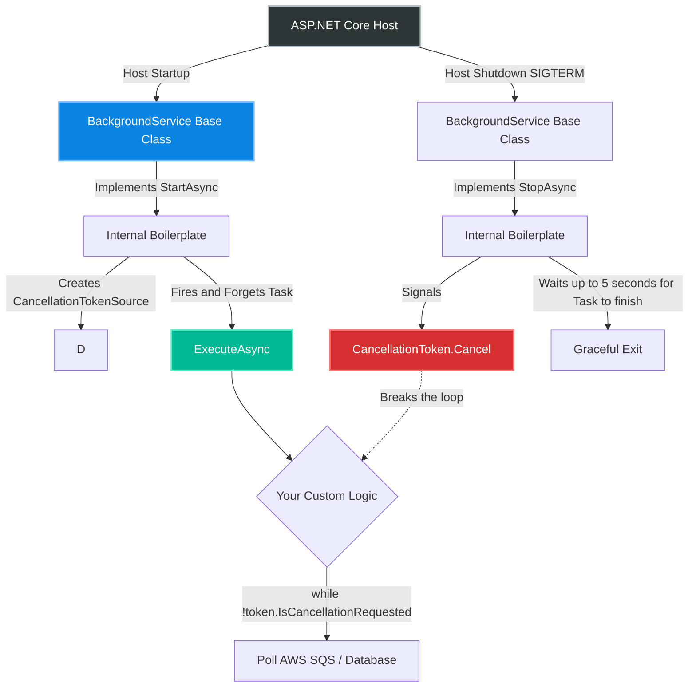

# 4.196 — BackgroundService Base Class & Cancellation

## PART 0 — Navigation & Context

```text
ASP.NET Core Domain Hierarchy
├── Infrastructure
│   ├── 4.195 Background Tasks & IHostedService
│   ├── 4.196 BackgroundService Base Class & Cancellation ◄ YOU ARE HERE
│   └── 4.197 Hangfire vs Quartz.NET vs BackgroundService
└── Deployment & Hosting
```

**What you need before this:**
- A firm grasp on why `IHostedService` exists and how it ties into the application lifecycle [[4.195 — Background Tasks & IHostedService]].
- Understanding of how `CancellationToken` works in C#.

**What this unlocks after:**
- Building resilient ".NET Worker Services" (headless microservices).
- Gracefully handling Kubernetes Pod evictions or Azure App Service scale-ins.
- Progressing to advanced 3rd-party schedulers [[4.197 — Hangfire vs Quartz.NET vs BackgroundService]].

**Why this matters to a production engineer at scale:**
If you read the previous topic on the raw `IHostedService` interface, you noticed that writing a continuous background loop requires a lot of tricky boilerplate. You have to manually create a `CancellationTokenSource`, manually assign the background work to an un-awaited `Task` variable so you don't block Kestrel's startup, and manually write `StopAsync` logic to gracefully wait for the task to finish. 
If you mess up any of those steps, your web server either fails to boot, or forcefully corrupts data by aborting threads violently on shutdown.
Microsoft realized developers were constantly getting this wrong. To fix it, they introduced the abstract **`BackgroundService`** class. It provides a robust, pre-written implementation of `IHostedService`. You only override a single method: `ExecuteAsync`. This class is the definitive, industry-standard way to write long-running background loops in modern .NET applications.

---

## PART 1 — The Core Mental Model

> **The Fundamental Rule**
> **`BackgroundService` is an abstract base class that safely handles all the threading and cancellation boilerplate of `IHostedService`. You implement the `ExecuteAsync(CancellationToken)` method. The base class guarantees this method runs concurrently without blocking server startup, and guarantees the token is signaled when the server shuts down.**

**The Plain-Language Analogy**
Imagine hiring a Night Watchman for a factory.
**Using raw `IHostedService`:** You have to build the watchman a booth, wire up a radio system, write a manual on how to patrol without blocking the factory entrance, and explicitly radio them at 6:00 AM to tell them to stop. If you forget to radio them, they walk the perimeter forever.
**Using `BackgroundService`:** You hire from a professional security firm. They provide their own booth, radio, and protocol. You just hand them a single piece of paper: "Walk this path" (`ExecuteAsync`). When the 6:00 AM alarm rings, the firm automatically radios them to stop (Cancellation Token). You don't have to manage their lifecycle; you just define the work.

**The Taxonomy Diagram**



---

## PART 2 — Deep Mechanics

### 1. Under the Hood of `BackgroundService`
If you decompile the `BackgroundService` class provided by Microsoft, the code is remarkably simple. It implements `IHostedService` for you.
- Its `StartAsync` method assigns your `ExecuteAsync` method to a private `_executeTask` variable and returns `Task.CompletedTask` immediately. (No blocking Kestrel!)
- Its `StopAsync` method calls `.Cancel()` on the cancellation token, and then uses `await Task.WhenAny(_executeTask, Task.Delay(Timeout.Infinite))` to politely wait for your code to wrap up.

### 2. The `stoppingToken`
The `CancellationToken` passed into `ExecuteAsync` is the heart of the system.
When the application is told to shut down (e.g., Ctrl+C, IIS AppPool Recycle, Kubernetes scaling down), the Host signals this token.
You have exactly **5 seconds** (by default) to observe this token, break your `while` loop, finish whatever atomic database write you are doing, and exit the method. If you ignore the token, the Host will forcefully kill the process after 5 seconds, potentially causing data corruption.

### 3. The Target Use Case
`BackgroundService` is designed exclusively for **Long-Running** tasks (infinite loops) or tasks that run concurrently with the application.
If you need a task that runs *once* at startup and *must* finish before the web server accepts traffic (like running EF Core Migrations), you should use the raw `IHostedService` instead, because `BackgroundService` intentionally bypasses the blocking startup pipeline.

---

## PART 3 — Production Code Patterns

### Pattern 1: The Standard Polling Loop
The most common pattern. A service that checks an external system every 10 seconds. Notice how clean it is compared to raw `IHostedService`.

```csharp
public class OrderProcessingWorker : BackgroundService
{
    private readonly ILogger<OrderProcessingWorker> _logger;

    public OrderProcessingWorker(ILogger<OrderProcessingWorker> logger)
    {
        _logger = logger;
    }

    // This is the ONLY method you have to override!
    protected override async Task ExecuteAsync(CancellationToken stoppingToken)
    {
        _logger.LogInformation("Order Processor started.");

        // Rule 1: Always check the stoppingToken
        while (!stoppingToken.IsCancellationRequested)
        {
            try
            {
                _logger.LogInformation("Checking for new orders at: {time}", DateTimeOffset.Now);
                
                // Rule 2: Pass the token to all async methods so they can abort mid-flight
                await ProcessOrdersAsync(stoppingToken); 
            }
            catch (OperationCanceledException)
            {
                // Expected when shutting down. Do not treat as an error.
                _logger.LogInformation("Processing cancelled during shutdown.");
            }
            catch (Exception ex)
            {
                // Rule 3: NEVER let exceptions escape the loop, or the host will crash
                _logger.LogError(ex, "An error occurred, but we will retry next loop.");
            }

            // Rule 4: Wait, and pass the token to Task.Delay so it wakes up instantly on shutdown
            await Task.Delay(10000, stoppingToken);
        }

        _logger.LogInformation("Order Processor stopped.");
    }

    private async Task ProcessOrdersAsync(CancellationToken token)
    {
        // Simulate database work
        await Task.Delay(1000, token); 
    }
}

// Program.cs
builder.Services.AddHostedService<OrderProcessingWorker>();
```

### Pattern 2: Safely Consuming Scoped Services
Just like raw `IHostedService`, `BackgroundService` is a Singleton. You cannot inject `AppDbContext` into the constructor.

```csharp
public class DbCleanupWorker : BackgroundService
{
    private readonly IServiceScopeFactory _scopeFactory;

    public DbCleanupWorker(IServiceScopeFactory scopeFactory) => _scopeFactory = scopeFactory;

    protected override async Task ExecuteAsync(CancellationToken stoppingToken)
    {
        while (!stoppingToken.IsCancellationRequested)
        {
            // Create the scope INSIDE the loop
            using (var scope = _scopeFactory.CreateScope())
            {
                var db = scope.ServiceProvider.GetRequiredService<AppDbContext>();
                
                // Delete logs older than 30 days
                await db.Logs.Where(x => x.Date < DateTime.UtcNow.AddDays(-30))
                             .ExecuteDeleteAsync(stoppingToken);
            } // Scope disposed, memory freed

            await Task.Delay(TimeSpan.FromHours(1), stoppingToken);
        }
    }
}
```

### Pattern 3: Extending the Graceful Shutdown Timeout
If your background task is processing massive video files, 5 seconds might not be enough time to gracefully abort the process when Kubernetes shuts down the container.

```csharp
// Program.cs
builder.Services.Configure<HostOptions>(options =>
{
    // Give background services up to 30 seconds to finish their current loop
    // before the OS forcefully murders the process.
    options.ShutdownTimeout = TimeSpan.FromSeconds(30); 
});

builder.Services.AddHostedService<VideoEncodingWorker>();
```

### Pattern 4: Channels for Producer/Consumer Queues
Instead of polling a database, you can use `System.Threading.Channels` to pass work from an API Controller to a `BackgroundService`. This is extremely high-performance and purely in-memory.

```csharp
// 1. Create a Singleton Channel
public class BackgroundJobQueue
{
    public Channel<string> Queue { get; } = Channel.CreateUnbounded<string>();
}

// Program.cs
builder.Services.AddSingleton<BackgroundJobQueue>();
builder.Services.AddHostedService<QueueConsumerWorker>();

// 2. The API Controller (Producer)
app.MapPost("/process", async (string payload, BackgroundJobQueue queue) => {
    // Controller accepts request instantly and hands it off
    await queue.Queue.Writer.WriteAsync(payload);
    return Results.Accepted();
});

// 3. The Worker (Consumer)
public class QueueConsumerWorker : BackgroundService
{
    private readonly BackgroundJobQueue _queue;
    public QueueConsumerWorker(BackgroundJobQueue queue) => _queue = queue;

    protected override async Task ExecuteAsync(CancellationToken stoppingToken)
    {
        // Wait asynchronously until an item is pushed into the channel
        await foreach (var payload in _queue.Queue.Reader.ReadAllAsync(stoppingToken))
        {
            // Process the payload entirely in the background
            await ProcessHeavyPayloadAsync(payload, stoppingToken);
        }
    }
}
```

---

## PART 4 — Gotchas & Anti-Patterns

### Gotcha 1: Failing to Await or Return inside ExecuteAsync
The method signature is `Task ExecuteAsync`.

// ⚠️ WRONG CODE
```csharp
protected override async Task ExecuteAsync(CancellationToken stoppingToken)
{
    // No 'await' inside this method!
    while (!stoppingToken.IsCancellationRequested)
    {
        DoSynchronousWork(); // Blocks the thread!
        Thread.Sleep(1000);  // Blocks the thread!
    }
}
```

// HTTP consequence (wrong path):
// Under the hood, `StartAsync` calls `ExecuteAsync`. If `ExecuteAsync` does not yield back to the calling thread (by hitting its first `await` statement), it blocks `StartAsync`. Because `StartAsync` is blocked, the Host cannot finish booting, and Kestrel will never start listening for HTTP requests.
// **Rule:** `ExecuteAsync` MUST contain an `await` before any long-running or infinite loop begins (e.g., `await Task.Yield()`), OR all operations inside the loop must be naturally asynchronous.

// ✅ CORRECT CODE
```csharp
protected override async Task ExecuteAsync(CancellationToken stoppingToken)
{
    // Yield immediately to let the Host pipeline continue booting Kestrel
    await Task.Yield(); 
    
    while (!stoppingToken.IsCancellationRequested) { ... }
}
```

### Gotcha 2: Ignoring the Stopping Token
Developers write infinite loops but don't check the token.

// ⚠️ WRONG CODE
```csharp
protected override async Task ExecuteAsync(CancellationToken token)
{
    while (true) // ❌ NEVER stops!
    {
        await Task.Delay(10000); // Token not passed!
    }
}
```

// HTTP consequence (wrong path):
// When you try to deploy a new version of your app, the Host sends the shutdown signal. The `StopAsync` base class waits for `ExecuteAsync` to finish. Because `ExecuteAsync` is in a `while(true)` loop ignoring the token, it never finishes. The deployment process hangs for 5 seconds until the OS forcefully kills the process. Graceful shutdown is broken.

### Gotcha 3: Allowing Exceptions to Escape
In .NET 6+, the default behavior changed drastically regarding unhandled exceptions in `BackgroundService`.

// ⚠️ WRONG CODE
```csharp
protected override async Task ExecuteAsync(CancellationToken token)
{
    while (!token.IsCancellationRequested)
    {
        var data = await GetApiDataAsync(); // Throws 500 Internal Server Error
        await Task.Delay(1000, token);
    }
}
```

// HTTP consequence (wrong path):
// The exception escapes `ExecuteAsync`. In .NET 6+, this exception bubbles up to the Host and **crashes the entire ASP.NET Core application process**. Your web server goes offline because a background API poll failed.
// You MUST wrap your while loop logic in a `try/catch`.

### Gotcha 4: Memory Leaks with Scoped Services
As covered in Pattern 2, creating `using var scope` outside the `while` loop will cause Entity Framework's Change Tracker to grow infinitely, resulting in `OutOfMemoryException`. Always create scopes *inside* the loop for repetitive tasks.

---

## PART 5 — Performance Implications

### Request Pipeline Characteristics

| Execution Type | Kestrel Thread Impact | CPU Cost | Scaling Behavior |
|---|---|---|---|
| BackgroundService | None (Runs on ThreadPool) | High if doing heavy work | Does not horizontally scale natively |

### The Concurrency Trap (Horizontal Scaling)
This is the fatal flaw of `BackgroundService`.
If you write a `BackgroundService` that reads "Pending Orders" from a SQL Server database, processes them, and marks them "Complete".
You deploy this to **1 server**. It works perfectly.
You get a lot of web traffic, so you scale out to **5 servers** behind a Load Balancer.
Suddenly, you have **5 identical BackgroundServices** running on 5 different servers, all executing the exact same SQL query simultaneously. Server A reads Order #1. Server B reads Order #1 at the exact same millisecond. They both process it. They both charge the customer's credit card.
**When to Care:** `BackgroundService` is fundamentally a single-node construct. It has no concept of distributed locking. If you scale to multiple servers, you MUST write custom distributed locking mechanisms (e.g., Redis Locks, SQL `UPDLOCK`), or upgrade to a distributed scheduler like Hangfire/Quartz.NET [[4.197]].

---

## PART 6 — Interview Arsenal

### A. The Question Bank

**Question 1:** "What is the specific architectural benefit of inheriting from the abstract `BackgroundService` class rather than implementing the `IHostedService` interface directly?"
- **Average Answer:** "It's easier to write because there's less code."
- **Why That's Insufficient:** Doesn't identify the specific threading problem it solves.
- **Great Answer:** "When implementing `IHostedService` directly, the Host `await`s the `StartAsync` method sequentially. If you put a long-running task in `StartAsync`, you block Kestrel from starting up and the app hangs. `BackgroundService` abstracts this danger away. Its internal `StartAsync` method handles spinning off your custom `ExecuteAsync` logic into an un-awaited background Task and returns immediately. Furthermore, it automatically manages the `CancellationTokenSource` and graceful shutdown awaiting in its `StopAsync` implementation."

**Question 2:** "Inside `ExecuteAsync`, why is it critical to pass the `stoppingToken` to methods like `Task.Delay(10000, stoppingToken)`?"
- **Average Answer:** "So the delay stops when the app stops."
- **Why That's Insufficient:** Needs to explain the UX/Deployment impact of not doing it.
- **Great Answer:** "If your background service loops every 10 seconds, and the Host sends a shutdown signal, you want the application to shut down gracefully and quickly. If you omit the token, `Task.Delay(10000)` will blindly continue waiting for the full 10 seconds, even though the application is trying to exit. Because the default Host shutdown timeout is 5 seconds, the OS will forcefuly kill the process before the delay finishes, resulting in an ungraceful exit. Passing the token throws a `TaskCanceledException` instantly, breaking the delay and allowing immediate, clean shutdown."

**Question 3:** "You deployed a `BackgroundService` that processes pending emails from a database table. It works great locally. You deploy to Kubernetes with 3 replicas. Suddenly, customers are receiving 3 copies of every email. What caused this?"
- **Average Answer:** "The background service is running three times."
- **Why That's Insufficient:** Identifies the symptom, but needs the architectural principle.
- **Great Answer:** "`BackgroundService` is a localized construct; it has no distributed awareness. By scaling to 3 replicas, you spun up 3 independent ASP.NET Core hosts, each with its own background loop querying the same database table concurrently. This results in race conditions where all 3 replicas select the same 'Pending' row before any of them can update it to 'Processed'. To fix this in a clustered environment, you either need distributed pessimistic locking (like SQL Server `UPDLOCK READPAST`), or you should offload the background processing to a distributed job scheduler like Hangfire, which manages single-execution guarantees across clusters."

### B. The Trick Questions

**Trick Question:** "I don't want my `BackgroundService` to crash the whole application if it fails. Before .NET 6, this was the default. In .NET 8, how do I configure the Host to ignore background task exceptions globally?"
- **The Trap:** Thinking there's a global config flag for bad architecture.
- **The Correct Answer:** "While Microsoft did add a configuration option (`HostOptions.BackgroundServiceExceptionBehavior = BackgroundServiceExceptionBehavior.Ignore`), you should almost never use it in production. Ignoring unhandled exceptions results in 'Zombie' background services that silently die and stop processing data without the orchestrator (like Kubernetes) knowing the app is broken. The correct approach is to keep the default `StopHost` behavior, but wrap your specific `while` loop logic in a `try/catch` block, explicitly handling errors and deciding when to retry or when to intentionally crash the app."

### C. Red Flags to Avoid
- 🚩 **"I use `BackgroundService` for everything, even daily 2 AM cleanup scripts."** (If a script only runs once a day, keeping a dedicated background thread alive in a web server 24/7 is inefficient and risky due to app pool recycles. Use an external CRON scheduler or Azure Functions).

---

## PART 7 — Decision Framework

```mermaid
graph TD
    A[Need Continuous Background Process] --> B{Will you deploy this to multiple servers/containers?}
    
    B -->|Yes| C{Does it process Shared State e.g. a SQL Table?}
    B -->|No Single Server| D[Use BackgroundService]
    
    C -->|Yes| E{Do you have advanced distributed locking in your SQL queries?}
    C -->|No, just in-memory tasks| D
    
    E -->|Yes e.g. SKIP LOCKED| D
    E -->|No| F[Use Hangfire or Quartz.NET]
    
    D --> G{How complex is the logic?}
    G -->|Just polling every X seconds| H[Basic while/delay loop]
    G -->|Receiving messages from Controllers| I[System.Threading.Channels + BackgroundService]
    
    style A fill:#2d3436,stroke:#fff
    style D fill:#00b894,stroke:#fff
    style F fill:#0984e3,stroke:#fff
    style H fill:#00b894,stroke:#fff
    style I fill:#00b894,stroke:#fff
```



---

## PART 8 — Self-Check

### A. Conceptual Questions
1. What interface does the `BackgroundService` abstract class implement?
2. What specific architectural danger does `BackgroundService` protect you from when compared to implementing the raw interface?
3. What is the single method you are required to override in `BackgroundService`?
4. What happens to the ASP.NET Core Web Host if an unhandled exception escapes the `ExecuteAsync` method in .NET 8?
5. Why is passing the `stoppingToken` to `Task.Delay` critical for deployment?
6. How does `BackgroundService` behave when scaled horizontally to multiple load-balanced servers?
7. How do you pass data securely from an HTTP Controller directly into a running `BackgroundService`?
8. What is the default Host shutdown timeout, and what happens if `ExecuteAsync` ignores the cancellation token?

### B. Code Puzzles

**Puzzle 1: The Missing Await (Again)**
```csharp
protected override Task ExecuteAsync(CancellationToken stoppingToken)
{
    while (!stoppingToken.IsCancellationRequested)
    {
        Thread.Sleep(5000); // Synchronous sleep
    }
    return Task.CompletedTask;
}
```
*Scenario:* The developer forgot the `async` keyword and used synchronous sleep. What happens on startup?
<details>
<summary>Answer</summary>
The app hangs forever and the web server never starts. Because there are no `await` statements yielding control back to the caller, the method executes synchronously. `StartAsync` blocks, the Host blocks, and Kestrel fails to boot. Never use blocking synchronous loops inside `ExecuteAsync`.
</details>

**Puzzle 2: The Eager Cancellation**
```csharp
protected override async Task ExecuteAsync(CancellationToken token)
{
    while(true) {
        token.ThrowIfCancellationRequested(); // Throws OperationCanceledException
        await DoAtomicDatabaseUpdateAsync();
        await Task.Delay(1000);
    }
}
```
*Scenario:* The host shuts down. The token is signaled. Is the application graceful?
<details>
<summary>Answer</summary>
No. By throwing an unhandled `OperationCanceledException` at the top of the loop, the exception escapes `ExecuteAsync`. The host logs this as an unhandled error during shutdown. Instead of throwing, you should use `while (!token.IsCancellationRequested)` to cleanly exit the loop, or catch the `OperationCanceledException` if you pass the token into a deeply nested method.
</details>

**Puzzle 3: The Premature Exit**
```csharp
protected override async Task ExecuteAsync(CancellationToken token)
{
    _logger.LogInformation("Job started.");
    await RunDatabaseMigrationAsync();
    _logger.LogInformation("Job finished.");
    // No while loop. Method exits immediately.
}
```
*Scenario:* Does the application crash because the background service "died"?
<details>
<summary>Answer</summary>
No! It is perfectly valid for `ExecuteAsync` to run a task to completion and simply exit. The web host will continue running normally. However, if this was the intended behavior (a one-time startup task), it is architecturally more semantically correct to use the raw `IHostedService` instead of `BackgroundService`.
</details>

---

## PART 9 — Connections & Resources

### A. Related Topics Table

| Topic | Why It Connects |
|---|---|
| [[4.195 — Background Tasks & IHostedService]] | The raw interface that `BackgroundService` hides from you. |
| [[4.197 — Hangfire vs Quartz.NET vs BackgroundService]] | Explores the limitations of `BackgroundService` in multi-node clusters and provides 3rd-party alternatives. |
| [[4.030 — Dependency Injection Deep Dive]] | Resolving Scoped dependencies in Singletons. |

### B. Books

| Book | Chapters | Why These Chapters |
|---|---|---|
| ASP.NET Core in Action, 3rd Ed | Chapter 23: Running background tasks | Detailed examples of generic Worker Services. |
| Pro ASP.NET Core 6 | Chapter 16: Using Hosted Services | Deep dive into the `BackgroundService` source code. |

### C. Essential Articles & Docs
- [Microsoft Docs: Worker Services in .NET](https://learn.microsoft.com/en-us/dotnet/core/extensions/workers)
- [Microsoft Docs: System.Threading.Channels](https://learn.microsoft.com/en-us/dotnet/core/extensions/channels) (Highly recommended for Controller -> BackgroundService communication).

> [!NOTE]
> **Template Meta-Note**
> Part 0: Context & Prerequisites. Part 1: Core Mental Model. Part 2: Deep Mechanics & Pipeline. Part 3: Production Code. Part 4: Gotchas. Part 5: Performance. Part 6: Interview Arsenal. Part 7: Decision Framework. Part 8: Puzzles. Part 9: Resources.
