# 4.196 — HybridCache (.NET 9): Unified In-Process and Distributed Cache

## PART 0 — Navigation & Context

```text
ASP.NET Core Domain Hierarchy
├── Performance & Scalability
│   ├── Caching Abstractions
│   │   ├── 4.186 IMemoryCache (L1)
│   │   ├── 4.187 IDistributedCache (L2)
│   │   └── 4.196 HybridCache (.NET 9) ◄ YOU ARE HERE
│   └── Caching Architecture & Patterns
│       ├── 4.189 Cache-Aside Pattern
│       └── 4.193 Cache Stampede Prevention
```

**What you need before this:**
- A deep understanding of both L1 (`IMemoryCache`) and L2 (`IDistributedCache`) caching behaviors [[4.186 — IMemoryCache: In-Process Caching with Expiry, Size, and Priority]] and [[4.187 — IDistributedCache: The Abstraction for Out-of-Process Caching]].
- Knowledge of the Cache Stampede problem and why `GetOrCreateAsync` is critical [[4.193 — Cache Stampede Prevention: GetOrCreateAsync Locking Patterns]].

**What this unlocks after:**
- Throwing away hundreds of lines of fragile, hand-rolled Cache-Aside boilerplate, distributed locks, and JSON serialization wrappers.
- Deploying hyper-resilient microservices that seamlessly blend blazing-fast local memory with clustered Redis durability.

**Why this matters to a production engineer at scale:**
For years, ASP.NET Core developers faced a terrible dilemma. 
If you used `IMemoryCache`, it was incredibly fast and safe from stampedes (`GetOrCreateAsync`), but if you deployed 10 pods, they all had different data, and you couldn't invalidate them globally.
If you used `IDistributedCache` (Redis), data was synchronized across all 10 pods, but it required slow network hops, manual byte[] serialization, and it had NO stampede protection, meaning an expired key would instantly crash your database.
To fix this, Senior Engineers spent weeks building custom "L1+L2" cache wrappers. You would check L1, if miss, check L2, if miss, lock thread, query DB, serialize, save to L2, save to L1, release lock. It was error-prone and complex.
In **.NET 9**, Microsoft officially solved this. `HybridCache` is the holy grail of application caching. It abstracts away L1 and L2, handles automatic JSON serialization, provides built-in distributed stampede protection (single-flight), and introduces tag-based eviction. It is the definitive modern caching API for .NET.

---

## PART 1 — The Core Mental Model

> **The Fundamental Rule**
> **`HybridCache` (.NET 9+) is a unified API that seamlessly composes an In-Process L1 cache (memory) and an Out-of-Process L2 cache (Redis) behind a single `GetOrCreateAsync` method. 
> When you request data, it checks L1 (instant). If missing, it checks L2 (network). If missing, it queries the DB. It automatically serializes the data, saves it to L2, and caches the deserialized object in L1. 
> Crucially, it guarantees "Single-Flight" stampede protection across the entire process, meaning multiple concurrent requests for the same expired key are coalesced into a single factory execution.**

**The Plain-Language Analogy**
Imagine a chain of retail stores querying a central warehouse for product prices.
**Old Way:** A cashier asks the Store Manager (L1). The Manager doesn't know, so they call the Central Warehouse (L2). The Warehouse doesn't know, so they call the Manufacturer (Database). If 50 cashiers ask the Manager at the same time, the Manager panics, makes 50 phone calls to the Warehouse, who makes 50 phone calls to the Manufacturer. Absolute chaos (Cache Stampede).
**HybridCache Way:** A cashier asks the Store Manager. The Manager says, "I don't know, hold on." The Manager puts a "WAITING" sign up. The 49 other cashiers see the sign and wait quietly. The Manager makes exactly ONE phone call to the Warehouse. The Warehouse does the same thing, making ONE phone call to the Manufacturer. The answer flows back down, the Manager writes it on their local clipboard (L1), and tells all 50 cashiers at once. Maximum efficiency, zero chaos.

**The Taxonomy Diagram**

```mermaid
graph TD
    A[Concurrent Incoming Requests (1000)] --> B[HybridCache.GetOrCreateAsync]
    
    B --> C{L1 Memory Cache Lookup}
    
    C -->|Hit| D[Return C# Object instantly]
    
    C -->|Miss| E[Acquire Coalescing Lock]
    
    E --> F[999 Requests wait]
    E --> G[1 Request proceeds]
    
    G --> H{L2 Redis Lookup}
    
    H -->|Hit| I[Deserialize Bytes]
    I --> J[Save to L1]
    J --> K[Return to all 1000 requests]
    
    H -->|Miss| L[Execute DB Query Factory]
    L --> M[Serialize Data]
    M --> N[Save to L2 Redis]
    N --> J
    
    style B fill:#0984e3,stroke:#74b9ff,stroke-width:2px,color:#fff
    style D fill:#00b894,stroke:#fff
    style E fill:#fdcb6e,stroke:#333
    style L fill:#d63031,stroke:#ff7675,stroke-width:2px,color:#fff
```

---

## PART 2 — Deep Mechanics

### 2.1 — Registration and Configuration
To use `HybridCache`, you add it to the dependency injection container. Under the hood, it automatically detects if you have an `IDistributedCache` registered (like Redis). If you do, it enables L2. If you don't, it just acts as a hyper-optimized L1 cache.

```csharp
// Program.cs
builder.Services.AddStackExchangeRedisCache(options => { ... }); // Enables L2
builder.Services.AddHybridCache(options =>
{
    // Configure default behaviors for the entire application
    options.MaximumPayloadBytes = 1024 * 1024 * 10; // Prevent 100MB JSON bombs
    options.MaximumKeyLength = 1024;
    
    options.DefaultEntryOptions = new HybridCacheEntryOptions
    {
        // How long it lives in Redis (L2)
        Expiration = TimeSpan.FromMinutes(60),
        
        // How long it lives in local Pod RAM (L1)
        LocalCacheExpiration = TimeSpan.FromMinutes(5)
    };
});
```
*Note the dual-expiration feature: L1 expiration is usually much shorter than L2 to ensure local memory doesn't get wildly out of sync with the distributed source of truth.*

### 2.2 — The Magic `GetOrCreateAsync`
Unlike `IDistributedCache`, `HybridCache` provides a `GetOrCreateAsync` method. It handles serialization natively (using `System.Text.Json` by default, but entirely customizable).

```csharp
public async Task<ProductDto> GetProductAsync(int id, CancellationToken ct)
{
    var key = $"product:{id}";

    // Request coalescing guarantees the lambda executes exactly ONCE per process
    return await _hybridCache.GetOrCreateAsync(
        key,
        async cancelToken => await _db.LoadProductAsync(id, cancelToken),
        cancellationToken: ct
    );
}
```

### 2.3 — Tag-Based Eviction
Prior to .NET 9, if you wanted to clear all product caches, you had to manually track thousands of individual Redis keys. `HybridCache` introduces **Tags**.

```csharp
// 1. Tagging during creation
await _hybridCache.GetOrCreateAsync(
    $"product:{id}",
    factory,
    options: null,
    tags: ["product-catalog", $"category-{catId}"] // Attach semantic tags
);

// 2. Bulk Eviction
[HttpPost("/api/admin/clear-catalog")]
public async Task<IActionResult> ClearCatalog()
{
    // Instantly drops every cache entry globally with this tag!
    await _hybridCache.RemoveByTagAsync("product-catalog");
    return Ok();
}
```

### 2.4 — Serialization and Bytes
You don't serialize. You just pass C# types. `HybridCache` handles the `byte[]` conversion when talking to L2, and stores the raw C# object reference in L1.

---

## PART 3 — Production Code Patterns

### Pattern 1: Bypassing the Cache (Force Refresh)
Sometimes an admin clicks "Force Sync." You don't want to rely on the cache; you want to overwrite it. `HybridCache` provides `SetAsync`.

```csharp
public async Task ForceUpdateProductAsync(int id, ProductDto newData, CancellationToken ct)
{
    // Write directly to DB
    await _db.UpdateAsync(id, newData, ct);
    
    // Explicitly overwrite both L1 and L2 caches, bypassing any TTL
    await _hybridCache.SetAsync(
        $"product:{id}",
        newData,
        tags: ["product-catalog"],
        cancellationToken: ct
    );
}
```

### Pattern 2: Selective TTL Overrides
You defined a default 60-minute TTL globally, but for this specific financial ticker, you need a 30-second TTL.

```csharp
var options = new HybridCacheEntryOptions
{
    Expiration = TimeSpan.FromSeconds(30),
    LocalCacheExpiration = TimeSpan.FromSeconds(10)
};

return await _hybridCache.GetOrCreateAsync(
    "ticker:msft",
    ct => _api.GetPriceAsync("MSFT", ct),
    options,
    cancellationToken: ct
);
```

### Pattern 3: Custom Serializers (e.g., MessagePack)
By default, `HybridCache` uses `System.Text.Json`. If you are caching massive objects and want the binary density of MessagePack, `HybridCache` allows you to register custom `IHybridCacheSerializer<T>`.

```csharp
// 1. Create a custom serializer implementing IHybridCacheSerializer<T>
// 2. Register it in DI
builder.Services.AddSingleton<IHybridCacheSerializer<LargeGraphDto>, MessagePackHybridSerializer>();

// HybridCache will automatically resolve your custom serializer when it sees LargeGraphDto
```

---

## PART 4 — Gotchas & Anti-Patterns

### Gotcha 1: The L1 Cross-Pod Staleness Window
If Pod A updates the database and calls `_hybridCache.RemoveAsync("product:42")`, it clears its own L1 cache and the shared L2 Redis cache.
However, Pod B *still has the old object in its L1 cache*. Pod B will continue to serve stale data until its `LocalCacheExpiration` expires.
**Fix:** This is the fundamental trade-off of a two-tier cache. You must set `LocalCacheExpiration` relatively short (e.g., 1 to 5 minutes) to bound the staleness window. If strict 100% consistency is required immediately, L1 caching cannot be used, or a complex Pub/Sub backplane must be configured.

### Gotcha 2: Caching Un-serializable Objects
Because L1 (`IMemoryCache`) stores raw object references, developers sometimes accidentally cache things like `DbContext` or `Stream`. In .NET 8, this worked (but was a terrible idea). In .NET 9 with `HybridCache`, because it *might* need to send the data to L2 (Redis), the object MUST be serializable. If you try to cache an open FileStream, `System.Text.Json` will throw an exception during the L2 sync phase.

### Gotcha 3: Missing the Cancellation Token
// ⚠️ FATAL ANTI-PATTERN
```csharp
await _hybridCache.GetOrCreateAsync("key", async _ => await _db.GetAsync()); // Ignored token!
```
If the HTTP request aborts (user closes browser), and 1,000 requests are coalesced behind the lock, you MUST pass the cancellation token into your factory so the database query can be cleanly aborted.
Correct: `async ct => await _db.GetAsync(ct)`

### Gotcha 4: Not a Replacement for Output Caching
`HybridCache` caches Data (Objects/DTOs). `Output Caching` caches full HTTP Responses (Status Codes, Headers, JSON bytes). Do not confuse them. If an entire API endpoint is static, use `Output Cache`. Use `HybridCache` inside your service layer to optimize specific business logic or database queries.

---

## PART 5 — Performance Implications

### Request Pipeline Characteristics

| Scenario | L1 Cache | L2 Cache (Redis) | Database | Latency |
|---|---|---|---|---|
| Hit (Warm) | Found | Ignored | Ignored | **< 0.05ms** |
| Pod Cold Start | Miss | Found | Ignored | ~2ms (Network + Deserialize) |
| System Cold Start | Miss | Miss | Hit | ~50ms (Lock + DB + Serialize) |

**Performance Verdict:**
`HybridCache` is the most performant caching architecture mathematically possible in .NET. It provides the nanosecond retrieval times of L1 Memory, backed by the cross-pod durability of L2 Redis, fortified by Coalescing Locks that completely shield the database from stampedes.

---

## PART 6 — Interview Arsenal

### A. The Question Bank

**Question 1:** "What specific architectural problems does the .NET 9 `HybridCache` solve that `IDistributedCache` could not?"
- **Average Answer:** "It combines memory and Redis together."
- **Why That's Insufficient:** Explains the "what" but completely misses the critical engineering pain points (Stampedes and Boilerplate).
- **Great Answer:** "`HybridCache` solves three major flaws in `IDistributedCache`. First, it provides built-in Cache Stampede protection (request coalescing) via a `GetOrCreateAsync` method, which `IDistributedCache` lacked. Second, it abstracts away manual `byte[]` serialization, allowing you to deal directly with C# objects. Third, it implements a native L1/L2 fall-through architecture, drastically reducing network round-trips to Redis by leveraging local pod RAM, while maintaining tags for bulk invalidation."

**Question 2:** "If `HybridCache` uses both In-Memory (L1) and Redis (L2), what happens if Pod A updates a record? Does Pod B instantly see the new data?"
- **Average Answer:** "Yes, because they share Redis."
- **Why That's Insufficient:** Ignores the physics of the L1 local cache.
- **Great Answer:** "No, not instantly. Pod A updates the database, clears its L1 cache, and clears the L2 Redis cache. However, Pod B is completely unaware of this event. Pod B will continue to serve the old data from its local L1 RAM until its specific `LocalCacheExpiration` TTL expires. To minimize this, we intentionally configure the L1 TTL to be very short (e.g., 60 seconds), bounding the cross-pod inconsistency window, while the L2 Redis TTL can be hours."

**Question 3:** "How does `HybridCache` prevent a Cache Stampede?"
- **Average Answer:** "It locks the database."
- **Why That's Insufficient:** Imprecise. It locks the *factory execution* in memory.
- **Great Answer:** "It uses Request Coalescing (Single-Flight). When a key expires, and 1,000 concurrent requests ask for that key, `HybridCache` acquires an internal asynchronous lock for that specific key. One thread is permitted to execute the factory method (the DB query) and serialize the result. The other 999 threads `await` the lock. Once the first thread writes to the cache, the lock is released, and all 999 threads immediately read the fresh data from the L1 cache. The database only ever sees 1 query."

### B. The Trick Questions

**Trick Question:** "We are upgrading our .NET 8 app to .NET 9. Should we completely delete the `AddStackExchangeRedisCache` registration in `Program.cs` now that we are using `HybridCache`?"
- **The Trap:** Believing `HybridCache` replaces the Redis connection provider.
- **The Correct Answer:** "No, absolutely not. `HybridCache` is an abstraction *over* the distributed cache; it does not replace the provider itself. You must still register `AddStackExchangeRedisCache` so `HybridCache` knows how to communicate with the L2 Redis cluster. If you remove it, `HybridCache` will silently degrade into operating purely as an L1 memory cache, destroying your distributed coherency."

### C. Red Flags to Avoid
- 🚩 **"I use `HybridCache` for my database queries, and `IMemoryCache` for my application settings."** (In .NET 9+, you should standardize on `HybridCache`. Even if you don't configure an L2 Redis provider, `HybridCache` is a vastly superior L1 cache API compared to `IMemoryCache` due to its refined tagging and stampede protection).

---

## PART 7 — Decision Framework

```mermaid
graph TD
    A[Choosing a Data Caching API in .NET 9+] --> B{Are you caching full HTTP Responses or raw Data Objects?}
    
    B -->|HTTP Responses| C[Use Output Caching Middleware]
    
    B -->|Raw Data Objects / DTOs| D[Use HybridCache]
    D --> E{Is your app deployed to multiple nodes?}
    
    E -->|Yes| F[Register IDistributedCache e.g., Redis]
    F --> G[HybridCache operates in L1 + L2 Mode]
    
    E -->|No, single server| H[Do NOT register IDistributedCache]
    H --> I[HybridCache seamlessly operates in L1 Only Mode]
    
    G --> J[Set short L1 TTL, long L2 TTL]
    I --> K[Set long L1 TTL]
    
    style A fill:#2d3436,stroke:#fff
    style C fill:#fdcb6e,stroke:#333
    style D fill:#0984e3,stroke:#fff
    style G fill:#00b894,stroke:#fff
    style I fill:#00b894,stroke:#fff
```



---

## PART 8 — Self-Check

### A. Conceptual Questions
1. What does L1 and L2 stand for in the context of `HybridCache`?
2. Explain "Request Coalescing" (Single-Flight) and how it protects the database.
3. If no `IDistributedCache` is registered in DI, how does `HybridCache` behave?
4. What is the fundamental difference between `RemoveAsync(key)` and `RemoveByTagAsync(tag)`?
5. Why must `LocalCacheExpiration` generally be shorter than the overall `Expiration`?
6. How does `HybridCache` handle JSON serialization compared to the old `IDistributedCache` interface?
7. In a multi-pod environment, why will Pod B briefly serve stale data after Pod A updates a resource?
8. Why should you pass the `CancellationToken` into the factory lambda of `GetOrCreateAsync`?

### B. Code Puzzles

**Puzzle 1: The Missing Provider**
```csharp
builder.Services.AddHybridCache();
var app = builder.Build();
```
*Scenario:* You deploy this to Kubernetes with 10 pods. Users complain that they keep getting logged out or seeing different prices when they refresh the page. Why?
<details>
<summary>Answer</summary>
You added `HybridCache`, but you forgot to register a distributed cache provider (like `AddStackExchangeRedisCache`). Without it, `HybridCache` operates purely in L1 (In-Memory) mode. Each of the 10 pods has completely isolated, disjointed memory state.
</details>

**Puzzle 2: The Double Wrap**
```csharp
var data = await _memoryCache.GetOrCreateAsync("key", async e => {
    return await _hybridCache.GetOrCreateAsync("key", async ct => await _db.Get());
});
```
*Scenario:* A developer transitions to .NET 9 and writes this to be "extra safe." Is this necessary?
<details>
<summary>Answer</summary>
This is an absurd anti-pattern. `HybridCache` already contains an internal L1 memory cache. Wrapping it in another `IMemoryCache` call duplicates memory usage, creates locking contention, and serves absolutely zero purpose. Delete the outer wrapper.
</details>

**Puzzle 3: The Immortal Tag**
```csharp
await _hybridCache.GetOrCreateAsync("cat:1", factory, tags: ["catalog"]);
// Later...
await _hybridCache.RemoveAsync("catalog");
```
*Scenario:* An admin updates the catalog and runs this code, but the cache is not cleared. Why?
<details>
<summary>Answer</summary>
The developer called `RemoveAsync("catalog")`. `RemoveAsync` expects a literal Cache Key, not a Tag. The key was `"cat:1"`. Because there is no cache key literally named `"catalog"`, nothing happens. They MUST call `RemoveByTagAsync("catalog")` to trigger tag-based bulk eviction.
</details>

---

## PART 9 — Connections & Resources

### A. Related Topics Table

| Topic | Why It Connects |
|---|---|
| [[4.186 — IMemoryCache: In-Process Caching with Expiry, Size, and Priority]] | The architectural predecessor that forms the L1 component of HybridCache. |
| [[4.187 — IDistributedCache: The Abstraction for Out-of-Process Caching]] | The underlying interface that HybridCache uses to communicate with L2 Redis. |
| [[4.193 — Cache Stampede Prevention: GetOrCreateAsync Locking Patterns]] | The devastating architectural problem that HybridCache was explicitly designed to solve. |

### B. Books

| Book | Chapters | Why These Chapters |
|---|---|---|
| Pro ASP.NET Core (Latest .NET 9 Edition) | Chapter: Advanced Caching | (Look for editions published post-2024 for deep coverage of the new .NET 9 API). |

### C. Essential Articles & Docs
- [Microsoft DevBlogs: HybridCache is now in .NET 9](https://devblogs.microsoft.com/dotnet/hybrid-cache-is-now-ga/)
- [Microsoft Docs: HybridCache in ASP.NET Core](https://learn.microsoft.com/en-us/aspnet/core/performance/caching/hybrid)

> [!NOTE]
> **Template Meta-Note**
> Part 0: Context & Prerequisites. Part 1: Core Mental Model. Part 2: Deep Mechanics & Pipeline. Part 3: Production Code. Part 4: Gotchas. Part 5: Performance. Part 6: Interview Arsenal. Part 7: Decision Framework. Part 8: Puzzles. Part 9: Resources.
