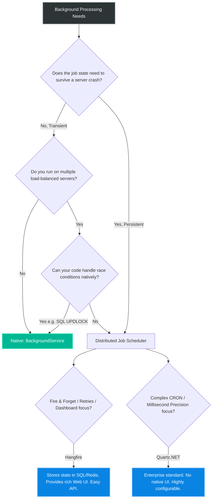

# 4.197 — Hangfire vs Quartz.NET vs BackgroundService

## PART 0 — Navigation & Context

```text
ASP.NET Core Domain Hierarchy
├── Infrastructure
│   ├── 4.195 Background Tasks & IHostedService
│   ├── 4.196 BackgroundService Base Class & Cancellation
│   ├── 4.197 Hangfire vs Quartz.NET vs BackgroundService ◄ YOU ARE HERE
└── Deployment & Scalability
```

**What you need before this:**
- Strong understanding of `BackgroundService` and its fundamental limitation regarding horizontal scaling [[4.196 — BackgroundService Base Class & Cancellation]].

**What this unlocks after:**
- Architecting robust, distributed, multi-node enterprise systems.
- Moving background processing entirely out of the Web API process.
- Implementing complex CRON schedules and retry policies.

**Why this matters to a production engineer at scale:**
As an application grows, `BackgroundService` quickly becomes a liability. 
First, there is the **Clustering Problem**: If you scale your API to 3 load-balanced servers, you suddenly have 3 instances of your `BackgroundService` polling the exact same database table, leading to massive race conditions and double-billing. 
Second, there is the **Resiliency Problem**: If the server crashes halfway through processing an order in a `BackgroundService`, that job is lost forever. There is no automatic retry mechanism. 
Third, there is the **Visibility Problem**: You have no idea what your `BackgroundService` is doing. You have to comb through text logs.
To solve these enterprise-scale problems, the .NET ecosystem relies on robust 3rd-party Job Schedulers—specifically **Hangfire** and **Quartz.NET**. Knowing when to use the built-in native tools versus when to bring in heavy, database-backed schedulers is a defining characteristic of a Senior .NET Architect.

---

## PART 1 — The Core Mental Model

> **The Fundamental Rule**
> **`BackgroundService` is an in-memory, transient, single-node loop. Hangfire and Quartz.NET are persistent, distributed, multi-node orchestrators that store job state in a database, ensuring jobs are executed exactly once across a cluster, survive server restarts, and can be tracked via a UI dashboard.**

**The Plain-Language Analogy**
Imagine a busy Restaurant.
**BackgroundService:** You ask a Waiter to go check the front door every 5 minutes. If the Waiter goes home sick (server crashes), nobody checks the door. If you hire 3 Waiters, they all bump into each other at the front door trying to check it at the exact same time (race condition).
**Hangfire / Quartz.NET:** You install a central Ticketing System (Database). The system prints a ticket: "Check the front door at 5:00 PM". Waiter A takes the ticket. Once Waiter A has the ticket, Waiters B and C cannot take it. If Waiter A slips and falls (crashes) before tearing the ticket, the system prints a new ticket for Waiter B to finish the job (Retry). The manager can look at a computer screen and see exactly which tickets are pending, processing, or failed (Dashboard).

**The Taxonomy Diagram**



---

## PART 2 — Deep Mechanics & Feature Comparison

### 1. The Distributed Lock (The Core Magic)
How do Hangfire and Quartz prevent 3 servers from executing the same job? They use **Distributed Locking** backed by a shared storage medium (SQL Server, PostgreSQL, or Redis). 
When Server A attempts to pick up a pending job, it initiates a transaction in the database, locks the row, and updates its state to "Processing". Server B queries the database a millisecond later, sees the job is locked, and moves on to the next available job. This completely eliminates the Multi-Node Race Condition inherent to `BackgroundService`.

### 2. Hangfire: The Developer's Favorite
Hangfire is deeply loved in the .NET ecosystem because of its incredibly simple API and its beautiful, out-of-the-box Web Dashboard.
- **Fire-and-Forget:** `BackgroundJob.Enqueue(() => Console.WriteLine("Hello"));`
- **Delayed:** `BackgroundJob.Schedule(() => SendEmail(), TimeSpan.FromDays(1));`
- **Recurring (CRON):** `RecurringJob.AddOrUpdate("id", () => ClearCache(), Cron.Hourly);`
- **Storage:** Requires a database (SQL Server, Redis, etc.) to store serialized method calls.
- **Retries:** If your method throws an exception, Hangfire catches it, logs it to the Dashboard, and automatically retries it later.

### 3. Quartz.NET: The Enterprise Heavyweight
Quartz is a port of the famous Java Quartz library. It is slightly older and much more verbose than Hangfire, but offers finer-grained control.
- **Architecture:** You define `IJob` classes and `ITrigger` schedules. 
- **Storage:** Can run purely in-memory (unlike Hangfire), or backed by a database.
- **UI:** Does *not* come with a built-in dashboard (though open-source add-ons like CrystalQuartz exist).
- **Precision:** Better suited for jobs that need to fire with millisecond precision, whereas Hangfire is designed for "approximate" polling intervals (15-second default delay).

---

## PART 3 — Production Code Patterns

### Pattern 1: Hangfire Setup & Execution
Setting up Hangfire with SQL Server and scheduling a fire-and-forget job from an API Controller.

```bash
dotnet add package Hangfire.AspNetCore
dotnet add package Hangfire.SqlServer
```

```csharp
// 1. Program.cs
builder.Services.AddHangfire(configuration => configuration
    .UseSqlServerStorage(builder.Configuration.GetConnectionString("DefaultConnection")));

// Adds the background processing server to the application
builder.Services.AddHangfireServer(); 

var app = builder.Build();

// Exposes the beautiful UI at /hangfire
app.UseHangfireDashboard(); 

// 2. The Controller
[ApiController]
[Route("api/[controller]")]
public class OrdersController : ControllerBase
{
    private readonly IBackgroundJobClient _backgroundJobs;

    // Inject Hangfire's client
    public OrdersController(IBackgroundJobClient backgroundJobs) 
        => _backgroundJobs = backgroundJobs;

    [HttpPost("process")]
    public IActionResult ProcessOrder([FromBody] OrderDto order)
    {
        // ✅ CORRECT: Hangfire serializes the method call, saves it to SQL, 
        // and returns a 202 Accepted immediately. A background thread picks it up later.
        _backgroundJobs.Enqueue<IOrderProcessor>(x => x.ProcessAsync(order.Id));
        
        return Accepted();
    }
}
```

### Pattern 2: Quartz.NET Setup & Execution
Quartz requires explicit classes for Jobs and Triggers.

```bash
dotnet add package Quartz.Extensions.Hosting
```

```csharp
// 1. Define the Job
public class EmailJob : IJob
{
    public async Task Execute(IJobExecutionContext context)
    {
        // Extract data passed into the job
        var email = context.JobDetail.JobDataMap.GetString("EmailAddress");
        await SendEmailAsync(email);
    }
}

// 2. Program.cs
builder.Services.AddQuartz(q =>
{
    var jobKey = new JobKey("SendEmailJob");
    
    // Register the job
    q.AddJob<EmailJob>(opts => opts.WithIdentity(jobKey));

    // Create a trigger that runs every day at 8:00 AM
    q.AddTrigger(opts => opts
        .ForJob(jobKey)
        .WithIdentity("EmailJob-trigger")
        .WithCronSchedule("0 0 8 * * ?"));
});

// Starts the Quartz scheduler in the background
builder.Services.AddQuartzHostedService(q => q.WaitForJobsToComplete = true);
```

### Pattern 3: Separating the Web API from the Worker (Advanced Hangfire)
In a heavy enterprise system, you do NOT want your Web API servers executing the background jobs, because heavy jobs will steal CPU from HTTP requests. You split them into two physical applications.

**App 1: The Web API (The Enqueuer)**
```csharp
// Program.cs
builder.Services.AddHangfire(c => c.UseSqlServerStorage("DB"));
// Notice: We DO NOT call AddHangfireServer() here! 
// This API only pushes jobs into the database.
```

**App 2: The .NET Worker Service (The Executor)**
```csharp
// Program.cs
builder.Services.AddHangfire(c => c.UseSqlServerStorage("DB"));
// This server actually pulls jobs from the DB and executes them
builder.Services.AddHangfireServer(options => {
    options.WorkerCount = 10; // Use 10 threads
});
```
*(You can deploy 5 instances of the Web API, and 2 instances of the Worker Service. They scale completely independently, coordinated entirely by the SQL database).*

---

## PART 4 — Gotchas & Anti-Patterns

### Gotcha 1: Hangfire Serialization Failures
Because Hangfire stores the method call in a database to survive crashes, it must serialize the arguments to JSON.

// ⚠️ WRONG CODE
```csharp
[HttpPost]
public IActionResult UploadImage(IFormFile file)
{
    // ❌ CRASH! Hangfire tries to serialize 'IFormFile' (a raw HTTP stream) 
    // into JSON and save it to SQL Server. It will fail massively.
    _jobs.Enqueue(() => ProcessImage(file)); 
    return Ok();
}
```

// ✅ CORRECT CODE
// Save the file to disk/S3 first, then pass the string path/ID to Hangfire.
```csharp
var filePath = await SaveToBlobStorageAsync(file);
_jobs.Enqueue(() => ProcessImage(filePath)); // Strings serialize perfectly
```

### Gotcha 2: Non-Reentrant (Non-Idempotent) Jobs
If a server crashes while processing a job, Hangfire detects the orphaned lock and automatically retries the job from the beginning.

// ⚠️ WRONG CODE
```csharp
public async Task ProcessOrder(int orderId)
{
    await ChargeCreditCard(orderId);
    // Server loses power right here!
    await MarkOrderComplete(orderId);
}
```

// THE GOTCHA:
// Hangfire retries the job 5 minutes later. It executes `ChargeCreditCard` again. The customer is double-billed.

// ✅ CORRECT CODE
// Jobs MUST be Idempotent (safe to run multiple times).
```csharp
public async Task ProcessOrder(int orderId)
{
    if (await IsCardCharged(orderId)) return; // Check state first!
    await ChargeCreditCard(orderId);
    await MarkOrderComplete(orderId);
}
```

### Gotcha 3: The Hangfire Database Bottleneck
By default, Hangfire polls the SQL database every 15 seconds to check for new jobs. If you have 20 Worker nodes, they are aggressively hammering your SQL Server with polling queries.
**Fix:** In SQL Server, Hangfire uses polling. If performance is degrading, switch Hangfire's storage engine to **Redis**. Redis uses Pub/Sub, eliminating database polling and reducing latency from 15 seconds to milliseconds.

### Gotcha 4: Quartz.NET In-Memory State Loss
By default, Quartz.NET runs in RAM (`RAMJobStore`). 
If you schedule a job to run next Tuesday, and you deploy a new version of your application on Monday (restarting the server), the job is completely erased from memory and will never execute. If you need persistence, you must explicitly configure Quartz to use `AdoJobStore` with a database provider.

---

## PART 5 — Performance Implications

### Request Pipeline Characteristics

| Scheduler | Architecture | Overhead | Latency to Execute |
|---|---|---|---|
| BackgroundService | In-Memory | Zero | Instant |
| Hangfire (SQL) | DB Polling | Moderate DB Load | ~15 seconds (default) |
| Hangfire (Redis) | Pub/Sub | Very Low | Milliseconds |
| Quartz (In-Memory) | In-Memory | Very Low | Milliseconds |
| Quartz (AdoStore) | DB Locks | Moderate DB Load | Milliseconds |

**When to Care:** 
If you need to process 10,000 tiny background messages a second, Hangfire with SQL Server will completely collapse under the database locks. You should use a pure message broker (RabbitMQ/Kafka) with a `BackgroundService` consumer. 
Hangfire and Quartz are designed for "Jobs" (e.g., Sending an email, generating a PDF, nightly database cleanup), NOT ultra-high-throughput streaming data.

---

## PART 6 — Interview Arsenal

### A. The Question Bank

**Question 1:** "We currently use `BackgroundService` to send out subscription renewal emails every night at 2:00 AM. We just scaled our API to run on 3 servers behind a load balancer. What catastrophic bug is about to happen, and how do we fix it?"
- **Average Answer:** "The background service will run 3 times. You should use Hangfire."
- **Why That's Insufficient:** Doesn't explain the underlying mechanics of distributed locks.
- **Great Answer:** "Because `BackgroundService` runs in-memory on the local process, scaling to 3 servers means 3 independent services will wake up at 2:00 AM. They will all query the database for users needing renewals, and they will all send emails, resulting in users receiving 3 identical emails. To fix this, you must introduce distributed locking. We should replace the `BackgroundService` with a distributed scheduler like Hangfire or Quartz.NET backed by a shared database. These tools use database transactions to lock jobs, ensuring that if Server A picks up the 2:00 AM task, Servers B and C are locked out and will not execute it."

**Question 2:** "Why is it dangerous to pass complex objects like Entity Framework Core `DbContext` instances or massive JSON strings into a Hangfire `Enqueue` method?"
- **Average Answer:** "Because it's too big."
- **Why That's Insufficient:** Ignores the lifecycle and serialization mechanics of Hangfire.
- **Great Answer:** "Hangfire works by intercepting the method call, serializing its arguments into JSON, and storing them in a database. If you pass a `DbContext`, serialization will fail completely. If you pass a massive 10MB JSON object, you will bloat your Hangfire database and slow down the polling mechanism. Furthermore, background jobs might not execute for hours; if you pass a complex object, its data might be stale by the time the job runs. The best practice is to pass only primitive identifiers (like `Guid orderId`), and let the background job instantiate its own DbContext and look up the fresh data when it finally executes."

**Question 3:** "If Hangfire is executing a background job and the physical server loses power, what happens to that job?"
- **Average Answer:** "It fails and you check the dashboard."
- **Why That's Insufficient:** Hangfire has automatic resilience built-in.
- **Great Answer:** "It survives. When Hangfire pulled the job from the database, it didn't delete it; it locked it and updated its state to 'Processing'. If the server dies, the lock eventually times out. Another Hangfire worker node (or the same node when it reboots) will detect the orphaned job and automatically requeue it. This is why it is absolutely critical that Hangfire jobs are written to be idempotent—because the job will be executed again from the beginning."

### B. The Trick Questions

**Trick Question:** "I want to schedule a Quartz.NET job, but I don't want to use a database. Is that possible?"
- **The Trap:** Thinking all distributed schedulers require databases like Hangfire does.
- **The Correct Answer:** "Yes. Quartz.NET uses a `RAMJobStore` by default. It runs perfectly fine purely in memory without a database. However, you sacrifice persistence; if the server restarts, all scheduled jobs are lost, and you cannot cluster it across multiple nodes without moving to the `AdoJobStore`."

### C. Red Flags to Avoid
- 🚩 **"I use Hangfire instead of RabbitMQ."** (They serve different purposes. Hangfire is a task scheduler. RabbitMQ is a high-throughput message broker. If you have 50,000 events a second, Hangfire's SQL backing store will melt. Use RabbitMQ).
- 🚩 **"I put all my Hangfire logic inside my MVC Controllers."** (Controllers should only `Enqueue` jobs using IDs. The actual execution logic should live in Domain Services).

---

## PART 7 — Decision Framework

```mermaid
graph TD
    A[Background Task Architecture] --> B{Do you need job persistence across server crashes?}
    
    B -->|No| C{Do you run on >1 Server?}
    B -->|Yes| D[Use Distributed Job Scheduler]
    
    C -->|No| E[Native BackgroundService]
    C -->|Yes| F{Can your DB queries handle locks natively e.g. SKIP LOCKED?}
    
    F -->|Yes| E
    F -->|No, too complex| D
    
    D --> G{Need a Web Dashboard and easy 'Enqueue' API?}
    G -->|Yes| H[Hangfire SQL/Redis]
    G -->|No, want standard CRON and heavy config| I[Quartz.NET]
    
    style A fill:#2d3436,stroke:#fff
    style E fill:#00b894,stroke:#fff
    style H fill:#0984e3,stroke:#fff
    style I fill:#0984e3,stroke:#fff
```



---

## PART 8 — Self-Check

### A. Conceptual Questions
1. What is the fundamental difference between `BackgroundService` and Hangfire regarding state storage?
2. How does Hangfire prevent two servers from executing the same job at the same time?
3. Why does passing an `IFormFile` stream to Hangfire cause an exception?
4. What does it mean for a background job to be "idempotent", and why does Hangfire require it?
5. How do you separate the Web API (enqueuing jobs) from the Worker Service (executing jobs) in Hangfire?
6. If Quartz.NET is configured with `RAMJobStore`, what happens if the application restarts?
7. When would you choose Redis over SQL Server as the Hangfire storage provider?
8. Why are Hangfire/Quartz bad choices for streaming 10,000 messages a second?

### B. Code Puzzles

**Puzzle 1: The Stale Data**
```csharp
var user = _dbContext.Users.Find(userId);
_hangfire.Enqueue(() => ProcessUser(user)); // Passing the whole object!
```
*Scenario:* The Hangfire queue is backed up, so the job executes 4 hours later. During those 4 hours, the user changes their email address on the website. What email address does the background job process?
<details>
<summary>Answer</summary>
It processes the old email address. Hangfire serialized the `user` object to JSON exactly as it looked 4 hours ago and saved it to SQL. When it deserializes it, it uses the stale data.
*Fix:* `_hangfire.Enqueue(() => ProcessUser(userId))`. Let the job query the freshest data from the DB when it runs.
</details>

**Puzzle 2: The Double Charge**
```csharp
public void RefundCustomer(Guid invoiceId) {
    _paymentGateway.IssueRefund(invoiceId);
    _dbContext.Invoices.Find(invoiceId).Status = "Refunded";
    _dbContext.SaveChanges();
}
```
*Scenario:* This is a Hangfire job. The API call to `IssueRefund` succeeds. The database server is currently offline, so `SaveChanges` throws an exception. What happens next?
<details>
<summary>Answer</summary>
Hangfire catches the exception, marks the job as Failed, and schedules an automatic retry. 5 minutes later, it executes `RefundCustomer` again. It calls `IssueRefund` again. The customer receives double their money back. The job was not Idempotent.
*Fix:* Always check the state first. `if (gateway.IsRefunded(invoiceId)) return;`.
</details>

**Puzzle 3: The Dashboard Exposure**
```csharp
var app = builder.Build();
app.UseHangfireDashboard(); // Placed loosely in Program.cs
app.Run();
```
*Scenario:* You deploy to Production. What is the security vulnerability?
<details>
<summary>Answer</summary>
By default, the Hangfire dashboard is only accessible to local requests (localhost). However, if you configure it to allow remote requests without providing an Authorization Filter, anyone on the internet can navigate to `yourwebsite.com/hangfire`, view your entire background architecture, manually trigger jobs, or delete pending jobs. Always secure the dashboard route with Auth middleware or a custom Hangfire `IDashboardAuthorizationFilter`.
</details>

---

## PART 9 — Connections & Resources

### A. Related Topics Table

| Topic | Why It Connects |
|---|---|
| [[4.196 — BackgroundService Base Class & Cancellation]] | The native ASP.NET Core alternative for simple, single-node tasks. |
| [[4.060 — Error Handling & Exception Middleware]] | How Hangfire automatically handles the exceptions that would normally crash a BackgroundService. |

### B. Books

| Book | Chapters | Why These Chapters |
|---|---|---|
| Enterprise Application Architecture (Fowler) | Concurrency / Locking | The theoretical foundation of why Hangfire requires a DB to cluster. |
| ASP.NET Core in Action, 3rd Ed | Chapter 23 | Brief comparison of external schedulers vs native tasks. |

### C. Essential Articles & Docs
- [Hangfire Official Documentation](https://docs.hangfire.io/en/latest/)
- [Quartz.NET Official Documentation](https://www.quartz-scheduler.net/)
- [NDepend: Background tasks in ASP.NET Core: Hangfire vs Quartz vs BackgroundService](https://blog.ndepend.com/)

> [!NOTE]
> **Template Meta-Note**
> Part 0: Context & Prerequisites. Part 1: Core Mental Model. Part 2: Deep Mechanics & Pipeline. Part 3: Production Code. Part 4: Gotchas. Part 5: Performance. Part 6: Interview Arsenal. Part 7: Decision Framework. Part 8: Puzzles. Part 9: Resources.
