# 4.197 — Response Compression: UseResponseCompression, Gzip, and Brotli

## PART 0 — Navigation & Context

```text
ASP.NET Core Domain Hierarchy
├── Performance & Scalability
│   ├── Response Caching
│   └── Network Optimization
│       ├── 4.197 Response Compression ◄ YOU ARE HERE
│       └── 4.198 Request Decompression
└── Pipeline Architecture
    └── 4.052 Middleware Ordering
```

**What you need before this:**
- A firm understanding of the ASP.NET Core Middleware Pipeline and why order matters [[4.052 — Middleware Ordering: Canonical Pipeline Order]].
- Familiarity with how HTTP clients negotiate formats via the `Accept-Encoding` header.

**What this unlocks after:**
- Implementing the reverse pipeline: unpacking large payloads sent BY clients to the server [[4.198 — Request Decompression (.NET 7+) UseRequestDecompression]].
- Tuning high-throughput APIs where network bandwidth costs (AWS Egress fees) exceed compute costs.

**Why this matters to a production engineer at scale:**
JSON is a terribly verbose format. If you send an array of 1,000 products, the strings `"id":`, `"name":`, and `"price":` are repeated 1,000 times in the payload. A 5MB JSON payload over a 3G mobile network will take several seconds to download, ruining the UX and racking up massive Cloud Egress bandwidth fees.
However, because JSON is highly repetitive text, it compresses beautifully. Gzip or Brotli compression can shrink that 5MB payload down to 500KB (a 90% reduction). 
As an ASP.NET Core engineer, you must know how to enable the `UseResponseCompression` middleware to automatically crush outbound text payloads. But equally important, you must know its dangers: compressing data costs Server CPU. If you blindly compress already-compressed files (like JPEG images or PDFs), you burn server CPU to achieve 0% size reduction. Furthermore, if you configure the middleware in the wrong pipeline order, you break Output Caching.

---

## PART 1 — The Core Mental Model

> **The Fundamental Rule**
> **`UseResponseCompression` is an ASP.NET Core middleware that intercepts outgoing HTTP Responses. If the client sends an `Accept-Encoding: gzip, br` header, and the response is a known text type (like `application/json` or `text/html`), the middleware intercepts the response stream, runs it through a compression algorithm (Brotli or Gzip), appends the `Content-Encoding` header, and sends the smaller payload over the network. It trades Server CPU cycles for Network Bandwidth savings.**

**The Plain-Language Analogy**
Imagine a company shipping thousands of pillows (JSON Responses) to customers.
**Without Compression:** You put a big, fluffy pillow into a massive box and ship it. It takes up lots of space on the delivery truck, and shipping costs are huge.
**With Compression:** You put the pillow in a vacuum-seal bag, attach a vacuum pump (Server CPU), and suck all the air out. The pillow shrinks to 10% of its size (Brotli/Gzip). You ship it in a tiny box (low network bandwidth). When the customer gets it, they open the bag (Browser Decompression), and it expands back into a fluffy pillow.
**The Exception:** If someone orders a brick (A JPEG image), vacuum-sealing it accomplishes absolutely nothing. You just wasted time running the vacuum pump.

**The Taxonomy Diagram**

```mermaid
graph TD
    A[Client Request] -->|Headers: Accept-Encoding: br, gzip| B[ASP.NET Core Server]
    
    B --> C{Pipeline Execution}
    C --> D[Controller Action Generates 5MB JSON]
    
    D --> E[Response Compression Middleware]
    
    E --> F{Check Content-Type}
    F -->|application/pdf or image/jpeg| G[Skip Compression]
    F -->|application/json| H{Check Accept-Encoding}
    
    H -->|Missing| G
    H -->|Contains 'br'| I[Apply Brotli Compression]
    H -->|Contains 'gzip'| J[Apply Gzip Compression]
    
    G --> K[Transmit 5MB Uncompressed Body]
    I --> L[Transmit 500KB Body + 'Content-Encoding: br']
    J --> M[Transmit 600KB Body + 'Content-Encoding: gzip']
    
    L --> N[Client Browser Decompresses invisibly]
    M --> N
    
    style B fill:#2d3436,stroke:#fff
    style E fill:#0984e3,stroke:#fff
    style F fill:#fdcb6e,stroke:#333
    style I fill:#00b894,stroke:#fff
    style L fill:#00b894,stroke:#fff
```



---

## PART 2 — Deep Mechanics

### 2.1 — Content Negotiation
Compression requires a mutual agreement between Client and Server.
1. The client (Chrome, Postman, Mobile App) sends `Accept-Encoding: gzip, deflate, br`. This means "I know how to decompress Gzip, Deflate, and Brotli."
2. The middleware sees this, chooses the best available algorithm configured on the server (usually Brotli `br` as it is superior), and compresses the stream.
3. The server replies with `Content-Encoding: br`.
4. The client's networking layer intercepts the payload, decompresses it, and hands the raw JSON to the application logic. *The frontend code never knows it was compressed.*

### 2.2 — Registering the Middleware
```csharp
builder.Services.AddResponseCompression(options =>
{
    // Enable compression over HTTPS (Required in modern web, see Security Gotchas)
    options.EnableForHttps = true; 
    
    // Explicitly add Brotli (Best) and Gzip (Fallback)
    options.Providers.Add<BrotliCompressionProvider>();
    options.Providers.Add<GzipCompressionProvider>();
    
    // Add custom MIME types if you serve proprietary text formats
    options.MimeTypes = ResponseCompressionDefaults.MimeTypes.Concat(new[] { "application/vnd.mycompany.text" });
});

var app = builder.Build();

// MUST be placed BEFORE Static Files and Routing
app.UseResponseCompression(); 
```

### 2.3 — Brotli vs. Gzip
- **Gzip:** The ancient industry standard. Extremely fast to compress, decent compression ratios. Universal compatibility.
- **Brotli (`br`):** Developed by Google. Significantly better compression ratios than Gzip (payloads are 10-20% smaller), but it requires slightly more CPU to compress at maximum levels. Supported by all modern browsers.

### 2.4 — Compression Levels
You can tune the algorithms via `Configure`.
- **Fastest:** Burns less CPU, but leaves the payload slightly larger. (Default in ASP.NET Core).
- **Optimal:** Burns more CPU to squeeze every last byte out of the payload.
- **NoCompression:** Turns it off.

```csharp
builder.Services.Configure<BrotliCompressionProviderOptions>(options =>
{
    options.Level = CompressionLevel.Fastest; // Highly recommended for dynamic API traffic
});
```

---

## PART 3 — Production Code Patterns

### Pattern 1: Bypassing Compression for Reverse Proxies
If you host your ASP.NET Core API behind Cloudflare, AWS CloudFront, or an Nginx reverse proxy, **DO NOT enable Response Compression in ASP.NET Core.**
Why? Because Cloudflare has dedicated hardware C++ accelerators that compress HTTP traffic a thousand times more efficiently than your Kestrel C# worker threads. Let the edge network do the heavy lifting. Only use `UseResponseCompression` if Kestrel is the edge server directly facing the internet, or running on an internal microservice network where bandwidth is constrained.

### Pattern 2: Excluding Specific MIME Types
By default, the middleware knows not to compress images or zip files. But if you serve a custom binary format (`application/octet-stream`), the middleware might try to compress it, wasting CPU.

```csharp
builder.Services.AddResponseCompression(options =>
{
    options.EnableForHttps = true;
    // Exclude proprietary binary models
    options.ExcludedMimeTypes = new[] { "application/vnd.unity.binary" }; 
});
```

### Pattern 3: Opting Out per Request
If you have an endpoint that generates a massive pre-compressed archive dynamically, you can instruct the middleware to ignore this specific request by removing the `Accept-Encoding` feature.

```csharp
app.MapGet("/api/download-archive", (HttpContext ctx) =>
{
    // Strip the client's request header internally so the middleware ignores it
    ctx.Request.Headers.AcceptEncoding = StringValues.Empty;
    
    var zipStream = GenerateZipArchive();
    return Results.File(zipStream, "application/zip");
});
```

---

## PART 4 — Gotchas & Anti-Patterns

### Gotcha 1: The Pipeline Ordering Disaster
// ⚠️ FATAL ANTI-PATTERN
```csharp
app.UseStaticFiles(); // Serves style.css uncompressed!
app.UseResponseCompression(); 
```
If `UseStaticFiles` executes before `UseResponseCompression`, the static file middleware writes the CSS file directly to the network and short-circuits the pipeline. The compression middleware never sees it.
**Fix:** `UseResponseCompression` MUST be placed very early in the pipeline, typically right after Exception Handling, and strictly before Routing, Caching, and Static Files.

### Gotcha 2: Compressing the Incompressible
If you enable compression on a route that serves `.mp4` video files or `.jpg` images, Kestrel will run the Brotli algorithm on the binary data. Because binary data is already mathematically dense, Brotli will accomplish 0% size reduction, but it will consume 100% of a CPU core doing it.
**Fix:** Rely on the default MIME type filters, and explicitly add `ExcludedMimeTypes` for any custom binary files you serve.

### Gotcha 3: The CRIME / BREACH Security Vulnerabilities
In the early days of .NET Core, `EnableForHttps` defaulted to `false`. Why?
Because if you compress a response containing both **Secret Data** (like a CSRF token or Session Cookie) and **User-Controlled Data** (like a reflected search query) over an encrypted HTTPS connection, attackers can use a technique called BREACH. By manipulating the user input and watching the final compressed size of the HTTPS packet, they can mathematically guess the Secret Data character by character.
**Fix:** Today, anti-forgery tokens are randomized, largely mitigating BREACH. `EnableForHttps = true` is standard practice, but be aware of the theoretical risk if you reflect un-sanitized user input alongside static secrets in HTML.

### Gotcha 4: Compressing Server-Sent Events (SSE) or WebSockets
If you compress a streaming connection (like SignalR or SSE), the compression algorithm buffers the data waiting for "enough" text to build a compression dictionary. This ruins real-time latency. Responses will "clump" and arrive in delayed bursts.
**Fix:** The middleware automatically ignores `Content-Type: text/event-stream`. Do not force compression on streaming protocols.

---

## PART 5 — Performance Implications

### Request Pipeline Characteristics

| Scenario | Network Bandwidth | Server CPU Usage | Client UX (Latency) |
|---|---|---|---|
| Uncompressed 2MB JSON | 2,000 KB | Lowest | Slow (Download Bottleneck) |
| Gzip 2MB JSON | ~300 KB | Medium | Fast |
| Brotli (Fastest) 2MB JSON | ~250 KB | Medium-High | Very Fast |
| Brotli (Optimal) 2MB JSON | ~220 KB | **Extremely High** | Slow (Server Bottleneck) |

**Performance Verdict:**
Compression is a tradeoff between Compute and I/O. On modern internet connections, bandwidth is usually the bottleneck for large JSON payloads. Setting Brotli to `CompressionLevel.Fastest` hits the absolute sweet spot: incredible payload reduction with negligible CPU overhead. Never use `CompressionLevel.Optimal` for dynamically generated API responses; it will max out your CPU.

---

## PART 6 — Interview Arsenal

### A. The Question Bank

**Question 1:** "If we have a React SPA calling our ASP.NET Core API, how does the API know whether it should compress the JSON using Gzip, Brotli, or leave it uncompressed?"
- **Average Answer:** "You configure it in Program.cs."
- **Why That's Insufficient:** Ignores HTTP Content Negotiation.
- **Great Answer:** "It uses Content Negotiation via the HTTP Headers. The browser (React) automatically sends an `Accept-Encoding: gzip, br` header with the GET request. The `UseResponseCompression` middleware inspects this header, compares it to the providers registered in `Program.cs`, and selects the best matching algorithm (usually Brotli). If a legacy client sends a request without that header, the middleware gracefully bypasses compression and serves raw JSON."

**Question 2:** "Why shouldn't you place `UseResponseCompression` after `UseOutputCache` or `UseResponseCaching` in the middleware pipeline?"
- **Average Answer:** "Because the order matters in ASP.NET."
- **Why That's Insufficient:** Doesn't explain the mechanical failure.
- **Great Answer:** "Because the cache middleware intercepts the request and short-circuits the pipeline, returning the cached data instantly. If Compression sits *after* Cache, the Cache middleware will store the massive, uncompressed JSON, and the Compression middleware will never get a chance to run. Compression must sit *before* Caching. This way, the Response is compressed first, and the Cache middleware stores the tiny, compressed byte array, saving both Network Bandwidth and Server RAM."

**Question 3:** "If we host our API on AWS and put CloudFront (a CDN) in front of it, should we enable `UseResponseCompression` in our C# code?"
- **Average Answer:** "Yes, you always want smaller payloads."
- **Why That's Insufficient:** Misses the architectural optimization of edge networks.
- **Great Answer:** "No, you should disable it in Kestrel. CDNs like CloudFront or Cloudflare have highly optimized edge servers designed to compress traffic dynamically. If you compress it in C#, you burn expensive EC2 Compute CPU cycles. It is much more cost-effective to send uncompressed JSON from Kestrel to the CDN over the fast internal AWS network, and let the CDN's hardware-accelerated algorithms compress it before sending it over the public internet to the client."

### B. The Trick Questions

**Trick Question:** "Our API generates massive 50MB PDF reports. We enabled `UseResponseCompression` to speed up the downloads, but the payload size didn't change and CPU spiked. What's wrong with the Brotli configuration?"
- **The Trap:** Believing Brotli can compress anything.
- **The Correct Answer:** "Nothing is wrong with the configuration. PDF files (like JPEG or MP4 files) are already highly compressed binary formats. Applying a generic compression algorithm like Gzip or Brotli to an already-compressed binary file yields 0% size reduction. By default, ASP.NET Core ignores `application/pdf`, so if you forced it to compress, you are just burning CPU for no reason."

### C. Red Flags to Avoid
- 🚩 **"I use `CompressionLevel.Optimal` to ensure mobile clients use the least amount of data possible."** (Optimal compression takes exponentially longer to execute. The mobile client will wait 3 seconds for your server to compress the JSON, destroying the UX. Always use `Fastest` for dynamic HTTP traffic).

---

## PART 7 — Decision Framework

```mermaid
graph TD
    A[Should I enable UseResponseCompression?] --> B{Is Kestrel behind a CDN or Reverse Proxy e.g., Cloudflare/Nginx?}
    
    B -->|Yes| C[Do NOT enable in ASP.NET Core]
    C --> D[Let the Proxy/CDN handle compression to save App CPU]
    
    B -->|No - Kestrel faces the internet / internal network| E{Are you serving mostly JSON, HTML, or Text?}
    
    E -->|No - Serving Images/Video/Zip| F[Do NOT enable]
    
    E -->|Yes| G[Enable UseResponseCompression]
    G --> H[EnableForHttps = true]
    H --> I[Add Brotli and Gzip Providers]
    I --> J[Set CompressionLevel to Fastest]
    J --> K[Place BEFORE Caching and StaticFiles in Pipeline]
    
    style A fill:#2d3436,stroke:#fff
    style C fill:#d63031,stroke:#fff
    style F fill:#d63031,stroke:#fff
    style G fill:#0984e3,stroke:#fff
    style K fill:#00b894,stroke:#fff
```



---

## PART 8 — Self-Check

### A. Conceptual Questions
1. How does the middleware know whether the client supports Brotli compression?
2. What HTTP header does the server attach to the response to indicate it was compressed?
3. Why must `UseResponseCompression` be placed before `UseStaticFiles`?
4. What is the fundamental difference between `CompressionLevel.Fastest` and `CompressionLevel.Optimal`?
5. Why does applying Gzip to a JPEG image fail to reduce its size?
6. Explain the BREACH vulnerability and why `EnableForHttps` used to default to false.
7. If a client sends `Accept-Encoding: deflate`, and you only registered Brotli and Gzip, what happens?
8. Why shouldn't you compress Server-Sent Events (SSE) streams?

### B. Code Puzzles

**Puzzle 1: The Broken Cache**
```csharp
app.UseOutputCache();
app.UseResponseCompression();
app.MapGet("/api/data", () => "Large string data").CacheOutput();
```
*Scenario:* You check the network tab. The response is heavily cached, but it is never compressed. Why?
<details>
<summary>Answer</summary>
Pipeline order violation. `UseOutputCache` intercepts the request, runs the endpoint, stores the uncompressed string, and short-circuits. `UseResponseCompression` is further down the pipeline and never gets invoked. Swap the order: Compression must wrap the Cache.
</details>

**Puzzle 2: The Wasted CPU**
```csharp
builder.Services.AddResponseCompression(options => {
    options.MimeTypes = new[] { "image/jpeg", "application/json" };
});
```
*Scenario:* Your server CPU hits 100% when serving photos. What did you do?
<details>
<summary>Answer</summary>
By explicitly redefining the `MimeTypes` collection instead of appending to the defaults, you forced the middleware to attempt compression on `image/jpeg`. Compressing already-compressed JPEGs burns massive CPU for zero byte savings.
</details>

**Puzzle 3: The Unyielding Proxy**
*Scenario:* You enabled Compression. You test via `localhost` and see `Content-Encoding: br`. You deploy to AWS behind an Application Load Balancer (ALB). You test the public URL, and the JSON is suddenly uncompressed. Your C# code hasn't changed. Why?
<details>
<summary>Answer</summary>
Corporate proxies, firewalls, and certain Load Balancers frequently strip the `Accept-Encoding` header from incoming requests, or strip the `Content-Encoding` header from outgoing responses, for security inspection purposes. If the ALB strips the header, Kestrel sees no `br` request, and serves uncompressed JSON. You must configure the cloud infrastructure to permit compressed traffic.
</details>

---

## PART 9 — Connections & Resources

### A. Related Topics Table

| Topic | Why It Connects |
|---|---|
| [[4.052 — Middleware Ordering: Canonical Pipeline Order]] | The ultimate guide to where Compression must sit relative to Caching and Static Files. |
| [[4.198 — Request Decompression (.NET 7+) UseRequestDecompression]] | The exact reverse of this topic: handling incoming compressed payloads. |
| [[4.191 — Output Caching (.NET 7+): Server-Side Response Cache]] | The middleware that must be placed *after* compression to store the optimized byte arrays. |

### B. Books

| Book | Chapters | Why These Chapters |
|---|---|---|
| High Performance Browser Networking | Chapter 4: Encoding and Compression | The authoritative guide on how Gzip and Brotli actually work at the mathematical level on the web. |
| ASP.NET Core in Action, 3rd Ed | Chapter 16: Performance | Covers configuring Gzip and Brotli providers. |

### C. Essential Articles & Docs
- [Microsoft Docs: Response compression in ASP.NET Core](https://learn.microsoft.com/en-us/aspnet/core/performance/response-compression)
- [RFC 9110: Content-Encoding](https://www.rfc-editor.org/rfc/rfc9110#name-content-encoding)

> [!NOTE]
> **Template Meta-Note**
> Part 0: Context & Prerequisites. Part 1: Core Mental Model. Part 2: Deep Mechanics & Pipeline. Part 3: Production Code. Part 4: Gotchas. Part 5: Performance. Part 6: Interview Arsenal. Part 7: Decision Framework. Part 8: Puzzles. Part 9: Resources.
