# 4.198 — Request Decompression (.NET 7+): UseRequestDecompression

## PART 0 — Navigation & Context

```text
ASP.NET Core Domain Hierarchy
├── Performance & Scalability
│   └── Network Optimization
│       ├── 4.197 Response Compression
│       └── 4.198 Request Decompression (.NET 7+) ◄ YOU ARE HERE
└── MVC & API Controllers
    └── 4.100 Model Binding
```

**What you need before this:**
- Understanding of the HTTP protocol, specifically `Content-Encoding` headers.
- Knowledge of ASP.NET Core's Response Compression [[4.197 — Response Compression UseResponseCompression, Gzip, and Brotli]].
- Familiarity with Model Binding, as decompression happens right before it [[4.100 — Model Binding: FromBody, FromQuery, FromRoute, and Custom Binders]].

**What this unlocks after:**
- Building high-throughput ingestion APIs (IoT telemetry, bulk data imports) that allow clients to upload massive JSON datasets without saturating network ingress bandwidth.

**Why this matters to a production engineer at scale:**
Most developers know how to compress outbound responses. But what happens when an IoT device needs to upload 10MB of JSON telemetry data to your API every minute? If 10,000 devices do this, your inbound network bandwidth (Ingress) gets crushed.
The smart solution is to have the IoT device compress the JSON into a 1MB Gzip payload before uploading it via HTTP POST. 
Prior to .NET 7, ASP.NET Core had no native way to handle this. If a client sent a zipped payload, Model Binding would crash trying to parse binary Gzip data as JSON. You had to write custom middleware to intercept the stream, decompress it into memory, and replace `HttpContext.Request.Body`.
In **.NET 7**, Microsoft introduced `UseRequestDecompression`. It acts as an invisible shield. It detects the `Content-Encoding` header from the client, transparently decompresses the stream on the fly, and hands the raw JSON to your Controller. However, this introduces a massive security risk: **The Decompression Bomb (Zip Bomb)**. A senior engineer must know how to configure limits to prevent a 1MB malicious payload from expanding into 5GB of JSON and crashing the server's RAM.

---

## PART 1 — The Core Mental Model

> **The Fundamental Rule**
> **`UseRequestDecompression` is an inbound middleware. When a client sends an HTTP POST/PUT with `Content-Encoding: gzip` (or `br`/`deflate`), this middleware intercepts the incoming byte stream and wraps it in a decompression stream. 
> To the rest of the ASP.NET Core pipeline (Model Binding, Controllers), the request appears exactly as normal, uncompressed JSON. This drastically reduces network ingress bandwidth for bulk uploads, trading it for Server CPU cycles during decompression.**

**The Plain-Language Analogy**
Imagine an Office Mailroom (ASP.NET Core Server).
Normally, someone mails a full-size inflatable mattress (10MB JSON Payload) to the office. It requires a massive delivery truck (High Network Bandwidth) and clogs the loading dock.
Instead, the sender uses a vacuum pump to shrink the mattress into a tiny box (Gzip Compression) and mails it. The tiny box arrives on a fast scooter (Low Network Bandwidth).
The Mailroom Clerk (`UseRequestDecompression` middleware) sees the "Vacuum Sealed" sticker (`Content-Encoding: gzip`). Before handing the box to the Executive (Controller/Model Binder), the clerk opens the box, lets the mattress inflate back to full size (Decompression), and hands the full-size mattress to the Executive. The Executive never knows it was shipped in a tiny box.

**The Taxonomy Diagram**

```mermaid
graph TD
    A[IoT Client / Mobile App] -->|POST 1MB Gzip Payload| B[Internet]
    B -->|Headers: Content-Encoding: gzip| C[ASP.NET Core Kestrel]
    
    C --> D[Request Decompression Middleware]
    
    D --> E{Inspect Content-Encoding}
    
    E -->|None| F[Pass Through]
    E -->|gzip| G[Wrap Request.Body in GZipStream]
    E -->|br| H[Wrap Request.Body in BrotliStream]
    E -->|Unknown| I[HTTP 415 Unsupported Media Type]
    
    G --> J[Model Binder]
    H --> J
    F --> J
    
    J -->|Reads 10MB of pure JSON| K[Controller Action]
    
    style A fill:#2d3436,stroke:#fff
    style D fill:#0984e3,stroke:#fff
    style G fill:#00b894,stroke:#fff
    style H fill:#00b894,stroke:#fff
    style J fill:#fdcb6e,stroke:#333
    style I fill:#d63031,stroke:#fff
```



---

## PART 2 — Deep Mechanics

### 2.1 — The HTTP Wire
This relies entirely on the client formatting the request correctly.

**Client Request:**
```http
POST /api/telemetry HTTP/1.1
Host: api.mycompany.com
Content-Type: application/json
Content-Encoding: gzip

[Binary Gzip Payload representing a 10MB JSON array]
```

If the client sends zipped bytes but forgets the `Content-Encoding: gzip` header, the middleware will do nothing, and the JSON Model Binder will crash trying to parse binary data.

### 2.2 — Registering the Middleware
It requires both service registration and pipeline configuration.

```csharp
// Program.cs
builder.Services.AddRequestDecompression();

var app = builder.Build();

// MUST be placed early, before UseRouting and UseEndpoints
app.UseRequestDecompression(); 

app.MapPost("/api/telemetry", ([FromBody] List<TelemetryDto> data) => 
{
    // The controller receives a normal C# List. 
    // It is completely unaware of the Gzip transfer.
    return Results.Ok($"Received {data.Count} records.");
});
```

### 2.3 — Supported Algorithms
Out of the box, .NET 7+ supports:
- `gzip`
- `deflate`
- `br` (Brotli)

If a client sends `Content-Encoding: custom-zip`, the middleware will automatically intercept the request and return **HTTP 415 Unsupported Media Type**, preventing your application logic from receiving gibberish.

### 2.4 — Custom Decompression Providers
If you have a proprietary IoT client that uses a custom compression algorithm (e.g., `lz4`), you can teach ASP.NET Core how to decompress it.

```csharp
builder.Services.AddRequestDecompression(options =>
{
    options.DecompressionProviders.Add("lz4", new Lz4DecompressionProvider());
});
```

---

## PART 3 — Production Code Patterns

### Pattern 1: Symmetric APIs (Compressing Both Ways)
For high-volume server-to-server communication, you want to compress traffic in both directions. You simply register both middlewares.

```csharp
// Services
builder.Services.AddResponseCompression();
builder.Services.AddRequestDecompression();

// Pipeline
app.UseRequestDecompression();  // Inflates inbound POST bodies
app.UseResponseCompression();   // Deflates outbound 200 OK bodies
```
*Note: The client application (e.g., `HttpClient`) must be configured with `AutomaticDecompression` to read the response, and must manually compress its `HttpContent` before POSTing.*

### Pattern 2: Bypassing Decompression for Passthrough
Sometimes your API acts as a middleman. An IoT device uploads a Gzipped JSON file, and your API just saves that file directly to Azure Blob Storage. You *do not* want to decompress it, because you want to save the tiny zipped version to cloud storage to save money.

If `UseRequestDecompression` is enabled globally, it ruins this by inflating the file.
You can bypass it on specific endpoints using the `[DisableRequestDecompression]` metadata.

```csharp
[HttpPost("/api/upload-raw")]
[DisableRequestDecompression] // The middleware will ignore this route
public async Task<IActionResult> UploadRawZip()
{
    // Request.Body is the raw, compressed binary stream
    await _blobStorage.UploadAsync(Request.Body);
    return Ok();
}
```

---

## PART 4 — Gotchas & Anti-Patterns

### Gotcha 1: The Zip Bomb (Decompression Bomb)
// ⚠️ SECURITY FATAL
A Zip Bomb is a malicious file that is 1MB when compressed, but expands to 5 Petabytes of zeroes when uncompressed.
If an attacker POSTs a Zip Bomb to your API, the `UseRequestDecompression` middleware will happily start unzipping it into Kestrel's memory/streams. When the JSON model binder attempts to read it, it will allocate RAM until your server crashes with an OutOfMemoryException (OOM).
**Fix:** You MUST enforce Request Body Size limits. By default, Kestrel limits request bodies to ~30MB. Crucially, in ASP.NET Core, the **Kestrel limit applies to the DECOMPRESSED size**, not the compressed size! 
If an attacker sends a 1MB gzip file that expands to 50MB, Kestrel will terminate the connection the moment the decompressed stream hits 30MB, protecting your server. Do NOT increase `MaxRequestBodySize` to arbitrary high numbers if request decompression is enabled.

### Gotcha 2: Ordering Before Model Binding
If you place `UseRequestDecompression` *after* the middleware that reads the body (like a custom logging middleware that logs payloads), the logging middleware will read binary garbage. 
**Fix:** Always place it at the top of the request processing pipeline, usually right after Exception Handling.

### Gotcha 3: The `HttpClient` Disconnect
Developers often enable this middleware, then test it by sending JSON from `HttpClient`, wondering why it's not compressing.
`HttpClient` does NOT automatically compress outgoing `POST` bodies. It automatically *decompresses* incoming responses, but compressing an outbound request requires manual effort.

```csharp
// Client-side code required to trigger the ASP.NET Core middleware
var jsonBytes = JsonSerializer.SerializeToUtf8Bytes(data);
using var memoryStream = new MemoryStream();
using (var gzipStream = new GZipStream(memoryStream, CompressionMode.Compress))
{
    gzipStream.Write(jsonBytes);
}

var content = new ByteArrayContent(memoryStream.ToArray());
content.Headers.ContentType = new MediaTypeHeaderValue("application/json");
content.Headers.ContentEncoding.Add("gzip"); // CRITICAL

await httpClient.PostAsync("https://api/telemetry", content);
```

### Gotcha 4: Cloudflare / Reverse Proxy Stripping
Just like Response Compression, if your API is behind a strict WAF (Web Application Firewall) or Reverse Proxy, the proxy might strip the `Content-Encoding` header or reject compressed payloads outright for security inspection. Ensure your infrastructure allows compressed ingress traffic.

---

## PART 5 — Performance Implications

### Request Pipeline Characteristics

| Scenario | Network Ingress | Server CPU Usage | Server Memory |
|---|---|---|---|
| Plain JSON POST (10MB) | High (10MB) | Low | High (10MB String) |
| Gzip JSON POST (1MB) | **Low (1MB)** | Medium (Decompression Overhead) | High (10MB String) |

**Performance Verdict:**
Request Decompression saves Network Ingress bandwidth, which is critical for edge deployments or saturated networks. However, it does NOT save RAM. The payload is still fully expanded into memory during Model Binding. The CPU overhead to decompress is generally negligible compared to the network transit time saved.

---

## PART 6 — Interview Arsenal

### A. The Question Bank

**Question 1:** "If an IoT device sends a 5MB payload compressed down to 500KB using Brotli, how does ASP.NET Core know how to process it as JSON?"
- **Average Answer:** "You just add the decompression middleware in Program.cs."
- **Why That's Insufficient:** Misses the HTTP mechanics that trigger the middleware.
- **Great Answer:** "The IoT device must send the `Content-Encoding: br` HTTP header alongside the `Content-Type: application/json` header. The ASP.NET Core `UseRequestDecompression` middleware intercepts the request. It reads the `Content-Encoding` header, sees 'br', and wraps the raw `Request.Body` stream inside a `BrotliStream`. When the MVC Model Binder subsequently attempts to read the body, it seamlessly pulls uncompressed JSON data through the stream. The controller logic is completely oblivious to the compression."

**Question 2:** "What is a 'Zip Bomb', and how does ASP.NET Core protect against it when `UseRequestDecompression` is enabled?"
- **Average Answer:** "It's a virus. ASP.NET Core has a virus scanner."
- **Why That's Insufficient:** Inaccurate. It's an asymmetric resource exhaustion attack.
- **Great Answer:** "A Zip Bomb is a tiny compressed file (e.g., 1MB) that decompresses into gigabytes of junk data, designed to crash a server by exhausting its RAM. ASP.NET Core protects against this via Kestrel's `MaxRequestBodySize` limit (default ~30MB). Crucially, when Request Decompression is enabled, Kestrel tracks the limit against the *decompressed* bytes read from the stream, not the compressed network payload. If the decompressed payload exceeds 30MB, Kestrel instantly aborts the connection, saving the server from OOM crashes."

**Question 3:** "If we enable Request Decompression, but a legacy client sends a normal, uncompressed JSON POST request, will the API crash?"
- **Average Answer:** "No, it ignores it."
- **Why That's Insufficient:** Needs to clarify the exact routing mechanism.
- **Great Answer:** "No, it will not crash. The middleware acts as a passthrough by default. It strictly inspects the `Content-Encoding` header. Because the legacy client does not send this header, the middleware does nothing and simply passes the uncompressed `Request.Body` directly to the next middleware in the pipeline."

### B. The Trick Questions

**Trick Question:** "I added `[DisableRequestDecompression]` to my Controller Action because I wanted to save the raw zip file to disk. But when I read `Request.Body`, it's still uncompressed! Why?"
- **The Trap:** Misunderstanding Endpoint Metadata vs Middleware execution.
- **The Correct Answer:** "You likely placed `UseRequestDecompression` *before* `UseRouting` in the pipeline. If the middleware executes before routing, it doesn't know which Endpoint is being hit, so it cannot read the `[DisableRequestDecompression]` metadata attached to your controller. You must place `UseRequestDecompression` *after* `UseRouting` so it can inspect the endpoint metadata and gracefully bypass decompression."

### C. Red Flags to Avoid
- 🚩 **"I wrote a custom middleware that reads the whole body into a `MemoryStream`, unzips it, and then sets `Request.Body` to a new string."** (Prior to .NET 7, this was necessary, but doing it synchronously or reading into massive memory arrays causes severe performance degradation and GC thrashing. You should migrate to the native `.NET 7` streaming middleware immediately).

---

## PART 7 — Decision Framework

```mermaid
graph TD
    A[Handling Inbound Bulk Data] --> B{Do clients upload massive JSON payloads e.g., >1MB?}
    
    B -->|No| C[Do NOT enable Request Decompression]
    C --> D[Keep pipeline lean]
    
    B -->|Yes| E{Can you control or instruct the Client applications?}
    
    E -->|No| C
    
    E -->|Yes| F[Enable UseRequestDecompression]
    F --> G[Ensure Kestrel MaxRequestBodySize is properly tuned]
    G --> H[Instruct clients to send Content-Encoding: gzip]
    
    H --> I{Do you need to store the raw zip file on some routes?}
    I -->|Yes| J[Add DisableRequestDecompression attribute to those routes]
    I -->|No| K[Process data via standard Model Binding]
    
    style A fill:#2d3436,stroke:#fff
    style C fill:#d63031,stroke:#fff
    style F fill:#0984e3,stroke:#fff
    style G fill:#fdcb6e,stroke:#333
    style J fill:#00b894,stroke:#fff
```



---

## PART 8 — Self-Check

### A. Conceptual Questions
1. What HTTP header triggers the `UseRequestDecompression` middleware?
2. How does Request Decompression differ from Response Compression in terms of who initiates the compression?
3. Why does a Zip Bomb threaten an API that uses Request Decompression?
4. How does Kestrel's `MaxRequestBodySize` interact with a decompressed stream?
5. If a client sends `Content-Encoding: custom-format`, what does the middleware do?
6. How do you bypass decompression for a specific Endpoint?
7. Why must `UseRouting` be called before `UseRequestDecompression` if you want to use the `[DisableRequestDecompression]` attribute?
8. Does `HttpClient.PostAsJsonAsync` automatically compress the request body?

### B. Code Puzzles

**Puzzle 1: The Unsupported Format**
```http
POST /api/data HTTP/1.1
Content-Type: application/json
Content-Encoding: lzma
```
*Scenario:* You deploy a standard .NET 8 API with `AddRequestDecompression`. A client sends the above request. What response do they get?
<details>
<summary>Answer</summary>
HTTP 415 Unsupported Media Type. Out of the box, .NET only supports `gzip`, `br`, and `deflate`. Because `lzma` is unknown to the registered providers, the middleware rejects the request immediately before it ever reaches your controller.
</details>

**Puzzle 2: The Double Header Mistake**
```http
POST /api/data HTTP/1.1
Content-Type: application/gzip
```
*Scenario:* The client zipped the JSON and changed the Content-Type to match. Model binding fails with a 400 Bad Request. Why?
<details>
<summary>Answer</summary>
The client misunderstood HTTP semantics. `Content-Type` dictates the underlying data format (JSON). `Content-Encoding` dictates the transit wrapper (Gzip). The client should have sent `Content-Type: application/json` AND `Content-Encoding: gzip`. Because they omitted `Content-Encoding`, the middleware ignored it, and the JSON parser crashed trying to read raw bytes.
</details>

**Puzzle 3: Memory Exhaustion**
```csharp
app.UseRequestDecompression();
app.MapPost("/upload", async (HttpRequest request) => {
    using var ms = new MemoryStream();
    await request.Body.CopyToAsync(ms); // Stream read
    var str = Encoding.UTF8.GetString(ms.ToArray());
});
```
*Scenario:* The API handles compression fine, but under heavy load, the server crashes with OutOfMemory exceptions. Why?
<details>
<summary>Answer</summary>
You copied the fully uncompressed stream into a `MemoryStream`, then allocated a massive `byte[]` with `.ToArray()`, then allocated a massive `string`. If a 1MB gzip file expands to 20MB of JSON, you just allocated 60MB of contiguous RAM per request. 
*Fix:* Never buffer decompressed bodies into `MemoryStream`. Let `System.Text.Json` stream directly from `request.Body`.
</details>

---

## PART 9 — Connections & Resources

### A. Related Topics Table

| Topic | Why It Connects |
|---|---|
| [[4.197 — Response Compression UseResponseCompression, Gzip, and Brotli]] | The exact opposite pipeline operation for outbound traffic. |
| [[4.100 — Model Binding: FromBody, FromQuery, FromRoute, and Custom Binders]] | The system that sits directly behind this middleware, blindly parsing the streams it provides. |
| [[4.052 — Middleware Ordering: Canonical Pipeline Order]] | Dictates where this middleware must sit (specifically relating to `UseRouting` and Endpoint Metadata). |

### B. Books

| Book | Chapters | Why These Chapters |
|---|---|---|
| Pro ASP.NET Core 7 | Chapter: Advanced API Features | Detailed walkthrough of the .NET 7 feature additions, including request decompression. |

### C. Essential Articles & Docs
- [Microsoft Docs: Request decompression in ASP.NET Core](https://learn.microsoft.com/en-us/aspnet/core/fundamentals/servers/request-decompression)
- [Microsoft DevBlogs: Announcing .NET 7 Preview 5 (Request Decompression)](https://devblogs.microsoft.com/dotnet/announcing-dotnet-7-preview-5/#request-decompression)

> [!NOTE]
> **Template Meta-Note**
> Part 0: Context & Prerequisites. Part 1: Core Mental Model. Part 2: Deep Mechanics & Pipeline. Part 3: Production Code. Part 4: Gotchas. Part 5: Performance. Part 6: Interview Arsenal. Part 7: Decision Framework. Part 8: Puzzles. Part 9: Resources.
