# 4.198 — Source Generators in ASP.NET Core

## PART 0 — Navigation & Context

```text
ASP.NET Core Domain Hierarchy
├── Advanced Middleware
│   ├── 4.198 Source Generators in ASP.NET Core ◄ YOU ARE HERE
│   ├── 4.199 Native AOT Compilation (NET 8+)
│   └── 4.200 Feature Flags & Microsoft.FeatureManagement
└── Advanced Performance
```

**What you need before this:**
- Understanding of how Minimal APIs and routing work in ASP.NET Core.
- Basic understanding of what Reflection is in C#.
- Familiarity with JSON serialization (`System.Text.Json`).

**What this unlocks after:**
- Enabling Native AOT (Ahead-of-Time) Compilation for blazing fast microservices [[4.199 — Native AOT Compilation (NET 8+)]].
- Optimizing CPU usage and memory allocations in high-throughput APIs.

**Why this matters to a production engineer at scale:**
For the past 20 years, the .NET framework relied heavily on **Reflection**. When you registered a service in DI, the framework used reflection to figure out its constructor parameters. When you returned an object from a controller, `System.Text.Json` used reflection to figure out its properties. When an HTTP request arrived, Endpoint Routing used reflection to match the URL to the correct controller method.
Reflection is incredibly powerful, but it is slow and allocates massive amounts of memory at runtime. Furthermore, Reflection is completely incompatible with Native AOT compilation (because AOT strips away metadata to shrink file sizes). 
To solve this, Microsoft introduced **Source Generators**. Instead of doing heavy reflection work at *runtime*, Source Generators plug into the Roslyn compiler. They analyze your code while you are typing in Visual Studio, and they generate perfectly optimized, strongly-typed C# code *at compile time*. This shifts the performance cost from the Server to the Compiler, resulting in APIs that start up instantly, use a fraction of the RAM, and run natively on Linux containers.

---

## PART 1 — The Core Mental Model

> **The Fundamental Rule**
> **A Source Generator is a compiler plugin that inspects your C# syntax tree during the build process and injects new, auto-generated C# files into your compilation. By generating highly specific code at compile-time, it eliminates the need for expensive, generic Reflection at runtime.**

**The Plain-Language Analogy**
Imagine a custom car factory.
**Reflection (The old way):** A blank chassis rolls off the assembly line. The mechanic has to walk around the chassis, inspect every bolt, guess what engine fits, read a manual, and dynamically build the car while the customer is waiting. It works, but it's slow.
**Source Generators (The new way):** Before the assembly line even starts, an AI reads the blueprint. It pre-fabricates the exact engine, pre-cuts the exact wires, and stamps out a custom chassis perfectly tailored to the blueprint. When the car rolls off the line, it is perfectly assembled instantly. 

**The Taxonomy Diagram**

```mermaid
graph TD
    A[Developer writes C# Code] --> B(Roslyn Compiler)
    
    B -->|Phase 1: Parse Syntax Tree| C[Source Generators]
    
    C -->|Inspects: app.MapGet| D[Request Delegate Generator]
    C -->|Inspects: [JsonSerializable]| E[System.Text.Json Generator]
    C -->|Inspects: Regex| F[Regex Generator]
    
    D -->|Generates specific binding code| G[Generated C# Files]
    E -->|Generates specific parsing code| G
    F -->|Generates state machine| G
    
    G -->|Phase 2: Added to Compilation| B
    
    B -->|Phase 3: Emit Output| H[Final DLL / Native Executable]
    
    style A fill:#2d3436,stroke:#b2bec3,stroke-width:2px,color:#fff
    style B fill:#0984e3,stroke:#74b9ff,stroke-width:2px,color:#fff
    style C fill:#d63031,stroke:#ff7675,stroke-width:2px,color:#fff
    style G fill:#00b894,stroke:#55efc4,stroke-width:2px,color:#fff
```

---

## PART 2 — Deep Mechanics

### 1. The Roslyn Compilation Pipeline
When you hit "Build", Roslyn creates an Abstract Syntax Tree (AST) of your code. Source Generators are registered as plugins to Roslyn. They are handed the AST, they look for specific patterns (like Attributes or method calls), and they output strings of C# code. Roslyn then takes those generated strings and includes them in the final compilation as if you had typed them yourself.

### 2. Request Delegate Generator (RDG)
Introduced in .NET 8, the RDG is specific to Minimal APIs. 
**Without RDG:** When Kestrel starts, it uses reflection to analyze your Minimal API lambdas (`app.MapGet("/users", (int id) => ...)`). It dynamically compiles an Expression Tree to map the HTTP request parameters to the lambda's parameters.
**With RDG:** At compile time, the RDG sees your lambda. It generates a strongly-typed C# method that manually reads the `HttpContext.Request.Query["id"]`, parses it to an `int`, and calls your lambda directly. Zero reflection at runtime.

### 3. System.Text.Json Source Generator
Normally, JSON serialization uses reflection to find `{ get; set; }` properties. 
With the source generator, you define a `JsonSerializerContext`. At compile time, Roslyn generates the exact `Utf8JsonWriter` calls needed to write your specific DTO properties directly to memory bytes. It is the fastest JSON serialization method in the .NET ecosystem.

---

## PART 3 — Production Code Patterns

### Pattern 1: Enabling the Request Delegate Generator
In .NET 8, if you turn on Native AOT, RDG is enabled automatically. However, you can enable it for standard CoreCLR applications to gain massive startup performance improvements.

```xml
<!-- .csproj file -->
<Project Sdk="Microsoft.NET.Sdk.Web">

  <PropertyGroup>
    <TargetFramework>net8.0</TargetFramework>
    <ImplicitUsings>enable</ImplicitUsings>
    
    <!-- ✅ OPT-IN TO SOURCE GENERATED MINIMAL APIS -->
    <EnableRequestDelegateGenerator>true</EnableRequestDelegateGenerator>
  </PropertyGroup>

</Project>
```
*Note: Once enabled, Visual Studio will actually warn you if you write a Minimal API endpoint that uses reflection-bound features that the RDG cannot support.*

### Pattern 2: System.Text.Json Source Generator
To eliminate reflection from JSON serialization (critical for high-performance APIs), you must explicitly opt-in using a partial class.

```csharp
// 1. Define your DTO
public class WeatherForecast
{
    public DateTime Date { get; set; }
    public int TemperatureC { get; set; }
    public string? Summary { get; set; }
}

// 2. Define the Serializer Context (Must be 'partial')
// The Source Generator sees this attribute and generates the other half of the class!
[JsonSerializable(typeof(WeatherForecast))]
[JsonSerializable(typeof(List<WeatherForecast>))]
internal partial class AppJsonSerializerContext : JsonSerializerContext
{
}

// 3. Program.cs - Tell Minimal APIs to use the generated context
var builder = WebApplication.CreateBuilder(args);

// Register the Source Generated Context for all JSON formatting
builder.Services.ConfigureHttpJsonOptions(options =>
{
    options.SerializerOptions.TypeInfoResolverChain.Insert(0, AppJsonSerializerContext.Default);
});

var app = builder.Build();

app.MapGet("/weather", () =>
{
    var forecast = new WeatherForecast { Date = DateTime.Now, TemperatureC = 20, Summary = "Warm" };
    return forecast; // Serialized instantly without reflection!
});

app.Run();
```

### Pattern 3: The Regex Source Generator (.NET 7+)
Regex is historically slow because it has to compile the pattern at runtime. Microsoft introduced a source generator for Regex that converts your regex string into heavily optimized, strongly-typed C# matching logic at compile time.

```csharp
public partial class EmailValidator
{
    // ✅ CORRECT: The Source Generator sees [GeneratedRegex]
    // It creates a partial method implementation filled with highly optimized C# code.
    [GeneratedRegex(@"^[^@\s]+@[^@\s]+\.[^@\s]+$", RegexOptions.Compiled | RegexOptions.IgnoreCase)]
    private static partial Regex EmailRegex();

    public bool IsValid(string email)
    {
        return EmailRegex().IsMatch(email);
    }
}
```

### Pattern 4: Configuration Binder Source Generator (.NET 8+)
Binding `appsettings.json` to C# Options classes historically used heavy reflection. .NET 8 source-generates this.

```xml
<!-- .csproj -->
<PropertyGroup>
  <EnableConfigurationBindingGenerator>true</EnableConfigurationBindingGenerator>
</PropertyGroup>
```

```csharp
// Program.cs
// Because the flag is enabled in csproj, the compiler intercepts the Get<T> call
// and generates specific C# code to map the IConfiguration dictionary to the AppSettings class.
var appSettings = builder.Configuration.GetSection("App").Get<AppSettings>();
```

---

## PART 4 — Gotchas & Anti-Patterns

### Gotcha 1: Unspeakable Types in the RDG
The Request Delegate Generator has to write C# code that calls your types. If your type is `private` or an anonymous type, the RDG cannot generate code for it (because the generated code lives in a different namespace/class and cannot access `private` members).

// ⚠️ WRONG CODE
```csharp
app.MapGet("/secret", () => new { Status = "OK" }); // Anonymous Type!
```

// HTTP consequence (wrong path):
// If RDG is enabled, the compiler throws a warning `CS8974` or `RDG005`. The RDG cannot source-generate serialization for anonymous types. It falls back to Reflection at runtime, defeating the purpose of the generator and breaking Native AOT compatibility.

// ✅ CORRECT CODE
```csharp
public record StatusResponse(string Status);
app.MapGet("/secret", () => new StatusResponse("OK"));
```

### Gotcha 2: Missing the `partial` Keyword
Source generators almost always rely on C# `partial` classes and `partial` methods to inject their generated code.

// ⚠️ WRONG CODE
```csharp
[JsonSerializable(typeof(UserDto))]
public class MyContext : JsonSerializerContext { } // ❌ Missing 'partial'
```

// HTTP consequence (wrong path):
// The compiler throws a hard syntax error: `SYSLIB1032: The type 'MyContext' must be partial`. The Roslyn generator tries to create the other half of the class, but the compiler forbids it because the developer didn't mark the original as `partial`.

### Gotcha 3: Reflection-based Minimal API Features
The RDG does not support every single feature of Minimal APIs. 

// ⚠️ WRONG CODE
```csharp
// Using IFormFile to read multipart/form-data
app.MapPost("/upload", (IFormFile file) => { ... });
```

// THE GOTCHA:
// As of .NET 8, the RDG cannot generate binding code for `IFormFile`. If you compile this with RDG enabled, the compiler emits a warning `RDG001`. The endpoint will still work in CoreCLR (because it falls back to reflection), but if you attempt to compile this to Native AOT, the compiler will fail completely.

---

## PART 5 — Performance Implications

### Request Pipeline Characteristics

| Subsystem | Old Way (Reflection) | New Way (Source Gen) | Benefit |
|---|---|---|---|
| JSON Serialization | `System.Text.Json` Reflection | `JsonSerializerContext` | ~40% faster serialization, zero allocation. |
| Routing / Binding | Dynamic Expression Trees | Request Delegate Gen | Drastically faster application startup. |
| Regex | Runtime Compilation | `[GeneratedRegex]` | Eliminates startup compilation lock. |
| Configuration | Reflection Binding | Binding Generator | Lower memory usage on boot. |

### The Death of Reflection
The shift towards Source Generators is the biggest architectural shift in .NET since the rewrite to .NET Core. Reflection inherently requires the .NET runtime to load vast amounts of "Type Metadata" into memory. For a microservice, that metadata might consume 50MB of RAM just to figure out how to parse a JSON file. 
By moving that work to the compiler, the resulting executable is smaller, uses significantly less RAM, and executes branch-free, perfectly predictable assembly code.

---

## PART 6 — Interview Arsenal

### A. The Question Bank

**Question 1:** "What is the primary difference between how ASP.NET Core MVC Controllers map HTTP requests compared to Minimal APIs compiled with the Request Delegate Generator (RDG)?"
- **Average Answer:** "Controllers are classes, Minimal APIs are just functions."
- **Why That's Insufficient:** Misses the compilation mechanics and reflection entirely.
- **Great Answer:** "The difference lies in how the binding logic is generated. MVC Controllers rely heavily on Runtime Reflection. When the app starts, the framework scans the assembly for controllers, and when a request arrives, it uses reflection to instantiate the controller and bind the JSON body to the method parameters. The RDG for Minimal APIs completely eliminates this reflection. Instead, at compile time, the Roslyn compiler analyzes the Minimal API lambda, and outputs a highly optimized, strongly-typed C# file that manually reads the `HttpContext` and invokes the lambda. This results in faster startup times, lower memory usage, and Native AOT compatibility."

**Question 2:** "If you want to use the high-performance Source Generator for `System.Text.Json`, what specific coding steps must you take?"
- **Average Answer:** "You add an attribute to your class."
- **Why That's Insufficient:** You have to create the Context and register it.
- **Great Answer:** "First, you must create a `partial` class that inherits from `JsonSerializerContext`. Second, you decorate that class with the `[JsonSerializable(typeof(YourDto))]` attribute. This tells the Roslyn compiler to generate the serialization logic for that specific DTO. Finally, you must register that context with the application by calling `builder.Services.ConfigureHttpJsonOptions` and inserting the generated `Default` context into the `TypeInfoResolverChain`. Only then will ASP.NET Core bypass reflection and use the generated code."

**Question 3:** "Why is it mathematically impossible to use Source Generators with entirely dynamic, anonymous types?"
- **Average Answer:** "Because generators need concrete classes."
- **Why That's Insufficient:** Needs to explain the compilation phases.
- **Great Answer:** "Source generators operate at Compile Time, long before the application runs. They analyze the Syntax Tree to generate explicitly typed C# code. Anonymous types or truly dynamic objects (like `dynamic` or `ExpandoObject`) have properties that are determined at runtime. Because the Source Generator cannot see the shape of the object during the Roslyn compilation phase, it cannot generate the strongly-typed C# code required to serialize or bind it. Therefore, Source Generators force you into strict, static typing."

### B. The Trick Questions

**Trick Question:** "If I enable `<EnableRequestDelegateGenerator>true</EnableRequestDelegateGenerator>`, does my ASP.NET Core application automatically compile to Native AOT?"
- **The Trap:** Conflating the enabler with the compiler output.
- **The Correct Answer:** "No. Enabling the RDG simply changes how Minimal APIs are bound, generating C# code instead of relying on reflection. Your application will still compile to standard MSIL running on the CoreCLR (JIT compiler). The RDG is a *prerequisite* for Native AOT, but Native AOT is a completely separate build process enabled via `<PublishAot>true</PublishAot>`."

### C. Red Flags to Avoid
- 🚩 **"I use Source Generators to modify my existing code dynamically."** (Source Generators in C# are strictly additive. They cannot alter or rewrite existing code; they can only output *new* files to add to the compilation. Intercepting and rewriting code requires an IL Weaver like Fody, which is a different concept).

---

## PART 7 — Decision Framework

```mermaid
graph TD
    A[Optimize ASP.NET Core App] --> B{Is the app a Monolith or a Microservice?}
    
    B -->|Massive Monolith| C[Keep using standard Reflection / MVC]
    C -->|Reason| D[Source generating 5,000 DTOs will make compile times too slow]
    
    B -->|Microservice / Serverless| E{Are you using Minimal APIs?}
    
    E -->|No, MVC| F[Consider migrating to Minimal APIs]
    
    E -->|Yes| G[Enable RDG in csproj]
    G --> H[Create JsonSerializerContext for all DTOs]
    H --> I[Replace Regex with GeneratedRegex]
    
    I --> J{Do you need sub-second startup? e.g. AWS Lambda}
    J -->|Yes| K[Proceed to PublishAot]
    J -->|No| L[Enjoy the massive RAM savings on CoreCLR]
    
    style A fill:#2d3436,stroke:#fff
    style C fill:#0984e3,stroke:#fff
    style F fill:#d63031,stroke:#fff
    style G fill:#00b894,stroke:#fff
    style H fill:#00b894,stroke:#fff
    style K fill:#00b894,stroke:#fff
```



---

## PART 8 — Self-Check

### A. Conceptual Questions
1. How does a Source Generator differ from standard Reflection?
2. What specific compiler framework allows Source Generators to work?
3. What does the Request Delegate Generator (RDG) actually generate?
4. Why must the class inheriting from `JsonSerializerContext` be marked as `partial`?
5. How does the `[GeneratedRegex]` attribute improve application startup performance?
6. Why does the RDG throw a warning if you use an anonymous type in a Minimal API?
7. Is the RDG required to run a standard Minimal API on the CoreCLR?
8. Does enabling Source Generators slow down your application runtime or your build time?

### B. Code Puzzles

**Puzzle 1: The Missing DTO**
```csharp
[JsonSerializable(typeof(Order))]
internal partial class AppJsonContext : JsonSerializerContext { }

app.MapPost("/orders", (Order order, Customer customer) => { ... });
```
*Scenario:* You register the `AppJsonContext`. The endpoint crashes when deserializing the JSON. Why?
<details>
<summary>Answer</summary>
You told the Source Generator to generate serialization code for `Order`, but you forgot to add `[JsonSerializable(typeof(Customer))]`. When the Minimal API receives the payload, the generated context has no idea how to parse the `Customer` object, resulting in a serialization failure.
</details>

**Puzzle 2: The MVC Confusion**
```xml
<EnableRequestDelegateGenerator>true</EnableRequestDelegateGenerator>
```
```csharp
[ApiController]
[Route("[controller]")]
public class UserController : ControllerBase { ... }
```
*Scenario:* Does enabling RDG speed up this MVC Controller?
<details>
<summary>Answer</summary>
No. The Request Delegate Generator is exclusively designed for Minimal APIs. MVC Controllers inherently rely on the old reflection-based architecture. To get the benefits of the RDG, you must refactor the controller to Minimal API `MapGet/MapPost` calls.
</details>

**Puzzle 3: The Private Regex**
```csharp
public class Validator
{
    [GeneratedRegex(@"^\d+$")]
    public Regex NumberRegex() => new Regex(@"^\d+$"); // Custom implementation
}
```
*Scenario:* Does the Source Generator override this implementation?
<details>
<summary>Answer</summary>
No, it throws a compiler error. For a Source Generator to work, the method must be marked as `partial` and must NOT have an implementation body. The correct syntax is `public partial Regex NumberRegex();`. The generator will fill in the implementation block during compilation.
</details>

---

## PART 9 — Connections & Resources

### A. Related Topics Table

| Topic | Why It Connects |
|---|---|
| [[4.199 — Native AOT Compilation (NET 8+)]] | Source Generators are the absolute prerequisite for compiling ASP.NET Core to Native AOT. |
| [[4.188 — Minimal APIs Architecture (NET 6+)]] | The foundation of the routing syntax that the RDG intercepts and analyzes. |

### B. Books

| Book | Chapters | Why These Chapters |
|---|---|---|
| ASP.NET Core in Action, 3rd Ed | Chapter 5: Minimal APIs | Touches on the Request Delegate Generator. |
| C# 10 in a Nutshell | Chapter 24: Roslyn and Source Generators | The definitive guide on how to write custom source generators. |

### C. Essential Articles & Docs
- [Microsoft Docs: Request Delegate Generator](https://learn.microsoft.com/en-us/aspnet/core/fundamentals/aot/request-delegate-generator)
- [Microsoft Docs: How to use source generation in System.Text.Json](https://learn.microsoft.com/en-us/dotnet/standard/serialization/system-text-json/source-generation)

> [!NOTE]
> **Template Meta-Note**
> Part 0: Context & Prerequisites. Part 1: Core Mental Model. Part 2: Deep Mechanics & Pipeline. Part 3: Production Code. Part 4: Gotchas. Part 5: Performance. Part 6: Interview Arsenal. Part 7: Decision Framework. Part 8: Puzzles. Part 9: Resources.
