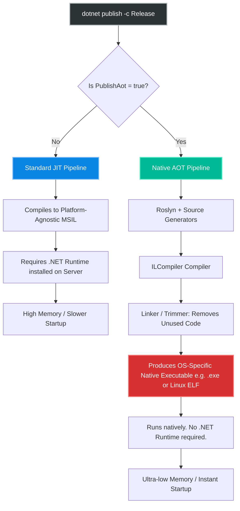

# 4.199 — Native AOT Compilation (NET 8+)

## PART 0 — Navigation & Context

```text
ASP.NET Core Domain Hierarchy
├── Advanced Middleware
│   ├── 4.198 Source Generators in ASP.NET Core
│   ├── 4.199 Native AOT Compilation (NET 8+) ◄ YOU ARE HERE
│   └── 4.200 Feature Flags & Microsoft.FeatureManagement
└── Deployment & Scalability
```

**What you need before this:**
- Understanding of what Source Generators are and how they replace Reflection [[4.198 — Source Generators in ASP.NET Core]].
- Strong familiarity with Minimal APIs [[4.188 — Minimal APIs Architecture (NET 6+)]].

**What this unlocks after:**
- Building hyper-optimized, serverless microservices for AWS Lambda or Azure Container Apps.
- Shrinking Docker container images down to ~10MB.
- Achieving sub-millisecond startup times ("Cold Starts").

**Why this matters to a production engineer at scale:**
Historically, .NET applications are compiled into Intermediate Language (IL/MSIL). When you run the application on a server, the .NET runtime (CoreCLR) loads into memory, reads the IL, and uses a Just-In-Time (JIT) compiler to convert the IL into native machine code (CPU instructions) on the fly. This architecture allows .NET code to run on Windows, Linux, and Mac perfectly.
However, JIT compilation is slow. It causes a massive CPU spike during application startup. Furthermore, the CoreCLR runtime is huge—it brings hundreds of megabytes of standard libraries and memory management code along with it. 
For a 10-year-old Monolith, this is fine. But in modern cloud architectures (like AWS Lambda or Kubernetes Serverless), applications are spun up and torn down constantly based on traffic. If your API takes 3 seconds to boot (Cold Start) and consumes 150MB of RAM just sitting idle, you are providing a terrible user experience and paying massive cloud computing bills.
In .NET 8, ASP.NET Core fully supports **Native AOT (Ahead-Of-Time) Compilation**. Native AOT completely skips the JIT phase. It compiles your C# code directly into a standalone, OS-specific machine executable (like C++ or Go). It removes the .NET runtime entirely, strips away unused code, resulting in APIs that start in 50 milliseconds, use less than 30MB of RAM, and require zero .NET installation on the host server.

---

## PART 1 — The Core Mental Model

> **The Fundamental Rule**
> **Native AOT takes your C# code and compiles it directly into a standalone OS-specific native executable. It completely eliminates the Just-In-Time (JIT) compiler and strips away any code that isn't explicitly used (Trimming). Because it requires absolute certainty of the code paths at compile time, it is fundamentally incompatible with dynamic Runtime Reflection.**

**The Plain-Language Analogy**
Imagine writing a book.
**JIT Compilation (Standard .NET):** You write the book in a universal shorthand language. You send the book to a bookstore in France. When a French reader buys the book, an interpreter sits next to them and translates the shorthand into French on the fly as they read. This is flexible (the same shorthand works in Germany or Japan), but it takes a long time to start reading, and you have to pay the interpreter to sit there.
**Native AOT (Ahead-Of-Time):** Before the book leaves your desk, you translate the entire thing perfectly into French and bind it. You ship the French book directly to the store. The reader opens it and reads it instantly. However, if a German person buys it, they can't read it. The book is permanently locked to French.

**The Taxonomy Diagram**



---

## PART 2 — Deep Mechanics

### 1. Trimming (The Shrink Ray)
The magic behind Native AOT is **Trimming**. Standard .NET includes libraries for everything—XML parsing, Windows Forms APIs, Cryptography. In AOT, the compiler performs static analysis. It traces exactly what methods your code calls. If your app never calls the XML parser, the Trimmer literally deletes the XML parser from the final executable. This reduces a 150MB .NET runtime down to a ~10MB executable.

### 2. The Reflection Ban
Trimming is exactly why Reflection breaks in Native AOT.
If you write: `Type.GetType(Console.ReadLine());`
The compiler has no idea what string the user will type at runtime. Therefore, it has no idea what classes it needs to keep in the executable. It assumes they are unused and trims them. When the user types "MyClass" at runtime, the app crashes with a `TypeLoadException` because "MyClass" was deleted by the compiler.
This is why **Source Generators** [[4.198]] are the mandatory foundation of Native AOT. Source Generators hardcode the reflection paths so the Trimmer can trace them statically.

### 3. OS-Specific Compilation
Unlike standard .NET (where a `.dll` runs on both Windows and Linux), Native AOT generates machine code. If you compile Native AOT on a Windows machine, the output is a `.exe`. That file will crash immediately if you copy it to a Linux server. To produce a Linux Native AOT executable, you must compile it ON a Linux machine (usually inside a Docker Multi-stage build) or use Cross-Compilation toolchains.

### 4. CreateSlimBuilder vs CreateBuilder
In .NET 8, `WebApplication.CreateBuilder(args)` is considered too bloated for AOT because it wires up dozens of middleware and event logs you probably don't need. Microsoft introduced `WebApplication.CreateSlimBuilder(args)` which registers ONLY the absolute minimum required to listen to HTTP requests, further reducing binary size and startup time.

---

## PART 3 — Production Code Patterns

### Pattern 1: The AOT csproj Configuration
Enabling Native AOT is primarily done in the project file.

```xml
<Project Sdk="Microsoft.NET.Sdk.Web">

  <PropertyGroup>
    <TargetFramework>net8.0</TargetFramework>
    <Nullable>enable</Nullable>
    <ImplicitUsings>enable</ImplicitUsings>
    
    <!-- ✅ THE MAGIC SWITCH -->
    <PublishAot>true</PublishAot>
    
    <!-- Optional: Strips debugging symbols to reduce file size further -->
    <StripSymbols>true</StripSymbols>
    
    <!-- Optional: Use the invariant culture to remove globalization data (dates/languages) -->
    <InvariantGlobalization>true</InvariantGlobalization>
  </PropertyGroup>

</Project>
```

### Pattern 2: The SlimBuilder Application
Writing an ASP.NET Core API strictly tailored for Native AOT.

```csharp
// Program.cs
using System.Text.Json.Serialization;

// 1. Use the SlimBuilder to minimize loaded dependencies
var builder = WebApplication.CreateSlimBuilder(args);

// 2. Register Source-Generated JSON Contexts (Mandatory for AOT)
builder.Services.ConfigureHttpJsonOptions(options =>
{
    options.SerializerOptions.TypeInfoResolverChain.Insert(0, AppJsonSerializerContext.Default);
});

var app = builder.Build();

var todosApi = app.MapGroup("/todos");

todosApi.MapGet("/", () => new[] { new Todo(1, "Walk dog") });

// Note: Ensure the route parameter 'id' is a value type that the generator understands
todosApi.MapGet("/{id}", (int id) => new Todo(id, "Do work"));

app.Run();

public record Todo(int Id, string Title);

// 3. The Source Generator Context
[JsonSerializable(typeof(Todo[]))]
[JsonSerializable(typeof(Todo))]
internal partial class AppJsonSerializerContext : JsonSerializerContext
{
}
```

### Pattern 3: Dockerizing for Native AOT (Alpine Linux)
Because the output is OS-specific, the standard approach is to use a Docker Multi-stage build. We compile the app using the heavy `.NET SDK` container, then copy *only* the single generated executable into an ultra-slim `Alpine Linux` container.

```dockerfile
# Stage 1: Build Environment
FROM mcr.microsoft.com/dotnet/sdk:8.0-alpine AS build
WORKDIR /app

# Install native C++ toolchain required for AOT compilation
RUN apk add clang build-base zlib-dev

# Copy code and publish
COPY . .
# The -r linux-musl-x64 targets Alpine's specific C library architecture
RUN dotnet publish -c Release -r linux-musl-x64 /p:PublishAot=true -o /out

# Stage 2: Runtime Environment (NO .NET INSTALLED HERE!)
# We use Alpine 'deps' image which is ~10MB total
FROM mcr.microsoft.com/dotnet/nightly/runtime-deps:8.0-alpine-aot AS runtime
WORKDIR /app

# Copy the single compiled executable from the build stage
COPY --from=build /out/MyAotApi .

# Expose port
EXPOSE 8080
ENV ASPNETCORE_URLS=http://+:8080

# Run the raw executable (not 'dotnet run')
ENTRYPOINT ["./MyAotApi"]
```
*Result: Your entire Docker image is ~15MB. It starts in 10ms.*

---

## PART 4 — Gotchas & Anti-Patterns

### Gotcha 1: Incompatible Libraries (Entity Framework Core)
This is the single biggest roadblock to adopting Native AOT.
**Entity Framework Core does NOT currently support Native AOT.** It relies too heavily on runtime reflection and dynamic proxy generation.

// ⚠️ WRONG CODE
```csharp
builder.Services.AddDbContext<AppDbContext>(...); // ❌ Fails at runtime in AOT
```

// HTTP consequence (wrong path):
// The compiler might actually let this build with Trimming warnings. But the moment you hit the API and EF Core tries to query the database, it crashes with `PlatformNotSupportedException` or `TypeLoadException`.

// ✅ CORRECT CODE
// In Native AOT, you must use data access libraries that are source-generated or reflection-free.
// - Dapper AOT (Preview)
// - Raw ADO.NET (SqlDataReader)
// - SQLite Native integrations

### Gotcha 2: MVC Controllers
As discussed in [[4.198]], MVC Controllers rely fundamentally on Reflection to bind routes and parse models.

// ⚠️ WRONG CODE
```csharp
[ApiController]
[Route("[controller]")]
public class UsersController : ControllerBase { ... } // ❌ Not AOT compatible
```

// THE GOTCHA:
// If you enable `<PublishAot>`, the compiler will immediately throw warnings for MVC components. You MUST use Minimal APIs with the Request Delegate Generator. 

### Gotcha 3: The JIT vs AOT Local Debugging Illusion
If you press "F5" or click the "Run" button in Visual Studio, you are **NOT** running Native AOT.

// THE GOTCHA:
// Visual Studio development heavily relies on the JIT compiler for Hot Reload, debugging, and Edit-and-Continue. If you run the app locally, it compiles via JIT, and it might work perfectly (e.g., using a reflection-based library).
// Then, you push to CI/CD, the build server runs `dotnet publish /p:PublishAot=true`, it compiles natively, and the app crashes in production.
// **Rule:** You must frequently test your app by running the actual `dotnet publish` command via CLI to catch Trimming warnings early.

### Gotcha 4: Ignoring Trimming Warnings
When you compile with `<PublishAot>`, the compiler will spit out yellow warnings like `IL2026: Members annotated with 'RequiresUnreferencedCodeAttribute' require dynamic access`.

// ⚠️ WRONG CODE
// Developer ignores the warning because "warnings aren't errors".

// HTTP consequence (wrong path):
// In AOT, a Trimming warning is basically a guaranteed runtime crash. If you ignore it, the application will compile, but when the specific code path is executed, it will throw an exception because the code was trimmed away. You MUST treat AOT compiler warnings as hard errors.

---

## PART 5 — Performance Implications

### Request Pipeline Characteristics

| Metric | JIT (CoreCLR) | Native AOT | Difference |
|---|---|---|---|
| Startup Time (Cold Start) | ~1500 ms | ~50 ms | 30x Faster |
| Idle Memory Usage | ~80 MB | ~15 MB | 5x Smaller |
| Docker Image Size | ~250 MB | ~20 MB | 10x Smaller |
| Sustained CPU Throughput | Excellent | Very Good | JIT can sometimes be slightly faster for sustained math because it optimizes based on actual runtime CPU instructions, whereas AOT is statically compiled. |
| Build Time | Fast | Very Slow | AOT compilation takes significantly longer (minutes) because it has to analyze the entire dependency graph. |

**When to Care:** 
Do **NOT** use Native AOT for a massive, legacy Monolithic web application. The conversion effort is immense, EF Core is broken, and Monoliths don't care about cold starts because they run 24/7.
Do **USE** Native AOT for:
- AWS Lambdas or Azure Functions (where you pay by the millisecond and cold starts ruin UX).
- Microservices running in Kubernetes with massive scale-out/scale-in events.
- Background worker processes (e.g., Kafka consumers) that need to run in ultra-cheap, low-memory 50MB containers.

---

## PART 6 — Interview Arsenal

### A. The Question Bank

**Question 1:** "Why does Native AOT compilation break Entity Framework Core and MVC Controllers?"
- **Average Answer:** "Because they use reflection."
- **Why That's Insufficient:** Doesn't explain the mechanism of Trimming and why reflection is fatal to it.
- **Great Answer:** "Native AOT relies on a process called Trimming to keep executable sizes small. The Trimmer performs static analysis on the codebase, tracing every explicit method call. If it doesn't see a class being used, it deletes it from the final binary. Reflection is dynamic; it looks up classes via strings at runtime. The compiler cannot predict what strings will be evaluated, so it trims away the classes EF Core and MVC need to function. When EF Core tries to dynamically instantiate a proxy or a model class at runtime, the application crashes because the class literally does not exist in the machine code."

**Question 2:** "What is the difference between standard JIT compilation and Native AOT in terms of OS compatibility?"
- **Average Answer:** "AOT is faster but harder to write."
- **Why That's Insufficient:** Ignores the fundamental shift from MSIL to Machine Code.
- **Great Answer:** "Standard JIT compilation compiles your C# into Intermediate Language (MSIL). That same `.dll` can be dragged onto a Windows server or a Linux server, and the locally installed .NET Runtime will JIT-compile it into machine code on the fly. Native AOT skips the runtime. It compiles the C# directly into OS-specific Machine Code. If you compile Native AOT on a Windows machine, the resulting `.exe` cannot run on Linux. To deploy to Linux, you must Cross-Compile or run the AOT build process inside a Linux Docker container."

**Question 3:** "If Native AOT is so much faster at startup and uses so much less memory, why isn't it the default for all ASP.NET Core applications?"
- **Average Answer:** "Because it breaks old libraries."
- **Why That's Insufficient:** Accurate, but lacks depth regarding the ecosystem and sustained throughput.
- **Great Answer:** "There are three main reasons. First, the ecosystem compatibility: massive libraries like EF Core and anything relying heavily on dynamic reflection currently do not work. Second, the development loop: AOT compilation is very slow, preventing rapid Hot Reload debugging, so developers still use JIT locally. Finally, sustained throughput: while AOT has incredible startup times, JIT compilation can sometimes achieve higher maximum throughput for long-running processes, because the JIT compiler can observe exactly how the specific server CPU is behaving at runtime and optimize loops dynamically, whereas AOT is statically locked at compile time."

### B. The Trick Questions

**Trick Question:** "I have a Minimal API. I enabled `PublishAot = true`. I press F5 in Visual Studio to debug it, and it hits my breakpoint. Am I debugging Native AOT code?"
- **The Trap:** Believing F5 triggers the AOT compiler.
- **The Correct Answer:** "No, you are debugging standard JIT-compiled code. Visual Studio's F5 debug profile ignores `PublishAot` to provide a fast inner-loop development experience. To actually test the AOT binary, you must execute `dotnet publish` from the command line and run the resulting executable."

### C. Red Flags to Avoid
- 🚩 **"We are migrating our legacy MVC Monolith to Native AOT to save money on Azure."** (This project will fail. The architectural rewrite required to strip out MVC, EF Core, and reflection-based Automapper will take years. AOT is for greenfield microservices).

---

## PART 7 — Decision Framework

```mermaid
graph TD
    A[New ASP.NET Core Service] --> B{What is the hosting environment?}
    
    B -->|Traditional VM / Long-running Pod| C[Standard JIT CoreCLR]
    B -->|Serverless e.g. AWS Lambda / Azure Container Apps| D{Are you willing to sacrifice EF Core?}
    
    D -->|No, EF Core is required| C
    D -->|Yes, can use Dapper/ADO.NET| E{Does the app use heavy dynamic reflection?}
    
    E -->|Yes| C
    E -->|No| F[Compile to Native AOT]
    
    F --> G[Use WebApplication.CreateSlimBuilder]
    G --> H[Use Source Generated System.Text.Json]
    H --> I[Deploy 20MB Docker Container]
    
    style A fill:#2d3436,stroke:#fff
    style C fill:#0984e3,stroke:#fff
    style F fill:#00b894,stroke:#fff
    style G fill:#00b894,stroke:#fff
    style H fill:#00b894,stroke:#fff
    style I fill:#00b894,stroke:#fff
```



---

## PART 8 — Self-Check

### A. Conceptual Questions
1. How does Native AOT differ from standard JIT compilation during application startup?
2. What is Trimming, and why is it dangerous if you use Reflection?
3. Why can't a Native AOT binary compiled on Windows be executed on Linux?
4. What is the purpose of `WebApplication.CreateSlimBuilder`?
5. Why are MVC Controllers strictly prohibited in Native AOT?
6. Which data access framework is completely incompatible with Native AOT in .NET 8?
7. How does Native AOT impact Docker container sizes?
8. What should you do if the compiler throws an `IL2026` Trimming Warning?

### B. Code Puzzles

**Puzzle 1: The Invisible JSON**
```csharp
app.MapPost("/data", (dynamic payload) => {
    Console.WriteLine(payload.UserId);
    return Results.Ok();
});
```
*Scenario:* You compile to Native AOT. Does this endpoint work?
<details>
<summary>Answer</summary>
No. The `dynamic` keyword inherently relies on the DLR (Dynamic Language Runtime) and Reflection to resolve properties at runtime. The AOT compiler cannot generate source code for a type it does not know. The build will likely fail with a warning, and if forced, it will crash at runtime. You must use strongly-typed objects with a Source Generator context.
</details>

**Puzzle 2: The Multi-Stage Mystery**
```dockerfile
FROM mcr.microsoft.com/dotnet/sdk:8.0 AS build
RUN dotnet publish -c Release /p:PublishAot=true -o /out

FROM mcr.microsoft.com/dotnet/aspnet:8.0 AS runtime
COPY --from=build /out/MyApp .
ENTRYPOINT ["dotnet", "MyApp.dll"]
```
*Scenario:* This Dockerfile fundamentally misunderstands Native AOT. Identify the two major flaws.
<details>
<summary>Answer</summary>
1. The `runtime` stage uses `aspnet:8.0`. This image contains the massive 200MB CoreCLR runtime. AOT apps do not need the .NET runtime! It should use `runtime-deps:8.0` or `alpine` base OS images.
2. The `ENTRYPOINT` uses `dotnet MyApp.dll`. Native AOT produces a raw executable (e.g., `MyApp` without an extension on Linux). You do not use the `dotnet` CLI to run it. It should simply be `ENTRYPOINT ["./MyApp"]`.
</details>

**Puzzle 3: The Broken DI**
```csharp
Type myServiceType = Type.GetType(Configuration["ServiceName"]);
builder.Services.AddSingleton(typeof(IService), myServiceType);
```
*Scenario:* What happens when this AOT compiled app tries to boot up?
<details>
<summary>Answer</summary>
It crashes instantly. `Type.GetType(string)` attempts to locate a class dynamically. Because the AOT compiler didn't explicitly see the class referenced in the code, it trimmed it away. `myServiceType` returns null, and the DI container throws an `ArgumentNullException`.
</details>

---

## PART 9 — Connections & Resources

### A. Related Topics Table

| Topic | Why It Connects |
|---|---|
| [[4.198 — Source Generators in ASP.NET Core]] | The tools required to make code AOT compatible by eliminating reflection. |
| [[4.188 — Minimal APIs Architecture (NET 6+)]] | The only API architecture style supported by Native AOT. |

### B. Books

| Book | Chapters | Why These Chapters |
|---|---|---|
| Pro ASP.NET Core 6 | (Does not cover AOT) | *Note: Native AOT for ASP.NET Core was finalized in .NET 8, so books published before 2023 will not cover this. Rely on online documentation.* |

### C. Essential Articles & Docs
- [Microsoft Docs: ASP.NET Core Native AOT](https://learn.microsoft.com/en-us/aspnet/core/fundamentals/native-aot)
- [Microsoft Docs: Introduction to Trimming](https://learn.microsoft.com/en-us/dotnet/core/deploying/trimming/trimming-options)
- [Nick Chapsas: "Native AOT in .NET 8"](https://www.youtube.com/watch?v=1) (Highly recommended video breakdown).

> [!NOTE]
> **Template Meta-Note**
> Part 0: Context & Prerequisites. Part 1: Core Mental Model. Part 2: Deep Mechanics & Pipeline. Part 3: Production Code. Part 4: Gotchas. Part 5: Performance. Part 6: Interview Arsenal. Part 7: Decision Framework. Part 8: Puzzles. Part 9: Resources.
