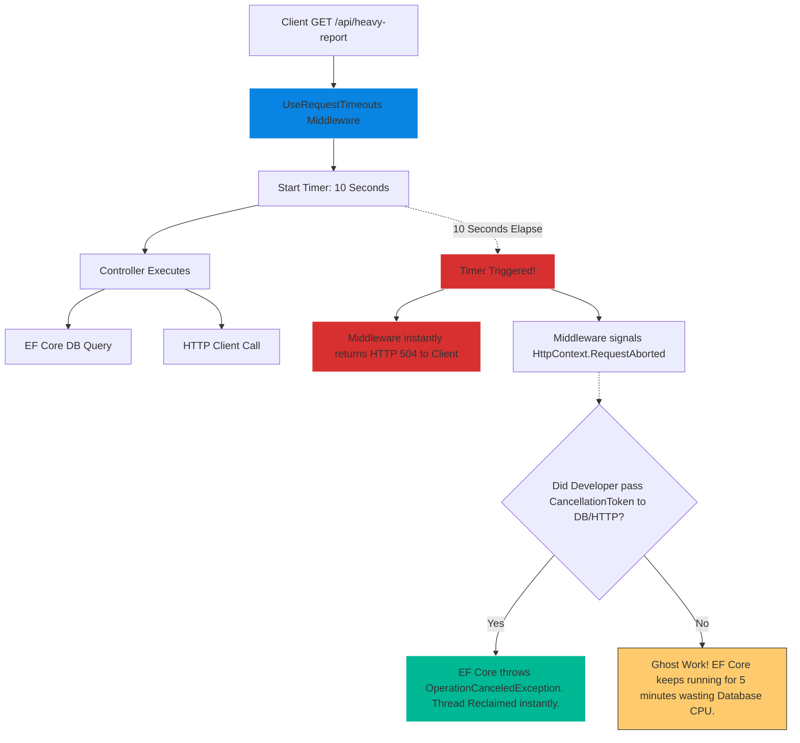

# 4.199 — Request Timeouts (.NET 8): IHttpRequestTimeoutFeature

## PART 0 — Navigation & Context

```text
ASP.NET Core Domain Hierarchy
├── Cross-Cutting Concerns
│   ├── Error Handling Pipeline
│   └── Request Lifecycle Management
│       ├── 4.117 CancellationToken
│       ├── 4.202 Rate Limiting
│       └── 4.199 Request Timeouts (.NET 8) ◄ YOU ARE HERE
```

**What you need before this:**
- Absolute mastery of `CancellationToken` and how ASP.NET Core surfaces `HttpContext.RequestAborted` [[4.117 — Async Actions and CancellationToken: Preventing Ghost Work]].
- Understanding of HTTP Status Codes, specifically Gateway Timeouts (504).
- Understanding of the Middleware Pipeline ordering [[4.049 — The Middleware Pipeline: Execution Flow and Terminology]].

**What this unlocks after:**
- Building bulletproof, self-healing microservices that aggressively protect their own Thread Pools from downstream dependency failures.
- Harmonizing server-side timeouts with client-side Polly resilience policies.

**Why this matters to a production engineer at scale:**
A junior engineer writes a Controller action that queries a third-party Reporting API. Usually, it takes 200ms. One day, the Reporting API has a database lock issue. Requests start taking 5 minutes to complete. 
Because the ASP.NET Core server has no default request timeout, it willingly waits 5 minutes. If 1,000 users click the "Generate Report" button, 1,000 threads in Kestrel's Thread Pool are now blocked, waiting for the dead 3rd party API. Kestrel runs out of threads. The entire ASP.NET Core application completely halts. The health check endpoint fails, and Kubernetes restarts the pod.
To fix this prior to .NET 8, you had to write complex custom middleware using `CancellationTokenSource.CancelAfter`. It was fragile. 
In **.NET 8**, Microsoft introduced native Request Timeouts. You simply define a policy ("Max 5 seconds"). If the request takes longer than 5 seconds, the middleware instantly returns an **HTTP 504 Gateway Timeout** to the load balancer, fires the `RequestAborted` cancellation token, and reclaims the thread. Your app survives.

---

## PART 1 — The Core Mental Model

> **The Fundamental Rule**
> **`.NET 8 Request Timeouts` allow you to enforce strict execution time limits on HTTP requests via Policies. When a request exceeds the configured time, the `UseRequestTimeouts` middleware immediately short-circuits, returning a configurable status code (default HTTP 504 Gateway Timeout). 
> CRITICALLY: Returning the 504 does NOT automatically kill your background code. The middleware signals `HttpContext.RequestAborted`. Your Controller/Service code MUST observe this `CancellationToken` and pass it to EF Core or HttpClient, otherwise your code will continue running as a "Ghost Process", burning CPU long after the user received the 504.**

**The Plain-Language Analogy**
Imagine a Restaurant Kitchen (The Server).
A waiter hands a complex 10-course order to a Chef (The Request).
**Without Timeouts:** The Chef starts cooking. The stove breaks. The Chef stands there staring at the cold stove for 3 hours. The customer goes home, but the Chef is still standing there, ignoring all new orders.
**With Timeouts:** The Kitchen Manager (`UseRequestTimeouts`) sets a timer for 30 minutes. If the food isn't ready in 30 minutes, the Manager walks out and tells the customer, "Sorry, kitchen failure" (HTTP 504). 
**The Catch:** The Manager ALSO yells into the kitchen, "ABORT ORDER 5!" (`RequestAborted` token). If the Chef is wearing noise-canceling headphones (ignoring the Cancellation Token), the Chef will STILL stand there for 3 hours cooking a meal nobody is going to eat, wasting ingredients (Server CPU).

**The Taxonomy Diagram**



---

## PART 2 — Deep Mechanics

### 2.1 — Configuration and Pipeline
To enable timeouts, you must register the services, add the middleware, and define policies.

```csharp
// 1. Service Registration
builder.Services.AddRequestTimeouts(options =>
{
    // A global fallback policy applied to all endpoints
    options.DefaultPolicy = new RequestTimeoutPolicy
    {
        Timeout = TimeSpan.FromSeconds(30),
        TimeoutStatusCode = StatusCodes.Status504GatewayTimeout
    };
    
    // A specific named policy for heavy operations
    options.AddPolicy("HeavyReport", TimeSpan.FromMinutes(2));
});

var app = builder.Build();

app.UseRouting();
// 2. MUST be after UseRouting so it can evaluate Endpoint Metadata
app.UseRequestTimeouts(); 
app.UseAuthentication();
```

### 2.2 — Applying Policies to Endpoints
You can apply specific policies to Minimal APIs or MVC Controllers.

**Minimal APIs:**
```csharp
app.MapGet("/api/reports", async (CancellationToken ct) => { ... })
   .WithRequestTimeout("HeavyReport");
```

**MVC Controllers:**
```csharp
[HttpGet]
[RequestTimeout("HeavyReport")]
public async Task<IActionResult> GenerateReport(CancellationToken ct) { ... }
```

### 2.3 — The `IHttpRequestTimeoutFeature`
Under the hood, the middleware injects an interface into the `HttpContext.Features` collection. This allows advanced scenarios, like dynamically changing or disabling the timeout from *within* the controller action.

```csharp
[HttpGet]
public IActionResult ProcessData()
{
    var timeoutFeature = HttpContext.Features.Get<IHttpRequestTimeoutFeature>();
    
    // If the user is an admin, remove the timeout limit completely
    if (User.IsInRole("Admin"))
    {
        timeoutFeature?.DisableTimeout();
    }
    
    return Ok();
}
```

---

## PART 3 — Production Code Patterns

### Pattern 1: The Bulletproof Database Query
Setting the timeout policy is useless if you don't pass the token. You must plumb the `CancellationToken` all the way down to the I/O boundary.

```csharp
// The CancellationToken parameter here is automatically bound to HttpContext.RequestAborted
app.MapGet("/api/users", async (AppDbContext db, CancellationToken ct) =>
{
    // When the 5-second timeout hits, the middleware returns 504.
    // The 'ct' is instantly canceled.
    // EF Core catches the cancellation, kills the SQL query, and throws TaskCanceledException.
    // The server thread is safely returned to the Thread Pool.
    var users = await db.Users.ToListAsync(ct);
    
    return Results.Ok(users);
}).WithRequestTimeout(TimeSpan.FromSeconds(5)); 
// Inline policy for rapid configuration
```

### Pattern 2: Custom Timeout Callbacks
Sometimes you want to log a specific telemetry event, or write a custom Problem Details JSON payload when a timeout occurs, instead of just returning a blank 504.

```csharp
builder.Services.AddRequestTimeouts(options =>
{
    options.DefaultPolicy = new RequestTimeoutPolicy
    {
        Timeout = TimeSpan.FromSeconds(10),
        TimeoutStatusCode = 504,
        
        // This callback fires exactly when the timer expires
        WriteTimeoutResponse = async (HttpContext context) =>
        {
            var problem = new ProblemDetails
            {
                Title = "Request Timeout",
                Status = 504,
                Detail = "The server took too long to process the request."
            };
            
            context.Response.ContentType = "application/problem+json";
            await context.Response.WriteAsJsonAsync(problem);
        }
    };
});
```

### Pattern 3: Disabling Timeouts for File Uploads
If you have a global 30-second timeout policy, users on slow 3G connections uploading 50MB video files will experience a 504 Timeout every single time. You must explicitly disable timeouts on ingestion endpoints.

```csharp
[HttpPost("upload")]
[DisableRequestTimeout] // Ignores the DefaultPolicy
public async Task<IActionResult> UploadVideo()
{
    // process stream...
}
```

---

## PART 4 — Gotchas & Anti-Patterns

### Gotcha 1: The "Ghost Work" Illusion
// ⚠️ FATAL ANTI-PATTERN
```csharp
app.MapGet("/api/calculate", async () => {
    await Task.Delay(10000); // Does NOT accept a token
    return "Done";
}).WithRequestTimeout(TimeSpan.FromSeconds(2));
```
**Scenario:** A client hits this endpoint. After 2 seconds, the client receives a 504 Gateway Timeout. The developer assumes the thread was killed.
**Reality:** The `Task.Delay` (or a heavy synchronous CPU loop) continues running in the background for the full 10 seconds. The server's CPU is still burning. The middleware *only* ends the HTTP Response; it cannot violently kill a C# thread. You MUST pass `CancellationToken` everywhere.

### Gotcha 2: Pipeline Placement Order
If you place `UseRequestTimeouts` *before* `UseRouting`, the middleware doesn't know which Endpoint is being invoked. It cannot read the `[RequestTimeout("MyPolicy")]` attributes. It will only apply the `DefaultPolicy`.
**Fix:** Always place `UseRequestTimeouts` between `UseRouting` and your endpoints.

### Gotcha 3: 504 vs 408 Status Codes
Many developers incorrectly configure timeouts to return **HTTP 408 Request Timeout**.
According to the HTTP specification:
- **408 Request Timeout:** The *Client* took too long to send the Request Body to the server (e.g., a slow upload).
- **504 Gateway Timeout:** The *Server* (acting as a gateway/worker) took too long to generate the response (e.g., a slow database).
ASP.NET Core's internal server (Kestrel) handles 408s natively at the connection level. The `.NET 8` Timeout middleware is designed for *application logic* taking too long, hence the default is **504 Gateway Timeout**.

### Gotcha 4: Debugger Interference
If you attach a Visual Studio debugger and hit a breakpoint inside a controller action, the clock keeps ticking. 30 seconds later, the middleware triggers a timeout, aborts the request, and messes up your debugging session.
**Fix:** The middleware intentionally detects if a debugger is attached (`Debugger.IsAttached`). If true, it automatically ignores all timeout policies. Do not be confused if timeouts "don't work" while debugging locally.

---

## PART 5 — Performance Implications

### Request Pipeline Characteristics

| Scenario | Server CPU Impact | Thread Pool Impact | Client Latency |
|---|---|---|---|
| Runaway Query (No Timeout) | Minimal | **Catastrophic (Starvation)** | 5 Minutes (Client Hangs) |
| Timeout Triggered (No Token passed) | Minimal | **Catastrophic (Ghost Work)** | 5 Seconds (Gets 504) |
| Timeout Triggered (Token Passed) | Minimal | **Zero (Thread Reclaimed)** | 5 Seconds (Gets 504) |

**Performance Verdict:**
The `UseRequestTimeouts` middleware adds negligible overhead (it uses highly optimized `CancellationTokenSource.CancelAfter` timers). Its value is infinite. By enforcing hard boundaries on request execution length and strictly propagating cancellation tokens, you inoculate your application against Thread Pool Starvation, which is the #1 cause of API downtime under load.

---

## PART 6 — Interview Arsenal

### A. The Question Bank

**Question 1:** "In .NET 8, if we apply a 5-second Request Timeout policy to an endpoint, and the database query takes 10 seconds, what exactly happens at the 5-second mark?"
- **Average Answer:** "The server stops the code and returns a timeout error."
- **Why That's Insufficient:** Believes C# threads can be violently killed.
- **Great Answer:** "At the 5-second mark, the Request Timeout middleware intercepts the response stream and immediately sends an HTTP 504 Gateway Timeout back to the client. Simultaneously, it triggers the `HttpContext.RequestAborted` cancellation token. However, it does NOT stop the code execution automatically. The C# code will continue running as 'Ghost Work' unless the developer explicitly passed that cancellation token into the Entity Framework database query. If they did, EF catches the cancellation, throws an exception, and safely aborts the SQL query."

**Question 2:** "Why shouldn't you return an HTTP 408 Status Code from the Request Timeouts middleware?"
- **Average Answer:** "Because 504 is the default."
- **Why That's Insufficient:** Ignores HTTP Semantics.
- **Great Answer:** "Because it violates HTTP semantics. HTTP 408 'Request Timeout' means the client was too slow in transmitting the incoming request payload over the network. HTTP 504 'Gateway Timeout' means the server accepted the request, but the upstream application logic (or database) took too long to formulate a response. The middleware handles application logic timeouts, so 504 is the correct semantic code."

**Question 3:** "If we have a slow endpoint that processes massive file uploads, the new global Request Timeout policy is causing all uploads to fail with a 504. How do we fix this without increasing the global timeout for the rest of the API?"
- **Average Answer:** "Just remove the global timeout policy."
- **Why That's Insufficient:** Destroys global safety for one edge case.
- **Great Answer:** "You should keep the global default policy to protect standard CRUD endpoints. For the specific file upload endpoint, you can either apply the `[DisableRequestTimeout]` attribute to turn off timeouts completely for that route, or apply a specific `[RequestTimeout("FileUploadPolicy")]` that allows a much longer duration, such as 30 minutes, giving the upload time to complete."

### B. The Trick Questions

**Trick Question:** "I configured the Timeout middleware for 10 seconds. I put a `Thread.Sleep(20000)` in my controller. I tested it via Postman, but my API returned HTTP 200 OK after 20 seconds. The middleware completely failed to trigger. Why?"
- **The Trap:** Not understanding the development environment safety rails.
- **The Correct Answer:** "You were running the application with the Visual Studio Debugger attached. The .NET 8 Request Timeouts middleware checks `System.Diagnostics.Debugger.IsAttached`. If a debugger is present, it entirely disables the timeout logic so that developers can pause execution on breakpoints without the server returning a 504 underneath them. To test timeouts, run the app using Ctrl+F5 (Start Without Debugging)."

### C. Red Flags to Avoid
- 🚩 **"I don't use Server Timeouts because our Frontend React app uses an Axios timeout of 10 seconds. If it takes longer, the UI shows an error anyway."** (Client-side timeouts only protect the Client. If React aborts the connection, but your ASP.NET Core API isn't tracking `RequestAborted`, the server continues processing the heavy database query. A malicious user can trigger a DDoS attack by spamming requests and immediately dropping the connection, rapidly starving your server's Thread Pool).

---

## PART 7 — Decision Framework

```mermaid
graph TD
    A[Designing Timeout Resilience] --> B{Does the endpoint rely on external I/O? e.g., DB or HTTP Calls}
    
    B -->|No - pure CPU| C[Timeouts protect against infinite loops]
    
    B -->|Yes| D[Timeouts prevent Thread Pool Starvation]
    D --> E[Configure AddRequestTimeouts DefaultPolicy]
    
    E --> F{Is the endpoint an ingestion/upload route?}
    
    F -->|Yes| G[Use DisableRequestTimeout attribute]
    
    F -->|No| H{Does the route need more time than default?}
    
    H -->|Yes| I[Create specific Policy and use WithRequestTimeout]
    H -->|No| J[Rely on DefaultPolicy]
    
    J --> K[CRITICAL: Pass CancellationToken to all async I/O methods]
    I --> K
    
    style A fill:#2d3436,stroke:#fff
    style E fill:#0984e3,stroke:#fff
    style G fill:#fdcb6e,stroke:#333
    style I fill:#00b894,stroke:#fff
    style J fill:#00b894,stroke:#fff
    style K fill:#d63031,stroke:#fff
```



---

## PART 8 — Self-Check

### A. Conceptual Questions
1. What HTTP Status Code does the Timeout middleware return by default?
2. Why is passing the `CancellationToken` essential when using this middleware?
3. Where must `UseRequestTimeouts` be placed in relation to `UseRouting`?
4. What is the semantic difference between HTTP 408 and HTTP 504?
5. How can you dynamically disable a timeout from within a Controller action?
6. Why does the middleware disable itself when the Visual Studio Debugger is attached?
7. Explain what "Ghost Work" means in the context of ASP.NET Core request cancellation.
8. How can you execute custom logic (like writing a custom JSON error) when a timeout occurs?

### B. Code Puzzles

**Puzzle 1: The Misplaced Middleware**
```csharp
app.UseRequestTimeouts();
app.UseRouting();
app.MapGet("/api/data", () => "Data").WithRequestTimeout("Fast");
```
*Scenario:* The "Fast" policy defines a 1-second timeout. The endpoint takes 5 seconds, but never times out. Why?
<details>
<summary>Answer</summary>
`UseRequestTimeouts` is placed *before* `UseRouting`. When the timeout middleware executes, the framework hasn't matched the URL to the `/api/data` endpoint yet. Therefore, it cannot see the endpoint-specific `WithRequestTimeout("Fast")` metadata. It will fallback to the default policy, or do nothing if no default exists. Swap the order.
</details>

**Puzzle 2: The Immortal Background Task**
```csharp
app.MapPost("/process", async (CancellationToken ct) => {
    _ = Task.Run(async () => await _db.DoHeavyWorkAsync(ct));
    return Results.Accepted();
}).WithRequestTimeout(TimeSpan.FromSeconds(5));
```
*Scenario:* The endpoint returns `202 Accepted` instantly. However, the background task occasionally throws `OperationCanceledException` and fails to complete. Why?
<details>
<summary>Answer</summary>
The developer passed the HTTP request's `CancellationToken` (`ct`) into a background `Task.Run`. When the HTTP response completes and returns `202 Accepted`, Kestrel finishes the request lifecycle and triggers the cancellation token. Because the background task is still using that exact same token, it gets violently canceled. Never pass HTTP-bound cancellation tokens to fire-and-forget background tasks.
</details>

**Puzzle 3: The Custom Response Override**
```csharp
options.DefaultPolicy = new RequestTimeoutPolicy {
    Timeout = TimeSpan.FromSeconds(5),
    WriteTimeoutResponse = async context => {
        context.Response.StatusCode = 200;
        await context.Response.WriteAsync("Took too long, but here is a 200 OK!");
    }
};
```
*Scenario:* Is this allowed? What happens to the client?
<details>
<summary>Answer</summary>
It is allowed, but it is a horrific anti-pattern. You are intercepting a server timeout and lying to the client by returning HTTP 200 OK. Automated clients (like Polly or API Gateways) will see the 200 OK, assume the operation succeeded, and fail to trigger their retry logic. Always return 5xx codes for server-side timeouts.
</details>

---

## PART 9 — Connections & Resources

### A. Related Topics Table

| Topic | Why It Connects |
|---|---|
| [[4.117 — Async Actions and CancellationToken: Preventing Ghost Work]] | The absolute prerequisite for this feature. The middleware simply triggers the token; the developer must obey it. |
| [[4.049 — The Middleware Pipeline: Execution Flow and Terminology]] | Dictates the architectural placement of the `UseRequestTimeouts` middleware. |
| [[4.177 — Exception Handling Middleware: UseExceptionHandler and Error Pipelines]] | Differentiates between unexpected code crashes (500) and forced timeout aborts (504). |

### B. Books

| Book | Chapters | Why These Chapters |
|---|---|---|
| Pro ASP.NET Core 8 | Chapter: Advanced Middleware | Covers the newly introduced .NET 8 middleware features including Timeouts. |
| Release It! | Chapter 4: Timeouts | The definitive theoretical explanation of why every single external call in a distributed system must have a strict timeout limit. |

### C. Essential Articles & Docs
- [Microsoft Docs: Request timeouts middleware in ASP.NET Core](https://learn.microsoft.com/en-us/aspnet/core/performance/timeouts)
- [Microsoft DevBlogs: Announcing .NET 8 Preview 4 (Request Timeouts)](https://devblogs.microsoft.com/dotnet/announcing-dotnet-8-preview-4/#request-timeouts)

> [!NOTE]
> **Template Meta-Note**
> Part 0: Context & Prerequisites. Part 1: Core Mental Model. Part 2: Deep Mechanics & Pipeline. Part 3: Production Code. Part 4: Gotchas. Part 5: Performance. Part 6: Interview Arsenal. Part 7: Decision Framework. Part 8: Puzzles. Part 9: Resources.
