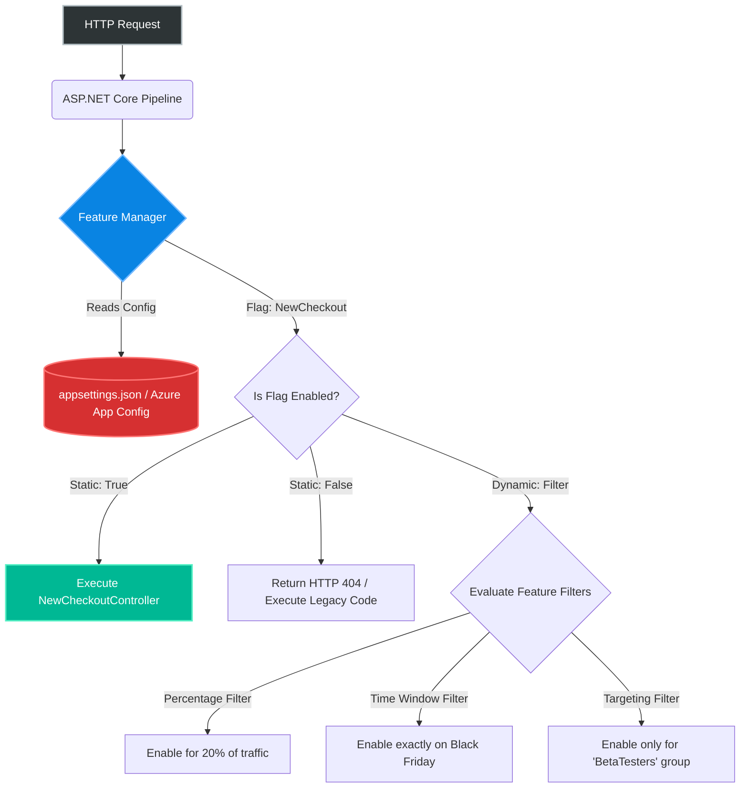

# 4.200 — Feature Flags & Microsoft.FeatureManagement

## PART 0 — Navigation & Context

```text
ASP.NET Core Domain Hierarchy
├── Advanced Middleware
│   ├── 4.198 Source Generators in ASP.NET Core
│   ├── 4.199 Native AOT Compilation (NET 8+)
│   ├── 4.200 Feature Flags & Microsoft.FeatureManagement ◄ YOU ARE HERE
└── DevOps & Deployment
```

**What you need before this:**
- Understanding of how `appsettings.json` and the Options Pattern work [[4.040 — IConfiguration & Options Pattern]].
- Basic knowledge of Dependency Injection.

**What this unlocks after:**
- Implementing Trunk-Based Development and continuous deployment pipelines.
- Running A/B Testing natively in ASP.NET Core.
- Safely rolling out massive architectural changes (like switching database providers) without downtime.

**Why this matters to a production engineer at scale:**
In amateur development, you write a feature, merge it to `main`, and deploy it to production. If the feature has a critical bug, the entire application crashes, and you have to scramble to roll back the database and redeploy the old code while customers complain.
In enterprise development (Trunk-Based Development), code is deployed to production constantly—even if it's half-finished. How? **Feature Flags**.
A Feature Flag is a conditional toggle that hides or enables code paths dynamically at runtime without requiring a redeployment. If a new feature breaks in production, you simply flip a switch in a database (or Azure App Configuration), and the broken feature is instantly disabled.
Microsoft provides an official, immensely powerful library called `Microsoft.FeatureManagement`. It integrates deeply into the ASP.NET Core routing pipeline, allowing you to turn entire API endpoints on or off, route specific percentage brackets of users to new code (Canary Releases), or restrict features to specific user groups (Beta Testers). 

---

## PART 1 — The Core Mental Model

> **The Fundamental Rule**
> **A Feature Flag is an abstraction over configuration. `Microsoft.FeatureManagement` evaluates these flags at runtime using `IFeatureManager`. It determines if a feature is enabled statically (true/false) or dynamically through "Feature Filters" (e.g., Target 50% of users, or Enable between specific dates).**

**The Plain-Language Analogy**
Imagine building a new wing of a museum.
**Without Feature Flags:** You close the entire museum for a year while you build the wing. When it's finally done, you open the doors. If the roof collapses, the whole museum is ruined.
**With Feature Flags:** You build the wing while the museum is open, but you put a locked door in front of it. The code is in production, but the public can't see it. The museum director (The Feature Manager) holds the key. They unlock the door for 10% of visitors (Percentage Filter). If everything goes well, they unlock it for everyone. If a visitor spots a leak, the director locks the door instantly (Disable Flag). The rest of the museum remains completely unaffected.

**The Taxonomy Diagram**



---

## PART 2 — Deep Mechanics

### 1. `IFeatureManager` vs `IConfiguration`
Why not just use `_config.GetValue<bool>("FeatureA")`?
Because simple configuration doesn't support context. `IFeatureManager` intercepts the request, reads the configuration, and then executes **Feature Filters**. A filter can look at the incoming HTTP Request context, inspect the user's JWT, see that they belong to the "Admin" group, and return `true` for that specific user, while returning `false` for everyone else. Raw configuration cannot do this.

### 2. Feature Filters
Microsoft provides several built-in filters:
- `PercentageFilter`: Randomly enables the feature for X% of requests.
- `TimeWindowFilter`: Enables the feature between a StartDate and EndDate.
- `TargetingFilter`: (The most powerful) Hashes the current User ID or Group ID to consistently enable the feature for a specific subset of your user base.

### 3. Deep ASP.NET Core Integration
Feature Management isn't just `if/else` statements in your code. It integrates directly into the Endpoint Routing engine via the `[FeatureGate]` attribute. If a user tries to hit a Controller where the feature is disabled, the routing engine drops the request and returns an HTTP 404 Not Found before any MVC model binding or authorization even executes.

---

## PART 3 — Production Code Patterns

### Pattern 1: Basic Setup and Boolean Flags
The simplest implementation using `appsettings.json`.

```bash
dotnet add package Microsoft.FeatureManagement.AspNetCore
```

```json
// appsettings.json
{
  "FeatureManagement": {
    "NewCheckoutSystem": true,
    "BetaDashboard": false
  }
}
```

```csharp
// Program.cs
builder.Services.AddFeatureManagement();

// The Controller
[ApiController]
[Route("[controller]")]
public class CheckoutController : ControllerBase
{
    private readonly IFeatureManager _featureManager;

    public CheckoutController(IFeatureManager featureManager)
    {
        _featureManager = featureManager;
    }

    [HttpPost]
    public async Task<IActionResult> Process()
    {
        // Procedural branching in code
        if (await _featureManager.IsEnabledAsync("NewCheckoutSystem"))
        {
            return Ok(await RunFastCheckoutAsync());
        }
        else
        {
            return Ok(await RunLegacyCheckoutAsync());
        }
    }
}
```

### Pattern 2: The FeatureGate Attribute (Routing Level)
Instead of `if/else` logic, completely disable endpoints at the routing level.

```csharp
[ApiController]
[Route("api/dashboard")]
// ✅ CORRECT: If "BetaDashboard" is false, this entire controller returns HTTP 404
[FeatureGate("BetaDashboard")]
public class BetaDashboardController : ControllerBase
{
    [HttpGet]
    public IActionResult Get() => Ok("Welcome to the Beta!");
}
```
*Note: You can apply `[FeatureGate]` to specific methods, or entire classes.*

### Pattern 3: Feature Filters (A/B Testing with Percentage)
Enabling a feature for 50% of requests to test if the new database query is faster.

```json
// appsettings.json
{
  "FeatureManagement": {
    "OptimizedQuery": {
      "EnabledFor": [
        {
          "Name": "Percentage",
          "Parameters": {
            "Value": 50 // 50% of requests get this feature
          }
        }
      ]
    }
  }
}
```

```csharp
// Program.cs
// You MUST explicitly register the built-in filters you intend to use
builder.Services.AddFeatureManagement()
                .AddFeatureFilter<PercentageFilter>();
```

### Pattern 4: User Targeting (Canary Releases)
You want to roll out a feature ONLY to users in the "Beta" group, or a specific User ID. This requires integrating the `TargetingFilter` with your HTTP Context.

```csharp
// 1. Implement ITargetingContextAccessor so the library knows WHO the current user is
public class HttpTargetingContextAccessor : ITargetingContextAccessor
{
    private readonly IHttpContextAccessor _httpContextAccessor;

    public HttpTargetingContextAccessor(IHttpContextAccessor accessor) 
        => _httpContextAccessor = accessor;

    public ValueTask<TargetingContext> GetContextAsync()
    {
        var user = _httpContextAccessor.HttpContext?.User;
        var groups = user?.Claims.Where(c => c.Type == "Group").Select(c => c.Value);

        return new ValueTask<TargetingContext>(new TargetingContext
        {
            UserId = user?.Identity?.Name ?? "anonymous",
            Groups = groups ?? Enumerable.Empty<string>()
        });
    }
}

// 2. Program.cs
builder.Services.AddHttpContextAccessor();
builder.Services.AddSingleton<ITargetingContextAccessor, HttpTargetingContextAccessor>();
builder.Services.AddFeatureManagement()
                .AddFeatureFilter<TargetingFilter>();
```

```json
// 3. appsettings.json
// This config enables the feature for 100% of the "BetaTesters" group, 
// User "JohnDoe", and 20% of everyone else!
{
  "FeatureManagement": {
    "NewUI": {
      "EnabledFor": [
        {
          "Name": "Targeting",
          "Parameters": {
            "Audience": {
              "Users": ["JohnDoe"],
              "Groups": [ { "Name": "BetaTesters", "RolloutPercentage": 100 } ],
              "DefaultRolloutPercentage": 20
            }
          }
        }
      ]
    }
  }
}
```

---

## PART 4 — Gotchas & Anti-Patterns

### Gotcha 1: The Config Reload Latency
Developers use `appsettings.json` for Feature Flags, deploy the app, and then change the JSON file on the server to flip the flag.

// THE GOTCHA:
// Standard `appsettings.json` is monitored for changes by ASP.NET Core, but depending on the hosting environment (like Docker or Kubernetes), file-system change notifications often fail. The app might not reload the configuration, requiring a full Pod restart to apply the flag.

// ✅ CORRECT ARCHITECTURE:
// For true enterprise Feature Management, do NOT use `appsettings.json` as your source of truth. Use a central control plane like **Azure App Configuration** or **LaunchDarkly**. The ASP.NET Core library integrates natively with Azure App Configuration, actively polling the cloud provider and updating flags across 50 load-balanced servers instantly without rebooting anything.

### Gotcha 2: Percentage Filter Stickiness
You enable a feature for 50% of traffic. User A hits the site and gets the new feature. They refresh the page and suddenly get the old feature.

// HTTP consequence (wrong path):
// The basic `PercentageFilter` evaluates per-request randomly. It does not remember the user. This causes a jarring, broken UX as the UI flickers between versions on every click.

// ✅ CORRECT CODE
// If the feature affects the UX, you MUST use the `TargetingFilter` with a `DefaultRolloutPercentage`, not the `PercentageFilter`. The `TargetingFilter` mathematically hashes the `UserId`. If User A's hash falls into the 50% bucket, they will *always* get the feature, no matter how many times they refresh.

### Gotcha 3: Technical Debt Accumulation
Feature flags are essentially technical debt masquerading as agility.

// ⚠️ WRONG CODE
```csharp
if (await _fm.IsEnabledAsync("OldFeature2022")) { ... }
if (await _fm.IsEnabledAsync("OldFeature2023")) { ... }
if (await _fm.IsEnabledAsync("NewFeature2024")) { ... }
```

// THE GOTCHA:
// Once a feature is rolled out to 100% of users and is stable, the flag becomes obsolete. If developers forget to delete the `if/else` blocks and the legacy code, the codebase quickly becomes a labyrinth of dead execution paths.
// **Rule:** Feature Flags must have an expiration date. Once a Canary Release hits 100%, create a Jira ticket to explicitly remove the `IFeatureManager` check and delete the legacy code branch.

### Gotcha 4: Missing the FeatureGate Fallback
If you apply `[FeatureGate("NewApi")]` to a Controller, and the flag is false, ASP.NET Core returns an empty HTTP 404.

// THE GOTCHA:
// If a mobile app expects a JSON response, an empty 404 might crash the app's JSON parser.
// **Fix:** You can configure the `FeatureManagement` options to route disabled features to a specific fallback endpoint or return a custom standard error payload.

---

## PART 5 — Performance Implications

### Request Pipeline Characteristics

| Feature Method | Performance Impact | Why |
|---|---|---|
| Static Boolean Flag | Zero | Simple dictionary lookup in configuration. |
| TimeWindow Filter | Minimal | Date comparison. |
| Targeting Filter | Moderate | Requires hashing the string UserId and checking claims. |
| Azure App Config Sync| Network Latency | If misconfigured to poll on every request. Must use caching/background polling. |

### The Scope Problem
`IFeatureManager` looks up configuration asynchronously. If you execute `await _featureManager.IsEnabledAsync()` inside a `for` loop of 10,000 items, you will incur massive overhead.
Evaluate the flag ONCE at the top of the request, assign it to a boolean, and pass that boolean down into your business logic.

---

## PART 6 — Interview Arsenal

### A. The Question Bank

**Question 1:** "We want to roll out a massive database schema change. We want to test it in production, but only for our internal employees. If it fails, we want to revert it instantly without redeploying the application. How do we architect this?"
- **Average Answer:** "Check their email address in an if statement."
- **Why That's Insufficient:** Hardcodes logic. Requires a redeploy to change the audience or remove the check.
- **Great Answer:** "We should use the `Microsoft.FeatureManagement` library. We wrap the new database schema logic behind an `IFeatureManager.IsEnabledAsync(\"NewDbSchema\")` check. We configure this flag using a `TargetingFilter` in Azure App Configuration (or appsettings). We set the filter to enable the flag only for the 'Employee' AD Group. The code is deployed to production, but normal customers safely hit the legacy code. If the new schema fails for employees, a DevOps engineer simply logs into Azure, flips the flag to 'False', and the application instantly routes employees back to the legacy code—zero redeployments or restarts required."

**Question 2:** "Why shouldn't you use a `PercentageFilter` for testing a new UI layout on an e-commerce site?"
- **Average Answer:** "Because 50% isn't accurate."
- **Why That's Insufficient:** Misses the UX stickiness problem entirely.
- **Great Answer:** "The standard `PercentageFilter` calculates probability on a per-request basis. If you set it to 50%, a user might see the new UI on the homepage, click a product, and suddenly be reverted to the old UI on the next request, resulting in a broken user experience. For UX changes, you must use a `TargetingFilter` configured with a `DefaultRolloutPercentage`. The targeting filter hashes the user's persistent identifier (like a Session ID or User ID), ensuring that if they fall into the 'enabled' bucket, they remain in that bucket consistently across all subsequent requests."

**Question 3:** "If you apply `[FeatureGate("NewFeature")]` to an API endpoint, what happens when a client makes a request to it while the flag is disabled?"
- **Average Answer:** "It throws an exception."
- **Why That's Insufficient:** It doesn't throw. It intercepts routing.
- **Great Answer:** "The `[FeatureGate]` attribute integrates directly with ASP.NET Core Endpoint Routing. If the flag is evaluated to false, the routing middleware effectively pretends the endpoint does not exist. It short-circuits the pipeline before Model Binding or Action Execution occurs, and returns an HTTP 404 Not Found (or a custom configured fallback action) to the client."

### B. The Trick Questions

**Trick Question:** "I have a background worker (IHostedService) that checks `_featureManager.IsEnabledAsync()` every 5 seconds. Does it support the `TargetingFilter`?"
- **The Trap:** Conflating Web Request contexts with Background contexts.
- **The Correct Answer:** "It will likely crash or return false. The `TargetingFilter` requires an `ITargetingContextAccessor` to know 'who' the user is. In an API, this is wired up to the `HttpContext`. A background service has no HTTP Request, no headers, and no `HttpContext`. If you evaluate a targeting filter in a background thread, the context is null, and the filter fails. Background services should rely on static boolean flags or TimeWindow filters."

### C. Red Flags to Avoid
- 🚩 **"I use Feature Flags for application settings like 'MaxPageSize = 50'."** (Feature Flags are toggles (On/Off). They dictate *Code Paths*. Values like Page Sizes, Connection Strings, or API Keys should be managed by the standard `IOptions<T>` pattern, not Feature Management).

---

## PART 7 — Decision Framework

```mermaid
graph TD
    A[New Code Development] --> B{Does it require changes to UX or major backend logic?}
    
    B -->|No, minor bug fix| C[Deploy directly]
    B -->|Yes| D[Wrap in IFeatureManager flag]
    
    D --> E{How should it be rolled out?}
    
    E -->|Instantly to everyone| F[Static Boolean Flag]
    E -->|Only to specific users / Canary| G[Targeting Filter]
    E -->|On a specific future date| H[Time Window Filter]
    
    F --> I{Did it crash?}
    I -->|Yes| J[Disable config in Azure App Config. Instantly resolves.]
    I -->|No| K[Wait 2 weeks, then delete the flag & legacy code from C#.]
    
    style A fill:#2d3436,stroke:#fff
    style D fill:#00b894,stroke:#fff
    style G fill:#0984e3,stroke:#fff
    style J fill:#d63031,stroke:#fff
    style K fill:#00b894,stroke:#fff
```



---

## PART 8 — Self-Check

### A. Conceptual Questions
1. How does `IFeatureManager` fundamentally differ from `IConfiguration`?
2. What is Trunk-Based Development, and how do Feature Flags enable it?
3. What happens if you hit an endpoint decorated with `[FeatureGate]` when the flag is disabled?
4. What is the difference between a `PercentageFilter` and a `TargetingFilter` set to 50%?
5. Why are Feature Flags considered Technical Debt if left unchecked?
6. How does Azure App Configuration enhance ASP.NET Core Feature Management compared to standard `appsettings.json`?
7. What interface must you implement to tell the library who the current user is for Targeting filters?
8. Why should you avoid checking `IsEnabledAsync` inside a high-frequency `for` loop?

### B. Code Puzzles

**Puzzle 1: The Missing Filter**
```csharp
// Program.cs
builder.Services.AddFeatureManagement();
```
```json
"FeatureManagement": {
  "Beta": { "EnabledFor": [ { "Name": "TimeWindow" } ] }
}
```
*Scenario:* The code executes `await _featureManager.IsEnabledAsync("Beta")`. It crashes with an exception. Why?
<details>
<summary>Answer</summary>
While the configuration is correct, you MUST explicitly register the filter class in the DI container. The developer forgot to call `.AddFeatureFilter<TimeWindowFilter>()` during startup. Without it, the Feature Manager cannot resolve the logic to evaluate the JSON configuration.
</details>

**Puzzle 2: The Logic Maze**
```csharp
if (await _fm.IsEnabledAsync("NewTaxCalc")) {
    if (await _fm.IsEnabledAsync("IncludeVat")) {
        return CalculateNewTaxWithVat();
    }
    return CalculateNewTax();
}
return CalculateOldTax();
```
*Scenario:* What architectural issue is being created here?
<details>
<summary>Answer</summary>
Feature Flag nesting. This creates an exponential explosion of testing matrices. To verify this code, QA now has to test 4 different system states in production. Feature flags should be binary entry points, not deeply nested business logic rules. Keep them flat and mutually exclusive.
</details>

**Puzzle 3: The Background Targeting**
```csharp
public class Worker : BackgroundService {
    protected override async Task ExecuteAsync(CancellationToken token) {
        if (await _fm.IsEnabledAsync("UseNewLogic")) { ... }
    }
}
```
*Scenario:* `UseNewLogic` is configured using a `TargetingFilter` in appsettings. What is the result?
<details>
<summary>Answer</summary>
The evaluation fails (often returning false). The Targeting Filter requires an `ITargetingContextAccessor`, which is almost always wired up to the `IHttpContextAccessor` to read the JWT of the user making the web request. A `BackgroundService` has no HTTP request and no user. It evaluates into a void.
</details>

---

## PART 9 — Connections & Resources

### A. Related Topics Table

| Topic | Why It Connects |
|---|---|
| [[4.040 — IConfiguration & Options Pattern]] | Feature Management is an abstraction layer built directly on top of the underlying ASP.NET Core Configuration providers. |
| [[4.050 — Writing Middleware]] | Explains where the routing short-circuit happens when a `[FeatureGate]` attribute blocks a request. |

### B. Books

| Book | Chapters | Why These Chapters |
|---|---|---|
| DevOps Handbook (Gene Kim) | Chapter 11 | The theory and immense business value behind Trunk-Based development and Feature Toggles. |
| ASP.NET Core in Action, 3rd Ed | (Not heavily covered) | Rely on official docs. |

### C. Essential Articles & Docs
- [Microsoft Docs: Feature Management in ASP.NET Core](https://learn.microsoft.com/en-us/azure/azure-app-configuration/use-feature-flags-dotnet-core)
- [Martin Fowler: Feature Toggles (aka Feature Flags)](https://martinfowler.com/articles/feature-toggles.html) (The definitive architectural theory guide).

> [!NOTE]
> **Template Meta-Note**
> Part 0: Context & Prerequisites. Part 1: Core Mental Model. Part 2: Deep Mechanics & Pipeline. Part 3: Production Code. Part 4: Gotchas. Part 5: Performance. Part 6: Interview Arsenal. Part 7: Decision Framework. Part 8: Puzzles. Part 9: Resources.
