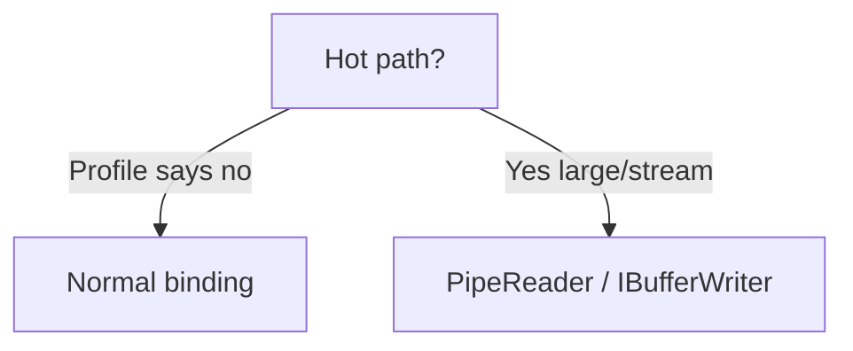

> [!success] Mastery Check
> - [ ] **Studied Well**
> - [ ] **Can explain the concept without notes**
> - [ ] **Can answer interview questions confidently**
> - [ ] **Can implement it in a real project**

# 4.200 — Minimal Allocation in Hot Paths: PipeReader and Zero-Copy Patterns

---

## PART 0 — Navigation & Context

High-throughput APIs (>50k req/s) and large upload/download paths must avoid per-request `byte[]` LOH allocations.

**Prerequisites:** [[4.130]], [[4.120]], `Span<T>` / `Memory<T>`

**Why it matters:** Default `Stream` buffering allocates new arrays per read — GC pauses inflate P99 latency while HTTP status stays **200**; Kestrel's `PipeReader` exposes `ReadOnlySequence<byte>` for segment-wise parsing without copying.

---

## PART 1 — Core Mental Model

> **Kestrel exposes `HttpContext.Request.BodyReader` (`PipeReader`) yielding `ReadOnlySequence<byte>` segments backed by pooled buffers — parsers walk segments with `SequenceReader` or `PipeReader.CopyToAsync` to `IBufferWriter<byte>` on the response, avoiding full-body `byte[]` materialization that `ReadToEndAsync` and naive JSON binding cause on large payloads.**

### Analogy

**Conveyor belt segments** (`ReadOnlySequence`) vs **repacking every item into a new box** (`new byte[size]` per read).

---

## PART 2 — Deep Mechanics

### 2.1 — Pipeline Position

```
Kestrel receives bytes
    → PipeReader (before/instead of full model bind)
    → Custom parser OR JsonSerializer.DeserializeAsync(stream)
    → Endpoint logic
    → IBufferWriter / PipeWriter response
```

### 2.2 — PipeReader Loop

```csharp
public static async Task<int> CountJsonArrayElementsAsync(PipeReader reader, CancellationToken ct)
{
    int count = 0;
    while (true)
    {
        ReadResult result = await reader.ReadAsync(ct);
        ReadOnlySequence<byte> buffer = result.Buffer;

        var sequenceReader = new SequenceReader<byte>(buffer);
        while (sequenceReader.TryRead(out byte b))
        {
            if (b == (byte)'{') count++; // simplified demo
        }

        reader.AdvanceTo(buffer.End);
        if (result.IsCompleted) break;
    }
    return count;
}
```

**Cost:** **Zero-copy** within segments; `AdvanceTo` returns buffers to pool.

### 2.3 — Anti-Pattern

```csharp
// ⚠️ WRONG hot path:
using var ms = new MemoryStream();
await context.Request.Body.CopyToAsync(ms);
var bytes = ms.ToArray(); // full copy + LOH
```

```
// HTTP still 200 — but P99 latency 3× under load due to GC
```

### 2.4 — Response Zero-Copy

```csharp
await httpContext.Response.StartAsync(ct);
var writer = httpContext.Response.BodyWriter;
// write to writer.GetMemory() / Advance
await writer.FlushAsync(ct);
```

### 2.5 — When Model Binding Is Fine

Typical small DTO POST — `System.Text.Json` with pooled buffers is sufficient; optimize when profiling shows Gen2 pressure.

---

## PART 3 — Production Patterns

### Pattern 1: Logistics — streaming CSV upload parse

`PipeReader` line-by-line without loading 500MB file.

### Pattern 2: Fintech — webhook signature verify on raw sequence

Read span slices for HMAC without string alloc.

### Pattern 3: ✅ `JsonSerializer.DeserializeAsync(Request.Body)` — uses UTF-8 stream, not always full buffer

### Pattern 4: `ArrayPool<byte>.Shared` when copy unavoidable

### Pattern 5: `ReadOnlySequence<byte>` extension methods for delimiters

### Pattern 6: BenchmarkDotNet before rewriting binding

### Pattern 7: gRPC already optimized — don't duplicate on REST small payloads

---

## PART 4 — Gotchas

1. Not calling `reader.AdvanceTo` — memory leak in pipe.
2. Holding `ReadOnlySequence` after next `ReadAsync` — invalid memory.
3. `EnableBuffering()` copies for replay — needed for signature verify but allocates.
4. Premature optimization on 2KB JSON bodies.
5. Async state machines still allocate — zero-copy ≠ zero allocation overall.

---

## PART 5 — Performance

| Approach | Alloc per 1MB body |
|---|---|
| ReadToEndAsync | ~1MB+ |
| PipeReader parse | pooled segments |
| DeserializeAsync stream | moderate |

---

## PART 6 — Interview

> Kestrel exposes PipeReader with ReadOnlySequence bytes from pooled buffers. I parse in-place with SequenceReader instead of copying to byte array. For responses I use BodyWriter. I only do this on hot paths profiling showed GC pressure — small DTOs use normal model binding. HTTP semantics unchanged — latency and throughput improve.

---

## PART 7 — Decision Framework



---

## PART 8 — Puzzle

Forgot `reader.AdvanceTo` after ReadAsync — symptom?

<details><summary>Answer</summary>Memory growth / OOM under sustained load — same HTTP 200 until process dies.</details>

---

## PART 9 — [Kestrel large requests](https://learn.microsoft.com/en-us/aspnet/core/fundamentals/middleware/request-decompression); [[4.120]], [[4.130]].

> [!NOTE] PipeReader, ReadOnlySequence, zero-copy hot paths; GC vs HTTP.
