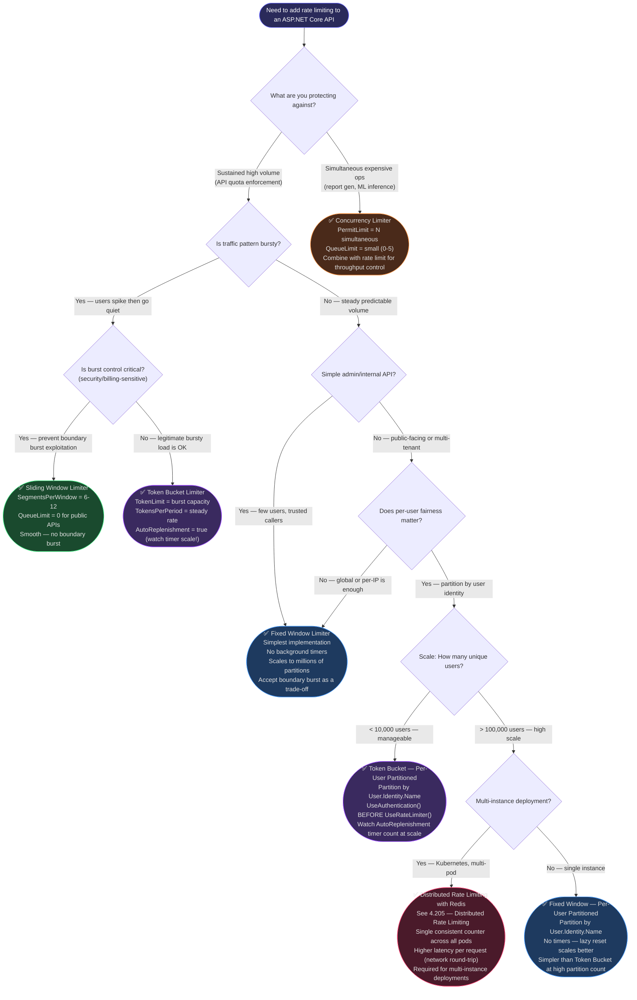

> [!success] Mastery Check
> - [ ] **Studied Well**
> - [ ] **Can explain the concept without notes**
> - [ ] **Can answer interview questions confidently**
> - [ ] **Can implement it in a real project**


# 4.202 — Rate Limiting (.NET 7+): Fixed Window, Sliding Window, Token Bucket, Concurrency

---

## PART 0 — Navigation & Context

### Where This Sits in the ASP.NET Core Hierarchy

```
ASP.NET Core Mastery
└── Security & Stability Layer
    ├── Authentication (4.134)
    ├── Authorization (4.135)
    ├── CORS (4.209)
    ├── HTTPS & HSTS
    └── ► RATE LIMITING (4.202)  ◄── YOU ARE HERE
        ├── Partitioning: Per-User, Per-IP, Per-API-Key (4.203)
        ├── OnRejected & Custom 429 Responses (4.204)
        └── Distributed Rate Limiting with Redis (4.205)

Cross-cutting concerns that interact with Rate Limiting:
├── Middleware Pipeline (4.049) — ordering determines what runs before RL
├── Authentication Architecture (4.134) — auth must complete before user-partitioned RL
└── Minimal API Route Groups — .RequireRateLimiting() applied at group scope
```

### What You Need Before This

| Prerequisite | Why It Matters Here |
|---|---|
| [[4.049 — The Middleware Pipeline: Request Delegation Chain]] | Rate limiting middleware must be positioned correctly; it must run before endpoints but after routing |
| [[4.134 — Authentication Architecture]] | User-identity-based rate limiting requires auth to have already run and populated `HttpContext.User` |
| [[4.209 — CORS: UseCors]] | OPTIONS preflight requests must bypass rate limiting or be counted separately — strategy choice matters |
| HTTP fundamentals (status codes, headers) | Understanding 429 vs 503, Retry-After header semantics, and what clients should do |

### What This Unlocks After

| Next Topic | How This Is a Prerequisite |
|---|---|
| [[4.203 — Rate Limiting Partitioning: Per-User, Per-IP, Per-API-Key]] | Partitioning is a layer on top of the algorithm choice made here |
| [[4.204 — Rate Limiting: OnRejected and Custom 429 Responses]] | OnRejected only makes sense once you understand when the limiter triggers rejection |
| [[4.205 — Distributed Rate Limiting with Redis]] | Redis-backed limiting uses the same four algorithms; the distributed aspect is an add-on to this knowledge |

### Why This Topic Matters at Scale

> At high request volume, the difference between an API that degrades gracefully under attack and one that crashes is a correctly configured rate limiter placed at the right position in the middleware pipeline — protecting downstream infrastructure (databases, payment processors, third-party APIs) from overload without requiring a separate API gateway.

---

## PART 1 — The Core Mental Model

### The Fundamental Rule

> **ASP.NET Core's rate limiting middleware (.NET 7+) intercepts every HTTP request before it reaches an endpoint, checks a per-policy token counter against a configured limit, and either allows the request to pass to `next()` or short-circuits with a configurable rejection response — the default being HTTP 503 Service Unavailable, not 429 Too Many Requests. The algorithm choice (Fixed Window, Sliding Window, Token Bucket, Concurrency) determines how the counter refills and what bursty traffic looks like from the client's perspective.**

### The Plain-Language Analogy

Think of the rate limiter as a **turnstile at a subway station during rush hour** — but one with four different mechanical designs:

- **Fixed Window** turnstile: the gate resets every 60 seconds on the clock. If 100 people pass at second 59, 100 more can pass at second 61. The burst at the window boundary is the gotcha.
- **Sliding Window** turnstile: it tracks a rolling 60-second window based on *when each person passed*, not the clock. Far smoother — no burst at reset boundaries — but requires more bookkeeping per user (segment counters).
- **Token Bucket** turnstile: there is a bucket of tokens; each person takes one token to pass. Tokens drip back in at a fixed rate. You can burst (empty the bucket fast) but once empty you wait for tokens. The bucket size controls maximum burst.
- **Concurrency** turnstile: this is not about speed — it is a bouncer with a headcount. Exactly N people may be inside at once. The moment someone exits, another enters. Perfect for protecting expensive operations regardless of how long they take.

The analogy holds for the concurrent-request case: if a payment report takes 30 seconds and concurrency is set to 10, request 11 arrives and waits in queue (or is immediately rejected) even if no window has been exceeded.

### The Taxonomy Diagram

```mermaid
graph TD
    RL["Rate Limiting (.NET 7+)"]:::infra

    RL --> REG["Registration"]:::infra
    REG --> AddRL["services.AddRateLimiter()"]:::infra
    REG --> UseRL["app.UseRateLimiter()"]:::infra

    RL --> ALGOS["Algorithms"]:::handling
    ALGOS --> FW["Fixed Window"]:::handling
    ALGOS --> SW["Sliding Window"]:::handling
    ALGOS --> TB["Token Bucket"]:::handling
    ALGOS --> CON["Concurrency"]:::handling

    RL --> APPLY["Application Points"]:::security
    APPLY --> GLOBAL["Global Policy"]:::security
    APPLY --> ATTR["[EnableRateLimiting]"]:::security
    APPLY --> EXATTR["[DisableRateLimiting]"]:::security
    APPLY --> MINAPI["RequireRateLimiting()"]:::security
    APPLY --> GRPSCOPE["Route Group Scope"]:::security

    RL --> REJECT["Rejection Behavior"]:::output
    REJECT --> HTTP503["Default: 503 Service Unavailable"]:::output
    REJECT --> HTTP429["Custom: 429 Too Many Requests"]:::output
    REJECT --> RETRYAFTER["Retry-After Header"]:::output
    REJECT --> OnRejected["OnRejected Callback"]:::output

    RL --> QUEUE["Queue Behavior"]:::handling
    QUEUE --> QL["QueueLimit > 0: requests wait"]:::handling
    QUEUE --> QL0["QueueLimit = 0: immediate reject"]:::handling
    QUEUE --> QORDER["QueueProcessingOrder"]:::handling

    RL --> PARTITION["Partitioning (4.203)"]:::security
    RL --> DIST["Distributed / Redis (4.205)"]:::security

    classDef infra fill:#1e3a5f,stroke:#4a9eff,color:#e0e0e0
    classDef handling fill:#1a4a2e,stroke:#4aef8a,color:#e0e0e0
    classDef security fill:#4a1a1a,stroke:#ef4a4a,color:#e0e0e0
    classDef output fill:#3a2a0a,stroke:#efb84a,color:#e0e0e0
```



---

## PART 2 — Deep Mechanics

### 2.1 — Middleware Registration and Pipeline Position

#### Pipeline Position

```
Incoming HTTP Request
        │
        ▼
┌──────────────────────┐
│  ExceptionHandler    │  ← catches unhandled exceptions from downstream
└──────────┬───────────┘
           │
           ▼
┌──────────────────────┐
│  HSTS / HTTPS Redir  │
└──────────┬───────────┘
           │
           ▼
┌──────────────────────┐
│  StaticFiles         │  ← short-circuits for static assets (bypasses RL)
└──────────┬───────────┘
           │
           ▼
┌──────────────────────┐
│  Routing             │  ← MUST run before RL so endpoint metadata is available
└──────────┬───────────┘
           │
           ▼
┌──────────────────────┐
│  CORS (UseCors)      │  ← preflight OPTIONS should be handled here, before RL
└──────────┬───────────┘
           │
           ▼
┌══════════════════════╗
║  UseRateLimiter()    ║  ◄── RATE LIMITING MIDDLEWARE (YOU ARE HERE)
╚══════════╤═══════════╝   Reads endpoint metadata for policy selection
           │               Acquires lease from IRateLimiter
           │               On rejection: calls OnRejected, short-circuits
           ▼
┌──────────────────────┐
│  Authentication      │  ← NOTE: RL by user identity needs auth BEFORE RL
└──────────┬───────────┘
           │
           ▼
┌──────────────────────┐
│  Authorization       │
└──────────┬───────────┘
           │
           ▼
┌──────────────────────┐
│  Endpoints           │  ← MVC controllers, Minimal APIs, etc.
└──────────────────────┘
```

> [!WARNING]
> **Critical ordering issue:** `UseRouting()` **must** come before `UseRateLimiter()` because the rate limiter reads `IEndpointFeature` from the `HttpContext` to determine which policy applies to the current endpoint. If routing has not run yet, endpoint metadata (including `[EnableRateLimiting]` attributes) is unavailable, and the global fallback policy is applied — or no policy at all.

> [!WARNING]
> **Auth before rate limiting for user-partitioned limits:** If your rate limiting policy partitions by authenticated user identity (e.g., `context.HttpContext.User.Identity?.Name`), `UseAuthentication()` **must** run before `UseRateLimiter()`. The default ordering above shows authentication *after* rate limiting — this is correct only when partitioning by IP address or API key (from headers, not identity). For user-identity partitioning, invert the order.

#### Registration Code

```csharp
// Program.cs — Payment API
// ✅ CORRECT: UseRouting → UseRateLimiter → UseAuthentication (for IP-partitioned policies)
// ⚠️ WRONG for user-partitioned policies — see Gotcha 1

var builder = WebApplication.CreateBuilder(args);

builder.Services.AddRateLimiter(options =>
{
    // Global default policy — applies when no specific policy is named
    options.GlobalLimiter = PartitionedRateLimiter.Create<HttpContext, string>(context =>
        RateLimitPartition.GetFixedWindowLimiter(
            partitionKey: context.Connection.RemoteIpAddress?.ToString() ?? "unknown",
            factory: _ => new FixedWindowRateLimiterOptions
            {
                PermitLimit = 200,
                Window = TimeSpan.FromMinutes(1),
                QueueLimit = 0, // immediate rejection on exceed
                QueueProcessingOrder = QueueProcessingOrder.OldestFirst,
            }));

    // 429 instead of 503 — see Part 3 Pattern 1 for full implementation
    options.OnRejected = async (context, cancellationToken) =>
    {
        context.HttpContext.Response.StatusCode = 429;
        await context.HttpContext.Response.WriteAsync(
            "Too many requests. Please try again later.", cancellationToken);
    };
});

var app = builder.Build();

app.UseExceptionHandler("/error");
app.UseHsts();
app.UseHttpsRedirection();
app.UseStaticFiles();
app.UseRouting();      // ← MUST be before UseRateLimiter
app.UseCors();         // ← handle OPTIONS preflight before rate limiting
app.UseRateLimiter();  // ← rate limiting checks happen here
app.UseAuthentication();
app.UseAuthorization();
app.MapControllers();

app.Run();
```

**Cost label:** `UseRateLimiter()` itself: ~1 allocation per request for the `RateLimitLease` object. The lease acquisition involves an async path when `QueueLimit > 0` (one `ValueTask` per queued request). For `QueueLimit = 0`, the hot path is synchronous and near-zero overhead for most algorithms.

#### HTTP Wire Format — Rejected Request

```http
// HTTP request (approximate — client exceeding rate limit):
POST /api/payments/initiate HTTP/1.1
Host: api.payments.example.com
Authorization: Bearer eyJhbGci...
Content-Type: application/json
Content-Length: 312

{"amount": 9999, "currency": "USD", "recipient": "acc_123"}

// HTTP response (default behavior — UseRateLimiter without OnRejected customization):
HTTP/1.1 503 Service Unavailable
Content-Length: 0
Date: Sun, 08 Jun 2026 00:21:54 GMT

// HTTP response (with OnRejected customized to 429):
HTTP/1.1 429 Too Many Requests
Content-Type: text/plain; charset=utf-8
Retry-After: 45
Content-Length: 36
Date: Sun, 08 Jun 2026 00:21:54 GMT

Too many requests. Please try again later.
```

> [!IMPORTANT]
> The framework defaults to **503 Service Unavailable**, not 429 Too Many Requests. This is a deliberate choice — 503 means "service is overloaded" (appropriate for a concurrency limiter or a global overload scenario). 429 means "you specifically have exceeded your quota." Use `OnRejected` to customize based on which policy was triggered. Always include `Retry-After` in 429 responses — it is a contract with clients.

#### ASP.NET Core Internally (approximate)

```
RateLimitingMiddleware.InvokeAsync:
  1. Get endpoint from HttpContext.GetEndpoint()
  2. Look for IRateLimiterPolicy metadata on endpoint
  3. If found: use named policy; else: use GlobalLimiter
  4. Check [DisableRateLimiting] attribute — if present, call next() directly
  5. Call limiter.AcquireAsync(permitCount: 1, cancellationToken)
  6. If lease.IsAcquired == true → call next(context), then lease.Dispose()
  7. If lease.IsAcquired == false → invoke OnRejected, set response, return
     (does NOT call next())
```

Source: `Microsoft.AspNetCore.RateLimiting.RateLimitingMiddleware` in `aspnetcore/src/Middleware/RateLimiting/src/RateLimitingMiddleware.cs`

---

### 2.2 — Fixed Window Algorithm: Mechanics and Edge Cases

#### What It Does

The Fixed Window limiter divides time into discrete, non-overlapping intervals (windows). A counter tracks how many requests have been permitted in the current window. At the start of each new window, the counter resets to zero.

```
Time →  0s        60s       120s      180s
        │         │         │         │
Window: [====W1====][====W2====][====W3====]
        │         │
        PermitLimit=100 per window
        
Request stream (bursty):
  t=58s: requests 91-100 admitted (W1 counter: 100 → FULL)
  t=59s: request 101 → REJECTED (W1 at limit)
  t=60s: W2 RESETS → request 102 admitted (counter: 1)
  t=61s: requests 103-201 admitted in 1 second (burst at window boundary!)
  
The boundary burst problem:
  100 requests in last 2s of W1 + 100 requests in first 2s of W2
  = 200 requests in a 4-second window — double the intended rate
```

#### Configuration

```csharp
// Fixed Window — suitable for internal service-to-service APIs
// where smooth rate distribution is not critical
builder.Services.AddRateLimiter(options =>
{
    options.AddFixedWindowLimiter("OrderIngestion", o =>
    {
        o.PermitLimit = 500;                        // max requests per window
        o.Window = TimeSpan.FromMinutes(1);          // window duration
        o.QueueLimit = 50;                          // requests that wait if limit exceeded
        o.QueueProcessingOrder = QueueProcessingOrder.OldestFirst; // FIFO queue
    });
});
```

**Internal representation:** A single `long` counter (`Interlocked.Increment` for thread safety) plus a `DateTimeOffset` for the next reset time. Reset is lazy — checked on each request arrival, not on a background timer. ~0 allocations per request on the fast path (counter not exceeded, no queue).

**Cost label:** O(1) per request — single atomic counter check. `~0 allocations` on success path. `~1 allocation` for rejection response.

#### HTTP Wire Format — Fixed Window Success

```http
// HTTP request (within limit):
GET /api/orders?status=pending&page=1 HTTP/1.1
Host: api.orders.example.com
Authorization: Bearer eyJhbGci...

// HTTP response (admitted):
HTTP/1.1 200 OK
Content-Type: application/json; charset=utf-8
Content-Length: 4821

{"orders": [...], "total": 142, "page": 1}

// No rate limit headers added by default — must be added manually in OnRejected or via middleware
```

#### Edge Case: The Window Boundary Burst

> [!WARNING]
> **The double-rate problem at window reset:** An adversarial or bursty client can send `PermitLimit` requests just before the window resets AND another `PermitLimit` just after — effectively 2× the intended rate in a short burst. This is the primary reason Sliding Window exists. For public-facing APIs where burst control matters, use Sliding Window or Token Bucket instead.

---

### 2.3 — Sliding Window Algorithm: Mechanics and Edge Cases

#### What It Does

Sliding Window divides the window into `SegmentsPerWindow` equal-duration segments. Instead of resetting the entire counter, it slides the window forward one segment at a time, subtracting the count from the segment that just expired and adding capacity for new requests.

```
Window = 60s, SegmentsPerWindow = 6 (each segment = 10s)

Time →  0s   10s   20s   30s   40s   50s   60s   70s   80s
        [S1 ][S2 ][S3 ][S4 ][S5 ][S6 ][S7 ][S8 ][S9 ]

At t=70s (evaluating for new request):
  Active segments: S2(70s ago→10s ago) through S7(10s ago→now)
  S1's count is now outside the sliding window — subtracted from total
  
  Total = S2+S3+S4+S5+S6+S7 counts
  If Total < PermitLimit → admit; else reject
  
No burst at segment boundary because only 1/6 of the window resets at once.
```

#### Configuration

```csharp
// Sliding Window — for user-facing order management API
// where smooth rate distribution prevents boundary bursts
builder.Services.AddRateLimiter(options =>
{
    options.AddSlidingWindowLimiter("OrderQuery", o =>
    {
        o.PermitLimit = 100;                    // max requests in any 60-second window
        o.Window = TimeSpan.FromMinutes(1);
        o.SegmentsPerWindow = 6;               // 6 × 10s segments
        o.QueueLimit = 10;
        o.QueueProcessingOrder = QueueProcessingOrder.OldestFirst;
    });
});
```

**Internal representation:** An array of `long[]` with length `SegmentsPerWindow`. Each request increments the current segment's counter. On window advancement, the oldest segment count is removed from the total. Background timer (or lazy evaluation on request) advances segments.

**Cost label:** O(1) per request — same atomic counter approach but across `SegmentsPerWindow` slots. Memory: `SegmentsPerWindow × 8 bytes` per partition. With 1 million users each having a partition, 6-segment sliding window = 48 MB overhead per `SegmentsPerWindow=6`. Factor this into capacity planning.

> [!NOTE]
> Sliding Window still has a boundary effect but it is **1/N as severe** as Fixed Window, where N = `SegmentsPerWindow`. With 6 segments, the maximum burst at any boundary is `PermitLimit / 6` extra requests, not `PermitLimit`. At 12 segments, the window approaches true sliding behavior at the cost of double the segment array memory.

#### HTTP Wire Format — Sliding Window Comparison

```http
// Fixed Window: 100 requests at t=59s, then 100 more at t=61s
// → 200 requests in ~2 seconds allowed. Burst through.

// Sliding Window (SegmentsPerWindow=6): at t=61s, the counter includes
// the 100 from t=59s (still in the window), so new requests are rejected
// until old ones age out of segments.

// Wire result when sliding window rejects:
HTTP/1.1 429 Too Many Requests
Retry-After: 9
Content-Type: application/json

{"error": "Rate limit exceeded", "retryAfter": 9}
```

---

### 2.4 — Token Bucket Algorithm: Mechanics and Edge Cases

#### What It Does

The Token Bucket maintains a bucket of tokens. Each request consumes one (or more) tokens. Tokens are replenished at a fixed rate (`TokensPerPeriod` every `ReplenishmentPeriod`). The bucket has a maximum capacity (`TokenLimit`). Requests may burst up to the bucket size, then are limited to the refill rate.

```
TokenLimit = 20, TokensPerPeriod = 5, ReplenishmentPeriod = 1s

Bucket state over time:
  t=0s:  [████████████████████] 20 tokens (full)
  t=0s:  Burst: 20 requests arrive → 20 tokens consumed
         [                    ] 0 tokens
  t=1s:  Replenish 5 tokens → 5 available
         [████                ] 5 tokens
  t=1s:  5 requests arrive → all admitted, 0 tokens remain
  t=2s:  Replenish 5 → 5 available; 10 requests arrive
         → 5 admitted, 5 rejected (or queued if QueueLimit > 0)

Steady-state rate: TokensPerPeriod / ReplenishmentPeriod = 5 req/s
Maximum burst: TokenLimit = 20 requests
```

#### Configuration

```csharp
// Token Bucket — for payment initiation endpoint
// Allows burst for legitimate spikes but prevents sustained overload
builder.Services.AddRateLimiter(options =>
{
    options.AddTokenBucketLimiter("PaymentInitiation", o =>
    {
        o.TokenLimit = 20;                              // bucket capacity (max burst)
        o.TokensPerPeriod = 5;                         // refill amount per period
        o.ReplenishmentPeriod = TimeSpan.FromSeconds(1); // refill interval
        o.AutoReplenishment = true;                    // background timer refills
        o.QueueLimit = 5;                              // queue up to 5 over-limit requests
        o.QueueProcessingOrder = QueueProcessingOrder.OldestFirst;
    });
});
```

> [!NOTE]
> `AutoReplenishment = true` starts a background `Timer` that fires every `ReplenishmentPeriod`. Each tick adds `TokensPerPeriod` tokens up to `TokenLimit`. This timer lives for the lifetime of the `IRateLimiter` instance — in a partitioned scenario with per-user limiters, each user partition gets its own timer. With 100,000 active users, that is 100,000 timers. Use `AutoReplenishment = false` and call `TryReplenish()` manually (via a single shared background timer) when operating at that scale.

**Cost label:** Background replenishment timer: 1 allocation per partition at creation. Per-request cost: O(1) atomic compare-exchange on the token counter. With `AutoReplenishment = true`: one `System.Threading.Timer` per partition — significant at scale.

#### HTTP Wire Format — Token Bucket with Queue

```http
// Request 1-20: burst, all admitted immediately
// Request 21: token bucket empty, QueueLimit=5 → request 21 is queued

// Client perspective: request 21 hangs for up to ReplenishmentPeriod (1s)
// If tokens replenish before timeout: 200 OK
// If QueueLimit exceeded (request 26+): immediate 429

// HTTP response for queued-then-admitted request:
HTTP/1.1 200 OK
Content-Type: application/json
// (response delayed by ~1s while waiting for token replenishment)

// HTTP response for request beyond QueueLimit:
HTTP/1.1 429 Too Many Requests
Retry-After: 1
```

---

### 2.5 — Concurrency Limiter Algorithm: Mechanics and Edge Cases

#### What It Does

Concurrency limiting controls the number of requests **simultaneously in-flight**, not the rate over time. It is not concerned with how many requests arrive per minute — it cares about how many are being processed right now. This is fundamentally different from the other three algorithms.

```
PermitLimit = 5 (max simultaneous requests)

t=0.0s: Request A arrives → concurrency counter = 1 (admitted)
t=0.1s: Request B arrives → counter = 2 (admitted)
t=0.2s: Request C arrives → counter = 3 (admitted)
t=0.3s: Request D arrives → counter = 4 (admitted)
t=0.4s: Request E arrives → counter = 5 (admitted, AT LIMIT)
t=0.5s: Request F arrives → counter = 5 → REJECTED (or queued)

t=2.0s: Request A completes → counter = 4
t=2.0s: (if queued) Request F is now admitted → counter = 5
```

This is ideal for protecting expensive operations like:
- PDF/report generation (takes 5-30 seconds)
- Machine learning inference calls
- Database-intensive aggregation queries
- Third-party API calls with per-connection limits

#### Configuration

```csharp
// Concurrency Limiter — protecting the inventory report generation endpoint
// An expensive operation that hits the read replica and takes 10-30 seconds
builder.Services.AddRateLimiter(options =>
{
    options.AddConcurrencyLimiter("InventoryReportGeneration", o =>
    {
        o.PermitLimit = 5;      // only 5 simultaneous report generations
        o.QueueLimit = 3;       // 3 more can wait in queue
        o.QueueProcessingOrder = QueueProcessingOrder.OldestFirst;
    });
});
```

**How the lease is held:** The `RateLimitLease` is acquired when the request enters the endpoint and **disposed when the endpoint handler returns** (or when the middleware's `next()` awaitable completes). This means the concurrency slot is held for the **entire duration of the request**, including all async database calls, third-party HTTP calls, and response streaming. A 30-second report holds its slot for 30 seconds.

**Cost label:** O(1) per request — a single `SemaphoreSlim`-like counter. Zero allocations per admitted request. Queue entry: ~1 allocation for the `TaskCompletionSource` used to signal queue release.

#### HTTP Wire Format — Concurrency Under Load

```http
// 5 concurrent report requests in progress
// Request 6 arrives, QueueLimit=3, currently 3 queued
// Request 9 arrives:

HTTP/1.1 503 Service Unavailable
Content-Length: 0
// (or 429 with OnRejected customization)

// Request 6 (queued, eventually admitted after 25-second wait):
HTTP/1.1 200 OK
Content-Type: application/pdf
Content-Length: 1843200
// (response after waiting in queue until one of the 5 slots freed)
```

> [!WARNING]
> **Concurrency ≠ Rate limiting.** A concurrency limiter does NOT prevent a client from sending 10,000 fast short-lived requests. If your endpoint responds in 1ms and you have `PermitLimit=10`, a client can still achieve ~10,000 req/s while staying within the concurrency limit (10 simultaneous × 1000 req/s each = 10,000 req/s through the system). Combine concurrency limiter with a rate limiter for complete protection.

---

### 2.6 — Queue Behavior and QueueProcessingOrder

The `QueueLimit` parameter controls how many requests can wait for capacity to become available. This fundamentally changes the client experience.

```
QueueLimit = 0 (default-ish):
  Request arrives → limit exceeded → IMMEDIATE rejection
  Client sees: 429 within microseconds
  Server sees: minimal resource consumption on rejected path
  
QueueLimit = 50:
  Request arrives → limit exceeded → request is HELD in memory
  Client sees: HTTP connection open, waiting (timeout risk)
  Server sees: memory pressure from queued requests + open connections
  When capacity frees: oldest (FIFO) or newest (LIFO) request is admitted
```

```csharp
// QueueProcessingOrder choices:
o.QueueProcessingOrder = QueueProcessingOrder.OldestFirst;  // FIFO — fairness
o.QueueProcessingOrder = QueueProcessingOrder.NewestFirst;  // LIFO — freshness
                                                            // (older requests may starve)
```

> [!IMPORTANT]
> **Queue limit in HTTP context:** When a request is queued, the HTTP connection is held open. Kestrel has connection limits that are separate from rate limit queues. A large `QueueLimit` under sustained overload means many open TCP connections, each consuming kernel resources. For public APIs under DDoS conditions, `QueueLimit = 0` is safer — fail fast and let clients retry. For internal services with retry logic, a small queue (`5-20`) adds resilience without excessive resource consumption.

**Cost label:** Each queued request holds: 1 `TaskCompletionSource` allocation + the open HTTP connection + the Kestrel pipe buffer. At `QueueLimit = 1000` under sustained overload: ~1000 open connections, ~1000 task allocations, significant memory pressure. Keep queue sizes small (0-50) in production.

---

## PART 3 — Production Code Patterns

### Pattern 1: The Global IP Shield with 429 Semantics

**Domain:** Payment API — every incoming request is rate-limited by IP address globally, with proper 429 + Retry-After response

**Anti-pattern first:**

```csharp
// ⚠️ WRONG: No OnRejected customization — clients get 503 instead of 429
// 503 tells clients "server error / down", causing aggressive retries
// 429 tells clients "you're too fast, wait N seconds", enabling polite backoff
builder.Services.AddRateLimiter(options =>
{
    options.AddFixedWindowLimiter("global", o =>
    {
        o.PermitLimit = 100;
        o.Window = TimeSpan.FromMinutes(1);
    });
    // Missing: options.OnRejected — defaults to 503!
});
```

```csharp
// ✅ CORRECT: Global IP-based shield with proper HTTP 429 semantics
// Used on: payment API gateway that sits in front of Stripe integration
builder.Services.AddRateLimiter(options =>
{
    // Global limiter applies to ALL requests that don't match a named policy
    options.GlobalLimiter = PartitionedRateLimiter.Create<HttpContext, string>(context =>
    {
        // Partition by real client IP (respect X-Forwarded-For if behind a proxy)
        var clientIp = context.Connection.RemoteIpAddress?.ToString() ?? "unknown";
        
        return RateLimitPartition.GetFixedWindowLimiter(
            partitionKey: clientIp,
            factory: _ => new FixedWindowRateLimiterOptions
            {
                PermitLimit = 200,
                Window = TimeSpan.FromMinutes(1),
                QueueLimit = 0,  // No queuing — payment APIs must fail fast
            });
    });

    options.OnRejected = async (context, cancellationToken) =>
    {
        var response = context.HttpContext.Response;
        response.StatusCode = StatusCodes.Status429TooManyRequests;
        response.ContentType = "application/problem+json";

        // Calculate Retry-After based on the next window reset
        // RateLimitLease may carry metadata about when to retry
        if (context.Lease.TryGetMetadata(MetadataName.RetryAfter, out var retryAfter))
        {
            response.Headers.RetryAfter = retryAfter.TotalSeconds.ToString("0");
        }

        await response.WriteAsJsonAsync(new
        {
            type = "https://tools.ietf.org/html/rfc6585#section-4",
            title = "Too Many Requests",
            status = 429,
            detail = "Rate limit exceeded. See Retry-After header for next available window.",
            retryAfter = context.Lease.TryGetMetadata(MetadataName.RetryAfter, out var ra)
                         ? (int)ra.TotalSeconds
                         : 60,
        }, cancellationToken: cancellationToken);
    };
});
```

```http
// HTTP wire format (on rejection):
HTTP/1.1 429 Too Many Requests
Content-Type: application/problem+json
Retry-After: 45
Date: Sun, 08 Jun 2026 00:21:54 GMT

{
  "type": "https://tools.ietf.org/html/rfc6585#section-4",
  "title": "Too Many Requests",
  "status": 429,
  "detail": "Rate limit exceeded. See Retry-After header for next available window.",
  "retryAfter": 45
}
```

---

### Pattern 2: The Tiered Policy Stack (Per-Endpoint, Per-Algorithm)

**Domain:** Order management system — different endpoints have different tolerance profiles

```csharp
// Orders API: different algorithms for different endpoint characteristics
// GET /orders → Fixed Window (high volume, simple)
// POST /orders → Token Bucket (bursts allowed, but not sustained)
// GET /orders/{id}/report → Concurrency (expensive, protect the read replica)

builder.Services.AddRateLimiter(options =>
{
    // High-volume read endpoint: Fixed Window, generous limit
    options.AddFixedWindowLimiter("OrderListQuery", o =>
    {
        o.PermitLimit = 1000;
        o.Window = TimeSpan.FromMinutes(1);
        o.QueueLimit = 0;
    });

    // Write endpoint: Token Bucket allows burst for order ingestion spikes
    options.AddTokenBucketLimiter("OrderCreation", o =>
    {
        o.TokenLimit = 50;              // can burst 50 orders at once
        o.TokensPerPeriod = 10;         // refills 10 tokens per second
        o.ReplenishmentPeriod = TimeSpan.FromSeconds(1);
        o.AutoReplenishment = true;
        o.QueueLimit = 10;              // small queue for order creation
    });

    // Expensive report generation: Concurrency limiter
    options.AddConcurrencyLimiter("OrderReportGeneration", o =>
    {
        o.PermitLimit = 3;    // max 3 simultaneous reports
        o.QueueLimit = 2;     // 2 more can wait
    });

    options.OnRejected = async (ctx, ct) =>
    {
        ctx.HttpContext.Response.StatusCode = 429;
        await ctx.HttpContext.Response.WriteAsJsonAsync(
            new { error = "Rate limit exceeded", policy = ctx.HttpContext.GetEndpoint()?.DisplayName },
            cancellationToken: ct);
    };
});
```

```csharp
// Controller applying named policies
[ApiController]
[Route("api/orders")]
public class OrdersController : ControllerBase
{
    [HttpGet]
    [EnableRateLimiting("OrderListQuery")]        // Fixed Window
    public async Task<IActionResult> GetOrders([FromQuery] OrderFilter filter)
        => Ok(await _orderService.GetOrdersAsync(filter));

    [HttpPost]
    [EnableRateLimiting("OrderCreation")]         // Token Bucket
    public async Task<IActionResult> CreateOrder([FromBody] CreateOrderRequest request)
        => CreatedAtAction(nameof(GetOrder), new { id = (await _orderService.CreateAsync(request)).Id }, null);

    [HttpGet("{id}/report")]
    [EnableRateLimiting("OrderReportGeneration")] // Concurrency
    public async Task<IActionResult> GenerateReport(Guid id, CancellationToken ct)
    {
        var report = await _reportService.GenerateAsync(id, ct); // takes 10-30s
        return File(report, "application/pdf", $"order-{id}-report.pdf");
    }

    [HttpGet("{id}")]
    [DisableRateLimiting]  // Internal use by dashboard — no rate limiting needed
    public async Task<IActionResult> GetOrder(Guid id)
        => Ok(await _orderService.GetByIdAsync(id));
}
```

```http
// Wire format — POST /api/orders when token bucket exhausted:
HTTP/1.1 429 Too Many Requests
Content-Type: application/json

{"error": "Rate limit exceeded", "policy": "OrdersController.CreateOrder (POST api/orders)"}
```

---

### Pattern 3: The Minimal API Route Group Rate Limiter

**Domain:** Logistics tracking API — applying rate limiting at route group scope for an entire versioned API surface

```csharp
// Program.cs — Logistics Tracking API
// Rate limiting applied at group scope — affects ALL endpoints in the group
// More maintainable than per-endpoint attributes for large APIs

builder.Services.AddRateLimiter(options =>
{
    options.AddSlidingWindowLimiter("LogisticsApiPublic", o =>
    {
        o.PermitLimit = 300;
        o.Window = TimeSpan.FromMinutes(1);
        o.SegmentsPerWindow = 6;    // 10-second segments, smooth burst control
        o.QueueLimit = 0;
    });

    options.AddConcurrencyLimiter("LogisticsAdminOps", o =>
    {
        o.PermitLimit = 10;
        o.QueueLimit = 5;
    });

    options.OnRejected = async (ctx, ct) =>
    {
        ctx.HttpContext.Response.StatusCode = 429;
        if (ctx.Lease.TryGetMetadata(MetadataName.RetryAfter, out var retryAfter))
            ctx.HttpContext.Response.Headers.RetryAfter = ((int)retryAfter.TotalSeconds).ToString();
        await ctx.HttpContext.Response.WriteAsJsonAsync(
            new ProblemDetails { Status = 429, Title = "Rate Limit Exceeded" }, ct);
    };
});

var app = builder.Build();

// ... middleware registration ...

// Public tracking endpoints — sliding window rate limited
var publicApi = app.MapGroup("/api/v1/tracking")
    .RequireRateLimiting("LogisticsApiPublic");  // all endpoints in group inherit this

publicApi.MapGet("/shipment/{trackingNumber}", GetShipmentStatus);
publicApi.MapGet("/shipment/{trackingNumber}/events", GetShipmentEvents);
publicApi.MapGet("/route/{routeId}", GetRouteDetails);

// Admin endpoints — concurrency limited (expensive operations)
var adminApi = app.MapGroup("/api/v1/admin")
    .RequireAuthorization("AdminPolicy")
    .RequireRateLimiting("LogisticsAdminOps");

adminApi.MapPost("/shipment/bulk-update", BulkUpdateShipments);
adminApi.MapGet("/reports/daily-summary", GenerateDailySummary);

// Health check — completely exempt from rate limiting
app.MapGet("/health", () => Results.Ok(new { status = "healthy" }))
   .DisableRateLimiting();  // extension method on IEndpointConventionBuilder
```

```http
// Sliding window smoothness: at t=50s into the window, only 200 of 300 permits used
// Client sends 150 requests at t=50s → first 100 admitted, next 50 rejected

// HTTP wire format for the 101st request:
HTTP/1.1 429 Too Many Requests
Retry-After: 10
Content-Type: application/problem+json

{"status": 429, "title": "Rate Limit Exceeded"}
```

---

### Pattern 4: The Authenticated-User Token Bucket (Per-User Partitioning with Auth)

**Domain:** User authentication portal — per-authenticated-user rate limiting for API key operations

> [!IMPORTANT]
> **Critical ordering requirement for this pattern:** `UseAuthentication()` **must run before** `UseRateLimiter()` when partitioning by user identity. This is the reverse of the "auth after RL" pattern used for IP-based limiting.

```csharp
// ⚠️ WRONG: Rate limiter registered before authentication middleware
// When rate limiter runs, HttpContext.User is anonymous — all requests
// share the same anonymous partition, effectively one global limit
app.UseRateLimiter();       // ← runs BEFORE auth
app.UseAuthentication();    // ← populates HttpContext.User AFTER RL has already run
app.UseAuthorization();

// ✅ CORRECT: Authentication runs first, then rate limiter partitions by user
app.UseAuthentication();    // ← populates HttpContext.User.Identity.Name
app.UseRateLimiter();       // ← partitions by authenticated user name
app.UseAuthorization();
```

```csharp
// Program.cs — Registration with user-partitioned token bucket
builder.Services.AddRateLimiter(options =>
{
    // Per-user token bucket — each user gets their own independent bucket
    options.AddPolicy("PerUserApiKeyOperations", context =>
    {
        var userId = context.User.Identity?.Name ?? context.Connection.RemoteIpAddress?.ToString() ?? "anonymous";

        return RateLimitPartition.GetTokenBucketLimiter(
            partitionKey: $"user:{userId}",
            factory: _ => new TokenBucketRateLimiterOptions
            {
                TokenLimit = 30,                    // users can burst 30 API key ops
                TokensPerPeriod = 5,
                ReplenishmentPeriod = TimeSpan.FromSeconds(10),
                AutoReplenishment = true,
                QueueLimit = 0,
            });
    });

    options.OnRejected = async (ctx, ct) =>
    {
        ctx.HttpContext.Response.StatusCode = 429;
        var userId = ctx.HttpContext.User.Identity?.Name ?? "anonymous";
        await ctx.HttpContext.Response.WriteAsJsonAsync(new
        {
            error = "API key operation rate limit exceeded",
            userId,
            policy = "PerUserApiKeyOperations",
        }, cancellationToken: ct);
    };
});
```

```csharp
// AuthController — rate limiting on sensitive auth operations
[ApiController]
[Route("api/auth")]
[Authorize]
public class AuthController : ControllerBase
{
    [HttpPost("api-keys")]
    [EnableRateLimiting("PerUserApiKeyOperations")]
    public async Task<IActionResult> CreateApiKey([FromBody] CreateApiKeyRequest request)
    {
        var key = await _apiKeyService.CreateForUserAsync(User.GetUserId(), request);
        return CreatedAtAction(nameof(GetApiKey), new { id = key.Id }, key);
    }

    [HttpDelete("api-keys/{id}")]
    [EnableRateLimiting("PerUserApiKeyOperations")]
    public async Task<IActionResult> RevokeApiKey(Guid id)
    {
        await _apiKeyService.RevokeAsync(User.GetUserId(), id);
        return NoContent();
    }
}
```

```http
// Authenticated user "alice@example.com" exceeds per-user token bucket:
HTTP/1.1 429 Too Many Requests
Content-Type: application/json

{
  "error": "API key operation rate limit exceeded",
  "userId": "alice@example.com",
  "policy": "PerUserApiKeyOperations"
}
```

---

### Pattern 5: The CORS Preflight Exemption Strategy

**Domain:** Payment API with cross-origin clients — OPTIONS preflight must not be counted against rate limits

```csharp
// ⚠️ WRONG: OPTIONS preflight requests consume rate limit tokens
// Browser sends OPTIONS (preflight) → counted as a request
// Browser then sends actual POST → second token consumed
// Result: effective rate is halved for cross-origin clients
builder.Services.AddRateLimiter(options =>
{
    options.AddTokenBucketLimiter("PaymentApi", o =>
    {
        o.TokenLimit = 10;
        o.TokensPerPeriod = 1;
        o.ReplenishmentPeriod = TimeSpan.FromSeconds(1);
    });
    // No preflight exemption — OPTIONS consumes a token!
});
```

```csharp
// ✅ CORRECT: Exempt OPTIONS requests from rate limiting
// Strategy 1: Global limiter that skips OPTIONS
builder.Services.AddRateLimiter(options =>
{
    options.GlobalLimiter = PartitionedRateLimiter.Create<HttpContext, string>(context =>
    {
        // OPTIONS requests are CORS preflights — never rate limit them
        // They don't represent actual API load and would punish browser clients
        if (HttpMethods.IsOptions(context.Request.Method))
        {
            return RateLimitPartition.GetNoLimiter<string>("cors-preflight-exempt");
        }

        var clientIp = context.Connection.RemoteIpAddress?.ToString() ?? "unknown";
        return RateLimitPartition.GetTokenBucketLimiter(
            partitionKey: clientIp,
            factory: _ => new TokenBucketRateLimiterOptions
            {
                TokenLimit = 50,
                TokensPerPeriod = 10,
                ReplenishmentPeriod = TimeSpan.FromSeconds(1),
                AutoReplenishment = true,
                QueueLimit = 0,
            });
    });

    options.OnRejected = async (ctx, ct) =>
    {
        ctx.HttpContext.Response.StatusCode = 429;
        await ctx.HttpContext.Response.WriteAsJsonAsync(
            new { error = "Too many payment requests" }, cancellationToken: ct);
    };
});

// Strategy 2: Pipeline ordering — let CORS middleware handle OPTIONS before RL
// app.UseCors() must come before app.UseRateLimiter() in the pipeline
// CORS middleware short-circuits for OPTIONS requests (returns 204 directly)
// so they never reach the rate limiter at all
app.UseCors("PaymentApiCors");   // ← short-circuits OPTIONS requests with 204
app.UseRateLimiter();            // ← only non-OPTIONS requests reach here
```

```http
// CORS preflight — should bypass rate limiting:
OPTIONS /api/payments/initiate HTTP/1.1
Host: api.payments.example.com
Origin: https://app.payments.example.com
Access-Control-Request-Method: POST
Access-Control-Request-Headers: authorization, content-type

// CORS middleware handles this and returns:
HTTP/1.1 204 No Content
Access-Control-Allow-Origin: https://app.payments.example.com
Access-Control-Allow-Methods: POST
Access-Control-Allow-Headers: authorization, content-type

// Rate limiter never sees this request (CORS short-circuited it)
```

---

### Pattern 6: The Chained Rate Limiter (Multiple Limits Simultaneously)

**Domain:** Inventory webhook receiver — per-IP AND global simultaneous limits

```csharp
// Combining multiple rate limiters using PartitionedRateLimiter.CreateChained
// Use case: webhook receiver that enforces both:
//   - Per-IP: 100 req/min (fair use)
//   - Global: 1000 req/min (server protection)
// Both limits must pass for the request to be admitted

builder.Services.AddRateLimiter(options =>
{
    options.GlobalLimiter = PartitionedRateLimiter.CreateChained(
        // First limiter: global server-wide protection (1000 req/min total)
        PartitionedRateLimiter.Create<HttpContext, string>(_ =>
            RateLimitPartition.GetFixedWindowLimiter(
                partitionKey: "global",
                factory: _ => new FixedWindowRateLimiterOptions
                {
                    PermitLimit = 1000,
                    Window = TimeSpan.FromMinutes(1),
                    QueueLimit = 0,
                })),
        // Second limiter: per-IP fair-use enforcement (100 req/min per IP)
        PartitionedRateLimiter.Create<HttpContext, string>(context =>
            RateLimitPartition.GetFixedWindowLimiter(
                partitionKey: context.Connection.RemoteIpAddress?.ToString() ?? "unknown",
                factory: _ => new FixedWindowRateLimiterOptions
                {
                    PermitLimit = 100,
                    Window = TimeSpan.FromMinutes(1),
                    QueueLimit = 0,
                })));

    options.OnRejected = async (ctx, ct) =>
    {
        ctx.HttpContext.Response.StatusCode = 429;
        await ctx.HttpContext.Response.WriteAsJsonAsync(new
        {
            error = "Webhook rate limit exceeded",
            // Cannot easily distinguish which limiter in the chain rejected
            // — consider named policies instead of GlobalLimiter for differentiation
        }, cancellationToken: ct);
    };
});
```

```http
// Scenario: IP 1.2.3.4 sends request 101 (per-IP limit hit):
HTTP/1.1 429 Too Many Requests
{"error": "Webhook rate limit exceeded"}

// Scenario: Global limit hit (1001st request from any IP):
HTTP/1.1 429 Too Many Requests
{"error": "Webhook rate limit exceeded"}
```

---

### Pattern 7: The Sliding Window for User-Facing Search API

**Domain:** E-commerce product search — smooth rate limiting preventing the boundary burst problem for search API

```csharp
// E-commerce search API — sliding window prevents the boundary burst that
// fixed window would allow (100 queries at t=59s + 100 at t=61s = 200 in ~2s)
// Search is expensive (Elasticsearch queries) — smoothness matters here

builder.Services.AddRateLimiter(options =>
{
    options.AddSlidingWindowLimiter("ProductSearch", o =>
    {
        o.PermitLimit = 60;             // 60 searches per minute per partition
        o.Window = TimeSpan.FromMinutes(1);
        o.SegmentsPerWindow = 12;       // 5-second segments → very smooth behavior
        o.QueueLimit = 0;               // No queuing — search must respond fast or reject
    });

    options.OnRejected = async (ctx, ct) =>
    {
        ctx.HttpContext.Response.StatusCode = 429;
        // For search APIs: Retry-After tells the client when 1 search "slot" frees up
        // (the oldest segment, 5 seconds from now)
        ctx.HttpContext.Response.Headers.RetryAfter = "5";
        await ctx.HttpContext.Response.WriteAsJsonAsync(new
        {
            error = "Search rate limit exceeded",
            message = "Maximum 60 searches per minute. Try again in 5 seconds.",
            retryAfter = 5,
        }, cancellationToken: ct);
    };
});

[ApiController]
[Route("api/catalog")]
public class CatalogController : ControllerBase
{
    private readonly IProductSearchService _searchService;

    public CatalogController(IProductSearchService searchService)
        => _searchService = searchService;

    [HttpGet("search")]
    [EnableRateLimiting("ProductSearch")]
    public async Task<IActionResult> Search(
        [FromQuery] string q,
        [FromQuery] int page = 1,
        [FromQuery] int pageSize = 20,
        CancellationToken ct = default)
    {
        if (string.IsNullOrWhiteSpace(q))
            return BadRequest(new { error = "Search query cannot be empty" });

        var results = await _searchService.SearchAsync(q, page, pageSize, ct);
        return Ok(results);
    }
}
```

```http
// 60 search requests in first 55 seconds (within limit)
// Request 61 at t=55s:
HTTP/1.1 429 Too Many Requests
Retry-After: 5
Content-Type: application/json

{
  "error": "Search rate limit exceeded",
  "message": "Maximum 60 searches per minute. Try again in 5 seconds.",
  "retryAfter": 5
}

// Vs Fixed Window: at t=61s (new window), another 60 would be allowed immediately.
// With Sliding Window: at t=61s, only the count from t=1s has expired (5-second segment),
// freeing 5 permit slots, not all 60. Smooth, not bursty.
```

---

## PART 4 — Gotchas & Anti-Patterns

### Gotcha 1: Auth-Before-RL Ordering Inverted for User-Identity Partitioning

Experienced engineers who set up IP-based rate limiting first, then add user-identity partitioning later, often forget to reorder the middleware. The code *compiles and runs* — it just partitions every request to the `anonymous` bucket instead of per-user.

```csharp
// ⚠️ WRONG CODE:
// User-identity partitioned rate limiter, but auth runs AFTER rate limiting
app.UseRateLimiter();       // ← runs first; HttpContext.User is anonymous/unauthenticated
app.UseAuthentication();    // ← populates User.Identity.Name AFTER RL has already decided

// In the rate limiter factory:
var userId = context.User.Identity?.Name ?? "anonymous"; // always "anonymous"!
// All authenticated users share the "anonymous" partition → same counter → wrong limit
```

```
// HTTP consequence (wrong path):
// User A (alice@example.com) and User B (bob@example.com) share a partition
// Alice's 100 requests counts against Bob's limit
// Bob gets 429 even though HE hasn't exceeded his individual limit
// Alice's individual limit is never properly tracked
```

```csharp
// ✅ CORRECT CODE:
// Authentication MUST run before rate limiting for user-identity partitioning
app.UseAuthentication();    // ← populates HttpContext.User.Identity.Name
app.UseRateLimiter();       // ← now can partition by actual user identity
app.UseAuthorization();
```

```
// HTTP consequence (correct path):
// GET /api/account with Authorization: Bearer <alice_token>
// → HttpContext.User.Identity.Name = "alice@example.com"
// → Rate limiter checks alice's individual bucket
// → Alice's usage does not affect Bob's bucket
```

```
// WHY: RateLimitingMiddleware reads HttpContext.User at the moment it runs.
// Authentication middleware populates HttpContext.User by decoding the JWT/cookie.
// If UseRateLimiter() runs before UseAuthentication(), User.Identity.IsAuthenticated
// is false and Name is null — the null-coalescing to "anonymous" collapses all
// authenticated users into one shared partition, defeating the per-user design entirely.
```

---

### Gotcha 2: Default 503 Instead of 429 Breaks Client Retry Logic

Teams add rate limiting and test it manually. They see "request rejected" and assume it's working. They don't notice the status code is 503 until clients start implementing aggressive retry loops because 503 is "server error — retry immediately" semantics.

```csharp
// ⚠️ WRONG CODE:
builder.Services.AddRateLimiter(options =>
{
    options.AddFixedWindowLimiter("Api", o =>
    {
        o.PermitLimit = 100;
        o.Window = TimeSpan.FromMinutes(1);
    });
    // Missing: options.OnRejected → defaults to 503!
});
```

```
// HTTP consequence (wrong path):
HTTP/1.1 503 Service Unavailable
Content-Length: 0
// No Retry-After header
// Client interprets: server is down, retry immediately
// → Exponential backoff starts too aggressively or doesn't start at all
// → Amplifies load instead of reducing it
```

```csharp
// ✅ CORRECT CODE:
builder.Services.AddRateLimiter(options =>
{
    options.AddFixedWindowLimiter("Api", o =>
    {
        o.PermitLimit = 100;
        o.Window = TimeSpan.FromMinutes(1);
    });

    options.OnRejected = async (ctx, ct) =>
    {
        ctx.HttpContext.Response.StatusCode = StatusCodes.Status429TooManyRequests;
        if (ctx.Lease.TryGetMetadata(MetadataName.RetryAfter, out var retryAfter))
        {
            ctx.HttpContext.Response.Headers.RetryAfter =
                ((int)retryAfter.TotalSeconds).ToString();
        }
        await ctx.HttpContext.Response.WriteAsJsonAsync(
            new { error = "Rate limit exceeded" }, cancellationToken: ct);
    };
});
```

```
// HTTP consequence (correct path):
HTTP/1.1 429 Too Many Requests
Retry-After: 45
Content-Type: application/json
{"error": "Rate limit exceeded"}
// Client reads Retry-After: 45 and waits 45 seconds before retrying
// Proper backoff behavior, load actually reduced
```

```
// WHY: The HTTP 429 status code (RFC 6585) has a specific semantic contract:
// "you have sent too many requests in a given time — wait N seconds."
// The Retry-After header carries the backoff value. Clients (and Polly policies)
// read Retry-After to implement smart retry. 503 lacks this contract — it means
// "server unavailable" which triggers immediate retry or circuit-breaker activation.
// The wrong status code turns your rate limiter into a load amplifier.
```

---

### Gotcha 3: UseRouting Not Called Before UseRateLimiter — Attributes Silently Ignored

Engineers who use the simplified `app.MapControllers()` without explicitly calling `app.UseRouting()` first may find that `[EnableRateLimiting]` and `[DisableRateLimiting]` attributes have no effect — the global policy runs everywhere.

```csharp
// ⚠️ WRONG CODE:
// In some templates, UseRouting() is implicit. But if you place UseRateLimiter()
// before routing has populated endpoint metadata, attribute-based policies are invisible.

var app = builder.Build();
app.UseRateLimiter();   // ← runs before UseRouting!
// UseRouting() is called implicitly AFTER this, but by then RL has already checked
// endpoint metadata (which was empty) and fell back to global policy
app.UseAuthentication();
app.UseAuthorization();
app.MapControllers();
```

```
// HTTP consequence (wrong path):
// [DisableRateLimiting] on GET /health → still rate limited!
// [EnableRateLimiting("StrictPolicy")] on POST /admin → uses global policy instead
// No errors or warnings — silently wrong behavior
```

```csharp
// ✅ CORRECT CODE:
var app = builder.Build();
app.UseRouting();       // ← explicit call, sets IEndpointFeature on HttpContext
app.UseRateLimiter();   // ← now reads endpoint metadata correctly
app.UseAuthentication();
app.UseAuthorization();
app.MapControllers();
```

```
// HTTP consequence (correct path):
// [DisableRateLimiting] on GET /health → rate limiter skips it (reads the attribute)
// [EnableRateLimiting("StrictPolicy")] on POST /admin → uses StrictPolicy correctly
```

```
// WHY: UseRateLimiter reads IEndpointFeature (set by UseRouting) to determine
// which policy applies to the current request. Without UseRouting having run first,
// HttpContext.GetEndpoint() returns null, and the middleware cannot see any
// [EnableRateLimiting] or [DisableRateLimiting] attributes. In ASP.NET Core 6+,
// UseRouting() is implicitly called by MapControllers() in the terminal pipeline
// build, but this happens AFTER middleware registration order is finalized.
// Explicit UseRouting() before UseRateLimiter() is the correct approach.
```

---

### Gotcha 4: AutoReplenishment Timer Scale Problem (Token Bucket at High Partition Count)

Token Bucket with `AutoReplenishment = true` creates a background `System.Threading.Timer` per partition. At low user counts this is invisible. At scale (millions of active users, partitioned by user ID), this can exhaust the thread pool timer queue.

```csharp
// ⚠️ WRONG CODE:
// Per-user token bucket with AutoReplenishment = true
// at 100,000+ active users: 100,000+ background timers
builder.Services.AddRateLimiter(options =>
{
    options.GlobalLimiter = PartitionedRateLimiter.Create<HttpContext, string>(context =>
        RateLimitPartition.GetTokenBucketLimiter(
            partitionKey: context.User.Identity?.Name ?? "anon",
            factory: _ => new TokenBucketRateLimiterOptions
            {
                TokenLimit = 20,
                TokensPerPeriod = 5,
                ReplenishmentPeriod = TimeSpan.FromSeconds(1),
                AutoReplenishment = true,  // ← 1 Timer per user partition!
            }));
});
```

```
// HTTP consequence (wrong path):
// At 100,000 concurrent users: 100,000 System.Threading.Timer instances
// Timer callback queue saturated → replenishment becomes irregular
// Effective rate limiting breaks down under load
// CPU spikes from timer callbacks competing with request processing
```

```csharp
// ✅ CORRECT CODE:
// AutoReplenishment = false, use a single shared replenishment mechanism
// OR: use Fixed Window (no background timer) for per-user limits at scale
// OR: use distributed rate limiting (Redis) where replenishment is Redis-side

// Option A: Fixed Window instead (no timer needed)
builder.Services.AddRateLimiter(options =>
{
    options.GlobalLimiter = PartitionedRateLimiter.Create<HttpContext, string>(context =>
        RateLimitPartition.GetFixedWindowLimiter(
            partitionKey: context.User.Identity?.Name ?? "anon",
            factory: _ => new FixedWindowRateLimiterOptions
            {
                PermitLimit = 300,           // 300 req/min per user
                Window = TimeSpan.FromMinutes(1),
                QueueLimit = 0,
                // No background timer — reset is lazy on window expiry
            }));
});
```

```
// HTTP consequence (correct path):
// Per-user partitioned Fixed Window — O(1) counter per user
// No background timers — reset is lazy (checked at request time)
// Scales to millions of partitions without timer overhead
```

```
// WHY: TokenBucketRateLimiter with AutoReplenishment=true creates a
// System.Threading.Timer in its constructor that fires every ReplenishmentPeriod.
// PartitionedRateLimiter creates a new limiter instance per unique partition key
// (and caches them with a ConcurrentDictionary). At 100,000 unique user IDs,
// 100,000 timer instances compete for the .NET thread pool timer queue.
// The FixedWindowLimiter has no background timer — reset is evaluated lazily
// when the next request arrives, making it O(1) with no thread pool involvement.
```

---

### Gotcha 5: QueueLimit Causing Memory Exhaustion Under DDoS

A well-intentioned `QueueLimit = 1000` to improve user experience under load becomes a DDoS amplifier — attackers send requests that queue, consuming memory and holding connections open, never actually getting processed.

```csharp
// ⚠️ WRONG CODE:
// Public-facing API with high QueueLimit
builder.Services.AddRateLimiter(options =>
{
    options.AddFixedWindowLimiter("PublicApi", o =>
    {
        o.PermitLimit = 100;
        o.Window = TimeSpan.FromMinutes(1);
        o.QueueLimit = 1000;  // ← 1000 requests holding connections open!
    });
});
```

```
// HTTP consequence (wrong path — DDoS scenario):
// Attacker sends 1100 requests: 100 admitted, 1000 queued
// 1000 open TCP connections held by Kestrel
// 1000 TaskCompletionSource allocations (queue entries)
// 1000 request contexts in memory
// Memory: ~100MB+ from 1000 queued requests (headers, body buffers, pipes)
// Legitimate user request 1101 is rejected (QueueLimit exceeded)
// Server OOM crash possible under sustained attack
```

```csharp
// ✅ CORRECT CODE:
// Public-facing APIs: QueueLimit = 0 (fail fast)
// Internal/trusted APIs with retry logic: small queue (5-20)
builder.Services.AddRateLimiter(options =>
{
    options.AddFixedWindowLimiter("PublicApi", o =>
    {
        o.PermitLimit = 100;
        o.Window = TimeSpan.FromMinutes(1);
        o.QueueLimit = 0;  // ← immediate rejection, no memory accumulation
    });

    options.AddFixedWindowLimiter("InternalServiceApi", o =>
    {
        o.PermitLimit = 500;
        o.Window = TimeSpan.FromMinutes(1);
        o.QueueLimit = 10;  // ← small queue for trusted internal callers with retry
    });
});
```

```
// HTTP consequence (correct path):
// DDoS scenario with QueueLimit=0:
// Requests 1-100: admitted immediately
// Request 101+: immediate 429 rejection (microseconds to reject)
// No held connections, no memory accumulation
// Attacker gets rejection fast, cannot amplify server load through queuing
```

```
// WHY: Each queued request holds an open TCP connection (Kestrel pipe) and
// an in-memory TaskCompletionSource. Under sustained overload, the queue fills
// as fast as it drains — so the queue stays full, holding MaxQueue×(connection overhead)
// in memory indefinitely. QueueLimit=0 means the rate limiter rejects immediately
// with no state allocated, making the rejection O(1) in both time and memory.
// Reserve positive QueueLimit for internal services where connections are trusted,
// controlled, and the caller has proper retry-with-backoff logic.
```

---

## PART 5 — Performance Implications

### Request Pipeline Characteristics Table

| Scenario | Pipeline Depth | Allocations Per Request | Approx Latency Impact | Recommendation |
|---|---|---|---|---|
| Fixed Window — admitted, no queue | Shallow (RL check only) | ~0 (atomic counter only) | <1µs | Use for high-throughput reads |
| Fixed Window — rejected (QueueLimit=0) | Short-circuit at RL | ~1 (rejection context) | <2µs | Fail-fast for public APIs |
| Sliding Window — admitted, 6 segments | Slightly more than FW | ~0 (array slot update) | ~1-2µs | Good balance for user-facing |
| Token Bucket — admitted, AutoReplenish=true | RL check + timer exists | ~0 per request | <1µs + timer cost | At scale: per-partition timer is problem |
| Token Bucket — queued (QueueLimit > 0) | RL holds request | ~1 (TaskCompletionSource) | ReplenishmentPeriod delay | Only for internal trusted callers |
| Concurrency — admitted | Counter increment | ~0 (semaphore-like) | <1µs | For protecting expensive endpoints |
| Concurrency — queued | Held for request duration | ~1 (TCS per queued request) | Duration of blocking request | Keep QueueLimit low (≤10) |
| PartitionedRateLimiter.CreateChained (2 limiters) | Double RL check | ~0 per admitted request | ~2µs (2× atomic ops) | Use for combined global+per-IP limits |
| Per-user token bucket, 100k users | High partition count | 1 Timer alloc per user (once) | Timer contention at scale | Switch to FixedWindow or Redis |
| GlobalLimiter + named policy on endpoint | Both checks apply | ~0-1 | <2µs total | Layered defense in depth |
| No OnRejected (503 response) | Shortest rejection path | ~1 (empty body) | <1µs | Acceptable only for internal services |
| Custom OnRejected with JSON body | Write async response | ~2-3 (JSON serialization) | ~5-10µs | Always use for production |

### BenchmarkDotNet Code

```csharp
// RateLimiterAlgorithmBenchmarks.cs
// Measures the per-request overhead of each algorithm on the happy path
// Run: dotnet run -c Release --filter "*RateLimiter*"
using BenchmarkDotNet.Attributes;
using BenchmarkDotNet.Running;
using System.Threading.RateLimiting;

[MemoryDiagnoser]
[ThreadingDiagnoser]
[SimpleJob(launchCount: 1, warmupCount: 3, iterationCount: 10)]
public class RateLimiterAlgorithmBenchmarks
{
    private FixedWindowRateLimiter _fixedWindow = null!;
    private SlidingWindowRateLimiter _slidingWindow = null!;
    private TokenBucketRateLimiter _tokenBucket = null!;
    private ConcurrencyLimiter _concurrency = null!;

    [GlobalSetup]
    public void Setup()
    {
        // Configure with very high limits to measure algorithm overhead only
        // (not rejection path performance)
        _fixedWindow = new FixedWindowRateLimiter(new FixedWindowRateLimiterOptions
        {
            PermitLimit = int.MaxValue,
            Window = TimeSpan.FromMinutes(1),
            QueueLimit = 0,
            AutoReplenishment = true,
        });

        _slidingWindow = new SlidingWindowRateLimiter(new SlidingWindowRateLimiterOptions
        {
            PermitLimit = int.MaxValue,
            Window = TimeSpan.FromMinutes(1),
            SegmentsPerWindow = 6,
            QueueLimit = 0,
            AutoReplenishment = true,
        });

        _tokenBucket = new TokenBucketRateLimiter(new TokenBucketRateLimiterOptions
        {
            TokenLimit = int.MaxValue,
            TokensPerPeriod = int.MaxValue / 2,
            ReplenishmentPeriod = TimeSpan.FromMinutes(1),
            QueueLimit = 0,
            AutoReplenishment = true,
        });

        _concurrency = new ConcurrencyLimiter(new ConcurrencyLimiterOptions
        {
            PermitLimit = int.MaxValue,
            QueueLimit = 0,
            QueueProcessingOrder = QueueProcessingOrder.OldestFirst,
        });
    }

    [GlobalCleanup]
    public void Cleanup()
    {
        _fixedWindow.Dispose();
        _slidingWindow.Dispose();
        _tokenBucket.Dispose();
        _concurrency.Dispose();
    }

    [Benchmark(Baseline = true)]
    public async ValueTask FixedWindowAcquireAndRelease()
    {
        using var lease = await _fixedWindow.AcquireAsync(1);
    }

    [Benchmark]
    public async ValueTask SlidingWindowAcquireAndRelease()
    {
        using var lease = await _slidingWindow.AcquireAsync(1);
    }

    [Benchmark]
    public async ValueTask TokenBucketAcquireAndRelease()
    {
        using var lease = await _tokenBucket.AcquireAsync(1);
    }

    [Benchmark]
    public async ValueTask ConcurrencyAcquireAndRelease()
    {
        using var lease = await _concurrency.AcquireAsync(1);
    }

    [Benchmark]
    public RateLimitLease FixedWindowTryAcquireSync()
    {
        // TryAcquire is the synchronous fast path — no async state machine
        var lease = _fixedWindow.AttemptAcquire(1);
        lease.Dispose();
        return lease;
    }
}

// Expected output (approximate, .NET 8, x64, 8-core, Release build):
// | Method                        | Mean      | Error     | StdDev    | Ratio | Gen0   | Allocated |
// |-------------------------------|-----------|-----------|-----------|-------|--------|-----------|
// | FixedWindowAcquireAndRelease  | 95.2 ns   | 1.2 ns    | 1.1 ns    | 1.00  | -      | 0 B       |
// | SlidingWindowAcquireAndRelease| 128.4 ns  | 2.1 ns    | 1.9 ns    | 1.35  | -      | 0 B       |
// | TokenBucketAcquireAndRelease  | 112.7 ns  | 1.8 ns    | 1.6 ns    | 1.18  | -      | 0 B       |
// | ConcurrencyAcquireAndRelease  | 89.3 ns   | 0.9 ns    | 0.8 ns    | 0.94  | -      | 0 B       |
// | FixedWindowTryAcquireSync     | 41.1 ns   | 0.5 ns    | 0.4 ns    | 0.43  | -      | 0 B       |
//
// Key observations:
// 1. All algorithms: 0 allocations per admitted request (hot path is allocation-free)
// 2. Synchronous TryAcquire is ~2× faster than async AcquireAsync (no ValueTask overhead)
// 3. SlidingWindow slightly slower than FixedWindow due to segment array update
// 4. Concurrency limiter is fastest (single counter, no time math)
// 5. All within 50-130ns — negligible vs. actual request processing time
```

> [!TIP]
> **Profiling in production:** `dotnet-counters monitor --name YourApp --counters Microsoft.AspNetCore.RateLimiting` gives real-time metrics on requests permitted, rejected, and queued. `dotnet-trace collect` can capture rate limiter event source events. For identifying which endpoints are hitting limits most often, add `ILogger` calls in `OnRejected` with the endpoint `DisplayName`.

### When to Care / When to Ignore

#### When This Costs You

- **High-throughput APIs (>10k req/s):** The per-request overhead of rate limiter middleware is ~100-130ns. At 10k req/s, that is ~1-1.3ms of aggregate CPU per second — negligible in isolation. But if you combine it with a partitioned limiter doing a `ConcurrentDictionary` lookup per request for user partitioning, the lookup cost (hashing, collision resolution) can be 500ns-2µs per request. At 10k req/s × 2µs = 20ms CPU/s — still manageable but measurable.

- **Token Bucket with AutoReplenishment at high partition count:** At 100,000+ partitions, background timers compete with request processing for thread pool resources. This is the real cost — not the per-request algorithm cost but the background infrastructure cost.

- **Large QueueLimit under sustained overload:** Memory consumption from queued requests grows linearly. At QueueLimit=1000 with average request body of 4KB: 4MB just for request bodies, plus pipe buffers, header arrays, and TaskCompletionSource objects.

- **OnRejected with complex logic:** If your `OnRejected` callback does a database lookup (e.g., looking up a more specific error message), you are adding a database round-trip to every rejected request — exactly when the system is under load. Keep `OnRejected` allocation-free and non-blocking.

#### When This Doesn't Matter

- **Internal admin endpoints** (2-5 users, not externally accessible): rate limiting adds no meaningful protection and only complicates the code.

- **Batch processing or worker services**: rate limiting is a per-HTTP-request concern. Background jobs do not go through the middleware pipeline.

- **Low-traffic management APIs** (<100 req/day): The overhead is literally zero at this scale. Spending engineering time tuning algorithm choice is wasted effort.

- **Health check endpoints**: always `[DisableRateLimiting]` on `/health`, `/ready`, `/metrics`. Load balancers and monitoring tools probe these frequently and should never be blocked.

---

## PART 6 — Interview Arsenal

### A. The Question Bank

---

**Question 1: "What's the difference between Fixed Window and Sliding Window rate limiting, and when would you choose one over the other?"**

**Average Answer:** Fixed Window resets every interval; Sliding Window tracks requests over a rolling period. Sliding Window is smoother.

**Why That's Insufficient:** It doesn't explain *why* smoothness matters, what the actual attack vector against Fixed Window is, or the engineering trade-off (memory vs. burst prevention).

> **Great Answer:**
> "Fixed Window divides time into discrete intervals — say, 60-second blocks — and resets the counter at each boundary. The problem is the burst at the boundary: a client can send 100 requests in the last second of window 1 and another 100 in the first second of window 2 — effectively 200 requests in 2 seconds against a 100-per-minute limit. In production payment APIs, I've seen bots exploit this boundary burst to get 2× the intended throughput.
>
> Sliding Window solves this by dividing the window into segments — say, six 10-second segments. When you evaluate whether to admit a request, you sum only the segments still within the trailing 60-second window. This means at most 1/6th of the capacity 'resets' at any segment boundary, not the full limit.
>
> I choose Fixed Window for internal service-to-service APIs where the boundary burst isn't a security concern and the simpler implementation (no segment array, no segment math) has measurable advantages at millions of partitions. For user-facing APIs where traffic patterns are adversarial or bursty, I use Sliding Window — especially for endpoints like search or checkout that are both expensive and attack-worthy. The memory trade-off is real: Sliding Window needs a counter array of size `SegmentsPerWindow` per partition, which matters when you have millions of user partitions."

---

**Question 2: "Why does ASP.NET Core's UseRateLimiter return 503 by default instead of 429? How do you fix it, and why does the distinction matter?"**

**Average Answer:** It returns 503 by default for some reason. You change it by implementing OnRejected and setting the status code to 429.

**Why That's Insufficient:** It doesn't explain the semantic contract difference or the production consequence of the wrong status code on retry behavior.

> **Great Answer:**
> "The default 503 is deliberate — it reflects a concurrency or overload scenario where the *server* is the limiting factor, not the specific client. But semantically, 503 means 'service unavailable, retry soon' — and that's exactly what aggressive clients do: retry immediately or every few hundred milliseconds. This turns your rate limiter into a load amplifier.
>
> HTTP 429 'Too Many Requests' has a specific RFC 6585 contract: include a `Retry-After` header telling the client exactly how many seconds to wait. Well-behaved clients — and Polly retry policies — read `Retry-After` and back off precisely. That's the difference between rate limiting working and making the overload worse.
>
> I always implement `OnRejected` to set status 429, write a problem details response body, and compute `Retry-After` from `context.Lease.TryGetMetadata(MetadataName.RetryAfter, out var retryAfter)`. The framework provides that metadata from the limiter's internal state — for a Fixed Window limiter, it knows exactly how many seconds until the next window reset. Without this, you're flying blind and your clients are retrying at the worst possible time."

---

**Question 3: "When would you use a Concurrency Limiter instead of a Rate Limiter?"**

**Average Answer:** A Concurrency Limiter limits the number of simultaneous requests instead of requests per time period.

**Why That's Insufficient:** It doesn't explain the practical production scenario where this matters or the interaction between concurrency and rate limits.

> **Great Answer:**
> "Rate limiting controls throughput — how many requests per minute. Concurrency limiting controls depth — how many requests are being processed simultaneously. These are completely independent dimensions.
>
> Consider an inventory report generation endpoint that takes 30 seconds to query 10 million rows. A rate limiter set to 100 requests per minute is useless here — those 100 requests per minute, each holding a database connection and a thread context for 30 seconds, would saturate your read replica in under 2 minutes. What you actually want to control is how many of these are in flight simultaneously — say, 5 at once. A Concurrency Limiter with `PermitLimit = 5` means at most 5 reports are querying the database simultaneously, regardless of how many clients request reports.
>
> In production I typically combine both: a rate limiter to prevent a single client from spamming 1000 report requests per hour, AND a concurrency limiter to ensure no more than 5 run simultaneously across all clients. They solve different problems. The key thing to understand is that the Concurrency Limiter holds the lease for the *entire duration* of the request — a 30-second report holds its slot for 30 seconds, and the client sees normal HTTP response time, just delayed by the queue wait."

---

**Question 4: "How does middleware ordering affect rate limiting behavior?"**

**Average Answer:** UseRateLimiter should be registered early in the pipeline.

**Why That's Insufficient:** Does not explain the specific dependency on UseRouting or UseAuthentication, and the silent failure mode when ordering is wrong.

> **Great Answer:**
> "There are two critical ordering dependencies for UseRateLimiter.
>
> First, UseRouting must run before UseRateLimiter. The rate limiter reads IEndpointFeature from HttpContext to determine which named policy applies to the current endpoint — that's how [EnableRateLimiting] and [DisableRateLimiting] attributes work. If routing hasn't populated the endpoint metadata yet, the middleware can't see those attributes and silently falls back to the global policy. This means [DisableRateLimiting] on your health check does nothing, and your custom per-endpoint policies are ignored.
>
> Second, if you're partitioning by authenticated user identity — using HttpContext.User.Identity.Name as a partition key — UseAuthentication must run before UseRateLimiter. Otherwise, every request appears as anonymous when the rate limiter evaluates it, and all authenticated users share a single 'anonymous' partition, which is effectively a global limit that defeats the purpose of per-user partitioning entirely. The bug is invisible in logs because no exception is thrown — the code runs correctly, just with the wrong partition key. I've had to debug this more than once by adding logging in the partition factory to see what key is actually being used."

---

**Question 5: "Explain Token Bucket rate limiting. What is the burst behavior, and when does it help vs. hurt?"**

**Average Answer:** Token Bucket allows a burst of requests up to the bucket size, then limits to the refill rate.

**Why That's Insufficient:** Doesn't explain when burst is good, when it's exploitable, or the timer scale problem.

> **Great Answer:**
> "Token Bucket is the algorithm that acknowledges legitimate traffic is bursty. It maintains a bucket of tokens — say, 50 tokens maximum. Each admitted request consumes one token. A background process refills the bucket at a steady rate — say, 10 tokens per second. As long as tokens are available, requests are admitted instantly regardless of when in the second they arrive.
>
> The burst behavior is the key insight: a user who hasn't called your API in 5 seconds has 50 full tokens. They can send 50 requests simultaneously and get responses immediately — no artificial throttling during their legitimate burst. Compare this to a Fixed Window set to 10 req/s: even one request ahead of pace causes immediate rejection.
>
> Where it hurts: at scale with partitioning. `AutoReplenishment = true` creates a background `System.Threading.Timer` per partition. With 100,000 user partitions, that's 100,000 timers competing for thread pool resources. I've seen this cause irregular replenishment behavior under load because the timer callbacks themselves consume thread pool capacity. At that scale, I switch to Fixed Window (no timers, lazy reset) or Redis-backed limiting where replenishment is a Redis-side operation. The per-request cost of Token Bucket is negligible — the background infrastructure cost is the real concern."

---

### B. The Trick Questions

**Trick Question 1:** "If I apply `[EnableRateLimiting("MyPolicy")]` to a controller class AND `[DisableRateLimiting]` to a specific action, which wins?"

**The Trap:** Most engineers assume the more specific (action-level) attribute wins, like authorization does.

**Correct Answer:** `[DisableRateLimiting]` on the action wins. The rate limiter checks the most specific metadata available. If the action has `[DisableRateLimiting]`, the request goes through with no rate limiting regardless of the controller-level policy. This is the *correct* behavior for health checks and monitoring endpoints nested inside rate-limited controllers. Wire: the HTTP response is 200 (or whatever the action returns) — no 429, no rate limit check at all.

---

**Trick Question 2:** "What HTTP status code does ASP.NET Core's rate limiter return by default when a request is rejected?"

**The Trap:** Everyone assumes 429 Too Many Requests. It is actually **503 Service Unavailable**.

**Correct Answer:** 503. The default `RejectionStatusCode` property on `RateLimiterOptions` is `503`. This is the single most common production mistake with ASP.NET Core rate limiting. Wire: `HTTP/1.1 503 Service Unavailable` with no body and no `Retry-After` header — until you implement `OnRejected`.

---

**Trick Question 3:** "If GlobalLimiter is set AND a named policy is applied via `[EnableRateLimiting]`, do both apply?"

**The Trap:** Engineers assume only the named policy applies when explicitly specified.

**Correct Answer:** Yes, **both apply**. `GlobalLimiter` is always evaluated for every request, in addition to any named policy. The request must acquire permits from both. If either limiter rejects, the request is rejected. This makes `GlobalLimiter` a true server-wide protection layer that cannot be bypassed by named policies. Wire: rejection from either limiter produces the `OnRejected` response with the status code defined there.

---

**Trick Question 4:** "A Concurrency Limiter with `PermitLimit = 10` and `QueueLimit = 0` — can a client with a very fast connection saturate your API at 10,000 requests per second?"

**The Trap:** Engineers assume "concurrency = 10 means at most 10 requests per second."

**Correct Answer:** Yes. If each request completes in 1ms, 10 concurrent slots × 1000 completions/second = 10,000 req/s through the system. Concurrency limiting is NOT rate limiting. A fast endpoint with low concurrency limit allows extremely high throughput. Concurrency limiting is for protecting expensive slow endpoints — not for controlling API throughput on fast endpoints.

---

**Trick Question 5:** "Does `[DisableRateLimiting]` on `/health` prevent the GlobalLimiter from checking it?"

**The Trap:** Engineers think `[DisableRateLimiting]` bypasses everything.

**Correct Answer:** **`[DisableRateLimiting]` bypasses BOTH named policies AND the GlobalLimiter.** The middleware checks for this attribute and calls `next()` directly — the GlobalLimiter is not consulted. This is why it is safe to put `[DisableRateLimiting]` on health check endpoints without worrying about load balancers being blocked by the global limit. Wire: the request proceeds directly to the endpoint handler with no rate limit check of any kind.

---

### C. Red Flags to Avoid

| Red Flag | Why It Gets You Scored Down |
|---|---|
| "Rate limiting prevents DoS attacks" (as a complete statement) | Rate limiting on a single server does not prevent DoS — it just limits *per-client* throughput. At scale, you need a WAF or API gateway in front. Single-server RL is for fair-use, not DDoS protection. |
| "Use a large QueueLimit to improve user experience" | Shows you don't understand that queued requests hold open TCP connections and consume memory — under sustained attack, a high QueueLimit is a DDoS vector, not a UX improvement. |
| "I'll put UseRateLimiter first in the pipeline to catch everything" | Reveals ignorance of the UseRouting dependency — RL before routing means endpoint attributes are ignored silently. Also means static files are rate limited, which is almost never desired. |
| "429 and 503 are basically the same — both tell the client to slow down" | They have completely different client retry semantics. 429 with Retry-After enables smart backoff. 503 triggers aggressive immediate retry. Confusing them shows you haven't thought about the client contract. |
| "Token Bucket is always better than Fixed Window for user-facing APIs" | At scale (100k+ users), Token Bucket's per-partition timers are a significant overhead. Fixed Window with lazy reset scales to millions of partitions. Algorithm choice depends on scale, not just smoothness. |
| "Just set PermitLimit very high and QueueLimit very high — never reject users" | This shows you haven't thought about what happens when the upstream service is down. Rate limiting exists to protect downstream resources, not to make users happy in the moment. |
| "Rate limiting and authentication are independent — order doesn't matter" | Critical ordering bug: user-identity-partitioned RL requires UseAuthentication to run first. Saying order doesn't matter reveals a fundamental misunderstanding of the middleware pipeline. |
| "Use rate limiting instead of a circuit breaker for downstream API protection" | Different pattern. Rate limiting controls incoming request volume. Circuit breaker (Polly) controls outgoing call failure handling. You need both. Conflating them shows incomplete production experience. |

---

## PART 7 — Decision Framework



---

## PART 8 — Self-Check

### A. Conceptual Questions

1. **What happens to the HTTP request if `UseRateLimiter()` is called before `UseRouting()` in the pipeline?** What is the observable HTTP behavior, and what is the silent bug?

2. **What happens to an HTTP request if the `QueueLimit` is exceeded (not just the `PermitLimit`)?** What is the difference between a `PermitLimit` rejection and a `QueueLimit` rejection from the client's perspective?

3. **A Sliding Window limiter with `PermitLimit = 100` and `SegmentsPerWindow = 6` — if a client sends 100 requests in the last 10 seconds of the window, what happens to requests in the first 10 seconds of the next window?** Contrast with Fixed Window behavior.

4. **Why does `[DisableRateLimiting]` bypass even the `GlobalLimiter`?** What is the pipeline mechanism that makes this possible?

5. **You have a Token Bucket limiter with `TokenLimit = 20`, `TokensPerPeriod = 5`, `ReplenishmentPeriod = TimeSpan.FromSeconds(1)`. A client sends 25 requests simultaneously at t=0. What exactly happens to requests 21-25?** What does the client see for each of those requests if `QueueLimit = 5`?

6. **What is the middleware pipeline ordering requirement when partitioning by authenticated user identity?** Why does violating this ordering produce incorrect behavior without any exceptions?

7. **Why does the default rate limit rejection response use HTTP 503 instead of HTTP 429?** In what scenario is 503 semantically more correct than 429?

8. **How does `PartitionedRateLimiter.CreateChained()` combine multiple limiters?** If the global limiter allows a request but the per-IP limiter rejects it, what is the HTTP response?

9. **Concurrency limiting vs. rate limiting: a user sends 1,000 requests in rapid succession to an endpoint with `ConcurrencyLimiter(PermitLimit = 5, QueueLimit = 0)`. The endpoint takes 1ms to respond. What is the throughput — requests per second — that the user achieves?**

10. **What happens to in-flight requests when the application shuts down and there are requests currently waiting in a rate limiter queue?** What ASP.NET Core mechanism handles graceful shutdown in this scenario?

---

### B. Code Puzzles

**Puzzle 1 — The Invisible Policy Bug**

```csharp
// What rate limiting policy actually applies to POST /api/payments?
// (Assume only this code exists — no other configuration)

var builder = WebApplication.CreateBuilder(args);

builder.Services.AddRateLimiter(options =>
{
    options.GlobalLimiter = PartitionedRateLimiter.Create<HttpContext, string>(_ =>
        RateLimitPartition.GetFixedWindowLimiter("global", _ => new FixedWindowRateLimiterOptions
        {
            PermitLimit = 1000,
            Window = TimeSpan.FromMinutes(1),
        }));

    options.AddFixedWindowLimiter("PaymentPolicy", o =>
    {
        o.PermitLimit = 10;
        o.Window = TimeSpan.FromMinutes(1);
    });
});

var app = builder.Build();

app.UseRateLimiter();   // ← before routing
app.UseRouting();
app.UseAuthorization();

app.MapPost("/api/payments", () => Results.Ok())
   .RequireRateLimiting("PaymentPolicy");

app.Run();
```

**Question:** The endpoint has `RequireRateLimiting("PaymentPolicy")` which limits to 10/min. When the 11th request arrives, what HTTP status is returned, and which policy actually applied?

<details>
<summary>Answer</summary>

**Both** `GlobalLimiter` (1000/min) AND `PaymentPolicy` (10/min) apply simultaneously — but since `UseRateLimiter()` runs **before** `UseRouting()`, the endpoint metadata (`RequireRateLimiting("PaymentPolicy")`) is invisible to the rate limiter. The middleware calls `HttpContext.GetEndpoint()` which returns `null` because routing hasn't run yet. Therefore, **only the GlobalLimiter applies** — and the 10/min PaymentPolicy is completely ignored.

The 11th request (if within 1000/min global) gets **200 OK**. The PaymentPolicy effectively does nothing because of the ordering bug.

HTTP consequence (wrong behavior):
- Requests 1-1000/min: `200 OK` (only global limit applies)
- Request 1001+: `503 Service Unavailable` (global limit, not PaymentPolicy)

Fix: Move `app.UseRouting()` before `app.UseRateLimiter()`.

</details>

---

**Puzzle 2 — The Auth Partition Collapse**

```csharp
// Payment API — per-user rate limiting
// alice@example.com is authenticated via JWT
// What does the rate limiter's partition key evaluate to?

builder.Services.AddRateLimiter(options =>
{
    options.GlobalLimiter = PartitionedRateLimiter.Create<HttpContext, string>(context =>
    {
        var user = context.User.Identity?.Name ?? "anonymous";
        return RateLimitPartition.GetFixedWindowLimiter(
            partitionKey: user,
            factory: _ => new FixedWindowRateLimiterOptions
            {
                PermitLimit = 50,
                Window = TimeSpan.FromMinutes(1),
            });
    });
});

var app = builder.Build();

app.UseRouting();
app.UseRateLimiter();       // ← rate limiting runs here
app.UseAuthentication();    // ← JWT validation runs here, populates User.Identity
app.UseAuthorization();

app.MapGet("/api/user/orders", () => Results.Ok())
   .RequireAuthorization();
```

**Question:** Alice sends a valid JWT token. What is her partition key, and what does this mean for her rate limit?

<details>
<summary>Answer</summary>

Alice's partition key is `"anonymous"`.

**Why:** `UseRateLimiter()` runs before `UseAuthentication()`. When the rate limiter's factory executes and reads `context.User.Identity?.Name`, the JWT token has not been validated yet. `HttpContext.User` is the default unauthenticated `ClaimsPrincipal` — `User.Identity` is not null, but `User.Identity.Name` is null. The null-coalescing `?? "anonymous"` returns `"anonymous"`.

This means ALL users — Alice, Bob, Charlie, and any unauthenticated attacker — share a single `"anonymous"` partition with a combined limit of 50/min. Alice's authenticated requests count against the same bucket as everyone else's. The per-user design is completely broken.

Fix: Move `app.UseAuthentication()` BEFORE `app.UseRateLimiter()`:
```csharp
app.UseRouting();
app.UseAuthentication();    // ← JWT populates User.Identity.Name
app.UseRateLimiter();       // ← now reads alice@example.com correctly
app.UseAuthorization();
```

</details>

---

**Puzzle 3 — The 503 Retry Amplifier**

```csharp
// What is the HTTP response when the rate limit is exceeded,
// and what is the client behavior consequence?

builder.Services.AddRateLimiter(options =>
{
    options.AddFixedWindowLimiter("OrderApi", o =>
    {
        o.PermitLimit = 100;
        o.Window = TimeSpan.FromMinutes(1);
        o.QueueLimit = 0;
    });
    // No OnRejected configured
});

var app = builder.Build();
app.UseRouting();
app.UseRateLimiter();
app.MapControllers();
app.Run();
```

**Question:** The 101st request in the window arrives. What is the exact HTTP response, and why is this dangerous in production?

<details>
<summary>Answer</summary>

**HTTP response:**
```http
HTTP/1.1 503 Service Unavailable
Content-Length: 0
```
No `Retry-After` header. No response body.

**Why it's dangerous:**
1. HTTP 503 semantics: "Service is temporarily unavailable." Standard client retry behavior: retry with exponential backoff starting in milliseconds.
2. A Polly `HttpClient` policy configured with `WaitAndRetryAsync` on transient HTTP errors (which includes 503) will immediately retry after a short delay — against a server that just told you it's overloaded.
3. Without `Retry-After`, the client has no guidance on how long to wait. Well-behaved clients may still retry aggressively.
4. Under sustained overload: 100 legitimate requests/minute + N×retry attempts from rejected clients = amplified load. The rate limiter's purpose is defeated.

Fix: Implement `OnRejected` to return `429` with `Retry-After`:
```csharp
options.OnRejected = async (ctx, ct) =>
{
    ctx.HttpContext.Response.StatusCode = 429;
    if (ctx.Lease.TryGetMetadata(MetadataName.RetryAfter, out var retryAfter))
        ctx.HttpContext.Response.Headers.RetryAfter = ((int)retryAfter.TotalSeconds).ToString();
    await ctx.HttpContext.Response.WriteAsync("Rate limit exceeded.", ct);
};
```

</details>

---

**Puzzle 4 — The Concurrency Throughput Question**

```csharp
// Inventory report generation endpoint
app.MapGet("/api/inventory/report", async (IReportService reportService, CancellationToken ct) =>
{
    var report = await reportService.GenerateAsync(ct); // completes in 1ms average
    return Results.File(report, "application/pdf");
})
.RequireRateLimiting("ReportPolicy");

builder.Services.AddRateLimiter(options =>
{
    options.AddConcurrencyLimiter("ReportPolicy", o =>
    {
        o.PermitLimit = 10;
        o.QueueLimit = 0;
    });
});
```

**Question:** A load test sends 10,000 requests simultaneously. Each completes in 1ms. How many requests per second does this endpoint actually serve? How many get 503?

<details>
<summary>Answer</summary>

**Throughput:** Approximately 10,000 req/s (or close to it).

**Explanation:** With `PermitLimit = 10` and 1ms completion time:
- At any instant, 10 requests are in-flight
- Each completes in 1ms → 10 slots × 1000 completions/sec = 10,000 req/s theoretical maximum
- In practice, overhead reduces this slightly

**503 count:** The 10,001st request that arrives while 10 are in-flight gets 503 (QueueLimit=0). But since requests complete in 1ms, slots free extremely rapidly. Effectively only requests arriving in the exact same millisecond that all 10 slots are occupied get rejected. Under 10,000 simultaneous requests, many early ones complete before later ones are evaluated.

**Key insight:** Concurrency limiting with fast endpoints provides almost no throughput restriction. The concurrency limiter only significantly restricts throughput when the endpoint is slow. For 1ms endpoints, you'd need a **rate limiter** to control throughput — the concurrency limiter here is essentially a no-op at this scale.

</details>

---

**Puzzle 5 — The GlobalLimiter + Named Policy Double Check**

```csharp
// Does the global limiter apply even when a named policy is specified?

builder.Services.AddRateLimiter(options =>
{
    options.GlobalLimiter = PartitionedRateLimiter.Create<HttpContext, string>(_ =>
        RateLimitPartition.GetFixedWindowLimiter("global", _ => new FixedWindowRateLimiterOptions
        {
            PermitLimit = 1000,
            Window = TimeSpan.FromMinutes(1),
        }));

    options.AddFixedWindowLimiter("StrictEndpoint", o =>
    {
        o.PermitLimit = 5;
        o.Window = TimeSpan.FromMinutes(1);
    });
});

app.UseRouting();
app.UseRateLimiter();

app.MapPost("/api/admin/reset", AdminController.ResetInventory)
   .RequireRateLimiting("StrictEndpoint");
```

**Question:** The 6th request to `/api/admin/reset` arrives within the minute. The global limit has only seen 100 requests total. What happens?

<details>
<summary>Answer</summary>

**Result:** The 6th request is rejected with 503 (or 429 if OnRejected is configured).

**Both limiters apply.** The request must satisfy BOTH the GlobalLimiter (1000/min — passes) AND the StrictEndpoint policy (5/min — FAILS on request 6).

Since StrictEndpoint has been exceeded, the rate limiter short-circuits. `OnRejected` is called. The GlobalLimiter's remaining 900 permits are irrelevant — the named policy was the binding constraint.

**Wire format:**
```http
HTTP/1.1 503 Service Unavailable
Content-Length: 0
```

**Key insight:** GlobalLimiter + named policy = AND condition, not OR. The most restrictive limiter wins. This is a feature — GlobalLimiter is a global server-protection floor, while named policies are per-endpoint ceilings. Both are always evaluated.

</details>

---

## PART 9 — Connections & Resources

### A. Related Topics Table

| Topic | Why It Connects |
|---|---|
| [[4.203 — Rate Limiting Partitioning: Per-User, Per-IP, Per-API-Key]] | The algorithm (Fixed Window, Token Bucket, etc.) determines *how fast* counting resets; partitioning determines *whose* requests are counted in each bucket — they are orthogonal dimensions of the same design decision |
| [[4.204 — Rate Limiting: OnRejected and Custom 429 Responses]] | The `OnRejected` callback is the only mechanism to change the default 503 to 429, add `Retry-After` headers, and write a problem details response body — critical for production deployments |
| [[4.049 — The Middleware Pipeline: Request Delegation Chain]] | `UseRateLimiter()` must be positioned after `UseRouting()` (for endpoint metadata) but can run before or after `UseAuthentication()` depending on partition strategy; understanding the delegation chain explains why ordering bugs are silent |
| [[4.209 — CORS: UseCors]] | OPTIONS preflight requests should be handled by `UseCors()` before reaching the rate limiter, or explicitly exempted via `GetNoLimiter()` in the partition factory, to prevent CORS preflights from consuming rate limit tokens |
| [[4.134 — Authentication Architecture]] | User-identity-based rate limiting creates a hard ordering dependency: `UseAuthentication()` MUST run before `UseRateLimiter()` to populate `HttpContext.User`; this is the most common production ordering bug with this feature |
| [[4.205 — Distributed Rate Limiting with Redis]] | Single-instance in-memory rate limiting breaks in multi-pod Kubernetes deployments — each pod has its own independent counter; Redis-backed distributed limiting provides a single shared counter across all instances |
| [[4.135 — Authorization Architecture]] | Authorization policies (RequireAuthorization) are applied after rate limiting in the pipeline; a request that passes rate limiting but fails authorization gets 403, not 429 — the ordering determines which rejection the client sees first |

### B. Books

| Book | Chapters | Why These Chapters |
|---|---|---|
| *ASP.NET Core in Action* (3rd ed.) — Andrew Lock | Chapter 16 (Middleware), Chapter 28 (Security) | Lock covers middleware ordering in depth; the security chapter addresses rate limiting in the context of the full pipeline; useful for understanding how RL fits into the middleware sequence |
| *Designing Distributed Systems* — Brendan Burns | Chapter 2 (Patterns for Single-Node Systems) | Covers rate limiting algorithms (Token Bucket, Leaky Bucket) at the architectural level; helps understand why in-memory limits don't work across nodes before reading 4.205 |
| *Production Kubernetes* — Josh Rosso et al. | Chapter 8 (Ingress and Traffic Management) | Explains why per-pod rate limiting fails in multi-replica deployments; motivates the Redis-backed approach; essential context for the gap between in-memory RL and real cluster deployments |
| *Building Microservices* (2nd ed.) — Sam Newman | Chapter 11 (Resilience) | Covers rate limiting, circuit breaking, and backpressure as resilience patterns; provides the architectural framing that explains when rate limiting is at the wrong layer (API gateway vs. individual service) |

### C. Essential Articles & Docs

1. **Microsoft Docs — Rate limiting middleware in ASP.NET Core**
   https://learn.microsoft.com/en-us/aspnet/core/performance/rate-limit
   The official reference for `AddRateLimiter`, all four algorithm options, `OnRejected`, and `RequireRateLimiting`. Start here for API surface; go deeper for internals.

2. **Brennan Conroy (ASP.NET Core team) — Rate Limiting for .NET**
   https://devblogs.microsoft.com/dotnet/announcing-rate-limiting-for-dotnet/
   The announcement blog post from the engineer who built the feature. Explains the design decisions, why `System.Threading.RateLimiting` is a separate package from the middleware, and the partition model.

3. **Andrew Lock — Series: Exploring the .NET 7 Rate Limiting Middleware**
   https://andrewlock.net/series/exploring-the-dotnet-7-rate-limiting-middleware/
   Comprehensive multi-part deep-dive covering all four algorithms, partitioning, custom policies, and edge cases. One of the most thorough community resources on this topic.

4. **ASP.NET Core GitHub — System.Threading.RateLimiting Source**
   https://github.com/dotnet/runtime/tree/main/src/libraries/System.Threading.RateLimiting/src
   The actual implementation of `FixedWindowRateLimiter`, `SlidingWindowRateLimiter`, `TokenBucketRateLimiter`, `ConcurrencyLimiter`, and `PartitionedRateLimiter`. Read the source to understand exactly how lease acquisition and replenishment work internally.

5. **RFC 6585 — Additional HTTP Status Codes (Section 4: 429 Too Many Requests)**
   https://tools.ietf.org/html/rfc6585#section-4
   The specification defining HTTP 429 and the `Retry-After` header semantics. Understanding the spec is the difference between a rate limiter that reduces load and one that amplifies it through mis-timed client retries.

6. **ASP.NET Core GitHub — RateLimitingMiddleware.cs Source**
   https://github.com/dotnet/aspnetcore/blob/main/src/Middleware/RateLimiting/src/RateLimitingMiddleware.cs
   Read the `InvokeAsync` method to understand the exact decision tree: how endpoint metadata is read, how GlobalLimiter interacts with named policies, when `OnRejected` is called, and how the lease is disposed at request completion.

---

### D. Template Meta-Note

> [!NOTE]
> **What each part of this note is for:**
>
> - **Part 0 — Navigation:** Where this topic lives in the ASP.NET Core subsystem tree, what you need to know first, and what this knowledge enables next.
> - **Part 1 — Core Mental Model:** One precise statement of the fundamental rule + an analogy that holds under interrogation + a complete taxonomy diagram of the topic's moving parts.
> - **Part 2 — Deep Mechanics:** What ASP.NET Core actually does at runtime — pipeline position, HTTP wire format, framework internals, cost labels, and the non-obvious edge cases that bite teams in production.
> - **Part 3 — Production Code Patterns:** 7 named patterns with real enterprise domain context, showing wrong → correct → HTTP consequence for each pattern worth writing about.
> - **Part 4 — Gotchas:** Exactly 5 bugs that experienced engineers write in production, with the HTTP consequence of the wrong path and the explanation of why the framework works the way it does.
> - **Part 5 — Performance:** A pipeline characteristics table covering cheap and expensive paths, a runnable BenchmarkDotNet class, and explicit guidance on when the overhead matters (and when to stop worrying about it).
> - **Part 6 — Interview Arsenal:** Full Q&A bank with Great Answers written to be spoken aloud (not bullet-pointed), trick questions with the trap explained, and the red flags that get you scored down.
> - **Part 7 — Decision Framework:** A Mermaid flowchart that answers "which algorithm do I choose?" with 6+ decision nodes — usable as a cheat sheet during a live interview.
> - **Part 8 — Self-Check:** 10 conceptual questions requiring genuine understanding + 5 code puzzles with hidden answers, at least one targeting the most common misunderstanding of this specific topic.
> - **Part 9 — Connections:** Wiki links with specific dependency reasons, books with specific chapters, official docs and community articles only, and this meta-note on every generated note.
