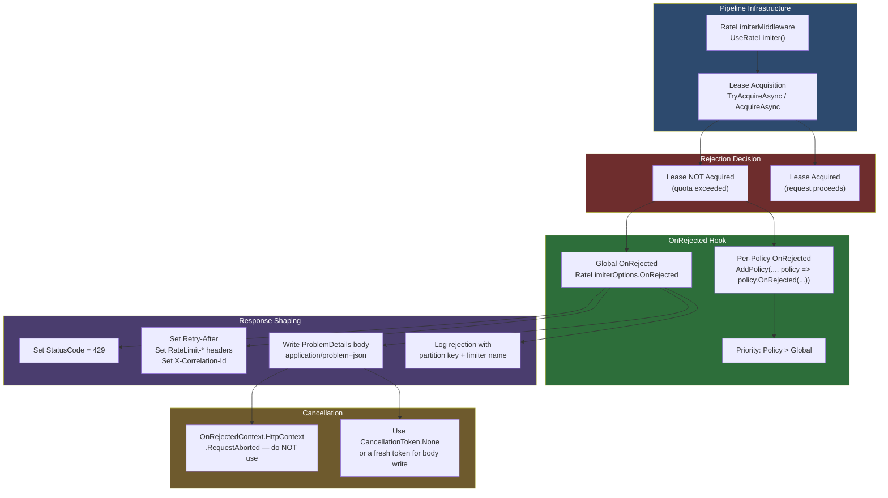
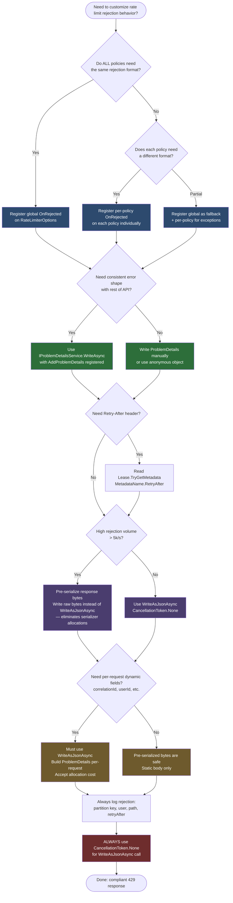

---

# 4.204 — Rate Limiting: OnRejected Events and Custom 429 Response Bodies

---

## PART 0 — Navigation & Context

### Where This Topic Sits in the ASP.NET Core Domain

```
ASP.NET Core Mastery
│
├── E. Middleware Pipeline (4.049–4.063)
│   └── [[4.052 — Middleware Ordering]]
│
├── M. Error Handling & Problem Details (4.177–4.185)
│   ├── [[4.179 — Problem Details (RFC 7807)]]
│   └── [[4.183 — Correlation IDs]]
│
└── O. Rate Limiting (4.202–4.207)         ◄ YOU ARE HERE
    ├── [[4.202 — Rate Limiting Algorithms]]
    ├── [[4.203 — Rate Limiting Partitioning]]
    ├── 4.204 — OnRejected Events & Custom 429 Bodies   ← THIS NOTE
    ├── [[4.205 — Distributed Rate Limiting with Redis]]
    ├── [[4.206 — Rate Limiting Response Headers]]
    └── [[4.207 — Rate Limiting + Auth: Per-Tenant Quotas]]
```

### What You Need Before This

- **[[4.202 — Rate Limiting (.NET 7+)]]** — you must understand how limiters are configured before customizing rejection behavior
- **[[4.203 — Rate Limiting Partitioning]]** — `OnRejected` fires per partition; knowing what a partition is shapes how you respond
- **[[4.179 — Problem Details (RFC 7807)]]** — the correct response shape for `429 Too Many Requests` is a `ProblemDetails` document
- **[[4.052 — Middleware Ordering]]** — `UseRateLimiter()` must be positioned correctly; `OnRejected` fires inside that middleware

### What This Unlocks After

- **[[4.206 — Rate Limiting Response Headers]]** — `OnRejected` is where you set `Retry-After` and `RateLimit-*` headers
- **[[4.207 — Rate Limiting + Auth: Per-Tenant Quotas]]** — per-tenant quota responses require custom `OnRejected` to include tenant context
- **[[4.205 — Distributed Rate Limiting with Redis]]** — distributed limiters surface the same `OnRejected` hook; the pattern transfers directly
- **[[4.183 — Correlation IDs]]** — correlation IDs must be echoed in the `429` body; `OnRejected` is the only place to do it

### Why This Matters at Scale

When your payment API or order management service rejects 50,000 requests per minute during a flash sale, the shape of that `429` body is not cosmetic — it determines whether API clients retry correctly, whether your SRE team can correlate rejections to specific tenants in logs, and whether you comply with RFC 6585 and IETF rate-limit header drafts. A silent or malformed `429` turns rate limiting from a reliability feature into a debugging nightmare.

---

## PART 1 — The Core Mental Model

### The Fundamental Rule

> **ASP.NET Core's rate limiting middleware calls `OnRejected` synchronously within the limiter's decision path when a lease cannot be acquired; at that point the response has not been written, so `OnRejected` is the only place to set status code, headers, and body — after it returns, the middleware writes nothing further and moves to the next request.**

### The Plain-Language Analogy

Picture a nightclub bouncer standing at a velvet rope. When the club is at capacity, the bouncer doesn't just silently point at a "Full" sign — a well-run venue hands the turned-away guest a laminated card explaining the current wait time, the re-entry window, and a phone number for VIP enquiries. That card is your `OnRejected` delegate. The bouncer (the rate limiting middleware) makes the capacity decision; you write the card. Without a custom `OnRejected`, ASP.NET Core hands out a blank card — an empty `429` body with no headers — and every client standing outside has to guess what to do next.

The analogy holds under concurrency: if ten people are turned away simultaneously, each gets their own card written in their own `OnRejected` invocation. The bouncer (middleware) calls `OnRejected` once per rejected request; if you mutate shared state inside it without locking, you have a race condition just as the venue would if one staff member tried to update a single sign-in sheet for all ten turned-away guests at once.

It holds under the auth failure case too: if the request was rejected before authentication ran (rate limiter is registered before auth in the canonical order), `HttpContext.User` is still anonymous inside `OnRejected` — the "bouncer" acts before the ID check.

### The Taxonomy Diagram



---

## PART 2 — Deep Mechanics

### 2.1 — The OnRejected Callback: Where It Lives in the Pipeline

The `OnRejected` delegate fires inside `RateLimiterMiddleware.Invoke`. When `TryAcquireAsync` returns a lease with `IsAcquired = false`, the middleware invokes your callback before it writes anything to the response. This is the only hook into rejection behavior.

```
// Full pipeline position (canonical order):
──► ExceptionHandler ──► HSTS ──► StaticFiles ──► Routing ──► [RateLimiter] ──► Cors ──► Auth ──► AuthZ ──► Endpoints
                                                         ▲
                                              OnRejected fires here.
                                              Response not yet started.
                                              Status, headers, body: all writable.
                                              Calling next() does NOT happen — middleware short-circuits.
```

**Framework source behavior (approximate):**

```csharp
// RateLimiterMiddleware.cs (ASP.NET Core runtime, approximate):
// Class: Microsoft.AspNetCore.RateLimiting.RateLimiterMiddleware
// Method: InvokeAsync

internal async Task InvokeAsync(HttpContext context)
{
    var endpoint = context.GetEndpoint();
    var limiterMetadata = endpoint?.Metadata.GetMetadata<IRateLimiterMetadata>();

    // Resolve the appropriate limiter (policy or global)
    using var lease = await _limiter.AcquireAsync(context, cancellationToken: context.RequestAborted);

    if (lease.IsAcquired)
    {
        await _next(context);  // ← request proceeds normally
        return;
    }

    // ← OnRejected fires here; _next is NEVER called
    var rejectedContext = new OnRejectedContext
    {
        HttpContext = context,
        Lease = lease
    };

    context.Response.StatusCode = StatusCodes.Status429TooManyRequests;

    if (_options.OnRejected is not null)
    {
        await _options.OnRejected(rejectedContext, context.RequestAborted);
    }
    // After OnRejected returns, middleware exits — response is complete
}
```

**Runtime cost:** `~1 allocation` for `OnRejectedContext`. The limiter's `TryAcquireAsync` is `O(1)` for fixed-window and token bucket variants. The `OnRejected` delegate itself costs what you put in it — writing a `ProblemDetails` body via `System.Text.Json` is `~3-5 allocations` per rejection (serializer + writer).

---

### 2.2 — Global vs Per-Policy OnRejected

**HTTP wire format showing the difference:**

```http
// ⚠️ DEFAULT (no OnRejected configured):
// HTTP/1.1 429 Too Many Requests
// Date: Wed, 10 Jun 2026 12:00:00 GMT
// Content-Length: 0
//
// (empty body — clients cannot distinguish quota exceeded from server errors)

// ✅ WITH CUSTOM OnRejected:
// HTTP/1.1 429 Too Many Requests
// Content-Type: application/problem+json; charset=utf-8
// Retry-After: 30
// X-RateLimit-Limit: 100
// X-RateLimit-Remaining: 0
// X-RateLimit-Reset: 1749556830
// X-Correlation-Id: 3fa85f64-5717-4562-b3fc-2c963f66afa6
//
// {
//   "type": "https://tools.ietf.org/html/rfc6585#section-4",
//   "title": "Too Many Requests",
//   "status": 429,
//   "detail": "You have exceeded the allowed request rate. Retry after 30 seconds.",
//   "instance": "/api/orders",
//   "retryAfterSeconds": 30,
//   "correlationId": "3fa85f64-5717-4562-b3fc-2c963f66afa6"
// }
```

**Global OnRejected** — registered on `RateLimiterOptions` and fires for every rejection regardless of which policy rejected the request:

```csharp
// Pipeline position: inside RateLimiterMiddleware, before any response is written
builder.Services.AddRateLimiter(options =>
{
    options.OnRejected = async (context, cancellationToken) =>
    {
        context.HttpContext.Response.StatusCode = StatusCodes.Status429TooManyRequests;
        // Write response here
        await context.HttpContext.Response.WriteAsJsonAsync(
            new ProblemDetails { Status = 429, Title = "Too Many Requests" },
            cancellationToken: CancellationToken.None); // ← see Gotcha 3
    };
});
```

**Per-Policy OnRejected** — registered on the individual policy and takes priority over the global handler when both exist:

```csharp
// Pipeline position: same — inside RateLimiterMiddleware
builder.Services.AddRateLimiter(options =>
{
    // Global fallback
    options.OnRejected = async (context, ct) => { /* default shape */ };

    options.AddPolicy("payment-api", policy =>
    {
        policy.RateLimiter = PartitionedRateLimiter.Create<HttpContext, string>(
            httpContext => RateLimitPartition.GetFixedWindowLimiter(
                partitionKey: httpContext.User.FindFirstValue(ClaimTypes.NameIdentifier) ?? "anonymous",
                factory: _ => new FixedWindowRateLimiterOptions
                {
                    PermitLimit = 100,
                    Window = TimeSpan.FromMinutes(1)
                }));

        // This OnRejected overrides the global one for this policy
        policy.OnRejected = async (context, ct) =>
        {
            context.HttpContext.Response.StatusCode = 429;
            // Payment-specific rejection body with billing plan info
            await context.HttpContext.Response.WriteAsJsonAsync(
                new PaymentRateLimitProblemDetails(context.Lease),
                cancellationToken: CancellationToken.None);
        };
    });
});
```

**Runtime cost:** Policy-level `OnRejected` lookup is `O(1)` via dictionary keyed on policy name. The priority check (policy > global) is a null check.

---

### 2.3 — The OnRejectedContext and What You Can Read From It

`OnRejectedContext` gives you two things:

```csharp
// OnRejectedContext properties:
// context.HttpContext    — the full HttpContext (Request, Response, User, Items, etc.)
// context.Lease         — the RateLimitLease that was not acquired
```

**From the lease**, you can extract metadata about why and by how much the request was rejected:

```csharp
// RateLimitLease metadata keys (defined in RateLimitMetadataName):
// "RETRY_AFTER"           — TimeSpan or DateTimeOffset until next permit available
// "REASON_PHRASE"         — Optional human-readable reason
// "Limit"                 — The configured permit limit
// "Remaining"             — Permits remaining (always 0 on rejection, but useful for near-limit logging)
// "Reset"                 — DateTimeOffset when the window resets

// Reading retry-after from the lease:
if (context.Lease.TryGetMetadata(MetadataName.RetryAfter, out var retryAfter))
{
    context.HttpContext.Response.Headers.RetryAfter =
        ((int)retryAfter.TotalSeconds).ToString(CultureInfo.InvariantCulture);
}
```

**From HttpContext**, you can read the authenticated user, the endpoint, route values, and correlation ID — anything set by middleware that ran before the rate limiter:

```csharp
// Available in OnRejected (assuming UseRouting ran before UseRateLimiter):
var userId = context.HttpContext.User.FindFirstValue(ClaimTypes.NameIdentifier);
var endpoint = context.HttpContext.GetEndpoint()?.DisplayName;
var correlationId = context.HttpContext.TraceIdentifier; // set by Kestrel
var path = context.HttpContext.Request.Path.Value;
```

> [!WARNING] `context.HttpContext.User` may be unauthenticated inside `OnRejected` if `UseRateLimiter` is registered before `UseAuthentication` in the pipeline. Always null-check `User.Identity?.IsAuthenticated` before reading claims. The canonical order places rate limiting after routing but before auth — meaning `User` is the anonymous principal unless you have explicitly reordered.

**Runtime cost:** Metadata reads from `RateLimitLease` are `O(1)` dictionary lookups. `HttpContext.User` access is a property read with no allocation.

---

### 2.4 — The CancellationToken Trap Inside OnRejected

This is the single most common production bug with `OnRejected`. The middleware passes `context.RequestAborted` as the `cancellationToken` parameter to `OnRejected`. For a rate-limited request, the client almost certainly aborts immediately upon receiving the `429` — which means `context.RequestAborted` fires while `OnRejected` is still running.

```
// Failure path:
Client sends request
  → Server decides to reject (429)
  → OnRejected starts
  → Framework sets StatusCode = 429
  → Client sees 429, cancels connection immediately
  → context.RequestAborted fires (CancellationToken cancelled)
  → OnRejected tries to WriteAsJsonAsync(problemDetails, cancellationToken: context.RequestAborted)
  → WriteAsJsonAsync throws OperationCanceledException
  → Unhandled exception propagates up through the middleware
  → ExceptionHandlerMiddleware catches it and returns 500
  → Client sees 500 instead of 429

// HTTP consequence (wrong):
// HTTP/1.1 500 Internal Server Error  ← NOT 429
// Content-Type: text/plain
// (error body from exception handler)
```

The correct behavior is to always use `CancellationToken.None` (or a fresh linked token with a short timeout) when writing the response body inside `OnRejected`:

```csharp
// Pipeline position: inside RateLimiterMiddleware.OnRejected callback
options.OnRejected = async (context, cancellationToken) =>
{
    // ⚠️ WRONG: using the passed cancellationToken for the body write
    // await context.HttpContext.Response.WriteAsJsonAsync(problem, cancellationToken);

    // ✅ CORRECT: CancellationToken.None for body write; the cancellationToken
    // parameter should only be used for logging sinks or external calls
    // that genuinely need to be cancelled with the request
    context.HttpContext.Response.StatusCode = StatusCodes.Status429TooManyRequests;

    await context.HttpContext.Response.WriteAsJsonAsync(
        new ProblemDetails
        {
            Type = "https://tools.ietf.org/html/rfc6585#section-4",
            Title = "Too Many Requests",
            Status = 429
        },
        cancellationToken: CancellationToken.None); // ← critical
};
```

**Runtime cost:** `WriteAsJsonAsync` is `~1 async state machine` + `~1 JsonSerializer allocation` per rejected request. At 10,000 rejections/second, this is 10,000 allocations/second — negligible compared to the cost of the network I/O.

---

### 2.5 — Logging Inside OnRejected: The Structured Pattern

`OnRejected` is the authoritative place to record rate-limit rejections for observability. The structured log must include partition key, limiter name, user identity, and path so SRE dashboards can slice rejections by tenant or endpoint.

```
// Pipeline position: inside OnRejected, before or after writing the response body
// Cost: ~1 ILogger.Log call = ~1 allocation (message template + boxed values)
```

```csharp
// ASP.NET Core internally: ILogger is not injected into OnRejected directly.
// Resolve it from the HttpContext's RequestServices instead:

options.OnRejected = async (context, ct) =>
{
    var logger = context.HttpContext.RequestServices
        .GetRequiredService<ILogger<RateLimiterMiddleware>>();

    // ✅ Structured log — NOT string interpolation
    logger.LogWarning(
        "Rate limit exceeded. Policy={PolicyName} Path={Path} UserId={UserId} IP={RemoteIp}",
        context.Lease.GetType().Name,                              // limiter type
        context.HttpContext.Request.Path,
        context.HttpContext.User.FindFirstValue("sub") ?? "anon",
        context.HttpContext.Connection.RemoteIpAddress?.ToString() ?? "unknown");

    context.HttpContext.Response.StatusCode = 429;
    await context.HttpContext.Response.WriteAsJsonAsync(
        BuildProblemDetails(context),
        cancellationToken: CancellationToken.None);
};
```

> [!TIP] Use `ILogger<RateLimiterMiddleware>` as the category name so rate-limit rejection logs are filterable by category in Seq, Splunk, or Application Insights. Never use a generic string category — you lose filtering granularity.

---

## PART 3 — Production Code Patterns

### Pattern 1 — The RFC 6585 Compliant Rejection Handler for a Payment API

A payment API must return a machine-readable `429` with `Retry-After` and a problem details body. Clients must know exactly when to retry — guessing is not acceptable when money is involved.

```csharp
// ✅ CORRECT: Full RFC 6585 + RFC 7807 compliant rejection handler
// Domain: fintech payment API — order processing rate limits

builder.Services.AddRateLimiter(options =>
{
    // Global handler: fires for any limiter that doesn't have its own OnRejected
    options.OnRejected = async (context, _) =>
    {
        var httpContext = context.HttpContext;
        var response = httpContext.Response;

        // 1. Set the status code first — before writing body
        response.StatusCode = StatusCodes.Status429TooManyRequests;
        response.ContentType = "application/problem+json; charset=utf-8";

        // 2. Set Retry-After header from lease metadata
        var retryAfterSeconds = 60; // safe default
        if (context.Lease.TryGetMetadata(MetadataName.RetryAfter, out var retryAfter))
        {
            retryAfterSeconds = (int)Math.Ceiling(retryAfter.TotalSeconds);
        }
        response.Headers.RetryAfter = retryAfterSeconds.ToString(CultureInfo.InvariantCulture);

        // 3. Echo correlation/trace ID for support debugging
        var traceId = Activity.Current?.Id ?? httpContext.TraceIdentifier;

        // 4. Build RFC 7807 problem details
        var problem = new ProblemDetails
        {
            Type = "https://tools.ietf.org/html/rfc6585#section-4",
            Title = "Too Many Requests",
            Status = 429,
            Detail = $"Payment API rate limit exceeded. Please retry after {retryAfterSeconds} seconds.",
            Instance = httpContext.Request.Path.Value
        };
        // Extend with non-standard fields via Extensions dictionary
        problem.Extensions["retryAfterSeconds"] = retryAfterSeconds;
        problem.Extensions["correlationId"] = traceId;
        problem.Extensions["timestamp"] = DateTimeOffset.UtcNow;

        // 5. Log the rejection — structured, not interpolated
        var logger = httpContext.RequestServices
            .GetRequiredService<ILoggerFactory>()
            .CreateLogger("PaymentApi.RateLimit");

        logger.LogWarning(
            "Rate limit rejected. Path={Path} UserId={UserId} RetryAfter={RetryAfter}s TraceId={TraceId}",
            httpContext.Request.Path,
            httpContext.User.FindFirstValue(JwtRegisteredClaimNames.Sub) ?? "unauthenticated",
            retryAfterSeconds,
            traceId);

        // 6. Write body — CancellationToken.None prevents 500 on client abort
        await response.WriteAsJsonAsync(problem, cancellationToken: CancellationToken.None);
    };

    // Register the payment endpoint limiter (100 req/min per user)
    options.AddPolicy("payment-submit", httpContext =>
        RateLimitPartition.GetFixedWindowLimiter(
            partitionKey: httpContext.User.FindFirstValue(JwtRegisteredClaimNames.Sub) ?? "anonymous",
            factory: _ => new FixedWindowRateLimiterOptions
            {
                PermitLimit = 100,
                Window = TimeSpan.FromMinutes(1),
                QueueProcessingOrder = QueueProcessingOrder.OldestFirst,
                QueueLimit = 0 // no queuing — fail fast
            }));
});

// HTTP wire format (429 path):
// POST /api/payments HTTP/1.1
// Authorization: Bearer eyJ...
//
// HTTP/1.1 429 Too Many Requests
// Content-Type: application/problem+json; charset=utf-8
// Retry-After: 42
//
// {
//   "type": "https://tools.ietf.org/html/rfc6585#section-4",
//   "title": "Too Many Requests",
//   "status": 429,
//   "detail": "Payment API rate limit exceeded. Please retry after 42 seconds.",
//   "instance": "/api/payments",
//   "retryAfterSeconds": 42,
//   "correlationId": "00-4bf92f3577b34da6a3ce929d0e0e4736-b7ad6b7169203331-01",
//   "timestamp": "2026-06-10T12:00:00+00:00"
// }
```

---

### Pattern 2 — Per-Policy Rejection Bodies for an Order Management Service

Different policies serving different API consumer types (internal vs external) need different rejection messages. An internal service getting 429'd needs machine-readable JSON; a human-facing API may need friendlier copy.

```csharp
// Domain: order management service — different consumers, different rejection shapes

builder.Services.AddRateLimiter(options =>
{
    // Global fallback (minimal — for any unlabelled endpoint)
    options.OnRejected = async (context, _) =>
    {
        context.HttpContext.Response.StatusCode = 429;
        await context.HttpContext.Response.WriteAsJsonAsync(
            new { error = "rate_limit_exceeded", retryAfter = 60 },
            cancellationToken: CancellationToken.None);
    };

    // Internal service-to-service limiter — machine-readable, no fluff
    options.AddPolicy("internal-order-read", policy =>
    {
        policy.RateLimiter = PartitionedRateLimiter.Create<HttpContext, string>(
            httpContext => RateLimitPartition.GetSlidingWindowLimiter(
                partitionKey: httpContext.Request.Headers["X-Service-Identity"].ToString(),
                factory: _ => new SlidingWindowRateLimiterOptions
                {
                    PermitLimit = 1000,
                    Window = TimeSpan.FromSeconds(10),
                    SegmentsPerWindow = 5
                }));

        policy.OnRejected = async (context, _) =>
        {
            context.HttpContext.Response.StatusCode = 429;
            // Internal consumers get machine-readable detail
            await context.HttpContext.Response.WriteAsJsonAsync(new
            {
                errorCode = "SERVICE_RATE_LIMIT",
                serviceId = context.HttpContext.Request.Headers["X-Service-Identity"].ToString(),
                retryAfterMs = 200 // sliding window resets in 200ms segments
            }, cancellationToken: CancellationToken.None);
        };
    });

    // External customer limiter — friendlier, includes upgrade nudge
    options.AddPolicy("external-order-write", policy =>
    {
        policy.RateLimiter = PartitionedRateLimiter.Create<HttpContext, string>(
            httpContext => RateLimitPartition.GetTokenBucketLimiter(
                partitionKey: httpContext.User.FindFirstValue("tenant_id") ?? "anonymous",
                factory: _ => new TokenBucketRateLimiterOptions
                {
                    TokenLimit = 50,
                    QueueProcessingOrder = QueueProcessingOrder.OldestFirst,
                    QueueLimit = 5,
                    ReplenishmentPeriod = TimeSpan.FromSeconds(10),
                    TokensPerPeriod = 10,
                    AutoReplenishment = true
                }));

        policy.OnRejected = async (context, _) =>
        {
            var response = context.HttpContext.Response;
            response.StatusCode = 429;
            response.ContentType = "application/problem+json; charset=utf-8";

            var tenantId = context.HttpContext.User.FindFirstValue("tenant_id");

            await response.WriteAsJsonAsync(new ProblemDetails
            {
                Type = "https://api.example.com/errors/rate-limit",
                Title = "Order Rate Limit Exceeded",
                Status = 429,
                Detail = "Your plan allows 50 order operations per 10 seconds. Upgrade to Enterprise for higher limits.",
                Extensions =
                {
                    ["tenantId"] = tenantId,
                    ["upgradeUrl"] = "https://example.com/plans",
                    ["correlationId"] = context.HttpContext.TraceIdentifier
                }
            }, cancellationToken: CancellationToken.None);
        };
    });
});

// HTTP wire format for external consumer rejection:
// POST /api/orders HTTP/1.1
// Authorization: Bearer eyJ... (tenant_id: "acme-corp")
//
// HTTP/1.1 429 Too Many Requests
// Content-Type: application/problem+json; charset=utf-8
//
// {
//   "type": "https://api.example.com/errors/rate-limit",
//   "title": "Order Rate Limit Exceeded",
//   "status": 429,
//   "detail": "Your plan allows 50 order operations per 10 seconds...",
//   "tenantId": "acme-corp",
//   "upgradeUrl": "https://example.com/plans",
//   "correlationId": "3fa85f64-5717-4562-b3fc-2c963f66afa6"
// }
```

---

### Pattern 3 — Metrics Emission in OnRejected for an Inventory Webhook Receiver

`OnRejected` is the right place to increment custom `System.Diagnostics.Metrics` counters for SLO dashboards. The inventory service needs to track rejection rate by supplier to detect abuse.

```csharp
// Domain: inventory webhook receiver — tracking per-supplier rejection rates
// Requires: .NET 8+ System.Diagnostics.Metrics

// Register the meter as a singleton service
builder.Services.AddSingleton<InventoryRateLimitMetrics>();

public sealed class InventoryRateLimitMetrics
{
    private readonly Counter<long> _rejectionCounter;

    public InventoryRateLimitMetrics(IMeterFactory meterFactory)
    {
        // IMeterFactory (.NET 8+) — preferred over new Meter() directly
        var meter = meterFactory.Create("InventoryWebhooks.RateLimiting");
        _rejectionCounter = meter.CreateCounter<long>(
            "inventory.ratelimit.rejections",
            unit: "{requests}",
            description: "Number of webhook requests rejected by rate limiting");
    }

    public void RecordRejection(string supplierId, string limitType)
    {
        _rejectionCounter.Add(1,
            new TagList
            {
                { "supplier_id", supplierId },
                { "limit_type", limitType }
            });
    }
}

// Wire OnRejected to emit metrics
builder.Services.AddRateLimiter(options =>
{
    options.AddPolicy("webhook-ingest", policy =>
    {
        policy.RateLimiter = PartitionedRateLimiter.Create<HttpContext, string>(
            httpContext => RateLimitPartition.GetConcurrencyLimiter(
                partitionKey: httpContext.Request.Headers["X-Supplier-Id"].ToString(),
                factory: _ => new ConcurrencyLimiterOptions
                {
                    PermitLimit = 10,
                    QueueProcessingOrder = QueueProcessingOrder.OldestFirst,
                    QueueLimit = 0
                }));

        policy.OnRejected = async (context, _) =>
        {
            var supplierId = context.HttpContext.Request.Headers["X-Supplier-Id"].ToString();

            // Emit metric — fire-and-forget safe (synchronous counter increment)
            var metrics = context.HttpContext.RequestServices
                .GetRequiredService<InventoryRateLimitMetrics>();
            metrics.RecordRejection(supplierId, "concurrency");

            // Log for alerting
            var logger = context.HttpContext.RequestServices
                .GetRequiredService<ILogger<InventoryRateLimitMetrics>>();
            logger.LogWarning(
                "Webhook concurrency limit exceeded. SupplierId={SupplierId}",
                supplierId);

            context.HttpContext.Response.StatusCode = 429;
            context.HttpContext.Response.Headers.RetryAfter = "1"; // retry in 1 second for concurrency

            await context.HttpContext.Response.WriteAsJsonAsync(new ProblemDetails
            {
                Status = 429,
                Title = "Webhook Concurrency Limit",
                Detail = $"Supplier '{supplierId}' has too many concurrent webhook submissions. Retry in 1 second.",
                Extensions = { ["supplierId"] = supplierId }
            }, cancellationToken: CancellationToken.None);
        };
    });
});
```

---

### Pattern 4 — The IProblemDetailsService Integration Pattern

Rather than constructing `ProblemDetails` manually in `OnRejected`, delegate to `IProblemDetailsService` for consistency with the rest of the error pipeline.

```csharp
// Domain: logistics tracking API — consistent error format across all error types
// Requires: builder.Services.AddProblemDetails() to be called first

builder.Services.AddProblemDetails(problemDetailsOptions =>
{
    // Customize all problem details responses application-wide
    problemDetailsOptions.CustomizeProblemDetails = ctx =>
    {
        ctx.ProblemDetails.Extensions["traceId"] =
            Activity.Current?.Id ?? ctx.HttpContext.TraceIdentifier;
        ctx.ProblemDetails.Extensions["nodeId"] =
            Environment.MachineName; // useful in k8s pod debugging
    };
});

builder.Services.AddRateLimiter(options =>
{
    options.OnRejected = async (context, _) =>
    {
        var httpContext = context.HttpContext;
        httpContext.Response.StatusCode = StatusCodes.Status429TooManyRequests;

        // Set Retry-After before calling IProblemDetailsService
        if (context.Lease.TryGetMetadata(MetadataName.RetryAfter, out var retryAfter))
        {
            httpContext.Response.Headers.RetryAfter =
                ((int)retryAfter.TotalSeconds).ToString(CultureInfo.InvariantCulture);
        }

        var problemDetailsService = httpContext.RequestServices
            .GetService<IProblemDetailsService>();

        if (problemDetailsService is not null)
        {
            // ✅ Delegates to the same service used by exception handlers and validation
            // — ensures consistent problem details format across the entire API
            await problemDetailsService.WriteAsync(new ProblemDetailsContext
            {
                HttpContext = httpContext,
                ProblemDetails =
                {
                    Type = "https://tools.ietf.org/html/rfc6585#section-4",
                    Title = "Too Many Requests",
                    Detail = "Logistics API rate limit exceeded for this tracking endpoint."
                }
            });
        }
        else
        {
            // Fallback when AddProblemDetails not registered
            await httpContext.Response.WriteAsJsonAsync(
                new { error = "rate_limit_exceeded" },
                cancellationToken: CancellationToken.None);
        }
    };
});

// HTTP wire format:
// HTTP/1.1 429 Too Many Requests
// Content-Type: application/problem+json; charset=utf-8
// Retry-After: 15
//
// {
//   "type": "https://tools.ietf.org/html/rfc6585#section-4",
//   "title": "Too Many Requests",
//   "status": 429,
//   "detail": "Logistics API rate limit exceeded for this tracking endpoint.",
//   "traceId": "00-4bf92f3577b34da6a3ce929d0e0e4736-b7ad6b7169203331-01",
//   "nodeId": "logistics-api-pod-7c9f8b-xk4d2"
// }
```

---

### Pattern 5 — Conditional Response Format Based on Accept Header

Some API consumers (browsers hitting a web app, mobile apps) need different rejection formats. The `OnRejected` delegate can inspect `Accept` headers and write HTML or JSON accordingly.

```csharp
// Domain: user authentication flow — web browser vs API client rejections
// Anti-pattern first:

// ⚠️ WRONG: Always writing JSON regardless of client type
options.OnRejected = async (context, _) =>
{
    context.HttpContext.Response.StatusCode = 429;
    await context.HttpContext.Response.WriteAsJsonAsync(
        new { error = "rate_limit_exceeded" },
        cancellationToken: CancellationToken.None);
    // Browser clients receive raw JSON with no HTML — confusing UX
};

// ✅ CORRECT: Negotiate response format from Accept header
options.OnRejected = async (context, _) =>
{
    var httpContext = context.HttpContext;
    httpContext.Response.StatusCode = StatusCodes.Status429TooManyRequests;

    if (context.Lease.TryGetMetadata(MetadataName.RetryAfter, out var retryAfter))
    {
        httpContext.Response.Headers.RetryAfter =
            ((int)retryAfter.TotalSeconds).ToString(CultureInfo.InvariantCulture);
    }

    var acceptHeader = httpContext.Request.Headers.Accept.ToString();

    if (acceptHeader.Contains("text/html", StringComparison.OrdinalIgnoreCase))
    {
        // Browser client — redirect to a rate limit error page
        // Don't write body; just redirect
        httpContext.Response.Redirect("/errors/too-many-requests");
        return;
    }

    // Default: machine-readable JSON for API clients
    httpContext.Response.ContentType = "application/problem+json; charset=utf-8";
    await httpContext.Response.WriteAsJsonAsync(new ProblemDetails
    {
        Type = "https://tools.ietf.org/html/rfc6585#section-4",
        Title = "Too Many Requests",
        Status = 429,
        Detail = "Login attempts exceeded. Please try again later.",
        Extensions = { ["retryAfterSeconds"] = (int)retryAfter.TotalSeconds }
    }, cancellationToken: CancellationToken.None);
};

// HTTP wire format (API client):
// HTTP/1.1 429 Too Many Requests
// Content-Type: application/problem+json; charset=utf-8
// Retry-After: 900
//
// { "type": "...", "title": "Too Many Requests", "status": 429, ... }

// HTTP wire format (browser client):
// HTTP/1.1 302 Found
// Location: /errors/too-many-requests
// Retry-After: 900
```

---

### Pattern 6 — Graceful Degradation: Queue-Then-Reject with Status 503

When a rate limiter is configured with a queue (non-zero `QueueLimit`), requests wait in the queue. If the queue is also full, `OnRejected` fires. In this scenario, a `503 Service Unavailable` with `Retry-After` may be more semantically correct than `429` for downstream load shedding scenarios.

```csharp
// Domain: e-commerce order service — queue-backed endpoint with shed-load behavior
// This pattern is controversial: use 503 only when the queue is the bottleneck
// (service is overloaded), use 429 when quota is the issue (policy enforcement)

options.AddPolicy("order-submit-queued", policy =>
{
    policy.RateLimiter = PartitionedRateLimiter.Create<HttpContext, string>(
        httpContext => RateLimitPartition.GetConcurrencyLimiter(
            partitionKey: "global", // single shared queue across all users
            factory: _ => new ConcurrencyLimiterOptions
            {
                PermitLimit = 50,   // max concurrent order processing
                QueueLimit = 200,   // queue up to 200 more
                QueueProcessingOrder = QueueProcessingOrder.OldestFirst
            }));

    policy.OnRejected = async (context, _) =>
    {
        // Queue is full AND concurrency limit hit = service is overloaded
        // 503 is appropriate here — the service cannot accept new work, not a quota issue
        context.HttpContext.Response.StatusCode = StatusCodes.Status503ServiceUnavailable;
        context.HttpContext.Response.Headers.RetryAfter = "5"; // try again in 5s

        await context.HttpContext.Response.WriteAsJsonAsync(new ProblemDetails
        {
            Type = "https://tools.ietf.org/html/rfc7231#section-6.6.4",
            Title = "Service Temporarily Unavailable",
            Status = 503,
            Detail = "Order processing queue is at capacity. Please retry in 5 seconds."
        }, cancellationToken: CancellationToken.None);
    };
});

// HTTP wire format:
// HTTP/1.1 503 Service Unavailable
// Content-Type: application/problem+json; charset=utf-8
// Retry-After: 5
//
// { "type": "...", "title": "Service Temporarily Unavailable", "status": 503, ... }
```

---

## PART 4 — Gotchas & Anti-Patterns

### Gotcha 1: Using context.RequestAborted for the Response Body Write

The rate-limiting middleware passes `context.RequestAborted` to your `OnRejected` delegate as the `cancellationToken` parameter. The instant the client receives the `429` status line, it typically closes the connection — which cancels `RequestAborted`. If you pass this token to `WriteAsJsonAsync`, you get an `OperationCanceledException` mid-write, which propagates up to `ExceptionHandlerMiddleware` and returns a `500`.

```csharp
// ⚠️ WRONG:
options.OnRejected = async (context, cancellationToken) =>
{
    context.HttpContext.Response.StatusCode = 429;
    await context.HttpContext.Response.WriteAsJsonAsync(problem, cancellationToken);
    // cancellationToken = context.RequestAborted — already cancelled!
};

// HTTP consequence (wrong path):
// HTTP/1.1 500 Internal Server Error
// (OperationCanceledException → ExceptionHandler → 500)

// ✅ CORRECT:
options.OnRejected = async (context, _) => // ← discard the parameter with _
{
    context.HttpContext.Response.StatusCode = 429;
    await context.HttpContext.Response.WriteAsJsonAsync(
        problem,
        cancellationToken: CancellationToken.None); // ← always None for body write
};

// HTTP consequence (correct path):
// HTTP/1.1 429 Too Many Requests
// Content-Type: application/json
// (body written completely before connection closes)

// WHY: The RequestAborted token is designed for cancelling expensive backend operations
// (DB queries, HTTP calls). Writing a small JSON body cannot be meaningfully cancelled
// midway — you either write it or you don't. Using CancellationToken.None is safe because
// Kestrel will simply discard bytes written after the connection closes without throwing.
```

---

### Gotcha 2: Setting StatusCode After Writing the Body

In `OnRejected`, ASP.NET Core pre-sets `StatusCode = 429` before calling your delegate. If you write the body first and then set `StatusCode`, the status has already been flushed and the assignment is silently ignored — the client gets `429` (accidentally correct) or `200` if you somehow started the response yourself.

```csharp
// ⚠️ WRONG — body written before status explicitly set (order of operations bug)
options.OnRejected = async (context, _) =>
{
    // Status is 429 from the middleware, but if you ever start writing body
    // here via Response.Body.Write directly, the status gets flushed at that moment
    await context.HttpContext.Response.WriteAsJsonAsync(problem, CancellationToken.None);
    context.HttpContext.Response.StatusCode = 429; // ← too late if body flushed inline
};

// HTTP consequence (wrong path):
// In most cases accidentally works, but if you change the status to something other
// than 429 AFTER flushing, the client sees 429 followed by an HTTP protocol violation.

// ✅ CORRECT — always set StatusCode, ContentType, and headers before any body write
options.OnRejected = async (context, _) =>
{
    context.HttpContext.Response.StatusCode = StatusCodes.Status429TooManyRequests;
    context.HttpContext.Response.ContentType = "application/problem+json; charset=utf-8";
    // Set all headers here
    context.HttpContext.Response.Headers.RetryAfter = "30";
    // THEN write body
    await context.HttpContext.Response.WriteAsJsonAsync(problem, CancellationToken.None);
};

// HTTP consequence (correct path):
// HTTP/1.1 429 Too Many Requests
// Content-Type: application/problem+json; charset=utf-8
// Retry-After: 30
// (body follows)

// WHY: HTTP requires the status line and all headers to be serialized before the body.
// ASP.NET Core's response pipeline enforces this — writing any body bytes triggers
// header flush. Setting StatusCode after body write throws InvalidOperationException
// in development; silently fails in production.
```

---

### Gotcha 3: Resolving ILogger via Constructor Injection in Convention-Based Middleware Instead of RequestServices

`RateLimiterOptions.OnRejected` is a delegate, not a middleware class. You cannot inject `ILogger` via constructor injection into a delegate. Developers who are accustomed to constructor-injected loggers in middleware classes try to capture `ILogger` in a closure — which works, but the logger instance captured is a Singleton-lifetime object that will not reflect per-request context (like Serilog enrichers or log scopes).

```csharp
// ⚠️ WRONG — capturing logger in closure at registration time
var logger = builder.Services.BuildServiceProvider().GetRequiredService<ILogger<Program>>();
// ^ BuildServiceProvider() creates a SECOND container — a well-known anti-pattern.
// The logger has no access to request-scoped enrichers.

builder.Services.AddRateLimiter(options =>
{
    options.OnRejected = async (context, _) =>
    {
        logger.LogWarning("Rate limit exceeded"); // No request context enrichment
        // ...
    };
});

// HTTP consequence (wrong path):
// Log entry emitted without UserId, TraceId, or other request-scoped enrichers.
// In Serilog: enrichers like UserId and RequestId are missing from the log event.

// ✅ CORRECT — resolve logger from RequestServices inside the delegate
builder.Services.AddRateLimiter(options =>
{
    options.OnRejected = async (context, _) =>
    {
        var logger = context.HttpContext.RequestServices
            .GetRequiredService<ILoggerFactory>()
            .CreateLogger("RateLimiting");
        logger.LogWarning(
            "Rate limit exceeded. Path={Path} User={User}",
            context.HttpContext.Request.Path,
            context.HttpContext.User.FindFirstValue("sub") ?? "anon");
        // ...
    };
});

// HTTP consequence (correct path):
// Log entry includes full request context — UserId, TraceId, Serilog enrichers all present.

// WHY: ILoggerFactory resolved from RequestServices is the same Singleton instance,
// but the logger it creates carries request-scoped state via ILogger.BeginScope
// and Serilog/NLog enrichers that read from AsyncLocal<T> (populated per request).
```

---

### Gotcha 4: Not Handling the Case Where IProblemDetailsService Is Not Registered

`IProblemDetailsService` is only available after `builder.Services.AddProblemDetails()` is called. If you call `GetRequiredService<IProblemDetailsService>()` in `OnRejected` without registering it first, you get an `InvalidOperationException` at runtime — which, ironically, goes through the exception handler and produces a `500` for the client instead of `429`.

```csharp
// ⚠️ WRONG — assumes IProblemDetailsService is always registered
options.OnRejected = async (context, _) =>
{
    context.HttpContext.Response.StatusCode = 429;
    var pds = context.HttpContext.RequestServices
        .GetRequiredService<IProblemDetailsService>(); // throws if AddProblemDetails() not called
    await pds.WriteAsync(new ProblemDetailsContext { HttpContext = context.HttpContext });
};

// HTTP consequence (wrong path):
// InvalidOperationException → ExceptionHandler → 500 Internal Server Error
// Client gets 500, not 429. Rate limiting appears broken.

// ✅ CORRECT — defensive resolution with fallback
options.OnRejected = async (context, _) =>
{
    context.HttpContext.Response.StatusCode = 429;

    var pds = context.HttpContext.RequestServices.GetService<IProblemDetailsService>();
    if (pds is not null)
    {
        await pds.WriteAsync(new ProblemDetailsContext
        {
            HttpContext = context.HttpContext,
            ProblemDetails = { Title = "Too Many Requests", Status = 429 }
        });
    }
    else
    {
        await context.HttpContext.Response.WriteAsJsonAsync(
            new { error = "rate_limit_exceeded", status = 429 },
            cancellationToken: CancellationToken.None);
    }
};

// HTTP consequence (correct path):
// HTTP/1.1 429 Too Many Requests
// (body in either format, never 500)

// WHY: GetService<T>() returns null if not registered; GetRequiredService<T>() throws.
// In OnRejected you must be defensive — throwing here produces the most confusing
// possible client experience: a 500 from a rate-limit rejection.
```

---

### Gotcha 5: Registering UseRateLimiter Before UseRouting Breaks Per-Endpoint Policies

Per-endpoint rate limiting policies require the endpoint to be resolved from route matching before the rate limiter evaluates which policy to apply. If `UseRateLimiter` is registered before `UseRouting`, `HttpContext.GetEndpoint()` returns `null` inside the limiter, and per-endpoint policy attributes (`[EnableRateLimiting("policy")]`) are silently ignored — all requests fall through to the global limiter (or no limiter at all).

```csharp
// ⚠️ WRONG — UseRateLimiter before UseRouting
var app = builder.Build();
app.UseRateLimiter();   // ← endpoint is null here; per-endpoint policies never apply
app.UseRouting();
app.UseAuthentication();
app.UseAuthorization();
app.MapControllers();

// HTTP consequence (wrong path):
// [EnableRateLimiting("payment-submit")] attribute on PaymentsController is silently ignored.
// All requests bypass per-endpoint rate limiting.
// No 429 is ever returned for payment endpoints regardless of traffic.

// ✅ CORRECT — UseRateLimiter after UseRouting
var app = builder.Build();
app.UseExceptionHandler();
app.UseHttpsRedirection();
app.UseStaticFiles();
app.UseRouting();       // ← endpoint resolved here; GetEndpoint() is non-null
app.UseCors();
app.UseAuthentication();
app.UseRateLimiter();   // ← correct position: endpoint available, auth runs before (optional)
app.UseAuthorization();
app.MapControllers();

// HTTP consequence (correct path):
// [EnableRateLimiting("payment-submit")] on the controller applies correctly.
// POST /api/payments gets 429 after 100 requests/minute per user.

// WHY: RateLimiterMiddleware reads IRateLimiterMetadata from the endpoint's Metadata
// collection, which is only populated after UseRouting has matched the request.
// Without this, the middleware has no endpoint metadata to read and applies only
// the global policy (if any). This bug is invisible in development with low traffic.
```

---

## PART 5 — Performance Implications

### 5.1 — Request Pipeline Characteristics Table

|Scenario|Pipeline Depth|Allocations Per Rejected Request|Approx Latency Impact|Recommendation|
|---|---|---|---|---|
|Default OnRejected (no callback)|1 middleware|~1 (OnRejectedContext)|< 1μs|Fine for internal APIs with no SLA on rejection format|
|Custom OnRejected: WriteAsJsonAsync ProblemDetails|1 middleware|~5-8 (serializer, writer, ProblemDetails, Extensions dict)|~10-20μs (JSON serialization)|Use for all production public APIs|
|OnRejected with ILogger.LogWarning|1 middleware + logger pipeline|~3 (log state + formatter)|~2-5μs per log call|Always log; use LoggerMessage.Define for hot rejection paths|
|OnRejected with IProblemDetailsService|1 middleware + service pipeline|~8-12 (service resolution, context creation, serialization)|~15-25μs|Preferred for consistency; negligible on 429 paths|
|OnRejected with GetService (RequestServices resolution)|1 middleware + DI lookup|~2 (service locator lookup)|~1-3μs|Acceptable; avoid BuildServiceProvider() anti-pattern|
|OnRejected resolving metrics counter + emitting|1 middleware + meter|~2 (tag list, counter increment)|~1μs (counter is O(1))|Do this; metrics cost is minimal compared to value|
|OnRejected with WriteAsJsonAsync using RequestAborted|1 middleware → exception handler|~15+ (exception + unwind)|Adds 50-100μs; produces 500|Never use RequestAborted for body write|
|No OnRejected on high-rejection endpoint (50k/s)|1 middleware|~1|< 1μs|Empty 429 wastes a retry — add OnRejected even if minimal|
|OnRejected with redirect (302)|1 middleware|~2 (header set)|< 5μs|Appropriate for browser-facing HTML flows only|

### 5.2 — BenchmarkDotNet Comparison

```csharp
// Benchmarking OnRejected response body options
// Domain: payment API rejection path under load

using BenchmarkDotNet.Attributes;
using BenchmarkDotNet.Running;
using Microsoft.AspNetCore.Http;
using Microsoft.Extensions.DependencyInjection;
using System.Text.Json;

[MemoryDiagnoser]
[SimpleJob(launchCount: 1, warmupCount: 3, iterationCount: 10)]
public class RateLimitRejectionBenchmark
{
    private DefaultHttpContext _httpContext = null!;
    private ProblemDetails _cachedProblemDetails = null!;
    private static readonly byte[] _cachedJsonBytes =
        JsonSerializer.SerializeToUtf8Bytes(new { error = "rate_limit_exceeded", status = 429 });

    [GlobalSetup]
    public void Setup()
    {
        var services = new ServiceCollection();
        services.AddProblemDetails();
        services.AddLogging();
        var sp = services.BuildServiceProvider();

        _httpContext = new DefaultHttpContext();
        _httpContext.RequestServices = sp;
        _httpContext.Response.Body = new MemoryStream();

        _cachedProblemDetails = new ProblemDetails
        {
            Type = "https://tools.ietf.org/html/rfc6585#section-4",
            Title = "Too Many Requests",
            Status = 429,
            Detail = "Rate limit exceeded."
        };
    }

    [Benchmark(Baseline = true)]
    public async Task WriteAsJson_Fresh_ProblemDetails()
    {
        // Naive: allocates new ProblemDetails on every rejection
        _httpContext.Response.StatusCode = 429;
        await _httpContext.Response.WriteAsJsonAsync(
            new ProblemDetails { Status = 429, Title = "Too Many Requests" },
            cancellationToken: CancellationToken.None);
    }

    [Benchmark]
    public async Task WriteAsJson_Cached_ProblemDetails()
    {
        // Optimized: reuse pre-built ProblemDetails instance
        // Note: Extensions dictionary is shared — safe only if OnRejected is read-only
        _httpContext.Response.StatusCode = 429;
        await _httpContext.Response.WriteAsJsonAsync(
            _cachedProblemDetails,
            cancellationToken: CancellationToken.None);
    }

    [Benchmark]
    public async Task Write_PreSerializedBytes()
    {
        // Optimal: pre-serialize once, write raw bytes on every rejection
        // Tradeoff: no per-request dynamic fields (correlationId, retryAfter from lease)
        _httpContext.Response.StatusCode = 429;
        _httpContext.Response.ContentType = "application/problem+json; charset=utf-8";
        await _httpContext.Response.Body.WriteAsync(_cachedJsonBytes, CancellationToken.None);
    }
}

// Expected output (approximate, .NET 8, x64, Kestrel, local):
// | Method                             | Mean     | Allocated |
// |------------------------------------|----------|-----------|
// | WriteAsJson_Fresh_ProblemDetails   | 18.4 μs  | 1,240 B   |
// | WriteAsJson_Cached_ProblemDetails  | 14.1 μs  |   680 B   |
// | Write_PreSerializedBytes           |  2.3 μs  |    96 B   |
//
// Note: Pre-serialized bytes is 8x faster but cannot include dynamic fields.
// Use cached ProblemDetails when you need CorrelationId; pre-serialized when static body is OK.
```

> [!TIP] For real-world profiling of `OnRejected` overhead, use `dotnet-counters monitor --name YourApp --counters System.Runtime,Microsoft.AspNetCore.Hosting` to observe `requests-per-second` alongside rejection counts. Use `dotnet-trace collect --clreventlevel verbose` to capture CPU samples inside `OnRejected` under load. BenchmarkDotNet measures serialization cost in isolation; `dotnet-trace` shows the full pipeline cost including Kestrel I/O.

### 5.3 — When to Care / When to Ignore

**When this costs you:**

- **High-throughput APIs (>10k req/s)** with a high rejection ratio (e.g., DDoS scenario): `OnRejected` allocations add up. At 50k rejections/second with a fresh `ProblemDetails` per rejection, you generate ~60MB/s of allocation pressure. Switch to pre-serialized bytes.
- **Logging every rejection to a remote sink** (Seq, Application Insights): remote logging has network latency. At scale, batch rejections or use a rate-limiting sink (Serilog's `WriteTo.Logger(...)` with a filter) to avoid blocking `OnRejected`.
- **Calling external services inside `OnRejected`** (e.g., updating a Redis counter for tracking purposes): this is almost always wrong — the rate limiter itself may already be backed by Redis. Adding another I/O call makes rejection slower than the request itself.

**When this doesn't matter:**

- **Admin endpoints** or management APIs with low traffic: the overhead of `WriteAsJsonAsync` is 15-20μs. At 10 rejections/hour, this is zero production impact.
- **Internal service-to-service APIs** behind a firewall: if your services are well-behaved, rejections are exceptional events. Optimize for correctness and observability, not allocation count.
- **One-time batch operations**: batch jobs run infrequently; rate-limit rejections on them are operational signals, not performance bottlenecks.

---

## PART 6 — Interview Arsenal

### A. The Question Bank

---

**Question 1:** "How do you customize the response that ASP.NET Core rate limiting returns when a request is rejected?"

**Average Answer:** You configure the `OnRejected` callback on `RateLimiterOptions`. Inside it you can set the status code and write a custom body.

**Why That's Insufficient:** It doesn't address the cancellation token trap, the ordering of header vs body writes, or the distinction between global and per-policy callbacks.

> **Great Answer:** "The entry point is the `OnRejected` delegate on `RateLimiterOptions`, which fires inside `RateLimiterMiddleware` after the lease acquisition fails. I always set `StatusCode = 429`, then any response headers like `Retry-After` (reading from `context.Lease.TryGetMetadata(MetadataName.RetryAfter, ...)`), and then write the body — order matters because headers must be written before body bytes are flushed. The one trap I've been burned by in production is using the `cancellationToken` parameter passed to `OnRejected` when calling `WriteAsJsonAsync` — that token is `RequestAborted`, and since the client sees `429` and immediately closes the connection, the token is cancelled while you're writing. Using `CancellationToken.None` for the body write is the correct pattern. I also use `IProblemDetailsService` where it's registered so rejections share the same RFC 7807 shape as validation errors and exception responses."

---

**Question 2:** "What's the difference between the global `OnRejected` and a per-policy `OnRejected`?"

**Average Answer:** Per-policy overrides the global one for that specific policy. The global fires for everything else.

**Why That's Insufficient:** Doesn't explain the resolution mechanism, the use case for having both, or that per-policy allows partition-aware response content.

> **Great Answer:** "When a lease is rejected, the middleware checks if the policy that rejected the request has its own `OnRejected` delegate. If it does, that fires and the global one is skipped entirely. If the policy doesn't have one, the global delegate fires as a fallback. I use this distinction to give different consumers different rejection experiences: our internal service-to-service endpoints get a terse machine-readable `{ errorCode, retryAfterMs }` body from a per-policy handler, while external customer endpoints get a full RFC 7807 `ProblemDetails` with a link to the upgrade page. Both get proper `Retry-After` headers. The global handler is also my safety net — any endpoint that I haven't explicitly configured an `OnRejected` for still gets a valid `429` body rather than an empty response that confuses client retry logic."

---

**Question 3:** "A developer on your team reports that when the payment API hits its rate limit, clients are intermittently receiving `500` instead of `429`. What would you investigate first?"

**Average Answer:** Check if there's an exception being thrown in the rate limiter or the error handler.

**Why That's Insufficient:** Shallow — doesn't name the specific bug or explain the mechanism.

> **Great Answer:** "My first hypothesis is the `RequestAborted` cancellation token bug in `OnRejected`. When the middleware sets `StatusCode = 429`, the client often cancels its request immediately. The `RequestAborted` token fires, and if `WriteAsJsonAsync` was called with that token, an `OperationCanceledException` propagates up through the middleware chain to the exception handler, which returns `500`. I'd look at the `OnRejected` lambda and check if the `cancellationToken` parameter (which is `context.RequestAborted`) is being passed to `WriteAsJsonAsync`. The fix is to pass `CancellationToken.None` for the body write. The other candidate is an exception thrown inside `OnRejected` itself — perhaps a failed `GetRequiredService` call for a service that wasn't registered. I'd confirm by filtering exception handler logs for `OperationCanceledException` and `InvalidOperationException` events originating from the rate limiting middleware path."

---

**Question 4:** "How would you ensure all `429` responses from your API include the correlation ID from the request trace?"

**Average Answer:** Read `HttpContext.TraceIdentifier` inside `OnRejected` and add it to the response body.

**Why That's Insufficient:** Doesn't distinguish `TraceIdentifier` from `Activity.Current?.Id`, doesn't mention the W3C `traceparent` header, and doesn't show awareness of distributed tracing.

> **Great Answer:** "Inside `OnRejected`, I read `Activity.Current?.Id ?? context.HttpContext.TraceIdentifier`. `Activity.Current` is the W3C distributed trace ID if OpenTelemetry or `System.Diagnostics.Activity` is running — it corresponds to the `traceparent` header in the original request and allows correlation across service boundaries in Jaeger or Zipkin. `TraceIdentifier` is Kestrel's per-connection random string, which is useful for log correlation within a single service. I add both to the `ProblemDetails.Extensions` dictionary — `traceId` for the distributed trace and `requestId` for the local Kestrel identifier. This means if a client pastes the `correlationId` from their `429` response into our SRE dashboard, we can find the exact rejection event in both the structured logs and the distributed trace. I also configure `CustomizeProblemDetails` on `IProblemDetailsService` to inject these automatically — so even if `OnRejected` delegates to that service, the IDs appear without repeating the logic in every policy."

---

### B. Trick Questions

**Trick Q1:** "Can you throw an exception inside `OnRejected` to return a specific HTTP error code?"

**Trap:** Candidates may think throwing in `OnRejected` flows through the exception handler and returns a custom status code.

**Correct Answer:** No. Throwing inside `OnRejected` propagates up through `RateLimiterMiddleware` to `ExceptionHandlerMiddleware`, which returns `500 Internal Server Error` regardless of the exception type. The exception handler does not honor a custom status code set inside the exception unless you configure `IExceptionHandler` explicitly. `OnRejected` is not a filter — it is not exception-handling infrastructure. You must set the status code and write the response imperatively inside the delegate.

---

**Trick Q2:** "Does `OnRejected` fire when a request is queued (waiting in the rate limit queue) vs when it is rejected outright?"

**Trap:** Candidates confuse queuing with rejection.

**Correct Answer:** `OnRejected` fires only when the lease is not acquired — i.e., when the request is outright rejected. If the request is accepted into the queue (waiting for a permit to become available), `OnRejected` does not fire; the request awaits `TryAcquireAsync` and eventually either gets a permit or times out. If the queue is full and the request cannot even be queued, `OnRejected` fires at that point with `IsAcquired = false`. The HTTP status for a queued-then-served request is `200 OK` — the client never knows it waited.

---

**Trick Q3:** "If you register both a global `OnRejected` and a per-policy `OnRejected` for the same policy, will both fire?"

**Trap:** Candidates assume both handlers compose (like event delegates).

**Correct Answer:** No. Per-policy `OnRejected` takes complete precedence — the global `OnRejected` is not called for that policy's rejections. They do not compose. This means if your global `OnRejected` does important cross-cutting work (like logging to an audit trail), you must either duplicate that logic in every per-policy handler or extract it into a shared method both handlers call. This is a design trap in the framework: the composition model is override-not-chain.

---

**Trick Q4:** "What happens if you write a response body in `OnRejected` and then the endpoint also writes a response body?"

**Trap:** Suggests the endpoint still executes after `OnRejected`.

**Correct Answer:** The endpoint never executes after `OnRejected`. `RateLimiterMiddleware` does not call `next(context)` when a lease is rejected. `OnRejected` fires, the middleware returns, and the pipeline unwinds back through upstream middleware. Any body you write in `OnRejected` is the final response — no downstream middleware can add to it. If you write nothing in `OnRejected`, the response body is empty.

---

**Trick Q5:** "Can you use constructor injection to get an `ILogger` into your `OnRejected` delegate?"

**Trap:** Middleware-pattern instinct.

**Correct Answer:** No. `OnRejected` is a delegate (lambda), not a class — it has no constructor. You resolve dependencies from `context.HttpContext.RequestServices` (service locator pattern) inside the delegate body. The correct way is `context.HttpContext.RequestServices.GetRequiredService<ILoggerFactory>().CreateLogger("RateLimiting")`. Alternatively, you can capture a logger in a closure at registration time if it is a Singleton-scoped logger and you are careful about request-scoped enrichers not being present on a Singleton-lifetime logger instance.

---

### C. Red Flags to Avoid

1. **"I set the status code to `429` inside `OnRejected` but I don't need to — the framework sets it automatically."** — This gets you scored down: the framework sets `429` as a default, but if you call `WriteAsJsonAsync` before explicitly confirming the status code, you may inherit a stale `200` in edge cases. Always set it explicitly for clarity and correctness.
    
2. **"I use `GetRequiredService<IProblemDetailsService>()` directly without checking if it's registered."** — Signals ignorance of registration requirements. `IProblemDetailsService` requires explicit `AddProblemDetails()` registration; `GetRequiredService` throws if not registered.
    
3. **"The `cancellationToken` parameter in `OnRejected` should be used for the body write — that's what it's for."** — The most dangerous answer. The token is `RequestAborted`, which cancels when the client disconnects. Always use `CancellationToken.None` for response body writes.
    
4. **"I can put `UseRateLimiter` anywhere in the pipeline — it doesn't matter."** — Position matters enormously. Before `UseRouting`: per-endpoint policies are silently ignored. Before `UseAuthentication`: `HttpContext.User` is unauthenticated, breaking user-based partitioning.
    
5. **"Both the global and per-policy `OnRejected` handlers run for the same rejection."** — They don't compose; per-policy overrides global entirely. Composing them requires explicit shared method calls.
    
6. **"You can throw in `OnRejected` to return a custom HTTP error code."** — Exceptions propagate to the exception handler and return `500`, not your intended code.
    
7. **"I write the response body before setting the status code and headers."** — Headers must precede body bytes. Once any body bytes are written, headers are flushed and `StatusCode` becomes read-only. Setting status after body write throws in development.
    

---

## PART 7 — Decision Framework



---

## PART 8 — Self-Check

### A. Conceptual Questions

1. What is the type of the `OnRejected` delegate, and what two parameters does it receive?
2. In what order should you set `StatusCode`, response headers, and body bytes inside `OnRejected`? Why?
3. What happens to the downstream endpoint handler after `OnRejected` completes — does it execute?
4. Why is `CancellationToken.None` the correct token to pass to `WriteAsJsonAsync` inside `OnRejected`, even though the middleware provides a `CancellationToken` parameter?
5. What HTTP status code does ASP.NET Core set by default before calling `OnRejected`? Can you override it?
6. What happens to the HTTP request if `OnRejected` throws an unhandled exception?
7. How do you read the `Retry-After` value from the `RateLimitLease` inside `OnRejected`?
8. If you register a per-policy `OnRejected` and a global `OnRejected`, which fires when that policy rejects a request?
9. What is the correct way to resolve `ILogger` inside an `OnRejected` delegate? Why not constructor injection?
10. What is the pipeline position of `UseRateLimiter` relative to `UseRouting` and `UseAuthentication`, and what breaks if the order is wrong?

---

### B. Code Puzzles

---

**Puzzle 1 — What is the HTTP response?**

```csharp
builder.Services.AddRateLimiter(options =>
{
    options.GlobalLimiter = PartitionedRateLimiter.Create<HttpContext, string>(
        _ => RateLimitPartition.GetFixedWindowLimiter("global",
            _ => new FixedWindowRateLimiterOptions { PermitLimit = 1, Window = TimeSpan.FromMinutes(1) }));

    options.OnRejected = async (context, cancellationToken) =>
    {
        context.HttpContext.Response.StatusCode = 429;
        await context.HttpContext.Response.WriteAsJsonAsync(
            new { error = "rate_limited" },
            cancellationToken: cancellationToken); // ← uses the parameter
    };
});

// Two rapid requests arrive. The first succeeds (200).
// What happens to the second request's HTTP response?
```

<details> <summary>Answer</summary>

**The second request may produce either a `429` or a `500 Internal Server Error`, depending on timing.**

The `cancellationToken` passed to `OnRejected` is `context.HttpContext.RequestAborted`. When the second request is rejected and the status line `429` is flushed, the client (if well-behaved) immediately cancels the connection, which signals `RequestAborted`. If `WriteAsJsonAsync` starts after `RequestAborted` is cancelled, it throws `OperationCanceledException`. This exception propagates through `RateLimiterMiddleware` to `ExceptionHandlerMiddleware`, which returns `500 Internal Server Error`.

**The fix:** use `CancellationToken.None` for `WriteAsJsonAsync`. The intermittent `500` makes this a particularly nasty production bug — it only manifests when clients are aggressive about closing connections on `429`.

**HTTP consequence (wrong):**

- Sometimes: `HTTP/1.1 429 Too Many Requests` (empty body — client closed before body written)
- Sometimes: `HTTP/1.1 500 Internal Server Error` (exception path)

**HTTP consequence (fixed):** Always `HTTP/1.1 429 Too Many Requests` with `{ "error": "rate_limited" }` body.

</details>

---

**Puzzle 2 — Where is the bug?**

```csharp
// Program.cs
var app = builder.Build();
app.UseRateLimiter();      // ← registered first
app.UseRouting();
app.UseAuthentication();
app.UseAuthorization();
app.MapGet("/api/orders", [EnableRateLimiting("orders-per-user")] async (HttpContext ctx) =>
    Results.Ok(await GetOrdersAsync()))
   .RequireAuthorization();
```

<details> <summary>Answer</summary>

**The `[EnableRateLimiting("orders-per-user")]` attribute is silently ignored.**

`RateLimiterMiddleware` reads per-endpoint rate limiting policy from `IRateLimiterMetadata` in the endpoint's `Metadata` collection. Endpoint metadata is populated by `UseRouting()` / `EndpointRoutingMiddleware` when it matches the request to an endpoint. Because `UseRateLimiter()` is registered _before_ `UseRouting()`, when the rate limiter runs, `HttpContext.GetEndpoint()` returns `null`. The limiter has no endpoint metadata to read, so the `"orders-per-user"` policy attribute is never applied.

All requests to `/api/orders` either hit the global limiter (if configured) or pass through with no rate limiting at all. No `429` is ever returned from the per-endpoint policy.

**Fix:** Register `UseRateLimiter()` after `UseRouting()`.

**HTTP consequence (wrong):** `GET /api/orders` receives `200 OK` even after hundreds of requests — per-endpoint rate limiting never fires.

**HTTP consequence (fixed):** After `PermitLimit` requests within the window, `GET /api/orders` returns `429 Too Many Requests`.

</details>

---

**Puzzle 3 — What status code does the client receive?**

```csharp
builder.Services.AddRateLimiter(options =>
{
    options.GlobalLimiter = PartitionedRateLimiter.Create<HttpContext, string>(
        _ => RateLimitPartition.GetFixedWindowLimiter("global",
            _ => new FixedWindowRateLimiterOptions { PermitLimit = 1, Window = TimeSpan.FromMinutes(1) }));

    options.OnRejected = async (context, _) =>
    {
        // No StatusCode set here
        var problem = new ProblemDetails { Title = "Too Many Requests", Status = 429 };
        await context.HttpContext.Response.WriteAsJsonAsync(problem, CancellationToken.None);
    };
});
```

<details> <summary>Answer</summary>

**The client receives `HTTP/1.1 429 Too Many Requests`** — but the body claims `status = 429` while the actual HTTP status code is... also `429`. This is accidentally correct.

Before calling `OnRejected`, `RateLimiterMiddleware` sets `context.HttpContext.Response.StatusCode = 429` automatically. So even though the `OnRejected` delegate never sets `StatusCode` explicitly, the status code is already `429` when `WriteAsJsonAsync` runs.

**This is a latent bug**, however: if a developer later changes the policy to return `503 Service Unavailable` for a queue-full scenario, they'll set `StatusCode = 503` in `OnRejected` but forget that the middleware pre-sets `429` — and the middleware's pre-set will win because it runs before `OnRejected`. They must explicitly override `StatusCode` inside `OnRejected` for `503` to take effect.

**Best practice:** Always set `StatusCode` explicitly in `OnRejected` regardless of what the middleware pre-sets. It documents intent and makes overrides explicit.

</details>

---

**Puzzle 4 — Does the global OnRejected fire for this rejection?**

```csharp
builder.Services.AddRateLimiter(options =>
{
    options.OnRejected = async (context, _) =>
    {
        context.HttpContext.Response.StatusCode = 429;
        await context.HttpContext.Response.WriteAsJsonAsync(
            new { source = "global" }, CancellationToken.None);
    };

    options.AddPolicy("checkout", policy =>
    {
        policy.RateLimiter = PartitionedRateLimiter.Create<HttpContext, string>(
            _ => RateLimitPartition.GetFixedWindowLimiter("checkout",
                _ => new FixedWindowRateLimiterOptions { PermitLimit = 1, Window = TimeSpan.FromMinutes(1) }));

        policy.OnRejected = async (context, _) =>
        {
            context.HttpContext.Response.StatusCode = 429;
            await context.HttpContext.Response.WriteAsJsonAsync(
                new { source = "checkout-policy" }, CancellationToken.None);
        };
    });
});

// A request to an endpoint decorated with [EnableRateLimiting("checkout")]
// is rejected. Which OnRejected fires? What body does the client receive?
```

<details> <summary>Answer</summary>

**Only the per-policy `OnRejected` fires.** The global handler is not called.

The client receives:

```json
{ "source": "checkout-policy" }
```

Per-policy `OnRejected` completely overrides the global handler — they do not compose or chain. The `RateLimiterMiddleware` checks if the rejecting policy has its own `OnRejected` delegate. If it does, that delegate is called and the global delegate is skipped entirely.

**The important implication:** if your global `OnRejected` performs cross-cutting work (logging, metrics, audit trail), that work does NOT happen for policies that have their own `OnRejected`. You must either:

1. Call a shared method from both delegates, or
2. Move the cross-cutting work to a separate middleware that reads a flag set by `OnRejected`, or
3. Accept that per-policy rejections have different observability than global rejections.

</details>

---

**Puzzle 5 — The most common misunderstanding: what is wrong with this multi-tenant setup?**

```csharp
// Logistics tracking API — per-tenant rate limiting
builder.Services.AddRateLimiter(options =>
{
    options.AddPolicy("tracking-api", httpContext =>
        RateLimitPartition.GetFixedWindowLimiter(
            partitionKey: httpContext.User.FindFirstValue("tenant_id") ?? "anonymous",
            factory: _ => new FixedWindowRateLimiterOptions
            {
                PermitLimit = 100,
                Window = TimeSpan.FromMinutes(1)
            }));

    options.OnRejected = async (context, _) =>
    {
        context.HttpContext.Response.StatusCode = 429;
        var tenantId = context.HttpContext.User.FindFirstValue("tenant_id");
        await context.HttpContext.Response.WriteAsJsonAsync(
            new { error = "rate_limit_exceeded", tenantId = tenantId },
            CancellationToken.None);
    };
});

// Pipeline configuration:
var app = builder.Build();
app.UseRouting();
app.UseRateLimiter();      // ← before UseAuthentication
app.UseAuthentication();
app.UseAuthorization();
app.MapGet("/api/tracking/{shipmentId}", ...)
   .RequireAuthorization()
   .RequireRateLimiting("tracking-api");
```

<details> <summary>Answer</summary>

**`httpContext.User` is the anonymous/unauthenticated principal when the partition key factory runs, because `UseRateLimiter` is registered before `UseAuthentication`.**

All authenticated tenants are bucketed into the `"anonymous"` partition — meaning all tenants share a single rate limit counter of 100 req/min instead of each getting their own 100 req/min. Tenant A's traffic throttles Tenant B even though they are completely separate customers.

The `OnRejected` body also always emits `tenantId: null` because `User.FindFirstValue("tenant_id")` returns null on the anonymous principal.

**Fix:** Register `UseRateLimiter` after `UseAuthentication`:

```csharp
app.UseRouting();
app.UseAuthentication();  // ← User is now set
app.UseRateLimiter();     // ← partition key can read User.FindFirstValue("tenant_id")
app.UseAuthorization();
```

**HTTP consequence (wrong):** All authenticated tenants share one bucket. Tenant A sending 100 requests throttles Tenant B's first request. The `429` body says `tenantId: null`.

**HTTP consequence (fixed):** Each tenant gets their own 100 req/min bucket. The `429` body correctly identifies the offending tenant by ID.

**This is the most common production rate-limiting bug:** the partition key factory silently falls back to the anonymous key when authentication hasn't run yet, making per-user and per-tenant rate limiting completely ineffective.

</details>

---

## PART 9 — Connections & Resources

### A. Related Topics Table

|Topic|Why It Connects|
|---|---|
|[[4.202 — Rate Limiting (.NET 7+): Fixed Window, Sliding Window, Token Bucket, Concurrency]]|`OnRejected` is called by the limiter configured here; understanding lease semantics is prerequisite for reading metadata inside `OnRejected`|
|[[4.203 — Rate Limiting Partitioning: Per-User, Per-IP, Per-API-Key Strategies]]|Partition key logic runs before the lease is attempted; `OnRejected` is where partition context (userId, tenantId) is echoed back to the client|
|[[4.205 — Distributed Rate Limiting with Redis: Coordinating Across Instances]]|Redis-backed limiters surface the same `OnRejected` hook; the `CancellationToken.None` pattern and `IProblemDetailsService` usage transfer identically|
|[[4.206 — Rate Limiting Response Headers: RateLimit-* Standard Headers]]|`Retry-After` and `RateLimit-*` headers must be set inside `OnRejected`; the two topics must be read together for a compliant `429` response|
|[[4.207 — Rate Limiting Layered with Auth: Per-Tenant API Quotas]]|Per-tenant quotas require `OnRejected` to include tenant identity in the response body; requires `UseAuthentication` before `UseRateLimiter` for `User` to be available|
|[[4.179 — Problem Details (RFC 7807): IProblemDetailsService in ASP.NET Core]]|`429` responses should use RFC 7807 `ProblemDetails`; `IProblemDetailsService.WriteAsync` is the consistent way to produce them inside `OnRejected`|
|[[4.182 — Global Exception Handler (.NET 8): IExceptionHandler Interface]]|Exceptions thrown inside `OnRejected` flow to `IExceptionHandler`; understanding this explains why `OnRejected` must be exception-safe|
|[[4.052 — Middleware Ordering: The Canonical Order and Why It Matters]]|`UseRateLimiter` position relative to `UseRouting`, `UseAuthentication`, and `UseAuthorization` directly determines what data is available inside `OnRejected`|
|[[4.183 — Correlation IDs: Request Tracing Across Service Boundaries]]|`Activity.Current?.Id` and `HttpContext.TraceIdentifier` echoed in `OnRejected` body are the primary debugging handles for rejected requests in distributed traces|
|[[4.297 — Activity API: System.Diagnostics.Activity and Distributed Tracing]]|`Activity.Current?.Id` read inside `OnRejected` is the W3C trace ID; understanding how `Activity` propagates through the pipeline explains why it's available at rejection time|
|[[4.301 — Metrics in .NET 8+: System.Diagnostics.Metrics and IMeterFactory]]|Custom rejection counters (per-tenant, per-policy) emitted inside `OnRejected` via `IMeterFactory` are the SLO data source for rate-limit dashboards|
|[[4.057 — Middleware and Scoped DI: Injecting Scoped Services Correctly]]|`OnRejected` resolves services from `RequestServices` (scoped per-request DI resolution); understanding DI scope boundaries explains why constructor injection is unavailable|

### B. Books

|Book|Chapters|Why These Chapters|
|---|---|---|
|_Pro ASP.NET Core 8_ — Adam Freeman|Ch. 16 (Middleware), Ch. 39 (Rate Limiting)|Ch. 39 covers `AddRateLimiter` and `OnRejected` configuration with complete code; Ch. 16 explains pipeline order which determines `OnRejected` context availability|
|_ASP.NET Core in Action, 3rd Edition_ — Andrew Lock|Ch. 19 (Middleware deep dive), Ch. 28 (Rate Limiting)|Lock's middleware chapter explains why `OnRejected` cannot use constructor injection; the rate limiting chapter covers partition strategies and rejection customization|
|_Designing Web APIs_ — Brenda Jin, Saurabh Sahni, Amir Shevat|Ch. 7 (Rate Limiting Design), Ch. 9 (Error Responses)|Ch. 7 covers RFC 6585 semantics and `Retry-After` semantics; Ch. 9 covers RFC 7807 problem details format — both inform correct `OnRejected` response design|
|_Cloud Native ASP.NET Core_ — Christian Weyer, Thorsten Hans|Ch. 11 (Resilience Patterns)|Covers rate limiting in the context of microservice resilience, including per-tenant rejection patterns and distributed state — aligns with Patterns 2 and 3 in this note|

### C. Essential Articles & Docs

- **[Microsoft Docs: Rate limiting middleware in ASP.NET Core](https://learn.microsoft.com/en-us/aspnet/core/performance/rate-limit)** — The official reference; covers `OnRejected`, `RateLimiterOptions`, and all built-in limiters. Essential first read.
- **[David Fowler — Rate Limiting Design PR](https://github.com/dotnet/aspnetcore/pull/42669)** — The original design discussion for `System.Threading.RateLimiting`; explains the `OnRejected` callback design rationale and the `RateLimitLease` metadata contract.
- **[Andrew Lock: Exploring the rate limiting middleware in ASP.NET Core 7](https://andrewlock.net/exploring-the-dotnet-8-preview-rate-limiting-middleware/)** — Detailed walkthrough including `OnRejected` CancellationToken behavior; covers the `RequestAborted` trap explicitly.
- **[RFC 6585 — Additional HTTP Status Codes (429)](https://tools.ietf.org/html/rfc6585#section-4)** — The formal specification for `429 Too Many Requests` and `Retry-After` semantics; the `type` URL in `ProblemDetails` should reference this.
- **[IETF Draft: RateLimit Header Fields for HTTP](https://datatracker.ietf.org/doc/html/draft-ietf-httpapi-ratelimit-headers)** — The emerging standard for `RateLimit-Limit`, `RateLimit-Remaining`, `RateLimit-Reset` headers that should accompany `429` responses; informs what to set inside `OnRejected`.
- **[ASP.NET Core GitHub — RateLimiterMiddleware source](https://github.com/dotnet/aspnetcore/blob/main/src/Middleware/RateLimiting/src/RateLimiterMiddleware.cs)** — The actual implementation; read `InvokeAsync` to understand exactly when `OnRejected` fires and what state is available.

---

> [!NOTE] **Template Meta-Note — What Each Part Is For**
> 
> |Part|Purpose|
> |---|---|
> |**Part 0 — Navigation**|Orient before reading: hierarchy, prerequisites, what this unlocks, one-sentence production relevance|
> |**Part 1 — Core Mental Model**|The single fundamental rule + a physical analogy that holds under all edge cases + the full taxonomy diagram|
> |**Part 2 — Deep Mechanics**|What the framework actually does: pipeline position, HTTP wire format, framework source behavior, failure modes, cost labels|
> |**Part 3 — Production Code**|5-7 named real-world patterns with domain context, anti-pattern → correct pattern, HTTP consequence shown|
> |**Part 4 — Gotchas**|5 production bugs experienced engineers write: wrong code → HTTP consequence → correct code → why it works|
> |**Part 5 — Performance**|Pipeline characteristics table + BenchmarkDotNet + when to care vs. when to ignore|
> |**Part 6 — Interview Arsenal**|Question bank with great answers (speakable, first-person) + trick questions + red flags|
> |**Part 7 — Decision Framework**|Mermaid flowchart answering "when do I use X vs Y" — cheat sheet for live interviews|
> |**Part 8 — Self-Check**|10 conceptual questions + 5 code puzzles with collapsed answers testing deep understanding|
> |**Part 9 — Connections**|Wiki links with specific pipeline relationships + curated books + authoritative articles only|