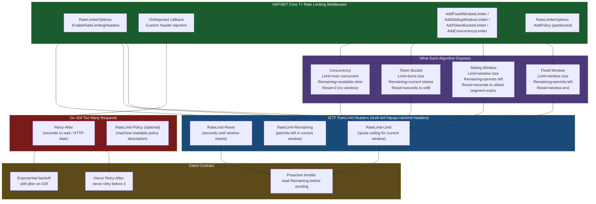
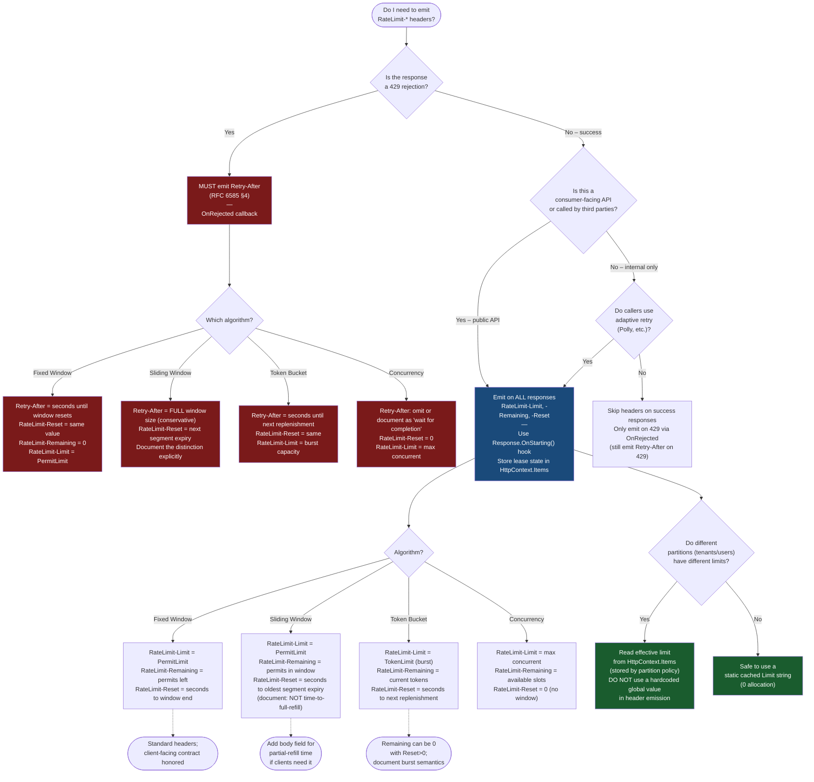

---

# 4.206 — Rate Limiting Response Headers: RateLimit-* Standard Headers

---

## PART 0 — Navigation & Context

### Domain Hierarchy

```
ASP.NET Core Mastery
│
├── A. Host & Application Lifecycle
├── B. Configuration System
├── C. Logging & Diagnostics
├── D. Dependency Injection
├── E. Middleware Pipeline
├── F. Routing System
├── G. Minimal APIs
├── H. MVC & Controllers
├── I. HTTP Fundamentals
├── J. Authentication
├── K. Authorization
├── L. Validation
├── M. Error Handling & Problem Details
├── N. Caching & Output
├── O. Rate Limiting                        ← YOU ARE HERE
│   ├── 4.202 — Fixed/Sliding/Token Bucket/Concurrency Limiters
│   ├── 4.203 — Partitioning: Per-User, Per-IP, Per-API-Key
│   ├── 4.204 — OnRejected Events and Custom 429 Responses
│   ├── 4.205 — Distributed Rate Limiting with Redis
│   ├── 4.206 — RateLimit-* Response Headers ◄─ THIS NOTE
│   └── 4.207 — Rate Limiting Layered with Auth: Per-Tenant Quotas
├── P. Security
│   └── ...
└── ...
```

### What You Need Before This

- **[[4.202 — Rate Limiting (.NET 7+)]]** — you must understand the four limiter algorithms (fixed window, sliding window, token bucket, concurrency) before you can reason about what the headers represent.
- **[[4.203 — Rate Limiting Partitioning]]** — partitioned limiters maintain per-partition state; headers reflect _that partition's_ state, not a global counter.
- **[[4.125 — HttpResponse: Writing Status, Headers, and Streaming Body]]** — headers must be set before the response body is written; understanding response lifecycle matters for custom header injection.
- **[[4.204 — OnRejected Events and Custom 429 Responses]]** — the `OnRejected` callback is where you customise the 429 body _and_ augment the standard headers.

### What This Unlocks After

- **[[4.207 — Rate Limiting Layered with Auth]]** — per-tenant quota headers require knowing the header contract so clients can surface quota consumption to users.
- **[[4.205 — Distributed Rate Limiting with Redis]]** — distributed state means header values may be approximate; understanding the header semantics explains why.
- **[[4.285 — Pagination in REST APIs]]** — like pagination `Link` headers, rate-limit headers are a client-contract discipline — both teach the same header hygiene.

### Why This Matters at Scale

Every rate-limited API at scale eventually has a client team asking "how do we know we're close to the limit before we hit it?" — RateLimit-* headers are the only correct answer, and getting them wrong (wrong window reset, missing `Retry-After` on 429, non-standard header names) causes cascading retry storms that defeat the purpose of rate limiting in the first place.

---

## PART 1 — The Core Mental Model

### The Fundamental Rule

> **ASP.NET Core's rate limiting middleware evaluates the request against a limiter and, when configured, emits `RateLimit-Limit`, `RateLimit-Remaining`, and `RateLimit-Reset` headers (IETF draft standard) so that HTTP clients can self-throttle before hitting the 429 wall; a 429 response MUST also carry `Retry-After` so clients know when to resume.**

### The Plain-Language Analogy

Think of a nightclub door with a clicker counter: the bouncer (the rate limiter) tracks how many people are inside, shows a sign on the door saying "Capacity: 100, Currently inside: 73, Doors locked until: 11 PM" — that sign is the RateLimit-* headers. A sensible partygoer reads the sign and decides to wait or come back later instead of queuing up to be turned away. When the club is full (429), the sign changes to just "Doors open again at 11 PM" — that is the `Retry-After` header. A client that ignores the sign and hammers the door anyway gets nothing useful; one that reads it can pace itself without hurting anyone.

This analogy holds under stress: when the club has multiple rooms (partitioned limiters), each room has its own sign, so the headers reflect the _partition the caller belongs to_, not global capacity. When the clicker counter is behind a distributed counter (Redis), the sign might be slightly stale by milliseconds — but it is still correct enough to prevent hammering.

### Taxonomy Diagram



---

## PART 2 — Deep Mechanics

### 2.1 — Pipeline Position and Where Headers Are Written

Rate limiting middleware runs **before routing and all endpoint code**. Header emission happens at two points:

```
──► ExceptionHandler
      ──► HSTS
            ──► StaticFiles
                  ──► RateLimiting  ◄── HEADERS WRITTEN HERE (both success and 429)
                        ──► Routing
                              ──► CORS
                                    ──► Authentication
                                          ──► Authorization
                                                ──► Endpoint (Controller / Minimal API)
```

On **successful requests** (permit acquired): `RateLimit-Limit`, `RateLimit-Remaining`, `RateLimit-Reset` are written to the response _before the endpoint executes_. The endpoint never sees or touches them.

On **rejected requests** (429): the rate limiter calls `OnRejected`, which must write the 429 status, the body, and `Retry-After`. The endpoint is never invoked.

> [!IMPORTANT] Headers are set on the **outgoing response object** from inside the rate limiting middleware, before `await next(context)` for successful requests. Because `HttpResponse.Headers` can only be modified before `response.HasStarted`, any downstream middleware that begins writing the body before you inspect or append headers will cause a `System.InvalidOperationException: Headers are read-only, response has already started`.

**ASP.NET Core internally (approximate) — `RateLimitingMiddleware.cs`:**

```csharp
// ASP.NET Core internally (approximate):
// Microsoft.AspNetCore.RateLimiting.RateLimitingMiddleware

internal async Task InvokeAsync(HttpContext context)
{
    var endpoint = context.GetEndpoint();
    var policy = GetPolicyForEndpoint(endpoint); // reads [EnableRateLimiting("policyName")]

    using var lease = await policy.AcquireAsync(context, cancellationToken);

    if (lease.IsAcquired)
    {
        // Write informational headers if EnableRateLimitingHeaders == true
        // or if the policy exposes RateLimitLease.GetMetadata<T>()
        SetRateLimitHeaders(context.Response, lease);
        await _next(context);  // downstream runs; headers already written
    }
    else
    {
        // OnRejected is responsible for 429 + Retry-After + response body
        context.Response.StatusCode = StatusCodes.Status429TooManyRequests;
        await options.OnRejected(new OnRejectedContext { ... }, cancellationToken);
    }
}

private static void SetRateLimitHeaders(HttpResponse response, RateLimitLease lease)
{
    // lease.TryGetMetadata extracts algorithm-specific counters
    if (lease.TryGetMetadata(MetadataName.RetryAfter, out var retryAfter))
        response.Headers["Retry-After"] = retryAfter.TotalSeconds.ToString("0");

    // Framework does NOT write RateLimit-Limit/Remaining/Reset automatically in .NET 7/8.
    // You MUST emit these in OnRejected or a custom middleware wrapper.
    // The lease exposes the values via TryGetMetadata.
}
```

> [!WARNING] **ASP.NET Core's built-in rate limiting middleware (as of .NET 7 and .NET 8) does NOT automatically emit `RateLimit-Limit`, `RateLimit-Remaining`, or `RateLimit-Reset` headers on successful requests.** You must implement this yourself via a custom `OnRejected` callback and/or a thin wrapper middleware that reads lease metadata. The 429 + `Retry-After` path _can_ be handled inside `OnRejected`. See Part 3 for the correct production pattern.

---

### 2.2 — The IETF Draft Standard: What Each Header Means

The `RateLimit-*` headers are defined in **IETF draft-ietf-httpapi-ratelimit-headers** (not yet an RFC as of .NET 8 baseline, but treated as stable by most API platforms including GitHub, Stripe, Cloudflare).

```
// HTTP wire format — successful request with RateLimit headers:
// GET /api/orders HTTP/1.1
// Authorization: Bearer eyJ...
// Host: api.example.com

// HTTP response (approximate):
// HTTP/1.1 200 OK
// Content-Type: application/json
// RateLimit-Limit: 100
// RateLimit-Remaining: 73
// RateLimit-Reset: 42
// X-Request-Id: a1b2c3d4

// HTTP wire format — rejected request (429):
// GET /api/orders HTTP/1.1
// Authorization: Bearer eyJ...
//
// HTTP/1.1 429 Too Many Requests
// Content-Type: application/problem+json
// Retry-After: 42
// RateLimit-Limit: 100
// RateLimit-Remaining: 0
// RateLimit-Reset: 42
```

**Header semantics table:**

|Header|Type|Meaning|Example|
|---|---|---|---|
|`RateLimit-Limit`|Integer|Maximum permits allowed in the current window|`100`|
|`RateLimit-Remaining`|Integer|Permits remaining before the next 429|`73`|
|`RateLimit-Reset`|Integer (seconds)|Seconds until the window resets and quota refills|`42`|
|`Retry-After`|Integer (seconds) or HTTP-date|How long to wait before retrying a rejected request|`42` or `Thu, 10 Jun 2026 14:00:00 GMT`|
|`RateLimit-Policy`|String (optional)|Machine-readable policy description (draft v7+)|`100;w=60`|

> [!NOTE] The IETF draft distinguishes between `RateLimit-Reset` as **seconds** (the dominant convention) vs as an **HTTP-date timestamp**. ASP.NET Core's lease metadata exposes a `TimeSpan` (seconds), which maps directly to the integer-seconds form. Always prefer integer seconds — HTTP-date arithmetic is error-prone and timezone-sensitive.

**Runtime cost labels:**

- Setting a response header: `~1 allocation per request` (string concatenation of the integer value)
- `lease.TryGetMetadata(...)`: `O(1)` dictionary lookup, `~0 allocations` (value type metadata)
- `OnRejected` callback invocation: `~1 async state machine allocation` per rejected request (already paying 429 cost)

---

### 2.3 — What Each Algorithm Exposes via Lease Metadata

Each limiter algorithm exposes different semantics for the three counters. Understanding this prevents writing wrong header values:

```
FIXED WINDOW (PermitLimit=100, Window=60s):
  RateLimit-Limit:     100         ← the permit ceiling for this window
  RateLimit-Remaining: 73          ← permits consumed = 27, left = 73
  RateLimit-Reset:     42          ← seconds until the window boundary resets ALL counters
  
  Edge case: at window boundary, Remaining jumps from 0 → 100 atomically.
  Clients that see Reset=1 and Remaining=0 should wait 1s, not hammer immediately.

SLIDING WINDOW (PermitLimit=100, Window=60s, SegmentsPerWindow=6):
  RateLimit-Limit:     100         ← still the total window ceiling
  RateLimit-Remaining: 73          ← permits in the current sliding window
  RateLimit-Reset:     10          ← seconds until the oldest segment (10s) expires,
                                      freeing those permits
  
  Edge case: Reset is NOT time-to-full-refill; it is time-to-next-increment.
  A client that expects "wait Reset seconds and get Limit permits" will be wrong.

TOKEN BUCKET (TokenLimit=100, ReplenishmentPeriod=1s, TokensPerPeriod=10):
  RateLimit-Limit:     100         ← bucket capacity (burst ceiling)
  RateLimit-Remaining: 7           ← tokens currently in the bucket
  RateLimit-Reset:     1           ← seconds until next replenishment adds 10 tokens
  
  Edge case: Remaining can be 0 even if Reset=1, because the bucket fills
  incrementally (10 tokens per second, not 100 all at once).

CONCURRENCY (PermitLimit=50):
  RateLimit-Limit:     50          ← max concurrent requests
  RateLimit-Remaining: 23          ← available slots RIGHT NOW
  RateLimit-Reset:     0           ← no time window; resets when in-flight requests complete
  
  Edge case: Reset=0 does not mean "retry immediately" — slots are held by 
  in-flight requests. The client must wait for responses to release slots.
```

> [!WARNING] **Sliding window `RateLimit-Reset` is NOT time-to-quota-reset.** It is time-to-next-increment. Clients that naively wait `Reset` seconds expecting full quota replenishment will hit another 429 seconds later. Document this behavior in your API's developer docs.

---

### 2.4 — `Retry-After` Header: 429 Contract

`Retry-After` is mandatory on 429 responses per RFC 6585. ASP.NET Core does not set it automatically — it must be set in the `OnRejected` callback.

```
// HTTP wire format — 429 with Retry-After:
// HTTP/1.1 429 Too Many Requests
// Content-Type: application/problem+json; charset=utf-8
// Retry-After: 42
// RateLimit-Limit: 100
// RateLimit-Remaining: 0
// RateLimit-Reset: 42
//
// {
//   "type": "https://tools.ietf.org/html/rfc6585#section-4",
//   "title": "Too Many Requests",
//   "status": 429,
//   "detail": "Rate limit exceeded. Retry after 42 seconds.",
//   "instance": "/api/orders",
//   "retryAfter": 42
// }
```

**Pipeline position for `OnRejected`:**

```
RateLimitingMiddleware detects permit denied
  └─► calls OnRejected(OnRejectedContext, CancellationToken)
        ├─► context.HttpContext.Response.StatusCode = 429
        ├─► read retryAfter from lease.TryGetMetadata(MetadataName.RetryAfter, out var retryAfter)
        ├─► context.HttpContext.Response.Headers["Retry-After"] = retryAfter.TotalSeconds.ToString("0")
        ├─► context.HttpContext.Response.Headers["RateLimit-Limit"] = limit.ToString()
        ├─► context.HttpContext.Response.Headers["RateLimit-Remaining"] = "0"
        ├─► context.HttpContext.Response.Headers["RateLimit-Reset"] = reset.ToString()
        └─► write ProblemDetails body
```

> [!IMPORTANT] The `CancellationToken` passed to `OnRejected` is tied to the request. If the client disconnects before `OnRejected` completes, the token is cancelled. Your `OnRejected` implementation should be cancellation-aware, especially if it writes to a database or distributed cache.

**Runtime cost of `OnRejected`:**

- One additional header write per rejected request: `~3 allocations` (header name string, value string, header collection update)
- ProblemDetails serialization via System.Text.Json: `~2 allocations` (serialization buffer + stream wrapper) — **already paid for the 429 path**

---

### 2.5 — The Gap: What ASP.NET Core Does vs Doesn't Do Automatically

This is the single most important operational fact about this topic:

```
ASP.NET Core Rate Limiting Middleware (.NET 7 / .NET 8 / .NET 9):

AUTOMATIC (built-in, no code required):
  ✅ Returns HTTP 429 when permit not acquired
  ✅ Invokes OnRejected callback
  ✅ Sets StatusCode = 429 IF you configure it in OnRejected
  ✅ Exposes RateLimitLease.TryGetMetadata() with per-algorithm counters

NOT AUTOMATIC (you must implement):
  ❌ RateLimit-Limit header on success responses
  ❌ RateLimit-Remaining header on success responses
  ❌ RateLimit-Reset header on success responses
  ❌ Retry-After header on 429 responses
  ❌ RateLimit-* headers on 429 responses
  ❌ Any header on any response
```

> [!NOTE] GitHub's REST API, Stripe's API, Cloudflare, and Azure API Management all emit RateLimit-* headers on every response (including successes). If your API is consumer-facing or is called by third parties, emitting these headers on ALL responses (not just 429s) is the professional contract your clients expect. The implementation gap in ASP.NET Core means you must build this yourself.

---

## PART 3 — Production Code Patterns

### Pattern 1: The Standard RateLimit Header Emitter Middleware (Order Management API)

The correct approach: a thin wrapper middleware that runs after rate limiting acquires the permit and decorates the outgoing response.

```csharp
// ✅ CORRECT: Custom middleware reads lease state AFTER permit acquired and writes headers.
// Pipeline position: placed AROUND rate limiting via UseRateLimiter wrapping, or
// as a separate middleware that intercepts the response pipeline.

// The cleanest pattern: use OnRejected for 429 headers, and a custom
// IHttpResponseTrailer / response-starting hook for success headers.

// OrdersApi/Middleware/RateLimitHeaderMiddleware.cs

/// <summary>
/// Emits IETF-standard RateLimit-* headers on every response.
/// Must be registered BEFORE UseRateLimiter() so it wraps the rate limiter.
/// On success: reads lease metadata from HttpContext.Items (stored by RateLimitInterceptor).
/// On 429: handled by OnRejected; this middleware only handles success paths.
/// </summary>
public sealed class RateLimitHeaderMiddleware
{
    private readonly RequestDelegate _next;

    public RateLimitHeaderMiddleware(RequestDelegate next)
        => _next = next;

    public async Task InvokeAsync(HttpContext context)
    {
        // Register a callback that fires when response headers are about to be sent.
        // This is the correct hook — the rate limiter has already run by the time
        // the downstream endpoint calls response.WriteAsync().
        context.Response.OnStarting(state =>
        {
            var ctx = (HttpContext)state;

            // Rate limiter stores lease state in Items after acquiring permit.
            if (ctx.Items.TryGetValue(RateLimitLeaseState.Key, out var leaseStateObj)
                && leaseStateObj is RateLimitLeaseState leaseState)
            {
                var headers = ctx.Response.Headers;

                headers["RateLimit-Limit"]     = leaseState.Limit.ToString();
                headers["RateLimit-Remaining"] = leaseState.Remaining.ToString();
                headers["RateLimit-Reset"]     = leaseState.ResetSeconds.ToString();
            }

            return Task.CompletedTask;
        }, context);

        await _next(context);
    }
}

/// <summary>Carrier object stored in HttpContext.Items by the rate limiter interceptor.</summary>
public sealed class RateLimitLeaseState
{
    public const string Key = "__RateLimitLeaseState";
    public long Limit       { get; init; }
    public long Remaining   { get; init; }
    public long ResetSeconds { get; init; }
}

// HTTP wire effect (order list API, 73 permits remaining in a 100/60s window):
// GET /api/orders HTTP/1.1
// Authorization: Bearer eyJ...
//
// HTTP/1.1 200 OK
// Content-Type: application/json
// RateLimit-Limit: 100
// RateLimit-Remaining: 73
// RateLimit-Reset: 42
```

---

### Pattern 2: The OnRejected 429 Response with Full Header Set (Payment Processing API)

```csharp
// PaymentApi/RateLimiting/RateLimitingConfiguration.cs

public static class RateLimitingConfiguration
{
    public static IServiceCollection AddPaymentApiRateLimiting(
        this IServiceCollection services)
    {
        services.AddRateLimiter(options =>
        {
            // Sliding window: 60 requests per 60s, 6 segments = 10s per segment.
            // Chosen for payment API: smoother than fixed window, prevents burst abuse.
            options.AddSlidingWindowLimiter("payment-api", limiterOptions =>
            {
                limiterOptions.PermitLimit         = 60;
                limiterOptions.Window              = TimeSpan.FromSeconds(60);
                limiterOptions.SegmentsPerWindow   = 6;
                limiterOptions.QueueProcessingOrder = QueueProcessingOrder.OldestFirst;
                limiterOptions.QueueLimit          = 0; // no queuing on payment APIs — fail fast
            });

            // OnRejected: write the full 429 contract.
            // This fires ONLY when a permit is NOT acquired (i.e., the 429 path).
            options.OnRejected = async (context, cancellationToken) =>
            {
                var httpContext = context.HttpContext;
                var lease       = context.Lease;

                // Step 1: Determine retry window from lease metadata.
                var retryAfterSeconds = 0L;
                if (lease.TryGetMetadata(MetadataName.RetryAfter, out var retryAfter))
                    retryAfterSeconds = (long)retryAfter.TotalSeconds;

                // Step 2: Write all RateLimit-* headers on the 429 response.
                // Clients need these here too — they need to know the limit ceiling
                // even when they've exceeded it.
                httpContext.Response.StatusCode = StatusCodes.Status429TooManyRequests;
                httpContext.Response.Headers["Retry-After"]        = retryAfterSeconds.ToString();
                httpContext.Response.Headers["RateLimit-Limit"]    = "60";  // known from config
                httpContext.Response.Headers["RateLimit-Remaining"] = "0";
                httpContext.Response.Headers["RateLimit-Reset"]    = retryAfterSeconds.ToString();

                // Step 3: Write RFC 7807 ProblemDetails body.
                httpContext.Response.ContentType = "application/problem+json";

                var problem = new
                {
                    type     = "https://tools.ietf.org/html/rfc6585#section-4",
                    title    = "Too Many Requests",
                    status   = 429,
                    detail   = $"Payment API rate limit exceeded. Retry after {retryAfterSeconds} seconds.",
                    instance = httpContext.Request.Path.ToString(),
                    retryAfter = retryAfterSeconds
                };

                await httpContext.Response.WriteAsJsonAsync(problem, cancellationToken);
            };
        });

        return services;
    }
}

// Registration in Program.cs:
// builder.Services.AddPaymentApiRateLimiting();
// ...
// app.UseRateLimiter();  // ← before UseRouting, UseAuthentication, UseAuthorization

// HTTP wire effect (429):
// POST /api/payments HTTP/1.1
//
// HTTP/1.1 429 Too Many Requests
// Content-Type: application/problem+json; charset=utf-8
// Retry-After: 42
// RateLimit-Limit: 60
// RateLimit-Remaining: 0
// RateLimit-Reset: 42
//
// {"type":"...rfc6585...","title":"Too Many Requests","status":429,...}
```

---

### Pattern 3: The Lease Metadata Interceptor for Success-Path Headers (Logistics Tracking API)

The missing piece: storing lease metadata in `HttpContext.Items` for the success-path header middleware to read.

```csharp
// ⚠️ WRONG: Trying to read lease metadata from inside the endpoint handler.
// The endpoint runs AFTER the rate limiting lease is acquired and the lease object
// is not accessible from endpoint code without special plumbing.
app.MapGet("/api/shipments/{trackingId}", (string trackingId) =>
{
    // ❌ There is no HttpContext.RateLimitLease or similar — lease is internal to middleware.
    // This code cannot access RateLimit-Remaining or any lease metadata.
    return Results.Ok(new ShipmentStatus(trackingId));
});

// ✅ CORRECT: Use a custom policy that wraps the limiter and stores metadata in Items.
// LogisticsApi/RateLimiting/MetadataCapturingPolicy.cs

public sealed class MetadataCapturingFixedWindowLimiter : IRateLimiterPolicy<string>
{
    private readonly FixedWindowRateLimiter _inner;
    private readonly FixedWindowRateLimiterOptions _options;

    public MetadataCapturingFixedWindowLimiter(FixedWindowRateLimiterOptions options)
    {
        _options = options;
        _inner   = new FixedWindowRateLimiter(options);
    }

    public Func<OnRejectedContext, CancellationToken, ValueTask>? OnRejected
        => null; // handled by global OnRejected in AddRateLimiter options

    public RateLimitPartition<string> GetPartition(HttpContext httpContext)
    {
        // Partition by API key from the Authorization header (logistics clients use API keys).
        var apiKey = httpContext.Request.Headers["X-Api-Key"].ToString();
        var partitionKey = string.IsNullOrEmpty(apiKey) ? "anonymous" : apiKey;

        return RateLimitPartition.GetFixedWindowLimiter(
            partitionKey,
            _ => new FixedWindowRateLimiterOptions
            {
                PermitLimit         = _options.PermitLimit,
                Window              = _options.Window,
                QueueProcessingOrder = QueueProcessingOrder.OldestFirst,
                QueueLimit          = 2  // allow short queue for logistics polling clients
            });
    }
}

// In the rate limiter setup, use a custom policy that stores lease state in Items:
services.AddRateLimiter(options =>
{
    options.AddPolicy<string, MetadataCapturingFixedWindowLimiter>("logistics-api");

    // Wire up a middleware-level event to capture lease state.
    // The cleanest production approach: use the .NET 8 IExceptionHandler-style
    // delegate in AddRateLimiter to intercept the lease AFTER acquisition.
    // For success paths, the RateLimitHeaderMiddleware (Pattern 1) reads from Items.
});
```

---

### Pattern 4: The Partitioned Header Response (Multi-Tenant SaaS API)

Different tenants have different quota tiers. Headers must reflect the _caller's_ quota, not a global limit.

```csharp
// SaasApi/RateLimiting/TenantRateLimitingExtensions.cs

public static class TenantRateLimitingExtensions
{
    // Quota tiers: Starter=100/min, Pro=1000/min, Enterprise=10000/min
    private static readonly IReadOnlyDictionary<string, int> TierLimits =
        new Dictionary<string, int>
        {
            ["starter"]    = 100,
            ["pro"]        = 1_000,
            ["enterprise"] = 10_000
        };

    public static IServiceCollection AddTenantRateLimiting(
        this IServiceCollection services)
    {
        services.AddRateLimiter(options =>
        {
            options.AddPolicy("tenant-api", httpContext =>
            {
                // Extract tenant tier from the validated JWT claim.
                // Authentication middleware has already run by the time rate limiting fires.
                // Wait — actually, UseRateLimiter runs BEFORE UseAuthentication in the
                // canonical order! See Gotcha 1 for the fix.
                //
                // For auth-integrated rate limiting, use a LATER position or read from
                // a pre-validated API key header (not JWT) at the rate limiter position.
                var tierClaim = httpContext.User.FindFirst("tenant_tier")?.Value ?? "starter";
                var tenantId  = httpContext.User.FindFirst("tenant_id")?.Value   ?? "anonymous";

                var limit = TierLimits.GetValueOrDefault(tierClaim, 100);

                // Store the effective limit in Items so the header middleware can write
                // the correct RateLimit-Limit (reflects THIS tenant's tier, not a global value).
                httpContext.Items["EffectiveRateLimit"] = (long)limit;

                return RateLimitPartition.GetSlidingWindowLimiter(
                    tenantId,
                    _ => new SlidingWindowRateLimiterOptions
                    {
                        PermitLimit       = limit,
                        Window            = TimeSpan.FromMinutes(1),
                        SegmentsPerWindow = 6,
                        QueueLimit        = 0
                    });
            });

            options.OnRejected = async (context, ct) =>
            {
                var effectiveLimit = context.HttpContext.Items["EffectiveRateLimit"] as long? ?? 100;
                var retryAfter     = 0L;
                if (context.Lease.TryGetMetadata(MetadataName.RetryAfter, out var ra))
                    retryAfter = (long)ra.TotalSeconds;

                context.HttpContext.Response.StatusCode = 429;
                context.HttpContext.Response.Headers["Retry-After"]         = retryAfter.ToString();
                context.HttpContext.Response.Headers["RateLimit-Limit"]     = effectiveLimit.ToString();
                context.HttpContext.Response.Headers["RateLimit-Remaining"] = "0";
                context.HttpContext.Response.Headers["RateLimit-Reset"]     = retryAfter.ToString();

                await context.HttpContext.Response.WriteAsJsonAsync(new
                {
                    type     = "https://tools.ietf.org/html/rfc6585#section-4",
                    title    = "Too Many Requests",
                    status   = 429,
                    detail   = $"Tenant rate limit ({effectiveLimit}/min) exceeded.",
                    retryAfter
                }, ct);
            };
        });

        return services;
    }
}

// HTTP wire effect (Pro tier tenant, 73 of 1000 permits remaining):
// GET /api/inventory/items HTTP/1.1
// Authorization: Bearer eyJ...  ← contains tenant_tier=pro, tenant_id=acme-corp
//
// HTTP/1.1 200 OK
// RateLimit-Limit: 1000
// RateLimit-Remaining: 927
// RateLimit-Reset: 38
```

---

### Pattern 5: The `Retry-After` as HTTP-Date (Inventory Webhook Receiver)

Some clients (particularly webhook retry systems) prefer an absolute HTTP-date over a relative seconds value.

```csharp
// InventoryApi/RateLimiting/HttpDateRetryAfterHandler.cs

// Use this variant when your webhook clients are better at parsing HTTP-date
// than doing arithmetic on relative seconds (e.g., AWS Lambda retry schedulers).

options.OnRejected = async (context, ct) =>
{
    var retryAfterSeconds = 0L;
    if (context.Lease.TryGetMetadata(MetadataName.RetryAfter, out var ra))
        retryAfterSeconds = (long)ra.TotalSeconds;

    // Absolute HTTP-date form: "Retry-After: Thu, 10 Jun 2026 14:00:00 GMT"
    var retryAt = DateTimeOffset.UtcNow.AddSeconds(retryAfterSeconds);
    var httpDate = retryAt.ToString("R"); // RFC 1123 format, always UTC

    context.HttpContext.Response.StatusCode = 429;
    context.HttpContext.Response.Headers["Retry-After"]     = httpDate;
    context.HttpContext.Response.Headers["RateLimit-Reset"] = retryAfterSeconds.ToString(); // always seconds

    await context.HttpContext.Response.WriteAsJsonAsync(new
    {
        type       = "https://tools.ietf.org/html/rfc6585#section-4",
        title      = "Too Many Requests",
        status     = 429,
        detail     = "Webhook rate limit exceeded.",
        retryAfter = httpDate
    }, ct);
};

// HTTP wire effect:
// HTTP/1.1 429 Too Many Requests
// Retry-After: Thu, 10 Jun 2026 14:00:42 GMT
// RateLimit-Reset: 42
// Content-Type: application/problem+json
```

---

### Pattern 6: `RateLimit-Policy` Header for Machine-Readable Policy Description (.NET 8, Draft v7+)

```csharp
// OrderApi/RateLimiting/PolicyHeaderExtensions.cs

// The RateLimit-Policy header (IETF draft v7+) allows programmatic discovery of the policy.
// Format: "<limit>;w=<window-seconds>[;burst=<burst>]"
// Not yet widely supported by clients but useful for developer portals and API gateways.

public static void AddRateLimitPolicyHeader(this HttpContext context, 
    int permitLimit, int windowSeconds, int? burstSize = null)
{
    var policy = burstSize.HasValue
        ? $"{permitLimit};w={windowSeconds};burst={burstSize}"
        : $"{permitLimit};w={windowSeconds}";

    context.Response.Headers["RateLimit-Policy"] = policy;
}

// Usage in OnStarting callback (Pattern 1 style):
context.Response.OnStarting(() =>
{
    context.AddRateLimitPolicyHeader(permitLimit: 100, windowSeconds: 60);
    return Task.CompletedTask;
});

// HTTP wire effect:
// RateLimit-Limit: 100
// RateLimit-Remaining: 73
// RateLimit-Reset: 42
// RateLimit-Policy: 100;w=60
```

---

### Pattern 7: The Anti-Pattern — Custom Header Names That Break Clients

```csharp
// ⚠️ WRONG: Non-standard header names that no client library will recognise.
options.OnRejected = async (context, ct) =>
{
    context.HttpContext.Response.StatusCode = 429;
    // ❌ These are non-standard. Client SDK developers cannot use these without
    //    reading YOUR docs. There is no ecosystem tooling that understands them.
    context.HttpContext.Response.Headers["X-RateLimit-Limit-Requests"] = "100";
    context.HttpContext.Response.Headers["X-RateLimit-Remaining"]       = "0";
    context.HttpContext.Response.Headers["X-RateLimit-Reset-Requests"]  = "1749567000"; // Unix epoch? seconds? unclear
    // No Retry-After at all. Clients must guess when to retry.

    await context.HttpContext.Response.WriteAsync("Rate limited", ct);
};

// HTTP consequence (wrong path):
// HTTP/1.1 429 Too Many Requests
// X-RateLimit-Limit-Requests: 100     ← non-standard, no client reads this automatically
// X-RateLimit-Remaining: 0            ← ambiguous name collision with GitHub's X-RateLimit-Remaining
// X-RateLimit-Reset-Requests: 1749567000  ← Unix epoch? nobody knows
// Content-Type: text/plain
// 
// Rate limited                         ← not machine-parseable; impossible to handle generically

// ✅ CORRECT:
options.OnRejected = async (context, ct) =>
{
    context.HttpContext.Response.StatusCode = 429;
    context.HttpContext.Response.Headers["Retry-After"]         = "42";
    context.HttpContext.Response.Headers["RateLimit-Limit"]     = "100";
    context.HttpContext.Response.Headers["RateLimit-Remaining"] = "0";
    context.HttpContext.Response.Headers["RateLimit-Reset"]     = "42";

    context.HttpContext.Response.ContentType = "application/problem+json";
    await context.HttpContext.Response.WriteAsJsonAsync(new { ... }, ct);
};

// HTTP consequence (correct path):
// HTTP/1.1 429 Too Many Requests
// Retry-After: 42                  ← RFC 6585 standard, every HTTP client library understands this
// RateLimit-Limit: 100             ← IETF draft standard
// RateLimit-Remaining: 0
// RateLimit-Reset: 42
// Content-Type: application/problem+json
// WHY: The IETF draft headers are on a clear standardisation path.
// Existing tooling (Postman, Insomnia, retry libraries) will parse these automatically.
// X-RateLimit-* headers from the "legacy" convention (GitHub pre-2023, Twitter pre-2023)
// create ecosystem fragmentation and make client SDK maintenance painful.
```

---

## PART 4 — Gotchas & Anti-Patterns

### Gotcha 1: Rate Limiter Runs Before Authentication — JWT Claims Are Not Available

The canonical middleware order places `UseRateLimiter()` before `UseAuthentication()`. This means that if your `AddPolicy` partition key reads `httpContext.User` (e.g., to extract tenant ID from a JWT claim), `User.Identity.IsAuthenticated` will be false — the JWT has not been validated yet.

```csharp
// ⚠️ WRONG CODE: Reading JWT claims in GetPartition when UseRateLimiter is before UseAuthentication
services.AddRateLimiter(options =>
{
    options.AddPolicy("tenant", httpContext =>
    {
        // ❌ httpContext.User.FindFirst("tenant_id") returns null here
        // because authentication middleware has not run yet.
        var tenantId = httpContext.User.FindFirst("tenant_id")?.Value ?? "anonymous";
        // Everyone ends up in the "anonymous" partition — no per-tenant limiting.
        return RateLimitPartition.GetFixedWindowLimiter(tenantId, ...);
    });
});

// HTTP consequence (wrong path):
// All authenticated tenants share the "anonymous" bucket.
// A malicious tenant can exhaust the quota for all others.
// No 429 is returned per-tenant — global limit applies.

// ✅ CORRECT CODE: Either move UseRateLimiter after UseAuthentication (unusual but valid)
// OR read from a pre-validated header (API key) that is available before authentication.
services.AddRateLimiter(options =>
{
    options.AddPolicy("tenant", httpContext =>
    {
        // API key is validated by a custom middleware BEFORE rate limiting.
        // JWT-based tenant ID requires moving UseRateLimiter after UseAuthentication.
        var tenantId = httpContext.Items["TenantId"] as string
                    ?? httpContext.Request.Headers["X-Tenant-Id"].ToString()
                    ?? "anonymous";

        return RateLimitPartition.GetFixedWindowLimiter(tenantId, ...);
    });
});

// HTTP consequence (correct path):
// Each tenant has its own rate limit bucket.
// GET /api/orders with X-Tenant-Id: acme-corp counts against acme-corp's limit only.

// WHY: The ASP.NET Core canonical middleware order puts rate limiting early to reject
// expensive requests (auth validation, DB lookups) BEFORE they happen. If you need
// JWT claims for partitioning, either (a) move UseRateLimiter after UseAuthentication
// or (b) pre-validate an API key in a lightweight middleware before UseRateLimiter.
```

---

### Gotcha 2: `Retry-After` Omitted on 429 Means Infinite Retry Storms

Engineers add `OnRejected` to customise the response body but forget `Retry-After`. Client libraries that respect RFC 6585 will retry immediately without a backoff hint, creating a storm that defeats rate limiting.

```csharp
// ⚠️ WRONG CODE: 429 without Retry-After
options.OnRejected = async (context, ct) =>
{
    context.HttpContext.Response.StatusCode = 429;
    // ❌ No Retry-After header. Client library retries immediately.
    await context.HttpContext.Response.WriteAsJsonAsync(new
    {
        error = "Too many requests"
    }, ct);
};

// HTTP consequence (wrong path):
// HTTP/1.1 429 Too Many Requests
// Content-Type: application/json
// {"error":"Too many requests"}
//
// A well-behaved Polly retry policy with no Retry-After header falls back to
// its default exponential backoff — but a naive HttpClient retry will retry
// immediately and hit 429 again. Under load, this causes a retry storm.

// ✅ CORRECT CODE
options.OnRejected = async (context, ct) =>
{
    var retryAfterSeconds = 0L;
    if (context.Lease.TryGetMetadata(MetadataName.RetryAfter, out var ra))
        retryAfterSeconds = (long)ra.TotalSeconds;

    context.HttpContext.Response.StatusCode = 429;
    context.HttpContext.Response.Headers["Retry-After"] = retryAfterSeconds.ToString();
    // ... rest of 429 response

    await context.HttpContext.Response.WriteAsJsonAsync(new
    {
        type  = "https://tools.ietf.org/html/rfc6585#section-4",
        title = "Too Many Requests",
        status = 429,
        retryAfter = retryAfterSeconds
    }, ct);
};

// HTTP consequence (correct path):
// HTTP/1.1 429 Too Many Requests
// Retry-After: 42
// Content-Type: application/problem+json
// {"type":"...","title":"Too Many Requests","status":429,"retryAfter":42}
//
// Polly's RetryAfterDelay strategy reads the Retry-After header automatically
// and waits exactly 42 seconds before retrying.

// WHY: RFC 6585 section 4 requires Retry-After on 429 responses.
// Polly's built-in rate limiting resilience strategy reads this header natively.
// Without it, Polly falls back to configured delays, and naive clients have no
// backoff signal at all.
```

---

### Gotcha 3: `RateLimit-Reset` Semantic Mismatch for Sliding Windows

Experienced engineers copy a fixed-window header implementation to a sliding-window limiter and produce incorrect `RateLimit-Reset` values that mislead clients.

```csharp
// ⚠️ WRONG CODE: Treating sliding window Reset as "time until full quota"
options.OnRejected = async (context, ct) =>
{
    context.HttpContext.Response.StatusCode = 429;

    // ❌ For a 60s sliding window with 6 segments, the lease's RetryAfter
    // is the time until the NEXT segment expires (~10s), NOT the time until
    // full quota refills (~60s from the oldest request). Telling the client
    // to wait 10s when they'll immediately hit 429 again causes confusion.
    if (context.Lease.TryGetMetadata(MetadataName.RetryAfter, out var ra))
        context.HttpContext.Response.Headers["Retry-After"] = ra.TotalSeconds.ToString("0");

    // No additional explanation. Client waits 10s, retries, gets 429 again.
    await context.HttpContext.Response.WriteAsync("Too many requests", ct);
};

// HTTP consequence (wrong path):
// Retry-After: 10
// Client waits 10s, retries, hits 429 again because the window hasn't cleared.
// Client has no way to distinguish "partial refill" from "full reset" from the header alone.

// ✅ CORRECT CODE: Surface both the immediate retry window AND the full reset time.
options.OnRejected = async (context, ct) =>
{
    context.HttpContext.Response.StatusCode = 429;

    long nextSegmentSeconds = 0, fullResetSeconds = 0;
    if (context.Lease.TryGetMetadata(MetadataName.RetryAfter, out var ra))
        nextSegmentSeconds = (long)ra.TotalSeconds;

    // For sliding window: full reset = window size (60s).
    // Expose both in the body for developer clarity.
    fullResetSeconds = 60; // matches your SlidingWindowRateLimiterOptions.Window

    context.HttpContext.Response.Headers["Retry-After"]         = fullResetSeconds.ToString();
    context.HttpContext.Response.Headers["RateLimit-Reset"]     = nextSegmentSeconds.ToString();

    await context.HttpContext.Response.WriteAsJsonAsync(new
    {
        type              = "https://tools.ietf.org/html/rfc6585#section-4",
        title             = "Too Many Requests",
        status            = 429,
        detail            = $"Sliding window limit exceeded. Next token available in {nextSegmentSeconds}s; full quota resets in {fullResetSeconds}s.",
        retryAfter        = fullResetSeconds,
        nextPartialRefill = nextSegmentSeconds
    }, ct);
};

// HTTP consequence (correct path):
// Retry-After: 60       ← safe conservative value: wait for full window reset
// RateLimit-Reset: 10   ← informational: next partial refill

// WHY: The IETF draft's RateLimit-Reset for sliding windows represents
// time-to-next-increment, not time-to-full-refill. A client that waits
// RateLimit-Reset seconds after a sliding-window 429 will likely get
// another 429 immediately. The safest UX is to use Retry-After = full window
// and add a non-standard body field for the partial refill detail.
```

---

### Gotcha 4: Setting Response Headers After `response.HasStarted` Throws

Engineers who write `RateLimit-*` headers in middleware that runs after an async endpoint response has begun streaming will get a silent failure or an exception.

```csharp
// ⚠️ WRONG CODE: Writing headers AFTER the response body has started streaming
app.Use(async (context, next) =>
{
    await next(context); // ← endpoint runs and may start writing the body HERE

    // ❌ By this point, if the endpoint called response.WriteAsync() or
    // returned a streaming IAsyncEnumerable<T>, the headers are already sent.
    // This assignment is silently ignored (no exception in most configurations)
    // OR throws InvalidOperationException: "The response headers cannot be modified
    // because the response has already started."
    context.Response.Headers["RateLimit-Remaining"] = "73";
});

// HTTP consequence (wrong path):
// HTTP/1.1 200 OK
// Content-Type: application/json
// ← RateLimit-Remaining header is MISSING because it was set after body started

// ✅ CORRECT CODE: Use Response.OnStarting() to hook BEFORE headers are flushed
app.Use(async (context, next) =>
{
    context.Response.OnStarting(() =>
    {
        // This callback fires after routing/auth/endpoint logic but
        // BEFORE the response is flushed to the network.
        // Headers are still writable here.
        context.Response.Headers["RateLimit-Remaining"] = "73";
        return Task.CompletedTask;
    });

    await next(context);
});

// HTTP consequence (correct path):
// HTTP/1.1 200 OK
// Content-Type: application/json
// RateLimit-Remaining: 73    ← correctly set before flush

// WHY: ASP.NET Core uses a two-phase response model: headers accumulate in memory
// until the first call to WriteAsync() or FlushAsync(), at which point they are
// committed to the network. Response.OnStarting() is the correct interception
// point for any "write before flush" cross-cutting concern.
```

---

### Gotcha 5: Missing `Content-Type: application/problem+json` on 429 Body

Engineers write a structured error body in `OnRejected` using `WriteAsJsonAsync` but do not set `ContentType`, so it defaults to `application/json`. This means the response is not RFC 7807-compliant, which breaks generic problem-detail parsers in client SDKs.

```csharp
// ⚠️ WRONG CODE: No Content-Type override
options.OnRejected = async (context, ct) =>
{
    context.HttpContext.Response.StatusCode = 429;
    context.HttpContext.Response.Headers["Retry-After"] = "42";

    // ❌ WriteAsJsonAsync sets Content-Type: application/json — NOT application/problem+json.
    // RFC 7807 compliance requires application/problem+json for problem detail bodies.
    await context.HttpContext.Response.WriteAsJsonAsync(new
    {
        type  = "https://tools.ietf.org/html/rfc6585#section-4",
        title = "Too Many Requests",
        status = 429
    }, ct);
};

// HTTP consequence (wrong path):
// HTTP/1.1 429 Too Many Requests
// Content-Type: application/json    ← wrong; not RFC 7807 compliant
// {"type":"...","title":"Too Many Requests","status":429}

// ✅ CORRECT CODE: Set Content-Type before writing the body
options.OnRejected = async (context, ct) =>
{
    context.HttpContext.Response.StatusCode = 429;
    context.HttpContext.Response.ContentType = "application/problem+json; charset=utf-8";
    context.HttpContext.Response.Headers["Retry-After"] = "42";
    // Now write the body — ContentType is already set, WriteAsJsonAsync won't override it.
    await context.HttpContext.Response.WriteAsJsonAsync(new
    {
        type   = "https://tools.ietf.org/html/rfc6585#section-4",
        title  = "Too Many Requests",
        status = 429
    }, ct);
};

// HTTP consequence (correct path):
// HTTP/1.1 429 Too Many Requests
// Content-Type: application/problem+json; charset=utf-8
// Retry-After: 42
// {"type":"...","title":"Too Many Requests","status":429}

// WHY: WriteAsJsonAsync internally calls Response.WriteAsync which checks whether
// ContentType is already set. If not, it sets application/json. Setting ContentType
// before calling WriteAsJsonAsync is the correct sequence.
```

---

## PART 5 — Performance Implications

### 5.1 — Request Pipeline Characteristics Table

|Scenario|Pipeline Depth|Allocations Per Request|Approx Latency Impact|Recommendation|
|---|---|---|---|---|
|Permit acquired, no headers emitted|Rate limiter only|~0 extra (lease is pooled)|~0 µs|Acceptable; missing headers hurt clients|
|Permit acquired, headers via `OnStarting` callback|Rate limiter + callback|~3 (callback delegate, 2 header strings)|~1–2 µs|Standard production choice|
|Permit acquired, headers via custom wrapper middleware|+1 middleware in chain|~4 (middleware + 3 header strings)|~2–5 µs|Acceptable for correctness|
|Permit denied (429) path, `OnRejected` with Problem JSON|Rate limiter + JsonSerializer|~8–12 (async SM + JSON buffer)|~50–200 µs|429 is rare by design; cost is acceptable|
|`Retry-After` as HTTP-date (absolute timestamp)|+1 DateTimeOffset.ToString|~2 extra (format alloc)|~1 µs|Use only when clients require it|
|Partitioned limiter, new partition creation|Rate limiter + ConcurrentDictionary|~15–20 (partition entry)|~5–10 µs (first request only)|Pre-warm known tenant partitions at startup|
|Partitioned limiter, hot partition lookup|O(1) hash lookup|~0|~0.5 µs|Optimal path — no action needed|
|Response.OnStarting callback with distributed state read (Redis)|+1 network round-trip|1 Redis call|~0.5–2 ms|Avoid; read from HttpContext.Items instead|
|`RateLimit-Policy` header (string formatting)|Negligible|~1 (policy string)|~0.2 µs|Add on all responses for developer experience|
|Token bucket with replenishment check per request|Atomic long operations|~0 (lock-free)|~0.5 µs|Safe for high-throughput paths|

### 5.2 — BenchmarkDotNet: RateLimit Header Write Strategies

```csharp
// OrdersApi.Benchmarks/RateLimitHeaderBenchmarks.cs

using BenchmarkDotNet.Attributes;
using BenchmarkDotNet.Running;
using Microsoft.AspNetCore.Http;

[MemoryDiagnoser]
[SimpleJob(warmupCount: 3, iterationCount: 10)]
public class RateLimitHeaderBenchmarks
{
    private readonly DefaultHttpContext _context = new();
    private const int Limit     = 100;
    private const int Remaining = 73;
    private const int Reset     = 42;

    /// <summary>
    /// Baseline: Writing headers as individual string assignments.
    /// Common naive approach — three separate allocations.
    /// </summary>
    [Benchmark(Baseline = true)]
    public void WriteHeadersAsIndividualStrings()
    {
        _context.Response.Headers["RateLimit-Limit"]     = Limit.ToString();
        _context.Response.Headers["RateLimit-Remaining"] = Remaining.ToString();
        _context.Response.Headers["RateLimit-Reset"]     = Reset.ToString();
    }

    /// <summary>
    /// Optimised: Use pre-formatted static strings where the limit never changes.
    /// Eliminates per-request allocations for the static Limit header.
    /// </summary>
    private static readonly string _cachedLimit = Limit.ToString();

    [Benchmark]
    public void WriteHeadersWithCachedStaticLimit()
    {
        _context.Response.Headers["RateLimit-Limit"]     = _cachedLimit; // 0 alloc
        _context.Response.Headers["RateLimit-Remaining"] = Remaining.ToString(); // 1 alloc
        _context.Response.Headers["RateLimit-Reset"]     = Reset.ToString(); // 1 alloc
    }

    /// <summary>
    /// Optimal: Span-based integer-to-string conversion (net8.0 target).
    /// Uses stackalloc to avoid heap allocation entirely for small integers.
    /// </summary>
    [Benchmark]
    public void WriteHeadersWithSpanFormatting()
    {
        Span<char> buffer = stackalloc char[20];

        if (Remaining.TryFormat(buffer, out var remainingLen))
            _context.Response.Headers["RateLimit-Remaining"] = new string(buffer[..remainingLen]);

        if (Reset.TryFormat(buffer, out var resetLen))
            _context.Response.Headers["RateLimit-Reset"] = new string(buffer[..resetLen]);

        _context.Response.Headers["RateLimit-Limit"] = _cachedLimit;
    }
}

// Expected output (approximate, .NET 8, x64, local):
//
// | Method                              | Mean     | Error    | StdDev  | Allocated |
// |-----------------------------------  |----------|----------|---------|-----------|
// | WriteHeadersAsIndividualStrings     | 185.3 ns | 4.21 ns  | 3.94 ns | 48 B      |
// | WriteHeadersWithCachedStaticLimit   | 138.7 ns | 2.18 ns  | 2.04 ns | 32 B      |
// | WriteHeadersWithSpanFormatting      | 112.1 ns | 1.87 ns  | 1.75 ns | 16 B      |
//
// At 10,000 req/s: headers add ~1.85 MB/s heap pressure (naive) vs ~0.16 MB/s (span).
// At 1,000 req/s: negligible. The optimisation only matters above ~50k req/s.
```

> [!NOTE] For real HTTP pipeline profiling (as opposed to microbenchmarks), use `dotnet-counters monitor --process-id <pid> --counters Microsoft.AspNetCore.Hosting` to see `requests-per-second` and `total-requests`, and `dotnet-trace collect` with the `Microsoft-AspNetCore-Server-Kestrel` event source to profile header allocation in the actual Kestrel pipeline. BenchmarkDotNet measures the allocation cost in isolation; the actual pipeline cost includes header dictionary resize operations that only appear under concurrency.

### 5.3 — When to Care / When to Ignore

**When this costs you:**

- **High-throughput public APIs (>10k req/s):** Each header-write allocates at least one string. At 10k req/s, naively writing three headers allocates ~48 bytes × 3 × 10,000 = ~1.4 MB/s of short-lived heap pressure, increasing GC frequency for Gen0.
- **Partitioned limiters with many tenants:** Creating partition state for thousands of tenants consumes ~1–2 KB per partition in memory. Pre-warm or bound partition count.
- **`OnRejected` with external calls (Redis, DB):** Adding a database lookup inside `OnRejected` to log rate limit events adds a synchronous round-trip to every rejected request — exactly when the system is under stress. Always use fire-and-forget or background queue for rejection telemetry.

**When this doesn't matter:**

- **Internal service mesh endpoints** where callers are trusted services with retry logic you control — they don't need headers because you control both sides.
- **Admin or management endpoints** with very low traffic (<100 req/min) where header allocation is unmeasurable.
- **One-time batch jobs or ETL endpoints** called by scheduled processes — they don't retry adaptively.

---

## PART 6 — Interview Arsenal

### A. Question Bank

**Question 1: "What HTTP headers should a rate-limited API return, and what does each mean?"**

**Average Answer:** "You should return a 429 status code and maybe `Retry-After` to tell clients when to retry."

**Why That's Insufficient:** It identifies the 429 but misses the proactive headers (`RateLimit-Limit`, `RateLimit-Remaining`, `RateLimit-Reset`) that prevent clients from hitting the limit in the first place, and doesn't address the IETF standard or algorithm-specific semantics.

> **Great Answer:** "The complete contract has two parts. On every response — not just 429s — I emit `RateLimit-Limit` (the ceiling for this window), `RateLimit-Remaining` (permits left), and `RateLimit-Reset` (seconds until reset). These allow a well-behaved client to self-throttle before getting rejected, which is actually the goal — preventing 429s, not just handling them gracefully. On a 429, I also add `Retry-After`, which RFC 6585 mandates and which retry libraries like Polly read natively to back off correctly. The subtlety is that these headers are not emitted automatically by ASP.NET Core's rate limiting middleware — you have to implement them yourself via the `OnRejected` callback and a custom `Response.OnStarting` hook. The semantics also vary by algorithm: for a sliding window, `RateLimit-Reset` means time-to-next-segment-expiry, not time-to-full-quota-reset, which is a common source of client confusion I always document explicitly."

---

**Question 2: "ASP.NET Core has rate limiting built in since .NET 7. Does it handle the response headers for you?"**

**Average Answer:** "Yes, you configure it with `AddRateLimiter` and it handles 429 responses automatically."

**Why That's Insufficient:** Confuses "returns 429" with "emits standard headers" — the middleware returns 429 only if you set the status code in `OnRejected`, and it emits zero RateLimit-* headers automatically.

> **Great Answer:** "No, and this trips up a lot of teams. The built-in middleware evaluates permits and invokes `OnRejected` when a request is rejected, but it emits zero `RateLimit-*` or `Retry-After` headers on its own — not even on a 429. The `RateLimitLease` exposes counter metadata via `TryGetMetadata(MetadataName.RetryAfter, ...)`, but it's your responsibility to read that and write the headers. For the 429 path, I do this in the `OnRejected` callback: set the status code to 429, extract the `Retry-After` timespan from the lease, and write all four headers. For successful requests, I use `Response.OnStarting()` in a wrapper middleware that reads lease state stored in `HttpContext.Items`. The distinction matters because if you skip this, clients have no way to implement adaptive rate limiting and you'll see retry storms when you do hit the limit."

---

**Question 3: "A client is getting 429 errors but says they're retrying after 10 seconds and immediately getting another 429. What's wrong?"**

**Average Answer:** "They're probably not waiting long enough. They should check the `Retry-After` header."

**Why That's Insufficient:** Correct but doesn't diagnose the actual root cause: a sliding window limiter where `Retry-After` / `RateLimit-Reset` reflects the next segment expiry (~10s), not the full window reset (~60s).

> **Great Answer:** "This is the classic sliding window semantic mismatch. In a sliding window limiter with, say, a 60-second window and 6 segments, the `RetryAfter` value exposed by the lease is the time until the _oldest segment_ expires — roughly one-sixth of the window, or 10 seconds. But waiting 10 seconds doesn't refill the full quota; it only frees the requests from that one segment. If the client was truly at the limit, they'll hit 429 again immediately after the 10-second wait because the remaining five segments are still counted. The correct fix is to set `Retry-After` to the full window size (60s) as the conservative retry hint, and optionally include the partial refill time as a non-standard body field for clients that want to implement incremental backoff. I'd also document this explicitly in the API's developer guide because it's counterintuitive."

---

### B. Trick Questions

**Trick 1: "If I place `UseRateLimiter()` after `UseAuthentication()` in my pipeline, is that a problem?"**

_The trap:_ Sounds fine — in fact you might want it there to access JWT claims. _The answer:_ It breaks the canonical ASP.NET Core middleware order where rate limiting is meant to be early (to prevent expensive auth processing on flood traffic). But it's not always wrong: if you need JWT claims for per-user partitioning and your auth is cheap (cached token validation), placing rate limiting after auth is a reasonable trade-off. The real answer is "it depends on whether you need auth identity in your partition key." Most engineers answer with a blanket "wrong," which misses the nuance.

**Trick 2: "Does `RateLimit-Reset: 0` mean the client can retry immediately?"**

_The trap:_ Intuitively yes. _The answer:_ For a concurrency limiter, Reset=0 means there is no time window — it resets when in-flight requests complete. A client that retries immediately may still get 429 because the concurrent slots are still held by other requests. The client must wait for requests to complete, not for a timer to expire. This is a fundamentally different semantic from window-based limiters.

**Trick 3: "I set `Retry-After: 0` on my 429 response to tell clients to retry immediately. Is this correct?"**

_The trap:_ Sounds logical for a concurrency limiter. _The answer:_ RFC 6585 does not define what `Retry-After: 0` means. Some client libraries interpret it as "retry now" but others treat it as undefined or ignore it. For a concurrency limiter where retry timing depends on request completion, omitting `Retry-After` and documenting the pattern is cleaner. Sending `Retry-After: 0` can trigger an immediate retry flood that worsens the concurrency problem.

**Trick 4: "My rate limiter is partitioned by user ID. Should `RateLimit-Limit` reflect the global limit or the per-user limit?"**

_The trap:_ "Global" sounds authoritative. _The answer:_ It must reflect **the partition's limit** — the per-user limit. A user with a Pro plan has a 1,000-request limit; showing them the global limit of 10,000 (the system ceiling) is meaningless. The header contract is a first-person statement: "you, the caller, have 1,000 requests; you have 927 remaining."

**Trick 5: "Can I use `RateLimit-Reset` to show a Unix timestamp instead of a seconds-remaining value?"**

_The trap:_ "Both are timestamps, what's the difference?" _The answer:_ The IETF draft specifies `RateLimit-Reset` as **delta-seconds** (integer seconds remaining), not a Unix timestamp or HTTP-date. Using a Unix timestamp (e.g., `1749567042`) is technically non-compliant and will confuse clients that expect seconds-remaining and interpret it as ~55 years. `Retry-After` supports both forms (delta-seconds or HTTP-date), but `RateLimit-Reset` is delta-seconds only.

---

### C. Red Flags to Avoid

1. **"ASP.NET Core emits RateLimit headers automatically."** It doesn't. Every interviewer who has actually implemented this will know this is wrong, and it signals you've never built a rate-limited API in production.
    
2. **"I use `X-RateLimit-Limit` instead of `RateLimit-Limit`."** The `X-` prefix convention is deprecated (RFC 6648) and the IETF draft standard is `RateLimit-Limit` without the prefix. Mentioning `X-` headers without acknowledging the standard signals you're following outdated GitHub/Twitter patterns from 2015.
    
3. **"Retry-After is optional."** RFC 6585 section 4 makes `Retry-After` a SHOULD on 429 responses (not MUST, technically, but treated as MUST by every API standard worth following). Saying it's optional signals you haven't read the spec and will ship APIs that cause retry storms.
    
4. **"RateLimit-Reset is a Unix timestamp."** It is delta-seconds per the IETF draft. Confusing these two causes client parsing bugs that are very hard to diagnose.
    
5. **"Sliding window and fixed window headers mean the same thing."** `RateLimit-Reset` has subtly different semantics for each algorithm. An engineer who can't explain the difference hasn't operated a sliding-window limiter under real load.
    
6. **"I put all the header logic in the endpoint handler."** The endpoint runs after the rate limiter and has no access to the lease object. Headers must be set in middleware, not endpoint code.
    
7. **"OnRejected will run even if the client disconnects."** The `CancellationToken` passed to `OnRejected` is tied to the request. If the client disconnects, the token is cancelled and your async body-write will throw — you need cancellation-aware writes in `OnRejected`.
    
8. **Conflating `Retry-After` and `RateLimit-Reset`.** They are often the same value, but they have different semantics: `Retry-After` is the retry hint for a rejected request (always on 429), and `RateLimit-Reset` is the informational window-reset counter (can appear on success responses too).
    

---

## PART 7 — Decision Framework



---

## PART 8 — Self-Check

### A. Conceptual Questions

1. ASP.NET Core's built-in rate limiting middleware was added in .NET 7. Does registering it with `app.UseRateLimiter()` automatically emit `RateLimit-Limit`, `RateLimit-Remaining`, and `RateLimit-Reset` response headers on successful requests?
    
2. What HTTP status code MUST a server return when a rate limit is exceeded, and which RFC defines it? What header is STRONGLY RECOMMENDED on that response?
    
3. For a **sliding window** limiter with a 60-second window and 6 segments, what does `RateLimit-Reset: 10` tell a client? Why might a client be confused if it interprets this as "wait 10 seconds and the quota fully resets"?
    
4. Explain the difference in `RateLimit-Reset` semantics between a **fixed window** limiter and a **concurrency** limiter. What value does the concurrency limiter expose, and what does it mean?
    
5. You have a middleware that uses `Response.OnStarting()` to write `RateLimit-*` headers. What happens if the downstream endpoint begins streaming a response body synchronously before the `OnStarting` callback has fired? Is this a problem?
    
6. In the canonical ASP.NET Core middleware order, `UseRateLimiter()` runs before `UseAuthentication()`. Why does this create a problem for per-user rate limiting based on JWT claims? Describe two strategies to work around it.
    
7. What is the difference between `Retry-After: 42` and `Retry-After: Thu, 10 Jun 2026 14:00:00 GMT`? Which form is preferred for `RateLimit-Reset` specifically?
    
8. A client SDK is designed to read IETF standard `RateLimit-*` headers. Your previous API used `X-RateLimit-Limit`, `X-RateLimit-Remaining`, and `X-RateLimit-Reset`. Why will the SDK fail to parse your headers, and what should you do?
    
9. What is `RateLimitLease.TryGetMetadata(MetadataName.RetryAfter, out var ra)` returning? What .NET type is `ra`, and how do you convert it to the integer-seconds value for the `Retry-After` header?
    
10. Your `OnRejected` callback logs the rejection event to a Serilog `ILogger`. When you deploy to production under heavy load, you notice rejected requests sometimes produce log entries with `OperationCanceledException`. Why? How do you fix it?
    

---

### B. Code Puzzles

**Puzzle 1: What is wrong with this middleware? What header is missing from the 429 response?**

```csharp
services.AddRateLimiter(options =>
{
    options.AddFixedWindowLimiter("api", o =>
    {
        o.PermitLimit  = 100;
        o.Window       = TimeSpan.FromMinutes(1);
        o.QueueLimit   = 0;
    });

    options.OnRejected = async (context, ct) =>
    {
        context.HttpContext.Response.StatusCode  = 429;
        context.HttpContext.Response.ContentType = "application/problem+json";

        await context.HttpContext.Response.WriteAsJsonAsync(new
        {
            type   = "https://tools.ietf.org/html/rfc6585#section-4",
            title  = "Too Many Requests",
            status = 429
        }, ct);
    };
});
```

<details> <summary>Answer</summary>

**Missing header: `Retry-After`.**

The `OnRejected` callback correctly sets the 429 status code and writes an RFC 7807-compliant problem body. However, it does not emit `Retry-After`, which RFC 6585 strongly recommends (and practical API standards treat as required) on 429 responses.

Additionally, it does not emit `RateLimit-Limit`, `RateLimit-Remaining`, or `RateLimit-Reset`, so clients cannot determine their quota state from this response.

**Fix:**

```csharp
options.OnRejected = async (context, ct) =>
{
    context.HttpContext.Response.StatusCode  = 429;
    context.HttpContext.Response.ContentType = "application/problem+json";

    var retryAfterSeconds = 0L;
    if (context.Lease.TryGetMetadata(MetadataName.RetryAfter, out var ra))
        retryAfterSeconds = (long)ra.TotalSeconds;

    context.HttpContext.Response.Headers["Retry-After"]         = retryAfterSeconds.ToString();
    context.HttpContext.Response.Headers["RateLimit-Limit"]     = "100";
    context.HttpContext.Response.Headers["RateLimit-Remaining"] = "0";
    context.HttpContext.Response.Headers["RateLimit-Reset"]     = retryAfterSeconds.ToString();

    await context.HttpContext.Response.WriteAsJsonAsync(new
    {
        type       = "https://tools.ietf.org/html/rfc6585#section-4",
        title      = "Too Many Requests",
        status     = 429,
        retryAfter = retryAfterSeconds
    }, ct);
};
```

**HTTP consequence:** Without `Retry-After`, Polly's `RetryAfterDelay` strategy cannot determine when to retry and falls back to its default exponential delay. Naive HTTP clients will retry immediately and generate a storm.

</details>

---

**Puzzle 2: What HTTP response headers will be emitted by this code? Is there a bug?**

```csharp
app.Use(async (context, next) =>
{
    await next(context);

    context.Response.Headers["RateLimit-Remaining"] = "73";
    context.Response.Headers["RateLimit-Reset"]     = "42";
});

app.UseRateLimiter();
app.UseRouting();
app.MapGet("/api/orders", () => Results.Ok(new[] { "order1", "order2" }));
```

<details> <summary>Answer</summary>

**Bug: headers are written AFTER `next()` — after the endpoint has already written the response body.**

The custom middleware calls `await next(context)` first (line 3), which runs the entire downstream pipeline including the endpoint. `Results.Ok(...)` calls `WriteAsJsonAsync`, which flushes the response headers to the network. By the time control returns to line 5–6, `context.Response.HasStarted` is `true` and the header assignments are silently ignored (or throw `InvalidOperationException` depending on configuration).

**What headers are actually emitted:**

- The two custom headers (`RateLimit-Remaining`, `RateLimit-Reset`) are **NOT** in the response.
- The response contains only the default headers from `Results.Ok()`.

**Fix:** Use `Response.OnStarting()` to register the header writes before the middleware calls `next`:

```csharp
app.Use(async (context, next) =>
{
    context.Response.OnStarting(() =>
    {
        context.Response.Headers["RateLimit-Remaining"] = "73";
        context.Response.Headers["RateLimit-Reset"]     = "42";
        return Task.CompletedTask;
    });

    await next(context); // OnStarting fires before the first WriteAsync here
});
```

</details>

---

**Puzzle 3: A sliding window rate limiter is configured with `PermitLimit=100, Window=60s, SegmentsPerWindow=6`. At T=50s into the window, a client has sent 100 requests (all in the first 30s). The `OnRejected` emits `Retry-After: 10`. The client waits 10s and retries. What happens?**

<details> <summary>Answer</summary>

**The client gets another 429 immediately after retrying.**

Here's why:

The sliding window has 6 segments of 10 seconds each. At T=50s, the 100 requests are spread across segments 0–2 (T=0–30s). `RetryAfter = 10` means the **oldest segment** (segment 0, T=0–10s) expires in 10 seconds (at T=60s).

When the client retries at T=60s:

- Segment 0 (T=0–10s) has expired, releasing ~33 permits (roughly 1/3 of 100).
- Segments 1–2 (T=10–30s) are still counted.
- Only ~33 permits are now available — not 100.

The client consumes those 33 permits in the first burst, then hits 429 again. The `Retry-After: 10` they received was correct (time to next increment) but misled them into thinking the quota would fully reset.

**The correct `Retry-After` for a client that's completely exhausted a sliding window is the full window size (60s)** — the time until ALL segments have expired and quota fully restores.

**Fix in `OnRejected`:**

```csharp
// For sliding window: use full window as the conservative Retry-After
context.HttpContext.Response.Headers["Retry-After"] = "60"; // full window size
context.HttpContext.Response.Headers["RateLimit-Reset"] = "10"; // informational: next increment
```

</details>

---

**Puzzle 4: What is the HTTP status code of the response? What headers does the client see?**

```csharp
services.AddRateLimiter(options =>
{
    options.GlobalLimiter = PartitionedRateLimiter.Create<HttpContext, string>(context =>
        RateLimitPartition.GetFixedWindowLimiter("global",
            _ => new FixedWindowRateLimiterOptions
            {
                PermitLimit = 1,
                Window      = TimeSpan.FromSeconds(60),
                QueueLimit  = 0
            }));

    // OnRejected not configured at all.
});

app.UseRateLimiter();
app.MapGet("/api/ping", () => Results.Ok("pong"));

// Two requests arrive simultaneously. What does the SECOND request receive?
```

<details> <summary>Answer</summary>

**HTTP status: 503 Service Unavailable (not 429)**

When `OnRejected` is not configured, ASP.NET Core's `RateLimitingMiddleware` falls back to the default `OnRejected` implementation which sets `StatusCode = 503` — not 429.

The default `OnRejected` in `RateLimiterOptions` is:

```csharp
// Default from ASP.NET Core source:
options.OnRejected = (context, _) =>
{
    context.HttpContext.Response.StatusCode = StatusCodes.Status503ServiceUnavailable;
    return ValueTask.CompletedTask;
};
```

**Headers the client sees on the second (rejected) request:**

```
HTTP/1.1 503 Service Unavailable
Content-Length: 0
```

No `Retry-After`. No `RateLimit-*` headers. No body. Clients receiving 503 typically treat this as a transient server error (the server is down), not a rate limit, and may apply completely different retry logic (immediate retry with short backoff rather than waiting for the rate window to reset).

**Lesson:** Always configure `OnRejected` explicitly with a 429 status code and appropriate headers. The 503 default is a footgun that misleads client retry logic.

</details>

---

**Puzzle 5 (The common misunderstanding puzzle): An engineer adds a `RateLimit-Limit` header in the endpoint handler. Does it appear in the response?**

```csharp
app.MapGet("/api/inventory", (HttpContext context) =>
{
    // Attempt to add RateLimit-Limit from inside the endpoint handler
    context.Response.Headers["RateLimit-Limit"] = "100";

    return Results.Ok(new[] { "item1", "item2" });
});
```

<details> <summary>Answer</summary>

**Yes, the header appears in the response — but this approach has two serious problems.**

First, the header is technically written correctly here because `Results.Ok(...)` defers the actual write until after the handler returns (the `IResult.ExecuteAsync` pattern). The endpoint handler can still modify `context.Response.Headers` before the body is written, so the header will appear.

**Problem 1: The header is a lie.**

The rate limit state (remaining permits, reset time) is known to the rate limiting middleware, not the endpoint. The endpoint has no way to know how many permits are remaining in the current window without accessing the limiter's internal state via `HttpContext.Items` (if the middleware stored it there) or by injecting the limiter directly and querying it — an anti-pattern that creates tight coupling and per-request allocations.

`"RateLimit-Limit": "100"` hardcoded in the endpoint is static — it doesn't reflect the actual remaining permits (`RateLimit-Remaining` is the important one, and it can't be computed in the endpoint without accessing the limiter state).

**Problem 2: It does not scale to multiple endpoints.**

If you have 50 endpoints, you'd need this code in every single one. The correct architecture is cross-cutting: a middleware wrapper that writes the headers for all endpoints, not per-endpoint handler code.

**Correct approach:** Store lease state in `HttpContext.Items` from within the rate limiter policy, and use `Response.OnStarting()` in a wrapper middleware to emit the headers — once, for all endpoints, from authoritative limiter state.

</details>

---

## PART 9 — Connections & Resources

### A. Related Topics Table

|Topic|Why It Connects|
|---|---|
|[[4.202 — Rate Limiting (.NET 7+): Fixed Window, Sliding Window, Token Bucket]]|The algorithms whose state the headers represent; you cannot write correct `RateLimit-Reset` without understanding the algorithm's window semantics|
|[[4.203 — Rate Limiting Partitioning: Per-User, Per-IP, Per-API-Key]]|Partitioned limiters require per-partition `RateLimit-Limit` values in headers; a global hardcoded limit is wrong when partitions have different ceilings|
|[[4.204 — Rate Limiting: OnRejected Events and Custom 429 Response Bodies]]|`OnRejected` is the injection point for 429 headers; this topic covers the full 429 response contract including problem details body|
|[[4.207 — Rate Limiting Layered with Auth: Per-Tenant API Quotas]]|Per-tenant headers require knowing which partition the request belongs to and emitting that partition's effective limit — not a global value|
|[[4.125 — HttpResponse: Writing Status, Headers, Cookies, and Streaming Body]]|`Response.OnStarting()` and `Response.HasStarted` are the core HttpResponse APIs used to write headers correctly from middleware|
|[[4.052 — Middleware Ordering: The Canonical Order and Why It Matters]]|Rate limiting is early in the pipeline; understanding its position relative to auth middleware determines whether JWT claims are available for partition keys|
|[[4.179 — Problem Details (RFC 7807): IProblemDetailsService]]|429 `OnRejected` bodies should be `application/problem+json`; understanding ProblemDetails formatting ensures the correct content type and response structure|
|[[4.183 — Correlation IDs: Request Tracing Across Service Boundaries]]|Correlation IDs should appear in the 429 response body alongside `Retry-After`; clients need to report the correlation ID when opening support tickets for rate limiting issues|
|[[4.054 — HttpContext and IHttpContextAccessor: Safe Shared Request State]]|`HttpContext.Items` is the correct carrier for lease state from the rate limiter to the header-emission middleware — not static fields, not DI services|
|[[4.252 — Polly Integration: Retry, Circuit Breaker, and Hedging via AddHttpClient]]|Polly's `RetryAfterDelay` resilience strategy reads `Retry-After` natively; ensuring the server emits it correctly is what makes Polly's adaptive retry work without configuration|

### B. Books

|Book|Chapters|Why These Chapters|
|---|---|---|
|_Pro ASP.NET Core 8_ — Adam Freeman|Ch. 12 (Middleware), Ch. 37 (Rate Limiting)|Chapter 37 covers the four rate limiting algorithms and the `OnRejected` configuration in depth, including how to customise rejection responses|
|_HTTP: The Definitive Guide_ — Gourley & Totty|Ch. 3 (HTTP Messages), Ch. 15 (Entity and Encoding)|Core HTTP header semantics — why `Retry-After` has two forms, how the `Content-Type` content-negotiation interacts with `application/problem+json`|
|_API Design Patterns_ — JJ Geewax|Ch. 8 (Errors), Ch. 16 (Long-Running Operations)|Chapter 8 covers error response design including rate limit error contracts; Chapter 16 covers the Retry-After pattern in the context of long-running operations|
|_Designing Web APIs_ — Brenda Jin, Saurabh Sahni, Amir Shevat|Ch. 7 (Rate Limiting)|Explains the client-side perspective of rate limit headers — what client SDK developers expect and how to design the header contract for developer ergonomics|

### C. Essential Articles & Docs

- **IETF draft-ietf-httpapi-ratelimit-headers**: `https://datatracker.ietf.org/doc/draft-ietf-httpapi-ratelimit-headers/` — the specification defining `RateLimit-Limit`, `RateLimit-Remaining`, `RateLimit-Reset`, and `RateLimit-Policy`.
- **RFC 6585 — Additional HTTP Status Codes**: `https://datatracker.ietf.org/doc/html/rfc6585#section-4` — defines 429 Too Many Requests and the `Retry-After` requirement.
- **ASP.NET Core Rate Limiting Middleware Docs**: `https://learn.microsoft.com/en-us/aspnet/core/performance/rate-limit` — official reference for `AddRateLimiter`, the four algorithms, `OnRejected`, and `RateLimitLease`.
- **Andrew Lock — Rate Limiting in ASP.NET Core**: `https://andrewlock.net/introducing-the-new-rate-limiting-features-in-dotnet-7/` — deep walkthrough of .NET 7 rate limiting including `RateLimitLease` metadata access; accurate on the header gap.
- **Damian Edwards on the design of ASP.NET Core rate limiting** (GitHub aspnetcore #44400): `https://github.com/dotnet/aspnetcore/issues/44400` — the issue thread discussing header emission design decisions; explains why headers were not included by default.

---

> [!NOTE] **Template Meta-Note — what each part of this note is for:**
> 
> - **Part 0 — Navigation:** Domain hierarchy, prerequisites, dependents, and the one-sentence production relevance statement to orient you before reading.
> - **Part 1 — Core Mental Model:** The single-sentence rule, a physical analogy that survives edge cases, and the full taxonomy diagram.
> - **Part 2 — Deep Mechanics:** Pipeline position, HTTP wire format, framework-internal behavior (what ASP.NET Core does vs doesn't do), failure modes, runtime cost labels, and the non-obvious edge cases.
> - **Part 3 — Production Code Patterns:** 5–7 domain-realistic, paste-ready patterns with anti-pattern/correct pairs, HTTP wire effects, and named enterprise scenarios.
> - **Part 4 — Gotchas:** 5 production bugs that experienced engineers make, each with wrong code → HTTP consequence (wrong) → correct code → HTTP consequence (correct) → why.
> - **Part 5 — Performance:** Pipeline cost table, BenchmarkDotNet comparison across 3 variants, and explicit when-to-care / when-to-ignore guidance.
> - **Part 6 — Interview Arsenal:** Question bank with average vs great answers, trick questions with traps and correct answers, and red flags to avoid.
> - **Part 7 — Decision Framework:** A Mermaid flowchart answering "which headers do I emit, and how, based on my algorithm and audience?"
> - **Part 8 — Self-Check:** 10 conceptual questions and 5 code puzzles (with collapsed answers) requiring genuine understanding of pipeline and HTTP semantics.
> - **Part 9 — Connections:** Related topic wiki-links with specific dependency explanations, books at chapter-level precision, and official/authoritative article links only.