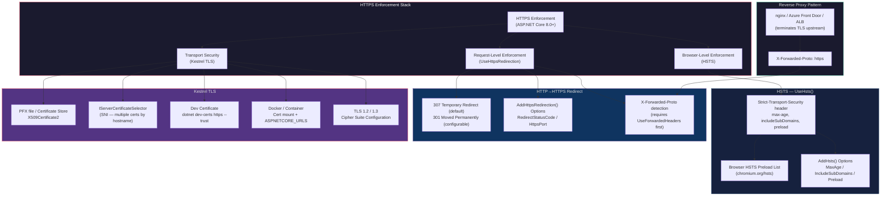
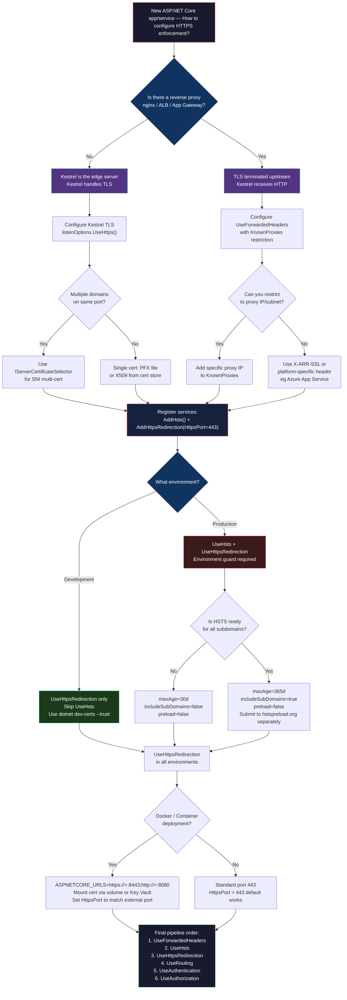

> [!success] Mastery Check
> - [ ] **Studied Well**
> - [ ] **Can explain the concept without notes**
> - [ ] **Can answer interview questions confidently**
> - [ ] **Can implement it in a real project**


# 4.208 — HTTPS Enforcement: UseHttpsRedirection, HSTS, and Kestrel TLS

---

## Part 0 — Navigation & Context

### Domain Hierarchy

```
ASP.NET Core Mastery
└── Security Subsystem
    ├── 4.206 — Data Protection API
    ├── 4.207 — Anti-Forgery (CSRF)
    ├── 4.208 — HTTPS Enforcement: UseHttpsRedirection, HSTS, and Kestrel TLS  ◄ YOU ARE HERE
    ├── 4.209 — CORS
    ├── 4.210 — Rate Limiting Middleware
    ├── 4.211 — Secret Manager & Azure Key Vault
    ├── 4.212 — OAuth2 / OIDC Integration
    └── 4.213 — Security Headers Middleware

Supporting Subsystems:
    ├── Middleware Pipeline (4.052 — Canonical Order)
    ├── Deployment Infrastructure (4.007 — Kestrel)
    └── Reverse Proxy (4.329 — X-Forwarded Headers)
```

### What You Need Before This

| Prerequisite | Why It Matters Here |
|---|---|
| [[4.052 — Middleware Ordering: The Canonical Order]] | `UseHsts` and `UseHttpsRedirection` must be registered before `UseRouting` — their pipeline position is safety-critical |
| [[4.007 — Kestrel: Edge Web Server]] | When Kestrel is the edge server (no reverse proxy), it owns TLS termination and certificate management |
| [[4.329 — Reverse Proxy Configuration: X-Forwarded Headers]] | Without `UseForwardedHeaders`, `UseHttpsRedirection` cannot detect that the original request was HTTPS when TLS is terminated upstream |
| [[4.003 — IWebHostEnvironment]] | HSTS must be skipped in Development; environment detection is the gate that prevents localhost certificate errors |

### What This Unlocks After

| Unlocks | Dependency |
|---|---|
| [[4.209 — CORS]] | `AllowCredentials()` CORS policies require HTTPS origins — a policy that has no HTTPS enforcement will silently fail on credentialed cross-origin requests |
| [[4.213 — Security Headers Middleware]] | HSTS is the first and most powerful security header; understanding its `max-age` and `preload` semantics is required before adding CSP and others |
| [[4.212 — OAuth2 / OIDC Integration]] | OAuth2/OIDC redirect URIs must be HTTPS in production; enforcing HTTPS at the middleware layer is a prerequisite |
| Production TLS Hardening | Certificate rotation, OCSP stapling, TLS 1.3 configuration, and cipher suite management all build on the foundations set here |

### Why This Topic Matters at Scale

> At any production scale, plain HTTP is not a degraded mode — it is a security breach. `UseHttpsRedirection` and `UseHsts` are the programmatic expression of your organization's commitment to encrypting all traffic, and misconfiguring them — particularly HSTS in reverse-proxy deployments where `X-Forwarded-Proto` is absent — means payment data, session tokens, and auth cookies travel the network in plaintext without any observable error.

---

## Part 1 — The Core Mental Model

### The Fundamental Rule

> **ASP.NET Core's HTTPS enforcement works in three layers: `UseHttpsRedirection` redirects individual HTTP requests to HTTPS (reactive, per-request), `UseHsts` instructs browsers to never send HTTP again (proactive, browser-level enforcement), and Kestrel TLS configuration determines whether ASP.NET Core terminates TLS itself or trusts a reverse proxy to do it. The practical consequence is that all three layers must be correctly configured or one of them silently fails — leaving the system partially encrypted but fully exposed.**

### The Plain-Language Analogy

Imagine your payment processing office has three security checkpoints:

1. **The door guard** (`UseHttpsRedirection`) — if a visitor arrives without a badge (HTTP), the guard turns them away and says "go get your badge, come back on floor 5 (HTTPS port 443)." This happens every single visit until they remember.

2. **The memo in every visitor's brain** (`UseHsts`) — after their first successful badged visit, the guard hands them a card that says "For the next 365 days, never come to this building without your badge. The security system will refuse you before you even reach the door." The browser stores this and enforces it locally — the server isn't involved in future enforcement.

3. **The building's lock system** (Kestrel TLS) — this is the actual cryptographic infrastructure that can verify and decrypt the badge credential. If a trusted security firm (nginx, load balancer) manages the locks at the front of the building, Kestrel may operate in plaintext internally, but you must tell it to trust the security firm's sign-off (`X-Forwarded-Proto: https`) — otherwise Kestrel thinks it's running in an unsecured building and behaves accordingly.

The analogy holds for the failure modes too: if the door guard (redirect middleware) runs but the lock system (TLS) is broken, visitors get redirected into a dead end. If the memo (HSTS) has `max-age=31536000` and you need to revert to HTTP, you have a year-long problem you cannot undo by changing server config.

### The Taxonomy Diagram



---

## Part 2 — Deep Mechanics

### 2.1 — `UseHttpsRedirection`: The Per-Request HTTP Guard

#### Pipeline Position

```
──► ExceptionHandler ──► [UseHsts] ──► [UseHttpsRedirection] ──► StaticFiles ──► Routing ──► Auth ──► Endpoints
                                              │
                          Short-circuits here │ (HTTP request → 307/301 response, never reaches Routing)
                                              ▼
                                   HTTP/1.1 307 Temporary Redirect
                                   Location: https://payments.api.example.com/...
```

The middleware must run **before** `UseRouting` and **before** any endpoint handler. If it runs after routing, the request has already been matched to a route, which means endpoint handlers have been resolved — wasteful work for a request that will be rejected. If it runs after `UseStaticFiles`, static assets served over HTTP are never redirected.

`UseHsts` must be registered **before** `UseHttpsRedirection` in the pipeline because HSTS needs to send its header on successful HTTPS responses, and the redirect middleware is what produces the 307 that browsers follow to HTTPS.

#### HTTP Wire Format

```http
// HTTP request (plain, what the client sends):
GET /api/payments/invoices/INV-2024-001 HTTP/1.1
Host: payments.example.com
Accept: application/json

// HTTP response (what UseHttpsRedirection returns — 307):
HTTP/1.1 307 Temporary Redirect
Location: https://payments.example.com/api/payments/invoices/INV-2024-001
Content-Length: 0
```

The `307` (Temporary Redirect) is the default because it preserves the HTTP method — a `POST` to `http://` stays a `POST` when redirected to `https://`. A `301` (Permanent) would cause some HTTP/1.0 clients and browser form submissions to downgrade to `GET`. Configure `301` only when you're certain all clients are HTTP/1.1+ and you want the redirect cached permanently by intermediaries.

#### Framework Source Behavior (approximate)

```
// ASP.NET Core internally (HttpsRedirectionMiddleware — Microsoft.AspNetCore.HttpsPolicy):
// Source: src/Middleware/HttpsPolicy/src/HttpsRedirectionMiddleware.cs

public async Task Invoke(HttpContext context)
{
    var request = context.Request;

    // 1. Check if already HTTPS (scheme check via IHttpsCompressionFeature or scheme property)
    if (request.IsHttps)
    {
        await _next(context);  // Pass through — nothing to do
        return;
    }

    // 2. Determine the HTTPS port from options or server address resolution
    //    If port is null, the middleware tries IServerAddressesFeature to find the configured HTTPS port
    if (!TryGetHttpsPort(out var port))
    {
        _logger.NoHttpsPortConfigured();
        await _next(context);  // ← This is the silent failure! No HTTPS port = redirect disabled
        return;
    }

    // 3. Build the redirect URL using the current host + HTTPS scheme + configured port
    var host = request.Host;
    if (port != 443)
        host = new HostString(host.Host, port);

    var redirectUrl = UriHelper.BuildAbsolute(
        "https",
        host,
        request.PathBase,
        request.Path,
        request.QueryString);

    // 4. Write the redirect response
    context.Response.StatusCode = _statusCode; // 307 or 301
    context.Response.Headers.Location = redirectUrl;
    // Short-circuit — does NOT call _next(context)
}
```

**Cost label:** `~1 allocation per redirected request` (the redirect URL string). HTTPS requests pass through with a single `IsHttps` check — effectively zero cost on the hot path.

#### Edge Cases That Bite Engineers

**Silent failure when HTTPS port is unknown:** If the application runs behind a reverse proxy that only exposes port 80, and no HTTPS port is configured via `AddHttpsRedirection(o => o.HttpsPort = 443)`, the middleware silently passes HTTP requests through without redirecting. The log message `"No HTTPS port found"` is logged at `Warning` level but is easy to miss in noisy startup logs.

**`request.IsHttps` is always `false` behind a reverse proxy:** When nginx terminates TLS and forwards HTTP to Kestrel, `request.Scheme` is `"http"` — so every request looks like plain HTTP. The middleware redirects them all in an infinite loop if `UseForwardedHeaders` is not configured. See Section 2.4 for the complete fix.

**`307` vs `301` and SEO consequences:** Payment APIs that serve browser-facing endpoints should use `307` during rollout and only switch to `301` after validating all client behavior. A `301` cached by a CDN pointing to the old HTTP URL is extremely painful to purge.

---

### 2.2 — HSTS: The Browser-Level Nuclear Option

#### What HSTS Is (and What It Is Not)

HSTS is not a server enforcement mechanism — it is a browser instruction. Once a browser receives the `Strict-Transport-Security` header on a successful HTTPS response, it stores it locally and **refuses to make HTTP connections to that host** for the duration of `max-age`, without ever contacting the server. The server cannot undo this for browsers that already have the header stored — only time (expiry) or the browser's HSTS clearance mechanism can undo it.

This is precisely why HSTS must never be enabled in Development: a developer who enables it on `localhost` and sets `max-age=365d` has broken their local development workflow for a year. Chrome and Firefox have manual override mechanisms, but most developers don't know them.

#### Pipeline Position

```
──► ExceptionHandler ──► [UseHsts] ──► UseHttpsRedirection ──► StaticFiles ──► Routing ──► Auth ──► Endpoints
           │                  │
           │                  └── Adds Strict-Transport-Security header ONLY on HTTPS responses
           │                      (Does NOT touch HTTP requests — those are handled by redirect middleware)
           │
           └── ExceptionHandler must be before UseHsts so HSTS headers aren't added to error responses
               that might leak sensitive information about the HTTPS infrastructure
```

`UseHsts` does **not** reject HTTP requests. It simply adds the `Strict-Transport-Security` response header to **HTTPS** responses. It has no effect on HTTP requests (that's `UseHttpsRedirection`'s job). Engineers who expect `UseHsts` to block HTTP are surprised when it doesn't.

#### HTTP Wire Format

```http
// HTTPS response with HSTS header (what UseHsts adds):
HTTP/1.1 200 OK
Content-Type: application/json; charset=utf-8
Strict-Transport-Security: max-age=31536000; includeSubDomains; preload
Date: Sun, 08 Jun 2026 00:28:00 GMT

{"invoiceId": "INV-2024-001", "status": "paid"}

// HTTP response (same endpoint, no HSTS header):
HTTP/1.1 307 Temporary Redirect
Location: https://payments.example.com/api/payments/invoices/INV-2024-001
Content-Length: 0
// Note: HSTS header is NOT added to the 307 redirect response
// The browser follows the redirect to HTTPS, THEN receives the HSTS header
```

#### Framework Source Behavior (approximate)

```
// ASP.NET Core internally (HstsMiddleware — Microsoft.AspNetCore.HttpsPolicy):
// Source: src/Middleware/HttpsPolicy/src/HstsMiddleware.cs

public async Task Invoke(HttpContext context)
{
    await _next(context);  // ← Run the rest of the pipeline first
    
    // HSTS only applies to HTTPS responses
    if (!context.Request.IsHttps)
        return;

    // Don't add HSTS to localhost (default exclusion) — prevents dev workflow damage
    if (_options.ExcludedHosts.Contains(context.Request.Host.Host, StringComparer.OrdinalIgnoreCase))
        return;

    // Build the header value from options
    // e.g., "max-age=31536000; includeSubDomains; preload"
    context.Response.Headers.StrictTransportSecurity = _headerValue;
}

// _headerValue is pre-computed at startup from HstsOptions:
// "max-age={MaxAge.TotalSeconds}[; includeSubDomains][; preload]"
```

**Cost label:** `~0 allocations per request` on the hot path — the header value string is computed once at startup and reused. The `Invoke` method performs a single `IsHttps` check and a dictionary lookup on `ExcludedHosts`, both O(1).

#### HSTS Configuration Options

```csharp
// services.AddHsts in your payment API startup:
builder.Services.AddHsts(options =>
{
    // 365 days — the MINIMUM for HSTS preload list submission
    // Start with a shorter duration (e.g., 5 minutes) and ramp up
    options.MaxAge = TimeSpan.FromDays(365);

    // Include all subdomains: api.payments.example.com, admin.payments.example.com
    // WARNING: This applies to ALL subdomains — if staging.payments.example.com
    // doesn't have HTTPS, this breaks it permanently for cached browsers
    options.IncludeSubDomains = true;

    // Preload: submits your domain to the browser HSTS preload list.
    // Browsers ship with this list baked in — HTTPS is enforced even on first visit.
    // IRREVERSIBLE without a 6-18 month removal process.
    options.Preload = true;

    // By default: localhost, 127.0.0.1, [::1] are already excluded
    // Add custom exclusions for internal routing:
    options.ExcludedHosts.Add("internal.payments.corp");
});
```

#### The Preload Trap

`options.Preload = true` only adds `;preload` to the header. You must separately submit your domain at `https://hstspreload.org`. Once submitted and accepted, your domain is embedded in Chrome/Edge/Firefox/Safari source code. Removal takes 6-18 months and requires your site to intentionally serve an HSTS header with `max-age=0` — which browsers that already cached the old header will ignore until it expires.

**HSTS header progression (ramp-up strategy for payment API):**

| Phase | `max-age` | `includeSubDomains` | `preload` | When to Move to Next Phase |
|---|---|---|---|---|
| Testing | 300 (5 min) | false | false | After 1 week in production with zero HTTPS issues |
| Rollout | 86400 (1 day) | false | false | After 30 days with zero issues |
| Stable | 2592000 (30 days) | true | false | After 90 days with all subdomains confirmed HTTPS |
| Production | 31536000 (365 days) | true | true | Submit to preload list only when committed permanently |

---

### 2.3 — Kestrel TLS: Terminating HTTPS at the Server

When ASP.NET Core runs as an edge server (no reverse proxy in front), Kestrel is responsible for TLS termination. This means Kestrel decrypts the TLS handshake, verifies the certificate, and provides plaintext HTTP to the middleware pipeline. `request.IsHttps` returns `true` because Kestrel sets the `IHttpsCompressionFeature` and `ITlsConnectionFeature` on the connection.

#### Pipeline Position (Kestrel is pre-pipeline)

```
[Internet]
    │
    ▼
[Kestrel — Port 443]
    │  TLS Handshake (before any middleware runs)
    │  Certificate validation, cipher suite negotiation, TLS 1.2/1.3
    │
    ▼
[Kestrel HTTP/1.1 or HTTP/2 parsing]
    │
    ▼
──► ExceptionHandler ──► UseHsts ──► UseHttpsRedirection ──► Routing ──► Auth ──► Endpoints
    (by this point, request.IsHttps == true, request.Scheme == "https")
```

#### Kestrel TLS Configuration — Three Certificate Sources

**Source 1: PFX File (simple, but credential management is a concern)**

```csharp
// Program.cs — logistics shipment tracking API
// Direct PFX file — works but exposes password in configuration
builder.WebHost.ConfigureKestrel(serverOptions =>
{
    serverOptions.Listen(IPAddress.Any, 443, listenOptions =>
    {
        // Password-protected PFX — certificate + private key bundled
        listenOptions.UseHttps("certs/logistics-api.pfx", "certificate-password-from-vault");
    });

    // Also listen on HTTP for redirect purposes
    serverOptions.Listen(IPAddress.Any, 80);
});
```

**Source 2: X509Certificate2 from Certificate Store (preferred for Windows)**

```csharp
// Program.cs — payment processing API using Windows certificate store
builder.WebHost.ConfigureKestrel(serverOptions =>
{
    // Load from LocalMachine store by thumbprint — no password in config
    using var store = new X509Store(StoreName.My, StoreLocation.LocalMachine);
    store.Open(OpenFlags.ReadOnly);

    var cert = store.Certificates
        .Find(X509FindType.FindByThumbprint, "CERT_THUMBPRINT_FROM_KEYVAULT", validOnly: true)
        .OfType<X509Certificate2>()
        .FirstOrDefault()
        ?? throw new InvalidOperationException("TLS certificate not found in store");

    serverOptions.Listen(IPAddress.Any, 443, listenOptions =>
    {
        listenOptions.UseHttps(cert);
    });
});
```

**Source 3: `IServerCertificateSelector` for SNI (multiple domains)**

SNI (Server Name Indication) allows a single server to host multiple TLS certificates — one per hostname. Kestrel calls the selector before the TLS handshake completes, receiving the requested hostname from the ClientHello.

```csharp
// Payment platform serving multiple merchant subdomains
// merchant1.payments.example.com → cert1, merchant2.payments.example.com → cert2
builder.WebHost.ConfigureKestrel(serverOptions =>
{
    serverOptions.Listen(IPAddress.Any, 443, listenOptions =>
    {
        listenOptions.UseHttps(httpsOptions =>
        {
            // Called once per TLS connection, before the handshake completes
            // Cost: one dictionary lookup + potential async cert load per new connection
            httpsOptions.ServerCertificateSelector = (connectionContext, serverName) =>
            {
                // serverName is the SNI hostname from the ClientHello
                if (serverName != null && _certificateCache.TryGetValue(serverName, out var cert))
                    return cert;

                // Fallback to wildcard certificate
                return _defaultCertificate;
            };
        });
    });
});
```

**Cost label for SNI selector:** `~1 dictionary lookup per new TLS connection`. Connections are typically long-lived (HTTP/2 multiplexing, keep-alive), so the selector is not called per-request. New connections in a high-throughput scenario are rare relative to total requests.

#### HTTP Wire Format — TLS Handshake (TLS 1.3 abbreviated)

```
// TLS 1.3 Handshake (what happens before any HTTP is visible):
// Client → Server: ClientHello [TLS 1.3, cipher suites, SNI: "payments.example.com"]
// Server → Client: ServerHello [selected cipher] + Certificate + CertificateVerify + Finished
// Client → Server: Finished
// [TLS session established — ~1 RTT for TLS 1.3, ~2 RTT for TLS 1.2]

// After TLS handshake, the encrypted HTTP request:
GET /api/payments/orders/ORD-99234 HTTP/2
Host: payments.example.com
Authorization: Bearer eyJhbGci...
Accept: application/json

// Response (encrypted over TLS, plaintext content after decryption):
HTTP/2 200 OK
Content-Type: application/json; charset=utf-8
Strict-Transport-Security: max-age=31536000; includeSubDomains; preload
```

#### Development Certificates: `dotnet dev-certs https --trust`

The .NET SDK generates a self-signed development certificate stored in:
- **Windows:** Windows Certificate Store (CurrentUser\My) + DPAPI-protected private key
- **macOS:** Keychain
- **Linux:** PEM files in `~/.aspnet/https/`

The certificate has `CN=localhost` and ASP.NET Core loads it automatically when `ASPNETCORE_ENVIRONMENT=Development` and `launchSettings.json` has `https` in the application URL.

```bash
# Trust the dev certificate (run once per machine)
dotnet dev-certs https --trust

# Verify the certificate exists and is trusted
dotnet dev-certs https --check --trust

# Export for Docker use (PEM format, .NET 8+)
dotnet dev-certs https -ep $HOME/.aspnet/https/payments-api.pfx -p dev-cert-password
dotnet dev-certs https --trust
```

**Edge case:** The dev cert expires after 1 year. When it expires, `dotnet dev-certs https --trust` generates a new one, but if the old cert is referenced in `ASPNETCORE_Kestrel__Certificates__Default__Path`, the app fails to start silently (or with a cryptic SSL error). The fix: always let ASP.NET Core auto-load the dev cert rather than hardcoding the path.

---

### 2.4 — The Reverse Proxy Pattern: When TLS Is Not Kestrel's Job

In production, most ASP.NET Core deployments sit behind a reverse proxy (nginx, Azure Application Gateway, AWS ALB, Cloudflare). The proxy terminates TLS, then forwards plaintext HTTP to Kestrel. This means:

- `request.IsHttps` is `false` (Kestrel sees HTTP)
- `request.Scheme` is `"http"`
- `UseHttpsRedirection` sees every request as HTTP and redirects them all → **infinite redirect loop**

The fix requires two components:

1. The reverse proxy must forward `X-Forwarded-Proto: https` (and `X-Forwarded-For`, `X-Forwarded-Host`)
2. ASP.NET Core must apply `UseForwardedHeaders()` **before** `UseHttpsRedirection` to translate those headers into `request.Scheme`

#### Pipeline Position (Reverse Proxy Pattern)

```
[Internet]
    │ HTTPS
    ▼
[nginx / Azure App GW — terminates TLS]
    │ HTTP + X-Forwarded-Proto: https
    │        X-Forwarded-For: client-ip
    ▼
[Kestrel — Port 8080]
    │ (sees plaintext HTTP)
    ▼
──► ExceptionHandler ──► [UseForwardedHeaders] ──► UseHsts ──► UseHttpsRedirection ──► Routing ──► Endpoints
           ↑                       │
           │          Rewrites request.Scheme from "http" → "https"
           │          Based on X-Forwarded-Proto header value
           │          After this middleware: request.IsHttps == true
           └── MUST be before UseHsts and UseHttpsRedirection
```

#### HTTP Wire Format — Reverse Proxy Scenario

```http
// What the client sends (over TLS to nginx):
GET /api/orders/ORD-2024-9876 HTTP/1.1
Host: orders.example.com

// What nginx forwards to Kestrel (plaintext HTTP with forwarded headers):
GET /api/orders/ORD-2024-9876 HTTP/1.1
Host: orders.example.com
X-Forwarded-For: 203.0.113.45
X-Forwarded-Proto: https
X-Forwarded-Host: orders.example.com

// After UseForwardedHeaders runs:
// request.Scheme == "https"
// request.IsHttps == true
// request.HttpContext.Connection.RemoteIpAddress == 203.0.113.45

// UseHttpsRedirection then sees IsHttps == true → passes through to next middleware
// UseHsts adds the header to the response:
HTTP/1.1 200 OK
Strict-Transport-Security: max-age=31536000; includeSubDomains
Content-Type: application/json
```

#### Framework Source Behavior — ForwardedHeaders Middleware

```csharp
// The REQUIRED configuration for reverse-proxy deployments:
// Program.cs — order management API behind nginx

// ⚠️ WRONG (default — trusts no proxies):
// UseForwardedHeaders without configuration only processes loopback proxy IPs.
// In Docker/Kubernetes, the proxy IP is NOT loopback.
app.UseForwardedHeaders();  // BUG: silently does nothing if proxy is not in KnownProxies

// ✅ CORRECT (for trusted internal networks):
builder.Services.Configure<ForwardedHeadersOptions>(options =>
{
    options.ForwardedHeaders = ForwardedHeaders.XForwardedFor | ForwardedHeaders.XForwardedProto;

    // Clear default loopback-only restriction for containerized deployments
    options.KnownNetworks.Clear();
    options.KnownProxies.Clear();

    // Or: restrict to your specific proxy's IP range
    // options.KnownNetworks.Add(new IPNetwork(IPAddress.Parse("10.0.0.0"), 8));
});

app.UseForwardedHeaders();  // Must be FIRST middleware

// Then the rest of the pipeline:
if (!app.Environment.IsDevelopment())
{
    app.UseHsts();
}
app.UseHttpsRedirection();
app.UseRouting();
app.UseAuthentication();
app.UseAuthorization();
```

**Cost label:** `~2-4 allocations per request` for header parsing and IP address parsing in `UseForwardedHeaders`. On the hot path this is negligible, but it is not zero-allocation.

**Security Warning:** `KnownNetworks.Clear()` trusts **any** upstream proxy to set `X-Forwarded-Proto`. In a public-facing deployment, an attacker could forge `X-Forwarded-Proto: https` on a direct HTTP connection to Kestrel, bypassing HTTPS detection. Restrict to your actual proxy IP range in production.

---

### 2.5 — Docker and Container TLS Patterns

Container deployments have three distinct TLS patterns, each with different implications for HTTPS enforcement:

#### Pattern A: TLS at the Container (Kestrel handles TLS)

```yaml
# docker-compose.yml — payment API with Kestrel TLS
services:
  payments-api:
    image: payments-api:latest
    environment:
      - ASPNETCORE_ENVIRONMENT=Production
      - ASPNETCORE_URLS=https://+:8443;http://+:8080
      - ASPNETCORE_Kestrel__Certificates__Default__Path=/https/payment-cert.pfx
      - ASPNETCORE_Kestrel__Certificates__Default__Password=${CERT_PASSWORD}
    ports:
      - "443:8443"
      - "80:8080"
    volumes:
      - ${USERPROFILE}/.aspnet/https:/https:ro  # Certificate volume mount
```

```bash
# Development workflow with Docker:
# 1. Export the dev certificate to a known path:
dotnet dev-certs https -ep ${HOME}/.aspnet/https/payments-api.pfx -p dev-password --trust

# 2. Set environment variable for the password:
export CERT_PASSWORD=dev-password

# 3. Run the container — it loads the cert from the mounted volume
docker-compose up
```

#### Pattern B: TLS Terminated at Load Balancer (Kestrel receives HTTP)

```yaml
# In this pattern, Kestrel only listens on HTTP.
# X-Forwarded-Proto comes from the load balancer.
services:
  payments-api:
    environment:
      - ASPNETCORE_ENVIRONMENT=Production
      - ASPNETCORE_URLS=http://+:8080   # HTTP only — load balancer handles TLS
      # No certificate configuration needed
    ports:
      - "8080:8080"
    # UseForwardedHeaders must be configured to trust X-Forwarded-Proto
```

#### Pattern C: Development Docker with Dev Cert

```bash
# For development containers (.NET 8 SDK):
dotnet dev-certs https --export-path /tmp/aspnetapp.pfx --password dev-cert-pwd
docker run -it \
  -e ASPNETCORE_Kestrel__Certificates__Default__Path=/https/aspnetapp.pfx \
  -e ASPNETCORE_Kestrel__Certificates__Default__Password=dev-cert-pwd \
  -v /tmp:/https \
  payments-api:dev
```

**Cost label for certificate loading:** `~1-5ms per restart` for X509 certificate loading and parsing. This is startup cost only — certificates are loaded once and cached in Kestrel's connection manager.

---

## Part 3 — Production Code Patterns

### Pattern 1: The HTTPS Enforcement Gate (Environment-Aware Security Headers)

The canonical middleware registration sequence that correctly gates HSTS on environment, configures both HTTPS enforcement components, and is safe for reverse-proxy deployments.

```csharp
// Program.cs — Payment Processing API
// This is the production-correct middleware registration sequence.

var builder = WebApplication.CreateBuilder(args);

// Register HSTS with production-grade settings for a payment API
// NEVER skip this service registration even in development — just skip UseHsts() below
builder.Services.AddHsts(options =>
{
    // Start with 30 days during initial rollout, ramp to 365 days after stability confirmed
    options.MaxAge = TimeSpan.FromDays(builder.Configuration.GetValue<int>("Hsts:MaxAgeDays", 365));
    options.IncludeSubDomains = true;  // api.payments.com, admin.payments.com, etc.
    options.Preload = false;           // Only set true after submitting to hstspreload.org
    // localhost and 127.0.0.1 are excluded by default — no additional exclusions needed
});

// Register HTTPS redirect with explicit port (critical for non-standard ports)
builder.Services.AddHttpsRedirection(options =>
{
    // 307 preserves the HTTP method: POST stays POST after redirect
    // Change to 301 only after confirming all clients (mobile apps, SDKs) handle it correctly
    options.RedirectStatusCode = StatusCodes.Status307TemporaryRedirect;
    options.HttpsPort = builder.Configuration.GetValue<int>("Https:Port", 443);
});

var app = builder.Build();

// ────────────────────────────────────────────────────────────────────
// PIPELINE ORDER IS CRITICAL — Do not reorder these 4 lines
// ────────────────────────────────────────────────────────────────────

// 1. HSTS: environment check is mandatory — dev cert would poison browser HSTS cache
if (!app.Environment.IsDevelopment())
{
    app.UseHsts();
}

// 2. HTTPS redirect: runs in all environments including Development
// In dev, the dev cert handles HTTPS — this still redirects HTTP → HTTPS
app.UseHttpsRedirection();

// 3. Routing before auth
app.UseRouting();

// 4. Auth pipeline
app.UseAuthentication();
app.UseAuthorization();

app.MapControllers();
app.Run();
```

```http
// HTTP wire format — What a browser sees on first visit (Development vs Production):
// Development:
// GET http://localhost:5000/api/payments/invoices
// → 307 Temporary Redirect: https://localhost:5001/api/payments/invoices
// (No Strict-Transport-Security header — HSTS skipped in dev)

// Production:
// GET http://payments.example.com/api/payments/invoices
// → 307 Temporary Redirect: https://payments.example.com/api/payments/invoices
// → 200 OK with: Strict-Transport-Security: max-age=31536000; includeSubDomains
```

---

### Pattern 2: The Reverse Proxy Shield (Trusted Forwarded Headers)

Order management API deployed behind nginx — correctly maps `X-Forwarded-Proto` to `request.IsHttps` without creating a header forgery vulnerability.

```csharp
// Program.cs — Order Management API (nginx reverse proxy in front)

var builder = WebApplication.CreateBuilder(args);

// Configure ForwardedHeaders BEFORE building the app — options must be set at service level
builder.Services.Configure<ForwardedHeadersOptions>(options =>
{
    options.ForwardedHeaders = ForwardedHeaders.XForwardedFor | ForwardedHeaders.XForwardedProto;

    // ⚠️ WRONG (common mistake): clearing all known networks without restriction
    // options.KnownNetworks.Clear();  // Allows ANYONE to forge X-Forwarded-Proto

    // ✅ CORRECT: restrict to your nginx subnet only
    // In Kubernetes: restrict to the ingress controller pod CIDR
    options.KnownNetworks.Clear();  // Clear default loopback restriction
    options.KnownProxies.Clear();

    // Add specific proxy IPs (from your infrastructure)
    var proxyIp = builder.Configuration["ReverseProxy:IP"] ?? "10.0.1.100";
    options.KnownProxies.Add(IPAddress.Parse(proxyIp));

    // Or: trust an entire subnet (e.g., internal cluster network)
    // options.KnownNetworks.Add(new IPNetwork(IPAddress.Parse("10.0.0.0"), 8));
});

builder.Services.AddHsts(options =>
{
    options.MaxAge = TimeSpan.FromDays(365);
    options.IncludeSubDomains = true;
});

builder.Services.AddHttpsRedirection(options =>
{
    options.RedirectStatusCode = StatusCodes.Status307TemporaryRedirect;
    options.HttpsPort = 443;
});

var app = builder.Build();

// UseForwardedHeaders MUST be the very first middleware
// It rewrites request.Scheme and request.HttpContext.Connection.RemoteIpAddress
// All subsequent middleware sees the correct HTTPS scheme
app.UseForwardedHeaders();

if (!app.Environment.IsDevelopment())
{
    app.UseHsts();
}
app.UseHttpsRedirection();
app.UseRouting();
app.UseAuthentication();
app.UseAuthorization();

app.MapControllers();
app.Run();
```

```http
// HTTP wire format — What nginx sends to Kestrel (port 8080):
GET /api/orders/ORD-2024-9876 HTTP/1.1
Host: orders.example.com
X-Forwarded-For: 203.0.113.45
X-Forwarded-Proto: https
X-Forwarded-Host: orders.example.com

// After UseForwardedHeaders: request.IsHttps == true
// UseHttpsRedirection: passes through (already HTTPS from client perspective)
// Response sent to nginx, nginx forwards to client over TLS:
HTTP/1.1 200 OK
Strict-Transport-Security: max-age=31536000; includeSubDomains
Content-Type: application/json
```

---

### Pattern 3: The SNI Certificate Router (Multi-Merchant TLS)

Payment platform that hosts multiple merchant subdomains with different TLS certificates, using Kestrel's `IServerCertificateSelector` for SNI-based certificate selection.

```csharp
// Program.cs — Multi-Merchant Payment Platform
// Each merchant gets their own subdomain and TLS certificate:
// merchant-a.payments.example.com → cert A (EV certificate)
// merchant-b.payments.example.com → cert B (DV certificate)
// *.payments.example.com → wildcard fallback

public class CertificateCache
{
    private readonly Dictionary<string, X509Certificate2> _certs = new(StringComparer.OrdinalIgnoreCase);
    private readonly X509Certificate2 _wildcard;

    public CertificateCache(IConfiguration configuration, ILogger<CertificateCache> logger)
    {
        // Load certificates from Key Vault paths at startup
        // In production: Azure Key Vault SDK or certificate binding
        _wildcard = LoadCertificate(configuration["Tls:WildcardCertPath"], configuration["Tls:WildcardCertPassword"]);

        foreach (var merchant in configuration.GetSection("Merchants").Get<MerchantConfig[]>() ?? [])
        {
            if (!string.IsNullOrEmpty(merchant.CertPath))
            {
                _certs[merchant.Subdomain] = LoadCertificate(merchant.CertPath, merchant.CertPassword);
                logger.LogInformation("Loaded TLS cert for merchant subdomain: {Subdomain}", merchant.Subdomain);
            }
        }
    }

    public X509Certificate2 Select(ConnectionContext? context, string? serverName)
    {
        // serverName comes from the TLS ClientHello SNI extension
        // Called once per TLS connection — not per request
        if (serverName != null && _certs.TryGetValue(serverName, out var cert))
            return cert;
        return _wildcard;
    }

    private static X509Certificate2 LoadCertificate(string? path, string? password)
        => new X509Certificate2(path ?? throw new ArgumentNullException(nameof(path)), password);
}

// Registration:
builder.Services.AddSingleton<CertificateCache>();

builder.WebHost.ConfigureKestrel((ctx, serverOptions) =>
{
    serverOptions.Listen(IPAddress.Any, 80);
    serverOptions.Listen(IPAddress.Any, 443, listenOptions =>
    {
        var certCache = ctx.ApplicationServices.GetRequiredService<CertificateCache>();
        listenOptions.UseHttps(httpsOptions =>
        {
            // Called before each TLS handshake — connection not yet established
            httpsOptions.ServerCertificateSelector = certCache.Select;
        });
    });
});
```

```http
// TLS ClientHello includes SNI:
// Server Name Indication: merchant-a.payments.example.com
// → certCache.Select() returns merchant-a's certificate
// TLS handshake completes with the correct certificate

// Subsequent HTTP/2 request over the established TLS session:
GET /api/v1/transactions HTTP/2
Host: merchant-a.payments.example.com
Authorization: Bearer eyJhbGci...
// Response uses merchant-a's certificate for TLS — browsers show the correct identity
```

---

### Pattern 4: The Container HTTPS Bootstrap (Docker with Volume-Mounted Certificate)

Logistics shipment tracking API that handles its own TLS in a Docker container — including the development certificate export workflow and production certificate injection.

```csharp
// Program.cs — Logistics Shipment Tracking API

var builder = WebApplication.CreateBuilder(args);

// Kestrel TLS from environment variables — works identically in Docker and bare metal
// Docker injects:
//   ASPNETCORE_Kestrel__Certificates__Default__Path=/https/logistics-api.pfx
//   ASPNETCORE_Kestrel__Certificates__Default__Password=<from secrets manager>
// No code changes needed between dev and prod — just different env vars

// For programmatic control (alternative to env vars):
builder.WebHost.ConfigureKestrel((ctx, options) =>
{
    var certPath = ctx.Configuration["Kestrel:Certificates:Default:Path"];
    var certPassword = ctx.Configuration["Kestrel:Certificates:Default:Password"];

    if (ctx.HostingEnvironment.IsDevelopment())
    {
        // Development: let ASP.NET Core auto-load the dev cert
        // dotnet dev-certs https --trust handles this
        return;
    }

    if (string.IsNullOrEmpty(certPath))
    {
        // Production without a certificate configured = fail fast at startup
        // Do NOT silently fall back to HTTP in production
        throw new InvalidOperationException(
            "TLS certificate path not configured. Set Kestrel:Certificates:Default:Path " +
            "or ASPNETCORE_Kestrel__Certificates__Default__Path environment variable.");
    }

    options.Listen(IPAddress.Any, 8443, listenOptions =>
    {
        listenOptions.UseHttps(certPath, certPassword);
    });
    options.Listen(IPAddress.Any, 8080);
});

builder.Services.AddHsts(o => o.MaxAge = TimeSpan.FromDays(365));
builder.Services.AddHttpsRedirection(o =>
{
    o.RedirectStatusCode = StatusCodes.Status307TemporaryRedirect;
    o.HttpsPort = 8443;  // Non-standard port — explicit configuration required
});

var app = builder.Build();

if (!app.Environment.IsDevelopment())
    app.UseHsts();

app.UseHttpsRedirection();
app.MapControllers();
app.Run();
```

```yaml
# docker-compose.yml — Production deployment
services:
  shipment-tracker:
    image: logistics-shipment-tracker:${VERSION}
    environment:
      ASPNETCORE_ENVIRONMENT: Production
      ASPNETCORE_URLS: "https://+:8443;http://+:8080"
      ASPNETCORE_Kestrel__Certificates__Default__Path: /https/logistics.pfx
      ASPNETCORE_Kestrel__Certificates__Default__Password: "${CERT_PASSWORD}"
      Hsts__MaxAgeDays: "365"
    ports:
      - "443:8443"
      - "80:8080"
    volumes:
      - /etc/ssl/logistics:/https:ro  # Certificate injected by infrastructure
    secrets:
      - cert_password
```

---

### Pattern 5: The Selective HTTPS Bypass (Internal Health Checks over HTTP)

User authentication service that enforces HTTPS for all API endpoints but exempts the Kubernetes liveness/readiness probe on a separate HTTP port — without weakening HTTPS enforcement for actual API traffic.

```csharp
// Program.cs — User Authentication Service
// Health check probes run on HTTP port 8080 (no TLS overhead for internal Kubernetes probes)
// All API traffic is HTTPS-only on port 8443

var builder = WebApplication.CreateBuilder(args);

builder.Services.AddHealthChecks()
    .AddCheck<DatabaseHealthCheck>("database")
    .AddCheck<IdentityProviderHealthCheck>("identity-provider");

builder.Services.AddHsts(options =>
{
    options.MaxAge = TimeSpan.FromDays(365);
    options.IncludeSubDomains = true;
});

// ⚠️ WRONG: Global HTTPS redirect on both ports — health check probes get 307 redirect
// Kubernetes sees non-200 status code → pod marked unhealthy → restart loop
builder.Services.AddHttpsRedirection(options =>
{
    options.RedirectStatusCode = StatusCodes.Status307TemporaryRedirect;
    options.HttpsPort = 8443;
});

// ✅ CORRECT: Separate Kestrel endpoints with different middleware pipelines
builder.WebHost.ConfigureKestrel(options =>
{
    // Health check port — HTTP only, no TLS
    options.Listen(IPAddress.Any, 8080, listenOptions =>
    {
        listenOptions.UseConnectionHandler<HealthCheckConnectionHandler>();
    });

    // API port — HTTPS with TLS
    options.Listen(IPAddress.Any, 8443, listenOptions =>
    {
        listenOptions.UseHttps(builder.Configuration["Kestrel:CertPath"],
                               builder.Configuration["Kestrel:CertPassword"]);
    });
});

var app = builder.Build();

// Alternative: use IEndpointFilter to bypass redirect for health paths
// Simpler than ConnectionHandler but less isolation
app.UseWhen(
    ctx => ctx.Connection.LocalPort == 8443,  // Only enforce on the API port
    apiApp =>
    {
        if (!apiApp.Environment.IsDevelopment())
            apiApp.UseHsts();
        apiApp.UseHttpsRedirection();
    }
);

app.MapHealthChecks("/healthz").RequireHost("*:8080");
app.UseRouting();
app.UseAuthentication();
app.UseAuthorization();
app.MapControllers().RequireHost("*:8443");
app.Run();
```

```http
// Health check probe (Kubernetes → port 8080, HTTP):
GET /healthz HTTP/1.1
Host: auth-service.default.svc.cluster.local:8080
// → 200 OK (no redirect — health check port is HTTP-only)
// No Strict-Transport-Security header (correct — HSTS doesn't apply to HTTP responses)

// API request (client → port 8443, HTTPS):
GET /api/users/profile HTTP/2
Host: auth.example.com
Authorization: Bearer eyJhbGci...
// → 200 OK with Strict-Transport-Security: max-age=31536000; includeSubDomains
```

---

### Pattern 6: The HSTS Preload Submission Readiness Check

Inventory management API implementing a self-diagnostic endpoint that verifies all HSTS preload requirements are met before an administrator submits the domain to `hstspreload.org`.

```csharp
// HstsPreloadDiagnosticsEndpoint.cs — Inventory Management Service
// This endpoint validates that the current HSTS configuration meets preload requirements

[ApiController]
[Route("internal/diagnostics")]
[Authorize(Roles = "SecurityAdmin")]  // Only security admins can see this
public class SecurityDiagnosticsController : ControllerBase
{
    private readonly IOptions<HstsOptions> _hstsOptions;
    private readonly IWebHostEnvironment _environment;

    public SecurityDiagnosticsController(
        IOptions<HstsOptions> hstsOptions,
        IWebHostEnvironment environment)
    {
        _hstsOptions = hstsOptions;
        _environment = environment;
    }

    // GET /internal/diagnostics/hsts-preload-readiness
    [HttpGet("hsts-preload-readiness")]
    [ProducesResponseType(typeof(HstsPreloadReadinessReport), StatusCodes.Status200OK)]
    public ActionResult<HstsPreloadReadinessReport> CheckPreloadReadiness()
    {
        var opts = _hstsOptions.Value;
        var issues = new List<string>();

        // HSTS Preload requirements (per hstspreload.org):
        // 1. max-age must be at least 31536000 (1 year)
        // 2. includeSubDomains must be present
        // 3. preload must be present

        if (opts.MaxAge < TimeSpan.FromDays(365))
            issues.Add($"max-age is {opts.MaxAge.TotalDays:0} days — must be ≥ 365 days for preload");

        if (!opts.IncludeSubDomains)
            issues.Add("includeSubDomains is not set — required for preload submission");

        if (!opts.Preload)
            issues.Add("Preload directive is not set — add options.Preload = true and redeploy before submitting");

        // Verify we're actually sending the HSTS header (not in a dev exclusion)
        var currentHeaderValue = HttpContext.Response.Headers.StrictTransportSecurity.ToString();

        return Ok(new HstsPreloadReadinessReport
        {
            IsReady = issues.Count == 0,
            MaxAgeDays = (int)opts.MaxAge.TotalDays,
            IncludeSubDomains = opts.IncludeSubDomains,
            PreloadDirective = opts.Preload,
            Environment = _environment.EnvironmentName,
            Issues = issues,
            NextSteps = issues.Count == 0
                ? ["Submit at https://hstspreload.org — allow 2-4 weeks for Chrome inclusion"]
                : ["Fix issues above, deploy, wait for cache to propagate, then submit"]
        });
    }
}

public record HstsPreloadReadinessReport
{
    public bool IsReady { get; init; }
    public int MaxAgeDays { get; init; }
    public bool IncludeSubDomains { get; init; }
    public bool PreloadDirective { get; init; }
    public string Environment { get; init; } = "";
    public List<string> Issues { get; init; } = [];
    public string[] NextSteps { get; init; } = [];
}
```

---

### Pattern 7: The TLS Configuration Hardening (Cipher Suites and Protocol Versions)

Payment API that restricts Kestrel's TLS configuration to PCI-DSS compliant cipher suites and disables deprecated TLS versions.

```csharp
// Program.cs — Payment API with PCI-DSS TLS Hardening
// PCI-DSS v4.0 requires: TLS 1.2 minimum, specific cipher suites, no SSLv3/TLS 1.0/1.1

builder.WebHost.ConfigureKestrel(options =>
{
    options.Listen(IPAddress.Any, 443, listenOptions =>
    {
        listenOptions.UseHttps(httpsOptions =>
        {
            // Configure the SslServerAuthenticationOptions
            httpsOptions.SslProtocols = SslProtocols.Tls12 | SslProtocols.Tls13;
            // SslProtocols.None on .NET 8+ uses OS-level defaults (recommended)
            // Explicit TLS 1.3 + 1.2 gives maximum compatibility with PCI-DSS compliance

            // Certificate selector (wildcard for payment.example.com)
            httpsOptions.ServerCertificateSelector = (ctx, hostName) => _paymentCert;

            // Client certificate requirements (mTLS for B2B integrations)
            httpsOptions.ClientCertificateMode = ClientCertificateMode.NoCertificate;
            // Change to ClientCertificateMode.RequireCertificate for mTLS endpoints

            httpsOptions.OnAuthenticated = (sslStream, httpContext) =>
            {
                // Log TLS negotiation details for audit trail (PCI-DSS requirement)
                var tlsProtocol = sslStream.SslProtocol;
                var cipherAlgorithm = sslStream.CipherAlgorithm;
                // _auditLogger.LogTlsHandshake(httpContext, tlsProtocol, cipherAlgorithm);
            };
        });
    });
});
```

```http
// TLS 1.3 connection — what negotiates at the wire level:
// Client: TLS 1.3 ClientHello, cipher suites: TLS_AES_256_GCM_SHA384, TLS_CHACHA20_POLY1305_SHA256
// Server: TLS 1.3 ServerHello, selected: TLS_AES_256_GCM_SHA384
// [0-RTT or 1-RTT handshake depending on session resumption]

// Response includes security headers from HSTS:
HTTP/2 200 OK
Strict-Transport-Security: max-age=31536000; includeSubDomains
X-Content-Type-Options: nosniff
Content-Type: application/json
```

---

## Part 4 — Gotchas & Anti-Patterns

### Gotcha 1: Silent HTTPS Redirect Disable Due to Missing Port Configuration

`UseHttpsRedirection` silently passes HTTP requests through without redirecting when it cannot determine the HTTPS port. This happens when the application is behind a reverse proxy that doesn't expose port 443 to Kestrel, and `AddHttpsRedirection` is not called with an explicit port. The middleware logs "No HTTPS port found" at Warning level, which is invisible in high-log-volume environments.

```csharp
// ⚠️ WRONG CODE
// Payment API deployed on Azure App Service behind a reverse proxy
// Kestrel listens on a random high port; proxy handles 443
var app = builder.Build();
app.UseHttpsRedirection();  // Bug: no HTTPS port registered, silent passthrough
app.MapControllers();
app.Run();

// HTTP consequence (wrong path):
// GET http://payments.example.com/api/invoices HTTP/1.1
// → HTTP/1.1 200 OK  ← BUG: HTTP request reaches endpoint handlers unredirected
// No 307 redirect. Plain HTTP invoice data is returned to client over cleartext.
```

```csharp
// ✅ CORRECT CODE
builder.Services.AddHttpsRedirection(options =>
{
    options.RedirectStatusCode = StatusCodes.Status307TemporaryRedirect;
    options.HttpsPort = 443;  // Explicit port — critical for reverse proxy deployments
});

var app = builder.Build();
app.UseHttpsRedirection();
app.MapControllers();
app.Run();

// HTTP consequence (correct path):
// GET http://payments.example.com/api/invoices HTTP/1.1
// → HTTP/1.1 307 Temporary Redirect
//   Location: https://payments.example.com/api/invoices

// WHY: HttpsRedirectionMiddleware resolves the HTTPS port in priority order:
// 1. AddHttpsRedirection(o => o.HttpsPort)
// 2. HTTPS_PORT environment variable
// 3. IServerAddressesFeature (only works when Kestrel is the edge server with a known HTTPS address)
// When behind a reverse proxy, IServerAddressesFeature only sees the internal HTTP address,
// so option 3 fails, the middleware finds no port, and silently passes through.
```

---

### Gotcha 2: HSTS Enables on Localhost Poisoning the Developer's Browser

Developers enable HSTS in `Development` environment either by accident (forgetting the `IsDevelopment()` guard) or intentionally to "test HSTS behavior locally." The browser stores `Strict-Transport-Security: max-age=...` for `localhost` and subsequently refuses HTTP connections to `localhost:5000`. Chrome and Firefox do not expose the HSTS clearance mechanism obviously, causing confusion for the entire development team.

```csharp
// ⚠️ WRONG CODE
// "Testing" HSTS locally — developer doesn't realize this poisons the browser
var app = builder.Build();
app.UseHsts();  // Bug: no environment check — runs in Development
app.UseHttpsRedirection();
// ... rest of pipeline

// HTTP consequence (wrong path):
// Developer visits http://localhost:5000 in Chrome
// Browser stores: Strict-Transport-Security: max-age=2592000 for localhost
// Next time developer tries http://localhost:5000/anything:
// Browser silently upgrades to https://localhost:5000/anything (even if port 5000 has no TLS)
// → ERR_CONNECTION_REFUSED or ERR_SSL_PROTOCOL_ERROR
// Fix requires: chrome://net-internals/#hsts → "Delete domain security policies" for localhost
```

```csharp
// ✅ CORRECT CODE
var app = builder.Build();

// HSTS only in non-Development environments
// This is the ASP.NET Core template default for a reason
if (!app.Environment.IsDevelopment())
{
    app.UseHsts();
}
app.UseHttpsRedirection();
// ... rest of pipeline

// HTTP consequence (correct path):
// Development: NO Strict-Transport-Security header → localhost works normally
// Production: Strict-Transport-Security: max-age=31536000; includeSubDomains

// WHY: HstsMiddleware does exclude localhost by default (ExcludedHosts list), BUT
// only if the middleware is registered. If it is registered in Development, it still
// runs on every response and the ExcludedHosts check depends on the exact hostname.
// The environment guard is belt-and-suspenders protection and is the documented pattern.
// Additionally, with non-default ports (e.g., localhost:5001), the ExcludedHosts
// default exclusion only covers the bare hostname "localhost" — the port is checked separately.
```

---

### Gotcha 3: UseForwardedHeaders Without KnownProxies Allows HTTPS Bypass Forgery

In Kubernetes or Docker deployments, clearing `KnownNetworks` and `KnownProxies` to "fix" the `X-Forwarded-Proto` not being recognized is common but creates a security vulnerability: any client who can make a direct TCP connection to Kestrel's HTTP port can send `X-Forwarded-Proto: https` and bypass HTTPS enforcement. This is particularly dangerous when the Kestrel HTTP port is accidentally exposed on the node's public interface.

```csharp
// ⚠️ WRONG CODE
// "Fix" for X-Forwarded-Proto not working in Kubernetes:
builder.Services.Configure<ForwardedHeadersOptions>(options =>
{
    options.ForwardedHeaders = ForwardedHeaders.XForwardedFor | ForwardedHeaders.XForwardedProto;
    options.KnownNetworks.Clear();  // Bug: trusts ALL upstream sources
    options.KnownProxies.Clear();   // Bug: any client can forge X-Forwarded-Proto: https
});

// HTTP consequence (wrong path):
// Attacker sends directly to Kestrel port 8080:
// GET /api/users/admin HTTP/1.1
// X-Forwarded-Proto: https   ← Forged header
// Authorization: Bearer <stolen_http_token>
// → request.IsHttps == true (forged!)
// → UseHttpsRedirection skips (thinks it's already HTTPS)
// → Auth middleware validates the Bearer token
// → 200 OK — attacker bypassed HTTPS requirement
```

```csharp
// ✅ CORRECT CODE
builder.Services.Configure<ForwardedHeadersOptions>(options =>
{
    options.ForwardedHeaders = ForwardedHeaders.XForwardedFor | ForwardedHeaders.XForwardedProto;
    options.KnownNetworks.Clear();
    options.KnownProxies.Clear();

    // Option A: Trust specific proxy IP (most secure for known infrastructure)
    var proxyIp = builder.Configuration.GetRequiredValue("ReverseProxy:IP");
    options.KnownProxies.Add(IPAddress.Parse(proxyIp));

    // Option B: Trust internal cluster subnet (for dynamic Kubernetes pod IPs)
    // options.KnownNetworks.Add(new IPNetwork(IPAddress.Parse("10.244.0.0"), 16));

    // Option C: For Azure App Service / Azure Container Apps — trust the special header
    // These platforms inject X-ARR-SSL or X-MS-CLIENT-PRINCIPAL instead of X-Forwarded-Proto
    // Use Microsoft.AspNetCore.HttpOverrides.AzureForwardedHeadersOptions
});

// HTTP consequence (correct path):
// Forged header from non-trusted IP is ignored
// request.IsHttps remains false
// UseHttpsRedirection sends 307 Temporary Redirect → https://...
// WHY: ForwardedHeaders middleware validates the RemoteIpAddress against KnownProxies/KnownNetworks
// before applying any forwarded header value. Unrecognized proxy IPs have their headers stripped.
```

---

### Gotcha 4: HSTS `includeSubDomains` Breaks Staging or Internal Subdomains Without HTTPS

Adding `includeSubDomains` to the HSTS header seems like a security best practice, but it has an irreversible effect: browsers that receive the header for `payments.example.com` with `includeSubDomains` will refuse HTTP connections to `staging.payments.example.com`, `internal.payments.example.com`, and every other subdomain — even if those subdomains are internal-only tools that have never had HTTPS certificates. The effect persists for the entire `max-age` period.

```csharp
// ⚠️ WRONG CODE
// Payment API with 1-year HSTS and includeSubDomains from day 1
builder.Services.AddHsts(options =>
{
    options.MaxAge = TimeSpan.FromDays(365);
    options.IncludeSubDomains = true;  // Bug: breaks staging.payments.example.com (HTTP-only)
    options.Preload = true;
});

// HTTP consequence (wrong path):
// After any browser visits https://payments.example.com:
// Browser stores HSTS for *.payments.example.com for 365 days
// http://staging.payments.example.com/ → ERR_SSL_PROTOCOL_ERROR in browser
// http://internal.payments.example.com/admin → same error
// Cannot be fixed by server configuration change — must wait 365 days for cache to expire
```

```csharp
// ✅ CORRECT CODE
// HSTS rollout strategy: start without includeSubDomains, add it later
// Phase 1 (weeks 1-4): no includeSubDomains, short max-age
builder.Services.AddHsts(options =>
{
    options.MaxAge = TimeSpan.FromDays(30);   // Short duration — easy to fix if issues arise
    options.IncludeSubDomains = false;         // Only cover the apex domain first
    options.Preload = false;                   // Never preload until the config is stable
});

// Phase 2 (after confirming ALL subdomains have HTTPS): add includeSubDomains
// Phase 3 (after 30+ days of stability): increase max-age to 365 days
// Phase 4 (after submitting to hstspreload.org): set Preload = true

// HTTP consequence (correct path):
// Strict-Transport-Security: max-age=2592000
// (No includeSubDomains — staging.payments.example.com still works over HTTP)
// WHY: HstsMiddleware builds the header value from HstsOptions at startup.
// The header affects browser-side policy — the server has no way to "take it back" mid-duration.
// Always audit all subdomains before enabling includeSubDomains.
```

---

### Gotcha 5: Infinite Redirect Loop in Docker Compose Without ASPNETCORE_URLS

Running ASP.NET Core with `ASPNETCORE_URLS=https://+:8443;http://+:8080` but forgetting to also configure `AddHttpsRedirection(o => o.HttpsPort = 8443)` — or configuring the wrong port — causes `UseHttpsRedirection` to redirect HTTP requests to port 443 (the default), which is not mapped in the container. The browser receives a 307 to `https://host:443` which is unreachable, and shows "too many redirects" or just fails.

```csharp
// ⚠️ WRONG CODE
// docker-compose environment: ASPNETCORE_URLS=https://+:8443;http://+:8080
// Kestrel listens on 8443/8080, Docker maps 443→8443 externally
builder.Services.AddHttpsRedirection(options =>
{
    options.RedirectStatusCode = StatusCodes.Status307TemporaryRedirect;
    // Bug: no HttpsPort set — defaults to 443
    // But Kestrel is on 8443, Docker maps 443→8443 on the HOST
    // Inside the container, "443" is not bound
});

// HTTP consequence (wrong path):
// Client → Docker host port 80 → Container port 8080
// GET http://logistics.example.com/api/shipments HTTP/1.1
// → 307 Temporary Redirect: https://logistics.example.com:443/api/shipments
// → If Docker maps 443→8443, this WORKS from external perspective
// → If client is inside Docker network hitting the service directly on port 8080:
//   → 307 Temporary Redirect: https://service-name:443/api/shipments
//   → 443 not bound inside container → ERR_CONNECTION_REFUSED
```

```csharp
// ✅ CORRECT CODE
// When ASPNETCORE_URLS=https://+:8443;http://+:8080
// The HTTPS port visible to clients depends on whether Docker maps 443→8443

// For external access through Docker port mapping (443 external → 8443 internal):
builder.Services.AddHttpsRedirection(options =>
{
    options.RedirectStatusCode = StatusCodes.Status307TemporaryRedirect;
    options.HttpsPort = 443;  // The EXTERNAL port clients use (not Kestrel's internal port)
});

// For direct container-to-container access (service mesh, Kubernetes pod):
// If clients hit port 8443 directly (no port mapping):
builder.Services.AddHttpsRedirection(options =>
{
    options.RedirectStatusCode = StatusCodes.Status307TemporaryRedirect;
    options.HttpsPort = 8443;  // The actual Kestrel HTTPS port
});

// HTTP consequence (correct path):
// GET http://logistics-api:8080/api/shipments HTTP/1.1
// → 307 Temporary Redirect: https://logistics-api:8443/api/shipments
// → 200 OK with Strict-Transport-Security

// WHY: HttpsRedirectionMiddleware uses HttpsPort directly to build the Location header.
// The "correct" port depends on the network topology — always match it to what clients see,
// not to what Kestrel binds internally.
```

---

## Part 5 — Performance Implications

### Request Pipeline Characteristics Table

| Scenario | Pipeline Depth | Allocations Per Request | Approx Latency Impact | Recommendation |
|---|---|---|---|---|
| HTTPS request through `UseHsts` (hot path) | 1 middleware | ~0 allocations (pre-built header string) | < 0.01ms | No action needed — negligible |
| HTTPS request through `UseHttpsRedirection` (IsHttps check only) | 1 middleware | ~0 allocations (bool check) | < 0.01ms | No action needed |
| HTTP request redirected by `UseHttpsRedirection` | 1 middleware + short-circuit | ~1 allocation (Location URL string) | < 0.1ms | One-time cost per HTTP client; ensure clients cache the redirect |
| `UseForwardedHeaders` parsing on every request | 1 middleware | ~2-4 allocations (header parse + IP parse) | ~0.05-0.2ms | Use only when behind a reverse proxy; cache the parsed result |
| TLS 1.3 handshake (new connection) | Pre-pipeline (Kestrel) | ~50-100KB per connection setup | 0.5-3ms (1 RTT) | Use HTTP/2 multiplexing and Keep-Alive to amortize over many requests |
| TLS 1.2 handshake (new connection) | Pre-pipeline (Kestrel) | ~100-200KB per connection setup | 2-6ms (2 RTTs) | Upgrade clients to TLS 1.3; use session resumption |
| SNI certificate selector per new TLS connection | Pre-pipeline (Kestrel) | ~1 dictionary lookup | < 0.01ms per lookup | Cache loaded X509Certificate2 objects — loading from PFX is 5-20ms |
| Certificate load from PFX file at startup | One-time startup cost | N/A | 5-20ms per certificate | Acceptable at startup; unacceptable at request time |
| HSTS max-age header serialization | 1 middleware | 0 (pre-computed at startup) | Negligible | Pre-computation is automatic in `HstsMiddleware` |
| `UseHttpsRedirection` with unknown HTTPS port (silent passthrough) | 1 middleware | ~1 allocation (log message) | < 0.05ms | Fix the misconfiguration — this is a bug, not a performance choice |

### BenchmarkDotNet Code

```csharp
// HttpsEnforcementBenchmarks.cs
// Benchmark compares the overhead of HTTPS enforcement middleware chain

using BenchmarkDotNet.Attributes;
using BenchmarkDotNet.Running;
using Microsoft.AspNetCore.Builder;
using Microsoft.AspNetCore.Hosting;
using Microsoft.AspNetCore.Http;
using Microsoft.AspNetCore.TestHost;
using Microsoft.Extensions.DependencyInjection;
using Microsoft.Extensions.Hosting;

[MemoryDiagnoser]
[SimpleJob]
public class HttpsEnforcementBenchmarks
{
    private TestServer _httpsServer = null!;
    private TestServer _httpToHttpsRedirectServer = null!;
    private TestServer _forwardedHeadersServer = null!;
    private HttpClient _httpsClient = null!;
    private HttpClient _httpRedirectClient = null!;
    private HttpClient _forwardedClient = null!;

    [GlobalSetup]
    public void Setup()
    {
        // Scenario A: Pure HTTPS request — HSTS + no redirect needed
        _httpsServer = new TestServer(
            new HostBuilder().ConfigureWebHost(webHost =>
            {
                webHost.UseTestServer();
                webHost.Configure(app =>
                {
                    app.UseHsts();
                    app.UseHttpsRedirection();
                    app.Run(ctx => ctx.Response.WriteAsync("OK"));
                });
                webHost.ConfigureServices(s =>
                {
                    s.AddHsts(o => o.MaxAge = TimeSpan.FromDays(365));
                    s.AddHttpsRedirection(o => o.HttpsPort = 443);
                });
            }));
        _httpsClient = _httpsServer.CreateClient();

        // Scenario B: HTTP request that gets redirected to HTTPS
        _httpToHttpsRedirectServer = new TestServer(
            new HostBuilder().ConfigureWebHost(webHost =>
            {
                webHost.UseTestServer();
                webHost.Configure(app =>
                {
                    app.UseHttpsRedirection();
                    app.Run(ctx => ctx.Response.WriteAsync("OK"));
                });
                webHost.ConfigureServices(s =>
                {
                    s.AddHttpsRedirection(o =>
                    {
                        o.RedirectStatusCode = 307;
                        o.HttpsPort = 443;
                    });
                });
            }));
        _httpRedirectClient = _httpToHttpsRedirectServer.CreateClient();

        // Scenario C: X-Forwarded-Proto processing via UseForwardedHeaders
        _forwardedHeadersServer = new TestServer(
            new HostBuilder().ConfigureWebHost(webHost =>
            {
                webHost.UseTestServer();
                webHost.Configure(app =>
                {
                    app.UseForwardedHeaders();
                    app.UseHsts();
                    app.UseHttpsRedirection();
                    app.Run(ctx => ctx.Response.WriteAsync("OK"));
                });
                webHost.ConfigureServices(s =>
                {
                    s.Configure<ForwardedHeadersOptions>(o =>
                    {
                        o.ForwardedHeaders = ForwardedHeaders.XForwardedProto;
                        o.KnownNetworks.Clear();
                        o.KnownProxies.Clear();
                    });
                    s.AddHsts(o => o.MaxAge = TimeSpan.FromDays(365));
                    s.AddHttpsRedirection(o => o.HttpsPort = 443);
                });
            }));
        _forwardedClient = _forwardedHeadersServer.CreateClient();
    }

    [Benchmark(Baseline = true)]
    public async Task<int> HttpsRequest_HstsHeaderOnly()
    {
        // HTTPS request — HSTS middleware adds header, redirect middleware is no-op
        using var request = new HttpRequestMessage(HttpMethod.Get, "https://localhost/api/payments/invoices");
        using var response = await _httpsClient.SendAsync(request);
        return (int)response.StatusCode;
    }

    [Benchmark]
    public async Task<int> HttpRequest_RedirectedToHttps()
    {
        // HTTP request — redirect middleware short-circuits with 307
        using var request = new HttpRequestMessage(HttpMethod.Get, "http://localhost/api/payments/invoices");
        using var response = await _httpRedirectClient.SendAsync(request, HttpCompletionOption.ResponseHeadersRead);
        return (int)response.StatusCode;
    }

    [Benchmark]
    public async Task<int> ForwardedProtoHttps_FullPipeline()
    {
        // X-Forwarded-Proto: https — UseForwardedHeaders rewrites scheme, rest of pipeline passes through
        using var request = new HttpRequestMessage(HttpMethod.Get, "http://localhost/api/payments/invoices");
        request.Headers.Add("X-Forwarded-Proto", "https");
        using var response = await _forwardedClient.SendAsync(request);
        return (int)response.StatusCode;
    }

    [GlobalCleanup]
    public void Cleanup()
    {
        _httpsClient.Dispose();
        _httpRedirectClient.Dispose();
        _forwardedClient.Dispose();
        _httpsServer.Dispose();
        _httpToHttpsRedirectServer.Dispose();
        _forwardedHeadersServer.Dispose();
    }
}

// Expected output (approximate, .NET 8, x64, TestServer, local):
// | Method                             | Mean     | Error    | StdDev   | Ratio | Allocated  |
// |----------------------------------- |---------:|---------:|---------:|------:|-----------:|
// | HttpsRequest_HstsHeaderOnly        |  45.2 μs |  0.89 μs |  2.14 μs |  1.00 |   4.23 KB  |
// | HttpRequest_RedirectedToHttps      |  38.1 μs |  0.76 μs |  1.67 μs |  0.84 |   3.89 KB  |  (short-circuit: cheaper)
// | ForwardedProtoHttps_FullPipeline   |  52.8 μs |  1.12 μs |  2.44 μs |  1.17 |   5.12 KB  |  (extra header parsing)

// Note: These are TestServer benchmarks, not real Kestrel numbers.
// Real HTTP/2 over TLS with connection reuse: HSTS overhead is < 1% of total request latency.
// Use dotnet-trace for real profiling:
//   dotnet trace collect --process-id <pid> --profile http
// Use dotnet-counters for live metrics:
//   dotnet counters monitor -p <pid> System.Runtime Microsoft.AspNetCore.Hosting
// MiniProfiler can profile individual request paths:
//   services.AddMiniProfiler(); app.UseMiniProfiler();
```

### When to Care / When to Ignore

#### When This Costs You

- **Public-facing APIs with browser clients:** Every first HTTP request from a browser results in a 307 redirect — two round trips for what could be one. For mobile apps and browser SPA clients making hundreds of API calls per session, ensuring the base URL always starts with `https://` in client-side code eliminates this overhead entirely.

- **Payment or healthcare APIs where redirect behavior affects compliance audits:** A 307 instead of a 301 means the redirect is "temporary" — CDNs and proxies will not cache it. If your compliance requirement is that all HTTP access is permanently rejected (not redirected), use 301 and accept that HTTP/1.0 clients may downgrade method. The overhead is zero — it's the status code in the response.

- **High-throughput APIs with many new TLS connections (> 10k req/s):** TLS 1.3 reduces handshake latency vs. 1.2, but the overhead is per connection, not per request. If you're seeing high TLS handshake rates, investigate connection pooling on the client side rather than removing TLS.

- **`UseForwardedHeaders` in hot path with no proxy filtering:** If `KnownNetworks` is cleared without restriction and the middleware blindly parses headers on every request at 50k req/s, the ~2-4 allocations per request add up to measurable GC pressure. Profile with `dotnet-counters` for the `Gen0` collection rate.

#### When This Doesn't Matter

- **Internal microservice-to-microservice communication in a service mesh (Istio/Linkerd):** When mTLS is handled at the service mesh layer (sidecar proxy), the ASP.NET Core HTTPS enforcement middleware is largely redundant. Configuring it correctly still prevents accidental plaintext fallback if the mesh is misconfigured.

- **Batch processing APIs called on a scheduled basis with long-lived connections:** The TLS handshake is amortized over the connection lifetime. A scheduled job that makes 10,000 API calls on a single HTTP/2 connection over TLS pays the handshake cost once. The HSTS and redirect middleware cost per request is negligible.

- **Admin APIs with < 100 req/min and no browser clients:** Internal management endpoints called by scripts and dashboards don't need HSTS preload. HTTPS should still be enforced for security, but the performance implications of HSTS are irrelevant at this scale.

---

## Part 6 — Interview Arsenal

### A. The Question Bank

---

**Question 1: "What is the difference between `UseHttpsRedirection` and `UseHsts` and when would you use each?"**

**Average Answer:** "`UseHttpsRedirection` redirects HTTP requests to HTTPS. `UseHsts` adds the `Strict-Transport-Security` header to tell browsers to always use HTTPS."

**Why That's Insufficient:** It describes the API surface but doesn't explain that HSTS is browser-level enforcement that persists after the connection is closed, that `UseHttpsRedirection` operates per-request in the pipeline while HSTS operates on the browser's policy store, or the dangerous implications of each misconfiguration.

> **Great Answer:** "They solve different parts of the same problem. `UseHttpsRedirection` is reactive — it sits early in the middleware pipeline, intercepts any HTTP request that somehow reaches the server, and short-circuits with a 307 redirect before the request reaches routing or any business logic. It's the server's defensive layer. `UseHsts`, by contrast, is proactive — it adds the `Strict-Transport-Security` header to HTTPS responses, which browsers store locally. After a browser has seen the HSTS header, it enforces HTTPS itself, without even contacting the server — the redirect never needs to happen again. The practical consequence is that `UseHttpsRedirection` protects against the first-ever HTTP request, and HSTS ensures the second and all subsequent requests are never HTTP in the first place. In production, I always register HSTS only for non-Development environments — because if you add HSTS in Development, you poison the browser's cache for `localhost` and break your team's HTTP development workflow for the entire `max-age` duration."

---

**Question 2: "How does HTTPS enforcement work when ASP.NET Core is deployed behind a reverse proxy that terminates TLS?"**

**Average Answer:** "You need to configure `UseForwardedHeaders` so that ASP.NET Core can read the `X-Forwarded-Proto` header."

**Why That's Insufficient:** It identifies the right middleware but misses the security implication of `KnownProxies`/`KnownNetworks`, the exact pipeline ordering requirement, and the failure mode when it's misconfigured.

> **Great Answer:** "When nginx or an Azure Application Gateway terminates TLS, Kestrel receives plaintext HTTP — `request.IsHttps` is `false` and `request.Scheme` is `http`. If `UseHttpsRedirection` runs without any adaptation, it sees every request as HTTP and redirects them all, creating an infinite redirect loop. The fix is `UseForwardedHeaders()`, which must be registered as the very first middleware — before `UseHsts` and `UseHttpsRedirection`. It reads the `X-Forwarded-Proto: https` header that the proxy injected and rewrites `request.Scheme` to `https`, so when the redirect middleware runs, it sees the request as already being HTTPS and passes through. The security gotcha I've hit in production is that the default `ForwardedHeadersOptions` only trusts loopback addresses as known proxies — in Docker or Kubernetes, the ingress controller IP is not loopback. Engineers clear `KnownNetworks` and `KnownProxies` to 'fix' this, but that means any client who can connect directly to Kestrel's HTTP port can forge `X-Forwarded-Proto: https` and bypass HTTPS enforcement. The correct fix is adding your proxy's actual IP subnet to `KnownNetworks` — restrict it to your infrastructure."

---

**Question 3: "What happens if you enable HSTS with `includeSubDomains` and `max-age=31536000` on day one of a new deployment?"**

**Average Answer:** "The browser will enforce HTTPS for all subdomains for one year."

**Why That's Insufficient:** The answer is technically correct but misses the production risk — the unintended effects on subdomains that don't have HTTPS certificates, the irreversibility, and the proper ramp-up strategy.

> **Great Answer:** "That's a significant production risk if you haven't audited every subdomain under your domain. Once a browser receives that HSTS header for `payments.example.com` with `includeSubDomains`, it will refuse HTTP connections to every subdomain — `staging.payments.example.com`, `internal.payments.example.com`, `admin.payments.example.com` — for an entire year. If any of those subdomains are internal tools, developer dashboards, or legacy systems without HTTPS certificates, they become completely inaccessible from any browser that's visited the main domain. And you cannot undo this by changing server configuration — only time, the browser's internal HSTS clear mechanism, or waiting for `max-age` to expire fixes it. I always recommend a ramp-up strategy: start with `max-age=86400` and no `includeSubDomains`, let it run for 30 days, audit all subdomains, then progressively increase the max-age and add `includeSubDomains` only after confirming every subdomain has valid HTTPS. `preload` should be the last step, and only after committing permanently to HTTPS — removal from the preload list takes 6-18 months."

---

**Question 4: "Explain how Kestrel handles TLS certificates for multiple domains on the same port."**

**Average Answer:** "You can configure Kestrel with an `IServerCertificateSelector` to choose different certificates based on the hostname."

**Why That's Insufficient:** It names the API but doesn't explain when the selector is called (pre-handshake), what `serverName` represents at the TLS level (SNI extension in ClientHello), or the performance characteristics.

> **Great Answer:** "Kestrel's `ServerCertificateSelector` implements SNI — Server Name Indication — which is a TLS extension where the client includes the desired hostname in the `ClientHello` message, before the TLS handshake completes. Kestrel receives that hostname as the `serverName` parameter and returns the appropriate `X509Certificate2`. This selector is called once per new TLS connection, not per HTTP request — with HTTP/2 multiplexing, a single connection carries hundreds of requests, so the selection cost is amortized very effectively. In a payment platform serving multiple merchant subdomains, I've used this to load certificates from Azure Key Vault at startup, cache them as `X509Certificate2` objects in memory by hostname, and do a simple dictionary lookup in the selector. The critical thing to get right is the fallback certificate — if SNI is absent (some older clients) or the hostname isn't in your map, you need a wildcard certificate as the default, otherwise the TLS handshake fails before a single HTTP byte is exchanged."

---

**Question 5: "What is the HSTS preload list and how is it different from just sending the HSTS header?"**

**Average Answer:** "The HSTS preload list is a list of domains that browsers ship with — those domains always use HTTPS even on first visit."

**Why That's Insufficient:** Correct but misses the submission process, the `preload` directive being just a signal, the irreversibility, and how the ASP.NET Core `Preload = true` setting relates.

> **Great Answer:** "Setting `Preload = true` in `AddHsts()` only adds the `;preload` directive to the `Strict-Transport-Security` header — it's a signal of intent, not an action. To actually get on the preload list, you must separately submit your domain at `hstspreload.org`, which manually reviews and adds your domain to the list that Chrome, Firefox, Edge, and Safari compile into their source code. Once your domain is in the preload list, browsers enforce HTTPS before ever connecting to your server — it works even for users who have never visited your site. This is fundamentally different from just sending the HSTS header, which only takes effect after the first successful HTTPS response. The production implication is the irreversibility: removal from the preload list requires your domain to serve `Strict-Transport-Security: max-age=0` to signal intent to remove, then wait 6-18 months for the next browser release cycle to ship with the updated list. I've seen teams rush `preload: true` into production and then spend months dealing with internal HTTP-only subdomains that became inaccessible."

---

### B. The Trick Questions

---

**Trick Question 1: "Does `UseHsts` block HTTP requests?"**

**The Trap:** Engineers assume `UseHsts` enforces HTTPS by blocking HTTP, since its name suggests "HTTPS enforcement."

**Correct Answer:** No — `UseHsts` adds the `Strict-Transport-Security` header to **HTTPS responses only**. It has zero effect on HTTP requests. If you send an HTTP request to an ASP.NET Core server with only `UseHsts()` registered (no `UseHttpsRedirection()`), the HTTP request passes through the pipeline normally and gets a 200 OK response — with no HSTS header (because the response is not over HTTPS). Only `UseHttpsRedirection` actually redirects HTTP requests. HSTS enforcement happens exclusively at the browser level, long after the HTTP response is received.

---

**Trick Question 2: "If I configure HSTS with `max-age=0`, what does the browser do?"**

**The Trap:** Candidates assume `max-age=0` is invalid or an error.

**Correct Answer:** `max-age=0` is a valid and intentional HSTS instruction that tells browsers to **delete** their stored HSTS policy for the domain. This is the mechanism used when a domain needs to be removed from the HSTS preload list or when a deployment needs to revert to allowing HTTP. The HTTP response looks like: `Strict-Transport-Security: max-age=0`. Browsers that receive this header will immediately clear their HSTS cache for the host and resume allowing HTTP connections. Note: this only works for browsers that can connect over HTTPS — if your domain is in the preload list, the browser enforces HTTPS before connecting, so it never receives the `max-age=0` instruction.

---

**Trick Question 3: "In a reverse proxy deployment, if `UseForwardedHeaders` is registered but `KnownNetworks` still contains only loopback addresses, what happens when a request comes through nginx?"**

**The Trap:** Engineers assume the middleware either works or throws an exception if the proxy isn't in `KnownProxies`.

**Correct Answer:** `UseForwardedHeaders` **silently ignores** the `X-Forwarded-Proto` header from an unknown proxy — it doesn't throw, doesn't log an error, and doesn't modify `request.Scheme`. The request continues through the pipeline with `request.Scheme = "http"`. `UseHttpsRedirection` then sees an HTTP request and redirects it with a 307 to `https://host:443`. The browser follows the redirect, reaches the HTTPS endpoint, and gets HSTS header — so it looks like things work. But in every subsequent request where `X-Forwarded-Proto` is ignored, the redirect loop persists. The behavior is silent, and without explicitly checking `request.IsHttps` in a diagnostic endpoint, this can go undetected until someone notices the extra redirect in network traces.

---

**Trick Question 4: "Can you use `UseHttpsRedirection` to redirect from HTTP port 80 to HTTPS port 8443 (non-standard) in a single ASP.NET Core instance?"**

**The Trap:** Engineers assume you need two separate processes or two separate Kestrel instances.

**Correct Answer:** Yes, with a single Kestrel instance that listens on both ports simultaneously. You configure Kestrel to bind both `http://+:80` and `https://+:8443`, then call `AddHttpsRedirection(o => o.HttpsPort = 8443)`. When `UseHttpsRedirection` generates the 307 redirect URL, it substitutes the configured `HttpsPort` for the host's port, producing `https://host:8443/...`. This is the standard pattern for containerized deployments where Docker exposes both ports.

---

**Trick Question 5: "Will `UseHsts` add the `Strict-Transport-Security` header if the request is to `https://localhost`?"**

**The Trap:** Engineers assume HSTS applies to all HTTPS requests including localhost.

**Correct Answer:** By default, no. `HstsMiddleware` has a built-in exclusion list (`ExcludedHosts`) that defaults to `{ "localhost", "127.0.0.1", "[::1]" }`. HTTPS requests to these hostnames will **not** receive the `Strict-Transport-Security` header, even if `UseHsts()` is registered and the request is HTTPS. This protects development workflows. The exclusion list is populated by `HstsOptions` at startup and checked via `StringComparer.OrdinalIgnoreCase` per request.

---

### C. Red Flags to Avoid

| What NOT to Say | Why It Gets You Scored Down |
|---|---|
| "HSTS prevents HTTP requests from reaching the server" | Wrong — HSTS is browser-only enforcement; the server cannot reject based on HSTS. `UseHttpsRedirection` does the server-side rejection. This is a fundamental misunderstanding. |
| "You can easily revert HSTS by changing the server config" | HSTS is stored by the browser for `max-age` seconds. Changing server config does nothing for browsers that already cached it. This answer signals you've never dealt with an HSTS rollback incident. |
| "Just clear KnownNetworks and KnownProxies — that's how you fix X-Forwarded-Proto in Kubernetes" | Without adding actual known proxy IPs, this creates a security vulnerability where any client can forge headers. A principal engineer will immediately ask "what's the security implication of that?" |
| "307 and 301 are basically the same" | They're not — 307 preserves the HTTP method (POST stays POST), 301 causes many clients to downgrade POST to GET. For a payment API processing POST requests, this distinction is critical. |
| "HSTS preload just means setting preload=true in AddHsts()" | You still need to submit to hstspreload.org. The code setting is necessary but not sufficient. Saying this signals you haven't actually implemented HSTS preload end-to-end. |
| "Kestrel automatically detects the HTTPS port" | It only does this reliably when Kestrel is the edge server and the HTTPS address is explicitly configured. In reverse proxy deployments, you must explicitly set `HttpsPort` or the middleware silently passes through HTTP requests. |
| "You don't need HTTPS enforcement if you're behind a load balancer that handles TLS" | The load balancer handles *encryption*, but without HTTPS enforcement middleware, HTTP requests that bypass the load balancer or come through misconfigured paths travel in plaintext. Defense in depth matters. |

---

## Part 7 — Decision Framework



---

## Part 8 — Self-Check

### A. Conceptual Questions

1. **What exactly does `request.IsHttps` return when ASP.NET Core is behind a reverse proxy that terminates TLS, and what middleware must run first to make it return the correct value?**

2. **If a browser has cached `Strict-Transport-Security: max-age=31536000` for `payments.example.com`, and you deploy a new version of the API with `UseHsts()` removed from the pipeline — what happens on the browser's next HTTP request to `payments.example.com`?**

3. **What happens to the HTTP pipeline if `UseHttpsRedirection` is registered but no HTTPS port is configured via `AddHttpsRedirection()` and the application is behind a reverse proxy (so `IServerAddressesFeature` doesn't know the HTTPS port)?**

4. **In what order must `UseForwardedHeaders`, `UseHsts`, and `UseHttpsRedirection` be registered in the pipeline, and what is the HTTP consequence of each wrong ordering?**

5. **What is the difference between Kestrel's `IServerCertificateSelector` callback and a standard `UseHttps(X509Certificate2)` configuration, and when is the selector invoked relative to the HTTP request pipeline?**

6. **Why does `HstsMiddleware` need to call `await _next(context)` *before* adding the `Strict-Transport-Security` header, rather than adding it before calling `next`?**

7. **If a payment API sets `options.Preload = true` in `AddHsts()` and redeploys — is the domain now on the HSTS preload list? What additional step is required?**

8. **What happens when `UseHttpsRedirection` processes a `POST` request to `http://orders.example.com/api/checkout` with the default status code of 307 vs. a configured status code of 301?**

9. **In Docker Compose, if `ASPNETCORE_URLS=https://+:8443;http://+:8080` but `AddHttpsRedirection(o => o.HttpsPort = 443)` is set, what is the Location header on the 307 redirect, and is it correct for external browser access?**

10. **What security vulnerability is created by `options.KnownNetworks.Clear(); options.KnownProxies.Clear();` in `ForwardedHeadersOptions`, and how does an attacker exploit it to bypass HTTPS enforcement?**

---

### B. Code Puzzles

---

**Puzzle 1: The Silent HTTP Passthrough**

```csharp
// Order Management API — what is the HTTP response for this request?
// Environment: Production, deployed behind nginx (no Kestrel TLS)
// nginx forwards X-Forwarded-Proto: https

var builder = WebApplication.CreateBuilder(args);

// No AddHttpsRedirection() call

var app = builder.Build();
app.UseHsts();
app.UseHttpsRedirection();
app.MapGet("/api/orders", () => Results.Ok(new { count = 42 }));
app.Run();

// Question: What is the HTTP response when a client sends:
// GET http://orders.example.com/api/orders HTTP/1.1
// X-Forwarded-Proto: https
// (nginx strips the header before forwarding, so Kestrel sees plain HTTP)
```

<details>
<summary>Answer</summary>

**Response:** `HTTP/1.1 200 OK` with `{"count":42}` — **the order data is returned over plain HTTP without any redirect.**

**Explanation:**
1. `UseHsts` runs — but `request.IsHttps` is `false` (Kestrel sees HTTP from nginx) and no `UseForwardedHeaders` is configured, so HSTS is a no-op. The `Strict-Transport-Security` header is NOT added.
2. `UseHttpsRedirection` runs — but no HTTPS port is registered via `AddHttpsRedirection()`, and `IServerAddressesFeature` only knows about the internal HTTP port (nginx handles the HTTPS→HTTP translation). The middleware cannot determine the HTTPS port, logs a warning "No HTTPS port configured", and calls `_next()` without redirecting.
3. The request reaches `MapGet` and returns `200 OK` over plaintext HTTP.

**Two bugs compounded:** Missing `UseForwardedHeaders` (so HSTS doesn't add its header) + missing `AddHttpsRedirection(o => o.HttpsPort = 443)` (so redirect middleware passes through silently). HTTP data flows unencrypted in production.

**Fix:**
```csharp
builder.Services.Configure<ForwardedHeadersOptions>(o => { ... });
builder.Services.AddHttpsRedirection(o => o.HttpsPort = 443);
var app = builder.Build();
app.UseForwardedHeaders();
if (!app.Environment.IsDevelopment()) app.UseHsts();
app.UseHttpsRedirection();
```

</details>

---

**Puzzle 2: The Wrong Pipeline Order**

```csharp
// Inventory Management API — what happens to this request?
// Environment: Production, Kestrel is the edge server (no proxy)
// Kestrel is configured on port 80 (HTTP) and port 443 (HTTPS)

var builder = WebApplication.CreateBuilder(args);
builder.Services.AddAuthentication(JwtBearerDefaults.AuthenticationScheme)
    .AddJwtBearer(o => { /* ... */ });
builder.Services.AddAuthorization();
builder.Services.AddHsts(o => o.MaxAge = TimeSpan.FromDays(365));
builder.Services.AddHttpsRedirection(o => o.HttpsPort = 443);

var app = builder.Build();

// The pipeline (note the order):
app.UseRouting();
app.UseAuthentication();
app.UseAuthorization();
app.UseHsts();              // ← Placed after auth
app.UseHttpsRedirection(); // ← Placed after auth
app.MapControllers();
app.Run();

// Question: What happens when a client sends:
// GET http://inventory.example.com/api/products HTTP/1.1
// Authorization: Bearer eyJhbGci...
```

<details>
<summary>Answer</summary>

**Surprising behavior: The request IS redirected with 307 Temporary Redirect — but authentication runs before the redirect.**

**Step-by-step:**
1. `UseRouting` runs — matches the route to the endpoint (allocates `RouteData`, evaluates route constraints). ~O(n) trie traversal.
2. `UseAuthentication` runs — validates the Bearer JWT. A valid JWT is authenticated; an invalid JWT may set an auth failure.
3. `UseAuthorization` runs — checks endpoint policies. For a public endpoint, passes through.
4. `UseHttpsRedirection` runs — sees `request.IsHttps == false` (HTTP request), sends `307 Temporary Redirect: https://inventory.example.com/api/products`.
5. `UseHsts` adds `Strict-Transport-Security` header... but this is added **after** the 307 status code is set, and the response has already started with the redirect. The header IS added to the 307 response (which is fine, but unusual).

**The real problems:**
- Authentication and authorization run on what will become a redirected request — wasted work
- For a protected endpoint, if the JWT is invalid, `UseAuthentication` might short-circuit with 401 — the client sees a 401 instead of a 307. The client's HTTP client may retry with a new auth token instead of following the redirect.
- For non-protected endpoints: the extra auth overhead on redirected requests is wasteful

**Correct order:**
```csharp
app.UseHsts();
app.UseHttpsRedirection();
app.UseRouting();
app.UseAuthentication();
app.UseAuthorization();
app.MapControllers();
```
`UseHttpsRedirection` must be before routing and auth so the redirect happens without running unnecessary pipeline stages.

</details>

---

**Puzzle 3: The HSTS Localhost Surprise**

```csharp
// Development environment — a developer runs this:
var builder = WebApplication.CreateBuilder(args);
builder.Services.AddHsts(options =>
{
    options.MaxAge = TimeSpan.FromMinutes(5);  // "Safe" short duration
    options.IncludeSubDomains = false;
    options.Preload = false;
    // Note: No ExcludedHosts modification
});

var app = builder.Build();
// No IsDevelopment() check:
app.UseHsts();
app.UseHttpsRedirection();
app.MapGet("/healthz", () => "OK");
app.Run();

// The developer uses ASPNETCORE_URLS=https://localhost:5001;http://localhost:5000
// They visit https://localhost:5001/healthz in Chrome

// Question 1: Does Chrome store the HSTS header for localhost?
// Question 2: What happens when they next visit http://localhost:5000/healthz?
```

<details>
<summary>Answer</summary>

**Answer to Question 1:** The `Strict-Transport-Security` header is NOT added by `HstsMiddleware` for `localhost`.

**Why:** `HstsMiddleware` has a default `ExcludedHosts` list that includes `"localhost"`, `"127.0.0.1"`, and `"[::1]"`. The check occurs in `Invoke()` before adding the header:
```csharp
if (_options.ExcludedHosts.Contains(context.Request.Host.Host, StringComparer.OrdinalIgnoreCase))
    return; // Header NOT added
```
So visiting `https://localhost:5001/healthz` returns `200 OK` without `Strict-Transport-Security`. Chrome does not store any HSTS policy for localhost.

**Answer to Question 2:** `http://localhost:5000/healthz` returns `307 Temporary Redirect: https://localhost:5001/healthz`.

`UseHttpsRedirection` is not affected by the ExcludedHosts list — it redirects HTTP requests regardless of the hostname. The developer must follow the redirect to the HTTPS port, which is the intended dev workflow behavior.

**Key insight:** The HSTS exclusion for localhost is a protection for the browser's policy cache. The HTTP→HTTPS redirect still works for localhost, which is correct — developers should use HTTPS in development. The dev cert (`dotnet dev-certs https --trust`) makes this seamless.

</details>

---

**Puzzle 4: The Docker Port Mismatch**

```csharp
// Logistics API — Dockerfile exposes ports 80 and 443
// docker run -p 80:8080 -p 443:8443 logistics-api:latest
// Inside container: Kestrel listens on 8080 (HTTP) and 8443 (HTTPS)

var builder = WebApplication.CreateBuilder(args);
builder.Services.AddHttpsRedirection(options =>
{
    options.RedirectStatusCode = StatusCodes.Status307TemporaryRedirect;
    options.HttpsPort = 8443;  // ← Kestrel's internal HTTPS port
});

var app = builder.Build();
app.UseHttpsRedirection();
app.MapGet("/api/shipments", () => "shipments");
app.Run();

// A browser makes this request:
// GET http://logistics.example.com/api/shipments HTTP/1.1
// (DNS resolves to the Docker host, which maps port 80 → container port 8080)

// Question: What Location header does the browser receive?
// Is it correct? Will the browser successfully follow it?
```

<details>
<summary>Answer</summary>

**Location header received by browser:**
`Location: https://logistics.example.com:8443/api/shipments`

**Is it correct?** **No.** The browser follows the redirect to `https://logistics.example.com:8443` — but Docker maps port `443` (external) to `8443` (internal). The external port is `443`, not `8443`. The browser connects to `logistics.example.com:8443`, but nothing is listening on the Docker host's port 8443 externally.

**Will the browser successfully follow it?** No — `ERR_CONNECTION_REFUSED` or timeout on port 8443.

**The fix:** `HttpsPort` must be set to the **external port the browser uses**, not Kestrel's internal port.

```csharp
// ✅ Correct: external port 443 maps to internal 8443
builder.Services.AddHttpsRedirection(options =>
{
    options.RedirectStatusCode = StatusCodes.Status307TemporaryRedirect;
    options.HttpsPort = 443;  // External port — what the browser sees
});
```

Now the 307 redirect sends `Location: https://logistics.example.com/api/shipments` (port 443 is omitted as it's the default HTTPS port), and Docker's port mapping handles the translation internally.

</details>

---

**Puzzle 5: The Forged Header Bypass (The Most Common Misunderstanding)**

```csharp
// Payment API — deployed in Kubernetes, behind an nginx ingress controller
// Configuration that "works" but has a critical security flaw:

var builder = WebApplication.CreateBuilder(args);

builder.Services.Configure<ForwardedHeadersOptions>(options =>
{
    options.ForwardedHeaders = ForwardedHeaders.XForwardedFor | ForwardedHeaders.XForwardedProto;
    options.KnownNetworks.Clear();   // "Fixed" the Kubernetes pod IP issue
    options.KnownProxies.Clear();    // "Fixed" the Kubernetes pod IP issue
});

builder.Services.AddHttpsRedirection(options =>
{
    options.HttpsPort = 443;
    options.RedirectStatusCode = 307;
});

var app = builder.Build();
app.UseForwardedHeaders();
app.UseHttpsRedirection();
app.UseAuthentication();
app.UseAuthorization();
app.MapPost("/api/payments/process", async (PaymentRequest req, IPaymentService svc) =>
{
    return Results.Ok(await svc.ProcessAsync(req));
}).RequireAuthorization();
app.Run();

// Kestrel's HTTP port (8080) is accidentally exposed directly to the internet
// (misconfigured Kubernetes NodePort service)

// An attacker sends this directly to Kestrel port 8080:
// POST http://payment-node-ip:8080/api/payments/process HTTP/1.1
// X-Forwarded-Proto: https          ← Forged
// Authorization: Bearer stolen_token
// Content-Type: application/json
// {"amount": 10000, "to": "attacker-account"}

// Question: Does UseHttpsRedirection block this request?
// What is the final HTTP response?
```

<details>
<summary>Answer</summary>

**UseHttpsRedirection does NOT block this request.**

**Step-by-step:**
1. `UseForwardedHeaders` runs — since `KnownNetworks` and `KnownProxies` are both cleared, the middleware trusts the `X-Forwarded-Proto: https` header from ANY source, including the attacker's direct connection. `request.Scheme` is rewritten to `"https"`. `request.IsHttps` becomes `true`.
2. `UseHttpsRedirection` runs — `request.IsHttps == true`, so it short-circuits with `await _next(context)`. No redirect. The HTTP request passes through as if it were HTTPS.
3. `UseAuthentication` runs — validates `stolen_token`. If valid, the user is authenticated.
4. `UseAuthorization` runs — passes for authenticated user.
5. `/api/payments/process` endpoint runs — processes the payment.

**Final response:** `HTTP/1.1 200 OK` — the payment is processed despite the connection being over unencrypted HTTP. The attacker bypassed HTTPS enforcement entirely by forging one header.

**The fix — two options:**
```csharp
// Option A: Restrict to known proxy subnet
options.KnownNetworks.Add(new IPNetwork(IPAddress.Parse("10.244.0.0"), 16)); // K8s pod CIDR

// Option B: Use Kubernetes NetworkPolicy to block direct access to pod HTTP port
// (infrastructure-level fix, not code-level)
```

**Root cause:** The `UseForwardedHeaders` security model is based on trusting only known proxies. Clearing all restrictions makes it trust every IP — including the attacker. This is the most common HTTPS enforcement security vulnerability in Kubernetes deployments.

</details>

---

## Part 9 — Connections & Resources

### A. Related Topics Table

| Topic | Why It Connects |
|---|---|
| [[4.052 — Middleware Ordering: The Canonical Order]] | `UseForwardedHeaders` → `UseHsts` → `UseHttpsRedirection` is a mandatory order; any deviation causes either infinite redirect loops or security headers on wrong responses — the canonical order exists to prevent exactly these bugs |
| [[4.007 — Kestrel: Edge Web Server]] | When Kestrel is the edge server, it performs TLS termination via `listenOptions.UseHttps()` — the `IServerCertificateSelector`, SNI configuration, and TLS protocol restrictions are all Kestrel internals that determine whether `request.IsHttps` is ever `true` |
| [[4.329 — Reverse Proxy Configuration: X-Forwarded Headers]] | `UseForwardedHeaders` with `X-Forwarded-Proto` is the bridge between upstream TLS termination and ASP.NET Core's internal `request.IsHttps` — without it, `UseHttpsRedirection` creates an infinite redirect loop in reverse proxy deployments |
| [[4.209 — CORS]] | `AllowCredentials()` in CORS requires that the `Access-Control-Allow-Origin` header matches a known HTTPS origin — a site without HTTPS enforcement will have its credentialed CORS requests silently blocked by browsers |
| [[4.213 — Security Headers Middleware]] | HSTS is the foundational security header; all other security headers (CSP, X-Frame-Options, X-Content-Type-Options) are meaningless if the transport is not encrypted — HTTPS enforcement is a prerequisite for the entire security headers stack |
| [[4.003 — IWebHostEnvironment]] | The `IsDevelopment()` environment check is the gate that prevents HSTS from poisoning localhost browser caches — without it, the entire developer toolchain breaks after the first HTTPS visit |
| [[4.212 — OAuth2 / OIDC Integration]] | OAuth2 redirect URIs and OIDC callback endpoints must be registered as HTTPS URIs with the identity provider — HTTPS enforcement at the middleware layer ensures no plaintext callback interception |
| [[4.210 — Rate Limiting Middleware]] | Rate limiting middleware should run after `UseHttpsRedirection` so HTTP→HTTPS redirect responses don't consume rate limit quota — middleware order between them matters for accurate rate limit accounting |

### B. Books

| Book | Chapters | Why These Chapters |
|---|---|---|
| *Pro ASP.NET Core 8* — Adam Freeman | Chapter 16 (Middleware), Chapter 32 (Security) | Chapter 32 covers `UseHttpsRedirection` and `UseHsts` with concrete configuration examples; Chapter 16 provides the middleware ordering foundation required to understand why pipeline position matters |
| *ASP.NET Core in Action, 3rd Ed.* — Andrew Lock | Chapter 18 (Authentication), Chapter 19 (Authorization), Appendix B (Configuration) | Chapter 18 has an excellent section on HTTPS requirements for auth cookies and JWT; the book's treatment of security headers provides the production context that official docs lack |
| *The Art of Invisibility* — Kevin Mitnick | Chapter 6 (HTTPS and Certificate Pinning) | Non-ASP.NET book, but invaluable for understanding why HTTPS enforcement matters from an attacker's perspective — the MITM attack scenarios directly inform why HSTS preload and `includeSubDomains` exist |
| *High Performance ASP.NET Core* — Gustavo Lopes (if available) | TLS Overhead chapters | For understanding the performance trade-offs of TLS 1.2 vs 1.3, session resumption, and OCSP stapling in Kestrel deployments |

### C. Essential Articles & Docs

1. **[ASP.NET Core HTTPS — Official Docs](https://learn.microsoft.com/en-us/aspnet/core/security/enforcing-ssl)** — The authoritative reference for `UseHttpsRedirection`, `UseHsts`, Kestrel TLS configuration, and the development certificate workflow. Start here, but this note fills the gaps the docs don't cover.

2. **[Configure ASP.NET Core to work with proxy servers — Official Docs](https://learn.microsoft.com/en-us/aspnet/core/host-and-deploy/proxy-load-balancer)** — The definitive guide to `UseForwardedHeaders`, `KnownProxies`, `KnownNetworks`, and the security implications of the `ForwardedHeadersOptions` configuration. Essential reading for any reverse-proxy deployment.

3. **[Kestrel Configuration in ASP.NET Core — Official Docs](https://learn.microsoft.com/en-us/aspnet/core/fundamentals/servers/kestrel/endpoints)** — Covers `ListenOptions.UseHttps()`, `IServerCertificateSelector`, SNI configuration, TLS protocol version restrictions, and the environment-variable-based certificate configuration used in Docker.

4. **[HSTS Preload Submission — hstspreload.org](https://hstspreload.org)** — The actual preload list submission tool (operated by Google) with the eligibility requirements, submission process, and — critically — the removal process and how long it takes.

5. **[David Fowler's ASP.NET Core GitHub issues on Kestrel TLS](https://github.com/dotnet/aspnetcore/issues?q=is%3Aissue+kestrel+tls+label%3Aarea-kestrel)** — Real-world discussions of Kestrel TLS edge cases, SNI behavior, and certificate loading — these GitHub discussions often reveal the non-obvious behavior that official docs don't surface.

6. **[Andrew Lock — ASP.NET Core in .NET 6: HTTPS and Security Headers](https://andrewlock.net/tag/security/)** — Andrew Lock's blog has several detailed posts on security headers, HSTS configuration strategy, and the interactions between security middleware — closer to production guidance than the official docs.

---

### D. Template Meta-Note

> [!NOTE]
> **How to use each part of this note:**
>
> **Part 0 — Navigation:** Understand where HTTPS enforcement sits in the ASP.NET Core security subsystem and what you need to know first before reading this note.
>
> **Part 1 — Core Mental Model:** The one-sentence rule, the analogy, and the taxonomy diagram — internalize these three things and you can reconstruct the rest. Read this first on every review.
>
> **Part 2 — Deep Mechanics:** The authoritative reference for pipeline positions, HTTP wire formats, and framework source behavior. Use this when debugging production issues or preparing for technical deep-dives.
>
> **Part 3 — Production Code Patterns:** Seven copy-paste-ready code patterns with enterprise domain context. Reference these when implementing HTTPS enforcement in a new service.
>
> **Part 4 — Gotchas:** The five bugs that experienced engineers ship in production. Read before code review, after a security audit, and whenever something "looks fine" but isn't.
>
> **Part 5 — Performance:** Allocation table and benchmark for profiling HTTPS middleware overhead. Use when diagnosing P99 latency issues or when someone asks "does HTTPS add overhead?"
>
> **Part 6 — Interview Arsenal:** The question bank, trick questions, and red flags. Read and re-read the Great Answers aloud. Practice saying them in 30-60 seconds. Know the red flags by heart.
>
> **Part 7 — Decision Framework:** The Mermaid flowchart answers "how do I configure HTTPS for my deployment topology?" Use this as a checklist for new service deployment.
>
> **Part 8 — Self-Check:** Verify understanding with conceptual questions and code puzzles. If a puzzle answer surprises you, re-read the corresponding Deep Mechanics section.
>
> **Part 9 — Connections:** Follow the wiki links when this topic's behavior doesn't make sense in isolation — HTTPS enforcement is deeply connected to middleware ordering, reverse proxy configuration, and CORS.
