> [!success] Mastery Check
> - [ ] **Studied Well**
> - [ ] **Can explain the concept without notes**
> - [ ] **Can answer interview questions confidently**
> - [ ] **Can implement it in a real project**


# 4.209 — CORS: UseCors, CorsPolicy, AllowedOrigins, and Preflight Handling

---

## Part 0 — Navigation & Context

### Where This Topic Lives in the ASP.NET Core Domain

```
ASP.NET Core Mastery
│
├── Host & Lifecycle
├── Configuration
├── Logging
├── DI
├── Middleware
│   ├── 4.049 — The Middleware Pipeline: Request Delegation Chain
│   └── 4.052 — Middleware Ordering: The Canonical Order
├── Routing
├── Minimal APIs / MVC
├── Authentication
│   └── 4.134 — Authentication Architecture
├── Authorization
├── Validation
├── Error Handling
├── Caching
├── Rate Limiting
├── Security  ◄──── YOU ARE HERE
│   ├── 4.208 — HTTPS Enforcement
│   ├── 4.209 — CORS: UseCors, CorsPolicy, AllowedOrigins, Preflight ◄── THIS NOTE
│   └── 4.213 — Security Headers Middleware
├── SignalR
├── Background Services
├── HTTP Clients
├── Testing
└── Observability
```

---

### What You Need Before This

| Prerequisite | Why You Need It |
|---|---|
| [[4.049 — The Middleware Pipeline: Request Delegation Chain]] | CORS runs as a middleware in the pipeline; you must understand how `next()` delegation works and where short-circuits occur |
| [[4.052 — Middleware Ordering: The Canonical Order]] | CORS must appear before `UseRouting`, `UseAuthentication`, and `UseAuthorization` — if you don't know canonical middleware order, you'll get preflight 401s in production |
| [[4.134 — Authentication Architecture]] | Preflight OPTIONS requests must bypass authentication; understanding why auth blocks requests helps you understand why CORS middleware order is non-negotiable |
| [[4.208 — HTTPS Enforcement]] | Production CORS policies restrict origins to `https://` — understanding HTTPS enforcement explains why `http://` origins get silently rejected |

---

### What This Unlocks After

| Unlocked Topic | How CORS Knowledge Enables It |
|---|---|
| [[4.213 — Security Headers Middleware]] | CORS headers are response headers — understanding CORS deeply prepares you to reason about Content-Security-Policy, HSTS, and X-Frame-Options using the same pipeline mental model |
| Federated Auth / BFF Patterns | Building a Backend-For-Frontend with cookie-based auth across origins requires AllowCredentials() + precise origin pinning — CORS is the gating knowledge |
| Minimal API Security | `.RequireCors()` on Minimal API route groups is the endpoint-level CORS primitive; you need CORS fluency to apply it correctly |
| API Gateway Integration | API Gateways (YARP, Nginx) that handle CORS headers upstream need your ASP.NET Core app to NOT double-apply CORS — CORS knowledge prevents header duplication |

---

### Why This Matters at Scale

> CORS is a **browser-only security mechanism** that enforces the same-origin policy — get the policy wrong (too permissive or too restrictive) and you either expose your payment API to cross-site data theft, or you break every browser-based client that tries to call your order management service with `Authorization` headers. At scale, a misconfigured CORS preflight response adds a full extra HTTP round-trip (the OPTIONS request) to every non-simple cross-origin request, and if that OPTIONS response is missing or incorrect, the actual request never fires — the browser silently swallows it.

---

## Part 1 — The Core Mental Model

### The Fundamental Rule

> **CORS is not a server-side security feature — it is a browser instruction set. ASP.NET Core's `UseCors()` middleware adds `Access-Control-*` response headers that tell the browser whether it is allowed to expose the response to your JavaScript. Any non-browser client (curl, Postman, server-to-server HTTP) completely ignores these headers and sees every response regardless of your CORS policy.**

---

### The Plain-Language Analogy

Imagine your payment API is a VIP private club. The **same-origin policy** is the club's rule that says: "JavaScript at `https://app.example.com` can only talk to servers at `https://app.example.com`." To let JavaScript from a *different* origin call your API, the API must hand the browser a signed permission slip — the `Access-Control-Allow-Origin` header — that says "yes, let code from `https://dashboard.payments.io` see my response."

The **preflight request** is the bouncer at the door doing a check before a VIP request. When your JavaScript tries to send a `DELETE /api/payments/42` request with a custom `X-Tenant-Id` header, the browser first sends an `OPTIONS /api/payments/42` (the bouncer checks the list), gets the permission slip back, *then* sends the real request. If the bouncer doesn't answer or says no, the real DELETE never happens — the browser blocks it silently.

Critically: **curl and Postman are not subject to this rule at all.** They walk in through the back door — there is no browser, there are no permission slips. CORS stops your browser's JavaScript from reading cross-origin responses; it does not stop servers from calling each other.

When you combine `AllowCredentials()` with `AllowAnyOrigin()`, you're telling the browser: "Any website can send cookies to my payment API, and I'll hand them the response." The ASP.NET Core runtime correctly throws a runtime exception for this, because that permission slip would be a blank check for cross-site request forgery at a level that CSRF tokens can't fully protect against.

---

### The Taxonomy Diagram


---

## Part 2 — Deep Mechanics

### 2.1 — The Same-Origin Policy and What CORS Actually Solves

**Pipeline Position:**
```
Browser JS
  │
  ▼  [sends cross-origin request]
  ┌─────────────────────────────────────────────────────────────────────────────────────┐
  │ BROWSER SOP ENFORCEMENT                                                             │
  │ If origin of JS page ≠ origin of target API → browser enforces restriction         │
  │ CORS headers from the API server instruct the browser to relax (or keep) this      │
  └─────────────────────────────────────────────────────────────────────────────────────┘
  │
  ▼ [HTTP request reaches server]
──► ExceptionHandler ──► HSTS ──► StaticFiles ──► [CORS] ──► Routing ──► Auth ──► Endpoints
                                                    ▲
                                               UseCors() here
                                          Must be BEFORE routing
                                          and BEFORE auth
```

**Origin Definition:** An origin is the combination of **scheme + host + port**. The following are all *different* origins:
- `https://app.example.com` and `http://app.example.com` (different scheme)
- `https://app.example.com` and `https://api.example.com` (different host)
- `https://app.example.com` and `https://app.example.com:3000` (different port)

The Same-Origin Policy is a browser security model that prevents JavaScript from reading responses from a different origin than the page it's running on. Without it, a malicious page at `https://evil.io` could use your browser's session cookies to call `https://banking.com/api/transfers` and read the response. 

**What CORS does NOT protect against:**
- Server-to-server HTTP calls — no browser involved, no SOP, no CORS headers checked
- Postman/curl/HTTP clients — these ignore `Access-Control-*` headers entirely
- Server-Side Request Forgery (SSRF) — CORS doesn't help here
- Non-credentialed cross-origin reads — CORS only protects *credentialed* contexts by default if `Access-Control-Allow-Credentials` is absent

**HTTP Wire Format — Simple vs. Preflighted:**

Simple GET (no preflight — browser sends directly):
```http
// HTTP request (wire format — simple GET, no preflight):
GET /api/orders/42 HTTP/1.1
Host: api.orderservice.io
Origin: https://dashboard.orderservice.io
Accept: application/json

// HTTP response:
HTTP/1.1 200 OK
Content-Type: application/json
Access-Control-Allow-Origin: https://dashboard.orderservice.io
Vary: Origin
{"orderId": 42, "status": "shipped"}
```

**Cost label:** `~1 string comparison (origin validation) + ~2 header writes per request — effectively zero cost`

**Edge Case: The `Vary: Origin` Header**
ASP.NET Core automatically adds `Vary: Origin` when the CORS response is origin-specific. This prevents CDN/proxy caches from serving an `Access-Control-Allow-Origin: https://dashboard.orderservice.io` response to a request from a *different* origin. If you forget this header on a manually crafted response, CDN cache poisoning becomes possible.

**ASP.NET Core internally (approximate):**
```
CorsMiddleware.InvokeAsync(HttpContext context)
  1. Read context.Request.Headers["Origin"]
  2. If no Origin header → not a cross-origin request → call next() immediately
  3. Determine if request is OPTIONS + has Access-Control-Request-Method header → preflight
  4. Evaluate the matching CorsPolicy (by name or default)
  5. Call ICorsService.EvaluatePolicy(context, policy) → CorsResult
  6. Apply CorsResult headers to context.Response
  7. For preflight: write 204 No Content + return (short-circuit — next() NOT called)
  8. For simple/actual: call next() (pass to pipeline), response headers already set
```

**Runtime Cost:** `~1 allocation for CorsResult per cross-origin request; zero allocations for same-origin requests (Origin header absent → fast path)`

---

### 2.2 — Registration, Policy Building, and the Middleware Chain

**Pipeline Position:**
```
Program.cs services registration phase:
  services.AddCors(options => {
    options.AddPolicy("PaymentApiPolicy", builder => { ... });
  });
  ↓
Runtime pipeline:
──► ExceptionHandler ──► HSTS ──► [UseCors] ──► UseRouting ──► UseAuthentication ──► UseAuthorization ──► Endpoints
                                      ▲
                           app.UseCors("PaymentApiPolicy")
                           or app.UseCors() for default policy
```

**The Registration Pattern:**

```csharp
// services.AddCors() registers:
//   ICorsService (singleton) — evaluates policies against requests
//   ICorsPolicyProvider (singleton, unless custom) — resolves named policies
//   CorsOptions (singleton) — stores the named policy dictionary

// app.UseCors() registers:
//   CorsMiddleware into the middleware pipeline
//   Uses ICorsPolicyProvider to look up the named policy by name
```

**How Named Policies Are Stored:**

```
CorsOptions (singleton)
  └── PolicyMap: Dictionary<string, CorsPolicy>
        ├── "PaymentApiPolicy" → CorsPolicy { Origins: [...], Methods: [...], ... }
        ├── "AdminApiPolicy"   → CorsPolicy { ... }
        └── "__DefaultCorsPolicy" → CorsPolicy { ... }  ← when AddDefaultPolicy() is used
```

**Cost label:** `Dictionary lookup O(1) per request; policy evaluation O(origins) string matching where origins count is typically 1-5; effectively zero overhead`

**HTTP Wire Format — Named vs. Default Policy:**

```http
// NAMED POLICY: app.UseCors("PaymentApiPolicy")
// Response carries exactly the policy's restrictions

// DEFAULT POLICY: app.UseCors() with AddDefaultCorsPolicy(...)
// Same behavior — just uses the registered default policy name

// NO POLICY APPLIED: app.UseCors() called with no default registered
// Response has NO Access-Control-* headers → browser blocks all cross-origin reads
```

**The Middleware Registration Sequence (Critical for Correctness):**

```csharp
// ASP.NET Core internally (approximate) — correct order:
var app = builder.Build();

app.UseExceptionHandler("/error");     // 1st — catch all unhandled exceptions
app.UseHsts();                         // 2nd — add Strict-Transport-Security
app.UseHttpsRedirection();             // 3rd — redirect http → https
app.UseStaticFiles();                  // 4th — static files short-circuit here
app.UseRouting();                      // 5th — endpoint matching (creates RouteData)
app.UseCors("PaymentApiPolicy");       // 6th — ← CORS evaluated AFTER routing resolves
                                       //         endpoint CORS policy can be applied here
app.UseAuthentication();               // 7th — reads Bearer token / cookie
app.UseAuthorization();                // 8th — checks [Authorize] attributes
app.MapControllers();                  // 9th — endpoint execution
```

> [!IMPORTANT]
> When `UseCors()` is placed **after** `UseAuthentication()`, preflight OPTIONS requests get challenged by the authentication middleware (which returns `401 Unauthorized` or `302 Redirect`) before CORS headers are ever written. The browser receives a 401 with no `Access-Control-Allow-Origin` header and silently blocks the actual request — the developer sees *nothing* in the browser network tab except a failed OPTIONS.

**Edge Case: Endpoint-Level CORS with `UseRouting()` before `UseCors()`**
When `UseCors()` is placed *after* `UseRouting()`, the routing middleware has already matched the endpoint — so `CorsMiddleware` can inspect the `IEndpointFeature` on the `HttpContext` and apply the *endpoint's* CORS policy (from `[EnableCors("PolicyName")]` or `.RequireCors("policy")`). This is the recommended pattern in ASP.NET Core 8.

---

### 2.3 — Preflight Requests: The OPTIONS Dance

**This is the most commonly misunderstood part of CORS.**

**Pipeline Position — Preflight (OPTIONS) request:**
```
Browser JS sends: DELETE /api/payments/123 with custom header X-Tenant-Id
                  ↓
Browser intercepts (before sending real request):
  "Is this request simple? No — custom header X-Tenant-Id + DELETE method"
  "Send preflight OPTIONS first..."
                  ↓
OPTIONS /api/payments/123 arrives at ASP.NET Core pipeline:

──► ExceptionHandler ──► HSTS ──► StaticFiles ──► [CORS ◄───PREFLIGHT]
                                                         │
                                                   Short-circuit HERE:
                                                   Returns 204 No Content
                                                   with Access-Control-* headers
                                                   next() is NOT called
                                                   Auth middleware NEVER runs
                                                   Endpoint NEVER executes
```

**HTTP Wire Format — Full Preflight Sequence:**

```http
// STEP 1 — Browser sends preflight OPTIONS:
OPTIONS /api/payments/123 HTTP/1.1
Host: api.payments.io
Origin: https://dashboard.payments.io
Access-Control-Request-Method: DELETE
Access-Control-Request-Headers: Authorization, X-Tenant-Id
Connection: keep-alive
Content-Length: 0

// STEP 2 — ASP.NET Core CorsMiddleware responds (short-circuits pipeline):
HTTP/1.1 204 No Content
Access-Control-Allow-Origin: https://dashboard.payments.io
Access-Control-Allow-Methods: GET, POST, PUT, DELETE, OPTIONS
Access-Control-Allow-Headers: Authorization, X-Tenant-Id, Content-Type
Access-Control-Allow-Credentials: true
Access-Control-Max-Age: 600
Vary: Origin

// STEP 3 — Browser validates response:
//   ✓ Origin allowed? Yes → proceed
//   ✓ DELETE method allowed? Yes → proceed
//   ✓ X-Tenant-Id header allowed? Yes → proceed
//   ✓ Credentials allowed? Yes → send cookies

// STEP 4 — Browser sends actual request:
DELETE /api/payments/123 HTTP/1.1
Host: api.payments.io
Origin: https://dashboard.payments.io
Authorization: Bearer eyJhbGci...
X-Tenant-Id: tenant-abc-123
Cookie: session=xyz

// STEP 5 — ASP.NET Core processes actual request normally:
HTTP/1.1 200 OK
Access-Control-Allow-Origin: https://dashboard.payments.io
Access-Control-Allow-Credentials: true
Vary: Origin
Content-Type: application/json
{"deleted": true, "paymentId": 123}
```

**What Makes a Request "Simple" (no preflight needed):**
- Method is `GET`, `HEAD`, or `POST`
- Headers are only: `Accept`, `Accept-Language`, `Content-Language`, `Content-Type` (restricted values), `Range`
- Content-Type (if POST) is: `application/x-www-form-urlencoded`, `multipart/form-data`, or `text/plain`
- No `ReadableStream` in request body

**In practice for an API:** Any request with an `Authorization: Bearer ...` header triggers a preflight, because `Authorization` is not in the simple headers list. This means *virtually every authenticated API call* from a browser causes a preflight.

**ASP.NET Core internally (approximate) — preflight detection:**
```csharp
// CorsMiddleware.InvokeAsync — simplified:
private static bool IsPreflightRequest(HttpRequest request)
{
    return HttpMethods.IsOptions(request.Method)
        && request.Headers.ContainsKey(CorsConstants.AccessControlRequestMethod);
}

// If preflight:
//   1. Evaluate CorsPolicy against request
//   2. Apply Access-Control-Allow-* headers to response
//   3. Set response.StatusCode = 204 (or 200 — configurable)
//   4. return; // next() is NOT called — hard short-circuit
```

**Cost label:** `Preflight = 1 full HTTP round-trip overhead; Access-Control-Max-Age caches result in browser for N seconds reducing subsequent preflights to zero for that endpoint + method + headers combination`

**The `Access-Control-Max-Age` Cache:**
- Browser caches the preflight result for the duration specified
- Per endpoint + method + headers combination
- Default in most browsers if not specified: 5 seconds
- Chrome max: 7200 seconds; Firefox max: 86400 seconds
- Production recommendation: `SetPreflightMaxAge(TimeSpan.FromSeconds(600))` — 10 minutes reduces OPTIONS round-trips by ~99% for stable APIs

**Edge Case: Preflight Caching and Policy Changes**
If you change your CORS policy (add a new allowed header), browsers that have cached the old preflight response will continue to block the new header until the cache expires. This has caused production incidents where adding `X-Correlation-Id` to CORS headers seemed to "not work" for 10 minutes post-deployment.

---

### 2.4 — `AllowCredentials()` and the Wildcard Origin Trap

**This is the most dangerous CORS misconfiguration in production.**

**Pipeline Position:**
```
Request with credentials (Cookie: session=...) from cross-origin JS:
──► [CORS Middleware]
      │
      ├── AllowAnyOrigin() + AllowCredentials() → RuntimeException at startup
      │
      └── WithOrigins("https://...") + AllowCredentials() → 
             Access-Control-Allow-Origin: https://dashboard.payments.io
             Access-Control-Allow-Credentials: true
             [browser exposes response to JS]
```

**HTTP Wire Format — Credentials with Specific Origin:**

```http
// Request WITH credentials (cookies + Authorization):
GET /api/account/balance HTTP/1.1
Host: api.payments.io
Origin: https://dashboard.payments.io
Cookie: session=abc123; tenant=xyz
Authorization: Bearer eyJhbGci...

// Response with credentials allowed:
HTTP/1.1 200 OK
Access-Control-Allow-Origin: https://dashboard.payments.io  ← SPECIFIC origin, NOT *
Access-Control-Allow-Credentials: true
Content-Type: application/json
{"balance": 42500.00}
```

**HTTP Wire Format — The Wildcard + Credentials Failure:**

```http
// If server responds with wildcard origin:
HTTP/1.1 200 OK
Access-Control-Allow-Origin: *
Access-Control-Allow-Credentials: true
Content-Type: application/json

// Browser behavior:
// ERROR: The 'Access-Control-Allow-Credentials' header is present in the response
// but it is 'true', yet 'Access-Control-Allow-Origin' is '*', which is not allowed
// when the request's credentials mode is 'include'.
// Browser BLOCKS the response from JS.
```

**Why ASP.NET Core throws at startup (not runtime):**

```csharp
// ASP.NET Core internally (approximate) — CorsOptions validation:
// When BuildPolicy() is called, if AllowAnyOrigin() and AllowCredentials() are both set:

public CorsPolicy Build()
{
    if (_policy.AllowAnyOrigin && _policy.SupportsCredentials)
        throw new InvalidOperationException(
            "The CORS protocol does not allow specifying a wildcard (any) origin " +
            "and credentials at the same time. Configure either a wildcard origin " +
            "or allow credentials, not both.");
    return _policy;
}

// This validation happens during app startup (AddCors() → policy builder → Build())
// so you find out immediately, not at runtime when a production request hits.
```

**Cost label:** `AllowCredentials() adds exactly one response header write; the security boundary validation is O(1) at startup, zero cost at runtime`

**The Credentials + Cookie SameSite Interaction (Edge Case):**
Even with `AllowCredentials()` configured correctly, cookies won't be sent in cross-origin requests unless the cookie has `SameSite=None; Secure`. ASP.NET Core's `.AddCookie()` defaults to `SameSite=Lax`. You must explicitly configure cookie options for cross-origin cookie-based auth to work — CORS alone isn't sufficient.

---

### 2.5 — Dynamic CORS Policy: `ICorsPolicyProvider`

For scenarios where allowed origins are stored in a database (multi-tenant SaaS, marketplace APIs), hardcoding origins in `AddCors()` is insufficient. The `ICorsPolicyProvider` interface allows per-request dynamic policy resolution.

**Pipeline Position:**
```
Cross-origin request arrives:
──► [CORS Middleware]
      │
      ├── Reads Origin header from request
      │
      ├── Calls ICorsPolicyProvider.GetPolicyAsync(httpContext, policyName)
      │     └── Custom implementation: query database/cache for tenant's allowed origins
      │
      ├── ICorsService.EvaluatePolicy(httpContext, resolvedPolicy)
      │
      └── Applies Access-Control-* headers
```

**HTTP Wire Format — Dynamic Tenant Policy:**

```http
// Tenant A request:
GET /api/inventory/items HTTP/1.1
Origin: https://tenant-a.marketplace.io
X-Tenant-Id: tenant-abc

// Response (dynamic policy found: tenant-abc allows tenant-a.marketplace.io):
HTTP/1.1 200 OK
Access-Control-Allow-Origin: https://tenant-a.marketplace.io
Vary: Origin

// Tenant B request (different origin):
GET /api/inventory/items HTTP/1.1
Origin: https://evil.attacker.io
X-Tenant-Id: tenant-abc

// Response (dynamic policy found: tenant-abc does NOT allow evil.attacker.io):
HTTP/1.1 200 OK
// NO Access-Control-Allow-Origin header → browser blocks JS from reading response
```

**ASP.NET Core internally (approximate):**
```csharp
// CorsMiddleware resolves policy:
var corsPolicyProvider = context.RequestServices.GetRequiredService<ICorsPolicyProvider>();
var policy = await corsPolicyProvider.GetPolicyAsync(context, _corsPolicyName);
// If policy is null → no CORS headers added → browser blocks

// Default implementation: DefaultCorsPolicyProvider
// Looks up policyName in CorsOptions.PolicyMap dictionary

// Custom implementation: reads tenant config from distributed cache
```

**Cost label:** `Custom ICorsPolicyProvider with Redis cache: ~1 Redis round-trip per cache miss (typically <1ms on local network); cache hits: O(1) dictionary lookup; use IMemoryCache as L1 cache for hot tenants`

---

### 2.6 — Endpoint-Level CORS: `[EnableCors]`, `[DisableCors]`, and `.RequireCors()`

**This allows fine-grained per-endpoint CORS overrides beyond the global middleware policy.**

**Pipeline Position (with UseRouting + UseCors ordering):**
```
Request arrives:
──► UseRouting() ──► UseCors() ──► UseAuthentication() ──► UseAuthorization() ──► Endpoint
       │                │
  Matches endpoint  Reads endpoint
  Sets IEndpointFeature   metadata
                    (ICorsMetadata)
                    to determine
                    which policy
                    applies
```

**Controller-level attributes:**

```http
// Request to [EnableCors("PremiumApiPolicy")] action:
GET /api/premium-orders/stats HTTP/1.1
Origin: https://premium.orderservice.io

// Response — uses PremiumApiPolicy, not the global policy:
HTTP/1.1 200 OK
Access-Control-Allow-Origin: https://premium.orderservice.io
Vary: Origin

// Request to [DisableCors] action — CORS not applied even if global policy matches:
GET /api/internal/diagnostics HTTP/1.1
Origin: https://dashboard.orderservice.io

// Response — NO Access-Control-* headers:
HTTP/1.1 200 OK
X-Internal: true
// Browser blocks JS from reading this response — intentional for internal endpoints
```

**Minimal API `.RequireCors()`:**

```csharp
// .NET 7+ Minimal API endpoint-level CORS:
var inventoryGroup = app.MapGroup("/api/inventory");
inventoryGroup.RequireCors("InventoryWebhookPolicy");

// Individual endpoint override:
app.MapGet("/api/inventory/public-catalog", GetPublicCatalog)
   .RequireCors("PublicCatalogPolicy");  // specific policy for this endpoint

app.MapDelete("/api/inventory/items/{id}", DeleteInventoryItem)
   .RequireCors("AdminApiPolicy")        // admin origin only
   .RequireAuthorization("AdminPolicy");
```

**Cost label:** `Endpoint metadata lookup: O(1) dictionary lookup on endpoint's metadata collection; applied once per request during CorsMiddleware evaluation`

---

## Part 3 — Production Code Patterns

### Pattern 1: The Pinned-Origin Payment API Policy

**Domain:** Fintech payment processing service requiring strict origin control in production with relaxed dev policy.

```csharp
// ✅ CORRECT: Environment-specific CORS policy
// DO: Separate development and production CORS — never use AllowAnyOrigin in production
// WHY: AllowAnyOrigin() allows any browser on the internet to make authenticated requests
//      to your payment API if credentials are sent. This is a security hole.

// Program.cs — Payment Processing API
var builder = WebApplication.CreateBuilder(args);

builder.Services.AddCors(options =>
{
    if (builder.Environment.IsDevelopment())
    {
        // Development: allow localhost variants; still NOT wildcard
        // WHY: Even in dev, wildcard + credentials is a runtime exception.
        //      Pin to localhost ports actually in use.
        options.AddPolicy("PaymentApiDev", policy =>
            policy
                .WithOrigins(
                    "http://localhost:3000",     // React dev server
                    "http://localhost:4200",     // Angular CLI
                    "https://localhost:7001")    // Blazor WASM dev
                .AllowAnyMethod()
                .AllowAnyHeader()
                .AllowCredentials()             // allow session cookies in dev
                .SetPreflightMaxAge(TimeSpan.FromSeconds(60)));  // shorter cache in dev
    }
    else
    {
        // Production: pinned origins, explicit methods, explicit headers
        // WHY: AllowAnyMethod() in production allows DELETE from any of your
        //      allowed origins — only permit what the frontend actually uses.
        options.AddPolicy("PaymentApiProd", policy =>
            policy
                .WithOrigins(
                    "https://app.paymentsuite.io",
                    "https://dashboard.paymentsuite.io",
                    "https://merchant.paymentsuite.io")
                .WithMethods("GET", "POST", "PUT", "DELETE", "OPTIONS")
                .WithHeaders(
                    "Authorization",
                    "Content-Type",
                    "X-Tenant-Id",
                    "X-Idempotency-Key",
                    "X-Request-Id")
                .AllowCredentials()
                // Expose custom response headers so JS can read them
                // WHY: Without WithExposedHeaders, JS cannot read custom response
                //      headers like X-Transaction-Id even though they're in the response
                .WithExposedHeaders(
                    "X-Transaction-Id",
                    "X-Rate-Limit-Remaining",
                    "X-Rate-Limit-Reset")
                .SetPreflightMaxAge(TimeSpan.FromSeconds(600)));  // 10 min preflight cache
    }
});

var app = builder.Build();

app.UseExceptionHandler("/error");
app.UseHsts();
app.UseHttpsRedirection();
app.UseRouting();

// CORS must be after UseRouting() (so endpoint metadata is available)
// and BEFORE UseAuthentication() (so OPTIONS preflight isn't challenged)
var corsPolicy = app.Environment.IsDevelopment() ? "PaymentApiDev" : "PaymentApiProd";
app.UseCors(corsPolicy);

app.UseAuthentication();
app.UseAuthorization();
app.MapControllers();
app.Run();

// HTTP wire format (production preflight for POST /api/payments):
// OPTIONS /api/payments HTTP/1.1
// Origin: https://app.paymentsuite.io
// Access-Control-Request-Method: POST
// Access-Control-Request-Headers: Authorization, X-Tenant-Id, X-Idempotency-Key
//
// HTTP/1.1 204 No Content
// Access-Control-Allow-Origin: https://app.paymentsuite.io
// Access-Control-Allow-Methods: GET, POST, PUT, DELETE, OPTIONS
// Access-Control-Allow-Headers: Authorization, Content-Type, X-Tenant-Id, X-Idempotency-Key, X-Request-Id
// Access-Control-Allow-Credentials: true
// Access-Control-Max-Age: 600
// Vary: Origin
```

---

### Pattern 2: The Multi-Tenant Dynamic Origin Validator

**Domain:** Multi-tenant logistics tracking platform where each tenant registers their own frontend domain.

```csharp
// ✅ CORRECT: Dynamic CORS policy via ICorsPolicyProvider
// WHY: Hardcoding origins in AddCors() doesn't scale to 10,000 tenants.
//      ICorsPolicyProvider allows per-request policy resolution from database/cache.

// TenantCorsPolicyProvider.cs
public class TenantCorsPolicyProvider : ICorsPolicyProvider
{
    private readonly IMemoryCache _memoryCache;
    private readonly IServiceScopeFactory _scopeFactory;
    private readonly CorsPolicy _fallbackDenyPolicy;

    public TenantCorsPolicyProvider(
        IMemoryCache memoryCache,
        IServiceScopeFactory scopeFactory)
    {
        _memoryCache = memoryCache;
        _scopeFactory = scopeFactory;

        // Build a deny-all policy as fallback for unknown tenants
        // WHY: null from GetPolicyAsync means "no CORS" — browser blocks cross-origin reads.
        //      Being explicit here documents intent clearly.
        _fallbackDenyPolicy = null!; // null = deny all cross-origin
    }

    public async Task<CorsPolicy?> GetPolicyAsync(HttpContext context, string? policyName)
    {
        // Extract tenant from route or header
        var tenantId = context.Request.Headers["X-Tenant-Id"].FirstOrDefault()
            ?? context.GetRouteValue("tenantId")?.ToString();

        if (string.IsNullOrEmpty(tenantId))
            return null; // No CORS headers — browser blocks all cross-origin reads

        var cacheKey = $"cors_policy_{tenantId}";

        if (_memoryCache.TryGetValue(cacheKey, out CorsPolicy? cachedPolicy))
            return cachedPolicy; // ~O(1) cache hit — zero DB round-trip

        // Cache miss → query DB for tenant's registered domains
        // WHY: Use IServiceScopeFactory because ICorsPolicyProvider is singleton
        //      but ILogisticsDbContext is scoped — captive dependency avoided here
        await using var scope = _scopeFactory.CreateAsyncScope();
        var dbContext = scope.ServiceProvider.GetRequiredService<ILogisticsDbContext>();

        var tenantConfig = await dbContext.TenantCorsConfigurations
            .AsNoTracking()
            .Where(t => t.TenantId == tenantId && t.IsActive)
            .FirstOrDefaultAsync();

        if (tenantConfig is null)
            return null; // Unknown tenant → no CORS

        var policyBuilder = new CorsPolicyBuilder();
        policyBuilder
            .WithOrigins(tenantConfig.AllowedOrigins.ToArray())
            .WithMethods("GET", "POST", "PUT", "DELETE", "OPTIONS")
            .WithHeaders("Authorization", "Content-Type", "X-Tenant-Id", "X-Correlation-Id")
            .WithExposedHeaders("X-Shipment-Id", "X-Tracking-Url");

        if (tenantConfig.AllowCredentials)
            policyBuilder.AllowCredentials(); // Only if tenant explicitly opted in

        policyBuilder.SetPreflightMaxAge(TimeSpan.FromSeconds(300));

        var policy = policyBuilder.Build();

        // Cache for 5 minutes — tenant config changes take up to 5 min to propagate
        _memoryCache.Set(cacheKey, policy, TimeSpan.FromMinutes(5));

        return policy;
    }
}

// Program.cs registration:
builder.Services.AddMemoryCache();
builder.Services.AddSingleton<ICorsPolicyProvider, TenantCorsPolicyProvider>();
builder.Services.AddCors(); // Still required to register ICorsService

// HTTP wire format (tenant A — allowed):
// GET /api/shipments/track/SHP-001 HTTP/1.1
// Origin: https://acme-logistics.io
// X-Tenant-Id: tenant-acme
//
// HTTP/1.1 200 OK
// Access-Control-Allow-Origin: https://acme-logistics.io
// Vary: Origin

// HTTP wire format (tenant B — unknown):
// GET /api/shipments/track/SHP-002 HTTP/1.1
// Origin: https://unknown.evil.io
// X-Tenant-Id: tenant-unknown
//
// HTTP/1.1 200 OK
// [NO Access-Control-Allow-Origin header]
// → Browser blocks JS from reading this response
```

---

### Pattern 3: The Endpoint-Level CORS Firewall for Admin Routes

**Domain:** Order management service with strict admin-only CORS for sensitive endpoints.

```csharp
// ⚠️ WRONG: Using global CORS to allow admin origins for all endpoints
// This means customer-facing APIs also accept requests from admin origin
// creating unexpected attack surface if admin domain is compromised
builder.Services.AddCors(options =>
{
    options.AddDefaultPolicy(policy =>
        policy
            .WithOrigins(
                "https://app.orderservice.io",
                "https://admin.orderservice.io") // ⚠️ admin origin allowed globally
            .AllowAnyMethod()
            .AllowAnyHeader());
});

// ✅ CORRECT: Separate policies per endpoint concern
builder.Services.AddCors(options =>
{
    // Customer-facing API: customer portals only
    options.AddPolicy("CustomerApiPolicy", policy =>
        policy
            .WithOrigins("https://app.orderservice.io", "https://mobile.orderservice.io")
            .WithMethods("GET", "POST")
            .WithHeaders("Authorization", "Content-Type")
            .AllowCredentials()
            .SetPreflightMaxAge(TimeSpan.FromSeconds(600)));

    // Admin API: internal tooling only; more restrictive
    options.AddPolicy("AdminApiPolicy", policy =>
        policy
            .WithOrigins("https://admin.orderservice.io")
            .WithMethods("GET", "POST", "PUT", "DELETE", "PATCH")
            .WithHeaders("Authorization", "Content-Type", "X-Admin-Token", "X-Audit-Reason")
            .AllowCredentials()
            .SetPreflightMaxAge(TimeSpan.FromSeconds(60))); // Short cache: admin sessions change

    // Webhook receiver: no browser access at all — disable CORS entirely
    // WHY: Webhooks are server-to-server; a browser CORS policy here is meaningless
    //      and potentially confusing. [DisableCors] makes intent explicit.
    options.AddPolicy("WebhookPolicy", policy =>
        policy.WithOrigins("https://webhook.stripe.com") // Document-only; never browser-tested
            .AllowAnyMethod()
            .AllowAnyHeader());
});

// Global CORS uses customer policy (most endpoints)
app.UseCors("CustomerApiPolicy");

// Controllers
[ApiController]
[Route("api/orders")]
[EnableCors("CustomerApiPolicy")] // Explicit even though it matches global — documents intent
public class OrderController : ControllerBase
{
    [HttpGet("{orderId}")]
    public async Task<IActionResult> GetOrder(Guid orderId) { ... }
}

[ApiController]
[Route("api/admin/orders")]
[Authorize(Policy = "AdminOnly")]
[EnableCors("AdminApiPolicy")] // Overrides global policy for this controller
public class AdminOrderController : ControllerBase
{
    [HttpDelete("{orderId}")]
    public async Task<IActionResult> ForceDeleteOrder(Guid orderId) { ... }

    [HttpGet("audit-log")]
    [DisableCors] // Audit log accessible only from server-side (no browser JS)
    public async Task<IActionResult> GetAuditLog() { ... }
}

// HTTP wire format — admin endpoint:
// OPTIONS /api/admin/orders/cancel HTTP/1.1
// Origin: https://admin.orderservice.io
// Access-Control-Request-Method: POST
// Access-Control-Request-Headers: Authorization, X-Admin-Token
//
// HTTP/1.1 204 No Content
// Access-Control-Allow-Origin: https://admin.orderservice.io  ← only admin origin
// Access-Control-Allow-Methods: GET, POST, PUT, DELETE, PATCH
// Access-Control-Allow-Headers: Authorization, Content-Type, X-Admin-Token, X-Audit-Reason
// Access-Control-Allow-Credentials: true
// Access-Control-Max-Age: 60
// Vary: Origin
```

---

### Pattern 4: The Minimal API CORS Route Group Pattern

**Domain:** Inventory management platform exposing public catalog endpoints alongside authenticated management endpoints.

```csharp
// ✅ CORRECT: Minimal API route groups with per-group CORS
// WHY: Route groups allow you to apply CORS, auth, and rate limiting
//      as a cross-cutting concern at the group boundary, not on each endpoint.

builder.Services.AddCors(options =>
{
    // Public catalog: wide-open to any browser (read-only, no credentials)
    options.AddPolicy("PublicCatalogPolicy", policy =>
        policy
            .AllowAnyOrigin()      // No credentials → AllowAnyOrigin is safe here
            .WithMethods("GET")    // Read-only: GET only
            .AllowAnyHeader()
            .SetPreflightMaxAge(TimeSpan.FromHours(1)));  // 1 hour: stable read-only API

    // Management API: authenticated internal tooling only
    options.AddPolicy("InventoryMgmtPolicy", policy =>
        policy
            .WithOrigins("https://mgmt.inventory.acme.io")
            .AllowAnyMethod()
            .WithHeaders("Authorization", "Content-Type", "X-Warehouse-Id", "X-Reason-Code")
            .AllowCredentials()
            .SetPreflightMaxAge(TimeSpan.FromSeconds(300)));

    // Supplier webhook: server-to-server — CORS disabled explicitly
    // No [DisableCors] in Minimal APIs; simply don't call RequireCors()
});

var app = builder.Build();

app.UseRouting();
app.UseCors(); // No named policy here — endpoints specify their own via RequireCors()
app.UseAuthentication();
app.UseAuthorization();

// Public catalog group — accessible to any browser, no auth
var publicCatalog = app.MapGroup("/api/catalog")
    .RequireCors("PublicCatalogPolicy");  // Applied to all endpoints in group

publicCatalog.MapGet("/items", async (IInventoryReadService svc) =>
    await svc.GetPublicCatalogAsync());

publicCatalog.MapGet("/items/{sku}", async (string sku, IInventoryReadService svc) =>
    await svc.GetItemBySkuAsync(sku));

// Management group — restricted CORS + auth
var mgmtGroup = app.MapGroup("/api/inventory")
    .RequireCors("InventoryMgmtPolicy")
    .RequireAuthorization("InventoryManager");

mgmtGroup.MapPost("/items", async (CreateInventoryItemRequest req, IInventoryWriteService svc) =>
    await svc.CreateItemAsync(req));

mgmtGroup.MapPut("/items/{id}/stock", async (
    Guid id,
    AdjustStockRequest req,
    IInventoryWriteService svc) =>
    await svc.AdjustStockAsync(id, req));

// Supplier webhook — no CORS policy applied (server-to-server only)
app.MapPost("/webhooks/supplier-update", async (SupplierUpdatePayload payload, ...) =>
{
    // No RequireCors() → no CORS headers → browser JS blocked (intentional)
    // This endpoint is for server-to-server use only
});

// HTTP wire format — public catalog preflight:
// OPTIONS /api/catalog/items HTTP/1.1
// Origin: https://any-website.io
// Access-Control-Request-Method: GET
//
// HTTP/1.1 204 No Content
// Access-Control-Allow-Origin: *           ← wildcard safe here (no credentials)
// Access-Control-Allow-Methods: GET
// Access-Control-Max-Age: 3600
// (No Access-Control-Allow-Credentials header)
```

---

### Pattern 5: The Preflight Cache Optimization for High-Traffic APIs

**Domain:** High-throughput user authentication service receiving >50k browser-initiated requests/second.

```csharp
// ⚠️ WRONG: No preflight max-age set → browser preflights EVERY request
builder.Services.AddCors(options =>
{
    options.AddPolicy("AuthServicePolicy", policy =>
        policy
            .WithOrigins("https://app.authplatform.io")
            .AllowAnyMethod()
            .AllowAnyHeader()
            .AllowCredentials());
            // ⚠️ Missing SetPreflightMaxAge → browser default (~5 seconds)
            // At 50k req/s, nearly EVERY request triggers an OPTIONS round-trip
            // This DOUBLES your server's HTTP traffic for no security benefit
});

// ✅ CORRECT: Aggressive preflight caching for stable, high-traffic APIs
builder.Services.AddCors(options =>
{
    options.AddPolicy("AuthServicePolicy", policy =>
        policy
            .WithOrigins("https://app.authplatform.io", "https://mobile.authplatform.io")
            .WithMethods("GET", "POST", "PUT", "DELETE", "OPTIONS")
            .WithHeaders(
                "Authorization",
                "Content-Type",
                "X-Client-Id",
                "X-Device-Fingerprint",
                "X-Request-Id")
            .AllowCredentials()
            // WHY: 600 seconds = 10 minutes of preflight caching per browser
            // Browser won't send OPTIONS for the same endpoint+method+headers combo
            // for 10 minutes after the first successful preflight.
            // Impact: reduces OPTIONS requests by ~98% for active browser sessions.
            // Trade-off: policy changes take up to 10 minutes to propagate to browsers
            //            with cached preflight responses.
            .SetPreflightMaxAge(TimeSpan.FromSeconds(600))
            // Expose custom headers so JS can read them (they're hidden by default)
            .WithExposedHeaders("X-Auth-Token-Expiry", "X-Refresh-Required", "X-Rate-Limit-Remaining"));
});

// HTTP wire format — first request (preflight fires):
// OPTIONS /api/auth/token/refresh HTTP/1.1
// Origin: https://app.authplatform.io
// Access-Control-Request-Method: POST
// Access-Control-Request-Headers: Authorization, Content-Type, X-Client-Id
//
// HTTP/1.1 204 No Content
// Access-Control-Allow-Origin: https://app.authplatform.io
// Access-Control-Allow-Methods: GET, POST, PUT, DELETE, OPTIONS
// Access-Control-Allow-Headers: Authorization, Content-Type, X-Client-Id, X-Device-Fingerprint, X-Request-Id
// Access-Control-Allow-Credentials: true
// Access-Control-Max-Age: 600   ← browser caches for 10 minutes
// Vary: Origin

// HTTP wire format — second+ requests within 10 minutes (NO preflight):
// POST /api/auth/token/refresh HTTP/1.1    ← Real request sent DIRECTLY, no OPTIONS first
// Origin: https://app.authplatform.io
// Authorization: Bearer eyJhbGci...
// X-Client-Id: client-abc
//
// HTTP/1.1 200 OK
// Access-Control-Allow-Origin: https://app.authplatform.io
// Access-Control-Allow-Credentials: true
// X-Auth-Token-Expiry: 1780000000
// Vary: Origin
```

---

### Pattern 6: The CORS Policy for Backend-For-Frontend (BFF) with Cookie Auth

**Domain:** E-commerce platform using BFF pattern where the ASP.NET Core backend issues session cookies to a React SPA.

```csharp
// ✅ CORRECT: BFF pattern requires AllowCredentials() for cookie-based session auth
// WHY: React SPA at https://shop.ecommerce.io calls ASP.NET Core BFF at
//      https://api.ecommerce.io. The BFF sets httpOnly cookies on the React origin.
//      For the browser to send these cookies on subsequent cross-origin requests,
//      CORS must explicitly AllowCredentials() AND the cookie must be SameSite=None; Secure.

builder.Services.AddCors(options =>
{
    options.AddPolicy("BffSessionPolicy", policy =>
        policy
            .WithOrigins("https://shop.ecommerce.io", "https://beta.shop.ecommerce.io")
            .WithMethods("GET", "POST", "PUT", "DELETE", "OPTIONS")
            .WithHeaders(
                "Content-Type",
                "X-XSRF-Token",    // CSRF protection token — must be in allowed headers
                "X-Requested-With",
                "X-Cart-Session-Id")
            .AllowCredentials()    // Required for browser to send session cookies
            .WithExposedHeaders("X-Cart-Item-Count", "X-Promo-Applied")
            .SetPreflightMaxAge(TimeSpan.FromSeconds(300)));
});

// Cookie configuration MUST match CORS credentials allowance:
// WHY: Without SameSite=None; Secure, the browser won't send the cookie cross-origin
//      even if CORS headers say AllowCredentials: true
builder.Services.AddAuthentication(CookieAuthenticationDefaults.AuthenticationScheme)
    .AddCookie(options =>
    {
        options.Cookie.SameSite = SameSiteMode.None;  // Required for cross-origin cookie
        options.Cookie.SecurePolicy = CookieSecurePolicy.Always; // Required with SameSite=None
        options.Cookie.HttpOnly = true;
        options.Cookie.Name = "ecom_session";
        options.ExpireTimeSpan = TimeSpan.FromHours(8);
        options.SlidingExpiration = true;
    });

// Antiforgery configuration:
builder.Services.AddAntiforgery(options =>
{
    options.HeaderName = "X-XSRF-Token"; // SPA sends XSRF token in this header
    options.Cookie.SameSite = SameSiteMode.None;
    options.Cookie.SecurePolicy = CookieSecurePolicy.Always;
});

// HTTP wire format — login request (sets session cookie):
// POST /api/auth/login HTTP/1.1
// Origin: https://shop.ecommerce.io
// Content-Type: application/json
// {"email": "user@example.com", "password": "..."}
//
// HTTP/1.1 200 OK
// Access-Control-Allow-Origin: https://shop.ecommerce.io
// Access-Control-Allow-Credentials: true
// Set-Cookie: ecom_session=abc123; Path=/; HttpOnly; Secure; SameSite=None
// Set-Cookie: XSRF-TOKEN=xyz789; Path=/; Secure; SameSite=None

// HTTP wire format — subsequent authenticated request (browser sends cookie automatically):
// GET /api/cart HTTP/1.1
// Origin: https://shop.ecommerce.io
// Cookie: ecom_session=abc123                  ← browser sends automatically
// X-XSRF-Token: xyz789                         ← JS reads from cookie, adds as header
//
// HTTP/1.1 200 OK
// Access-Control-Allow-Origin: https://shop.ecommerce.io
// Access-Control-Allow-Credentials: true
// X-Cart-Item-Count: 3
// Vary: Origin
```

---

### Pattern 7: The CORS Health Check Bypass Pattern

**Domain:** Platform health monitoring where health check endpoints must be reachable without CORS headers for server-to-server probes while still working in browser-based monitoring dashboards.

```csharp
// ✅ CORRECT: Separate CORS policies for health/monitoring vs. API endpoints
// WHY: Kubernetes liveness/readiness probes are server-to-server → CORS irrelevant
//      Browser-based ops dashboards need CORS to display health data in their UI
//      Internal /metrics endpoint should NEVER have CORS (block browser JS entirely)

builder.Services.AddCors(options =>
{
    // Ops dashboard access — specific internal monitoring origins only
    options.AddPolicy("MonitoringDashboardPolicy", policy =>
        policy
            .WithOrigins(
                "https://ops.internal.logistics.io",
                "https://grafana.internal.logistics.io")
            .WithMethods("GET")            // Health endpoints are read-only
            .AllowAnyHeader()
            .SetPreflightMaxAge(TimeSpan.FromMinutes(30)));  // Very stable — cache aggressively

    // Prometheus metrics endpoint — NO CORS (server-side scraper only)
    // If this had CORS, browser JS could scrape your internal metrics
});

var app = builder.Build();
app.UseRouting();
app.UseCors(); // No default — each endpoint group specifies its own

// Health checks — CORS for browser dashboard, no-auth for K8s probes
app.MapHealthChecks("/health/live")
   .RequireCors("MonitoringDashboardPolicy");  // Browser dashboard can read this

app.MapHealthChecks("/health/ready")
   .RequireCors("MonitoringDashboardPolicy");

// Metrics — NO RequireCors() → browser JS cannot read → only server-side scrapers
app.MapGet("/metrics", async (IMetricsCollector metrics) =>
{
    var metricsData = await metrics.CollectAsync();
    return Results.Text(metricsData, "text/plain");
    // No CORS headers → browser from any external site cannot read shipment metrics
});

// HTTP wire format — K8s probe (no CORS needed, server-to-server):
// GET /health/live HTTP/1.1
// Host: logistics-api.svc.cluster.local
// User-Agent: kube-probe/1.27
// (No Origin header → CORS middleware fast-path → no CORS headers added)
//
// HTTP/1.1 200 OK
// Content-Type: application/json
// {"status": "Healthy"}

// HTTP wire format — ops dashboard (browser, needs CORS):
// GET /health/ready HTTP/1.1
// Origin: https://ops.internal.logistics.io
// (Origin header present → CORS evaluated → MonitoringDashboardPolicy applied)
//
// HTTP/1.1 200 OK
// Access-Control-Allow-Origin: https://ops.internal.logistics.io
// Vary: Origin
// {"status": "Healthy", "checks": {...}}
```

---

## Part 4 — Gotchas & Anti-Patterns

### Gotcha 1: CORS Placed After Authentication Causes Preflight 401

Experienced engineers place `UseCors()` in a "reasonable" position after auth-related middleware. The trap is that `UseAuthentication()` doesn't challenge unauthenticated requests — `UseAuthorization()` does. So the bug might work for some routes and break for others, making it deceptively hard to reproduce.

```csharp
// ⚠️ WRONG CODE — UseCors placed AFTER UseAuthentication
app.UseRouting();
app.UseAuthentication();  // ← Authentication middleware runs before CORS
app.UseAuthorization();
app.UseCors("PaymentApiPolicy");  // ← Too late: preflight OPTIONS never reaches this

// HTTP consequence (wrong path):
// OPTIONS /api/payments HTTP/1.1
// Origin: https://app.payments.io
// Access-Control-Request-Method: POST
// Access-Control-Request-Headers: Authorization
//
// HTTP/1.1 401 Unauthorized       ← auth middleware challenges the OPTIONS request
// WWW-Authenticate: Bearer        ← no CORS headers present
//
// Browser: "Preflight failed — no Access-Control-Allow-Origin header"
// Browser SILENTLY BLOCKS the POST → developer sees nothing in app, no error

// ✅ CORRECT CODE
app.UseRouting();
app.UseCors("PaymentApiPolicy");  // ← Before auth: OPTIONS preflights get CORS response
app.UseAuthentication();
app.UseAuthorization();

// HTTP consequence (correct path):
// OPTIONS /api/payments HTTP/1.1
// Origin: https://app.payments.io
// Access-Control-Request-Method: POST
//
// HTTP/1.1 204 No Content          ← CORS middleware short-circuits before auth
// Access-Control-Allow-Origin: https://app.payments.io
// Access-Control-Allow-Methods: GET, POST, PUT, DELETE, OPTIONS
// Access-Control-Allow-Credentials: true
// Vary: Origin

// WHY: CorsMiddleware must run before authentication because browser preflight OPTIONS
// requests intentionally carry no auth credentials (no Authorization header, no cookies).
// If auth middleware runs first, it rejects the OPTIONS with 401/302, the preflight fails,
// and the browser never sends the actual authenticated request. The CORS headers exist
// to tell the browser "yes, I accept credentialed requests from this origin" — but auth
// must not have run yet when making that determination.
```

---

### Gotcha 2: AllowAnyOrigin + AllowCredentials Silent Startup Failure

The exception thrown is clear, but engineers who don't test startup thoroughly (e.g., using factory-pattern integration tests that defer app initialization) miss it until production deployment.

```csharp
// ⚠️ WRONG CODE — combines wildcard origin with credentials
builder.Services.AddCors(options =>
{
    options.AddPolicy("OrderApiPolicy", policy =>
        policy
            .AllowAnyOrigin()      // ← wildcard origin: Access-Control-Allow-Origin: *
            .AllowAnyMethod()
            .AllowAnyHeader()
            .AllowCredentials()); // ← credentials flag: Access-Control-Allow-Credentials: true
});
// This code compiles and tests pass if your integration tests don't invoke app.Build()

// HTTP consequence (wrong path):
// InvalidOperationException thrown during app.Build() → app crashes on startup:
// "The CORS protocol does not allow specifying a wildcard (any) origin and credentials
//  at the same time. Configure either a wildcard origin or allow credentials, not both."

// ✅ CORRECT CODE — choice A: allow credentials, pin origins
builder.Services.AddCors(options =>
{
    options.AddPolicy("OrderApiPolicy", policy =>
        policy
            .WithOrigins("https://app.orders.io", "https://admin.orders.io")
            .AllowAnyMethod()
            .AllowAnyHeader()
            .AllowCredentials()); // ← credentials + specific origins = valid
});

// ✅ CORRECT CODE — choice B: wildcard origin, no credentials
builder.Services.AddCors(options =>
{
    options.AddPolicy("PublicOrderReadPolicy", policy =>
        policy
            .AllowAnyOrigin()   // ← wildcard = no credentials flag allowed
            .WithMethods("GET") // ← public read-only API
            .AllowAnyHeader()); // ← no AllowCredentials() call
});

// HTTP consequence (correct path — pinned + credentials):
// Access-Control-Allow-Origin: https://app.orders.io
// Access-Control-Allow-Credentials: true

// HTTP consequence (correct path — wildcard + no credentials):
// Access-Control-Allow-Origin: *
// (no Access-Control-Allow-Credentials header)

// WHY: The CORS spec prohibits Access-Control-Allow-Origin: * combined with
// Access-Control-Allow-Credentials: true because it would allow any website on the
// internet to make credentialed requests (with cookies or Authorization headers) to
// your API and read the response — effectively nullifying all session security.
// ASP.NET Core enforces this at the policy Build() call, which happens during
// services registration (startup), not during request handling.
```

---

### Gotcha 3: Missing `Vary: Origin` Causes CDN Cache Poisoning

When a CDN (CloudFront, Fastly, Azure Front Door) sits in front of your API and caches responses, CORS responses without `Vary: Origin` can be served to the wrong origin.

```csharp
// ⚠️ WRONG CODE — manually setting CORS headers bypasses the Vary: Origin logic
// Engineers sometimes write custom CORS middleware or action filters:
public class ManualCorsFilter : IActionFilter
{
    public void OnActionExecuting(ActionExecutingContext context)
    {
        var origin = context.HttpContext.Request.Headers["Origin"].FirstOrDefault();
        if (origin == "https://app.inventory.io")
        {
            // ⚠️ WRONG: setting headers manually without Vary
            context.HttpContext.Response.Headers["Access-Control-Allow-Origin"] = origin;
            context.HttpContext.Response.Headers["Access-Control-Allow-Credentials"] = "true";
        }
    }
    public void OnActionExecuted(ActionExecutedContext context) { }
}

// HTTP consequence (wrong path):
// Request 1: Origin: https://app.inventory.io
// Response: Access-Control-Allow-Origin: https://app.inventory.io
// CDN caches this response (no Vary: Origin → CDN treats all origins as same cache key)
//
// Request 2: Origin: https://evil.attacker.io
// CDN serves cached response: Access-Control-Allow-Origin: https://app.inventory.io
// attacker.io's JS sends the request → CDN serves cached response
// BUT: browser checks ACAO header → "https://app.inventory.io" ≠ "https://evil.attacker.io"
// → Browser blocks the response (accidental protection)
// However: CDN now serves wrong ACAO to legitimate app.inventory.io requests too
// → Some users get blocked because CDN served a cached response meant for a different origin

// ✅ CORRECT CODE — use UseCors() which automatically adds Vary: Origin
app.UseCors("InventoryApiPolicy");
// ASP.NET Core's CorsMiddleware always adds Vary: Origin when origin-specific policy applies
// This tells CDNs: "cache separately per Origin request header value"

// HTTP consequence (correct path):
// Access-Control-Allow-Origin: https://app.inventory.io
// Vary: Origin   ← CDN now creates separate cache entries per origin value

// WHY: The Vary: Origin header tells HTTP caches (CDN, browser, proxy) that the response
// varies based on the Origin request header. Without it, a cache serving
// "Access-Control-Allow-Origin: https://legit.io" can accidentally serve that response
// to a request with "Origin: https://attacker.io" — the browser's security holds, but
// the CDN serves stale/incorrect content to legitimate users from other origins.
// ASP.NET Core's ICorsService.ApplyResult() always sets Vary: Origin when appropriate.
```

---

### Gotcha 4: `[DisableCors]` Does Not Remove Headers Added by Global `UseCors()`

Engineers assume `[DisableCors]` removes CORS headers from a response. It actually prevents the endpoint-level policy from being applied — but if the global `UseCors()` already added headers, `[DisableCors]` has no effect on those.

```csharp
// ⚠️ WRONG: Engineer thinks [DisableCors] makes an endpoint inaccessible cross-origin
// when global UseCors() is applied

// Program.cs:
app.UseCors("DefaultOrderApiPolicy"); // ← Global: applies to ALL requests

// Controller:
[ApiController]
[Route("api/orders")]
public class OrderController : ControllerBase
{
    [HttpGet("internal-metrics")]
    [DisableCors] // ⚠️ WRONG ASSUMPTION: engineer thinks this prevents all cross-origin access
    public IActionResult GetInternalMetrics()
    {
        return Ok(new { activeOrders = 4200, revenue = 1_250_000 });
    }
}

// HTTP consequence (wrong path):
// GET /api/orders/internal-metrics HTTP/1.1
// Origin: https://any-site.io
//
// HTTP/1.1 200 OK
// Access-Control-Allow-Origin: *   ← STILL PRESENT from global UseCors()
// Content-Type: application/json
// {"activeOrders": 4200, "revenue": 1250000}
// → [DisableCors] only prevents endpoint METADATA from being applied
// → Global UseCors() already added the headers before reaching the endpoint

// ✅ CORRECT — to truly disable CORS for a specific endpoint, use UseCors()
// AFTER UseRouting() and DON'T apply a global policy; use RequireCors() per-endpoint:
app.UseRouting();
app.UseCors(); // No named default policy
app.UseAuthentication();
app.UseAuthorization();

// Apply CORS only to endpoints that need it:
app.MapControllers(); // Controllers use [EnableCors("...")] explicitly

// Or with Minimal APIs: only endpoints with .RequireCors() get CORS headers
app.MapGet("/api/orders/internal-metrics", GetInternalMetrics)
   // NO .RequireCors() call → no CORS headers → browser JS blocked (intended)
   .RequireAuthorization("InternalOnly");

// HTTP consequence (correct path):
// GET /api/orders/internal-metrics HTTP/1.1
// Origin: https://any-site.io
//
// HTTP/1.1 200 OK
// [NO Access-Control-Allow-Origin header]
// → Browser JS cannot read this response from any cross-origin page

// WHY: [DisableCors] sets a metadata marker on the endpoint that tells CorsMiddleware
// "don't apply endpoint-specific policy here." But if the global middleware (UseCors()
// with a named policy) runs before endpoint matching resolves this metadata, it has
// already applied headers. [DisableCors] only works correctly when UseCors() is placed
// AFTER UseRouting() so it can read endpoint metadata before deciding to apply headers.
```

---

### Gotcha 5: Missing `WithExposedHeaders` Makes Custom Response Headers Invisible to JavaScript

Engineers see their custom response headers in browser DevTools Network tab (in the raw response) but JavaScript code that tries to read them gets `undefined`. This is extremely confusing because the headers *are* there — CORS just hides them from the JavaScript runtime.

```csharp
// ⚠️ WRONG CODE — custom headers not exposed to JS
builder.Services.AddCors(options =>
{
    options.AddPolicy("ShipmentApiPolicy", policy =>
        policy
            .WithOrigins("https://dashboard.shipments.io")
            .AllowAnyMethod()
            .WithHeaders("Authorization", "Content-Type")
            .AllowCredentials());
            // ⚠️ Missing: .WithExposedHeaders("X-Shipment-Id", "X-Tracking-Url")
});

// HTTP consequence (wrong path):
// Response headers (visible in DevTools):
// HTTP/1.1 201 Created
// X-Shipment-Id: SHP-ABC123        ← visible in DevTools, but...
// X-Tracking-Url: https://track.io ← visible in DevTools, but...
// Access-Control-Allow-Origin: https://dashboard.shipments.io
//
// JavaScript behavior:
// const shipmentId = response.headers.get('X-Shipment-Id');  // → null
// const trackingUrl = response.headers.get('X-Tracking-Url'); // → null
// ← JS CAN'T READ THEM despite seeing them in DevTools
// The CORS spec only allows JS to read a restricted set of "safe" headers by default:
// Content-Type, Cache-Control, Content-Language, Content-Length, Expires, Last-Modified, Pragma

// ✅ CORRECT CODE — explicitly expose custom headers
builder.Services.AddCors(options =>
{
    options.AddPolicy("ShipmentApiPolicy", policy =>
        policy
            .WithOrigins("https://dashboard.shipments.io")
            .AllowAnyMethod()
            .WithHeaders("Authorization", "Content-Type")
            .AllowCredentials()
            .WithExposedHeaders(           // ← Required for JS to read custom headers
                "X-Shipment-Id",
                "X-Tracking-Url",
                "X-Estimated-Delivery",
                "X-Rate-Limit-Remaining",
                "X-Rate-Limit-Reset"));
});

// HTTP consequence (correct path):
// Response headers:
// HTTP/1.1 201 Created
// X-Shipment-Id: SHP-ABC123
// X-Tracking-Url: https://track.io
// Access-Control-Allow-Origin: https://dashboard.shipments.io
// Access-Control-Expose-Headers: X-Shipment-Id, X-Tracking-Url, X-Estimated-Delivery, X-Rate-Limit-Remaining, X-Rate-Limit-Reset
//
// JavaScript:
// const shipmentId = response.headers.get('X-Shipment-Id');   // → "SHP-ABC123" ✓
// const trackingUrl = response.headers.get('X-Tracking-Url'); // → "https://track.io" ✓

// WHY: The CORS spec defines "CORS-safelisted response headers" — a fixed set of headers
// that JavaScript can always read cross-origin. Any header outside this list is hidden from
// JavaScript unless it's explicitly listed in Access-Control-Expose-Headers.
// The response header IS sent over the wire (DevTools shows it), but the browser's
// JavaScript runtime filters it out before your fetch() promise resolves.
// This is a browser-level security decision made per the Fetch specification.
```

---

## Part 5 — Performance Implications

### Request Pipeline Characteristics Table

| Scenario | Pipeline Depth | Allocations Per Request | Approx Latency Impact | Recommendation |
|---|---|---|---|---|
| Same-origin request (no Origin header) | CORS fast-path (1 check) | 0 extra allocations | <0.01ms | Default behavior; no action needed |
| Cross-origin simple GET, policy match | CORS header evaluation + 2-3 header writes | ~1 `CorsResult` + string allocs | 0.05-0.1ms | Acceptable; use `SetPreflightMaxAge` to reduce OPTIONS for subsequent non-simple |
| Cross-origin GET, no matching policy | CORS evaluates, no headers written | ~1 `CorsResult` | <0.05ms | Ensure policy covers all legitimate origins to avoid browser blocks |
| Preflight OPTIONS, first request | Full preflight evaluation + short-circuit | ~1 `CorsResult` + ~3 string allocs | 0.1-0.2ms + network RTT | Use `SetPreflightMaxAge(600)` to cache for 10 min |
| Preflight OPTIONS, cached by browser | OPTIONS never sent to server | 0 server allocations | 0ms server-side | Browser handles; configure max-age aggressively |
| Dynamic policy via ICorsPolicyProvider + cache hit | IMemoryCache O(1) lookup | ~1 cache entry read | <0.1ms | L1 IMemoryCache sufficient for hot tenants |
| Dynamic policy via ICorsPolicyProvider + cache miss | DB query or Redis lookup | ~1 DB round-trip (~2-5ms) | 2-10ms | Add L1 IMemoryCache before distributed cache |
| AllowCredentials + credential validation | Standard CORS eval + credential header | Same as non-credential | No additional cost | Correct origin pinning required (no AllowAnyOrigin) |
| AllowAnyOrigin (wildcard) policy | No origin comparison needed | Slightly fewer string comparisons | <0.01ms difference | Only viable without credentials; fine for public read-only APIs |
| 10 pinned origins — O(origins) comparison | Linear scan of origins array | String equality comparisons | Negligible at <20 origins | Use `WithOrigins()` with exact strings; regex matching not built-in (use ICorsPolicyProvider) |
| Custom `ICorsPolicyProvider` building new CorsPolicy per request | `CorsPolicyBuilder.Build()` per request | ~5-10 allocations for new policy | 0.5-1ms policy build | ALWAYS cache built policies; never build per-request |

---

### BenchmarkDotNet Code

```csharp
// File: CorsMiddlewareBenchmarks.cs
// Run with: dotnet run -c Release --project CorsMiddlewareBenchmarks
// Requires: BenchmarkDotNet NuGet package

using BenchmarkDotNet.Attributes;
using BenchmarkDotNet.Running;
using Microsoft.AspNetCore.Builder;
using Microsoft.AspNetCore.Cors.Infrastructure;
using Microsoft.AspNetCore.Http;
using Microsoft.Extensions.DependencyInjection;

[MemoryDiagnoser]
[SimpleJob(launchCount: 1, warmupCount: 3, iterationCount: 10)]
public class CorsEvaluationBenchmarks
{
    private ICorsService _corsService = null!;
    private CorsPolicy _singleOriginPolicy = null!;
    private CorsPolicy _tenOriginPolicy = null!;
    private CorsPolicy _wildcardPolicy = null!;
    private HttpContext _sameOriginContext = null!;
    private HttpContext _crossOriginSimpleContext = null!;
    private HttpContext _crossOriginPreflightContext = null!;

    [GlobalSetup]
    public void Setup()
    {
        var services = new ServiceCollection();
        services.AddCors();
        var sp = services.BuildServiceProvider();
        _corsService = sp.GetRequiredService<ICorsService>();

        // Single pinned origin policy (production payment API)
        _singleOriginPolicy = new CorsPolicyBuilder()
            .WithOrigins("https://app.payments.io")
            .WithMethods("GET", "POST", "PUT", "DELETE")
            .WithHeaders("Authorization", "Content-Type", "X-Tenant-Id")
            .AllowCredentials()
            .SetPreflightMaxAge(TimeSpan.FromSeconds(600))
            .Build();

        // Ten pinned origins policy (multi-region order management)
        _tenOriginPolicy = new CorsPolicyBuilder()
            .WithOrigins(
                "https://app-us.orders.io", "https://app-eu.orders.io",
                "https://app-ap.orders.io", "https://app-sa.orders.io",
                "https://admin.orders.io",  "https://ops.orders.io",
                "https://mobile.orders.io", "https://beta.orders.io",
                "https://staging.orders.io","https://dev.orders.io")
            .AllowAnyMethod()
            .AllowAnyHeader()
            .AllowCredentials()
            .Build();

        // Wildcard policy (public catalog API)
        _wildcardPolicy = new CorsPolicyBuilder()
            .AllowAnyOrigin()
            .WithMethods("GET")
            .AllowAnyHeader()
            .Build();

        // Same-origin context (no Origin header — fast path)
        _sameOriginContext = CreateHttpContext(origin: null, method: "GET");

        // Cross-origin simple GET
        _crossOriginSimpleContext = CreateHttpContext(
            origin: "https://app.payments.io", method: "GET");

        // Cross-origin preflight OPTIONS
        _crossOriginPreflightContext = CreateHttpContext(
            origin: "https://app.payments.io",
            method: "OPTIONS",
            requestMethod: "POST",
            requestHeaders: "Authorization, Content-Type");
    }

    // Benchmark 1: Same-origin — CORS fast path (no Origin header)
    [Benchmark(Baseline = true)]
    public CorsResult SameOrigin_NoCorsFired()
    {
        return _corsService.EvaluatePolicy(_sameOriginContext, _singleOriginPolicy);
    }

    // Benchmark 2: Cross-origin simple request — single origin policy
    [Benchmark]
    public CorsResult CrossOrigin_SimpleGet_SingleOriginPolicy()
    {
        return _corsService.EvaluatePolicy(_crossOriginSimpleContext, _singleOriginPolicy);
    }

    // Benchmark 3: Cross-origin simple request — ten origins policy (O(n) comparison)
    [Benchmark]
    public CorsResult CrossOrigin_SimpleGet_TenOriginPolicy()
    {
        return _corsService.EvaluatePolicy(_crossOriginSimpleContext, _tenOriginPolicy);
    }

    // Benchmark 4: Cross-origin simple request — wildcard (no comparison needed)
    [Benchmark]
    public CorsResult CrossOrigin_SimpleGet_WildcardPolicy()
    {
        return _corsService.EvaluatePolicy(_crossOriginSimpleContext, _wildcardPolicy);
    }

    // Benchmark 5: Preflight OPTIONS evaluation
    [Benchmark]
    public CorsResult CrossOrigin_Preflight_SingleOriginPolicy()
    {
        return _corsService.EvaluatePolicy(_crossOriginPreflightContext, _singleOriginPolicy);
    }

    private static HttpContext CreateHttpContext(
        string? origin,
        string method,
        string? requestMethod = null,
        string? requestHeaders = null)
    {
        var context = new DefaultHttpContext();
        context.Request.Method = method;
        if (origin != null)
            context.Request.Headers["Origin"] = origin;
        if (requestMethod != null)
            context.Request.Headers["Access-Control-Request-Method"] = requestMethod;
        if (requestHeaders != null)
            context.Request.Headers["Access-Control-Request-Headers"] = requestHeaders;
        return context;
    }
}

// Expected output (approximate, .NET 8, x64, Kestrel, local):
// | Method                                      | Mean     | Allocated |
// |---------------------------------------------|----------|-----------|
// | SameOrigin_NoCorsFired                      | 0.12 μs  | 48 B      |
// | CrossOrigin_SimpleGet_SingleOriginPolicy     | 0.45 μs  | 184 B     |
// | CrossOrigin_SimpleGet_TenOriginPolicy        | 0.62 μs  | 184 B     |
// | CrossOrigin_SimpleGet_WildcardPolicy         | 0.31 μs  | 168 B     |
// | CrossOrigin_Preflight_SingleOriginPolicy     | 0.78 μs  | 312 B     |
//
// Key observations:
// - Same-origin fast path: ~0.12μs, minimal allocations
// - Ten-origin vs single-origin: only ~0.17μs difference — O(n) is fine at n<20
// - Wildcard is slightly faster than pinned (no string comparison)
// - Preflight costs ~2x a simple request due to extra header validation
// - NONE of these are your bottleneck at <100k req/s; DB queries are 1000x more expensive
```

**Note on profiling real CORS overhead in production:**
```bash
# dotnet-counters to see CORS middleware invocations:
dotnet-counters monitor --name PaymentApi --counters System.Net.Http

# dotnet-trace for CPU profiling including CORS middleware:
dotnet-trace collect --name PaymentApi -o cors_trace.nettrace

# MiniProfiler for per-request CORS timing in development:
# Add: services.AddMiniProfiler().AddEntityFramework()
# Then view /mini-profiler-resources/results-index in browser
# Note: MiniProfiler doesn't auto-instrument CorsMiddleware; wrap it manually

# For production HTTP header analysis (CDN cache Vary header validation):
# Use Fastly/CloudFront logs to measure OPTIONS request ratio vs total requests
# Target: <2% OPTIONS ratio with SetPreflightMaxAge(600) in place
```

---

### When to Care / When to Ignore

#### When This Costs You

**1. High-throughput SPAs without preflight caching (>10k req/s):**
If your React/Angular app makes 50k authenticated API calls per second and you haven't set `SetPreflightMaxAge`, every unique endpoint+method+headers combination triggers an OPTIONS preflight. At 50k req/s with 5-second browser default TTL, you're generating up to 10k extra OPTIONS requests per second — doubling your server's HTTP traffic and adding a full network RTT before every real request.

**2. Multi-tenant APIs with cache-miss ICorsPolicyProvider (>1k tenants, low cache hit rate):**
Each cache miss triggers a database query. At 1k different tenants per minute with a 5-minute cache TTL, you're doing ~200 DB queries/minute *just for CORS policy resolution*. Use `IMemoryCache` as L1 cache with a distributed cache as L2.

**3. Global `AllowAnyOrigin()` without understanding CDN Vary impact:**
Without `Vary: Origin`, CloudFront/Azure Front Door may cache a CORS response for one origin and serve it to all other origins. This causes mysterious "works for some users, not others" bugs in geo-distributed deployments.

**4. Missing `WithExposedHeaders` causes repeated debugging cycles:**
Not a performance issue, but operationally expensive — every sprint where a new custom response header is added, engineers spend hours debugging why JavaScript can't read it. Codify the list once at startup.

#### When This Doesn't Matter

**1. Internal microservice-to-microservice communication:**
Server calls server — no browser, no CORS, no preflight. CORS configuration has zero runtime effect on these paths. Don't optimize CORS for your internal gRPC or HTTP service mesh calls.

**2. Admin CLIs and ops tooling:**
Command-line tools don't have browsers. CORS is irrelevant.

**3. Low-traffic management APIs (<100 req/day):**
The overhead of a preflight (0.1-0.2ms + 1 network RTT) on a management endpoint called 100 times per day is immeasurable noise.

**4. Webhook receivers:**
Webhooks are always server-to-server (Stripe, GitHub, Twilio call your endpoint from their servers, not from browsers). CORS has zero effect on webhook delivery reliability.

---

## Part 6 — Interview Arsenal

### A. The Question Bank

---

**Question 1: "What is CORS and why does ASP.NET Core need to implement it?"**

**Average Answer:** "CORS is Cross-Origin Resource Sharing. It's a security feature that prevents JavaScript from making requests to a different domain. ASP.NET Core adds headers to the response to allow certain origins."

**Why That's Insufficient:** It misses the critical point that CORS is a *browser* restriction, not a server-side security mechanism — and that the server has no way to "block" CORS without the browser's cooperation.

> **Great Answer:** "CORS is fundamentally a browser-enforced restriction, not a server-side one. The Same-Origin Policy in browsers prevents JavaScript from reading responses from a different origin than the page it's running on — this exists to stop malicious sites from using your browser's session cookies to steal data from legitimate sites you're logged into. ASP.NET Core's role in CORS is not to 'block' requests — it's to add `Access-Control-Allow-Origin` response headers that tell the browser whether it's allowed to expose the response to the JavaScript that made the request. The key insight is that a non-browser client like curl or Postman completely ignores these headers and sees every response regardless of your CORS policy. So CORS protects users' browsers from cross-site data theft, but it provides no protection against server-to-server attacks — that's why you still need authentication and authorization even on 'CORS-protected' APIs."

---

**Question 2: "Why do browsers send an OPTIONS request before some cross-origin requests, and what must your API return?"**

**Average Answer:** "The OPTIONS preflight request is sent by the browser to check if the actual request is allowed. The server needs to respond with the allowed origins and methods."

**Why That's Insufficient:** It doesn't explain *when* preflights fire (the simple vs. complex request distinction), what happens if the OPTIONS response is missing CORS headers (the browser blocks silently), or the `Access-Control-Max-Age` cache optimization.

> **Great Answer:** "The preflight exists because certain requests — those with custom headers like `Authorization`, or methods like `DELETE` or `PUT` — could have side effects. The browser doesn't want to send a data-deleting request to a server only to find out afterward that the server didn't permit it from your origin. So for these 'non-simple' requests, the browser first sends a zero-body `OPTIONS` request with `Access-Control-Request-Method` and `Access-Control-Request-Headers` headers to ask permission. The ASP.NET Core `CorsMiddleware` detects this, evaluates the matching policy, and *short-circuits the pipeline* — it returns a `204 No Content` with `Access-Control-Allow-Origin`, `Access-Control-Allow-Methods`, and `Access-Control-Allow-Headers` headers without ever reaching the endpoint or the authentication middleware. If the browser's preflight gets a 401 because CORS middleware is placed after auth middleware, the actual request never fires — the browser silently blocks it with no error in the application. The `Access-Control-Max-Age` header is the critical optimization here — setting it to 600 seconds means the browser caches the preflight result for 10 minutes and doesn't send OPTIONS again for the same endpoint and headers, which at 50k requests/second can eliminate tens of thousands of extra HTTP round-trips per minute."

---

**Question 3: "What happens when you combine `AllowAnyOrigin()` with `AllowCredentials()` in ASP.NET Core?"**

**Average Answer:** "You can't do that — it throws an exception because wildcard with credentials isn't allowed."

**Why That's Insufficient:** It knows the fact but doesn't explain *why* the spec prohibits it, what the HTTP consequence would be if it were permitted, or how to solve the actual business need (allow any origin for unauthenticated reads).

> **Great Answer:** "The CORS spec prohibits `Access-Control-Allow-Origin: *` in combination with `Access-Control-Allow-Credentials: true` because if any website on the internet could make credentialed requests to your API and read the response, that would mean any malicious site could use your users' existing session cookies or auth tokens to make authenticated API calls and exfiltrate data. The browser actually enforces this too — even if a server incorrectly returns both, the browser blocks the response. ASP.NET Core enforces it earlier: during `AddCors()` policy registration, it throws an `InvalidOperationException` at startup before any request is served. The solution depends on the business need: if you need credentials, you must pin specific origins with `WithOrigins('https://app.example.com')`. If you want true public read-only access to any browser, use `AllowAnyOrigin()` without `AllowCredentials()` — the response will be publicly readable but without any user context, which is usually what you want for unauthenticated catalog APIs."

---

**Question 4: "If a developer tells you 'CORS isn't working' for their payment API — how do you diagnose it?"**

**Average Answer:** "Check the CORS configuration in `AddCors()` and make sure the origin is in the allowed list."

**Why That's Insufficient:** It's a single check for one of five common failure modes. A senior engineer has a systematic diagnostic process.

> **Great Answer:** "I approach this as a pipeline diagnosis problem, not a configuration problem. First, I open the browser DevTools Network tab and look at the OPTIONS preflight request — specifically, is the `Access-Control-Allow-Origin` header *present* in the OPTIONS response? If it's absent, the issue is in the `UseCors()` placement or the policy name mismatch. If the OPTIONS returns a 401, CORS middleware is placed after authentication — this is the most common bug. If OPTIONS succeeds but the actual request still fails, I check whether the actual request's `Origin` header exactly matches one in `WithOrigins()` — scheme, host, and port must all match, so `https://app.payments.io:443` and `https://app.payments.io` are different strings even though they resolve the same. If the request involves cookies, I verify `AllowCredentials()` is set AND the cookie has `SameSite=None; Secure`. If JavaScript can't read custom response headers despite seeing them in DevTools, `WithExposedHeaders()` is missing. The key tool is the browser Network tab with 'Preserve log' enabled — the preflight failure is visible there and tells you exactly what's wrong with the response headers."

---

**Question 5: "What is the correct middleware order for CORS in a production ASP.NET Core 8 application?"**

**Average Answer:** "UseCors should come early in the pipeline, before UseAuthorization."

**Why That's Insufficient:** "Early" is vague — the specific relationship with UseRouting, UseAuthentication, UseAuthorization, and UseEndpoints determines whether endpoint-level CORS metadata is applied correctly.

> **Great Answer:** "The correct order is: `UseRouting()` first — this matches the request to an endpoint and populates the endpoint metadata. Then `UseCors()` — with UseRouting already run, CorsMiddleware can read the endpoint's CORS metadata (from `[EnableCors('PolicyName')]` or `.RequireCors('policy')`) to apply the right per-endpoint policy. Then `UseAuthentication()` and `UseAuthorization()`. The critical constraint is that CORS must come *before* authentication because browser preflight OPTIONS requests carry no credentials — no Authorization header, no cookies. If authentication middleware runs first, it challenges the OPTIONS request with a 401, the browser receives a 401 with no CORS headers, and it silently blocks the actual request. The developer sees nothing in the application — the POST or DELETE never arrives at the server. If you put UseCors *before* UseRouting, it works too but loses endpoint-level CORS policy resolution — all requests get the global policy regardless of [EnableCors] attributes. For most production applications, the UseRouting → UseCors → UseAuthentication → UseAuthorization → MapControllers/MapGroup chain is the canonical correct order."

---

### B. The Trick Questions

**Trick 1: "Does CORS protect your API from CSRF attacks?"**

*The trap:* CORS and CSRF both involve cross-origin requests, so candidates assume they're related.

*Correct answer:* No. CORS is a read-protection mechanism — it prevents JavaScript from *reading* cross-origin responses. CSRF is about *executing* unintended state-changing requests, not reading responses. A traditional CSRF attack (crafted form POST with cookies) works perfectly even with restrictive CORS headers, because form POST submissions don't go through browser CORS checks (they're "simple requests" that fire without preflight). You still need antiforgery tokens (`[ValidateAntiForgeryToken]` or `.AddAntiforgery()`) for CSRF protection.

**HTTP consequence:** A crafted HTML form targeting your payment API fires a POST without an OPTIONS preflight, the browser sends session cookies, your API processes it — CORS never blocks it. Only the antiforgery token check (validating `X-XSRF-Token` against the cookie) stops it.

---

**Trick 2: "You add `AllowAnyOrigin()` to your policy. Does Postman now work for cross-origin requests?"**

*The trap:* The question implies Postman doesn't work without CORS — suggesting CORS affects non-browser clients.

*Correct answer:* Postman always worked. CORS is a browser-only mechanism. Postman doesn't implement the Same-Origin Policy — it's not a browser. It sends HTTP requests directly and reads all responses regardless of `Access-Control-*` headers. Adding `AllowAnyOrigin()` changes nothing for Postman. This is a critical distinction: testing with Postman and seeing success means nothing about whether browser-based clients will work.

**HTTP consequence:** Postman reads all responses identically with or without CORS headers. The `Access-Control-Allow-Origin: *` header is present in the response body but Postman displays it as just another response header and makes no decision based on it.

---

**Trick 3: "You set `Access-Control-Max-Age: 86400` (24 hours). A developer deploys a new API endpoint with a different set of allowed headers. How long until browser users can access it?"**

*The trap:* Engineers assume server deployment is the only delay.

*Correct answer:* Up to 24 hours for users who have already preflighted the old endpoint configuration. Each browser caches the preflight response per (origin, URL, method, headers) tuple. Users who accessed the API before the deployment have cached the *old* preflight response. Their browser won't send a new OPTIONS for up to 24 hours. Chrome enforces a maximum of 7200 seconds (2 hours); Firefox enforces a maximum of 86400 seconds. In practice: Chrome users are unblocked in 2 hours, Firefox users in 24 hours, unless they clear the browser cache. This is a real production incident pattern when adding new required headers.

---

**Trick 4: "Your React app at `http://localhost:3000` works with your API. After deploying to production at `https://app.example.com`, CORS breaks. You've added `https://app.example.com` to `WithOrigins()`. What's wrong?"**

*The trap:* The obvious diagnosis (wrong URL in WithOrigins) has been eliminated.

*Correct answer (most likely culprits in order):*
1. The cookie now requires `SameSite=None; Secure` but was set with `SameSite=Lax` in development — cookies aren't sent.
2. The production deployment has an API gateway (nginx, YARP, Azure API Management) that strips or modifies the `Origin` header before it reaches ASP.NET Core.
3. The production URL has a trailing slash or port that differs from the `WithOrigins()` string.
4. `UseHttpsRedirection()` is redirecting the OPTIONS preflight (which has no body) to HTTPS — the redirect loses the CORS headers and the browser's redirect-following on OPTIONS is undefined behavior.

---

**Trick 5: "Does `[DisableCors]` prevent cross-origin access to your endpoint?"**

*The trap:* Sounds like it should — the name says "Disable CORS."

*Correct answer:* No, not reliably. `[DisableCors]` prevents the endpoint-level CORS policy from being applied. But if `app.UseCors("GlobalPolicy")` is configured globally, it runs before endpoint metadata is resolved (if placed before `UseRouting()`), and the global policy already adds the CORS headers. To truly prevent cross-origin access, don't configure a global CORS policy and don't call `RequireCors()` on the endpoint. The absence of `Access-Control-Allow-Origin` is what blocks cross-origin browser reads — not `[DisableCors]`.

---

### C. Red Flags to Avoid

| ❌ Don't Say This | Why It Gets You Scored Down |
|---|---|
| "CORS prevents servers from being hacked" | CORS is browser-only; saying it protects servers shows a fundamental misunderstanding that disqualifies security-sensitive roles |
| "I just added `AllowAnyOrigin()` to fix it" | This is the most common cargo-cult fix; it shows you're unaware of the credentials conflict and security implications |
| "CORS and CSRF are the same thing" | They're related in domain but mechanically different; conflating them shows surface-level knowledge |
| "Postman was failing because of CORS, so I..." | Postman is never affected by CORS; believing this shows you don't understand the browser-only nature of CORS |
| "`[DisableCors]` will prevent access to that endpoint" | Incorrect — global middleware policy can still add CORS headers before `[DisableCors]` is evaluated |
| "I can use `Access-Control-Allow-Origin: *` with cookies for public authenticated APIs" | This combination is a spec violation, a runtime exception in ASP.NET Core, and a security hole — three simultaneous failures |
| "The preflight is just an extra request, we can skip it" | You can't skip it — browsers enforce it based on request characteristics, not server config. You can only cache the result with Max-Age |
| "CORS isn't needed for server-to-server APIs" | Technically correct but reveals you may not understand *why* — the correct answer is 'CORS is browser-only and has zero effect on server-to-server calls' |

---

## Part 7 — Decision Framework

```mermaid
flowchart TD
    Start(["Need cross-origin access to my ASP.NET Core API?"]) --> IsBrowser

    IsBrowser{"Is the caller a browser\n(React, Angular, Blazor WASM)?"}
    IsBrowser -- No --> NoCors["No CORS configuration needed\nServer-to-server, Postman, curl\nare never affected by CORS"]
    IsBrowser -- Yes --> NeedCredentials

    NeedCredentials{"Does the request need\ncredentials?\n(cookies, Authorization header)"}
    NeedCredentials -- No --> WildcardOk["AllowAnyOrigin() is safe\nNo credentials = wildcard OK\nGood for public catalog APIs"]
    NeedCredentials -- Yes --> PinOrigins

    PinOrigins{"Are allowed origins\nknown at startup?"}
    PinOrigins -- Yes --> HowManyOrigins

    HowManyOrigins{"How many origins?"}
    HowManyOrigins -- "1-10 stable" --> StaticPolicy["Static Named Policy\nWithOrigins('https://...')\n.AllowCredentials()\n.SetPreflightMaxAge(600)"]
    HowManyOrigins -- "10+ or dynamic\n(multi-tenant)" --> DynamicPolicy["ICorsPolicyProvider\nQuery DB/cache per request\nCache built CorsPolicy\nL1: IMemoryCache + L2: IDistributedCache"]

    PinOrigins -- No --> DynamicPolicy

    StaticPolicy --> PolicyScope
    WildcardOk --> PolicyScope

    PolicyScope{"Where should CORS apply?"}
    PolicyScope -- "All endpoints" --> GlobalUseCors["app.UseCors('PolicyName')\nAfter UseRouting()\nBefore UseAuthentication()"]
    PolicyScope -- "Per controller/action" --> AttributeCors["[EnableCors('PolicyName')]\n[DisableCors] for exclusions\nUse app.UseCors() without default\nso global doesn't override"]
    PolicyScope -- "Minimal API endpoints/groups" --> MinimalApiCors["group.RequireCors('PolicyName')\n.RequireCors() per endpoint\nDon't combine with global policy\nthat conflicts"]

    GlobalUseCors --> PreflightCache
    AttributeCors --> PreflightCache
    MinimalApiCors --> PreflightCache

    PreflightCache{"High traffic?\n>10k req/s\nCustom headers in requests?"}
    PreflightCache -- Yes --> SetMaxAge["SetPreflightMaxAge(600)\nReduces OPTIONS by ~98%\nfor stable API surfaces"]
    PreflightCache -- No --> BasicMaxAge["SetPreflightMaxAge(60)\nShorter cache for faster\npolicy change propagation"]

    SetMaxAge --> ExposedHeaders
    BasicMaxAge --> ExposedHeaders

    ExposedHeaders{"Do you return custom\nresponse headers that JS\nneeds to read?\n(X-Transaction-Id, X-Rate-Limit)"}
    ExposedHeaders -- Yes --> WithExposedHeaders["WithExposedHeaders(\n  'X-Transaction-Id',\n  'X-Rate-Limit-Remaining')"]
    ExposedHeaders -- No --> Done(["CORS configuration complete\nVerify: OPTIONS returns 204\nwith correct Access-Control-* headers\nTest from actual browser, not Postman"])

    WithExposedHeaders --> Done

    classDef decision fill:#1e3a5f,color:#a8d8ea,stroke:#5b9bd5
    classDef action fill:#1a3a2e,color:#90ee90,stroke:#3cb371
    classDef terminal fill:#2a1a1a,color:#ffb6c1,stroke:#cd5c5c
    classDef warning fill:#3a3a1a,color:#ffd700,stroke:#daa520

    class IsBrowser,NeedCredentials,PinOrigins,HowManyOrigins,PolicyScope,PreflightCache,ExposedHeaders decision
    class StaticPolicy,DynamicPolicy,GlobalUseCors,AttributeCors,MinimalApiCors,SetMaxAge,BasicMaxAge,WithExposedHeaders action
    class NoCors,WildcardOk terminal
    class Done warning
```



---

## Part 8 — Self-Check

### A. Conceptual Questions

1. **What is the Same-Origin Policy, and who enforces it — the browser or the server?**

2. **What happens to the HTTP request if `UseCors()` is placed after `UseAuthentication()` in the pipeline and a browser sends a preflight OPTIONS request to a protected endpoint?**

3. **A developer removes the `WithOrigins("https://app.example.com")` call and replaces it with `AllowAnyOrigin()`, then adds `AllowCredentials()`. What happens at application startup?**

4. **What HTTP response headers does ASP.NET Core add for a successful cross-origin non-preflight request? List at least three.**

5. **What is `Access-Control-Max-Age`, and what is the practical effect of setting it to 600 seconds on a high-traffic SPA application?**

6. **What happens to middleware ordering if you call `app.UseCors("PolicyName")` before `app.UseRouting()`? What CORS feature does this break?**

7. **A JavaScript `fetch()` call reads a successful response but `response.headers.get('X-Order-Id')` returns `null`. The header appears in browser DevTools. What is the CORS-related cause?**

8. **How does `ICorsPolicyProvider` differ from a named policy registered in `AddCors()`? When would you implement it?**

9. **What is the difference between `AllowAnyOrigin()` and `SetIsOriginAllowed(origin => true)`? When would you use the latter over the former?**

10. **If you add CORS headers manually in a response filter instead of using `UseCors()`, what important response header might you forget that causes CDN cache poisoning?**

---

### B. Code Puzzles

**Puzzle 1: What is the HTTP response to this OPTIONS request?**

```csharp
// Program.cs setup:
builder.Services.AddCors(options =>
{
    options.AddPolicy("OrderPolicy", policy =>
        policy
            .WithOrigins("https://app.orders.io")
            .AllowAnyMethod()
            .AllowAnyHeader());
});

var app = builder.Build();
app.UseAuthentication();     // ← Note the ORDER
app.UseCors("OrderPolicy");  // ← After UseAuthentication
app.UseAuthorization();
app.MapControllers();
app.Run();

// Browser sends:
// OPTIONS /api/orders HTTP/1.1
// Origin: https://app.orders.io
// Access-Control-Request-Method: POST
// Access-Control-Request-Headers: Authorization

// Question: What HTTP response does the browser receive?
// Does CORS work? Why or why not?
```

<details>
<summary>Answer — Puzzle 1</summary>

**HTTP Response:**
```http
HTTP/1.1 401 Unauthorized
WWW-Authenticate: Bearer
Content-Length: 0
```
**No CORS headers are present in the response.**

**Explanation:** `UseAuthentication()` runs first. Because OPTIONS requests carry no credentials (no Authorization header, no cookies), the authentication middleware challenges the request and returns `401 Unauthorized` before `UseCors()` ever executes. The browser receives a 401 with no `Access-Control-Allow-Origin` header, treats the preflight as failed, and **silently blocks the actual POST request from firing**. The developer sees nothing in the application — the POST never arrives.

**Fix:** Move `app.UseCors("OrderPolicy")` to before `app.UseAuthentication()`.

</details>

---

**Puzzle 2: Will this app start successfully?**

```csharp
builder.Services.AddCors(options =>
{
    options.AddPolicy("PaymentPolicy", policy =>
        policy
            .AllowAnyOrigin()
            .AllowAnyMethod()
            .AllowAnyHeader()
            .AllowCredentials()           // Line A
            .SetPreflightMaxAge(TimeSpan.FromSeconds(600)));
});

var app = builder.Build();   // ← What happens here?
app.UseCors("PaymentPolicy");
app.MapControllers();
app.Run();
```

<details>
<summary>Answer — Puzzle 2</summary>

**The app throws an `InvalidOperationException` at `app.Build()`** (or at policy registration — the exact timing depends on when the policy builder's `Build()` method is called during the options validation).

**Exception message:** `"The CORS protocol does not allow specifying a wildcard (any) origin and credentials at the same time. Configure either a wildcard origin or allow credentials, not both."`

**Line A** (`AllowCredentials()`) combined with `AllowAnyOrigin()` violates the CORS specification. ASP.NET Core enforces this at the `CorsPolicyBuilder.Build()` call.

**Fix:** Either remove `AllowCredentials()` (for public APIs) or replace `AllowAnyOrigin()` with `WithOrigins("https://specific-origin.io")` (for authenticated APIs).

</details>

---

**Puzzle 3: JavaScript reads `null` from a response header — where is the bug?**

```csharp
// CORS policy:
builder.Services.AddCors(options =>
{
    options.AddPolicy("ShipmentPolicy", policy =>
        policy
            .WithOrigins("https://dashboard.shipping.io")
            .AllowAnyMethod()
            .AllowAnyHeader()
            .AllowCredentials());
});

// Controller action:
[HttpPost("api/shipments")]
public async Task<IActionResult> CreateShipment(CreateShipmentRequest req)
{
    var shipment = await _service.CreateAsync(req);
    Response.Headers["X-Shipment-Id"] = shipment.Id.ToString();
    Response.Headers["X-Tracking-Url"] = $"https://track.shipping.io/{shipment.Id}";
    return Created($"/api/shipments/{shipment.Id}", shipment);
}

// JavaScript:
// const response = await fetch('/api/shipments', { credentials: 'include', method: 'POST', ... });
// console.log(response.headers.get('X-Shipment-Id'));   // → null
// console.log(response.headers.get('X-Tracking-Url')); // → null
// Both headers are VISIBLE in Chrome DevTools Network tab

// Question: What is wrong and what is the fix?
```

<details>
<summary>Answer — Puzzle 3</summary>

**Bug:** `WithExposedHeaders()` is missing from the CORS policy.

**Explanation:** The CORS spec only allows JavaScript to read a limited set of "safe" response headers by default (Content-Type, Cache-Control, Content-Length, etc.). Custom headers like `X-Shipment-Id` and `X-Tracking-Url` are physically present in the HTTP response (hence visible in DevTools), but the browser's JavaScript runtime filters them out before your `fetch()` promise resolves. The browser receives the header but the JS API returns `null`.

**Fix:**
```csharp
options.AddPolicy("ShipmentPolicy", policy =>
    policy
        .WithOrigins("https://dashboard.shipping.io")
        .AllowAnyMethod()
        .AllowAnyHeader()
        .AllowCredentials()
        .WithExposedHeaders("X-Shipment-Id", "X-Tracking-Url")); // ← Required
```

This causes ASP.NET Core to add: `Access-Control-Expose-Headers: X-Shipment-Id, X-Tracking-Url` to the response, which tells the browser's JS runtime that these headers are accessible.

</details>

---

**Puzzle 4: Does `[DisableCors]` prevent cross-origin access in this configuration?**

```csharp
// Program.cs:
builder.Services.AddCors(options =>
{
    options.AddDefaultPolicy(policy =>
        policy
            .WithOrigins("https://app.orders.io")
            .AllowAnyMethod()
            .AllowAnyHeader());
});

var app = builder.Build();
app.UseRouting();
app.UseCors();                 // ← Default policy applied globally
app.UseAuthentication();
app.UseAuthorization();
app.MapControllers();
app.Run();

// Controller:
[ApiController]
[Route("api/orders")]
public class OrderController : ControllerBase
{
    [HttpGet("internal/revenue")]
    [DisableCors]              // ← Developer thinks this prevents cross-origin access
    public IActionResult GetRevenue() => Ok(new { total = 1_250_000 });
}

// Browser from https://app.orders.io sends:
// GET /api/orders/internal/revenue HTTP/1.1
// Origin: https://app.orders.io

// Question: What CORS headers are in the response?
// Does the browser allow JavaScript to read the response?
```

<details>
<summary>Answer — Puzzle 4</summary>

**Response:**
```http
HTTP/1.1 200 OK
Access-Control-Allow-Origin: https://app.orders.io   ← STILL PRESENT
Vary: Origin
Content-Type: application/json
{"total": 1250000}
```

**`[DisableCors]` does NOT prevent cross-origin access here.** The global `app.UseCors()` middleware runs before endpoint metadata is resolved (it reads the endpoint's `[DisableCors]` attribute if placed after `UseRouting()`, but the global UseCors with default policy applies the headers regardless). Because `https://app.orders.io` is in the allowed origins, the browser receives CORS headers and JavaScript can read the `{"total": 1250000}` response.

**Fix:** To truly prevent cross-origin access to this endpoint, don't use a global default policy. Instead:
```csharp
app.UseCors(); // No default policy
// Then use [EnableCors("PolicyName")] on controllers that need it
// Endpoints without [EnableCors] get no CORS headers → browser blocks them
```

</details>

---

**Puzzle 5: Will this preflight response be correct for the actual request that follows?**

```csharp
builder.Services.AddCors(options =>
{
    options.AddPolicy("InventoryPolicy", policy =>
        policy
            .WithOrigins("https://mgmt.inventory.io")
            .WithMethods("GET", "POST")     // ← Only GET and POST
            .WithHeaders("Authorization", "Content-Type")
            .AllowCredentials()
            .SetPreflightMaxAge(TimeSpan.FromSeconds(600)));
});

// Actual request from browser JavaScript:
// fetch('https://api.inventory.io/api/items/123', {
//     method: 'DELETE',                  // ← DELETE method
//     headers: {
//         'Authorization': 'Bearer ...',
//         'X-Warehouse-Id': 'WH-001'    // ← Custom header not in WithHeaders()
//     },
//     credentials: 'include'
// });

// Question 1: What does the preflight OPTIONS response look like?
// Question 2: Does the browser proceed with the DELETE request?
// Question 3: What does the developer see in their browser network tab?
```

<details>
<summary>Answer — Puzzle 5</summary>

**Preflight OPTIONS response:**
```http
HTTP/1.1 204 No Content
Access-Control-Allow-Origin: https://mgmt.inventory.io
Access-Control-Allow-Methods: GET, POST                ← DELETE not listed
Access-Control-Allow-Headers: Authorization, Content-Type  ← X-Warehouse-Id not listed
Access-Control-Allow-Credentials: true
Access-Control-Max-Age: 600
Vary: Origin
```

**Browser evaluation:**
- `DELETE` requested → `Access-Control-Allow-Methods: GET, POST` → DELETE not allowed → **FAIL**
- `X-Warehouse-Id` requested → `Access-Control-Allow-Headers: Authorization, Content-Type` → X-Warehouse-Id not allowed → **FAIL**

**The browser does NOT proceed with the DELETE request.**

**What the developer sees in the browser network tab:**
```
OPTIONS /api/items/123 → 204 No Content
[Console Error]: Access to fetch at 'https://api.inventory.io/api/items/123' from origin
'https://mgmt.inventory.io' has been blocked by CORS policy: Method DELETE is not allowed
by Access-Control-Allow-Methods in preflight response.
```
Note: The OPTIONS itself returned 204, but the browser evaluated the allowed methods and found DELETE missing. The actual DELETE **never fires**.

**Fix:**
```csharp
policy
    .WithOrigins("https://mgmt.inventory.io")
    .WithMethods("GET", "POST", "PUT", "DELETE", "PATCH")  // ← Add DELETE
    .WithHeaders("Authorization", "Content-Type", "X-Warehouse-Id")  // ← Add custom header
    .AllowCredentials()
    .SetPreflightMaxAge(TimeSpan.FromSeconds(600));
```

</details>

---

## Part 9 — Connections & Resources

### A. Related Topics Table

| Topic | Why It Connects |
|---|---|
| [[4.049 — The Middleware Pipeline: Request Delegation Chain]] | CorsMiddleware is a pipeline component that short-circuits (for preflights) or delegates to `next()` (for simple requests) — understanding `next()` delegation is prerequisite to understanding why preflight bypasses auth |
| [[4.052 — Middleware Ordering: The Canonical Order]] | CORS must appear after `UseRouting()` (to read endpoint metadata) and before `UseAuthentication()` (so OPTIONS preflights aren't challenged) — this is the single most production-critical ordering requirement in CORS |
| [[4.134 — Authentication Architecture]] | Preflight OPTIONS requests intentionally carry no authentication credentials; CORS middleware must run before auth middleware specifically so that OPTIONS can be evaluated without requiring authentication — the two systems interact at the pipeline ordering level |
| [[4.208 — HTTPS Enforcement]] | In production, `WithOrigins()` must list `https://` origins (never `http://`); `UseHttpsRedirection()` can corrupt preflight requests if it redirects OPTIONS; HTTPS and CORS interact at the origin string validation level |
| [[4.213 — Security Headers Middleware]] | Both CORS and security headers (CSP, X-Frame-Options, HSTS) are response-header concerns; understanding CORS prepares you to reason about how response headers communicate browser policy in general |
| [[4.052 — Middleware Ordering: The Canonical Order]] | `UseRouting()` → `UseCors()` → `UseAuthentication()` is the canonical triplet — deviating from this order produces preflight failures that are among the hardest production bugs to diagnose |

---

### B. Books

| Book | Chapters | Why These Chapters |
|---|---|---|
| **ASP.NET Core in Action, 3rd Ed.** — Andrew Lock | Ch. 18 (Security), Ch. 19 (CORS), Ch. 15 (Middleware) | Lock's CORS chapter covers the full policy builder API with production examples; the middleware chapter explains pipeline ordering in detail with the exact same mental model used here |
| **Pro ASP.NET Core 8** — Adam Freeman | Ch. 16 (HTTP Features), Ch. 32 (Security) | Freeman covers the HTTP layer of CORS thoroughly with request/response header examples; his security chapter contextualizes CORS within the broader auth pipeline |
| **Designing Distributed Systems** — Brendan Burns | Ch. 7 (API Patterns) | Browser-facing APIs with CORS are a distributed systems interface concern; this chapter covers API gateway patterns and security boundaries that interact with CORS configuration |
| **Web Application Security** — Andrew Hoffman | Ch. 8 (CORS), Ch. 11 (CSRF) | Deep treatment of both Same-Origin Policy fundamentals and why CORS is a complement to (not replacement for) CSRF protection — fills the security context missing from ASP.NET Core docs |

---

### C. Essential Articles & Docs

| Resource | Why It's Essential |
|---|---|
| [Microsoft Docs: Enable CORS in ASP.NET Core](https://learn.microsoft.com/en-us/aspnet/core/security/cors) | The authoritative reference for all CORS APIs; contains the complete policy builder API, all attributes, and the middleware ordering guidance directly from the ASP.NET Core team |
| [Fetch Living Standard — CORS Protocol](https://fetch.spec.whatwg.org/#cors-protocol) | The actual specification that browsers implement; understanding the spec reveals why ASP.NET Core makes certain decisions (wildcard + credentials prohibition, Vary header requirement) |
| [ASP.NET Core GitHub: CorsMiddleware source](https://github.com/dotnet/aspnetcore/blob/main/src/Middleware/CORS/src/CorsMiddleware.cs) | Reading the actual `InvokeAsync` implementation shows exactly when the middleware short-circuits, how it reads endpoint metadata, and how it calls `ICorsService.EvaluatePolicy()` |
| [Andrew Lock: CORS in ASP.NET Core](https://andrewlock.net/understanding-cors/) | Andrew Lock's deep-dive fills gaps in the official docs — particularly the interaction between `UseRouting()` and `UseCors()` ordering, and the endpoint metadata resolution path |
| [MDN: Cross-Origin Resource Sharing (CORS)](https://developer.mozilla.org/en-US/docs/Web/HTTP/CORS) | The definitive browser-side reference for how browsers implement the CORS spec — essential for understanding the simple vs. preflighted request distinction and preflight caching behavior |

---

### D. Template Meta-Note

> [!NOTE]
> **What each part of this note is for:**
> - **Part 0 — Navigation:** Shows where CORS sits in the ASP.NET Core domain hierarchy and what to read before/after this note
> - **Part 1 — Core Mental Model:** The one-sentence rule (CORS is browser-only), the club analogy, and the full CORS taxonomy diagram
> - **Part 2 — Deep Mechanics:** What ASP.NET Core actually does — pipeline position diagrams, HTTP wire formats, preflight flow, AllowCredentials trap, dynamic ICorsPolicyProvider, and endpoint-level CORS metadata
> - **Part 3 — Production Code Patterns:** 7 real-world patterns from payment, order management, inventory, and logistics domains — with HTTP wire format consequences for each
> - **Part 4 — Gotchas:** 5 bugs that appear in production code written by experienced engineers — preflight 401, wildcard+credentials explosion, missing Vary header, DisableCors misconception, missing WithExposedHeaders
> - **Part 5 — Performance:** Pipeline overhead table, BenchmarkDotNet comparing same-origin vs. cross-origin vs. preflight, and when preflight caching is critical vs. irrelevant
> - **Part 6 — Interview Arsenal:** 5 Q&A pairs with great answers that reference HTTP behavior, 5 trick questions with traps, and 8 red flags that score you down
> - **Part 7 — Decision Framework:** Mermaid flowchart from "does the caller use a browser?" through to credential requirements, policy scope, and preflight caching decisions
> - **Part 8 — Self-Check:** 10 conceptual questions + 5 code puzzles testing middleware ordering bugs, the wildcard+credentials crash, missing ExposedHeaders, DisableCors misconception, and preflight validation
> - **Part 9 — Connections:** Related topic wiki links with specific dependency explanations, book chapter references, and essential docs from official sources and ASP.NET Core community authors
