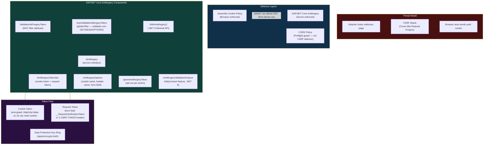
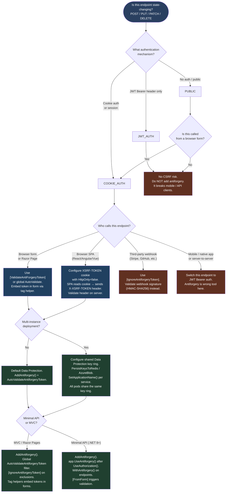

---

# 4.210 — CSRF / Antiforgery: IAntiforgery and ValidateAntiforgeryToken

---

## PART 0 — Navigation & Context

### Where This Topic Lives in the ASP.NET Core Domain

```
ASP.NET Core Mastery
│
├── E. Middleware Pipeline (4.049–4.063)
│   └── Middleware Ordering ──────────────────────── prerequisite
│
├── I. HTTP Fundamentals (4.123–4.133)
│   └── Cookies: SameSite, Secure, HttpOnly ────── tightly coupled
│
├── J. Authentication (4.134–4.153)
│   └── Cookie Authentication ────────────────────── CSRF only threatens cookie auth
│
└── P. Security (4.208–4.218)
    ├── HTTPS Enforcement (4.208)
    ├── CORS (4.209)
    ├── ► CSRF / Antiforgery (4.210) ◄ ── YOU ARE HERE
    ├── Data Protection API (4.211)
    ├── Security Headers (4.213)
    └── OWASP Top 10 (4.218)
```

### What You Need Before This

- **[[4.135 — Cookie Authentication]]** — CSRF is only possible when authentication state is carried in cookies; understanding cookie auth makes the threat concrete.
- **[[4.126 — Cookies: SameSite Policy, Secure Flag, HttpOnly]]** — `SameSite=Strict/Lax` is a browser-side CSRF defence; antiforgery is the server-side complement.
- **[[4.052 — Middleware Ordering: The Canonical Order]]** — antiforgery validation happens inside the MVC filter pipeline or manually in middleware; position matters.
- **[[4.211 — Data Protection API]]** — antiforgery tokens are encrypted/MACed using the ASP.NET Core Data Protection stack; key ring configuration affects token validity across instances.

### What This Unlocks After

- **[[4.090 — Antiforgery in Minimal APIs (.NET 8)]]** — Minimal API antiforgery uses the same `IAntiforgery` service but with `WithAntiforgery()` and `[FromForm]` integration.
- **[[4.210 → 4.317 — File Upload]]** — multipart form posts require antiforgery validation; file upload patterns build on this.
- **[[4.284 — Idempotency Keys]]** — idempotency keys solve duplicate-submission at the application layer; antiforgery solves cross-origin forgery at the security layer — they are complementary, not overlapping.
- **[[4.218 — OWASP Top 10 Applied to ASP.NET Core]]** — CSRF is OWASP A01/A05 territory; this topic is a direct building block.

### Why This Matters at Scale

In a production API that serves both a browser SPA and mobile clients, misconfigured antiforgery is the single most common cause of either a broken form submission (token missing → 400/403 for every POST) or a silent security hole (validation bypassed → any malicious site can trigger state-changing requests on behalf of authenticated users). Getting this wrong costs you in customer support tickets or in your next security audit.

---

## PART 1 — The Core Mental Model

### The Fundamental Rule

> **ASP.NET Core's antiforgery system prevents CSRF by requiring every state-changing HTTP request to carry a secret token that was generated for the current user's session and is only obtainable by JavaScript running on your own origin — the practical consequence is that a cross-origin form POST from a malicious site cannot carry a valid token and is rejected with 400 before any application code runs.**

### The Plain-Language Analogy

Imagine your bank hands you a numbered wristband when you enter. To make a withdrawal, the teller requires you to show that wristband. A thief who tricks you into clicking a link cannot make a withdrawal on your behalf because they do not have your wristband — they are not in the building. The CSRF attack is the trick link; the wristband is the antiforgery token; the teller check is `[ValidateAntiForgeryToken]`. The wristband is unique per visit (per session), so stealing one from last Tuesday does not help.

This analogy holds even under pressure: if a user has two browser tabs open, each tab can have a different token (the cookie-token pair is per-request or per-session depending on configuration). If the server restarts, tokens generated before the restart are invalid because the Data Protection key ring is the source of truth. If the user clears cookies, the token cookie is gone and the next request gets a fresh pair.

### The Taxonomy Diagram



---

## PART 2 — Deep Mechanics

### 2.1 — What CSRF Actually Is and Why Cookies Make It Possible

CSRF is possible only because browsers automatically attach cookies to every request destined for a domain, regardless of which page triggered that request.

```
// The attack, step by step:

// 1. User logs into https://payments.example.com
//    Browser stores: Cookie: .AspNetCore.Auth=<encrypted identity>

// 2. User visits https://evil-site.attacker.com (different origin)

// 3. evil-site.attacker.com contains:
//    <form action="https://payments.example.com/transfer" method="POST">
//      <input name="amount" value="9999" />
//      <input name="toAccount" value="attacker-account" />
//    </form>
//    <script>document.forms[0].submit();</script>

// 4. Browser submits to payments.example.com
//    POST /transfer HTTP/1.1
//    Host: payments.example.com
//    Cookie: .AspNetCore.Auth=<encrypted identity>   ← BROWSER ADDED THIS AUTOMATICALLY
//    Content-Type: application/x-www-form-urlencoded
//    amount=9999&toAccount=attacker-account

// 5. Server sees an authenticated POST and processes the transfer.
//    The user's account loses $9,999. They never clicked anything intentionally.
```

The browser's Same-Origin Policy does NOT prevent this. SOP prevents cross-origin reads (reading the response). It does not prevent cross-origin writes (submitting a form POST).

**Pipeline Position:**

```
──► ExceptionHandler ──► HTTPS Redirect ──► Static Files ──► Routing
    ──► CORS ──► Auth ──► Authorization
    ──► [MVC Filter: AntiforgeryValidation] ──► Model Binding ──► Action Execution
```

The antiforgery validation fires inside the MVC filter pipeline, after authentication, before the action body runs. Cost: `~1 Data Protection decrypt operation per validated request` (the cost is in cryptography, not allocation).

---

### 2.2 — The Double-Submit Cookie Pattern (What ASP.NET Core Uses)

ASP.NET Core uses a cryptographically strengthened variant of the double-submit cookie pattern.

```
// Step 1: Server generates a token SET on GET request
//         (e.g., when rendering the form page)

// ASP.NET Core internally (approximate) — AntiforgeryTokenStore + DefaultAntiforgery:
// 1. Check if cookie token already exists in request
// 2. If not: generate random cookie token bytes, encrypt with Data Protection
// 3. Generate request token: Hash(cookieToken + userId + additionalData)
//    -- userId is included so token cannot be used across user accounts
// 4. Set cookie token on response
// 5. Return request token to embed in form or expose via JS

// HTTP wire format — GET response with token setup:
// HTTP/1.1 200 OK
// Set-Cookie: .AspNetCore.Antiforgery.xxxxx=CfDJ8...; path=/; samesite=strict; httponly
// Content-Type: text/html
//
// <form method="post" action="/transfer">
//   <input type="hidden" name="__RequestVerificationToken" value="CfDJ8Af3...long...token" />
//   ...
// </form>

// Step 2: Client submits the form — both tokens travel together
// POST /transfer HTTP/1.1
// Cookie: .AspNetCore.Antiforgery.xxxxx=CfDJ8...   ← cookie token (browser auto-sends)
// Content-Type: application/x-www-form-urlencoded
//
// __RequestVerificationToken=CfDJ8Af3...&amount=100&toAccount=friend
//                           ^^^^ request token (from form field)

// Step 3: Server validates
// IAntiforgery internally:
// 1. Read cookie token from request cookies
// 2. Read request token from form field (or X-XSRF-TOKEN header)
// 3. Decrypt both with Data Protection
// 4. Verify they form a valid pair: request token contains HMAC of (cookieToken + userId)
// 5. Verify userId in token matches HttpContext.User.Identity.Name
// 6. If invalid: throw AntiforgeryValidationException → 400 Bad Request
```

**Why the attacker cannot forge this:** The attacker's malicious page can submit a form with the cookie (browser auto-attaches it) but cannot read the cookie value to compute the matching request token, because the antiforgery cookie is set with `HttpOnly=false` BUT it is same-site; JavaScript on evil-site.attacker.com cannot read cookies from payments.example.com due to the Same-Origin Policy on cookie access. Without the cookie value, the attacker cannot compute the HMAC needed to produce a valid request token.

**Runtime cost:** `~1 AES-256-CBC decrypt + HMAC-SHA256 verify per validated POST` — measurable under benchmarks but negligible at normal API throughput (<1ms per operation on modern hardware).

---

### 2.3 — IAntiforgery: The Service Interface

```csharp
// The public contract — Microsoft.AspNetCore.Antiforgery
public interface IAntiforgery
{
    // Generates a token set. Writes the cookie token to the response if not already set.
    // Call this on GET requests that render forms.
    AntiforgeryTokenSet GetAndStoreTokens(HttpContext httpContext);

    // Returns the existing tokens without side effects (no cookie write).
    // Use when you only need the request token for AJAX headers.
    AntiforgeryTokenSet GetTokens(HttpContext httpContext);

    // Returns true if the request has a valid antiforgery token.
    // Does NOT throw. Use for conditional logic.
    Task<bool> IsRequestValidAsync(HttpContext httpContext);

    // Validates the antiforgery token and throws AntiforgeryValidationException if invalid.
    // This is what [ValidateAntiForgeryToken] calls internally.
    Task ValidateRequestAsync(HttpContext httpContext);
}

public sealed class AntiforgeryTokenSet
{
    public string CookieToken { get; }     // The encrypted cookie value
    public string RequestToken { get; }    // The per-request form/header token
    public string FormFieldName { get; }   // Default: "__RequestVerificationToken"
    public string? HeaderName { get; }     // Default: "X-XSRF-TOKEN"
}
```

**Registration — happens automatically when you call `AddControllersWithViews()` or `AddRazorPages()`:**

```csharp
// builder.Services internals (approximate):
// AddControllersWithViews() calls:
//   services.AddAntiforgery();
// which registers:
//   IAntiforgery → DefaultAntiforgery (Singleton)
//   IAntiforgeryTokenSerializer → DefaultAntiforgeryTokenSerializer (Singleton)
//   IAntiforgeryTokenStore → CookieBasedAntiforgeryTokenStore (Singleton)

// For Minimal APIs (.NET 8+), you must call explicitly:
builder.Services.AddAntiforgery();
```

---

### 2.4 — MVC Integration: The Three Attributes

```
// Pipeline position within MVC filter chain:
//
// Request ──► Authorization Filters ──► Resource Filters
//         ──► [AntiforgeryValidation runs here, as part of Resource Filter stage]
//         ──► Model Binding ──► Action Filters ──► Action ──► Result Filters
```

```csharp
// ATTRIBUTE 1: [ValidateAntiForgeryToken]
// Applies to one action or controller. Validates on EVERY HTTP method including GET.
[HttpPost]
[ValidateAntiForgeryToken]
public IActionResult Transfer(TransferRequest request) { ... }

// ATTRIBUTE 2: [AutoValidateAntiforgeryToken]
// Applies globally or per-controller. Validates only on state-changing methods:
// POST, PUT, PATCH, DELETE. Skips GET, HEAD, OPTIONS, TRACE.
// This is the recommended global setting for Razor Pages / MVC form apps.
[AutoValidateAntiforgeryToken]
public class PaymentController : ControllerBase { ... }

// Global registration (recommended for full Razor MVC apps):
builder.Services.AddControllersWithViews(options =>
{
    options.Filters.Add(new AutoValidateAntiforgeryTokenAttribute());
});

// ATTRIBUTE 3: [IgnoreAntiforgeryToken]
// Opt-out for specific actions within a controller that has global validation.
// Use for webhook receivers, API endpoints called by non-browser clients.
[HttpPost("webhook")]
[IgnoreAntiforgeryToken]
public IActionResult StripeWebhook([FromBody] StripeEvent evt) { ... }
```

**HTTP consequence when validation fails:**

```
// HTTP/1.1 400 Bad Request
// Content-Type: application/problem+json
//
// {
//   "type": "https://tools.ietf.org/html/rfc7807",
//   "title": "Bad Request",
//   "status": 400,
//   "detail": "The required antiforgery request token was not provided or was invalid."
// }
```

---

### 2.5 — AJAX / SPA Integration: The X-XSRF-TOKEN Header Pattern

Browser-based SPAs (React, Angular, Vue) cannot embed a token in a `<form>` hidden field because they make `fetch()` or `XMLHttpRequest` calls. The pattern is:

```
// Step 1: Server writes the request token into a NON-HttpOnly cookie
//         so JavaScript can read it.
// This is different from the antiforgery cookie which IS HttpOnly.

// In a Razor layout / Minimal API endpoint:
app.MapGet("/antiforgery/token", (IAntiforgery antiforgery, HttpContext ctx) =>
{
    var tokens = antiforgery.GetAndStoreTokens(ctx);
    // Return the request token as JSON so the SPA can store it in memory
    return Results.Ok(new { token = tokens.RequestToken });
})
.AllowAnonymous();

// Angular convention (automatic):
// Angular's HttpClientXsrfModule reads the cookie named "XSRF-TOKEN"
// and sends it as header "X-XSRF-TOKEN" on every mutating request.
// ASP.NET Core reads this header by default via AntiforgeryOptions.HeaderName.

// ASP.NET Core configuration to match Angular's convention:
builder.Services.AddAntiforgery(options =>
{
    options.HeaderName = "X-XSRF-TOKEN";     // Angular default
    options.Cookie.Name = "XSRF-TOKEN";      // Angular reads this cookie
    options.Cookie.HttpOnly = false;         // MUST be false — JS must read the cookie
    options.Cookie.SameSite = SameSiteMode.Strict;
    options.Cookie.SecurePolicy = CookieSecurePolicy.Always;
});
```

```
// HTTP wire format — SPA request with antiforgery header:
// POST /api/payments/transfer HTTP/1.1
// Cookie: .AspNetCore.Auth=<session>; XSRF-TOKEN=<cookie-token>
// X-XSRF-TOKEN: CfDJ8Af3...<request-token>
// Content-Type: application/json
//
// { "amount": 100, "toAccount": "friend-account" }
```

**The key insight:** Simple cross-origin form POSTs cannot set custom headers (only `application/x-www-form-urlencoded` without custom headers is the "simple request" that bypasses CORS preflight). By requiring a custom header (`X-XSRF-TOKEN`), the server forces a CORS preflight on any cross-origin AJAX call, which your CORS policy will reject. This means the header-based pattern and the CORS policy work together as defence in depth.

---

### 2.6 — AntiforgeryOptions: Configuration Knobs

```csharp
builder.Services.AddAntiforgery(options =>
{
    // Cookie configuration
    options.Cookie.Name = ".MyApp.Antiforgery";     // default: auto-generated with hash
    options.Cookie.Path = "/";
    options.Cookie.HttpOnly = true;                  // KEEP true for the antiforgery cookie
    options.Cookie.SameSite = SameSiteMode.Strict;  // strongest setting
    options.Cookie.SecurePolicy = CookieSecurePolicy.Always; // HTTPS only

    // Form field and header names
    options.FormFieldName = "__RequestVerificationToken"; // default
    options.HeaderName = "X-XSRF-TOKEN";                 // default; matches Angular

    // Suppress cookie-set when no form/AJAX token needed
    options.SuppressXFrameOptionsHeader = false; // default: adds X-Frame-Options: SAMEORIGIN
});
```

**The `SuppressXFrameOptionsHeader` trap:** By default, `AddAntiforgery()` adds `X-Frame-Options: SAMEORIGIN` to all responses. If you have a separate security headers middleware (topic 4.213) that also sets this header, you get duplicate headers. Set `SuppressXFrameOptionsHeader = true` and let your security headers middleware own that header.

**Data Protection key ring dependency:** Antiforgery tokens are encrypted using `IDataProtector` with purpose `"Microsoft.AspNetCore.Antiforgery.AntiforgeryToken"`. In a multi-instance deployment (Kubernetes, Azure App Service), all instances must share the same key ring (via Redis, Azure Blob, or Azure Key Vault) or tokens generated on instance A will fail validation on instance B.

```
// Failure mode in multi-instance deployment with no shared key ring:
// Instance A generates token → cookie on response → user submits form
// Load balancer routes POST to Instance B
// Instance B cannot decrypt cookie token from Instance A's key ring
// → AntiforgeryValidationException → 400 Bad Request
// Users see random form submission failures under load
```

---

### 2.7 — Failure Mode: What Happens on Validation Failure

```
// Pipeline on antiforgery failure:

Request POST /transfer
    ──► ExceptionHandler (catches AntiforgeryValidationException if unhandled)
    ──► Auth Middleware (sets User principal)
    ──► Authorization Middleware (passes — user is authenticated)
    ──► MVC ResourceFilter: AntiforgeryValidation
           ↓ ValidateRequestAsync() throws AntiforgeryValidationException
           ↓
    [MVC calls IAntiforgeryValidationFailedResult]
           ↓
    HTTP/1.1 400 Bad Request
    Content-Type: application/problem+json

// The action method NEVER executes.
// The AntiforgeryValidationException does NOT propagate to UseExceptionHandler
// under normal MVC operation — MVC catches it at the resource filter stage.
// If you have a global exception handler, it will NOT see antiforgery failures
// unless you re-register custom behavior.
```

---

## PART 3 — Production Code Patterns

### Pattern 1: The Global Antiforgery Shield for a Payment Portal MVC App

The right way to apply antiforgery protection across an entire MVC controller application, with surgical opt-out for API endpoints that receive webhook calls.

```csharp
// ⚠️ WRONG: Applying [ValidateAntiForgeryToken] per-action — easy to forget, creates gaps
[HttpPost]
public IActionResult ProcessPayment(PaymentRequest req)  // ← UNPROTECTED, forgot attribute
{
    _paymentService.Process(req);
    return Ok();
}

// ✅ CORRECT: Global AutoValidateAntiforgeryToken, explicit opt-out for webhooks
// Program.cs — Payment Portal
builder.Services.AddControllersWithViews(options =>
{
    // Validates POST/PUT/PATCH/DELETE on every controller globally.
    // GET/HEAD/OPTIONS/TRACE are always skipped (they must be safe/idempotent).
    options.Filters.Add(new AutoValidateAntiforgeryTokenAttribute());
});

builder.Services.AddAntiforgery(options =>
{
    options.Cookie.SecurePolicy = CookieSecurePolicy.Always;
    options.Cookie.SameSite = SameSiteMode.Strict;
    options.SuppressXFrameOptionsHeader = false; // let antiforgery own X-Frame-Options
});

// PaymentController.cs
[Route("payments")]
public class PaymentController : ControllerBase
{
    private readonly IPaymentService _paymentService;
    private readonly ILogger<PaymentController> _logger;

    public PaymentController(IPaymentService paymentService, ILogger<PaymentController> logger)
    {
        _paymentService = paymentService;
        _logger = logger;
    }

    // PROTECTED: AutoValidateAntiforgeryToken global filter covers this
    [HttpPost("transfer")]
    public async Task<IActionResult> Transfer(TransferRequest request)
    {
        // This only executes if antiforgery token is valid
        var result = await _paymentService.TransferAsync(request);
        return result.IsSuccess ? Ok(result.Value) : BadRequest(result.Error);
    }

    // OPT-OUT: Stripe sends a webhook from their servers, not a browser
    // They cannot include a browser session cookie, so antiforgery makes no sense here
    [HttpPost("webhook/stripe")]
    [IgnoreAntiforgeryToken]
    public async Task<IActionResult> StripeWebhook()
    {
        // Validate using Stripe-Signature header instead
        var payload = await new StreamReader(Request.Body).ReadToEndAsync();
        var stripeSignature = Request.Headers["Stripe-Signature"];
        // ... validate stripe signature ...
        return Ok();
    }
}

// HTTP wire format — protected transfer:
// POST /payments/transfer HTTP/1.1
// Cookie: .AspNetCore.Auth=<session>; .MyApp.Antiforgery=<cookie-token>
// Content-Type: application/x-www-form-urlencoded
//
// __RequestVerificationToken=CfDJ8Af3...&amount=500&toAccount=acc-123
//
// HTTP/1.1 200 OK  (when valid)
// HTTP/1.1 400 Bad Request  (when token missing or invalid)
```

---

### Pattern 2: React SPA + ASP.NET Core API — The Token Endpoint Pattern

A React SPA authenticates with cookie auth and needs antiforgery tokens for state-changing API calls.

```csharp
// Program.cs — Order Management Service with SPA frontend
builder.Services.AddAntiforgery(options =>
{
    // Match the React app's fetch interceptor which reads this cookie
    options.Cookie.Name = "XSRF-TOKEN";
    options.Cookie.HttpOnly = false;          // SPA JavaScript must read this
    options.Cookie.SameSite = SameSiteMode.Strict;
    options.Cookie.SecurePolicy = CookieSecurePolicy.Always;
    options.HeaderName = "X-XSRF-TOKEN";     // React sends this header
});

// Dedicated endpoint to fetch a fresh antiforgery token after login
app.MapGet("/api/antiforgery/token", (IAntiforgery antiforgery, HttpContext ctx) =>
{
    // GetAndStoreTokens writes the cookie if not already set
    // and returns the request token the SPA should store in memory (NOT in localStorage)
    var tokens = antiforgery.GetAndStoreTokens(ctx);
    return Results.Ok(new { requestToken = tokens.RequestToken });
})
.RequireAuthorization() // Only authenticated users get tokens
.WithName("GetAntiforgeryToken");

// OrdersController.cs
[ApiController]
[Route("api/orders")]
public class OrdersController : ControllerBase
{
    [HttpPost]
    [ValidateAntiForgeryToken]
    public async Task<IActionResult> PlaceOrder(PlaceOrderRequest request)
    {
        // ...
        return CreatedAtAction(nameof(GetOrder), new { id = order.Id }, order);
    }

    [HttpGet("{id:guid}")]
    // No antiforgery on GET — safe method, no state change
    public async Task<IActionResult> GetOrder(Guid id) { ... }
}
```

```javascript
// React — fetch interceptor
// After login, call token endpoint:
const tokenResponse = await fetch('/api/antiforgery/token', { credentials: 'include' });
const { requestToken } = await tokenResponse.json();

// Store in memory (React state or context), NOT localStorage
// On every POST/PUT/DELETE:
await fetch('/api/orders', {
  method: 'POST',
  credentials: 'include',  // send the auth cookie
  headers: {
    'Content-Type': 'application/json',
    'X-XSRF-TOKEN': requestToken  // antiforgery header
  },
  body: JSON.stringify(orderData)
});

// HTTP wire format — SPA order placement:
// POST /api/orders HTTP/1.1
// Cookie: .AspNetCore.Auth=<session>; XSRF-TOKEN=<cookie-token>
// X-XSRF-TOKEN: CfDJ8Af3...<request-token>
// Content-Type: application/json
//
// {"productId":"prod-456","quantity":2}
```

---

### Pattern 3: Programmatic Token Generation for Server-Rendered Partial Views

In an order management dashboard that uses HTMX for partial renders, the server must embed a fresh token in each returned HTML fragment.

```csharp
// DashboardController.cs — Order Management Dashboard (HTMX-driven)
[Route("dashboard")]
public class DashboardController : ControllerBase
{
    private readonly IAntiforgery _antiforgery;

    public DashboardController(IAntiforgery antiforgery)
    {
        _antiforgery = antiforgery;
    }

    [HttpGet("orders/partial")]
    public IActionResult GetOrdersPartial()
    {
        // Generate tokens programmatically to embed in the partial HTML response
        var tokens = _antiforgery.GetAndStoreTokens(HttpContext);

        // Return partial HTML with the token embedded
        var html = $"""
            <form hx-post="/dashboard/orders/cancel" hx-swap="outerHTML">
                <input type="hidden" name="{tokens.FormFieldName}" value="{tokens.RequestToken}" />
                <button type="submit">Cancel Order</button>
            </form>
            """;

        return Content(html, "text/html");
    }

    [HttpPost("orders/cancel")]
    [ValidateAntiForgeryToken]
    public async Task<IActionResult> CancelOrder(CancelOrderRequest request)
    {
        // Token is validated before this line executes
        await _orderService.CancelAsync(request.OrderId);
        return Content("<div>Order cancelled.</div>", "text/html");
    }
}
```

---

### Pattern 4: Custom Antiforgery Validation in Minimal API Middleware (.NET 8)

For a Minimal API that must protect form-based endpoints, using the `.NET 8` `WithAntiforgery()` convention.

```csharp
// Program.cs — Inventory Management Service (.NET 8+)
builder.Services.AddAntiforgery();

var app = builder.Build();

// UseAntiforgery() middleware validates tokens on endpoints marked WithAntiforgery()
// It must be placed after UseAuthentication and UseAuthorization
app.UseAuthentication();
app.UseAuthorization();
app.UseAntiforgery();  // .NET 8+ — registers AntiforgeryMiddleware

var inventoryApi = app.MapGroup("/api/inventory")
    .RequireAuthorization();

// WithAntiforgery() marks this endpoint as requiring token validation
// UseAntiforgery middleware checks IAntiforgeryValidationFeature on the HttpContext
inventoryApi.MapPost("/items", async (
    [FromForm] CreateInventoryItemRequest request,  // [FromForm] triggers antiforgery check
    IInventoryService inventoryService) =>
{
    var item = await inventoryService.CreateAsync(request);
    return TypedResults.Created($"/api/inventory/items/{item.Id}", item);
})
.WithAntiforgery()   // .NET 8 Minimal API antiforgery opt-in
.WithName("CreateInventoryItem");

// Token generation endpoint
inventoryApi.MapGet("/antiforgery-token", (IAntiforgery antiforgery, HttpContext ctx) =>
{
    var tokens = antiforgery.GetAndStoreTokens(ctx);
    return TypedResults.Ok(new { token = tokens.RequestToken, fieldName = tokens.FormFieldName });
});

// HTTP wire format — Minimal API antiforgery-protected POST:
// POST /api/inventory/items HTTP/1.1
// Cookie: .AspNetCore.Auth=<session>; .AspNetCore.Antiforgery.xxx=<cookie-token>
// Content-Type: application/x-www-form-urlencoded
//
// __RequestVerificationToken=CfDJ8...&name=Widget+Pro&quantity=500
//
// HTTP/1.1 201 Created
// Location: /api/inventory/items/item-789
```

---

### Pattern 5: Antiforgery in a Multi-Instance Kubernetes Deployment

The most critical production configuration — shared Data Protection key ring so tokens survive load balancer routing across pods.

```csharp
// Program.cs — Logistics Tracking Service (Kubernetes, 3 replicas)

// ⚠️ WRONG: No shared key ring — tokens fail when routed to different pod
builder.Services.AddDataProtection(); // Uses in-memory ephemeral keys per pod
builder.Services.AddAntiforgery();    // Tokens only valid on the pod that generated them

// ✅ CORRECT: Shared key ring via Azure Blob Storage + Azure Key Vault encryption
builder.Services.AddDataProtection()
    .PersistKeysToAzureBlobStorage(
        new Uri("https://mysstorage.blob.core.windows.net/keys/shipment-tracker-keys.xml"),
        new DefaultAzureCredential())
    .ProtectKeysWithAzureKeyVault(
        new Uri("https://myvault.vault.azure.net/keys/DataProtectionKey"),
        new DefaultAzureCredential())
    .SetApplicationName("LogisticsTrackingService")  // CRITICAL: same name across all services
    .SetDefaultKeyLifetime(TimeSpan.FromDays(90));

builder.Services.AddAntiforgery(options =>
{
    options.Cookie.SecurePolicy = CookieSecurePolicy.Always;
    options.Cookie.SameSite = SameSiteMode.Strict;
});

// HTTP consequence (correct path):
// All 3 Kubernetes pods share the same encrypted key ring.
// Pod A generates token → user submits → Pod B receives POST
// Pod B decrypts cookie token from shared key ring → valid pair → 200 OK
//
// HTTP consequence (wrong path — no shared key ring):
// Pod A generates token → user submits → Pod B receives POST
// Pod B cannot decrypt cookie token (different in-memory keys)
// → AntiforgeryValidationException → 400 Bad Request (random, ~66% of the time)
```

---

### Pattern 6: Testing Antiforgery Tokens in Integration Tests

```csharp
// OrderIntegrationTests.cs
// WebApplicationFactory with antiforgery disabled for test isolation

// ⚠️ WRONG: Sending POST without antiforgery token and not disabling validation
// Results in 400 on every POST — tests pass for wrong reasons or fail confusingly
[Fact]
public async Task PlaceOrder_WithoutTokenSetup_Returns400() // not a useful test
{
    var response = await _client.PostAsJsonAsync("/api/orders", new PlaceOrderRequest());
    Assert.Equal(HttpStatusCode.BadRequest, response.StatusCode); // passes but tests nothing
}

// ✅ CORRECT APPROACH 1: Disable antiforgery in test host
public class OrderApiFactory : WebApplicationFactory<Program>
{
    protected override void ConfigureWebHost(IWebHostBuilder builder)
    {
        builder.ConfigureServices(services =>
        {
            // Replace IAntiforgery with a no-op implementation for integration tests
            services.AddSingleton<IAntiforgery, DisabledAntiforgery>();
        });
    }
}

internal class DisabledAntiforgery : IAntiforgery
{
    public AntiforgeryTokenSet GetAndStoreTokens(HttpContext httpContext)
        => new AntiforgeryTokenSet("test-cookie", "test-request", "__RequestVerificationToken", "X-XSRF-TOKEN");
    public AntiforgeryTokenSet GetTokens(HttpContext httpContext)
        => new AntiforgeryTokenSet("test-cookie", "test-request", "__RequestVerificationToken", "X-XSRF-TOKEN");
    public Task<bool> IsRequestValidAsync(HttpContext httpContext) => Task.FromResult(true);
    public Task ValidateRequestAsync(HttpContext httpContext) => Task.CompletedTask;
}

// ✅ CORRECT APPROACH 2: Fetch a real token from the test server (tests the full flow)
[Fact]
public async Task PlaceOrder_WithValidToken_Returns201()
{
    // First GET the antiforgery token from the test server
    var tokenResponse = await _client.GetAsync("/api/antiforgery/token");
    var tokenData = await tokenResponse.Content.ReadFromJsonAsync<AntiforgeryTokenResponse>();

    // Extract the cookie from the GET response (test server wrote it)
    var cookieHeader = tokenResponse.Headers.GetValues("Set-Cookie").First();

    // POST with both the cookie and the request token
    using var request = new HttpRequestMessage(HttpMethod.Post, "/api/orders");
    request.Headers.Add("Cookie", cookieHeader.Split(';')[0]); // forward the antiforgery cookie
    request.Headers.Add("X-XSRF-TOKEN", tokenData!.RequestToken);
    request.Content = JsonContent.Create(new PlaceOrderRequest { ... });

    var response = await _client.SendAsync(request);
    Assert.Equal(HttpStatusCode.Created, response.StatusCode);
}
```

---

### Pattern 7: Razor Pages — Built-In Tag Helper Integration

Razor Pages has first-class antiforgery support via the `<form>` tag helper.

```csharp
// Pages/Checkout/Payment.cshtml.cs — E-Commerce Checkout Page
[AutoValidateAntiforgeryToken]
public class PaymentModel : PageModel
{
    [BindProperty]
    public PaymentFormModel Payment { get; set; } = new();

    private readonly IPaymentService _paymentService;

    public PaymentModel(IPaymentService paymentService)
    {
        _paymentService = paymentService;
    }

    public void OnGet()
    {
        // Token is automatically embedded by the <form asp-page="Payment"> tag helper
        // No explicit IAntiforgery call needed in Razor Pages
    }

    public async Task<IActionResult> OnPostAsync()
    {
        if (!ModelState.IsValid)
            return Page();

        // Token already validated by AutoValidateAntiforgeryToken before this runs
        var result = await _paymentService.ChargeAsync(Payment);
        return result.IsSuccess
            ? RedirectToPage("/Checkout/Confirmation")
            : Page();
    }
}
```

```html
<!-- Pages/Checkout/Payment.cshtml -->
<!-- The asp-page tag helper automatically injects __RequestVerificationToken -->
<form asp-page="Payment" method="post">
    <!-- This hidden field is generated automatically: -->
    <!-- <input type="hidden" name="__RequestVerificationToken" value="CfDJ8..." /> -->

    <input asp-for="Payment.CardNumber" />
    <input asp-for="Payment.Expiry" />
    <button type="submit">Pay Now</button>
</form>

<!-- HTML wire format sent to browser:
<form action="/Checkout/Payment" method="post">
    <input type="hidden" name="__RequestVerificationToken" value="CfDJ8Af3...long...value" />
    <input type="text" name="Payment.CardNumber" />
    <input type="text" name="Payment.Expiry" />
    <button type="submit">Pay Now</button>
</form>
-->
```

---

## PART 4 — Gotchas & Anti-Patterns

### Gotcha 1: Antiforgery Token Is Invalid After Horizontal Scale-Out Without Shared Key Ring

Engineers configure antiforgery correctly on a single-instance deployment, then scale to multiple instances. Intermittent 400 errors appear roughly proportional to the number of instances.

```csharp
// ⚠️ WRONG CODE — default Data Protection with no shared key ring
builder.Services.AddDataProtection(); // ephemeral in-memory keys, unique per pod
builder.Services.AddAntiforgery();

// HTTP consequence (wrong path):
// User GETs form from Pod-A → cookie token encrypted by Pod-A's key
// Browser POSTs form → load balancer routes to Pod-B
// Pod-B tries to decrypt cookie token → decryption fails (different key)
// → AntiforgeryValidationException → HTTP/1.1 400 Bad Request
// Happens on ~(N-1)/N of POST requests when N pods exist

// ✅ CORRECT CODE — persistent shared key ring
builder.Services.AddDataProtection()
    .PersistKeysToStackExchangeRedis(connectionMultiplexer, "ShipmentService:DataProtection")
    .SetApplicationName("ShipmentService");
builder.Services.AddAntiforgery();

// HTTP consequence (correct path):
// All pods share the same key ring → decrypt succeeds on any pod
// HTTP/1.1 200 OK consistently

// WHY: AntiforgeryTokens are encrypted by IDataProtector.
// When each pod has its own in-memory key ring, tokens are pod-local.
// PersistKeysToRedis / PersistKeysToAzureBlobStorage makes keys shared.
// SetApplicationName isolates key rings between different services on the same Redis.
```

---

### Gotcha 2: Setting `HttpOnly = true` on the XSRF-TOKEN Cookie Breaks SPA Integration

Engineers correctly set `HttpOnly = true` on auth cookies (correct) and mistakenly apply the same setting to the antiforgery cookie used by JavaScript SPAs.

```csharp
// ⚠️ WRONG CODE — HttpOnly blocks JavaScript from reading the cookie
builder.Services.AddAntiforgery(options =>
{
    options.Cookie.Name = "XSRF-TOKEN";
    options.Cookie.HttpOnly = true;  // WRONG for the SPA-readable cookie
});

// HTTP consequence (wrong path):
// Browser receives: Set-Cookie: XSRF-TOKEN=CfDJ8...; HttpOnly
// JavaScript fetch('/api/orders') cannot read document.cookie["XSRF-TOKEN"]
// → X-XSRF-TOKEN header is never set on AJAX requests
// → POST /api/orders HTTP/1.1 — missing X-XSRF-TOKEN header
// → HTTP/1.1 400 Bad Request (antiforgery validation fails)
// Angular shows "HTTP Error 400" on every form submit. Dev console shows no obvious cause.

// ✅ CORRECT CODE — HttpOnly=false for the XSRF-TOKEN cookie only
builder.Services.AddAntiforgery(options =>
{
    options.Cookie.Name = "XSRF-TOKEN";
    options.Cookie.HttpOnly = false;         // SPA must read this cookie
    options.Cookie.SameSite = SameSiteMode.Strict; // still protected by SameSite
    options.Cookie.SecurePolicy = CookieSecurePolicy.Always;
    options.HeaderName = "X-XSRF-TOKEN";
});

// HTTP consequence (correct path):
// Set-Cookie: XSRF-TOKEN=CfDJ8...; SameSite=Strict; Secure (no HttpOnly)
// Angular reads the cookie → sets X-XSRF-TOKEN header → validation passes
// HTTP/1.1 200 OK

// WHY: The security of the double-submit pattern does not depend on HttpOnly.
// The antiforgery cookie is not the secret — the DATA PROTECTION ENCRYPTION is the secret.
// The SameSite attribute prevents a cross-origin page from sending the cookie at all.
// HttpOnly=false is intentional and safe here.
```

---

### Gotcha 3: `[AutoValidateAntiforgeryToken]` Does Not Protect API Controllers Called from Postman / Mobile Apps

Engineers apply `[AutoValidateAntiforgeryToken]` globally thinking it protects all endpoints, not realizing it validates every POST — including from mobile apps and third-party API consumers who cannot generate tokens.

```csharp
// ⚠️ WRONG CODE — applying AutoValidateAntiforgeryToken to a pure JSON API
builder.Services.AddControllers(options =>
{
    options.Filters.Add(new AutoValidateAntiforgeryTokenAttribute()); // ← breaks mobile/API clients
});

// HTTP consequence (wrong path):
// Mobile app POSTs to /api/shipments/create:
// POST /api/shipments/create HTTP/1.1
// Authorization: Bearer eyJhbGci...  ← JWT, not cookie auth
// Content-Type: application/json
// { "origin": "Cairo", "destination": "Dubai" }
//
// → HTTP/1.1 400 Bad Request — mobile never had a form to get a token from

// ✅ CORRECT CODE — antiforgery only for cookie-authenticated, browser-driven endpoints
// Option A: Do not apply global AutoValidateAntiforgeryToken to pure API controllers
// Apply [ValidateAntiForgeryToken] only on controllers that serve browser form submissions
[Route("web/payments")]
[AutoValidateAntiforgeryToken]
public class PaymentFormController : Controller { ... }  // browser form actions

[Route("api/shipments")]
// No antiforgery — JWT-authenticated API used by mobile and third parties
public class ShipmentsApiController : ControllerBase { ... }

// HTTP consequence (correct path):
// Mobile app JWT POST → HTTP/1.1 201 Created (no antiforgery check)
// Browser form POST without token → HTTP/1.1 400 Bad Request (correctly blocked)

// WHY: CSRF is only a threat when authentication uses cookies.
// JWT in Authorization header is NOT vulnerable to CSRF because browsers do not
// auto-attach Authorization headers to cross-origin form POSTs.
// Applying antiforgery to JWT-only endpoints is friction with zero security benefit.
```

---

### Gotcha 4: Forgetting `UseAntiforgery()` Middleware in Minimal APIs (.NET 8)

In .NET 8, `WithAntiforgery()` on a Minimal API endpoint does nothing unless `app.UseAntiforgery()` is also registered — and in the correct pipeline position.

```csharp
// ⚠️ WRONG CODE — WithAntiforgery() declared but middleware missing
var app = builder.Build();
app.UseAuthentication();
app.UseAuthorization();
// Missing: app.UseAntiforgery()

app.MapPost("/api/inventory/items", async ([FromForm] CreateItemRequest req, ...) => { ... })
    .WithAntiforgery(); // has no effect — middleware not in pipeline

// HTTP consequence (wrong path):
// POST /api/inventory/items with NO antiforgery token
// → HTTP/1.1 200 OK  ← request processed, CSRF protection is silently absent
// No error, no warning. Security hole in production.

// ✅ CORRECT CODE — middleware must be present AND in the right position
var app = builder.Build();
app.UseAuthentication();
app.UseAuthorization();
app.UseAntiforgery();  // Must be AFTER UseAuthorization — reads endpoint metadata set by routing

app.MapPost("/api/inventory/items", async ([FromForm] CreateItemRequest req, ...) => { ... })
    .WithAntiforgery();

// HTTP consequence (correct path):
// POST without token → HTTP/1.1 400 Bad Request
// POST with valid token → HTTP/1.1 201 Created

// WHY: WithAntiforgery() adds IAntiforgeryMetadata to the endpoint.
// UseAntiforgery() middleware reads that metadata at request time and calls ValidateRequestAsync().
// Without the middleware, the metadata is never acted upon.
// ASP.NET Core does NOT warn you that WithAntiforgery() is a no-op without the middleware.
```

---

### Gotcha 5: Antiforgery Token Mismatch After User Login (Token Bound to Pre-Login Identity)

The antiforgery token includes a hash of the user's identity (`User.Identity.Name` or the subject claim). If a token is generated on an anonymous GET request and then the user logs in within the same session, the token generated before login is bound to an empty identity and will fail validation after login.

```csharp
// ⚠️ WRONG FLOW:
// 1. Anonymous user visits /checkout → server generates antiforgery token (bound to null identity)
// 2. User logs in via OAuth → session now has claims
// 3. User submits checkout form with the OLD token (bound to null identity)
// 4. Server validates: token identity (null) ≠ current identity (user@example.com)
// → AntiforgeryValidationException → HTTP/1.1 400 Bad Request
// The user just logged in and their first form submission fails. Terrible UX.

// HTTP consequence (wrong path):
// POST /checkout/confirm HTTP/1.1
// Cookie: .AspNetCore.Auth=<authenticated-session>
// [form includes token generated before login]
// → HTTP/1.1 400 Bad Request — token identity mismatch

// ✅ CORRECT: Regenerate the token after login
// In the login callback / post-login redirect:
app.MapGet("/auth/callback", async (
    HttpContext ctx,
    IAntiforgery antiforgery,
    IAuthenticationService authService) =>
{
    // ... process OAuth callback, sign in user ...
    await authService.SignInAsync(ctx, CookieAuthenticationDefaults.AuthenticationScheme, principal, null);

    // After signing in, regenerate the antiforgery cookie so the new token
    // is bound to the now-authenticated identity
    antiforgery.GetAndStoreTokens(ctx); // writes new cookie bound to authenticated user

    return Results.Redirect("/dashboard");
});

// HTTP consequence (correct path):
// After login: new antiforgery cookie set, bound to authenticated identity
// POST /checkout/confirm with new token → identity matches → HTTP/1.1 200 OK

// WHY: DefaultAntiforgery includes User.GetUserId() in the token HMAC.
// A token generated for an anonymous user fails when validated against an authenticated user.
// Always refresh the antiforgery token immediately after authentication state changes.
```

---

## PART 5 — Performance Implications

### 5.1 — Request Pipeline Characteristics Table

|Scenario|Pipeline Depth|Allocations Per Request|Approx Latency Impact|Recommendation|
|---|---|---|---|---|
|GET request — no antiforgery check|Standard|0 antiforgery allocations|~0µs|No action needed|
|`GetAndStoreTokens()` on form GET|Standard + cookie write|~3 small allocations (token gen, encrypt, set-cookie)|~50–200µs (crypto)|Acceptable; unavoidable|
|POST with `[ValidateAntiForgeryToken]` — valid|Standard + filter + decrypt|~2 allocations (decrypt cookie, decrypt request token)|~50–200µs (crypto)|Acceptable|
|POST — validation failure (bad/missing token)|Short-circuits at resource filter|~2 allocations (attempt decrypt, fail fast)|~50µs|No concern; fail fast is good|
|`[AutoValidateAntiforgeryToken]` global — GET|Attribute check only, skips immediately|~0|~0µs|Free guard on GETs|
|Multi-instance with shared Redis key ring|Standard + Redis round-trip for key fetch (first time only)|Keys are cached in memory after first fetch|+1–5ms at startup, ~0 per request after|Key ring is cached; not per-request Redis|
|Multi-instance — key rotation event|Key ring refresh from Redis|Minor; only when a new key is published|<1ms, background|Transparent to requests|
|WithAntiforgery() — Minimal API (.NET 8)|Antiforgery middleware reads endpoint metadata|~1 allocation (metadata check)|~1µs overhead for metadata check|Minimal; prefer over manual calls|
|Custom `IResult` with manual `ValidateRequestAsync()`|Standard|~2 allocations|~50–200µs|Same as filter-based|
|Antiforgery token served as JSON endpoint|Standard + GetAndStoreTokens|~3 allocations|~50–200µs|Cache the request token in SPA memory|

### 5.2 — BenchmarkDotNet Code

```csharp
using BenchmarkDotNet.Attributes;
using BenchmarkDotNet.Running;
using Microsoft.AspNetCore.Antiforgery;
using Microsoft.AspNetCore.Builder;
using Microsoft.AspNetCore.Http;
using Microsoft.Extensions.DependencyInjection;

[MemoryDiagnoser]
[SimpleJob]
public class AntiforgeryBenchmarks
{
    private IAntiforgery _antiforgery = null!;
    private DefaultHttpContext _httpContext = null!;
    private AntiforgeryTokenSet _tokenSet;

    [GlobalSetup]
    public void Setup()
    {
        var services = new ServiceCollection();
        services.AddDataProtection();
        services.AddAntiforgery();
        services.AddLogging();
        var sp = services.BuildServiceProvider();

        _antiforgery = sp.GetRequiredService<IAntiforgery>();
        _httpContext = new DefaultHttpContext { RequestServices = sp };
        _httpContext.Request.Method = "GET";

        // Pre-generate a token set so we can benchmark validation separately
        _tokenSet = _antiforgery.GetAndStoreTokens(_httpContext);
    }

    // Baseline: what does token generation cost?
    [Benchmark(Baseline = true)]
    public AntiforgeryTokenSet GetAndStoreTokens()
    {
        var ctx = new DefaultHttpContext { RequestServices = _httpContext.RequestServices };
        return _antiforgery.GetAndStoreTokens(ctx);
    }

    // Optimized: reading existing tokens without cookie write
    [Benchmark]
    public AntiforgeryTokenSet GetTokensOnly()
    {
        return _antiforgery.GetTokens(_httpContext);
    }

    // Validation path: simulated valid POST
    [Benchmark]
    public async Task<bool> IsRequestValid_ValidToken()
    {
        var ctx = new DefaultHttpContext { RequestServices = _httpContext.RequestServices };
        // Set up cookies and form data to simulate a valid POST
        ctx.Request.Method = "POST";
        // In a real benchmark you would populate cookies and form correctly
        // This shows the structural overhead
        return await _antiforgery.IsRequestValidAsync(ctx);
    }
}

// Expected output (approximate, .NET 8, x64, Kestrel, local):
// | Method                    | Mean     | Error    | Gen0   | Allocated |
// |---------------------------|----------|----------|--------|-----------|
// | GetAndStoreTokens         | 185.3 µs | 3.2 µs   | 0.4883 | 4.2 KB    |
// | GetTokensOnly             | 1.2 µs   | 0.1 µs   | 0.0153 | 128 B     |
// | IsRequestValid_ValidToken | 198.4 µs | 4.1 µs   | 0.4883 | 4.8 KB    |
//
// Note: The ~180-200µs is dominated by AES-256-CBC decrypt via Data Protection.
// This is negligible for typical web apps but visible under profiling.
// For > 50,000 req/s on token-generating endpoints, consider caching token sets
// per user session rather than generating on every request.

// Profiling note:
// Use `dotnet-counters monitor --process-id <pid> --counters Microsoft.AspNetCore.Hosting`
// to watch request rates. For Data Protection cost specifically, use
// dotnet-trace with the Microsoft-AspNetCore-DataProtection provider.
// MiniProfiler can be added to time the GetAndStoreTokens() call inline in views.
```

### 5.3 — When to Care / When to Ignore

**When this costs you:**

- High-traffic page render (>5,000 form GETs/sec per instance): `GetAndStoreTokens()` runs ~180µs of crypto per call. Consider token caching keyed to the user's session rather than regenerating on every response.
- Multi-instance deployments where key ring is on a slow storage backend (e.g., Azure Blob with cold start): the first request after pod start fetches the key ring. Not per-request, but a startup latency spike visible in Kubernetes readiness probe timing.
- Global `AutoValidateAntiforgeryToken` on a mixed API/form app where high-throughput JSON endpoints also get filtered: adds ~200µs to every state-changing JSON endpoint. Scope the attribute to controller classes, not globally.

**When this doesn't matter:**

- Any API endpoint authenticated exclusively by JWT bearer token (no cookies) — CSRF is not a threat; antiforgery adds friction with zero benefit.
- Internal service-to-service calls behind mTLS — the attacker model that CSRF defends against (untrusted browser) does not apply.
- Admin panels with <100 users — 200µs per request is completely irrelevant at that scale.
- Webhook receivers — explicitly exclude with `[IgnoreAntiforgeryToken]`.

---

## PART 6 — Interview Arsenal

### A. The Question Bank

---

**Question 1:** "What is CSRF and how does ASP.NET Core's antiforgery system prevent it?"

**Average Answer:** CSRF is when an attacker tricks a user into submitting a form to another site. ASP.NET Core uses hidden form tokens to prevent this.

**Why That's Insufficient:** It doesn't explain _why_ the token works — specifically, why an attacker can't just replicate the token — or what the HTTP mechanism is.

> **Great Answer:** "CSRF exploits the fact that browsers automatically attach cookies to every request for a domain, regardless of which page initiated it. So if your auth state is in a cookie, a malicious page can trigger a state-changing request to your API and the browser carries the auth cookie with it. ASP.NET Core's antiforgery system uses the double-submit cookie pattern with a twist: it generates a cookie token and a request token, where the request token is an HMAC of the cookie token value bound to the current user's identity. When an attacker's malicious page submits a form, they can force the browser to send the auth cookie, but they cannot read your domain's antiforgery cookie to compute the matching request token — that's blocked by the browser's same-origin cookie policy. On the wire, the POST must carry both the cookie (auto-sent by browser) and the request token in the form body or a custom request header. If the HMAC doesn't verify, the request filter throws `AntiforgeryValidationException` and the client gets a 400 before any application code runs."

---

**Question 2:** "When should you NOT use antiforgery tokens in an ASP.NET Core API?"

**Average Answer:** You don't need them if you're using JWT.

**Why That's Insufficient:** Correct but not explained mechanically — doesn't articulate why JWT is immune or what the actual threat model boundary is.

> **Great Answer:** "CSRF is specifically a cookie exploitation attack. When authentication state travels in a browser cookie, the browser auto-attaches it to cross-origin requests. But when authentication is via the `Authorization: Bearer` header with a JWT, the browser does NOT auto-attach that header to cross-origin form POSTs — custom headers require CORS preflight, which a real attack can't get approved from your CORS policy. So for any API endpoint that only accepts JWT bearer auth, antiforgery adds zero security and pure friction: it breaks Postman, mobile clients, and server-to-server calls. The line is: if the endpoint is ever called with a browser cookie carrying auth state, antiforgery belongs there. If it's exclusively header-auth, skip it. In production I've seen teams apply `[AutoValidateAntiforgeryToken]` globally and then spend hours debugging why their mobile app gets 400s on every POST — it's always this category error."

---

**Question 3:** "How do you make antiforgery work in a multi-instance Kubernetes deployment?"

**Average Answer:** You need to share the antiforgery keys between instances using Redis or Azure.

**Why That's Insufficient:** Doesn't name the actual mechanism (Data Protection key ring), doesn't explain why it fails without sharing, and doesn't mention `SetApplicationName`.

> **Great Answer:** "The antiforgery token is encrypted using ASP.NET Core's Data Protection system. By default, each application instance generates its own in-memory ephemeral key ring at startup — so if a user gets their form from Pod A and submits to Pod B, Pod B can't decrypt the cookie token and returns a 400. In Kubernetes with rolling deployments, this creates intermittent failures proportional to the number of replicas. The fix is to configure `AddDataProtection()` to persist keys to a shared store — Redis with `PersistKeysToStackExchangeRedis()` or Azure Blob with `PersistKeysToAzureBlobStorage()` — and optionally protect those persisted keys with Azure Key Vault. The often-missed detail is `SetApplicationName()`: if you're running multiple services sharing the same Redis instance, each service's key ring must have a unique application name or their tokens are cross-service compatible, which is a security problem. Keys are cached in memory after the first fetch, so there's no per-request Redis cost once the app is warm."

---

**Question 4:** "What's the difference between `[ValidateAntiForgeryToken]` and `[AutoValidateAntiforgeryToken]`?"

**Average Answer:** Auto validates automatically, regular requires you to add it to each action.

**Why That's Insufficient:** Doesn't explain the HTTP method filtering that `Auto` does, which is actually the most important production detail.

> **Great Answer:** "The key mechanical difference is HTTP method filtering. `[ValidateAntiForgeryToken]` validates on every method including GET, which is usually wrong — GETs should be safe and idempotent and you never want to require a token for them. `[AutoValidateAntiforgeryToken]` only validates on state-changing methods: POST, PUT, PATCH, DELETE. It skips GET, HEAD, OPTIONS, and TRACE. This means you can safely add it as a global filter without breaking your health checks, GET endpoints, or CORS preflight OPTIONS requests. The practical production pattern is to register `AutoValidateAntiforgeryTokenAttribute` as a global MVC filter and then use `[IgnoreAntiforgeryToken]` for explicit opt-outs like webhook receivers or JSON API endpoints that use JWT. Never add `[ValidateAntiForgeryToken]` globally — it will break OPTIONS and GET requests."

---

### B. The Trick Questions

**Trick Question 1:** "Does CORS protect against CSRF?"

**The Trap:** Candidates confuse CORS (a browser mechanism to control cross-origin reads) with CSRF protection. CORS preflight does restrict _some_ cross-origin POST scenarios, but it is not CSRF protection.

**Correct Answer:** No. CORS controls whether browsers allow cross-origin _reads_ of responses. A simple cross-origin form POST (no custom headers, `application/x-www-form-urlencoded`) is a "simple request" that bypasses CORS preflight entirely — it fires, the auth cookie attaches, the server processes it. CORS preflight only applies to requests with custom headers or non-simple content types. CORS and antiforgery are independent defence layers. CORS stops your SPA from reading responses from foreign origins; antiforgery stops foreign origins from triggering state changes via simple form submits.

---

**Trick Question 2:** "Is it safe to set `HttpOnly = false` on the antiforgery cookie?"

**The Trap:** Engineers reflexively answer "no — never set HttpOnly=false on any security cookie." But for the SPA-readable XSRF-TOKEN cookie, `HttpOnly=false` is _intentional and required_.

**Correct Answer:** It depends on which cookie. The _antiforgery_ cookie that ASP.NET Core uses for its own validation should be `HttpOnly=true`. But if you're implementing the Angular/React pattern where JavaScript reads the cookie value to set the `X-XSRF-TOKEN` header, that XSRF-TOKEN cookie _must_ be `HttpOnly=false` — otherwise JavaScript cannot read it and the header is never set. The security does not come from hiding the cookie value; it comes from the cryptographic binding between the cookie token and the request token via Data Protection. A cross-origin page still cannot read your domain's cookie because of the same-origin policy, regardless of HttpOnly.

---

**Trick Question 3:** "What happens to antiforgery tokens when the user logs out and another user logs in on the same browser session?"

**The Trap:** Most engineers assume tokens reset on logout. They might not.

**Correct Answer:** If you sign out with `SignOutAsync()`, the auth cookie is deleted but the antiforgery cookie may persist. When a new user logs in, the antiforgery cookie token is still bound to the previous user's identity (or no identity). When the new user tries to submit a form, the token validation checks that the request token's embedded user identity matches `HttpContext.User` — it won't match, so the validation fails with a 400. The fix is to call `antiforgery.GetAndStoreTokens(httpContext)` after every sign-in (and optionally after sign-out) to refresh the cookie with the correct identity binding.

---

**Trick Question 4:** "If your API only uses JWT bearer auth and has no cookie auth, do you need antiforgery?"

**The Trap:** Some candidates over-engineer and say yes "for defense in depth."

**Correct Answer:** No. Antiforgery defends specifically against cookie exploitation. If your API uses only JWT bearer tokens in the `Authorization` header, there is no attack surface for CSRF: a malicious page cannot force a browser to set custom headers on a cross-origin form POST. Adding antiforgery tokens to a JWT-only API is friction that breaks mobile clients, server-to-server integrations, and Postman testing with zero security benefit. Apply the principle of not adding unnecessary security controls that create operational friction without addressing an actual threat model.

---

**Trick Question 5:** "What status code does a failed antiforgery validation return, and who produces it?"

**The Trap:** Engineers guess 403 (Forbidden) because it feels like a security rejection.

**Correct Answer:** 400 Bad Request. The `AntiforgeryValidationException` is caught by the MVC resource filter and interpreted as a malformed request (the required token was missing or invalid), not a permissions failure. The 400 is produced by `IAntiforgeryValidationFailedResult` inside the MVC pipeline — specifically in `ValidateAntiForgeryTokenAuthorizationFilter.OnAuthorizationAsync()`. This is important for API clients: a 400 on a POST that previously returned 200 should prompt the client to re-fetch an antiforgery token, not to re-authenticate.

---

### C. Red Flags to Avoid

1. **"CORS prevents CSRF."** — They are complementary, not the same thing. Simple form POSTs bypass CORS preflight. Confusing them signals a shallow understanding of the browser security model.
    
2. **"You should always use antiforgery on all POST endpoints."** — JWT-authenticated APIs have no CSRF exposure. Blanket application breaks non-browser clients and adds zero security for the actual threat.
    
3. **"The token is stored in a hidden field for security."** — The security comes from the cryptographic binding via Data Protection, not from the hidden field placement. The hidden field is just a transport mechanism.
    
4. **"HttpOnly should always be true on security cookies."** — For the SPA-readable XSRF cookie, `HttpOnly=false` is correct and intentional. Parroting a rule without understanding the exception signals you've memorized guidance, not understood the mechanism.
    
5. **"Antiforgery works fine in multi-instance deployments out of the box."** — This is false and one of the most common production bugs. Shared key ring configuration is mandatory for multi-instance.
    
6. **"Setting `SameSite=Strict` on the auth cookie makes antiforgery unnecessary."** — `SameSite=Strict` is a strong defence but not universal. Some browser versions implement it differently; it doesn't apply to third-party auth flows where the redirect carries your auth cookie; it should be combined with antiforgery for defence in depth.
    
7. **"Antiforgery tokens expire with the session."** — Token expiry is tied to the Data Protection key expiry (default 90 days), not the session. A token can outlive a session if the key ring hasn't rotated.
    
8. **"`[IgnoreAntiforgeryToken]` is a security risk."** — It is an intentional escape hatch for endpoints where CSRF is not a threat model (webhooks, JWT-authenticated APIs). Using it correctly is a sign of understanding, not a mistake.
    

---

## PART 7 — Decision Framework



---

## PART 8 — Self-Check

### A. Conceptual Questions

1. Why is CSRF only possible with cookie authentication and not with JWT Bearer token authentication? What HTTP mechanism makes the difference?
    
2. What happens to the HTTP request if the antiforgery token is present in the form body but the antiforgery cookie is missing from the request?
    
3. Describe the two tokens in the double-submit cookie pattern: what information does each one contain, and which cryptographic primitive links them?
    
4. You deploy a new ASP.NET Core application to three Kubernetes pods. Users start reporting random form submission failures. What is the most likely cause, and what is the exact fix?
    
5. An engineer adds `[AutoValidateAntiforgeryToken]` globally to an MVC app. Which HTTP methods will trigger validation and which will be skipped? What is the HTTP consequence of a valid GET request to an endpoint with this attribute?
    
6. What happens to the pipeline execution order when antiforgery validation fails — does the action method execute? Does the exception propagate to `UseExceptionHandler`?
    
7. Why must `app.UseAntiforgery()` be placed _after_ `app.UseRouting()` in a Minimal API application?
    
8. An antiforgery token is generated for an anonymous user on the login page. The user logs in via OAuth. They then submit a form protected by `[ValidateAntiForgeryToken]`. What happens, and why?
    
9. What is `SuppressXFrameOptionsHeader` in `AntiforgeryOptions` and when should you set it to `true`?
    
10. How does the antiforgery token prevent an attack even though the attacker can force the browser to send the antiforgery cookie to your server?
    

---

### B. Code Puzzles

**Puzzle 1 — What is the HTTP response?**

```csharp
// Program.cs
builder.Services.AddControllers(options =>
{
    options.Filters.Add(new AutoValidateAntiforgeryTokenAttribute());
});
builder.Services.AddAntiforgery();

// Controller
[Route("api/shipments")]
public class ShipmentsController : ControllerBase
{
    [HttpGet("{id:int}")]
    public IActionResult Get(int id) => Ok(new { id });

    [HttpPost]
    public IActionResult Create(CreateShipmentRequest req) => Created("/api/shipments/1", req);

    [HttpOptions]
    public IActionResult Options() => Ok();
}

// Question: What happens to each of these three requests?
// Request A: GET /api/shipments/42  — no antiforgery token
// Request B: POST /api/shipments   — no antiforgery token in body or headers
// Request C: OPTIONS /api/shipments — no antiforgery token
```

<details> <summary>Answer</summary>

**Request A (GET):** `HTTP/1.1 200 OK` — `AutoValidateAntiforgeryToken` explicitly skips GET, HEAD, OPTIONS, and TRACE. The action executes normally.

**Request B (POST):** `HTTP/1.1 400 Bad Request` — `AutoValidateAntiforgeryToken` validates POST. No token present → `AntiforgeryValidationException` → 400 before the action executes.

**Request C (OPTIONS):** `HTTP/1.1 200 OK` — OPTIONS is in the safe-method skip list of `AutoValidateAntiforgeryToken`. The action executes normally. This is critical for CORS preflight — if OPTIONS were validated, all cross-origin CORS requests would break.

</details>

---

**Puzzle 2 — Where is the bug?**

```csharp
// SPA Token Configuration
builder.Services.AddAntiforgery(options =>
{
    options.Cookie.Name = "XSRF-TOKEN";
    options.Cookie.HttpOnly = true;   // ← line A
    options.HeaderName = "X-XSRF-TOKEN";
});

// Frontend (Angular)
// Angular's HttpClientXsrfModule reads the XSRF-TOKEN cookie
// and sets X-XSRF-TOKEN header on mutating requests

// Question: What symptom will the team observe in production?
// What is the fix?
```

<details> <summary>Answer</summary>

**Symptom:** Every POST/PUT/DELETE from the Angular app returns `HTTP/1.1 400 Bad Request`. The Angular app never sends the `X-XSRF-TOKEN` header because `HttpClientXsrfModule` cannot read the `XSRF-TOKEN` cookie — it is `HttpOnly`, which means JavaScript cannot access it via `document.cookie`.

**Fix:** Change line A to `options.Cookie.HttpOnly = false`. The security is maintained by the cookie being `SameSite` (the default) and the cryptographic HMAC binding in the token pair, not by JavaScript not being able to read it.

```csharp
options.Cookie.HttpOnly = false;  // Required for SPA cookie reading
options.Cookie.SameSite = SameSiteMode.Strict; // Compensating control
options.Cookie.SecurePolicy = CookieSecurePolicy.Always;
```

</details>

---

**Puzzle 3 — What status code? Which middleware runs?**

```csharp
// Program.cs (.NET 8 Minimal API)
builder.Services.AddAuthentication(/*...cookie auth...*/);
builder.Services.AddAuthorization();
builder.Services.AddAntiforgery();

var app = builder.Build();
app.UseAuthentication();
app.UseAuthorization();
// app.UseAntiforgery(); ← intentionally omitted

app.MapPost("/api/orders", async ([FromForm] CreateOrderRequest req, IOrderService svc) =>
{
    var order = await svc.CreateAsync(req);
    return TypedResults.Created($"/api/orders/{order.Id}", order);
})
.RequireAuthorization()
.WithAntiforgery();

// Question: An authenticated user POSTs to /api/orders WITHOUT an antiforgery token.
// What is the HTTP response? Is the order created?
```

<details> <summary>Answer</summary>

**HTTP Response:** `HTTP/1.1 201 Created` — the order IS created.

**Why:** `WithAntiforgery()` adds `IAntiforgeryMetadata` to the endpoint, but without `app.UseAntiforgery()` in the pipeline, no middleware ever reads that metadata or calls `ValidateRequestAsync()`. The antiforgery check is completely absent at runtime. This is a silent security hole — ASP.NET Core produces no warning or error.

**Fix:** Add `app.UseAntiforgery()` after `app.UseAuthorization()`. The middleware checks endpoint metadata and validates the token before the endpoint handler runs.

</details>

---

**Puzzle 4 — What happens to the pipeline?**

```csharp
// PaymentController.cs
[Route("payments")]
[AutoValidateAntiforgeryToken]
public class PaymentController : ControllerBase
{
    [HttpPost("transfer")]
    public IActionResult Transfer(TransferRequest req)
    {
        throw new InvalidOperationException("Payment processor unavailable");
    }
}

// app.UseExceptionHandler(exceptionHandlerApp =>
//     exceptionHandlerApp.Run(async ctx =>
//     {
//         ctx.Response.StatusCode = 500;
//         await ctx.Response.WriteAsJsonAsync(new { error = "Internal error" });
//     }));

// Question 1: POST /payments/transfer WITH a valid antiforgery token.
// What is the response?

// Question 2: POST /payments/transfer WITHOUT an antiforgery token.
// Does UseExceptionHandler catch the AntiforgeryValidationException?
```

<details> <summary>Answer</summary>

**Question 1:** `HTTP/1.1 500 Internal Server Error` with body `{"error":"Internal error"}`. The antiforgery token is valid, so the action executes, throws `InvalidOperationException`, which propagates up to `UseExceptionHandler`.

**Question 2:** `HTTP/1.1 400 Bad Request`. **No** — `UseExceptionHandler` does NOT catch `AntiforgeryValidationException`. The antiforgery resource filter catches the exception internally within the MVC pipeline and converts it to a 400 response using `IAntiforgeryValidationFailedResult`. The exception never propagates to the `UseExceptionHandler` middleware at all. This is an intentional design: antiforgery failures are treated as bad client requests, not server errors.

</details>

---

**Puzzle 5 — The most common misunderstanding: multi-instance token mismatch**

```csharp
// Deployment: 2 replicas of an e-commerce checkout service

// Replica 1 — Program.cs
builder.Services.AddDataProtection(); // default — no persistent key ring
builder.Services.AddAntiforgery();
builder.Services.AddControllersWithViews(options =>
{
    options.Filters.Add(new AutoValidateAntiforgeryTokenAttribute());
});

// Replica 2 — identical configuration

// Scenario:
// 1. GET /checkout/payment → load balancer routes to Replica 1
//    → Response includes Set-Cookie for antiforgery + HTML form with hidden token
// 2. User fills form, clicks "Pay Now"
// 3. POST /checkout/payment/confirm → load balancer routes to Replica 2

// Question: What is the response, and why?
// What percentage of requests in a 2-replica deployment will exhibit this behavior?
// What is the exact fix?
```

<details> <summary>Answer</summary>

**Response:** `HTTP/1.1 400 Bad Request` — `AntiforgeryValidationException`.

**Why:** Replica 1 generated the antiforgery cookie token encrypted with its own in-memory Data Protection key. Replica 2 has a different in-memory key ring and cannot decrypt the cookie from Replica 1. The `DefaultAntiforgery.ValidateRequestAsync()` fails at the decryption step and throws.

**Percentage affected:** In a perfectly round-robin 2-replica setup, approximately 50% of form submissions will fail (those routed to the replica that did NOT serve the form). With N replicas: `(N-1)/N` of submissions fail when not using session affinity. In practice with random load balancing, all submissions may eventually fail.

**Fix:**

```csharp
// Shared Data Protection key ring — all replicas use the same keys
builder.Services.AddDataProtection()
    .PersistKeysToStackExchangeRedis(ConnectionMultiplexer.Connect("redis:6379"), "Checkout:DataProtection:Keys")
    .SetApplicationName("CheckoutService");
builder.Services.AddAntiforgery();
```

</details>

---

## PART 9 — Connections & Resources

### A. Related Topics Table

|Topic|Why It Connects|
|---|---|
|[[4.135 — Cookie Authentication]]|CSRF is only a threat when auth state is in a cookie; antiforgery is the direct countermeasure for cookie-authenticated endpoints.|
|[[4.126 — Cookies: SameSite Policy, Secure Flag, HttpOnly]]|`SameSite=Strict` is the browser-side CSRF defence layer; antiforgery is the server-side layer; they must be configured together.|
|[[4.052 — Middleware Ordering: The Canonical Order]]|`UseAntiforgery()` in Minimal APIs must appear after `UseRouting()` and `UseAuthorization()` — position determines when endpoint metadata is readable.|
|[[4.090 — Antiforgery in Minimal APIs (.NET 8)]]|Direct continuation: `WithAntiforgery()` and `UseAntiforgery()` middleware are the Minimal API equivalents of the MVC filter attributes.|
|[[4.211 — Data Protection API]]|Antiforgery tokens are encrypted by `IDataProtector`; the Data Protection key ring configuration directly determines whether tokens survive cross-instance load balancing.|
|[[4.212 — Data Protection Key Management]]|Multi-instance deployments must share the key ring via Redis or Azure Blob; key rotation policy affects token lifetimes.|
|[[4.209 — CORS]]|CORS is commonly confused with CSRF protection; they are independent mechanisms — CORS controls response reads, antiforgery prevents forged state-changing requests.|
|[[4.110 — MVC Filter Pipeline: Six Filter Types and Execution Order]]|Antiforgery validation runs as a resource filter (before model binding) — understanding the filter pipeline order explains where validation fires and what it can short-circuit.|
|[[4.288 — Filter Pipeline: Six Filter Types, Execution Order, and Scope]]|Same connection — the global `AutoValidateAntiforgeryTokenAttribute` is a filter in the MVC filter pipeline.|
|[[4.218 — OWASP Top 10 Applied to ASP.NET Core]]|CSRF is OWASP A01 (Broken Access Control) adjacent; antiforgery is a direct mitigation for A05 (Security Misconfiguration) when forms are exposed without it.|
|[[4.257 — WebApplicationFactory Integration Testing]]|Integration tests must handle antiforgery — either disable it via DI replacement or fetch tokens from a test token endpoint to test the full flow.|

### B. Books

|Book|Chapters|Why These Chapters|
|---|---|---|
|_ASP.NET Core in Action_ — Andrew Lock (3rd ed.)|Chapter 19: Securing your application|Chapter 19 covers antiforgery tokens, SameSite cookies, and CSRF defence patterns with Razor Pages and API controllers; directly addresses the double-submit cookie pattern.|
|_The Web Application Hacker's Handbook_ — Stuttard & Pinto|Chapter 13: Attacking Users — CSRF|Provides the attacker's perspective on CSRF — understanding the attack makes the defence concrete; the attack vectors described map directly to what `ValidateAntiForgeryToken` prevents.|
|_Security Engineering_ — Ross Anderson (3rd ed.)|Chapter 21: Network Attack and Defence|Contextualises CSRF within the broader web security threat model; useful for articulating the threat model in interviews.|

### C. Essential Articles & Docs

- **Microsoft Docs — Prevent Cross-Site Request Forgery (XSRF/CSRF) attacks in ASP.NET Core** https://learn.microsoft.com/en-us/aspnet/core/security/anti-request-forgery
    
- **Microsoft Docs — ASP.NET Core Data Protection Overview** https://learn.microsoft.com/en-us/aspnet/core/security/data-protection/introduction _(Key ring configuration is prerequisite for multi-instance antiforgery)_
    
- **Andrew Lock — Understanding antiforgery in ASP.NET Core** https://andrewlock.net/understanding-antiforgery-tokens-in-asp.net-core/ _(Detailed walkthrough of the token generation and validation internals)_
    
- **ASP.NET Core GitHub — AntiforgeryMiddleware (.NET 8)** https://github.com/dotnet/aspnetcore/blob/main/src/Antiforgery/src/AntiforgeryMiddleware.cs _(Source for `UseAntiforgery()` — shows how `IAntiforgeryValidationFeature` is set and how endpoint metadata is read)_
    
- **OWASP — Cross-Site Request Forgery Prevention Cheat Sheet** https://cheatsheetseries.owasp.org/cheatsheets/Cross-Site_Request_Forgery_Prevention_Cheat_Sheet.html _(Canonical reference for the double-submit cookie pattern and SameSite defence)_
    

---

### D. Template Meta-Note

> [!NOTE] **What each part of this note is for:**
> 
> - **Part 0 — Navigation:** Orient yourself in the domain hierarchy before reading. Check prerequisites.
> - **Part 1 — Core Mental Model:** One sentence + analogy + taxonomy. Memorize the Fundamental Rule for interviews.
> - **Part 2 — Deep Mechanics:** The runtime reality. Pipeline positions, HTTP wire formats, source behavior, failure modes. Read this when you need to debug or explain _why_ something works.
> - **Part 3 — Production Code Patterns:** Copy-pasteable patterns for real codebases. Named domain scenarios. Anti-pattern → correct version progression.
> - **Part 4 — Gotchas:** Five bugs that appear in production code written by experienced engineers. Read before code review.
> - **Part 5 — Performance:** Only look at this when scaling past 10k req/s or diagnosing latency spikes. Most apps never need to care.
> - **Part 6 — Interview Arsenal:** Practice the Great Answers aloud. Know the trick questions. Memorize the Red Flags as things never to say.
> - **Part 7 — Decision Framework:** Use the flowchart during design discussions or live interviews to answer "when do I use antiforgery here?"
> - **Part 8 — Self-Check:** Do the puzzles without looking at answers. If you get Puzzle 5 wrong, re-read Part 2.6.
> - **Part 9 — Connections:** Follow the wiki links when you hit a gap. The related topics table explains _why_ each connection exists.