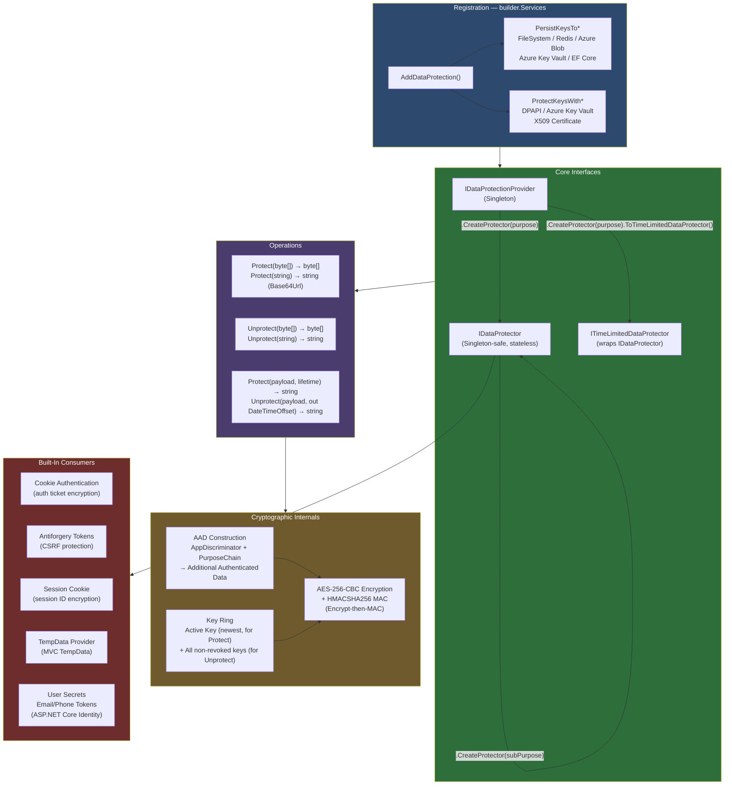
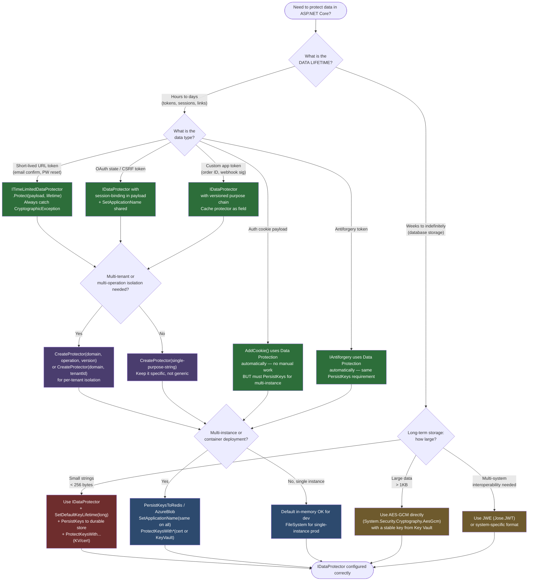

# 4.211 — Data Protection API: IDataProtector, Purpose Strings, and Payloads

---

## PART 0 — Navigation & Context

### Where This Topic Sits in the ASP.NET Core Domain

```
ASP.NET Core Mastery
│
├── J. Authentication (4.134–4.153)
│   ├── [[4.135 — Cookie Authentication]]       ← uses Data Protection internally
│   └── [[4.138 — Refresh Token Pattern]]       ← tokens should use Data Protection
│
├── P. Security (4.208–4.218)                   ◄ YOU ARE HERE
│   ├── [[4.208 — HTTPS Enforcement]]
│   ├── [[4.209 — CORS]]
│   ├── [[4.210 — CSRF / Antiforgery]]          ← antiforgery tokens ARE Data Protection
│   ├── 4.211 — Data Protection API             ← THIS NOTE
│   ├── [[4.212 — Key Management & Rotation]]   ← the key ring that powers this
│   ├── [[4.213 — Security Headers Middleware]]
│   ├── [[4.217 — Secrets in Production]]
│   └── [[4.218 — OWASP Top 10]]
│
└── D. Dependency Injection (4.034–4.048)
    └── [[4.035 — Service Lifetimes]]           ← IDataProtector is Singleton-safe
```

### What You Need Before This

- **[[4.034 — The Built-In DI Container]]** — `IDataProtectionProvider` and `IDataProtector` are DI services; you must understand registration and resolution before using them correctly
- **[[4.035 — Service Lifetimes]]** — `IDataProtector` is safe to use as a Singleton dependency; understanding lifetime rules prevents the class of bugs where a protector is re-created per-request unnecessarily
- **[[4.126 — Cookies]]** — Data Protection underpins cookie encryption in ASP.NET Core; understanding cookies first makes the "why" of Data Protection concrete
- **[[4.210 — CSRF / Antiforgery]]** — antiforgery tokens are the most visible built-in consumer of Data Protection; seeing the end result before studying the mechanism helps

### What This Unlocks After

- **[[4.212 — Data Protection: Key Management, Key Rotation, and Azure Key Ring]]** — key ring persistence, rotation schedules, and distributed deployment are the operational consequence of what this note establishes
- **[[4.138 — Refresh Token Pattern]]** — opaque refresh tokens stored server-side or encrypted client-side should use `IDataProtector`; this note defines the mechanism
- **[[4.217 — Secrets in Production]]** — the key ring must be persisted and protected in production; this note defines the threat model that drives that requirement
- **[[4.218 — OWASP Top 10]]** — sensitive data exposure (A02), cryptographic failures — this note is the mitigation for those categories in ASP.NET Core

### Why This Matters at Scale

When your payment API encrypts unverified email confirmation tokens, password reset links, or OAuth state parameters with `IDataProtector`, purpose strings are the cryptographic isolation layer that prevents a valid "email-confirm" token from being replayed as a "password-reset" token — a class of attack that has affected major services. At scale, the key ring persistence strategy determines whether your entire user session is invalidated when a pod restarts or a deployment rolls over.

---

## PART 1 — The Core Mental Model

### The Fundamental Rule

> **ASP.NET Core's Data Protection API encrypts arbitrary byte payloads using a key ring of AES-256-CBC + HMACSHA256 keys, and purpose strings are baked into the AAD (Additional Authenticated Data) of every operation — so a payload protected with purpose "A" will throw `CryptographicException` on any attempt to unprotect it with purpose "B", regardless of key validity.**

### The Plain-Language Analogy

Picture a hotel that hands out padlocked lockboxes to guests. Each lockbox has two attributes: a master key material (the key ring, managed by the hotel's security desk) and a color-coded seal impressed into the lock mechanism itself (the purpose string). The seal is not the key — it is part of the lock's mechanical identity. A lockbox sealed red (purpose: "email-confirm") can only be opened with the red-seal-compatible version of the master key; even if you have the correct master key material, attempting to open a red lockbox as though it were blue (purpose: "password-reset") destroys the contents and raises an alarm (`CryptographicException`).

This analogy holds under the concurrent-request case: multiple guests can carry identical red-sealed lockboxes simultaneously — `IDataProtector` is stateless and thread-safe, just like the seal specification doesn't care how many lockboxes carry it. It holds under key rotation: the hotel can retire an old master key generation while still being able to open lockboxes created with it (because the key ring retains old keys for decryption while using the newest for encryption). It holds under the distributed system case: if the hotel burns down and the security desk loses all keys, every lockbox in every guest's hand becomes permanently unopenable — which is exactly what happens when a pod restarts without persistent key ring storage.

### The Taxonomy Diagram



---

## PART 2 — Deep Mechanics

### 2.1 — The Key Ring and the Protect/Unprotect Operations

The Data Protection system is not a wrapper around `AesManaged` — it is a complete cryptographic system with key lifecycle management built in. Understanding what happens at the byte level separates engineers who use it correctly from those who misuse it.

**Pipeline position of Data Protection services:**

```
Application Startup
  → AddDataProtection() registers:
      IDataProtectionProvider (Singleton)
      IKeyManager             (Singleton, manages key ring)
      IXmlRepository          (Singleton, persists key XML)
      IXmlEncryptor          (Singleton, encrypts key XML at rest)

HTTP Request Pipeline (example: cookie authentication)
──► ExceptionHandler ──► HSTS ──► StaticFiles ──► Routing
  ──► [AuthenticationMiddleware]
         │
         └── CookieAuthenticationHandler.AuthenticateAsync()
                │
                └── IDataProtector.Unprotect(cookieBytes)
                       ← Data Protection called HERE, inside auth middleware
                       ← NOT its own middleware — called by consumers

──► Auth ──► AuthZ ──► Endpoints
```

**Framework source behavior (approximate):**

The `Protect` call path:

```csharp
// Microsoft.AspNetCore.DataProtection internals (approximate):
// Class: KeyRingBasedDataProtector
// Method: Protect(byte[] plaintext)

public byte[] Protect(byte[] plaintext)
{
    // 1. Get current active key from the key ring
    var (keyRing, defaultKeyId) = _keyRingProvider.GetCurrentKeyRing();
    var key = keyRing.GetAuthenticatedEncryptorByKeyId(defaultKeyId);

    // 2. Build Additional Authenticated Data (AAD)
    //    AAD = appDiscriminator + purpose chain (all CreateProtector() calls joined)
    //    This is the CRYPTOGRAPHIC BINDING of purpose to the ciphertext
    var aad = BuildAad(_purposes); // e.g., "MyApp:v1:Contoso.Web:EmailConfirmation"

    // 3. Encrypt using AES-256-CBC + HMACSHA256 (Encrypt-then-MAC)
    var ciphertext = key.Encrypt(plaintext, aad);

    // 4. Prepend key ID and magic header for Unprotect to locate the right key
    return PrependKeyHeader(defaultKeyId, ciphertext);
}
```

The `Unprotect` call path:

```csharp
// Microsoft.AspNetCore.DataProtection internals (approximate):
// Class: KeyRingBasedDataProtector
// Method: Unprotect(byte[] protectedData)

public byte[] Unprotect(byte[] protectedData)
{
    // 1. Read the key ID from the header
    var (keyId, ciphertext) = ParseKeyHeader(protectedData);

    // 2. Look up the key by ID (searches ALL non-revoked keys, not just active)
    var key = _keyRingProvider.GetAuthenticatedEncryptorByKeyId(keyId);
    if (key is null) throw new CryptographicException("Key not found or revoked");

    // 3. Reconstruct AAD from purpose chain (MUST match Protect call)
    var aad = BuildAad(_purposes);

    // 4. Verify HMAC, then decrypt — if AAD doesn't match, HMAC fails
    //    CryptographicException: "The payload was invalid."
    return key.Decrypt(ciphertext, aad); // throws if purpose chain differs
}
```

**The key insight about AAD:** The purpose string becomes part of the cryptographic MAC. The MAC covers both the ciphertext AND the AAD. If you attempt to unprotect with a different purpose, the AAD you reconstruct doesn't match what was used during `Protect`, so the HMAC verification fails and `CryptographicException` is thrown — before any decryption is even attempted. This is not a software check; it is a cryptographic guarantee.

**Runtime cost:** `~1 key ring lookup (O(1) dictionary)` + `~1 AES block cipher operation per 16 bytes of plaintext` + `~1 HMACSHA256 over the entire payload` per operation. For a 256-byte payload: approximately `~5-15μs` on modern x64 hardware. Allocations: `~2-3` (byte arrays for AAD and output).

---

### 2.2 — Purpose Strings: The Cryptographic Isolation Mechanism

Purpose strings are the single most misunderstood aspect of Data Protection. They are not labels or descriptions — they are cryptographic inputs.

**What a purpose chain looks like internally:**

```
// Single-level purpose:
provider.CreateProtector("Contoso.Auth.EmailConfirmation")
// AAD contribution: "Contoso.Web" (app discriminator) + "Contoso.Auth.EmailConfirmation"

// Multi-level purpose (chained CreateProtector calls):
provider.CreateProtector("Contoso.Auth")
        .CreateProtector("EmailConfirmation")
// AAD contribution: "Contoso.Web" + "Contoso.Auth" + "EmailConfirmation"
// This is IDENTICAL to: provider.CreateProtector("Contoso.Auth", "EmailConfirmation")

// The overload with params string[] purposes:
provider.CreateProtector("Contoso.Auth", "EmailConfirmation", "v2")
// AAD: "Contoso.Web" + "Contoso.Auth" + "EmailConfirmation" + "v2"
```

**The isolation proof — why cross-purpose replay is impossible:**

```
// Scenario: attacker intercepts an "email-confirm" token
// and tries to use it as a "password-reset" token

// At Protect time (EmailConfirmation flow):
var emailProtector = provider.CreateProtector("Contoso.Auth.EmailConfirmation");
var token = emailProtector.Protect("user@example.com|2026-06-10");
// MAC covers: plaintext + AAD("Contoso.Web", "Contoso.Auth.EmailConfirmation")

// Attacker replays this token against the password-reset endpoint,
// which uses a DIFFERENT protector:
var resetProtector = provider.CreateProtector("Contoso.Auth.PasswordReset");
try
{
    resetProtector.Unprotect(token); // ← different AAD!
    // MAC: verifies ciphertext against AAD("Contoso.Web", "Contoso.Auth.PasswordReset")
    // MAC FAILS because original MAC was computed with "EmailConfirmation" in the AAD
}
catch (CryptographicException)
{
    // ← always throws — purpose mismatch = MAC verification failure
    // The attacker's replay attempt is defeated cryptographically
}
```

**The app discriminator — isolation across applications:**

```csharp
// Two applications sharing the same key ring storage (e.g., same Redis instance)
// CANNOT unprotect each other's payloads because the app discriminator differs.

// App A:
builder.Services.AddDataProtection()
    .SetApplicationName("PaymentService"); // explicit discriminator
// AAD prefix: "PaymentService"

// App B:
builder.Services.AddDataProtection()
    .SetApplicationName("OrderService"); // different discriminator
// AAD prefix: "OrderService"

// Even with the same key bytes, App B cannot unprotect App A's payloads
// because their AADs differ — the MAC will always fail.
```

> [!IMPORTANT] **When you WANT two apps to share payloads** (e.g., a web frontend and an API backend that both need to read the same session token), call `SetApplicationName("SharedName")` on both. Without this, they generate different AADs from their different auto-detected application names and cannot share protectors. This is the #1 cause of "Data Protection token is invalid" errors in microservice deployments.

**Runtime cost:** Purpose chain construction is `O(n)` where `n` is the number of purpose segments. Protector creation via `CreateProtector()` is `~1 allocation` (the protector object itself, which is stateless and safe to cache). The AAD byte array is constructed once per `Protect`/`Unprotect` call: `~1 allocation`.

---

### 2.3 — ITimeLimitedDataProtector: Expiring Payloads

`ITimeLimitedDataProtector` adds a cryptographically-enforced expiry timestamp to the payload. It wraps `IDataProtector` — the lifetime is baked into the protected bytes, not checked by a separate clock comparison.

```
// What ITimeLimitedDataProtector adds to the wire format:
// [key_id_header][expiry_timestamp_bytes][aes_ciphertext][hmac]
//                       ↑
//          Expiry is INSIDE the encrypted+MAC'd payload.
//          Cannot be tampered with or extended without the key.
```

**Failure path when an expired token is unprotected:**

```
// HTTP consequence (expired token):
// The caller receives a CryptographicException (not an HTTP status directly)
// — it is the APPLICATION's responsibility to catch and map to 400/401/403

// Correct handling in a password-reset endpoint:
app.MapPost("/reset-password", async (ResetPasswordRequest req, IDataProtectionProvider dp) =>
{
    var protector = dp.CreateProtector("PasswordReset").ToTimeLimitedDataProtector();
    try
    {
        var email = protector.Unprotect(req.Token, out var expiry);
        if (expiry < DateTimeOffset.UtcNow)
            return Results.BadRequest("Token has expired.");
        // proceed with reset
    }
    catch (CryptographicException)
    {
        return Results.BadRequest("Invalid or tampered token.");
    }
});

// HTTP wire format (expired token):
// POST /reset-password HTTP/1.1
// Content-Type: application/json
// { "token": "CfDJ8...", "newPassword": "..." }
//
// HTTP/1.1 400 Bad Request
// Content-Type: application/problem+json
// { "title": "Bad Request", "detail": "Invalid or tampered token." }
```

> [!WARNING] `ITimeLimitedDataProtector.Unprotect` has two overloads: one that throws if expired, one that outputs the expiry for your own checking. In production **always use the overload that outputs expiry** and check it yourself — do not rely solely on the thrown exception to distinguish "expired" from "tampered" (both throw `CryptographicException` with the same type but different messages). Log the distinction.

**Runtime cost:** Same as base `IDataProtector` plus `~8 bytes` of expiry timestamp appended to the plaintext before encryption. `~0 additional allocations`.

---

### 2.4 — The Key Ring Lifecycle: What Happens When Keys Expire or Are Rotated

Data Protection keys are not the same as the payload lifetime. This confusion between "key expiry" and "payload expiry" is a production reliability trap.

```
Key Ring Lifecycle (default configuration):
─────────────────────────────────────────────────────────────────
  Key Generation:   New key created automatically every 90 days
  Key Activation:   2 days after creation (propagation window)
  Key Expiry:       90 days after activation (key is "expired")
  Key Retention:    Expired keys are KEPT in the ring forever
                    (so old payloads can still be unprotected)
  Key Revocation:   Manual only — sets IsRevoked flag
                    Revoked keys CANNOT unprotect payloads

Timeline:
  Day 0:  Key A created, inactive (propagation window)
  Day 2:  Key A activated — all new Protect() calls use Key A
  Day 92: Key A expires — Key B (created Day 88) becomes active
           Key A is STILL in the ring — old payloads still unprotectable
  Day 182: Key B expires — Key C active, A and B still in ring
```

**What this means for production:**

```
// Scenario: Your app uses IDataProtector for "remember me" tokens
// with a 30-day validity stored in a cookie.

// If you do NOT persist the key ring:
//   - Pod restart = new key ring = all 30-day remember-me tokens become invalid
//   - Users get logged out on every deployment
//   - Cookie auth stops working entirely

// If you DO persist the key ring (correct):
//   - Pod restart = key ring loaded from storage = tokens remain valid
//   - 90-day key rotation is automatic and transparent to users
//   - Only manual revocation invalidates tokens

// HTTP consequence (no key ring persistence on pod restart):
// GET /dashboard HTTP/1.1
// Cookie: .AspNetCore.Identity.Application=CfDJ8...
//
// HTTP/1.1 302 Found
// Location: /login
// (auth cookie unprotected with missing key → CryptographicException → auth fails → redirect)
```

> [!DANGER] **The default key ring storage is in-memory**. Without calling `PersistKeysToFileSystem()`, `PersistKeysToStackExchangeRedis()`, or equivalent, every application restart generates a brand new key ring. All previously protected payloads — auth cookies, antiforgery tokens, session cookies, email confirmation tokens — become permanently unreadable. In a containerized or multi-instance deployment, this is not hypothetical — it happens on every pod restart and during rolling deployments when multiple instances run simultaneously with different key rings.

---

### 2.5 — The `string` vs `byte[]` Overloads: Wire Format

`IDataProtector` has both `string` and `byte[]` overloads. The `string` overloads use Base64Url encoding (no padding, URL-safe characters) internally.

```csharp
// What the string overload produces:
var protector = provider.CreateProtector("MyPurpose");

string protectedString = protector.Protect("hello world");
// Output: "CfDJ8NiIe1..." (Base64Url-encoded byte array, no padding, URL-safe)
// Always starts with "CfDJ" in .NET 8 — the magic header bytes encoded in Base64Url

// The string overload is equivalent to:
byte[] plaintextBytes = Encoding.UTF8.GetBytes("hello world");
byte[] protectedBytes = protector.Protect(plaintextBytes);
string protectedString = Base64UrlTextEncoder.Encode(protectedBytes);

// Wire format of the protected byte array:
// [0x09 0xF8 0x ...]  ← magic header (CfDJ8 in Base64Url)
// [16 bytes]          ← key ID (GUID)
// [variable]          ← AES-256-CBC ciphertext (padded to 16-byte blocks)
// [32 bytes]          ← HMACSHA256 over (header + key_id + iv + ciphertext + aad)
```

**HTTP wire format showing a protected token in a URL:**

```http
// Email confirmation link using IDataProtector string overload:
// GET /confirm-email?token=CfDJ8NiIe1xTr2Qg7z8yMnKpL3vJhF9wZcXbN1sRdUqE4oIa...
// HTTP/1.1

// The token is URL-safe because Base64Url replaces + with - and / with _
// and omits padding = signs — safe to use as a query string without %2B encoding

// NEVER use Convert.ToBase64String() for URL tokens — it produces + and /
// which require URL encoding and can be corrupted by middleware or CDNs
```

**Runtime cost:** `string` overload: `~1 UTF8 encoding + ~1 Base64Url encoding allocation`. `byte[]` overload: `~1 allocation` (the output array). For URL-embedded tokens, always use the `string` overload.

---

## PART 3 — Production Code Patterns

### Pattern 1 — The Email Confirmation Token Factory (Payment Onboarding Service)

Email confirmation tokens for a fintech onboarding flow must be time-limited, single-use (enforced at the application layer), and purpose-isolated from all other token types. This pattern shows the complete production shape.

```csharp
// Domain: payment onboarding — email address verification
// Purpose hierarchy: "PaymentOnboarding" → "EmailVerification" → "v1"
// Adding version allows future algorithm migration without token invalidation chaos

public sealed class EmailVerificationTokenService
{
    private readonly ITimeLimitedDataProtector _protector;
    private readonly ILogger<EmailVerificationTokenService> _logger;

    // ✅ CORRECT: IDataProtector is Singleton-safe — inject IDataProtectionProvider
    // and create the protector once in the constructor (cache it as a field)
    public EmailVerificationTokenService(
        IDataProtectionProvider provider,
        ILogger<EmailVerificationTokenService> logger)
    {
        // Three-segment purpose chain: domain → operation → version
        // Version segment enables future migration: bump to "v2" and handle both
        _protector = provider
            .CreateProtector("PaymentOnboarding", "EmailVerification", "v1")
            .ToTimeLimitedDataProtector();
        _logger = logger;
    }

    public string GenerateToken(string userId, string email)
    {
        // Payload: userId|email — both needed to validate on unprotect
        var payload = $"{userId}|{email}";

        // Token valid for 24 hours — enforced cryptographically, not by DB lookup
        var token = _protector.Protect(payload, TimeSpan.FromHours(24));

        _logger.LogInformation(
            "Email verification token issued. UserId={UserId} Email={Email}",
            userId, email);

        return token; // Base64Url string, safe for URLs and query strings
    }

    public (string UserId, string Email)? ValidateToken(string token)
    {
        try
        {
            // Unprotect: verifies MAC, decrypts, checks expiry in one operation
            var payload = _protector.Unprotect(token, out var expiry);

            if (expiry < DateTimeOffset.UtcNow)
            {
                _logger.LogWarning("Expired email verification token presented.");
                return null; // map to 400 at the endpoint layer
            }

            var parts = payload.Split('|', 2);
            if (parts.Length != 2) return null;

            return (parts[0], parts[1]);
        }
        catch (CryptographicException ex)
        {
            // Could be: expired, tampered, wrong purpose, key not found
            _logger.LogWarning(ex, "Invalid email verification token presented.");
            return null; // never surface CryptographicException to callers
        }
    }
}

// Registration:
builder.Services.AddDataProtection()
    .PersistKeysToStackExchangeRedis(connectionMultiplexer, "DataProtection-Keys")
    .SetApplicationName("PaymentService");
builder.Services.AddSingleton<EmailVerificationTokenService>();

// Endpoint:
app.MapGet("/confirm-email", async (string token, EmailVerificationTokenService svc,
    UserManager<AppUser> userManager) =>
{
    var result = svc.ValidateToken(token);
    if (result is null)
        return Results.BadRequest(new ProblemDetails
        {
            Title = "Invalid Token",
            Detail = "The email confirmation link has expired or is invalid.",
            Status = 400
        });

    var (userId, email) = result.Value;
    // proceed with confirmation...
    return Results.Ok();
});

// HTTP wire format (confirmation link):
// GET /confirm-email?token=CfDJ8NiIe1xTr2Qg7z8... HTTP/1.1
// (no auth header required — the token IS the credential)
//
// HTTP/1.1 200 OK    ← valid, unexpired token
// HTTP/1.1 400 Bad Request  ← expired, tampered, or wrong-purpose token
```

---

### Pattern 2 — Purpose Versioning for Token Migration (Order Management Service)

When the payload format changes (e.g., adding a tenant ID), a version segment in the purpose chain allows graceful migration without invalidating tokens in circulation.

```csharp
// Domain: order management — order status callback tokens (webhook verification)
// Need to add tenantId to the payload in v2 without breaking v1 tokens in flight

public sealed class OrderCallbackTokenService
{
    private readonly IDataProtector _v1Protector;
    private readonly IDataProtector _v2Protector;

    public OrderCallbackTokenService(IDataProtectionProvider provider)
    {
        // Both versions share the "OrderCallbacks" root — different leaf purposes
        _v1Protector = provider.CreateProtector("OrderCallbacks", "WebhookVerify", "v1");
        _v2Protector = provider.CreateProtector("OrderCallbacks", "WebhookVerify", "v2");
    }

    // New tokens always use v2
    public string GenerateToken(string orderId, string tenantId)
    {
        return _v2Protector.Protect($"{orderId}|{tenantId}");
    }

    // Unprotect: try v2 first, fall back to v1 (for tokens issued before migration)
    public (string OrderId, string? TenantId)? ValidateToken(string token)
    {
        // ✅ Try v2 first (newest format)
        try
        {
            var payload = _v2Protector.Unprotect(token);
            var parts = payload.Split('|', 2);
            return (parts[0], parts.Length > 1 ? parts[1] : null);
        }
        catch (CryptographicException) { /* not a v2 token */ }

        // ✅ Fall back to v1 (tokens issued before migration)
        try
        {
            var payload = _v1Protector.Unprotect(token);
            return (payload, null); // v1 had no tenantId
        }
        catch (CryptographicException) { /* not a v1 token either */ }

        return null; // tampered or completely unknown token
    }
}

// HTTP wire format (webhook callback with embedded token):
// POST /webhooks/order-status HTTP/1.1
// X-Callback-Token: CfDJ8...
// Content-Type: application/json
// { "orderId": "ord_123", "status": "shipped" }
//
// Endpoint validates X-Callback-Token before processing the webhook body
// HTTP/1.1 200 OK       ← valid token
// HTTP/1.1 401 Unauthorized  ← invalid/tampered token
```

---

### Pattern 3 — Protecting Sensitive Query String Parameters (User Authentication Flow)

OAuth state parameters, password reset tokens, and "remember device" tokens sent via URL must be protected against tampering. This pattern shows the correct shape for URL-embedded tokens.

```csharp
// Domain: user authentication flow — OAuth state parameter protection
// Prevents CSRF in OAuth flows by binding state to the session

public sealed class OAuthStateProtector
{
    private readonly IDataProtector _protector;

    public OAuthStateProtector(IDataProtectionProvider provider)
    {
        // Short, collision-resistant purpose — OAuth state has a single, clear purpose
        _protector = provider.CreateProtector("Auth.OAuth.State");
    }

    // ⚠️ WRONG: Using raw random bytes as state without integrity protection
    // public string GenerateState(string returnUrl) => Convert.ToBase64String(RandomNumberGenerator.GetBytes(16));
    // → No binding between state and returnUrl → open redirect attack possible

    // ✅ CORRECT: Bind the returnUrl into the state payload
    public string GenerateState(string sessionId, string returnUrl)
    {
        var payload = new OAuthStatePayload(sessionId, returnUrl, DateTimeOffset.UtcNow);
        var json = JsonSerializer.Serialize(payload);
        return _protector.Protect(json);
        // Returns Base64Url string — safe to use as OAuth state parameter in URL
    }

    public OAuthStatePayload? ValidateState(string state, string currentSessionId)
    {
        try
        {
            var json = _protector.Unprotect(state);
            var payload = JsonSerializer.Deserialize<OAuthStatePayload>(json);

            // Validate session binding — state must belong to the current session
            if (payload?.SessionId != currentSessionId) return null;

            // Validate age (state should not be more than 10 minutes old)
            if (payload.IssuedAt < DateTimeOffset.UtcNow.AddMinutes(-10)) return null;

            return payload;
        }
        catch (CryptographicException)
        {
            return null; // tampered state
        }
    }
}

public record OAuthStatePayload(string SessionId, string ReturnUrl, DateTimeOffset IssuedAt);

// HTTP wire format (OAuth redirect with protected state):
// GET /oauth/authorize?response_type=code
//   &client_id=my-app
//   &state=CfDJ8NiIe1xT...   ← protected state payload
//   &redirect_uri=https://app.example.com/callback
// HTTP/1.1
//
// On callback:
// GET /callback?code=auth_code&state=CfDJ8NiIe1xT... HTTP/1.1
// (state validated before processing auth code)
```

---

### Pattern 4 — Sharing Protectors Across Services in a Microservice Architecture

Two services that need to produce tokens readable by each other must share both the application name and the key ring storage. This pattern is the canonical approach for internal service-to-service token sharing.

```csharp
// Domain: logistics tracking — API gateway issues tokens readable by tracking service
// Both services must share the SAME application name AND the SAME key storage

// In API Gateway (Program.cs):
builder.Services.AddDataProtection()
    .PersistKeysToStackExchangeRedis(redis, "SharedDataProtection-Keys")
    .SetApplicationName("LogisticsGroup") // ← MUST match the tracking service
    .ProtectKeysWithCertificate(certificate); // ← at-rest protection of key XML

// In Tracking Service (Program.cs):
builder.Services.AddDataProtection()
    .PersistKeysToStackExchangeRedis(redis, "SharedDataProtection-Keys") // same store
    .SetApplicationName("LogisticsGroup") // ← SAME app name = shared AAD prefix
    .ProtectKeysWithCertificate(certificate);

// Gateway generates a shipment-tracking token:
public string GenerateTrackingToken(string shipmentId, string customerId)
{
    var protector = _provider.CreateProtector("Logistics.ShipmentTracking");
    return protector.Protect($"{shipmentId}|{customerId}");
}

// Tracking service validates the token (different process, same key ring + app name):
public (string ShipmentId, string CustomerId)? ValidateTrackingToken(string token)
{
    var protector = _provider.CreateProtector("Logistics.ShipmentTracking");
    // ✅ Works because: same app name → same AAD prefix
    //                   same key ring store → same key material
    try
    {
        var payload = protector.Unprotect(token);
        var parts = payload.Split('|', 2);
        return (parts[0], parts[1]);
    }
    catch (CryptographicException) { return null; }
}

// HTTP wire format (gateway → tracking service):
// GET /track?token=CfDJ8... HTTP/1.1
// X-Service-Origin: api-gateway
//
// HTTP/1.1 200 OK   ← tracking service unprotects the gateway-issued token
```

---

### Pattern 5 — Custom Protector for Sensitive PII in Database Storage (Healthcare Patient Portal)

Storing encrypted PII in a database using Data Protection as the encryption layer — with purpose isolation ensuring no cross-column decryption is possible.

```csharp
// Domain: healthcare patient portal — encrypting PHI (Protected Health Information)
// Purpose isolation ensures SSN protector cannot decrypt phone number ciphertext

public sealed class PhiEncryptionService
{
    // One protector per data type — purpose isolation = column-level key separation
    private readonly IDataProtector _ssnProtector;
    private readonly IDataProtector _phoneProtector;
    private readonly IDataProtector _addressProtector;

    public PhiEncryptionService(IDataProtectionProvider provider)
    {
        // Purpose hierarchy reflects the data classification
        var phiProtector = provider.CreateProtector("PatientPortal.PHI");
        _ssnProtector     = phiProtector.CreateProtector("SSN");
        _phoneProtector   = phiProtector.CreateProtector("PhoneNumber");
        _addressProtector = phiProtector.CreateProtector("HomeAddress");
        // Full chains: "PatientPortal.PHI" + "SSN"
        //              "PatientPortal.PHI" + "PhoneNumber"
        //              "PatientPortal.PHI" + "HomeAddress"
        // Cross-column replay is cryptographically impossible
    }

    public string EncryptSsn(string ssn)         => _ssnProtector.Protect(ssn);
    public string EncryptPhone(string phone)      => _phoneProtector.Protect(phone);
    public string EncryptAddress(string address)  => _addressProtector.Protect(address);

    public string? DecryptSsn(string ciphertext)
    {
        try { return _ssnProtector.Unprotect(ciphertext); }
        catch (CryptographicException) { return null; }
    }

    public string? DecryptPhone(string ciphertext)
    {
        try { return _phoneProtector.Unprotect(ciphertext); }
        catch (CryptographicException) { return null; }
    }

    public string? DecryptAddress(string ciphertext)
    {
        try { return _addressProtector.Unprotect(ciphertext); }
        catch (CryptographicException) { return null; }
    }
}

// EF Core entity:
public class Patient
{
    public Guid Id { get; set; }
    public string EncryptedSsn { get; set; } = null!;      // "CfDJ8..."
    public string EncryptedPhone { get; set; } = null!;    // "CfDJ8..."
    public string EncryptedAddress { get; set; } = null!;  // "CfDJ8..."
    // Plain columns: name, DoB (de-identified)
}

// Registration:
builder.Services.AddDataProtection()
    .PersistKeysToAzureBlobStorage(blobClient)
    .ProtectKeysWithAzureKeyVault(keyIdentifier, credential)
    .SetApplicationName("PatientPortal");
builder.Services.AddSingleton<PhiEncryptionService>();

// NOTE: Data Protection is NOT a database encryption solution for large datasets.
// It adds ~50-80 bytes overhead per protected value (header + IV + MAC).
// For bulk data encryption, use AES-GCM directly or SQL Server TDE.
// Data Protection is ideal for: tokens, small PII strings, cookie payloads.
```

---

### Pattern 6 — Per-Tenant Protector Isolation Using Purpose Chains

Multi-tenant SaaS where each tenant's data must be cryptographically isolated even if they share the same key ring.

```csharp
// Domain: multi-tenant SaaS order management — per-tenant token isolation
// A token issued for Tenant A cannot be used as a token for Tenant B

public sealed class TenantAwareProtectorFactory
{
    private readonly IDataProtectionProvider _provider;
    // Cache protectors per tenantId — IDataProtector is stateless and Singleton-safe
    private readonly ConcurrentDictionary<string, IDataProtector> _cache = new();

    public TenantAwareProtectorFactory(IDataProtectionProvider provider)
    {
        _provider = provider;
    }

    public IDataProtector GetProtectorForTenant(string tenantId)
    {
        // ✅ CORRECT: Cache protectors — CreateProtector() is cheap but allocates;
        // for hot paths with thousands of tenants, caching prevents GC pressure
        return _cache.GetOrAdd(tenantId, id =>
            _provider.CreateProtector("MultiTenant.Orders", id));
        // Full purpose chain: "MultiTenant.Orders" + tenantId
        // e.g., "MultiTenant.Orders" + "acme-corp"
        //        "MultiTenant.Orders" + "globex-inc"
        // These two protectors CANNOT unprotect each other's output
    }
}

// Usage in an order service:
public class OrderTokenService
{
    private readonly TenantAwareProtectorFactory _factory;

    public OrderTokenService(TenantAwareProtectorFactory factory)
        => _factory = factory;

    public string IssueOrderViewToken(string tenantId, string orderId)
    {
        var protector = _factory.GetProtectorForTenant(tenantId);
        return protector.Protect(orderId);
    }

    public string? ValidateOrderViewToken(string tenantId, string token)
    {
        var protector = _factory.GetProtectorForTenant(tenantId);
        try { return protector.Unprotect(token); }
        catch (CryptographicException) { return null; }
    }
}

// HTTP wire format:
// GET /api/orders/view?token=CfDJ8... HTTP/1.1
// X-Tenant-Id: acme-corp
//
// Server: validates token using tenantId from X-Tenant-Id header
// If tenant mismatch (token from globex-inc presented with X-Tenant-Id: acme-corp):
// → CryptographicException → null → 401 Unauthorized
```

---

### Pattern 7 — Integration Test Isolation: Disabling Data Protection

Integration tests that use `WebApplicationFactory<T>` need deterministic encryption — the in-memory key ring is fine for tests, but all test instances must share the same key ring if tokens are generated in one test and validated in another.

```csharp
// Domain: testing — ensuring Data Protection does not break integration tests
// across test runs or parallel test class instances

public class OrderApiTests : IClassFixture<WebApplicationFactory<Program>>
{
    private readonly WebApplicationFactory<Program> _factory;

    public OrderApiTests(WebApplicationFactory<Program> factory)
    {
        _factory = factory.WithWebHostBuilder(builder =>
        {
            builder.ConfigureServices(services =>
            {
                // ✅ CORRECT: Set application name to ensure shared key ring
                // across all test requests even with in-memory storage
                services.AddDataProtection()
                    .SetApplicationName("TestApp-OrderApi");
                // In-memory is fine for tests — keys persist for test class lifetime
                // No PersistKeysTo* needed — tests don't survive process restart
            });
        });
    }

    // ⚠️ WRONG pattern (not shown in code — described here):
    // Using EphemeralDataProtection (app.UseDataProtection with ephemeral keys)
    // means a token generated in test request 1 CANNOT be validated in test request 2
    // because the in-memory key ring is different for each WebApplicationFactory instance
    // (each factory gets a fresh key ring on construction)
}

// For tests where you need completely ephemeral keys that never persist:
// services.AddDataProtection().UseEphemeralDataProtectionProvider();
// Use this ONLY when the test generates AND validates the token in the same request
```

---

## PART 4 — Gotchas & Anti-Patterns

### Gotcha 1: No Key Ring Persistence in Production (The Silent Session Destroyer)

Engineers who understand the Data Protection API conceptually still ship to production without persistence because the default configuration silently uses in-memory storage. There is no startup warning, no exception — everything works perfectly in development and breaks only when the first pod restarts or the second pod starts.

```csharp
// ⚠️ WRONG — default configuration (in-memory keys, no persistence)
builder.Services.AddDataProtection();
// Keys exist only in memory — lost on restart

// HTTP consequence (wrong path):
// After deployment or pod restart:
// GET /dashboard HTTP/1.1
// Cookie: .AspNetCore.Identity.Application=CfDJ8...
//
// HTTP/1.1 302 Found
// Location: /login
// (all user sessions invalidated — every user is logged out)
// Antiforgery tokens also invalidated — all forms return 400 Bad Request

// ✅ CORRECT — persistent key ring
builder.Services.AddDataProtection()
    .PersistKeysToStackExchangeRedis(connectionMultiplexer, "DataProtection-Keys")
    .SetApplicationName("MyApp")
    .ProtectKeysWithCertificate(certificate); // encrypt keys at rest

// HTTP consequence (correct path):
// After pod restart: keys loaded from Redis — all existing sessions remain valid
// After deployment: rolling update is seamless — old pods and new pods share the key ring

// WHY: The Data Protection key ring is the master secret for the entire application's
// cryptographic operations. In-memory means "ephemeral" — it does not survive process
// boundaries. Any stateful token (auth cookie, antiforgery, session, email confirmation)
// becomes invalid when the key ring is lost. In a multi-instance deployment with no
// shared persistence, Instance A's cookies cannot be read by Instance B — load
// balancing makes this a constant source of random 302/400 responses.
```

---

### Gotcha 2: Reusing the Same Purpose String for Different Token Types

Engineers familiar with symmetric encryption (AES with a shared key) assume that different code paths just need different secret values — they transfer this mental model to Data Protection and use the same purpose for logically different operations.

```csharp
// ⚠️ WRONG — same purpose for logically different token types
public class TokenService
{
    private readonly IDataProtector _protector;

    public TokenService(IDataProtectionProvider provider)
    {
        _protector = provider.CreateProtector("MyApp.Tokens"); // single purpose for ALL tokens
    }

    public string GeneratePasswordResetToken(string userId) =>
        _protector.Protect($"reset:{userId}");

    public string GenerateEmailConfirmToken(string userId) =>
        _protector.Protect($"confirm:{userId}"); // same protector!
}

// HTTP consequence (wrong path):
// Attacker intercepts a password-reset email link: /reset?token=CfDJ8...
// Replays it as an email confirmation: /confirm-email?token=CfDJ8...
// → ValidateEmailConfirmToken("CfDJ8...") decrypts to "reset:user123"
// → Code checks if payload starts with "confirm:" — fails
// BUT: the token DID unprotect successfully! An application bug (missing the prefix check)
// allows cross-type token replay. The purpose string is the ONLY cryptographic guard.
// Relying on a runtime payload format check instead of cryptographic isolation is fragile.

// ✅ CORRECT — separate protectors for each token type
public class TokenService
{
    private readonly IDataProtector _resetProtector;
    private readonly IDataProtector _confirmProtector;

    public TokenService(IDataProtectionProvider provider)
    {
        _resetProtector   = provider.CreateProtector("MyApp.Auth.PasswordReset");
        _confirmProtector = provider.CreateProtector("MyApp.Auth.EmailConfirmation");
    }

    public string GeneratePasswordResetToken(string userId) =>
        _resetProtector.Protect(userId);

    public string GenerateEmailConfirmToken(string userId) =>
        _confirmProtector.Protect(userId);
}

// HTTP consequence (correct path):
// Attacker replays password-reset token as email-confirm token:
// → confirmProtector.Unprotect(resetToken) → CryptographicException (always)
// → Application catches exception → 400 Bad Request
// Cross-type replay is cryptographically impossible, not just application-logic-rejected.

// WHY: Purpose strings are baked into the HMAC's AAD. Mixing token types in one
// protector means the only defense is runtime payload parsing — a software guarantee
// rather than a cryptographic one. Software checks can be bypassed; HMAC cannot.
```

---

### Gotcha 3: Calling CreateProtector() on Every Request Instead of Caching It

`IDataProtector` is stateless and thread-safe — it is safe to share as a Singleton. Engineers who see it created via a factory method (like `IDataProtectionProvider.CreateProtector()`) assume it should be created per-request in the same way they create a scoped service.

```csharp
// ⚠️ WRONG — creating a new protector on every request
public class OrderController : ControllerBase
{
    private readonly IDataProtectionProvider _provider;

    public OrderController(IDataProtectionProvider provider) => _provider = provider;

    [HttpGet("/order/{token}")]
    public IActionResult GetOrder(string token)
    {
        // ← allocates a new IDataProtector object on EVERY request
        var protector = _provider.CreateProtector("Orders.ViewToken");
        // At 10,000 req/s: 10,000 unnecessary allocations per second
        var orderId = protector.Unprotect(token);
        return Ok();
    }
}

// HTTP consequence (wrong path):
// No functional bug — just unnecessary GC pressure at scale.
// At >10k req/s with large payloads: measurable GC pause increase.

// ✅ CORRECT — create once in the constructor and cache as a field
public class OrderController : ControllerBase
{
    private readonly IDataProtector _protector; // created once, reused

    public OrderController(IDataProtectionProvider provider)
    {
        _protector = provider.CreateProtector("Orders.ViewToken");
    }

    [HttpGet("/order/{token}")]
    public IActionResult GetOrder(string token)
    {
        var orderId = _protector.Unprotect(token); // ← zero allocation for protector
        return Ok();
    }
}

// HTTP consequence (correct path):
// Zero allocations for protector creation per request.
// Same security guarantees — IDataProtector state is purely the purpose chain,
// which is set at construction time and never changes.

// WHY: IDataProtector has no mutable state. The purpose chain is immutable after
// construction. The key ring is accessed via an injected IKeyRingProvider which
// handles thread safety internally. Creating a new protector per-request is equivalent
// to calling 'new StringBuilder()' every time you need a string comparison — wasteful.
```

---

### Gotcha 4: Using Data Protection for Long-Lived Secrets That Outlive the Key Ring

Data Protection is designed for tokens with lifetimes measured in hours to days — not for encrypting values that must be readable weeks or months later when keys may have been rotated. Teams migrating from custom AES encryption to Data Protection use it as a general-purpose encryption library without understanding the key ring lifecycle.

```csharp
// ⚠️ WRONG — using Data Protection for long-term database encryption
// (e.g., encrypting API keys stored indefinitely in the database)
public string EncryptApiKey(string rawKey)
{
    return _protector.Protect(rawKey);
    // This ciphertext will become UNREADABLE if:
    // 1. The key ring is not persisted (pod restart destroys keys)
    // 2. All key ring keys are manually revoked
    // 3. The application name changes (AAD changes, all existing ciphertexts invalid)
}

// HTTP consequence (wrong path):
// 6 months later: application name refactoring changes SetApplicationName()
// → ALL previously encrypted API keys become unreadable
// → Every API client authentication fails with CryptographicException
// → HTTP/1.1 401 Unauthorized for every authenticated request
// → Production outage

// ✅ CORRECT — for long-lived secrets, use dedicated key storage
// Option A: Column-level encryption with a stable key from Key Vault
// (key never rotates automatically; you control rotation explicitly)
public string EncryptApiKey(string rawKey)
{
    // Use IDataProtector ONLY for tokens with bounded lifetime
    // For long-lived data, use Azure Key Vault Encrypt/Decrypt directly
    // or SQL Server Always Encrypted
    throw new InvalidOperationException("Use Azure Key Vault for long-lived secrets.");
}

// ✅ CORRECT — if you DO use Data Protection for stored data:
builder.Services.AddDataProtection()
    .SetDefaultKeyLifetime(TimeSpan.FromDays(365 * 10)) // 10-year key lifetime
    .PersistKeysToAzureBlobStorage(...)                  // always persist
    .ProtectKeysWithAzureKeyVault(...);                   // protect the key material

// HTTP consequence (correct path):
// Keys are long-lived and persisted — stored ciphertexts remain readable.
// But: you lose the automatic rotation benefit that makes Data Protection attractive.

// WHY: Data Protection's default 90-day key rotation is optimal for session tokens
// and email links. For data-at-rest encryption of indefinitely-stored values,
// the rotation window is a liability. Use a purpose-built encryption solution
// (SQL Server TDE, Azure Key Vault Encrypt, or AES-GCM with a stable key) instead.
```

---

### Gotcha 5: Not Catching CryptographicException — Letting It Bubble to the Client

`IDataProtector.Unprotect()` throws `CryptographicException` on ANY failure: expired token, tampered token, wrong purpose, revoked key, key not found. Engineers treating it like a simple deserialization call let the exception propagate, which surfaces as a 500 Internal Server Error to the client and leaks internal information in error responses.

```csharp
// ⚠️ WRONG — no exception handling around Unprotect
app.MapGet("/confirm-email", (string token, IDataProtectionProvider provider) =>
{
    var protector = provider.CreateProtector("EmailConfirm");
    var email = protector.Unprotect(token); // ← throws CryptographicException if invalid
    // Exception propagates → ExceptionHandlerMiddleware → 500 Internal Server Error
    return Results.Ok(email);
});

// HTTP consequence (wrong path):
// Attacker submits a malformed or tampered token:
// GET /confirm-email?token=garbage HTTP/1.1
//
// HTTP/1.1 500 Internal Server Error
// Content-Type: application/problem+json
// { "title": "An error occurred while processing your request." }
// (in development: full stack trace including CryptographicException message
//  which reveals internal implementation details)

// ✅ CORRECT — always catch CryptographicException
app.MapGet("/confirm-email", (string token, IDataProtectionProvider provider,
    ILogger<Program> logger) =>
{
    var protector = provider.CreateProtector("EmailConfirm");
    try
    {
        var email = protector.Unprotect(token);
        return Results.Ok(email);
    }
    catch (CryptographicException ex)
    {
        // Log for observability (tampered tokens are a security signal)
        // but do NOT include the exception details in the response
        logger.LogWarning(ex, "Invalid email confirmation token presented. Token={Token}",
            token[..Math.Min(20, token.Length)] + "..."); // log truncated token
        return Results.BadRequest(new ProblemDetails
        {
            Title = "Invalid Token",
            Detail = "The confirmation link is invalid or has expired.",
            Status = 400
        });
    }
});

// HTTP consequence (correct path):
// GET /confirm-email?token=garbage HTTP/1.1
//
// HTTP/1.1 400 Bad Request
// Content-Type: application/problem+json
// { "title": "Invalid Token", "detail": "The confirmation link is invalid or has expired." }
// (no internal implementation details exposed)

// WHY: CryptographicException is not a programming error — it is an expected condition
// for any system that receives tokens from external sources. Treating it as an unhandled
// exception violates the principle of least privilege in error disclosure and produces
// misleading 500s that obscure legitimate client errors in your monitoring dashboards.
```

---

## PART 5 — Performance Implications

### 5.1 — Request Pipeline Characteristics Table

|Scenario|Allocations Per Operation|Approx Latency|Notes|
|---|---|---|---|
|`Protect(string)` — 64-byte payload|~3 (AAD buffer, ciphertext, Base64Url string)|~5–10μs|Baseline cost for small tokens|
|`Protect(string)` — 1KB payload|~3 (same pattern, larger buffers)|~15–25μs|AES-CBC block cipher scales linearly with plaintext|
|`Unprotect(string)` — valid token|~3 (AAD buffer, plaintext, output string)|~5–10μs|HMAC verification dominates, not decryption|
|`Unprotect(string)` — tampered token|~2 (AAD buffer + exception object)|~5–8μs|HMAC fails early; decryption never runs|
|`CreateProtector("purpose")` — uncached|~1 (protector object + purpose array)|~1–2μs|Safe to cache; should not be in hot path|
|`CreateProtector("purpose")` — cached field|0|0|Always cache as a constructor-assigned field|
|Key ring access (active key lookup)|0 (cached in ConcurrentDictionary)|~100ns|Key ring read is lock-free after warm-up|
|Key ring refresh (key expiry check)|~2 (new key metadata objects)|~50–200ms (I/O)|Happens max once per key lifetime, async|
|`PersistKeysToStackExchangeRedis` on startup|~5 I/O operations|~5–20ms|One-time startup cost, not per-request|
|`ProtectKeysWithAzureKeyVault` per key operation|1 HTTP call to Key Vault|~20–100ms|Key unwrap on startup; cached in memory|
|`ITimeLimitedDataProtector.Protect`|~3 (+8 bytes for expiry)|Same as base|Expiry baked into payload before encryption|
|`Unprotect` — expired `ITimeLimitedDataProtector`|~3 (+ `CryptographicException`)|Same as base|Expiry checked after successful MAC verification|

### 5.2 — BenchmarkDotNet Code

```csharp
using BenchmarkDotNet.Attributes;
using BenchmarkDotNet.Running;
using Microsoft.AspNetCore.DataProtection;
using Microsoft.Extensions.DependencyInjection;

[MemoryDiagnoser]
[SimpleJob(launchCount: 1, warmupCount: 3, iterationCount: 10)]
public class DataProtectionBenchmarks
{
    private IDataProtector _protector = null!;
    private IDataProtector _protectorUncached = null!;
    private IDataProtectionProvider _provider = null!;
    private string _smallToken = null!;
    private string _largeToken = null!;
    private readonly string _smallPayload = "user123|2026-06-10";
    private readonly string _largePayload = new string('x', 1024);

    [GlobalSetup]
    public void Setup()
    {
        var services = new ServiceCollection();
        services.AddDataProtection().UseEphemeralDataProtectionProvider();
        var sp = services.BuildServiceProvider();

        _provider = sp.GetRequiredService<IDataProtectionProvider>();
        _protector = _provider.CreateProtector("Benchmark.Purpose"); // pre-created (correct)

        _smallToken = _protector.Protect(_smallPayload);
        _largeToken = _protector.Protect(_largePayload);
    }

    // Naive: creates new protector per call (wrong pattern)
    [Benchmark(Baseline = true)]
    public string ProtectSmall_NewProtectorEachTime()
    {
        var p = _provider.CreateProtector("Benchmark.Purpose");
        return p.Protect(_smallPayload);
    }

    // Optimized: reuses cached protector (correct pattern)
    [Benchmark]
    public string ProtectSmall_CachedProtector()
    {
        return _protector.Protect(_smallPayload);
    }

    // Large payload — shows AES scaling
    [Benchmark]
    public string ProtectLarge_CachedProtector()
    {
        return _protector.Protect(_largePayload);
    }

    // Unprotect — valid token
    [Benchmark]
    public string UnprotectSmall_Valid()
    {
        return _protector.Unprotect(_smallToken);
    }

    // Unprotect — tampered token (common in security attack scenarios)
    [Benchmark]
    public string? UnprotectSmall_Tampered()
    {
        try { return _protector.Unprotect("CfDJ8TamperedTokenXXXXXXX"); }
        catch (CryptographicException) { return null; }
    }

    // Unprotect — large token
    [Benchmark]
    public string UnprotectLarge_Valid()
    {
        return _protector.Unprotect(_largeToken);
    }
}

// Expected output (approximate, .NET 8, x64, EphemeralDataProtection, local):
// | Method                             | Mean     | Allocated |
// |------------------------------------|----------|-----------|
// | ProtectSmall_NewProtectorEachTime  | 11.2 μs  |   624 B   |
// | ProtectSmall_CachedProtector       |  6.4 μs  |   312 B   |
// | ProtectLarge_CachedProtector       | 34.8 μs  | 2,184 B   |
// | UnprotectSmall_Valid               |  7.1 μs  |   296 B   |
// | UnprotectSmall_Tampered            |  4.8 μs  |   432 B   | (fast HMAC fail)
// | UnprotectLarge_Valid               | 41.2 μs  | 2,048 B   |
//
// Key insight: Tampered tokens FAIL FASTER than valid tokens because HMAC verification
// is a constant-time comparison that fails before decryption runs.
// Caching the protector saves ~4.8μs and ~312B per call — worthwhile at scale.

// For real HTTP profiling: use dotnet-counters to observe
// System.Runtime/gc-heap-size and Microsoft.AspNetCore.Hosting/requests-per-second
// alongside your encryption load. BenchmarkDotNet shows CPU+alloc; counters show
// end-to-end HTTP throughput impact.
```

### 5.3 — When to Care / When to Ignore

**When this costs you:**

- **High-throughput token endpoints (>50k req/s)** where every request generates or validates a token — at this scale, the `~300-600B` per-operation allocation adds up to significant GC pressure. Pre-cache protectors (already free), consider pre-computing common tokens, and benchmark with `MemoryDiagnoser`.
- **Large payload encryption (>4KB)** — AES-CBC scales linearly with payload size. Data Protection is not designed for bulk data encryption. Use `System.Security.Cryptography.AesGcm` directly for payloads over 4KB.
- **Key ring refresh under traffic** — the key ring checks for new/expired keys on a background timer (default: 24 hours). The refresh itself is async and does not block requests. However, first access after a cold start involves synchronous key ring loading if using Redis/blob — add a startup health check that warms up the key ring before accepting traffic.
- **Multi-instance deployments without shared key storage** — not a performance problem but a correctness one. Without shared persistence, every instance has a different key ring and cannot unprotect tokens from other instances. At scale with load balancers, this manifests as random intermittent auth failures (roughly proportional to 1 / instance count of requests being routed to the wrong instance).

**When this doesn't matter:**

- **Admin or management endpoints** with low traffic: a few microseconds per token operation is irrelevant when the endpoint handles 10 requests per minute.
- **Single-instance development environments** without pod restarts: the in-memory default works fine and the overhead is invisible.
- **One-time batch token generation** (e.g., generating 10,000 password-reset tokens in a background job at midnight): even at 10,000 tokens with 10μs each, that's 100ms total — negligible for a batch operation.

---

## PART 6 — Interview Arsenal

### A. The Question Bank

---

**Question 1:** "What is the ASP.NET Core Data Protection API, and when would you use it instead of rolling your own AES encryption?"

**Average Answer:** It's a built-in API that handles encryption and key management automatically. You'd use it to avoid having to manage keys manually.

**Why That's Insufficient:** Doesn't explain the purpose string mechanism, doesn't name the cryptographic primitives, and doesn't articulate the specific scenarios where it's the right tool vs. wrong tool.

> **Great Answer:** "Data Protection is ASP.NET Core's answer to the question 'how do I encrypt a short-lived token without managing key lifecycle myself.' Internally it uses AES-256-CBC plus HMACSHA256 in an encrypt-then-MAC construction, with a key ring that automatically rotates every 90 days. The killer feature over rolling your own AES is the purpose string — it's baked into the HMAC's additional authenticated data, which means a token encrypted for 'EmailConfirmation' will throw `CryptographicException` if you try to unprotect it with a 'PasswordReset' protector. That cross-type replay isolation is a cryptographic guarantee, not a software check, and it's what makes it safer than a shared symmetric key with a runtime format check. I use it for auth cookie encryption — which ASP.NET Core does automatically — email confirmation tokens, antiforgery tokens, and OAuth state parameters. I don't use it for long-lived database-at-rest encryption because the 90-day key rotation means old ciphertexts can become unreadable if the key ring isn't carefully managed."

---

**Question 2:** "Two instances of your application are running behind a load balancer. A user logs in and gets a session cookie from Instance A, then the next request hits Instance B, which returns a 302 to the login page. What's wrong?"

**Average Answer:** The session isn't being shared across instances — probably need to add Redis session storage.

**Why That's Insufficient:** Doesn't identify Data Protection key ring isolation as the root cause, conflates session data with cookie encryption.

> **Great Answer:** "That symptom almost always means the Data Protection key ring isn't shared across instances. Cookie authentication in ASP.NET Core encrypts the auth ticket using `IDataProtector` — the cookie payload is an encrypted blob, not a session ID lookup. When Instance A encrypts the cookie, it uses its key ring. When Instance B tries to decrypt it, it uses a different key ring — and the MAC verification fails because the key IDs and key bytes don't match. The fix is to call `PersistKeysToStackExchangeRedis()` and `SetApplicationName()` with the same values on both instances so they share a key ring. The session storage angle is a different issue — if you're using IDistributedSession with Redis, the session data is shared, but the cookie that identifies the session is still encrypted with Data Protection and suffers the same problem if the key rings differ. I'd also check whether `SetApplicationName` was called, because if the two instances have different auto-detected application names, they generate different AAD and can't share protectors even with the same key bytes."

---

**Question 3:** "Explain what a purpose string does at the cryptographic level in ASP.NET Core Data Protection."

**Average Answer:** It's a label that namespaces the encryption so one type of token can't be used as another type.

**Why That's Insufficient:** "Namespace" is a metaphor but doesn't explain the mechanism — an interviewer testing security depth wants the cryptographic explanation.

> **Great Answer:** "The purpose string is incorporated into the Additional Authenticated Data for the HMAC-SHA256 operation. Data Protection uses an encrypt-then-MAC construction: it encrypts the plaintext with AES-256-CBC, then computes an HMAC over the ciphertext AND over the AAD. The AAD is built from the application discriminator — the app name — concatenated with the full purpose chain from all `CreateProtector` calls. When you call `Unprotect`, the system reconstructs the same AAD from the purpose chain of that protector and verifies the HMAC before any decryption. If the purpose strings differ, the AAD differs, and the HMAC fails — you get `CryptographicException` immediately, before a single byte of decryption runs. This is not a conditional branch in application code — it's a cryptographic impossibility that a 'PasswordReset' protector unprotects an 'EmailConfirmation' payload because the MAC that covers the ciphertext was computed with a different AAD value. The MAC is a commitment: changing the AAD invalidates the MAC unconditionally."

---

**Question 4:** "When should you NOT use the Data Protection API for encrypting data?"

**Average Answer:** When you need to share the encrypted data with other systems that don't use ASP.NET Core.

**Why That's Insufficient:** Correct but incomplete — doesn't address the key lifetime and rotation concerns that make it unsuitable for long-lived stored data.

> **Great Answer:** "Two main cases where I don't use Data Protection. First, long-lived data-at-rest in a database — values I need to be able to decrypt months or years later. Data Protection's 90-day key rotation is perfect for tokens, but it means if you don't carefully manage key ring persistence and retention, old ciphertexts can become unreadable when a key expires and gets cleaned up. For column-level encryption of sensitive fields that live in the DB indefinitely, I use Azure Key Vault's Encrypt/Decrypt API with a stable customer-managed key. Second, large payloads — Data Protection uses AES-CBC which is fine for small tokens, but for encrypting multi-KB or MB-scale data I use AES-GCM directly from `System.Security.Cryptography`. The other scenario is when I need to share the encrypted blob with a non-.NET system — the wire format is proprietary to the Data Protection library, so there's no standard interoperability. For that I'd use JWE or a format defined by the receiver."

---

### B. The Trick Questions

**Trick Q1:** "Can I use `IDataProtector.Protect()` and `Unprotect()` concurrently from multiple threads without locking?"

**Trap:** Candidates who treat anything related to cryptography or keys as inherently thread-unsafe.

**Correct Answer:** Yes. `IDataProtector` is stateless and explicitly thread-safe. The protector object holds only the immutable purpose chain. All mutable state (key ring, key material) is managed by `IKeyRingProvider` internally with thread-safe access patterns. You can safely cache a single `IDataProtector` instance as a Singleton and call `Protect`/`Unprotect` from thousands of concurrent threads without locking.

---

**Trick Q2:** "I call `provider.CreateProtector("A").CreateProtector("B")`. Is this the same as `provider.CreateProtector("A", "B")`?"

**Trap:** Candidates assume chained `.CreateProtector()` and the params overload are different.

**Correct Answer:** They are identical. Both produce a protector with the purpose chain `["A", "B"]`. The internal AAD construction concatenates the purpose segments in order regardless of whether they were provided via chaining or the params overload. Use whichever is more readable — many codebases use chaining to express hierarchy: `provider.CreateProtector("Auth").CreateProtector("EmailConfirm")` reads like a namespace tree.

---

**Trick Q3:** "What happens if I call `SetApplicationName()` with different values in development vs. production?"

**Trap:** Candidates assume it's just a label with no cryptographic effect.

**Correct Answer:** `SetApplicationName()` changes the app discriminator, which is the first segment of the AAD. If development uses `"MyApp-Dev"` and production uses `"MyApp-Prod"`, tokens generated in development cannot be unprotected in production — and vice versa. This is usually desirable (you don't want production tokens valid in dev). But if staging shares a database with production and also shares Data Protection payloads (e.g., testing email confirmation links from staging against a production key ring), the different application names will cause all such operations to fail with `CryptographicException`. The pipeline consequence: staging users get `400 Bad Request` when clicking email links issued by the production environment.

---

**Trick Q4:** "Your team revokes a Data Protection key because you believe it may have been compromised. What is the HTTP-observable consequence for users with active sessions?"

**Trap:** Candidates may say "nothing, the sessions just use a different key going forward."

**Correct Answer:** All sessions encrypted with the revoked key become immediately and permanently invalid. When `AuthenticationMiddleware` tries to unprotect a cookie whose key ID points to the revoked key, `IKeyRingProvider` returns null for that key ID, `Unprotect` throws `CryptographicException`, and the auth handler treats the user as unauthenticated — redirecting to the login page (for cookie auth: `HTTP/1.1 302 Found → /login`). Every user whose session was created under the revoked key is forcibly logged out, simultaneously. This is the intended behavior for key compromise scenarios, but it is a significant operational event. For rotation without session invalidation, let the key expire naturally (which keeps it in the ring for decryption while generating a new active key).

---

**Trick Q5:** "Does Data Protection protect against a brute-force attack on the ciphertext?"

**Trap:** Candidates conflate key size (AES-256) with protection against MAC-first validation.

**Correct Answer:** The HMAC-then-decrypt (actually encrypt-then-MAC) construction means an attacker who submits a brute-forced or randomly-generated ciphertext will always fail at the MAC verification step before any decryption occurs. The MAC check is constant-time to prevent timing attacks. Brute-forcing the key material itself is infeasible at AES-256 key length. However, Data Protection does NOT provide replay attack protection — a valid, unexpired token can be used multiple times until it expires. If single-use semantics are required (e.g., a one-time password reset link), the application must track token usage (e.g., in a database or Redis) and mark tokens as used after the first successful unprotect. The pipeline consequence: without application-level replay prevention, an attacker who intercepts a password-reset email can use the link multiple times within the expiry window.

---

### C. Red Flags to Avoid

1. **"I use `Convert.ToBase64String()` on the protected byte array for URL tokens."** — Base64 (not Base64Url) produces `+`, `/`, and `=` characters that require URL encoding and can be corrupted by middleware or CDNs. Always use the string overload of `Protect()`, which uses Base64Url internally.
    
2. **"Purpose strings are just labels — the real isolation comes from using different keys for different purposes."** — Wrong mechanism. Purpose strings change the HMAC's AAD, not the key. All purposes in a single application share the same key ring by default. The isolation is cryptographic but operates at the AAD level, not the key level.
    
3. **"I don't need to persist the key ring in development."** — True in isolation, but this answer reveals that the candidate treats development and production configuration as fundamentally different, which leads to "works on my machine" production incidents.
    
4. **"I can use Data Protection to encrypt database columns for long-term storage without any special configuration."** — Dangerous. The default 90-day key rotation means long-lived ciphertexts will eventually lose access to their decryption key unless key retention is explicitly managed. Must call `SetDefaultKeyLifetime(...)` or use a different encryption approach.
    
5. **"I catch `CryptographicException` only in the password-reset flow — for the login cookie, the framework handles it."** — Partially correct, but reveals incomplete understanding. The framework handles auth cookie failures silently (redirects to login). But the candidate's own tokens (email confirmation, OAuth state, custom tokens) must all have explicit `CryptographicException` handling at every call site.
    
6. **"Two apps sharing a Redis key ring will automatically be able to share tokens."** — Missing the `SetApplicationName()` requirement. Without explicitly setting the same application name on both services, their auto-detected app discriminators will differ and all cross-service unprotect calls will fail.
    
7. **"Revoking a key only prevents new tokens from being issued with that key."** — Backwards. Revocation makes the key unavailable for BOTH protection AND unprotection. New tokens use the next active key already. Revocation invalidates existing tokens — it's a destructive operation.
    
8. **"I can change `SetApplicationName()` safely anytime without user impact."** — Any change to the app name changes the AAD for all future operations. All existing protected payloads (live sessions, outstanding tokens) become permanently unreadable. This is a hard migration boundary, not a configuration tweak.
    

---

## PART 7 — Decision Framework



---

## PART 8 — Self-Check

### A. Conceptual Questions

1. What cryptographic algorithm does Data Protection use for encryption? What does it use for integrity verification? In what order are they applied (encrypt-then-MAC or MAC-then-encrypt)?
2. What is the Additional Authenticated Data (AAD) composed of in a Data Protection protect operation? Name the two components that are concatenated together.
3. What happens to the HTTP request if the Data Protection key ring is lost (in-memory, no persistence) after an application restart, and a user presents a previously-valid auth cookie?
4. You have a three-segment purpose chain: `provider.CreateProtector("A", "B", "C")`. Is this cryptographically identical to `provider.CreateProtector("A").CreateProtector("B").CreateProtector("C")`? Why or why not?
5. What is the difference between a key expiring and a key being revoked? What is the HTTP consequence of each for users with active sessions?
6. An engineer calls `SetApplicationName("payments")` on Service A and `SetApplicationName("orders")` on Service B. Both share the same Redis key ring. Can Service B unprotect a payload created by Service A? Explain why, with reference to the cryptographic mechanism.
7. What is the default key lifetime for a Data Protection key? What is the propagation window before a newly-created key becomes active?
8. Why is `IDataProtector` safe to share as a Singleton? What state does the protector object hold, and what state does it access externally?
9. What does `ITimeLimitedDataProtector` add to the wire format compared to the base `IDataProtector`? Where is the expiry timestamp stored — in the encrypted payload or as a separate cleartext field?
10. What pipeline event occurs when `AuthenticationMiddleware` calls `Unprotect()` on a cookie and gets `CryptographicException`? What does the user experience (HTTP consequence)?

---

### B. Code Puzzles

---

**Puzzle 1 — What is the HTTP response?**

```csharp
// Program.cs
builder.Services.AddDataProtection(); // ← default, in-memory

var app = builder.Build();

app.MapPost("/login", (IDataProtectionProvider dp, HttpContext ctx) =>
{
    var protector = dp.CreateProtector("Auth.Session");
    var token = protector.Protect("user@example.com");
    ctx.Response.Cookies.Append("session", token);
    return Results.Ok();
});

app.MapGet("/me", (IDataProtectionProvider dp, HttpContext ctx) =>
{
    var protector = dp.CreateProtector("Auth.Session");
    var cookie = ctx.Request.Cookies["session"];
    if (cookie is null) return Results.Unauthorized();
    var email = protector.Unprotect(cookie);
    return Results.Ok(email);
});

app.Run(); // ← application starts, user logs in (POST /login)
// ← application RESTARTS (new process)
// ← user presents their existing cookie (GET /me)
// What HTTP response does the user receive?
```

<details> <summary>Answer</summary>

**The user receives `HTTP/1.1 500 Internal Server Error`** — unless an exception handler is configured, in which case `500` or the configured error shape.

After the application restarts, `AddDataProtection()` with no persistence creates a **brand new in-memory key ring**. The key ID embedded in the existing cookie's protected bytes no longer exists in the new key ring. `IDataProtector.Unprotect()` throws `CryptographicException("Key not found")` — the exception propagates to `ExceptionHandlerMiddleware`, which returns `500`.

**The correct fix** has two parts:

1. Persist the key ring: `builder.Services.AddDataProtection().PersistKeysToFileSystem(...)` or Redis.
2. Catch `CryptographicException` in the `/me` endpoint and return `401 Unauthorized`.

Even with persistent keys, the `Unprotect` call must be wrapped in try/catch — because on first deploy the old in-memory keys will be gone and existing cookies will still be unreadable.

**HTTP consequence (as written):** `HTTP/1.1 500 Internal Server Error` on the first GET /me after restart.

</details>

---

**Puzzle 2 — Does this token validate successfully?**

```csharp
var provider = // IDataProtectionProvider from DI

// Service A issues a token:
var tokenFromA = provider
    .CreateProtector("Payments", "Webhook")
    .Protect("order-123");

// Service B tries to validate it:
string result;
try
{
    result = provider
        .CreateProtector("Payments")
        .CreateProtector("Webhook")
        .Unprotect(tokenFromA);
}
catch (CryptographicException)
{
    result = "FAILED";
}

// What is the value of result?
// Assume both services share the same key ring and SetApplicationName("SharedApp")
```

<details> <summary>Answer</summary>

**`result = "order-123"` — the unprotect succeeds.**

`provider.CreateProtector("Payments", "Webhook")` and `provider.CreateProtector("Payments").CreateProtector("Webhook")` produce identical purpose chains: `["Payments", "Webhook"]`. The internal AAD construction concatenates purpose segments in order regardless of whether they were provided via the params array or via chaining. Both produce the same AAD: `"SharedApp" + "Payments" + "Webhook"`.

This is an important design property: the two syntaxes are fully interchangeable. Teams can choose the style that best expresses their intent — the params array for flat purposes, chaining for hierarchical namespace-style organization.

</details>

---

**Puzzle 3 — Where is the bug? What is the HTTP consequence?**

```csharp
// Payment service — password reset endpoint
builder.Services.AddDataProtection()
    .PersistKeysToFileSystem(new DirectoryInfo("/app/keys"))
    .SetApplicationName("PaymentService");

app.MapPost("/reset-password", async (ResetPasswordRequest req,
    IDataProtectionProvider provider, UserService users) =>
{
    var protector = provider.CreateProtector("Auth.PasswordReset");
    // Step 1: validate the reset token
    var userId = protector.Unprotect(req.Token);
    // Step 2: update the password
    await users.SetPasswordAsync(userId, req.NewPassword);
    return Results.Ok();
});
```

<details> <summary>Answer</summary>

**Two bugs:**

**Bug 1 — No `CryptographicException` handling.** If `req.Token` is expired, tampered, or uses the wrong purpose, `Unprotect()` throws `CryptographicException`. This exception propagates to the exception handler and returns `HTTP/1.1 500 Internal Server Error`. Clients submitting invalid/expired tokens get misleading `500` responses instead of `400 Bad Request`.

**Bug 2 — No time limit on the token.** The code uses `IDataProtector.Protect()` (presumably, when issuing the token) without a time limit. Password reset tokens with no expiry are valid indefinitely — until the key rotates in 90 days. An attacker who intercepts a password-reset email from months ago can still use it. Should use `ITimeLimitedDataProtector` with a 15-30 minute window.

**Fixed version:**

```csharp
app.MapPost("/reset-password", async (ResetPasswordRequest req,
    IDataProtectionProvider provider, UserService users) =>
{
    var protector = provider
        .CreateProtector("Auth.PasswordReset")
        .ToTimeLimitedDataProtector();
    try
    {
        var userId = protector.Unprotect(req.Token, out var expiry);
        if (expiry < DateTimeOffset.UtcNow)
            return Results.BadRequest("Token has expired.");
        await users.SetPasswordAsync(userId, req.NewPassword);
        return Results.Ok();
    }
    catch (CryptographicException)
    {
        return Results.BadRequest("Invalid or expired token.");
    }
});
```

**HTTP consequence (buggy):**

- Expired or tampered token → `HTTP/1.1 500 Internal Server Error`
- No expiry → valid indefinitely (security vulnerability)

**HTTP consequence (fixed):**

- Expired token → `HTTP/1.1 400 Bad Request`
- Tampered token → `HTTP/1.1 400 Bad Request`
- No unlimited-lifetime tokens — 30-minute window enforced cryptographically

</details>

---

**Puzzle 4 — What is the output of this multi-instance scenario?**

```csharp
// Instance A configuration:
builder.Services.AddDataProtection()
    .PersistKeysToStackExchangeRedis(redis, "keys")
    .SetApplicationName("OrderService");

// Instance B configuration:
builder.Services.AddDataProtection()
    .PersistKeysToStackExchangeRedis(redis, "keys");
    // ← no SetApplicationName() call

// Instance A protects a value:
var tokenA = providerA.CreateProtector("Orders").Protect("order-999");

// Instance B tries to unprotect it:
string result;
try { result = providerB.CreateProtector("Orders").Unprotect(tokenA); }
catch (CryptographicException) { result = "FAILED"; }
// What is result?
```

<details> <summary>Answer</summary>

**`result = "FAILED"` — `CryptographicException` is thrown.**

Instance B has no explicit `SetApplicationName()` call. Without it, Data Protection auto-generates the application discriminator from the application's content root path (typically the directory containing the `.dll` or `appsettings.json`). In a containerized environment, the two instances likely have different content root paths (different pod names in the path, or Docker layer differences) — so their auto-detected discriminators differ.

Even though both instances share the **same key ring** (same Redis key, same key bytes), the AAD is constructed as: `[appDiscriminator] + [purposeChain]`. Instance A's AAD starts with `"OrderService"` (explicit). Instance B's AAD starts with `"/app/orderservice/..."` (auto-detected path). Different AAD → HMAC verification fails → `CryptographicException`.

**The fix:** Always call `SetApplicationName()` with the same string on all instances that need to share protectors.

**HTTP consequence:** Instance B returns `HTTP/1.1 500 Internal Server Error` for any request that involves unprotecting Instance A's tokens — intermittent `500` errors proportional to load balancer routing probability (roughly 50% if two instances, depending on algorithm).

</details>

---

**Puzzle 5 — The most common misunderstanding: what is the subtle security flaw?**

```csharp
// Email confirmation flow:
public sealed class TokenService
{
    private readonly IDataProtector _protector;

    public TokenService(IDataProtectionProvider provider)
    {
        // Single protector for ALL token types
        _protector = provider.CreateProtector("MyApp.Tokens");
    }

    public string GenerateEmailConfirmToken(string userId) =>
        _protector.Protect($"email_confirm:{userId}");

    public string GeneratePasswordResetToken(string userId) =>
        _protector.Protect($"password_reset:{userId}");

    public string? ValidateEmailConfirmToken(string token)
    {
        try
        {
            var payload = _protector.Unprotect(token);
            if (!payload.StartsWith("email_confirm:")) return null;
            return payload["email_confirm:".Length..];
        }
        catch (CryptographicException) { return null; }
    }

    public string? ValidatePasswordResetToken(string token)
    {
        try
        {
            var payload = _protector.Unprotect(token);
            if (!payload.StartsWith("password_reset:")) return null;
            return payload["password_reset:".Length..];
        }
        catch (CryptographicException) { return null; }
    }
}
// What is the security flaw? What is the HTTP consequence of exploiting it?
```

<details> <summary>Answer</summary>

**The flaw: both token types share a single purpose — cross-type token replay relies solely on a runtime string prefix check, not on cryptographic isolation.**

A valid password-reset token (`"password_reset:user123"`) CAN be successfully unprotected with the same `_protector` that validates email confirmation tokens. `ValidateEmailConfirmToken` would:

1. Call `Unprotect(passwordResetToken)` — **succeeds** (same protector, same purpose)
2. Check `payload.StartsWith("email_confirm:")` — `false`
3. Return `null`

So in THIS code, the check happens to work. But the vulnerability is structural: the only thing preventing cross-type replay is the runtime prefix string check. An application bug that forgets the prefix check (e.g., a junior developer adds a new token type and forgets), or a case-insensitive `StartsWith` comparison, or a URL decoding edge case — any of these would allow a password-reset token to be accepted as an email-confirmation token.

**The cryptographically correct fix:**

```csharp
_emailProtector = provider.CreateProtector("MyApp.Auth.EmailConfirmation");
_resetProtector = provider.CreateProtector("MyApp.Auth.PasswordReset");
```

With separate protectors, `_emailProtector.Unprotect(resetToken)` ALWAYS throws `CryptographicException` regardless of payload format — the MAC covers the AAD which includes the purpose string. No runtime check needed; no future developer can accidentally remove the protection.

**HTTP consequence of exploiting the flaw:** If a developer later adds a `ValidateXxx` method that forgets the prefix check:

- Attacker intercepts a password-reset email, gets the token
- Submits the password-reset token to the email-confirmation endpoint
- The endpoint calls `_protector.Unprotect(token)` → succeeds
- Email is marked confirmed without the user confirming it
- Potentially allows account takeover (confirm an attacker-controlled email address)

**HTTP consequence (correctly fixed):**

- `_emailProtector.Unprotect(passwordResetToken)` → always `CryptographicException`
- Cross-type replay is physically impossible, no defensive prefix check needed

</details>

---

## PART 9 — Connections & Resources

### A. Related Topics Table

|Topic|Why It Connects|
|---|---|
|[[4.212 — Data Protection: Key Management, Key Rotation, and Azure Key Ring]]|This note defines WHAT Data Protection does; 4.212 covers WHERE keys live, HOW they rotate, and how to configure persistence for production deployments — the two notes are prerequisites for each other|
|[[4.126 — Cookies: SameSite Policy, Secure Flag, and HttpOnly Security]]|Auth cookies are protected by Data Protection internally; understanding cookie security attributes (Secure, HttpOnly, SameSite) is the complement to understanding cookie payload encryption|
|[[4.135 — Cookie Authentication: AddCookie, SignInAsync, ClaimsPrincipal]]|`AddCookie()` uses `IDataProtector` internally to encrypt the `ClaimsPrincipal` auth ticket; the key ring persistence requirement in this note directly explains why cookie auth breaks on pod restart|
|[[4.210 — CSRF / Antiforgery: IAntiforgery and ValidateAntiforgeryToken]]|Antiforgery tokens are generated and validated using `IDataProtectionProvider` internally; the same purpose string and key ring concepts apply; same persistence requirement|
|[[4.138 — Refresh Token Pattern: Rotation, Secure Storage, and Revocation]]|Opaque refresh tokens can be encrypted client-side using `IDataProtector` with `ITimeLimitedDataProtector`; purpose string isolation ensures refresh tokens cannot be used as access tokens|
|[[4.217 — Secrets in Production: Key Vault, Managed Identity, and No appsettings]]|Key ring at-rest protection (`ProtectKeysWithAzureKeyVault`) is the bridge between Data Protection and Key Vault; the key ring XML files contain key material that must be protected with the same rigor as any production secret|
|[[4.035 — Service Lifetimes: Singleton, Scoped, Transient — Rules and Pitfalls]]|`IDataProtectionProvider` is Singleton; `IDataProtector` is Singleton-safe (stateless); caching protectors as constructor-injected Singleton fields is the correct pattern — understanding lifetimes explains why this is safe|
|[[4.034 — The Built-In DI Container: Service Registration and Resolution]]|`AddDataProtection()` registers `IDataProtectionProvider` as Singleton; all downstream services inject `IDataProtectionProvider` and call `CreateProtector()` in constructors|
|[[4.218 — OWASP Top 10 Applied to ASP.NET Core APIs]]|Data Protection directly mitigates A02 (Cryptographic Failures) and A03 (Injection via tampered tokens); purpose strings are the defense against token type confusion attacks classified under A04 (Insecure Design)|
|[[4.143 — ASP.NET Core Identity: Password Hashing, Lockout, and Two-Factor]]|Identity uses `IDataProtectionProvider` to generate email confirmation and phone verification tokens via `DataProtectorTokenProvider<TUser>`; understanding this note explains why Identity tokens can expire or become invalid after key rotation|
|[[2.14 — Async/Await Internals]]|Key ring refresh (detecting new keys, loading from Redis/blob) uses async I/O; understanding async is prerequisite for understanding why key ring operations never block the request pipeline|

### B. Books

|Book|Chapters|Why These Chapters|
|---|---|---|
|_Pro ASP.NET Core 8_ — Adam Freeman|Ch. 18 (Data Protection), Ch. 38 (Security)|Ch. 18 is the most complete book-form coverage of `IDataProtector`, purpose chains, and key ring configuration; Ch. 38 contextualizes Data Protection within the broader ASP.NET Core security model|
|_ASP.NET Core Security_ — Christian Wenz|Ch. 4 (Data Protection API), Ch. 7 (Key Management)|Dedicated security book; Ch. 4 covers the purpose string mechanism at the cryptographic level; Ch. 7 covers key ring persistence patterns for Azure, Docker, and Kubernetes deployments|
|_Cryptography Engineering_ — Ferguson, Schneier, Kohno|Ch. 4 (Block Ciphers), Ch. 7 (Implementation), Ch. 9 (Generating Randomness)|Provides the cryptographic foundation for understanding why AES-CBC + HMAC is the correct construction, what AAD does in authenticated encryption, and why the encrypt-then-MAC ordering matters|
|_Designing Secure Software_ — Loren Kohnfelder|Ch. 6 (Cryptography), Ch. 11 (Secrets Management)|Maps cryptographic primitives to security design decisions; Ch. 11 covers the key lifecycle management patterns that make Data Protection safe in production|

### C. Essential Articles & Docs

- **[Microsoft Docs: ASP.NET Core Data Protection](https://learn.microsoft.com/en-us/aspnet/core/security/data-protection/introduction)** — The authoritative reference; covers the full API surface including `IDataProtectionProvider`, `IDataProtector`, `ITimeLimitedDataProtector`, purpose strings, and all key storage providers. Read the entire "Configuration" and "Extensibility" sub-trees.
- **[Microsoft Docs: Consumer APIs — IDataProtector](https://learn.microsoft.com/en-us/aspnet/core/security/data-protection/consumer-apis/overview)** — Focuses on the consumer-facing API; covers `CreateProtector` overloads, `Protect`/`Unprotect` semantics, and the purpose hierarchy concept with concrete examples.
- **[ASP.NET Core GitHub: Data Protection internals — KeyRingBasedDataProtector.cs](https://github.com/dotnet/aspnetcore/blob/main/src/DataProtection/DataProtection/src/KeyManagement/KeyRingBasedDataProtector.cs)** — The actual implementation of `Protect` and `Unprotect`; read `BuildAadFromPurposes` to understand exactly how the purpose chain becomes AAD; read the key lookup logic to understand key ring traversal.
- **[Barry Dorrans — Data Protection Design Rationale (GitHub Issue)](https://github.com/dotnet/aspnetcore/issues/4878)** — Barry Dorrans (ASP.NET Core security lead) explains the design decisions behind purpose strings and why the AAD approach was chosen over separate key material per purpose; essential interview preparation for "why" questions.
- **[Andrew Lock: Using Data Protection to encrypt tokens in ASP.NET Core](https://andrewlock.net/using-data-protection-to-store-tokens-in-asp-net-core/)** — Production-grade walkthrough including `ITimeLimitedDataProtector` for email confirmation tokens, exception handling patterns, and multi-instance deployment configuration; covers the `SetApplicationName` shared-token pattern.
- **[RFC 5116 — An Interface and Algorithms for Authenticated Encryption](https://datatracker.ietf.org/doc/html/rfc5116)** — The formal specification for authenticated encryption with associated data (AEAD); Data Protection's AAD mechanism is an AEAD construction; reading this gives the cryptographic vocabulary to discuss it precisely in interviews.

---

> [!NOTE] **Template Meta-Note — What Each Part Is For**
> 
> |Part|Purpose|
> |---|---|
> |**Part 0 — Navigation**|Orient before reading: hierarchy, prerequisites, what this unlocks, one-sentence production relevance|
> |**Part 1 — Core Mental Model**|The single fundamental rule + a physical analogy that holds under all edge cases + the full taxonomy diagram|
> |**Part 2 — Deep Mechanics**|What the framework actually does: pipeline position, HTTP wire format, framework source behavior, failure modes, cost labels|
> |**Part 3 — Production Code**|5-7 named real-world patterns with domain context, anti-pattern → correct pattern, HTTP consequence shown|
> |**Part 4 — Gotchas**|5 production bugs experienced engineers write: wrong code → HTTP consequence → correct code → why it works|
> |**Part 5 — Performance**|Pipeline characteristics table + BenchmarkDotNet + when to care vs. when to ignore|
> |**Part 6 — Interview Arsenal**|Question bank with great answers (speakable, first-person) + trick questions + red flags|
> |**Part 7 — Decision Framework**|Mermaid flowchart answering "when do I use X vs Y" — cheat sheet for live interviews|
> |**Part 8 — Self-Check**|10 conceptual questions + 5 code puzzles with collapsed answers testing deep understanding|
> |**Part 9 — Connections**|Wiki links with specific pipeline relationships + curated books + authoritative articles only|