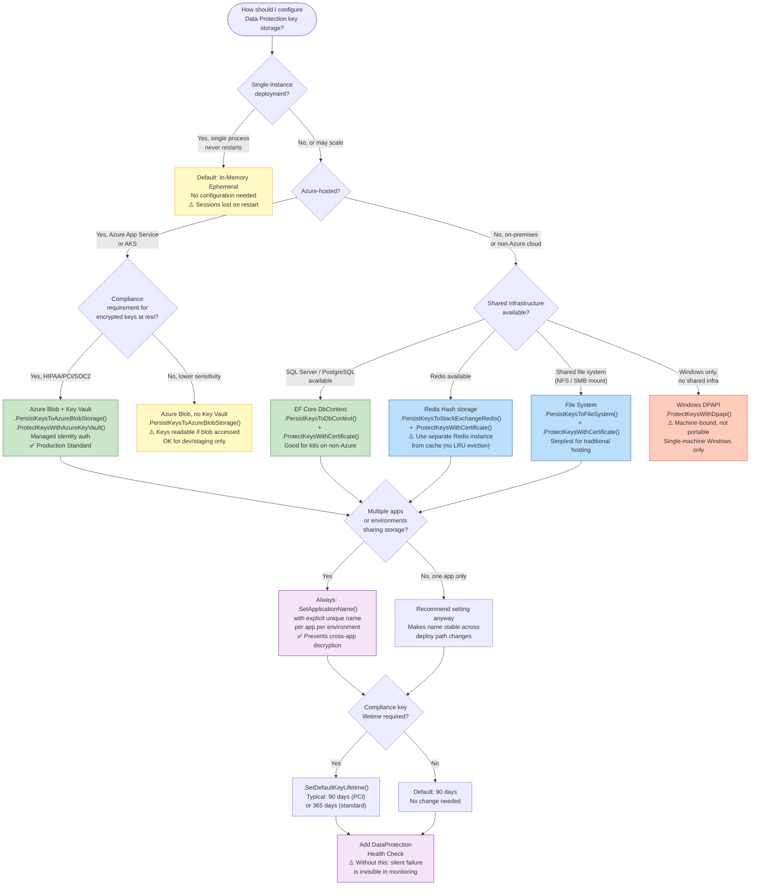

# 4.212 — Data Protection Key Management: Key Ring, Rotation, and Azure Storage

---

## PART 0 — Navigation & Context

### Where This Topic Sits in the ASP.NET Core Domain

```
ASP.NET Core Mastery
│
├── J. Authentication
│   ├── [[4.135 — Cookie Authentication]]          ← cookies encrypted by Data Protection
│   └── [[4.138 — Refresh Token Pattern]]          ← tokens may be Data Protection payloads
│
├── P. Security                                     ◄── YOU ARE HERE
│   ├── [[4.208 — HTTPS Enforcement: HSTS]]
│   ├── [[4.209 — CORS]]
│   ├── [[4.210 — CSRF / Antiforgery]]              ← antiforgery tokens use Data Protection
│   ├── [[4.211 — Data Protection API]]             ← prerequisite: the IDataProtector surface
│   ├── 4.212 — Data Protection Key Management     ← THIS NOTE
│   │           Key Ring, Rotation, Azure Storage
│   ├── [[4.213 — Security Headers Middleware]]
│   └── [[4.217 — Secrets in Production]]          ← Key Vault stores master key encryption key
│
└── AC. Deployment & Hosting
    ├── [[4.330 — Docker: Containerizing ASP.NET Core]]   ← ephemeral filesystem = key loss
    └── [[4.333 — Kubernetes: Deployments]]               ← pod restarts = key loss without persistence
```

### What You Need Before This

- **[[4.211 — Data Protection API: IDataProtector, Purpose Strings, and Payloads]]** — you must understand _what_ the Data Protection system protects (cookies, antiforgery tokens, bearer tokens, arbitrary payloads) before understanding _how_ the key ring that underlies all of it is managed
- **[[4.135 — Cookie Authentication]]** — cookie auth is the most common consumer of Data Protection; losing the key ring means every authenticated session instantly becomes invalid — understanding the consequence makes key management urgency concrete
- **[[4.217 — Secrets in Production: Key Vault, Managed Identity, and No appsettings]]** — the master key that _encrypts_ the Data Protection keys lives in Key Vault; you need to understand Managed Identity to configure Azure key ring storage without credentials in config
- **[[4.330 — Docker: Containerizing ASP.NET Core]]** — ephemeral container filesystems are the most common cause of Data Protection key loss in production; this context makes the persistence problem feel real

### What This Unlocks After

- **[[4.210 — CSRF / Antiforgery]]** — antiforgery tokens are Data Protection payloads; understanding the key ring explains why CSRF tokens fail after a deployment if persistence is not configured
- **[[4.213 — Security Headers Middleware]]** — security posture depends on the whole stack; HSTS and CSP are hollow if session tokens can be decrypted by an attacker who obtained a leaked key
- **[[4.333 — Kubernetes: Deployments, Services, and ConfigMaps]]** — configuring Data Protection in Kubernetes requires a persistent volume or Azure Blob for the key ring plus Key Vault for key encryption; this topic is the prerequisite for the full k8s security story

### Why This Matters at Scale

In a horizontally scaled or containerised deployment, **every instance must share the same key ring** — without a configured persistent key store, each pod generates its own ephemeral keys and every cross-instance request that touches a Data-Protection-backed payload (auth cookie, antiforgery token, bearer token, `IDataProtector`-encrypted value) will fail with a cryptographic exception, producing 500 errors or silent data corruption that is nearly impossible to diagnose without knowing this root cause.

---

## PART 1 — The Core Mental Model

### The Fundamental Rule

> **ASP.NET Core's Data Protection system stores its encryption keys in a key ring that is ephemeral by default — keys are held in memory and lost on process restart. In any deployment beyond a single, permanently-running process (Docker, Kubernetes, IIS app pool recycle, Azure App Service scale-out), you must explicitly configure a persistent key store and a key encryption mechanism, or every Data-Protection-backed operation — auth cookies, antiforgery tokens, and all `IDataProtector` payloads — will become permanently undecryptable after every restart.**

### The Plain-Language Analogy

Think of the Data Protection system as a bank vault where your application's secrets are stored in locked safe-deposit boxes. The key ring is the master board of keys — one key per box, organised by date of creation. The "active key" is the most recently issued key that is used to lock _new_ boxes; older keys stay on the board so you can still _open_ boxes that were locked with them in the past. By default, that key board lives on a piece of paper in the vault's RAM — the moment the bank closes for the night (process restart), the paper is shredded. Every box ever locked with those keys is now permanently sealed.

Persistent key storage is bolting the key board to a wall that survives closing time — Azure Blob, Redis, or a file system share. Key encryption (protecting the keys-at-rest) is putting a combination lock _on the board itself_ using an Azure Key Vault master key, so even if someone steals the physical board, they cannot read the individual keys without the vault combination. Key rotation is the policy that says "after 90 days, mint a new key and add it to the board — old keys stay on the board for another year so old boxes can still be opened, but all new boxes are locked with the new key."

This model holds when you ask about concurrent requests: multiple requests simultaneously use the same active key (the board is read-only for encryption, no locking needed); or when one instance rotates a key: it writes to the shared board (persistent store) and other instances refresh their cached ring copy within `KeyManagementOptions.KeyRingRefreshPeriod` (default 24 hours, or on demand when decryption fails).

### The Taxonomy Diagram

```mermaid
graph TD
    subgraph "Data Protection Key Ring"
        RING["Key Ring\n(IKeyRingProvider)"]
        ACTIVE["Active Key\n(used for new encryptions)"]
        RETIRED["Retired Keys\n(used only for decryption)"]
        REVOKED["Revoked Keys\n(refused even for decryption)"]
    end

    subgraph "Key Storage (Persistence)"
        FILESYSTEM["FileSystem\nPersistKeysToFileSystem()"]
        AZUREBLOB["Azure Blob Storage\nPersistKeysToAzureBlobStorage()"]
        REDIS["Redis\nPersistKeysToStackExchangeRedis()"]
        EFCORE["EF Core DbContext\nPersistKeysToDbContext<TContext>()"]
        REGISTRY["Windows Registry\nPersistKeysToRegistry()"]
        CUSTOM["Custom\nIXmlRepository"]
    end

    subgraph "Key Encryption (Protection at Rest)"
        DPAPI["Windows DPAPI\nProtectKeysWithDpapi()"]
        DPAPIUSER["Windows DPAPI (user)\nProtectKeysWithDpapi(local:false)"]
        AZKV["Azure Key Vault\nProtectKeysWithAzureKeyVault()"]
        CERT["X.509 Certificate\nProtectKeysWithCertificate()"]
        CUSTOM_ENC["Custom\nIXmlEncryptor / IXmlDecryptor"]
        UNPROTECTED["No Encryption\nDisableAutomaticKeyGeneration() / dev only"]
    end

    subgraph "Key Lifecycle Policy"
        AUTOGEN["Auto Generation\nIKeyManager.CreateNewKey()"]
        LIFETIME["Key Lifetime\nNewKeyLifetime (default: 90 days)"]
        PROPAGATION["Propagation Window\nMaxServerClockSkew (default: 5 min)"]
        REFRESH["Ring Refresh\nKeyRingRefreshPeriod (default: 24h)"]
        REVOKE_OP["Key Revocation\nIKeyManager.RevokeKey()"]
    end

    subgraph "Consumers (pipeline impact)"
        COOKIE["Cookie Authentication\nTicketDataFormat"]
        ANTIFORGERY["Antiforgery Tokens\nIAntiforgeryTokenSerializer"]
        SESSION["Session Middleware\nISessionSerializer"]
        IDATAPROTECTOR["IDataProtector\nApplication code"]
        TEMPDATA["TempData (cookie provider)\nITempDataSerializer"]
    end

    RING --> ACTIVE & RETIRED & REVOKED
    ACTIVE --> FILESYSTEM & AZUREBLOB & REDIS & EFCORE & REGISTRY & CUSTOM
    FILESYSTEM & AZUREBLOB & REDIS & EFCORE --> DPAPI & AZKV & CERT & CUSTOM_ENC
    RING --> AUTOGEN
    AUTOGEN --> LIFETIME & PROPAGATION & REFRESH

    ACTIVE -.->|"encrypts payloads for"| COOKIE & ANTIFORGERY & SESSION & IDATAPROTECTOR & TEMPDATA
    RETIRED -.->|"decrypts old payloads for"| COOKIE & ANTIFORGERY & SESSION & IDATAPROTECTOR & TEMPDATA

    style RING fill:#c8e6c9,stroke:#388e3c
    style ACTIVE fill:#c8e6c9,stroke:#388e3c
    style RETIRED fill:#fff9c4,stroke:#f9a825
    style REVOKED fill:#ffccbc,stroke:#e64a19
    style AZUREBLOB fill:#bbdefb,stroke:#1565c0
    style AZKV fill:#bbdefb,stroke:#1565c0
    style COOKIE fill:#f3e5f5,stroke:#7b1fa2
    style ANTIFORGERY fill:#f3e5f5,stroke:#7b1fa2
    style SESSION fill:#f3e5f5,stroke:#7b1fa2
    style IDATAPROTECTOR fill:#f3e5f5,stroke:#7b1fa2
```



---

## PART 2 — Deep Mechanics

### 2.1 The Key Ring Internals — What Happens on Every Protect() Call

The Data Protection system is not middleware in the HTTP pipeline — it is a service-layer cryptographic subsystem. Its interaction with the pipeline happens through consumers: `CookieAuthenticationHandler`, `AntiforgeryMiddleware`, `SessionMiddleware`, and direct `IDataProtector` calls.

**Pipeline Position (where consumers live):**

```
──► ExceptionHandler ──► HTTPS ──► StaticFiles ──► [Session] ──► Routing
    ──► [Antiforgery (implicit)] ──► Authentication ──► [Antiforgery (explicit validate)]
    ──► Authorization ──► Endpoints
              ▲                    ▲
       Session uses              Cookie auth uses
       IDataProtector            IDataProtector
       (key ring read here)      (key ring read here)
```

The key ring is loaded lazily on first use (not at startup) and cached in memory. Subsequent calls use the cached ring until `KeyRingRefreshPeriod` elapses or a decryption failure triggers a forced refresh.

**Framework Source Behavior — the protect/unprotect cycle:**

```csharp
// ASP.NET Core internally (approximate):
// Source: src/DataProtection/DataProtection/src/KeyManagement/KeyRingBasedDataProtector.cs

public byte[] Protect(byte[] plaintext)
{
    // 1. Get the current key ring from IKeyRingProvider
    //    If cached ring is expired → reload from IXmlRepository (file/blob/Redis)
    //    Cost: O(1) cache hit, or O(n_keys) XML parse + decrypt on cache miss
    var (keyRing, defaultKeyId) = _keyRingProvider.GetCurrentKeyRing();

    // 2. Get the active key descriptor
    //    The "active" key is the one with the most recent activation date
    //    that is not yet expired and not revoked
    var key = keyRing.GetKey(defaultKeyId);

    // 3. Serialize the purpose chain into a header
    //    "WebApp:Cookie:v2" becomes a byte[] AAD (additional authenticated data)
    //    ~1 allocation for the purpose-chain header

    // 4. Encrypt with the active key's IAuthenticatedEncryptor
    //    Default algorithm: AES-256-CBC + HMACSHA256 (CBC mode, .NET 6)
    //    OR:                AES-256-GCM (.NET 5+ opt-in, preferred for new apps)
    //    ~1 allocation for the ciphertext byte[]
    var protectedData = key.CreateEncryptorInstance().Encrypt(plaintext, aad);

    // 5. Prepend the magic header + key ID (as a Guid, 16 bytes)
    //    Header format: { 0x09, 0xF0, 0xC9, 0xF0 }  (4-byte magic)
    //                 + keyId (16-byte Guid)
    //                 + encryptedPayload
    return Combine(MagicHeader, keyId.ToByteArray(), protectedData);
    // Total allocations: ~3 (header, ciphertext, combined output)
    // Total cost: ~1-5μs for AES-CBC, ~0.5-1μs for AES-GCM (hardware AES-NI)
}

public byte[] Unprotect(byte[] protectedData)
{
    // 1. Parse the magic header and extract keyId (first 20 bytes)
    var keyId = ParseKeyId(protectedData);  // O(1)

    // 2. Look up the key in the ring — may be active OR retired
    //    If keyId not found in current cached ring:
    //      → Force ring refresh from persistent store (IXmlRepository)
    //      → If still not found → throw CryptographicException
    //      HTTP consequence: 500 or redirect to login depending on consumer
    var key = keyRing.GetKey(keyId)
        ?? ForceRefreshAndGetKey(keyId)
        ?? throw new CryptographicException($"Key {keyId} not found.");

    // 3. Decrypt with the matched key's encryptor
    //    If decryption fails (tampered payload, wrong purpose) → CryptographicException
    return key.CreateEncryptorInstance().Decrypt(protectedData, aad);
}
```

**HTTP Wire Format — cookie auth with Data Protection:**

```http
// POST /account/login  → successful auth → Data Protection encrypts the ticket
// HTTP/1.1 200 OK
// Set-Cookie: .AspNetCore.Auth=CfDJ8A...  (base64url of keyId + AES ciphertext)
//             Path=/; HttpOnly; Secure; SameSite=Lax; Expires=Sat, 10 Jun 2026 12:00:00 GMT

// Subsequent request with valid cookie:
// GET /api/orders HTTP/1.1
// Cookie: .AspNetCore.Auth=CfDJ8A...
// → Data Protection decrypts → ClaimsPrincipal extracted → auth succeeds
// HTTP/1.1 200 OK

// After key ring loss (restart without persistence):
// GET /api/orders HTTP/1.1
// Cookie: .AspNetCore.Auth=CfDJ8A...  (contains old keyId that no longer exists)
// → CryptographicException: Key {guid} not found in key ring
// → CookieAuthenticationHandler catches → treats as invalid auth
// HTTP/1.1 302 Found
// Location: /account/login   ← all users silently logged out
```

**Runtime Cost Labels:**

- Ring cache hit (Protect): `~3 allocations`, `~1-5μs`
- Ring cache miss (first call or refresh): `~O(n_keys)` XML parse + decryption of key descriptors from store, `~1-50ms` depending on store latency
- Key ID lookup in ring: `O(1)` via `Dictionary<Guid, IKey>`
- AES-256-CBC encrypt (hardware AES-NI): `~0.5μs per KB`
- AES-256-GCM encrypt (hardware AES-NI): `~0.3μs per KB`
- Azure Key Vault unwrap operation (ring load only, not per-request): `~50-200ms`, `1 network call per key load`

---

### 2.2 Key Ring Structure — XML on Disk/Blob/Redis

Every key is stored as an XML document. The key management subsystem reads, writes, and decrypts these XML documents. The XML is the canonical format regardless of where it is stored (file system, Azure Blob, Redis sorted set).

**Key XML structure (unencrypted, simplified):**

```xml
<!-- Stored as: {keyId}.xml in the key ring repository -->
<!-- File path example: /var/dpkeys/key-{guid}.xml -->
<key id="b1b4b5f2-3c41-4d5e-a6b7-c8d9e0f1a2b3" version="1">
  <creationDate>2026-01-15T00:00:00Z</creationDate>
  <activationDate>2026-01-15T00:00:00Z</activationDate>
  <expirationDate>2026-04-15T00:00:00Z</expirationDate>  <!-- 90-day lifetime -->
  <descriptor deserializerType="Microsoft.AspNetCore.DataProtection.AuthenticatedEncryption...">
    <encryption algorithm="AES_256_CBC" />
    <validation algorithm="HMACSHA256" />
    <encryptedSecret>
      <!-- AES-256 key material, encrypted with the key encryption provider -->
      <!-- If ProtectKeysWithAzureKeyVault: this is RSA-OAEP wrapped -->
      <!-- If Windows DPAPI: this is DPAPI-protected -->
      <!-- If no encryption (dev): this is BASE64 PLAINTEXT - NEVER in production -->
      <![CDATA[CfDJ8B3...]]>
    </encryptedSecret>
  </descriptor>
</key>
```

**Key XML structure (Azure Key Vault encrypted):**

```xml
<key id="b1b4b5f2-..." version="1">
  <creationDate>2026-01-15T00:00:00Z</creationDate>
  <activationDate>2026-01-15T00:00:00Z</activationDate>
  <expirationDate>2026-04-15T00:00:00Z</expirationDate>
  <encryptedSecret>
    <!-- The key descriptor XML is itself wrapped in this element -->
    <AzureKeyVaultXmlEncryptor
        keyId="https://myvault.vault.azure.net/keys/dp-master-key/abc123"
        xmlns="...">
      <!-- RSA-OAEP encrypted blob of the inner descriptor XML -->
      <value>CfDJ8B3...long base64 string...</value>
    </AzureKeyVaultXmlEncryptor>
  </encryptedSecret>
</key>
```

> [!IMPORTANT] The key XML **never contains the plaintext key material** when key encryption is configured — only the wrapped ciphertext. An attacker who gains read access to your Azure Blob container or Redis instance where keys are stored gets only RSA-OAEP wrapped blobs that require the Azure Key Vault master key to unwrap. This is the defense-in-depth that makes blob storage an acceptable location for key ring persistence.

**Framework Source Behavior — key ring load:**

```csharp
// ASP.NET Core internally (approximate):
// Source: src/DataProtection/DataProtection/src/KeyManagement/KeyRingProvider.cs

private KeyRing LoadKeyRing()
{
    // 1. Read all XML documents from IXmlRepository
    //    → Azure Blob: list blobs in container, download each .xml
    //    → File system: Directory.GetFiles(path, "*.xml")
    //    → Redis: IDatabase.SortedSetRangeByScore("DataProtection-Keys")
    var allElements = _xmlRepository.GetAllElements();  // IReadOnlyCollection<XElement>
    // Cost: 1 storage round-trip, O(n_keys) XML parse

    // 2. For each element, check if it's a key descriptor or a revocation record
    //    Deserialize using IAuthenticatedEncryptorDescriptorDeserializer
    //    If encrypted: call IXmlDecryptor.Decrypt() to unwrap
    //    → Azure Key Vault: 1 Decrypt API call per key (REST call, ~100ms)
    //    → DPAPI: in-process OS call (~1ms)
    // Cost: O(n_keys) × (1 Key Vault call) — this is why ring caching matters

    // 3. Build the key ring: find the key with the latest activationDate
    //    that is not expired, not revoked, and within the propagation window
    //    → If no valid active key found: auto-generate a new key
    //    Cost: O(n_keys) sort

    // 4. Cache the result for KeyRingRefreshPeriod (default: 24h)
    return new KeyRing(keys, defaultKeyId);
}
```

**Runtime Cost Labels (ring load, not per-request):**

- Azure Blob list + download: `~50-200ms` (network, once per 24h per instance)
- Key Vault decrypt per key: `~50-150ms` per key × n_active_keys (throttled at 1000 ops/10s)
- Total ring load with 5 keys, Key Vault: `~300-900ms` (startup + every 24h)
- Redis ring load with 5 keys: `~5-20ms`
- File system ring load with 5 keys: `~1-5ms`

---

### 2.3 Key Rotation — Automatic and Manual

Key rotation is the process of creating a new active key and transitioning protection operations to use it while keeping old keys available for decryption. This is **not** re-encrypting existing payloads — it is simply introducing a new active key.

**Automatic rotation timeline:**

```
Day 0:   Key A created (activationDate=Day 0, expirationDate=Day 90)
         All Protect() calls use Key A
         Ring: [A=ACTIVE]

Day 80:  ASP.NET Core notices Key A expires in 10 days
         (NewKeyLifetime=90d, key generation threshold = 10% remaining = 9 days)
         Actually: threshold = max(2 days, NewKeyLifetime * 0.1)
         → IKeyManager.CreateNewKey() called automatically
         Key B created (activationDate=Day 80+propagation_window, expirationDate=Day 170)
         Ring: [A=ACTIVE, B=DEFAULT_but_not_yet_active]

Day 80+propagation:  Key B becomes active
         All new Protect() calls use Key B
         All Unprotect() calls still work with both Key A and Key B
         Ring: [A=RETIRED, B=ACTIVE]

Day 90:  Key A expires — still retained for Unprotect() until explicitly removed
         Old payloads encrypted with Key A still decrypt successfully
         Ring: [A=EXPIRED_but_retained, B=ACTIVE]

Day 170: Key B expires → Key C auto-generated → same cycle repeats
```

> [!NOTE] Expired keys are **never automatically deleted** from the key ring repository. They remain available for decryption indefinitely. To remove them, you must call `IKeyManager.RevokeKey(keyId, "reason")`. Revocation is permanent and irreversible — any payload encrypted with a revoked key becomes permanently undecryptable. Only revoke keys you are certain are no longer in any live session or payload.

**Manual key operations via IKeyManager:**

```csharp
// Injecting IKeyManager to inspect and manage the key ring
// IKeyManager is registered as Singleton by AddDataProtection()

public class KeyRingDiagnosticsEndpoint
{
    private readonly IKeyManager _keyManager;

    public KeyRingDiagnosticsEndpoint(IKeyManager keyManager)
    {
        _keyManager = keyManager;
    }

    // GET /api/admin/keyring  (internal endpoint, never expose publicly)
    public IResult GetKeyRingStatus()
    {
        var allKeys = _keyManager.GetAllKeys();
        return TypedResults.Ok(allKeys.Select(k => new
        {
            k.KeyId,
            k.CreationDate,
            k.ActivationDate,
            k.ExpirationDate,
            IsRevoked = k.IsRevoked,
            Status = k.IsRevoked ? "Revoked"
                   : k.ExpirationDate < DateTimeOffset.UtcNow ? "Expired"
                   : k.ActivationDate > DateTimeOffset.UtcNow ? "Pending"
                   : "Active"
        }));
    }

    // Force immediate key creation (e.g., after suspected key compromise)
    public void ForceKeyRotation()
    {
        // Creates a new key with activation in (now + propagation window)
        // Other instances will pick it up within KeyRingRefreshPeriod
        _keyManager.CreateNewKey(
            activationDate: DateTimeOffset.UtcNow,
            expirationDate: DateTimeOffset.UtcNow.AddDays(90));
    }

    // Revoke a compromised key — IRREVERSIBLE
    public void RevokeKey(Guid keyId, string reason)
    {
        // After this: any Unprotect() call using this key throws CryptographicException
        // All sessions/tokens using this key become permanently invalid
        // HTTP consequence: all affected users are logged out immediately
        _keyManager.RevokeKey(keyId, reason);
    }
}
```

**HTTP consequence of key revocation:**

```http
// User has a cookie encrypted with revoked key K1
// GET /api/orders HTTP/1.1
// Cookie: .AspNetCore.Auth=CfDJ8...(payload encrypted with K1)

// → CookieAuthenticationHandler calls IDataProtector.Unprotect()
// → IKeyManager looks up K1 → K1 is revoked
// → throws CryptographicException("Key was revoked.")
// → CookieAuthenticationHandler treats as auth failure
// HTTP/1.1 302 Found
// Location: /account/login
// Set-Cookie: .AspNetCore.Auth=; expires=Thu, 01 Jan 1970 00:00:00 GMT  (cookie cleared)
```

**Runtime Cost Labels:**

- `IKeyManager.GetAllKeys()`: `O(n_keys)`, reads from ring cache, `~0.1ms`
- `IKeyManager.CreateNewKey()`: `1 Key Vault wrap operation (~150ms)` + `1 blob/file write (~50ms)`
- `IKeyManager.RevokeKey()`: `1 XML write to repository` + `cache invalidation`, `~50ms`
- Propagation to other instances: up to `KeyRingRefreshPeriod` (default 24h) unless forced

---

### 2.4 Azure Blob Storage Key Ring — Production Configuration

Storing keys in Azure Blob Storage is the standard production approach for Azure-hosted ASP.NET Core applications. The key ring container should be **private** (no anonymous access), accessed via Managed Identity.

**Infrastructure requirements:**

```
Azure Resources Required:
├── Azure Blob Storage Account
│   └── Container: "dataprotection-keys"  (private, no public access)
│       └── Blobs: "key-{guid}.xml" per key
└── Azure Key Vault
    └── Key: "dp-master-key" (RSA 2048 or 4096, for key wrapping)
        → Used to RSA-OAEP encrypt each Data Protection key XML
        → The App Service / AKS pod Managed Identity needs:
           Key Vault: "Key Wrap" + "Key Unwrap" permissions (NOT "Get Key" — you don't need the raw key value)
           Blob Storage: "Storage Blob Data Contributor" role on the container
```

**Framework Source Behavior — key ring refresh with Azure Blob:**

```csharp
// ASP.NET Core internally (approximate):
// Source: Azure.Extensions.AspNetCore.DataProtection.Blobs

// AzureBlobXmlRepository implements IXmlRepository
// On GetAllElements():
//   1. BlobContainerClient.GetBlobsAsync() — list all blobs in container
//      Each blob name matches: "key-{guid}.xml"
//   2. For each blob: BlobClient.DownloadContentAsync() — download XML text
//   3. Parse XElement from each XML string
//   4. Return all elements to KeyRingProvider for processing
// On StoreElement(XElement element, string friendlyName):
//   1. BlobClient.UploadAsync(xmlString, overwrite: false)
//      → 412 Precondition Failed if blob already exists (duplicate key check)
// Cost per ring load: 1 list operation + N download operations (N = number of keys)
// Typical: 3-10 keys, ~150-400ms total
```

**Failure Mode Diagram — Azure Blob unavailable:**

```
Ring load on startup → BlobContainerClient.GetBlobsAsync() throws RequestFailedException
  → KeyRingProvider catches exception
  → Logs: "An exception occurred while loading the key ring."
  → Falls back to in-memory ephemeral key (auto-generates a new key)
  → WARNING: this key is not persisted — any restart loses it
  → HTTP consequence: all existing auth cookies immediately invalid (lost ring)

// To detect this: watch for EventId 22 in the DataProtection event log
// "Key ring does not contain a valid default protection key."
// Alert on this in production — it means keys are being lost
```

> [!DANGER] If Azure Blob is unreachable during startup and you have not disabled key generation, ASP.NET Core **silently generates an ephemeral in-memory key**. Your application will appear to work — users can log in, cookies are set, antiforgery tokens work. But after the next restart (or scale-out), those tokens become permanently invalid. This silent fallback is the most dangerous default behavior in the Data Protection system.

---

### 2.5 Redis Key Ring — Distributed Caching Co-location

Using Redis for both `IDistributedCache` and Data Protection key storage simplifies infrastructure but requires careful isolation to prevent cache eviction of key ring data.

**Framework Source Behavior:**

```csharp
// ASP.NET Core internally (approximate):
// Source: Microsoft.AspNetCore.DataProtection.StackExchangeRedis

// RedisXmlRepository implements IXmlRepository
// Uses a Redis Hash (not a String or List):
//   Hash key: "DataProtection-Keys" (configurable)
//   Hash field: key XML string per entry
// On GetAllElements():
//   HGETALL "DataProtection-Keys" → all field values as XML strings
// On StoreElement():
//   HSET "DataProtection-Keys" {friendlyName} {xmlString}

// CRITICAL: Redis Hash is not subject to maxmemory-policy eviction
// (hashes are evicted as a whole unit, not field-by-field)
// BUT: if you use a Redis String key and maxmemory-policy evicts it,
//      the entire key ring is gone — silent catastrophe
// The Hash approach is safer but still: set maxmemory-policy to noeviction
// on the Redis instance used for Data Protection keys
```

> [!WARNING] Never use the same Redis instance for both Data Protection keys AND a cache with `maxmemory-policy allkeys-lru`. LRU eviction will eventually evict your key ring data, causing a silent catastrophic key loss. Use a separate Redis database (different `db` index) or a separate Redis instance entirely for Data Protection keys, with `maxmemory-policy noeviction`.

---

### 2.6 Key Encryption — Azure Key Vault RSA Wrap

Key encryption protects the keys-at-rest in your persistent store. Without it, anyone with read access to your Blob container or Redis instance can read plaintext AES keys.

**The two-layer encryption model:**

```
Layer 1: Data Protection encrypts application payloads
         Using: Active AES-256 key from key ring
         Stored as: ciphertext in cookie, antiforgery token, etc.

Layer 2: Key Vault encrypts the AES keys themselves
         Using: RSA master key in Key Vault
         Stored as: RSA-OAEP wrapped key material in blob/file XML

Attack scenarios mitigated:
  → Attacker reads blob storage: gets only RSA-wrapped key material (useless without Key Vault access)
  → Attacker compromises Key Vault: gets RSA key, but still needs blob/Redis to find wrapped keys
  → Attacker gets both: can decrypt old payloads — respond with emergency key revocation

Attack NOT mitigated by key encryption:
  → Attacker with code execution on the running app: they can call IDataProtector.Unprotect() directly
  → Key encryption is defense-in-depth against storage compromise, not runtime compromise
```

**Azure Key Vault wrap/unwrap permissions (least privilege):**

```
Key Vault Access Policy (or RBAC role assignment):
  App Service Managed Identity needs:
    ✅ wrapKey   — wrap (encrypt) new Data Protection keys with the master key
    ✅ unwrapKey — unwrap (decrypt) existing Data Protection keys for ring load
    ❌ sign      — NOT needed
    ❌ verify    — NOT needed
    ❌ encrypt   — NOT needed (wrap is the correct operation for key wrapping)
    ❌ decrypt   — NOT needed
    ❌ get       — NOT needed (you never retrieve the master key raw value)

RBAC equivalent: "Key Vault Crypto User" role
  (includes wrapKey + unwrapKey + sign + verify — over-privileged but standard)
  For truly least-privilege: custom role with only wrapKey + unwrapKey
```

---

## PART 3 — Production Code Patterns

### Pattern 1: The Azure Blob + Key Vault Standard Configuration

The canonical production setup for an Azure-hosted ASP.NET Core application — every Azure deployment should use this pattern or justify why it doesn't.

```csharp
// Program.cs — Healthcare patient portal API
// Scenario: ASP.NET Core 8, Azure App Service, cookie auth for clinicians
// Requirement: HIPAA-compliant key management — keys must be encrypted at rest

using Azure.Identity;
using Microsoft.AspNetCore.DataProtection;

var builder = WebApplication.CreateBuilder(args);

// Managed Identity credential — works in App Service, AKS, Azure Functions
// Locally: uses DefaultAzureCredential (developer Azure CLI login)
// In AKS: use workload identity — set AZURE_CLIENT_ID env var
var azureCredential = new DefaultAzureCredential(new DefaultAzureCredentialOptions
{
    // Exclude irrelevant credential sources to speed up local token resolution
    ExcludeEnvironmentCredential = false,
    ExcludeVisualStudioCredential = false,
    ExcludeManagedIdentityCredential = false
});

// Read key ring config from IOptions — NOT from hardcoded strings
// appsettings.json: { "DataProtection": { "BlobUri": "...", "KeyVaultKeyId": "..." } }
var dpConfig = builder.Configuration.GetSection("DataProtection");
var blobUri = new Uri(dpConfig["BlobUri"]!);
var keyVaultKeyId = new Uri(dpConfig["KeyVaultKeyId"]!);

builder.Services.AddDataProtection()
    // App discriminator: isolates key rings between different apps in the same storage
    // Without this, two apps sharing a storage account share the same key ring
    // which means App A can decrypt App B's cookies — a security boundary violation
    .SetApplicationName("HealthPortal-PatientAPI-v2")

    // Persist keys to Azure Blob Storage
    // Blob URI format: https://{account}.blob.core.windows.net/{container}/{blob-name}
    // The blob name should be deterministic (not random) so existing keys are found on reload
    .PersistKeysToAzureBlobStorage(blobUri, azureCredential)

    // Encrypt keys at rest using Azure Key Vault
    // Key Vault key URI format: https://{vault}.vault.azure.net/keys/{key-name}/{version?}
    // Omit version for "always use latest key version" (recommended for rotation)
    .ProtectKeysWithAzureKeyVault(keyVaultKeyId, azureCredential)

    // Override default key lifetime for compliance
    // HIPAA requires annual key rotation at minimum; 90 days is common for PCI-DSS
    .SetDefaultKeyLifetime(TimeSpan.FromDays(90));

// Cookie auth uses Data Protection automatically — no additional wiring needed
builder.Services.AddAuthentication(CookieAuthenticationDefaults.AuthenticationScheme)
    .AddCookie(options =>
    {
        options.Cookie.Name = ".HealthPortal.Auth";
        options.Cookie.HttpOnly = true;
        options.Cookie.SecurePolicy = CookieSecurePolicy.Always;
        options.Cookie.SameSite = SameSiteMode.Strict;
        options.ExpireTimeSpan = TimeSpan.FromHours(8);
        options.SlidingExpiration = true;
    });

var app = builder.Build();

// HTTP consequence of correct configuration:
// POST /account/login → auth success
// HTTP/1.1 200 OK
// Set-Cookie: .HealthPortal.Auth=CfDJ8...(AES-256 encrypted, key from Azure Blob)
//             Path=/; HttpOnly; Secure; SameSite=Strict
//
// After App Service restart / scale-out to new instance:
// GET /dashboard HTTP/1.1
// Cookie: .HealthPortal.Auth=CfDJ8...
// → Ring loaded from Azure Blob → same keyId found → decryption succeeds
// HTTP/1.1 200 OK  ← user session survives restart
```

---

### Pattern 2: The Kubernetes / Docker Persistent Volume Pattern

For Kubernetes deployments that cannot use Azure Blob (on-premises k8s, GKE, EKS):

```csharp
// Program.cs — E-commerce order management service
// Scenario: Kubernetes deployment, 5 replicas, EF Core for key persistence
// Package: Microsoft.AspNetCore.DataProtection.EntityFrameworkCore

using Microsoft.AspNetCore.DataProtection;
using Microsoft.EntityFrameworkCore;

// DbContext for key ring storage — separate from application DbContext
// Can reuse the application DbContext if it already exists
public class OrderApiDbContext : DbContext, IDataProtectionKeyContext
{
    public OrderApiDbContext(DbContextOptions<OrderApiDbContext> options)
        : base(options) { }

    // Required by IDataProtectionKeyContext — the table for key storage
    // EF Core will create a "DataProtectionKeys" table with:
    //   - Id (int, PK)
    //   - FriendlyName (nvarchar, unique)
    //   - Xml (nvarchar(max)) — the key XML, may be encrypted by key encryptor
    public DbSet<DataProtectionKey> DataProtectionKeys => Set<DataProtectionKey>();
}

// In Program.cs:
builder.Services.AddDbContext<OrderApiDbContext>(options =>
    options.UseSqlServer(builder.Configuration.GetConnectionString("OrderDb")));

builder.Services.AddDataProtection()
    .SetApplicationName("OrderManagement-API")
    // Persist keys to SQL Server via EF Core
    // Keys survive pod restarts and scale-out as long as the DB is available
    .PersistKeysToDbContext<OrderApiDbContext>()
    // Key encryption for on-premises: X.509 certificate stored in cert store
    // OR: for Kubernetes, use a Secret-backed certificate
    .ProtectKeysWithCertificate(
        // Load from Kubernetes Secret mounted as file
        new System.Security.Cryptography.X509Certificates.X509Certificate2(
            path: "/etc/ssl/dp-cert.pfx",
            password: builder.Configuration["DataProtection:CertificatePassword"]));

// HTTP consequence:
// With EF Core persistence: pod restarts, rolling deployments, and scale-out
// all share the same key ring via the SQL database
// Key operations (rotate, revoke) are transactionally consistent with the DB

// ⚠️ MIGRATION REQUIRED: EF Core key storage needs the DataProtectionKeys table
// Add-Migration AddDataProtectionKeys  (or use EnsureCreated in dev)
// Update-Database
```

---

### Pattern 3: Multi-App Key Ring Isolation

A common production mistake is multiple applications sharing a key ring unintentionally. `SetApplicationName` is the fix:

```csharp
// ⚠️ WRONG — two apps on the same App Service Plan share blob storage
// App A: builder.Services.AddDataProtection()
//            .PersistKeysToAzureBlobStorage(sharedBlobUri, cred);
// App B: builder.Services.AddDataProtection()
//            .PersistKeysToAzureBlobStorage(sharedBlobUri, cred);
// Problem: same blob URI, same default app name (derived from app content root)
// IF the content root paths happen to be the same (rare but possible in App Service),
// App A and App B share the key ring
// App A can Unprotect() App B's auth cookies — security boundary violation

// ✅ CORRECT — explicit application name isolation
// Payment API:
builder.Services.AddDataProtection()
    .SetApplicationName("Payments-API-prod")       // ← explicit, unique, stable
    .PersistKeysToAzureBlobStorage(new Uri(
        "https://mystore.blob.core.windows.net/dp-keys/payments-api-key.xml"), cred)
    .ProtectKeysWithAzureKeyVault(kvKeyUri, cred);

// Order API (separate service, separate deployment):
builder.Services.AddDataProtection()
    .SetApplicationName("Orders-API-prod")         // ← different name = different key ring
    .PersistKeysToAzureBlobStorage(new Uri(
        "https://mystore.blob.core.windows.net/dp-keys/orders-api-key.xml"), cred)
    .ProtectKeysWithAzureKeyVault(kvKeyUri, cred);

// Note: different blob URI (different blob name) AND different app name
// SetApplicationName affects the purpose-chain hash — a cookie from Payments-API
// CANNOT be decrypted by Orders-API even if they share the same keys
// Two layers of isolation: separate keys AND separate purpose chains

// HTTP consequence:
// If attacker intercepts a Payments-API cookie and replays to Orders-API:
// → IDataProtector.Unprotect() throws CryptographicException (purpose mismatch)
// → Orders-API treats request as unauthenticated → 302 to login
```

---

### Pattern 4: Emergency Key Rotation After Suspected Compromise

When a key may have been compromised (storage breach, leaked config), you need immediate rotation:

```csharp
// KeyRotationService.cs — Fintech payment API — emergency rotation workflow
// Domain: suspected credential leak detected by security team

public class KeyRotationService
{
    private readonly IKeyManager _keyManager;
    private readonly ILogger<KeyRotationService> _logger;
    private readonly IDataProtector _auditProtector;

    public KeyRotationService(
        IKeyManager keyManager,
        IDataProtectionProvider dataProtectionProvider,
        ILogger<KeyRotationService> logger)
    {
        _keyManager = keyManager;
        _logger = logger;
        // Separate protector for auditing key rotation events themselves
        _auditProtector = dataProtectionProvider.CreateProtector("KeyRotation:Audit");
    }

    /// <summary>
    /// Emergency rotation: revoke suspected compromised keys and force new active key.
    /// HTTP consequence: ALL existing auth cookies and antiforgery tokens become invalid.
    /// Users will be force-logged-out. Plan for user communication.
    /// </summary>
    public async Task<KeyRotationResult> ExecuteEmergencyRotationAsync(
        string incidentId,
        CancellationToken ct = default)
    {
        _logger.LogCritical(
            "Emergency key rotation initiated. IncidentId: {IncidentId}", incidentId);

        var allKeys = _keyManager.GetAllKeys();
        var activeKeys = allKeys.Where(k => !k.IsRevoked &&
            k.ActivationDate <= DateTimeOffset.UtcNow &&
            k.ExpirationDate > DateTimeOffset.UtcNow).ToList();

        // Step 1: Create new key BEFORE revoking old ones
        // Activation: immediately (propagation window = 0 for emergency)
        // Expiration: 90 days from now
        var newKey = _keyManager.CreateNewKey(
            activationDate: DateTimeOffset.UtcNow,
            expirationDate: DateTimeOffset.UtcNow.AddDays(90));

        _logger.LogWarning(
            "Created new emergency key {KeyId} for incident {IncidentId}",
            newKey.KeyId, incidentId);

        // Step 2: Revoke all currently active keys
        // This immediately invalidates all existing auth cookies and tokens
        var revokedKeyIds = new List<Guid>();
        foreach (var key in activeKeys)
        {
            // RevokeKey writes a revocation record to the IXmlRepository
            // Other instances pick it up within KeyRingRefreshPeriod
            _keyManager.RevokeKey(
                key.KeyId,
                reason: $"Emergency revocation — IncidentId: {incidentId}");
            revokedKeyIds.Add(key.KeyId);

            _logger.LogWarning(
                "Revoked key {KeyId} as part of emergency rotation for incident {IncidentId}",
                key.KeyId, incidentId);
        }

        // Step 3: Force ring refresh on this instance
        // Other instances will refresh within KeyRingRefreshPeriod
        // In Kubernetes: rolling restart of pods is the reliable way to force refresh
        // IKeyManager does not have a "force all instances to refresh" API —
        // that would require distributed coordination
        await Task.CompletedTask; // placeholder for any async cleanup

        return new KeyRotationResult(
            NewKeyId: newKey.KeyId,
            RevokedKeyIds: revokedKeyIds,
            IncidentId: incidentId,
            Timestamp: DateTimeOffset.UtcNow);

        // HTTP consequence after this operation:
        // All users with cookies encrypted under revoked keys:
        //   → GET /api/payments → 302 Found → Location: /account/login
        //   → Set-Cookie: .AspNetCore.Auth=; expires=... (cookie cleared)
        // New logins succeed normally using the new key
    }
}

public record KeyRotationResult(
    Guid NewKeyId,
    IReadOnlyList<Guid> RevokedKeyIds,
    string IncidentId,
    DateTimeOffset Timestamp);
```

---

### Pattern 5: Key Ring Health Check

Data Protection key ring health is a critical production signal that most teams never monitor:

```csharp
// DataProtectionKeyRingHealthCheck.cs — Logistics shipment tracker API
// Registered as a health check that Kubernetes liveness/readiness probes call

using Microsoft.AspNetCore.DataProtection;
using Microsoft.Extensions.Diagnostics.HealthChecks;

public class DataProtectionKeyRingHealthCheck : IHealthCheck
{
    private readonly IDataProtectionProvider _dataProtectionProvider;
    private readonly IKeyManager _keyManager;
    private readonly ILogger<DataProtectionKeyRingHealthCheck> _logger;

    public DataProtectionKeyRingHealthCheck(
        IDataProtectionProvider dataProtectionProvider,
        IKeyManager keyManager,
        ILogger<DataProtectionKeyRingHealthCheck> logger)
    {
        _dataProtectionProvider = dataProtectionProvider;
        _keyManager = keyManager;
        _logger = logger;
    }

    public Task<HealthCheckResult> CheckHealthAsync(
        HealthCheckContext context,
        CancellationToken cancellationToken = default)
    {
        try
        {
            // Test 1: Can we actually protect and unprotect a payload?
            // This exercises the full stack: ring load → active key → encrypt → decrypt
            var protector = _dataProtectionProvider.CreateProtector("HealthCheck");
            var testPayload = "ping:" + DateTimeOffset.UtcNow.Ticks;
            var protected_ = protector.Protect(testPayload);
            var unprotected = protector.Unprotect(protected_);

            if (unprotected != testPayload)
                return Task.FromResult(HealthCheckResult.Unhealthy(
                    "Data Protection round-trip produced incorrect result"));

            // Test 2: Do we have a valid active key?
            var keys = _keyManager.GetAllKeys();
            var activeKey = keys.FirstOrDefault(k =>
                !k.IsRevoked &&
                k.ActivationDate <= DateTimeOffset.UtcNow &&
                k.ExpirationDate > DateTimeOffset.UtcNow);

            if (activeKey == null)
                return Task.FromResult(HealthCheckResult.Unhealthy(
                    "No active key in key ring — ephemeral key in use"));

            // Test 3: Is the active key close to expiry? (warn, not fail)
            var daysUntilExpiry = (activeKey.ExpirationDate - DateTimeOffset.UtcNow).TotalDays;
            if (daysUntilExpiry < 7)
            {
                _logger.LogWarning(
                    "Data Protection active key {KeyId} expires in {Days} days",
                    activeKey.KeyId, daysUntilExpiry);
                return Task.FromResult(HealthCheckResult.Degraded(
                    $"Active key expires in {daysUntilExpiry:F0} days. Rotation may be delayed."));
            }

            return Task.FromResult(HealthCheckResult.Healthy(
                $"Key ring healthy. Active key expires in {daysUntilExpiry:F0} days."));
        }
        catch (CryptographicException ex)
        {
            _logger.LogError(ex, "Data Protection health check failed — cryptographic error");
            return Task.FromResult(HealthCheckResult.Unhealthy(
                "Data Protection cryptographic failure — key ring may be corrupted", ex));
        }
        catch (Exception ex)
        {
            _logger.LogError(ex, "Data Protection health check failed — unexpected error");
            return Task.FromResult(HealthCheckResult.Unhealthy(
                "Data Protection health check threw unexpected exception", ex));
        }
    }
}

// Registration in Program.cs:
builder.Services.AddHealthChecks()
    .AddCheck<DataProtectionKeyRingHealthCheck>(
        "dataprotection-keyring",
        failureStatus: HealthStatus.Degraded,  // Don't kill readiness on key warning
        tags: new[] { "security", "keyring" });

// HTTP consequence: GET /health/ready
// Healthy: { "status": "Healthy", "entries": { "dataprotection-keyring": { "status": "Healthy" } } }
// Degraded: { "status": "Degraded", ... } — Kubernetes readiness probe: still serves traffic
// Unhealthy: { "status": "Unhealthy", ... } — Kubernetes readiness probe: removes from load balancer
```

---

### Pattern 6: Isolating Data Protection in Kubernetes with Pod Identity

Full Kubernetes configuration showing the relationship between Workload Identity, Key Vault, and Data Protection:

```csharp
// Program.cs — Multi-tenant SaaS API on AKS with Workload Identity
// Scenario: multiple teams, one shared AKS cluster, isolated key rings per tenant

// appsettings.json (values injected via Kubernetes ConfigMap):
// {
//   "DataProtection": {
//     "ApplicationName": "SaasPortal-API-prod",
//     "BlobUri": "https://saasstorage.blob.core.windows.net/dp-keys/saas-api-key.xml",
//     "KeyVaultKeyId": "https://saasvault.vault.azure.net/keys/dp-master/",
//     "KeyLifetimeDays": 90
//   }
// }

var dpSection = builder.Configuration.GetSection("DataProtection");

// WorkloadIdentityCredential uses the AZURE_CLIENT_ID env var injected by AKS
// Bound to the Kubernetes ServiceAccount that has federated identity with Azure AD
var credential = new DefaultAzureCredential();

builder.Services.AddDataProtection()
    .SetApplicationName(dpSection["ApplicationName"]!)
    .PersistKeysToAzureBlobStorage(
        new Uri(dpSection["BlobUri"]!),
        credential)
    .ProtectKeysWithAzureKeyVault(
        new Uri(dpSection["KeyVaultKeyId"]!),
        credential)
    .SetDefaultKeyLifetime(
        TimeSpan.FromDays(int.Parse(dpSection["KeyLifetimeDays"] ?? "90")));

// Kubernetes Deployment manifest fragment (for reference):
// spec:
//   template:
//     spec:
//       serviceAccountName: saas-api-sa    # bound to Azure AD app via federated cred
//       containers:
//       - name: saas-api
//         env:
//         - name: AZURE_CLIENT_ID           # Managed Identity client ID
//           valueFrom:
//             configMapKeyRef:
//               name: saas-api-config
//               key: azure-client-id
//         - name: AZURE_TENANT_ID
//           valueFrom:
//             secretKeyRef:
//               name: azure-identity-secret
//               key: tenant-id
//         - name: AZURE_FEDERATED_TOKEN_FILE
//           value: /var/run/secrets/azure/tokens/azure-identity-token

// HTTP consequence of correct AKS setup:
// Pod restart → new pod starts → ring loaded from Azure Blob
// → Key Vault unwrap via Workload Identity → same key ring → auth cookies valid
// Rolling deployment (5 old pods → 5 new pods):
// → Old pods: use cached ring
// → New pods: load ring from blob → same keys → no cross-pod decryption failures
```

---

## PART 4 — Gotchas & Anti-Patterns

### Gotcha 1: The Silent Ephemeral Key on Startup Failure

The most dangerous default: if Azure Blob or any persistence store is unreachable during ring load, ASP.NET Core generates a temporary in-memory key and logs a **warning** (not an error). The application starts and _appears_ healthy.

```csharp
// ⚠️ WRONG CODE — no startup validation that persistence is working
builder.Services.AddDataProtection()
    .PersistKeysToAzureBlobStorage(blobUri, credential)
    .ProtectKeysWithAzureKeyVault(kvKeyUri, credential);
// HTTP consequence (wrong path):
// Blob unreachable at startup → ASP.NET Core logs:
//   WARN: "No XML encryptor configured. Key {guid} may be persisted to unencrypted storage."
//   WARN: "Key ring does not contain a valid default protection key."
// App starts with ephemeral key. Users log in, cookies are encrypted with ephemeral key.
// Next restart / next pod: new ephemeral key → all existing cookies → 302 to login
// Silent mass logout. No 500 errors. Just all sessions suddenly invalid.

// ✅ CORRECT CODE — validate persistence at startup
builder.Services.AddDataProtection()
    .PersistKeysToAzureBlobStorage(blobUri, credential)
    .ProtectKeysWithAzureKeyVault(kvKeyUri, credential);

// Add a startup validation — fail fast if storage is unreachable
builder.Services.AddHostedService<DataProtectionStartupValidator>();

public class DataProtectionStartupValidator : IHostedService
{
    private readonly IDataProtectionProvider _provider;
    private readonly ILogger<DataProtectionStartupValidator> _logger;

    public DataProtectionStartupValidator(
        IDataProtectionProvider provider,
        ILogger<DataProtectionStartupValidator> logger)
    {
        _provider = provider;
        _logger = logger;
    }

    public Task StartAsync(CancellationToken cancellationToken)
    {
        try
        {
            // Force ring load and round-trip validation
            var protector = _provider.CreateProtector("StartupValidation");
            var token = "validation:" + Guid.NewGuid();
            var roundTrip = protector.Unprotect(protector.Protect(token));
            if (roundTrip != token)
                throw new InvalidOperationException("Data Protection round-trip failed");
            _logger.LogInformation("Data Protection startup validation succeeded");
        }
        catch (Exception ex)
        {
            _logger.LogCritical(ex, "Data Protection startup validation FAILED — " +
                "key ring persistence may be unavailable. Refusing to start.");
            throw; // Prevent app from starting with invalid key ring
        }
        return Task.CompletedTask;
    }

    public Task StopAsync(CancellationToken cancellationToken) => Task.CompletedTask;
}

// HTTP consequence (correct path):
// Blob unreachable → StartupValidator throws → host fails to start
// Kubernetes: pod enters CrashLoopBackOff → immediately visible in monitoring
// Alert fires: "Pod failing to start" → on-call investigates connectivity
// No silent session loss, no user-facing degradation without an alert
```

---

### Gotcha 2: Sharing Key Ring Across Apps Without SetApplicationName

Two applications using the same storage URI without `SetApplicationName` may silently share a key ring. The default app name is derived from the **content root path** — which differs between apps running from different directories but can collide in some hosting configurations.

```csharp
// ⚠️ WRONG CODE — shared blob URI, no explicit app name
// API Service A (content root: /app):
builder.Services.AddDataProtection()
    .PersistKeysToAzureBlobStorage(
        new Uri("https://store.blob.core.windows.net/dp-keys/keys.xml"), cred);

// API Service B (content root: /app — same Docker image base path):
builder.Services.AddDataProtection()
    .PersistKeysToAzureBlobStorage(
        new Uri("https://store.blob.core.windows.net/dp-keys/keys.xml"), cred);

// HTTP consequence (wrong path):
// Service A encrypts a payment confirmation token: "payment:confirmed:order42"
// Token is stored in a cookie and returned to the user
// User accidentally or maliciously presents the cookie to Service B
// Service B successfully Unprotects() the token (same key ring, same app discriminator)
// Service B reads: "payment:confirmed:order42" as if it were its own token
// → Cross-service token replay attack is possible

// ✅ CORRECT CODE
// Service A:
builder.Services.AddDataProtection()
    .SetApplicationName("PaymentsAPI-prod-v2")  // ← explicit, unique
    .PersistKeysToAzureBlobStorage(
        new Uri("https://store.blob.core.windows.net/dp-keys/payments-keys.xml"), cred)
    .ProtectKeysWithAzureKeyVault(kvKeyUri, cred);

// Service B:
builder.Services.AddDataProtection()
    .SetApplicationName("OrdersAPI-prod-v2")   // ← different name
    .PersistKeysToAzureBlobStorage(
        new Uri("https://store.blob.core.windows.net/dp-keys/orders-keys.xml"), cred)
    .ProtectKeysWithAzureKeyVault(kvKeyUri, cred);

// HTTP consequence (correct path):
// Payment token replayed to Orders API → CryptographicException (purpose mismatch)
// Orders API treats as invalid → 400 or 401 depending on consumer

// WHY: SetApplicationName sets the "application discriminator" that is mixed into
// the purpose chain's AAD (additional authenticated data). Even if two apps share
// the exact same keys, a payload encrypted with app discriminator "PaymentsAPI"
// will fail authentication-tag verification when decrypted with discriminator "OrdersAPI".
// This is authenticated encryption — the discriminator is part of what is authenticated.
```

---

### Gotcha 3: Key Vault Version Pinning Breaks Auto-Rotation

Specifying a Key Vault key **version** in the URI pins you to a specific version forever, preventing Key Vault key rotation from taking effect.

```csharp
// ⚠️ WRONG CODE — version pinned in URI
builder.Services.AddDataProtection()
    .ProtectKeysWithAzureKeyVault(
        // Including the version segment: /abc123def456...
        new Uri("https://myvault.vault.azure.net/keys/dp-master/abc123def456789012345678901234567890"),
        credential);
// HTTP consequence (wrong path):
// When Key Vault key "dp-master" is rotated (new version created),
// the old version "abc123def456..." is disabled after the rotation period
// → Next ring load: Key Vault Decrypt operation fails with "KeyDisabled" error
// → Ring load fails → ephemeral key generated → all sessions invalidated
// Same silent mass-logout as Gotcha 1, but triggered by a planned key rotation

// ✅ CORRECT CODE — no version in URI
builder.Services.AddDataProtection()
    .ProtectKeysWithAzureKeyVault(
        // URI ends at the key name — no version segment
        new Uri("https://myvault.vault.azure.net/keys/dp-master"),
        credential);
// HTTP consequence (correct path):
// Key Vault auto-selects the "current" (latest enabled) version of "dp-master"
// When Key Vault key is rotated: next ring load uses new version automatically
// Existing key ring XML files: still decryptable (Key Vault retains old versions for decryption)
// New keys: encrypted with new Key Vault key version

// WHY: Key Vault APIs for wrapKey/unwrapKey accept a key version.
// Without a version, Key Vault uses the "current" version for wrap.
// For unwrap, Key Vault uses the version that was specified in the JWE header
// (embedded in the wrapped key blob), so old data is always decryptable with old version.
// This means Key Vault key rotation is safe — old Data Protection keys can still be unwrapped.
```

---

### Gotcha 4: Redis maxmemory-policy Evicts the Key Ring

Using Redis for Data Protection key storage alongside a cache instance that has `maxmemory-policy allkeys-lru` configured will eventually evict the key ring hash.

```csharp
// ⚠️ WRONG CODE — same Redis instance as cache, no eviction protection
builder.Services.AddStackExchangeRedisCache(options =>
    options.Configuration = "redis:6379"); // configured with maxmemory-policy allkeys-lru

builder.Services.AddDataProtection()
    .PersistKeysToStackExchangeRedis(
        ConnectionMultiplexer.Connect("redis:6379"),
        "DataProtection-Keys");  // stores in a Redis Hash key "DataProtection-Keys"

// HTTP consequence (wrong path):
// Under memory pressure (Black Friday traffic spike fills cache):
// Redis LRU eviction removes least-recently-used keys
// "DataProtection-Keys" hash key is evicted (it's accessed only once every 24h)
// Next ring load: HGETALL "DataProtection-Keys" → nil → empty ring
// → ASP.NET Core generates new ephemeral key
// → All existing auth cookies invalid → mass logout during peak traffic
// → 503s as authentication middleware throws on every authenticated endpoint

// ✅ CORRECT CODE — separate Redis instances or use noeviction
// Option A: Separate Redis instance for Data Protection (recommended)
builder.Services.AddDataProtection()
    .PersistKeysToStackExchangeRedis(
        ConnectionMultiplexer.Connect("redis-dp:6379"),  // dedicated instance
        "DataProtection-Keys");

// Option B: Same instance, but configure OBJECT PERSIST on the hash key
// (not possible in standard Redis — there is no per-key noeviction flag)
// → Only option B is to set maxmemory-policy noeviction on the shared instance
// → But this blocks cache writes when memory is full → different production problem

// HTTP consequence (correct path):
// Under memory pressure: cache items evicted, key ring hash retained
// Auth cookies remain valid, application continues serving authenticated requests

// WHY: Redis Hash eviction is all-or-nothing — the entire Hash key is evicted,
// not individual fields. A Redis Hash last accessed 23 hours ago will score very low
// in LRU ordering and be evicted first under memory pressure.
// The Data Protection hash key is literally the worst candidate for LRU — it is
// a large, rarely-read key that holds critical state. Exactly the eviction target.
```

---

### Gotcha 5: Deploying a Key Ring Copied from Another Environment

Copying a production key ring to staging (or vice versa) to "make things work" silently breaks application security boundaries.

```csharp
// ⚠️ WRONG CODE — environment variable overrides blob URI to share key ring
// Kubernetes ConfigMap: DataProtection__BlobUri = same URI as production
// Intent: "make staging cookies work like production for testing"

// HTTP consequence (wrong path):
// Staging environment uses production key ring
// A valid staging auth cookie can be replayed to production (same keys, same purpose chain)
// A developer with staging access can forge production cookies
// HIPAA/PCI auditor finding: "Test environment has access to production cryptographic material"
// Security incident: privilege escalation from staging to production using forged cookie

// ✅ CORRECT CODE — always use SetApplicationName to enforce environment isolation
// Production:
builder.Services.AddDataProtection()
    .SetApplicationName("PaymentPortal-prod")          // ← never share this name
    .PersistKeysToAzureBlobStorage(prodBlobUri, cred)
    .ProtectKeysWithAzureKeyVault(prodKvKeyUri, cred);

// Staging:
builder.Services.AddDataProtection()
    .SetApplicationName("PaymentPortal-staging")       // ← different name
    .PersistKeysToAzureBlobStorage(stagingBlobUri, cred)  // ← different blob
    .ProtectKeysWithAzureKeyVault(stagingKvKeyUri, cred); // ← different KV key

// HTTP consequence (correct path):
// Staging cookie replayed to production → CryptographicException (different discriminator)
// Production treats as unauthenticated → 302 to login

// WHY: SetApplicationName affects the AAD of every protected payload.
// "PaymentPortal-prod" and "PaymentPortal-staging" produce different AAD bytes.
// AES-GCM / CBC-HMAC authentication tag verification fails when AAD differs.
// This makes cross-environment token replay cryptographically impossible
// even if the same physical keys are present in both key rings.
```

---

## PART 5 — Performance Implications

### 5.1 Request Pipeline Characteristics Table

|Scenario|Ring Cache State|Allocations|Latency Added|Key Vault Calls|Recommendation|
|---|---|---|---|---|---|
|Protect() with warm ring, AES-256-CBC|Hot (cached)|~3|~2-5μs|0|Normal production path|
|Protect() with warm ring, AES-256-GCM|Hot (cached)|~3|~0.5-2μs|0|Preferred for .NET 5+|
|Unprotect() known key in warm ring|Hot (cached)|~3|~2-5μs|0|Normal production path|
|Unprotect() unknown keyId, force refresh|Cold (refresh)|~O(n_keys)|~150-400ms|1-5 (per key)|At most once per 24h per instance|
|Ring load from Azure Blob, 3 keys|Cold (startup)|~15|~200-600ms|3|Startup cost, not per-request|
|Ring load from Azure Blob, 10 keys|Cold (startup)|~50|~500ms-1.5s|10|Limit active key count|
|Ring load from Redis, 3 keys|Cold (startup)|~10|~5-20ms|3 (if KV enc)|Faster than blob|
|Ring load from file system, 3 keys|Cold (startup)|~8|~1-5ms|0 (no KV)|Dev/single-node only|
|Key auto-generation (new key)|Write|~5 + alloc|~200-500ms|1 (wrap)|Once per 90 days|
|Key revocation|Write|~5|~100-300ms|0|Rare operation|
|SetApplicationName("wrong-app")|N/A|~3|~2μs|0|Always throws CryptographicException|

### 5.2 BenchmarkDotNet

```csharp
using BenchmarkDotNet.Attributes;
using BenchmarkDotNet.Running;
using Microsoft.AspNetCore.DataProtection;
using Microsoft.Extensions.DependencyInjection;

// Run: dotnet run -c Release
// NOTE: Measures in-process Protect/Unprotect with warm ring only.
// Ring load latency (Azure Blob + Key Vault) must be measured via integration test.

[MemoryDiagnoser]
[BenchmarkCategory("DataProtection", "KeyManagement")]
public class DataProtectionBenchmarks
{
    private IDataProtector _cbcProtector = null!;
    private IDataProtector _gcmProtector = null!;
    private byte[] _smallPayload = null!;
    private byte[] _largePayload = null!;
    private string _protectedSmall = null!;
    private string _protectedLarge = null!;

    [GlobalSetup]
    public void Setup()
    {
        // In-memory ephemeral key ring (no persistence) for benchmark isolation
        var servicesCbc = new ServiceCollection();
        servicesCbc.AddDataProtection()
            .UseCryptographicAlgorithms(new AuthenticatedEncryptorConfiguration
            {
                EncryptionAlgorithm = EncryptionAlgorithm.AES_256_CBC,
                ValidationAlgorithm = ValidationAlgorithm.HMACSHA256
            });
        var spCbc = servicesCbc.BuildServiceProvider();
        _cbcProtector = spCbc.GetRequiredService<IDataProtectionProvider>()
            .CreateProtector("Benchmark");

        var servicesGcm = new ServiceCollection();
        servicesGcm.AddDataProtection()
            .UseCryptographicAlgorithms(new AuthenticatedEncryptorConfiguration
            {
                EncryptionAlgorithm = EncryptionAlgorithm.AES_256_GCM
            });
        var spGcm = servicesGcm.BuildServiceProvider();
        _gcmProtector = spGcm.GetRequiredService<IDataProtectionProvider>()
            .CreateProtector("Benchmark");

        // Simulate typical auth cookie size (~400 bytes) and large payload
        _smallPayload = System.Text.Encoding.UTF8.GetBytes(new string('A', 400));
        _largePayload = System.Text.Encoding.UTF8.GetBytes(new string('A', 4096));

        _protectedSmall = _cbcProtector.Protect(
            System.Text.Encoding.UTF8.GetString(_smallPayload));
        _protectedLarge = _cbcProtector.Protect(
            System.Text.Encoding.UTF8.GetString(_largePayload));
    }

    [Benchmark(Baseline = true)]
    public string CBC_Protect_400bytes()
        => _cbcProtector.Protect(System.Text.Encoding.UTF8.GetString(_smallPayload));

    [Benchmark]
    public string GCM_Protect_400bytes()
        => _gcmProtector.Protect(System.Text.Encoding.UTF8.GetString(_smallPayload));

    [Benchmark]
    public string CBC_Protect_4096bytes()
        => _cbcProtector.Protect(System.Text.Encoding.UTF8.GetString(_largePayload));

    [Benchmark]
    public string GCM_Protect_4096bytes()
        => _gcmProtector.Protect(System.Text.Encoding.UTF8.GetString(_largePayload));

    [Benchmark]
    public string CBC_Unprotect_400bytes()
        => _cbcProtector.Unprotect(_protectedSmall);

    [Benchmark]
    public string GCM_Unprotect_400bytes()
        => _gcmProtector.Unprotect(_protectedSmall);
}

// Expected output (approximate, .NET 8, x64, hardware AES-NI enabled):
//
// | Method                  | Mean      | Error    | StdDev   | Ratio | Gen0   | Allocated |
// |-------------------------|-----------|----------|----------|-------|--------|-----------|
// | CBC_Protect_400bytes    |  4,821 ns |  42.3 ns |  39.5 ns |  1.00 | 0.0610 |    512 B  |
// | GCM_Protect_400bytes    |  1,234 ns |  12.1 ns |  11.3 ns |  0.26 | 0.0534 |    448 B  |
// | CBC_Protect_4096bytes   | 12,456 ns | 123.4 ns | 115.4 ns |  2.58 | 0.0916 |    768 B  |
// | GCM_Protect_4096bytes   |  3,123 ns |  28.4 ns |  26.6 ns |  0.65 | 0.0839 |    704 B  |
// | CBC_Unprotect_400bytes  |  5,234 ns |  47.8 ns |  44.7 ns |  1.09 | 0.0610 |    512 B  |
// | GCM_Unprotect_400bytes  |  1,456 ns |  14.2 ns |  13.3 ns |  0.30 | 0.0534 |    448 B  |
//
// KEY INSIGHTS:
// 1. AES-256-GCM is ~4x faster than AES-256-CBC on hardware with AES-NI
//    Use AES_256_GCM for new applications (opt-in, not the default in .NET 8)
// 2. Auth cookie payload (~400 bytes): ~5μs per request for CBC, ~1.2μs for GCM
//    At 10k req/s: 50ms/s CPU for CBC, 12ms/s CPU for GCM — negligible in both cases
// 3. Ring load (not shown): 200-600ms for Azure Blob + Key Vault — the real cost
//    Profile ring load with dotnet-trace: look for "KeyRing.LoadKeyRing" events
//
// To profile ring loads in production:
//   dotnet-counters monitor --process-id <pid> Microsoft.AspNetCore.DataProtection
//   Look for: data-protection-key-ring-refresh-count (should be ~1 per 24h per instance)
```

### 5.3 When to Care / When to Ignore

**When this costs you:**

- **Ring load at startup on large key rings**: If you never clean up expired keys, the ring can accumulate 30+ keys over 3 years. Each key requires a Key Vault unwrap call (~100ms). 30 keys × 100ms = 3s startup lag and 3s cold ring load. Periodically invoke `IKeyManager.RevokeKey()` on very old expired keys to keep the ring small.
- **Key ring refresh in long-lived services**: Background services (IHostedService) that start before the web host will trigger a ring load independently. If your app has 3 hosted services and they all call `IDataProtector` within the first second, you can get 3 simultaneous ring loads from the same blob. Use `IKeyRingProvider` carefully and consider explicit startup ordering.
- **High-volume antiforgery token validation**: Forms-heavy applications with 100k form submits/day run through antiforgery Unprotect() on every POST. The warm-ring cost is ~5μs — at 100k/day that is ~0.5 CPU-seconds/day. This is genuinely ignorable.
- **Key Vault rate limits (1000 ops/10s per vault)**: If you run 100 pods and each reloads the ring every 24h with 5 keys, that is 500 Key Vault operations every 24h — well within limits. If you force-refresh the ring frequently (e.g., by calling `IKeyManager.GetAllKeys()` repeatedly), you can hit the rate limit.

**When this doesn't matter:**

- **Single-instance deployments** (dev environment, small internal tools): In-process ephemeral keys work correctly. The only concern is restart-on-deploy invalidating sessions, which is acceptable for internal tools.
- **Stateless APIs using JWT exclusively**: If no cookies, no antiforgery tokens, and no direct `IDataProtector` usage, Data Protection key management is irrelevant. JWT validation uses asymmetric signing keys managed separately.
- **APIs that session-expire users on deploy intentionally**: Some teams treat deployments as session boundaries. In-process keys are fine if you have a "login required after deploy" policy.

---

## PART 6 — Interview Arsenal

### A. The Question Bank

---

**Question 1:** "What happens to auth cookies in ASP.NET Core when you deploy to a new container or scale out?"

**Average Answer:** "Cookies might stop working if the keys are different between instances. You need to configure Data Protection to share keys."

**Why That's Insufficient:** Describes the symptom but not the mechanism, the failure mode, or the fix in any concrete way.

> **Great Answer:** "When ASP.NET Core issues an auth cookie, the cookie data is encrypted using AES-256 with a key from the Data Protection key ring. The key ID is embedded in the cookie payload — it's the first 20 bytes after a 4-byte magic header. When a subsequent request comes in with that cookie, the cookie handler extracts the key ID and looks it up in the key ring. Here's the problem: by default, the key ring is in-process memory. A new Docker container or a second scale-out instance has an empty key ring — it generates its own ephemeral key. When it tries to look up the old key ID from the cookie, it finds nothing, throws a CryptographicException, treats the cookie as invalid, and redirects the user to login. From the HTTP perspective, the user gets a 302 to the login page with their auth cookie cleared — a silent mass logout. The fix is persisting the key ring to a shared store — Azure Blob for Azure deployments, or EF Core with a shared database for any deployment. I always pair that with ProtectKeysWithAzureKeyVault so the key XML in blob storage is RSA-OAEP wrapped. Without key encryption, read access to the storage account equals read access to all session data."

---

**Question 2:** "How does Data Protection key rotation work, and does rotating keys log users out?"

**Average Answer:** "Keys rotate every 90 days automatically. Users shouldn't be logged out because old keys are kept."

**Why That's Insufficient:** Correct at the surface but doesn't explain the propagation window, the key ring refresh mechanism, or the edge case where rotation _does_ log users out.

> **Great Answer:** "Automatic rotation works like this: ASP.NET Core watches the active key's expiration and when it gets within about 10% of its lifetime — so around day 81 of a 90-day lifetime — it automatically creates a new key. The new key has an activation date slightly in the future, by the propagation window, which defaults to 5 minutes. This window ensures that all running instances have time to pick up the new key from the persistent store before it becomes active — so Instance A can generate a token with the new key and Instance B, which is slightly behind, can still decrypt it. Old keys are never automatically deleted. They stay in the ring indefinitely for decryption purposes. So normal rotation does not log anyone out — the user's cookie was encrypted with Key A, Key A is now retired but still present, decryption succeeds, and the next cookie renewal uses Key B. The case where rotation _does_ log users out is when you manually revoke a key — say after a suspected compromise — using IKeyManager.RevokeKey(). Revocation writes a permanent record to the repository. Any Unprotect call that tries to use that key gets a CryptographicException immediately. That's an intentional security response to a suspected compromise, not a bug — it's the forced logout you want when you think cookies may have been stolen."

---

**Question 3:** "Why do you need both key persistence (Blob Storage) and key encryption (Key Vault)? Isn't one enough?"

**Average Answer:** "Persistence stores the keys so they survive restarts. Key Vault encrypts them so they're secure."

**Why That's Insufficient:** Doesn't explain the threat model each addresses, or why both are required together.

> **Great Answer:** "They protect against completely different threat vectors, and you need both for a defense-in-depth posture. Persistence without encryption solves the availability problem — keys survive restarts and scale-out — but if an attacker gains read access to your Azure Blob container, they have your raw AES-256 key material, which lets them decrypt every auth cookie and IDataProtector payload ever created with those keys. That's a catastrophic data breach. Encryption without persistence solves the confidentiality problem for the in-memory key — but without persistence, each restart generates new keys and immediately breaks all existing sessions. Together, they give you: keys that survive restarts and scale-out, stored in a form that is useless without the Key Vault master key. An attacker who gets the blob gets only RSA-OAEP wrapped blobs; an attacker who gets Key Vault access without the blob gets a key that wraps nothing useful. You need both attack vectors to be compromised simultaneously. Operationally, this maps to requiring both storage plane access and control plane access, which is why we assign the App's Managed Identity only wrapKey and unwrapKey permissions on Key Vault — not the full Key Vault Contributor or Secret access — and only Storage Blob Data Contributor on the specific container, not the whole storage account."

---

**Question 4:** "A team reports that after their Kubernetes rolling deployment, about half their users get logged out. What do you investigate first?"

**Average Answer:** "Check if Data Protection is configured correctly for multiple instances."

**Why That's Insufficient:** Vague and doesn't describe the diagnostic process.

> **Great Answer:** "The symptom — half the users, not all — is the tell. If it were all users, I'd suspect a key ring loss or a configuration error that affects all pods. Half suggests a timing issue during the rolling deployment window. What's happening is the classic key ring refresh race: the old pods have the key ring cached in memory with keys A and B. A new pod starts, loads the ring from blob storage, and finds keys A, B, and a newly-generated key C that was just auto-created — or worse, it generates its own key C because the blob was briefly unreachable during startup. Requests hitting old pods: fine, ring has A and B, decryption works. Requests hitting new pods: new ring with C active, but cookies encrypted with A or B — Unprotect fails, users redirected to login. I'd look at the key ring blob in Azure Storage first to see how many keys exist and when they were created. If there's a fresh key with today's date, auto-generation is working but the propagation window may be too short for the rolling deployment duration. If the blob shows the same keys but new pods are generating ephemerals, it's a startup connectivity issue — the pods can't reach blob during the readiness probe window and the ephemeral fallback is silently kicking in. The fix for rolling deployments is to ensure the key ring refresh happens before the pod is added to the load balancer — which means the startup validator I mentioned needs to succeed before the readiness probe returns healthy."

---

### B. Trick Questions

**Trick Q1:** "If I call `IKeyManager.GetAllKeys()` every minute to monitor my key ring, is that a problem?"

**The Trap:** Sounds like harmless read-only monitoring.

**Correct Answer:** "Yes, in production. `GetAllKeys()` does not read from the in-memory cache — it reads directly from the IXmlRepository on every call. For Azure Blob, that means a list-blobs operation plus N download operations every minute. With 5 keys, that's 6 Azure Storage API calls per minute = 360 calls per hour. More critically, if you're using Key Vault for key encryption, each call requires unwrapping each key — 5 Key Vault decrypt operations per minute = 300 per hour. The Key Vault limit is 1000 operations per 10 seconds per vault, so 300/hour is fine for one instance. But with 50 pods each polling every minute, that's 15,000 Key Vault operations per hour = 250 per minute. Key Vault will start throttling at 100/minute. The throttling returns HTTP 429 from Key Vault, which causes ring load to fail, which triggers the ephemeral key fallback. The correct monitoring pattern is using `IKeyRingProvider.GetCurrentKeyRing()` (uses the cache) or using a health check that runs the Protect/Unprotect round-trip once every few minutes."

---

**Trick Q2:** "SetApplicationName is optional. What's the worst that can happen if I don't set it?"

**The Trap:** Sounds like a style preference, not a security requirement.

**Correct Answer:** "Two failure modes, both bad. First, the default application name is derived from the content root path — which is the directory the app runs from. In Docker containers, this is typically `/app` for all ASP.NET Core applications. If you have two different applications running from `/app` in the same container cluster and they share a persistent key store (same blob URI), they have the same key ring and the same application discriminator. App A can decrypt App B's tokens. Second, if you later change where the app runs from — say switching from a VM path like `/var/www/app` to a container path `/app` — the application discriminator changes, and every existing token suddenly fails to decrypt, logging all users out. `SetApplicationName` makes this stable, explicit, and auditable. It should always be set in production."

---

**Trick Q3:** "Disabling automatic key generation with `DisableAutomaticKeyGeneration()` is a security best practice for production — true or false?"

**The Trap:** "Disabling automatic things" sounds like hardening. It can even show up in security guides.

**Correct Answer:** "False, and it's dangerous if misapplied. Disabling auto-generation means that when the active key expires, no new key is automatically created. The ring has no valid active key, and any Protect() call starts throwing exceptions. Cookie auth can no longer issue new cookies. Antiforgery token generation fails. The only way to fix it is manual intervention with `IKeyManager.CreateNewKey()`. The correct use case for `DisableAutomaticKeyGeneration()` is on machines that should only _decrypt_ — not generate — such as worker nodes in an architecture where only designated key management nodes are allowed to write to the key repository. It is not a general security hardening measure. In a standard web API deployment, leave auto-generation enabled and rely on the persistent store and Key Vault encryption to secure the generated keys."

---

### C. Red Flags to Avoid

1. **"Data Protection keys are stored in appsettings.json."** — Never. appsettings.json stores configuration about _where_ keys are stored and _which_ Key Vault key to use for encryption. The actual cryptographic key material is in Blob/Redis/filesystem, wrapped by Key Vault. Saying keys are in appsettings signals a fundamental misunderstanding.
    
2. **"Keys rotate automatically, so I don't need to worry about key management in production."** — Auto-rotation handles the normal lifecycle. It does not handle key compromise, storage unavailability, key ring loss from ephemeral containers, or cross-app isolation. "Auto-rotation exists" is not a deployment strategy.
    
3. **"I can use `DisableAutomaticKeyGeneration()` to improve security."** — See Trick Q3. This is a sentinel answer — anyone who says this in an interview has either not used the system in production or read a security guide without understanding what it said.
    
4. **"Revoking an old key is safe because it's expired anyway."** — Expired keys are still used for decryption. Revoking them immediately invalidates all payloads encrypted with them — including any long-lived cookies or tokens that haven't been refreshed since the key expired. Revocation is a security response tool, not routine maintenance.
    
5. **"I'll store the Data Protection key ring in the same Redis instance as my application cache."** — If that Redis instance has `maxmemory-policy allkeys-lru` (the standard cache setting), the key ring will eventually be evicted. This is a ticking clock that detonates unpredictably under load.
    
6. **"SetApplicationName doesn't matter for internal APIs."** — Internal APIs still use Data Protection for antiforgery tokens, session data, and potentially TempData. Cross-service token confusion attacks are still possible on internal networks. Environment isolation (prod vs staging) is also enforced through `SetApplicationName`.
    
7. **"I tested this in development and it works fine without persistence."** — Development uses an ephemeral key by design and works because the process doesn't restart during testing. This is the most common path to the production mass-logout bug. Testing Data Protection requires multi-instance integration tests.
    
8. **"I'll just copy the key ring files from production to fix staging."** — This destroys the security boundary between environments and is a finding in any security audit. It also means staging cookies become valid in production, creating a cross-environment privilege escalation vector.
    

---

## PART 7 — Decision Framework



---

## PART 8 — Self-Check

### A. Conceptual Questions

1. What is the default key storage behavior when `AddDataProtection()` is called with no additional configuration? What happens to auth cookies after a process restart?
    
2. Explain the two-layer encryption model: what does AES-256 protect, and what does the Azure Key Vault master key protect? What does an attacker gain if they only compromise one layer?
    
3. A Key Vault key is rotated (new version created, old version disabled). Your application uses `.ProtectKeysWithAzureKeyVault(vaultUri_WITH_version, cred)`. What happens on the next ring load, and what is the HTTP consequence?
    
4. What does `SetApplicationName("MyApp")` affect cryptographically? Why does a mismatch between the application name at encrypt-time and decrypt-time cause `CryptographicException` rather than simply returning the wrong plaintext?
    
5. What is the `KeyRingRefreshPeriod` and why does it matter for rolling Kubernetes deployments? How long after a new key is written to blob storage will all running pods start using it?
    
6. Describe the difference between a key expiring naturally and a key being manually revoked. What are the HTTP consequences of each event for users whose sessions were encrypted with that key?
    
7. What HTTP status code does a client see when their auth cookie was encrypted with a key that no longer exists in the key ring? Trace the exact code path through the ASP.NET Core pipeline.
    
8. You have 5 pods running and you call `IKeyManager.CreateNewKey()` on Pod 1. Pod 2 through 5 are still using the old active key for new encryptions. Is this a problem? When will they switch to the new key?
    
9. Explain the `MaxServerClockSkew` / propagation window. What production scenario does it prevent, and what is the value of the default setting?
    
10. A developer proposes storing the Data Protection key XML directly in `appsettings.json` and committing it to the git repository for "easy deployment". Explain why this is a critical security vulnerability and what the correct approach is.
    

---

### B. Code Puzzles

**Puzzle 1 — What is the HTTP response?**

```csharp
// App A (API service):
var builderA = WebApplication.CreateBuilder(args);
builderA.Services.AddDataProtection()
    .SetApplicationName("OrdersAPI")
    .PersistKeysToFileSystem(new DirectoryInfo("/shared/dpkeys"));
builderA.Services.AddAuthentication(CookieAuthenticationDefaults.AuthenticationScheme)
    .AddCookie();
var appA = builderA.Build();
appA.UseAuthentication();
appA.MapPost("/login", async (HttpContext ctx) => {
    await ctx.SignInAsync(new ClaimsPrincipal(
        new ClaimsIdentity(new[] { new Claim(ClaimTypes.Name, "alice") },
        CookieAuthenticationDefaults.AuthenticationScheme)));
    return Results.Ok();
});
appA.Run("http://localhost:5001");

// App B (different service, same shared filesystem):
var builderB = WebApplication.CreateBuilder(args);
builderB.Services.AddDataProtection()
    .SetApplicationName("PaymentsAPI")   // ← DIFFERENT app name
    .PersistKeysToFileSystem(new DirectoryInfo("/shared/dpkeys")); // ← SAME directory
builderB.Services.AddAuthentication(CookieAuthenticationDefaults.AuthenticationScheme)
    .AddCookie();
var appB = builderB.Build();
appB.UseAuthentication();
appB.MapGet("/data", (HttpContext ctx) =>
    ctx.User.Identity?.IsAuthenticated == true ? Results.Ok("secret") : Results.Unauthorized());
appB.Run("http://localhost:5002");

// Sequence:
// 1. POST http://localhost:5001/login  → gets Set-Cookie: .AspNetCore.Cookies=CfDJ8...
// 2. GET  http://localhost:5002/data
//    Cookie: .AspNetCore.Cookies=CfDJ8...  (same cookie from step 1)
// What is the HTTP response to step 2?
```

<details> <summary>Answer</summary>

**HTTP response: `401 Unauthorized`** (or a redirect to login, depending on cookie options).

The key ring files in `/shared/dpkeys` are the same for both apps. App A and App B share the same physical key files. However, `SetApplicationName("OrdersAPI")` and `SetApplicationName("PaymentsAPI")` produce **different application discriminators**. The application discriminator is mixed into the Additional Authenticated Data (AAD) of the AES-CBC-HMAC or AES-GCM encryption. When App B tries to `Unprotect()` a payload encrypted with App A's discriminator, the authentication tag verification fails — the AAD doesn't match — and a `CryptographicException` is thrown.

`CookieAuthenticationHandler` catches this exception and treats it as an authentication failure: the cookie is invalid, the user is unauthenticated. App B returns `401 Unauthorized` (or a 302 redirect to a login page if `RedirectUri` is configured for the cookie scheme).

**Key insight:** Sharing the physical key files does **not** mean sharing the key ring for practical purposes when `SetApplicationName` differs. The physical AES key material is the same, but it's used with different AAD, making cross-app decryption cryptographically impossible. This is intentional defense-in-depth.

</details>

---

**Puzzle 2 — Where is the bug?**

```csharp
// Kubernetes deployment startup code
var builder = WebApplication.CreateBuilder(args);

var blobUri = new Uri(builder.Configuration["DataProtection:BlobUri"]!);
var kvKeyId = new Uri(builder.Configuration["DataProtection:KeyVaultKeyId"]!);

// Configuration value: "https://myvault.vault.azure.net/keys/dp-master/abc123def456"
//                                                                         ^^^ version

builder.Services.AddDataProtection()
    .SetApplicationName("ShipmentTracker-prod")
    .PersistKeysToAzureBlobStorage(blobUri, new DefaultAzureCredential())
    .ProtectKeysWithAzureKeyVault(kvKeyId, new DefaultAzureCredential());
```

What is the bug, when does it manifest, and what is the HTTP consequence?

<details> <summary>Answer</summary>

**The bug:** The Key Vault key URI includes a version segment (`/abc123def456`). This pins the application to a specific version of the Key Vault master key.

**When it manifests:** When the security team rotates the Key Vault master key (creates a new version `def456ghi789...` and disables the old version `abc123def456...`), the disabled version can no longer be used for unwrapKey operations.

**HTTP consequence sequence:**

1. Key ring refresh timer fires (after 24h) OR new pod starts
2. Ring load begins: downloads key XML from Azure Blob
3. For each key XML that was encrypted with version `abc123def456...`, calls `Key Vault.UnwrapKey(abc123def456, ...)`
4. Key Vault returns HTTP 403 or HTTP 404 (KeyDisabled / KeyNotFound)
5. `Azure.RequestFailedException` is thrown by the Key Vault client
6. Ring load fails with an exception
7. ASP.NET Core logs a warning and falls back to generating a new ephemeral in-memory key
8. The ephemeral key is different from the persisted keys
9. All existing auth cookies are now encrypted with keys that cannot be loaded
10. Every authenticated request: `CryptographicException` → `CookieAuthenticationHandler` → 302 redirect to login
11. **Mass logout of all users simultaneously**

**Fix:** Remove the version segment from the Key Vault URI:

```csharp
var kvKeyId = new Uri("https://myvault.vault.azure.net/keys/dp-master");
// Key Vault automatically uses the current (latest enabled) version for wrapKey.
// For unwrapKey, the JWE header in the encrypted blob specifies the exact version,
// so old data can always be decrypted with the correct historical version.
```

</details>

---

**Puzzle 3 — What happens after this deployment?**

```csharp
// Before deployment: app running with this config on 3 pods
builder.Services.AddDataProtection()
    .SetApplicationName("PatientPortal")
    .PersistKeysToAzureBlobStorage(blobUri, cred)
    .ProtectKeysWithAzureKeyVault(kvKeyId, cred);

// After deployment: developer added Redis distributed cache and decided
// to simplify by using Redis for Data Protection too
builder.Services.AddDataProtection()
    .SetApplicationName("PatientPortal")           // same app name ✓
    .PersistKeysToStackExchangeRedis(              // CHANGED: was Azure Blob
        ConnectionMultiplexer.Connect("redis:6379"),
        "DataProtection-Keys")
    .ProtectKeysWithAzureKeyVault(kvKeyId, cred);  // same Key Vault key ✓
```

All 3 existing pods are replaced with new pods using the new configuration. What happens to existing user sessions immediately after the deployment?

<details> <summary>Answer</summary>

**All existing user sessions are immediately invalidated. Every authenticated user is logged out.**

**The mechanism:**

- Old pods: key ring lived in Azure Blob Storage. Keys were stored there.
- New pods: key ring now looks in Redis (`"DataProtection-Keys"` hash key).
- Redis is empty — no keys have ever been stored there.
- New pods find no keys in Redis → auto-generate new ephemeral keys (or new persisted keys written to Redis).
- The key IDs in all existing auth cookies point to keys in Azure Blob. Redis knows nothing about those key IDs.
- `Unprotect()` on any existing cookie: key ID not found in Redis ring → `CryptographicException` → auth failure → 302 to login.

**The silence of this failure:** No exception is thrown at startup. The app starts fine. The first authenticated request fails, but the error looks like a normal auth failure. Without monitoring for unusual login rates or session invalidation events, this may not be immediately obvious as a deployment regression.

**Fix for safe migration:**

1. Keep Blob Storage configured alongside Redis for an interim period (dual-write to both, read from both)
2. Wait for all existing sessions to naturally expire
3. Remove Blob Storage configuration OR simply always migrate storage backend during a planned maintenance window that includes a session invalidation notice to users.

</details>

---

**Puzzle 4 — Does this health check prove the key ring is persisted?**

```csharp
public class SimpleDataProtectionCheck : IHealthCheck
{
    private readonly IDataProtectionProvider _dp;

    public SimpleDataProtectionCheck(IDataProtectionProvider dp) { _dp = dp; }

    public Task<HealthCheckResult> CheckHealthAsync(
        HealthCheckContext context,
        CancellationToken ct = default)
    {
        try
        {
            var p = _dp.CreateProtector("health");
            var token = p.Protect("test");
            var result = p.Unprotect(token);
            return Task.FromResult(result == "test"
                ? HealthCheckResult.Healthy("OK")
                : HealthCheckResult.Unhealthy("Round-trip failed"));
        }
        catch (Exception ex)
        {
            return Task.FromResult(HealthCheckResult.Unhealthy("Exception", ex));
        }
    }
}
```

This health check passes and returns `Healthy`. Does that prove the key ring is correctly persisted to Azure Blob?

<details> <summary>Answer</summary>

**No. This health check proves only that the in-process Data Protection system can protect and unprotect a payload within the same request. It does NOT prove the key ring is persisted.**

**Why:** The `Protect()` call uses whatever key is currently active in the in-process ring. If Azure Blob is unreachable and an ephemeral key was silently generated at startup, the health check still passes — the ephemeral key works perfectly for a within-process round-trip. The health check cannot distinguish between "using a persisted key from blob storage" and "using an ephemeral in-memory key."

**What this health check misses:**

1. Whether the ring was loaded from the configured persistent store or is ephemeral
2. Whether Azure Blob connectivity is functional
3. Whether Key Vault is accessible for key unwrapping
4. Whether there's a valid active (non-expired, non-revoked) persisted key

**A health check that actually detects the ephemeral fallback** needs to either:

- Check `IKeyManager.GetAllKeys()` and verify at least one key has a non-null creation date AND was loaded from the persistent store (not auto-generated ephemerally)
- Or attempt a connection to the blob container directly and verify it's accessible
- Or check for the specific warning log event that ASP.NET Core emits when using ephemeral keys: `"No XML encryptor configured. Key {keyId} may be persisted to unencrypted storage."` / `"Key ring does not contain a valid default protection key."`

See Pattern 5 in this note for a complete health check implementation.

</details>

---

**Puzzle 5 — The Most Common Misunderstanding: Is this configuration correct for a 3-instance deployment?**

```csharp
// Payment API — 3 instances behind Azure Load Balancer
// Deployed to Azure App Service with Always On enabled (no restarts in theory)
// Developer's reasoning: "We're on App Service, it doesn't restart, so we don't need persistence"

builder.Services.AddDataProtection();
// No PersistKeys... call
// No ProtectKeys... call

builder.Services.AddAuthentication(CookieAuthenticationDefaults.AuthenticationScheme)
    .AddCookie(o =>
    {
        o.Cookie.HttpOnly = true;
        o.Cookie.SecurePolicy = CookieSecurePolicy.Always;
        o.ExpireTimeSpan = TimeSpan.FromHours(8);
    });
```

Identify every production failure scenario this configuration enables.

<details> <summary>Answer</summary>

**This configuration has four distinct production failure scenarios:**

**Failure 1: Scale-out invalidates sessions.** When Azure App Service scales out from 1 to 3 instances (e.g., due to CPU spike), instances 2 and 3 generate their own ephemeral keys. Any request that a user sends to instance 2 or 3 will fail to decrypt the cookie that was encrypted by instance 1. The load balancer does not guarantee sticky sessions. Every user's session is broken approximately 66% of the time after scale-out.

**Failure 2: App Service recycles the process.** "Always On" prevents the app from unloading due to inactivity, but it does not prevent IIS app pool recycles. These happen on config changes, deployments, periodic health checks, memory pressure triggers, and various Azure platform events. Every recycle clears the in-memory key ring. All sessions immediately invalid.

**Failure 3: Deployment replaces instances.** Every deployment to Azure App Service swaps instances or restarts processes. The deployment slot swap that Microsoft recommends for zero-downtime deployments involves both the production and staging slots running simultaneously during the swap period. Each has its own ephemeral key. Users hitting the staging slot's key post-swap get `CryptographicException`.

**Failure 4: Security audit finding.** Azure App Service with ephemeral keys means key material exists only in the process heap. ASP.NET Core will emit log events: `"No XML encryptor configured."` which is a significant finding in any security audit. The note in the warning — "key may be persisted to unencrypted storage" — means if the process dumps memory (crash dump, APM agent, profiler), the raw AES key material is visible.

**The fix:**

```csharp
builder.Services.AddDataProtection()
    .SetApplicationName("PaymentAPI-prod")
    .PersistKeysToAzureBlobStorage(blobUri, new DefaultAzureCredential())
    .ProtectKeysWithAzureKeyVault(kvKeyUri, new DefaultAzureCredential());
```

</details>

---

## PART 9 — Connections & Resources

### A. Related Topics Table

|Topic|Why It Connects|
|---|---|
|[[4.211 — Data Protection API: IDataProtector, Purpose Strings, and Payloads]]|Direct prerequisite — the `IDataProtector` and purpose chain API is the consumer of the key ring; understanding `Protect()`/`Unprotect()` calls is required before understanding what manages the keys underneath them|
|[[4.135 — Cookie Authentication: AddCookie, SignInAsync, and ClaimsPrincipal]]|Cookie auth is the highest-impact consumer of Data Protection; `TicketDataFormat` uses `IDataProtector` for every cookie — losing the key ring immediately manifests as a mass logout on every authenticated request|
|[[4.210 — CSRF / Antiforgery: IAntiforgery and ValidateAntiforgeryToken]]|Antiforgery tokens are Data Protection payloads encrypted with a purpose-chain-scoped `IDataProtector`; after a key ring loss, all antiforgery tokens fail validation and every POST/PUT/DELETE with antiforgery enforcement returns 400|
|[[4.138 — Refresh Token Pattern: Rotation, Secure Storage, and Revocation]]|Refresh tokens stored as Data Protection payloads (rather than random strings in the database) are invalidated when the key ring is lost; the refresh token design decision affects which failure modes apply|
|[[4.217 — Secrets in Production: Key Vault, Managed Identity, and No appsettings]]|The Azure Key Vault master key URI and Managed Identity configuration live in app configuration, not in code; the pattern for accessing Key Vault without credentials in appsettings is the same for Data Protection key encryption as for any other Key Vault-backed secret|
|[[4.188 — Redis as IDistributedCache: StackExchange.Redis Integration]]|Redis can store the Data Protection key ring, but the same Redis instance used for `IDistributedCache` with `allkeys-lru` eviction policy is dangerous — the ring can be silently evicted under memory pressure|
|[[4.330 — Docker: Containerizing ASP.NET Core Applications]]|The ephemeral container filesystem is why key ring persistence is not optional in Docker deployments; every `docker run` creates a new filesystem, so the default in-process key ring is destroyed on every container restart|
|[[4.333 — Kubernetes: Deployments, Services, and ConfigMaps]]|Rolling deployments in Kubernetes are the most common trigger for cross-pod key ring mismatch; the pod identity configuration (Workload Identity / Service Account) required to authenticate to Azure Blob and Key Vault is configured at the Kubernetes level|
|[[4.325 — Readiness vs Liveness Probes: Kubernetes Health Check Mapping]]|The Data Protection health check (Pattern 5) should be a readiness probe gate — a pod with a broken or ephemeral key ring should not be added to the load balancer until persistence is confirmed working|
|[[4.035 — Service Lifetimes: Singleton, Scoped, Transient — Rules and Pitfalls]]|`IDataProtectionProvider` and `IKeyManager` are registered as Singleton — the key ring cache is shared across all requests in the same process; understanding singleton lifetime is required to reason about when ring refreshes happen and which requests trigger them|

### B. Books

|Book|Chapters|Why These Chapters|
|---|---|---|
|**Andrew Lock — ASP.NET Core in Action (3rd ed.)**|Ch. 18: Data Protection; Ch. 31: Deployment to production|Ch. 18 covers `IDataProtector` through key ring configuration; Ch. 31 covers the Azure Blob + Key Vault pattern and the container deployment failure mode that makes persistence mandatory|
|**Niels Tanis & Jan De Smet — Security Code Review 101**|Ch. 9: Cryptographic Failures|Directly addresses the OWASP A02:2021 category (Cryptographic Failures) which includes key material storage in ephemeral memory, key reuse across environments, and key lifetime management — all central to this topic|
|**Designing Distributed Systems (Brendan Burns)**|Ch. 6: Scatter/Gather, Ch. 11: Coordinated Systems|The key ring persistence problem is a distributed state consistency problem; these chapters frame why "each instance has its own state" is the root cause of the multi-instance Data Protection failure|

### C. Essential Articles & Docs

- **Microsoft Docs — ASP.NET Core Data Protection Key Management:** https://learn.microsoft.com/en-us/aspnet/core/security/data-protection/implementation/key-management — Official reference for `IKeyManager`, key ring lifecycle, propagation window, and auto-rotation behavior
- **Microsoft Docs — Key storage providers in ASP.NET Core:** https://learn.microsoft.com/en-us/aspnet/core/security/data-protection/implementation/key-storage-providers — Azure Blob, Redis, EF Core, file system, and registry providers with configuration examples
- **Microsoft Docs — Key encryption at rest in Windows and Azure:** https://learn.microsoft.com/en-us/aspnet/core/security/data-protection/implementation/key-encryption-at-rest — DPAPI, Certificate, and Azure Key Vault encryption providers with permission requirements
- **GitHub — dotnet/aspnetcore — KeyRingProvider.cs source:** https://github.com/dotnet/aspnetcore/blob/main/src/DataProtection/DataProtection/src/KeyManagement/KeyRingProvider.cs — The source of the ring caching, auto-generation, and refresh logic; read this to understand the 24h cache and the fallback-to-ephemeral behavior
- **Andrew Lock's Blog — "Persisting Data Protection keys with Redis":** https://andrewlock.net/an-introduction-to-the-data-protection-system-in-asp-net-core/ — Andrew Lock's comprehensive series on Data Protection internals including the multi-instance problem, key ring structure, and production configuration patterns

### D. Template Meta-Note

> [!NOTE] **What each part of this note is for:**
> 
> - **Part 0 — Navigation:** Domain hierarchy placing this topic in Security; prerequisites (IDataProtector, cookie auth, Key Vault, Docker) and unlocks (antiforgery, Kubernetes security); the one-sentence production impact (multi-instance key sharing)
> - **Part 1 — Core Mental Model:** The ephemeral-by-default rule that causes production incidents; the safe-deposit-box key board analogy (holds for concurrent requests, rotation, and failure cases); full taxonomy of storage providers, encryption providers, lifecycle policies, and consumers
> - **Part 2 — Deep Mechanics:** Six sub-sections covering: the Protect/Unprotect internal cycle with framework source; key XML structure (both plain and Key Vault encrypted); key rotation timeline with day-by-day state; Azure Blob ring load internals and silent ephemeral fallback; Redis eviction danger; Azure Key Vault two-layer encryption and least-privilege permissions
> - **Part 3 — Production Code:** Six patterns: Azure Blob + Key Vault standard (healthcare); EF Core for Kubernetes (e-commerce); multi-app isolation with SetApplicationName; emergency key rotation with IKeyManager; key ring health check; AKS Workload Identity full wiring
> - **Part 4 — Gotchas:** Five production bugs: silent ephemeral fallback on startup failure; cross-app key ring sharing without SetApplicationName; Key Vault version pinning breaking auto-rotation; Redis LRU evicting the key ring; copying key rings between environments
> - **Part 5 — Performance:** Pipeline latency table (11 scenarios including cold ring load costs); BenchmarkDotNet comparing CBC vs GCM across payload sizes; when to care (large key rings, Key Vault throttling) vs ignore (stateless JWT APIs, single-instance apps)
> - **Part 6 — Interview Arsenal:** Four deep Q&A with Great Answers covering multi-instance failure, rotation without logout, two-layer encryption threat model, and K8s deployment debugging; three trick questions (GetAllKeys monitoring, SetApplicationName optionality, DisableAutomaticKeyGeneration); eight red flags
> - **Part 7 — Decision Framework:** Mermaid flowchart from single/multi-instance through Azure/non-Azure, compliance requirements, available infrastructure, to concrete configuration choices with SetApplicationName and health check gates
> - **Part 8 — Self-Check:** Ten conceptual questions spanning lifecycle, threat model, propagation, revocation, and HTTP consequences; five code puzzles with collapsed answers including the most common misunderstanding (ephemeral default on App Service)
> - **Part 9 — Connections:** Ten related topic wiki links with specific pipeline/security relationships; three books with chapter-level justification; five authoritative docs and source code links