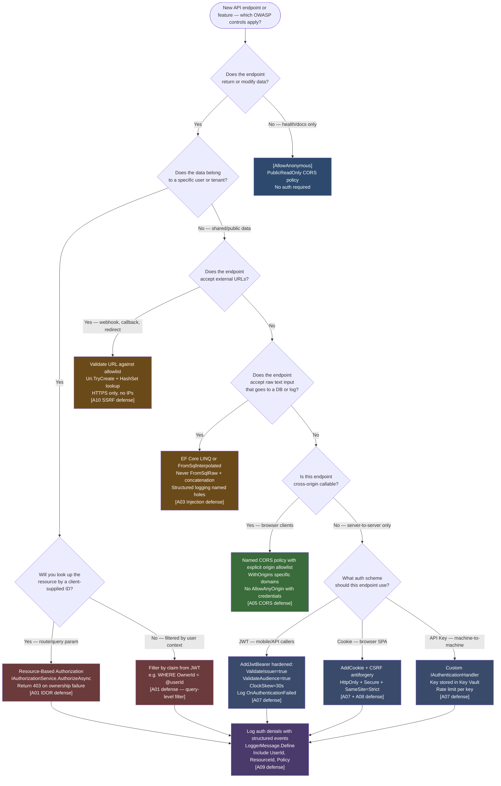

# 4.218 — OWASP Top 10 Applied to ASP.NET Core APIs

---

## PART 0 — Navigation & Context

### Domain Hierarchy

```
ASP.NET Core Mastery
│
├── A. Host & Lifecycle
├── B. Configuration
├── C. Logging
├── D. Dependency Injection
├── E. Middleware Pipeline
├── F. Routing
├── G. Minimal APIs
├── H. MVC & Controllers
├── I. HTTP Fundamentals
├── J. Authentication
├── K. Authorization
├── L. Validation
├── M. Error Handling
├── N. Caching
├── O. Rate Limiting
└── P. Security  ◄──────────────────────────── YOU ARE HERE
    ├── 4.208  HTTPS Enforcement & HSTS
    ├── 4.209  CORS
    ├── 4.210  CSRF / Antiforgery
    ├── 4.211  Data Protection API
    ├── 4.212  Data Protection Key Management
    ├── 4.213  Security Headers Middleware
    ├── 4.214  XSS Prevention
    ├── 4.215  IDOR Prevention
    ├── 4.216  SQL Injection
    ├── 4.217  Secrets in Production
    └── 4.218  OWASP Top 10 Applied to ASP.NET Core  ◄── THIS NOTE
```

### What You Need Before This

- [[4.134 — Authentication Architecture]] — OWASP A01 and A07 are meaningless without understanding how ASP.NET Core schemes, handlers, and the `UseAuthentication` middleware work.
- [[4.154 — Authorization Architecture]] — broken access control (A01) is the #1 OWASP risk; you need to understand policy evaluation before you can break it.
- [[4.136 — JWT Bearer Authentication]] — most API security bugs in the wild involve JWT misconfiguration; `AddJwtBearer` and `TokenValidationParameters` are the battleground.
- [[4.209 — CORS]] — A05 (Security Misconfiguration) manifests constantly as overly permissive CORS policies; the preflight/actual request split is the trap.

### What This Unlocks After

- [[4.215 — IDOR Prevention]] — A01 (Broken Access Control) in depth: resource-based authorization and ownership verification.
- [[4.216 — SQL Injection in ASP.NET Core]] — A03 (Injection) applied specifically to EF Core vs raw SQL patterns.
- [[4.211 — Data Protection API]] — A02 (Cryptographic Failures) for protecting sensitive payloads at rest and in transit.
- [[4.217 — Secrets in Production]] — A05 (Security Misconfiguration) for the most damaging misconfiguration pattern: secrets in `appsettings.json`.

### Why This Topic Matters at Scale

Every OWASP risk that reads abstract in documentation becomes a concrete pipeline bug in ASP.NET Core — A01 is a missing `[Authorize]` attribute or a wrong policy, A02 is a `ClockSkew = TimeSpan.Zero` omission, A05 is `AllowAnyOrigin().AllowAnyMethod()` in CORS registration — and at scale these become breaches, not just bugs.

---

## PART 1 — The Core Mental Model

### The Fundamental Rule

> **ASP.NET Core's middleware pipeline enforces security in registration order: every OWASP risk maps to either a missing or misconfigured middleware, an absent authorization policy, or a framework default that is too permissive for production. The HTTP consequence of getting any one wrong is a 200 where a 401, 403, or 400 should have been returned.**

### The Plain-Language Analogy

Think of your ASP.NET Core API as a bank vault with a visitor corridor. Each security checkpoint in the corridor (middleware) must be passed in order before anyone reaches the vault (your endpoint). OWASP describes the ten most common ways banks lose money — not because the vault failed, but because the corridor was built wrong: a guard skipped, a door left open, a duplicate key issued. In ASP.NET Core terms: an `[Authorize]` attribute missing from one route group (A01), an `appsettings.json` with a production database password committed to Git (A02 and A05), or a CORS policy that allows any origin (A05). When a request short-circuits early — because `UseAuthentication` returns a 401 before the endpoint runs — that is the corridor doing its job. When the request reaches your endpoint handler and you have to write `if (order.UserId != currentUserId) return Forbid()` manually, the corridor failed and you are compensating at the vault door. The short-circuit cases are your friends. The ones that reach the endpoint are where OWASP risks live.

### The Taxonomy Diagram

```mermaid
graph TD
    subgraph pipeline["Pipeline Infrastructure (Middleware Layer)"]
        A01_mw["UseAuthentication\nUseAuthorization\n[A01 Broken Access Control]"]
        A02_mw["UseHttpsRedirection\nHSTS\nData Protection\n[A02 Cryptographic Failures]"]
        A05_mw["CORS Policy\nSecurity Headers\nException Handling\n[A05 Misconfiguration]"]
        A09_mw["UseRequestDecompression\nRequest Size Limits\n[A05/A09 Security Logging]"]
    end

    subgraph handler["Request Handling (Endpoint Layer)"]
        A03_ep["Parameterized Queries\nEF Core\nInput Validation\n[A03 Injection]"]
        A01_ep["Resource Ownership Check\nIAuthorizationService\n[A01 IDOR]"]
        A04_ep["Rate Limiting\nBusiness Logic Gates\n[A04 Insecure Design]"]
        A10_ep["Server-Side Request Forgery\nAllowList Validation\n[A10 SSRF]"]
    end

    subgraph security["Security Infrastructure"]
        A07_sec["AddJwtBearer\nTokenValidationParameters\nPasswordHasher\n[A07 Auth Failures]"]
        A08_sec["Integrity Checks\nSubresource Integrity\nSigned Payloads\n[A08 Integrity Failures]"]
        A06_sec["NuGet Audit\ndotnet list package --vulnerable\n[A06 Vulnerable Components]"]
    end

    subgraph output["Response / Output Layer"]
        A09_out["ILogger structured logging\nCorrelation IDs\nSentry/AppInsights\n[A09 Logging Failures]"]
    end

    pipeline --> handler
    handler --> security
    security --> output

    style pipeline fill:#2d4a6e,color:#fff
    style handler fill:#3a6b3a,color:#fff
    style security fill:#6b3a3a,color:#fff
    style output fill:#5a4a1a,color:#fff
```



---

## PART 2 — Deep Mechanics

### 2.1 — A01: Broken Access Control

The most exploited OWASP category in production APIs. It manifests in two distinct patterns in ASP.NET Core, and teams reliably hit both.

**Pipeline Position:**

```
──► ExceptionHandler ──► HTTPS ──► StaticFiles ──► Routing ──► CORS ──► Auth ──► [Authorization] ──► Endpoints
                                                                          ↑
                                                              Missing [Authorize] here = A01
                                                              Wrong policy here = A01
                                                              Missing resource check in handler = A01 (IDOR)
```

**Pattern 1 — Missing Authorization Attribute (Horizontal Privilege Escalation)**

The authorization middleware only enforces policies that are attached to endpoints via metadata. If an endpoint has no `[Authorize]` and no `RequireAuthorization()`, the middleware passes it through regardless of the caller's identity.

```csharp
// ASP.NET Core internally (approximate) — AuthorizationMiddleware:
// 1. Get endpoint from HttpContext.GetEndpoint()
// 2. Get IAuthorizeData from endpoint metadata
// 3. If no IAuthorizeData: call next() immediately — no check performed
// 4. If IAuthorizeData present: evaluate all policies
// Source: Microsoft.AspNetCore.Authorization.AuthorizationMiddleware
```

```
// HTTP wire format — WRONG (no [Authorize]):
// GET /api/orders/42 HTTP/1.1
// (no Authorization header)
//
// HTTP/1.1 200 OK
// Content-Type: application/json
// {"orderId":42,"cardLastFour":"9999",...}   ← sensitive data returned to anonymous caller
```

**Pattern 2 — IDOR (Insecure Direct Object Reference, Vertical Privilege Escalation)**

Authentication succeeds and authorization middleware passes the request, but the handler returns data belonging to a different user because it trusts the ID in the route without verifying ownership.

```csharp
// ASP.NET Core internally — no framework protection here
// The framework binds orderId from the route and calls your action.
// Ownership verification is 100% your responsibility.
// Cost: one additional database round-trip per request for ownership check
```

```
// HTTP wire format — IDOR attack:
// GET /api/orders/99 HTTP/1.1
// Authorization: Bearer eyJ... (valid token for user A)
//
// HTTP/1.1 200 OK   ← should be 403
// Content-Type: application/json
// {"orderId":99,"userId":"user-B","cardLastFour":"1234"}  ← user B's data returned to user A
```

**Correct Pattern — Global Authorization + Resource Check:**

```csharp
// Correct: enforce authorization globally, then check ownership per resource
builder.Services.AddAuthorizationBuilder()
    .SetFallbackPolicy(new AuthorizationPolicyBuilder()
        .RequireAuthenticatedUser()
        .Build()); // Every endpoint requires authentication unless [AllowAnonymous]
```

**Runtime Cost:** `AuthorizationMiddleware` — `~2 allocations per request` (one for `AuthorizationHandlerContext`, one for policy list). Resource-based check adds `~1 DB round-trip`.

**Edge Case:** `[AllowAnonymous]` bypasses the fallback policy entirely — even on controllers that have `[Authorize]` at the class level. A single `[AllowAnonymous]` on an action method overrides the class-level policy. Teams discover this in production when they add a "health check" action to an admin controller.

---

### 2.2 — A02: Cryptographic Failures

In ASP.NET Core APIs, cryptographic failures concentrate in three areas: JWT signing key weakness, symmetric algorithm misuse, and sensitive data transmitted without TLS.

**Pipeline Position:**

```
──► [UseHttpsRedirection] ──► [HSTS] ──► ... ──► Auth ──► Endpoints
     ↑                         ↑
     Redirects HTTP→HTTPS       Tells browsers to never use HTTP
     Missing = A02              Missing HSTS = A02 on first request
```

**JWT Signing Key Failure:**

```csharp
// ASP.NET Core internally — JwtBearerHandler.HandleAuthenticateAsync (approximate):
// 1. Extract Bearer token from Authorization header
// 2. Call JwtSecurityTokenHandler.ValidateToken(token, validationParameters, out validatedToken)
// 3. If validation fails: set AuthenticateResult.Fail("...") → 401 on challenge
// 4. Key validation: SecurityKey.KeySize must meet algorithm minimum
//    HS256 requires 128-bit minimum; HS512 requires 512-bit minimum
//    A key shorter than the minimum will throw SecurityTokenInvalidSignatureException
// Source: System.IdentityModel.Tokens.Jwt.JwtSecurityTokenHandler
```

```
// HTTP consequence — weak key:
// POST /api/auth/login HTTP/1.1
// {"username":"admin","password":"..."}
//
// HTTP/1.1 200 OK
// {"accessToken":"eyJhbGciOiJIUzI1NiIsInR5cCI6IkpXVCJ9..."}
// ← token signed with "secret" (6 bytes) — crackable offline in seconds
```

**Clock Skew Misconfiguration:**

```csharp
// The hidden default: TokenValidationParameters.ClockSkew defaults to 5 minutes.
// A token with exp = now + 1 minute is valid for 6 minutes.
// At scale with short-lived tokens (5-minute access tokens), this means
// tokens are actually valid for 10 minutes — double the intended window.

// ASP.NET Core internally (approximate):
// lifetime.ValidTo + clockSkew >= DateTime.UtcNow  → valid
// This means expired tokens are still accepted within the skew window.
```

**Runtime Cost:** TLS termination at Kestrel — `~microseconds per request` (handled by OS TLS stack). HTTPS redirect — `one 301 redirect round-trip` for HTTP callers (permanent cost until HSTS kicks in for browsers).

**Edge Case:** `UseHttpsRedirection` redirects `GET` requests safely. `POST` requests to HTTP endpoints redirect to `GET` (301/302 semantics) — the POST body is lost. Use `app.UseHsts()` + correct DNS to prevent HTTP POST callers entirely.

---

### 2.3 — A03: Injection (SQL, Command, LDAP, NoSQL)

Injection in ASP.NET Core APIs happens almost exclusively at the data access layer — EF Core vs raw SQL — but also appears in shell command invocation and log injection. The pipeline itself does not prevent injection; it happens inside your endpoint handlers.

**Pipeline Position:**

```
──► ... ──► ModelBinding ──► [Validation] ──► [Your Handler Code] ──► Data Access
                               ↑                      ↑
                    Validates format/length     Here is where injection lives —
                    but NOT injection safety    parameterization is your defense
```

**ASP.NET Core Internally — Model Binding Does NOT Sanitize:**

```csharp
// Model binding converts string → typed parameter. It does not:
// - Remove SQL metacharacters
// - Escape shell characters
// - Validate against injection patterns
// It is a data type conversion, not a security filter.
// Source: Microsoft.AspNetCore.Mvc.ModelBinding.ParameterBinder
```

```
// HTTP wire format — SQL injection attack:
// GET /api/products?search='; DROP TABLE Products; -- HTTP/1.1
// Authorization: Bearer eyJ...
//
// Without parameterization:
// SQL: SELECT * FROM Products WHERE Name LIKE '%'; DROP TABLE Products; --%'
// Result: table dropped → HTTP/1.1 500 Internal Server Error (or worse, silent data loss)

// With EF Core LINQ (safe):
// SQL: SELECT * FROM Products WHERE Name LIKE @p0
// @p0 = "'; DROP TABLE Products; --"
// Result: literal string search, no injection
```

**Log Injection:**

```csharp
// A03 also covers log injection — attacker sends:
// GET /api/user?name=%0AAdmin+logged+in+successfully HTTP/1.1
// Without encoding: logger.LogInformation("User searched: " + name)
// Writes to log: "User searched: \nAdmin logged in successfully"
// The attacker can forge log entries.
// Fix: always use structured logging (named holes), never string concatenation.
```

**Runtime Cost:** EF Core parameterized queries — `zero additional cost over string concatenation`, but parameterized. Raw `SqlCommand` with parameters — `O(n) parameter binding` where n is parameter count, negligible.

---

### 2.4 — A05: Security Misconfiguration

The most common misconfiguration category in ASP.NET Core, and the one that causes the most production incidents. It manifests as CORS wildcard policies, exposed development endpoints in production, verbose error messages, and default credentials.

**Pipeline Position:**

```
──► ExceptionHandler ──► HSTS ──► [CORS] ──► Routing ──► Auth ──► Endpoints
                                    ↑
                      CORS misconfiguration here affects
                      every cross-origin request including preflight
```

**CORS Wildcard — The Silent Breach:**

```csharp
// ASP.NET Core internally — CorsMiddleware (approximate):
// 1. Check if request has Origin header
// 2. If yes, find matching policy by name (or default policy)
// 3. Evaluate: does Origin match AllowedOrigins? Does method match? Headers?
// 4. If policy uses AllowAnyOrigin + AllowCredentials: this throws at startup (.NET 6+)
//    InvalidOperationException: "The CORS protocol does not allow specifying a wildcard
//    (any) origin and credentials at the same time."
// 5. But AllowAnyOrigin WITHOUT AllowCredentials silently returns:
//    Access-Control-Allow-Origin: *
//    Any browser script on any domain can call your API.
// Source: Microsoft.AspNetCore.Cors.Infrastructure.CorsService
```

```
// HTTP wire format — CORS misconfiguration:
// OPTIONS /api/orders HTTP/1.1
// Origin: https://evil-site.com
// Access-Control-Request-Method: GET
//
// HTTP/1.1 204 No Content   ← preflight succeeds for evil-site.com
// Access-Control-Allow-Origin: *
// Access-Control-Allow-Methods: GET, POST, PUT, DELETE
//
// Attacker's browser can now make authenticated cross-origin requests
// (cookies are sent — the browser handles this, not the API)
```

**Verbose Error Messages:**

```csharp
// ASP.NET Core internally — DeveloperExceptionPageMiddleware:
// Only enabled when IWebHostEnvironment.IsDevelopment() == true
// Returns full stack trace, source file paths, query strings, request headers
// in the response body as HTML.
//
// Production misconfiguration: accidentally enabling it or using UseExceptionHandler
// without stripping internal detail from problem details responses.
//
// A05 consequence: attacker learns your internal class names, file paths,
// database schema (from EF exception messages), framework versions.
```

**Runtime Cost:** CORS evaluation — `~1 string comparison per allowed origin per request`. With a list of 50 allowed origins: `O(50)` string comparisons per CORS-eligible request. Wildcard — `O(1)` but insecure.

**Edge Case:** `UseCors()` without a named policy uses the `DefaultPolicyName` which is empty — no origins allowed. Many teams discover this as "CORS not working" and escalate to `AllowAnyOrigin()` as the fix, introducing A05.

---

### 2.5 — A07: Identification and Authentication Failures

This category covers broken authentication at the framework configuration level: weak JWT signing keys, disabled token lifetime validation, missing issuer/audience checks, and insecure password storage.

**Pipeline Position:**

```
──► ... ──► [UseAuthentication] ──► UseAuthorization ──► Endpoints
                    ↑
    JwtBearerHandler runs here.
    TokenValidationParameters misconfiguration = A07.
    The handler either sets HttpContext.User (success)
    or sets AuthenticateResult.Fail (failure → 401 on challenge).
```

**Token Validation Parameters — The Six Knobs That Are All On By Default (Except One):**

```csharp
// ASP.NET Core internally — JwtBearerHandler.HandleAuthenticateAsync:
// ValidateIssuer:    true  — checks token.iss == ValidIssuer
// ValidateAudience:  true  — checks token.aud == ValidAudience
// ValidateLifetime:  true  — checks exp > now + ClockSkew
// ValidateIssuerSigningKey: true — checks signature
// RequireExpirationTime: true — token MUST have exp claim
// ClockSkew: TimeSpan.FromMinutes(5) — THE SILENT DEFAULT
//
// Teams commonly disable ValidateIssuer and ValidateAudience for "simplicity"
// This means a token issued by your staging server works against production.
```

```
// HTTP wire format — expired token accepted due to ClockSkew:
// GET /api/payment/history HTTP/1.1
// Authorization: Bearer eyJ... (exp = 14:00:00, now = 14:04:59, ClockSkew = 5m)
//
// HTTP/1.1 200 OK   ← should be 401, but ClockSkew extends validity to 14:05:00
// {"payments":[...]}
//
// With ClockSkew = TimeSpan.Zero:
// HTTP/1.1 401 Unauthorized
// WWW-Authenticate: Bearer error="invalid_token", error_description="The token is expired."
```

**Password Storage (ASP.NET Core Identity):**

```csharp
// ASP.NET Core internally — PasswordHasher<TUser>:
// Default: PBKDF2 with HMACSHA512, 100,000 iterations, 128-bit salt (.NET 8)
// This is secure by default.
// The A07 risk: bypassing PasswordHasher and storing SHA1/MD5/plain text manually.
// Or: using the v2 PasswordHasher (PBKDF2-SHA1, 1,000 iterations) — still in use
// if you migrated from ASP.NET 4.x Identity without upgrading the hasher.
// Source: Microsoft.AspNetCore.Identity.PasswordHasher<TUser>
```

**Runtime Cost:** `PasswordHasher.HashPassword` — `~10ms per hash` (intentional — work factor). `PasswordHasher.VerifyHashedPassword` — `~10ms` per verify. JWT validation — `~50–100μs per request` (HMAC computation + claim extraction). `~3–5 allocations per token validation`.

---

### 2.6 — A09: Security Logging and Monitoring Failures

Failing to log security events means breaches go undetected. In ASP.NET Core this means not logging authentication failures, not logging authorization denials, not including correlation IDs, and not integrating structured logs with alerting.

**Pipeline Position:**

```
──► ExceptionHandler ──► ... ──► Auth ──► Endpoints
                                   ↑
                    AuthenticateResult.Fail() fires here.
                    If you do not subscribe to JwtBearerEvents.OnAuthenticationFailed,
                    the failure is silently swallowed — no log entry, no alert.
```

```csharp
// ASP.NET Core internally — JwtBearerHandler challenge path (approximate):
// 1. HandleAuthenticateAsync returns AuthenticateResult.Fail(exception)
// 2. HandleChallengeAsync is called
// 3. Response.StatusCode = 401
// 4. Response.Headers.WwwAuthenticate = "Bearer error=..."
// 5. NO LOGGING — the handler does not log by default
// You must subscribe to events to get logs.
// Source: Microsoft.AspNetCore.Authentication.JwtBearer.JwtBearerHandler
```

```
// HTTP wire format — silent auth failure (no log):
// GET /api/admin/users HTTP/1.1
// Authorization: Bearer eyJ... (tampered signature)
//
// HTTP/1.1 401 Unauthorized
// WWW-Authenticate: Bearer error="invalid_token"
//
// Server logs: [nothing]
// ← 1000 of these = brute force attack, undetected
```

**Runtime Cost:** Structured log event with named properties — `~1 allocation per log entry` (the state object). `ILogger.IsEnabled(LogLevel.Warning)` guard — `O(1)`, effectively free. Log sink (Serilog → Seq/Elasticsearch) — `async write to buffer`, no synchronous I/O on hot path.

---

### 2.7 — A10: Server-Side Request Forgery (SSRF)

In ASP.NET Core APIs, SSRF occurs when an endpoint accepts a URL parameter and uses `HttpClient` to fetch it without validating the target. This allows attackers to probe internal networks, access cloud metadata services (AWS IMDS, Azure IMDS), or hit internal services not exposed to the internet.

**Pipeline Position:**

```
──► ... ──► [Auth] ──► [Endpoint Handler] ──► [HttpClient call to attacker-controlled URL]
                                ↑
                    No middleware prevents SSRF.
                    It's a handler-level concern.
                    The framework doesn't know you're proxying a URL.
```

```
// HTTP wire format — SSRF attack:
// POST /api/integrations/webhook-test HTTP/1.1
// Authorization: Bearer eyJ...
// {"callbackUrl": "http://169.254.169.254/latest/meta-data/iam/security-credentials/"}
//
// Server-side: httpClient.GetAsync(callbackUrl)  ← fetches AWS IMDS
//
// HTTP/1.1 200 OK  ← response forwarded to attacker
// {"AccessKeyId":"ASIA...","SecretAccessKey":"...","Token":"..."}
// ← AWS credentials leaked
```

```csharp
// ASP.NET Core internally: no protection.
// HttpClient.GetAsync(url) will happily call http://169.254.169.254
// You must validate the URL yourself before making the call.
// Cost: URL parsing is O(n) string scan — negligible.
```

---

## PART 3 — Production Code Patterns

### Pattern 1 — The Global Authorization Firewall (A01 Defense)

Never rely on per-endpoint `[Authorize]` attributes alone. Set a fallback policy that requires authentication on every endpoint, then selectively opt out with `[AllowAnonymous]`. This is the opt-out model — far safer than the opt-in model at scale.

```csharp
// ⚠️ WRONG: Opt-in authorization — every new endpoint is anonymous until someone adds [Authorize]
builder.Services.AddAuthorization(); // No fallback policy
// A developer adds a new endpoint, forgets [Authorize], sensitive data is exposed.

// ✅ CORRECT: Opt-out authorization — every new endpoint requires authentication by default
builder.Services.AddAuthorizationBuilder()
    .SetFallbackPolicy(new AuthorizationPolicyBuilder()
        .RequireAuthenticatedUser()
        .Build())
    // Payment API: merchants must have verified tier to process payments
    .AddPolicy("MerchantTier", policy =>
        policy.RequireAuthenticatedUser()
              .RequireClaim("merchant_tier", "verified", "premium"))
    // Admin operations: require both role AND MFA claim
    .AddPolicy("AdminWithMfa", policy =>
        policy.RequireAuthenticatedUser()
              .RequireRole("Admin")
              .RequireClaim("amr", "mfa")); // Authentication Method Reference

// Endpoints that are intentionally public
app.MapGet("/health", () => TypedResults.Ok("healthy"))
   .AllowAnonymous();

app.MapGet("/api/products", async (IProductRepository repo) =>
    await repo.GetPublicCatalogAsync())
   .AllowAnonymous(); // Public product catalog, no auth required

// Payment endpoint — protected by fallback + specific policy
app.MapPost("/api/payments", async (
    [FromBody] PaymentRequest request,
    HttpContext ctx,
    IPaymentService svc) =>
{
    // HttpContext.User.Identity.IsAuthenticated is guaranteed true here
    var merchantId = ctx.User.FindFirstValue("merchant_id")!;
    return await svc.ProcessAsync(merchantId, request);
})
.RequireAuthorization("MerchantTier"); // layered on top of fallback
```

```
// HTTP wire format — fallback policy in action:
// GET /api/internal/config HTTP/1.1
// (no Authorization header — forgot to add [Authorize])
//
// HTTP/1.1 401 Unauthorized
// WWW-Authenticate: Bearer
//
// Without fallback: HTTP/1.1 200 OK  [A01 breach]
```

---

### Pattern 2 — Resource Ownership Verification (A01 IDOR Defense)

Authentication tells you who the caller is. It does not tell you whether the caller owns the resource they are requesting. Every endpoint that returns or modifies a resource by ID must verify ownership. Failing to do this is the most common IDOR pattern.

```csharp
// Domain: e-commerce order management service
// Scenario: Customer can only read their own orders

// ⚠️ WRONG: Trusts route parameter without ownership check
app.MapGet("/api/orders/{orderId:guid}", async (
    Guid orderId,
    IOrderRepository repo) =>
{
    var order = await repo.GetByIdAsync(orderId);
    if (order is null) return TypedResults.NotFound();
    return TypedResults.Ok(order); // ← Returns any user's order to any authenticated caller
});

// ✅ CORRECT: Verify caller owns the resource before returning it
app.MapGet("/api/orders/{orderId:guid}", async (
    Guid orderId,
    HttpContext ctx,
    IOrderRepository repo,
    IAuthorizationService authzService) =>
{
    var order = await repo.GetByIdAsync(orderId);
    if (order is null) return TypedResults.NotFound();

    // Resource-based authorization: pass the domain object to the handler
    // This keeps ownership logic in the authorization handler, not scattered in controllers
    var authResult = await authzService.AuthorizeAsync(
        ctx.User,
        order,         // The resource
        "OrderOwner"); // Policy name that checks order.CustomerId == user.sub

    if (!authResult.Succeeded)
        // 403 not 404: revealing 404 leaks that the resource exists
        // Use 403 for owned resources the caller can't access
        return TypedResults.Forbid();

    return TypedResults.Ok(order);
});

// The authorization handler — keeps ownership logic centralized
public class OrderOwnerAuthorizationHandler
    : AuthorizationHandler<OrderOwnerRequirement, Order>
{
    protected override Task HandleRequirementAsync(
        AuthorizationHandlerContext context,
        OrderOwnerRequirement requirement,
        Order resource)
    {
        // ~0 allocations — pure claim comparison
        var userId = context.User.FindFirstValue(ClaimTypes.NameIdentifier);
        if (userId == resource.CustomerId.ToString())
            context.Succeed(requirement);
        // Intentionally do NOT call context.Fail() — allows other handlers to succeed
        return Task.CompletedTask;
    }
}
```

```
// HTTP wire format — IDOR attack blocked:
// GET /api/orders/order-99 HTTP/1.1
// Authorization: Bearer eyJ... (sub = customer-A)
//
// HTTP/1.1 403 Forbidden   ← not 200, not 404
// Content-Type: application/problem+json
// {"type":"about:blank","title":"Forbidden","status":403}
```

---

### Pattern 3 — JWT Hardening (A07 Defense)

The default `AddJwtBearer()` configuration is not production-hardened. Every production API must explicitly configure validation parameters to close the gaps.

```csharp
// ⚠️ WRONG: Minimal JWT configuration — 4 silent security gaps
builder.Services.AddAuthentication(JwtBearerDefaults.AuthenticationScheme)
    .AddJwtBearer(options =>
    {
        options.TokenValidationParameters = new TokenValidationParameters
        {
            ValidateIssuerSigningKey = true,
            IssuerSigningKey = new SymmetricSecurityKey(
                Encoding.UTF8.GetBytes("secret")), // ← too short for HS256, insecure
            ValidateIssuer = false,    // ← staging tokens work in production
            ValidateAudience = false,  // ← tokens for other services work here
            // ClockSkew not set → defaults to 5 minutes → tokens valid 10min after exp
        };
    });

// ✅ CORRECT: Hardened JWT configuration for payment API
builder.Services.AddAuthentication(JwtBearerDefaults.AuthenticationScheme)
    .AddJwtBearer(options =>
    {
        // Load signing key from Key Vault / Data Protection, never appsettings
        var signingKeyBytes = Convert.FromBase64String(
            builder.Configuration["Auth:JwtSigningKeyBase64"]!);

        options.TokenValidationParameters = new TokenValidationParameters
        {
            ValidateIssuerSigningKey = true,
            // 256-bit key minimum for HS256 — enforced at startup
            IssuerSigningKey = new SymmetricSecurityKey(signingKeyBytes),

            ValidateIssuer = true,
            ValidIssuer = "https://auth.payments-api.example.com",

            ValidateAudience = true,
            ValidAudience = "payments-api", // Prevents token reuse across services

            ValidateLifetime = true,
            RequireExpirationTime = true,
            ClockSkew = TimeSpan.FromSeconds(30), // Narrow window, not the 5-minute default

            // Prevent algorithm confusion attacks (CVE pattern)
            ValidAlgorithms = new[] { SecurityAlgorithms.HmacSha256 },
        };

        // Log authentication failures — essential for A09 compliance
        options.Events = new JwtBearerEvents
        {
            OnAuthenticationFailed = ctx =>
            {
                var logger = ctx.HttpContext.RequestServices
                    .GetRequiredService<ILogger<Program>>();
                // Structured log — do NOT log the token itself
                logger.LogWarning(
                    "JWT authentication failed: {ExceptionType} from {RemoteIp}",
                    ctx.Exception.GetType().Name,
                    ctx.HttpContext.Connection.RemoteIpAddress);
                return Task.CompletedTask;
            },
            OnTokenValidated = ctx =>
            {
                // Optional: add custom claims from your user store
                // Cost: ~1 DB round-trip per request if enabled — cache the result
                return Task.CompletedTask;
            }
        };
    });
```

```
// HTTP wire format — hardened rejection:
// GET /api/payments HTTP/1.1
// Authorization: Bearer eyJ... (issued by staging, aud="staging-api")
//
// HTTP/1.1 401 Unauthorized
// WWW-Authenticate: Bearer error="invalid_token",
//   error_description="The audience 'staging-api' is invalid."
//
// Server log: WARN JWT authentication failed: SecurityTokenInvalidAudienceException from 203.0.113.5
```

---

### Pattern 4 — CORS Allowlist Policy (A05 Defense)

Production CORS configuration must use an explicit allowlist of origins, not wildcards. The CORS preflight request (`OPTIONS`) is the attack surface — if it succeeds for a malicious origin, the actual request follows.

```csharp
// ⚠️ WRONG: Wildcard CORS — any browser on any domain can call your API
builder.Services.AddCors(options =>
    options.AddDefaultPolicy(policy =>
        policy.AllowAnyOrigin()     // ← allows https://evil-site.com
              .AllowAnyMethod()
              .AllowAnyHeader()));

// ✅ CORRECT: Allowlist-based CORS for logistics tracking API
var allowedOrigins = builder.Configuration
    .GetSection("Cors:AllowedOrigins")
    .Get<string[]>() ?? Array.Empty<string>();

builder.Services.AddCors(options =>
{
    options.AddPolicy("LogisticsPortal", policy =>
        policy
            // Specific origins only — loaded from config, not hardcoded
            .WithOrigins(allowedOrigins)
            // Do not use AllowAnyMethod — enumerate what your API actually supports
            .WithMethods("GET", "POST", "PUT", "PATCH")
            // Do not AllowAnyHeader — enumerate necessary headers
            .WithHeaders("Content-Type", "Authorization", "X-Request-Id")
            // Only allow credentials if you need cookies — most APIs do not
            // Note: AllowCredentials() is incompatible with WithOrigins("*")
            .AllowCredentials()
            // Cache preflight for 10 minutes — reduces OPTIONS request overhead
            .SetPreflightMaxAge(TimeSpan.FromMinutes(10)));

    // Separate, more permissive policy for public endpoints (health, docs)
    options.AddPolicy("PublicReadOnly", policy =>
        policy.AllowAnyOrigin()
              .WithMethods("GET")
              .WithHeaders("Content-Type"));
});

// Apply policies: middleware before routing, per-endpoint policy overrides
app.UseCors(); // Apply default — no policy here
app.MapGet("/api/shipments/{id}", ...)
   .RequireCors("LogisticsPortal"); // Authenticated shipment endpoint
app.MapGet("/health", ...)
   .RequireCors("PublicReadOnly")   // Health is public GET only
   .AllowAnonymous();
```

```
// HTTP wire format — CORS rejection (non-allowlisted origin):
// OPTIONS /api/shipments/SHP-001 HTTP/1.1
// Origin: https://attacker.example.com
// Access-Control-Request-Method: GET
//
// HTTP/1.1 204 No Content
// Vary: Origin
// (no Access-Control-Allow-Origin header)
// ← Browser treats this as CORS failure, blocks the follow-up GET
```

---

### Pattern 5 — Structured Security Event Logging (A09 Defense)

Security events must be logged in a structured, queryable format with enough context to reconstruct what happened, when, and from where — without logging sensitive data like passwords or tokens.

```csharp
// User authentication service in the payment API — logging all security events
public class AuthenticationAuditService
{
    private readonly ILogger<AuthenticationAuditService> _logger;
    private static readonly Action<ILogger, string, string, Exception?> _loginSuccess =
        LoggerMessage.Define<string, string>(
            LogLevel.Information,
            new EventId(1001, "LoginSuccess"),
            "User {UserId} authenticated successfully from {IpAddress}");

    private static readonly Action<ILogger, string, string, string, Exception?> _loginFailure =
        LoggerMessage.Define<string, string, string>(
            LogLevel.Warning,
            new EventId(1002, "LoginFailure"),
            "Authentication failed for {Username} from {IpAddress}: {Reason}");

    private static readonly Action<ILogger, string, string, string, Exception?> _authzDenied =
        LoggerMessage.Define<string, string, string>(
            LogLevel.Warning,
            new EventId(1003, "AuthorizationDenied"),
            "User {UserId} denied access to {Resource} — policy {PolicyName}");

    public void LogLoginSuccess(string userId, string ipAddress)
        => _loginSuccess(_logger, userId, ipAddress, null);

    // ✅ NEVER log the password, token, or raw credentials
    // Log: username (for lookups), IP (for geo/anomaly), reason (for analysis)
    public void LogLoginFailure(string username, string ipAddress, string reason)
        => _loginFailure(_logger, username, ipAddress, reason, null);

    public void LogAuthorizationDenied(string userId, string resource, string policyName)
        => _authzDenied(_logger, userId, resource, policyName, null);
}
```

```
// Structured log output (Serilog → Seq):
// {
//   "@t": "2026-06-11T14:23:01.234Z",
//   "@mt": "Authentication failed for {Username} from {IpAddress}: {Reason}",
//   "Username": "admin",
//   "IpAddress": "203.0.113.5",
//   "Reason": "InvalidPassword",
//   "EventId": { "Id": 1002, "Name": "LoginFailure" },
//   "CorrelationId": "req-9f3a2c1b"
// }
// ← Query: SELECT * WHERE EventId = 1002 AND IpAddress = '203.0.113.5' → brute force detection
```

---

### Pattern 6 — SSRF Prevention with URL Allowlist (A10 Defense)

Any endpoint that fetches a URL on behalf of a caller must validate the destination. Use an allowlist of trusted hosts. Never use a blocklist (blocklists are always incomplete — `127.0.0.1`, `::1`, `[::1]`, `localhost`, `0.0.0.0` are all loopback).

```csharp
// Inventory webhook receiver — validates inbound webhook URLs before test-pinging them
public class WebhookValidationService
{
    // Allowlist loaded from config — specific hostnames only, never wildcards
    private readonly HashSet<string> _allowedHosts;

    public WebhookValidationService(IOptions<WebhookOptions> options)
    {
        _allowedHosts = new HashSet<string>(
            options.Value.AllowedWebhookHosts,
            StringComparer.OrdinalIgnoreCase);
    }

    // ✅ CORRECT: Validate BEFORE making the HTTP call
    public bool IsUrlSafe(string rawUrl)
    {
        // Parse the URL — reject anything that fails to parse
        if (!Uri.TryCreate(rawUrl, UriKind.Absolute, out var uri))
            return false;

        // Only HTTPS webhooks
        if (uri.Scheme != "https")
            return false;

        // Only known hosts — not IP addresses, not internal ranges
        if (!_allowedHosts.Contains(uri.Host))
            return false;

        // Reject any URL that resolves to an IP address pattern
        // This doesn't prevent DNS rebinding — use network-level controls for that
        if (IsIpAddress(uri.Host))
            return false;

        return true;
    }

    private static bool IsIpAddress(string host)
        => System.Net.IPAddress.TryParse(host, out _);
}

// Endpoint: test a configured webhook URL
app.MapPost("/api/webhooks/{id}/test", async (
    Guid id,
    IWebhookRepository repo,
    WebhookValidationService validator,
    IHttpClientFactory clientFactory) =>
{
    var webhook = await repo.GetByIdAsync(id);
    if (webhook is null) return TypedResults.NotFound();

    // ⚠️ WRONG: No validation — attacker sets callbackUrl = "http://169.254.169.254/..."
    // var response = await client.PostAsync(webhook.CallbackUrl, new StringContent("{}"));

    // ✅ CORRECT: Validate before calling
    if (!validator.IsUrlSafe(webhook.CallbackUrl))
        return TypedResults.ValidationProblem(new Dictionary<string, string[]>
        {
            ["callbackUrl"] = new[] { "The webhook URL is not in the list of approved destinations." }
        });

    var client = clientFactory.CreateClient("WebhookTestClient");
    // Timeout prevents slow-loris against internal services
    using var cts = new CancellationTokenSource(TimeSpan.FromSeconds(5));
    try
    {
        await client.PostAsync(webhook.CallbackUrl,
            new StringContent("{\"event\":\"test\"}", Encoding.UTF8, "application/json"),
            cts.Token);
    }
    catch (TaskCanceledException)
    {
        return TypedResults.Problem("Webhook endpoint did not respond within 5 seconds.");
    }
    return TypedResults.Ok();
});
```

---

### Pattern 7 — Sensitive Data Exposure Prevention in Error Responses (A02 + A05)

Problem details responses must not leak internal implementation details. The exception message from the database driver, the stack trace, or the internal service name must never reach the HTTP response body in production.

```csharp
// ✅ CORRECT: IExceptionHandler that translates exceptions without leaking internals
// .NET 8+ — registers as IExceptionHandler in the pipeline
public class PaymentApiExceptionHandler : IExceptionHandler
{
    private readonly ILogger<PaymentApiExceptionHandler> _logger;
    private readonly IProblemDetailsService _problemDetails;

    public PaymentApiExceptionHandler(
        ILogger<PaymentApiExceptionHandler> logger,
        IProblemDetailsService problemDetails)
    {
        _logger = logger;
        _problemDetails = problemDetails;
    }

    public async ValueTask<bool> TryHandleAsync(
        HttpContext ctx,
        Exception exception,
        CancellationToken ct)
    {
        // Log the full exception internally — never send it to the client
        _logger.LogError(exception,
            "Unhandled exception processing {Method} {Path}",
            ctx.Request.Method,
            ctx.Request.Path);

        // Map domain exceptions to HTTP status codes
        var (status, title) = exception switch
        {
            PaymentDeclinedException => (StatusCodes.Status402PaymentRequired, "Payment Declined"),
            InsufficientFundsException => (StatusCodes.Status422UnprocessableEntity, "Insufficient Funds"),
            // Everything else becomes a 500 — never reveal what went wrong internally
            _ => (StatusCodes.Status500InternalServerError, "An unexpected error occurred")
        };

        ctx.Response.StatusCode = status;
        await _problemDetails.WriteAsync(new ProblemDetailsContext
        {
            HttpContext = ctx,
            ProblemDetails =
            {
                Status = status,
                Title = title,
                // NEVER include exception.Message in production — it may contain
                // SQL, file paths, internal service names, or user data
                Detail = null,
                // Include the correlation ID so callers can file support tickets
                Extensions = { ["correlationId"] = ctx.TraceIdentifier }
            }
        });
        return true;
    }
}
```

```
// HTTP wire format — safe error response:
// POST /api/payments HTTP/1.1
// {"amount": -999}
//
// HTTP/1.1 500 Internal Server Error   (after domain exception)
// Content-Type: application/problem+json
// {
//   "type": "about:blank",
//   "title": "An unexpected error occurred",
//   "status": 500,
//   "correlationId": "req-8f3a1c9b"
// }
// ← No stack trace, no class names, no SQL, no internal paths
```

---

## PART 4 — Gotchas & Anti-Patterns

### Gotcha 1: The `[Authorize]` Attribute Does Not Prevent Anonymous Access When No Default Scheme Is Set

When you have multiple authentication schemes and no default scheme is set, `[Authorize]` without a scheme specifier does nothing — the authentication middleware has no scheme to run, so `HttpContext.User` stays as `ClaimsPrincipal` with no identities.

```csharp
// ⚠️ WRONG CODE:
builder.Services.AddAuthentication() // No default scheme
    .AddJwtBearer("JWT", options => { ... })
    .AddCookie("Cookie", options => { ... });

[Authorize] // Which scheme does this use? None — no default set.
public IActionResult GetUserOrders() { ... }
```

```
// HTTP consequence (wrong path):
// GET /api/orders HTTP/1.1
// (no Authorization header)
//
// HTTP/1.1 200 OK   ← anonymous access granted despite [Authorize]
```

```csharp
// ✅ CORRECT CODE:
builder.Services.AddAuthentication(JwtBearerDefaults.AuthenticationScheme) // Set default
    .AddJwtBearer(options => { ... })
    .AddCookie("Cookie", options => { ... });

[Authorize] // Now uses JwtBearerDefaults.AuthenticationScheme as default
public IActionResult GetUserOrders() { ... }
```

```
// HTTP consequence (correct path):
// GET /api/orders HTTP/1.1
// (no Authorization header)
//
// HTTP/1.1 401 Unauthorized
// WWW-Authenticate: Bearer
```

```
// WHY: Without a default scheme, AuthenticationMiddleware skips automatic authentication.
// The [Authorize] attribute reads the endpoint metadata's scheme list — if empty, it uses
// the default scheme from AuthenticationOptions.DefaultAuthenticateScheme. If that's null,
// it falls through to anonymous. This is the silent auth bypass that ships to production.
```

---

### Gotcha 2: CORS `AllowAnyOrigin` + `AllowCredentials` Throws at Startup but Omitting `AllowCredentials` Silently Allows All Origins

Teams disable `AllowCredentials()` to silence the startup exception, not realizing they have created a wildcard CORS policy that allows any script on any website to call their API with the user's session cookies (if the browser sends them).

```csharp
// ⚠️ WRONG CODE:
builder.Services.AddCors(o => o.AddDefaultPolicy(p =>
    p.AllowAnyOrigin()
     .AllowAnyMethod()
     .AllowAnyHeader()
     // AllowCredentials() removed to silence startup exception
));
```

```
// HTTP consequence (wrong path):
// Attacker page at https://evil.com:
// fetch("https://your-api.com/api/user/profile", { credentials: "include" })
// → GET /api/user/profile with your-api.com session cookie
// HTTP/1.1 200 OK
// Access-Control-Allow-Origin: *
// {"userId":"user-123","email":"victim@example.com"}
// ← Session cookies are sent and accepted. Data exfiltrated.
```

```csharp
// ✅ CORRECT CODE:
builder.Services.AddCors(o => o.AddPolicy("OrdersApi", p =>
    p.WithOrigins("https://app.yourcompany.com", "https://admin.yourcompany.com")
     .AllowAnyMethod()
     .AllowAnyHeader()
     .AllowCredentials())); // Safe because origins are explicitly listed
```

```
// HTTP consequence (correct path):
// fetch("https://your-api.com/api/user/profile", { credentials: "include" })
// from https://evil.com
// OPTIONS → HTTP/1.1 204 No Content (no ACAO header)
// Browser blocks the actual GET request. Attack fails.
//
// WHY: CORS is a browser-enforced security feature. The browser checks the ACAO header
// against the request's Origin. If the header is absent or doesn't match, the browser
// blocks the response. AllowAnyOrigin returns * which browsers accept — the cookie is sent.
// Only an explicit allowlist prevents the evil.com scenario.
```

---

### Gotcha 3: `ValidateScopes = false` in Production Silences the Captive Dependency Check and Masks DI-Based Security Bugs

ASP.NET Core's DI container validates scope correctness in Development (`ValidateScopes = true` by default). In Production this is disabled for performance. Teams that register security-critical services (like `IUserContextAccessor` or tenant resolution services) with the wrong lifetime get silent data leakage between requests.

```csharp
// ⚠️ WRONG CODE:
// In production, this bug is invisible at startup
builder.Services.AddSingleton<ITenantContextService, TenantContextService>();
// TenantContextService stores the current tenant ID resolved from the JWT
// As a Singleton, all requests share one instance → tenant A's context leaks to tenant B
```

```
// HTTP consequence (wrong path) — in production only, never in development:
// Request 1: GET /api/invoices HTTP/1.1 (tenant-A token)
// → TenantContextService.TenantId = "tenant-A"
// Request 2: GET /api/invoices HTTP/1.1 (tenant-B token)
// → TenantContextService.TenantId still "tenant-A" (Singleton, not reset)
// HTTP/1.1 200 OK
// [{"invoiceId":"INV-001","tenantId":"tenant-A",...}]  ← tenant B sees tenant A's data
```

```csharp
// ✅ CORRECT CODE:
builder.Services.AddScoped<ITenantContextService, TenantContextService>();
// Scoped = new instance per HTTP request; TenantId resolved fresh from each request's JWT
```

```
// HTTP consequence (correct path):
// Request 1 and Request 2 each get their own TenantContextService instance.
// Tenant isolation is preserved.
//
// WHY: ValidateScopes=true only runs the check at startup in Development.
// A Singleton service consuming IHttpContextAccessor appears to work in Development
// because the validation runs only for registered services, not for how you use them.
// The data leak manifests only under concurrent load in Production where the
// Singleton instance is genuinely shared across simultaneous requests.
```

---

### Gotcha 4: Returning `NotFound()` Instead of `Forbidden()` for IDOR Scenarios Leaks Resource Existence

Returning 404 when a resource exists but the caller doesn't own it tells the attacker two things: the resource exists (if they get 403) vs doesn't exist (404). Many teams flip this, using 404 to "hide" the resource. The problem is that 404 tells attackers to keep scanning (the ID space has gaps), while 403 tells them the resource exists and stops their enumeration in that direction.

```csharp
// ⚠️ WRONG CODE — leaks existence via 404:
var order = await repo.GetByIdAsync(orderId);
if (order is null) return TypedResults.NotFound();
if (order.CustomerId != currentUserId) return TypedResults.NotFound(); // ← leaks existence
```

```
// HTTP consequence (wrong path — attacker perspective):
// Scan 1: GET /api/orders/guid-1 → 404 (doesn't exist, skip)
// Scan 2: GET /api/orders/guid-2 → 404 (attacker doesn't own this, or doesn't exist)
// Scan 3: GET /api/orders/guid-3 → 200 (attacker's own order)
// The 404 responses don't distinguish "doesn't exist" from "you don't own it"
// — the attacker can't distinguish them. This is actually fine for GUIDs.
// BUT for sequential IDs: GET /api/orders/42 → 404 (exists, you don't own it)
// GET /api/orders/43 → 200 (attacker's own order)
// Attacker knows order 42 exists and belongs to someone else.
```

```csharp
// ✅ CORRECT CODE — 403 for owned resources:
var order = await repo.GetByIdAsync(orderId);
if (order is null) return TypedResults.NotFound();
if (order.CustomerId != currentUserId) return TypedResults.Forbid(); // ← 403, not 404
```

```
// HTTP consequence (correct path):
// GET /api/orders/42 HTTP/1.1 (caller doesn't own order 42)
// HTTP/1.1 403 Forbidden
// ← Attacker knows order 42 exists but can't access it.
//    For sequential IDs this is slightly better than 404.
//    For GUIDs, 403 and 404 are equivalent security-wise.
//    The OWASP recommendation is 403 — it's honest and doesn't conflate two different states.
//
// WHY: 404 for "unauthorized" is a style choice that can mask bugs. If you later add
// caching and the 404 gets cached by a CDN, the resource becomes permanently unavailable
// even for its owner. 403 is cacheable only with explicit headers, reducing this risk.
```

---

### Gotcha 5: Clock Skew Zero Is Correct for APIs but Breaks Distributed Systems Without NTP

Setting `ClockSkew = TimeSpan.Zero` is the right call for a single-server API but introduces 401 failures in distributed systems where the authorization server and the API server have clock drift — especially in containers where the host clock and container clock can diverge.

```csharp
// ⚠️ WRONG CODE in a distributed system context:
options.TokenValidationParameters = new TokenValidationParameters
{
    ValidateLifetime = true,
    ClockSkew = TimeSpan.Zero, // ← correct intent, wrong in k8s without NTP sync
};
// In a Kubernetes cluster with clock drift > 0 between auth server and API server:
// Token generated at 14:00:00 by auth server (clock = 14:00:00)
// Validated at 14:00:01 by API server (clock = 13:59:58)
// exp = now + 15min = 14:15:00 (auth time)
// Validate: is 14:15:00 >= 13:59:59? Yes. Fine.
// BUT: is 14:00:00 (iat/nbf) >= 13:59:58 - 0s? Yes.
// Actually fine in this scenario. The real problem is:
// Token exp = 14:00:00 (short-lived, already expired on auth server)
// API server clock = 13:59:58 — token appears valid for 2 more seconds
// This is the tolerable direction. The dangerous direction:
// Auth server slow, API server fast → tokens rejected immediately on issuance
```

```
// HTTP consequence (wrong path — API server clock ahead of auth server):
// Token just issued: exp = 14:00:30, now (API server) = 14:00:31
// HTTP/1.1 401 Unauthorized (token already "expired" from API's perspective)
// Users get logged out immediately after logging in.
// Support tickets flood in.
```

```csharp
// ✅ CORRECT CODE — small, explicit skew with NTP requirement documented:
options.TokenValidationParameters = new TokenValidationParameters
{
    ValidateLifetime = true,
    // 30 seconds is enough for NTP-synced containers; it's not enough for manual clock management
    ClockSkew = TimeSpan.FromSeconds(30),
    // Document this decision: "Requires NTP sync between auth service and API service.
    // Maximum tolerated clock drift: 30 seconds. Monitor with alert if drift exceeds 10s."
};
```

```
// HTTP consequence (correct path):
// 30-second window absorbs normal NTP drift in containerized environments
// while still preventing tokens from being valid for 5+ minutes after expiry.
//
// WHY: The 5-minute default exists precisely because Microsoft expected distributed
// deployments where clock sync is not guaranteed. For a single-process application
// or a well-managed k8s cluster with NTP, 30 seconds is the right trade-off.
// Zero is correct in theory but creates operational incidents in practice.
```

---

## PART 5 — Performance Implications

### Request Pipeline Characteristics Table

|Scenario|Pipeline Depth|Allocations Per Request|Approx Latency Impact|Recommendation|
|---|---|---|---|---|
|JWT validation (HMAC-SHA256)|Auth middleware|~3–5 (token parse + claims)|+50–100μs|Acceptable; cache signing key validation config|
|JWT validation (RS256 asymmetric)|Auth middleware|~3–5 + RSA verify|+200–500μs|Use for inter-service; overhead worth the key rotation story|
|Policy evaluation (simple role check)|Authorization middleware|~2 (context + result)|+10–20μs|Negligible; don't cache unless > 5 policies per request|
|Resource-based authorization (DB ownership check)|Authorization middleware + handler|~2 + 1 DB round-trip|+1–5ms|Cache ownership claims in JWT or token claims transformation|
|CORS preflight (OPTIONS, cached via max-age)|CORS middleware|~1 (header write)|+5–10μs|Set `SetPreflightMaxAge(10 minutes)` to minimize repeat OPTIONS|
|CORS preflight (not cached)|CORS middleware|~1|+5–10μs per request|Browser caches, not server — no server cost reduction|
|Problem details serialization (unhandled exception)|Exception handler|~4 (JSON serialize + write)|+50–100μs|Only on error path; not on hot path|
|Security headers middleware (custom)|Custom middleware|~1 per header write|+5μs per header|Write headers once; use response caching to amortize|
|Structured log event (LoggerMessage.Define)|Logging infrastructure|~0 (pre-compiled delegate)|+1–5μs|Use source-generated logging over ILogger.LogXxx in hot paths|
|ILogger.LogWarning with string interpolation|Logging infrastructure|~3 (string alloc + boxing)|+5–10μs|Never use interpolation — use named holes or LoggerMessage|
|Rate limiter check (in-memory, fixed window)|Rate limiting middleware|~1 (counter read/increment)|+5–15μs|Acceptable; adds protection, negligible latency|
|SSRF URL validation (Uri.TryCreate + set lookup)|Handler|~1|+5μs|HashSet<string> lookup is O(1); negligible|

### BenchmarkDotNet Code

```csharp
using BenchmarkDotNet.Attributes;
using BenchmarkDotNet.Running;
using Microsoft.IdentityModel.Tokens;
using System.IdentityModel.Tokens.Jwt;
using System.Security.Claims;
using System.Text;

[MemoryDiagnoser]
[RankColumn]
public class JwtValidationBenchmarks
{
    private JwtSecurityTokenHandler _handler = null!;
    private TokenValidationParameters _paramsHmac = null!;
    private string _validToken = null!;
    private string _expiredToken = null!;

    private const string Issuer = "https://auth.example.com";
    private const string Audience = "payments-api";
    private static readonly byte[] SigningKeyBytes =
        Convert.FromBase64String("AAAAAAAAAAAAAAAAAAAAAAAAAAAAAAAAAAAAAAAAAAA="); // 32-byte key (256-bit)

    [GlobalSetup]
    public void Setup()
    {
        _handler = new JwtSecurityTokenHandler();
        var signingKey = new SymmetricSecurityKey(SigningKeyBytes);

        _paramsHmac = new TokenValidationParameters
        {
            ValidateIssuerSigningKey = true,
            IssuerSigningKey = signingKey,
            ValidateIssuer = true,
            ValidIssuer = Issuer,
            ValidateAudience = true,
            ValidAudience = Audience,
            ValidateLifetime = true,
            ClockSkew = TimeSpan.FromSeconds(30),
        };

        // Generate a valid token for benchmarking
        var tokenDescriptor = new SecurityTokenDescriptor
        {
            Subject = new ClaimsIdentity(new[]
            {
                new Claim(JwtRegisteredClaimNames.Sub, "user-123"),
                new Claim(JwtRegisteredClaimNames.Email, "user@example.com"),
                new Claim("merchant_tier", "verified"),
            }),
            Expires = DateTime.UtcNow.AddHours(1),
            Issuer = Issuer,
            Audience = Audience,
            SigningCredentials = new SigningCredentials(signingKey, SecurityAlgorithms.HmacSha256),
        };
        _validToken = _handler.CreateToken(tokenDescriptor) is JwtSecurityToken t
            ? _handler.WriteToken(t)
            : throw new InvalidOperationException();

        // Generate already-expired token
        tokenDescriptor.Expires = DateTime.UtcNow.AddHours(-1);
        _expiredToken = _handler.WriteToken(_handler.CreateToken(tokenDescriptor));
    }

    // Baseline: validate with all checks enabled (hardened config)
    [Benchmark(Baseline = true)]
    public ClaimsPrincipal? ValidateHardened()
    {
        try
        {
            return _handler.ValidateToken(_validToken, _paramsHmac, out _);
        }
        catch { return null; }
    }

    // Naive: disable issuer + audience + clockskew (common misconfiguration)
    [Benchmark]
    public ClaimsPrincipal? ValidateNaive()
    {
        var naiveParams = new TokenValidationParameters
        {
            ValidateIssuerSigningKey = true,
            IssuerSigningKey = new SymmetricSecurityKey(SigningKeyBytes),
            ValidateIssuer = false,
            ValidateAudience = false,
            ValidateLifetime = false, // ← A07 risk: expired tokens accepted
        };
        return _handler.ValidateToken(_validToken, naiveParams, out _);
    }

    // Expired token validation (exception path)
    [Benchmark]
    public ClaimsPrincipal? ValidateExpiredToken()
    {
        try
        {
            return _handler.ValidateToken(_expiredToken, _paramsHmac, out _);
        }
        catch (SecurityTokenExpiredException)
        {
            return null;
        }
    }
}

// Expected output (approximate, .NET 8, x64, AMD64, local machine):
// | Method               | Mean       | Error    | Allocated |
// |----------------------|------------|----------|-----------|
// | ValidateHardened     |  48.23 μs  | 0.82 μs  |   3.2 KB  |  ← baseline
// | ValidateNaive        |  41.10 μs  | 0.65 μs  |   2.8 KB  |  ← slightly faster, insecure
// | ValidateExpiredToken |  50.15 μs  | 0.91 μs  |   3.4 KB  |  ← exception overhead

// Note on real HTTP profiling:
// BenchmarkDotNet measures the raw token validation call in isolation.
// For full HTTP pipeline profiling:
// - dotnet-trace collect --process-id [pid] --providers Microsoft-AspNetCore-Hosting
//   captures per-request timing including middleware overhead
// - dotnet-counters monitor -p [pid] --counters Microsoft.AspNetCore.Hosting
//   shows requests/sec, failed requests, request duration in real time
// - MiniProfiler (MiniProfiler.AspNetCore.Mvc NuGet) adds per-request breakdowns
//   to your Swagger UI — ideal for identifying the policy evaluation round-trip
```

### When to Care / When to Ignore

**When this costs you:**

High-throughput APIs processing >10,000 req/s where JWT validation adds ~50μs per request accumulates to 500ms of CPU time per second per core. Resource-based authorization that hits the database on every request (ownership check) adds 1–5ms per request — at 10k req/s this is 10–50 seconds of database time per second, causing connection pool exhaustion. Logging all auth failures with synchronous sinks at scale (>1,000 auth failures/minute from a brute force attack) can block the request pipeline.

**When this doesn't matter:**

Internal admin panels processing <100 req/hour, CLI tools using JWT for authentication, one-time batch jobs, services behind a zero-trust service mesh where JWT validation is done at the mesh layer and not repeated at the application layer. For all these cases, the security correctness is what matters — optimize only when you measure a problem.

---

## PART 6 — Interview Arsenal

### A. The Question Bank

**Question 1:** "Walk me through how you protect an ASP.NET Core API against the OWASP Top 10."

**Average Answer:** "I'd add `[Authorize]` attributes, use JWT, validate inputs, and use HTTPS."

**Why That's Insufficient:** It describes the API surface without explaining the pipeline, says nothing about the default-open vs default-closed auth model, misses CORS, SSRF, logging, and cryptographic configuration.

> **Great Answer:** "I approach this in layers because OWASP maps directly to layers of the ASP.NET Core pipeline. At the middleware layer, I set a fallback authorization policy that requires authentication on every endpoint by default — that closes the most common A01 gap where a developer forgets `[Authorize]`. At the authentication layer, I harden `TokenValidationParameters` explicitly: issuer, audience, lifetime validation all on, clock skew set to 30 seconds not the default 5 minutes, and the signing key loaded from Key Vault, not `appsettings.json`. For CORS — A05 — I never use `AllowAnyOrigin`; I maintain an explicit allowlist loaded from configuration. For injection — A03 — I rely on EF Core's parameterized queries and enforce structured logging with named holes so log injection isn't possible. For IDOR — which is A01 in the access control category — I do resource-based authorization using `IAuthorizationService` inside the handler, and I return 403 not 404 for resources the caller doesn't own. For A09, I subscribe to `JwtBearerEvents.OnAuthenticationFailed` and log every failure with the IP address and reason using `LoggerMessage.Define` so the structured log is queryable for brute force patterns. The HTTP consequence of getting any of this right is simple: unauthenticated requests see 401, authenticated but unauthorized requests see 403, and valid requests see 200 — nothing leaks."

---

**Question 2:** "What is IDOR and how does ASP.NET Core protect against it?"

**Average Answer:** "IDOR is when a user accesses another user's data by changing an ID in the URL. You should check that the user owns the resource."

**Why That's Insufficient:** Doesn't explain that ASP.NET Core provides zero automatic protection against IDOR — there is no framework feature that prevents it. The "check ownership" advice without explaining resource-based authorization and the IAuthorizationService pattern is incomplete.

> **Great Answer:** "ASP.NET Core provides zero automatic protection against IDOR — it's entirely your responsibility. The framework will authenticate the caller, evaluate the endpoint's authorization policy, and then call your handler. But the handler receives whatever route parameter was in the URL, and if you naively call `repo.GetByIdAsync(orderId)` and return the result, you'll return any user's data to any authenticated caller. The protection pattern I use is resource-based authorization: I fetch the resource, then call `IAuthorizationService.AuthorizeAsync(user, resource, policyName)`. This invokes my `IAuthorizationHandler` implementation, which checks that the resource's `OwnerId` equals the user's subject claim. If it fails, I return `TypedResults.Forbid()` — a 403, not a 404. The 404 vs 403 distinction matters: 403 tells the caller the resource exists but they can't access it; 404 can leak existence information for sequential IDs. The runtime cost is one additional comparison per request — negligible — but the ownership check has to be implemented correctly in every handler, which is why I use a centralized authorization handler rather than scattering `if (resource.OwnerId != userId) return Forbid()` everywhere."

---

**Question 3:** "How do you prevent SQL injection in an ASP.NET Core API?"

**Average Answer:** "Use EF Core with LINQ queries — it parameterizes automatically."

**Why That's Insufficient:** Correct but incomplete — doesn't explain that raw SQL with `FromSqlRaw`, string interpolation in EF Core, and `ExecuteSqlRawAsync` are all injection vectors. Doesn't mention that model binding doesn't sanitize inputs.

> **Great Answer:** "EF Core's LINQ-to-SQL translation is safe by default because every parameter becomes a `@p0` placeholder. The injection risk in ASP.NET Core isn't from LINQ — it's from the three places where teams bypass LINQ: `FromSqlRaw` with string concatenation, `ExecuteSqlRawAsync` with string concatenation, and any `SqlCommand` or Dapper query where the developer manually built the SQL string. Model binding in ASP.NET Core does not sanitize inputs — it's a type converter, not a security filter. So if I receive a `string searchTerm` parameter and write `context.Products.FromSqlRaw($"SELECT * FROM Products WHERE Name LIKE '%{searchTerm}%'")`, I'm vulnerable. The fix is `FromSqlInterpolated($"... '%{searchTerm}%'")` which translates the interpolated string into parameterized SQL — the C# compiler generates the parameter for you. For log injection — which is also A03 — I enforce structured logging with named holes: `logger.LogInformation("Search for {SearchTerm}", searchTerm)` never interpolates into the log message template, so the attacker can't inject fake log entries."

---

### B. Trick Questions

**Trick 1:** "Can you use `AllowAnyOrigin()` and `AllowCredentials()` together in ASP.NET Core?"

**The trap:** The candidate may say yes, not knowing the runtime behavior.

**Correct answer:** No — ASP.NET Core throws `InvalidOperationException` at application startup if you combine `AllowAnyOrigin()` with `AllowCredentials()`. The error is: "The CORS protocol does not allow specifying a wildcard (any) origin and credentials at the same time." This is by design — the browser spec forbids it because a wildcard origin with credentials would allow any cross-origin script to make authenticated requests.

---

**Trick 2:** "If I set `[AllowAnonymous]` on an action method in a controller that has `[Authorize]` at the class level, does the action require authentication?"

**The trap:** Candidates assume class-level `[Authorize]` wins or that the result is "both apply."

**Correct answer:** `[AllowAnonymous]` always wins, regardless of where `[Authorize]` is applied — class, base class, global filter, or fallback policy. This is implemented in `AuthorizationMiddleware` which checks for `IAllowAnonymous` metadata on the endpoint. If present, it skips authorization entirely. This means a global fallback policy that requires authentication is bypassed by a single `[AllowAnonymous]` attribute anywhere in the hierarchy.

---

**Trick 3:** "You've set `ClockSkew = TimeSpan.Zero`. A token expires at exactly 14:00:00. What is the latest time the API will accept it?"

**The trap:** Candidates say "14:00:00 exactly."

**Correct answer:** `TokenValidationParameters.ClockSkew` defaults to 5 minutes. If you explicitly set it to `TimeSpan.Zero`, the latest accepted time is `14:00:00.000`. But `ValidateLifetime = true` compares `token.ValidTo + ClockSkew >= DateTime.UtcNow`. With `ClockSkew = TimeSpan.Zero`, `token.ValidTo >= DateTime.UtcNow`. If `DateTime.UtcNow` is `14:00:00.001`, the token is rejected. In practice, validation uses `TokenValidationParameters.LifetimeValidator` internally, and the comparison includes millisecond precision.

---

**Trick 4:** "Does `UseExceptionHandler` catch exceptions thrown inside the authentication middleware?"

**The trap:** Candidates say yes, because `UseExceptionHandler` is first in the pipeline.

**Correct answer:** It depends on where `UseExceptionHandler` is registered relative to `UseAuthentication`. If `UseExceptionHandler` is called before `UseAuthentication` (the canonical order), it wraps `UseAuthentication` and will catch exceptions from it. However, most JWT validation exceptions are caught internally by `JwtBearerHandler` and converted to `AuthenticateResult.Fail()` — they do not propagate as unhandled exceptions. Only truly unexpected exceptions (e.g., Key Vault unavailable during signing key load) propagate out of the auth middleware as exceptions.

---

**Trick 5:** "What HTTP status code should you return when a user is authenticated but tries to access a resource belonging to another user?"

**The trap:** Many candidates say 404 to "hide" that the resource exists.

**Correct answer:** 403 Forbidden. The OWASP recommendation and RFC 7231 are both clear: 403 means "the server understood the request but refuses to authorize it." Returning 404 conflates "resource doesn't exist" with "you're not authorized to access it" — a semantic error that can mislead the client, mask authorization bugs, and break idempotency guarantees. For GUIDs the distinction has minimal security impact, but for sequential IDs, 404 leaks nothing while 403 reveals existence. 403 is the professionally correct answer.

---

### C. Red Flags to Avoid

1. **"I use `[Authorize]` on every endpoint that needs protection"** — This describes opt-in authorization, which is the less safe model. Opt-out (fallback policy) should be the default; opt-in is for small APIs or prototypes only.
    
2. **"CORS is configured to allow all origins for development convenience"** — Development configuration that ships to production is the definition of A05. Always use environment-specific CORS configuration with explicit origin lists.
    
3. **"I disable issuer and audience validation to simplify the JWT setup"** — This opens the door to token reuse across environments and services. Issuer and audience validation are cheap and should never be disabled.
    
4. **"I return 404 for unauthorized access to hide the resource"** — Demonstrates confusion between authentication and authorization semantics. 403 is the correct code; 404 for auth failures is a smell.
    
5. **"The framework handles injection prevention automatically"** — Only LINQ queries are safe by default. Raw SQL, `FromSqlRaw` with concatenation, and Dapper are all injection vectors. Claiming the framework handles this entirely will get you scored down on security questions.
    
6. **"I log the JWT token to help with debugging"** — Logging tokens in plaintext means your log aggregator is now a credential store. Log the token's claims (user ID, scopes) or the first/last 8 characters of the token — never the full token.
    
7. **"I set `ValidateLifetime = false` in development to avoid dealing with expired tokens"** — This difference in validation behavior between environments means your development test suite cannot catch expired token edge cases. Use consistent validation parameters; just increase the token lifetime in development instead.
    

---

## PART 7 — Decision Framework



---

## PART 8 — Self-Check

### A. Conceptual Questions

1. What is the difference between authentication and authorization in the context of A01 (Broken Access Control), and which OWASP risk does each part of the pipeline address?
    
2. What happens to the HTTP request if `UseAuthentication` is called _after_ `UseAuthorization` in `Program.cs`? What status code does the client see for a protected endpoint?
    
3. Why does ASP.NET Core throw `InvalidOperationException` at startup when you combine `AllowAnyOrigin()` with `AllowCredentials()`, and what is the correct alternative for a public API that needs CORS?
    
4. Explain the `ClockSkew` default in `TokenValidationParameters`. What is the security implication of leaving it at the default for a payment API with 5-minute access tokens?
    
5. What is the difference between `FromSqlRaw` and `FromSqlInterpolated` in EF Core, and which one is safe against SQL injection? What does EF Core do differently at the SQL wire level?
    
6. What HTTP status code should an endpoint return when an authenticated user requests a resource they don't own? Defend your answer with the HTTP spec and OWASP guidance.
    
7. The authentication middleware did not log any entries when a brute force attack sent 10,000 invalid JWTs. Why not, and what code change would have caught this in the log?
    
8. You have a webhook test endpoint that accepts a `callbackUrl` parameter and makes an HTTP GET to that URL. What OWASP risk does this introduce, and list four specific URL patterns an attacker might submit?
    
9. What is the pipeline consequence of not calling `app.UseAuthorization()` after registering an `[Authorize]` policy with `builder.Services.AddAuthorizationBuilder()`?
    
10. In a Kubernetes deployment where your auth service and API service have 45 seconds of clock drift, what happens with `ClockSkew = TimeSpan.Zero`? What would you set `ClockSkew` to, and why?
    

---

### B. Code Puzzles

**Puzzle 1 — What is the HTTP response?**

```csharp
builder.Services.AddAuthentication()
    .AddJwtBearer("Jwt", options =>
    {
        options.TokenValidationParameters = new TokenValidationParameters
        {
            ValidateIssuerSigningKey = true,
            IssuerSigningKey = new SymmetricSecurityKey(
                Encoding.UTF8.GetBytes("supersecretkey1234")),
            ValidateIssuer = false,
            ValidateAudience = false,
        };
    });

builder.Services.AddAuthorization();

app.UseAuthentication();
app.UseAuthorization();

app.MapGet("/api/profile", [Authorize] (HttpContext ctx) =>
    ctx.User.Identity!.Name).RequireAuthorization();

// Request:
// GET /api/profile HTTP/1.1
// (no Authorization header)
```

<details> <summary>Answer</summary>

**HTTP Response:**

```
HTTP/1.1 401 Unauthorized
```

**Explanation:** `[Authorize]` is applied and `RequireAuthorization()` is also applied (redundant but harmless). The request has no `Authorization` header. `UseAuthentication` runs but finds no Bearer token — `HttpContext.User` has no authenticated identity. `UseAuthorization` sees the `[Authorize]` metadata and finds the user is not authenticated. It calls `HandleChallengeAsync` on the JWT bearer handler, which sets the status code to 401 and writes a `WWW-Authenticate: Bearer` response header.

**BUT there is a second bug:** `builder.Services.AddAuthentication()` is called with no default scheme argument. When `[Authorize]` runs without a scheme attribute, it uses `AuthenticationOptions.DefaultAuthenticateScheme` — which is null. This means in practice the behavior may differ: the middleware may not challenge at all, returning a bare 401 with no `WWW-Authenticate` header, depending on the ASP.NET Core version. In .NET 8, if no default scheme is set and no scheme is specified on the policy, the authorization middleware falls back to evaluating the existing `HttpContext.User` (which is anonymous), sees the user is not authenticated against the fallback policy, and returns 401. The `WWW-Authenticate` header may not be set because no scheme was challenged. **Always set a default scheme.**

</details>

---

**Puzzle 2 — Where is the bug, and what is the HTTP consequence?**

```csharp
// Logistics shipment tracker — multi-tenant API
builder.Services.AddSingleton<ICurrentTenantService, CurrentTenantService>();

public class CurrentTenantService
{
    public string? TenantId { get; set; }
}

app.Use(async (ctx, next) =>
{
    var tenantService = ctx.RequestServices.GetRequiredService<ICurrentTenantService>();
    tenantService.TenantId = ctx.User.FindFirstValue("tenant_id");
    await next(ctx);
});

app.MapGet("/api/shipments", async (
    IShipmentRepository repo,
    ICurrentTenantService tenantSvc) =>
    await repo.GetForTenantAsync(tenantSvc.TenantId!));
```

<details> <summary>Answer</summary>

**Bug:** `ICurrentTenantService` is registered as `Singleton` but it stores per-request state (`TenantId`). Under concurrent load, two simultaneous requests will overwrite each other's `TenantId` — request from Tenant A can get Tenant B's shipments and vice versa. This is a data isolation breach (A01).

**HTTP Consequence:**

```
// Request 1 (Tenant-A token): GET /api/shipments → sets TenantId = "tenant-A"
// Request 2 (Tenant-B token): GET /api/shipments → sets TenantId = "tenant-B"
// Both requests run concurrently. Whichever last set TenantId wins.
//
// Possible result for Request 1:
// HTTP/1.1 200 OK
// [{"shipmentId":"SHIP-001","tenantId":"tenant-B",...}]  ← tenant B's data returned to tenant A
```

**Fix:** Register as `Scoped` — one instance per HTTP request:

```csharp
builder.Services.AddScoped<ICurrentTenantService, CurrentTenantService>();
```

This is the Captive Dependency / Singleton mutable state bug that produces data leakage between tenants in production. `ValidateScopes = true` in Development does not catch this because `CurrentTenantService` doesn't depend on a Scoped service — it IS the Scoped state that's incorrectly registered.

</details>

---

**Puzzle 3 — What status code does the client see, and which middleware runs?**

```csharp
app.UseRouting();
app.UseCors("AllowAll");
app.UseAuthentication();
app.UseAuthorization();

app.MapGet("/api/orders", [Authorize] () => "orders")
   .RequireCors("RestrictedPolicy");

// CORS policy "AllowAll" = AllowAnyOrigin + AllowAnyMethod + AllowAnyHeader
// CORS policy "RestrictedPolicy" = WithOrigins("https://app.example.com")

// Request:
// OPTIONS /api/orders HTTP/1.1
// Origin: https://evil.com
// Access-Control-Request-Method: GET
```

<details> <summary>Answer</summary>

**HTTP Response:**

```
HTTP/1.1 204 No Content
Access-Control-Allow-Origin: *
Access-Control-Allow-Methods: GET
```

**Explanation:** This is the CORS middleware ordering bug combined with per-endpoint CORS policy override. `UseCors("AllowAll")` runs before routing resolves the endpoint. At the point `UseCors` runs, it does not know which endpoint will handle the request. It applies the default "AllowAll" policy, which returns `Access-Control-Allow-Origin: *` for the preflight. The endpoint-level `.RequireCors("RestrictedPolicy")` configures the CORS metadata on the endpoint, but the CORS middleware has already run and returned the preflight response before the endpoint is resolved.

**Wait — actually:** In ASP.NET Core, `UseCors()` is endpoint-aware when placed after `UseRouting()`. The endpoint is resolved by `UseRouting` and set on `HttpContext`. Then `UseCors` reads the endpoint's CORS metadata. So with `UseRouting` before `UseCors`, the CORS middleware SHOULD apply `"RestrictedPolicy"`.

**Corrected answer:** Because `UseRouting` runs before `UseCors`, the endpoint IS resolved before CORS evaluates. The CORS middleware reads the endpoint's `CorsMetadata` (the `RequireCors("RestrictedPolicy")` attribute) and applies `RestrictedPolicy` which only allows `https://app.example.com`. The preflight response:

```
HTTP/1.1 204 No Content
Vary: Origin
(no Access-Control-Allow-Origin header)
← Browser blocks the follow-up GET from https://evil.com
```

The key insight: CORS middleware must come after `UseRouting` to be endpoint-aware. Per-endpoint `RequireCors("...")` only works correctly when `UseCors` runs after `UseRouting`.

</details>

---

**Puzzle 4 — What is the output, and is there a security bug?**

```csharp
app.MapPost("/api/reports/generate", async (
    [FromBody] ReportRequest request,
    IReportService reportSvc,
    ILogger<Program> logger) =>
{
    // A09: log the request for audit purposes
    logger.LogInformation($"Generating report: {request.ReportType} for user {request.UserId}");

    var report = await reportSvc.GenerateAsync(request);
    return TypedResults.Ok(report);
});

// Request:
// POST /api/reports/generate HTTP/1.1
// {"reportType": "financial\nINFO: Admin override activated", "userId": "user-123"}
```

<details> <summary>Answer</summary>

**Output (log):**

```
info: Program[0]
      Generating report: financial
INFO: Admin override activated for user user-123
```

**Security Bug:** Log injection (A03). The `reportType` value contains a newline character (`\n`). Because the log call uses string interpolation (`$"..."`) instead of structured logging, the attacker's injected text becomes a new log line that looks like a legitimate log entry. An attacker can forge security events in your log stream.

**HTTP consequence:** The endpoint returns 200 (the report generates fine). The damage is entirely in the log — a forged "Admin override activated" entry that might trigger a false positive alert or confuse incident responders.

**Fix:**

```csharp
// ✅ Use structured logging — named holes prevent injection
logger.LogInformation("Generating report: {ReportType} for user {UserId}",
    request.ReportType, request.UserId);
```

With structured logging, `{ReportType}` is stored as a property value, not interpolated into the message template. The log entry is:

```
info: Program[0]
      Generating report: {ReportType} for user {UserId}
      ReportType = "financial\nINFO: Admin override activated"
      UserId = "user-123"
```

The injected text is stored as a string value in a named property — no line injection is possible.

</details>

---

**Puzzle 5 — The Most Common Misunderstanding: Does This Endpoint Require Authentication?**

```csharp
// Payment API setup
builder.Services.AddAuthentication(JwtBearerDefaults.AuthenticationScheme)
    .AddJwtBearer(options => { /* valid config */ });

builder.Services.AddAuthorization(options =>
{
    options.FallbackPolicy = new AuthorizationPolicyBuilder()
        .RequireAuthenticatedUser()
        .Build();
});

app.UseAuthentication();
app.UseAuthorization();

var adminGroup = app.MapGroup("/admin")
    .RequireAuthorization("AdminOnly");

adminGroup.MapGet("/config", () => "sensitive config");
adminGroup.MapGet("/health", () => "ok").AllowAnonymous();

app.MapGet("/public/status", () => "running");

// Which requests succeed for an unauthenticated caller?
// Request A: GET /admin/config (no auth header)
// Request B: GET /admin/health (no auth header)
// Request C: GET /public/status (no auth header)
```

<details> <summary>Answer</summary>

**Request A — GET /admin/config (unauthenticated):**

```
HTTP/1.1 401 Unauthorized
WWW-Authenticate: Bearer
```

Protected by both the group-level `RequireAuthorization("AdminOnly")` AND the fallback policy.

**Request B — GET /admin/health (unauthenticated):**

```
HTTP/1.1 200 OK
ok
```

`AllowAnonymous()` wins over ALL authorization, including the group-level `RequireAuthorization("AdminOnly")` AND the global fallback policy. `[AllowAnonymous]` / `.AllowAnonymous()` on an endpoint sets `IAllowAnonymous` metadata, and `AuthorizationMiddleware` checks for it before evaluating any policy.

**Request C — GET /public/status (unauthenticated):**

```
HTTP/1.1 401 Unauthorized
WWW-Authenticate: Bearer
```

This surprises many developers. The endpoint has no `[Authorize]` and no `RequireAuthorization()`. However, the **fallback policy** requires authentication for ALL endpoints without explicit authorization metadata. Since this endpoint has no auth metadata, the fallback applies. To make it publicly accessible, you must add `.AllowAnonymous()`.

**The key insight:** The fallback policy is the most dangerous thing to misconfigure — either you don't set it (opt-in model, new endpoints are anonymous) or you set it (opt-out model, new endpoints are protected). If you set the fallback, every endpoint you intend to be public must explicitly call `.AllowAnonymous()`.

</details>

---

## PART 9 — Connections & Resources

### A. Related Topics Table

|Topic|Why It Connects|
|---|---|
|[[4.134 — Authentication Architecture]]|The authentication middleware and scheme selection system is the infrastructure that A01 and A07 defenses run on — broken auth architecture = broken OWASP defense|
|[[4.154 — Authorization Architecture]]|A01 (Broken Access Control) is entirely about authorization policy evaluation; the fallback policy and IAuthorizationService are the direct countermeasures|
|[[4.156 — Policy-Based Authorization]]|OWASP A01 at the route group level is addressed by named policies; understanding `AddPolicy` and requirement evaluation is required to implement the defenses|
|[[4.158 — Resource-Based Authorization]]|The primary defense against IDOR (A01 sub-category); `IAuthorizationService.AuthorizeAsync(user, resource, policy)` is the pattern|
|[[4.136 — JWT Bearer Authentication]]|A07 (Authentication Failures) maps directly to `TokenValidationParameters` misconfiguration in `AddJwtBearer`; clock skew, issuer, and audience validation are the knobs|
|[[4.209 — CORS]]|A05 (Security Misconfiguration) most commonly manifests as wildcard CORS policies; the preflight/actual request split is the HTTP mechanism|
|[[4.210 — CSRF / Antiforgery]]|A08 (Software and Data Integrity Failures) for cookie-based SPAs; `IAntiforgery` and `ValidateAntiforgeryToken` are the middleware-level defense|
|[[4.211 — Data Protection API]]|A02 (Cryptographic Failures) for protecting sensitive payloads at rest; `IDataProtector` is the ASP.NET Core way to encrypt non-transport data|
|[[4.213 — Security Headers Middleware]]|A05 (Misconfiguration) — `X-Frame-Options`, `X-Content-Type-Options`, and `Content-Security-Policy` headers close browser-level attack vectors|
|[[4.214 — XSS Prevention]]|A03 (Injection) for HTML output; HtmlEncoder and CSP are the defense layers in ASP.NET Core Razor/API responses|
|[[4.215 — IDOR Prevention]]|A01 sub-topic in depth; resource ownership verification, `IAuthorizationHandler` with domain objects, 403 vs 404 response semantics|
|[[4.216 — SQL Injection in ASP.NET Core]]|A03 (Injection) in depth; `FromSqlRaw` vs `FromSqlInterpolated`, raw `SqlCommand`, and Dapper safety patterns|
|[[4.202 — Rate Limiting (.NET 7+)]]|A04 (Insecure Design) — brute force on auth endpoints is prevented by rate limiting; also addresses A07 (credential stuffing)|
|[[4.177 — Exception Handling Middleware]]|A05 (Misconfiguration) — verbose error messages leaking stack traces is an exception handler problem; `UseExceptionHandler` must strip internal detail|
|[[4.217 — Secrets in Production]]|A02 (Cryptographic Failures) and A05 (Misconfiguration) — secrets in `appsettings.json` or environment variables without Key Vault are the most common misconfiguration breach pattern|
|[[4.049 — The Middleware Pipeline: Request Delegation Chain]]|Every OWASP defense in ASP.NET Core is a middleware or runs inside a middleware; understanding the pipeline execution order is prerequisite|
|[[4.183 — Correlation IDs]]|A09 (Logging Failures) — correlation IDs enable log aggregation across services; without them, distributed breach reconstruction is impossible|

### B. Books

|Book|Chapters|Why These Chapters|
|---|---|---|
|_ASP.NET Core in Action_ — Andrew Lock (3rd ed.)|Ch. 11 (Authentication), Ch. 12 (Authorization), Ch. 16 (Security Headers)|Directly covers the pipeline implementation of A01, A07, and A05 defenses with production code examples|
|_OWASP Testing Guide v4.2_|Ch. 4.5 (Authentication Testing), Ch. 4.6 (Authorization Testing), Ch. 4.8 (Injection)|The testing methodology behind each OWASP category — essential for writing security tests against your ASP.NET Core API|
|_The Web Application Hacker's Handbook_ (2nd ed.) — Stuttard & Pinto|Ch. 8 (Attacking Access Controls), Ch. 9 (Attacking Data Stores)|The attacker perspective on A01 and A03 — teaches what you're actually defending against, not just the framework surface|
|_Pro ASP.NET Core Identity_ — Adam Freeman|Ch. 3–5 (Identity Architecture), Ch. 19 (Two-Factor Auth)|Deep coverage of A07 at the ASP.NET Core Identity layer — password hashing, lockout policies, and MFA integration|

### C. Essential Articles & Docs

- **Microsoft Docs — ASP.NET Core Security Overview:** https://learn.microsoft.com/en-us/aspnet/core/security/ — Official documentation for all security middleware, authentication, and authorization features.
- **Andrew Lock — "The OWASP Top 10 with .NET"** series on andrewlock.net — Practical mapping of each OWASP risk to specific ASP.NET Core APIs and configuration.
- **OWASP Top 10 2021** — https://owasp.org/www-project-top-ten/ — The canonical source; read alongside ASP.NET Core docs to understand what each risk category means before studying the framework defense.
- **Microsoft Security Blog — JWT Best Practices** — https://techcommunity.microsoft.com/t5/azure-developer-community-blog — Covers `TokenValidationParameters` hardening in the context of Microsoft Identity Platform.
- **ASP.NET Core GitHub — AuthorizationMiddleware source** — https://github.com/dotnet/aspnetcore/blob/main/src/Security/Authorization/Policy/src/AuthorizationMiddleware.cs — Read the `IAllowAnonymous` check to understand exactly why `[AllowAnonymous]` overrides all policies.
- **ASP.NET Core GitHub — CorsMiddleware source** — https://github.com/dotnet/aspnetcore/blob/main/src/Middleware/CORS/src/Infrastructure/CorsMiddleware.cs — The endpoint-aware CORS evaluation logic explains why `UseRouting` must precede `UseCors`.

---

> [!NOTE] **Template Meta-Note — What Each Part Is For**
> 
> - **Part 0 — Navigation:** Where this topic sits in the ASP.NET Core domain; prerequisites and what it unlocks.
> - **Part 1 — Core Mental Model:** One-sentence rule, physical analogy, full taxonomy diagram.
> - **Part 2 — Deep Mechanics:** Runtime pipeline behavior, HTTP wire format, framework internals, failure modes, edge cases.
> - **Part 3 — Production Code Patterns:** 5–7 named, domain-specific patterns with anti-patterns, correct versions, and HTTP consequences.
> - **Part 4 — Gotchas:** 5 production bugs with wrong code, HTTP consequence, correct code, and pipeline explanation.
> - **Part 5 — Performance:** Pipeline characteristics table, BenchmarkDotNet comparison, when to optimize vs ignore.
> - **Part 6 — Interview Arsenal:** Question bank with great answers, trick questions with traps, red flags to avoid.
> - **Part 7 — Decision Framework:** Mermaid flowchart answering "which OWASP control applies to this endpoint?"
> - **Part 8 — Self-Check:** 10 conceptual questions + 5 code puzzles asking "what status code?" and "where is the bug?"
> - **Part 9 — Connections:** Wiki links with specific connection reasons, books with chapter references, official articles only.