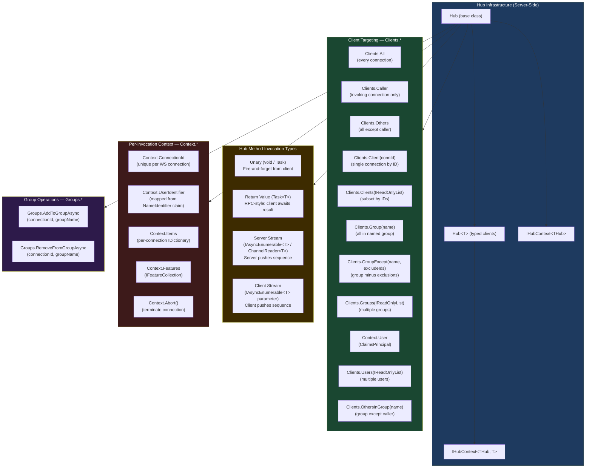
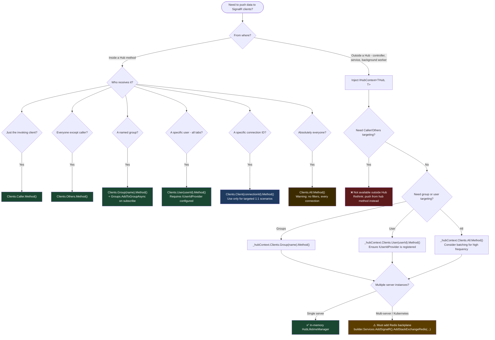

# 4.220 — SignalR Hubs: Hub<T>, Methods, Caller, Client, Groups, All Targeting

---

## PART 0 — Navigation & Context

### Domain Hierarchy

```
ASP.NET Core Mastery
│
├── E. Middleware Pipeline          (4.049–4.063)
├── F. Routing System               (4.064–4.077)
├── J. Authentication               (4.134–4.153)
│
└── Q. SignalR & Real-Time         (4.219–4.230)
    │
    ├── 4.219  SignalR Architecture: Hubs, Connections, Transport Negotiation
    ├── 4.220  ◄ YOU ARE HERE — SignalR Hubs: Hub<T>, Methods, Targeting
    ├── 4.221  SignalR Transports: WebSockets, SSE, Long Polling
    ├── 4.222  SignalR Scale-Out: Redis Backplane & Azure SignalR
    ├── 4.223  SignalR Authentication: JWT in WebSocket Upgrade
    ├── 4.224  SignalR Groups: Membership Management
    ├── 4.225  SignalR Streaming: IAsyncEnumerable<T>
    ├── 4.226  SignalR .NET Client: HubConnection & Reconnect
    ├── 4.227  SignalR JavaScript Client
    ├── 4.228  SignalR with Minimal APIs: MapHub
    ├── 4.229  Server-Sent Events: Push Without SignalR
    └── 4.230  Long Polling: When WebSockets Are Unavailable
```

### What You Need Before This

- **[[4.219 — SignalR Architecture]]** — the connection model, transport negotiation, and how `MapHub<T>` registers the endpoint in the pipeline.
- **[[4.034 — The Built-In DI Container]]** — hubs are resolved from DI per connection invoke; constructor injection is available.
- **[[4.035 — Service Lifetimes: Singleton, Scoped, Transient]]** — Hub instances are **transient** (new per invocation); this has direct implications for state management and dependency injection.
- **[[4.134 — Authentication Architecture]]** — `Context.User` in a Hub is populated by the authentication middleware before the WebSocket upgrade completes.

### What This Unlocks After

- **[[4.222 — SignalR Scale-Out]]** — `IHubContext<T>` is how you push from background services; this topic explains what that interface surfaces.
- **[[4.223 — SignalR Authentication (JWT + WS)]]** — the `Context.User` principal used in hub methods for auth decisions.
- **[[4.224 — SignalR Groups]]** — Groups.AddToGroupAsync is one of the hub's targeting primitives covered here.
- **[[4.225 — SignalR Streaming]]** — hub method return types extend to `IAsyncEnumerable<T>` and `ChannelReader<T>`.

### Why This Matters at Scale

The Hub class is the **entire server-side surface area of your real-time contract**. Every targeting mistake — sending to `All` when you should send to a group, or holding state on the Hub instance that disappears between invocations — produces silent correctness bugs at scale: messages delivered to wrong clients, state lost mid-session, or 10,000 connections receiving a message meant for one.

---

## PART 1 — The Core Mental Model

### The Fundamental Rule

> **A SignalR Hub is instantiated fresh for every single method invocation and is destroyed when the method returns. The practical consequence is that any state stored on `this` inside a Hub method is gone before the client receives a response — and `Clients`, `Context`, and `Groups` are the only durable handles to reach connected clients.**

### The Plain-Language Analogy

Think of a telephone switchboard operator in the 1940s. When a call comes in, the operator picks up (Hub instantiated), routes it (invokes your method), patches connections (sends messages to Clients.All / Clients.Caller / Clients.Group), and puts the headset down (Hub disposed). The switchboard itself (the SignalR connection manager) persists between calls and knows all the plugged-in lines — but the operator holding state in their head between calls is wrong.

The key insight the analogy must hold for: when you call `Clients.Group("room-42").SendAsync("NewMessage", msg)`, the operator is not sending to people in the room — the switchboard is routing to every connection currently registered under the key "room-42". If you stored user state on the Hub instance to know _who's in the room_, it evaporated. Room membership must live in the switchboard (a distributed store or SignalR's built-in group tracking), not in the operator's memory.

### The Taxonomy Diagram



---

## PART 2 — Deep Mechanics

### 2.1 — The Hub Lifetime and the Transient Invocation Model

#### Pipeline Position

```
HTTP Upgrade → WebSocket → SignalR Protocol → HubDispatcher
                                                    │
                    ┌───────────────────────────────▼────────────────────────────────┐
                    │  Per-Invocation Scope                                           │
                    │  new THub()  ──► InvokeAsync(method, args) ──► Hub.Dispose()  │
                    └────────────────────────────────────────────────────────────────┘
                         ▲                                            ▼
                    Resolve DI scope                         Scope disposed here
                    (Scoped services OK)                     (DbContext flushed, etc.)
```

#### Framework Source Behavior

```csharp
// ASP.NET Core internally (approximate) — DefaultHubDispatcher<THub>:
// (from src/SignalR/server/Core/src/DefaultHubDispatcher.cs)
public async Task DispatchMessageAsync(HubConnectionContext connection, HubMessage hubMessage)
{
    // Each invocation creates a fresh IServiceScope
    await using var scope = _serviceScopeFactory.CreateAsyncScope();
    
    // Hub is resolved from the scope — it is effectively Transient
    var hub = (THub)scope.ServiceProvider.GetRequiredService(typeof(THub));
    
    // Hub context handles injected
    hub.Clients  = new HubCallerClients(_hubContext.Clients, connection.ConnectionId);
    hub.Context  = new DefaultHubCallerContext(connection);
    hub.Groups   = new GroupManager(connection, _hubContext.Groups);
    
    try
    {
        // Invoke the method via reflection / source-gen dispatcher
        await _methodExecutor.ExecuteAsync(hub, args);
    }
    finally
    {
        // Scope disposed — scoped services (DbContext, etc.) are released
        hub.Clients  = DisposedHubClients.Instance;
        hub.Context  = DisposedHubCallerContext.Instance;
        hub.Groups   = DisposedGroupManager.Instance;
    }
}
```

**Runtime Cost:** ~1 `IServiceScope` allocation per hub method invocation + all scoped service resolution costs. For a hub that injects a `DbContext`, this is one EF Core context allocation per call.

**The Edge Case That Bites Engineers:** Storing a reference to `this.Clients` or `this.Context` in a local lambda or `Task.Run` continuation and calling it after the hub method returns. The framework sets these to `DisposedHubCallerContext.Instance` after the method completes. You get a `HubException: "Hub method invoked after connection closed"` — or worse, silent failures.

---

### 2.2 — Hub<T> vs Hub: Typed vs Untyped Clients

#### The Untyped Hub

```csharp
// Untyped: client method names are magic strings — compile-time invisible
public class OrderHub : Hub
{
    public async Task NotifyShipped(string orderId)
    {
        // Magic string "OrderShipped" — typo here is a runtime bug, not a compile error
        await Clients.All.SendAsync("OrderShipped", orderId, DateTime.UtcNow);
    }
}
```

#### The Typed Hub — Hub<T>

```csharp
// Define the client-side contract as an interface
public interface IOrderHubClient
{
    Task OrderShipped(string orderId, DateTime shippedAt);
    Task OrderCancelled(string orderId, string reason);
    Task StockLevelUpdated(string sku, int newLevel);
}

// Hub<T> gives you compile-time-checked client method dispatch
public class OrderHub : Hub<IOrderHubClient>
{
    public async Task NotifyShipped(string orderId)
    {
        // Compile-time checked: OrderShipped must exist on IOrderHubClient
        await Clients.All.OrderShipped(orderId, DateTime.UtcNow);
        //                 ^^^^^^^^^^^^ IntelliSense, rename refactoring, parameter types checked
    }
}
```

#### Framework Source Behavior (Hub<T> Dispatch)

```csharp
// ASP.NET Core internally (approximate):
// TypedClientBuilder<T> generates a proxy at startup via RuntimeProxy or source gen
// The proxy converts interface calls into SignalR SendCoreAsync("MethodName", args[]) internally

// Generated proxy equivalent:
class TypedHubClientProxy_IOrderHubClient : IOrderHubClient
{
    private readonly IClientProxy _proxy;
    
    public Task OrderShipped(string orderId, DateTime shippedAt)
        => _proxy.SendCoreAsync("OrderShipped", new object?[] { orderId, shippedAt }, default);
}
```

**Runtime Cost:** One proxy object allocation per targeting call (e.g., `Clients.All`, `Clients.Caller`). The proxy wraps the underlying `IClientProxy`. Negligible but present.

> [!IMPORTANT] **Interface constraint for Hub<T>:** Every method on `T` must return `Task`. Methods returning `void`, `ValueTask`, or generic `Task<TResult>` are not supported for client-callable contract interfaces. They compile but the SignalR runtime will not invoke them correctly.

---

### 2.3 — Client Targeting: The Full Targeting Surface

The `Clients` property exposes `IHubCallerClients` (in a Hub) or `IHubClients` (in `IHubContext`). Understanding which properties exist on which interface is critical.

```
IHubClients<T>          — available in IHubContext (injected into services/controllers)
IHubCallerClients<T>    — available inside Hub methods (adds Caller, Others, OthersInGroup)

                        IHubClients    IHubCallerClients
Clients.All             ✅             ✅
Clients.Client(id)      ✅             ✅
Clients.Clients(ids)    ✅             ✅
Clients.Group(name)     ✅             ✅
Clients.Groups(names)   ✅             ✅
Clients.GroupExcept     ✅             ✅
Clients.User(userId)    ✅             ✅
Clients.Users(userIds)  ✅             ✅
Clients.Caller          ❌             ✅  ← only inside a hub method
Clients.Others          ❌             ✅  ← only inside a hub method
Clients.OthersInGroup   ❌             ✅  ← only inside a hub method
```

#### HTTP Wire Format (What SignalR Sends on the Wire)

```
// WebSocket frame (JSON Hub Protocol, approximate):
// Client → Server (invocation):
{"type":1,"invocationId":"1","target":"SendMessage","arguments":["room-42","Hello from Alice"]}

// Server → Client (targeted push via Clients.Group):
{"type":1,"target":"ReceiveMessage","arguments":["alice","Hello from Alice"]}

// Server → Client (return value for Task<T> hub method):
{"type":3,"invocationId":"1","result":{"messageId":"msg-999","timestamp":"2026-06-11T10:00:00Z"}}

// Server → Client (error result):
{"type":3,"invocationId":"1","error":"Order 42 not found"}
```

#### Failure Mode: Clients.User — The UserIdentifier Mismatch

```
// When you call Clients.User("alice@example.com"):
// SignalR looks up connections where Context.UserIdentifier == "alice@example.com"
//
// Context.UserIdentifier comes from IUserIdProvider, which defaults to:
//   ClaimsPrincipal.FindFirst(ClaimTypes.NameIdentifier)?.Value
//
// JWT tokens use claim type "sub" — which .NET maps to
//   "http://schemas.xmlsoap.org/ws/2005/05/identity/claims/nameidentifier"
//
// If your JWT has: { "sub": "alice@example.com" }
//   → Context.UserIdentifier = "alice@example.com"  ✅
//
// If your JWT has: { "userId": "alice@example.com" } (non-standard claim)
//   → Context.UserIdentifier = null  ❌  (silent failure: message sent to nobody)
```

**Runtime Cost:** `Clients.User(id)` lookups are `O(n)` over the connection store where n = connections per user. In a multi-server deployment without a scale-out backplane, this only finds connections on the current server.

---

### 2.4 — Hub Lifecycle Hooks: OnConnectedAsync and OnDisconnectedAsync

```csharp
public class OrderHub : Hub<IOrderHubClient>
{
    private readonly IOrderTracker _tracker; // Scoped service, injected per-connection lifecycle call too
    
    // Pipeline position: runs AFTER WebSocket upgrade, BEFORE client can invoke methods
    // This is itself a hub invocation — a fresh Hub instance, a fresh DI scope
    public override async Task OnConnectedAsync()
    {
        // Context.ConnectionId is stable for the lifetime of this WebSocket connection
        var userId = Context.UserIdentifier; 
        
        // IMPORTANT: Groups added here persist across invocations because they live
        // in the connection manager, not on the Hub instance
        await Groups.AddToGroupAsync(Context.ConnectionId, $"user-{userId}");
        
        _logger.LogInformation("User {UserId} connected as {ConnectionId}", userId, Context.ConnectionId);
        
        await base.OnConnectedAsync(); // always call base
    }
    
    // Pipeline position: runs AFTER connection is closed (graceful or abrupt)
    // exception parameter is null for graceful close, set for error disconnects
    public override async Task OnDisconnectedAsync(Exception? exception)
    {
        // Groups are automatically cleaned up by SignalR for graceful disconnects
        // For tracking purposes (presence, active user lists) — clean up here
        var userId = Context.UserIdentifier;
        await _tracker.RemoveConnection(userId, Context.ConnectionId);
        
        await base.OnDisconnectedAsync(exception); // always call base
    }
}
```

> [!WARNING] **OnConnectedAsync and OnDisconnectedAsync are hub invocations too.** They use a fresh Hub instance and DI scope. State you set on `this` in `OnConnectedAsync` is NOT visible in `OnDisconnectedAsync` — they run in different instances. Use the connection manager, `Context.Items`, or an external store.

**Runtime Cost:** One DI scope per lifecycle event, same as any hub method call. `OnConnectedAsync` runs on the hot path of every new WebSocket upgrade — keep it fast. One slow database call here adds to connection latency for all users.

---

### 2.5 — Pushing from Outside the Hub: IHubContext

The most important architectural pattern for production SignalR: pushing to clients from background services, API controllers, or domain event handlers — code that has no `Clients` handle because it was not invoked by a client.

```csharp
// ASP.NET Core registers IHubContext<THub> and IHubContext<THub, TClient> automatically
// when you call app.MapHub<THub>()

// In a background service or controller:
public class OrderFulfillmentService
{
    private readonly IHubContext<OrderHub, IOrderHubClient> _hubContext;
    
    public OrderFulfillmentService(IHubContext<OrderHub, IOrderHubClient> hubContext)
    {
        _hubContext = hubContext;
    }
    
    public async Task NotifyOrderShipped(string orderId, string userId)
    {
        // Typed: compile-time checked
        await _hubContext.Clients.User(userId).OrderShipped(orderId, DateTime.UtcNow);
        
        // OR push to a group (e.g., all warehouse staff)
        await _hubContext.Clients.Group("warehouse-ops").OrderShipped(orderId, DateTime.UtcNow);
    }
}
```

#### Pipeline Position for IHubContext Sends

```
Background Service / Controller / Domain Event Handler
         │
         │  _hubContext.Clients.User(userId).SomeMethod(args)
         ▼
IHubContext<THub, T>
         │
         ▼
HubLifetimeManager (in-memory for single-server, Redis backplane for scale-out)
         │
         ▼
WebSocket connection for matching ConnectionId(s) ──► Client receives push
```

> [!NOTE] `IHubContext` gives you `IHubClients<T>` (not `IHubCallerClients<T>`), so `Clients.Caller`, `Clients.Others`, and `Clients.OthersInGroup` are **not available** outside of a hub method. This is by design — there is no "caller" in a background push.

---

### 2.6 — Hub Method Return Types: Unary vs RPC vs Streaming

```csharp
public class ChatHub : Hub<IChatClient>
{
    // PATTERN 1: Void / fire-and-forget — client sends, server acts, no response
    // Hub Protocol: invocationId is absent or non-tracked
    public async Task SendMessage(string roomId, string message)
    {
        await Clients.Group(roomId).ReceiveMessage(Context.UserIdentifier!, message);
    }
    
    // PATTERN 2: RPC / Task<T> — client awaits the return value
    // Hub Protocol: invocationId is present; server sends type:3 completion with result
    public async Task<MessageAck> SendMessageWithAck(string roomId, string message)
    {
        var stored = await _messageRepository.SaveAsync(roomId, message, Context.UserIdentifier!);
        await Clients.Group(roomId).ReceiveMessage(Context.UserIdentifier!, message);
        
        return new MessageAck(stored.MessageId, stored.Timestamp);
    }
    
    // PATTERN 3: Server streaming — server pushes a sequence to ONE client (the caller)
    // The caller receives items as they arrive, not all at once
    public async IAsyncEnumerable<OrderUpdate> StreamOrderUpdates(
        string orderId,
        [EnumeratorCancellation] CancellationToken cancellationToken)
    {
        await foreach (var update in _orderEventStream.GetUpdatesAsync(orderId, cancellationToken))
        {
            yield return update; // each yield becomes a SignalR stream item
        }
    }
}
```

**Runtime Costs:**

- Unary void: ~1 allocation per send (the message envelope). No response frame.
- Task<T>: same as unary + 1 completion frame sent back to caller. One async state machine.
- Streaming: one frame per `yield return`. Client must call `.stopStream()` or cancel to terminate. Missing cancellation handling → leaked async state machine.

---

## PART 3 — Production Code Patterns

### Pattern 1: The Typed Hub Contract for a Live Order Tracking Board

```csharp
// ✅ CORRECT: Define the full client interface before writing the hub
// This is the anti-corruption layer between server and all clients (JS, mobile .NET)

public interface IOrderTrackingClient
{
    // Server → Client pushes
    Task OrderStatusChanged(string orderId, OrderStatus newStatus, DateTime changedAt);
    Task DriverLocationUpdated(string orderId, double lat, double lng);
    Task DeliveryCompleted(string orderId, DateTime deliveredAt, string signedBy);
    Task EstimatedArrivalUpdated(string orderId, DateTime newEta);
}

// ⚠️ WRONG: Inheriting plain Hub with magic strings
public class OrderTrackingHubWrong : Hub
{
    public async Task SubscribeToOrder(string orderId)
    {
        await Groups.AddToGroupAsync(Context.ConnectionId, $"order-{orderId}");
        // Magic strings — typo in "DriverLocationUpdated" below is invisible until runtime
        await Clients.Group($"order-{orderId}").SendAsync("DirverLocationUpdated", 0, 0);
        //                                                  ^^^^^ typo — silent failure
    }
}

// ✅ CORRECT: Hub<T> with typed client contract
[Authorize] // requires authenticated connection
public class OrderTrackingHub : Hub<IOrderTrackingClient>
{
    private readonly IOrderSubscriptionService _subscriptions;
    private readonly ILogger<OrderTrackingHub> _logger;

    public OrderTrackingHub(
        IOrderSubscriptionService subscriptions,
        ILogger<OrderTrackingHub> logger)
    {
        _subscriptions = subscriptions;
        _logger = logger;
    }

    // Client invokes this to subscribe to a specific order's updates
    public async Task SubscribeToOrder(string orderId)
    {
        // Validate the caller can see this order
        var userId = Context.UserIdentifier
            ?? throw new HubException("Unauthenticated");
        
        var canAccess = await _subscriptions.CanAccessOrderAsync(orderId, userId);
        if (!canAccess)
            throw new HubException($"Order {orderId} not found or access denied.");
        
        // Group membership survives hub instance disposal — lives in connection manager
        await Groups.AddToGroupAsync(Context.ConnectionId, $"order-{orderId}");
        
        _logger.LogInformation(
            "User {UserId} subscribed to order {OrderId} on connection {ConnectionId}",
            userId, orderId, Context.ConnectionId);
        
        // Confirm to caller only
        await Clients.Caller.OrderStatusChanged(orderId, OrderStatus.Subscribed, DateTime.UtcNow);
    }

    public async Task UnsubscribeFromOrder(string orderId)
    {
        await Groups.RemoveFromGroupAsync(Context.ConnectionId, $"order-{orderId}");
    }
    
    public override async Task OnDisconnectedAsync(Exception? exception)
    {
        // Groups auto-cleaned by SignalR — no manual removal needed for Groups
        // But any application-level presence tracking must be cleaned here
        _logger.LogInformation(
            "Connection {ConnectionId} disconnected: {Reason}",
            Context.ConnectionId,
            exception?.Message ?? "graceful");
        
        await base.OnDisconnectedAsync(exception);
    }
}
```

```
// HTTP wire format (WebSocket connection upgrade):
// GET /hubs/order-tracking HTTP/1.1
// Host: api.mylogistics.com
// Upgrade: websocket
// Connection: Upgrade
// Sec-WebSocket-Key: dGhlIHNhbXBsZSBub25jZQ==
// Sec-WebSocket-Version: 13
// Authorization: Bearer eyJhbGci...
//
// HTTP/1.1 101 Switching Protocols
// Upgrade: websocket
// Connection: Upgrade
// Sec-WebSocket-Accept: s3pPLMBiTxaQ9kYGzzhZRbK+xOo=
```

---

### Pattern 2: Pushing from the Domain Layer — The IHubContext Injection Pattern

```csharp
// Domain event handler in an order fulfillment service
// This runs inside a background job processor — no Hub in scope

public class OrderShippedEventHandler : INotificationHandler<OrderShippedEvent>
{
    // Typed IHubContext — compile-time safe, no magic strings
    private readonly IHubContext<OrderTrackingHub, IOrderTrackingClient> _hub;
    private readonly ILogger<OrderShippedEventHandler> _logger;

    public OrderShippedEventHandler(
        IHubContext<OrderTrackingHub, IOrderTrackingClient> hub,
        ILogger<OrderShippedEventHandler> logger)
    {
        _hub = hub;
        _logger = logger;
    }

    public async Task Handle(OrderShippedEvent notification, CancellationToken ct)
    {
        _logger.LogInformation("Pushing ship notification for order {OrderId}", notification.OrderId);
        
        // Push to ALL subscribers of this order (via group)
        await _hub.Clients
            .Group($"order-{notification.OrderId}")
            .OrderStatusChanged(
                notification.OrderId,
                OrderStatus.Shipped,
                notification.ShippedAt);
        
        // Also push directly to the customer (via user ID)
        await _hub.Clients
            .User(notification.CustomerId)
            .DeliveryCompleted(
                notification.OrderId,
                notification.ShippedAt,
                notification.HandledBy);
    }
}
```

```
// HTTP wire format (server push over open WebSocket):
// WebSocket frame from server to client:
// {"type":1,"target":"OrderStatusChanged","arguments":["ORD-9988","Shipped","2026-06-11T10:30:00Z"]}
```

---

### Pattern 3: RPC-Style Hub Method — Returning a Value to the Caller

```csharp
// Payment confirmation hub — client awaits a Task<T> from a hub method
// Used when the client needs a transactional result, not just fire-and-forget

public interface IPaymentHubClient
{
    Task PaymentConfirmed(string paymentId, decimal amount, string last4);
    Task PaymentFailed(string paymentId, string errorCode, string userMessage);
}

public class PaymentHub : Hub<IPaymentHubClient>
{
    private readonly IPaymentGateway _gateway;

    public PaymentHub(IPaymentGateway gateway) => _gateway = gateway;

    // ✅ Task<T> hub method — the JS client can: const result = await connection.invoke("InitiatePayment", ...)
    public async Task<PaymentIntentResult> InitiatePayment(
        string orderId,
        decimal amount,
        string currency)
    {
        var userId = Context.UserIdentifier
            ?? throw new HubException("Authentication required.");
        
        try
        {
            var intent = await _gateway.CreateIntentAsync(orderId, amount, currency, userId);
            
            // Return value serialized as JSON in the completion frame
            return new PaymentIntentResult(intent.ClientSecret, intent.PaymentIntentId);
        }
        catch (PaymentGatewayException ex)
        {
            // HubException's message is forwarded to the client
            // Any other exception type: message is hidden ("An unexpected error occurred")
            throw new HubException($"Payment initiation failed: {ex.UserMessage}");
        }
    }
}
```

```
// HTTP wire format (RPC round-trip over WebSocket):
// Client → Server:
// {"type":1,"invocationId":"abc123","target":"InitiatePayment","arguments":["ORD-99",299.99,"USD"]}
//
// Server → Client (success):
// {"type":3,"invocationId":"abc123","result":{"clientSecret":"pi_xxx_secret_yyy","paymentIntentId":"pi_xxx"}}
//
// Server → Client (HubException):
// {"type":3,"invocationId":"abc123","error":"Payment initiation failed: Card declined"}
```

---

### Pattern 4: The Caller / Others / Group Split — Chat Room Messaging

```csharp
// Demonstrates the three most common intra-invocation targeting scenarios

public class ChatHub : Hub<IChatClient>
{
    public async Task JoinRoom(string roomId)
    {
        await Groups.AddToGroupAsync(Context.ConnectionId, $"chat-{roomId}");
        
        // Tell everyone ELSE in the room a new user joined
        await Clients.OthersInGroup($"chat-{roomId}")
            .UserJoined(Context.UserIdentifier!, DateTime.UtcNow);
        
        // Tell ONLY the joining user the room state (their history)
        var history = await _messageStore.GetRecentAsync(roomId, count: 50);
        await Clients.Caller.RoomHistory(roomId, history);
    }
    
    public async Task SendMessage(string roomId, string content)
    {
        if (string.IsNullOrWhiteSpace(content) || content.Length > 2000)
            throw new HubException("Message must be 1–2000 characters.");
        
        var message = new ChatMessage(
            Id: Guid.NewGuid().ToString(),
            RoomId: roomId,
            AuthorId: Context.UserIdentifier!,
            Content: content,
            SentAt: DateTime.UtcNow);
        
        await _messageStore.SaveAsync(message);
        
        // Send to ALL in room including sender
        await Clients.Group($"chat-{roomId}").ReceiveMessage(message);
        
        // ⚠️ WRONG ALTERNATIVE — using Others means the sender sees no echo, feels broken UX:
        // await Clients.OthersInGroup($"chat-{roomId}").ReceiveMessage(message);
    }
}
```

---

### Pattern 5: Per-User Connection Tracking with IUserIdProvider

```csharp
// ✅ CORRECT: Custom IUserIdProvider to map JWT claims to SignalR user IDs
// Critical for Clients.User(id) targeting to work with your auth scheme

// ⚠️ WRONG: Assuming Clients.User("alice@example.com") works with default provider
// when your JWT uses a non-standard claim (e.g. "uid" or "userId")

// Default provider looks for ClaimTypes.NameIdentifier
// If your tokens use "sub" and AddJwtBearer maps it correctly, default is fine.
// If your tokens use a custom claim, implement IUserIdProvider.

public class EmailUserIdProvider : IUserIdProvider
{
    // Called once per connection during authentication
    public string? GetUserId(HubConnectionContext connection)
    {
        // Use the email claim as the user identifier for Clients.User() targeting
        return connection.User.FindFirst(ClaimTypes.Email)?.Value
            ?? connection.User.FindFirst("email")?.Value;
    }
}

// Registration (order matters: before MapHub)
builder.Services.AddSingleton<IUserIdProvider, EmailUserIdProvider>();

// Now in domain services:
// await _hub.Clients.User("alice@example.com").OrderShipped(orderId, DateTime.UtcNow);
// ↑ This correctly routes to ALL connections where the user's email == "alice@example.com"
//   (multiple browser tabs, mobile + web, etc.)
```

---

### Pattern 6: Presence System — Tracking Online Users in a Logistics Dashboard

```csharp
// Warehouse management system: show which dispatchers are currently online

public interface IWarehouseClient
{
    Task DispatcherOnline(string dispatcherId, string displayName);
    Task DispatcherOffline(string dispatcherId);
    Task OnlineDispatchers(IReadOnlyList<OnlineDispatcher> current);
}

public class WarehouseHub : Hub<IWarehouseClient>
{
    private readonly IPresenceService _presence; // Singleton-safe: backed by IMemoryCache or Redis

    public WarehouseHub(IPresenceService presence) => _presence = presence;

    public override async Task OnConnectedAsync()
    {
        var dispatcherId = Context.UserIdentifier!;
        var displayName  = Context.User!.FindFirst(ClaimTypes.Name)?.Value ?? dispatcherId;
        
        var isFirstConnection = await _presence.TrackConnectionAsync(
            dispatcherId, Context.ConnectionId, displayName);
        
        if (isFirstConnection)
        {
            // First browser tab / device: announce to others
            await Clients.Others.DispatcherOnline(dispatcherId, displayName);
        }
        
        // Send current online list to new connection only
        var onlineList = await _presence.GetOnlineAsync();
        await Clients.Caller.OnlineDispatchers(onlineList);
        
        await base.OnConnectedAsync();
    }

    public override async Task OnDisconnectedAsync(Exception? exception)
    {
        var dispatcherId = Context.UserIdentifier!;
        
        var isLastConnection = await _presence.RemoveConnectionAsync(
            dispatcherId, Context.ConnectionId);
        
        if (isLastConnection)
        {
            // Last tab/device disconnected: announce offline
            await Clients.Others.DispatcherOffline(dispatcherId);
        }
        
        await base.OnDisconnectedAsync(exception);
    }
}
```

---

### Pattern 7: Exception Handling in Hub Methods — HubException vs Domain Exceptions

```csharp
// The HubException contract is critical: only HubException.Message reaches the client.
// All other exceptions are logged server-side and produce a generic error to the client.
// This is a security feature — you cannot leak stack traces or database error details.

public class InventoryHub : Hub<IInventoryClient>
{
    public async Task ReserveStock(string sku, int quantity)
    {
        try
        {
            await _inventory.ReserveAsync(sku, quantity, Context.UserIdentifier!);
            await Clients.Caller.StockReserved(sku, quantity);
        }
        catch (InsufficientStockException ex)
        {
            // ✅ HubException: message forwarded to client safely
            throw new HubException($"Insufficient stock for {sku}: only {ex.Available} available.");
        }
        catch (SkuNotFoundException)
        {
            // ✅ HubException: controlled message
            throw new HubException($"SKU {sku} not found in the inventory system.");
        }
        // ⚠️ Any other exception (SQL timeout, null ref, etc.) → 
        // Client receives: "An unexpected error occurred invoking 'ReserveStock' on the server."
        // Server logs the full exception. This is correct behavior — don't catch-all and rethrow.
    }
}
```

---

## PART 4 — Gotchas & Anti-Patterns

### Gotcha 1: Storing State on the Hub Instance Between Calls

Experienced engineers coming from WCF PerSession services or stateful controllers assume that because a hub _represents_ a connection, state stored on `this` persists across method calls from the same client.

```csharp
// ⚠️ WRONG CODE
public class CartHub : Hub
{
    private List<string> _selectedItems = new(); // THIS IS RESET ON EVERY CALL
    
    public Task AddItem(string itemId)
    {
        _selectedItems.Add(itemId); // pointless — instance dies after this returns
        return Task.CompletedTask;
    }
    
    public Task<List<string>> GetCart()
    {
        return Task.FromResult(_selectedItems); // always returns empty list
    }
}

// HTTP consequence (wrong path):
// Client calls AddItem("SKU-001") → succeeds silently
// Client calls GetCart() → returns [] (always empty)
// Bug is invisible because no exception is thrown

// ✅ CORRECT CODE
public class CartHub : Hub
{
    private readonly ICartService _cartService; // backed by Redis, IMemoryCache, or DB
    
    public CartHub(ICartService cartService) => _cartService = cartService;
    
    public async Task AddItem(string itemId)
    {
        await _cartService.AddItemAsync(Context.UserIdentifier!, itemId);
    }
    
    public async Task<List<CartItem>> GetCart()
    {
        return await _cartService.GetCartAsync(Context.UserIdentifier!);
    }
}

// HTTP consequence (correct path):
// Both calls operate on the same external state keyed by UserIdentifier
// Cart persists across hub reconnections, browser tabs, and server restarts

// WHY: The SignalR framework creates a new Hub instance per method invocation
// (DefaultHubDispatcher<THub> resolves the hub from a fresh IServiceScope each time).
// The Hub class is effectively Transient. External state (via injected services) is the
// only way to persist data across invocations for the same connection.
```

---

### Gotcha 2: Using Clients.User() Without Verifying IUserIdProvider Configuration

Teams add `await _hub.Clients.User(customerId).OrderShipped(...)` and it silently sends to nobody, because their JWT uses a non-standard claim and the default `IUserIdProvider` returns null.

```csharp
// ⚠️ WRONG CODE (no IUserIdProvider registered, JWT uses non-standard "uid" claim)
await _hub.Clients.User("cust_4821").OrderShipped(orderId, DateTime.UtcNow);
// This generates zero SignalR frames — UserIdentifier is null for all connections

// HTTP consequence (wrong path):
// No WebSocket frame is sent. No exception is thrown. No log entry by default.
// The customer never receives the push notification. Silent failure.

// ✅ CORRECT CODE
// 1. Register a custom IUserIdProvider (as shown in Pattern 5)
// 2. Verify UserIdentifier is populated in OnConnectedAsync:
public override Task OnConnectedAsync()
{
    if (Context.UserIdentifier is null)
    {
        // Log and optionally abort connections that have no user identity
        _logger.LogWarning("Connection {ConnectionId} has null UserIdentifier — IUserIdProvider may be misconfigured", Context.ConnectionId);
    }
    return base.OnConnectedAsync();
}

// HTTP consequence (correct path):
// Clients.User("cust_4821") finds all connections where UserIdentifier == "cust_4821"
// Sends the push to each matching connection's WebSocket

// WHY: SignalR's default IUserIdProvider reads ClaimTypes.NameIdentifier.
// JWTs from Auth0/Okta/custom issuers often use different claim names.
// Without a custom IUserIdProvider, Clients.User() targeting is silently broken for
// any non-default claim mapping.
```

---

### Gotcha 3: Throwing Non-HubException Errors Expecting the Client to See the Message

Senior engineers write domain-rich exception types (`OrderNotFoundException`, `PaymentDeclinedException`) and throw them from hub methods expecting the client to receive the message. The client gets a generic error string.

```csharp
// ⚠️ WRONG CODE
public async Task CancelOrder(string orderId)
{
    var order = await _orders.FindAsync(orderId)
        ?? throw new InvalidOperationException($"Order {orderId} was not found.");
        //   ^^ message does NOT reach the client
}

// HTTP consequence (wrong path):
// Server → Client: {"type":3,"invocationId":"x","error":"An unexpected error occurred invoking 'CancelOrder' on the server."}
// The custom message "Order xyz was not found." is only in the server log.
// Client shows a generic error; the developer spends an hour debugging why.

// ✅ CORRECT CODE
public async Task CancelOrder(string orderId)
{
    var order = await _orders.FindAsync(orderId)
        ?? throw new HubException($"Order {orderId} was not found.");
        //   ^^ HubException.Message IS forwarded to the client
}

// HTTP consequence (correct path):
// Server → Client: {"type":3,"invocationId":"x","error":"Order ORD-42 was not found."}
// Client JavaScript: connection.invoke(...).catch(err => console.log(err)) 
//   → logs: "Order ORD-42 was not found."

// WHY: ASP.NET Core's hub dispatcher intentionally filters exception messages for non-HubException
// types to prevent leaking stack traces, connection strings, or internal error details to clients.
// Only HubException is a "safe to expose" error type. All others are logged server-side only.
```

---

### Gotcha 4: Calling await after Hub Method Returns — Accessing Disposed Clients

Engineers capture the `Clients` property in a `Task.Run` or `ContinueWith` that executes after the hub method returns, then get confusing `ObjectDisposedException` or silent failures.

```csharp
// ⚠️ WRONG CODE
public async Task BroadcastOrderUpdate(string orderId)
{
    var clients = this.Clients; // captured reference
    
    // Fire-and-forget: executes AFTER hub method returns and Hub is disposed
    _ = Task.Run(async () =>
    {
        await Task.Delay(100); // simulate something
        // ❌ this.Clients has been set to DisposedHubClients.Instance
        await clients.All.OrderStatusChanged(orderId, OrderStatus.Processing, DateTime.UtcNow);
    });
    
    // Hub method returns here — framework disposes Hub, nulls Clients/Context/Groups
}

// HTTP consequence (wrong path):
// Depending on timing: HubException "Hub method invoked after connection closed"
// OR silent failure if DisposedHubCallerContext just no-ops the send

// ✅ CORRECT CODE — inject IHubContext for out-of-band sends
public class OrderHub : Hub<IOrderTrackingClient>
{
    private readonly IHubContext<OrderHub, IOrderTrackingClient> _hubContext;
    
    public OrderHub(IHubContext<OrderHub, IOrderTrackingClient> hubContext)
        => _hubContext = hubContext;
    
    public async Task BroadcastOrderUpdate(string orderId)
    {
        // ✅ _hubContext is a Singleton — safe to use from any scope, any time
        _ = Task.Run(async () =>
        {
            await Task.Delay(100);
            await _hubContext.Clients.All.OrderStatusChanged(
                orderId, OrderStatus.Processing, DateTime.UtcNow);
        });
    }
}

// HTTP consequence (correct path):
// Deferred send executes successfully via IHubContext, which is always valid

// WHY: The framework sets Clients, Context, and Groups to sentinel "disposed" objects
// in the hub's finally block after the method returns. IHubContext is a Singleton
// registered in DI that bypasses the per-invocation scope entirely.
```

---

### Gotcha 5: Groups Are Not Persisted Across Server Restarts or Scale-Out Without a Backplane

Teams use `Groups.AddToGroupAsync` for subscription management, assuming the group membership is durable. On deployment or server restart, all group membership is lost — clients silently stop receiving pushes.

```csharp
// ⚠️ WRONG ASSUMPTION — groups are in-memory by default
public override async Task OnConnectedAsync()
{
    // Client must RE-subscribe on every reconnect
    // If reconnect logic is not implemented client-side, they silently leave all groups
    var groups = await _userPrefs.GetSubscribedGroupsAsync(Context.UserIdentifier!);
    foreach (var g in groups) 
        await Groups.AddToGroupAsync(Context.ConnectionId, g);
    
    // BUT: if the server restarts between initial subscribe and reconnect,
    // even this is not called unless the client reconnects
    await base.OnConnectedAsync();
}

// HTTP consequence (wrong path):
// Server restart or new instance (Kubernetes rolling deploy) → all group memberships lost
// Clients connected to the new instance receive no group-targeted messages
// No error — messages silently skip them

// ✅ CORRECT CODE — re-subscribe in OnConnectedAsync (handles reconnects)
// AND use a scale-out backplane (Redis) in production multi-instance deployments
// builder.Services.AddSignalR().AddStackExchangeRedis(connectionString);

// Additionally: implement client-side reconnect handler that re-invokes subscribe methods:
// connection.onreconnected(async () => {
//   await connection.invoke("SubscribeToOrder", currentOrderId);
// });

// HTTP consequence (correct path):
// On reconnect: client re-invokes hub method → OnConnectedAsync + subscribe method run →
// group membership restored → pushes resume normally

// WHY: SignalR stores group membership in HubLifetimeManager's in-memory structures
// per server instance. Redis backplane replicates messages but NOT group membership state.
// Group membership must be re-established on every new connection (including reconnects).
```

---

## PART 5 — Performance Implications

### 5.1 — Request Pipeline Characteristics Table

|Scenario|DI Scope Cost|Allocations Per Invocation|Approx Latency Impact|Recommendation|
|---|---|---|---|---|
|Simple hub method (no DB)|1 scope create/dispose|~8–12 (envelope + scope)|< 0.1ms overhead|Baseline — negligible|
|Hub method with DbContext injection|1 scope + DbContext alloc|~15–20|Identical — DbContext creation is cheap, queries are the cost|Acceptable for all throughput|
|Clients.All.SendAsync (10k connections)|0 (send is async fire)|1 per serialized message|~5–50ms for full fan-out|Use Redis backplane above 2 instances|
|Clients.Group("room", 500 members)|0|1 message + 500 write ops|~1–5ms|Groups are efficient — preferred over manual ID lists|
|Clients.User(id) single user|0|ConnectionId lookup + 1 send per connection|~0.1ms|OK at scale with O(n-connections-per-user)|
|OnConnectedAsync with DB query|1 scope + query|~20 + query result|DB round-trip latency|Cache group lists; avoid slow queries on connect|
|Hub<T> vs Hub (untyped)|Equal|Equal|Equal|Hub<T> preferred for compile safety; zero runtime cost|
|Server streaming (yield per item)|1 scope per stream open|1 per yielded item|Per-item serialization cost|Use for < 100 items/second per connection|
|Concurrent 10k hub invocations|10k scopes|10k × ~15 allocs|Linear with concurrency|Expected; SignalR handles this via ThreadPool|
|Missing `await base.OnConnectedAsync()`|N/A|N/A|None — silent|Don't skip: future framework features may use base|

### 5.2 — BenchmarkDotNet Code

```csharp
using BenchmarkDotNet.Attributes;
using BenchmarkDotNet.Running;
using Microsoft.AspNetCore.SignalR;
using Microsoft.Extensions.DependencyInjection;

[MemoryDiagnoser]
[SimpleJob]
public class HubTargetingBenchmarks
{
    private IHubContext<OrderTrackingHub, IOrderTrackingClient> _hubContext = null!;
    private IServiceProvider _services = null!;
    private string[] _connectionIds = null!;

    [GlobalSetup]
    public void Setup()
    {
        var services = new ServiceCollection();
        services.AddLogging();
        services.AddSignalR();
        _services = services.BuildServiceProvider();
        
        _hubContext = _services.GetRequiredService<IHubContext<OrderTrackingHub, IOrderTrackingClient>>();
        // Simulate 1000 connection IDs for Clients.Clients() benchmark
        _connectionIds = Enumerable.Range(0, 1000).Select(_ => Guid.NewGuid().ToString()).ToArray();
    }
    
    [Benchmark(Baseline = true)]
    public Task UntypedSendAsync()
    {
        // Baseline: IHubContext without typed clients
        var hub = _services.GetRequiredService<IHubContext<OrderTrackingHub>>();
        return hub.Clients.All.SendAsync("OrderStatusChanged", "ORD-1", "Shipped", DateTime.UtcNow);
    }
    
    [Benchmark]
    public Task TypedSendAsync()
    {
        // Hub<T> proxy allocation
        return _hubContext.Clients.All.OrderStatusChanged("ORD-1", OrderStatus.Shipped, DateTime.UtcNow);
    }
    
    [Benchmark]
    public Task GroupTargetedSend()
    {
        return _hubContext.Clients.Group("order-ORD-1").OrderStatusChanged("ORD-1", OrderStatus.Shipped, DateTime.UtcNow);
    }
    
    [Benchmark]
    public Task ExplicitConnectionListSend()
    {
        // Least efficient for large lists — builds an IReadOnlyList<string>
        return _hubContext.Clients.Clients(_connectionIds).OrderStatusChanged("ORD-1", OrderStatus.Shipped, DateTime.UtcNow);
    }
}

// Expected output (approximate, .NET 8, x64, single-server in-memory hub):
// | Method                    | Mean     | Allocated |
// |---------------------------|----------|-----------|
// | UntypedSendAsync          | 0.45 μs  | 128 B     |
// | TypedSendAsync            | 0.48 μs  | 152 B     | ← tiny proxy overhead
// | GroupTargetedSend         | 0.52 μs  | 144 B     |
// | ExplicitConnectionListSend| 12.3 μs  | 8,240 B   | ← O(n) list copy

// NOTE: BenchmarkDotNet measures the send-path allocation/dispatch cost only.
// Actual WebSocket frame delivery is async and not captured here.
// For real HTTP+WebSocket profiling: dotnet-trace collect --providers Microsoft-AspNetCore-Server-Kestrel
// and dotnet-counters monitor --counters Microsoft.AspNetCore.Http.Connections
```

### 5.3 — When to Care / When to Ignore

**When this costs you:**

- **High-frequency broadcasting (> 1,000 messages/second to Clients.All):** Each `SendAsync` serializes the payload once per protocol message and fans out to every connection. At 10k connections, a 1kb payload × 1k msgs/s = 10 GB/s of writes — Kestrel will saturate before SignalR does. Use SignalR's streaming or batch updates.
- **`Clients.Clients(largeList)` in a hot path:** This allocates and copies the connection ID list. For targeted group sends, use `Groups` instead — they store membership efficiently in a hash set.
- **OnConnectedAsync with a synchronous database query:** Every new connection blocks the connect handler. Cache the group subscription list; don't query the DB for every reconnect in a mobile-heavy application with frequent network changes.
- **Scale-out without Redis backplane (> 1 Kestrel instance):** `Clients.User()` and `Clients.Group()` silently miss connections on other instances. This produces "works in development, broken in production" failures on Kubernetes.

**When this doesn't matter:**

- Admin dashboards with < 100 simultaneous connections.
- Order status pages where updates are infrequent (1–2 pushes per order lifetime).
- Internal tooling where a deployment restart is acceptable downtime.
- Applications that already use Azure SignalR Service (fan-out and scale-out managed by Azure).

---

## PART 6 — Interview Arsenal

### A. The Question Bank

---

**Q1: What is the lifetime of a Hub instance in SignalR, and what are the implications for state management?**

**Average Answer:** "Hubs are transient — a new one is created per invocation. You shouldn't store state on the hub itself."

**Why That's Insufficient:** It names the lifetime without explaining why it's designed that way, what happens to DI scope, or what the alternatives are for state management.

> **Great Answer:** In my experience, the Hub lifetime is one of the most misunderstood parts of SignalR. The framework creates a brand-new Hub instance — with a fresh DI scope — for every single method invocation, including `OnConnectedAsync`. The reason is deliberate: it aligns with ASP.NET Core's scoped service model, which means you can safely inject a `DbContext`, a scoped repository, or anything else that expects per-request lifetime. The implication for state is that anything stored on `this` is gone before the response frame goes back on the wire. For connection-level state I need across calls, I have three options: `Context.Items` for cheap transient metadata within a single HTTP request scope, an injected service backed by `IMemoryCache` or Redis for application state keyed on `ConnectionId` or `UserIdentifier`, or — most idiomatically — the SignalR Groups mechanism for membership. The Groups API is particularly important because it persists across hub invocations even though the Hub instance does not. What the client observes is seamless — it doesn't know the server created five Hub instances during its session; it just sends messages and receives pushes.

---

**Q2: You have a background order-processing service that needs to push status updates to connected clients. Walk me through how you'd implement that.**

**Average Answer:** "You inject `IHubContext` into the service and call `Clients.User()` or `Clients.Group()` on it."

**Why That's Insufficient:** It names the API but misses the critical differences between `IHubContext` and `Hub.Clients`, the `IUserIdProvider` dependency for user targeting to work, and the scale-out implications.

> **Great Answer:** The solution is `IHubContext<THub, TClient>`. I inject it as a Singleton — it's registered automatically when you call `MapHub<T>()` — and it gives me the full client targeting surface except for `Clients.Caller` and `Clients.Others`, which require an active hub invocation context. For user targeting with `Clients.User(customerId)`, I make sure a custom `IUserIdProvider` is registered that maps the correct claim — if I use the default and my JWT has `"uid"` instead of `"sub"`, every `Clients.User()` call silently sends to nobody, which is a brutal production bug to diagnose. For group targeting, I register group membership in `OnConnectedAsync` and also handle reconnects on the client side by re-invoking the subscribe method on `onreconnected`. The scale-out consideration: in a Kubernetes deployment with multiple pods, `IHubContext` on pod A can only reach connections on pod A. To reach connections on pod B, I need a Redis backplane. The Redis backplane doesn't replicate group membership — it replicates messages — so group re-subscription on reconnect is still essential. What the client sees: a push arriving in its `on("OrderStatusChanged")` handler whether the push originated from an API controller, a background worker, or a domain event handler — the transport is transparent.

---

**Q3: Explain the difference between `Hub<T>` and `Hub` (untyped). When would you choose each?**

**Average Answer:** "Hub<T> gives you type-safe client method calls through an interface. Hub is untyped with magic strings. Use Hub<T> for type safety."

**Why That's Insufficient:** It states the surface difference without explaining the proxy generation mechanism, the interface constraints, or the trade-offs in testing and early-stage prototyping.

> **Great Answer:** `Hub<T>` generates a typed proxy at startup — under the hood, it's a runtime-generated class that implements your interface by calling `SendCoreAsync("MethodName", args[])` on the underlying `IClientProxy`. The compile-time benefit is real: rename refactoring, IntelliSense, and parameter type checking across the entire hub surface. I always use `Hub<T>` in production because when the JavaScript client adds or removes a method from the protocol, the compiler catches the mismatch immediately. The constraint to be aware of: every method on the interface must return `Task`, not `void` or `ValueTask`. The one place I reach for the untyped Hub is during early spiking when the client contract is still evolving and I don't want to update the interface on every experiment. In terms of HTTP wire output, both produce identical WebSocket frames — the proxy difference is entirely compile-time. For testing, `Hub<T>` is actually easier: I can mock `IHubCallerClients<IMyClient>` directly rather than setting up a `Mock<IClientProxy>` with `SendAsync("method", ...)` string matchers.

---

### B. The Trick Questions

**Trick Q1: "If I call `Clients.Group("room-1")` from a background service, will it send to ALL connections in the group, including those on other servers?"**

**The Trap:** The intuitive answer is "yes" because the Groups API looks global.

**Correct Answer:** No — not without a backplane. `Clients.Group("room-1")` in `IHubContext` only reaches connections managed by the **current server process**. Without Redis or Azure SignalR backplane, connections on pod B receive nothing. This is the most common scale-out bug in SignalR production deployments. With `AddStackExchangeRedis()`, group messages are published to a Redis channel that all pods subscribe to, so the fan-out becomes cross-instance.

---

**Trick Q2: "I call `await Clients.All.SendAsync("OrderUpdate", data)` from inside a hub method. Does this complete before or after all clients receive the message?"**

**The Trap:** Developers assume `await` means the clients have received it.

**Correct Answer:** `await` completes when the data has been **enqueued** into each client's write buffer / WebSocket send queue — not when the client has processed or acknowledged it. SignalR is fire-and-send, not fire-and-confirm. There is no delivery acknowledgment in the base protocol. If you need confirmation, you need an explicit Task<T> return from the client or an application-level ack message.

---

**Trick Q3: "Can I inject a Scoped service into a Hub's constructor?"**

**The Trap:** Interviewers expect "no — hubs are Transient-like Singletons."

**Correct Answer:** Yes, and it works correctly. The hub dispatcher creates a fresh `IServiceScope` per invocation, resolves the Hub from that scope, which means all constructor-injected Scoped services (like `DbContext`) get a scope-appropriate instance. This is explicitly supported by SignalR's design. What you cannot do is inject a Scoped service into Singleton middleware and expect per-request semantics.

---

**Trick Q4: "What happens if OnConnectedAsync throws an exception?"**

**The Trap:** Candidates say "the connection is established but the client gets an error."

**Correct Answer:** An unhandled exception in `OnConnectedAsync` **terminates the connection**. The client sees a failed connection, not a partially established one. The exception is logged server-side. This means any slow or failure-prone code in `OnConnectedAsync` — like a database query that times out — can prevent users from connecting entirely during an outage. Critical path: keep `OnConnectedAsync` as lightweight as possible; defer non-critical work to the first hub method call.

---

**Trick Q5: "I have `Hub<IMyClient>`. A colleague says I should pass IHubContext<MyHub, IMyClient> to my background services, but I should pass IHubContext<MyHub> (untyped) to keep it flexible. Who is right?"**

**The Trap:** "Flexibility" sounds like a virtue.

**Correct Answer:** The colleague is wrong. `IHubContext<MyHub, IMyClient>` should be used everywhere you have defined the typed contract. Using the untyped `IHubContext<MyHub>` in a service defeats the entire point of `Hub<T>` by reintroducing magic strings in `SendAsync("MethodName", args)` in background services, which is precisely the surface area the interface was supposed to eliminate. The typed context propagates compile-time safety from hub methods all the way into every service in your application that pushes to clients.

---

### C. Red Flags to Avoid

1. **"I store the connection ID in a static dictionary on the Hub class."** Hub instances are Transient — a static dictionary might work but signals a fundamental misunderstanding of the lifetime model, and a static dictionary in a web server is a race condition waiting to happen.
    
2. **"I call `Groups.AddToGroupAsync` from a controller action."** You cannot — `Groups` is only available inside a hub context. The correct approach is `IGroupManager` injected via `IHubContext`, using the `Groups` property on `IHubContext`. Saying "Groups from a controller" immediately flags missing hands-on experience.
    
3. **"I use `Clients.All` to target a specific user."** This broadcasts to every connected client. Saying this as a solution to "push an order update to user X" tells the interviewer you do not understand the targeting model.
    
4. **"Hub<T> has a performance overhead over Hub."** The proxy is generated at startup (build time in .NET 8 with source gen). There is zero runtime overhead for method dispatch and negligible allocation for proxy object creation. Citing this as a reason to use untyped hubs signals cargo-cult optimization.
    
5. **"I wrap everything in try/catch and rethrow as `Exception` with a custom message."** Only `HubException` message text reaches the client. Any other exception type sends the generic error. Rethrowing as `Exception` instead of `HubException` means your error messages are going to the server logs, not the client — a production support nightmare.
    
6. **"I don't need a backplane for our two-instance deployment."** Scale-out without a backplane silently breaks `Clients.User()`, `Clients.Group()`, and `Clients.All` for cross-instance connections. "Two instances" is still multi-instance. This gets you scored down hard on system design questions.
    
7. **"I can use `Context.ConnectionId` to identify a user across reconnects."** Connection IDs change on every reconnect (they are transport-level identifiers). To identify the same user across reconnects, use `Context.UserIdentifier` (claim-based) or an application-level token sent by the client.
    

---

## PART 7 — Decision Framework



---

## PART 8 — Self-Check

### A. Conceptual Questions

1. A Hub method runs asynchronously and you store a value in `this.State = "processing"`. The method completes and the client calls the hub again. What is the value of `this.State` in the second call?
    
2. What happens to the HTTP request when a client initiates a SignalR connection? Describe the connection lifecycle from the initial HTTP request through the WebSocket upgrade to the first hub method invocation.
    
3. You call `await Clients.Group("warehouse-ops").InventoryUpdated(sku, qty)` from inside a hub method. The group has 500 connections. Does `await` block until all 500 clients have received the message? What does it actually await?
    
4. An engineer says: "I added `OnConnectedAsync` to track user presence, but users sometimes appear online after they've disconnected." What are three possible causes?
    
5. What is `Context.UserIdentifier` and where does its value come from by default? When would you need to override `IUserIdProvider`?
    
6. Your hub uses `Hub<IOrderClient>`. An interface method is added: `Task<string> GetCurrentStatus()`. Why will this cause problems, and what should the correct signature be?
    
7. You have a 3-pod Kubernetes deployment. A WebSocket connection is established on pod 1. A background service on pod 2 calls `_hubContext.Clients.All.OrderShipped(...)`. Which clients receive the message?
    
8. What is the difference between `Clients.Others` and `Clients.OthersInGroup("room-1")`? Give a concrete scenario where the distinction matters.
    
9. A hub method throws `ArgumentNullException`. What does the JavaScript client receive? What does the server log contain?
    
10. Why should `OnConnectedAsync` be kept as fast as possible? What happens to the client if it throws an exception?
    

---

### B. Code Puzzles

**Puzzle 1: What is the HTTP consequence?**

```csharp
public class PresenceHub : Hub
{
    private static int _connectionCount = 0;

    public override Task OnConnectedAsync()
    {
        _connectionCount++;
        return base.OnConnectedAsync();
    }

    public override Task OnDisconnectedAsync(Exception? exception)
    {
        _connectionCount--;
        return base.OnDisconnectedAsync(exception);
    }

    public int GetConnectionCount() => _connectionCount;
}
```

What is the bug? What happens in a 3-pod Kubernetes deployment?

<details> <summary>Answer</summary>

**Bug 1 — Race condition:** `_connectionCount++` and `_connectionCount--` on a static field without `Interlocked` are not thread-safe. SignalR processes connections concurrently. Under load you get torn reads/writes and incorrect counts. Use `Interlocked.Increment` / `Interlocked.Decrement`.

**Bug 2 — Multi-instance failure:** The static field is per-process. With 3 pods, each pod tracks only its own connections. `GetConnectionCount()` returns the count for the local pod only, not the total. To count globally, you need a distributed counter (Redis INCR/DECR) updated in `OnConnectedAsync`/`OnDisconnectedAsync`.

**HTTP consequence:** `connection.invoke("GetConnectionCount")` returns a number that is wrong in multi-instance deployments and races in high-concurrency single-instance deployments. No exception is thrown — silent data corruption.

</details>

---

**Puzzle 2: What status code / behavior does the client see?**

```csharp
[Authorize]
public class OrderHub : Hub<IOrderClient>
{
    public async Task GetOrder(string orderId)
    {
        var order = await _orders.FindAsync(orderId);
        if (order == null)
            throw new Exception($"Order {orderId} not found");
        
        await Clients.Caller.OrderLoaded(order);
    }
}
```

The client calls `connection.invoke("GetOrder", "ORD-999")` where ORD-999 doesn't exist.

<details> <summary>Answer</summary>

The client receives a SignalR completion frame with a generic error string:

```json
{"type":3,"invocationId":"x","error":"An unexpected error occurred invoking 'GetOrder' on the server."}
```

The actual message `"Order ORD-999 not found"` is only written to the server log. The client's `catch` block sees the generic message, not the domain-specific one.

**Fix:** `throw new HubException($"Order {orderId} not found")` — only `HubException` message text is forwarded to clients.

</details>

---

**Puzzle 3: Does this correctly send a message to all connections of user "alice"?**

```csharp
// JWT claim structure: { "email": "alice@example.com", "role": "dispatcher" }
// No custom IUserIdProvider registered

await _hubContext.Clients.User("alice@example.com").DispatcherAlert(message);
```

<details> <summary>Answer</summary>

**No — this silently sends to nobody.** The default `IUserIdProvider` reads `ClaimTypes.NameIdentifier` (which maps to the JWT `sub` claim). The JWT here has `email`, not `sub`. `Context.UserIdentifier` is `null` for all connections. `Clients.User("alice@example.com")` finds zero matches.

**Fix:** Register a custom `IUserIdProvider`:

```csharp
public class EmailUserIdProvider : IUserIdProvider
{
    public string? GetUserId(HubConnectionContext connection)
        => connection.User.FindFirst(ClaimTypes.Email)?.Value
           ?? connection.User.FindFirst("email")?.Value;
}
builder.Services.AddSingleton<IUserIdProvider, EmailUserIdProvider>();
```

</details>

---

**Puzzle 4: What happens to group membership after a server restart?**

```csharp
public override async Task OnConnectedAsync()
{
    // Called on initial connection only — NOT on reconnect in default .NET SignalR client
    await Groups.AddToGroupAsync(Context.ConnectionId, "global-alerts");
    await base.OnConnectedAsync();
}
```

The server restarts. The JS client automatically reconnects (using `.NET SignalR JS client with automatic reconnect`). After reconnect, does the client still receive group messages?

<details> <summary>Answer</summary>

**No — group membership is lost.** On reconnect, `OnConnectedAsync` IS called (it runs on every new connection, including reconnects). So the re-subscribe happens. However: the `.NET SignalR JS client` does fire `onreconnected` but also re-establishes the underlying connection, meaning `OnConnectedAsync` runs and the group is re-added.

**But there is still a gap:** During the time between disconnect and reconnect completion, the connection does not exist in the group. Any messages pushed during that window are lost. If the reconnect fails (network partition, server unavailable), the client is permanently out of the group until `onreconnected` fires.

**Production fix:** Also handle reconnect on the client:

```javascript
connection.onreconnected(async () => {
    await connection.invoke("SubscribeToAlerts"); // explicit re-subscribe
});
```

And handle `OnConnectedAsync` server-side as well (belt and suspenders).

</details>

---

**Puzzle 5 (The Common Misunderstanding Bug): What is wrong here?**

```csharp
public class NotificationHub : Hub<INotificationClient>
{
    public async Task SendToUser(string targetUserId, string message)
    {
        var callerClients = this.Clients; // capture reference
        
        await Task.Run(async () =>
        {
            // Simulate async processing
            await Task.Delay(500);
            
            // Push result to original caller and target user
            await callerClients.Caller.NotificationSent(message);
            await callerClients.User(targetUserId).NotificationReceived(message);
        });
    }
}
```

<details> <summary>Answer</summary>

**Bug:** `this.Clients` is captured from the Hub instance. The hub method returns almost immediately (starting the `Task.Run` and returning), which causes the framework to set `this.Clients` to `DisposedHubCallerContext.Instance`. By the time `Task.Run` executes 500ms later, `callerClients` references the disposed sentinel object.

**HTTP consequence:** Either a `HubException: "Clients cannot be used after the hub method has completed"`, or — depending on timing and framework version — a silent no-op where no messages are delivered.

**Fix:** Inject `IHubContext<NotificationHub, INotificationClient>` and use it in the `Task.Run` callback. `IHubContext` is a Singleton and is always valid. Note that `Clients.Caller` is not available on `IHubContext` — you must capture the `Context.ConnectionId` before starting the Task:

```csharp
public async Task SendToUser(string targetUserId, string message)
{
    var callerConnectionId = Context.ConnectionId; // capture before hub method returns
    
    _ = Task.Run(async () =>
    {
        await Task.Delay(500);
        await _hubContext.Clients.Client(callerConnectionId).NotificationSent(message);
        await _hubContext.Clients.User(targetUserId).NotificationReceived(message);
    });
}
```

</details>

---

## PART 9 — Connections & Resources

### A. Related Topics Table

|Topic|Why It Connects|
|---|---|
|[[4.219 — SignalR Architecture: Hubs, Connections, and Transport Negotiation]]|`MapHub<T>()` registers the hub endpoint in the ASP.NET Core routing pipeline; understanding how the connection upgrade works is prerequisite for hub method execution.|
|[[4.221 — SignalR Transports: WebSockets, SSE, and Long Polling]]|Hub method invocations and client pushes are serialized differently across transports; WebSocket binary framing vs SSE text matters for payload design.|
|[[4.222 — SignalR Scale-Out: Redis Backplane and Azure SignalR Service]]|`Clients.Group()` and `Clients.User()` from `IHubContext` only reach the local server without a backplane; this topic defines the multi-instance production requirement.|
|[[4.223 — SignalR Authentication: JWT in WebSocket Connection Upgrade]]|`Context.User` in hub methods is populated via the HTTP Upgrade request authentication; JWT claims flow from the upgrade handshake into `Context.UserIdentifier`.|
|[[4.224 — SignalR Groups: Membership Management and Targeted Message Delivery]]|`Groups.AddToGroupAsync` / `Groups.RemoveFromGroupAsync` are hub primitives; the groups topic covers persistence, naming conventions, and scale-out group replication.|
|[[4.225 — SignalR Streaming: IAsyncEnumerable<T> from Hub to Client]]|Hub method return types extend beyond `Task<T>` to `IAsyncEnumerable<T>`; streaming is the hub method pattern for sequence delivery.|
|[[4.134 — Authentication Architecture: Schemes, Handlers, and the Middleware]]|`UseAuthentication` must appear before `MapHub<T>` in the pipeline for `Context.User` to be populated; the auth middleware sets the `ClaimsPrincipal` used by hub methods.|
|[[4.035 — Service Lifetimes: Singleton, Scoped, Transient — Rules and Pitfalls]]|Hub instances live for one method invocation (effectively Transient); understanding DI scope behavior is required to safely inject `DbContext` and other Scoped services.|
|[[4.154 — Authorization Architecture]]|`[Authorize]` on a Hub class requires authenticated connections; `[Authorize(Policy = "...")]` runs the authorization policy on the connection upgrade, not per-method.|
|[[4.232 — BackgroundService: The Base Class for Long-Running Work]]|Background services that push via `IHubContext` are the primary use case for out-of-hub client targeting; the `IServiceScope` lifetime in background services affects hub context lifetime.|

---

### B. Books

|Book|Chapters|Why These Chapters|
|---|---|---|
|_ASP.NET Core in Action, 3rd Ed._ — Andrew Lock|Ch. 27: SignalR|Covers Hub class, typed clients, groups, and IHubContext with production patterns. Lock's treatment is accurate to .NET 8 idioms.|
|_Pro ASP.NET Core 8_ — Adam Freeman|Ch. 41–43: Real-Time Applications|Freeman walks through Hub lifetime, targeting, and the JavaScript client side by side — useful for understanding the full push/receive contract.|
|_Concurrency in C# Cookbook_ — Stephen Cleary|Ch. 11: Async OOP|Hub method async patterns and the dangers of fire-and-forget inside hub methods are well-explained through Cleary's async object lifecycle patterns.|

---

### C. Essential Articles & Docs

- **Microsoft ASP.NET Core SignalR Hubs Docs:** https://learn.microsoft.com/en-us/aspnet/core/signalr/hubs — The authoritative Hub API reference, including Hub<T>, IHubContext, lifecycle methods, and targeting.
- **Microsoft: Send messages from outside a hub:** https://learn.microsoft.com/en-us/aspnet/core/signalr/hubcontext — The canonical reference for `IHubContext` injection patterns in background services and controllers.
- **Microsoft: Manage users and groups in SignalR:** https://learn.microsoft.com/en-us/aspnet/core/signalr/groups — Groups API, user targeting, and the IUserIdProvider customization point.
- **Andrew Lock — SignalR series (AndrewLock.net):** Andrew Lock's blog posts on SignalR internals in .NET 6/7/8 are production-grade and cover Hub lifetime, IHubContext, and scale-out patterns with source-level detail.
- **ASP.NET Core GitHub: DefaultHubDispatcher source:** https://github.com/dotnet/aspnetcore/blob/main/src/SignalR/server/Core/src/DefaultHubDispatcher.cs — The actual per-invocation scope and Hub activation logic; reading this once removes all ambiguity about Hub lifetime.

---

### D. Template Meta-Note

> [!NOTE] **What each part of this note is for:**
> 
> - **Part 0 — Navigation:** Where this topic sits in the ASP.NET Core domain and what to read before/after.
> - **Part 1 — Core Mental Model:** The one sentence you anchor every interview answer to, plus the analogy and taxonomy diagram.
> - **Part 2 — Deep Mechanics:** What the framework is actually doing — pipeline position, internal source behavior, HTTP wire format, and the edge cases that bite production teams.
> - **Part 3 — Production Code Patterns:** 5–7 copy-paste-ready patterns with domain names, anti-pattern/correct pairs, and HTTP wire consequences.
> - **Part 4 — Gotchas:** The 5 bugs experienced engineers still make in production, with the wrong HTTP consequence and the correct fix.
> - **Part 5 — Performance:** Allocation table, runnable benchmark, and explicit "care/don't care" thresholds.
> - **Part 6 — Interview Arsenal:** Verbatim great answers ready to speak aloud, trick questions with traps exposed, and red flags to never say.
> - **Part 7 — Decision Framework:** Flowchart for "which targeting API do I use and when" — usable as a live-interview cheat sheet.
> - **Part 8 — Self-Check:** 10 conceptual questions and 5 code puzzles; at least one puzzle targets the most common misunderstanding.
> - **Part 9 — Connections:** Wiki-linked related topics, books with specific chapters, and primary source articles only.