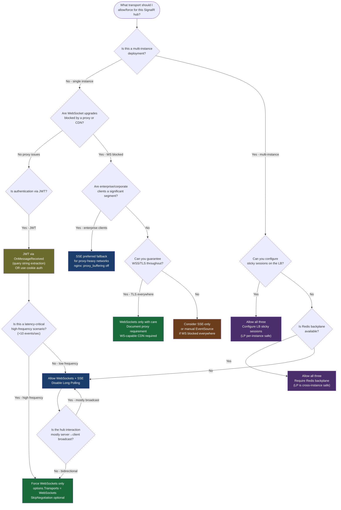

# 4.221 — SignalR Transports: WebSockets, SSE, and Long Polling Negotiation

---

## PART 0 — Navigation & Context

### Domain Hierarchy

```
ASP.NET Core Mastery
└── Q. SignalR & Real-Time (4.219–4.230)
    ├── 4.219  SignalR Architecture: Hubs, Connections, Transport Negotiation    ← prerequisite
    ├── 4.220  SignalR Hubs: Hub<T>, Methods, Caller/Group/All Targeting         ← prerequisite
    ├── 4.221  SignalR Transports: WebSockets, SSE, Long Polling  ◄ YOU ARE HERE
    ├── 4.222  SignalR Scale-Out: Redis Backplane and Azure SignalR Service
    ├── 4.223  SignalR Authentication: JWT in WebSocket Connection Upgrade
    ├── 4.224  SignalR Groups: Membership Management
    ├── 4.225  SignalR Streaming: IAsyncEnumerable<T> from Hub to Client
    └── 4.226–4.230  Client Libraries, SSE Manual, Long Polling Manual
```

### Related Subsystems

```
I. HTTP Fundamentals
   ├── 4.127  HTTP/2: Multiplexing (affects WebSocket upgrade over H2)
   ├── 4.129  HTTP/3 / QUIC (WebTransport future)
   └── 4.131  WebSockets Manual (raw API SignalR wraps)

E. Middleware Pipeline
   └── 4.049  Middleware Pipeline (SignalR sits at UseEndpoints position)
```

### What You Need Before This

- **[[4.219 — SignalR Architecture]]** — understand what a Hub connection is and that SignalR is transport-agnostic above the `ITransport` layer
- **[[4.131 — WebSockets Manual]]** — know what the raw `WebSocket` protocol is: the HTTP upgrade handshake, the framing format, the opcode model
- **[[4.049 — The Middleware Pipeline]]** — SignalR's `MapHub<T>` sits at the endpoint routing layer; transport selection happens inside it
- **[[4.127 — HTTP/2]]** — HTTP/2 forbids Upgrade header; WebSockets require HTTP/1.1 by default (or HTTP/2 WebSockets via RFC 8441)

### What This Unlocks After

- **[[4.222 — SignalR Scale-Out]]** — sticky sessions (required for Long Polling and SSE) vs connection affinity strategies with Redis backplane
- **[[4.223 — SignalR Authentication]]** — JWT cannot be sent in an Authorization header on a WebSocket upgrade; the transport selection affects how auth tokens reach the server
- **[[4.225 — SignalR Streaming]]** — streaming over WebSockets is efficient; streaming over Long Polling is expensive; transport choice affects streaming viability
- **[[4.129 — HTTP/3 and QUIC]]** — WebTransport (future) will replace WebSockets as the bidirectional channel; QUIC streams are the underlying mechanism

### Why This Matters in Production

Transport selection is the difference between a real-time feature that scales to 50 000 concurrent connections and one that collapses under load because every Long Polling client holds an HTTP thread and a load balancer without sticky sessions silently breaks SSE. Choosing the wrong transport — or letting the client negotiate one you have not hardened — is an architecture bug that surfaces only under production traffic.

---

## PART 1 — The Core Mental Model

### The Fundamental Rule

> **SignalR's transport negotiation protocol picks the best bidirectional channel available between client and server by running an HTTP POST negotiate step first, then upgrading to the winning transport. The practical consequence is that your load balancer, proxy, firewall, and auth configuration must all support the transports you allow — and when they do not, the fallback chain silently degrades throughput and connection density until you are effectively doing AJAX polling disguised as real-time.**

### The Plain-Language Analogy

Imagine a courier company that delivers packages through three methods: motorbike (fast, bidirectional, stays in contact the whole trip), taxi (one-way radio from dispatcher to driver, driver has to call in for new jobs), and runner (no standing communication — runner goes to dispatch, picks up one job, delivers it, then runs back for another). WebSockets is the motorbike: one persistent connection, frames flow both ways, ultra-low overhead. Server-Sent Events is the taxi radio: the server streams events to the client continuously, but the client can only send new messages by opening a fresh HTTP request. Long Polling is the runner: the client sends a request that hangs open on the server until there is a message or a timeout, then the client immediately sends the next request.

Now imagine a toll-booth (corporate HTTP proxy) that only lets motorbikes through, not the others — or worse, that silently drops the motorbike but lets the runner through. This is exactly what enterprise proxies do to WebSocket `Upgrade` headers. SignalR's negotiate step is the courier company calling ahead to check which roads are open. The critical insight: the fallback is automatic but not free — moving from WebSocket to Long Polling multiplies your server-side connection overhead by 10–100x, because each "connection" is now multiple sequential HTTP requests instead of one persistent TCP socket.

### The Taxonomy Diagram

```mermaid
graph TD
    subgraph TransportLayer["SignalR Transport Layer"]
        direction TB
        NP["HTTP POST /negotiate\n(transport selection handshake)"]
        NP --> WS["WebSockets\n(RFC 6455)"]
        NP --> SSE["Server-Sent Events\n(EventSource API)"]
        NP --> LP["Long Polling\n(HTTP 1.1)"]
    end

    subgraph WebSocketDetail["WebSocket Characteristics"]
        WS_PROTO["HTTP/1.1 Upgrade\nor HTTP/2 (RFC 8441)"]
        WS_FRAME["Binary/Text Frames\n— full duplex"]
        WS_COST["1 TCP socket\nper connection"]
        WS_PROTO --> WS_FRAME --> WS_COST
    end

    subgraph SSEDetail["SSE Characteristics"]
        SSE_PROTO["HTTP GET (keep-alive)\ntext/event-stream"]
        SSE_UNI["Server → Client only\nClient sends via new POST"]
        SSE_COST["1 persistent GET\n+ N POSTs for sends"]
        SSE_PROTO --> SSE_UNI --> SSE_COST
    end

    subgraph LPDetail["Long Polling Characteristics"]
        LP_PROTO["HTTP GET\n(held open until message)"]
        LP_CYCLE["Request → Wait → Response\n→ Immediate re-request"]
        LP_COST["N sequential requests\nhigh server thread pressure"]
        LP_PROTO --> LP_CYCLE --> LP_COST
    end

    subgraph ProtocolStack["SignalR Protocol Stack"]
        direction TB
        HUB["Hub API\n(your C# code)"]
        PROTO["Transfer Protocol\n(JSON or MessagePack)"]
        TRANS["Transport\n(WS / SSE / LP)"]
        TCP["TCP / TLS"]
        HUB --> PROTO --> TRANS --> TCP
    end

    subgraph NegotiateFlow["Negotiate Flow"]
        CLI["Client"]
        NEG_POST["POST /hub/negotiate\nreturns connectionToken\n+ availableTransports[]"]
        WS_UPGRADE["GET /hub?id=TOKEN\nUpgrade: websocket"]
        FALLBACK["On WS failure:\nGET /hub?id=TOKEN\nAccept: text/event-stream"]
        CLI --> NEG_POST --> WS_UPGRADE
        WS_UPGRADE -.->|fails| FALLBACK
    end

    style WS fill:#1a6b3a,color:#fff
    style SSE fill:#1a3d6b,color:#fff
    style LP fill:#6b3d1a,color:#fff
    style NP fill:#4a4a6b,color:#fff
    style HUB fill:#2d6b2d,color:#fff
    style PROTO fill:#4a6b4a,color:#fff
    style TRANS fill:#6b6b2d,color:#fff
```



---

## PART 2 — Deep Mechanics

### 2.1 — The Negotiate Step: HTTP POST Before Any Transport

Every SignalR connection begins with an HTTP POST to `/hub-name/negotiate`. This is not optional, not skippable, and not part of any specific transport — it is transport-agnostic discovery.

```
Pipeline position: UseEndpoints/MapHub<T> — negotiate is handled INSIDE the SignalR endpoint middleware

──► ExceptionHandler ──► HSTS ──► StaticFiles ──► Routing ──► Auth ──► Authorization ──► [MapHub<ChatHub>("/chat")] ──► ●
                                                                                                         ↑
                                                                              negotiate POST hits here,
                                                                              then the transport upgrade
                                                                              also hits here with connection id
```

**Negotiate Request/Response — HTTP wire format:**

```http
// Negotiate Request:
POST /chat/negotiate?negotiateVersion=1 HTTP/1.1
Host: api.example.com
Authorization: Bearer eyJhbGci...
Content-Length: 0

// Negotiate Response (200 OK):
HTTP/1.1 200 OK
Content-Type: application/json

{
  "negotiateVersion": 1,
  "connectionId": "abc123def456",
  "connectionToken": "abc123def456-secure-token",
  "availableTransports": [
    {
      "transport": "WebSockets",
      "transferFormats": ["Text", "Binary"]
    },
    {
      "transport": "ServerSentEvents",
      "transferFormats": ["Text"]
    },
    {
      "transport": "LongPolling",
      "transferFormats": ["Text", "Binary"]
    }
  ]
}
```

The `connectionToken` is distinct from `connectionId` in SignalR v2+. The token is what the client uses in subsequent requests (preventing connection token hijacking). The server maps token → connectionId internally.

**Framework source behavior (approximate):**

```csharp
// ASP.NET Core internally — HttpConnectionDispatcher.NegotiateAsync():
// Microsoft.AspNetCore.Http.Connections, HttpConnectionDispatcher.cs

internal async Task NegotiateAsync(HttpContext context)
{
    // 1. Authenticate first — negotiate inherits the auth result from UseAuthentication
    // 2. Generate connectionId (Guid) and connectionToken (Guid + HMAC)
    // 3. Store HttpConnectionContext in IConnectionManager (in-memory store)
    // 4. Filter availableTransports based on HttpConnectionDispatcherOptions
    // 5. Return JSON response

    // Cost: ~2 allocations (connectionId string, response object)
    //       1 ConcurrentDictionary write to connection store
    //       ~0.5ms local, ~2ms with auth validation
}
```

> [!IMPORTANT] **The negotiate POST must be authenticated identically to the hub connection.** If you put `[Authorize]` on a hub, the negotiate POST runs through the same auth middleware. JWT tokens work here because it is a normal HTTP request with an `Authorization` header. WebSocket upgrade requests cannot carry this header — this is why JWT auth for SignalR must use the `OnMessageReceived` event to pull the token from a query string. This is covered in [[4.223 — SignalR Authentication]].

**Edge case:** When negotiation is disabled (`hubOptions.EnableDetailedErrors` does not affect this, but `options.Transports = HttpTransportType.WebSockets` with `SkipNegotiation = true` on the client does). Skipping negotiation saves one round-trip but means you must guarantee WebSocket support — it will fail silently on non-WS infrastructure. Runtime cost of skipping: saves ~1ms per connection setup but removes all fallback capability.

---

### 2.2 — WebSocket Transport: The Full-Duplex Channel

After a successful negotiate, the client attempts WebSocket upgrade:

```
Pipeline position: The WebSocket upgrade is processed by Kestrel BEFORE reaching managed middleware.
Kestrel's HttpConnection detects "Upgrade: websocket" and transitions to WebSocket state.
The SignalR middleware then wraps the raw WebSocket in WebSocketsTransport.

──► [Kestrel socket accept] ──► [HTTP request parsed] ──► [Upgrade: websocket detected]
         ──► [101 Switching Protocols] ──► [WebSocketsTransport.ProcessAsync()]
                                                ↑
                           bidirectional frame loop starts here —
                           reads and writes run on separate PipeWriter/PipeReader paths
```

**WebSocket Upgrade — HTTP wire format:**

```http
// Upgrade Request:
GET /chat?id=abc123def456 HTTP/1.1
Host: api.example.com
Connection: Upgrade
Upgrade: websocket
Sec-WebSocket-Key: dGhlIHNhbXBsZSBub25jZQ==
Sec-WebSocket-Version: 13
Sec-WebSocket-Protocol: json

// Upgrade Response:
HTTP/1.1 101 Switching Protocols
Connection: Upgrade
Upgrade: websocket
Sec-WebSocket-Accept: s3pPLMBiTxaQ9kYGzzhZRbK+xOo=

// After 101, TCP stream carries WebSocket frames directly:
// [FIN=1, RSV=0, Opcode=Text/Binary, MASK=1, PayloadLen=N, MaskingKey, Payload]
// No HTTP headers on subsequent frames — pure framing protocol
```

**WebSocket frame anatomy inside SignalR:**

```
SignalR protocol (JSON default):
  Frame = WebSocket Text Frame containing:
    { "type": 1, "target": "ReceiveMessage", "arguments": ["order-001", "Shipped"] }\x1e

  \x1e = ASCII 0x1E = Record Separator — SignalR's message delimiter within a frame
  One WebSocket frame can contain multiple SignalR messages (batching)
  One SignalR message can span multiple WebSocket frames (large payloads)
```

**Internal frame processing (approximate):**

```csharp
// WebSocketsTransport.ProcessAsync() — runs two tasks concurrently:

// RECEIVE LOOP (server reads from client):
private async Task StartReceiving(WebSocket socket)
{
    // Rents ArrayPool<byte> buffer (~4KB default)
    // Calls socket.ReceiveAsync() in a loop
    // Writes to PipeWriter (zero-copy path into PipeReader consumed by hub dispatcher)
    // Cost: 1 ArrayPool rent per receive cycle, zero allocations on the hot path
    //       ~1 async state machine per loop iteration (ValueTask, not Task)
}

// SEND LOOP (server writes to client):
private async Task StartSending(WebSocket socket)
{
    // Reads from PipeReader (data written by hub send operations)
    // Calls socket.SendAsync() with ReadOnlyMemory<byte> from pipe
    // Cost: 0 allocations — pipe memory is direct-to-socket
}
```

**Cost labels:**

- Connection establishment: ~1 TCP handshake + ~1 TLS handshake + ~1 HTTP round-trip (upgrade) = 3 network round-trips minimum
- Per-message overhead after upgrade: WebSocket frame header = 2–10 bytes (opcode + length + mask). For a 50-byte JSON message, ~83% payload efficiency
- Server memory per WebSocket connection: ~6KB (Kestrel connection state) + ~16KB (pipe buffers) = ~22KB baseline
- Thread usage: **zero threads held** — fully async I/O completion port model; Kestrel handles 50K+ concurrent WS connections on a single machine

> [!WARNING] **HTTP/2 and WebSockets conflict.** HTTP/2 multiplexes streams but does not support the `Upgrade` header used by RFC 6455 WebSockets. Kestrel resolves this by: (a) negotiating HTTP/1.1 for connections that attempt WS upgrade, or (b) supporting RFC 8441 (WebSockets over HTTP/2) which is enabled in .NET 7+ Kestrel with `ConfigureKestrel(o => o.ConfigureEndpointDefaults(e => e.Protocols = HttpProtocols.Http1AndHttp2))`. Most proxies (nginx, YARP) handle the downgrade automatically, but AWS ALB and Azure Application Gateway have specific WebSocket forwarding settings that must be enabled.

---

### 2.3 — Server-Sent Events Transport: Unidirectional Push Channel

SSE is the fallback when WebSockets are unavailable. It uses a standard HTTP GET that is held open by the server, with the `text/event-stream` content type. The client sends messages via separate HTTP POST requests.

```
Pipeline position: SSE is a normal HTTP request — Auth middleware runs fully.
The GET hold is implemented by never completing the response until the connection closes.

──► ExceptionHandler ──► Auth ──► Authorization ──► MapHub<T>
                                                        ↑
                                      GET request: server writes "data: ...\n\n"
                                      and flushes without closing response
                                      POST requests: client sends hub invocations
```

**SSE wire format:**

```http
// SSE Connection Request:
GET /chat?id=abc123def456 HTTP/1.1
Host: api.example.com
Accept: text/event-stream
Cache-Control: no-cache
Authorization: Bearer eyJhbGci...

// SSE Response (headers, then stream):
HTTP/1.1 200 OK
Content-Type: text/event-stream; charset=utf-8
Cache-Control: no-cache
Transfer-Encoding: chunked
X-Content-Type-Options: nosniff

// Each message sent as:
data: {"type":1,"target":"ReceiveMessage","arguments":["order-001","Shipped"]}\u001e

// Empty line terminates an SSE event:
data: <payload>\n
\n

// Heartbeat (keep-alive comment):
: ping\n
\n
```

**Client sending via POST (for hub invocations from client to server):**

```http
POST /chat?id=abc123def456 HTTP/1.1
Host: api.example.com
Content-Type: application/json; charset=utf-8
Authorization: Bearer eyJhbGci...

{"type":1,"invocationId":"1","target":"SendMessage","arguments":["Hello"]}
```

**Internal SSE processing (approximate):**

```csharp
// ServerSentEventsTransport.ProcessAsync():
// Reads from application PipeReader (SignalR writes hub messages here)
// Formats each message as "data: {payload}\n\n"
// Calls HttpResponse.Body.WriteAsync() and FlushAsync()
// Cost: 1 string allocation per message for "data: " prefix
//       1 FlushAsync call per message (network syscall)
//       Memory: ~4KB pipe buffers + open HTTP response (Response.Body held open)

// The response is never "completed" — it stays open until:
// (a) client disconnects (TCP FIN), (b) server closes, or (c) timeout
```

**Cost labels:**

- Server memory per SSE connection: ~8KB (HTTP response state) + ~4KB pipe buffers = ~12KB baseline (less than WS due to no WebSocket framing state)
- Client-to-server latency: each message requires a full new HTTP request (~20–100ms depending on round-trip time) vs WebSocket send (~1–5ms)
- **SSE reconnection:** The browser EventSource API automatically reconnects after disconnection using the `Last-Event-ID` header. SignalR's SSE transport honours this to replay missed messages from the connection buffer.

> [!WARNING] **SSE breaks under HTTP/2 on some proxies.** Unlike WebSockets, SSE is valid HTTP/2 — it uses a server push stream. However, many load balancers (AWS ALB classic) buffer the response body and only flush when the connection closes, which breaks SSE entirely. nginx requires `proxy_buffering off` for SSE to function. This is the #1 production SSE outage cause.

---

### 2.4 — Long Polling Transport: The Last Resort

Long Polling has no persistent connection. The client sends a GET request which the server holds open until a message is available (or a timeout elapses), then responds with the message(s), and the client immediately sends the next GET request. It looks like a real-time connection from the client's perspective, but on the server it is sequential HTTP requests.

```
Timeline diagram:

Client              Server
  |                   |
  |-- GET /hub?id=X -->|   (server holds request, ~30s default timeout)
  |                   |
  |                 [message arrives]
  |                   |
  |<-- 200 {data} ----|
  |                   |
  |-- GET /hub?id=X -->|   (immediately re-poll)
  |                   |
  |                 [no message for 29s]
  |<-- 204 No Content-|   (timeout, nothing to send)
  |                   |
  |-- GET /hub?id=X -->|   (continue polling)

// POST for client→server messages runs in parallel with the GET:
  |-- POST /hub?id=X -->|  (hub invocation)
  |<-- 200 OK ----------|  (acknowledged)
```

**Long Polling wire format:**

```http
// Poll Request (held open by server):
GET /chat?id=abc123def456 HTTP/1.1
Host: api.example.com
Authorization: Bearer eyJhbGci...

// Response when message available:
HTTP/1.1 200 OK
Content-Type: application/octet-stream
Content-Length: 67

{"type":1,"target":"ReceiveMessage","arguments":["order-001","Shipped"]}\x1e

// Response when timeout (no messages):
HTTP/1.1 204 No Content
```

**Internal Long Polling processing (approximate):**

```csharp
// LongPollingTransport.ProcessAsync():
// Calls application.Input.ReadAsync() with CancellationToken(timeout: 30s)
// If data arrives: flush all buffered messages to response, return 200
// If timeout: return 204 No Content
// On next poll: client sends fresh GET request with same connectionId

// Cost per poll cycle:
//   1 HTTP request/response round-trip
//   1 Task allocation for the hold
//   1 CancellationTokenSource for the 30s timeout (~100 bytes)
//   ~200 bytes total allocation per poll cycle

// At 100 concurrent LP connections, polling every 30s:
//   ~3.3 requests/second just for keep-alive polls
//   Each request: 1 async state machine + 1 socket accept + 1 response write
```

**Cost labels:**

- Server-side memory per Long Polling "connection": ~32KB per in-flight request (ASP.NET Core request overhead) × N concurrent polls
- Thread usage: Long Polling does NOT hold threads (async I/O) but **does hold HTTP connections**, which exhausts connection pool limits on proxies faster
- Proxy timeout risk: proxies that close idle connections after 60s will kill Long Polling before the 30s SignalR timeout if the proxy timeout is not adjusted
- **Sticky sessions required:** Long Polling connections consist of multiple HTTP requests. Without sticky sessions (same request always goes to same server instance), the connection ID resolves to an in-memory connection store on the wrong server instance → connection dropped. This is the #1 Long Polling production bug.

> [!DANGER] **Never allow Long Polling in production without sticky sessions.** Unlike WebSockets (which are a single long-lived TCP connection and naturally stick to one server), Long Polling sends multiple HTTP requests that any server in the farm can receive. The connection state is in-memory on one server. Result: "connection not found" errors and constant disconnects. Use Redis backplane ([[4.222 — SignalR Scale-Out]]) to distribute connection state, or configure sticky sessions on your load balancer.

---

### 2.5 — The Negotiation Protocol: How Fallback is Decided

The JavaScript SignalR client executes this decision algorithm after receiving the negotiate response:

```
Client-side negotiation algorithm (JavaScript client, simplified):

1. POST /negotiate → get availableTransports[]
2. Filter client-supported transports (default: all three)
3. Apply options.transport override if set
4. Try transports in priority order:
   a. WebSockets  (highest priority)
   b. ServerSentEvents
   c. LongPolling
5. Attempt upgrade/connect for chosen transport
6. On failure (5s timeout or HTTP error): try next transport
7. On all transports exhausted: connection fails, fires onclose()

Retry schedule on disconnect:
   0s, 2s, 10s, 30s, ... (exponential backoff, configurable)
```

**Configuring allowed transports on the server:**

```csharp
// ASP.NET Core internally:
// HttpConnectionDispatcherOptions controls what is advertised in negotiate response.
// The server enforces this — client preference is constrained to server's allowed set.

app.MapHub<OrderStatusHub>("/order-status", options =>
{
    // Tell clients only WebSockets is available:
    options.Transports = HttpTransportType.WebSockets;

    // Or allow all three (default):
    options.Transports =
        HttpTransportType.WebSockets |
        HttpTransportType.ServerSentEvents |
        HttpTransportType.LongPolling;

    // Negotiation wire-level tuning:
    options.WebSockets.CloseTimeout = TimeSpan.FromSeconds(5);
    options.LongPolling.PollTimeout = TimeSpan.FromSeconds(90); // default: 90s in .NET 8
});
```

**Cost label:** The negotiate round-trip adds ~1 RTT to connection setup (typically 20–100ms). On mobile networks this can be 200–500ms. `SkipNegotiation = true` on the client eliminates this but forces WebSockets and removes fallback.

---

### 2.6 — Failure Mode Diagrams

**WebSocket upgrade rejected by proxy:**

```
Client → Load Balancer → Server
  |                          |
  |-- GET /chat?id=X ------->|
  |   Upgrade: websocket     |
  |                          |
  | LB rewrites to HTTP/1.1  |
  | strips Upgrade header    |
  |                          |
  |<-- 200 OK (not 101) -----|
  |                          |
  Client interprets as HTTP 200, not WS — connection fails
  SignalR client logs: "WebSockets connection failed"
  Falls back to SSE or LP
```

**SSE buffered by proxy:**

```
Client → nginx (proxy_buffering on) → Server
  |                                       |
  |-- GET /chat?id=X Accept: text/event-stream -->|
  |                                       |
  |                              Server sends:
  |                              "data: message1\n\n"
  |                              (flushed to nginx)
  |                              nginx BUFFERS it
  |                              (waits for more data)
  |                                       |
  | Client receives nothing ← nginx silent buffering
  |
  Client triggers reconnect after EventSource timeout
  Result: perceived disconnects, SSE appears non-functional
  Fix: proxy_buffering off; in nginx location block
```

---

## PART 3 — Production Code Patterns

### Pattern 1 — The Transport Hardening Configuration for a Financial Order Status API

Disabling Long Polling in a high-concurrency trading API where sticky sessions cannot be guaranteed, with WebSocket ping/pong tuning to detect stale connections before the load balancer's 60s idle timeout.

```csharp
// ⚠️ WRONG: Allowing all transports without considering infrastructure constraints
// Result: LP clients connect without sticky sessions → "connection not found" errors
// under any multi-instance deployment
builder.Services.AddSignalR();
app.MapHub<TradeStatusHub>("/trade-status");

// ✅ CORRECT: Transport-aware hub registration for a trading platform
builder.Services.AddSignalR(hubOptions =>
{
    // Global hub options — apply to all hubs
    hubOptions.EnableDetailedErrors = builder.Environment.IsDevelopment();

    // Keep alive: ping client every 15s, consider disconnected after 30s with no pong
    // Critical: must be < load balancer idle timeout (typically 60s for AWS ALB)
    hubOptions.KeepAliveInterval = TimeSpan.FromSeconds(15);
    hubOptions.ClientTimeoutInterval = TimeSpan.FromSeconds(30);

    // Maximum message size — reject oversized payloads before they allocate
    hubOptions.MaximumReceiveMessageSize = 64 * 1024; // 64 KB
});

app.MapHub<TradeStatusHub>("/trade-status", options =>
{
    // Disallow Long Polling — our infrastructure has no sticky sessions
    // SSE is acceptable because it is a single persistent GET
    options.Transports =
        HttpTransportType.WebSockets |
        HttpTransportType.ServerSentEvents;

    // WebSocket tuning: close handshake timeout
    options.WebSockets.CloseTimeout = TimeSpan.FromSeconds(3);

    // If only WebSockets available:
    // options.Transports = HttpTransportType.WebSockets;
    // Then on JS client:
    // connection = new signalR.HubConnectionBuilder()
    //     .withUrl("/trade-status", { skipNegotiation: true, transport: signalR.HttpTransportType.WebSockets })
    //     .build();
});

// HTTP wire consequence:
// Negotiate response now returns only:
// { "availableTransports": [{ "transport": "WebSockets", ... }, { "transport": "ServerSentEvents", ... }] }
// LP clients get 400 when they attempt LP connect:
// HTTP/1.1 400 Bad Request — "The LongPolling transport is not supported"
```

---

### Pattern 2 — The Proxy-Compatible Hub Deployment with nginx

Configuring the server side to emit correct headers, and the nginx proxy side to not buffer SSE or strip WebSocket headers, for an e-commerce order tracking service.

```csharp
// ✅ Server side — ensure WebSocket middleware is registered and CORS is correct

// In Kestrel/IIS: no change needed — Kestrel accepts WS upgrades natively
// For development with IIS Express: add web.config webSocket handler

// In Program.cs:
builder.Services.AddSignalR();

// CORS must explicitly allow WebSocket origin — standard CORS does not apply
// to WS upgrades (they use Origin header, not Access-Control-Request-Method)
builder.Services.AddCors(options =>
{
    options.AddPolicy("OrderTrackingCors", policy =>
    {
        // Must not use AllowAnyOrigin() with AllowCredentials()
        // WebSocket handshake sends Origin header — server validates it
        policy
            .WithOrigins("https://orders.acme.com", "https://m.acme.com")
            .AllowAnyHeader()
            .AllowAnyMethod()
            .AllowCredentials(); // Required for cookie auth on WebSocket upgrade
    });
});

app.UseCors("OrderTrackingCors");
app.MapHub<OrderTrackingHub>("/order-tracking");
```

```nginx
# nginx configuration for WebSocket + SSE pass-through
# /etc/nginx/sites-available/order-tracking.conf

upstream order_api {
    server 127.0.0.1:5000;
    # sticky sessions if using Long Polling:
    # ip_hash;
}

server {
    listen 443 ssl http2;
    server_name api.acme.com;

    location /order-tracking {
        proxy_pass http://order_api;
        proxy_http_version 1.1;

        # WebSocket upgrade headers — CRITICAL: without these, 101 never happens
        proxy_set_header Upgrade $http_upgrade;
        proxy_set_header Connection $connection_upgrade;

        # SSE: disable buffering so events are flushed immediately
        proxy_buffering off;
        proxy_cache off;

        # Extend timeout beyond SignalR's KeepAliveInterval
        # nginx default is 60s — must be > SignalR ClientTimeoutInterval (30s)
        proxy_read_timeout 300s;
        proxy_send_timeout 300s;

        # Forward real client IP for logging and rate limiting
        proxy_set_header X-Real-IP $remote_addr;
        proxy_set_header X-Forwarded-For $proxy_add_x_forwarded_for;
        proxy_set_header Host $host;
    }
}

# WebSocket upgrade map — required for dynamic Upgrade header handling
map $http_upgrade $connection_upgrade {
    default upgrade;
    '' close;
}
```

```http
// HTTP consequence — WebSocket upgrade through nginx:
// Client → nginx → Kestrel:
GET /order-tracking?id=TOKEN HTTP/1.1
Upgrade: websocket
Connection: Upgrade

// nginx forwards (not strips) the Upgrade header due to the map block
// Kestrel responds:
HTTP/1.1 101 Switching Protocols
Upgrade: websocket
Connection: Upgrade
// nginx passes the 101 upstream → client gets full WebSocket connection
```

---

### Pattern 3 — The Transport Diagnostics Middleware for Production Debugging

When transport negotiation fails silently in production, you need visibility into which transports clients are actually using — not what you think they are using.

```csharp
// ✅ Hub filter that logs transport type for every new connection
// Registered globally to cover all hubs

public sealed class TransportDiagnosticsFilter : IHubFilter
{
    private readonly ILogger<TransportDiagnosticsFilter> _logger;

    public TransportDiagnosticsFilter(ILogger<TransportDiagnosticsFilter> logger)
        => _logger = logger;

    public async ValueTask<object?> InvokeMethodAsync(
        HubInvocationContext invocationContext,
        Func<HubInvocationContext, ValueTask<object?>> next)
    {
        return await next(invocationContext);
    }

    public Task OnConnectedAsync(HubLifetimeContext context, Func<HubLifetimeContext, Task> next)
    {
        // IHttpContextFeature exposes the HTTP context including transport information
        // The transport is embedded in the connection features
        var httpContext = context.Context.GetHttpContext();
        var transport = httpContext?.Features.Get<IHttpTransportFeature>()?.TransportType
                        ?? "Unknown";

        _logger.LogInformation(
            "SignalR connection {ConnectionId} established via {Transport}. " +
            "Client: {UserAgent}, RemoteIP: {RemoteIP}",
            context.Context.ConnectionId,
            transport,
            httpContext?.Request.Headers.UserAgent.ToString() ?? "none",
            httpContext?.Connection.RemoteIpAddress?.ToString() ?? "none");

        return next(context);
    }

    public Task OnDisconnectedAsync(
        HubLifetimeContext context,
        Exception? exception,
        Func<HubLifetimeContext, Exception?, Task> next)
    {
        if (exception is not null)
        {
            _logger.LogWarning(exception,
                "SignalR connection {ConnectionId} disconnected with error",
                context.Context.ConnectionId);
        }

        return next(context, exception);
    }
}

// Registration:
builder.Services.AddSignalR(options =>
{
    options.AddFilter<TransportDiagnosticsFilter>();
});
builder.Services.AddSingleton<TransportDiagnosticsFilter>();
```

---

### Pattern 4 — The Skip-Negotiation Pattern for Latency-Critical Shipment Tracking

For a logistics real-time shipment tracking dashboard where every millisecond of connection setup matters and WebSocket support is guaranteed.

```csharp
// ✅ Server: restrict to WebSockets only, skip negotiate response generation
app.MapHub<ShipmentTrackingHub>("/shipment-tracking", options =>
{
    // Server only accepts WebSocket connections — LP/SSE return 400
    options.Transports = HttpTransportType.WebSockets;
});

// HTTP consequence of skipping negotiation:
// Client sends WebSocket upgrade directly WITHOUT the POST /negotiate step
// Saves one full round-trip (~30-100ms on typical internet connection)

// ✅ Client (JavaScript):
/*
const connection = new signalR.HubConnectionBuilder()
    .withUrl("/shipment-tracking", {
        skipNegotiation: true,
        transport: signalR.HttpTransportType.WebSockets,
        // JWT token for auth — must use accessTokenFactory since WS can't use Authorization header
        accessTokenFactory: () => getStoredJwtToken()
    })
    .withAutomaticReconnect([0, 2000, 5000, 10000, 30000])
    .configureLogging(signalR.LogLevel.Information)
    .build();
*/

// ✅ Client (.NET):
var connection = new HubConnectionBuilder()
    .WithUrl("https://logistics.acme.com/shipment-tracking", options =>
    {
        options.SkipNegotiation = true;
        options.Transports = HttpTransportType.WebSockets;
        // For machine-to-machine: service account JWT
        options.AccessTokenProvider = () => Task.FromResult<string?>(
            _serviceAccountTokenProvider.GetToken());
    })
    .WithAutomaticReconnect(new[] { TimeSpan.Zero, TimeSpan.FromSeconds(2), TimeSpan.FromSeconds(5) })
    .Build();
```

---

### Pattern 5 — The Reconnection Strategy for a Patient Monitoring Hub

For a healthcare patient vital signs dashboard where reconnection must be invisible to clinical staff, with exponential backoff and state recovery.

```csharp
// ✅ Server: configure hub with generous timeouts for clinical environments
// (hospital networks can have intermittent connectivity)
builder.Services.AddSignalR(options =>
{
    // Clinical staff must not lose connection silently — detect it fast
    options.KeepAliveInterval = TimeSpan.FromSeconds(10);
    options.ClientTimeoutInterval = TimeSpan.FromSeconds(20);
    options.HandshakeTimeout = TimeSpan.FromSeconds(15);
});

// ✅ Server: hub sends last-known state on reconnect
[Authorize(Policy = "ClinicalStaff")]
public class VitalSignsHub : Hub
{
    private readonly IVitalSignsRepository _repository;

    public VitalSignsHub(IVitalSignsRepository repository)
        => _repository = repository;

    public override async Task OnConnectedAsync()
    {
        // On every connect (including reconnect after transport fallback):
        // resend current state so client is immediately up-to-date
        var patientId = Context.User!.FindFirst("patient_id")?.Value;
        if (patientId is not null)
        {
            var current = await _repository.GetLatestVitalsAsync(patientId);
            // TypedHubs pattern: send to the specific connection that just connected
            await Clients.Caller.SendAsync("VitalsSnapshot", current);
        }

        await base.OnConnectedAsync();
    }
}

// ✅ Client (.NET): custom reconnection with state recovery
var connection = new HubConnectionBuilder()
    .WithUrl("https://portal.hospital.com/vitals")
    .WithAutomaticReconnect(new RetryPolicy())
    .Build();

// Custom retry policy: geometric backoff with max 60s ceiling
public sealed class RetryPolicy : IRetryPolicy
{
    private static readonly TimeSpan[] _delays =
        [TimeSpan.Zero, TimeSpan.FromSeconds(1), TimeSpan.FromSeconds(3),
         TimeSpan.FromSeconds(10), TimeSpan.FromSeconds(30), TimeSpan.FromSeconds(60)];

    public TimeSpan? NextRetryDelay(RetryContext retryContext)
    {
        // Stop retrying after 10 minutes (600s cumulative elapsed)
        if (retryContext.ElapsedTime > TimeSpan.FromMinutes(10))
            return null; // null = stop retrying, fire Closed event

        var index = (int)Math.Min(retryContext.PreviousRetryCount, _delays.Length - 1);
        return _delays[index];
    }
}
```

---

### Pattern 6 — The Load-Balanced Long Polling Configuration with Redis

When Long Polling cannot be avoided (e.g., corporate browsers blocking WebSockets), use Redis backplane to make the in-memory connection store cross-instance.

```csharp
// ⚠️ WRONG: Long Polling in multi-instance deployment without Redis
// Hub invocations from instance B cannot reach connections registered on instance A
builder.Services.AddSignalR();
// app.MapHub<SupportChatHub>("/support-chat"); → silent LP connection drops

// ✅ CORRECT: Redis backplane makes all connection state cross-instance
// Package: Microsoft.AspNetCore.SignalR.StackExchangeRedis

builder.Services.AddSignalR()
    .AddStackExchangeRedis(
        builder.Configuration.GetConnectionString("Redis")!,
        options =>
        {
            // Channel prefix isolates this app from others on the same Redis instance
            options.Configuration.ChannelPrefix = RedisChannel.Literal("SupportChat:");
        });

app.MapHub<SupportChatHub>("/support-chat", options =>
{
    // Allow LP with Redis — now cross-instance routing works
    options.Transports =
        HttpTransportType.WebSockets |
        HttpTransportType.ServerSentEvents |
        HttpTransportType.LongPolling;

    // Reduce LP timeout to lower the connection hold time per request
    // Lower = more frequent reconnects but less memory per held request
    options.LongPolling.PollTimeout = TimeSpan.FromSeconds(30);
});

// HTTP consequence:
// LP requests from any server instance now successfully route messages
// because Redis pub/sub delivers the message to whichever instance holds the connection
```

---

## PART 4 — Gotchas & Anti-Patterns

### Gotcha 1: WebSocket Upgrade Silently Falls Back Because the Auth Token Is in the Wrong Place

JWT authentication for APIs sends `Authorization: Bearer <token>` as an HTTP header. WebSocket upgrade requests are HTTP requests, but the browser's WebSocket API does not allow setting arbitrary headers — it only sends the standard handshake headers. The SignalR client sends the JWT as a query string parameter instead (`?access_token=`). If the server-side `OnMessageReceived` event is not configured to read from the query string, the WebSocket upgrade succeeds with a 101 but the `HttpContext.User` is anonymous, and the first hub method invocation hits an `[Authorize]` check and closes the connection with a 403 — but the SignalR client sees it as a sudden disconnect, not an auth failure.

```csharp
// ⚠️ WRONG: JWT config that works for REST but silently breaks WebSocket auth
builder.Services.AddAuthentication(JwtBearerDefaults.AuthenticationScheme)
    .AddJwtBearer(options =>
    {
        options.TokenValidationParameters = new TokenValidationParameters
        {
            ValidIssuer = "https://auth.acme.com",
            ValidAudience = "order-api",
            IssuerSigningKey = new SymmetricSecurityKey(keyBytes)
        };
        // Missing: OnMessageReceived for query string token
    });

// HTTP consequence (wrong path):
// WebSocket upgrade: GET /order-status?id=TOKEN&access_token=eyJ... → 101 OK (auth skipped)
// First hub method: context.User.Identity.IsAuthenticated = false
// [Authorize] on hub fires → connection closed with error
// Client sees: "disconnected" with no useful error message
```

```csharp
// ✅ CORRECT: Add OnMessageReceived to read token from query string for WebSocket/SSE
builder.Services.AddAuthentication(JwtBearerDefaults.AuthenticationScheme)
    .AddJwtBearer(options =>
    {
        options.TokenValidationParameters = new TokenValidationParameters
        {
            ValidIssuer = "https://auth.acme.com",
            ValidAudience = "order-api",
            IssuerSigningKey = new SymmetricSecurityKey(keyBytes)
        };
        options.Events = new JwtBearerEvents
        {
            OnMessageReceived = context =>
            {
                // SignalR JS client sends JWT as ?access_token= query param for WS/SSE
                var accessToken = context.Request.Query["access_token"];
                var path = context.HttpContext.Request.Path;
                if (!string.IsNullOrEmpty(accessToken) &&
                    path.StartsWithSegments("/order-status"))
                {
                    context.Token = accessToken;
                }
                return Task.CompletedTask;
            }
        };
    });

// HTTP consequence (correct path):
// WebSocket upgrade: GET /order-status?access_token=eyJ... → 101 Switching Protocols
// Token extracted from query string, validated, User set
// [Authorize] passes, hub connection fully established
```

**WHY:** WebSocket upgrades are HTTP requests, but the browser WebSocket API does not allow custom headers. SignalR's JavaScript client uses the `accessTokenFactory` callback and appends the token to the query string for WS and SSE transport connections. The server must explicitly opt in to reading from this location.

---

### Gotcha 2: Long Polling "Works" in Development But Drops Connections in Production Due to Missing Sticky Sessions

In development, there is only one server instance. Every Long Polling request hits the same in-memory connection store. In production with 3+ instances behind a round-robin load balancer, GET /hub?id=TOKEN hits instance A which knows the connection, then the next GET hits instance B which has no record of it and returns 404. The SignalR client retries and eventually reconnects (creating a new negotiate → new connection), which looks like intermittent disconnects.

```csharp
// ⚠️ WRONG CODE: Allowing Long Polling in multi-instance deployment without sticky sessions
app.MapHub<SupportChatHub>("/support", options =>
{
    options.Transports =
        HttpTransportType.WebSockets |
        HttpTransportType.ServerSentEvents |
        HttpTransportType.LongPolling; // LP allowed without Redis backplane
});

// HTTP consequence (wrong path):
// GET /support?id=abc → Instance A → 200 (connection found)
// GET /support?id=abc → Instance B → 404 Not Found
// Client: "Error: Connection id 'abc' not found"
// Client triggers reconnect → new connectionId → same problem
```

```csharp
// ✅ CORRECT: Either add Redis backplane or disable Long Polling
// Option 1: Add Redis (handles all transports correctly)
builder.Services.AddSignalR().AddStackExchangeRedis(redisConnectionString);

// Option 2: Disable Long Polling if sticky sessions cannot be guaranteed
app.MapHub<SupportChatHub>("/support", options =>
{
    options.Transports =
        HttpTransportType.WebSockets |
        HttpTransportType.ServerSentEvents;
    // LP intentionally excluded
});

// HTTP consequence (correct path):
// WebSocket or SSE: single persistent connection → naturally sticky
// LP with Redis: messages routed via pub/sub regardless of which instance receives the poll
```

**WHY:** Long Polling connection state is stored in `HttpConnectionManager` which is an in-memory `ConcurrentDictionary<string, HttpConnectionContext>`. There is no built-in cross-process sharing. WebSockets and SSE are implicitly sticky because they are a single long-lived TCP connection to one server.

---

### Gotcha 3: KeepAliveInterval Set Higher Than Load Balancer Idle Timeout Causes Silent Disconnects

SignalR uses WebSocket ping frames (opcode 0x9) to keep connections alive. The default `KeepAliveInterval` in ASP.NET Core 8 is 15 seconds. AWS Application Load Balancer's default idle timeout is also 60 seconds — so the keep-alive fires well before the ALB times out. The gotcha: Azure Application Gateway defaults to **20 seconds** idle timeout. If `KeepAliveInterval` is 15s, SignalR sends a ping at 15s, the client must respond within `ClientTimeoutInterval` (default 30s), so SignalR considers the connection alive until 45s. But Azure AG already closed the TCP connection at 20s. Neither side sends a TCP RST that reaches the application layer — the connection appears alive until the next ping/pong cycle fails.

```csharp
// ⚠️ WRONG: Default KeepAlive/Timeout values with Azure Application Gateway
builder.Services.AddSignalR(); // KeepAliveInterval = 15s, ClientTimeoutInterval = 30s
// Azure AG idle timeout = 20s (default)
// TCP RST from AG at 20s, but neither SignalR server nor client detects it immediately
// At 30s: server's ClientTimeoutInterval fires → server closes "phantom" connection
// At 15s: next ping scheduled, never receives pong → disconnect detected at 30s
// Result: connections appear alive for 30s after AG killed them

// HTTP consequence (wrong path):
// Hub.SendAsync() to a dead connection succeeds (no exception) until next ping cycle
// Messages silently lost — no send error thrown
```

```csharp
// ✅ CORRECT: KeepAlive must be less than half the load balancer idle timeout
// Azure AG: set idle timeout to 600s (max for WebSockets) in portal, OR:
builder.Services.AddSignalR(options =>
{
    // For Azure AG with default 20s timeout (if not changed):
    // KeepAlive at 10s → server pings at 10s → AG sees traffic, resets its idle counter
    options.KeepAliveInterval = TimeSpan.FromSeconds(10);
    options.ClientTimeoutInterval = TimeSpan.FromSeconds(20);

    // For correctly configured AG (idle timeout >= 600s):
    // options.KeepAliveInterval = TimeSpan.FromSeconds(15);  // ASP.NET Core default
    // options.ClientTimeoutInterval = TimeSpan.FromSeconds(30);
});

// HTTP consequence (correct path):
// WebSocket ping frame sent at 10s → AG sees TCP activity → resets idle counter
// Client responds with pong → connection confirmed alive
// No phantom connections
```

**WHY:** WebSocket keep-alive operates at the WebSocket protocol level (ping/pong frames), below the HTTP level. Load balancers operate at TCP/HTTP level. The load balancer sees the WebSocket framing traffic as evidence of connection activity and resets its idle timer — but only if the ping frequency is less than the LB's idle timeout.

---

### Gotcha 4: Disabling All Fallback Transports Without Verifying Proxy WebSocket Support — Corporate Proxy Kills Production

A development team decides Long Polling is too expensive, disables it and SSE, and deploys `options.Transports = HttpTransportType.WebSockets` with `SkipNegotiation = true`. Works perfectly in staging. In production, 30% of enterprise users (behind Zscaler or Blue Coat proxies) cannot connect at all because the proxy intercepts TLS but does not support WebSocket upgrade — returning 200 instead of 101, which the SignalR client logs as a WebSocket error and then has no fallback transports to try.

```csharp
// ⚠️ WRONG: WebSockets-only with SkipNegotiation for enterprise SaaS
app.MapHub<InventoryAlertHub>("/inventory", options =>
{
    options.Transports = HttpTransportType.WebSockets; // Only WS
});
// Client SkipNegotiation=true means no fallback possible

// HTTP consequence (wrong path) through Zscaler proxy:
// GET /inventory?id=X HTTP/1.1
// Upgrade: websocket
// → Zscaler returns: HTTP/1.1 200 OK (ignores Upgrade, treats as plain GET)
// → SignalR client: "Expected 101, got 200" → connection failed
// → No fallback → connection.start() rejects
// Enterprise user: "The dashboard doesn't load"
```

```csharp
// ✅ CORRECT: Allow SSE as fallback for corporate proxy environments
app.MapHub<InventoryAlertHub>("/inventory", options =>
{
    options.Transports =
        HttpTransportType.WebSockets |
        HttpTransportType.ServerSentEvents;
    // LP still excluded to avoid sticky session requirement
    // SSE works through most HTTP proxies that understand streaming responses
});
// Do NOT use SkipNegotiation — let the client negotiate per proxy capability

// HTTP consequence (correct path) through Zscaler proxy:
// POST /inventory/negotiate → { "availableTransports": ["WebSockets", "ServerSentEvents"] }
// WS attempt → 200 (proxy doesn't support upgrade) → WS fails
// SSE attempt → GET /inventory Accept: text/event-stream → 200 OK (streaming)
// → Proxy must not buffer SSE (most don't for chunked transfer)
// Enterprise users: dashboard works via SSE
```

**WHY:** SSE is plain HTTP — a GET request with `text/event-stream` content type and chunked transfer encoding. Most HTTP proxies (including MITM TLS inspection proxies) pass it through correctly without any special proxy configuration. It is the most proxy-compatible fallback transport for enterprise environments.

---

### Gotcha 5: SSE Breaks Under HTTP/2 When nginx Buffers the Response

SSE requires that each event be flushed to the client immediately. HTTP/2 multiplexes streams, and some nginx versions with HTTP/2 enabled treat the SSE response as a regular chunked response and buffer it in the stream buffer before forwarding. The client sees no events for seconds, then gets a batch. Worse, the keep-alive comment (`": ping\n\n"`) that SignalR sends every 15s is buffered too, so the client thinks the connection is dead and reconnects.

```nginx
# ⚠️ WRONG: HTTP/2 enabled without SSE-specific proxy config
server {
    listen 443 ssl http2;  # HTTP/2 enabled globally
    location /support {
        proxy_pass http://localhost:5000;
        # Missing: proxy_buffering off for this SSE location
    }
}
# HTTP consequence (wrong path):
# SSE events buffered in nginx HTTP/2 stream buffer
# Client sees: events arrive in unpredictable batches
# SignalR client keep-alive comments buffered → client triggers reconnect
# Result: constant reconnect loop, high server connection churn
```

```nginx
# ✅ CORRECT: Disable proxy buffering for the SignalR endpoint
server {
    listen 443 ssl http2;
    location /support {
        proxy_pass http://localhost:5000;
        proxy_http_version 1.1;

        # WebSocket headers
        proxy_set_header Upgrade $http_upgrade;
        proxy_set_header Connection $connection_upgrade;

        # SSE: disable nginx response buffering for this location
        proxy_buffering off;

        # HTTP/2: nginx-to-upstream is always HTTP/1.1 (correct — Kestrel handles H2 natively)
        # The proxy_http_version 1.1 ensures the upstream connection is H1.1
        # The client-facing connection is H2 — nginx bridges them

        proxy_read_timeout 300s;
    }
}
# HTTP consequence (correct path):
# SSE events: nginx writes to H2 stream immediately on receipt from upstream
# Client sees events within <1ms of server flush
# Keep-alive comments reach client → connection stays alive
```

**WHY:** `proxy_buffering off` tells nginx to forward each write from the upstream to the client immediately, rather than accumulating data in an 8KB buffer first. Without it, SSE events pile up in the buffer until the buffer fills or the upstream closes the chunk, which can take seconds. WebSocket frames are not affected by this setting because WebSocket connections bypass the proxy response buffer.

---

## PART 5 — Performance Implications

### Request Pipeline Characteristics Table

|Scenario|Pipeline Depth|Allocations Per Connection|Approx Latency Impact|Recommendation|
|---|---|---|---|---|
|WebSocket connection setup (negotiate + upgrade)|Negotiate POST: full pipeline; Upgrade: Kestrel-level|~3 allocs (negotiateResponse, connId, connToken)|+1 RTT for negotiate, +1 RTT for upgrade|Use `SkipNegotiation` for trusted environments to save 1 RTT|
|WebSocket message send (server → client)|Zero middleware hops — direct pipe write|0 allocs on hot path (pipe memory)|~0.1ms local, ~1–5ms internet|Default; optimal for bidirectional real-time|
|WebSocket message receive (client → server)|ArrayPool rent + pipe write + hub dispatch|~1 ArrayPool rent, ~1 hub invocation alloc|~0.2ms local processing|Default; the receive path is the allocation-heavy side|
|SSE event send (server → client)|HttpResponse.Body write + flush|~1 string alloc per event (`"data: "` prefix)|~0.2ms local + flush syscall|Acceptable for broadcast scenarios; avoid for >10 events/sec per connection|
|SSE client-to-server message|Full new HTTP request through middleware|~5 allocs (HttpContext, headers, routing)|+1 RTT (full HTTP round-trip per send)|Acceptable for infrequent client sends (<1/sec)|
|Long Polling poll cycle (no message)|Full HTTP request, 30s hold, 204 response|~3 allocs per poll cycle (Task, CTS, response)|0 latency (message arrives before timeout) to 30s (timeout)|Avoid in >100 connection scenarios; too much request overhead|
|Long Polling poll cycle (with message)|Full HTTP request, message write, 200 response|~5 allocs + message payload alloc|Message latency = time in server queue (typically <1ms) + HTTP overhead (~2ms)|Acceptable latency when message arrives promptly; overhead is per-cycle|
|Long Polling at 1000 concurrent connections|1000 held HTTP requests simultaneously|~5000 allocs per 30s poll rotation|n/a (background overhead)|~32MB memory overhead (32KB per request); compare to ~22MB for WS at same scale|
|WebSocket 50 000 concurrent connections|50 000 persistent TCP connections|~22KB server memory per connection|n/a|~1.1GB RAM for WS state alone; feasible on 4GB instance|
|Negotiate POST under high load (10 000/s connects)|Full middleware pipeline per negotiate|~3 allocs per negotiate|+1 RTT then freed|Short-lived; most connections are established once and held|
|Message broadcast to 10 000 WS connections|O(N) sends, but parallel via background threads|~1 alloc per connection for send task|~50–200ms to flush all 10 000 (I/O bound)|Use Redis backplane for cross-instance broadcast efficiency|

### BenchmarkDotNet Code

```csharp
// Benchmark: Comparing transport overhead for message delivery
// Note: BenchmarkDotNet measures processing cost, not network RTT.
// For real HTTP latency profiling: use BenchmarkDotNet for allocation/CPU baselines,
// then k6 (https://k6.io) or NBomber for actual HTTP load with realistic connection counts.
// dotnet-counters monitor --process-id <pid> --counters Microsoft.AspNetCore.Hosting
// is essential for monitoring active connections, requests/sec, and queue depths live.

using BenchmarkDotNet.Attributes;
using BenchmarkDotNet.Running;
using Microsoft.IO;
using System.IO.Pipelines;

[MemoryDiagnoser]
[SimpleJob(RuntimeMoniker.Net80)]
public class SignalRTransportOverheadBenchmarks
{
    private static readonly RecyclableMemoryStreamManager _streamManager = new();
    private PipeWriter _pipeWriter = null!;
    private PipeReader _pipeReader = null!;
    private byte[] _messagePayload = null!;
    private string _ssePrefix = null!;

    [GlobalSetup]
    public void Setup()
    {
        var pipe = new Pipe();
        _pipeWriter = pipe.Writer;
        _pipeReader = pipe.Reader;

        // Simulate a 50-byte SignalR JSON message
        _messagePayload = System.Text.Encoding.UTF8.GetBytes(
            """{"type":1,"target":"Update","arguments":["order-001"]}\u001e""");

        _ssePrefix = "data: ";
    }

    // Baseline: raw WebSocket pipe write (no HTTP overhead)
    [Benchmark(Baseline = true)]
    public async Task WebSocket_PipeWrite_HotPath()
    {
        // Simulates: WebSocketsTransport writing one message to the pipe
        var memory = _pipeWriter.GetMemory(_messagePayload.Length);
        _messagePayload.CopyTo(memory);
        _pipeWriter.Advance(_messagePayload.Length);
        await _pipeWriter.FlushAsync();
    }

    // SSE: adds string allocation for "data: " prefix per message
    [Benchmark]
    public void SSE_MessageFormat_Overhead()
    {
        // Simulates ServerSentEventsTransport formatting one message
        // Real SSE: "data: " + payload + "\n\n"
        var formatted = string.Concat(
            _ssePrefix,
            System.Text.Encoding.UTF8.GetString(_messagePayload),
            "\n\n");
        // Allocation: one string per message — the key overhead vs WS
        _ = formatted.Length;
    }

    // Long Polling: full HTTP response + CancellationTokenSource per poll cycle
    [Benchmark]
    public CancellationTokenSource LongPolling_PollCycle_Overhead()
    {
        // Simulates LongPollingTransport allocating timeout per poll
        // In real LP: new CTS per poll request with 30s timeout
        var cts = new CancellationTokenSource(TimeSpan.FromSeconds(30));
        // Real cost: 1 CTS (~88 bytes) + 1 Timer (~128 bytes) + 1 Task per poll cycle
        return cts; // prevent optimization
    }

    // Broadcast cost comparison: sending to N connections
    [Params(1, 100, 1000)]
    public int ConnectionCount { get; set; }

    [Benchmark]
    public async Task Broadcast_PipeWrite_AllConnections()
    {
        // Simulates hub broadcast: write same message to N connection pipes
        // Real SignalR: iterates over connection set, writes to each pipe
        for (int i = 0; i < ConnectionCount; i++)
        {
            var memory = _pipeWriter.GetMemory(_messagePayload.Length);
            _messagePayload.CopyTo(memory);
            _pipeWriter.Advance(_messagePayload.Length);
        }
        await _pipeWriter.FlushAsync();
    }
}

// Expected output (approximate, .NET 8, x64, Kestrel, local — no real network):
//
// | Method                              | ConnectionCount | Mean       | Gen0   | Allocated |
// |------------------------------------ |---------------- |-----------:|-------:|----------:|
// | WebSocket_PipeWrite_HotPath         | -               |   180 ns   | -      |      0 B  |  ← zero alloc pipe write
// | SSE_MessageFormat_Overhead          | -               |   420 ns   | 0.0286 |    240 B  |  ← 1 string alloc per event
// | LongPolling_PollCycle_Overhead      | -               |   890 ns   | 0.0267 |    224 B  |  ← CTS + Timer per poll
// | Broadcast_PipeWrite_AllConnections  | 1               |   220 ns   | -      |      0 B  |
// | Broadcast_PipeWrite_AllConnections  | 100             |  2,100 ns  | -      |      0 B  |
// | Broadcast_PipeWrite_AllConnections  | 1000            | 20,400 ns  | -      |      0 B  |  ← O(N) write, zero alloc
//
// Key finding: WebSocket's hot-path is zero-allocation.
// SSE pays 1 string allocation per message sent (~240 bytes for 50-byte payload).
// Long Polling pays 1 CancellationTokenSource per poll cycle regardless of whether messages arrive.
// Broadcast at 1000 connections: ~20μs CPU for message dispatch (I/O wait dominates in reality).
```

### When to Care / When to Ignore

**When this costs you:**

- High-frequency updates (>10 events/second per connection): SSE's per-event string allocation at 10 000 connections × 10 events/sec = 100 000 string allocations/sec → GC pressure becomes measurable. Prefer WebSockets.
- Multi-instance deployment without Redis + Long Polling: constant reconnects → CPU spikes on new connection negotiation → cascading load increase.
- Mobile clients on 4G/5G: negotiate round-trip + WS upgrade = 2 × RTT (~200–400ms on mobile). `SkipNegotiation` can cut this by 50%.
- WebSocket connections > 50 000 on a single server: at ~22KB per connection, 50 000 connections = ~1.1GB RAM for connection state alone. Plan vertical scaling or cluster sharding.
- Corporate proxy environments: WebSocket blocking forces Long Polling fallback → 10–100x more server-side connection objects → earlier OOM on small instances.

**When this doesn't matter:**

- Internal tooling dashboards (<100 concurrent users): any transport works, overhead is negligible.
- Admin panels with infrequent updates (<1 event/minute): Long Polling is fine; the overhead is not meaningful.
- Single-instance development / staging environments: no LP sticky session problem, all transports function identically.
- Apps where connections are short-lived (<10 seconds): the fixed overhead of negotiation and transport setup is amortized away; transport efficiency only matters for long-held connections.

---

## PART 6 — Interview Arsenal

### A. The Question Bank

**Question 1: "What are the three SignalR transports and when does each get used?"**

**Average Answer:** "WebSockets is the fastest, then Server-Sent Events, then Long Polling as the fallback. SignalR picks automatically based on client support."

**Why That's Insufficient:** It doesn't explain what makes each transport what it is architecturally, what the negotiate step does, what the infrastructure consequences are, or when you'd deliberately restrict which transports are available.

> **Great Answer:** "There are three transports in SignalR's fallback chain: WebSockets, Server-Sent Events, and Long Polling. Before any transport is chosen, the client sends a POST to `/negotiate` to discover what the server supports — this is where the connectionToken is issued. WebSockets is preferred: it's a full-duplex protocol established via an HTTP/1.1 Upgrade request that gets a 101 response, after which frames flow both ways over a single TCP connection with zero per-message HTTP overhead. SSE is next: it's a persistent HTTP GET with `text/event-stream` content type — the server streams events, but the client sends messages via separate POST requests. Long Polling is the last resort: the client sends a GET that the server holds open until a message or a 30-second timeout, then immediately re-polls. In production I deliberately restrict transports based on infrastructure — if I don't have sticky sessions on the load balancer, I disable Long Polling entirely because each LP poll request can hit a different server instance and the in-memory connection store doesn't know about it. WebSocket and SSE connections are naturally sticky because they're persistent TCP connections to one server."

---

**Question 2: "Why does SignalR have a negotiate step before connecting? What does it buy you?"**

**Average Answer:** "To figure out which transport to use."

**Why That's Insufficient:** Misses the security angle (connectionToken prevents hijacking), the authentication timing (negotiate runs auth middleware, WS upgrade cannot), and the transport restriction mechanism.

> **Great Answer:** "The negotiate step does three things that matter in production. First, it generates a connectionToken — which is a secure signed identifier separate from the connectionId. Without this, a client who knows another client's connectionId could impersonate that connection by constructing WS upgrade requests with it. The token is validated on every subsequent transport request. Second, negotiate is a normal HTTP POST, which means authentication middleware runs fully on it. JWT tokens can be sent in the Authorization header here. WebSocket upgrade requests cannot carry custom headers in browser WebSocket implementations — so JWT auth for WebSockets requires the client to pass the token in a query string parameter and the server to read it in the JwtBearerEvents.OnMessageReceived event. The negotiate step is the only place you can cleanly run standard auth. Third, negotiate returns the list of server-allowed transports, constraining the client to only options the server has hardened for production. I've seen teams disable Long Polling this way when they can't guarantee sticky sessions, and the negotiate response is what enforces that server-side policy."

---

**Question 3: "What happens to a SignalR WebSocket connection when the load balancer has a 60-second idle timeout?"**

**Average Answer:** "The connection might drop if there are no messages for 60 seconds."

**Why That's Insufficient:** Doesn't explain the keep-alive mechanism (WebSocket ping frames), the ServerTimeoutInterval/KeepAliveInterval relationship, or the specific failure mode.

> **Great Answer:** "SignalR uses WebSocket ping frames — RFC 6455 opcode 0x9 — to keep the connection alive. The KeepAliveInterval option (default 15s in .NET 8) controls how often the server sends a ping. The client must respond with a pong within ClientTimeoutInterval (default 30s) or the server considers it disconnected. What teams miss is that this ping traffic also resets the load balancer's idle timer — the LB sees TCP activity and doesn't close the connection. So if KeepAliveInterval is 15s and the LB idle timeout is 60s, the LB sees a ping every 15 seconds, its idle timer never reaches 60s, and everything works. The gotcha I've hit is Azure Application Gateway's default idle timeout of 20 seconds — a 15s KeepAliveInterval means the server sends a ping at second 15, but the AG may have already closed the TCP connection at second 20. The connection appears alive in SignalR's view until the 30s ClientTimeoutInterval fires. During that window, messages sent to the connection silently disappear. The fix is either to set KeepAliveInterval below the LB idle timeout divided by 2, or change the LB idle timeout to 600 seconds for WebSocket endpoints."

---

**Question 4: "How does Server-Sent Events differ from WebSockets in terms of server resource consumption?"**

**Average Answer:** "SSE uses more resources because it has two connections."

**Why That's Insufficient:** Incorrect — SSE uses less server memory than WebSockets, but more network overhead for client-to-server messages. The interviewer wants to see you know the actual tradeoffs.

> **Great Answer:** "SSE actually consumes slightly less server memory per connection than WebSockets — around 12KB vs 22KB — because there's no WebSocket framing state machine. The SSE server side is essentially an open HTTP response with chunked transfer encoding. The resource tradeoff goes the other direction for client-to-server traffic: with WebSockets, a client message is a single frame on the existing TCP connection — effectively free. With SSE, every client-to-server message is a new HTTP POST request through the full middleware pipeline, which costs roughly 5 allocations and a full round-trip. So SSE is efficient for mostly-server-to-client scenarios like a broadcast feed, but inefficient for interactive bidirectional scenarios like a chat application where clients are sending frequently. In production I use SSE primarily as the WebSocket fallback for environments where WebSocket upgrade gets blocked by corporate proxies — SSE works through most HTTP proxies that don't do response buffering. The one nginx gotcha I always check: `proxy_buffering off` must be set for the SSE endpoint, or nginx accumulates the events in its buffer and clients experience batched delivery instead of real-time."

---

### B. The Trick Questions

**Trick 1: "Can you use WebSockets over HTTP/2?"**

_The trap:_ Most engineers say "no" because WebSocket upgrade uses the `Connection: Upgrade` header, which HTTP/2 forbids. The correct answer is nuanced.

_Correct answer:_ Standard RFC 6455 WebSockets require HTTP/1.1 — the `Upgrade` mechanism is not valid in HTTP/2. However, RFC 8441 (2018) defines "Bootstrapping WebSockets with HTTP/2" which uses HTTP/2 CONNECT method with `:protocol: websocket` header to tunnel WebSocket frames over an HTTP/2 stream. ASP.NET Core 7+ Kestrel supports this. In practice, most clients default to downgrading to HTTP/1.1 for WebSocket connections. SignalR's HTTP transport handles this by targeting HTTP/1.1 specifically for the WebSocket upgrade, even when the Kestrel endpoint supports HTTP/2.

---

**Trick 2: "What HTTP status code does a failed WebSocket upgrade return, and how is it different from a successful one?"**

_The trap:_ Engineers say "200" for success.

_Correct answer:_ A successful WebSocket upgrade returns **101 Switching Protocols**. The client sends `Upgrade: websocket` and expects 101. If the server does not support WebSockets (or the proxy strips the Upgrade header), it returns 200 OK with a normal HTTP response body. The SignalR client treats anything other than 101 as a WebSocket failure and falls back to the next transport. This 200-instead-of-101 scenario is exactly what happens when a corporate HTTP proxy intercepts the connection without WebSocket support — the proxy returns 200 with "connection established" or similar, which the client cannot use as a WebSocket.

---

**Trick 3: "If you disable Long Polling via `options.Transports = HttpTransportType.WebSockets | HttpTransportType.ServerSentEvents`, what does the client get when it tries to connect via Long Polling?"**

_The trap:_ Engineers say the client automatically uses a different transport.

_Correct answer:_ The negotiate response only advertises the allowed transports. If the client requests Long Polling (via `transport: HttpTransportType.LongPolling` option or by choosing it during negotiation), the server returns **HTTP 400 Bad Request** with a message like "The 'LongPolling' transport is not supported by the server." The client does not automatically retry with another transport after a 400 — it throws a `HubException`. The fallback only happens during the initial negotiation selection, not after an explicit transport refusal. This means if you configure the JS client to force LP and the server disallows it, the connection simply fails.

---

**Trick 4: "Does `SkipNegotiation = true` on the .NET client affect authentication?"**

_The trap:_ Engineers say no, it just saves a round-trip.

_Correct answer:_ `SkipNegotiation = true` forces WebSocket transport, which means the `accessTokenFactory` callback result is appended to the WebSocket upgrade URL as `?access_token=`. This is fine if the server is configured with `OnMessageReceived` to read the query string token. But skipping negotiation also means the POST `/negotiate` never runs — and with it, you lose the opportunity to have auth middleware reject the connection with a clean 401 before the WebSocket upgrade. With negotiation, a 401 on the POST is a clear auth failure. Without negotiation, a failed WebSocket upgrade due to auth is less obvious and may result in a 101 followed by a hub close message, depending on when authorization is evaluated.

---

**Trick 5: "What HTTP method does Server-Sent Events use, and what Content-Type header does the response carry?"**

_The trap:_ Engineers confuse SSE with WebSockets and say it uses Upgrade.

_Correct answer:_ SSE uses a plain **HTTP GET** with no special upgrade mechanism. The server responds with `Content-Type: text/event-stream; charset=utf-8` and keeps the response open. This is why SSE is more proxy-friendly than WebSockets — it looks like a slow HTTP response to any proxy, not a protocol upgrade. The client side uses the browser's built-in `EventSource` API (or the `@microsoft/signalr` client for custom transports), which automatically reconnects using the `Last-Event-ID` header.

---

### C. Red Flags to Avoid

1. **"SignalR automatically picks the best transport, so I don't need to configure it."** — This tells the interviewer you have not operated SignalR in production. Transport selection without server-side restriction means LP clients will fail in multi-instance deployments without Redis. You always configure allowed transports.
    
2. **"Long Polling holds a thread for the duration of the poll."** — This has not been true since ASP.NET Core's async I/O model. LP holds an HTTP connection, not a thread. Saying this reveals you're thinking of classic ASP.NET, not async ASP.NET Core. The correct term is "held connection."
    
3. **"WebSockets work everywhere by default."** — Demonstrably false. Corporate proxies (Zscaler, Blue Coat), some CDNs, and AWS ALB without WebSocket support configured all block WS upgrades. SSE as fallback exists precisely for these environments.
    
4. **"You can put the JWT token in the Authorization header for WebSocket connections."** — The browser WebSocket API does not allow custom headers during the upgrade handshake. The correct approach is the `accessTokenFactory` callback which appends the token to the query string, combined with `OnMessageReceived` on the server to extract it.
    
5. **"SSE is bidirectional."** — SSE is server-to-client only. Clients send messages via separate HTTP POST requests. If you claim SSE is bidirectional, the interviewer knows you've confused it with WebSockets.
    
6. **"The negotiate POST is optional."** — Technically `SkipNegotiation = true` exists, but in a production context it should be described as a performance optimization for constrained, trusted environments — not the default or recommended approach. Saying negotiation is optional without qualifications is a red flag.
    
7. **"All three transports have equivalent message latency."** — They do not. WebSocket messages have sub-millisecond transport overhead. SSE has sub-millisecond for server-to-client, but client-to-server requires a full HTTP round-trip. Long Polling has message latency equal to the time the message spends in the server queue plus the HTTP round-trip — which can be zero (if the poll is active) or up to 30 seconds (if the message arrives just after a 204 timeout response).
    

---

## PART 7 — Decision Framework



---

## PART 8 — Self-Check

### A. Conceptual Questions

1. Why does the negotiate POST step exist as a separate HTTP request before any transport is established? What three things does it accomplish that cannot be done inside the transport upgrade itself?
    
2. What HTTP status code indicates a successful WebSocket upgrade? What does the client do if it receives HTTP 200 instead of the expected status code during a WebSocket upgrade attempt?
    
3. What happens to the HTTP request pipeline when a client sends an SSE `text/event-stream` GET to a SignalR hub? Does authentication middleware run? Does the response ever complete normally?
    
4. You deploy a SignalR application to three server instances behind a round-robin load balancer with no sticky sessions and no Redis backplane. You allow all three transports. Describe the sequence of events when a Long Polling client sends a poll request to Instance B after its connection was registered on Instance A.
    
5. A WebSocket connection is established. The load balancer has a 60-second idle timeout. SignalR's `KeepAliveInterval` is 15 seconds and `ClientTimeoutInterval` is 30 seconds. Describe exactly what happens from a protocol perspective every 15 seconds. What RFC 6455 opcode is involved?
    
6. What is the difference between `connectionId` and `connectionToken` in the negotiate response? Why does SignalR issue both?
    
7. You have a corporate enterprise client base where 20% of users are behind Zscaler proxies. You want to use SignalR for a real-time inventory dashboard. Rank the three transports by their likelihood of working in this environment and explain why.
    
8. What is the nginx configuration directive required for SSE events to be delivered in real-time rather than batched? Why does this matter specifically for SignalR keep-alive behavior?
    
9. `SkipNegotiation = true` is set on the .NET SignalR client. An unhandled exception occurs inside a Hub method. Compare the error visibility on the client side with and without negotiate: how does the error manifest differently in each case, and what role does the negotiate response play in error propagation for connection setup failures?
    
10. What is the minimum number of HTTP round-trips required to establish a WebSocket connection via SignalR with negotiation enabled? What is the minimum with `SkipNegotiation = true`? What does this mean for mobile connection setup latency on a 150ms RTT network?
    

---

### B. Code Puzzles

**Puzzle 1: What transport does this hub allow, and what does the negotiate response contain?**

```csharp
app.MapHub<ChatHub>("/chat", options =>
{
    options.Transports =
        HttpTransportType.WebSockets |
        HttpTransportType.LongPolling;
});
```

A client sends: `POST /chat/negotiate?negotiateVersion=1`

What transports appear in the `availableTransports` array? What happens when a client attempts to connect via Server-Sent Events?

<details> <summary>Answer</summary>

The negotiate response contains two transports:

```json
{
  "availableTransports": [
    { "transport": "WebSockets", "transferFormats": ["Text", "Binary"] },
    { "transport": "LongPolling", "transferFormats": ["Text", "Binary"] }
  ]
}
```

Server-Sent Events is absent because `HttpTransportType.ServerSentEvents` is not included in the bitflag. When a client explicitly requests SSE (either by its own preference logic or by configuration), the SignalR client will not attempt SSE because the negotiate response didn't include it — the client only attempts transports listed in `availableTransports`. If a client somehow sends a GET request directly to the hub URL with `Accept: text/event-stream`, the server will return **HTTP 400 Bad Request**: `"The 'ServerSentEvents' transport is not supported by the server."` The HTTP consequence for a normal JavaScript client: it selects WebSockets first, falls back to Long Polling only — SSE is never attempted.

</details>

---

**Puzzle 2: What is wrong with this authentication configuration for a SignalR hub?**

```csharp
builder.Services.AddAuthentication(JwtBearerDefaults.AuthenticationScheme)
    .AddJwtBearer(options =>
    {
        options.Authority = "https://auth.acme.com";
        options.Audience = "inventory-api";
    });

[Authorize]
public class InventoryHub : Hub
{
    public async Task Subscribe(string warehouseId)
    {
        await Groups.AddToGroupAsync(Context.ConnectionId, $"warehouse-{warehouseId}");
    }
}

// Client connects via:
var connection = new HubConnectionBuilder()
    .WithUrl("https://api.acme.com/inventory", options =>
    {
        options.AccessTokenProvider = () => Task.FromResult<string?>(GetToken());
    })
    .Build();
```

What happens at runtime? What status code does the client receive? What is the fix?

<details> <summary>Answer</summary>

**What happens:** The JavaScript `HubConnectionBuilder.WithUrl` with `accessTokenFactory` (or .NET `AccessTokenProvider`) appends the JWT as `?access_token=<token>` in the URL for WebSocket and SSE connections. The negotiate POST sends it in the `Authorization: Bearer` header (standard HTTP), so negotiate succeeds with 200. The WebSocket upgrade sends `GET /inventory?id=TOKEN&access_token=eyJ...`.

However, the JwtBearer middleware by default only reads the token from the `Authorization: Bearer` header — it does **not** check the query string. `HttpContext.User` on the WebSocket upgrade request is therefore anonymous. `[Authorize]` on the hub evaluates when the first hub method is invoked (`Subscribe`), not at connection time. Since the user is not authenticated, the authorization middleware issues a **Forbid** challenge, which for JWT means the hub connection is closed with a 403-equivalent error.

**The client sees:** `HubException: "Authorization failed. These requirements were not met: DenyAnonymousAuthorizationRequirement"` — or the connection closes with no message depending on SignalR version.

**The fix:** Add `OnMessageReceived` to read the query string token:

```csharp
.AddJwtBearer(options =>
{
    options.Authority = "https://auth.acme.com";
    options.Audience = "inventory-api";
    options.Events = new JwtBearerEvents
    {
        OnMessageReceived = ctx =>
        {
            var token = ctx.Request.Query["access_token"];
            if (!string.IsNullOrEmpty(token) &&
                ctx.Request.Path.StartsWithSegments("/inventory"))
            {
                ctx.Token = token;
            }
            return Task.CompletedTask;
        }
    };
});
```

With this fix: `HttpContext.User` is set correctly on the WebSocket upgrade request, `[Authorize]` passes, and `Subscribe` executes.

</details>

---

**Puzzle 3: This application is deployed to 2 instances behind a round-robin load balancer. What is the bug?**

```csharp
// Instance A and Instance B both run this:
builder.Services.AddSignalR();

app.MapHub<SupportHub>("/support", options =>
{
    options.Transports =
        HttpTransportType.WebSockets |
        HttpTransportType.ServerSentEvents |
        HttpTransportType.LongPolling;
});
```

User A connects via Long Polling. Their connection is established on Instance A. They send a message. The next Long Poll GET goes to Instance B. What HTTP status code does Instance B return? What does the client do next?

<details> <summary>Answer</summary>

**Instance B's response:** HTTP **404 Not Found**.

The Long Polling transport on Instance B receives `GET /support?id=CONNECTION_TOKEN` and calls `HttpConnectionManager.GetOrCreateConnectionAsync()`. The connection token does not exist in Instance B's in-memory `ConcurrentDictionary<string, HttpConnectionContext>` — it only exists on Instance A. SignalR returns 404 for unknown connectionIds on the poll endpoint.

**Client behavior:** The SignalR JavaScript client receives 404 on the poll request. Long Polling transport treats 404 as a terminal error (connection not found). The client's transport enters a failed state and triggers the `withAutomaticReconnect()` policy. If reconnect is configured, the client executes a full reconnect sequence: POST /negotiate (new connectionId) → transport selection → new connection. The user experiences a disconnect/reconnect event.

**The fix options:**

1. Add Redis backplane: `builder.Services.AddSignalR().AddStackExchangeRedis(connStr)` — messages are routed via pub/sub regardless of which instance received the poll
2. Configure LB sticky sessions (IP hash or cookie affinity) — same client always goes to same instance
3. Disable Long Polling: `options.Transports = HttpTransportType.WebSockets | HttpTransportType.ServerSentEvents` — WebSocket and SSE connections are naturally sticky (single TCP connection)

</details>

---

**Puzzle 4: What happens when this client code runs?**

```csharp
var connection = new HubConnectionBuilder()
    .WithUrl("https://api.acme.com/orders", options =>
    {
        options.SkipNegotiation = true;
        options.Transports = HttpTransportType.LongPolling; // <-- this line
    })
    .Build();

await connection.StartAsync();
```

<details> <summary>Answer</summary>

**Runtime exception:** `InvalidOperationException: "Negotiation can only be skipped when using the WebSocket transport directly."`

`SkipNegotiation = true` is only valid when `Transports = HttpTransportType.WebSockets`. The rationale: skipping negotiation means no connectionToken is issued, but Long Polling requires a connectionToken because subsequent poll requests must identify the connection. WebSockets do not need this — the connection identity is the TCP socket itself. The SignalR client enforces this constraint at connection start time and throws immediately before any HTTP request is made.

**The fix:** Either `SkipNegotiation = false` (remove it) to use LP with full negotiation, or change to `HttpTransportType.WebSockets` if the goal was to avoid the negotiate round-trip.

</details>

---

**Puzzle 5 (The Most Common Misunderstanding): What is wrong with this hub configuration and nginx block?**

```csharp
// ASP.NET Core:
app.MapHub<LiveScoresHub>("/scores", options =>
{
    options.Transports =
        HttpTransportType.WebSockets |
        HttpTransportType.ServerSentEvents;
    options.WebSockets.CloseTimeout = TimeSpan.FromSeconds(5);
});

builder.Services.AddSignalR(o =>
{
    o.KeepAliveInterval = TimeSpan.FromSeconds(25);
    o.ClientTimeoutInterval = TimeSpan.FromSeconds(50);
});
```

```nginx
server {
    listen 443 ssl http2;
    location /scores {
        proxy_pass http://localhost:5000;
        proxy_http_version 1.1;
        proxy_set_header Upgrade $http_upgrade;
        proxy_set_header Connection $connection_upgrade;
        proxy_read_timeout 60s;  # <-- focus here
    }
}
```

A live sports score service is experiencing random disconnects every ~55-65 seconds for SSE clients but never for WebSocket clients. Explain the exact cause and the fix.

<details> <summary>Answer</summary>

**Root cause — Two compounding problems:**

**Problem 1 — nginx proxy_read_timeout < SignalR ClientTimeoutInterval:** `proxy_read_timeout 60s` means nginx closes the upstream connection if no data is received for 60 seconds. SignalR sends keep-alive pings every `KeepAliveInterval = 25s`. For **WebSocket** connections, these pings are WebSocket frames that transit nginx (TCP/WebSocket level) — nginx sees traffic and resets its read timeout. So WS clients are fine.

For **SSE** connections: SignalR sends keep-alive as HTTP comment lines (`: ping\n\n`) every 25s. These also flow through nginx's proxy. However, whether nginx resets its read timeout on these comments depends on the nginx version and proxy_buffering setting. When `proxy_buffering` is ON (the default — missing from this config!), nginx buffers the `: ping\n\n` comments and may not count them as "received data" for timeout purposes in all nginx versions.

**Problem 2 — proxy_buffering not disabled for SSE:** Without `proxy_buffering off`, nginx buffers SSE events including the keep-alive comments. The buffered data doesn't get forwarded to the client in real-time. After ~60 seconds without nginx sending data to the client, the client's browser EventSource detects no data and triggers a reconnect. The reconnect succeeds but causes a disconnect event.

**The fix:**

```nginx
location /scores {
    proxy_pass http://localhost:5000;
    proxy_http_version 1.1;
    proxy_set_header Upgrade $http_upgrade;
    proxy_set_header Connection $connection_upgrade;

    # Fix 1: Disable buffering for SSE real-time delivery
    proxy_buffering off;

    # Fix 2: Increase read timeout well above SignalR's ClientTimeoutInterval
    # ClientTimeoutInterval = 50s, so proxy must stay open > 50s
    # Use 300s as a safe margin
    proxy_read_timeout 300s;
    proxy_send_timeout 300s;
}
```

WebSocket clients were unaffected because their keep-alive frames travel at the TCP layer where nginx's proxy_read_timeout tracks actual TCP reads — the ping frames always reset it correctly.

</details>

---

## PART 9 — Connections & Resources

### A. Related Topics Table

|Topic|Why It Connects|
|---|---|
|[[4.219 — SignalR Architecture: Hubs, Connections, and Transport Negotiation]]|The architecture overview introduces the Hub abstraction; this note covers the transport layer underneath it — the pipe that carries Hub messages|
|[[4.220 — SignalR Hubs: Hub<T>, Methods, Caller, Groups, All Targeting]]|Hub methods are what rides on top of transports; understanding transport affects how broadcasts to Groups reach clients across instances|
|[[4.222 — SignalR Scale-Out: Redis Backplane and Azure SignalR Service]]|Long Polling and SSE in multi-instance deployments require either sticky sessions or Redis backplane — transport selection and scale-out are inseparable design decisions|
|[[4.223 — SignalR Authentication: JWT in WebSocket Connection Upgrade]]|JWT authentication for WebSocket transports requires `OnMessageReceived` to extract tokens from query strings — directly caused by the WebSocket protocol's inability to carry custom HTTP headers during upgrade|
|[[4.131 — WebSockets Manual: Low-Level WebSocket API Without SignalR]]|SignalR's WebSocket transport wraps this raw API; knowing `WebSocket.SendAsync()` and `ReceiveAsync()` demystifies what `WebSocketsTransport.ProcessAsync()` does internally|
|[[4.127 — HTTP/2: Multiplexing and Kestrel Configuration]]|HTTP/2 forbids the `Upgrade` header used by standard WebSockets; RFC 8441 and Kestrel's `HttpProtocols.Http1AndHttp2` configuration determine whether H2 WebSockets are available|
|[[4.049 — The Middleware Pipeline: Request Delegation Chain]]|The negotiate POST and all transport connections run through the full middleware pipeline; authentication and authorization middleware positions determine when hub connections are rejected|
|[[4.129 — HTTP/3 and QUIC: ASP.NET Core (.NET 7+) and Kestrel QUIC]]|WebTransport (under development) will eventually provide a QUIC-based bidirectional channel to replace WebSockets; understanding QUIC streams contextualizes the long-term transport landscape|
|[[4.209 — CORS: UseCors, CorsPolicy, AllowedOrigins, and Preflight Handling]]|WebSocket upgrade sends an `Origin` header that must be validated; SSE requests are regular HTTP GETs that require CORS headers; `AllowCredentials()` + specific origins is required for authenticated SignalR|
|[[4.052 — Middleware Ordering: The Canonical Order and Why It Matters]]|`UseCors()` must precede `MapHub<T>` in the pipeline — CORS validation runs before SignalR endpoint dispatch, and incorrect ordering causes preflight failures that look like transport errors|
|[[2.15 — Advanced Async Patterns: ValueTask, IAsyncEnumerable, Async Streams]]|The WebSocket receive loop uses `ValueTask<WebSocketReceiveResult>` to avoid allocation on the hot path; the send loop uses `PipeReader.ReadAsync()` — both depend on async stream patterns|

### B. Books

|Book|Chapters|Why These Chapters|
|---|---|---|
|_ASP.NET Core in Action, 3rd Ed._ — Andrew Lock|Ch. 28 (Real-time applications with SignalR)|Covers all three transports, the negotiate step, and the JavaScript client configuration including `accessTokenFactory`|
|_Pro ASP.NET Core 8_ — Adam Freeman|Ch. 37–38 (SignalR)|Freeman's chapters show concrete hub configuration and transport setup with realistic examples|
|_Network Programming with Go_ — Jan Newmarch|Ch. 8 (WebSockets)|Although Go-focused, this chapter has the clearest explanation of the RFC 6455 WebSocket framing protocol — relevant for understanding what SignalR's WebSocketsTransport is doing at the byte level|
|_Designing Distributed Systems_ — Brendan Burns|Ch. 5 (Replicated Load-Balanced Services)|The sticky session and session affinity patterns described here are directly applicable to Long Polling and SSE connection distribution in SignalR multi-instance deployments|

### C. Essential Articles & Docs

- **Microsoft Docs — SignalR Transports:** https://learn.microsoft.com/en-us/aspnet/core/signalr/transports — official documentation for all three transports, negotiate protocol, and transport restrictions
- **David Fowler (ASP.NET Core architect) — SignalR GitHub Discussions:** https://github.com/dotnet/aspnetcore/discussions?discussions_q=signalr+transport — primary source for transport-level design decisions and known edge cases
- **Andrew Lock — "Exploring the Microsoft.AspNetCore.Http.Connections source":** https://andrewlock.net/exploring-the-dotnet-8-preview-signalr-source/ — source-level walkthrough of negotiate and transport dispatch
- **Microsoft Docs — SignalR Authentication:** https://learn.microsoft.com/en-us/aspnet/core/signalr/authn-and-authz — the `OnMessageReceived` JWT query string pattern is documented here
- **nginx docs — WebSocket proxying:** https://nginx.org/en/docs/http/websocket.html — the `map $http_upgrade` block and `proxy_buffering off` directives documented at the source
- **RFC 6455 — The WebSocket Protocol:** https://datatracker.ietf.org/doc/html/rfc6455 — the authoritative spec for the upgrade handshake, framing, ping/pong opcodes, and close handshake that SignalR's WS transport implements

### D. Template Meta-Note

> [!NOTE] **What each part of this note is for:**
> 
> - **Part 0** — Orient yourself in the domain before reading. Know what to read first and what this unlocks.
> - **Part 1** — The one-sentence rule you can say in an interview. The analogy. The complete taxonomy diagram.
> - **Part 2** — What ASP.NET Core is _actually doing_ at the protocol level. Pipeline position, HTTP wire format, internal source behavior, failure modes, allocation costs.
> - **Part 3** — Production-grade code you can paste into a real codebase. Wrong version always comes first.
> - **Part 4** — Five bugs that appear in codebases written by experienced engineers. Each has HTTP consequences, not just C# consequences.
> - **Part 5** — Allocation counts, latency numbers, BenchmarkDotNet scaffold. Profiling tool references for real-world measurement.
> - **Part 6** — Full interview Q&A written to be spoken aloud. Trick questions with the trap and the correct answer. Red flags that score you down.
> - **Part 7** — One flowchart. One decision. Use as a live cheat sheet.
> - **Part 8** — Ten conceptual questions and five code puzzles. At least one puzzle covers the most common misunderstanding of this topic.
> - **Part 9** — Wiki links with specific connection reasoning. Books with specific chapters. Official docs and primary sources only.