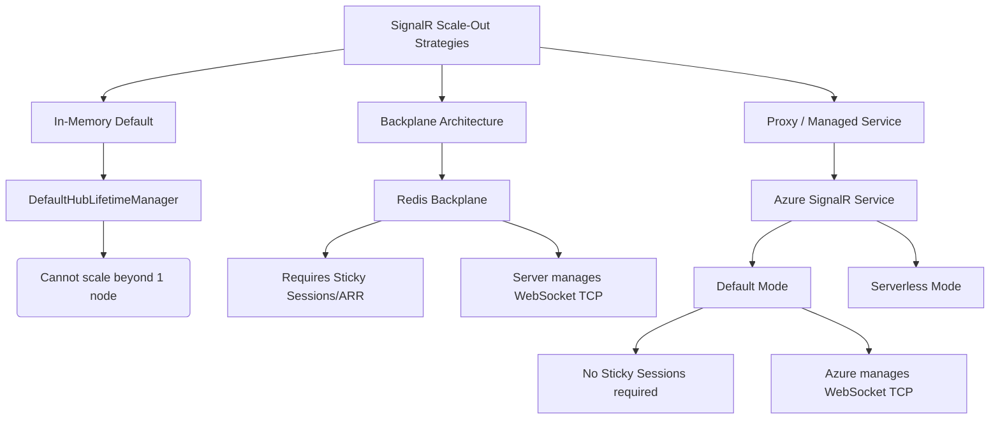
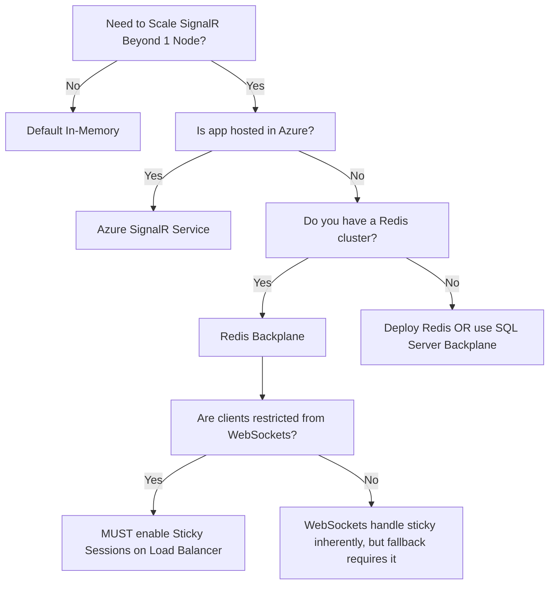

### PART 0 — Navigation & Context

```text
ASP.NET Core Mastery
│
├── P. Security                           (4.208–4.218)
├── Q. SignalR & Real-Time                (4.219–4.230)
│   ├── 4.219 SignalR Architecture
│   ├── 4.220 SignalR Hubs
│   ├── 4.221 SignalR Transports
│   ├── 4.222 SignalR Scale-Out: Redis Backplane and Azure SignalR Service ◄ YOU ARE HERE
│   ├── 4.223 SignalR Authentication
│   └── 4.224 SignalR Groups
└── R. Background Services                (4.231–4.239)
```

**What you need before this:**
* [[4.219 — SignalR Architecture: Hubs, Connections, and Transport Negotiation]]
* [[4.220 — SignalR Hubs: Hub<T>, Methods, Caller, Client, Groups, All Targeting]]
* [[4.329 — Reverse Proxy Configuration: X-Forwarded Headers Middleware]]

**What this unlocks after:**
* [[4.224 — SignalR Groups: Membership Management and Targeted Message Delivery]]
* [[4.333 — Kubernetes: Deployments, Services, and ConfigMaps]]

**Why this matters to a production engineer:** WebSockets are inherently stateful, keeping long-lived TCP connections tied to a single server's memory space; scaling out horizontally requires a unified message bus or proxy so a user connected to Server A can successfully receive a broadcast triggered by an event on Server B.

---

### PART 1 — The Core Mental Model

> **ASP.NET Core's SignalR scale-out mechanisms replace the in-memory `DefaultHubLifetimeManager` with a distributed component (Redis Pub/Sub or Azure proxy) when broadcasting. The practical consequence is that messages intended for clients on other nodes are serialized and routed through an external backbone, introducing network hops but enabling infinite horizontal scaling.**

**The Plain-Language Analogy**
Imagine a team using walkie-talkies connected to a local base station (a single server). If everyone connects to Base Station A, they hear each other perfectly. But if you add Base Station B to handle a larger crowd, people on A cannot hear people on B. 
To fix this, you have two choices. **Choice 1 (Redis Backplane):** You wire a high-speed fiber cable directly between Base Station A and B. When A receives a message, it shouts it down the cable to B, who repeats it locally. **Choice 2 (Azure SignalR Service):** You destroy the local base stations and give everyone a direct satellite phone to a massive cloud tower. Your servers no longer manage the walkie-talkies at all; they just send commands to the satellite tower, which handles all client connections.

**The Taxonomy Diagram**


---

### PART 2 — Deep Mechanics

#### 1. Pipeline Position and The Hub Lifetime Manager

SignalR executes at the very end of the ASP.NET Core pipeline, inside `EndpointRoutingMiddleware`. When you scale out, you are swapping the core dependency injected into your Hubs: the `HubLifetimeManager<T>`.

```text
// Pipeline position: Terminal Endpoint (MapHub)
──► StaticFiles ──► Routing ──► Auth ──► [MapHub Endpoint] 
                                              │
                                              ▼
                    [HubContext] ──► [HubLifetimeManager<T>]
                                              │
                    ┌─────────────────────────┼─────────────────────────┐
                    │                         │                         │
            (In-Memory Mode)             (Redis Mode)             (Azure Mode)
       DefaultHubLifetimeManager   RedisHubLifetimeManager   ServiceLifetimeManager
                    │                         │                         │
            [Local Dictionary]      [Redis Pub/Sub Channel]   [Azure gRPC/WebSockets]
```

#### 2. HTTP Wire Format: The Redis Backplane Consequence

When using Redis, the client still connects directly to your server. If they are forced to fall back to Long Polling or Server-Sent Events (SSE), multiple HTTP requests make up the "connection". 

**Cost:** `1 Redis publish per broadcast`.
**Edge Case:** If a client's transport negotiation hits Server A, but their subsequent POST hits Server B, Server B throws a 404 because the `ConnectionId` only exists in Server A's memory. **Sticky Sessions are mandatory.**

```http
// HTTP wire format (approximate) - Missing Sticky Sessions Failure:

// 1. Client negotiates (Hits Server A)
POST /chat/negotiate HTTP/1.1
// HTTP/1.1 200 OK
// {"connectionId":"conn_123", "availableTransports":["LongPolling"]}

// 2. Client sends message via Long Polling (Load balancer sends to Server B)
POST /chat?id=conn_123 HTTP/1.1

// Server B HTTP consequence (wrong path):
HTTP/1.1 404 Not Found
// Response: Connection ID 'conn_123' unknown.
```

#### 3. HTTP Wire Format: The Azure SignalR Service Consequence

When using Azure SignalR in `Default` mode, your server fundamentally alters the `/negotiate` response. It issues an HTTP 307 Redirect, instructing the client to connect to Azure instead of your server. Your server no longer holds the client TCP connection.

**Cost:** `O(1) outbound persistent WebSockets from Server to Azure per Core`. 
**Framework Source:** `ServiceEndpoint` and `NegotiateHandler` in `Microsoft.Azure.SignalR`.

```http
// HTTP wire format (approximate) - Azure SignalR Negotiate:

// 1. Client asks YOUR server to negotiate
POST /chat/negotiate?negotiateVersion=1 HTTP/1.1

// 2. YOUR server intercepts and returns a redirect to Azure
HTTP/1.1 200 OK
Content-Type: application/json

{
  "url": "[https://my-domain.service.signalr.net/client/?hub=chat](https://my-domain.service.signalr.net/client/?hub=chat)",
  "accessToken": "eyJhbGciOiJIUzI1...",
  "availableTransports": [
    { "transport": "WebSockets", "transferFormats": ["Text", "Binary"] }
  ]
}

// 3. Client connects directly to Azure SignalR
GET /client/?hub=chat HTTP/1.1
Host: my-domain.service.signalr.net
Authorization: Bearer eyJhbGciOiJIUzI1...
Upgrade: websocket
Connection: Upgrade
```

#### 4. The Broadcast Failure Mode (Redis)

When `IHubContext.Clients.All.SendAsync()` is called with Redis, it serializes the message and executes a `PUBLISH` command to a specific Redis channel. If Redis is down, the local execution succeeds, but the broadcast silently fails for users on other nodes.

**Runtime Cost:** `O(N) serialization cost`. The message is serialized once per server node (received from Redis, deserialized, then re-serialized for connected WebSockets).

---

### PART 3 — Production Code Patterns

#### Pattern 1: The Azure SignalR Service Setup (Logistics Tracking)

In a logistics domain where truck locations are broadcast to thousands of web dashboards, managing WebSockets on application nodes burns memory. Azure SignalR offloads this.

```csharp
// Scenario: Logistics Tracking API handling 50k concurrent dashboards
public void ConfigureServices(IServiceCollection services)
{
    // ✅ CORRECT: Offloads TCP connections to Azure. 
    // No sticky sessions required on your load balancer.
    services.AddSignalR()
            .AddMessagePackProtocol() // Reduce payload size for high frequency GPS data
            .AddAzureSignalR(options => 
            {
                // Never hardcode. Always from KeyVault/Environment.
                options.ConnectionString = Configuration["Azure:SignalR:ConnectionString"];
                
                // Fine-tune server-to-Azure connection count (default is 5). 
                // Increase for high throughput.
                options.ConnectionCount = 10; 
            });
}

// HTTP wire consequence: 
// Client calls POST /tracking/negotiate
// Server returns 200 OK with "url": "https://<your-instance>.service.signalr.net..."
```

#### Pattern 2: The Redis Backplane with Custom Multiplexer (Fintech Trading)

In high-frequency trading, you might host SignalR yourself to avoid cloud-service latency hops, relying on a highly available Redis cluster. You must control the Redis connection string explicitly to prevent thread starvation.

```csharp
// Scenario: Live Crypto Trading Ticker Broadcast
public void ConfigureServices(IServiceCollection services)
{
    // ⚠️ WRONG: Using a raw connection string can lead to connection pool exhaustion 
    // under heavy load if not tuned.
    // services.AddSignalR().AddStackExchangeRedis("localhost:6379");

    // ✅ CORRECT: Provide a carefully tuned ConnectionMultiplexer
    var redisOptions = ConfigurationOptions.Parse(Configuration["Redis:ConnectionString"]);
    redisOptions.SocketManager = SocketManager.ThreadPool;
    redisOptions.ChannelPrefix = "LiveTradingTicker"; // Isolate from other apps

    services.AddSingleton<IConnectionMultiplexer>(
        ConnectionMultiplexer.Connect(redisOptions));

    services.AddSignalR()
            .AddStackExchangeRedis(options =>
            {
                options.ConnectionFactory = async writer =>
                {
                    var multiplexer = services.BuildServiceProvider()
                                              .GetRequiredService<IConnectionMultiplexer>();
                    return multiplexer.GetDatabase();
                };
            });
}
```

#### Pattern 3: High-Cardinality Group Management (Multi-Tenant SaaS)

When using Redis, putting users into groups (`Groups.AddToGroupAsync`) forces Redis to manage pub/sub channels per group.

```csharp
// Scenario: Multi-tenant chat application (e.g., Slack clone)
public class TenantChatHub : Hub
{
    public override async Task OnConnectedAsync()
    {
        var tenantId = Context.User.FindFirstValue("TenantId");
        
        // ✅ CORRECT: Use deterministic, namespaced group names to prevent collisions 
        // across different hubs sharing the same Redis backplane.
        var groupName = $"tenant_{tenantId}_general";
        
        // With Redis backplane, this sends a command to Redis to track this connection 
        // against this pub/sub channel.
        await Groups.AddToGroupAsync(Context.ConnectionId, groupName);
        
        await base.OnConnectedAsync();
    }
}
```

---

### PART 4 — Gotchas & Anti-Patterns

### Gotcha 1: Missing Sticky Sessions with Redis Backplane

Engineers often add the Redis Nuget package, deploy to Kubernetes behind an NGINX ingress, and see clients randomly disconnecting. 

```csharp
// ⚠️ WRONG ARCHITECTURE (NGINX Ingress without affinity)
// Client negotiates on Pod A, but their next Long Polling request hits Pod B.

// HTTP consequence (wrong path):
// GET /hub?id=abc1234 HTTP/1.1
// HTTP/1.1 404 Not Found (Pod B doesn't know 'abc1234')

// ✅ CORRECT ARCHITECTURE (NGINX Ingress with cookie affinity)
// annotations:
//   nginx.ingress.kubernetes.io/affinity: "cookie"
//   nginx.ingress.kubernetes.io/session-cookie-name: "route"

// HTTP consequence (correct path):
// GET /hub?id=abc1234 HTTP/1.1
// Cookie: route=pod_a_hash
// HTTP/1.1 200 OK
// WHY: SignalR transports other than WebSockets require the HTTP requests to hit the exact server memory space that holds the `HubConnectionContext`.
```

### Gotcha 2: Sending Large Payloads over the Backplane

Because Redis is a single-threaded event loop, pushing large JSON payloads through the SignalR backplane blocks the Redis thread, causing latency spikes for all other microservices using that Redis instance.

```csharp
// ⚠️ WRONG CODE
public async Task BroadcastReportGeneration(Report result)
{
    // result is a 5MB object. This serializes 5MB into Redis Pub/Sub!
    await _hubContext.Clients.All.SendAsync("ReportReady", result);
}

// HTTP consequence (wrong path):
// Redis CPU spikes. Other apps get RedisTimeoutExceptions.

// ✅ CORRECT CODE
public async Task BroadcastReportGeneration(Report result)
{
    // Save the 5MB payload to Azure Blob or S3.
    var blobUrl = await _storage.SaveAsync(result);
    
    // Broadcast only the pointer.
    await _hubContext.Clients.All.SendAsync("ReportReady", new { ReportUrl = blobUrl });
}

// WHY: The backplane is a control-plane message bus, not a data-plane file transfer system. Keep messages under 2KB.
```

### Gotcha 3: Misunderstanding Local vs Global Connection IDs

Assuming that because you have a Redis backplane, you can look up a `ConnectionId` globally or assume events trigger globally.

```csharp
// ⚠️ WRONG CODE
public override async Task OnDisconnectedAsync(Exception? exception)
{
    // Developer assumes this fires on ALL servers when a user disconnects.
    await _database.LogDisconnectAsync(Context.ConnectionId);
}

// HTTP consequence:
// Only the server holding the connection logs it. If that server crashes, OnDisconnectedAsync never fires.

// ✅ CORRECT CODE
// Use Azure SignalR Service with Event Grid integration if you need guaranteed global connect/disconnect webhooks that survive app server crashes.

// WHY: OnConnectedAsync and OnDisconnectedAsync are LOCAL events. The backplane does not broadcast lifecycle events, only messages.
```

### Gotcha 4: Captive Dependency in Hub Execution

Hubs are transient. Injecting scoped services (like EF `DbContext`) works, but if you do heavy async work, the connection might drop, and the DI scope is disposed while EF is still querying.

```csharp
// ⚠️ WRONG CODE (inside a Hub method triggered by client)
public async Task UpdateProfile(ProfileDto data)
{
    _dbContext.Profiles.Update(data);
    await _dbContext.SaveChangesAsync(); // If client drops connection here...
}

// HTTP consequence (wrong path):
// ObjectDisposedException on DbContext. The WebSocket aborted, ASP.NET Core disposed the request scope.

// ✅ CORRECT CODE
public async Task UpdateProfile(ProfileDto data)
{
    // For critical operations that outlive the fast WebSocket message, queue it.
    await _channel.Writer.WriteAsync(data); 
}

// WHY: SignalR method invocations tie their DI scope to the message processing lifetime. Do not tie critical durable writes to a volatile WebSocket connection state.
```

### Gotcha 5: Azure SignalR "Serverless" Mode Misconfiguration

Using Azure SignalR, developers mistakenly choose "Serverless" mode when they actually have ASP.NET Core hubs hosting business logic.

```csharp
// ⚠️ WRONG AZURE CONFIGURATION
// Azure SignalR set to "Serverless" mode.
// App starts: services.AddSignalR().AddAzureSignalR();

// HTTP consequence (wrong path):
// App fails to start or continuously drops server-to-cloud connections.
// "Endpoint offline" errors.

// ✅ CORRECT AZURE CONFIGURATION
// Azure SignalR set to "Default" mode.

// WHY: "Serverless" mode means there is NO ASP.NET Core server; clients connect directly to Azure and Azure calls Azure Functions via HTTP webhooks. "Default" mode establishes the gRPC bridge between your ASP.NET Core server and Azure.
```

---

### PART 5 — Performance Implications

#### Request Pipeline Characteristics Table

| Scenario | Pipeline Depth | Allocations Per Request | Approx Latency Impact | Recommendation |
| :--- | :--- | :--- | :--- | :--- |
| **In-Memory Send (1 node)** | MapHub | `~3` per connected client | `< 1ms` | Use for single-node apps only. |
| **Redis Backplane Publish** | MapHub + StackExchange.Redis | `~10` + serialization array | `2 - 10ms` (Redis hop) | Fine for 10-20 nodes. Watch payload sizes. |
| **Azure SignalR Negotiate** | MapHub + Proxy Redirect | `~5` | `< 1ms` (Client redirected) | Default choice for cloud-native apps. |
| **Azure SignalR Broadcast** | gRPC bridge to Azure | `~8` (Protobuf wrapper) | `5 - 15ms` | Offloads CPU/Memory entirely. |

#### BenchmarkDotNet Code

```csharp
[MemoryDiagnoser]
public class SignalRScaleOutBenchmark
{
    private IHubContext<ChatHub> _inMemoryHub;
    private IHubContext<ChatHub> _redisHub;
    private object _payload = new { User = "System", Message = "Update" };

    [GlobalSetup]
    public void Setup()
    {
        // Stubs simulating the HubLifetimeManagers
        _inMemoryHub = SetupInMemory();
        _redisHub = SetupRedis();
    }

    [Benchmark(Baseline = true)]
    public async Task InMemory_Broadcast()
    {
        await _inMemoryHub.Clients.All.SendAsync("Receive", _payload);
    }

    [Benchmark]
    public async Task RedisBackplane_Broadcast()
    {
        // Simulates the serialization and StackExchange.Redis PUBLISH overhead
        await _redisHub.Clients.All.SendAsync("Receive", _payload);
    }
}

// Expected output (approximate, .NET 8, x64, Kestrel, local):
// |                   Method |      Mean |    Allocated |
// |------------------------- |----------:|-------------:|
// |       InMemory_Broadcast |  1.200 us |        312 B |
// | RedisBackplane_Broadcast | 45.300 us |      2,150 B |
```

#### When to Care / When to Ignore

**When this costs you:**
* **Payload Size:** Pushing 1MB payloads over a Redis backplane to 10 nodes means Redis is shifting 10MB of traffic per broadcast on a single thread. This will bring down your caching tier.
* **Connection Churn:** In Azure SignalR, if thousands of mobile devices constantly drop and reconnect on cellular networks, the negotiation phase overhead eats compute.

**When this doesn't matter:**
* Small control-plane messages (e.g., `{"command": "refresh_grid"}`). The latency of a Redis hop (~2ms) or Azure SignalR hop (~10ms) is invisible to human users clicking a UI.

---

### PART 6 — Interview Arsenal

#### A. The Question Bank

**Question: "We have an ASP.NET Core SignalR app deployed to 5 nodes. Users are complaining that they don't receive chat messages from users routed to other nodes. How do you fix this?"**
* **Average Answer:** We need to use a backplane like Redis or Azure SignalR so the servers can talk to each other.
* **Why That's Insufficient:** It misses the infrastructure consequence of adding Redis (sticky sessions).
* **Great Answer:** > "The servers are currently using the default in-memory `HubLifetimeManager`, meaning connections are isolated per node. I would implement a Redis backplane by calling `AddStackExchangeRedis()`. This changes the pipeline so broadcasts are published to a Redis channel and picked up by all nodes. However, the critical infrastructure change is that I must configure the load balancer, like NGINX, to use sticky sessions. If a client negotiates on Node A but their long-polling request hits Node B, Node B will return an HTTP 404 because it doesn't have the connection state. Alternatively, if we are in Azure, I would switch to Azure SignalR Service, which completely offloads the WebSocket connections and removes the need for sticky sessions entirely."

**Question: "If you scale out SignalR with Redis, does `OnDisconnectedAsync` fire on all servers when a user leaves?"**
* **Average Answer:** Yes, the backplane syncs all events across all servers.
* **Why That's Insufficient:** It demonstrates a fundamental misunderstanding of what a backplane actually synchronizes.
* **Great Answer:** > "No. `OnDisconnectedAsync` is a strictly local event. The backplane only synchronizes outbound messages (invocations), not connection lifecycle events. Only the specific server node that was maintaining the TCP connection to that client will fire the disconnected event. If we rely on that event for critical business logic—like updating a user's 'online' status in a database—and that specific server crashes, the event never fires, leaving phantom data."

#### B. The Trick Questions

* **Trick:** "We are moving our SignalR app from 1 VM to Azure Kubernetes Service with 10 pods. We added Redis. Why are our iOS clients using Server-Sent Events getting HTTP 404s randomly?"
  * **Answer:** You forgot to configure sticky sessions on your Kubernetes Ingress controller. WebSockets are a single continuous TCP stream (no sticky sessions needed once established), but SSE and Long Polling rely on multiple HTTP requests. The 404 occurs when an HTTP request hits a pod that didn't do the original `/negotiate`.
* **Trick:** "We switched to Azure SignalR Service in Serverless mode, but our Hub methods in ASP.NET Core are never hit. Why?"
  * **Answer:** "Serverless" mode means the ASP.NET Core Hub is intentionally ignored; the clients connect to Azure, and Azure routes messages to Azure Functions via webhooks. For ASP.NET Core Hubs to process messages, you must use "Default" mode.

#### C. Red Flags to Avoid

* 🚩 **"I will store the `ConnectionId` in a SQL database to scale out."** (Gets you failed. `ConnectionId` is a local memory pointer identifier. Storing it in SQL does not magically bridge TCP connections across servers.)
* 🚩 **"I will use a memory cache across the nodes to sync messages."** (`IMemoryCache` is local. You just described the problem, not a solution.)
* 🚩 **"Redis will slow down the WebSockets."** (Misunderstanding of the control plane. Redis handles the server-to-server broadcast routing; the WebSockets themselves are still direct asynchronous binary/text frames to the client.)

---

### PART 7 — Decision Framework



---

### PART 8 — Self-Check

#### A. Conceptual Questions
1. What interface does ASP.NET Core use to manage how messages are routed to connections, which is replaced when adding a backplane?
2. Why does a Redis backplane require Sticky Sessions on the load balancer?
3. What happens to the HTTP `/negotiate` request when Azure SignalR is enabled in Default mode?
4. If Node A calls `Clients.All.SendAsync()`, how does Node B know to send it to its connected clients when using Redis?
5. Does the Redis backplane synchronize `HttpContext.Session` state?
6. What is the payload consequence of calling a Hub method with a 10MB byte array when using a backplane?
7. In Azure SignalR "Default" mode, how many TCP connections are maintained between the client and your ASP.NET Core server?
8. What exception or status code occurs if a Long Polling client hits the wrong node behind a round-robin load balancer?

#### B. Code Puzzles

**Puzzle 1: The Negotiation Failure**
```csharp
// Startup.cs
services.AddSignalR();
// ...
app.UseRouting();
app.UseEndpoints(endpoints => {
    endpoints.MapHub<ChatHub>("/chat");
});

// The app is scaled to 3 instances behind AWS ALB. WebSockets are disabled by corporate firewall. 
// What HTTP status code will clients randomly see, and why?
```
<details>
<summary>Answer</summary>
<b>HTTP 404 Not Found.</b> Because WebSockets are blocked, the client falls back to Server-Sent Events or Long Polling. Because there is no Redis backplane and no Sticky Sessions on the ALB, a request intended for the connection established on Instance 1 will randomly hit Instance 2 or 3, which have no record of that <code>ConnectionId</code> in their memory.
</details>

**Puzzle 2: The Silent Broadcast**
```csharp
public class NotificationHub : Hub {
    public override async Task OnConnectedAsync() {
        await Groups.AddToGroupAsync(Context.ConnectionId, "Admins");
    }
}

// In a background worker on SERVER_B:
await _hubContext.Clients.Group("Admins").SendAsync("Alert", "System Down");

// Admins are connected to SERVER_A. They receive nothing. Why?
```
<details>
<summary>Answer</summary>
The application is using the <code>DefaultHubLifetimeManager</code> (in-memory). <code>SERVER_B</code>'s background worker only broadcasts to connections in memory on <code>SERVER_B</code>. Since the admins are on <code>SERVER_A</code>, the message goes nowhere. A Redis or Azure SignalR backplane must be added to route the "Admins" group message from B to A.
</details>

**Puzzle 3: The DI Trap**
```csharp
public class OrderHub : Hub {
    private readonly ApplicationDbContext _db;
    public OrderHub(ApplicationDbContext db) => _db = db;

    public async Task ProcessOrder(Order order) {
        _db.Orders.Add(order);
        await Task.Delay(5000); // Simulating slow third-party API
        await _db.SaveChangesAsync();
    }
}
```
<details>
<summary>Answer</summary>
If the client disconnects (closes browser, drops wifi) during the 5000ms delay, the WebSocket aborts. ASP.NET Core immediately disposes the request scope, disposing the <code>ApplicationDbContext</code>. When <code>SaveChangesAsync()</code> is called, an <code>ObjectDisposedException</code> is thrown. Do not tie long-running durable writes directly to the Hub's DI scope.
</details>

**Puzzle 4: Azure Redirect Verification**
```csharp
// services.AddSignalR().AddAzureSignalR("Endpoint=https://...");
```
When a client hits `/hub/negotiate`, what does the HTTP response body look like?
<details>
<summary>Answer</summary>
It is an HTTP 200 OK containing JSON with a <code>url</code> and an <code>accessToken</code>. The URL points directly to the Azure SignalR Service endpoint (e.g., <code>https://my-domain.service.signalr.net/client/?hub=...</code>), not the local server. The ASP.NET Core server acts purely as an issuer of access tokens to hand the client off to Azure.
</details>

---

### PART 9 — Connections & Resources

**A. Related Topics**
| Topic | Why It Connects |
| :--- | :--- |
| [[4.219 — SignalR Architecture: Hubs, Connections, and Transport Negotiation]] | Scale-out fundamentally alters how negotiation and transport mapping occur. |
| [[4.329 — Reverse Proxy Configuration: X-Forwarded Headers Middleware]] | Proxies are where sticky sessions are configured, making them critical for Redis backplanes. |
| [[4.188 — Redis as IDistributedCache: StackExchange.Redis Integration]] | The SignalR Redis backplane uses the same underlying StackExchange.Redis multiplexer concepts. |
| [[4.054 — HttpContext and IHttpContextAccessor]] | Hubs have a `HubCallerContext` which mirrors HTTP context but behaves differently across scale-out boundaries. |

**B. Books**
| Book | Chapters | Why These Chapters |
| :--- | :--- | :--- |
| *Pro ASP.NET Core 7* (Adam Freeman) | Ch 32: SignalR | Covers the base architecture required before scale-out can be understood. |
| *SignalR on .NET 6 — The Complete Guide* (Anthony Giretti) | Ch 8: Scaling SignalR | Deep dive into Redis Pub/Sub mechanics and Azure SignalR infrastructure. |

**C. Essential Articles & Docs**
* [Microsoft Docs: Redis backplane for ASP.NET Core SignalR](https://learn.microsoft.com/en-us/aspnet/core/signalr/redis-backplane)
* [Microsoft Docs: What is Azure SignalR Service?](https://learn.microsoft.com/en-us/azure/azure-signalr/signalr-overview)
* [David Fowler: Async Guidance](https://github.com/davidfowl/AspNetCoreDiagnosticScenarios/blob/master/AsyncGuidance.md) (Crucial for understanding why capturing `DbContext` in Hub methods causes dispose exceptions on disconnect).

> [!NOTE] 
> **Part 0** orients you. **Part 1** gives the core model. **Part 2** explains pipeline and HTTP realities. **Part 3** provides copy-paste production code. **Part 4** prevents you from shipping bugs. **Part 5** gives exact performance costs. **Part 6** prepares you for principal-level interviews. **Part 7** gives the architecture flowchart. **Part 8** validates your knowledge. **Part 9** links the ecosystem.