# 4.224 — SignalR Groups: Membership Management and Targeted Message Delivery

---

## PART 0 — Navigation & Context

### Domain Hierarchy

```
ASP.NET Core Mastery
│
├── A. Host & Application Lifecycle
├── B. Configuration System
├── C. Logging & Diagnostics
├── D. Dependency Injection
├── E. Middleware Pipeline
├── F. Routing System
├── G. Minimal APIs
├── H. MVC & Controllers
├── I. HTTP Fundamentals
├── J. Authentication
├── K. Authorization
├── L. Validation
├── M. Error Handling & Problem Details
├── N. Caching & Output
├── O. Rate Limiting
├── P. Security
│
└── Q. SignalR & Real-Time  ◄── YOU ARE HERE
    │
    ├── 4.219 — SignalR Architecture: Hubs, Connections, Transport Negotiation
    ├── 4.220 — SignalR Hubs: Hub<T>, Methods, Caller/Group/All Targeting
    ├── 4.221 — SignalR Transports: WebSockets, SSE, Long Polling Negotiation
    ├── 4.222 — SignalR Scale-Out: Redis Backplane and Azure SignalR Service
    ├── 4.223 — SignalR Authentication: JWT in WebSocket Connection Upgrade
    ├── 4.224 — SignalR Groups: Membership Management and Targeted Delivery  ◄ THIS NOTE
    ├── 4.225 — SignalR Streaming: IAsyncEnumerable<T> from Hub to Client
    ├── 4.226 — SignalR .NET Client: HubConnection and Reconnect Strategies
    ├── 4.227 — SignalR JavaScript Client: hubConnection.on and invoke
    ├── 4.228 — SignalR with Minimal APIs: MapHub and Authorization
    ├── 4.229 — Server-Sent Events with IAsyncEnumerable<T>
    └── 4.230 — Long Polling: When and How Without SignalR
```

### What You Need Before This

- **[[4.219 — SignalR Architecture]]** — you must understand Hubs, ConnectionIds, and transport negotiation before group membership makes sense
- **[[4.220 — SignalR Hubs: Hub<T> and Targeting]]** — `Clients.Group()`, `Clients.All`, `Clients.Caller` are the targeting API this note builds on
- **[[4.035 — Service Lifetimes: Singleton, Scoped, Transient]]** — Hub instances are Scoped (one per invocation), but `IHubContext<T>` is Singleton; group membership state lives in memory or Redis
- **[[4.222 — SignalR Scale-Out]]** — group membership in a multi-server deployment behaves differently from single-server; understand this before building group-based features at scale

### What This Unlocks After

- **[[4.225 — SignalR Streaming]]** — streaming to a group uses the same targeting API, but with `IAsyncEnumerable<T>`
- **[[4.222 — SignalR Scale-Out]]** — groups become distributed across instances via the Redis backplane; membership semantics change
- **[[4.228 — SignalR with Minimal APIs]]** — `IHubContext<T>` injected into Minimal API endpoints enables server-push to groups from HTTP handlers

### Why This Matters at Scale

SignalR groups are the foundational pub/sub primitive for any real-time feature involving selective delivery — chat rooms, order tracking boards, tenant-scoped dashboards, live collaboration rooms. At scale, **incorrect group membership management (not removing connections on disconnect, not scoping to the correct group name, not handling multi-server state) is the #1 source of phantom message delivery, memory leaks, and authorization bypass in production SignalR applications.**

---

## PART 1 — The Core Mental Model

### The Fundamental Rule

> **SignalR groups are ephemeral, in-memory (or backplane-replicated) sets of connection IDs with string names; group membership is not persisted, not automatically restored on reconnect, and not tied to any user identity — the application is fully responsible for adding and removing connections, and for rebuilding membership after a reconnect. The practical consequence is that a client reconnecting after a network drop starts with zero group memberships regardless of its previous state.**

### The Plain-Language Analogy

Think of a SignalR group as a distribution list on a physical whiteboard in a server room. When a client connects, the server writes its connection ID on the whiteboard under whichever list names the application tells it to. When the server broadcasts to a group, it reads every connection ID on that list and delivers the message to each one simultaneously. When a client disconnects — whether cleanly or due to a network fault — the server automatically erases that connection ID from every list it was on.

Here is where the analogy holds under pressure: if the client reconnects five seconds later, it is a **brand new connection ID** — the server has no memory that this client was ever on any list. The application must re-register it. In a multi-server deployment (the scale-out scenario), the whiteboard is replaced by a shared Redis key — every server checks Redis before sending, so a message sent from server A reaches clients connected to server B. But the write to Redis (adding to the group) still has to happen from application code — Redis just makes it visible across the fleet.

### The Taxonomy Diagram

```mermaid
graph TD
    subgraph Pipeline_Infrastructure["Pipeline Infrastructure (blue)"]
        HC["HubContext&lt;T&gt;\n(Singleton — server push)"]
        HH["Hub&lt;T&gt; / Hub\n(Scoped — per invocation)"]
        CM["ConnectedClients\nConnectionId → IClientProxy"]
    end

    subgraph Group_Management["Group Management (green)"]
        AG["Groups.AddToGroupAsync\n(connectionId, groupName)"]
        RG["Groups.RemoveFromGroupAsync\n(connectionId, groupName)"]
        OD["OnDisconnectedAsync\n(auto-removes from all groups)"]
    end

    subgraph Targeting_API["Message Targeting (orange)"]
        CA["Clients.All\n(all connections)"]
        CG["Clients.Group(name)\n(named group)"]
        CGE["Clients.GroupExcept(name, ids)\n(group minus exclusions)"]
        CGS["Clients.Groups(IEnumerable&lt;string&gt;)\n(multiple groups)"]
        CU["Clients.User(userId)\n(all connections for user)"]
        CUS["Clients.Users(IEnumerable&lt;string&gt;)\n(multiple users)"]
        CCL["Clients.Caller\n(invoking connection only)"]
        COID["Clients.Client(connectionId)\n(specific connection)"]
    end

    subgraph Scale_Out["Scale-Out Layer (purple)"]
        RB["Redis Backplane\n(group state shared across servers)"]
        ASR["Azure SignalR Service\n(managed group routing)"]
        IM["In-Memory\n(single server only)"]
    end

    subgraph Membership_Patterns["Membership Patterns (red)"]
        UP["User-Scoped Group\n(userId as group name)"]
        TP["Tenant-Scoped Group\n(tenantId as group name)"]
        RP["Room/Channel Group\n(roomId as group name)"]
        DP["Dynamic Group\n(built from resource + role)"]
    end

    HH --> AG
    HH --> RG
    HC --> CG
    HC --> CGE
    HH --> CA
    HH --> CG
    HH --> CGE
    HH --> CGS
    HH --> CU
    HH --> CUS
    HH --> CCL
    HH --> COID

    AG --> IM
    AG --> RB
    AG --> ASR
    RG --> IM
    RG --> RB
    RG --> ASR

    DP --> UP
    DP --> TP
    DP --> RP

    style Pipeline_Infrastructure fill:#dbeafe,stroke:#3b82f6
    style Group_Management fill:#dcfce7,stroke:#22c55e
    style Targeting_API fill:#ffedd5,stroke:#f97316
    style Scale_Out fill:#f3e8ff,stroke:#a855f7
    style Membership_Patterns fill:#fee2e2,stroke:#ef4444
```



---

## PART 2 — Deep Mechanics

### 2.1 — How SignalR Groups Work Internally

**Pipeline Position:**

```
TCP/WebSocket
──► Kestrel ──► Routing (MapHub) ──► SignalR Middleware ──► HubDispatcher
                                           │
                                     ConnectionHandler
                                           │
                                    [Group State Store]
                                           │
                              ┌────────────┴────────────┐
                           In-Memory              Redis Backplane
                        GroupManager           DistributedGroupManager
                        (single server)          (multi-server)
```

**Framework Source Behavior:**

SignalR groups are managed by `IGroupManager`, which is injected into `Hub` via the `Groups` property. The `DefaultGroupManager` (in-memory) stores groups as a `ConcurrentDictionary<string, HubConnectionStore>` where the key is the group name and the value is a set of connection IDs.

```csharp
// ASP.NET Core internally (approximate) — DefaultGroupManager:
public class DefaultGroupManager : IGroupManager
{
    private readonly HubLifetimeManager<THub> _lifetimeManager;

    public Task AddToGroupAsync(string connectionId, string groupName,
        CancellationToken cancellationToken = default)
    {
        // Delegates to HubLifetimeManager — which is either
        // DefaultHubLifetimeManager (in-memory) or
        // RedisHubLifetimeManager (backplane)
        return _lifetimeManager.AddToGroupAsync(connectionId, groupName, cancellationToken);
    }
}

// DefaultHubLifetimeManager (in-memory) — approximate:
private readonly ConcurrentDictionary<string, HubConnectionStore> _groups = new();

public override async Task AddToGroupAsync(string connectionId, string groupName, ...)
{
    var group = _groups.GetOrAdd(groupName, _ => new HubConnectionStore());
    group.Add(connectionId);
    // No persistence — lost on server restart or scale-out
}
```

**Runtime Cost:** `AddToGroupAsync` is ~1 dictionary lookup + 1 set insert, effectively O(1). ~0 allocations on the happy path. The network round-trip cost (if using Redis backplane) is one `SADD` command.

**Auto-Removal on Disconnect:**

When a connection closes (cleanly or due to network fault), `OnDisconnectedAsync` fires and `HubLifetimeManager` automatically removes the connection from all groups it belongs to. This is the only automatic cleanup — the application does not need to manually remove each group on disconnect. However, the application IS responsible for any external state it maintains (e.g., a database table tracking which user is in which room).

```csharp
// ASP.NET Core internally (approximate):
// Called by ConnectionHandler when WebSocket closes
public override async Task OnDisconnectedAsync(string connectionId)
{
    // Remove from ALL groups atomically
    foreach (var group in _connectionGroups.GetGroups(connectionId))
    {
        await RemoveFromGroupAsync(connectionId, group);
    }
    // Fire Hub.OnDisconnectedAsync for application logic
    await _hubActivator.InvokeOnDisconnectedAsync(hub, exception);
}
```

**Edge Case That Bites Engineers:** The auto-removal on disconnect does NOT clean up application-level state. If you maintain a `Dictionary<string, HashSet<string>>` mapping `roomId → set of userIds` in a Singleton service, that structure does NOT automatically update when a connection drops. The application must hook `OnDisconnectedAsync` to clean it up.

---

### 2.2 — The `Groups` Property: Adding and Removing Connections

**From inside a Hub method (Scoped context — has access to `Context.ConnectionId`):**

```csharp
// HTTP upgrade happens first, then Hub method is invoked:
// WebSocket connection established: ConnectionId = "abc-123-xyz"

// Adding to group:
await Groups.AddToGroupAsync(Context.ConnectionId, "order-tracking-EU");
// Internal: _lifetimeManager.AddToGroupAsync("abc-123-xyz", "order-tracking-EU")
// Cost: ~O(1), ~1 allocation (async state machine), Redis: 1 SADD if backplane

// Removing from group:
await Groups.RemoveFromGroupAsync(Context.ConnectionId, "order-tracking-EU");
// Internal: _lifetimeManager.RemoveFromGroupAsync("abc-123-xyz", "order-tracking-EU")
```

**HTTP Wire Effect (connection upgrade first, then Hub invocation):**

```
// HTTP upgrade (approximate):
// GET /hubs/orders HTTP/1.1
// Host: api.logistics.com
// Upgrade: websocket
// Connection: Upgrade
// Sec-WebSocket-Key: dGhlIHNhbXBsZSBub25jZQ==
// Authorization: Bearer eyJhbGci...

// HTTP/1.1 101 Switching Protocols
// Upgrade: websocket
// Connection: Upgrade
// Sec-WebSocket-Accept: s3pPLMBiTxaQ9kYGzzhZRbK+xOo=

// After upgrade: binary WebSocket frames carry Hub protocol messages (JSON or MessagePack)
// Client invokes "JoinOrderGroup" → server calls Groups.AddToGroupAsync
// No HTTP response for group add — it happens over the WebSocket frame channel
```

**From outside a Hub (via IHubContext<T> — Singleton context, no ConnectionId available):**

```csharp
// IHubContext<T> does NOT have Groups.AddToGroupAsync accessible
// Group membership can ONLY be changed from inside a Hub invocation
// or from a Hub method — NOT from IHubContext<T>

// ⚠️ IHubContext<T> only exposes Clients — it cannot manage membership
// This is a deliberate design constraint
```

**Runtime Cost:** `~1 async state machine allocation per call`, `O(1)` for the group store operation, `~1ms` for in-memory, `~1-5ms RTT` for Redis backplane.

---

### 2.3 — Targeting Groups: The `Clients` API Precision Matrix

**All targeting happens through `IHubCallerClients` (from Hub) or `IHubClients` (from IHubContext<T>):**

```
Targeting Method          | Reaches                          | Use Case
──────────────────────────┼──────────────────────────────────┼──────────────────────────────────
Clients.All               | Every connected client           | System-wide announcements
Clients.AllExcept(ids)    | All except listed IDs            | Echo suppression
Clients.Caller            | Only the invoking connection      | Acknowledgement/error feedback
Clients.Client(id)        | Exactly one connection by ID     | Admin-push to specific session
Clients.Clients(ids)      | Set of connection IDs            | Batch-targeted push
Clients.Group(name)       | All connections in named group   | Room/tenant/segment broadcast
Clients.GroupExcept(n,ids)| Group minus exclusion list       | Echo-suppressed group broadcast
Clients.Groups(names)     | Union of multiple groups         | Cross-segment broadcast
Clients.User(userId)      | All connections for one user     | Push to user (all their devices)
Clients.Users(userIds)    | All connections for set of users | Targeted multi-user push
```

**Pipeline Position for `Clients.Group("roomId")`:**

```
Hub Method Returns
      │
      ▼
HubCallerClients.Group("roomId")
      │
      ▼
HubLifetimeManager.SendGroupAsync("roomId", method, args)
      │
      ▼
[In-Memory] Iterate HubConnectionStore for "roomId"
   OR
[Redis] PUBSUB publish to channel "signalr:group:roomId"
      │
      ▼
Per-connection: Serialize message → Write to WebSocket pipe
```

**HTTP/WebSocket Wire Format (approximate — JSON Hub Protocol):**

```json
// Server → Client WebSocket frame (binary, JSON Hub Protocol):
// {"type":1,"target":"OrderStatusUpdated","arguments":[{"orderId":"ORD-9981","status":"Dispatched","eta":"2026-06-11T14:30:00Z"}]}

// type:1 = Invocation message
// target = client-side method name to invoke
// arguments = array of arguments
```

**Runtime Cost:** `Clients.Group(name)` — `O(n)` where n is the number of connections in the group. Each connection requires one async write to its WebSocket pipe. For a group of 1,000 connections, this is 1,000 async writes dispatched concurrently. ~1 allocation per connection (ValueTask state machine).

**Edge Case That Bites Engineers:** `Clients.User(userId)` is **not a group** — it is powered by `IUserIdProvider`. If the same user has 3 browser tabs open (3 connection IDs), `Clients.User` targets all 3 automatically. `Clients.Group` targets only the connections that were explicitly added. If you use a group named after the userId, you are responsible for adding all their connections — `Clients.User` does this automatically via the IUserIdProvider mapping.

---

### 2.4 — The Reconnect Problem: Ephemeral Membership

This is the most misunderstood behavior of SignalR groups in production.

**What happens on reconnect (default behavior — .NET 8):**

```
Timeline:
T=0:00   Client A connects → ConnectionId: "aaa-111"
T=0:01   Server: Groups.AddToGroupAsync("aaa-111", "trading-room-EURUSD")
T=0:30   Network fault — WebSocket drops
T=0:30   Server: OnDisconnectedAsync("aaa-111") fires
              → "aaa-111" removed from "trading-room-EURUSD" automatically
T=0:35   Client reconnects → NEW ConnectionId: "bbb-222"
              → "bbb-222" is NOT in "trading-room-EURUSD"
              → Client misses all messages until it re-joins
```

**The correct reconnect pattern requires client cooperation:**

```csharp
// Client-side (.NET HubConnection — approximate):
connection.Closed += async (error) =>
{
    await Task.Delay(TimeSpan.FromSeconds(2));
    await connection.StartAsync();
    // After reconnect, the client MUST re-invoke the join method:
    await connection.InvokeAsync("JoinTradingRoom", "EURUSD");
};

// Or use the built-in reconnect with OnReconnected:
connection.Reconnected += async (connectionId) =>
{
    await connection.InvokeAsync("JoinTradingRoom", "EURUSD");
};
```

**Server-side: OnConnectedAsync is NOT called on reconnect — OnReconnected (JavaScript client) fires, but server only sees a new OnConnectedAsync for the new ConnectionId.**

**HTTP Wire Consequence (reconnect failure scenario):**

```
// Without re-join after reconnect:
// Server broadcasts to "trading-room-EURUSD":
// {"type":1,"target":"PriceUpdated","arguments":[{"pair":"EURUSD","bid":1.0721}]}
//
// Client "bbb-222" is NOT in the group → message never delivered
// Client sees stale data with no error — silent data loss
// This is the #1 real-time data integrity bug in SignalR applications
```

---

### 2.5 — Group Naming Strategies and Security Implications

Group names are plain strings — there is no built-in access control on group membership. Any connection can be added to any group name by server-side code. The security model is: **the server controls who gets added to which group; clients cannot request group membership directly.**

**Group Naming Patterns:**

```csharp
// Pattern 1: Resource-scoped (most common)
var groupName = $"order-{orderId}";          // "order-ORD-9981"
var groupName = $"tenant-{tenantId}";        // "tenant-acme-corp"
var groupName = $"room-{roomId}";            // "room-trading-EURUSD"

// Pattern 2: Role-scoped within resource
var groupName = $"order-{orderId}-managers"; // only managers see cost data

// Pattern 3: User-scoped (alternative to Clients.User)
var groupName = $"user-{userId}";            // all tabs for one user

// Pattern 4: Composite
var groupName = $"tenant-{tenantId}-room-{roomId}"; // multi-tenant room isolation
```

**Security Rule:** Never derive a group name from client-supplied input without validation. If a client sends `roomId = "../../admin-ops"` and you build `$"room-{roomId}"`, your group naming is exploitable for unauthorized access.

**Failure Mode (group injection):**

```
// ⚠️ Vulnerable:
// Client sends: { "roomId": "all-users" }
// Server: Groups.AddToGroupAsync(Context.ConnectionId, $"room-{roomId}")
// → Connection ends up in "room-all-users" ... but what if "all-users" is a real group?

// Worse: what if "roomId" = "" → group name = "room-" (global broadcast group)

// HTTP consequence: the client receives messages intended for all users in "all-users"
// Authorization bypass through group name manipulation

// ✅ Correct: validate the roomId exists and the user is authorized for it
var room = await _roomRepository.GetAsync(roomId);
if (room == null || !await _authService.CanJoinRoom(Context.User, room))
{
    await Clients.Caller.SendAsync("JoinFailed", "Room not found or access denied");
    return;
}
await Groups.AddToGroupAsync(Context.ConnectionId, $"room-{room.Id}");
```

---

## PART 3 — Production Code Patterns

### Pattern 1: The Authorized Room Join with Membership Tracking

Domain: Live trading platform — client joins a market data room (e.g., "EURUSD"), server validates subscription tier, adds to group.

```csharp
// ⚠️ WRONG: No authorization, no tracking, client controls room name
public async Task JoinRoom(string roomName)
{
    // roomName from client — injection risk
    await Groups.AddToGroupAsync(Context.ConnectionId, roomName);
}

// ✅ CORRECT: Authorized join with application-layer tracking
[Authorize]
public class MarketDataHub : Hub
{
    private readonly IMarketRoomService _roomService;
    private readonly IRoomMembershipTracker _tracker;

    public MarketDataHub(IMarketRoomService roomService, IRoomMembershipTracker tracker)
    {
        _roomService = roomService;
        _tracker = tracker;
    }

    public async Task JoinMarketRoom(string currencyPair)
    {
        var userId = Context.User!.FindFirstValue(ClaimTypes.NameIdentifier)!;

        // Validate: room exists, user has active subscription
        var hasAccess = await _roomService.UserHasAccessAsync(userId, currencyPair);
        if (!hasAccess)
        {
            // Inform caller — not the whole group
            await Clients.Caller.SendAsync("AccessDenied",
                new { Pair = currencyPair, Reason = "Active subscription required" });
            return;
        }

        // Canonical group name — server-constructed, never client-supplied
        var groupName = $"market-{currencyPair.ToUpperInvariant()}";

        await Groups.AddToGroupAsync(Context.ConnectionId, groupName);

        // Track membership in application state for query/auditing
        // (NOT for SignalR routing — SignalR manages that internally)
        await _tracker.RecordJoinAsync(Context.ConnectionId, userId, groupName);

        // Confirm to caller only — not echoed to the whole room
        await Clients.Caller.SendAsync("JoinedMarketRoom",
            new { Pair = currencyPair, GroupName = groupName });

        // Notify room members (excluding the new joiner to avoid self-echo)
        await Clients.GroupExcept(groupName, new[] { Context.ConnectionId })
            .SendAsync("ParticipantJoined", new { UserId = userId });
    }

    public async Task LeaveMarketRoom(string currencyPair)
    {
        var groupName = $"market-{currencyPair.ToUpperInvariant()}";
        var userId = Context.User!.FindFirstValue(ClaimTypes.NameIdentifier)!;

        await Groups.RemoveFromGroupAsync(Context.ConnectionId, groupName);
        await _tracker.RecordLeaveAsync(Context.ConnectionId, userId, groupName);

        await Clients.GroupExcept(groupName, new[] { Context.ConnectionId })
            .SendAsync("ParticipantLeft", new { UserId = userId });
    }

    public override async Task OnDisconnectedAsync(Exception? exception)
    {
        // SignalR auto-removes from all groups — we only need to clean application state
        var userId = Context.User?.FindFirstValue(ClaimTypes.NameIdentifier);
        if (userId != null)
        {
            // Clean up application-layer membership tracking
            await _tracker.RecordDisconnectAsync(Context.ConnectionId, userId);
        }
        await base.OnDisconnectedAsync(exception);
    }
}

// HTTP wire format:
// WebSocket frame (client → server):
// {"type":1,"invocationId":"1","target":"JoinMarketRoom","arguments":["EURUSD"]}

// WebSocket frame (server → caller, success):
// {"type":1,"target":"JoinedMarketRoom","arguments":[{"pair":"EURUSD","groupName":"market-EURUSD"}]}

// WebSocket frame (server → group except caller):
// {"type":1,"target":"ParticipantJoined","arguments":[{"userId":"user-42"}]}
```

---

### Pattern 2: Server-Push to Groups from HTTP Endpoints via IHubContext

Domain: Order management service — when an order status changes via a REST API call, push the update to all connections tracking that order.

```csharp
// ⚠️ WRONG: Trying to use Hub directly from a service (Hub is not injectable as Singleton)
public class OrderService
{
    private readonly OrderHub _hub; // Hub is Scoped — cannot be injected into Singleton service

    public async Task UpdateOrderStatusAsync(string orderId, string status)
    {
        await _hub.Clients.Group($"order-{orderId}").SendAsync("OrderUpdated", status);
        // InvalidOperationException: Hub.Clients is null outside of Hub invocation
    }
}

// ✅ CORRECT: Use IHubContext<T> — designed for server-push from non-Hub code
public class OrderStatusService
{
    private readonly IHubContext<OrderTrackingHub> _hubContext;
    private readonly IOrderRepository _orders;
    private readonly ILogger<OrderStatusService> _logger;

    public OrderStatusService(
        IHubContext<OrderTrackingHub> hubContext,
        IOrderRepository orders,
        ILogger<OrderStatusService> logger)
    {
        _hubContext = hubContext;
        _orders = orders;
        _logger = logger;
    }

    public async Task UpdateOrderStatusAsync(
        string orderId,
        OrderStatus newStatus,
        CancellationToken ct = default)
    {
        var order = await _orders.UpdateStatusAsync(orderId, newStatus, ct);

        // Group name must match the convention used in the Hub's JoinOrderTracking method
        var groupName = $"order-{orderId}";

        var payload = new OrderStatusUpdate(
            OrderId: orderId,
            Status: newStatus.ToString(),
            UpdatedAt: DateTimeOffset.UtcNow,
            EstimatedDelivery: order.EstimatedDelivery
        );

        // IHubContext does NOT have Groups.AddToGroupAsync — membership managed in Hub
        // IHubContext ONLY provides Clients — the targeting API
        await _hubContext.Clients.Group(groupName)
            .SendAsync("OrderStatusUpdated", payload, ct);

        _logger.LogInformation(
            "Pushed order status update to SignalR group {GroupName} for order {OrderId}",
            groupName, orderId);
    }
}

// Registration — IHubContext<T> is automatically registered as Singleton by AddSignalR()
// No additional registration needed

// HTTP + WebSocket wire:
// REST call:   PUT /api/orders/ORD-9981/status  { "status": "Dispatched" }
// HTTP response: 200 OK (synchronous REST response)
// WebSocket push (async, after DB update):
// {"type":1,"target":"OrderStatusUpdated","arguments":[{"orderId":"ORD-9981","status":"Dispatched",...}]}
// → delivered to all connections in group "order-ORD-9981"
```

---

### Pattern 3: Tenant-Scoped Group Isolation with Multi-Tenant Hub

Domain: SaaS logistics platform — each tenant's dispatchers only receive events for their own shipments.

```csharp
[Authorize]
public class LogisticsHub : Hub
{
    private readonly ITenantResolver _tenantResolver;

    public LogisticsHub(ITenantResolver tenantResolver)
    {
        _tenantResolver = tenantResolver;
    }

    public override async Task OnConnectedAsync()
    {
        // Resolve tenant from the authenticated principal (set during JWT validation)
        var tenantId = Context.User!.FindFirstValue("tenant_id");
        if (string.IsNullOrEmpty(tenantId))
        {
            // No tenant claim → abort connection
            Context.Abort();
            return;
        }

        // Automatically join tenant group on connect — no client action needed
        // This pattern works because the server controls all membership
        var tenantGroupName = $"tenant-{tenantId}";
        await Groups.AddToGroupAsync(Context.ConnectionId, tenantGroupName);

        await base.OnConnectedAsync();
    }

    // Shipment-level subscription (opt-in within the tenant)
    public async Task TrackShipment(string shipmentId)
    {
        var tenantId = Context.User!.FindFirstValue("tenant_id")!;

        // Critical: validate the shipment belongs to this tenant
        var belongs = await _tenantResolver.ShipmentBelongsToTenantAsync(shipmentId, tenantId);
        if (!belongs)
        {
            await Clients.Caller.SendAsync("TrackingError",
                "Shipment not found in your account");
            return;
        }

        // Tenant-scoped shipment group — even if two tenants have identical shipment IDs,
        // the group names will differ: "shipment-tenantA-SHP-001" vs "shipment-tenantB-SHP-001"
        var shipmentGroupName = $"shipment-{tenantId}-{shipmentId}";
        await Groups.AddToGroupAsync(Context.ConnectionId, shipmentGroupName);

        await Clients.Caller.SendAsync("NowTracking", shipmentId);
    }
}

// Pushing from background service when carrier webhook arrives:
// _hubContext.Clients.Group($"shipment-{tenantId}-{shipmentId}")
//            .SendAsync("ShipmentLocationUpdated", locationPayload);

// HTTP wire: carrier webhook → POST /webhooks/carrier → background service
// → IHubContext push → WebSocket frame to tenant's dispatchers only
// Tenant A's dispatchers NEVER receive Tenant B's shipment events — isolation enforced by group name
```

---

### Pattern 4: The Group-as-User Pattern with Multi-Device Support

Domain: Payment gateway — user has mobile app + browser open; both should receive fraud alerts immediately.

```csharp
[Authorize]
public class PaymentAlertHub : Hub
{
    public override async Task OnConnectedAsync()
    {
        // Use userId as the group name to aggregate all devices for one user.
        // Alternative to Clients.User() when you need explicit group control.
        var userId = Context.User!.FindFirstValue(ClaimTypes.NameIdentifier)!;
        var userGroupName = $"user-{userId}";

        await Groups.AddToGroupAsync(Context.ConnectionId, userGroupName);

        // Also join account-level group (user may belong to a business account)
        var accountId = Context.User.FindFirstValue("account_id");
        if (!string.IsNullOrEmpty(accountId))
        {
            await Groups.AddToGroupAsync(Context.ConnectionId, $"account-{accountId}");
        }

        await base.OnConnectedAsync();
    }
}

// Fraud detection service pushes alert to all user devices simultaneously:
public class FraudAlertService
{
    private readonly IHubContext<PaymentAlertHub> _hub;

    public async Task PushFraudAlertAsync(string userId, FraudAlert alert)
    {
        // Reaches ALL connections in the user's group — mobile + browser + tablet
        // Cost: O(n) where n = number of open connections for this user (~2-5 typically)
        await _hub.Clients.Group($"user-{userId}")
            .SendAsync("FraudAlertReceived", alert);

        // OR use Clients.User() which internally does the same but via IUserIdProvider
        // Both approaches work — use Groups when you need explicit control/auditing
        await _hub.Clients.User(userId).SendAsync("FraudAlertReceived", alert);
    }
}

// HTTP wire (to all user devices simultaneously):
// Device 1 (browser):  {"type":1,"target":"FraudAlertReceived","arguments":[{...}]}
// Device 2 (mobile):   {"type":1,"target":"FraudAlertReceived","arguments":[{...}]}
// Both frames sent concurrently — O(n) async writes dispatched in parallel
```

---

### Pattern 5: Dynamic Group Management with Reconnect Handling

Domain: Collaborative document editor — users join document rooms and must rejoin after disconnect.

```csharp
[Authorize]
public class CollaborationHub : Hub<ICollaborationClient>
{
    private readonly IDocumentRepository _documents;
    private readonly IConnectionStateCache _stateCache;  // Redis-backed

    // Called by client both on initial connect AND after reconnect
    public async Task JoinDocumentSession(string documentId)
    {
        var userId = Context.User!.FindFirstValue(ClaimTypes.NameIdentifier)!;
        var doc = await _documents.GetAsync(documentId);

        if (doc == null)
        {
            await Clients.Caller.DocumentNotFound(documentId);
            return;
        }

        if (!doc.CanAccess(userId))
        {
            await Clients.Caller.AccessDenied(documentId);
            return;
        }

        var groupName = $"doc-{documentId}";
        await Groups.AddToGroupAsync(Context.ConnectionId, groupName);

        // Cache the connectionId → documentId mapping for reconnect state recovery
        // TTL matches expected reconnect window
        await _stateCache.SetAsync(
            $"conn:{Context.ConnectionId}:doc",
            documentId,
            TimeSpan.FromMinutes(5));

        // Send current document state to the new joiner
        var currentState = await _documents.GetCurrentStateAsync(documentId);
        await Clients.Caller.DocumentStateSync(currentState);

        // Announce presence to collaborators
        var collaborators = await _documents.GetActiveCollaboratorsAsync(documentId);
        await Clients.GroupExcept(groupName, new[] { Context.ConnectionId })
            .CollaboratorJoined(new CollaboratorInfo(userId, doc.Title));
    }

    public override async Task OnDisconnectedAsync(Exception? exception)
    {
        var userId = Context.User?.FindFirstValue(ClaimTypes.NameIdentifier);
        var documentId = await _stateCache.GetAsync($"conn:{Context.ConnectionId}:doc");

        if (documentId != null && userId != null)
        {
            var groupName = $"doc-{documentId}";
            // SignalR already removed from group — just notify remaining collaborators
            await Clients.Group(groupName)
                .CollaboratorLeft(new CollaboratorInfo(userId, isTemporary: exception != null));
        }

        await base.OnDisconnectedAsync(exception);
    }
}

// Strongly-typed client interface (Hub<ICollaborationClient>):
public interface ICollaborationClient
{
    Task DocumentStateSync(DocumentState state);
    Task CollaboratorJoined(CollaboratorInfo info);
    Task CollaboratorLeft(CollaboratorInfo info);
    Task DocumentNotFound(string documentId);
    Task AccessDenied(string documentId);
    Task OperationApplied(DocumentOperation operation);
}

// HTTP wire (join):
// Client → {"type":1,"invocationId":"1","target":"JoinDocumentSession","arguments":["doc-456"]}
// Server → {"type":1,"target":"DocumentStateSync","arguments":[{"version":42,"content":"..."}]}
// Server → group except caller: {"type":1,"target":"CollaboratorJoined","arguments":[{"userId":"user-7","docTitle":"Q4 Budget"}]}
```

---

### Pattern 6: Broadcast from Background Service Using Group Fan-Out

Domain: Stock price feed — background service receives prices from external source and fans out to all subscribers.

```csharp
public class StockPriceFeedService : BackgroundService
{
    private readonly IHubContext<TradingHub> _hub;
    private readonly IStockFeedClient _feedClient;
    private readonly ILogger<StockPriceFeedService> _logger;

    public StockPriceFeedService(
        IHubContext<TradingHub> hub,
        IStockFeedClient feedClient,
        ILogger<StockPriceFeedService> logger)
    {
        _hub = hub;
        _feedClient = feedClient;
        _logger = logger;
    }

    protected override async Task ExecuteAsync(CancellationToken stoppingToken)
    {
        // IHubContext<T> is Singleton — safe to inject into BackgroundService
        await foreach (var tick in _feedClient.StreamTicksAsync(stoppingToken))
        {
            try
            {
                // Each ticker symbol has its own group
                // Only clients that called JoinMarketRoom("AAPL") are in "stock-AAPL"
                var groupName = $"stock-{tick.Symbol}";

                await _hub.Clients.Group(groupName)
                    .SendAsync("PriceTick", new
                    {
                        tick.Symbol,
                        tick.Bid,
                        tick.Ask,
                        tick.Timestamp
                    }, stoppingToken);

                // Cost: O(connections in group) — groups with no subscribers cost ~O(1)
                // (empty group = empty HubConnectionStore = no iterations)
            }
            catch (Exception ex) when (ex is not OperationCanceledException)
            {
                // Never let one bad tick kill the feed
                _logger.LogError(ex, "Failed to push tick for {Symbol}", tick.Symbol);
            }
        }
    }
}

// Registration:
// builder.Services.AddHostedService<StockPriceFeedService>();
// builder.Services.AddSignalR(); // registers IHubContext<T> automatically
// app.MapHub<TradingHub>("/hubs/trading");

// WebSocket frame (per tick, per subscriber):
// {"type":1,"target":"PriceTick","arguments":[{"symbol":"AAPL","bid":189.42,"ask":189.44,"timestamp":"..."}]}
// Cost: 1 WebSocket write per connection in "stock-AAPL" group, dispatched concurrently
```

---

### Pattern 7: The Group Membership Audit Pattern for Multi-Server Deployments

Domain: Healthcare patient portal — audit trail required when a clinician joins a patient's real-time monitoring room.

```csharp
// When using Redis backplane, group membership is stored in Redis.
// BUT: Redis does not expose "which connections are in group X" for audit purposes.
// Application must maintain its own audit log.

[Authorize(Roles = "Clinician,Nurse")]
public class PatientMonitorHub : Hub
{
    private readonly IPatientAccessAudit _audit;
    private readonly IPatientRepository _patients;

    public async Task JoinPatientRoom(string patientId)
    {
        var clinicianId = Context.User!.FindFirstValue(ClaimTypes.NameIdentifier)!;
        var clinicianName = Context.User.FindFirstValue(ClaimTypes.Name)!;

        // HIPAA: validate clinician is assigned to this patient
        if (!await _patients.IsAssignedClinicianAsync(patientId, clinicianId))
        {
            await Clients.Caller.SendAsync("AccessDenied",
                "You are not assigned to this patient.");
            return;
        }

        var groupName = $"patient-{patientId}";
        await Groups.AddToGroupAsync(Context.ConnectionId, groupName);

        // HIPAA audit: log who joined which patient room, when, from what connection
        await _audit.LogRoomJoinAsync(new PatientRoomAccess(
            ClinicinanId: clinicianId,
            ClinicianName: clinicianName,
            PatientId: patientId,
            ConnectionId: Context.ConnectionId,
            JoinedAt: DateTimeOffset.UtcNow,
            RemoteIp: Context.GetHttpContext()?.Connection.RemoteIpAddress?.ToString()
        ));

        await Clients.Caller.SendAsync("JoinedPatientRoom", patientId);
    }

    public override async Task OnDisconnectedAsync(Exception? exception)
    {
        var clinicianId = Context.User?.FindFirstValue(ClaimTypes.NameIdentifier);
        if (clinicianId != null)
        {
            await _audit.LogDisconnectAsync(Context.ConnectionId, DateTimeOffset.UtcNow);
        }
        await base.OnDisconnectedAsync(exception);
    }
}
```

---

## PART 4 — Gotchas & Anti-Patterns

### Gotcha 1: Groups Are Not Restored After Reconnect

Experienced engineers assume that since SignalR handles reconnection, group membership is also maintained. This is wrong — every reconnect produces a new `ConnectionId` and zero group memberships.

```csharp
// ⚠️ WRONG: Only joining in OnConnectedAsync, assuming it persists
public override async Task OnConnectedAsync()
{
    await Groups.AddToGroupAsync(Context.ConnectionId, "price-feed");
    await base.OnConnectedAsync();
}
// OnConnectedAsync fires once on initial connect and once on every NEW connection
// BUT: the client's HubConnection.Reconnected event fires after reconnect,
// and the new ConnectionId means a new OnConnectedAsync IS called for new connections
// — wait, let's be precise:

// HTTP consequence (wrong path):
// Client connects: "conn-A" → joins "price-feed" → receives updates
// Network drops: server removes "conn-A" from "price-feed" automatically
// Client reconnects using WithAutomaticReconnect():
// → NEW ConnectionId: "conn-B"
// → OnConnectedAsync fires for "conn-B" → joins "price-feed" again ← this actually works IF you put join logic in OnConnectedAsync
// → BUT if the client calls a separate "JoinPriceFeed" Hub method only once at startup:
//   after reconnect, that method is NOT automatically re-invoked
//   → "conn-B" is NOT in "price-feed"
//   → client receives NO updates silently

// ✅ CORRECT: Client re-invokes join methods after reconnect
connection.Reconnected += async (connectionId) =>
{
    // Re-subscribe to all groups the client cares about
    await connection.InvokeAsync("JoinMarketRoom", "EURUSD");
    await connection.InvokeAsync("JoinMarketRoom", "GBPUSD");
};

// HTTP consequence (correct path):
// Reconnect → new ConnectionId → OnConnectedAsync → client re-invokes joins
// → server re-adds new ConnectionId to groups → delivery resumes
```

**WHY:** SignalR's `WithAutomaticReconnect()` on the client re-establishes the transport and calls `Reconnected`, but the server treats it as a brand-new connection. Group memberships are transient state attached to a `ConnectionId`, not to a user identity or session.

---

### Gotcha 2: Using IHubContext<T>.Groups.AddToGroupAsync (It Doesn't Exist by Design)

Engineers coming from the Hub context expect `IHubContext<T>` to have the same API as `Hub` — including `Groups.AddToGroupAsync`. It does not. `IHubContext<T>` only exposes `Clients`.

```csharp
// ⚠️ WRONG: Trying to add to group from a service using IHubContext
public class OrderService
{
    private readonly IHubContext<OrderHub> _hubContext;

    public async Task OnOrderCreated(string orderId, string userId)
    {
        var groupName = $"order-{orderId}";
        // Compile error: IHubContext<T>.Groups does not exist
        await _hubContext.Groups.AddToGroupAsync("???", groupName);
        // Even if it did, you don't have a ConnectionId here — you have a userId
    }
}

// HTTP consequence (wrong path):
// This code doesn't compile — but the conceptual mistake leads engineers to
// store ConnectionIds in a database and try to manage group membership from services,
// creating a fragile system that breaks on reconnect

// ✅ CORRECT: Group membership is ONLY managed inside Hub methods
// Service layer pushes messages via IHubContext; Hub methods manage membership
public class OrderTrackingHub : Hub
{
    // Client calls this after establishing connection
    public async Task TrackOrder(string orderId)
    {
        // Authorize, validate, then:
        await Groups.AddToGroupAsync(Context.ConnectionId, $"order-{orderId}");
    }
}

// Service pushes to the group (doesn't need to know who's in it):
public class OrderService
{
    private readonly IHubContext<OrderTrackingHub> _hubContext;

    public async Task OnOrderShipped(string orderId)
    {
        await _hubContext.Clients.Group($"order-{orderId}")
            .SendAsync("OrderShipped", orderId);
    }
}

// HTTP consequence (correct path):
// Client connects → calls TrackOrder("ORD-9981") → added to "order-ORD-9981"
// REST call ships order → IHubContext pushes to "order-ORD-9981"
// → all tracking clients receive the update
```

**WHY:** `IHubContext<T>` does not have access to a specific `ConnectionId` or a live Hub scope — it is Singleton and stateless. Group management requires a live `ConnectionId`, which only exists inside a Hub invocation.

---

### Gotcha 3: Using `Clients.Group` to Target a Single User with Multiple Connections

Engineers use `Clients.Group($"user-{userId}")` expecting to reach all of a user's connections, then forget to add each new connection to that group in `OnConnectedAsync`. Some connections get missed silently.

```csharp
// ⚠️ WRONG: Assuming group auto-populates from user identity
// (Engineer creates a user group but only adds some connections)
public class NotificationHub : Hub
{
    public override async Task OnConnectedAsync()
    {
        // Developer forgets to add connection to user group here
        await base.OnConnectedAsync();
    }

    public async Task Subscribe(string userId)
    {
        // Only called manually by client — if client forgets, connection is missing from group
        await Groups.AddToGroupAsync(Context.ConnectionId, $"user-{userId}");
    }
}

// Service pushes notification:
// _hubContext.Clients.Group($"user-{userId}").SendAsync("NewNotification", n);
// → Only connections that called Subscribe() receive it
// → A user's second browser tab that didn't call Subscribe() misses the notification

// HTTP consequence (wrong path):
// User opens app on phone and browser
// Phone calls Subscribe() → added to "user-42"
// Browser doesn't call Subscribe() → NOT in "user-42"
// Notification sent to "user-42" → phone gets it, browser never does
// → Silent data loss on second device

// ✅ CORRECT OPTION 1: Add to user group in OnConnectedAsync (automatic, no client action needed)
public override async Task OnConnectedAsync()
{
    var userId = Context.User?.FindFirstValue(ClaimTypes.NameIdentifier);
    if (userId != null)
    {
        await Groups.AddToGroupAsync(Context.ConnectionId, $"user-{userId}");
    }
    await base.OnConnectedAsync();
}

// ✅ CORRECT OPTION 2: Use Clients.User() which uses IUserIdProvider automatically
// _hubContext.Clients.User(userId).SendAsync("NewNotification", n);
// → Reaches ALL connections for that userId without manual group management

// HTTP consequence (correct path):
// Both phone and browser auto-join "user-42" on connect
// Notification → both devices receive it simultaneously
```

**WHY:** `OnConnectedAsync` fires for every connection. If you want a user-level group, add ALL connections there automatically on connect. The alternative is `Clients.User()`, which avoids the manual group entirely.

---

### Gotcha 4: Group State Lost on Application Restart (In-Memory Mode)

In-memory group state is lost when the process restarts. Engineers test against single-instance local dev and never notice — until they deploy with two pods and see partial delivery or do a rolling restart in Kubernetes.

```csharp
// ⚠️ WRONG: Relying on in-memory groups for durable subscription state
// (No Redis backplane configured)
builder.Services.AddSignalR();  // DefaultHubLifetimeManager — in-memory only

// When Pod A restarts, all group memberships on Pod A are lost.
// Clients connected to Pod B are still in their groups.
// Clients connected to Pod A must reconnect and re-join groups.
// A message sent to group "room-123" via IHubContext only reaches clients on the SAME pod.

// HTTP consequence (wrong path):
// 2 pods, 10 users in "room-123" spread across pods
// REST call → IHubContext.Clients.Group("room-123").SendAsync(...)
// → Only the 5 users on THIS pod receive it
// → Other 5 users miss the message silently (no error, no log warning)

// ✅ CORRECT: Configure Redis backplane for multi-instance deployments
builder.Services.AddSignalR()
    .AddStackExchangeRedis(connectionString, options =>
    {
        options.Configuration.ChannelPrefix = RedisChannel.Literal("logistics-api");
        // Cost: 1 PUBLISH to Redis per group broadcast,
        //       1 SUBSCRIBE per SignalR server instance
    });

// HTTP consequence (correct path):
// 2 pods, 10 users in "room-123"
// REST call → IHubContext.Clients.Group("room-123").SendAsync(...)
// → This pod publishes to Redis channel "signalr:group:room-123"
// → Both pods receive the Redis message and deliver to their local connections
// → All 10 users receive the message
```

**WHY:** `DefaultHubLifetimeManager<T>` (in-memory) stores all group state locally. It has no awareness of other process instances. `RedisHubLifetimeManager<T>` uses Redis Pub/Sub to coordinate — all servers subscribe to group channels and deliver messages to their local connections.

---

### Gotcha 5: GroupExcept Does Not Work Across Servers with Redis Backplane

`Clients.GroupExcept(groupName, excludedConnectionIds)` silently fails to exclude connections on other servers — they receive the message anyway.

```csharp
// ⚠️ WRONG: Expecting GroupExcept to work in multi-server setup
await Clients.GroupExcept("trading-room", new[] { Context.ConnectionId })
    .SendAsync("MessagePosted", message);

// HTTP consequence (wrong path):
// Server A has the sender (conn-A)
// Server B has 5 other connections in the group
// Server A publishes to Redis: "send to group 'trading-room' except ['conn-A']"
// Server B receives the Redis message — BUT conn-A is NOT on Server B
// Server B has no record of conn-A → it treats the exclusion as irrelevant
// → All 5 connections on Server B receive the message ✓ (correct)
// → conn-A on Server A: the exclusion IS honored locally ✓
// So actually GroupExcept DOES work correctly across servers in most cases —
// BUT: if the same user is connected to BOTH Server A and Server B with two connections,
// only the Server A connection ID is excluded; the Server B connection for the same user
// still receives the message.

// ✅ CORRECT: Use GroupExcept with awareness of multi-device users
// If echo suppression is the goal, use the client-side logic:
// Client ignores messages that originated from its own userId
// OR: Send the "exclude" list as part of the payload and filter on the client

// Better pattern: include the sender's userId in the message payload
// Let clients decide whether to display it (they can check userId === their own)
await Clients.Group("trading-room").SendAsync("MessagePosted", new
{
    message.Content,
    SenderId = Context.User!.FindFirstValue(ClaimTypes.NameIdentifier),
    SentAt = DateTimeOffset.UtcNow
});
// Client-side: if (data.senderId === myUserId) { return; /* skip own message */ }

// HTTP consequence (correct path):
// All connections receive the message including sender's connections
// Client-side filtering suppresses display on the sender's own UI
```

**WHY:** `GroupExcept` with the Redis backplane excludes connection IDs on the local server — the exclusion list is forwarded to other servers via the Redis message, but other servers can only match against connection IDs they locally own.

---

## PART 5 — Performance Implications

### 5.1 Request Pipeline Characteristics Table

|Scenario|Pipeline Depth|Allocations Per Broadcast|Approx Latency Impact|Recommendation|
|---|---|---|---|---|
|`Groups.AddToGroupAsync` (in-memory)|Hub → GroupManager → ConcurrentDict|~1 state machine|< 0.1ms|Negligible — call freely|
|`Groups.AddToGroupAsync` (Redis)|Hub → GroupManager → SADD Redis|~1 state machine + Redis RTT|1–5ms|Acceptable on connect, avoid in hot loops|
|`Clients.Group(name)` — 10 connections|Hub → HubLifetimeManager → 10 async writes|~10 state machines|~1–2ms (parallel)|Fine for typical rooms|
|`Clients.Group(name)` — 1,000 connections|Hub → HubLifetimeManager → 1,000 async writes|~1,000 state machines|~10–50ms (parallel)|Use chunking or streaming|
|`Clients.Group(name)` — 10,000 connections|Same|~10,000|100ms–500ms|Split into partitioned groups or use Azure SignalR|
|`Clients.All` — 50,000 connections|Iterates all connections|~50,000 state machines|1–5 seconds|Never use Clients.All at scale — use targeted groups|
|`IHubContext.Clients.Group` (in-memory, single server)|Background → HubLifetimeManager|Same as above|Same as above|Standard pattern for server push|
|`IHubContext.Clients.Group` (Redis backplane)|Background → Redis PUBLISH → subscriber servers|1 Redis call + delivery on each server|Redis RTT + local delivery|Budget for Redis latency|
|`OnDisconnectedAsync` group cleanup|Automatic — all groups for connection|O(groups per connection)|< 1ms for < 100 groups|Keep groups-per-connection under 100|
|`Clients.GroupExcept` with 50 exclusions|Filters exclusion set per connection|Slightly more than Group|Negligible overhead|Fine for room-level echo suppression|

### 5.2 BenchmarkDotNet Code

```csharp
using BenchmarkDotNet.Attributes;
using BenchmarkDotNet.Running;
using Microsoft.AspNetCore.SignalR;
using Microsoft.AspNetCore.SignalR.Internal;
using Microsoft.Extensions.DependencyInjection;

[MemoryDiagnoser]
[SimpleJob]
public class SignalRGroupBroadcastBenchmarks
{
    private ServiceProvider _services = null!;
    private IHubContext<BenchmarkHub> _hubContext = null!;
    private const int SmallGroup = 10;
    private const int MediumGroup = 100;
    private const int LargeGroup = 1000;

    [GlobalSetup]
    public void Setup()
    {
        var services = new ServiceCollection();
        services.AddSignalR();
        // Note: benchmarking with real clients requires TestServer — this benchmarks the
        // internal allocation/dispatch path rather than actual delivery
        // Use dotnet-trace and k6 for real HTTP-level benchmarks
        _services = services.BuildServiceProvider();
        _hubContext = _services.GetRequiredService<IHubContext<BenchmarkHub>>();
    }

    [Benchmark(Baseline = true)]
    public async Task BroadcastToEmptyGroup()
    {
        // Cost: group lookup + empty iteration
        // Baseline: what does targeting a group with 0 connections cost?
        await _hubContext.Clients.Group("bench-group-empty")
            .SendAsync("Benchmark", "payload");
    }

    [Benchmark]
    public async Task AddAndRemoveFromGroup()
    {
        // Cannot be benchmarked without live connections in isolation
        // Use WebApplicationFactory + TestServer for this measurement
        // Approximate: ~200ns for ConcurrentDictionary operation in-memory
        await Task.CompletedTask;
    }

    [GlobalCleanup]
    public void Cleanup() => _services.Dispose();
}

public class BenchmarkHub : Hub { }

// For real benchmarking with actual WebSocket connections, use:
// 1. WebApplicationFactory<Program> to spin up the full server
// 2. Connect N HubConnection clients and add them to a group
// 3. Measure the time from SendAsync call to last client acknowledgement

// Expected throughput (approximate, .NET 8, x64, 8-core, local Redis):
// Small group (10 connections):   ~500µs per broadcast, ~5,000 allocations/sec at 500 req/s
// Medium group (100 connections): ~2ms per broadcast
// Large group (1,000 connections): ~15ms per broadcast
// Very large (10,000 connections): ~150ms — consider Azure SignalR Service instead

// Profiling recommendations:
// dotnet-trace collect --process-id <pid> --profile gc-verbose
//   → Shows GC pressure from connection/message allocations
// dotnet-counters monitor --process-id <pid> Microsoft.AspNetCore.Hosting
//   → Shows active connections, request rate
// BenchmarkDotNet for micro-benchmarks of GroupManager operations
// k6 or NBomber for load testing actual WebSocket delivery:
//   → Connect 1,000 clients, benchmark group broadcast latency (P50/P95/P99)
```

### 5.3 When to Care / When to Ignore

**When this costs you:**

- **High-fan-out groups (>1,000 connections per group):** Each `Clients.Group()` call iterates every connection and dispatches an async write. At 5,000 connections in one group, a single broadcast allocates ~5,000 objects and writes 5,000 WebSocket frames. At high message rates (e.g., price ticks every 100ms), this creates GC pressure.
- **Real-time market data or telemetry feeds:** Sending to large groups at >10 messages/second per group stresses the async pipeline. Consider batching ticks or using partitioned groups (split "stock-AAPL" into "stock-AAPL-shard-0" through "stock-AAPL-shard-7").
- **Redis backplane with high group broadcast rate:** Every `Clients.Group()` call incurs a Redis PUBLISH. At 1,000 broadcasts/sec across 50 groups, you're making 1,000 Redis calls/sec — Redis can handle it, but network latency adds up.
- **Adding/removing connections from groups on every message:** Some engineers call `AddToGroupAsync` in the message handler rather than on connect. This is O(n) Redis calls per message. Add to groups once on connect or subscribe, not per message.

**When this doesn't matter:**

- **Internal admin dashboards with <50 concurrent users:** A group of 50 connections is trivially cheap. Optimize elsewhere.
- **Infrequent broadcasts (e.g., order status changes):** An e-commerce order update happens maybe once per minute per order. The 10ms to broadcast to 20 connections watching that order is noise.
- **Development/staging environments:** Single-server, in-memory, low connection count — group performance is never the bottleneck here.

---

## PART 6 — Interview Arsenal

### A. The Question Bank

---

**Q1: "How does SignalR group membership work, and what happens to it when a client disconnects and reconnects?"**

**Average Answer:** Groups are a way to send messages to a subset of clients. You add clients to groups in Hub methods and messages sent to a group go to all clients in it. When a client disconnects, they're removed from groups.

**Why That's Insufficient:** It misses the reconnect behavior — what happens to the new ConnectionId — which is the production pain point, and says nothing about the HTTP/WebSocket mechanics or scale-out implications.

> **Great Answer:** "SignalR groups are ephemeral sets of connection IDs with string names, managed by the `IGroupManager` in the Hub via `Groups.AddToGroupAsync`. When I add a connection to a group, that connection starts receiving every `Clients.Group(name).SendAsync()` call — those translate into WebSocket frame writes to each connection in the group, dispatched concurrently. The critical production detail is reconnect behavior: SignalR's transport handles reconnection, but each reconnect produces a brand-new `ConnectionId`. The previous ConnectionId was automatically removed from all groups when the WebSocket closed. The new connection starts with zero memberships. This means the client must re-invoke whichever Hub method adds it to groups after reconnect fires — I wire this into `connection.Reconnected` on the client side. In a multi-server deployment with the Redis backplane, group membership is stored in Redis using `SADD`, so a message sent from one pod reaches clients connected to other pods. But the reconnect problem is the same — the new connection ID just gets a new `SADD` entry."

---

**Q2: "How do you push a SignalR message to a group from a REST API controller or background service?"**

**Average Answer:** You inject `IHubContext<T>` and use `Clients.Group()` to send messages.

**Why That's Insufficient:** Doesn't mention that `IHubContext<T>` cannot manage group membership (no `Groups.AddToGroupAsync`), and doesn't explain the architectural split between membership management (Hub) and push (IHubContext).

> **Great Answer:** "The key insight is that SignalR's server-push API has a clean architectural split: `IHubContext<T>` is a Singleton service that only exposes `Clients` — it has no `Groups` property and cannot manage membership. Group membership can only be changed from inside a Hub method, because that's where you have a live `ConnectionId` from `Context.ConnectionId`. So the pattern I use in production is: the Hub handles subscriptions — when an order tracking client connects, it calls `JoinOrder('ORD-9981')` which adds the connection to group `order-ORD-9981`. Then in my order service or background service, I inject `IHubContext<OrderHub>` and call `_hub.Clients.Group('order-ORD-9981').SendAsync('OrderUpdated', payload)`. The REST request returns immediately; the SignalR push happens asynchronously over existing WebSocket connections. The WebSocket client receives a JSON frame with the method name and arguments — no new HTTP connection needed."

---

**Q3: "In a multi-server deployment with the Redis backplane, a client calls `Clients.GroupExcept` to exclude itself from a broadcast. Does this work correctly across servers?"**

**Average Answer:** Yes, SignalR handles cross-server delivery with the Redis backplane.

**Why That's Insufficient:** Doesn't address the cross-server exclusion edge case — the subtle bug where a user's second connection on another server receives the supposedly-excluded message.

> **Great Answer:** "Mostly yes, but with an important caveat I've hit in production. `GroupExcept` works correctly for echo suppression in the single-connection-per-user case. Server A publishes to Redis with the exclusion list; other servers receive that list and check locally — since the excluded `ConnectionId` isn't on their server, they deliver to all their local connections in the group, which is the correct behavior. The bug appears when a user has multiple connections — say, a mobile app and a browser — and those two connections land on different pods. If I exclude `ConnectionId A` on pod A, pod B never had connection A in the first place, so the user's connection B on pod B still receives the message. It looks like `GroupExcept` isn't working for that user's second device. The solution I use is to move the exclusion logic to the client: I include the sender's userId in the message payload and the client filters out its own messages, rather than relying on `GroupExcept` across a distributed cluster."

---

**Q4: "What's the difference between `Clients.Group(name)` and `Clients.User(userId)` and when would you use each?"**

**Average Answer:** `Clients.Group` sends to a named group, `Clients.User` sends to a specific user by their user ID.

**Why That's Insufficient:** Doesn't explain the mechanism difference (manual group management vs `IUserIdProvider`), the cost difference, or the correct production choice.

> **Great Answer:** "Both achieve multi-connection targeting for a single user, but via different mechanisms with different operational trade-offs. `Clients.User(userId)` relies on `IUserIdProvider` — by default it reads the `NameIdentifier` claim from the authenticated principal. SignalR automatically builds an internal mapping from userId to all current ConnectionIds, so every connection for that user receives the message with no application management required. The cost is that the user must be authenticated with a claim that `IUserIdProvider` can read. `Clients.Group($'user-{userId}')` is a group I manage manually — I add each connection to the group in `OnConnectedAsync`. It requires more code, but gives me audit control, the ability to use it for unauthenticated users (e.g., a session ID), and it works identically whether I'm calling from inside a Hub or via `IHubContext`. In practice, for authenticated users I prefer `Clients.User()` because it's zero-maintenance. For anonymous sessions, tenant-scoped groupings, or any multi-dimensional grouping (e.g., `user-{userId}` AND `tenant-{tenantId}` AND `room-{roomId}`), I use explicit groups."

---

### B. The Trick Questions

**TQ1: "Can you call `Groups.AddToGroupAsync` from `IHubContext<T>`?"**

- **The Trap:** Engineers assume `IHubContext<T>` mirrors the Hub API.
- **The Answer:** No. `IHubContext<T>` only exposes `Clients`. Group membership management requires a live `ConnectionId`, which only exists inside a Hub invocation. This is a deliberate design constraint — `IHubContext<T>` is a Singleton server-push handle, not a connection management handle.

**TQ2: "If I call `Clients.Group('empty-group').SendAsync('Event', data)` and no connections are in that group, what happens?"**

- **The Trap:** Engineers expect an exception or a warning.
- **The Answer:** Nothing — it is a no-op. The `HubConnectionStore` for that group is empty (or the group doesn't exist). The framework iterates zero connections. No exception, no log. This is correct behavior, but it means silent delivery failures (e.g., if you misspell the group name) are invisible without application-level monitoring.

**TQ3: "Two clients connect to my Hub and call `JoinRoom('room-A')`. I restart the application. They reconnect via `WithAutomaticReconnect()`. Are they still in the group?"**

- **The Trap:** Engineers think `WithAutomaticReconnect()` restores state.
- **The Answer:** No. After restart: (a) in-memory group state is gone; (b) the clients get new ConnectionIds on reconnect; (c) `OnConnectedAsync` fires for each new connection; (d) unless `JoinRoom` is called again by the clients' `Reconnected` handler or `OnConnectedAsync` contains the join logic, the connections are in no groups. The HTTP consequence: clients receive zero messages until they re-subscribe.

**TQ4: "What HTTP status code does a client get if they try to invoke a Hub method on a group they're not authorized for?"**

- **The Trap:** Engineers expect 403.
- **The Answer:** There is no such concept at the HTTP level. WebSocket connections don't have HTTP status codes after the upgrade. The Hub method is just a method call over a WebSocket frame. Authorization is enforced at the Hub method level via `[Authorize]` — an unauthorized attempt results in the Hub method not executing and a Hub error response frame sent back to the client (not a 403 HTTP response, because the HTTP handshake already completed). The WebSocket connection itself can be aborted via `Context.Abort()`.

**TQ5: "If you're using the Redis backplane and a connection is in group 'room-X', then the Redis server goes down, and you call `Clients.Group('room-X').SendAsync(...)` — what happens?"**

- **The Trap:** Engineers expect a transparent fallback.
- **The Answer:** An exception is thrown (or the call hangs until timeout). The `RedisHubLifetimeManager` depends on Redis for both group state and message routing. If Redis is unavailable: (a) `AddToGroupAsync` may fail, corrupting membership state; (b) `Clients.Group()` cannot publish to Redis so the message is not delivered to connections on other servers. Local server connections might still be delivered if `DefaultHubLifetimeManager` has a local fallback — but in standard configuration, this is not the case. The consequence: real-time delivery stops across the cluster until Redis recovers. Mitigation: health-check Redis as a dependency and use circuit breakers.

---

### C. Red Flags to Avoid

1. **"I store ConnectionIds in the database to manage group membership"** — This is fragile (ConnectionIds change on reconnect), doesn't scale, and defeats SignalR's purpose. SignalR manages ConnectionId→Group mapping internally.
    
2. **"I use Clients.All for all my broadcasts"** — `Clients.All` is an immediate scalability red flag. Any feature that needs selective delivery must use groups or user targeting. Using `Clients.All` for anything except system-wide announcements will not survive 10,000 concurrent users.
    
3. **"Groups persist even after the application restarts"** — They don't, in in-memory mode. Saying this signals you haven't tested failover scenarios.
    
4. **"I call AddToGroupAsync in every message handler to make sure the connection is in the right group"** — This adds one async operation per message and defeats the purpose of `OnConnectedAsync`. Group membership should be established at connection time, not per message.
    
5. **"IHubContext has a Groups property I can use to add connections"** — It doesn't. This suggests the engineer has not actually built a server-push feature with SignalR.
    
6. **"I don't need to worry about reconnect because SignalR handles it"** — SignalR handles the transport reconnect; the application must handle re-subscription. Conflating these is the most common real-time data loss bug.
    
7. **"GroupExcept is perfect for echo suppression in distributed deployments"** — It has the multi-connection-per-user edge case. Saying it's perfect without caveats signals you haven't deployed at scale with multi-device users.
    
8. **"My SignalR works fine on my laptop but breaks in production on Kubernetes"** — The automatic follow-up question is "did you configure the Redis backplane?" This reveals whether the engineer understands the single-server vs multi-server behavioral difference.
    

---

## PART 7 — Decision Framework

```mermaid
flowchart TD
    A["Need to push a message to\nsome subset of clients"] --> B{Do I know\nthe exact ConnectionIds?}

    B -->|Yes| C["Clients.Client(id)\nor Clients.Clients(ids)\n→ Direct connection targeting"]
    B -->|No| D{Is the target\na specific authenticated user\n(all their devices)?}

    D -->|Yes, user is\nauthenticated| E{Do I need\naudit control or\nanonymous support?}
    D -->|No| F{Is the target\na logical grouping\n(room, tenant, topic)?}

    E -->|No - just target\nall user's devices| G["Clients.User(userId)\nvia IUserIdProvider\n→ Zero-config, auto-mapped"]
    E -->|Yes - need explicit\ncontrol or unauthenticated| H["Add to 'user-{userId}' group\nin OnConnectedAsync\n→ Clients.Group('user-{id}')"]

    F -->|Yes| I{Who should\ncontrol group membership?}
    F -->|No - broadcast\nto everyone| J["Clients.All\n⚠️ Only for system-wide events\n→ Avoid at scale"]

    I -->|Server decides\nbased on auth/data| K["Add in OnConnectedAsync\nor Hub method after auth check\n→ 'tenant-{id}', 'role-{name}'"]
    I -->|Client opts in\nexplicitly (subscribe)| L["Client calls Hub method\n→ Server validates + adds\n→ 'room-{id}', 'topic-{name}'"]

    K --> M{Multi-server\ndeployment?}
    L --> M

    M -->|Single server| N["In-memory GroupManager\n✓ Default, no config\n⚠️ Lost on restart"]
    M -->|Multiple instances\nor rolling deploys| O["Redis Backplane\nAddStackExchangeRedis()\nor Azure SignalR Service"]

    N --> P{Group size\nat peak?}
    O --> P

    P -->|< 1,000 connections| Q["Standard Clients.Group()\n✓ Fine for most use cases\n~1–15ms broadcast"]
    P -->|1,000–50,000 connections| R["Partition groups by shard\n'group-{id}-shard-{n}'\nor Azure SignalR Service"]
    P -->|> 50,000 connections| S["Azure SignalR Service\nor managed backplane\n→ Do not self-manage at this scale"]

    style C fill:#ffedd5,stroke:#f97316
    style G fill:#ffedd5,stroke:#f97316
    style H fill:#dcfce7,stroke:#22c55e
    style K fill:#dcfce7,stroke:#22c55e
    style L fill:#dcfce7,stroke:#22c55e
    style J fill:#fee2e2,stroke:#ef4444
    style N fill:#dbeafe,stroke:#3b82f6
    style O fill:#f3e8ff,stroke:#a855f7
    style Q fill:#dbeafe,stroke:#3b82f6
    style R fill:#ffedd5,stroke:#f97316
    style S fill:#f3e8ff,stroke:#a855f7
```

---

## PART 8 — Self-Check

### A. Conceptual Questions

1. A client connects to a SignalR Hub and your `OnConnectedAsync` adds them to group `"price-feed"`. Three minutes later, their Wi-Fi drops. When they reconnect using `WithAutomaticReconnect()`, are they in `"price-feed"`? Why or why not?
    
2. What is the difference between `Clients.User("user-42")` and `Clients.Group("user-42")`, and when would you deliberately choose the manual group approach over the built-in user targeting?
    
3. What happens at the HTTP and WebSocket level when you call `Clients.Group("room-A").SendAsync("Update", data)` and the group has zero active connections?
    
4. You have a production hub where clients join `"tenant-{tenantId}"` groups. You deploy a second pod without the Redis backplane. A message is sent from Pod A to `Clients.Group("tenant-acme")`. Describe exactly what clients receive and what they don't.
    
5. Why can't `IHubContext<T>` have a `Groups.AddToGroupAsync` method? What architectural constraint makes this impossible?
    
6. A background service runs a stock price feed and calls `IHubContext<TradingHub>.Clients.Group("stock-AAPL").SendAsync(...)` 10 times per second. There are 500 connections in that group. What is the approximate runtime cost per second in terms of allocations and async operations?
    
7. What is the HTTP pipeline position of the SignalR middleware? Where does `UseAuthentication()` need to be relative to `app.MapHub<T>()` for `[Authorize]` on a Hub to work?
    
8. Describe the full sequence of events — at the HTTP, WebSocket, and ASP.NET Core internal level — when a client calls `connection.InvokeAsync("JoinMarketRoom", "EURUSD")` from a JavaScript client.
    
9. `Clients.GroupExcept("room-A", excludedIds)` is used to suppress echo in a chat app. Under what specific condition does this fail silently in a multi-server Redis backplane deployment?
    
10. How does the automatic group cleanup on disconnect work internally? Does ASP.NET Core track which groups each connection belongs to, or does it scan all groups?
    

---

### B. Code Puzzles

**Puzzle 1 — What is the HTTP/WebSocket consequence?**

```csharp
public class OrderHub : Hub
{
    public async Task TrackOrder(string orderId)
    {
        await Groups.AddToGroupAsync(Context.ConnectionId, $"order-{orderId}");
        await Clients.Group($"order-{orderId}").SendAsync("Joined", orderId);
    }
}

// Client A calls TrackOrder("ORD-1")
// Client B calls TrackOrder("ORD-1")
// Client A calls TrackOrder("ORD-2")
// Service calls: _hubContext.Clients.Group("order-ORD-1").SendAsync("Update", "Shipped");
// Who receives the "Update" message?
```

<details> <summary>Answer</summary>

Both Client A and Client B receive the "Update" message.

When Client A calls `TrackOrder("ORD-1")`: Client A's ConnectionId is added to group `"order-ORD-1"`. Then `Clients.Group("order-ORD-1").SendAsync("Joined", "ORD-1")` sends to all members of `"order-ORD-1"` — only Client A is there so far, so Client A receives "Joined".

When Client B calls `TrackOrder("ORD-1")`: Client B's ConnectionId is added to group `"order-ORD-1"`. Then `Clients.Group("order-ORD-1").SendAsync("Joined", "ORD-1")` sends to BOTH Client A and Client B — both are now in the group. So Client A also receives a second "Joined" message (for Client B joining). This is typically a bug — the "Joined" notification should use `Clients.Caller` or `Clients.GroupExcept`.

When Client A calls `TrackOrder("ORD-2")`: Client A is added to `"order-ORD-2"`. The "Joined" message goes to `"order-ORD-2"` (only Client A) — Client A receives it.

Service call to `"order-ORD-1"`: Both Client A and Client B are in `"order-ORD-1"` → both receive "Update" "Shipped".

Client A is in both groups. Client B is only in `"order-ORD-1"`.

The subtle bug: the "Joined" broadcast inside TrackOrder notifies all existing group members when a new connection joins — this is often unintended and should be `Clients.Caller.SendAsync("Joined", orderId)` for the personal acknowledgement.

WebSocket frames delivered:

- Client A: "Joined" (for own join) + "Joined" (for B joining) + "Update" "Shipped"
- Client B: "Joined" (for own join) + "Update" "Shipped"

</details>

---

**Puzzle 2 — Where is the bug? What does the client observe?**

```csharp
// Program.cs
builder.Services.AddSignalR();
app.MapHub<CollabHub>("/hubs/collab");

// Hub:
[Authorize]
public class CollabHub : Hub
{
    private readonly IDocumentService _docService;
    private static readonly Dictionary<string, List<string>> _roomMembers = new();

    public CollabHub(IDocumentService docService)
    {
        _docService = docService;
    }

    public async Task JoinDocument(string documentId)
    {
        var userId = Context.User!.FindFirstValue(ClaimTypes.NameIdentifier)!;
        await Groups.AddToGroupAsync(Context.ConnectionId, $"doc-{documentId}");
        _roomMembers.GetOrAdd($"doc-{documentId}", _ => new List<string>()).Add(userId);
        await Clients.Group($"doc-{documentId}").SendAsync("MemberJoined", userId);
    }
}
```

<details> <summary>Answer</summary>

**Bug 1 — Race condition on static Dictionary:** `_roomMembers` is a `static Dictionary<string, List<string>>` with no thread synchronization. `Hub` methods can be called concurrently (multiple clients joining simultaneously). Concurrent `GetOrAdd` and `Add` on a non-thread-safe `Dictionary<string, List<string>>` causes a race condition — possible `KeyNotFoundException`, `IndexOutOfRangeException`, or corrupted list state. `List<string>.Add` is not thread-safe.

Fix: Use `ConcurrentDictionary<string, ConcurrentBag<string>>` or a proper service.

**Bug 2 — Static state on a Scoped class:** `Hub` is Scoped — a new instance per invocation. But `static` fields live for the application lifetime and are shared across all Hub instances. This means the `_roomMembers` dictionary grows unboundedly and is never cleaned up when members disconnect (no `OnDisconnectedAsync` removes from the list). This is a memory leak.

**Bug 3 — MemberJoined broadcast includes the joiner:** `Clients.Group($"doc-{documentId}").SendAsync("MemberJoined", userId)` sends to ALL members including the joining connection itself. This means the new member receives "you just joined" — typically it should use `Clients.GroupExcept($"doc-{documentId}", new[] { Context.ConnectionId })`.

**HTTP/WebSocket consequence:**

- At low concurrency: works, but accumulates memory.
- At moderate concurrency (10 simultaneous joins to same doc): non-deterministic crashes or data corruption in `_roomMembers`.
- No crash from the SignalR group system itself (Groups.AddToGroupAsync is fine) — the bug is entirely in the application's own tracking code.

</details>

---

**Puzzle 3 — What is the HTTP/WebSocket consequence?**

```csharp
// Two-server deployment, Redis backplane configured
// Server A: Client A connected, in group "room-1"
// Server B: Client B connected, in group "room-1"

// REST endpoint on Server A:
app.MapPost("/rooms/{roomId}/broadcast", async (
    string roomId,
    [FromBody] string message,
    IHubContext<ChatHub> hubContext) =>
{
    await hubContext.Clients.Group($"room-{roomId}").SendAsync("Message", message);
    return Results.Ok();
});

// POST /rooms/1/broadcast { "message": "Hello room" }
// Which clients receive the message?
```

<details> <summary>Answer</summary>

**Both Client A (on Server A) and Client B (on Server B) receive the message.**

With the Redis backplane:

1. The REST request hits Server A.
2. `hubContext.Clients.Group("room-1").SendAsync("Message", "Hello room")` is called.
3. `RedisHubLifetimeManager.SendGroupAsync("room-1", "Message", args)` publishes a message to the Redis channel `signalr:group:room-1` (or the configured channel prefix + group).
4. Server A subscribes to this channel (it subscribed at startup) — it receives the Redis message and checks its local connections. Client A is on Server A in group "room-1" → Client A receives the WebSocket frame.
5. Server B also subscribes to `signalr:group:room-1`. It receives the same Redis message. Client B is on Server B in group "room-1" → Client B receives the WebSocket frame.

**WebSocket frames delivered:**

- Client A: `{"type":1,"target":"Message","arguments":["Hello room"]}`
- Client B: `{"type":1,"target":"Message","arguments":["Hello room"]}`

**HTTP response to the REST caller:**

- `HTTP/1.1 200 OK` (the REST call returns immediately after publishing to Redis; delivery to clients is asynchronous)

**If Redis were NOT configured (in-memory only):**

- Only Client A would receive the message (same server as the REST endpoint).
- Client B would receive nothing — silent delivery failure.

</details>

---

**Puzzle 4 — The most common SignalR groups misunderstanding (the 5-puzzle rule)**

```csharp
// .NET Client (mobile app):
var connection = new HubConnectionBuilder()
    .WithUrl("https://api.payments.com/hubs/alerts")
    .WithAutomaticReconnect()
    .Build();

await connection.StartAsync();
await connection.InvokeAsync("SubscribeToAlerts", userId);

// Network drops for 30 seconds (mobile app goes to background)
// Connection.Reconnected fires when network returns

// Server Hub:
[Authorize]
public class AlertHub : Hub
{
    public async Task SubscribeToAlerts(string userId)
    {
        await Groups.AddToGroupAsync(Context.ConnectionId, $"user-{userId}");
    }
}

// Question: After reconnect, is the client in the "user-{userId}" group?
// What does the client observe when the server pushes an alert?
```

<details> <summary>Answer</summary>

**After reconnect: the client is NOT in the group and receives no alerts.**

Here is the exact sequence:

1. Initial connect: `ConnectionId = "conn-AAA"`. Client calls `SubscribeToAlerts(userId)`. Server adds `"conn-AAA"` to `"user-{userId}"`. Alerts delivered successfully.
    
2. Network drops: `OnDisconnectedAsync` fires for `"conn-AAA"`. ASP.NET Core **automatically removes** `"conn-AAA"` from `"user-{userId}"`. Group is now empty (or has other connections).
    
3. Network returns: `WithAutomaticReconnect()` re-establishes transport. **New ConnectionId = `"conn-BBB"`**. `OnConnectedAsync` fires for `"conn-BBB"`. `"conn-BBB"` is NOT in any group.
    
4. `connection.Reconnected` event fires on the **client** — but the developer did not register a handler for it, so nothing re-subscribes.
    
5. Server pushes alert: `_hubContext.Clients.Group($"user-{userId}").SendAsync("Alert", ...)` — group is empty (or doesn't contain `"conn-BBB"`) → **no delivery**. Client observes nothing. Silent data loss.
    

**Fix — the client MUST re-subscribe after reconnect:**

```csharp
connection.Reconnected += async (connectionId) =>
{
    // Re-register all subscriptions after reconnect
    await connection.InvokeAsync("SubscribeToAlerts", userId);
};
```

**Alternative fix — auto-subscribe in OnConnectedAsync (no client action needed):**

```csharp
public override async Task OnConnectedAsync()
{
    var userId = Context.User?.FindFirstValue(ClaimTypes.NameIdentifier);
    if (userId != null)
    {
        await Groups.AddToGroupAsync(Context.ConnectionId, $"user-{userId}");
    }
    await base.OnConnectedAsync();
}
```

This is the most common real-time data loss bug in production SignalR applications. The developer tests the happy path and never simulates a 30-second disconnect.

</details>

---

**Puzzle 5 — What status code does the client see?**

```csharp
// Hub with group-level authorization:
[Authorize]
public class TradeHub : Hub
{
    public async Task JoinPremiumRoom(string pair)
    {
        // Only users with "premium" claim can join
        if (!Context.User!.HasClaim("tier", "premium"))
        {
            // What should this return? What does the client see?
            return; // Option A: silent return
            // OR:
            Context.Abort(); // Option B: abort connection
        }
        await Groups.AddToGroupAsync(Context.ConnectionId, $"premium-{pair}");
        await Clients.Caller.SendAsync("JoinedPremium", pair);
    }
}

// The client calls JoinPremiumRoom("EURUSD") without a "premium" claim.
// For Option A and Option B separately: what does the client observe?
```

<details> <summary>Answer</summary>

**Option A — Silent `return`:**

The Hub method returns without doing anything. The client's `InvokeAsync("JoinPremiumRoom", "EURUSD")` **completes successfully** (the invoke returns, no exception on the client side). The client simply never receives "JoinedPremium" and is never added to the group. From the client's perspective: the call succeeded (no exception), but nothing happened. This is a silent denial with no feedback.

WebSocket frame from server: none (method returns without sending). The invocation completes with a completion frame `{"type":3,"invocationId":"1","result":null}` — a successful void return.

**Option B — `Context.Abort()`:**

The WebSocket connection is forcibly terminated. The client's `InvokeAsync` may throw `HubException` or the connection's `Closed` event fires. `WithAutomaticReconnect()` will attempt to reconnect — but the user still doesn't have the "premium" claim, so if they call `JoinPremiumRoom` again, they get another abort. This creates a reconnect loop if the client keeps trying.

**HTTP consequence:** There is no 403 HTTP response — the HTTP WebSocket upgrade already completed with 101. Authorization failures inside Hub methods are at the WebSocket protocol level, not HTTP.

**Best practice:**

```csharp
if (!Context.User!.HasClaim("tier", "premium"))
{
    // Send explicit feedback to caller before returning
    await Clients.Caller.SendAsync("AccessDenied", new {
        Room = pair,
        Reason = "Premium subscription required",
        UpgradeUrl = "https://payments.example.com/upgrade"
    });
    return; // Don't abort — let the client stay connected for other features
}
```

This sends a denial message over the WebSocket (no HTTP status code) and keeps the connection alive for the client to handle gracefully.

</details>

---

## PART 9 — Connections & Resources

### A. Related Topics Table

|Topic|Why It Connects|
|---|---|
|[[4.219 — SignalR Architecture: Hubs, Connections, and Transport Negotiation]]|Groups are one layer above the connection layer; understanding ConnectionId lifecycle (Kestrel → Hub → ConnectionId) is prerequisite for understanding why group membership is ephemeral|
|[[4.220 — SignalR Hubs: Hub<T>, Methods, Caller/Group/All Targeting]]|The `Clients.Group()`, `Clients.GroupExcept()`, and `Clients.Groups()` API surface is defined at this layer; groups are the named abstraction over raw connection ID sets|
|[[4.222 — SignalR Scale-Out: Redis Backplane and Azure SignalR Service]]|Group membership semantics change fundamentally in multi-server deployments; Redis backplane replicates group state via SADD/SREM across all instances|
|[[4.223 — SignalR Authentication: JWT in WebSocket Connection Upgrade]]|Group membership authorization depends on claims from the authentication step; the JWT must carry `tenant_id`, `tier`, or role claims that are read inside Hub methods to authorize group joins|
|[[4.225 — SignalR Streaming: IAsyncEnumerable<T> from Hub to Client]]|Streaming to a group uses the same `Clients.Group()` targeting API but with `StreamAsync` instead of `SendAsync`; groups and streaming are composable|
|[[4.134 — Authentication Architecture: Schemes, Handlers, and the Middleware]]|`UseAuthentication()` must be before `MapHub<T>()` in the pipeline for `[Authorize]` on Hubs to see a populated `Context.User`; the auth middleware sets `HttpContext.User` which SignalR copies to `Hub.Context.User`|
|[[4.154 — Authorization Architecture: Middleware, Policy Evaluation, and Requirements]]|Hub-level `[Authorize]` uses the same `IAuthorizationService` as HTTP endpoints; `[Authorize(Policy = "PremiumTier")]` on a Hub method evaluates the same policy handlers as on a controller action|
|[[4.035 — Service Lifetimes: Singleton, Scoped, Transient — Rules and Pitfalls]]|Hub instances are Scoped (one per Hub method invocation); `IHubContext<T>` is Singleton; group membership state in `DefaultHubLifetimeManager` is Singleton; understanding these lifetimes is critical for correct service injection in Hub classes|
|[[4.187 — IDistributedCache: The Abstraction for Out-of-Process Caching]]|When maintaining application-level group membership state (e.g., room rosters, reconnect state), `IDistributedCache` (Redis) is the correct backing store; in-memory alternatives break in multi-server deployments|
|[[4.231 — IHostedService: Running Code at Application Startup and Shutdown]]|Background services that push to SignalR groups inject `IHubContext<T>` — the primary pattern for server-initiated group broadcasts from non-Hub code|

### B. Books

|Book|Chapters|Why These Chapters|
|---|---|---|
|_Pro ASP.NET Core 8_ — Adam Freeman (Apress)|Chapter 26–27: SignalR|Covers Hub API, group targeting, IHubContext pattern, and client-side reconnect; Freeman's examples are production-realistic|
|_ASP.NET Core in Action, 3rd Ed._ — Andrew Lock (Manning)|Chapter 22: Real-time apps with SignalR|Lock covers group management, IHubContext for server push, and the Redis backplane configuration with correct ordering|
|_Concurrency in C#_ — Stephen Cleary|Chapter 9: Collections; Chapter 11: async OOP|Groups involve concurrent connection stores and async Hub methods; Cleary's treatment of thread-safe collections and async patterns applies directly|
|_Designing Distributed Systems_ — Brendan Burns (O'Reilly)|Chapter 3: Scatter/Gather; Chapter 5: Event-Driven Architectures|Group fan-out is a scatter/gather pattern; the Redis backplane is an event-driven pub/sub architecture — Burns's mental models map directly to SignalR's scale-out design|

### C. Essential Articles & Docs

1. **[ASP.NET Core SignalR — Manage users and groups](https://learn.microsoft.com/en-us/aspnet/core/signalr/groups)** — Microsoft official docs covering `IGroupManager`, user targeting, and the `IUserIdProvider`. Primary reference for Hub API surface.
    
2. **[Use hubs in ASP.NET Core SignalR](https://learn.microsoft.com/en-us/aspnet/core/signalr/hubs)** — Official docs covering `IHubContext<T>`, `OnConnectedAsync`/`OnDisconnectedAsync` lifecycle, and the clients targeting API that underlies group delivery.
    
3. **[SignalR scale-out with Redis](https://learn.microsoft.com/en-us/aspnet/core/signalr/redis-backplane)** — Official docs on `AddStackExchangeRedis` configuration, channel prefix, and the behavioral differences between single-server and multi-server group delivery.
    
4. **[David Fowler — SignalR design decisions (GitHub)](https://github.com/dotnet/aspnetcore/tree/main/src/SignalR)** — Source code for `DefaultHubLifetimeManager`, `RedisHubLifetimeManager`, and `DefaultGroupManager` — reading these makes the ephemeral membership and auto-cleanup behavior concrete.
    
5. **[Andrew Lock — Using strongly-typed SignalR clients](https://andrewlock.net/using-strongly-typed-hub-clients-with-signalr/)** — Deep-dive on `Hub<T>` and strongly-typed client interfaces, showing how group broadcasts become compile-time-safe with typed `ICollaborationClient` interfaces.
    
6. **[SignalR HubLifetimeManager source code](https://github.com/dotnet/aspnetcore/blob/main/src/SignalR/server/Core/src/DefaultHubLifetimeManager.cs)** — The actual implementation of `AddToGroupAsync`, `RemoveFromGroupAsync`, and the `ConcurrentDictionary<string, HubConnectionStore>` group store — required reading for understanding what "ephemeral" actually means at the code level.
    

---

> [!NOTE] **Template Meta-Note — What Each Part Is For:**
> 
> - **Part 0 — Navigation:** Orients you in the ASP.NET Core hierarchy; shows prerequisites and what this topic enables
> - **Part 1 — Core Mental Model:** One sentence rule + analogy + taxonomy diagram; memorize before reading the rest
> - **Part 2 — Deep Mechanics:** Framework internals, pipeline positions, HTTP wire formats, edge cases that bite in production
> - **Part 3 — Production Code Patterns:** 5-7 real-world patterns with domain context, anti-patterns, and HTTP consequences
> - **Part 4 — Gotchas:** 5 production bugs with wrong→right→why; these are the interview differentiators
> - **Part 5 — Performance:** Allocation table + benchmark code + when the cost actually matters at scale
> - **Part 6 — Interview Arsenal:** Question bank with great answers, trick questions, and red flags; the career document payoff
> - **Part 7 — Decision Framework:** Flowchart for live interviews when asked "how do you decide which targeting method to use"
> - **Part 8 — Self-Check:** 10 conceptual questions + 5 code puzzles with collapsed answers; use after reading to test retention
> - **Part 9 — Connections:** Cross-links to related ASP.NET Core, EF Core, and C# topics + curated book chapters and official docs