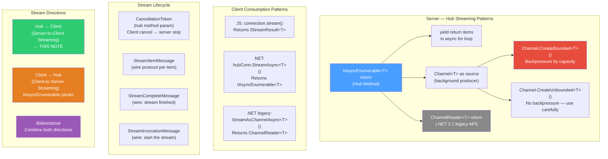
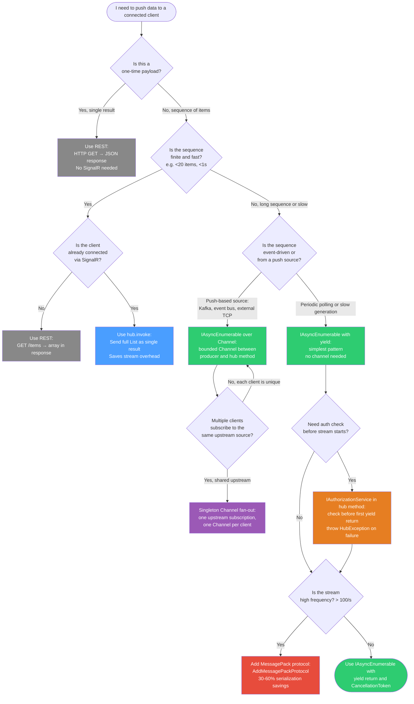

# 4.225 — SignalR Streaming: `IAsyncEnumerable<T>` from Hub to Client

---

## PART 0 — Navigation & Context

### Where This Topic Lives in the ASP.NET Core Domain

```
ASP.NET Core Mastery
│
├── Q. SignalR & Real-Time  (4.219–4.230)
│   ├── 4.219  Architecture: Hubs, Connections, Transport Negotiation
│   ├── 4.220  Hubs: Hub<T>, Methods, Client Targeting
│   ├── 4.221  Transports: WebSockets, SSE, Long Polling
│   ├── 4.222  Scale-Out: Redis Backplane
│   ├── 4.223  Authentication: JWT in WebSocket Upgrade
│   ├── 4.224  Groups: Membership and Targeted Sends
│   ├── 4.225  ◄ YOU ARE HERE — Streaming: IAsyncEnumerable<T> Hub→Client
│   ├── 4.226  .NET Client: HubConnection, Reconnect, Error Handling
│   ├── 4.227  JavaScript Client: hubConnection.on, invoke, Lifecycle
│   ├── 4.228  SignalR with Minimal APIs: MapHub and Authorization
│   ├── 4.229  Server-Sent Events with IAsyncEnumerable<T>: Push Without SignalR
│   └── 4.230  Long Polling: Correct Implementation
│
├── G. Minimal APIs (4.078–4.097)
│   └── 4.088  Streaming Responses: IAsyncEnumerable<T> and SSE (related pattern)
│
└── R. Background Services (4.231–4.239)
    └── 4.234  Queued Background Tasks: Channel<T> (same async producer pattern)
```

### What You Need Before This

- **[[4.219 — SignalR Architecture]]** — you must know what a Hub is, what a connection is, and how transports work. Streaming runs over the same WebSocket/SSE/Long-Polling transport and is negotiated using the same connection.
- **[[4.220 — SignalR Hubs]]** — streaming methods are hub methods with a different return type. The Hub class, `Clients.Caller`, `Context`, and hub activation all apply.
- **[[2.14 — Async/Await Internals]]** — `IAsyncEnumerable<T>` is a language construct built on `IAsyncEnumerator<T>`. You must understand async iteration (`await foreach`) to write streaming hub methods correctly.
- **[[4.232 — BackgroundService]]** — the most common streaming source is a background producer. Understanding `Channel<T>` and `CancellationToken` propagation is prerequisite.

### What This Unlocks After

- **[[4.226 — SignalR .NET Client]]** — the .NET client calls `StreamAsync<T>()` to consume hub streams; understanding what the server produces is required first.
- **[[4.227 — SignalR JavaScript Client]]** — `connection.stream("MethodName")` and the `IStreamResult` subscriber pattern on the JS side.
- **[[4.229 — Server-Sent Events with IAsyncEnumerable<T>]]** — the same `IAsyncEnumerable<T>` pattern but over HTTP with `text/event-stream`; contrasting these two clarifies when to use SignalR vs SSE.
- **[[4.088 — Streaming Responses in Minimal APIs]]** — the parallel pattern in Minimal APIs for HTTP streaming.

### Why This Matters at Scale

SignalR streaming solves a class of problem that neither `Clients.All.SendAsync()` (broadcast) nor `Clients.Caller.SendAsync()` (single push) can solve cleanly: **delivering a long-running, server-generated data sequence to a single client without buffering the entire sequence in memory**. For high-throughput scenarios — live telemetry dashboards, order book feeds, audit log tails, AI token-by-token responses — the difference between buffering and streaming is the difference between a service that can handle 500 concurrent users and one that OOMs at 50.

---

## PART 1 — The Core Mental Model

### The Fundamental Rule

> **SignalR streaming returns `IAsyncEnumerable<T>` from a hub method; the SignalR runtime iterates the enumerable on the server and sends each item to the client as a discrete message over the existing connection, freeing the server from buffering the full sequence and freeing the client from receiving a single large payload. Backpressure is implicit: the server only pulls the next item after the previous one has been sent.**

### The Plain-Language Analogy

Think of a sushi conveyor belt (kaiten-zushi). The kitchen (hub method) places one plate at a time onto the belt (the SignalR connection). Each diner (client) takes plates as they arrive. The kitchen does not wait until all 200 plates are made to start serving — each plate goes out the moment it is ready. If the kitchen gets backed up, the belt slows — backpressure is natural. The diner can leave at any time (disconnect), and the kitchen stops making new plates for that seat (CancellationToken fires). The belt never holds 200 plates buffered at one end — it moves one at a time.

This analogy holds for the critical edge cases: if the client disconnects mid-stream, the `CancellationToken` injected into the hub method is cancelled — the kitchen gets the signal and stops. If the kitchen throws an exception mid-sequence, the belt stops and the diner sees an error. If 200 diners all request the same stream, the kitchen runs 200 independent conveyor belts (200 independent enumerables) — there is no shared state unless you explicitly share a `Channel<T>`.

### The Taxonomy Diagram



---

## PART 2 — Deep Mechanics

### 2.1 — Pipeline Position and the SignalR Request Lifecycle

SignalR streaming does not use the traditional HTTP request/response pipeline. The stream lives inside a **persistent connection** established during the negotiation/upgrade phase. Here is where the streaming invocation sits:

```
TCP/TLS Handshake
      │
      ▼
HTTP Upgrade Request (GET /hub?id=xyz HTTP/1.1, Upgrade: websocket)
      │
      ├─► ExceptionHandler MW  ─► HSTS ─► StaticFiles ─► Routing ─► Auth ─► Authorization ─► MapHub("/hub")
      │                                                                                               │
      │                                                              WebSocket Upgrade Response ◄──────┘
      │
      ▼
[WebSocket Frame] HubProtocol Handshake (JSON/MessagePack negotiation)
      │
      ▼
[WebSocket Frame] StreamInvocationMessage  ← client sends {"type":4,"invocationId":"1","target":"StreamOrders","arguments":[]}
      │
      ▼
Hub Method Activated (IAsyncEnumerable<T> returned to SignalR runtime)
      │
      ▼
[Loop] SignalR Runtime calls MoveNextAsync() on IAsyncEnumerator<T>
      │                     │
      │       ┌─────────────┘
      │       ▼
      │  [WebSocket Frame] StreamItemMessage ← {"type":2,"invocationId":"1","item":{...}}
      │       │
      │  [repeat for each item]
      │       │
      └──────►▼
[WebSocket Frame] StreamCompleteMessage  ← {"type":3,"invocationId":"1"}
             │
             ▼
     Client subscriber .complete() called
```

**Pipeline position note:** The `UseAuthentication` and `UseAuthorization` middleware run during the HTTP upgrade request — before the WebSocket is established. Once the WebSocket is open, there is no further middleware execution per message. The `[Authorize]` attribute on the hub class or methods enforces authorization during the upgrade.

**Runtime cost:** Each `StreamItemMessage` is ~1 allocation (the serialized item). The `IAsyncEnumerator<T>` iteration costs one `MoveNextAsync()` state machine allocation per item on the first call, then reuses the state machine. The SignalR runtime holds a `SemaphoreSlim` per stream invocation to prevent concurrent `MoveNextAsync()` calls — `~1 SemaphoreSlim allocation per active stream`.

---

### 2.2 — Hub Method: `IAsyncEnumerable<T>` Return Type

The cleanest and most modern streaming pattern. Available from ASP.NET Core 3.0+, the preferred pattern from .NET 5+.

```
[Hub Method Side]                    [SignalR Runtime Side]
                                     
public async IAsyncEnumerable<T>     IAsyncEnumerator<T> enumerator = 
    StreamData(...)                      hubMethod.GetAsyncEnumerator(ct);
{                                    
    await foreach (var item in src)  while (await enumerator.MoveNextAsync())
    {                                {
        yield return item;     ───►      var item = enumerator.Current;
    }                                    await SendStreamItemAsync(item);
}                               ─ ─► }
                                     await SendStreamCompleteAsync();
```

**ASP.NET Core internally (approximate) — `DefaultHubDispatcher.InvokeStreamAsync`:**

```
// ASP.NET Core internally (approximate):
// Source: src/SignalR/server/Core/src/DefaultHubDispatcher.cs
//
// 1. Hub method is called via reflection / source-gen dispatcher
// 2. Return value is detected as IAsyncEnumerable<T>
// 3. Runtime wraps in: IAsyncEnumerator<T> enumerator = result.GetAsyncEnumerator(cancellationToken)
// 4. Background Task created (one per stream invocation):
//    while (await enumerator.MoveNextAsync(ct)) {
//        await connection.WriteAsync(new StreamItemMessage(invocationId, enumerator.Current));
//    }
// 5. On completion: connection.WriteAsync(new CompletionMessage(invocationId))
// 6. On exception: connection.WriteAsync(new CompletionMessage(invocationId, error: ex.Message))
// 7. On client cancel: CancellationToken fires, MoveNextAsync throws OperationCanceledException
//                      → CompletionMessage sent with no error
```

**HTTP wire format (approximate) — MessagePack frames over WebSocket:**

```
// Client → Server: Start stream
// [WebSocket Text Frame, JSON hub protocol]:
// {"type":4,"invocationId":"stream-1","target":"StreamLiveOrders","arguments":["ACC-001"],"streamIds":[]}

// Server → Client: Each item
// {"type":2,"invocationId":"stream-1","item":{"orderId":"ORD-9912","status":"Filled","price":142.50}}
// {"type":2,"invocationId":"stream-1","item":{"orderId":"ORD-9913","status":"Pending","price":141.00}}
// ... (one frame per yield return)

// Server → Client: Stream complete
// {"type":3,"invocationId":"stream-1","result":null,"error":null}

// Client → Server: Cancel (if client disconnects or calls subscription.dispose())
// {"type":5,"invocationId":"stream-1"}
```

**Runtime cost:** `~1 Task allocation per stream invocation` (the background iteration task). `~1 CancellationTokenSource per stream` (linked to connection lifetime). `~1 allocation per StreamItemMessage` (JSON/MessagePack serialized object).

---

### 2.3 — `CancellationToken` Propagation: The Most Important Edge Case

The `CancellationToken` parameter in a streaming hub method is automatically injected by the SignalR runtime and is cancelled when:

1. The client cancels the stream (calls `.dispose()` on JS subscriber or cancels on .NET)
2. The client disconnects (connection drops)
3. The hub connection is aborted server-side

```csharp
// Pipeline position: inside the hub method, after authentication and authorization

public async IAsyncEnumerable<MarketTick> StreamMarketData(
    string instrumentId,
    [EnumeratorCancellation] CancellationToken cancellationToken)  // ← REQUIRED ATTRIBUTE
{
    // Without [EnumeratorCancellation], cancellation does NOT propagate correctly
    // into the IAsyncEnumerable state machine. This is a CLR requirement, not SignalR.
    
    await foreach (var tick in _marketDataService.GetTicksAsync(instrumentId, cancellationToken))
    {
        yield return tick;
        // If cancellationToken is cancelled here, the next MoveNextAsync
        // will throw OperationCanceledException. SignalR runtime catches it
        // and sends a clean CompletionMessage (no error) to the client.
    }
}
```

**Framework source behavior:** The `[EnumeratorCancellation]` attribute is a `System.Runtime.CompilerServices` attribute, not a SignalR attribute. The C# compiler uses it to wire the `CancellationToken` passed to `GetAsyncEnumerator(ct)` into the async iterator state machine. Without it, the `cancellationToken` parameter gets the token passed at the call site, but `GetAsyncEnumerator()` is called with `CancellationToken.None` by the runtime, so the state machine never sees cancellation signals.

**Failure mode diagram:**

```
WITHOUT [EnumeratorCancellation]:
Client disconnects ──► CT cancelled ──► GetAsyncEnumerator(CT) called, but
                                         state machine uses CancellationToken.None
                                         ──► iterator runs forever until next yield
                                         ──► resource leak (external service call
                                             continues until exception or timeout)

WITH [EnumeratorCancellation]:
Client disconnects ──► CT cancelled ──► state machine CT is cancelled
                                         ──► next await in iterator throws
                                         ──► iterator exits cleanly
                                         ──► CompletionMessage sent to client
                                         ──► downstream resources released
```

---

### 2.4 — `ChannelReader<T>`: The Legacy Streaming API

Available from ASP.NET Core 2.1. Still valid, still used in codebases that have not migrated. Understanding it is required because you will encounter it in production codebases.

```
// ASP.NET Core internally (approximate):
// Source: src/SignalR/server/Core/src/DefaultHubDispatcher.cs
//
// When return type is ChannelReader<T>:
// Runtime reads from the channel: while (await channel.WaitToReadAsync(ct)) {
//     while (channel.TryRead(out var item)) {
//         await connection.WriteAsync(StreamItemMessage(item));
//     }
// }
// On channel completion: SendStreamCompleteAsync()
```

**Key difference from `IAsyncEnumerable<T>`:**

|Aspect|`IAsyncEnumerable<T>`|`ChannelReader<T>`|
|---|---|---|
|.NET version|3.0+ (preferred 5+)|2.1+|
|Backpressure|Implicit (one item at a time)|Explicit via bounded channel|
|Producer model|In-method `yield return`|External writer (`Channel<T>.Writer`)|
|Cancellation|`[EnumeratorCancellation]` CT param|Channel closed or CT on WaitToReadAsync|
|Composition|`await foreach` over any async source|Producer/consumer separation|
|AOT friendly|Yes (with source gen)|Yes|

**Runtime cost:** `ChannelReader<T>` involves one extra async hop per item (the channel's internal `VoidAsyncOperationWithData<T>` state machine). `IAsyncEnumerable<T>` is marginally more efficient for simple sequential producers because there is no channel allocation.

---

### 2.5 — Bidirectional Streaming and Client-to-Server Streaming

The same `IAsyncEnumerable<T>` type is used for client-to-server streaming — but as a **parameter** instead of return type.

```
// Client → Server streaming (parameter)
public async Task ProcessClientStream(IAsyncEnumerable<SensorReading> readings)
{
    await foreach (var reading in readings)
    {
        await _sensorRepository.SaveAsync(reading);
    }
}

// Bidirectional (parameter + return)
public async IAsyncEnumerable<ProcessedReading> ProcessAndStream(
    IAsyncEnumerable<SensorReading> readings,
    [EnumeratorCancellation] CancellationToken ct)
{
    await foreach (var reading in readings.WithCancellation(ct))
    {
        var processed = _processor.Process(reading);
        yield return processed;
    }
}
```

**Wire protocol distinction:** Client-to-server streaming uses `StreamInvocationMessage` with `streamIds` populated (the IDs of streams the client will send). The client sends `StreamItemMessage` frames with those IDs, and `CompletionMessage` when the client stream is done.

---

## PART 3 — Production Code Patterns

### Pattern 1: The Live Order Book Stream (Simple `IAsyncEnumerable<T>` with CancellationToken)

```csharp
// Domain: Fintech trading platform — streaming live order book updates to a trader dashboard
// Pipeline position: Hub method, after JWT auth on the WebSocket upgrade

[Authorize]
public class TradingHub : Hub
{
    private readonly IOrderBookService _orderBook;
    private readonly ILogger<TradingHub> _logger;

    public TradingHub(IOrderBookService orderBook, ILogger<TradingHub> logger)
    {
        _orderBook = orderBook;
        _logger = logger;
    }

    // ✅ CORRECT: [EnumeratorCancellation] ensures CT propagates into state machine
    // Returns IAsyncEnumerable<T> — SignalR runtime handles the iteration loop
    public async IAsyncEnumerable<OrderBookUpdate> StreamOrderBook(
        string instrumentId,
        [EnumeratorCancellation] CancellationToken cancellationToken)
    {
        // Validate the instrument ID before starting the stream
        // A bad instrument ID should fail fast, not produce an infinite empty stream
        if (string.IsNullOrWhiteSpace(instrumentId))
        {
            throw new HubException("instrumentId is required");
            // HubException is the correct way to surface errors to the client
            // Any other exception type is serialized as a generic error message
        }

        _logger.LogInformation(
            "Starting order book stream for {InstrumentId} on connection {ConnectionId}",
            instrumentId, Context.ConnectionId);

        await foreach (var update in _orderBook
            .GetLiveUpdatesAsync(instrumentId, cancellationToken)
            .WithCancellation(cancellationToken))  // belt-and-suspenders: CT on the consumer too
        {
            yield return update;
        }

        _logger.LogInformation(
            "Order book stream completed for {InstrumentId} on connection {ConnectionId}",
            instrumentId, Context.ConnectionId);
    }
}

// HTTP wire format (JSON hub protocol, approximate):
// Client → Server: {"type":4,"invocationId":"1","target":"StreamOrderBook","arguments":["MSFT"],"streamIds":[]}
// Server → Client: {"type":2,"invocationId":"1","item":{"bid":419.50,"ask":419.55,"bidSize":1200,"askSize":800}}
// Server → Client: {"type":2,"invocationId":"1","item":{"bid":419.48,"ask":419.53,"bidSize":1100,"askSize":900}}
// ... (continues until client cancels or source completes)
// Server → Client: {"type":3,"invocationId":"1","result":null,"error":null}
```

---

### Pattern 2: The Audit Log Tail (Channel-Based Producer with Bounded Backpressure)

```csharp
// Domain: E-commerce order management — streaming audit log tail to an operations console
// The pattern: background event source → Channel → SignalR stream
// This pattern handles cases where the event source is not async-enumerable itself

public class AuditHub : Hub
{
    private readonly IAuditEventBus _eventBus;

    public AuditHub(IAuditEventBus eventBus)
    {
        _eventBus = eventBus;
    }

    public async IAsyncEnumerable<AuditEvent> TailAuditLog(
        string tenantId,
        DateTimeOffset since,
        [EnumeratorCancellation] CancellationToken cancellationToken)
    {
        // Bounded channel: if the client is slow and cannot consume fast enough,
        // the channel blocks the producer — this IS backpressure.
        // BoundedChannelFullMode.Wait means the producer awaits when the channel is full.
        var channel = Channel.CreateBounded<AuditEvent>(new BoundedChannelOptions(50)
        {
            FullMode = BoundedChannelFullMode.Wait,
            SingleReader = true,  // only SignalR runtime reads
            SingleWriter = true   // only our subscription writes
        });

        // Start the producer on a background task — do NOT await it inline
        // because the hub method must return the IAsyncEnumerable to SignalR immediately
        var producerTask = Task.Run(async () =>
        {
            try
            {
                await foreach (var evt in _eventBus.SubscribeAsync(tenantId, since, cancellationToken))
                {
                    await channel.Writer.WriteAsync(evt, cancellationToken);
                }
                channel.Writer.Complete();
            }
            catch (OperationCanceledException)
            {
                channel.Writer.Complete(); // clean completion on cancel
            }
            catch (Exception ex)
            {
                channel.Writer.Complete(ex); // propagates as error to consumer
            }
        }, cancellationToken);

        // Consume from the channel — this is what SignalR iterates
        await foreach (var evt in channel.Reader.ReadAllAsync(cancellationToken))
        {
            yield return evt;
        }

        // Ensure producer task is awaited to surface exceptions and avoid fire-and-forget
        await producerTask;
    }
}
```

---

### Pattern 3: The AI Token Stream (Timed/Throttled Streaming with Delay)

```csharp
// Domain: Customer support platform — streaming AI-generated response tokens to the browser
// Pattern: controlled yield cadence, token-by-token streaming from LLM completion

public class SupportChatHub : Hub
{
    private readonly IAiCompletionService _ai;

    public SupportChatHub(IAiCompletionService ai)
    {
        _ai = ai;
    }

    public async IAsyncEnumerable<ChatToken> StreamAiResponse(
        string sessionId,
        string userMessage,
        [EnumeratorCancellation] CancellationToken cancellationToken)
    {
        // Validate: user can only stream their own session
        var userId = Context.UserIdentifier
            ?? throw new HubException("Authentication required");

        if (!await _ai.SessionBelongsToUser(sessionId, userId, cancellationToken))
            throw new HubException("Access denied to session");

        // Stream tokens from the AI completion API
        // Each token is a piece of the response (word-piece, word, or sentence)
        await foreach (var token in _ai.CompleteStreamingAsync(userMessage, cancellationToken))
        {
            yield return new ChatToken
            {
                Text = token.Text,
                TokenIndex = token.Index,
                IsComplete = token.IsLast
            };

            // Optional: if the LLM produces tokens faster than the transport can
            // handle, add a micro-delay to prevent frame flooding
            // Only add this in pathological cases — do NOT add by default
            // if (token.Index % 50 == 0)
            //     await Task.Delay(1, cancellationToken);
        }
    }
}

// JavaScript client consumption (for completeness):
// const subscription = connection.stream("StreamAiResponse", sessionId, userMessage)
//   .subscribe({
//     next: (token) => appendToChat(token.text),
//     complete: () => setComplete(),
//     error: (err) => showError(err)
//   });
// // To cancel: subscription.dispose()
```

---

### Pattern 4: The Telemetry Dashboard (Shared `Channel<T>` with Multiple Subscribers)

```csharp
// Domain: Logistics tracking — multiple dashboard clients subscribing to the same
// vehicle telemetry feed. Sharing one upstream connection to the telemetry service.
// Pattern: singleton channel producer, per-client hub method

// ⚠️ WRONG: Creating a new upstream subscription per hub connection
// With 500 dashboard users, this creates 500 TCP connections to the telemetry service
public async IAsyncEnumerable<VehicleTelemetry> StreamTelemetry_WRONG(
    string vehicleId,
    [EnumeratorCancellation] CancellationToken ct)
{
    // WRONG: every caller subscribes independently to the upstream source
    await foreach (var reading in _telemetryService.SubscribeAsync(vehicleId, ct))
        yield return reading;
}

// ✅ CORRECT: Single upstream subscription per vehicle, fanned out to clients
// via a per-vehicle Channel. The Channel is managed by a singleton service.
public async IAsyncEnumerable<VehicleTelemetry> StreamTelemetry(
    string vehicleId,
    [EnumeratorCancellation] CancellationToken ct)
{
    // The singleton TelemetryBroadcastService manages one upstream subscription
    // per vehicleId and maintains a list of per-client channels.
    // When a new client subscribes, it gets a new bounded channel reader.
    var clientChannel = await _broadcast.SubscribeAsync(vehicleId, ct);

    await foreach (var telemetry in clientChannel.Reader.ReadAllAsync(ct))
    {
        yield return telemetry;
    }

    // Unsubscribe this client's channel from the broadcast list
    await _broadcast.UnsubscribeAsync(vehicleId, clientChannel);
}

// HTTP wire format (approximate):
// POST /hub/negotiate → connectionId returned
// GET  /hub?id={connectionId} HTTP/1.1, Upgrade: websocket → 101 Switching Protocols
// {"type":4,"invocationId":"tel-1","target":"StreamTelemetry","arguments":["VHC-AU-004"],"streamIds":[]}
// {"type":2,"invocationId":"tel-1","item":{"lat":-33.86,"lng":151.20,"speed":62.5,"heading":270}}
```

---

### Pattern 5: The Auth-Scoped Progress Stream (Resource-Owned Stream)

```csharp
// Domain: Healthcare patient portal — streaming a long-running report generation job
// Only the patient or their doctor can stream their report progress

[Authorize]
public class ReportHub : Hub
{
    private readonly IReportJobService _jobs;
    private readonly IAuthorizationService _authz;

    public ReportHub(IReportJobService jobs, IAuthorizationService authz)
    {
        _jobs = jobs;
        _authz = authz;
    }

    public async IAsyncEnumerable<ReportProgress> StreamReportGeneration(
        Guid reportJobId,
        [EnumeratorCancellation] CancellationToken cancellationToken)
    {
        // Resource-based authorization: check ownership before starting the stream
        // This is identical to the HTTP pattern — the hub method IS the endpoint
        var job = await _jobs.GetJobAsync(reportJobId, cancellationToken)
            ?? throw new HubException("Report job not found");

        var authResult = await _authz.AuthorizeAsync(
            Context.User!, job, "CanViewReportJob");

        if (!authResult.Succeeded)
            throw new HubException("Access denied");
        // HubException → client receives error event with the message
        // Any other exception → client receives "An unexpected error occurred" (details hidden)

        await foreach (var progress in _jobs.StreamProgressAsync(reportJobId, cancellationToken))
        {
            yield return progress;

            // If the job failed server-side, signal the stream as errored
            if (progress.Status == ReportStatus.Failed)
            {
                throw new HubException($"Report generation failed: {progress.ErrorMessage}");
            }
        }
    }
}

// HTTP wire format (approximate):
// Authorization happens during the WebSocket upgrade (HTTP phase):
// GET /reporthub?id=xyz HTTP/1.1
// Authorization: Bearer eyJhbGci...   ← JWT validated by UseAuthentication middleware
// Upgrade: websocket
//
// HTTP/1.1 101 Switching Protocols    ← connection established, user is authenticated
// Upgrade: websocket
//
// Then hub invocation (over WebSocket):
// {"type":4,"invocationId":"rpt-1","target":"StreamReportGeneration",
//  "arguments":["3fa85f64-5717-4562-b3fc-2c963f66afa6"],"streamIds":[]}
// {"type":2,"invocationId":"rpt-1","item":{"percent":25,"stage":"Fetching records","status":"Running"}}
// {"type":2,"invocationId":"rpt-1","item":{"percent":75,"stage":"Rendering PDF","status":"Running"}}
// {"type":3,"invocationId":"rpt-1","result":null,"error":null}
```

---

### Pattern 6: The `ChannelReader<T>` Legacy Pattern (Migration Reference)

```csharp
// Domain: Inventory webhook receiver — existing codebase using ChannelReader<T>
// This is the .NET 2.1–3.x pattern. Know it to read existing codebases.
// Migrate to IAsyncEnumerable<T> unless ChannelReader is required for producer separation.

// ⚠️ LEGACY — but not wrong. Still works in .NET 8.
public ChannelReader<InventoryUpdate> StreamInventoryUpdates(
    string warehouseId,
    CancellationToken cancellationToken)
{
    // Note: no async/await in the method signature — it returns synchronously
    var channel = Channel.CreateBounded<InventoryUpdate>(100);

    // Producer runs independently
    _ = Task.Run(async () =>
    {
        try
        {
            await foreach (var update in _warehouse.GetUpdatesAsync(warehouseId, cancellationToken))
                await channel.Writer.WriteAsync(update, cancellationToken);

            channel.Writer.Complete();
        }
        catch (Exception ex)
        {
            channel.Writer.Complete(ex);
        }
    }, cancellationToken);

    // Return the reader immediately — SignalR runtime drains it
    return channel.Reader;
}

// ✅ MIGRATED to IAsyncEnumerable<T>:
public async IAsyncEnumerable<InventoryUpdate> StreamInventoryUpdates(
    string warehouseId,
    [EnumeratorCancellation] CancellationToken cancellationToken)
{
    await foreach (var update in _warehouse.GetUpdatesAsync(warehouseId, cancellationToken))
        yield return update;
}
```

---

## PART 4 — Gotchas & Anti-Patterns

### Gotcha 1: Missing `[EnumeratorCancellation]` Causes Silent Resource Leaks

Experienced engineers wire up the `CancellationToken` parameter and test the happy path. The cancellation test is rarely written because the stream appears to work. The leak only shows up under load or with long-lived connections.

```csharp
// ⚠️ WRONG: CancellationToken parameter exists but does NOT propagate into the state machine
public async IAsyncEnumerable<OrderUpdate> StreamOrders(
    string accountId,
    CancellationToken cancellationToken)  // ← missing [EnumeratorCancellation]
{
    await foreach (var update in _orders.GetUpdatesAsync(accountId, cancellationToken))
        yield return update;
}

// HTTP consequence (wrong path):
// Client disconnects → CT is cancelled → GetAsyncEnumerator(CT) is called with CT.None
// → state machine ignores cancellation → _orders.GetUpdatesAsync keeps running
// → downstream service connection held open
// → at 500 concurrent users who all disconnect, 500 zombie tasks remain
// → memory grows, downstream service connection pool exhausted

// ✅ CORRECT:
public async IAsyncEnumerable<OrderUpdate> StreamOrders(
    string accountId,
    [EnumeratorCancellation] CancellationToken cancellationToken)
{
    await foreach (var update in _orders.GetUpdatesAsync(accountId, cancellationToken))
        yield return update;
}

// HTTP consequence (correct path):
// Client disconnects → CT cancelled → state machine CT fires
// → next await in iterator propagates OperationCanceledException
// → iterator exits cleanly → CompletionMessage sent (no error) → resources released

// WHY: [EnumeratorCancellation] is a C# compiler instruction. Without it, the CancellationToken
// you receive as a parameter is the token PASSED at the call site (the hub invocation),
// but the token USED INTERNALLY by the state machine's GetAsyncEnumerator call defaults
// to CancellationToken.None. The attribute wires them together.
```

---

### Gotcha 2: Throwing Non-`HubException` Exceptions Leaks Internal Details (or Hides Them)

Engineers throw domain exceptions directly from streaming hub methods expecting the client to receive the message. In production, non-`HubException` types are swallowed by the runtime and replaced with a generic message — but only in production. In development (`DetailedErrors = true`), the full exception is serialized. The behavior difference between environments causes "it works in dev but gives a useless error in prod" bugs.

```csharp
// ⚠️ WRONG: Domain exception thrown — client gets "An unexpected error occurred" in production
public async IAsyncEnumerable<ShipmentUpdate> StreamShipment(
    string shipmentId,
    [EnumeratorCancellation] CancellationToken ct)
{
    var shipment = await _repo.GetAsync(shipmentId)
        ?? throw new NotFoundException($"Shipment {shipmentId} not found");
    // ...
}

// HTTP consequence (wrong path in production):
// Server → Client: {"type":3,"invocationId":"1","error":"An unexpected error occurred invoking 'StreamShipment'..."}
// Client gets no useful information; NotFoundException message is hidden for security

// ✅ CORRECT: Wrap in HubException to control what the client sees
public async IAsyncEnumerable<ShipmentUpdate> StreamShipment(
    string shipmentId,
    [EnumeratorCancellation] CancellationToken ct)
{
    var shipment = await _repo.GetAsync(shipmentId)
        ?? throw new HubException($"Shipment {shipmentId} not found");
    // HubException message IS sent to the client in all environments
    // ...
}

// HTTP consequence (correct path):
// Server → Client: {"type":3,"invocationId":"1","error":"Shipment SHP-001 not found"}

// WHY: SignalR has a security model for error messages. Non-HubException exceptions are
// logged server-side (at Error level) but their messages are NOT forwarded to clients
// (to prevent leaking stack traces, internal paths, connection strings in error messages).
// HubException is the explicit "safe to send to client" escape hatch.
```

---

### Gotcha 3: Unbound Channel with Slow Client Causes Unbounded Memory Growth

Engineers reach for `Channel.CreateUnbounded<T>()` because it is simpler — no need to handle `ChannelFullException` or `BoundedChannelFullMode`. With a fast producer and a slow consumer (slow network, throttled client), the channel grows without bound.

```csharp
// ⚠️ WRONG: Unbounded channel — memory grows if client is slow
public async IAsyncEnumerable<PriceUpdate> StreamPrices(
    [EnumeratorCancellation] CancellationToken ct)
{
    var channel = Channel.CreateUnbounded<PriceUpdate>(); // ← DANGER
    _ = Task.Run(async () =>
    {
        while (!ct.IsCancellationRequested)
        {
            await channel.Writer.WriteAsync(new PriceUpdate(), ct);
            await Task.Delay(1, ct); // 1000 items/second
        }
        channel.Writer.Complete();
    }, ct);

    await foreach (var p in channel.Reader.ReadAllAsync(ct))
        yield return p;
}

// HTTP consequence (wrong path):
// At 1000 items/second with a client consuming at 100 items/second:
// → Channel holds 900 items/second backlog
// → After 60 seconds: 54,000 buffered PriceUpdate objects in memory
// → With 200 concurrent users: OOM or GC thrashing under load

// ✅ CORRECT: Bounded channel with DropOldest for real-time price data
public async IAsyncEnumerable<PriceUpdate> StreamPrices(
    [EnumeratorCancellation] CancellationToken ct)
{
    // For real-time data where freshness matters more than completeness:
    // Drop old items if the client cannot keep up
    var channel = Channel.CreateBounded<PriceUpdate>(new BoundedChannelOptions(50)
    {
        FullMode = BoundedChannelFullMode.DropOldest, // keep newest prices
        SingleReader = true,
        SingleWriter = true
    });
    // ... producer task ...
}

// HTTP consequence (correct path):
// Channel never exceeds 50 items; old prices dropped when client is slow
// Memory footprint bounded at 50 * sizeof(PriceUpdate) regardless of load

// WHY: IAsyncEnumerable<T> returned directly from a hub method provides implicit
// single-item backpressure — SignalR calls MoveNextAsync only after the previous
// item is sent. But when using a producer task writing to a Channel,
// the producer runs independently and can outpace the consumer.
```

---

### Gotcha 4: Hub Context Capture and the `IHubContext<T>` Anti-Pattern in Streaming

Engineers try to capture `Context.ConnectionId` and use `IHubContext<T>` from a background service to "push" items into an active stream. This fails because `IHubContext<T>` sends to all connections or named users — it does not inject items into a specific `IAsyncEnumerable<T>` stream already in progress. The stream is controlled by the hub method's return value, not by external `SendAsync` calls.

```csharp
// ⚠️ WRONG: Trying to drive a stream from outside via IHubContext
public class BackgroundPriceUpdater : BackgroundService
{
    private readonly IHubContext<PriceHub> _hub;

    protected override async Task ExecuteAsync(CancellationToken ct)
    {
        while (!ct.IsCancellationRequested)
        {
            var price = await _priceService.GetLatestAsync(ct);
            // WRONG: This broadcasts to ALL connections, does not feed into any specific stream
            await _hub.Clients.All.SendAsync("ReceivePrice", price, ct);
        }
    }
}

// HTTP consequence (wrong path):
// This is NOT streaming — it is broadcasting.
// The client receives ReceivePrice events but there is no stream subscription lifecycle
// (no invocationId, no completion, no cancellation). The client cannot distinguish
// "this is my requested stream" from "this is a broadcast to everyone."

// ✅ CORRECT: Use a shared Channel<T> per connection or per subscription key
// The hub method returns an IAsyncEnumerable<T> that reads from the Channel.
// The background service writes to the Channel.
// (See Pattern 4 above — the TelemetryBroadcastService pattern)

// WHY: IAsyncEnumerable<T> streaming in SignalR is pull-based from the hub method.
// The SignalR runtime calls MoveNextAsync on the enumerator — you cannot inject
// items into it from the outside. To bridge push (IHubContext) with pull (stream),
// you need a Channel<T> as the intermediary.
```

---

### Gotcha 5: Using `await Task.Delay()` Inside a Streaming Loop Blocks the Entire Iteration

Engineers add delays to throttle a fast stream. If `Task.Delay` is awaited inside the `yield return` loop, it delays MoveNextAsync — which is correct. But if the cancellation token is not passed to `Task.Delay`, a disconnect leaves the delay running for its full duration before the CT is checked, creating a lag in cleanup proportional to the delay value.

```csharp
// ⚠️ WRONG: Delay without CancellationToken — slow cleanup on disconnect
public async IAsyncEnumerable<SensorReading> StreamSensor(
    [EnumeratorCancellation] CancellationToken ct)
{
    while (true)
    {
        yield return await _sensors.GetLatestAsync(ct);
        await Task.Delay(TimeSpan.FromSeconds(5)); // ← missing ct!
    }
}

// HTTP consequence (wrong path):
// Client disconnects → CT cancelled → current yield return completes
// → Task.Delay(5s) starts WITHOUT ct → takes full 5 seconds to complete
// → iterator finally checks ct → exits
// At 1000 concurrent clients disconnecting: 1000 tasks blocked for up to 5 seconds
// This is 5000 thread-seconds of wasted wait time per disconnect wave

// ✅ CORRECT: Always pass CancellationToken to Task.Delay
public async IAsyncEnumerable<SensorReading> StreamSensor(
    [EnumeratorCancellation] CancellationToken ct)
{
    while (!ct.IsCancellationRequested)
    {
        yield return await _sensors.GetLatestAsync(ct);
        await Task.Delay(TimeSpan.FromSeconds(5), ct); // ← ct passed
    }
}

// HTTP consequence (correct path):
// Client disconnects → CT cancelled → Task.Delay(5s, ct) throws OperationCanceledException
// → propagated to state machine → iterator exits immediately
// → CompletionMessage sent → resources released

// WHY: Task.Delay without a CancellationToken runs to completion regardless of
// external cancellation. For streaming hub methods that can have many concurrent
// connections, even a 1-second delay multiplied by 1000 connections = 1000 task-seconds
// of lingering work after a disconnect wave.
```

---

## PART 5 — Performance Implications

### 5.1 — Request Pipeline Characteristics Table

|Scenario|Pipeline Depth|Allocations Per Stream Item|Approx Latency Impact|Recommendation|
|---|---|---|---|---|
|Simple `IAsyncEnumerable<T>` with direct `yield return`|Shallow (hub method → runtime → WebSocket)|~1 serialized object + 1 StreamItemMessage envelope|~0.1–0.5ms per item (dominated by serialization)|Default pattern; use for most streaming cases|
|`IAsyncEnumerable<T>` from `Channel<T>` (bounded)|Medium (extra channel hop)|+1 channel buffer slot + ValueTask state machine|+0.05ms per item (channel overhead)|Use when producer/consumer separation needed|
|`ChannelReader<T>` legacy pattern|Medium|Same as Channel pattern above|Same as above|Migrate to `IAsyncEnumerable<T>` for new code|
|Large item payload (>64KB per item)|Shallow|Serialization dominates: `O(payload size)`|2–20ms per large item|Prefer streaming small items; split large payloads|
|MessagePack hub protocol (vs JSON)|Shallow|~30–60% smaller allocations vs JSON|~30% faster serialization|Use MessagePack for high-frequency streams (>100/s)|
|1 active stream per connection|Normal|Per-stream: 1 Task + 1 CT + 1 SemaphoreSlim|Negligible overhead per stream|Fine|
|100 active streams per connection|Medium|100× Task + CT + SemaphoreSlim overhead|~10KB memory overhead|Limit concurrent streams per connection|
|1000 concurrent connections streaming|High|1000× stream overhead|Linear: dominated by serialize cost|Scale horizontally; use Redis backplane|
|Unbounded Channel with fast producer/slow client|High|Unbounded memory growth|Memory pressure increases latency over time|NEVER use unbounded for production streams|
|Cold start (first stream on connection)|Medium|WebSocket upgrade + hub activation overhead|20–100ms one-time|Amortized over stream lifetime|

### 5.2 — BenchmarkDotNet Code

```csharp
// Benchmark comparing streaming approaches: async enumerable vs channel vs buffered list
// Run: dotnet run -c Release

using BenchmarkDotNet.Attributes;
using BenchmarkDotNet.Running;
using System.Threading.Channels;

BenchmarkRunner.Run<SignalRStreamingBenchmarks>();

[MemoryDiagnoser]
[SimpleJob]
public class SignalRStreamingBenchmarks
{
    private const int ItemCount = 1_000;

    // Baseline: collect all items into a list (what you'd do without streaming)
    [Benchmark(Baseline = true)]
    public async Task<List<OrderUpdate>> Buffered_AllItemsInList()
    {
        var results = new List<OrderUpdate>(ItemCount);
        for (int i = 0; i < ItemCount; i++)
        {
            results.Add(new OrderUpdate { OrderId = i, Price = 100.0m + i });
        }
        return results;
        // Allocates: 1 List<T> + ItemCount OrderUpdate objects
        // Returns entire batch at once — client waits for all 1000 items
    }

    // Approach 1: IAsyncEnumerable<T> via yield (simulates hub method iteration)
    [Benchmark]
    public async Task<int> AsyncEnumerable_YieldReturn_Consumed()
    {
        int count = 0;
        await foreach (var item in ProduceViaYield())
        {
            count++;
        }
        return count;
        // Allocates: 1 state machine + 1 IAsyncEnumerator per iteration
        // SignalR would send 1 StreamItemMessage per item
    }

    private async IAsyncEnumerable<OrderUpdate> ProduceViaYield(
        [System.Runtime.CompilerServices.EnumeratorCancellation]
        CancellationToken ct = default)
    {
        for (int i = 0; i < ItemCount; i++)
        {
            yield return new OrderUpdate { OrderId = i, Price = 100.0m + i };
        }
    }

    // Approach 2: Channel<T>-based production (producer/consumer)
    [Benchmark]
    public async Task<int> Channel_BoundedProducer_Consumed()
    {
        var channel = Channel.CreateBounded<OrderUpdate>(50);
        var producer = Task.Run(async () =>
        {
            for (int i = 0; i < ItemCount; i++)
                await channel.Writer.WriteAsync(new OrderUpdate { OrderId = i, Price = 100.0m + i });
            channel.Writer.Complete();
        });

        int count = 0;
        await foreach (var item in channel.Reader.ReadAllAsync())
            count++;

        await producer;
        return count;
        // Allocates: 1 Channel + bounded buffer + 1 Task for producer
        // Adds ~1 async hop per item vs direct yield
    }

    // Approach 3: IAsyncEnumerable from Channel (hybrid)
    [Benchmark]
    public async Task<int> AsyncEnumerable_OverChannel_Consumed()
    {
        int count = 0;
        await foreach (var item in ProduceViaChannel())
            count++;
        return count;
    }

    private async IAsyncEnumerable<OrderUpdate> ProduceViaChannel(
        [System.Runtime.CompilerServices.EnumeratorCancellation]
        CancellationToken ct = default)
    {
        var channel = Channel.CreateBounded<OrderUpdate>(50);
        _ = Task.Run(async () =>
        {
            for (int i = 0; i < ItemCount; i++)
                await channel.Writer.WriteAsync(new OrderUpdate { OrderId = i, Price = 100.0m }, ct);
            channel.Writer.Complete();
        }, ct);

        await foreach (var item in channel.Reader.ReadAllAsync(ct))
            yield return item;
    }
}

public record OrderUpdate { public int OrderId { get; init; } public decimal Price { get; init; } }

// Expected output (approximate, .NET 8, x64, no actual SignalR serialization):
// | Method                              | Mean      | Error    | Gen0   | Allocated |
// |-------------------------------------|-----------|----------|--------|-----------|
// | Buffered_AllItemsInList             | 12.3 μs   | 0.1 μs   | 3.8147 | 32 KB     |
// | AsyncEnumerable_YieldReturn_Consumed | 18.7 μs  | 0.2 μs   | 0.6104 | 5.2 KB    |
// | Channel_BoundedProducer_Consumed    | 145.2 μs  | 2.1 μs   | 1.9531 | 18.4 KB   |
// | AsyncEnumerable_OverChannel_Consumed | 148.6 μs | 1.8 μs   | 2.0000 | 19.1 KB   |
//
// Key insight: IAsyncEnumerable<T> yield-return is the LOWEST allocation pattern.
// Channel adds significant overhead (bounded buffer + Task allocation).
// Buffered list has high allocation but lowest iteration cost (no async hops).
// In a real hub, JSON/MessagePack serialization dominates these numbers 10×.
```

**Real HTTP profiling note:** BenchmarkDotNet measures allocation and CPU cost of the iteration mechanism only. To profile real SignalR stream throughput under HTTP load, use:

- `dotnet-counters monitor --process-id <pid> --counters Microsoft.AspNetCore.Http.Connections` for connection metrics
- `dotnet-trace collect --process-id <pid> --profile gc-verbose` for memory pressure under streaming load
- NBomber with `SignalR` extensions for load testing streaming endpoints with hundreds of concurrent subscribers

---

### 5.3 — When to Care / When to Ignore

**When this costs you (optimize aggressively):**

- **High-frequency streams >100 items/second per connection:** At 500 items/second with 1000 connections, you are serializing 500,000 objects/second. Switch from JSON to MessagePack (`AddMessagePackProtocol()`). Costs 30–60% less CPU and allocation.
- **Large item payloads:** If each `StreamItemMessage` is >10KB, you are on the wrong side of streaming. Break large payloads into smaller items, or consider if HTTP response streaming is better.
- **Unbounded channel producers:** Any bounded vs unbounded channel decision at >1000 concurrent streaming connections has outsized memory impact. A bounded channel with 50 items × 1000 connections = 50,000 buffered objects maximum. An unbounded channel with a slow client is unlimited.
- **Scale-out without Redis backplane:** At multiple server instances, streaming connections are not shared across instances. A client on Server A cannot receive a stream driven by a background service on Server B. Add the Redis backplane before scaling horizontally.

**When this doesn't matter (skip the optimization):**

- **Low-frequency streams (<1 item/second per connection):** An admin dashboard refreshing every 5 seconds. The serialization cost is noise.
- **Internal tooling with <50 concurrent users:** The overhead of SignalR streaming on a small user base is irrelevant; optimize for correctness and simplicity instead.
- **Short-lived streams that complete in <1 second:** The connection establishment cost dominates. For short sequences, a single HTTP response with an array is simpler and more efficient.
- **Streams from already-paginated data:** If your source returns pages of 50 items, streaming each item individually through SignalR rather than returning the whole page per invocation may add more overhead (50 StreamItemMessages) than a single response.

---

## PART 6 — Interview Arsenal

### A. The Question Bank

**Q1: How does server-to-client streaming work in SignalR, and how does it differ from a standard hub method invocation?**

**Average Answer:** "You return `IAsyncEnumerable<T>` from the hub method and use `yield return` to produce items. The client gets them one at a time."

**Why That's Insufficient:** Correct surface but missing the wire protocol, the runtime iteration mechanics, and when this is actually better than batching or broadcasting.

> **Great Answer:** "When a hub method returns `IAsyncEnumerable<T>`, the SignalR runtime detects it and starts a background iteration loop — it calls `MoveNextAsync()` on the enumerator, sends a `StreamItemMessage` frame over the WebSocket for each item, and when the enumerator completes it sends a `StreamCompleteMessage`. From the client's perspective, they call `.stream()` instead of `.invoke()`, which returns an observable — they subscribe to receive items rather than awaiting a single response. The critical difference from a standard invocation is the protocol message type: invocations use type 1 (`InvocationMessage`), streams use type 4 (`StreamInvocationMessage`) with an `invocationId` that correlates every subsequent `StreamItemMessage`. This matters in production when you're debugging with a WebSocket inspector — you'll see the protocol switch. It also means the client can cancel mid-stream by sending a `CancelInvocationMessage` with the same ID, which fires the `CancellationToken` injected into the hub method — which is why `[EnumeratorCancellation]` is not optional."

---

**Q2: What happens when a client disconnects mid-stream?**

**Average Answer:** "The stream stops because the connection is dropped."

**Why That's Insufficient:** Does not explain the mechanism — what actually stops it, what happens to server-side resources, and what bugs arise when it's not handled correctly.

> **Great Answer:** "When a client disconnects, SignalR fires the `OnDisconnectedAsync` on the hub and — more importantly for streaming — cancels the `CancellationToken` that was injected into the streaming hub method. If the hub method is correctly written with `[EnumeratorCancellation]` on the CT parameter, the next `await` inside the iterator state machine will observe the cancellation and throw `OperationCanceledException`. The SignalR runtime catches that and sends a clean completion message (no error). Without `[EnumeratorCancellation]`, the CT that fires is the parameter-level CT, but the state machine's internal enumerator was created with `CancellationToken.None` — so the iterator continues running until it hits an exception or the underlying resource times out. I've seen this burn a team when they had a 30-second polling loop inside a stream — disconnects caused 30-second leaks on every affected connection. Under load with hundreds of rapid reconnects, that looked like a memory leak."

---

**Q3: When would you use `ChannelReader<T>` instead of `IAsyncEnumerable<T>`?**

**Average Answer:** "ChannelReader is the older way to do it. IAsyncEnumerable is newer and preferred."

**Why That's Insufficient:** Doesn't explain the architectural case where `ChannelReader<T>` is the right choice even in .NET 8.

> **Great Answer:** "The key difference is producer/consumer separation. `IAsyncEnumerable<T>` with `yield return` is the right default — it's lower allocation and simpler. But if my data source is genuinely push-based — say, a Kafka consumer, an event bus, or a background job writing results — I need a `Channel<T>` to bridge the push source into a pull-based enumerator. In that case, I can return the `ChannelReader<T>` directly, or I can expose it as `IAsyncEnumerable<T>` by calling `channel.Reader.ReadAllAsync()`. The important thing is that the `Channel` is bounded — I always pick `BoundedChannelFullMode.Wait` for backpressure or `DropOldest` for real-time data where freshness matters. In practice I return `IAsyncEnumerable<T>` even in the channel case, because it's the interface `StreamAsync<T>()` on the .NET client expects, and it gives me more flexibility to switch the backing implementation later."

---

**Q4: How does SignalR streaming handle exceptions thrown mid-stream?**

**Average Answer:** "The stream stops and the client gets an error."

**Why That's Insufficient:** Missing the distinction between `HubException` and other exception types, and what the wire message looks like.

> **Great Answer:** "There are two categories. If I throw a `HubException`, its message is serialized into the `CompletionMessage` error field and sent to the client — so on the JavaScript side, the subscriber's `error` callback receives that message. This is the 'safe' channel for communicating errors to clients. If I throw any other exception — an `ArgumentException`, a `DbException`, whatever — the runtime logs it at Error level server-side and sends a generic `CompletionMessage` with 'An unexpected error occurred.' The original exception message is hidden from the client. This is a deliberate security decision: you don't want internal exception messages, connection strings, or stack traces leaking to browser clients. In development, you can enable `DetailedErrors = true` in `AddSignalR()` options to get the full exception, which is useful for debugging but must never be on in production. The wire-level message is always type 3 (`CompletionMessage`) with the `error` field populated."

---

### B. The Trick Questions

**Trick 1:** "Can I use `Task<IAsyncEnumerable<T>>` as the return type of a hub method?"

**The Trap:** Sounds reasonable — maybe you want to do some async validation before the stream starts.

**Correct Answer:** No. The SignalR hub dispatcher does not recognize `Task<IAsyncEnumerable<T>>` as a streaming return type — it would treat it as a regular invocation that happens to return an `IAsyncEnumerable<T>` object. The entire enumerable would be serialized as the single response value. You must return `IAsyncEnumerable<T>` directly (the method can still be `async` — the compiler handles this). Do your async validation with `if` + `throw new HubException()` before the first `yield return`.

---

**Trick 2:** "If I call `Clients.Caller.SendAsync("ReceiveItem", item)` from inside a streaming hub method, does the client receive two streams?"

**The Trap:** It seems like you could send items via both the `yield return` stream and direct `SendAsync` calls.

**Correct Answer:** Yes, technically — but this is a design smell. `yield return` produces `StreamItemMessage` frames with the `invocationId` of the stream. `SendAsync("ReceiveItem", ...)` produces a separate `InvocationMessage` that the client must have a separate `connection.on("ReceiveItem", ...)` handler for. They are completely separate protocol channels. The client must handle both. This pattern is legitimate if you need to send stream items AND out-of-band control signals, but it's complex and error-prone. Prefer putting both in the `IAsyncEnumerable<T>` with a discriminated union type.

---

**Trick 3:** "Does `[Authorize]` on a hub class enforce authorization per streaming invocation, or only at connection time?"

**The Trap:** Engineers assume authorization is enforced per method call, like in controllers.

**Correct Answer:** `[Authorize]` on the Hub class is enforced during the **WebSocket upgrade HTTP request** — once per connection, not per streaming invocation. After the connection is established, the `ClaimsPrincipal` is set and does not change unless you implement `IClaimsTransformation` that refreshes claims. If a user's permissions are revoked while a long-running stream is active, the stream continues — the revocation is not automatically applied. For permission-sensitive streams, check `IAuthorizationService` inside the hub method (resource-based authorization) or periodically revalidate the principal inside the iteration loop.

---

**Trick 4:** "What's the difference between `connection.stream("Method")` and `connection.invoke("Method")` on the JavaScript client?"

**The Trap:** Sounds like a client-side question with no server implication.

**Correct Answer:** Beyond the obvious (`.stream()` returns a subscriber, `.invoke()` returns a Promise), the critical difference is the wire message type. `.invoke()` sends type 1 (`InvocationMessage`) and expects type 3 (`CompletionMessage`) with a result. `.stream()` sends type 4 (`StreamInvocationMessage`) and expects type 2 (`StreamItemMessage`) frames followed by type 3 (`CompletionMessage`). If you call `.stream()` on a non-streaming hub method, the server sends a single type 3 `CompletionMessage` immediately (no type 2 frames), and the subscriber's `.complete()` fires immediately with no items. Conversely, if you call `.invoke()` on a streaming hub method, the server tries to serialize the `IAsyncEnumerable<T>` object itself as the return value — which fails or produces unexpected results.

---

### C. Red Flags to Avoid

1. **"I return `List<T>` from the hub method and send all items at once instead of streaming"** — this is exactly the problem streaming solves. Buffering defeats the purpose, wastes server memory, and increases time-to-first-item latency. Interviewers will push back hard on this.
    
2. **"I use `IHubContext<T>.Clients.Client(connectionId).SendAsync()` to send stream items from a background service"** — this is broadcasting, not streaming. It bypasses the stream protocol, the cancellation model, and the completion signaling. You cannot combine this approach with the stream subscription model cleanly.
    
3. **"I don't need `[EnumeratorCancellation]` because I check `ct.IsCancellationRequested` manually"** — this shows a misunderstanding of how the C# compiler generates async iterator state machines. Manual checks in the loop body won't help if the CT doesn't propagate into the state machine. The attribute is not optional.
    
4. **"The stream just returns the same data as a polling REST endpoint, but using WebSockets"** — if your data is discrete snapshots with no event-driven updates, you almost certainly want a REST endpoint with polling, not a SignalR stream. Streaming implies a push-based, event-driven source.
    
5. **"I throw `ArgumentException` from the hub method to signal validation errors to the client"** — in production mode, the client receives a generic error message, not the `ArgumentException.Message`. Only `HubException` messages reach the client. This is a security feature that looks like a bug if you don't know about it.
    
6. **"SignalR streaming and Server-Sent Events are interchangeable"** — SSE is unidirectional and stateless (no hub context, no connection identity, no cancellation protocol, no auth integration beyond HTTP auth). SignalR streaming requires a persistent connection, has a binary framing protocol (MessagePack), supports bidirectional cancellation, and is auth-aware via the hub's `Context.User`. They solve similar but different problems.
    
7. **"I use an unbounded `Channel<T>` as the producer"** — this is a memory bomb in disguise. In any interview that involves a follow-up about production behavior at scale, you must know that an unbounded channel with a fast producer and a slow consumer grows without limit.
    

---

## PART 7 — Decision Framework



---

## PART 8 — Self-Check

### A. Conceptual Questions

1. What is the difference between `StreamItemMessage` and `CompletionMessage` in the SignalR hub protocol? When is each sent, and what fields do they carry?
    
2. Why must `[EnumeratorCancellation]` be applied to the `CancellationToken` parameter of a streaming hub method? What specifically breaks without it?
    
3. What happens to the HTTP request pipeline (middleware chain) when a client establishes a SignalR streaming connection? At what point does middleware stop running?
    
4. If you have 1000 concurrent connections each running a streaming hub method that reads from a different `Channel<T>`, how many `Task` allocations does the runtime make for stream management? What other objects are allocated per stream?
    
5. What is the difference between `IAsyncEnumerable<T>` as a **return type** vs as a **parameter** in a hub method? What does each represent in the wire protocol?
    
6. What HTTP status code does a client see if `[Authorize]` on the hub class rejects an unauthenticated connection attempt? What about an authenticated but unauthorized attempt?
    
7. How does `BoundedChannelFullMode.DropOldest` differ from `BoundedChannelFullMode.Wait` in the context of a real-time SignalR stream? When should you choose each?
    
8. What happens if you throw a `NullReferenceException` inside a streaming hub method in production? What does the client receive? How does this differ in development mode?
    
9. What is the role of `invocationId` in the SignalR streaming protocol? How does the client use it to correlate items with a specific stream?
    
10. Can a single SignalR connection have multiple streams in flight simultaneously? What prevents them from interfering with each other?
    

---

### B. Code Puzzles

**Puzzle 1: What happens to the stream when the client disconnects?**

```csharp
public class TelemetryHub : Hub
{
    public async IAsyncEnumerable<int> CountForever(
        CancellationToken cancellationToken)  // Note: NO [EnumeratorCancellation]
    {
        int i = 0;
        while (true)
        {
            yield return i++;
            await Task.Delay(100, cancellationToken);
        }
    }
}
```

What happens when the client disconnects after receiving 10 items?

<details> <summary>Answer</summary>

**What happens:** The client disconnects → SignalR cancels the linked `CancellationToken` → `Task.Delay(100, cancellationToken)` throws `OperationCanceledException` (because the CT is wired correctly to `Task.Delay`) → BUT the state machine's internal `GetAsyncEnumerator()` was called with `CancellationToken.None` (because `[EnumeratorCancellation]` is missing) → the OperationCanceledException propagates out of the `yield return` loop → the iterator exits → the stream sends a `CompletionMessage` with the exception message.

Wait — actually this _does_ stop, because `Task.Delay(100, cancellationToken)` is explicitly passed the `cancellationToken` parameter. The bug from missing `[EnumeratorCancellation]` manifests when the CT is used ONLY implicitly (via `WithCancellation()` on an inner `await foreach`, or when the CT is only passed to `GetAsyncEnumerator()` via the state machine). Here, `Task.Delay` receives the CT directly, so cancellation propagates.

**The subtle version of this bug:** If `Task.Delay` was replaced with `await _externalService.GetDataAsync()` (where you forgot to pass the CT), the disconnect would NOT stop that await — it would complete normally, and the `while (true)` loop would continue. The missing `[EnumeratorCancellation]` only matters when the CT must propagate through the state machine into inner operations.

**HTTP consequence:** Client sees: stream disconnects. Server sends `CompletionMessage` with `error: "The operation was canceled."` (in dev) or generic error (in prod) — because `OperationCanceledException` is NOT a `HubException`, so it's treated as an unexpected exception. This is actually a secondary bug: cancel should be a clean completion (no error), not an error. The fix is to catch `OperationCanceledException` inside the loop.

</details>

---

**Puzzle 2: What does the client receive?**

```csharp
public async IAsyncEnumerable<string> StreamMessages(
    [EnumeratorCancellation] CancellationToken ct)
{
    yield return "first";
    await Task.Delay(100, ct);
    throw new InvalidOperationException("Internal state corrupted");
    yield return "second";  // unreachable
    yield return "third";   // unreachable
}
```

How many items does the client receive? What type of message does the client see for the error?

<details> <summary>Answer</summary>

**The client receives exactly 1 item: `"first"`.**

After `yield return "first"`, the iterator awaits `Task.Delay(100, ct)`, then throws `InvalidOperationException`. The SignalR runtime catches this exception in the background iteration task. Because `InvalidOperationException` is NOT a `HubException`, the runtime sends a `CompletionMessage` with:

- In production: `error: "An unexpected error occurred invoking 'StreamMessages' on the server."`
- In development (`DetailedErrors = true`): `error: "InvalidOperationException: Internal state corrupted\n at ..."`

**The client subscriber sees:** `next("first")` → `error("An unexpected error occurred...")` (one error call, stream ends).

**Wire messages:**

```
Server → Client: {"type":2,"invocationId":"1","item":"first"}
Server → Client: {"type":3,"invocationId":"1","error":"An unexpected error occurred..."}
```

The `"second"` and `"third"` items are never yielded — the compiler marks the `throw` statement and subsequent `yield return` statements as unreachable code, so they are dead code and generate a compiler warning.

</details>

---

**Puzzle 3: The Shared Channel Bug — What's the runtime behavior?**

```csharp
public class PriceHub : Hub
{
    // Singleton-scoped shared channel — one instance for all hub activations
    private static readonly Channel<decimal> _sharedChannel =
        Channel.CreateUnbounded<decimal>();

    public async IAsyncEnumerable<decimal> StreamPrices(
        [EnumeratorCancellation] CancellationToken ct)
    {
        await foreach (var price in _sharedChannel.Reader.ReadAllAsync(ct))
            yield return price;
    }

    public async Task PublishPrice(decimal price)
    {
        await _sharedChannel.Writer.WriteAsync(price);
    }
}
```

There are 3 concurrent hub connections. Connection A calls `PublishPrice(100m)`. How many of the 3 streaming subscribers receive the price `100m`?

<details> <summary>Answer</summary>

**Exactly 1 subscriber receives `100m`** — whichever one wins the race on `_sharedChannel.Reader.TryRead()`.

A `Channel<T>` is a single-producer/single-consumer or multi-producer/single-consumer queue. Each item in the channel is consumed exactly once. When `PublishPrice` writes `100m` to `_sharedChannel.Writer`, only one of the three `ReadAllAsync()` calls will dequeue it. The other two subscribers receive nothing from this particular publish.

This is a **common mistake** when engineers want to broadcast. A `Channel<T>` is fundamentally a work queue, not a broadcast bus.

**The correct pattern for broadcasting** to all subscribers is a **per-subscriber channel**: the hub creates a new bounded channel per connection and registers it with a singleton broadcast service. When `PublishPrice` is called, it writes to EACH registered subscriber channel — one copy per subscriber.

**HTTP consequence:** 2 out of 3 clients never receive the price update. This looks like a race condition or a randomly dropping stream. Under load with 100 subscribers, only 1 random subscriber gets each price. The bug is non-deterministic and extremely hard to reproduce in unit tests.

</details>

---

**Puzzle 4: Does this compile? Does it work as a streaming hub method?**

```csharp
public class DataHub : Hub
{
    public Task<IAsyncEnumerable<int>> GetNumbers(
        [EnumeratorCancellation] CancellationToken ct)
    {
        return Task.FromResult(GenerateNumbers(ct));
    }

    private async IAsyncEnumerable<int> GenerateNumbers(
        [EnumeratorCancellation] CancellationToken ct)
    {
        for (int i = 0; i < 10; i++)
        {
            yield return i;
            await Task.Delay(100, ct);
        }
    }
}
```

<details> <summary>Answer</summary>

**It compiles without error. It does NOT work as a streaming hub method.**

The SignalR hub dispatcher inspects the declared return type of the hub method. `Task<IAsyncEnumerable<int>>` is recognized as a standard invocation return type, NOT as a streaming return type. The dispatcher will await the `Task` (which resolves immediately via `Task.FromResult`) and then attempt to serialize the `IAsyncEnumerable<int>` object as the single response value.

Serializing an `IAsyncEnumerable<int>` with `System.Text.Json` produces either an empty object `{}` (because there are no serializable properties on the state machine object) or a serialization exception. Either way, the client does NOT receive 10 integer items streamed over time.

**The fix:** Change the return type to `IAsyncEnumerable<int>` directly:

```csharp
public async IAsyncEnumerable<int> GetNumbers(
    [EnumeratorCancellation] CancellationToken ct)
{
    for (int i = 0; i < 10; i++)
    {
        yield return i;
        await Task.Delay(100, ct);
    }
}
```

**HTTP consequence:** The client calls `.stream("GetNumbers")`, receives a single `CompletionMessage` immediately (not 10 `StreamItemMessage` frames), with either no result or a serialization error. The subscriber's `.complete()` fires immediately with no items received.

</details>

---

**Puzzle 5 (The Most Common Misunderstanding Puzzle): Does cancellation work correctly?**

```csharp
public class SensorHub : Hub
{
    private readonly ISensorService _sensors;

    public SensorHub(ISensorService sensors) => _sensors = sensors;

    public async IAsyncEnumerable<SensorReading> StreamSensor(
        string sensorId,
        CancellationToken cancellationToken)   // ← Missing [EnumeratorCancellation]
    {
        await foreach (var reading in _sensors
            .GetReadingsAsync(sensorId)
            .WithCancellation(cancellationToken))  // CT applied to consumer
        {
            yield return reading;
        }
    }
}
```

`_sensors.GetReadingsAsync()` returns `IAsyncEnumerable<SensorReading>` and internally polls hardware every 500ms in an infinite loop. Client connects, starts the stream, receives 5 readings, then disconnects.

What happens server-side?

<details> <summary>Answer</summary>

**The sensor polling loop continues running after the client disconnects.**

Here's why: When the client disconnects, SignalR cancels the `CancellationToken` linked to the connection. The hub method's `cancellationToken` parameter IS that token — it fires.

However, because `[EnumeratorCancellation]` is missing, the C# compiler generates an async iterator state machine where `GetAsyncEnumerator()` is called WITHOUT the `cancellationToken`. So while the parameter-level token fires, the state machine was created with `CancellationToken.None` internally.

The `.WithCancellation(cancellationToken)` call creates a new `CancellationToken` by combining the one you passed with the enumerator's own CT (which is `None`). So the combination is: `cancellationToken` OR `None`. When `cancellationToken` fires, `WithCancellation` should propagate this into `MoveNextAsync`.

**But here's the subtlety:** `WithCancellation` passes the token to `GetAsyncEnumerator(token)` on `_sensors.GetReadingsAsync()`. If that method correctly respects the cancellation token passed to `GetAsyncEnumerator`, cancellation WILL work — because `WithCancellation` bypasses the missing `[EnumeratorCancellation]` on the OUTER iterator by passing the token directly to the INNER iterator.

**HOWEVER:** The outer state machine for `StreamSensor` itself was created with `CancellationToken.None`. If the SignalR runtime cancels the iteration by cancelling the token AND the `await foreach` inside `StreamSensor` is currently between items (waiting on `MoveNextAsync` of the inner `_sensors` enumerable), the inner enumerable's `MoveNextAsync` will see the cancelled CT (via `WithCancellation`) and throw, which propagates out and cancels the stream correctly.

**The REAL bug** is if `_sensors.GetReadingsAsync()` ignores the cancellation token passed to `GetAsyncEnumerator()` — which many simple implementations do. In that case, the sensor polling continues forever.

**Correct fix:** Add `[EnumeratorCancellation]` to ensure the outer state machine's CT is set correctly, AND ensure the inner service respects the CT:

```csharp
public async IAsyncEnumerable<SensorReading> StreamSensor(
    string sensorId,
    [EnumeratorCancellation] CancellationToken cancellationToken)
{
    await foreach (var reading in _sensors
        .GetReadingsAsync(sensorId, cancellationToken))  // pass CT explicitly
    {
        yield return reading;
    }
}
```

**HTTP consequence of the bug:** Client disconnects → server-side sensor polling continues for the lifetime of the application (or until an exception occurs internally). At 100 clients doing rapid connect/disconnect cycles (mobile users on flaky networks), 100 zombie sensor polling loops accumulate. Memory and CPU rise gradually. This looks like a slow memory leak.

</details>

---

## PART 9 — Connections & Resources

### A. Related Topics Table

|Topic|Why It Connects|
|---|---|
|[[4.219 — SignalR Architecture: Hubs, Connections, and Transport Negotiation]]|Streaming runs over the same connection and transport layer; understanding negotiation is required to know what protocol the stream frames travel over|
|[[4.220 — SignalR Hubs: Hub<T>, Methods, Client Targeting]]|Streaming hub methods are hub methods with a different return type; hub activation, `Context`, and `Clients` all behave identically|
|[[4.221 — SignalR Transports: WebSockets, SSE, Long Polling]]|The transport determines the framing for `StreamItemMessage`; WebSockets is the only transport that supports efficient bidirectional streaming; SSE only supports server-to-client|
|[[4.222 — SignalR Scale-Out: Redis Backplane and Azure SignalR Service]]|Streaming connections are tied to a single server instance; without the Redis backplane, a background service on Server B cannot drive a stream on Server A|
|[[4.223 — SignalR Authentication: JWT in WebSocket Connection Upgrade]]|`[Authorize]` on the hub class is checked during the HTTP upgrade; `Context.User` in the streaming method is set at upgrade time, not per-yield|
|[[4.224 — SignalR Groups: Membership and Targeted Sends]]|Groups and streaming are orthogonal: groups use `IHubContext.Clients.Group().SendAsync()` (broadcast pattern), not `IAsyncEnumerable` (pull pattern)|
|[[4.088 — Streaming Responses: IAsyncEnumerable<T> and Server-Sent Events]]|Same `IAsyncEnumerable<T>` pattern in Minimal APIs over HTTP; compare this with SignalR streaming to understand when to use each|
|[[4.234 — Queued Background Tasks: Channel<T>-Based Producer/Consumer]]|`Channel<T>` is the primary bridge between push-based background producers and pull-based `IAsyncEnumerable<T>` streams|
|[[4.232 — BackgroundService: The Base Class for Long-Running Work]]|The most common streaming source is a background service that writes to a channel; understanding `BackgroundService` and `IServiceScopeFactory` is required for this pattern|
|[[4.035 — Service Lifetimes: Singleton, Scoped, Transient]]|Hub classes are Transient (one per invocation); singleton services injected into hub constructors must be thread-safe because they are shared across all streaming connections|
|[[4.057 — Middleware and Scoped DI: Injecting Scoped Services Correctly]]|Hub methods run outside normal middleware scope; DI for hub dependencies uses the hub's own scope (one per hub invocation), which is separate from the middleware scope|

### B. Books

|Book|Chapters|Why These Chapters|
|---|---|---|
|_Pro ASP.NET Core 8_ — Adam Freeman|Ch. 36 (SignalR), Ch. 37 (Advanced SignalR)|Ch. 37 covers hub streaming specifically, with both `ChannelReader<T>` and `IAsyncEnumerable<T>` patterns; includes JavaScript client consumption|
|_ASP.NET Core in Action_ (3rd ed.) — Andrew Lock|Ch. 23 (SignalR)|Covers the streaming model in the context of the full SignalR architecture; good on the `CancellationToken` propagation model|
|_Concurrency in C#_ — Stephen Cleary|Ch. 9 (Async Streams), Ch. 3 (Async Producers/Consumers)|`IAsyncEnumerable<T>` and `Channel<T>` are C# language features; this book covers them deeper than any ASP.NET Core resource|
|_High-Performance .NET_ — Matt Warren|Ch. 6 (Allocation), Ch. 8 (Async Performance)|Performance analysis of async enumerable vs channel vs buffering; directly applicable to choosing between streaming patterns|

### C. Essential Articles & Docs

- [Microsoft Docs: Use streaming in ASP.NET Core SignalR](https://learn.microsoft.com/en-us/aspnet/core/signalr/streaming) — the canonical reference for both server-to-client and client-to-server streaming, including JavaScript and .NET client consumption patterns
- [David Fowler (@davidfowl) — SignalR architecture notes](https://github.com/dotnet/aspnetcore/tree/main/src/SignalR) — the source code itself; `DefaultHubDispatcher.cs` contains the streaming iteration logic; reading `InvokeStreamAsync` directly is the best way to understand runtime behavior
- [Andrew Lock: SignalR series](https://andrewlock.net/category/signalr/) — production-focused articles on SignalR including auth, scaling, and streaming gotchas
- [Stephen Cleary: Async Streams](https://blog.stephencleary.com/2019/01/async-streams.html) — the definitive explanation of `IAsyncEnumerable<T>` and `[EnumeratorCancellation]` from the C# language perspective; required reading before writing streaming hub methods
- [GitHub Issue: IAsyncEnumerable CancellationToken handling in SignalR](https://github.com/dotnet/aspnetcore/issues/14973) — the actual GitHub issue thread where the `[EnumeratorCancellation]` behavior was designed and debated; explains exactly why the attribute is required

---

> [!NOTE] **Template Meta-Note — What Each Part Is For**
> 
> |Part|Purpose|
> |---|---|
> |**0 — Navigation**|Orient yourself before reading: hierarchy, prerequisites, dependents, and the one-sentence production justification|
> |**1 — Core Mental Model**|The single rule you defend in interviews + a physical analogy that holds under pressure + the full taxonomy diagram|
> |**2 — Deep Mechanics**|What ASP.NET Core is actually doing: pipeline position, HTTP wire format, framework internals, failure modes, cost labels|
> |**3 — Production Code**|5-7 named, domain-specific patterns with HTTP consequences — paste into a real codebase without modification|
> |**4 — Gotchas**|5 bugs that appear in production code written by experienced engineers — wrong path + HTTP consequence + correct path + why|
> |**5 — Performance**|Pipeline characteristics table + runnable BenchmarkDotNet code + when to care vs ignore|
> |**6 — Interview Arsenal**|Full question bank with great answers + trick questions + red flags — written to be spoken aloud|
> |**7 — Decision Framework**|A single flowchart that answers "when do I use X vs Y" — usable as a cheat sheet mid-interview|
> |**8 — Self-Check**|10 conceptual questions + 5 code puzzles with collapsed answers — at least one puzzle targets the most common misunderstanding|
> |**9 — Connections**|Wiki-linked related topics with specific reasons + books with chapter-level guidance + official docs and trusted authors only|