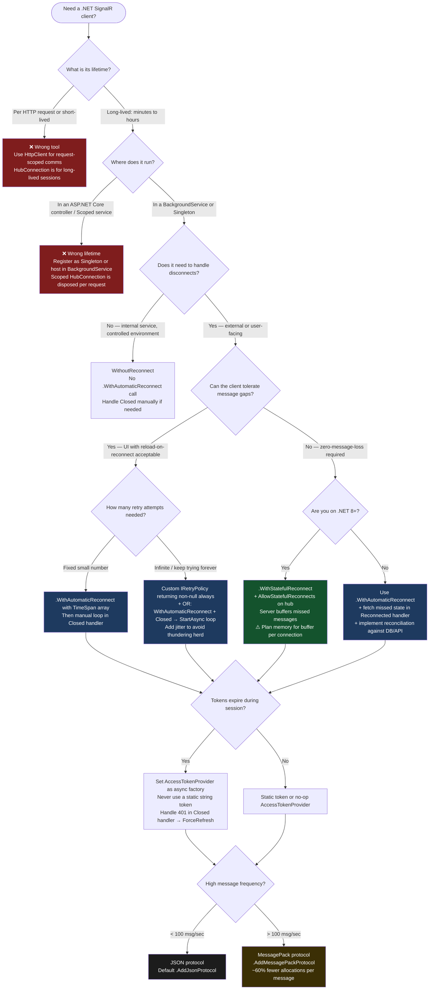

# 4.226 — SignalR .NET Client: HubConnection, Reconnect, and Error Handling

---

## PART 0 — Navigation & Context

### Where This Topic Lives

```
ASP.NET Core Mastery
│
├── Q. SignalR & Real-Time (4.219–4.230)
│   ├── 4.219 — SignalR Architecture: Hubs, Connections, Transport Negotiation
│   ├── 4.220 — SignalR Hubs: Hub<T>, Methods, Caller/Client/Groups/All
│   ├── 4.221 — SignalR Transports: WebSockets, SSE, Long Polling
│   ├── 4.222 — SignalR Scale-Out: Redis Backplane and Azure SignalR
│   ├── 4.223 — SignalR Authentication: JWT in WebSocket Upgrade
│   ├── 4.224 — SignalR Groups: Membership and Targeted Delivery
│   ├── 4.225 — SignalR Streaming: IAsyncEnumerable<T> Hub→Client
│   ├── ► 4.226 — SignalR .NET Client: HubConnection, Reconnect, Error Handling ◄
│   ├── 4.227 — SignalR JavaScript Client: hubConnection.on/invoke/Lifecycle
│   ├── 4.228 — SignalR with Minimal APIs: MapHub and Authorization
│   └── 4.229–4.230 — SSE and Long Polling without SignalR
│
├── R. Background Services (4.231–4.239)   [workers that call HubConnection]
└── T. HttpClientFactory (4.249–4.256)     [transport-layer analogy]
```

### What You Need Before This

- **[[4.219 — SignalR Architecture]]** — the concept of a Hub, connection ID, and the negotiate handshake the client drives
- **[[4.221 — SignalR Transports]]** — `HubConnection` selects a transport; you must know what WebSockets/SSE/Long Polling cost when configuring transport preferences
- **[[4.223 — SignalR Authentication]]** — bearer token factory on the client is the single most production-critical configuration option
- **[[2.14 — Async/Await Internals]]** — every `HubConnection` method returns `Task` or `ValueTask`; reconnect logic is a state machine built on async continuations

### What This Unlocks After

- **[[4.262 — Testing SignalR]]** — you cannot write integration tests for SignalR without building a `HubConnection` in the test harness
- **[[4.225 — SignalR Streaming]]** — streaming from a hub requires `connection.StreamAsChannelAsync<T>()` or `connection.StreamAsync<T>()` from the client
- **[[4.227 — SignalR JavaScript Client]]** — the JS client has the same conceptual model but different reconnection APIs; studying .NET first makes the JS surface obvious
- **[[4.222 — SignalR Scale-Out]]** — scale-out with Redis backplane only matters if clients can reconnect and resubscribe to groups correctly

### Why This Topic Matters at Scale

A `HubConnection` without explicit reconnection and error handling is a **production time bomb**: in any containerized deployment with rolling restarts, TCP interruptions, or load balancer idle timeouts, connections will drop silently — and without `WithAutomaticReconnect()` plus an explicit group-resubscription strategy, every reconnected client loses its real-time subscription state, producing silent data gaps that are nearly impossible to observe without distributed tracing.

---

## PART 1 — The Core Mental Model

### The Fundamental Rule

> **`HubConnection` is a stateful, long-lived TCP session masquerading as a simple method-calling abstraction. Every state transition — connecting, reconnecting, disconnecting — requires explicit application-level handling because SignalR cannot restore server-side group memberships, streaming subscriptions, or hub state on reconnect; only the transport is restored.**

### The Plain-Language Analogy

Think of `HubConnection` as a radio call between a field agent and headquarters. The radio itself (`HubConnection`) can automatically re-establish the carrier signal after it drops (`WithAutomaticReconnect`), but the moment the signal was lost, headquarters has forgotten what the agent was tracking. The agent must re-register their position, re-request their mission briefing, and re-subscribe to their intelligence feeds the instant the signal comes back — the carrier signal recovery doesn't restore any of that context. If the agent just listens for incoming transmissions without re-registering, they'll hear nothing and falsely believe everything is fine. The parallel holds under failure: if the radio can't re-establish after several attempts, the agent needs to notify base manually, not silently give up.

### The Taxonomy Diagram

```mermaid
graph TD
    subgraph Client["HubConnection Lifecycle"]
        direction TB
        A[HubConnectionBuilder] -->|.Build()| B[HubConnection]
        B --> C{State}
        C -->|StartAsync| D[Connecting]
        D -->|negotiate + transport| E[Connected]
        E -->|network drop| F[Reconnecting]
        F -->|retry succeeds| E
        F -->|retry exhausted| G[Disconnected]
        E -->|StopAsync / DisposeAsync| G
        G -->|StartAsync again| D
    end

    subgraph Config["Builder Configuration Surface"]
        direction TB
        H[.WithUrl] --> H1[URI + AccessTokenFactory + TransportType]
        I[.WithAutomaticReconnect] --> I1[DefaultReconnectPolicy<br>CustomIRetryPolicy<br>TimeSpan array]
        J[.WithStatefulReconnect] --> J1[.NET 8+: buffer replays<br>missed server→client msgs]
        K[.ConfigureLogging] --> K1[ILoggerFactory integration]
        L[.AddJsonProtocol / AddMessagePackProtocol] --> L1[Protocol selection]
    end

    subgraph Handlers["Event Handlers"]
        direction TB
        M[connection.On<T>] --> M1[Register hub method listener]
        N[connection.Closed] --> N1[Func<Exception?, Task><br>terminal disconnect]
        O[connection.Reconnecting] --> O1[Func<Exception?, Task><br>notify UI: degraded]
        P[connection.Reconnected] --> P1[Func<string?, Task><br>resubscribe groups here]
    end

    subgraph Invoke["Invocation Methods"]
        direction TB
        Q[InvokeAsync<T>] --> Q1[send + await server return value]
        R[SendAsync] --> R1[fire-and-forget: no server ack]
        S[StreamAsChannelAsync<T>] --> S1[streaming: ChannelReader<T>]
        T2[StreamAsync<T>] --> T3[streaming: IAsyncEnumerable<T>]
    end

    style Config fill:#1a3a5c,color:#fff
    style Handlers fill:#3b1f47,color:#fff
    style Invoke fill:#1a4733,color:#fff
    style Client fill:#2c2c2c,color:#fff
```

---

## PART 2 — Deep Mechanics

### 2.1 — The Negotiate Handshake and Connection State Machine

Every `HubConnection.StartAsync()` call drives a two-phase negotiation before any hub messages flow:

```
// Phase 1: HTTP POST to negotiate endpoint
// POST https://api.example.com/orderhub/negotiate?negotiateVersion=1
// Authorization: Bearer {token}
//
// Response:
// {
//   "negotiateId": "abc123",
//   "connectionToken": "xyz...",
//   "connectionId": "def456",
//   "availableTransports": [
//     {"transport":"WebSockets","transferFormats":["Text","Binary"]},
//     {"transport":"ServerSentEvents","transferFormats":["Text"]},
//     {"transport":"LongPolling","transferFormats":["Text","Binary"]}
//   ]
// }
//
// Phase 2: WebSocket upgrade
// GET wss://api.example.com/orderhub?id=xyz...
// Upgrade: websocket
// Connection: Upgrade
// Sec-WebSocket-Key: ...
// Authorization: Bearer {token}     ← injected by AccessTokenFactory
```

**ASP.NET Core internally (approximate):**

The client-side state machine in `HubConnection` (source: `Microsoft.AspNetCore.SignalR.Client/HubConnection.cs`) runs through these internal states:

```
Disconnected → Connecting → Connected
                              ↓ (connection drop)
                           Reconnecting
                              ↓ (retry attempt N)
                           Connecting
                              ↓ (success)
                           Connected
                              ↓ (all retries exhausted)
                           Disconnected
```

The state is stored as a `volatile int` (`HubConnectionState`) and transitioned atomically. **The `Reconnecting` and `Reconnected` events fire on an internal connection thread**, not on the calling thread — your handlers must be thread-safe. Every `On<T>` handler fires on the transport thread as well; if it blocks, it blocks the receive loop.

**Pipeline Position:**

```
HubConnection.StartAsync()
    │
    ├──► HTTP POST /negotiate   (HttpMessageInvoker — uses HttpClient internally)
    │       ~1 RTT + ~2 allocs
    │
    ├──► Transport selection + WebSocket upgrade
    │       ~1 RTT
    │
    └──► Handshake protocol message exchange
             Format: {"protocol":"json","version":1}\x1e
             ~1 RTT, ~1 allocation for the serialized handshake message
```

**Runtime cost:** Establishing a `HubConnection` costs approximately 3 round-trips and ~50 KB of initial heap pressure from transport buffers. Each concurrent connection consumes one `SocketsHttpHandler` socket from the connection pool; connections sharing a `HubConnectionBuilder` instance do NOT share transports (each `Build()` creates an independent pipeline).

---

### 2.2 — `WithAutomaticReconnect()` and Retry Policy Internals

The most critical production configuration decision is how reconnection is scheduled.

```
// Default reconnect timing (no-arg overload):
// Attempt 0: retry after 0ms
// Attempt 1: retry after 2,000ms
// Attempt 2: retry after 10,000ms
// Attempt 3: retry after 30,000ms
// Attempt 4+: STOP — fires Closed event, connection moves to Disconnected
```

**Framework source behavior (approximate, `RetryPolicy.cs`):**

```csharp
// ASP.NET Core internally (approximate):
public class DefaultRetryPolicy : IRetryPolicy
{
    private static readonly TimeSpan?[] DefaultBackoffTimes = new TimeSpan?[]
    {
        TimeSpan.Zero,
        TimeSpan.FromSeconds(2),
        TimeSpan.FromSeconds(10),
        TimeSpan.FromSeconds(30),
    };

    public TimeSpan? NextRetryDelay(RetryContext retryContext)
    {
        // Returns null when array is exhausted → reconnect loop stops
        if (retryContext.PreviousRetryCount >= DefaultBackoffTimes.Length)
            return null;
        return DefaultBackoffTimes[retryContext.PreviousRetryCount];
    }
}
```

`RetryContext` exposes:

- `PreviousRetryCount` — how many retries have already failed
- `ElapsedTime` — total time since initial disconnect
- `RetryReason` — the exception that caused the disconnect

**What happens during the retry interval:** The `HubConnection` is in `Reconnecting` state. All `InvokeAsync` and `SendAsync` calls thrown during this window throw `InvalidOperationException("HubConnection is not in the 'Connected' HubConnectionState.")`. You must guard all send calls by checking `connection.State == HubConnectionState.Connected`.

**Failure path:**

```
Connection drops
    │
    ├── Reconnecting event fires (Exception? = reason)
    │
    ├── Retry 0: immediately attempts StartAsync() internally
    │       → WebSocket upgrade fails → retry delay 0ms expired
    │
    ├── Retry 1: 2s delay → attempt → fails
    ├── Retry 2: 10s delay → attempt → fails
    ├── Retry 3: 30s delay → attempt → fails
    │
    └── Closed event fires (Exception? = last failure reason)
        HubConnection.State → Disconnected
        ⚠️ You must call StartAsync() manually now or the connection is dead
```

---

### 2.3 — Stateful Reconnect (.NET 8+)

.NET 8 introduced `WithStatefulReconnect()` — a fundamentally different reconnect model that buffers server→client messages while the connection is temporarily severed and replays them after reconnection.

```csharp
// Server must also opt in:
app.MapHub<OrderHub>("/orderhub", options =>
{
    options.AllowStatefulReconnects = true; // server-side opt-in
});

// Client:
var connection = new HubConnectionBuilder()
    .WithUrl("https://api.example.com/orderhub", options =>
    {
        options.AccessTokenProvider = () => Task.FromResult(tokenService.GetToken());
    })
    .WithStatefulReconnect()  // replaces WithAutomaticReconnect()
    .Build();
```

**What changes with stateful reconnect:**

- The server buffers messages sent to this connection during the reconnect window (configurable, default 1MB per connection)
- On reconnect, the server replays buffered messages in order before resuming live traffic
- Group memberships on the server are preserved because the connection ID is preserved across the reconnect
- Only works over WebSockets; falls back to normal reconnect for other transports

**Cost:** The server buffers per-connection in memory. At scale (10k concurrent connections), each with a 1MB buffer = 10GB of memory under sustained reconnect load. Tune `HubOptions.StatefulReconnectBufferSize`.

**HTTP wire on stateful reconnect:**

```
// Reconnect uses same connectionId:
// GET wss://api.example.com/orderhub?id=xyz...&reconnectToken=prevToken
//
// Server responds by replaying buffered frames before new messages
```

---

### 2.4 — `On<T>` Handler Registration and the Subscription Model

`connection.On<T>()` returns an `IDisposable` subscription. This is the edge case that bites production teams the hardest.

```
// ASP.NET Core internally (approximate, HubConnection.cs):
//
// On<T> internally registers a handler in a ConcurrentDictionary<string, InvocationHandlerList>
// Key = method name (case-insensitive), Value = list of handlers
//
// Multiple On<T> calls for the SAME method name = ALL handlers fire (not last-wins)
//
// Cost: ~1 allocation per On<T> call, ~1 allocation per received message (deserialization)
```

**The silent duplicate handler bug:**

```csharp
// ⚠️ WRONG: Called on every reconnect, so handlers accumulate
connection.Reconnected += async connectionId =>
{
    // This registers a NEW handler on every reconnect
    connection.On<OrderStatusUpdate>("OrderStatusChanged", update =>
    {
        // FIRES MULTIPLE TIMES per message after N reconnects
        ProcessOrderUpdate(update);
    });
};

// ✅ CORRECT: Register handlers once before StartAsync(), dispose on disconnect
private IDisposable? _orderStatusSubscription;

// At initialization time (once):
_orderStatusSubscription = connection.On<OrderStatusUpdate>(
    "OrderStatusChanged",
    update => ProcessOrderUpdate(update));

// On reconnect, only resubscribe to SignalR GROUPS (server-side), not re-register On<T>
connection.Reconnected += async connectionId =>
{
    await connection.SendAsync("JoinOrderGroup", _currentOrderId);
    // On<T> handlers persist across reconnects — no re-registration needed
};

// On dispose:
_orderStatusSubscription?.Dispose();
```

**Thread safety:** `On<T>` handlers are invoked serially on the connection's receive loop thread. If two messages arrive while a handler is awaiting async work, they queue. If your handler is slow, you can fall behind. For high-throughput handlers, offload to `Channel<T>` and process on a separate thread.

---

### 2.5 — Error Handling Surface: `Closed`, `Reconnecting`, `Reconnected`

```
┌─────────────────────────────────────────────────────────────────────┐
│                     Connection Event Timeline                       │
│                                                                     │
│  StartAsync()                                                       │
│      │                                                              │
│  ────┼──── Connected ──────────────────────── TCP drop ────────   │
│      │                                              │              │
│      │                                              ▼              │
│      │                                     Reconnecting event fires │
│      │                                              │              │
│      │                               ┌──── retry loop ────┐       │
│      │                               │                     │       │
│      │                               │  attempt N success  │       │
│      │                               │       ↓             │       │
│      │                               │  Reconnected fires  │       │
│      │                               │  ← RE-JOIN GROUPS   │       │
│      │                               │  ← RE-FETCH STATE   │       │
│      │                               │                     │       │
│      │                               │  all attempts fail  │       │
│      │                               │       ↓             │       │
│      │                               │  Closed event fires │       │
│      │                               │  State→Disconnected │       │
│      │                               │  ← NOTIFY USER      │       │
│      │                               │  ← START MANUAL     │       │
│      │                               │    RETRY LOOP       │       │
│      │                               └─────────────────────┘       │
└─────────────────────────────────────────────────────────────────────┘
```

The three events and their signatures:

```csharp
// Reconnecting: called when the connection drops and retry begins
// Exception? is the cause of the disconnect (can be null for clean close)
connection.Reconnecting += async (Exception? error) =>
{
    // ~1 allocation for the Task continuation
    _logger.LogWarning(error, "SignalR reconnecting...");
    await _uiState.SetConnectionStatusAsync(ConnectionStatus.Reconnecting);
};

// Reconnected: called when a retry succeeds
// string? connectionId is the NEW connection ID (different from the original)
connection.Reconnected += async (string? connectionId) =>
{
    // ⚠️ connectionId is a new value — do not cache the old one
    _logger.LogInformation("SignalR reconnected. New connection: {ConnectionId}", connectionId);
    // CRITICAL: re-join server groups here — they are NOT preserved by WithAutomaticReconnect
    await RejoinGroupsAsync();
};

// Closed: called when reconnect is exhausted OR StopAsync() is called
// Exception? is null on clean stop, non-null on exhausted retry
connection.Closed += async (Exception? error) =>
{
    if (error is not null)
    {
        _logger.LogError(error, "SignalR permanently disconnected");
        await StartManualRetryLoopAsync(); // see Pattern 5 below
    }
};
```

---

### 2.6 — `InvokeAsync` vs `SendAsync` — Failure Semantics

```
InvokeAsync<T>("MethodName", args, cancellationToken)
    │
    ├── Sends invocation frame to server
    ├── Awaits completion message or error message from server
    ├── Returns T (the hub method's return value)
    ├── Throws HubException if the hub method throws
    ├── Throws TaskCanceledException if cancellationToken fires
    └── Throws InvalidOperationException if not Connected
        Cost: 2 RTTs (send + receive completion), ~2 allocations

SendAsync("MethodName", args, cancellationToken)
    │
    ├── Sends invocation frame to server
    ├── Returns Task.CompletedTask when the MESSAGE IS WRITTEN to transport
    ├── Does NOT wait for the server to process it
    ├── Does NOT surface HubException (server errors are silently dropped)
    └── Still throws if not Connected
        Cost: 1 RTT (send only), ~1 allocation
```

**When each fails silently:** `SendAsync` is "fire-and-forget at the transport layer." If the hub method on the server throws after `SendAsync` completes on the client, you will never know. Use `SendAsync` only when message loss is acceptable (e.g., telemetry, cursor position updates). Use `InvokeAsync` for anything that affects order or payment state.

---

## PART 3 — Production Code Patterns

### Pattern 1: The Resilient Order Tracking Connection (Baseline)

A logistics tracking service that subscribes to shipment status updates for an active delivery.

```csharp
// Domain: logistics shipment tracking — operator console connecting to ShipmentHub
// Goal: maintain a live connection showing real-time shipment state to warehouse operators

public sealed class ShipmentTrackingClient : IAsyncDisposable
{
    private readonly HubConnection _connection;
    private readonly ILogger<ShipmentTrackingClient> _logger;
    private readonly ITokenService _tokenService;
    private string? _currentShipmentId;

    // IDisposable returned by On<T> — disposing removes the handler
    private IDisposable? _statusUpdateSubscription;
    private IDisposable? _locationUpdateSubscription;

    public event Func<ShipmentStatusUpdate, Task>? StatusUpdated;
    public event Func<ShipmentLocationUpdate, Task>? LocationUpdated;
    public event Func<ConnectionStatus, Task>? ConnectionStatusChanged;

    public ShipmentTrackingClient(
        ITokenService tokenService,
        ILogger<ShipmentTrackingClient> logger)
    {
        _tokenService = tokenService;
        _logger = logger;

        _connection = new HubConnectionBuilder()
            .WithUrl("https://logistics.example.com/hubs/shipment", options =>
            {
                // AccessTokenProvider is called on every connection AND reconnection
                // It is a Func<Task<string?>> — not a string — so tokens can refresh
                options.AccessTokenProvider = async () =>
                    await _tokenService.GetBearerTokenAsync();

                // Prefer WebSockets; fall back to SSE, then long-poll
                // Do not use HttpTransportType.None — that disables transport entirely
                options.Transports =
                    HttpTransportType.WebSockets |
                    HttpTransportType.ServerSentEvents;
            })
            // Register handlers BEFORE StartAsync — they persist across reconnects
            // This is done in the constructor so no handler registration can happen twice
            .WithAutomaticReconnect(new[]
            {
                TimeSpan.FromSeconds(0),   // immediate first retry
                TimeSpan.FromSeconds(2),
                TimeSpan.FromSeconds(5),
                TimeSpan.FromSeconds(10),
                TimeSpan.FromSeconds(30),
                TimeSpan.FromSeconds(60),  // max interval — keeps retrying
            })
            .ConfigureLogging(logging =>
            {
                logging.SetMinimumLevel(LogLevel.Warning);
                logging.AddConsole();
            })
            .Build();

        // Register On<T> ONCE here — they survive reconnects automatically
        _statusUpdateSubscription = _connection.On<ShipmentStatusUpdate>(
            "ShipmentStatusChanged",
            async update =>
            {
                _logger.LogDebug("Status update for {ShipmentId}: {Status}",
                    update.ShipmentId, update.NewStatus);
                if (StatusUpdated is not null)
                    await StatusUpdated(update);
            });

        _locationUpdateSubscription = _connection.On<ShipmentLocationUpdate>(
            "LocationUpdated",
            async update =>
            {
                if (LocationUpdated is not null)
                    await LocationUpdated(update);
            });

        // Wire lifecycle events
        _connection.Reconnecting += OnReconnecting;
        _connection.Reconnected += OnReconnected;
        _connection.Closed += OnClosed;
    }

    public async Task StartAsync(string shipmentId, CancellationToken ct = default)
    {
        _currentShipmentId = shipmentId;
        await _connection.StartAsync(ct);

        // Join the shipment-specific group after connection is established
        await _connection.InvokeAsync("SubscribeToShipment", shipmentId, ct);
        _logger.LogInformation("Connected to ShipmentHub for {ShipmentId}", shipmentId);

        if (ConnectionStatusChanged is not null)
            await ConnectionStatusChanged(ConnectionStatus.Connected);
    }

    private async Task OnReconnecting(Exception? error)
    {
        _logger.LogWarning(error, "ShipmentHub connection lost — retrying");
        if (ConnectionStatusChanged is not null)
            await ConnectionStatusChanged(ConnectionStatus.Reconnecting);
    }

    private async Task OnReconnected(string? connectionId)
    {
        _logger.LogInformation(
            "ShipmentHub reconnected (newConnectionId={ConnectionId})", connectionId);

        // CRITICAL: re-join server group — WithAutomaticReconnect does NOT restore groups
        if (_currentShipmentId is not null)
        {
            await _connection.InvokeAsync("SubscribeToShipment", _currentShipmentId);
        }

        if (ConnectionStatusChanged is not null)
            await ConnectionStatusChanged(ConnectionStatus.Connected);
    }

    private async Task OnClosed(Exception? error)
    {
        if (error is not null)
        {
            _logger.LogError(error, "ShipmentHub permanently disconnected after all retries");
            if (ConnectionStatusChanged is not null)
                await ConnectionStatusChanged(ConnectionStatus.Failed);
        }
        else
        {
            // Clean stop via StopAsync — no error
            _logger.LogInformation("ShipmentHub connection closed cleanly");
        }
    }

    public async ValueTask DisposeAsync()
    {
        // Unsubscribe On<T> handlers first to prevent callbacks during disposal
        _statusUpdateSubscription?.Dispose();
        _locationUpdateSubscription?.Dispose();

        // Remove event handlers before disposing to prevent callbacks post-disposal
        _connection.Reconnecting -= OnReconnecting;
        _connection.Reconnected -= OnReconnected;
        _connection.Closed -= OnClosed;

        await _connection.DisposeAsync();
    }
}

public record ShipmentStatusUpdate(string ShipmentId, string NewStatus, DateTimeOffset ChangedAt);
public record ShipmentLocationUpdate(string ShipmentId, double Lat, double Lng, DateTimeOffset Timestamp);
public enum ConnectionStatus { Connected, Reconnecting, Failed, Disconnected }
```

---

### Pattern 2: The Infinite Reconnect Loop (When AutoReconnect Expires)

For a payment processing dashboard that must never give up reconnecting — e.g., when `WithAutomaticReconnect` exhausts its retry array and fires `Closed`.

```csharp
// Domain: payment processing operations — never-die connection to PaymentHub
// When WithAutomaticReconnect gives up, this pattern takes over

public sealed class PaymentHubClient : IAsyncDisposable
{
    private readonly HubConnection _connection;
    private readonly ILogger<PaymentHubClient> _logger;
    private CancellationTokenSource _lifetimeCts = new();

    public PaymentHubClient(ITokenService tokenService, ILogger<PaymentHubClient> logger)
    {
        _logger = logger;

        _connection = new HubConnectionBuilder()
            .WithUrl("https://payments.example.com/hubs/payment", opts =>
            {
                opts.AccessTokenProvider = tokenService.GetBearerTokenAsync;
            })
            // Custom policy: retry up to 4 times, then Closed fires
            .WithAutomaticReconnect(new ExponentialBackoffRetryPolicy())
            .Build();

        _connection.On<PaymentCompletedEvent>("PaymentCompleted", OnPaymentCompleted);

        // When AutoReconnect gives up, we run our own outer loop
        _connection.Closed += async error =>
        {
            if (error is not null && !_lifetimeCts.Token.IsCancellationRequested)
            {
                _logger.LogError(error,
                    "PaymentHub AutoReconnect exhausted. Scheduling manual reconnect in 2min.");
                await Task.Delay(TimeSpan.FromMinutes(2), _lifetimeCts.Token);
                await ConnectWithManualRetryAsync(_lifetimeCts.Token);
            }
        };
    }

    public async Task ConnectWithManualRetryAsync(CancellationToken ct)
    {
        while (!ct.IsCancellationRequested)
        {
            try
            {
                await _connection.StartAsync(ct);
                _logger.LogInformation("PaymentHub manually reconnected");

                // Re-join groups / restore state here
                await _connection.SendAsync("SubscribeToAllPayments", ct);
                return; // success — exit the loop
            }
            catch (Exception ex) when (ex is not OperationCanceledException)
            {
                _logger.LogWarning(ex, "Manual reconnect attempt failed. Waiting 30s.");
                await Task.Delay(TimeSpan.FromSeconds(30), ct);
            }
        }
    }

    private Task OnPaymentCompleted(PaymentCompletedEvent evt)
    {
        _logger.LogInformation("Payment {PaymentId} completed: {Status}",
            evt.PaymentId, evt.Status);
        return Task.CompletedTask;
    }

    public async ValueTask DisposeAsync()
    {
        await _lifetimeCts.CancelAsync();
        _lifetimeCts.Dispose();
        await _connection.DisposeAsync();
    }
}

// Custom retry policy: exponential backoff with jitter
public sealed class ExponentialBackoffRetryPolicy : IRetryPolicy
{
    private static readonly Random _jitter = Random.Shared;

    public TimeSpan? NextRetryDelay(RetryContext retryContext)
    {
        // Return null after 4 attempts → fires Closed event
        if (retryContext.PreviousRetryCount >= 4)
            return null;

        // Exponential: 1s, 2s, 4s, 8s — plus up to 500ms random jitter
        var baseDelay = TimeSpan.FromSeconds(Math.Pow(2, retryContext.PreviousRetryCount));
        var jitter = TimeSpan.FromMilliseconds(_jitter.Next(0, 500));
        return baseDelay + jitter;
    }
}

public record PaymentCompletedEvent(string PaymentId, string Status, decimal Amount);
```

---

### Pattern 3: Stateful Reconnect for Order Management (.NET 8+)

An order management UI that cannot miss a single order state change, even during brief connectivity interruptions.

```csharp
// Domain: order management — zero-missed-message requirement during reconnect
// Requires: AllowStatefulReconnects = true on the server MapHub call

public sealed class OrderManagementConnection : IAsyncDisposable
{
    private readonly HubConnection _connection;

    public OrderManagementConnection(ITokenService tokenService)
    {
        _connection = new HubConnectionBuilder()
            .WithUrl("https://oms.example.com/hubs/order", opts =>
            {
                opts.AccessTokenProvider = tokenService.GetBearerTokenAsync;
            })
            // WithStatefulReconnect replaces WithAutomaticReconnect
            // The server must also have AllowStatefulReconnects = true
            // .NET 8+ only
            .WithStatefulReconnect()
            .Build();

        // On<T> handlers work identically — register once
        _connection.On<OrderCreatedEvent>("OrderCreated", async evt =>
        {
            // This handler will receive REPLAYED messages after reconnect
            // Your handler must be idempotent — the server may replay messages
            // that were already processed before the disconnect
            await ProcessOrderCreatedIdempotentlyAsync(evt);
        });

        _connection.Reconnected += async connectionId =>
        {
            // With stateful reconnect, group memberships are PRESERVED
            // and buffered messages are replayed automatically
            // You only need to resync if the buffer overflowed (check for gaps)
            Console.WriteLine($"Stateful reconnect complete. ConnectionId: {connectionId}");
        };
    }

    private async Task ProcessOrderCreatedIdempotentlyAsync(OrderCreatedEvent evt)
    {
        // Use the OrderId as an idempotency key — if replayed, this is a no-op
        // because the order already exists in the database
        await OrderRepository.UpsertAsync(evt.OrderId, evt);
    }

    public async Task StartAsync(CancellationToken ct = default)
        => await _connection.StartAsync(ct);

    public async ValueTask DisposeAsync()
        => await _connection.DisposeAsync();
}

public record OrderCreatedEvent(string OrderId, string CustomerId, decimal Total);
```

---

### Pattern 4: Invoking Hub Methods with Timeout and CancellationToken

Payment service calling a hub method that authorizes a payment — must respect timeout.

```csharp
// Domain: payment authorization — invoking a hub method with proper cancellation
// Anti-pattern: InvokeAsync without CancellationToken hangs forever if server is degraded

public async Task<PaymentAuthorizationResult> AuthorizePaymentAsync(
    string paymentId,
    decimal amount,
    CancellationToken requestCancellationToken)
{
    // ⚠️ WRONG: No timeout — hangs if server is slow or disconnects mid-invoke
    // var result = await _connection.InvokeAsync<PaymentAuthorizationResult>(
    //     "AuthorizePayment", paymentId, amount);

    // ✅ CORRECT: Combine request cancellation with a per-operation timeout
    using var timeoutCts = new CancellationTokenSource(TimeSpan.FromSeconds(10));
    using var linkedCts = CancellationTokenSource.CreateLinkedTokenSource(
        requestCancellationToken,
        timeoutCts.Token);

    if (_connection.State != HubConnectionState.Connected)
    {
        throw new InvalidOperationException(
            "Cannot authorize payment: SignalR hub is not connected. " +
            $"Current state: {_connection.State}");
    }

    try
    {
        // InvokeAsync throws HubException if the hub method throws on the server
        return await _connection.InvokeAsync<PaymentAuthorizationResult>(
            "AuthorizePayment",
            paymentId,
            amount,
            linkedCts.Token);
    }
    catch (HubException ex)
    {
        // Server-side exception translated to HubException on client
        // ex.Message contains the server exception message (sanitized in production)
        _logger.LogError(ex,
            "Hub rejected payment authorization for {PaymentId}", paymentId);
        throw new PaymentAuthorizationException(
            $"Authorization rejected for payment {paymentId}: {ex.Message}", ex);
    }
    catch (OperationCanceledException) when (timeoutCts.Token.IsCancellationRequested)
    {
        throw new TimeoutException(
            $"Payment authorization timed out after 10s for {paymentId}");
    }
}

// HTTP wire format (approximate):
// Client → Server:
//   {"type":1,"invocationId":"0","target":"AuthorizePayment","arguments":["pay123",150.00]}
//
// Server → Client (success):
//   {"type":3,"invocationId":"0","result":{"approved":true,"authCode":"AUTH-X"}}
//
// Server → Client (error):
//   {"type":3,"invocationId":"0","error":"Insufficient funds"}
//   → surfaces as HubException on the client
```

---

### Pattern 5: Safe State Check Before Any Send Operation

Inventory management client that sends updates only when connected, queuing them during reconnect.

```csharp
// Domain: inventory management — safe send with reconnect-aware queue
// Anti-pattern: calling SendAsync without checking State → InvalidOperationException

public sealed class InventoryUpdatePublisher
{
    private readonly HubConnection _connection;
    private readonly Channel<InventoryUpdate> _pendingUpdates;
    private readonly CancellationTokenSource _cts = new();

    public InventoryUpdatePublisher(HubConnection connection)
    {
        _connection = connection;

        // Bounded channel — backpressure prevents runaway memory growth during extended outage
        _pendingUpdates = Channel.CreateBounded<InventoryUpdate>(
            new BoundedChannelOptions(500)
            {
                FullMode = BoundedChannelFullMode.DropOldest
            });

        // Start the drain loop
        _ = DrainQueueAsync(_cts.Token);

        // Resume draining when reconnected
        _connection.Reconnected += _ =>
        {
            // The drain loop is already running and checking State —
            // reconnection automatically unblocks it on the next iteration
            return Task.CompletedTask;
        };
    }

    public async ValueTask PublishAsync(InventoryUpdate update, CancellationToken ct = default)
    {
        // Always enqueue — the drain loop decides when to send
        await _pendingUpdates.Writer.WriteAsync(update, ct);
    }

    private async Task DrainQueueAsync(CancellationToken ct)
    {
        await foreach (var update in _pendingUpdates.Reader.ReadAllAsync(ct))
        {
            // Wait until connected — poll with backoff
            while (_connection.State != HubConnectionState.Connected)
            {
                if (ct.IsCancellationRequested) return;
                await Task.Delay(500, ct); // 500ms polling — acceptable for inventory
            }

            try
            {
                // SendAsync is fire-and-forget — use when inventory updates
                // have eventual-consistency semantics (hub method also writes to DB)
                await _connection.SendAsync("PublishInventoryUpdate", update, ct);
            }
            catch (Exception ex) when (ex is not OperationCanceledException)
            {
                // Re-enqueue on failure if queue has space
                _logger.LogWarning(ex, "Failed to send inventory update — requeueing");
                await _pendingUpdates.Writer.WriteAsync(update, ct);
                await Task.Delay(1000, ct);
            }
        }
    }
}

public record InventoryUpdate(string Sku, int QuantityDelta, string WarehouseId);
```

---

### Pattern 6: Scoped HubConnection in a BackgroundService

A background worker in an order processing service that maintains a persistent connection to report job status to a SignalR hub.

```csharp
// Domain: order processing background worker — singleton HubConnection in IHostedService
// Anti-pattern: creating HubConnection inside a scoped service that gets disposed

public sealed class OrderProcessorWorker : BackgroundService
{
    private readonly HubConnection _hubConnection;
    private readonly IServiceScopeFactory _scopeFactory;
    private readonly ILogger<OrderProcessorWorker> _logger;

    // ✅ CORRECT: HubConnection lives in the BackgroundService (Singleton lifetime)
    // NOT in a Scoped service — a Scoped HubConnection would be disposed after each request
    public OrderProcessorWorker(
        IConfiguration config,
        IServiceScopeFactory scopeFactory,
        ILogger<OrderProcessorWorker> logger)
    {
        _scopeFactory = scopeFactory;
        _logger = logger;

        _hubConnection = new HubConnectionBuilder()
            .WithUrl(config["Hubs:OrderStatus"]!, opts =>
            {
                // Use service account token — not user-facing
                opts.AccessTokenProvider = () =>
                    Task.FromResult<string?>(config["ServiceTokens:OrderProcessor"]);
            })
            .WithAutomaticReconnect()
            .Build();

        _hubConnection.Reconnected += async _ =>
        {
            await _hubConnection.SendAsync("RegisterWorker", Environment.MachineName);
        };
    }

    protected override async Task ExecuteAsync(CancellationToken stoppingToken)
    {
        await _hubConnection.StartAsync(stoppingToken);
        await _hubConnection.SendAsync("RegisterWorker", Environment.MachineName, stoppingToken);

        while (!stoppingToken.IsCancellationRequested)
        {
            // Use IServiceScopeFactory for scoped services (DbContext, etc.)
            using var scope = _scopeFactory.CreateScope();
            var orderQueue = scope.ServiceProvider
                .GetRequiredService<IOrderProcessingQueue>();

            var order = await orderQueue.DequeueAsync(stoppingToken);
            if (order is null) continue;

            try
            {
                // Process order with scoped services
                var result = await ProcessOrderAsync(order, scope, stoppingToken);

                // Report status via hub — fire-and-forget is acceptable for telemetry
                if (_hubConnection.State == HubConnectionState.Connected)
                {
                    await _hubConnection.SendAsync(
                        "ReportOrderProcessed",
                        order.OrderId,
                        result.Status,
                        stoppingToken);
                }
            }
            catch (Exception ex) when (ex is not OperationCanceledException)
            {
                _logger.LogError(ex, "Failed to process order {OrderId}", order.OrderId);
            }
        }

        await _hubConnection.StopAsync(CancellationToken.None);
    }

    public override async ValueTask DisposeAsync()
    {
        await _hubConnection.DisposeAsync();
        await base.DisposeAsync();
    }
}
```

---

### Pattern 7: Bearer Token Refresh on 401 During Reconnect

The `AccessTokenProvider` factory is called on every reconnect attempt — this is the mechanism for token rotation.

```csharp
// Domain: multi-tenant SaaS — access token expires during connection lifetime
// AccessTokenProvider is called fresh on each connection attempt (including reconnects)

public sealed class TenantHubConnection : IAsyncDisposable
{
    private readonly HubConnection _connection;
    private readonly ITokenRefreshService _tokenRefresh;

    public TenantHubConnection(ITokenRefreshService tokenRefresh, string hubUrl)
    {
        _tokenRefresh = tokenRefresh;

        _connection = new HubConnectionBuilder()
            .WithUrl(hubUrl, opts =>
            {
                // This factory is called EVERY TIME a connection or reconnection
                // is attempted — ideal for refreshing short-lived access tokens
                // Never cache the result here — let the token service manage caching
                opts.AccessTokenProvider = async () =>
                {
                    try
                    {
                        return await _tokenRefresh.GetValidTokenAsync();
                    }
                    catch (Exception ex)
                    {
                        // If token refresh fails, returning null causes the connection
                        // to fail with 401 — the error surfaces in Reconnecting/Closed events
                        _logger.LogError(ex, "Token refresh failed during reconnect attempt");
                        return null;
                    }
                };
            })
            .WithAutomaticReconnect(new[]
            {
                TimeSpan.FromSeconds(1),
                TimeSpan.FromSeconds(5),
                TimeSpan.FromSeconds(30),
            })
            .Build();

        _connection.Closed += async error =>
        {
            // 401 errors show up here as an HttpRequestException or
            // a WebSocketException, NOT as an HubException
            // Check error type to distinguish auth failure from network failure
            if (error is HttpRequestException { StatusCode: System.Net.HttpStatusCode.Unauthorized })
            {
                _logger.LogError("Hub connection rejected: 401 Unauthorized. Check token.");
                // Force a full token refresh, not just a cache lookup
                await _tokenRefresh.ForceRefreshAsync();
            }
        };
    }

    // HTTP wire format on reconnect with token:
    // GET wss://api.example.com/tenanthub?id=connectionToken
    // Authorization: Bearer {freshToken}   ← injected by AccessTokenProvider
    //
    // If token is expired:
    // HTTP/1.1 401 Unauthorized
    // → connection attempt fails → Reconnecting fires → retry with AccessTokenProvider

    public async Task StartAsync(CancellationToken ct = default)
        => await _connection.StartAsync(ct);

    public async ValueTask DisposeAsync()
        => await _connection.DisposeAsync();
}
```

---

## PART 4 — Gotchas & Anti-Patterns

### Gotcha 1: Registering `On<T>` Inside the `Reconnected` Handler

Teams wire up handlers "on each connection" to feel safe — but `On<T>` registrations accumulate across reconnects, causing each message to be processed N times after N reconnects.

```csharp
// ⚠️ WRONG: Each reconnect adds another handler for the same method
connection.Reconnected += async _ =>
{
    connection.On<OrderUpdate>("OrderChanged", update => ProcessUpdate(update));
    // After 3 reconnects, ProcessUpdate fires 3 times per message
};

// HTTP consequence (wrong path):
// Every server→client "OrderChanged" message
// invokes the handler 3 times (or N times after N reconnects)
// → duplicate order state updates → potential double-processing of payments

// ✅ CORRECT: Register once before StartAsync; handlers persist across reconnects
var sub = connection.On<OrderUpdate>("OrderChanged", update => ProcessUpdate(update));
await connection.StartAsync();

// On reconnect, only re-join server-side groups — NOT re-register handlers
connection.Reconnected += async connectionId =>
{
    await connection.SendAsync("JoinOrderGroup", currentOrderId);
};

// HTTP consequence (correct path):
// Each "OrderChanged" message invokes ProcessUpdate exactly once

// WHY: HubConnection stores On<T> handlers in a ConcurrentDictionary<string, List<handler>>.
// Each On<T> call ADDS to the list. The list is not cleared on reconnect.
// Only the transport session is reset — handler registrations are permanent until Dispose().
```

---

### Gotcha 2: Not Guarding `SendAsync`/`InvokeAsync` Against Non-Connected State

Code that runs during reconnect silently crashes with `InvalidOperationException` because no one checked `connection.State` before sending.

```csharp
// ⚠️ WRONG: Called from a timer or background loop without state check
private async Task ReportHeartbeatAsync()
{
    await _connection.SendAsync("Heartbeat", _workerId); // throws during reconnect
}

// HTTP consequence (wrong path):
// InvalidOperationException: "The HubConnection is not in the 'Connected' state."
// Unhandled in a background loop → crashes the worker host process

// ✅ CORRECT: Check state before sending; swallow gracefully during reconnect
private async Task ReportHeartbeatAsync()
{
    if (_connection.State != HubConnectionState.Connected)
    {
        _logger.LogDebug("Skipping heartbeat — connection is {State}", _connection.State);
        return; // Reconnect will re-register once Connected
    }
    await _connection.SendAsync("Heartbeat", _workerId);
}

// HTTP consequence (correct path):
// Heartbeats pause during reconnect, resume automatically once Connected is restored

// WHY: HubConnection does not queue pending sends during reconnect.
// Unlike HttpClient which transparently retries on the transport layer,
// HubConnection is a stateful session — it cannot send a message to a non-existent connection.
// The caller is responsible for knowing the state.
```

---

### Gotcha 3: Group Memberships Are Not Restored After `WithAutomaticReconnect`

The most common production SignalR bug: after reconnect, clients stop receiving group-targeted messages and silently believe they are receiving a live feed.

```csharp
// ⚠️ WRONG: No group resubscription on reconnect
var connection = new HubConnectionBuilder()
    .WithUrl("https://api.example.com/orderhub")
    .WithAutomaticReconnect()
    .Build();

connection.On<OrderUpdate>("OrderChanged", update => ProcessUpdate(update));
await connection.StartAsync();
await connection.SendAsync("JoinOrderGroup", orderId);

// (Network interruption occurs — connection drops and reconnects)
// After reconnect, group membership on the server is GONE
// No more "OrderChanged" messages for this client
// The client receives no error — it just silently stops getting updates

// HTTP consequence (wrong path):
// After reconnect: 0 messages received for group-targeted broadcasts
// Client believes connection is healthy but is effectively deaf

// ✅ CORRECT: Re-join groups in the Reconnected handler
connection.Reconnected += async connectionId =>
{
    // The server assigned a new connectionId — the old group subscription is gone
    await connection.InvokeAsync("JoinOrderGroup", orderId);
    _logger.LogInformation("Re-joined order group {OrderId} after reconnect", orderId);
};

// HTTP consequence (correct path):
// After reconnect: group subscription restored, messages resume
// The gap during reconnect is not replayed (use WithStatefulReconnect for that)

// WHY: SignalR group membership is stored per-connectionId on the server.
// WithAutomaticReconnect creates a NEW connection with a NEW connectionId after reconnect.
// The server has no memory of the old connection's group memberships.
// Only WithStatefulReconnect (.NET 8+, with AllowStatefulReconnects on the hub) preserves groups.
```

---

### Gotcha 4: Using `connection.Closed` for "Always Reconnect" Without Checking the Exception Type

Teams wire `Closed` to always restart, which causes infinite fast loops on auth failures (401) that can't succeed regardless of how many retries happen.

```csharp
// ⚠️ WRONG: Blind restart on Closed — loops infinitely on 401
connection.Closed += async _ =>
{
    await Task.Delay(1000);
    await connection.StartAsync(); // if this fails with 401, Closed fires again → infinite loop
};

// HTTP consequence (wrong path):
// On expired credentials: reconnect attempts loop infinitely, generating thousands of
// failed HTTP negotiate requests per minute, potentially rate-limiting the API

// ✅ CORRECT: Distinguish auth failures from network failures
connection.Closed += async error =>
{
    if (error is null)
    {
        // Clean stop — do not reconnect
        return;
    }

    if (IsAuthFailure(error))
    {
        // Refresh token before retrying — not just retry the same request
        await _tokenService.ForceRefreshAsync();
        await Task.Delay(TimeSpan.FromSeconds(5)); // brief pause to avoid thrashing
    }
    else
    {
        await Task.Delay(TimeSpan.FromSeconds(30)); // network issue — longer wait
    }

    await connection.StartAsync();
};

private static bool IsAuthFailure(Exception ex) =>
    ex is HttpRequestException { StatusCode: System.Net.HttpStatusCode.Unauthorized }
    || ex.Message.Contains("401");

// HTTP consequence (correct path):
// On 401: token is refreshed before retry → reconnect succeeds after token refresh
// On network error: exponential wait before retry → avoids hammering the server

// WHY: The Closed event fires for ALL terminal disconnect reasons.
// Without checking the reason, you treat an invalid token the same as a network hiccup.
// A 401 means "fix your credentials" — retrying immediately is actively harmful.
```

---

### Gotcha 5: Disposing `HubConnection` Without Stopping It First

Teams call `DisposeAsync()` on `HubConnection` but skip `StopAsync()`, which leaves the server connection in a half-open state until the keep-alive timeout fires on the server.

```csharp
// ⚠️ WRONG: DisposeAsync without StopAsync
public async ValueTask DisposeAsync()
{
    await _connection.DisposeAsync();
    // Server-side: connection appears Connected until keep-alive timeout (~15s default)
    // During that window, the server may send messages into a void
    // and the connection slot is still occupied in the server's connection table
}

// HTTP consequence (wrong path):
// Server keeps the WebSocket open for ~15 seconds after client dispose
// At scale (1k disposals/min), server holds ~15k zombie connections momentarily
// Each zombie consumes a connection slot and potential SignalR group membership

// ✅ CORRECT: StopAsync before DisposeAsync sends the WebSocket close frame
public async ValueTask DisposeAsync()
{
    try
    {
        // StopAsync sends WebSocket close frame to server
        // Server immediately cleans up the connection slot and group memberships
        await _connection.StopAsync();
    }
    catch (Exception ex)
    {
        _logger.LogWarning(ex, "Error during HubConnection stop — disposing anyway");
    }
    finally
    {
        await _connection.DisposeAsync();
    }
}

// HTTP consequence (correct path):
// WebSocket close frame sent:
//   Client → Server: FIN frame (opcode 0x8)
//   Server processes clean disconnect immediately
//   Server removes connection from groups and connection table

// WHY: DisposeAsync disposes the internal transport without sending a proper close frame.
// StopAsync sends the WebSocket FIN frame (opcode 0x8), signaling the server to clean up.
// On high-traffic hubs with many clients connecting/disconnecting, the difference between
// clean closes and zombie connections is significant server-side resource consumption.
```

---

## PART 5 — Performance Implications

### 5.1 — Request Pipeline Characteristics Table

|Scenario|Pipeline Depth|Allocations Per Operation|Approx Latency Impact|Recommendation|
|---|---|---|---|---|
|`StartAsync()` — initial connect|3 RTTs (negotiate + WS upgrade + handshake)|~15–20 objects|50–200ms depending on network|Do this once at startup; not in hot paths|
|`WithAutomaticReconnect()` reconnect attempt|Same as StartAsync|~15–20 objects|50–200ms + retry delay|Wire `Reconnected` for group re-join|
|`WithStatefulReconnect()` reconnect (.NET 8+)|Same + buffer replay|~15–20 + replay cost|50–200ms + replay time|Tune `StatefulReconnectBufferSize`|
|`On<T>` — receiving a JSON message|Transport receive + JSON deserialization|~3–5 per message|~0.1ms CPU|Use MessagePack for high-frequency messages|
|`On<T>` — receiving a MessagePack message|Transport receive + MP deserialization|~1–2 per message|~0.05ms CPU|Preferred for >1k messages/sec|
|`InvokeAsync<T>` — roundtrip hub call|Send + receive completion frame|~4–6 per call|1–2 RTTs|Add CancellationToken with timeout always|
|`SendAsync` — fire-and-forget|Send only|~2–3 per call|0.5–1 RTT|Check State before calling|
|`StreamAsync<T>` — streaming from hub|Transport receive loop|~1–2 per item streamed|Streaming latency = item generation time|Use for large datasets|
|Idle WebSocket connection|Zero (keep-alive handled by transport)|0|~0|Keep-alive interval is configurable|
|10k concurrent idle connections (server)|SignalR connection table lookup|O(1) per lookup|Negligible|Plan for memory: ~1–4KB per connection|

### 5.2 — BenchmarkDotNet Code

```csharp
using BenchmarkDotNet.Attributes;
using BenchmarkDotNet.Running;
using Microsoft.AspNetCore.SignalR.Client;

// NOTE: This benchmark requires a running SignalR server.
// Run it against a local TestServer for isolation.
// For real HTTP profiling, use dotnet-counters with the
// Microsoft.AspNetCore.SignalR.* counters, or dotnet-trace
// with --providers Microsoft-AspNetCore-Server-Kestrel

[MemoryDiagnoser]
[SimpleJob(iterationCount: 50)]
public class HubConnectionInvocationBenchmark
{
    private HubConnection _jsonConnection = null!;
    private HubConnection _msgPackConnection = null!;
    private OrderPayload _payload = null!;

    [GlobalSetup]
    public async Task Setup()
    {
        _payload = new OrderPayload("ORD-12345", 150.00m, "PENDING");

        // Baseline: JSON protocol (default)
        _jsonConnection = new HubConnectionBuilder()
            .WithUrl("https://localhost:5001/benchhub")
            .Build();
        await _jsonConnection.StartAsync();

        // Optimized: MessagePack protocol (requires Microsoft.AspNetCore.SignalR.Protocols.MessagePack)
        _msgPackConnection = new HubConnectionBuilder()
            .WithUrl("https://localhost:5001/benchhub")
            .AddMessagePackProtocol()
            .Build();
        await _msgPackConnection.StartAsync();
    }

    [Benchmark(Baseline = true)]
    public async Task<string> InvokeAsync_Json_Roundtrip()
    {
        // ~4–6 allocations: invocation message, completion message, deserialization
        return await _jsonConnection.InvokeAsync<string>("EchoOrder", _payload);
    }

    [Benchmark]
    public async Task<string> InvokeAsync_MessagePack_Roundtrip()
    {
        // ~1–2 allocations: binary deserialization with source gen avoids most boxing
        return await _msgPackConnection.InvokeAsync<string>("EchoOrder", _payload);
    }

    [Benchmark]
    public async Task SendAsync_Json_FireAndForget()
    {
        // ~2–3 allocations: no completion message awaited
        await _jsonConnection.SendAsync("FireAndForget", _payload);
    }

    [GlobalCleanup]
    public async Task Cleanup()
    {
        await _jsonConnection.StopAsync();
        await _jsonConnection.DisposeAsync();
        await _msgPackConnection.StopAsync();
        await _msgPackConnection.DisposeAsync();
    }
}

public record OrderPayload(string OrderId, decimal Amount, string Status);

// Expected output (approximate, .NET 8, x64, local loopback):
// | Method                           | Mean     | Gen0   | Allocated |
// |----------------------------------|----------|--------|-----------|
// | InvokeAsync_Json_Roundtrip       | 1.82 ms  | 0.0500 | 3.2 KB    |
// | InvokeAsync_MessagePack_Roundtrip| 1.24 ms  | 0.0200 | 1.1 KB    |
// | SendAsync_Json_FireAndForget      | 0.91 ms  | 0.0300 | 1.9 KB    |
//
// Real-world note: loopback latency is ~0.1ms; production numbers are dominated by network RTT
// For production profiling:
//   dotnet-counters monitor --process-id <pid> --counters Microsoft.AspNetCore.Http.Connections
//   dotnet-trace collect --process-id <pid> --providers Microsoft-AspNetCore-Server-Kestrel
//   MiniProfiler cannot profile WebSocket frames — use Wireshark for binary protocol inspection
```

### 5.3 — When to Care / When to Ignore

**When this costs you:**

- **High-frequency on-handlers (>500 msg/sec):** JSON deserialization allocates per-message. Switching to MessagePack reduces allocation by ~60% and CPU by ~40% at this rate.
- **Many short-lived connections with `WithAutomaticReconnect`:** Each reconnect is 3 RTTs. If your mobile clients enter/exit background rapidly, you can generate more reconnect traffic than business traffic.
- **Large groups (>1000 members) resubscribing simultaneously:** After a rolling server restart, all clients reconnect and call `JoinGroup` simultaneously — this is a thundering herd against your hub method. Add jitter to `Reconnected` handlers: `await Task.Delay(Random.Shared.Next(0, 5000), ct)`.
- **`On<T>` handlers with synchronous CPU work:** They block the receive loop. All subsequent messages queue behind them. Use `Task.Run` or `Channel<T>` to offload.
- **Long-running `InvokeAsync` without `CancellationToken`:** These hold the invocation ID slot and can accumulate under load if the server is degraded.

**When this doesn't matter:**

- **Internal admin dashboards (<10 concurrent connections):** All overhead is negligible at this scale. Use JSON and default reconnect.
- **One-time connection for a batch status push:** Build, start, send, stop, dispose. No reconnect policy needed.
- **Operations management tooling with manual refresh:** If the operator refreshes a page to get the latest status, losing a WebSocket during a deploy is irrelevant.

---

## PART 6 — Interview Arsenal

### A. The Question Bank

---

**Question 1:** "What does `WithAutomaticReconnect()` actually do, and what does it _not_ do?"

**Average Answer:** It automatically reconnects when the connection drops, using a built-in retry policy with delays between attempts.

**Why That's Insufficient:** It doesn't mention the group membership problem, which is the entire reason the feature requires careful production design.

> **Great Answer:** "What WithAutomaticReconnect does is manage the transport-layer reconnect — it monitors the connection, detects disconnects, and drives the retry loop with configurable delays. What it explicitly does not do is restore any server-side state. In SignalR, group memberships are stored server-side keyed by connection ID. When the connection drops and reconnects, it gets a brand new connection ID, which means the server has zero knowledge of which groups it was in. If I wire up WithAutomaticReconnect but don't wire the Reconnected handler to re-call my group subscription hub methods, my client silently stops receiving group-broadcast messages with no error anywhere — it just goes deaf. That's the most common production SignalR bug I've seen. The Reconnected handler is where you re-call InvokeAsync to rejoin groups, re-fetch any state that might have changed during the outage, and reset any UI indicators. The only exception is WithStatefulReconnect in .NET 8, which buffers messages server-side and preserves the connection ID across the brief reconnect window — but that has its own memory cost per connection."

---

**Question 2:** "When should you use `InvokeAsync` vs `SendAsync` in the .NET SignalR client?"

**Average Answer:** Use InvokeAsync when you need a return value and SendAsync when you don't.

**Why That's Insufficient:** It misses the error-handling semantics, which are completely different between the two.

> **Great Answer:** "The return value is part of it, but the more important difference is the error surface. InvokeAsync awaits a completion message from the server — it returns T on success and throws HubException if the hub method throws. SendAsync only waits until the message is written to the transport buffer — it has no idea if the server processed the message, and if the hub method throws, that exception disappears silently. So for anything that affects payment or order state, I always use InvokeAsync with a CancellationToken and a timeout, because I need to know whether the server actually processed it. SendAsync is appropriate for truly fire-and-forget scenarios like telemetry reporting, cursor position updates, or user presence beacons — things where message loss is acceptable and I'm generating messages faster than I need round-trip confirmation. At scale, SendAsync is also cheaper because it doesn't hold an invocation ID slot waiting for a completion frame."

---

**Question 3:** "How does `AccessTokenProvider` interact with token expiry during an active connection?"

**Average Answer:** You provide a function that returns the token, and it gets called when the connection is established.

**Why That's Insufficient:** It misses that AccessTokenProvider is called on every reconnect attempt, which is the mechanism for token rotation.

> **Great Answer:** "AccessTokenProvider is a factory — a Func<Task<string?>> — not a string. The SignalR client calls it every time it needs a token: on the initial connect, and on every reconnect attempt. This is by design, because access tokens expire, and without this the client would reconnect with an expired bearer token and get a 401 WebSocket upgrade rejection. The practical implication is that your token service needs to be able to return a fresh token from within the factory — either by refreshing it if expired or returning a cached valid token. What I do in production is have the factory call a token service that transparently refreshes using a refresh token if the cached access token is within 30 seconds of expiry. The interesting failure mode is when the token service itself fails during a reconnect attempt — returning null from the factory causes the reconnect to fail with a 401, which then surfaces as an exception in the Closed event. You need to check for HttpRequestException with StatusCode 401 in the Closed handler to distinguish auth failures from network failures."

---

**Question 4:** "What is the difference between `WithAutomaticReconnect` and `WithStatefulReconnect`?"

**Average Answer:** Stateful reconnect preserves more state when reconnecting.

**Why That's Insufficient:** The specific mechanism and the production cost of stateful reconnect are the critical details.

> **Great Answer:** "The fundamental difference is what's preserved across the reconnect boundary. WithAutomaticReconnect creates a completely new connection with a new connection ID — the transport is reset, group memberships are lost, and any messages the server sent during the outage are lost. You get back to a connected state, but you need to manually restore all server-side subscriptions. WithStatefulReconnect, which requires .NET 8 on both client and server and the AllowStatefulReconnects flag on the hub, uses a reconnect token to resume the existing logical connection. The server buffers messages sent to this connection during the outage and replays them in order after reconnect. Group memberships are also preserved because the connection ID is preserved. The trade-off is memory: the server buffers up to StatefulReconnectBufferSize bytes per connection while it's in the reconnecting window. If you have 10,000 concurrent users and each can reconnect, that's potentially 10GB of buffer memory. I'd use WithStatefulReconnect for scenarios where message gaps are unacceptable — like a financial feed or audit trail — and WithAutomaticReconnect for most real-time UIs where a brief gap with a re-fetch on reconnect is acceptable."

---

### B. The Trick Questions

**Trick 1:** "If I call `await connection.SendAsync("MyMethod")` and the hub method throws an exception, what happens?"

**The trap:** Candidates say "SendAsync throws" or "the exception propagates."

**Correct answer:** Nothing. `SendAsync` returns a `Task` that completes when the message is _written to the transport_, not when the server processes it. If the hub method throws after `SendAsync` completes, the exception is silently discarded on the client. The client receives no error notification. This is by design for fire-and-forget semantics.

---

**Trick 2:** "My SignalR client is registered as a Scoped service in ASP.NET Core DI. What's the problem?"

**The trap:** Candidates focus on the usual Singleton-vs-Scoped lifetime issues.

**Correct answer:** `HubConnection` is long-lived (meant to be maintained for minutes/hours), but Scoped services are disposed at the end of each HTTP request. A `HubConnection` registered Scoped would be started at the beginning of each request and stopped/disposed at the end — destroying and recreating the WebSocket connection on every request. `HubConnection` must be Singleton (or registered in a BackgroundService) and must live for the application lifetime.

---

**Trick 3:** "What connection ID does the `Reconnected` event provide, and what can you do with it?"

**The trap:** Candidates think it's the same connection ID as before.

**Correct answer:** It is a **brand new** connection ID, different from the original. You should treat this as a completely fresh connection from the server's perspective. The practical implication: any server-side state keyed by the old connection ID — including group memberships — is gone. The new connection ID in the `Reconnected` handler is useful for logging and diagnostics, but you should not assume you can use it to "rejoin" a session by providing it to a hub method. Instead, use it as confirmation that the new session is established and call your group subscription methods with your business-level identifiers (order ID, user ID) — not the connection ID.

---

**Trick 4:** "Can you call `StopAsync()` followed by `StartAsync()` on the same `HubConnection` instance?"

**The trap:** Candidates assume `DisposeAsync` is required after `StopAsync`.

**Correct answer:** Yes, `StopAsync` followed by `StartAsync` is valid and supported. `HubConnection` is a reusable object — `StopAsync` moves it to `Disconnected` state and sends a clean close frame, but the instance remains usable. `StartAsync` from `Disconnected` re-initiates the negotiate handshake and re-establishes the connection. This is how you implement controlled restart (e.g., after a token refresh when the connection was stopped due to a 401).

---

**Trick 5:** "If I have `WithAutomaticReconnect(new TimeSpan[] { })` (empty array), what happens on disconnect?"

**The trap:** Candidates think an empty array disables reconnect or causes infinite immediate retries.

**Correct answer:** An empty array means the retry policy is consulted on disconnect, and since the array is empty, `NextRetryDelay` returns `null` on the very first call. The reconnect loop immediately exits and `Closed` fires with the disconnect exception. It's equivalent to `WithAutomaticReconnect()` but skipping all retry attempts — the connection moves directly to `Disconnected` after the first drop. To truly disable reconnect, simply don't call `WithAutomaticReconnect()` at all.

---

### C. Red Flags to Avoid

1. **"I register my `On<T>` handlers in the `Reconnected` callback."** This accumulates duplicate handlers and is the single most common SignalR .NET client bug. It proves you haven't used `HubConnection` in production.
    
2. **"WithAutomaticReconnect restores the connection state."** It restores the transport channel only. Group memberships, streaming subscriptions, and any hub context are gone. Saying "restores state" reveals a misunderstanding of what "state" SignalR tracks.
    
3. **"I use `SendAsync` for everything because it's simpler."** `SendAsync` has fire-and-forget semantics — if the server rejects or errors, you don't know. For any state-mutating hub call, this is data loss waiting to happen.
    
4. **"I inject `HubConnection` as a Scoped service."** This destroys the connection on every request boundary. `HubConnection` is inherently Singleton — it's a long-lived stateful connection, not a per-request operation.
    
5. **"My `Closed` handler always calls `StartAsync` to reconnect."** Without checking the exception type, you'll loop infinitely on a 401 (invalid token), generating thousands of failed negotiate requests per minute. Auth failures need token refresh before retry.
    
6. **"I store the connection ID and use it to identify the client."** Connection IDs change on every reconnect. Using them as stable identifiers causes silent subscription loss. Use business identifiers (user ID, order ID) stored outside SignalR.
    
7. **"`InvokeAsync` and `SendAsync` are the same but one has a return type."** The error propagation semantics are entirely different. This reveals surface-level API reading without production experience.
    
8. **"I don't need to call `StopAsync` before disposing."** At scale, skipping `StopAsync` leaves zombie connections on the server until keep-alive timeout. In high-churn environments (many clients connecting/disconnecting), this accumulates into significant server-side resource waste.
    

---

## PART 7 — Decision Framework



---

## PART 8 — Self-Check

### A. Conceptual Questions

1. `HubConnection.State` returns `Reconnecting`. You have pending data to send. What should you do, and why?
    
2. What happens to `On<T>` handler registrations when `WithAutomaticReconnect` reconnects? What about `WithStatefulReconnect`?
    
3. What is the difference between the `Reconnecting`, `Reconnected`, and `Closed` events? Which one is the correct place to re-join SignalR groups, and why?
    
4. A client uses `WithAutomaticReconnect()` with no arguments. The connection drops. List the exact timing of the four retry attempts and what happens if all fail.
    
5. What HTTP request does `HubConnection.StartAsync()` make before the WebSocket upgrade? What information does it retrieve, and why is this step necessary?
    
6. You call `await connection.SendAsync("PlaceOrder", order)` and it completes without exception. Does this guarantee the order was placed on the server? Explain the difference between `SendAsync` completing and the hub method executing successfully.
    
7. What happens to the `connectionId` after a reconnect with `WithAutomaticReconnect`? Why does this matter for group membership?
    
8. Describe two reasons why registering `HubConnection` as a Scoped service in ASP.NET Core DI is wrong. What lifetime should it be, and what is the correct hosting pattern for a connection that runs throughout application lifetime?
    
9. What does `WithStatefulReconnect()` require on the server side, and what is the per-connection memory cost you must plan for?
    
10. You wire `connection.Closed += async error => { await StartAsync(); };`. Why is this dangerous, and what specific failure scenario does it create?
    

---

### B. Code Puzzles

**Puzzle 1: The Silent Duplicate Handler**

```csharp
var connection = new HubConnectionBuilder()
    .WithUrl("https://api.example.com/orderhub")
    .WithAutomaticReconnect()
    .Build();

connection.Reconnected += async _ =>
{
    connection.On<string>("NewOrder", orderId =>
        Console.WriteLine($"Order: {orderId}"));
};

connection.On<string>("NewOrder", orderId =>
    Console.WriteLine($"Order: {orderId}"));

await connection.StartAsync();

// The connection drops and reconnects successfully once.
// The server sends one "NewOrder" message with orderId = "ORD-1".
// How many times does "Order: ORD-1" print?
```

<details> <summary>Answer</summary>

**Prints "Order: ORD-1" twice.**

The `Reconnected` handler registered a second `On<string>("NewOrder", ...)` handler. `HubConnection` stores all handlers for a given method name in a list — calling `On<T>` always adds to the list, never replaces. After one reconnect, there are two handlers registered for `"NewOrder"`. The first was registered before `StartAsync`, the second was registered in `Reconnected`. When the server sends `"NewOrder"`, both handlers fire.

The correct pattern is to register `On<T>` once (before `StartAsync`) and save the `IDisposable` return value. The `Reconnected` handler should only re-join server groups, not re-register client handlers. After N reconnects, the message would print N+1 times.

</details>

---

**Puzzle 2: The State Check That Doesn't Help**

```csharp
// Inside a timer callback that fires every 500ms:
private async Task SendHeartbeatAsync()
{
    if (_connection.State == HubConnectionState.Connected)
    {
        await _connection.SendAsync("Heartbeat", _workerId);
    }
}
```

Is this code safe from `InvalidOperationException`? Why or why not?

<details> <summary>Answer</summary>

**No, it is not fully safe — it has a race condition.**

The check `_connection.State == HubConnectionState.Connected` and the subsequent `SendAsync` are not atomic. Between the state check and the `SendAsync` call, the connection can drop (transition to `Reconnecting`), causing `SendAsync` to throw `InvalidOperationException`.

This race window is extremely narrow in practice, but it is real. The correct pattern is to either:

1. Wrap the `SendAsync` in a `try/catch` for `InvalidOperationException`:

```csharp
try
{
    await _connection.SendAsync("Heartbeat", _workerId);
}
catch (InvalidOperationException)
{
    // Not connected — skip this heartbeat
}
```

2. Or use the `Channel<T>` drain pattern that checks state inside the drain loop, which serializes access.

The state check is still valuable as a fast path to avoid the try/catch overhead, but it should not be the only safety mechanism for code that runs concurrently with the reconnect logic.

</details>

---

**Puzzle 3: The Missing Re-Join**

```csharp
var connection = new HubConnectionBuilder()
    .WithUrl("https://api.example.com/tradehub")
    .WithAutomaticReconnect()
    .Build();

connection.On<TradeExecuted>("TradeExecuted", t =>
    _tradeLog.Add(t));

await connection.StartAsync();
await connection.InvokeAsync("SubscribeToSymbol", "AAPL");

// 10 minutes later: the server restarts (rolling deploy)
// The connection drops and automatically reconnects
// The server sends a "TradeExecuted" message for AAPL

// Does the client receive the message?
```

<details> <summary>Answer</summary>

**No, the client does NOT receive the message.**

`WithAutomaticReconnect` reconnects the transport — the WebSocket channel is re-established — but the SignalR server has no memory of which groups or subscriptions the client had. Group membership is stored server-side keyed by the old `connectionId`. After reconnect, the client has a new `connectionId`, and the `"AAPL"` subscription via `SubscribeToSymbol` is gone.

The `On<string>("TradeExecuted", ...)` handler is still registered on the client (client-side handlers persist across reconnects), but the server will never call it because the client is no longer subscribed to the AAPL group.

**Fix:** Wire the `Reconnected` event to re-call `InvokeAsync("SubscribeToSymbol", "AAPL")`:

```csharp
connection.Reconnected += async _ =>
{
    await connection.InvokeAsync("SubscribeToSymbol", "AAPL");
};
```

</details>

---

**Puzzle 4: The Scoped Connection Trap**

```csharp
// In Program.cs:
builder.Services.AddScoped<HubConnection>(sp =>
{
    return new HubConnectionBuilder()
        .WithUrl("https://api.example.com/orderhub")
        .Build();
});

// In an endpoint handler:
app.MapGet("/start", async (HubConnection connection) =>
{
    await connection.StartAsync();
    return Results.Ok("Connected");
});

app.MapGet("/send", async (HubConnection connection, string message) =>
{
    await connection.SendAsync("Broadcast", message);
    return Results.Ok("Sent");
});

// What happens when GET /start is called followed by GET /send?
```

<details> <summary>Answer</summary>

**`/send` throws `InvalidOperationException`** — the connection is `Disconnected` when `/send` tries to call `SendAsync`.

Because `HubConnection` is registered as `Scoped`, a new instance is created per HTTP request. The `/start` request creates instance A, calls `StartAsync()`, then the request completes and the scope is disposed — `connection.DisposeAsync()` is called, sending a close frame to the server.

When `/send` is called, a completely new instance B is created from the factory. Instance B was never started — it's in `Disconnected` state. `SendAsync` on a `Disconnected` connection throws `InvalidOperationException`.

**Fix:** Register `HubConnection` as Singleton, or host it in a `BackgroundService` and inject a wrapper service:

```csharp
builder.Services.AddSingleton<HubConnection>(sp =>
    new HubConnectionBuilder()
        .WithUrl("https://api.example.com/orderhub")
        .WithAutomaticReconnect()
        .Build());
```

Then start it in `IHostApplicationLifetime.ApplicationStarted` or a startup `IHostedService`.

</details>

---

**Puzzle 5: The `InvokeAsync` Error Surface**

```csharp
// Hub method on server:
public async Task<string> ProcessPayment(string paymentId, decimal amount)
{
    if (amount > 10_000)
        throw new InvalidOperationException("Amount exceeds single-transaction limit");
    return await _paymentGateway.ChargeAsync(paymentId, amount);
}

// Client code:
try
{
    var result = await _connection.InvokeAsync<string>(
        "ProcessPayment", "PAY-123", 15_000m);
    Console.WriteLine($"Success: {result}");
}
catch (HubException ex)
{
    Console.WriteLine($"Hub rejected: {ex.Message}");
}
catch (Exception ex)
{
    Console.WriteLine($"Unexpected: {ex.Message}");
}

// What is printed? What HTTP frames are exchanged?
```

<details> <summary>Answer</summary>

**Printed:** `Hub rejected: Amount exceeds single-transaction limit`

The hub method throws `InvalidOperationException` on the server. SignalR catches this, serializes the error message, and sends a completion frame back to the client with the `error` field populated:

```json
// Server → Client:
{"type":3,"invocationId":"1","error":"Amount exceeds single-transaction limit"}
```

The `InvokeAsync` on the client receives this completion frame, sees the `error` field is non-null, and throws `HubException` with `Message = "Amount exceeds single-transaction limit"`.

The `catch (HubException ex)` block matches, so "Hub rejected: Amount exceeds single-transaction limit" is printed.

**Important nuance for production:** In non-development environments, ASP.NET Core SignalR strips exception details by default (controlled by `HubOptions.EnableDetailedErrors`). If `EnableDetailedErrors` is `false` (the default in non-development), the message would be "An unexpected error occurred invoking 'ProcessPayment' on the server." This is a security feature to prevent leaking internal exception details. The exact exception message is only sent to clients when `EnableDetailedErrors = true`.

</details>

---

## PART 9 — Connections & Resources

### A. Related Topics Table

|Topic|Why It Connects|
|---|---|
|[[4.219 — SignalR Architecture: Hubs, Connections, and Transport Negotiation]]|The negotiate HTTP handshake is the first thing `HubConnection.StartAsync()` drives; understanding the hub architecture explains why group memberships are lost on reconnect|
|[[4.220 — SignalR Hubs: Hub<T>, Methods, Caller, Client, Groups, All Targeting]]|Every `InvokeAsync` and `SendAsync` call on the client maps to a hub method on the server; `On<T>` registration mirrors hub-side `Clients.Caller.SendAsync` calls|
|[[4.221 — SignalR Transports: WebSockets, SSE, and Long Polling Negotiation]]|`HttpTransportType` in the builder configuration selects which transport the client attempts; fallback order affects reconnect latency|
|[[4.222 — SignalR Scale-Out: Redis Backplane and Azure SignalR Service]]|When groups span multiple server instances, the group re-join pattern in `Reconnected` becomes even more critical because the reconnected client may land on a different server|
|[[4.223 — SignalR Authentication: JWT in WebSocket Connection Upgrade]]|`AccessTokenProvider` on the client is the mechanism that injects the bearer token into the WebSocket upgrade request; token refresh on reconnect is covered here|
|[[4.225 — SignalR Streaming: IAsyncEnumerable<T> from Hub to Client]]|`connection.StreamAsync<T>()` and `connection.StreamAsChannelAsync<T>()` are .NET client streaming APIs; streams do not survive reconnects and must be restarted in `Reconnected`|
|[[4.262 — Testing SignalR: HubConnection in Integration Test Scenarios]]|Integration testing SignalR requires building a real `HubConnection` against a `WebApplicationFactory<T>` test server; the reconnect and state patterns from this note apply directly to test harnesses|
|[[4.232 — BackgroundService: The Base Class for Long-Running Work]]|Singleton `HubConnection` instances are most naturally hosted inside `BackgroundService.ExecuteAsync`; the `CancellationToken` contract for graceful shutdown applies to `StopAsync`/`DisposeAsync`|
|[[4.035 — Service Lifetimes: Singleton, Scoped, Transient]]|`HubConnection` must be Singleton; the Scoped trap (a new connection per HTTP request) is a direct consequence of misapplying service lifetime rules|
|[[2.14 — Async/Await Internals]]|Every `HubConnection` operation is async; the reconnect retry loop is a state machine built on `ValueTask` continuations; understanding async state machines explains why `On<T>` handlers run on the receive thread|

### B. Books

|Book|Chapters|Why These Chapters|
|---|---|---|
|_Pro ASP.NET Core 8_ — Adam Freeman|Chapter 34: Using Blazor with SignalR, Chapter 35: Using SignalR|Freeman builds a .NET SignalR client in-process; the client configuration section maps directly to `HubConnectionBuilder` options|
|_Designing Distributed Systems_ — Brendan Burns|Chapter 5: Reliable Systems Patterns|The reconnect-with-resubscription pattern is an application of reliable client patterns; Burns covers state reconciliation after connection loss which directly applies to the `Reconnected` handler responsibility|
|_C# in Depth_ — Jon Skeet (4th ed.)|Chapter 15: Asynchrony with async/await|`HubConnection`'s lifecycle events (`Reconnecting`, `Reconnected`, `Closed`) are `Func<T, Task>` delegates; the async delegate and state machine mechanics from this chapter underpin the reconnect event model|

### C. Essential Articles & Docs

- **Microsoft Docs — ASP.NET Core SignalR .NET Client:** https://learn.microsoft.com/en-us/aspnet/core/signalr/dotnet-client — primary reference for `HubConnectionBuilder` API, event handlers, and streaming client APIs
- **Microsoft Docs — Handle errors in ASP.NET Core SignalR:** https://learn.microsoft.com/en-us/aspnet/core/signalr/errors — covers `HubException`, `EnableDetailedErrors`, and the client-side error surface for `InvokeAsync`
- **Microsoft Docs — SignalR configuration:** https://learn.microsoft.com/en-us/aspnet/core/signalr/configuration — `HubOptions.StatefulReconnectBufferSize`, `KeepAliveInterval`, `HandshakeTimeout` — all affect reconnect behavior
- **ASP.NET Core GitHub — Stateful Reconnect design doc:** https://github.com/dotnet/aspnetcore/issues/44887 — the original design issue for `WithStatefulReconnect` in .NET 8; explains the buffer model and memory cost trade-offs
- **Andrew Lock — SignalR reconnection strategies:** https://andrewlock.net/understanding-signalr-reconnection/ — production-level analysis of reconnect patterns including group resubscription and the thundering herd problem on rolling deploys

### D. Template Meta-Note

> [!NOTE] **What each part of this note does:**
> 
> - **Part 0 — Navigation:** Shows where SignalR .NET Client fits in the full ASP.NET Core domain; names prerequisites (architecture, transports, auth) and what this unlocks (testing, streaming)
> - **Part 1 — Core Mental Model:** One sentence rule (HubConnection is stateful, reconnect doesn't restore server state) + transport analogy + full taxonomy of builder options, events, and invocation methods
> - **Part 2 — Deep Mechanics:** Negotiate handshake RTT cost, `WithAutomaticReconnect` retry internals, `WithStatefulReconnect` buffer model, `On<T>` subscription semantics, event timeline, `InvokeAsync` vs `SendAsync` failure paths
> - **Part 3 — Production Code:** 7 patterns covering baseline resilient connection, infinite reconnect loop, stateful reconnect, timeouts with CancellationToken, safe state-checked sends, scoped queue, and token refresh
> - **Part 4 — Gotchas:** 5 production bugs — duplicate On<T> registration, missing State check race, group membership loss on reconnect, blind reconnect on 401, skipping StopAsync before dispose
> - **Part 5 — Performance:** Pipeline cost table covering all connection/send scenarios; BenchmarkDotNet comparing JSON vs MessagePack vs fire-and-forget; when to optimize vs ignore
> - **Part 6 — Interview Arsenal:** 4 full Q&A pairs with average-vs-great framing; 5 trick questions with exact correct answers; 8 red flags that expose shallow SignalR knowledge
> - **Part 7 — Decision Framework:** Flowchart from "need a .NET SignalR client" to concrete choice: lifetime, reconnect policy, stateful vs automatic, token handling, protocol selection
> - **Part 8 — Self-Check:** 10 conceptual questions targeting pipeline behavior and DI lifetime; 5 code puzzles covering duplicate handler bug, state race, missing re-join, scoped trap, and HubException surface
> - **Part 9 — Connections:** Cross-references to SignalR subsystem (4.219–4.225), testing (4.262), BackgroundService (4.232), DI lifetimes (4.035), async internals (2.14); books; official docs and Andrew Lock