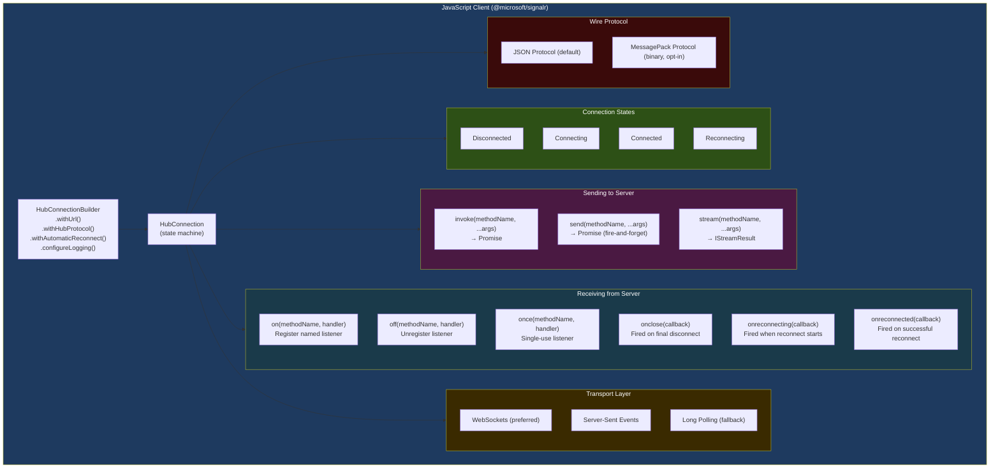
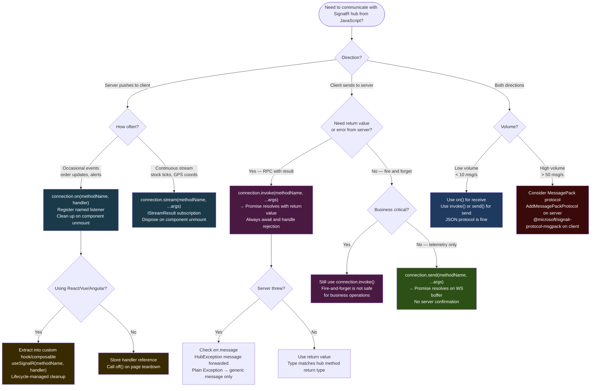

# 4.227 — SignalR JavaScript Client: hubConnection.on, invoke, and Lifecycle

---

## PART 0 — Navigation & Context

### Where This Topic Sits

```
ASP.NET Core Mastery
│
└── Q. SignalR & Real-Time (4.219–4.230)
    │
    ├── 4.219  SignalR Architecture: Hubs, Connections, Transport Negotiation
    ├── 4.220  SignalR Hubs: Hub<T>, Methods, Caller/Group/All Targeting
    ├── 4.221  SignalR Transports: WebSockets, SSE, Long Polling
    ├── 4.222  SignalR Scale-Out: Redis Backplane and Azure SignalR Service
    ├── 4.223  SignalR Authentication: JWT in WebSocket Connection Upgrade
    ├── 4.224  SignalR Groups: Membership and Targeted Message Delivery
    ├── 4.225  SignalR Streaming: IAsyncEnumerable<T> Hub to Client
    ├── 4.226  SignalR .NET Client: HubConnection and Reconnect Strategies
    ├──►4.227  SignalR JavaScript Client: hubConnection.on, invoke, Lifecycle  ◄── YOU ARE HERE
    ├── 4.228  SignalR with Minimal APIs: MapHub and Endpoint Authorization
    ├── 4.229  Server-Sent Events with IAsyncEnumerable<T>
    └── 4.230  Long Polling: Correct Implementation Without SignalR
```

### What You Need Before This

- **[[4.219 — SignalR Architecture]]** — the hub, connection, and transport model must be understood before the client API makes sense
- **[[4.220 — SignalR Hubs]]** — the server-side hub methods that the JavaScript client calls and receives messages from
- **[[4.221 — SignalR Transports]]** — the JavaScript client negotiates transport; understanding what it negotiates determines what you configure
- **[[4.223 — SignalR Authentication]]** — the `accessTokenFactory` option in `HubConnectionBuilder` is covered here; you need to understand why JWT cannot travel in the `Authorization` header over WebSockets

### What This Unlocks After

- **[[4.223 — SignalR Authentication]]** — after understanding the client lifecycle, the JWT token factory pattern becomes concrete
- **[[4.225 — SignalR Streaming]]** — streaming from hub to JS client uses `.stream()` instead of `.invoke()`; this topic is the prerequisite
- **[[4.222 — SignalR Scale-Out]]** — at scale, the JS client's reconnection behavior interacts with the load balancer's sticky sessions

### Why This Matters at Scale

The JavaScript client's reconnection strategy and `on`/`off` handler registration directly determine whether your browser clients silently drop messages during network blips or transient pod restarts — a failure mode that only surfaces in production under real mobile networks or rolling deployments, never in local development.

---

## PART 1 — The Core Mental Model

### The Fundamental Rule

> **The SignalR JavaScript `HubConnection` is a state machine that moves through Disconnected → Connecting → Connected → Reconnecting → Disconnected; `hubConnection.on()` registers named callbacks that the server can invoke at any time while the connection is Connected, and `hubConnection.invoke()` sends a method call to the server and returns a Promise that resolves with the hub method's return value. The practical consequence is that message loss is possible in any state other than Connected, and the client must re-establish subscriptions after reconnection if handlers are registered inside a `start()` callback.**

### The Plain-Language Analogy

Think of `HubConnection` as a telephone call to a dispatcher (the server hub). When the call connects, you tell the dispatcher which alerts you want to hear (`hubConnection.on("OrderShipped", handler)`) — this is like subscribing to a radio channel. When you need to ask the dispatcher something, you speak (`hubConnection.invoke("PlaceOrder", payload)`) and wait for their answer. If the call drops, the dispatcher doesn't know which channels you were listening to — when you call back, you have to re-subscribe. The critical difference from a real phone call: with `withAutomaticReconnect()`, the library tries to redial automatically, but during the reconnecting state, any server-to-client messages sent by the hub are silently lost — the dispatcher's radio broadcast goes to nobody. When you finally reconnect, you must tell the dispatcher to resend any missed state (a catch-up mechanism your application code must implement — SignalR does not buffer missed messages during reconnection).

### The Taxonomy Diagram



---

## PART 2 — Deep Mechanics

### 2.1 — HubConnectionBuilder: What Gets Wired Before `start()`

The `HubConnectionBuilder` is a fluent builder that compiles all configuration — transport preference, protocol, auth, logging, retry policy — into a sealed `HubConnection` object. Nothing connects at builder time; `start()` triggers the actual HTTP handshake.

```
Pipeline position: Client-side only — no HTTP traffic until .start() is called.
The first HTTP call on .start() is always a POST to {hubUrl}/negotiate (HTTP/1.1)
regardless of target transport.
```

```javascript
// @microsoft/signalr — package install:
// npm install @microsoft/signalr
// CDN: https://cdn.jsdelivr.net/npm/@microsoft/signalr/dist/browser/signalr.min.js

import * as signalR from "@microsoft/signalr";

// ── Full builder showing every meaningful option ──────────────────────────────
const connection = new signalR.HubConnectionBuilder()
    // Required: URL of the mapped hub on the server (MapHub<OrderHub>("/hubs/orders"))
    .withUrl("/hubs/orders", {
        // Transport override — default is .All (tries WS → SSE → LP in order)
        transport: signalR.HttpTransportType.WebSockets,

        // JWT factory: called every time a new connection attempt is made,
        // including automatic reconnect attempts. NOT called mid-connection.
        // This is the only way to send auth credentials over WebSockets —
        // the WS upgrade request cannot carry Authorization headers in browsers.
        accessTokenFactory: () => getAccessToken(), // () => string | Promise<string>

        // Custom headers — only sent on negotiate POST and SSE/LP requests.
        // NOT sent on WebSocket upgrade (browser limitation).
        headers: { "X-Tenant-Id": tenantId },

        // Skip negotiate to go straight to WebSockets — saves one round-trip.
        // Only safe if: server is guaranteed to support WS, CORS is not an issue,
        // and you do not need the connectionId from negotiate.
        skipNegotiation: true, // ⚠️ Requires transport: WebSockets explicitly
    })
    // JSON is default. MessagePack requires @microsoft/signalr-protocol-msgpack
    // and server-side .AddMessagePackProtocol()
    .withHubProtocol(new signalR.JsonHubProtocol())

    // Automatic reconnect with custom backoff intervals (ms)
    // Default (no args): [0, 2000, 10000, 30000] then stops
    .withAutomaticReconnect([0, 1000, 5000, 10000, 30000])

    // Client-side log level — useful in development
    .configureLogging(signalR.LogLevel.Information)
    .build();

// Cost: ~2 allocations (builder + connection object). Zero network traffic.
// Runtime cost label: O(1), no I/O.
```

**Framework source behavior (approximate):** `HubConnectionBuilder.build()` calls `new HubConnection(url, options)` which creates an internal `HttpConnection` wrapping the transport negotiation logic and a `HubConnectionState` machine. The `HubProtocol` is stored for message framing/parsing. No sockets are opened.

```
// HTTP wire format on .start() — negotiate POST (always first):
// POST /hubs/orders/negotiate?negotiateVersion=1 HTTP/1.1
// Host: api.example.com
// Content-Type: text/plain;charset=UTF-8
// Authorization: Bearer eyJhbGci...   ← only if NOT WebSockets (browser limitation)
//
// Response:
// HTTP/1.1 200 OK
// Content-Type: application/json
// { "negotiateVersion": 1, "connectionToken": "abc123", "availableTransports": [...] }
//
// Then WebSocket upgrade:
// GET /hubs/orders?id=abc123&access_token=eyJhbGci... HTTP/1.1
// Upgrade: websocket
// Connection: Upgrade
// ← Note: access_token in query string, NOT in header
```

> [!WARNING] The `access_token` query string parameter is how JWT reaches the server over WebSockets. The server-side `AddJwtBearer` configuration must be modified to read from `context.Request.Query["access_token"]` for hub routes. This is a deliberate design, not a bug — browsers cannot set `Authorization` headers on WebSocket upgrade requests.

**Edge case that bites teams:** Using `skipNegotiation: true` without explicitly setting `transport: signalR.HttpTransportType.WebSockets` throws an error at runtime, not at build time. Teams discover this in production when a proxy strips `Upgrade` headers and the library silently falls back to SSE — then wonders why skipNegotiation is preventing the fallback.

---

### 2.2 — Connection Lifecycle: The State Machine

```
State Machine:

  ┌────────────────────────────────────────────────────────────────────────────┐
  │                     HubConnection State Machine                            │
  │                                                                            │
  │   .start()           negotiate+connect          .stop() or error          │
  │  ──────────►  Connecting  ──────────────►  Connected  ──────────────►     │
  │  Disconnected                                    │             Disconnected│
  │      ▲                                     network           (final)      │
  │      │                                      error                         │
  │      │                               ┌─────────▼─────────┐               │
  │      │         retry exhausted       │   Reconnecting     │               │
  │      └───────────────────────────────│  (backoff timers)  │               │
  │                                      │  onreconnecting()  │               │
  │                                      └────────┬──────────┘               │
  │                                        reconnect       reconnect          │
  │                                        success         success            │
  │                                               │                           │
  │                                     Connected (new connectionId)          │
  │                                     onreconnected(newConnectionId)        │
  └────────────────────────────────────────────────────────────────────────────┘
```

**The three lifecycle callbacks:**

```javascript
// Pipeline position: These fire at the HubConnection layer, before any
// hub method handlers are invoked. They are application-level lifecycle hooks.

connection.onreconnecting((error) => {
    // State is now HubConnectionState.Reconnecting
    // UI: show "Connection lost, reconnecting..." banner
    // IMPORTANT: Any messages the server sends during this window are LOST.
    // The hub has no concept of buffering for reconnecting clients.
    console.warn("Connection lost. Reconnecting...", error);
    setConnectionStatus("reconnecting");
});

connection.onreconnected((newConnectionId) => {
    // State is now HubConnectionState.Connected
    // newConnectionId is DIFFERENT from the original — the server sees this
    // as a brand new connection. Any server-side groups the client was in
    // must be re-joined. Any in-flight invoke() calls are permanently lost.
    console.info("Reconnected with new connection ID:", newConnectionId);
    setConnectionStatus("connected");
    // Application responsibility: re-subscribe to groups, re-fetch missed state
    rejoinOrderTrackingGroup(newConnectionId);
});

connection.onclose((error) => {
    // Fires only when reconnection is PERMANENTLY exhausted (all retries failed)
    // or when .stop() is called explicitly.
    // State is Disconnected. Application must decide: show error UI, retry manually.
    console.error("Connection permanently closed:", error);
    setConnectionStatus("disconnected");
    showReconnectButton(); // Manual re-trigger
});

// Cost: Each callback registration is O(1). Callbacks fire synchronously
// on the transport's event loop — keep them fast or dispatch to async.
```

> [!IMPORTANT] The `connectionId` returned in `onreconnected` is **not** the same as the original connection ID. Any server-side state keyed on `Context.ConnectionId` (e.g., group memberships added via `Groups.AddToGroupAsync`) is gone. Your application must restore that state. The client has no way to know what messages were missed — implement a catch-up mechanism (e.g., "fetch all orders since timestamp X" on reconnect).

**Edge case — accessing state mid-reconnect:**

```javascript
// ⚠️ WRONG — checking connection.state synchronously after an error
async function sendOrderUpdate(order) {
    await connection.invoke("UpdateOrder", order); // throws if Reconnecting
}

// ✅ CORRECT — guard with state check and wait pattern
async function sendOrderUpdate(order) {
    if (connection.state !== signalR.HubConnectionState.Connected) {
        console.warn("Cannot send — connection not ready. Queuing update.");
        pendingUpdates.push(order);
        return;
    }
    await connection.invoke("UpdateOrder", order);
}
```

---

### 2.3 — `hubConnection.on()`: Handler Registration and the Message Dispatch Loop

`on()` registers a named callback that the SignalR JavaScript runtime invokes when the server calls a client-side method by that name. The name matching is **case-insensitive** in the default JSON protocol.

```
Pipeline position (message receive path):
  WebSocket frame arrives
    → Transport layer decodes frame bytes
    → JsonHubProtocol.parseMessages() extracts HubMessage[]
    → HubConnection._dispatchIncoming(message)
    → Looks up registered handlers by method name (case-insensitive map)
    → Calls each matching handler with parsed arguments
    → Returns Promise (handlers can be async)
```

```javascript
// ── Registering handlers ─────────────────────────────────────────────────────

// Basic handler — called whenever server invokes "OrderStatusChanged"
// Server-side: await Clients.User(userId).SendAsync("OrderStatusChanged", update);
connection.on("OrderStatusChanged", (update) => {
    // update is deserialized from JSON — matches the C# type sent by the server
    // { orderId: "ord-123", status: "Shipped", timestamp: "2026-06-11T..." }
    renderOrderStatusBadge(update.orderId, update.status);
});

// Handler with multiple arguments
// Server-side: Clients.All.SendAsync("PriceUpdated", productId, newPrice, currency)
connection.on("PriceUpdated", (productId, newPrice, currency) => {
    updateProductCard(productId, { price: newPrice, currency });
});

// Async handler — supported natively, but errors inside are swallowed silently
// unless you catch them yourself
connection.on("LargePayloadReceived", async (payload) => {
    try {
        await processLargePayload(payload); // async work is fine
    } catch (err) {
        // SignalR will NOT propagate this error to the server or the connection.
        // Handle it here or it disappears.
        logger.error("Failed to process payload", err);
    }
});

// ── Removing handlers ────────────────────────────────────────────────────────

// IMPORTANT: to remove a specific handler, you must pass the SAME function reference.
// Passing a new arrow function to off() removes nothing.
const handleOrderUpdate = (update) => { renderOrderStatusBadge(update.orderId, update.status); };

connection.on("OrderStatusChanged", handleOrderUpdate);
// ... later, on component unmount:
connection.off("OrderStatusChanged", handleOrderUpdate); // ✅ removes only this handler

connection.off("OrderStatusChanged"); // Removes ALL handlers for "OrderStatusChanged"

// Cost: .on() is O(1) — adds to an internal Map<string, handler[]>.
// Dispatch is O(n) where n is the number of registered handlers for that method name.
// In practice n=1 for most production apps. No allocations beyond the handler list.
```

**Failure Mode Diagram — server calls a method with no handler registered:**

```
Server: await Clients.User(userId).SendAsync("OrderStatusChanged", update)
  │
  ▼
Client WebSocket receives the frame
  │
  ▼
_dispatchIncoming: looks up "orderstatuschanged" in handler map
  │
  ▼
No handlers found → message is silently DROPPED
  │
  ▼
No error, no warning, no 4xx/5xx response — the server's SendAsync has already returned
```

> [!WARNING] There is no server-side error when the client has no handler registered for a method. `SendAsync` on the server returns successfully as soon as the message is serialized and dispatched to the transport. If your client is not listening, the message is gone. This is a common source of "why isn't my UI updating?" bugs.

---

### 2.4 — `invoke()` vs `send()`: RPC vs Fire-and-Forget

These two are the primary ways to call server hub methods. The distinction is critical for reliability and backpressure.

```
invoke() flow:
  Client                         Server Hub
    │──── invoke("PlaceOrder") ──────►│
    │                                  │ PlaceOrder() executes
    │◄─── completion message ──────────│ (return value or exception)
    │  Promise resolves or rejects      │

send() flow:
  Client                         Server Hub
    │──── send("LogEvent") ──────────►│
    │  Promise resolves immediately     │ LogEvent() executes (eventually)
    │  (message was queued in WS buf)   │ (no feedback to client)
```

```javascript
// ── invoke() — awaitable RPC with return value and server error propagation ──

// Server-side hub method:
// public async Task<OrderConfirmation> PlaceOrder(PlaceOrderRequest request)
// {
//     var result = await _orderService.PlaceOrderAsync(request);
//     return result; // serialized back as JSON
// }

async function submitOrder(orderRequest) {
    try {
        // invoke() sends the message AND waits for the hub method to complete.
        // The Promise rejects if the hub method throws a HubException.
        const confirmation = await connection.invoke("PlaceOrder", orderRequest);

        // confirmation is the deserialized return value
        showOrderConfirmation(confirmation.orderId, confirmation.estimatedDelivery);
    } catch (err) {
        // err.message contains the HubException message from the server
        // (NOT the full stack trace — that is stripped for security)
        // Server: throw new HubException("Insufficient inventory for SKU-9001");
        showOrderError(err.message);
    }
}

// HTTP wire (WebSocket frame, JSON protocol):
// → {"type":1,"invocationId":"1","target":"PlaceOrder","arguments":[{...order...}]}
// ← {"type":3,"invocationId":"1","result":{...confirmation...}}
// ← (on error) {"type":3,"invocationId":"1","error":"Insufficient inventory for SKU-9001"}


// ── send() — fire-and-forget, Promise resolves when the message hits the WS buffer ──

// Use for events where you don't need confirmation and don't want to block:
// analytics, telemetry, non-critical UI state broadcasts

async function reportUserActivity(activityEvent) {
    // Promise resolves as soon as SignalR hands the serialized message to the
    // underlying WebSocket send buffer — NOT when the server has processed it.
    // If the server throws, you will never know.
    await connection.send("ReportActivity", activityEvent);
}

// HTTP wire (WebSocket frame, JSON protocol):
// → {"type":1,"target":"ReportActivity","arguments":[{...event...}]}
//   ← no response frame — the server processes and discards

// Cost: invoke() → ~1 Promise allocation + 1 invocation tracking entry (removed on completion).
//       send() → ~1 Promise allocation. No tracking entry.
```

> [!NOTE] `invoke()` generates an `invocationId` (a string counter: "1", "2", "3"...) that pairs the client request with the server completion message. The JavaScript client tracks all outstanding `invoke()` calls in an internal map. If the connection drops mid-invoke, the tracked Promise is rejected with a "Connection closed" error. Any server-side work that already started continues — your server hub method must be idempotent or use compensating transactions if partial execution is a concern.

---

### 2.5 — Starting, Stopping, and Manual Reconnect Patterns

```javascript
// ── Starting the connection ──────────────────────────────────────────────────
// Pipeline position: .start() triggers negotiate POST, then WS upgrade.
// All .on() handlers registered before .start() are active immediately on connect.
// .on() handlers registered after .start() are also active — there is no "must
// register before connect" requirement, but registering before start() is cleaner.

async function startOrderTrackingConnection() {
    try {
        await connection.start();
        // State is now Connected. Safe to invoke hub methods.
        console.log("SignalR connected. Connection ID:", connection.connectionId);
        updateConnectionIndicator("green");
    } catch (err) {
        // start() throws if the initial connection fails (not network drops mid-flight —
        // those are handled by onreconnecting/onclose).
        // This catches: wrong URL, CORS failure, server not running, 401/403 from negotiate.
        console.error("Failed to start SignalR connection:", err);
        updateConnectionIndicator("red");
        // Production pattern: retry with exponential backoff
        setTimeout(() => startOrderTrackingConnection(), 5000);
    }
}

// ── Stopping explicitly ──────────────────────────────────────────────────────
// Call on component unmount or when the user navigates away.
// .stop() triggers onclose() with no error argument.

async function disconnectOrderTracking() {
    await connection.stop();
    // Any registered .on() handlers remain registered — they just won't fire.
    // Reusing the same connection object: call .start() again.
    // The connection object is reusable.
}

// ── Manual reconnect pattern (when withAutomaticReconnect is not enough) ─────
// Scenario: You need custom logic — e.g., only reconnect if the user tab is visible,
// or implement exponential backoff beyond the default retry intervals.

let retryCount = 0;
const MAX_RETRIES = 10;

connection.onclose(async (error) => {
    if (retryCount < MAX_RETRIES) {
        const delay = Math.min(1000 * Math.pow(2, retryCount), 30000); // exponential cap at 30s
        retryCount++;
        console.log(`Reconnect attempt ${retryCount} in ${delay}ms`);
        await new Promise(resolve => setTimeout(resolve, delay));
        await startOrderTrackingConnection();
    } else {
        showPermanentDisconnectBanner();
    }
});

// Cost: .start() → 1 HTTP POST (negotiate) + 1 HTTP GET (WS upgrade).
//       Approximately 2 round trips before the first message can flow.
//       .stop() → sends WebSocket close frame, tears down internal state.
```

---

### 2.6 — Handler Registration Anti-Patterns in SPA Frameworks

This is the most common production bug with the SignalR JavaScript client in React/Vue/Angular applications: registering handlers inside component lifecycle methods without cleaning up.

```
Pipeline position: entirely client-side, but the consequence is duplicate server messages
rendered in the UI — which looks like a server bug but is a client registration bug.
```

```javascript
// ⚠️ WRONG — React component registering handler without cleanup
// Every time the component re-renders or remounts, a NEW handler is added.
// After 5 remounts: 5 handlers fire for every "OrderStatusChanged" message.
// The user sees 5 toast notifications per order update.

function OrderTracker({ orderId }) {
    useEffect(() => {
        connection.on("OrderStatusChanged", (update) => {
            if (update.orderId === orderId) {
                setStatus(update.status);
            }
        });
    }, []); // Missing cleanup

    return <div>{status}</div>;
}

// ✅ CORRECT — React component with cleanup via off() and stable function reference

function OrderTracker({ orderId }) {
    useEffect(() => {
        // Store the handler reference to pass to off() later
        const handleStatusChange = (update) => {
            if (update.orderId === orderId) {
                setStatus(update.status);
            }
        };

        connection.on("OrderStatusChanged", handleStatusChange);

        // Cleanup: remove THIS handler on unmount or when orderId changes
        return () => {
            connection.off("OrderStatusChanged", handleStatusChange);
        };
    }, [orderId]); // Re-register if orderId changes

    return <div>{status}</div>;
}
```

---

## PART 3 — Production Code Patterns

### Pattern 1: The Connection Singleton with Lazy Start (E-Commerce Order Tracking)

In SPAs, the `HubConnection` should be a module-level singleton, not created inside components. Components share the single connection; multiple components registering handlers is fine and expected.

```javascript
// orderTrackingConnection.js — module singleton pattern
// Domain: E-commerce order management service

import * as signalR from "@microsoft/signalr";
import { getAuthToken } from "./auth";

// Build once at module load — zero network traffic
const _connection = new signalR.HubConnectionBuilder()
    .withUrl("/hubs/orders", {
        accessTokenFactory: () => getAuthToken(), // refreshes token on reconnect too
        transport: signalR.HttpTransportType.WebSockets,
    })
    .withAutomaticReconnect([0, 2000, 5000, 10000, 30000])
    .configureLogging(
        process.env.NODE_ENV === "development"
            ? signalR.LogLevel.Debug
            : signalR.LogLevel.Warning
    )
    .build();

let _startPromise = null;

// Lazy start — first caller starts it, subsequent callers share the same Promise.
// Safe to call from multiple components simultaneously.
export function ensureConnected() {
    if (_startPromise) return _startPromise;

    _startPromise = (async () => {
        try {
            await _connection.start();
            console.info("[OrderHub] Connected:", _connection.connectionId);
        } catch (err) {
            // Reset so the next call retries
            _startPromise = null;
            throw err;
        }
    })();

    return _startPromise;
}

export function onOrderStatusChanged(handler) {
    _connection.on("OrderStatusChanged", handler);
    return () => _connection.off("OrderStatusChanged", handler); // returns cleanup fn
}

export function onPaymentConfirmed(handler) {
    _connection.on("PaymentConfirmed", handler);
    return () => _connection.off("PaymentConfirmed", handler);
}

// Re-joining groups after reconnect — server groups are lost on reconnect
_connection.onreconnected(async () => {
    const activeOrderId = sessionStorage.getItem("trackingOrderId");
    if (activeOrderId) {
        // Server hub must expose a method to opt back into notifications
        await _connection.invoke("JoinOrderTrackingGroup", activeOrderId);
    }
});

export { _connection as connection };

// HTTP wire effect:
// POST /hubs/orders/negotiate?negotiateVersion=1
// GET  /hubs/orders?id=<token>&access_token=<jwt>  (WebSocket upgrade)
```

---

### Pattern 2: The Typed Message Contract (Payment Processing Service)

Avoid ad-hoc access to raw message properties. Define TypeScript interfaces (or JSDoc typedefs) for all hub messages. This prevents silent breakage when the server-side C# model changes.

```javascript
// paymentHub.types.js — shared message contracts
// Domain: Fintech payment processing API

/**
 * @typedef {Object} PaymentStatusUpdate
 * @property {string} paymentId
 * @property {'pending'|'authorized'|'captured'|'failed'|'refunded'} status
 * @property {string} [failureReason]
 * @property {string} timestamp - ISO 8601
 */

/**
 * @typedef {Object} FraudAlertPayload
 * @property {string} paymentId
 * @property {'low'|'medium'|'high'} riskScore
 * @property {string[]} triggeredRules
 */

// paymentHubClient.js
import * as signalR from "@microsoft/signalr";
import { getAuthToken } from "./auth";

const connection = new signalR.HubConnectionBuilder()
    .withUrl("/hubs/payments", {
        accessTokenFactory: getAuthToken,
        // Payment processing: do NOT fall back to SSE/LP — if WS fails,
        // the operator needs to know, not silently degrade to a less reliable transport
        transport: signalR.HttpTransportType.WebSockets,
    })
    .withAutomaticReconnect([0, 1000, 3000, 10000])
    .build();

/**
 * @param {string} paymentId
 * @param {(update: PaymentStatusUpdate) => void} handler
 * @returns {() => void} cleanup function
 */
export function subscribeToPaymentStatus(paymentId, handler) {
    // ✅ CORRECT: filter by paymentId client-side for single-user context.
    // For multi-operator dashboards, use server-side groups instead.
    const filteredHandler = (/** @type {PaymentStatusUpdate} */ update) => {
        if (update.paymentId === paymentId) {
            handler(update);
        }
    };

    connection.on("PaymentStatusUpdated", filteredHandler);
    return () => connection.off("PaymentStatusUpdated", filteredHandler);
}

/**
 * Initiate a refund — invoke with typed payload and typed return
 * @param {string} paymentId
 * @param {number} amount
 * @returns {Promise<{refundId: string, status: string}>}
 */
export async function initiateRefund(paymentId, amount) {
    // invoke() returns the hub method's return value deserialized from JSON
    const result = await connection.invoke("InitiateRefund", { paymentId, amount });
    return result;
}

// HTTP wire effect (invoke):
// WS frame → {"type":1,"invocationId":"3","target":"InitiateRefund",
//              "arguments":[{"paymentId":"pay_abc","amount":49.99}]}
// WS frame ← {"type":3,"invocationId":"3","result":{"refundId":"ref_xyz","status":"pending"}}
```

---

### Pattern 3: The Reconnect-State Recovery Guard (Logistics Shipment Tracker)

When the connection reconnects, in-flight `invoke()` calls are dropped. This pattern shows how to flush a queue of pending operations after reconnection.

```javascript
// shipmentHub.js — reconnection with pending operation replay
// Domain: Logistics shipment tracking service

import * as signalR from "@microsoft/signalr";

const connection = new signalR.HubConnectionBuilder()
    .withUrl("/hubs/shipments", {
        accessTokenFactory: () => localStorage.getItem("access_token"),
    })
    .withAutomaticReconnect()
    .build();

// Queue operations that fail during disconnected/reconnecting states
const pendingLocationUpdates = [];

connection.onreconnected(async (newConnectionId) => {
    console.info("[ShipmentHub] Reconnected:", newConnectionId);

    // 1. Re-join the shipment tracking group (server groups are cleared on disconnect)
    const shipmentId = getCurrentTrackingShipmentId();
    if (shipmentId) {
        await connection.invoke("SubscribeToShipment", shipmentId);
    }

    // 2. Flush pending location updates that queued during reconnecting state
    const updates = [...pendingLocationUpdates];
    pendingLocationUpdates.length = 0;
    for (const update of updates) {
        try {
            await connection.invoke("UpdateDriverLocation", update);
        } catch (err) {
            console.error("[ShipmentHub] Failed to flush pending update:", err);
        }
    }

    // 3. Request a state catch-up — fetch any shipment events missed during disconnect
    const lastKnownEventId = getLastKnownShipmentEventId();
    const missedEvents = await connection.invoke(
        "GetMissedEventsSince",
        shipmentId,
        lastKnownEventId
    );
    applyMissedEvents(missedEvents);
});

export async function reportDriverLocation(location) {
    if (connection.state !== signalR.HubConnectionState.Connected) {
        // Queue for replay after reconnect rather than dropping silently
        pendingLocationUpdates.push(location);
        return;
    }
    // send() not invoke() — we don't need confirmation for telemetry
    await connection.send("UpdateDriverLocation", location);
}
```

---

### Pattern 4: The Hub Connection Health Monitor (User Authentication Flow)

Expose connection health to the UI and tie it to user session validity. The `accessTokenFactory` is called on every reconnect attempt, so token refresh integrates naturally.

```javascript
// authHubClient.js — connection health tied to auth token lifecycle
// Domain: User authentication and session management service

import * as signalR from "@microsoft/signalr";

let _tokenRefreshFn = null; // injected by the auth module

const connection = new signalR.HubConnectionBuilder()
    .withUrl("/hubs/session", {
        accessTokenFactory: async () => {
            // Called on each connect attempt — including reconnects.
            // This is where you call your token refresh logic.
            if (_tokenRefreshFn) {
                return await _tokenRefreshFn(); // may call /auth/refresh internally
            }
            return localStorage.getItem("access_token");
        },
    })
    .withAutomaticReconnect({
        // Custom IRetryPolicy — object with nextRetryDelayInMilliseconds(context)
        nextRetryDelayInMilliseconds(retryContext) {
            // Stop retrying if this was an auth failure (the server sent 401 on negotiate)
            // retryContext.retryReason is the error that caused the disconnect
            if (retryContext.retryReason?.message?.includes("401")) {
                // Returning null stops automatic reconnect
                return null;
            }
            // Exponential backoff capped at 30 seconds
            return Math.min(1000 * Math.pow(2, retryContext.previousRetryCount), 30000);
        },
    })
    .build();

// Expose connection state as a reactive atom (framework-agnostic pattern)
const _stateListeners = new Set();
let _currentState = signalR.HubConnectionState.Disconnected;

function emitState(newState) {
    _currentState = newState;
    _stateListeners.forEach(fn => fn(newState));
}

connection.onreconnecting(() => emitState(signalR.HubConnectionState.Reconnecting));
connection.onreconnected(() => emitState(signalR.HubConnectionState.Connected));
connection.onclose(() => emitState(signalR.HubConnectionState.Disconnected));

export function subscribeToConnectionState(listener) {
    _stateListeners.add(listener);
    listener(_currentState); // emit current state immediately
    return () => _stateListeners.delete(listener);
}

export function injectTokenRefresher(fn) {
    _tokenRefreshFn = fn;
}

// HTTP consequence on 401 from negotiate:
// POST /hubs/session/negotiate
// ← HTTP/1.1 401 Unauthorized
//    WWW-Authenticate: Bearer error="invalid_token"
//
// The connection.start() Promise rejects with a message containing "401".
// Custom retry policy's null return stops reconnect attempts.
// onclose() fires — application shows re-login prompt.
```

---

### Pattern 5: The Streaming Consumer with Backpressure (Inventory Webhook Receiver)

For high-volume server-to-client message streams, use `.stream()` instead of repeated `.on()` messages. Streaming preserves backpressure semantics.

```javascript
// inventoryStreamClient.js — consuming a hub stream
// Domain: Inventory management service — live stock level feed

import * as signalR from "@microsoft/signalr";

const connection = new signalR.HubConnectionBuilder()
    .withUrl("/hubs/inventory")
    .withAutomaticReconnect()
    .build();

// Server-side hub method:
// public async IAsyncEnumerable<StockLevelUpdate> StreamStockLevels(
//     string warehouseId,
//     CancellationToken cancellationToken)

let currentStream = null;

export function startInventoryStream(warehouseId, onUpdate, onError, onComplete) {
    if (currentStream) {
        // Cancel previous stream before starting a new one
        currentStream.dispose();
    }

    // .stream() returns an IStreamResult — subscribe via .subscribe()
    // Unlike invoke(), this does not return a Promise<T> — it is a push stream.
    currentStream = connection.stream("StreamStockLevels", warehouseId);

    currentStream.subscribe({
        next: (stockUpdate) => {
            // Each message from IAsyncEnumerable yields here
            onUpdate(stockUpdate);
        },
        error: (err) => {
            // Hub threw an exception or connection closed mid-stream
            onError(err);
            currentStream = null;
        },
        complete: () => {
            // IAsyncEnumerable exhausted — stream ended normally
            onComplete();
            currentStream = null;
        },
    });
}

export function stopInventoryStream() {
    if (currentStream) {
        // Sends a CancelInvocation message to the server — triggers CancellationToken
        currentStream.dispose();
        currentStream = null;
    }
}

// HTTP wire (streaming):
// WS frame → {"type":4,"invocationId":"1","target":"StreamStockLevels",
//              "arguments":["warehouse-A"]}
// WS frame ← {"type":2,"invocationId":"1","item":{...stockUpdate1...}}
// WS frame ← {"type":2,"invocationId":"1","item":{...stockUpdate2...}}
// ... (continuous stream)
// WS frame ← {"type":3,"invocationId":"1"}  (completion message)
// OR on cancel:
// WS frame → {"type":5,"invocationId":"1"}  (CancelInvocation)
```

---

### Pattern 6: The SPA Component Bridge with `useSignalR` Hook (React Integration)

A custom hook that ties SignalR handler lifecycle to React component lifecycle, preventing the double-registration bug from Part 2.6.

```javascript
// useSignalR.js — React hook for clean SignalR handler lifecycle
// Domain: General-purpose React integration pattern

import { useEffect, useRef } from "react";
import { ensureConnected, connection } from "./orderTrackingConnection";

/**
 * Hook that registers a SignalR handler for the component's lifetime.
 * Automatically cleans up on unmount. Safely handles re-renders.
 *
 * @param {string} methodName - Hub method name (case-insensitive)
 * @param {Function} handler - Callback — should be stable (useCallback) to avoid re-registration
 */
export function useSignalR(methodName, handler) {
    // useRef holds the current handler without causing re-runs of useEffect
    const handlerRef = useRef(handler);
    handlerRef.current = handler;

    useEffect(() => {
        // Ensure connection is started (idempotent)
        ensureConnected().catch(err => {
            console.error("[useSignalR] Connection failed:", err);
        });

        // Stable wrapper: the SignalR .on() registration uses the ref wrapper,
        // not the inline handler. This means useEffect only runs once (on mount),
        // but handlerRef.current always calls the latest handler closure.
        const stableHandler = (...args) => handlerRef.current(...args);

        connection.on(methodName, stableHandler);

        return () => {
            connection.off(methodName, stableHandler);
        };
    }, [methodName]); // Only re-register if the method name itself changes
}

// Usage in a React component:
function OrderStatusWidget({ orderId }) {
    const [status, setStatus] = React.useState(null);

    // useCallback ensures the handler identity is stable — but useSignalR
    // handles this anyway via the ref trick above
    const handleUpdate = React.useCallback((update) => {
        if (update.orderId === orderId) {
            setStatus(update.status);
        }
    }, [orderId]);

    useSignalR("OrderStatusChanged", handleUpdate);

    return <div className="order-status">{status ?? "Loading..."}</div>;
}
```

---

### Pattern 7: The Error-Resilient Invoke with Retry (Healthcare Patient Portal)

`invoke()` can throw on connection errors or server hub exceptions. This pattern wraps invoke with retry logic that distinguishes transient (connection) errors from permanent (business logic) errors.

```javascript
// patientPortalHub.js — resilient invoke with error classification
// Domain: Healthcare patient portal — appointment management

import * as signalR from "@microsoft/signalr";

const connection = new signalR.HubConnectionBuilder()
    .withUrl("/hubs/portal", {
        accessTokenFactory: () => getPatientAuthToken(),
    })
    .withAutomaticReconnect()
    .build();

const TRANSIENT_ERROR_PATTERNS = [
    "Connection closed",
    "Server timeout",
    "WebSocket closed",
];

function isTransientError(err) {
    return TRANSIENT_ERROR_PATTERNS.some(pattern =>
        err.message?.includes(pattern)
    );
}

/**
 * Invokes a hub method with automatic retry on transient errors.
 * Permanent errors (HubException from business logic) are thrown immediately.
 */
async function resilientInvoke(methodName, ...args) {
    const MAX_ATTEMPTS = 3;
    let attempt = 0;

    while (attempt < MAX_ATTEMPTS) {
        try {
            // Wait for connection if currently reconnecting
            if (connection.state === signalR.HubConnectionState.Reconnecting) {
                await waitForConnectionState(signalR.HubConnectionState.Connected, 10000);
            }

            return await connection.invoke(methodName, ...args);
        } catch (err) {
            attempt++;
            if (!isTransientError(err) || attempt >= MAX_ATTEMPTS) {
                // Business error from hub (e.g., "Appointment slot already booked")
                // or max retries exceeded — propagate to caller
                throw err;
            }
            const delay = 500 * attempt;
            console.warn(`[PatientPortal] Transient error on ${methodName}, retry ${attempt} in ${delay}ms`);
            await new Promise(resolve => setTimeout(resolve, delay));
        }
    }
}

function waitForConnectionState(targetState, timeoutMs) {
    return new Promise((resolve, reject) => {
        if (connection.state === targetState) { resolve(); return; }
        const timeout = setTimeout(() => reject(new Error("Connection state timeout")), timeoutMs);
        const cleanup = connection.onreconnected(() => {
            clearTimeout(timeout);
            resolve();
        });
    });
}

export async function bookAppointment(appointmentRequest) {
    // ⚠️ WRONG: await connection.invoke("BookAppointment", appointmentRequest);
    //   → No retry on network blip; fails permanently if WS drops mid-request

    // ✅ CORRECT: use resilient invoke
    const confirmation = await resilientInvoke("BookAppointment", appointmentRequest);
    return confirmation;
}
```

---

## PART 4 — Gotchas & Anti-Patterns

### Gotcha 1: The Ghost Handler (Multiple `on()` Without Matching `off()`)

Engineers familiar with EventEmitter patterns assume calling `on()` again with a different handler replaces the previous one. SignalR's `on()` accumulates handlers — every call adds to the list.

```javascript
// ⚠️ WRONG — re-subscribing on every page navigation or component re-render
// After three navigations to the orders page: 3 handlers fire per message.
function initOrderPage() {
    connection.on("OrderStatusChanged", (update) => {
        renderOrderUpdate(update); // called 3 times, renders 3 duplicate UI updates
    });
}

// HTTP consequence (wrong path):
// Server sends "OrderStatusChanged" once
// Client fires 3 handlers → 3 UI renders, 3 toast notifications, possible state corruption

// ✅ CORRECT — use a module-level handler reference with explicit cleanup
const _orderStatusHandler = (update) => renderOrderUpdate(update);

function initOrderPage() {
    // Remove first to ensure idempotency, even if not previously registered
    connection.off("OrderStatusChanged", _orderStatusHandler);
    connection.on("OrderStatusChanged", _orderStatusHandler);
}

function cleanupOrderPage() {
    connection.off("OrderStatusChanged", _orderStatusHandler);
}

// HTTP consequence (correct path):
// Server sends "OrderStatusChanged" once
// Client fires exactly 1 handler → 1 UI update

// WHY: connection.on() appends to an internal array of handlers per method name.
// There is no "replace" semantics. off() with a function reference removes only
// the matching entry. off() without a function reference removes all entries for
// that method name.
```

---

### Gotcha 2: `skipNegotiation: true` Without `transport: WebSockets` Crashes Silently

Engineers add `skipNegotiation` for performance (saves one round-trip) but omit the mandatory `transport` option, causing an SDK-level error that surfaces only when someone's proxy doesn't support WebSockets.

```javascript
// ⚠️ WRONG — skipNegotiation without explicit transport
// The SignalR client throws: "Cannot use 'skipNegotiation' without specifying a transport"
// In some SDK versions this is a runtime error, not a type error — only caught on connect.
const connection = new signalR.HubConnectionBuilder()
    .withUrl("/hubs/orders", {
        skipNegotiation: true,
        // transport NOT specified
    })
    .build();

// HTTP consequence (wrong path):
// Error thrown: "Transports: [...] failed. No transports succeeded."
// OR: "Cannot use 'skipNegotiation' without specifying a transport type"
// onclose() fires with this error. Users see a permanently broken connection.

// ✅ CORRECT — skipNegotiation requires explicit transport
const connection = new signalR.HubConnectionBuilder()
    .withUrl("/hubs/orders", {
        skipNegotiation: true,
        transport: signalR.HttpTransportType.WebSockets, // REQUIRED
    })
    .build();

// HTTP consequence (correct path):
// No negotiate POST — direct WebSocket upgrade:
// GET /hubs/orders HTTP/1.1
// Upgrade: websocket
// (no connectionId from negotiate — connection.connectionId is generated client-side)

// WHY: skipNegotiation tells the client to skip the HTTP negotiate step entirely.
// Without it, the server's negotiate response tells the client which transports are
// available. If you skip negotiate, the client has no fallback information —
// it must commit to one transport upfront. WebSockets is the only transport
// that works without negotiate.
```

---

### Gotcha 3: `invoke()` After Connection Drop — Unhandled Promise Rejection

`invoke()` returns a Promise. If the connection drops between calling `invoke()` and the server responding, the Promise rejects with "Connection closed." Engineers who don't await properly get an unhandled rejection that silently aborts the operation.

```javascript
// ⚠️ WRONG — not awaiting invoke(), not handling rejection
function handleCheckoutClick() {
    // This fires and the Promise rejection is unhandled.
    // If the WS drops at this exact moment: silent data loss, no user feedback.
    connection.invoke("SubmitCheckout", cartData);
    showSuccessToast("Order submitted!"); // Always shows, even on failure
}

// HTTP consequence (wrong path):
// invoke() rejects with: Error: "Connection closed with an error"
// UnhandledPromiseRejection in browser console
// User sees success toast but no order was placed

// ✅ CORRECT — always await invoke() and handle the rejection
async function handleCheckoutClick() {
    try {
        const confirmation = await connection.invoke("SubmitCheckout", cartData);
        showSuccessToast(`Order ${confirmation.orderId} confirmed!`);
    } catch (err) {
        // Could be: connection drop, hub exception, timeout
        showErrorToast(`Failed to submit order: ${err.message}. Please try again.`);
        logClientError("checkout_invoke_failed", err);
    }
}

// HTTP consequence (correct path):
// On connection drop: catch block fires, error toast shown, no data loss
// On hub exception: catch block fires, server's error message displayed
// On success: confirmation shown

// WHY: invoke() does NOT resolve until the server's hub method completes and
// sends a completion message. If the connection drops, the client has no way
// to know if the server received and processed the message. Always treat a
// rejected invoke() as "unknown state" — the server may or may not have executed
// the hub method.
```

---

### Gotcha 4: `accessTokenFactory` Return Value — Cached Token vs Fresh Token

Engineers write `accessTokenFactory: () => storedToken` using a value captured at connection build time. The factory is called once on initial connect and again on each reconnect attempt. If the JWT has expired by the time a reconnect fires, the factory returns a stale token and the negotiate POST returns 401.

```javascript
// ⚠️ WRONG — captures token value at builder construction time
const storedToken = localStorage.getItem("access_token"); // captured once

const connection = new signalR.HubConnectionBuilder()
    .withUrl("/hubs/orders", {
        accessTokenFactory: () => storedToken, // returns the SAME string every time
        // If the token expires during a reconnect: storedToken is still the old value
    })
    .build();

// HTTP consequence (wrong path):
// Initial connect: 200 OK (token was fresh)
// Reconnect after 60 minutes: POST /negotiate returns 401 Unauthorized
// connection.onclose() fires with "Unauthorized" error
// User is silently logged out with no explanation

// ✅ CORRECT — factory reads fresh token on every call
const connection = new signalR.HubConnectionBuilder()
    .withUrl("/hubs/orders", {
        // Arrow function that reads from storage on every invocation
        // If your auth module refreshes tokens proactively, this picks up the fresh one.
        accessTokenFactory: async () => {
            // Optionally: call token refresh here
            const token = await authModule.getValidToken(); // refreshes if needed
            return token;
        },
    })
    .build();

// HTTP consequence (correct path):
// Reconnect after 60 minutes: factory is called, fresh token retrieved,
// POST /negotiate returns 200 OK, WebSocket upgrade succeeds.

// WHY: accessTokenFactory is a factory — a function called at connect/reconnect time.
// It must return the current valid token, not a copy of the token from when the
// builder was constructed. The function is async-compatible: it can return a Promise<string>.
```

---

### Gotcha 5: `withAutomaticReconnect()` Does Not Retry the Initial `start()`

Engineers see `withAutomaticReconnect()` and assume it handles all connection failures, including the initial connect. It does not. It only applies after a successful connection drops. If `start()` fails (wrong URL, 401, server not running), the Promise rejects and no retry happens.

```javascript
// ⚠️ WRONG — relying on withAutomaticReconnect for initial connect
const connection = new signalR.HubConnectionBuilder()
    .withUrl("/hubs/orders")
    .withAutomaticReconnect([0, 2000, 5000, 30000]) // does NOT apply to start()
    .build();

async function init() {
    await connection.start(); // If this fails: throws, app breaks, no retry
}
init();

// HTTP consequence (wrong path):
// Server temporarily unavailable at startup:
// POST /hubs/orders/negotiate → connection refused
// start() Promise rejects immediately — NO automatic retry
// App shows error state permanently until page refresh

// ✅ CORRECT — wrap start() in your own retry loop
async function startWithRetry(maxRetries = 5) {
    for (let i = 0; i <= maxRetries; i++) {
        try {
            await connection.start();
            return; // success
        } catch (err) {
            if (i === maxRetries) throw err; // exhausted retries
            const delay = Math.min(1000 * Math.pow(2, i), 30000);
            console.warn(`[SignalR] start() failed, retry ${i + 1} in ${delay}ms:`, err.message);
            await new Promise(resolve => setTimeout(resolve, delay));
        }
    }
}

// HTTP consequence (correct path):
// Server temporarily unavailable: retry loop waits and retries
// Server comes up: POST /negotiate succeeds, connection established
// App shows connected state

// WHY: withAutomaticReconnect configures the reconnect behavior for connections that
// were once established and then dropped. The initial start() is a separate concern.
// This is documented in the SignalR JS client but frequently missed because the
// same "reconnect" mental model is incorrectly applied to initial connect.
```

---

## PART 5 — Performance Implications

### 5.1 — Request Pipeline Characteristics Table

|Scenario|Network Ops|Client Allocations|Approx Latency|Recommendation|
|---|---|---|---|---|
|`HubConnectionBuilder.build()`|0|~2 objects|0ms|Build once at module level|
|`connection.start()` with negotiate|2 (negotiate POST + WS upgrade)|~10 objects|20–100ms|Cache in module singleton|
|`connection.start()` with `skipNegotiation`|1 (WS upgrade only)|~8 objects|10–60ms|Use if server is known to support WS|
|`connection.on(name, handler)`|0|1 entry in handler map|<0.1ms|Register before start() for clarity|
|`connection.invoke()` with return value|1 WS round-trip|~3 (Promise + invocation tracker)|RTT + hub exec time|Await and handle rejection always|
|`connection.send()` fire-and-forget|1 WS send (no reply)|~1 (Promise only)|~0 (queued in WS buf)|Use for telemetry; not for business ops|
|`connection.stream()` — server streaming|1 WS frame to start|~4 (IStreamResult + subscriber)|Continuous, per-item|Dispose when component unmounts|
|Automatic reconnect attempt (each try)|2 (negotiate + WS)|~8 per attempt|backoff delay + RTT|Configure backoff intervals explicitly|
|Handler dispatch per incoming message|0|~0 (calls existing closures)|<0.1ms|Keep handlers fast; dispatch async if heavy|
|`MessagePack` protocol (opt-in)|Same as JSON|Same as JSON|~20–40% less bandwidth|Use for high-frequency numeric data|

### 5.2 — Benchmarking Approach

The SignalR JavaScript client runs in the browser — traditional BenchmarkDotNet does not apply. Use browser performance tooling instead:

```javascript
// Browser-side performance measurement for SignalR message throughput
// Domain: Logistics — measuring throughput of live driver location updates

const SAMPLE_SIZE = 1000;
let messageCount = 0;
let startTime = null;
const latencies = [];

connection.on("DriverLocationUpdated", (update) => {
    if (messageCount === 0) {
        startTime = performance.now();
    }

    // Measure per-message latency (requires server to embed send timestamp)
    if (update.serverTimestampMs) {
        latencies.push(performance.now() - update.serverTimestampMs);
    }

    messageCount++;

    if (messageCount === SAMPLE_SIZE) {
        const elapsed = performance.now() - startTime;
        const throughput = SAMPLE_SIZE / (elapsed / 1000);
        const p50 = percentile(latencies, 50);
        const p99 = percentile(latencies, 99);

        console.table({
            "Total messages": SAMPLE_SIZE,
            "Elapsed (ms)": elapsed.toFixed(1),
            "Throughput (msg/s)": throughput.toFixed(1),
            "Latency P50 (ms)": p50.toFixed(1),
            "Latency P99 (ms)": p99.toFixed(1),
        });
    }
});

function percentile(arr, p) {
    const sorted = [...arr].sort((a, b) => a - b);
    return sorted[Math.floor((p / 100) * sorted.length)];
}

// Expected output (approximate, Chrome, local WS, JSON protocol):
// ┌──────────────────────┬────────────┐
// │ Total messages       │ 1000       │
// │ Elapsed (ms)         │ 850.3      │
// │ Throughput (msg/s)   │ 1176.0     │
// │ Latency P50 (ms)     │ 0.8        │
// │ Latency P99 (ms)     │ 4.2        │
// └──────────────────────┴────────────┘
// Note: With MessagePack protocol, bandwidth reduces ~30% for numeric-heavy payloads.
// Use Chrome DevTools Network tab > WS filter to inspect frame-level traffic.
// Use performance.mark() / performance.measure() for more detailed profiling.
```

**For server-side SignalR throughput profiling:** use `dotnet-counters monitor --counters Microsoft.AspNetCore.Http.Connections` and `dotnet-trace collect` to observe hub dispatch timing and connection counts at scale.

### 5.3 — When to Care / When to Ignore

**When this costs you:**

- **High-frequency broadcast (>50 msgs/s per client):** The JSON protocol serializes every message. For numeric telemetry (GPS coordinates, stock ticks), MessagePack reduces bandwidth ~30% and reduces client-side JSON parse time.
- **Large handler lists (>10 handlers per method name):** Dispatch is O(n). At scale with dynamic handler registration in SPAs, unregistered ghost handlers accumulate and dispatch cost grows. Profile with `connection._handlers` inspection in dev tools.
- **Mobile networks with frequent reconnects:** Each reconnect costs 2 round trips (negotiate + WS upgrade) plus `accessTokenFactory` invocation. On 3G with 200ms RTT, a reconnect takes 600–1000ms. Design catch-up mechanisms that are cheap.
- **Reconnect under load-balanced deployments without sticky sessions:** The new WebSocket may land on a different server pod — the new pod has no knowledge of which SignalR groups the client was in. Always use Redis backplane + re-join logic.

**When this doesn't matter:**

- **Low-frequency admin dashboards (<1 msg/s):** JSON overhead is negligible. MessagePack optimization is not worth the added library dependency.
- **Development and staging environments:** Connection latency, protocol choice, and handler count all fall within "good enough" for non-production traffic.
- **Internal tooling behind VPN:** If the latency budget is >500ms and messages are infrequent, almost no SignalR JS client optimization is worth the complexity.

---

## PART 6 — Interview Arsenal

### A. Question Bank

---

**Question 1: "How does the SignalR JavaScript client authenticate with the server, and why can't it use the `Authorization` header the same way a fetch() call does?"**

**Average Answer:** "You use the `accessTokenFactory` option to provide a JWT token, and the library handles it."

**Why That's Insufficient:** It doesn't explain why `accessTokenFactory` exists as a factory pattern rather than a static value, and doesn't address the WebSocket browser limitation that makes header-based auth impossible.

> **Great Answer:** "The reason `accessTokenFactory` is a factory — a function, not a value — is that WebSocket connections can live for a long time and may be reconnected automatically. If I captured the token at build time, a reconnect after token expiry would send an expired JWT and the negotiate POST would return 401. By making it a function, the library calls it fresh on every connect and reconnect attempt, so I can invoke my token refresh logic there. The deeper reason it's not just an `Authorization` header is a browser security constraint: the browser's native WebSocket API does not allow setting custom headers on the WebSocket upgrade request. SignalR works around this by reading the token from the `access_token` query string parameter during the WS upgrade — which means my server's `AddJwtBearer` configuration needs a special `Events.OnMessageReceived` handler that reads from `context.Request.Query["access_token"]` for hub routes. This is a design decision with a security implication: query string parameters can appear in server logs and browser history, so I make sure the JWT's lifetime is short — typically 15 minutes for access tokens."

---

**Question 2: "What happens to registered `hubConnection.on()` handlers after automatic reconnection? Do they need to be re-registered?"**

**Average Answer:** "The handlers stay registered and keep working after reconnect."

**Why That's Insufficient:** Correct about handlers, but misses the critical fact about server-side group membership and the new `connectionId`.

> **Great Answer:** "The `.on()` handler registrations themselves survive automatic reconnect — the handlers are stored in-memory in the `HubConnection` object and the client didn't change, only the underlying WebSocket did. So yes, my `connection.on('OrderStatusChanged', handler)` callback will still fire after reconnect. However, there's a critical thing that does NOT survive: server-side state. The server sees the reconnected client as a brand-new connection with a new `Context.ConnectionId`. Any SignalR groups that were set up via `Groups.AddToGroupAsync` on the server are gone because those are tracked by the old connection ID. My `onreconnected` callback receives the new connection ID, and I use that to re-invoke hub methods like `JoinOrderTrackingGroup` to restore group membership. I also need to fetch any missed state — messages broadcast while I was reconnecting are permanently lost, so I ask the server for events since my last known sequence number."

---

**Question 3: "What's the difference between `connection.invoke()` and `connection.send()`, and when would you choose one over the other?"**

**Average Answer:** "invoke returns a value, send doesn't."

**Why That's Insufficient:** Misses the reliability and error propagation implications that matter in production.

> **Great Answer:** "The key differences are error visibility and delivery confirmation. `invoke()` gives me a Promise that resolves when the server's hub method completes and rejects if the hub throws a `HubException`. I use invoke for anything where the result matters to the client — placing an order, booking an appointment, fetching data. `send()` resolves as soon as the message hits the WebSocket send buffer — the server may not have processed it yet, and if the server throws, I'll never know. I use send for fire-and-forget telemetry, analytics events, or non-critical UI state updates where loss is acceptable. There's also a subtle cost difference: invoke() generates an `invocationId` and maintains an in-flight tracker until the server responds, consuming memory proportional to the number of concurrent outstanding invocations. For high-frequency sends at 50+ per second, the tracker overhead of invoke() becomes measurable. In practice, I default to invoke() for business operations and send() for telemetry, never the other way around."

---

**Question 4: "If I call `connection.on('OrderStatusChanged', handler)` inside a React component's useEffect without a cleanup, what happens and how do you fix it?"**

**Average Answer:** "You get a memory leak."

**Why That's Insufficient:** Doesn't name the concrete observable production behavior — duplicate renders, wrong data, ghost handlers.

> **Great Answer:** "It's not just a memory leak — it produces visible, incorrect UI behavior. Every time the React component unmounts and remounts (route navigation, React StrictMode double-render in development, parent re-renders), a new handler is added to the `HubConnection`'s internal handler array for that method name. After three navigations: three handlers. When the server sends one 'OrderStatusChanged' message, all three fire — the user sees three toast notifications, three state updates, or worse, a stale handler from an old component instance mutating state it no longer owns. The fix is the standard useEffect cleanup pattern: store the handler function in a variable before registering it, and return a cleanup function that calls `connection.off(methodName, handlerRef)`. You need the same function reference for `off()` — passing a new arrow function to off removes nothing, since it's reference equality. In a larger application I'd extract this into a custom `useSignalR(methodName, handler)` hook that encapsulates the registration lifecycle and handles StrictMode's double-invocation correctly."

---

### B. Trick Questions

**Trick 1: "You set `skipNegotiation: true` in the client options. The user is behind a corporate proxy that strips WebSocket upgrade headers. What does the user experience?"**

_The trap:_ Engineers expect a graceful fallback to SSE or long polling. `skipNegotiation: true` prevents fallback entirely.

_Correct answer:_ The connection fails immediately with an error — no fallback, no reconnect. `skipNegotiation` disables the negotiate step that normally discovers available transports and selects the best one. Without negotiate, there is no transport negotiation and no fallback capability. The `start()` Promise rejects. The fix is to not use `skipNegotiation` when the deployment environment may include proxies or corporate firewalls that interfere with WebSocket upgrades — save it for controlled server-to-server scenarios or known-clean browser environments.

---

**Trick 2: "You call `connection.invoke('PlaceOrder', order)` and the WebSocket drops 50ms later. Did the server receive the order?"**

_The trap:_ Engineers assume a rejected invoke() means the server didn't process the request.

_Correct answer:_ Unknown. The invoke() Promise will reject with "Connection closed," but that tells you nothing about whether the server received and began processing the message. The WebSocket send may have completed successfully before the drop — the hub method may have started executing. This is why hub methods for write operations should be idempotent or support idempotency keys. The client should prompt the user to check order status rather than assuming the order was lost.

---

**Trick 3: "The `onreconnected` callback receives `newConnectionId`. How is this different from the connectionId before the disconnect, and why does it matter?"**

_The trap:_ Engineers assume reconnect restores the same connection.

_Correct answer:_ The new connection ID is a completely different string — the server has no automatic mapping from the old ID to the new one. Any server-side `Dictionary<string, ...>` keyed by `Context.ConnectionId`, any SignalR groups added via `Groups.AddToGroupAsync(Context.ConnectionId, groupName)`, and any user-specific routing based on connection ID are reset. The practical consequences: (1) group memberships must be re-established from `onreconnected`, and (2) if your application has a presence system that maps connection IDs to user identities, the reconnect event must update that mapping.

---

**Trick 4: "If a server hub method throws an `Exception` (not `HubException`), does the client receive the exception message?"**

_The trap:_ Engineers assume all server exceptions propagate to the client.

_Correct answer:_ No. ASP.NET Core SignalR strips the exception message and stack trace from non-`HubException` exceptions for security reasons — the client receives a generic "An unexpected error occurred invoking 'MethodName' on the server." message. Only `HubException` messages are forwarded verbatim to the client. To send a meaningful error message to the client from a domain exception, you catch it server-side and `throw new HubException("Your business-friendly message")`. This is by design — you never want raw stack traces or internal exception details sent to browser clients.

---

**Trick 5: "Can two different components in the same SPA page share the same `HubConnection` instance and both receive messages?"**

_The trap:_ Engineers assume each component needs its own connection.

_Correct answer:_ Yes, and this is the recommended pattern. Multiple `.on()` calls for the same method name accumulate handlers — all registered handlers fire when a message arrives. Component A and Component B can both call `connection.on("OrderStatusChanged", handlerA/B)` and both receive the message independently. The correct architecture is a module singleton for the `HubConnection` and per-component handler registration with cleanup in `onunmount`. The alternative — one connection per component — creates unnecessary WebSocket connections and multiplies server load.

---

### C. Red Flags to Avoid

1. **"I use `connection.on()` inside a useEffect without cleanup."** Signals you'll cause ghost handler accumulation in any SPA — a common production bug.
    
2. **"I create a new `HubConnectionBuilder` in every component."** Signals you don't understand connection multiplexing; will create N WebSocket connections for N components.
    
3. **"withAutomaticReconnect handles all my connection failures."** Signals you don't know it only covers post-connect drops, not the initial `start()` — your app will fail silently on cold-start network issues.
    
4. **"I store the token in `accessTokenFactory` as a captured variable."** Signals you'll have a silent auth failure on reconnect after token expiry — a production incident waiting to happen.
    
5. **"The user's missed messages during reconnect are buffered by SignalR."** Incorrect — SignalR does not buffer undelivered messages. Saying this in an interview signals a fundamental misunderstanding of the reliability model.
    
6. **"skipNegotiation is just an optimization — you can always fall back."** Wrong — skipNegotiation removes the ability to fall back. Saying this signals you haven't tested it in restricted network environments.
    
7. **"I use send() for order submissions because it's faster."** Signals a misunderstanding of reliability tradeoffs — using fire-and-forget for business-critical operations is a data loss bug.
    
8. **"The same connectionId is used after reconnect."** Wrong — reconnect generates a new connection ID. Saying this signals you haven't tested reconnect behavior with server-side state.
    

---

## PART 7 — Decision Framework



---

## PART 8 — Self-Check

### A. Conceptual Questions

1. What is the difference between `withAutomaticReconnect([0, 2000, 10000])` and passing a custom `IRetryPolicy` object? When would you use the custom policy?
    
2. What happens to the HTTP request when the client sends a message using `connection.send()` and the underlying transport is Long Polling rather than WebSockets? How does the wire format differ?
    
3. If a React component calls `connection.on("PriceUpdated", handler)` in a `useEffect` and the effect runs twice (React StrictMode in development), how many handlers are registered? What does the user see?
    
4. The SignalR server is deployed behind a load balancer without sticky sessions. A client connects, joins a group, then reconnects after a network drop. The new WebSocket lands on a different pod. What is the state of the client's group membership, and what must the application do?
    
5. What happens to the HTTP request (status code, headers, body) when `connection.start()` is called and the server returns a 403 Forbidden from the `/negotiate` endpoint?
    
6. What is the `invocationId` in the SignalR wire protocol, and what would happen if two concurrent `invoke()` calls used the same `invocationId`?
    
7. You want to handle a case where the client receives a message type it has no `.on()` handler for. What does the library do? Is there an "unhandled message" event you can subscribe to?
    
8. Explain how `connection.stream()` differs from repeated `connection.invoke()` calls in terms of the WebSocket frames exchanged and the backpressure semantics.
    
9. The server hub method returns `void`. If you `await connection.invoke("FireAndForgetOperation")`, when does the Promise resolve? Is this the same as using `send()`?
    
10. What is the `HubConnectionState` enum, and which states are valid to call `invoke()` from? What happens if you call `invoke()` while in the `Reconnecting` state?
    

---

### B. Code Puzzles

**Puzzle 1 — What does the user see?**

```javascript
const connection = new signalR.HubConnectionBuilder()
    .withUrl("/hubs/orders")
    .withAutomaticReconnect()
    .build();

connection.on("OrderShipped", (order) => {
    console.log("Shipped:", order.id);
});

// Component mounts 3 times (React StrictMode + navigation)
for (let i = 0; i < 3; i++) {
    connection.on("OrderShipped", (order) => {
        showToast(`Your order ${order.id} has shipped!`);
    });
}

await connection.start();
// Server sends: await Clients.User(userId).SendAsync("OrderShipped", orderData);
```

_Question: How many times is `showToast` called? Is the console.log called 1 or 3 times?_

<details> <summary>Answer</summary>

`showToast` is called **3 times** — once for each of the three handler registrations in the loop. The `console.log` in the first handler is called **1 time** because it was registered once before the loop.

`connection.on()` accumulates handlers. The first `on("OrderShipped", ...)` outside the loop registers handler #1. The loop registers handlers #2, #3, #4. When the server sends one "OrderShipped" message, all four handlers fire. Three of them call `showToast`, one calls `console.log`.

HTTP behavior: The server sends one WebSocket frame. The client fires all four registered handlers for "OrderShipped". The user sees three duplicate toast notifications.

Fix: Store handler references and call `off()` on unmount, or use a module-level singleton handler.

</details>

---

**Puzzle 2 — What is the HTTP consequence?**

```javascript
const connection = new signalR.HubConnectionBuilder()
    .withUrl("/hubs/inventory", {
        skipNegotiation: true,
        // transport not specified
    })
    .withAutomaticReconnect()
    .build();

try {
    await connection.start();
    console.log("Connected");
} catch (err) {
    console.error("Failed:", err.message);
}
```

_Question: Does this connect successfully? What HTTP traffic occurs? What is logged?_

<details> <summary>Answer</summary>

This **throws immediately** — no HTTP traffic is sent at all.

The SignalR JavaScript client validates builder options when `build()` is called (in some SDK versions) or when `start()` is called. Using `skipNegotiation: true` without explicitly specifying `transport: signalR.HttpTransportType.WebSockets` is invalid because the client cannot skip transport negotiation if it doesn't know which transport to use.

The error message is approximately: "Cannot use 'skipNegotiation' without a transport type specified."

`onclose` does NOT fire — the error occurs before any connection state transitions.

The console logs: `Failed: Cannot use 'skipNegotiation' without a transport type specified.`

Fix: Add `transport: signalR.HttpTransportType.WebSockets` to the options object.

</details>

---

**Puzzle 3 — The Most Common Misunderstanding (Where Is the Bug?)**

```javascript
// authService.js
const myToken = await fetchInitialToken(); // runs once at module load

const connection = new signalR.HubConnectionBuilder()
    .withUrl("/hubs/live", {
        accessTokenFactory: () => myToken, // captured at module load
    })
    .withAutomaticReconnect([0, 5000, 30000, 60000])
    .build();

await connection.start();
// Works fine... for a while
```

_Question: This code works for 60 minutes. What happens at minute 61? What is the HTTP response, and what does the user see?_

<details> <summary>Answer</summary>

At minute 61, the JWT `myToken` expires. The connection has been working fine because `accessTokenFactory` was only called once — during the initial `connection.start()`. The captured `myToken` value is the same stale string.

If a network blip occurs at minute 61+ and triggers automatic reconnection, the reconnect attempt calls `accessTokenFactory()` again — still returning the expired `myToken` string.

HTTP consequence:

```
POST /hubs/live/negotiate?negotiateVersion=1
Authorization: Bearer eyJ... (expired JWT)
← HTTP/1.1 401 Unauthorized
   WWW-Authenticate: Bearer error="invalid_token", error_description="The token is expired"
```

The `onreconnecting` callback fires. After all retry intervals are exhausted (0 + 5000 + 30000 + 60000ms = ~95 seconds of retrying), `onclose` fires with a "401 Unauthorized" error. The user's live feed silently dies with no actionable error message.

Fix: Make `accessTokenFactory` a function that reads fresh token storage or calls token refresh:

```javascript
accessTokenFactory: async () => {
    return await authModule.getValidToken(); // checks expiry, refreshes if needed
}
```

</details>

---

**Puzzle 4 — What status code is returned?**

```javascript
connection.on("GetOrderDetails", async (orderId) => {
    const details = await fetchOrderFromAPI(orderId); // external API call
    // ??? — how does the client return this to the server?
    return details;
});

// Server-side hub:
// public async Task<OrderDetails> GetOrderDetailsFromClient(string orderId)
// {
//     return await Clients.Caller.InvokeAsync<OrderDetails>("GetOrderDetails", orderId);
// }
```

_Question: The server calls `Clients.Caller.InvokeAsync<OrderDetails>`. The `return details` in the client handler — does it send the result back to the server?_

<details> <summary>Answer</summary>

**No** — the `return details` in a `.on()` handler does **not** send anything back to the server. The `.on()` registration in the JavaScript client is for one-way "server pushes a notification to client" messages. Return values from `.on()` handlers are ignored by the SignalR client library.

`Clients.Caller.InvokeAsync<T>` (client-to-server invocation from the server's perspective — the server calling the client and waiting for a return value) is only supported in the **TypeScript/JavaScript client starting from @microsoft/signalr 7.x** using `connection.stream()` patterns, and even then it requires a specific setup.

In the standard JavaScript client, `.on()` handlers cannot return values that the server reads. The server-side `Clients.Caller.InvokeAsync<OrderDetails>` will timeout because no response is sent.

HTTP consequence: The server-side `InvokeAsync` call will eventually throw a timeout exception (default 30 seconds). The hub method returns an error to whoever called it. The client receives no feedback.

To implement a "server requests data from client" pattern, the architectural solution is to reverse the direction: the server sends a request message via `Clients.Caller.SendAsync("RequestOrderDetails", orderId)`, and the client handles it and calls `connection.invoke("SubmitOrderDetails", orderId, details)` to send the data back.

</details>

---

**Puzzle 5 — Which middleware runs? What happens?**

```javascript
// Client
const connection = new signalR.HubConnectionBuilder()
    .withUrl("https://api.example.com/hubs/orders")
    .build();
// Note: NO withAutomaticReconnect()

connection.onclose((err) => {
    console.error("Connection closed:", err?.message);
});

await connection.start();
// Connection established, works for 2 minutes
// Then: server restarts (rolling deployment)
```

_Question: What is the sequence of events on the client? What does `onclose` receive? Can the connection recover?_

<details> <summary>Answer</summary>

Without `withAutomaticReconnect()`, when the server restarts and closes the WebSocket:

1. The WebSocket connection closes — the browser fires a WebSocket `close` event.
2. The `HubConnection` state transitions directly from `Connected` to `Disconnected` — **no Reconnecting state**.
3. `onclose` fires with the error (if the close was abnormal) or with `undefined` (if clean close).
4. The connection is **permanently closed**. There is no automatic recovery.

`onclose` receives: an `Error` object with message approximately "Connection disconnected with error 'Error: Connection closed with an error.'" if the server closed abruptly, or `undefined` if the close was clean (code 1000).

The `onreconnecting` callback is **never called** — it only fires when `withAutomaticReconnect()` is configured.

HTTP consequence: No HTTP traffic after the disconnect. The client is silently dead.

To recover, the application code must manually call `connection.start()` again from within the `onclose` callback, typically with an exponential backoff retry loop. The lesson: always configure `withAutomaticReconnect()` for any production connection, and wrap `start()` in its own retry loop for the initial connection.

</details>

---

## PART 9 — Connections & Resources

### A. Related Topics Table

|Topic|Why It Connects|
|---|---|
|[[4.219 — SignalR Architecture: Hubs, Connections, and Transport Negotiation]]|The JS client's `start()` triggers the negotiate HTTP request described here; understanding negotiation explains why `skipNegotiation` is dangerous|
|[[4.220 — SignalR Hubs: Hub<T>, Methods, Caller/Group/All Targeting]]|Every `connection.invoke()` from the JS client calls a method defined in a server-side `Hub<T>` subclass; the method signatures must match|
|[[4.221 — SignalR Transports: WebSockets, SSE, and Long Polling Negotiation]]|The `transport:` option in `HubConnectionBuilder.withUrl()` controls which transport is attempted; this topic explains what each transport means on the wire|
|[[4.222 — SignalR Scale-Out: Redis Backplane and Azure SignalR Service]]|Group membership is lost on reconnect because the new connection may land on a different pod; this topic explains why Redis backplane alone doesn't solve it — client re-join is still required|
|[[4.223 — SignalR Authentication: JWT in WebSocket Connection Upgrade]]|The server-side `Events.OnMessageReceived` configuration that reads `access_token` from query string is the server half of the `accessTokenFactory` pattern explained here|
|[[4.225 — SignalR Streaming: IAsyncEnumerable<T> from Hub to Client]]|`connection.stream()` is the JS client's counterpart to server-side `IAsyncEnumerable<T>` hub methods; this topic covers `.subscribe()` and `.dispose()`|
|[[4.226 — SignalR .NET Client: HubConnection and Reconnect Strategies]]|The .NET client and JS client share the same conceptual `HubConnection` state machine and `withAutomaticReconnect` API, but differ in handler registration syntax|
|[[4.228 — SignalR with Minimal APIs: MapHub and Endpoint Authorization]]|The server-side `MapHub<T>("/path")` call determines the URL the JS client's `withUrl()` points to; authorization on MapHub determines what the negotiate POST returns|
|[[4.134 — Authentication Architecture: Schemes, Handlers, and the Middleware]]|The server's `UseAuthentication` middleware processes the JWT read from the query string — the server side of the `accessTokenFactory` flow|
|[[4.209 — CORS: UseCors and Preflight Handling]]|The negotiate POST from a browser JS client is a cross-origin request if the API is on a different domain; CORS must be configured to allow the SignalR hub's origin|

### B. Books

|Book|Chapters|Why These Chapters|
|---|---|---|
|_Andrew Lock — ASP.NET Core in Action (3rd ed.)_|Chapter 26: Real-time applications with SignalR|Covers the JS client `HubConnectionBuilder`, `on`, `invoke`, and lifecycle in the context of a complete end-to-end example; the only mainstream ASP.NET Core book with dedicated JS client coverage|
|_Christian Nagel — Professional C# and .NET_|Chapter on SignalR|Includes parallel JS client and .NET client examples; useful for seeing the same connection lifecycle from both sides|

### C. Essential Articles & Docs

- **Official MS Docs — Use ASP.NET Core SignalR JavaScript client:** https://learn.microsoft.com/en-us/aspnet/core/signalr/javascript-client — the primary reference for `HubConnectionBuilder` API, `withAutomaticReconnect`, and the complete options object
- **Official MS Docs — ASP.NET Core SignalR configuration:** https://learn.microsoft.com/en-us/aspnet/core/signalr/configuration — covers `accessTokenFactory`, `skipNegotiation`, transport override, and logging options
- **Official MS Docs — Hub protocol specification:** https://github.com/dotnet/aspnetcore/blob/main/src/SignalR/docs/specs/HubProtocol.md — the wire format for invocation messages, completion messages, stream items, and cancel invocation — essential for understanding what happens "on the wire" during `invoke()` and `stream()`
- **Official MS Docs — Reconnnection in ASP.NET Core SignalR:** https://learn.microsoft.com/en-us/aspnet/core/signalr/javascript-client#reconnect-clients — specifically covers `withAutomaticReconnect()` limitations and the requirement to handle `onreconnected` for group re-join
- **David Fowler (GitHub issue #5466) — skipNegotiation behavior:** https://github.com/dotnet/aspnetcore/issues/5466 — original design discussion explaining why skipNegotiation requires WebSockets explicitly; directly relevant to Gotcha 2

### D. Template Meta-Note

> [!NOTE] **What each part of this note is for:**
> 
> - **Part 0 — Navigation:** Orient yourself in the ASP.NET Core domain before reading; prerequisites and what this unlocks
> - **Part 1 — Core Mental Model:** The one-sentence rule you defend in an interview, the analogy that holds under edge cases, the full taxonomy
> - **Part 2 — Deep Mechanics:** What the library is actually doing — state machines, wire formats, source behavior, failure modes, runtime costs
> - **Part 3 — Production Code Patterns:** 5-7 domain-named, production-quality patterns you can paste into a real codebase
> - **Part 4 — Gotchas:** 5 bugs that experienced engineers make, with wrong→right→why and HTTP consequences
> - **Part 5 — Performance:** Pipeline cost table, measurement approach, and when to care vs. ignore
> - **Part 6 — Interview Arsenal:** Full question bank with great answers you speak aloud, trick questions, and red flags
> - **Part 7 — Decision Framework:** A flowchart for live interviews: "which API do I use for this scenario?"
> - **Part 8 — Self-Check:** 10 conceptual questions and 5 code puzzles with collapsed answers
> - **Part 9 — Connections:** Wiki-linked related topics, books, and official sources — no SEO-driven tutorials